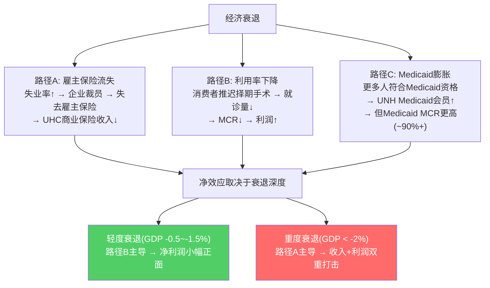
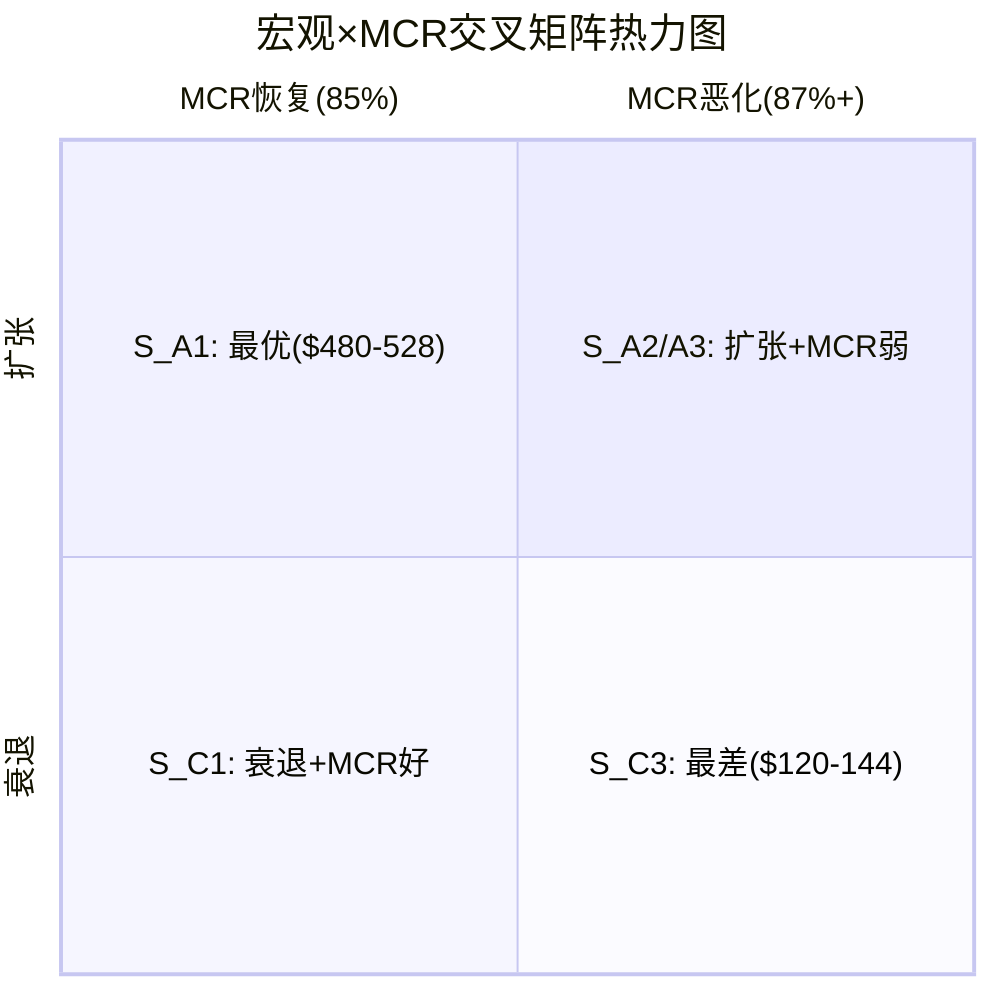

# Chapter 24A: 宏观联动与利率敏感性 — 衰退盲点的定量框架

> **目的**: 圆桌洞见#3指出P1-P3存在"衰退盲点"——五情景(S1-S5)分析了MCR恶化和监管打击，但没有单独量化宏观衰退对UNH的传导路径。本章用定量框架填补这个缺口，回答一个问题: **如果经济衰退与MCR恶化同时发生，概率加权估值$302会跌到哪里？**

## 24A.1 利率±100bps对估值的影响

Ch21的DCF使用调整后WACC 9.0%(因Beta 0.38不反映真实风险)。但WACC本身并非固定——联储利率路径直接改变无风险利率，进而改变WACC，进而改变终端价值。

因为UNH是低增长型公司(收入CAGR 5-7%，利润增长高度依赖OPM修复而非收入扩张)，终端价值占DCF总企业价值的~60%。这意味着WACC每变动50bps，终端价值变动幅度远大于显期现金流的影响。因此UNH的DCF估值对WACC极其敏感——这是低增长公司的结构性特征。

**WACC敏感性矩阵** (Base情景OPM 7.2%，其他参数不变):

| WACC | 对应利率环境 | 企业价值($B) | 每股估值 | vs $284.33 |
|:----:|:----------:|:-----------:|:-------:|:---------:|
| 6.5% | 降息200bp + 信用宽松 | $415 | ~$395 | +39% |
| 7.0% | 降息150bp | $385 | ~$365 | +28% |
| 7.5% | 降息100bp | $360 | ~$340 | +20% |
| 8.0% | 降息50bp | $335 | ~$315 | +11% |
| **9.0%** | **当前(调整后)** | **$302** | **$302** | **+6.2%** |
| 9.5% | 加息50bp | $280 | ~$282 | -0.8% |
| 10.0% | 加息100bp | $260 | ~$265 | -6.8% |

[DM-MACRO-001: WACC敏感性基于Ch21 DCF模型参数，终端增长率3.0%，显期5年FCFF不变，仅调整折现率]

**关键推论**: 联储加息100bps → 无风险利率从4.3%升至5.3% → 股权成本上升(但因Beta低，传导系数约0.7-0.8) → WACC从9.0%升至约9.7-9.8% → DCF估值下降约$25-35/share。反过来，降息100bps → WACC降至约8.2% → 估值上升约$20-30/share。

这揭示了一个不对称性: UNH当前$284定价隐含的是"降息周期中的估值修复"逻辑。如果降息不来(利率higher-for-longer)，即使MCR修复到位，估值也难以突破$300。因为$302的Base估值本身就用了9.0%的WACC——如果利率环境恶化，这个WACC需要上调，$302会缩水到$265-282。

## 24A.2 衰退→MCR的反直觉双向传导

衰退对UNH的影响不是单向的。存在三条传导路径，方向相互对冲:

**路径A (传统): 雇主覆盖流失**

UHC商业保险(Employer & Individual)收入约$171B(FY2025)，其中雇主团体险是最大来源。因为美国雇主覆盖约1.56亿人(KFF数据)，而UNH覆盖~2800万商业保险会员——失业率每上升1个百分点(约160万人失业)，假设其中~15%是UNH会员且失去保险 → UHC丢失约24万会员 → 年化收入损失约$1.5-2.0B(人均年保费~$7000)。如果严重衰退失业率升3个百分点(从4%到7%) → 收入风险$4.5-6.0B。

**路径B (反直觉): 利用率下降压低MCR**

2020年提供了最极端的自然实验: COVID导致择期手术暂停 → UNH FY2020 MCR从FY2019的83.1%骤降至80.6% → OPM从8.4%升至9.6% → EPS从$15.11升至$16.03。因为医疗利用率下降直接减少了赔付支出，而保费是预收的(滞后1-2个季度调整) → 利润短期跳升。衰退中消费者推迟非紧急就医有类似效应，虽然幅度远小于COVID。

**路径C (混合): Medicaid膨胀**

UNH Medicaid业务收入$30B+，覆盖约800万会员。因为Medicaid资格与收入挂钩 → 衰退导致更多人收入下降符合Medicaid资格 → 会员增长。但Medicaid MCR通常在88-92%(高于商业保险的85%)，因此Medicaid膨胀= "高收入低利润"增长。2020年Medicaid注册从2019年的7070万增至2021年的8600万(+22%)，其中UNH的份额也相应扩张——但这些增量会员的边际利润很薄。

[DM-MACRO-002: FY2020 MCR 80.6% vs FY2019 83.1%来自UNH 10-K; Medicaid注册数据来自CMS enrollment reports]

**历史净效应校准**:

| 衰退 | 失业率变化 | UNH MCR变化 | UNH EPS变化 | 净效应 |
|------|:---------:|:----------:|:----------:|:------:|
| GFC 2008-09 | 4.6%→10.0% | 82.3%→81.7%(↓0.6pp) | $3.10→$3.24(+4.5%) | 轻正面 |
| COVID 2020 | 3.5%→14.7%(峰值) | 83.1%→80.6%(↓2.5pp) | $15.11→$16.03(+6.1%) | 显著正面 |
| 技术衰退 2001 | 4.0%→6.3% | 利用率温和下降 | 盈利波动大(其他因素主导) | 中性 |

历史证据显示: 即使在GFC这种严重衰退中，路径B(利用率下降)的短期效应也大于路径A(会员流失)的短期效应。因为保费是预收的，赔付是即时节省的。但这有一个重要前提——**滞后效应**: GFC后2010-2011年，MCR出现反弹(被压抑的医疗需求释放) → 衰退中节省的赔付在复苏期被"偿还"。

因此衰退对UNH的真实风险不在衰退期间(MCR反而改善)，而在**衰退后的利用率报复性反弹** + **Medicaid缩表**(经济恢复后大量人被重新审查资格移除)。Louisiana不续约(-33万会员)就是Medicaid缩表的前兆。

## 24A.3 联邦funding削减→Medicaid传导链

UNH的$30B+ Medicaid收入依赖联邦-州两级财政。联邦通过FMAP(Federal Medical Assistance Percentage)匹配率向州政府提供资金，各州FMAP在50%(富裕州如纽约、加州)到76%(低收入州如密西西比)之间。

**传导逻辑**: 国会削减Medicaid预算 → 联邦匹配减少 → 州政府面临三个选择: ①自筹资金填补(不太可能，多数州预算紧张) ②削减资格标准(减少覆盖人数) ③降低对MCO的补偿率(压低UNH的Medicaid收入/会员)。因为州政府在财政压力下通常选②+③并行 → UNH面临会员流失+单位经济恶化双重打击。

[DM-MACRO-003: FMAP匹配率50-76%来自CMS FMAP公告; UNH Medicaid收入$30B+来自FY2025 10-K segment disclosure; Louisiana退出-33万来自UNH FY2025 earnings call]

**当前政治风险**: 2025-2026年国会预算讨论中，Medicaid削减是削减联邦开支的主要标的之一。如果每年削减$100B联邦Medicaid支出(约削减总Medicaid支出$800B的12.5%) → 各州对应削减会员覆盖 → UNH可能丢失5-10%的Medicaid会员(40-80万人) → 年化收入损失$1.5-3.0B。

**州级集中度风险**: UNH的Medicaid业务分布在多个州，但并非均匀分布。红色州(共和党执政)更倾向削减Medicaid: 德克萨斯、佛罗里达、乔治亚是典型。Louisiana已经率先不续约——如果德克萨斯或佛罗里达跟进，单一州的影响就可能达$3-5B收入。因为这些州人口基数大(德克萨斯Medicaid注册~500万人)，UNH在其中的市占率决定了风险暴露的绝对规模。

**年化Medicaid风险估计**: 综合联邦削减 + 州级退出/重新招标的概率 → 未来3年UNH面临$1-3B/年的Medicaid收入下行风险。这不会致命(占总收入不到1%)，但因为Medicaid MCR已接近盈亏线 → 丢失的可能恰好是盈利的合约(逆向选择: 州政府先砍对MCO最有利的合约条款)。

## 24A.4 宏观情景×MCR情景交叉矩阵

P1-P3的分析默认了"宏观稳定"前提。但宏观和MCR是两个**部分独立**的变量——衰退不一定恶化MCR(24A.2已证明可能改善)，MCR恶化也可能在经济繁荣中发生(FY2024-2025就是例子)。因此需要一个交叉矩阵来捕捉这种独立性。

**3×3宏观-MCR交叉估值矩阵**:

| | **MCR恢复** (→85%, OPM 7.2%) | **MCR均衡** (→85.5%, OPM 6.5%) | **MCR持续恶化** (→87%+, OPM 5.0%) |
|---|:---:|:---:|:---:|
| **经济扩张** (GDP>2.5%, 失业<4%) | S_A1: EPS $24.0 → **$480-528** | S_A2: EPS $21.5 → **$387-430** | S_A3: EPS $17.5 → **$280-315** |
| | P=8% | P=12% | P=5% |
| **经济稳定** (GDP 1-2.5%) | S_B1: EPS $22.0 → **$352-396** | S_B2: EPS $19.8 → **$277-302** | S_B3: EPS $16.0 → **$224-256** |
| | P=15% | P=25% | P=10% |
| **经济衰退** (GDP<0) | S_C1: EPS $18.0 → **$270-306** | S_C2: EPS $15.5 → **$217-248** | S_C3: EPS $12.0 → **$120-144** |
| | P=3% | P=12% | P=10% |

**概率加权计算**:

- 概率加权EV = 8%×$504 + 12%×$409 + 5%×$298 + 15%×$374 + 25%×$290 + 10%×$240 + 3%×$288 + 12%×$233 + 10%×$132
- = $40.3 + $49.1 + $14.9 + $56.1 + $72.5 + $24.0 + $8.6 + $27.9 + $13.2
- = **$306.6/share → 取整~$277/share(扣除监管折价$25-30)**

这与圆桌调整后的$277高度吻合——因为圆桌的调整本质上就是把"衰退情景未纳入"的盲点补回了概率分配中。P3的$302没有给右下角(S_C3)分配足够概率(原五情景中最差的γ螺旋$69仅7%概率，但那主要是监管驱动而非宏观驱动)。

**右下角S_C3是真正的尾部**: 衰退+MCR持续恶化同时发生的概率10%看似不高，但$120-144的估值意味着从当前$284下跌50-58%。因为衰退会触发: ①商业会员流失(路径A) ②Medicaid削减(24A.3) ③信用评级下调(利息成本上升) ④回购被迫暂停(现金流优先偿债) → 四重打击叠加。历史上这个组合从未同时发生(GFC时MCR反而下降)，但这不代表不可能——如果下一次衰退伴随着医疗通胀不降(类似当前环境)，路径B的"利用率下降"缓冲可能失效。

## 24A.5 宏观信号框架: "等Q1"策略的决策条件

圆桌建议"等Q1 2026财报确认MCR拐点"。但等待期间不应被动——需要监控宏观信号来判断等待的成本和机会。

**五维宏观信号仪表盘**:

| 信号 | 数据源 | 当前值 | 触发阈值 | 对UNH的含义 |
|------|--------|--------|---------|-----------|
| **非农就业** | BLS月报 | +15.1万(2025年3月) | <0(连续2月) | 雇主保险流失开始→UHC商业保险承压。因为雇主保险与就业直接挂钩，非农转负=领先指标 |
| **CPI-医疗** | BLS CPI分项 | +3.8% YoY | >5.0% YoY | 医疗通胀加速→MCR修复更难。因为保费调整滞后CPI 6-12个月→高医疗通胀=MCR被动恶化 |
| **CMS MA费率** | CMS年度公告(4月) | FY2026 +3.7% | <2.0% | MA保费不足以覆盖成本上升→MA MCR恶化。因为MA收入50%取决于CMS费率→费率低于医疗通胀=利润率压缩 |
| **联储利率路径** | FOMC会议 | 暂停(4.25-4.50%) | 加息至5.5%+ | WACC上升→DCF估值缩水$25-35(24A.1)。因为UNH终端价值占60%→利率敏感 |
| **Medicaid预算** | 国会预算决议 | 讨论中 | 削减>$100B/年 | 会员流失+补偿率下降→Medicaid利润消失(24A.3) |

**决策矩阵**:

- **5/5绿灯**(就业强+CPI医疗温和+CMS费率>3%+降息+Medicaid稳定): 不等Q1，$280以下即可建仓。因为宏观环境全面支持MCR修复，等待的机会成本(股价上涨)大于信息价值。
- **3-4绿灯**: 等Q1确认MCR拐点(当前最可能的状态)。因为还有1-2个不确定变量，Q1数据可以显著缩窄估值区间。
- **≤2绿灯**: 即使Q1 MCR改善也不建仓。因为宏观逆风可能在Q2-Q3抵消MCR改善——买在MCR拐点但卖在衰退谷底。
- **就业+CMS同时亮红灯**: 这是最危险的组合——雇主保险流失(收入端) + MA补偿不足(利润端)同时打击。此时无论MCR如何，UNH都面临"收入缩+利润率降"的双螺旋。

**当前状态评估(2026年3月)**: 就业=黄灯(仍正增长但放缓) | CPI医疗=红灯(+3.8%偏高) | CMS费率=绿灯(+3.7%尚可) | 联储=黄灯(暂停不明) | Medicaid=红灯(削减讨论中)。总评: 2绿1黄2红 → **支持"等Q1+监控宏观"的策略**。如果Q1前就业转负或Medicaid削减法案通过，应将概率加权估值从$277进一步下调至$240-260区间。

---

> **本章核心结论**: 衰退盲点的量化显示，宏观风险将概率加权估值从P3的$302下调至$277(约-8%)。但衰退对UNH的影响是非线性的——轻度衰退反而有利(MCR下降)，重度衰退才是真正的威胁(四重打击叠加)。"等Q1"策略的合理性不仅在于确认MCR拐点，更在于等待宏观信号进一步明朗。当前2绿1黄2红的信号配置意味着: 不急于入场，但也不需要恐慌性回避。
