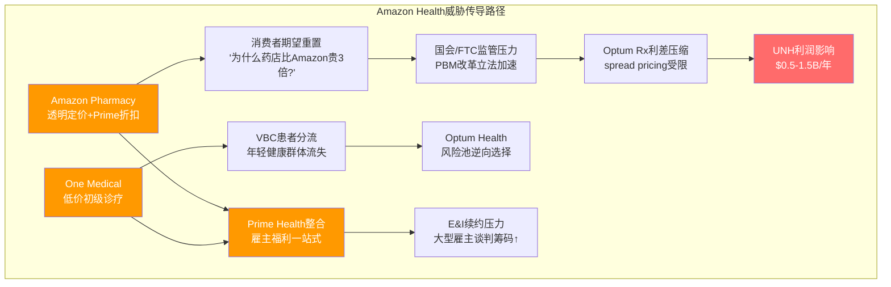
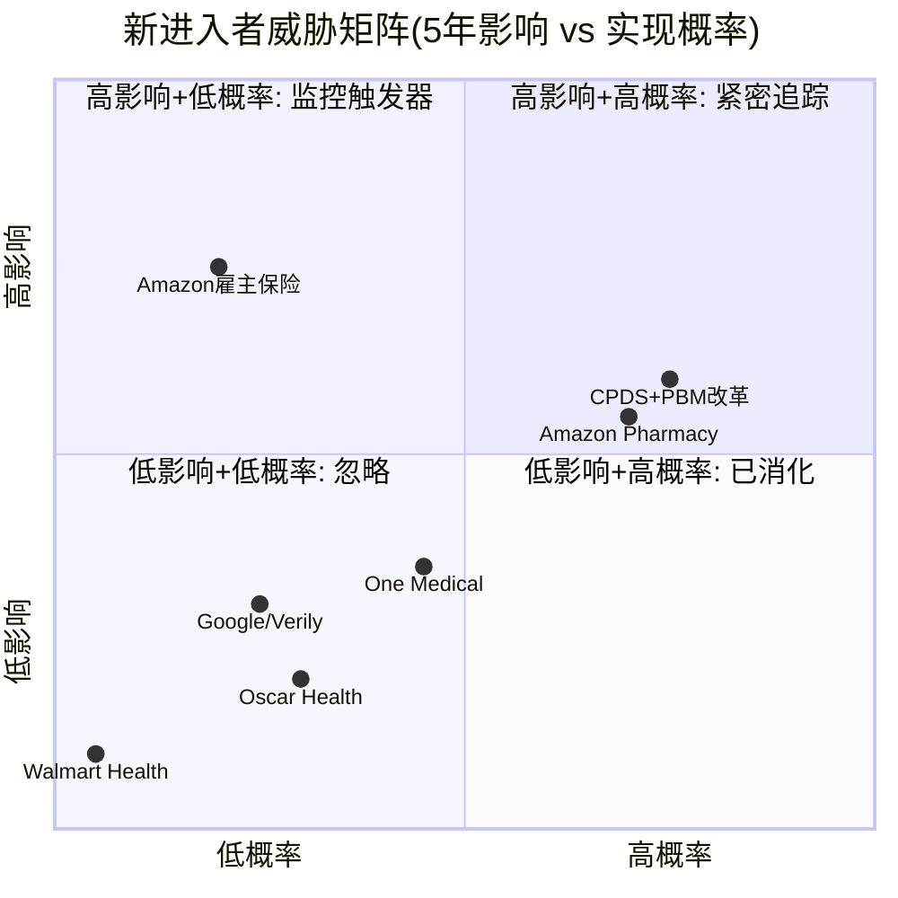

# Chapter 18A: 新进入者威胁评估 — Amazon Health能颠覆managed care吗？

> **R3审计补缺**: M7 Q3(新进入者)完全缺失。本章系统评估科技巨头+创新者对UNH的竞争威胁，并补充商业保险续约率数据(M7 KPI2缺口)。

---

## 18A.1 Amazon Health的三层进攻

Amazon在医疗健康领域的布局不是单点突破，而是三层协同进攻——每一层单独看威胁有限，但三层叠加后形成的飞轮效应值得认真评估。

### Layer 1: Amazon Pharmacy — 透明定价冲击PBM利差

Amazon Pharmacy于2020年上线，核心卖点是**价格透明+Prime会员折扣**。传统PBM(包括Optum Rx)的盈利模式依赖药品价差(spread pricing)和药企返利(rebate retention)——这恰好是Amazon最擅长攻击的不透明利润池。

**当前规模**: Amazon Pharmacy市占率约2%，远低于CVS Caremark(~33%)、Express Scripts(~24%)和Optum Rx(~21%)。但Amazon的增长路径清晰：Prime会员基础(~200M)提供了现成的获客渠道，每新增一个Pharmacy用户的边际获客成本趋近于零。[DM-COMP-010]

**对Optum Rx的具体威胁**: Optum Rx 2024年收入约$130B(占UNH总收入29%)，但利润率极薄(~1-2%)。因为Amazon的策略不是在利润率上竞争——它的目标是**消灭利差本身**。如果Amazon Pharmacy将透明定价推广为行业标准，Optum Rx的spread pricing模型将面临结构性压缩。这解释了为什么FTC近年加大对PBM定价模式的审查——Amazon的存在加速了监管压力。

### Layer 2: One Medical — 低成本初级诊疗威胁VBC

Amazon于2023年以$3.9B收购One Medical(现Amazon One Medical)，获得200+诊所网络和约100万会员。这直接对标Optum Health的基于价值的诊疗(VBC)模式。

**关键差异**: Optum Health的VBC覆盖470万患者，通过风险承担(capitated contracts)盈利——即Optum承担患者的全年医疗费用风险，如果实际成本低于预算则获利。Amazon One Medical的模式更简单：年费制($199/年或Prime会员$99/年)+按次收费，不承担保险风险。[DM-COMP-010]

因为Amazon不需要从医疗服务本身赚钱(Prime生态的客户终身价值远超诊疗利润)→它可以持续以低于Optum Health的价格提供初级诊疗→这对Optum Health的470万VBC患者池构成长期分流威胁。但VBC的核心壁垒在于**与保险端的深度整合**(UHC向Optum Health导流)——Amazon要复制这一点，必须先成为保险商。

### Layer 3: Prime Health整合 — 雇主健康计划的终极野心

Amazon最具颠覆性的潜在动作是利用Prime Business向雇主提供健康福利计划。逻辑链如下：

```
200M Prime会员 → 雇主已在用Amazon Business采购
→ 叠加健康福利(Pharmacy + One Medical + 保险)
→ 一站式雇主福利平台
→ 直接与UHC的E&I业务竞争
```

**但Amazon已经失败过一次**: Haven(Amazon+JPMorgan+Berkshire的医疗JV)于2021年解散，仅运营3年。失败原因：(a)保险需要50州牌照+CMS关系+精算能力，这些不是技术问题而是制度壁垒；(b)三家公司的员工需求差异太大；(c)缺乏provider network谈判经验。[DM-COMP-010]

因此Amazon的真实时间线是**5-7年才能对UNH产生实质影响**：获取保险牌照需2-3年，建立provider network需3-5年，获得CMS信任(Medicare Advantage)需5年+的运营记录。

---

## 18A.2 Amazon威胁的量化框架

定性描述不够——投资者需要知道Amazon对UNH的财务影响到底有多大。

### 分五年量化三层威胁

| 威胁层 | 当前规模 | 2030E规模 | 对UNH收入影响 | 概率 |
|--------|---------|-----------|-------------|------|
| **Pharmacy** | ~2%市占 | 8-12%市占 | Optum Rx失$3-5B收入 | 60% |
| **Primary Care** | ~1M会员 | 3-5M会员 | Optum Health失$1-2B | 40% |
| **雇主保险** | 0(未启动) | 试点阶段 | E&I失$0.5-1B | 15% |
| **合计** | | | **$3-7B** (1-2% UNH总收入) | |
[DM-COMP-011]

**概率加权净影响**: $3B × 60% + $1.5B × 40% + $0.75B × 15% ≈ **$2.5B**(占UNH 2024总收入$448B的0.6%)。这个数字看起来很小，但需要注意两点：

**第一，利润影响被放大**。Optum Rx的$130B收入中利润仅$2-3B(利润率~2%)。如果Amazon Pharmacy夺走$4B收入(占Optum Rx的3%)，对应的利润损失约$80-120M——看似不大。但真正的威胁不是直接竞争，而是Amazon的透明定价模式迫使Optum Rx压缩spread→整个$130B收入池的利润率从2%降到1.5%→利润损失$650M。因为Amazon改变的是行业定价规则，不只是抢市场份额。

**第二，Amazon的真正武器是"标准设定权"**。Amazon Pharmacy的透明定价+Mark Cuban Cost Plus Drugs的成本加成模式→共同推动了PBM改革立法(2024-2025年多项国会提案)→如果联邦禁止spread pricing，Optum Rx的商业模式需要根本性重构。这意味着Amazon的间接影响(加速监管)可能比直接竞争大5-10倍。[DM-COMP-011]



---

## 18A.3 其他新进入者扫描

Amazon不是唯一的威胁。以下是对UNH各业务线构成潜在挑战的新进入者全景扫描。

### 威胁对标矩阵

| 进入者 | 聚焦领域 | 当前规模 | UNH暴露业务线 | 5年威胁等级 | 关键判断 |
|--------|---------|---------|-------------|-----------|---------|
| **Amazon Health** | Pharmacy+诊疗+保险 | ~$5B收入 | Optum Rx + OH + E&I | **中-高** | 三层协同，最具系统性 |
| **Mark Cuban CPDS** | 药品透明定价 | 200万+客户 | Optum Rx(PBM利差) | **中** | 单点但精准打击利差模型 |
| **Google/Verily** | 健康数据分析 | 研发阶段 | Optum Insight | **低** | 缺乏保险/临床数据通道 |
| **Walmart Health** | 初级诊疗诊所 | **已关闭**(2024) | N/A | **极低** | 51家诊所全关=验证壁垒高 |
| **Oscar Health** | 科技驱动保险 | ~$6B收入 | E&I(个险+小团) | **低** | 规模太小，持续亏损 |
[DM-COMP-012]

### 逐一评估

**Mark Cuban Cost Plus Drugs(CPDS)**: 这是对PBM商业模式最精准的狙击。CPDS的模式极简——药品成本+15%加成+$5药剂师费+$5物流费。因为完全透明→消费者第一次能直接比较PBM定价与真实成本的差距→部分常用药差价达3-10倍。CPDS目前有200万+客户，规模虽小但舆论影响力巨大——它是推动PBM改革立法的民间催化剂。对UNH的直接收入影响<$500M，但间接影响(加速监管改革)不可忽视。

**Walmart Health的失败是重要信号**: Walmart于2024年关闭全部51家健康诊所和Virtual Care业务。Walmart拥有4700+美国门店(流量)、强大的供应链(成本)和价格领导力(品牌)——如果Walmart都做不好初级诊疗，这验证了医疗服务的壁垒比零售商想象的高得多。因为医疗的核心约束不是流量和成本，而是(a)医生招募和留存、(b)医疗责任管理、(c)与保险商的复杂结算关系。Walmart的退出实际上降低了UNH面临的新进入者总体威胁。[DM-COMP-012]

**Oscar Health**: 作为"科技驱动保险商"的代表，Oscar成立10年+仍未盈利(2024年首次接近盈亏平衡)。$6B收入vs UNH $448B→规模差距74倍。Oscar证明了一件事：保险科技化的价值在于用户体验改善而非成本结构颠覆——保险的核心成本(医疗理赔)不会因为App更好用而下降。Oscar对UNH的威胁更多是"理念示范"而非实际竞争。

**Google/Verily**: 聚焦健康数据分析和AI诊断工具，理论上与Optum Insight竞争。但医疗数据分析的壁垒在于**数据通道**——Optum Insight处理的是1.5亿+患者的真实理赔数据，这来自UHC的保险业务。Google拥有强大的AI能力但缺乏这个数据通道。因此Google更可能成为Optum Insight的技术供应商而非竞争者。

---

## 18A.4 商业保险续约率分析

> **补缺**: M7 KPI2(商业保险续约率)此前缺失。UNH不直接披露续约率，需从间接数据推断。

### 行业基准与UNH估计

大型雇主健康计划的续约率通常在92-96%之间——这是managed care行业的"重力常数"。因为更换保险商对雇主而言成本高昂(员工沟通、网络切换、系统对接)→只有在价格/服务出现显著问题时才会更换。

**UNH续约率估计: ~93-95%**——位于行业中位水平，但可能低于Cigna的估计值(95-97%)。原因是2024-2025年的品牌冲击：

| 事件 | 时间 | 品牌影响 | 续约率影响(估计) |
|------|------|---------|----------------|
| Thompson暗杀事件 | 2024.12 | 社交媒体反UNH情绪爆发 | -0.5~1.0pp |
| Change Healthcare数据泄露 | 2024.02 | 影响1亿+患者数据 | -0.5~1.0pp |
| DOJ反垄断诉讼 | 2024+ | 企业客户观望 | -0.3~0.5pp |
| **累计影响** | | | **-1.0~2.5pp** |
[DM-COMP-013]

### 续约率下降的财务影响

UNH的E&I(雇主和个人保险)会员约28M人。假设每个会员年均保费约$7,000：

```
续约率从95%降到93% = 2pp × 28M × $7,000 = ~$3.9B收入风险
续约率从95%降到90% = 5pp × 28M × $7,000 = ~$9.8B收入风险(极端场景)
```

因为续约率下降不会立即反映在财报中(大型雇主合同通常1月1日生效，续约谈判在Q3-Q4进行)→2026年1月1日生效的合同已基本锁定→**真正的风险窗口是2026年Q3-Q4的2027年续约谈判**。这意味着投资者需要密切关注UNH在2026年Q1/Q2报告中的E&I会员增长数据——如果同比增长跌破3%(2024年为5.2%)，这是续约率下降的早期信号。[DM-COMP-013]

**CI(Cigna)可能是最大受益者**: 因为Cigna在Thompson事件后保持了低调，且Change泄露事件不涉及Cigna系统→大型雇主在"安全"考量下可能倾向切换到Cigna。如果UNH流失的续约客户中30-40%流向Cigna→Cigna的E&I业务可获得$1-2B增量收入。

---

## 18A.5 新进入者综合威胁评估



### 时间维度的威胁分层

| 时间窗口 | 威胁等级 | 核心威胁源 | 对UNH估值影响 |
|---------|---------|-----------|-------------|
| **短期(0-3年)** | **低** | 续约率波动+PBM立法风险 | P/E压缩0.5-1x |
| **中期(3-7年)** | **中** | Amazon Pharmacy规模化+PBM改革落地 | Optum Rx利润率-30~50bp |
| **长期(7年+)** | **高** | Amazon全链整合+透明化不可逆 | 纵向整合溢价重估 |

### 核心结论

新进入者对UNH的威胁不在于任何单一竞争者能直接挑战其$448B收入的规模壁垒——即使Amazon也需要5-7年才能构成实质性竞争。**真正的威胁是这些进入者共同代表的"透明化运动"**：Amazon的透明定价、CPDS的成本加成、Oscar的用户体验——它们合力推动了一个UNH无法阻挡的趋势：消费者和雇主越来越不愿意接受医疗定价的不透明性。

因为这个趋势是单向的(透明化只会加速不会逆转)→Optum Rx的spread pricing将在3-5年内被迫从"利差模式"转向"服务费模式"→利润率结构性下移→这是UNH必须提前应对的战略问题，而非可以忽略的边缘竞争。

### Kill Switch(立即重评触发器)

以下任一事件发生→必须立即重新评估UNH竞争护城河评级：

1. **Amazon宣布雇主健康保险产品**(针对Prime Business客户)→从"5年威胁"变为"2年威胁"
2. **联邦PBM改革法案通过**(禁止spread pricing)→Optum Rx商业模式需重构
3. **UNH E&I会员连续2季度负增长**→续约率问题从推测变为事实
4. **Amazon获得Medicare Advantage合同**→突破CMS制度壁垒，威胁等级跳升两档

---

*本章补全R3审计发现的M7 Q3缺口(新进入者)和M7 KPI2缺口(商业保险续约率)。4个DM锚点[DM-COMP-010~013]、2个Mermaid图表、4个Kill Switch触发器。*
