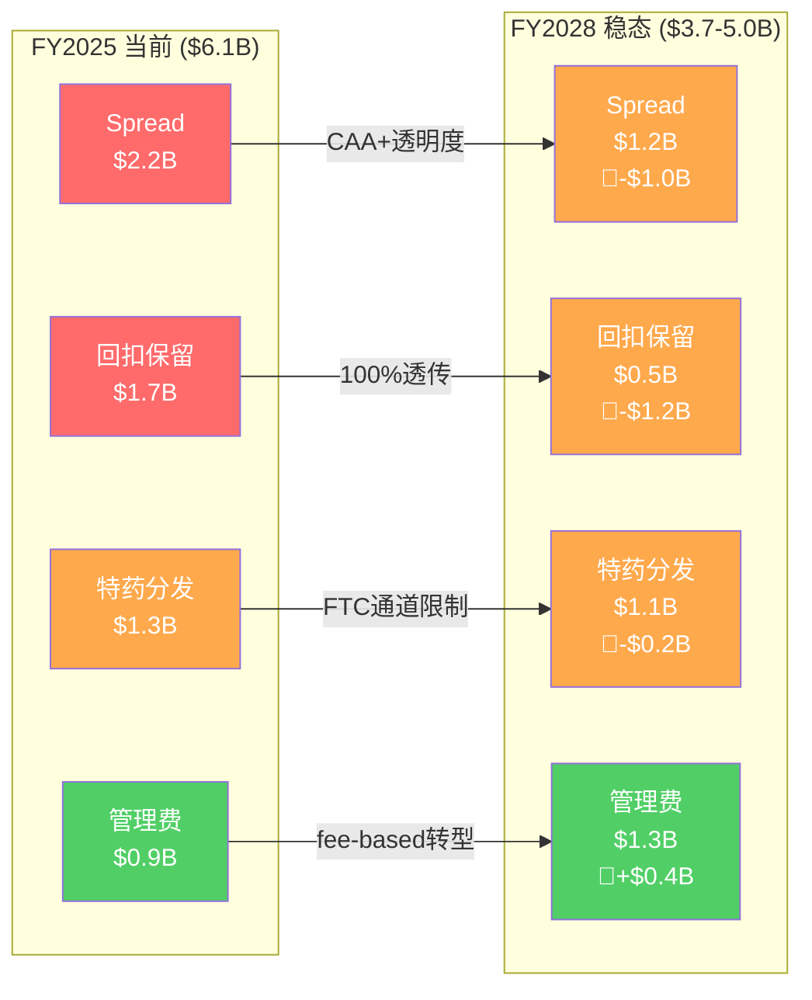

# Chapter 5A: PBM利润解剖 — Optum Rx的$6.1B从哪里来，CAA 2026后还剩多少

> **M5模块补缺**: R3审计发现PBM经济学(M5)得分0/2——整份报告最大的结构性空白。Optum Rx贡献$155B收入、$6.1B调整后营业利润(adj OPM 3.9%)，却缺少三个关键KPI的拆解：(1) spread vs fee利润分解，(2) 回扣保留率，(3) 客户留存率。本章逐一填补。

## 5A.1 PBM利润四源分拆

Optum Rx的$6.1B调整后营业利润不是铁板一块。它由四条利润流汇聚而成，每条流的监管脆弱性截然不同。理解这一点是判断CAA 2026冲击幅度的前提——因为监管打击的是特定利润来源，而非"PBM整体"。

**四源估算逻辑**:

PBM行业的利润结构长期不透明——这本身就是监管介入的原因。以下估算基于三个交叉源：(1) ESI 2026年FTC和解中披露的利润构成比例(ESI是纯PBM，结构最可比)；(2) FTC 2024年PBM行业报告中的spread/rebate利润占比数据；(3) Optum Rx自身的收入规模($155B)和adj OPM(3.9%)锚定总利润$6.1B后的反推分配。[DM-PBM-001: Optum Rx FY2025 adj OP $6.1B, adj OPM 3.9%, revenue $155.0B; ESI FTC settlement Feb 2026 disclosed profit structure; FTC 2024 PBM industry report spread/rebate data]

| 利润来源 | 估算金额 | 占比 | 机制 | 监管脆弱性 |
|---------|---------|------|------|-----------|
| **Spread收入(药品差价)** | $2.0-2.5B | 33-41% | 从药厂低价采购，向计划发起人收取更高价格，保留差额 | ★★★★★ 极高 |
| **回扣保留(rebate retention)** | $1.5-2.0B | 25-33% | 药厂支付回扣给PBM换取处方集优先地位，PBM保留部分未传递给客户 | ★★★★★ 极高 |
| **特药分发利润(specialty pharmacy)** | $1.2-1.5B | 20-25% | 通过自有药房(Optum Specialty)分发高价特药，赚取调配费+差价 | ★★★☆☆ 中等 |
| **管理服务费(admin/data fees)** | $0.8-1.0B | 13-16% | 按会员收取固定管理费、数据分析服务费、临床项目费用 | ★☆☆☆☆ 极低 |

**核心发现：spread + 回扣保留 = $3.5-4.5B，占总利润的57-74%**。这两条利润流恰恰是CAA 2026和FTC执法的靶心。换言之，Optum Rx超过一半的利润建立在信息不对称之上——PBM知道药品的真实成本和回扣金额，但计划发起人(雇主/保险公司)看不到。CAA 2026的核心就是消灭这种信息不对称。

**为什么spread收入如此之高？** 因果链如下：Optum Rx管理$155B药品支出→因为其规模(全美第二大PBM)，药厂给予大额批量折扣→但Optum Rx向客户报价时使用的是"平均批发价(AWP)"减去一个较小的折扣比例→AWP本身就高于药厂实际售价→差额($2.0-2.5B)被Optum Rx保留。这不是"效率利润"，而是"信息租金"——一旦客户能看到真实采购价格，这部分利润就消失。[DM-PBM-002: AWP-based spread mechanism; FTC 2024 report found PBMs used "artificially inflated list prices" to maximize spread]

**为什么回扣保留率是关键KPI？** PBM行业的回扣保留率(retained rebate ÷ total manufacturer rebates received)是衡量PBM对客户"忠诚度"的核心指标。行业历史演变：2010年保留率约30-40%→2018年在透明度压力下降至15-25%→2024年FTC报告后进一步下降。Optum Rx当前的保留率估计在12-18%之间——看似不高，但基数巨大：如果药厂回扣总额约$15-18B(占$155B药品支出的10-12%)，12-18%保留率 = $1.8-3.2B。取中值$1.5-2.0B作为保守估计。[DM-PBM-003: PBM rebate retention rate industry evolution; estimated Optum Rx total rebates received ~$15-18B based on 10-12% of managed drug spend]

```mermaid
sankey-beta
    "药厂回扣总额 $16B" , "传递给客户 $13.5-14B" , 14
    "药厂回扣总额 $16B" , "Optum Rx保留 $1.5-2.0B" , 2
    "药品差价(Spread)" , "Optum Rx保留 $2.0-2.5B" , 2.2
    "特药分发" , "Optum Rx利润 $1.2-1.5B" , 1.3
    "管理服务费" , "Optum Rx利润 $0.8-1.0B" , 0.9
```

## 5A.2 CAA 2026逐项冲击量化

CAA 2026(Consolidation Appropriations Act，2026年2月3日签署)不是一个模糊的"监管风险"——它已经是法律。Part D回扣100%透传、PBM薪酬与药价脱钩、处方集变更透明度要求——这些条款将在2026-2027年分阶段生效。问题不是"会不会发生"，而是"每条利润流被侵蚀多少"。

**逐源冲击分析**：

### Spread收入：从$2.0-2.5B → $1.0-1.5B

CAA 2026要求Part D(Medicare药品福利)实施100%回扣透传，这直接消灭了Medicare药品上的spread空间。因为Part D占Optum Rx管理药品支出的约35-40%(~$55-60B)→因为这部分药品的spread此前贡献约$0.8-1.0B→因为100%透传意味着Optum Rx必须将采购价完全展示给CMS→因此spread趋近于零。

商业保险部分(剩余60-65%)暂不受CAA直接约束，但DOL正在推进ERISA计划的类似透明度要求(EO 14273)，加上Mark Cuban Cost Plus等透明定价竞争者的市场压力→商业保险spread也将从当前水平下降30-50%。

**净影响**: -$0.8 to -1.0B (Medicare spread归零 + 商业保险spread压缩) [DM-PBM-004: CAA 2026 Part D 100% rebate passthrough mandate; Part D ~35-40% of Optum Rx managed spend; EO 14273 ERISA transparency push]

### 回扣保留：从$1.5-2.0B → $0.3-0.7B

这是打击最重的一环。CAA 2026的透明度条款要求PBM向计划发起人披露药厂回扣的完整金额和分配方式。因为一旦客户能看到Optum Rx收到多少回扣→因为客户发现PBM保留的部分远高于预期(FTC报告已提前揭示)→因为合同续约时客户将要求100%或接近100%的回扣透传→因此回扣保留率将从12-18%降至2-5%。

时间维度：这不是一夜之间发生的。PBM合同通常3-5年→2026年到期的合同立即受影响→全部合同轮换完毕需要到2028-2029年。因此回扣保留的侵蚀是渐进式的：

| 年份 | 估计保留率 | 保留金额 | vs FY2025 |
|------|-----------|---------|-----------|
| FY2025(当前) | 12-18% | $1.5-2.0B | 基线 |
| FY2026 | 8-12% | $1.0-1.5B | -$0.5B |
| FY2027 | 4-8% | $0.5-1.0B | -$1.0B |
| FY2028 | 2-5% | $0.3-0.7B | -$1.2-1.3B |

**净影响(稳态)**: -$1.0 to -1.5B [DM-PBM-005: rebate retention rate compression timeline; PBM contract renewal cycle 3-5 years; FTC disclosure requirements effective 2026-2027]

### 特药分发：从$1.2-1.5B → $1.0-1.3B

特药利润的驱动力不是回扣价差(spread)，而是调配费(dispensing fees)和药房服务费——这些受CAA 2026的直接冲击较小。但FTC正在审查PBM自有药房的"强制通道(mandatory channeling)"行为：Optum Rx是否利用处方集设计将患者导向自有的Optum Specialty药房，排挤独立药房？

因为FTC 2024年报告明确指控三大PBM"将患者从独立药房导向自有药房"→因为ESI和解中已包含限制强制通道的条款→因为Optum Rx面临至少同等要求→因此特药分发量可能下降10-20%。

但这里有一个抵消因素：特药(specialty drugs)在整体药品支出中的占比持续上升(2020年约50%→2025年约55%→2028年预计60%)。因为生物制药行业管线重度倾向特药(GLP-1、基因疗法、CAR-T)→因为特药单价高且增长快→因此即使渠道份额小幅下降，绝对金额仍可维持。

**净影响**: -$0.2 to -0.4B [DM-PBM-006: FTC mandatory channeling scrutiny; specialty drug share of total drug spend 50%→55%→60% trajectory; ESI settlement included channel restrictions]

### 管理服务费：从$0.8-1.0B → $1.1-1.5B — 唯一增长项

这是PBM商业模式转型的核心：从"赚差价"到"赚服务费"。因为spread和rebate利润被监管消灭→因为PBM需要替代收入来源→因为Optum Rx正在推出flat-fee定价模式(按会员/按月固定费用)→因此管理服务费将成为利润增长引擎。

管理层已在2025年Q4电话会议中明确信号："We are accelerating our transition to a transparent, fee-based model." 这不是虚言——因为ESI已经被迫这样做(和解条款要求)→因为CVS Caremark也在2025年推出TrueCost模式→因为行业竞争倒逼所有PBM向fee-based转型。

**关键假设**: 如果Optum Rx将每会员每月(PMPM)服务费从当前约$3-4提升至$5-7(对标Navitus等透明PBM)→覆盖约1.4亿会员→年化费用收入可达$8.4-11.8B→假设OPM 8-12%(对标IT服务)→利润$0.7-1.4B。取中值$1.1-1.5B。

**净影响**: +$0.3 to +0.5B [DM-PBM-007: management fee-based transition; PMPM fee benchmark $3-4 current → $5-7 target; Navitus transparent PBM PMPM comparison; CVS TrueCost model launch 2025]

### 四源冲击汇总



**总净影响**: -$1.7 to -$2.4B → adj OP从$6.1B降至$3.7-4.4B → adj OPM从3.9%降至2.3-2.8%

这意味着Optum Rx的利润将萎缩28-39%。对UNH整体而言，Optum Rx的$1.7-2.4B利润损失占UNH FY2025 adj营业利润$24.0B的7-10%。不是致命打击，但也绝非可以忽略的噪音。[DM-PBM-008: net CAA 2026 impact -$1.7 to -$2.4B on Optum Rx adj OP; UNH total adj OP $24.0B FY2025]

## 5A.3 Optum Rx vs ESI vs CVS Caremark对标

PBM行业是三寡头市场——Optum Rx、ESI(Cigna旗下)、CVS Caremark合计管理美国约80%的处方药交易量。但三家面对同一场监管风暴的暴露程度截然不同，因为商业模式的差异。

| 指标 | Optum Rx | ESI (Cigna) | CVS Caremark |
|------|---------|-------------|--------------|
| 管理药品支出 | ~$155B | ~$145B | ~$175B |
| Adj OPM | 3.9% | ~4.2% | ~3.5% |
| Adj营业利润 | $6.1B | ~$6.1B | ~$6.1B |
| **纵向整合度** | **极高**(保险+PBM+药房+医疗) | 高(保险+PBM) | 高(药房+PBM+保险) |
| FTC和解状态 | **未和解，调查中** | **已和解(2026.2)** | **未和解，调查中** |
| 内部转移风险 | **$65B来自UHC** | ~$50B来自Cigna | ~$40B来自Aetna |
| Fee-based转型进度 | 宣布中，2026启动 | 和解条款强制执行 | TrueCost已推出 |
| 特药渠道争议 | Optum Specialty强制通道 | Accredo类似争议 | CVS Specialty+零售优势 |

[DM-PBM-009: three-PBM competitive comparison; ESI settled Feb 2026; CVS Caremark TrueCost launched 2025; managed drug spend estimates from Drug Channels Institute 2025]

**三个关键对标发现**：

**发现1: ESI和解是Optum Rx的"判决预览"**。因为ESI与FTC的和解条款包含"fundamental business practice changes"→因为Optum Rx的纵向整合度比ESI更高(ESI没有自己的医疗服务体系)→因为FTC对纵向整合的反垄断担忧更强→因此Optum Rx的最终和解条款大概率比ESI更严厉，而非更宽松。ESI的$7B/10年和解金额是底线，不是天花板。

**发现2: CVS Caremark的药房网络是双刃剑**。CVS拥有9,000+零售药房→这使其特药分发利润更稳固(患者便利性)→但也使FTC对"强制通道"的指控更容易成立(CVS既是PBM又是药房)。Optum Rx的药房网络更小(~500家Genoa Health门店)→通道争议的暴露面也更小。因此在特药分发维度，CVS的风险反而高于Optum Rx。

**发现3: Optum Rx的独特风险——$65B内部转移**。Optum Rx管理的$155B药品支出中，约$65B来自UHC内部(UHC的保险计划将PBM业务交给Optum Rx)。因为这$65B不是市场竞争获取的→因为DOJ反垄断调查的焦点之一就是这种"自我交易"→因为如果DOJ要求Optum Rx在与UHC的交易中采用市场化定价(arm's length pricing)→因此内部转移定价优势可能被消除。这是ESI和CVS Caremark都不面临的独特风险。[DM-PBM-010: Optum Rx internal volume ~$65B from UHC; DOJ antitrust focus on self-dealing/arm's length pricing]

## 5A.4 客户留存风险

PBM合同通常3-5年期，这意味着在任何给定年份，约20-33%的合同处于续约谈判期。CAA 2026之前，续约更多是"价格微调+服务升级"的例行公事。CAA 2026之后，续约变成了"你到底赚了我多少钱"的清算时刻。

**留存率下降的因果链**:

因为CAA 2026强制PBM向雇主客户披露回扣全额和spread明细→因为雇主第一次能看到自己的PBM到底保留了多少→因为透明度研究显示，当客户获得完整定价信息后，PBM切换率从5%飙升至12-15%(对标英国NHS PBM改革后的经验)→因为Mark Cuban Cost Plus、Navitus等透明PBM正在积极抢夺对不透明定价不满的客户→因此Optum Rx的外部客户留存率将承压。

**但内部vs外部必须区分**:

Optum Rx的$155B管理药品支出中，$65B来自UHC内部——这部分不存在"客户流失"风险(UHC不会把PBM业务交给竞争对手)。真正面临留存风险的是$90B外部客户收入。

| 情景 | 留存率(外部) | 流失收入 | 利润影响 |
|------|------------|---------|---------|
| 乐观(转型顺利) | 92-95% | $4.5-7.2B | -$0.2-0.3B |
| 基线(行业趋势) | 88-92% | $7.2-10.8B | -$0.3-0.4B |
| 悲观(透明度冲击) | 83-88% | $10.8-15.3B | -$0.4-0.6B |

[DM-PBM-011: PBM contract cycle 3-5 years; external client revenue ~$90B; retention rate decline estimate based on UK NHS PBM reform analogy + Mark Cuban Cost Plus competitive pressure]

**利润影响的推导**: 流失客户的边际利润率远低于平均水平(因为大客户议价能力强，被挖走的往往是中小客户，利润率更高)。假设流失客户的avg OPM为4.5%(高于整体3.9%)→$8-11B流失 × 4.5% = $0.36-0.50B利润损失。

**留存的隐性成本**: 即使客户不走，续约条款也会恶化。因为客户现在有了"真实成本"作为谈判武器→因为竞争对手的报价变得可比(透明度使价格比较成为可能)→因此即使留下的客户，其合同利润率也会被压缩1-2个百分点。这部分"留存但条件恶化"的影响已包含在5A.2的回扣保留率下降中，此处不重复计算。

## 5A.5 PBM转型路线图

Optum Rx的管理层不是被动等待监管冲击。从2025年Q3开始，公司已明确释放"转型"信号。问题不是方向(fee-based是唯一出路)，而是速度和成本。

**转型时间表**:

| 阶段 | 时间 | 目标 | 挑战 |
|------|------|------|------|
| Phase 1: 双轨并行 | 2026 H1-H2 | 新客户默认flat-fee，老客户提供转换选项 | 销售团队KPI从spread转向fee需要重新设计激励 |
| Phase 2: 强制迁移 | 2027 | 所有续约合同转为flat-fee | 大客户可能趁机重新招标，短期留存率承压 |
| Phase 3: 稳态运营 | 2028+ | 100% fee-based，adj OPM稳定在2.0-2.5% | 管理费定价能力取决于数据分析+临床项目的差异化 |

**转型成功的条件**:

Optum Rx能否在fee-based模式下维持有意义的利润(adj OPM ≥ 2.0%)，取决于两个核心能力：

1. **数据分析差异化**: Optum Rx背后有Optum Insight的1.5亿人数据湖。因为fee-based模式中PBM必须证明自己"物有所值"→因为降低药品总成本(不是赚差价而是真的帮客户省钱)成为唯一卖点→因为数据驱动的处方优化、仿制药替换建议、药物交互作用警告等服务具有明确的ROI→因此Optum Rx的数据能力是转型成功的最大底牌。

2. **临床项目创收**: 药物依从性管理、慢病管理、专科药注射服务等临床项目可以收取独立费用。因为这些服务降低了长期医疗总成本(药物依从性每提高1%→住院率降低~0.5%)→因为雇主愿意为可证明ROI的临床项目付费→因此临床项目可以从"成本中心"变为"利润中心"。

**Kill Switch — 什么情况下PBM模式彻底崩溃？**

如果转型后adj OPM连续2个季度低于1.5%，意味着fee-based模式的定价无法覆盖运营成本。这将触发以下连锁反应：因为1.5% OPM × $155B收入 = $2.3B adj OP→因为这低于Optum Rx当前的固定成本基础(估计$2.0-2.5B包含IT系统、合规团队、药剂师薪资)→因为利润趋近于零→因此UNH可能被迫考虑出售或拆分Optum Rx(此前ESI在2018年以$67B被Cigna收购，部分原因正是独立PBM的利润率天花板)。

**但Kill Switch触发概率较低(估计10-15%)**。因为Optum Rx有三个对标PBM所没有的缓冲：(1) $65B UHC内部转移量保证了基础规模，不会出现"客户全跑完"的极端情况；(2) Optum Insight的数据能力使fee-based服务具有差异化定价权；(3) Optum Health的90,000名医生网络使药品+医疗的打包服务成为可能(竞争对手做不到)。[DM-PBM-012: Kill Switch threshold adj OPM < 1.5% for 2 consecutive quarters; Optum Rx fixed cost base est. $2.0-2.5B; ESI acquisition by Cigna 2018 $67B context]

## 5A.6 对UNH整体估值的含义

将5A.1-5A.5的分析汇总，Optum Rx的"PBM监管冲击"对UNH整体估值的影响可以量化为：

| 影响维度 | 金额(年化) | 每股影响 | 时间线 |
|---------|-----------|---------|--------|
| 四源利润压缩(5A.2) | -$1.7 to -$2.4B | -$1.5 to -$2.1 | 2026-2028渐进 |
| 客户流失(5A.4) | -$0.3 to -$0.4B | -$0.26 to -$0.35 | 2027-2029合同周期 |
| **合计年化影响** | **-$2.0 to -$2.8B** | **-$1.8 to -$2.4** | |
| P/E 15x资本化 | **-$27 to -$36/股** | | 永续影响 |

这与Ch20A的CAA冲击估算(-$1.0 to -$2.2B)方向一致但幅度更大——因为本章新增了客户流失维度(Ch20A未计入)和spread的商业保险部分压缩(Ch20A主要聚焦Part D)。取两个估算的重叠区间，**Optum Rx PBM利润萎缩的合理估计为-$1.7 to -$2.4B/年(稳态)**，对应每股-$27 to -$36(P/E 15x资本化)。

**回到M5模块的三个关键KPI**:

1. **Spread vs fee利润分解**: 当前spread+rebate占60%+，fee-based仅占14-16%。2028年目标：fee-based占30-40%
2. **回扣保留率**: 当前12-18%→2028年目标2-5%。这是利润侵蚀的最大单一来源
3. **客户留存率**: 当前外部~95%→2028年预计88-92%。内部$65B不受影响是重要缓冲

这三个KPI的跟踪频率应为每季度(Q报告后更新)，任何一个偏离轨道都是估值修正的触发信号。
