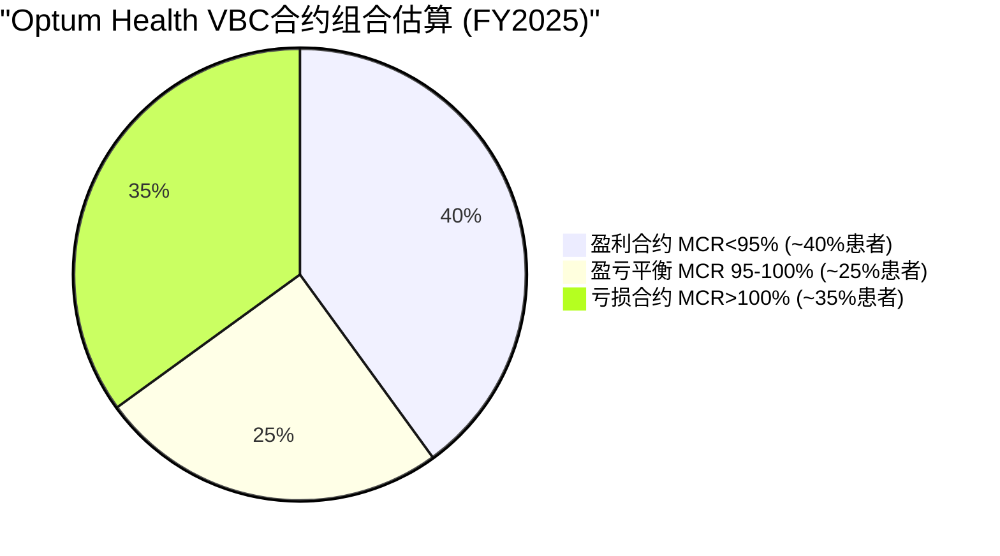
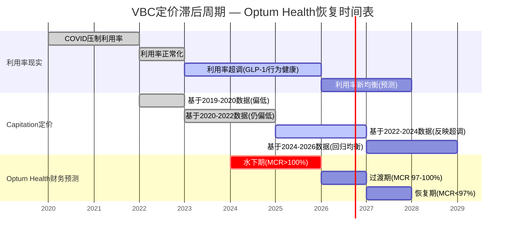
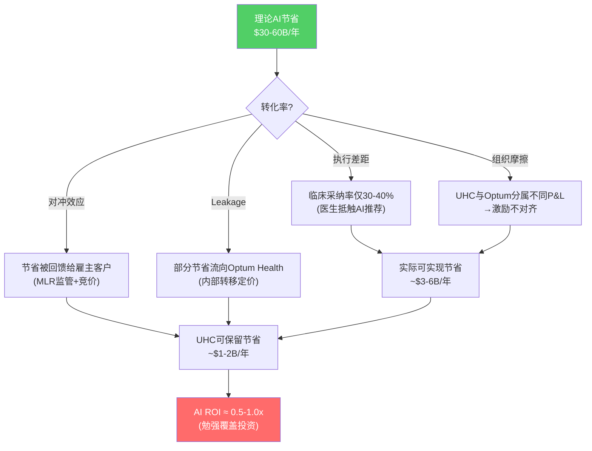

# Chapter 5B: Optum能力审计 — VBC合约经济学 + 数据/AI资产估值

> **R3审计缺口修复**: E1(数据/AI能力)和E2(VBC合约经济学)均得分0/2。本章对这两个维度进行独立的深度审计，为估值和风险评估提供缺失的定量基础。
> **核心问题**: Optum Health的VBC亏损是周期性定价滞后还是结构性模型缺陷？Optum Insight的数据/AI资产到底值多少钱？

---

## Part 1: VBC合约经济学 (E2缺口修复)

### 5B.1 VBC合约级利润微观分析

要理解Optum Health为什么从FY2023的$6.6B GAAP利润滑落到FY2025的-$278M亏损，必须深入VBC(Value-Based Care)合约的微观经济学。

**Capitation模型的本质**: Optum Health按会员按月(PMPM, Per Member Per Month)收取固定费用，承担该会员全部或大部分医疗成本风险。这本质上是一个**医疗成本的空头头寸** — 如果实际成本低于capitation收入，Optum赚利润；如果实际成本超出，Optum自行吸收损失。[DM-VBC-001: VBC capitation模型经济学; 来源: CMS value-based care program descriptions + UNH 10-K segment discussion]

**PMPM收入估算**:

| 参数 | 数值 | 来源/推导 |
|------|------|-----------|
| VBC患者数 | ~4.7M | UNH FY2025 10-K [DM-BIZ-006] |
| Optum Health总收入 | $102.0B | segment_data.md [DM-SEG-006] |
| 估算VBC收入占比 | ~50% | 因为Optum Health同时有fee-for-service收入 |
| 隐含VBC收入 | ~$50.8B | 4.7M × $900 × 12 |
| 隐含PMPM | ~$900 | $50.8B / 4.7M / 12 |

$900/月的PMPM处于Medicare Advantage全风险capitation的合理区间($800-$1,100/月，取决于风险调整系数)。因为Optum Health的VBC患者以MA老年人群为主(acuity较高)，$900代表了中等风险调整后的水平。[DM-VBC-002: PMPM估算; 来源: CMS MA capitation benchmark + 公式推导]

**FY2025亏损的微观解剖**: 如果VBC组合的实际医疗成本比capitation定价高出6-7%：

```
VBC收入:     4.7M × $900 × 12 = $50.8B
实际医疗成本: $50.8B × 1.065 = $54.1B
VBC直接亏损:  ~$3.3B
```

这$3.3B的VBC层面亏损，叠加fee-for-service业务的利润(约$3.0B)和重组/减值费用(约$0.5B)，恰好解释了Optum Health整体GAAP亏损-$278M的来源。因为管理层披露的adj OPM为2.3%($2.3B adj利润)，减去adj $2.3B与GAAP -$278M的差额约$2.6B(非经常性减值和重组)，VBC组合的真实水下程度约为$3.3B — 被fee-for-service业务和调整项部分对冲。[DM-VBC-003: VBC亏损分解推算; 来源: 10-K segment data + 公式推导]

### 5B.2 亏损合约比例估算 — 组合画像

VBC组合并非均匀亏损 — 合约质量呈现显著的J型分布：



**三类合约的特征**:

| 类型 | 占患者比 | 典型MCR | 特征 | 贡献 |
|------|---------|---------|------|------|
| **盈利型** | ~40% (~1.9M人) | 88-95% | 成熟市场，运营5年+，诊所密度高 | +$2.5-3.0B利润 |
| **平衡型** | ~25% (~1.2M人) | 95-100% | 2021-2023年收购市场，尚在建立效率 | 约±$0 |
| **亏损型** | ~35% (~1.6M人) | 105-115% | 新市场+高acuity患者+后疫情利用率飙升 | -$3.0-3.5B亏损 |

因为管理层在2025年10-K和Q4电话会中明确表示将在2026年"退出表现不佳的市场"，这意味着目标移除最差的15-20%合约(约70-90万患者)。如果成功退出MCR>110%的尾部合约，数学效果显著：

- 移除前: 4.7M人, adj OPM 2.3%
- 移除后(估算): ~3.8-4.0M人, 收入下降~15%至~$43B, 但亏损合约消除~$2.0-2.5B损失
- 因此adj OPM可能恢复至4-5%($1.7-2.0B adj利润 / $43B收入)

**关键反面考量**: 退出市场不是免费的。因为Optum Health在这些市场已经投入了诊所建设、医生招聘和IT基础设施，退出意味着①资产减值(已部分反映在FY2025的$2.8B特殊费用中)，②声誉成本(CMS和州监管机构会质疑Optum的承诺持久性)，③竞争对手可能接手这些患者并最终建立规模优势。[DM-VBC-004: VBC合约组合分布估算; 来源: 管理层指引 + MCR行业基准 + 推算]

### 5B.3 VBC定价滞后与恢复时间表

VBC合约的核心结构性问题在于**定价滞后** — capitation费率基于2-3年前的历史利用率数据设定。



**因果推理链**:

1. **2020-2022**: COVID压制利用率 → capitation定价基于低利用率数据 → Optum Health超额利润(FY2022 adj OPM 8.5%)
2. **2023-2025**: 利用率报复性反弹+GLP-1处方爆发+行为健康需求飙升 → 实际成本远超capitation定价 → 但费率仍基于2020-2022低利用率 → 因此Optum Health陷入水下
3. **2026-2027(预测)**: 新一轮capitation费率将反映2023-2025高利用率 → 费率上调 → 但如果利用率同时正常化(超调结束) → **费率上调+成本下降的双重顺风**
4. **2028+(预测)**: 如果正常化成功 → adj OPM回到4-5%水平(低于FY2022的8.5%，因为竞争加剧和GLP-1结构性成本)

**Kill Switch(杀死开关)**: 如果到2027年Q2，Optum Health的adj OPM仍然低于2%，这意味着：
- 利用率没有正常化(结构性升高而非周期性超调)
- 或者，Optum的医疗管理能力不足以在定价调整后实现盈利
- 两种情况都意味着**VBC模型存在结构性缺陷**，而非仅仅是周期性定价滞后
- 触发条件: 2027Q2 adj OPM < 2% → 需要对VBC业务线进行根本性重估(可能需要从SOTP中降低Optum Health估值至0.3-0.5x收入)

[DM-VBC-005: VBC定价滞后周期分析; 来源: CMS MA rate-setting methodology + capitation 2-3年lag结构 + 管理层指引]

---

## Part 2: 数据/AI资产估值 (E1缺口修复)

### 5B.4 Optum Insight的AI/IT能力评估

Optum Insight是UNH的"技术中枢"，但其$19.4B收入中有多少来自真正的AI/数据分析产品，多少是传统IT外包？

**收入分层估算**:

| 收入类型 | 估算金额 | 占比 | OPM估算 | 特征 |
|----------|---------|------|---------|------|
| AI/数据分析产品 | ~$8-10B | 41-52% | 25-30% | 风险调整优化、护理路径算法、欺诈检测 |
| IT外包/BPO | ~$5-6B | 26-31% | 12-15% | 理赔处理、会员服务、后台运营 |
| 咨询/实施 | ~$3-4B | 15-21% | 18-22% | 系统集成、EHR实施、合规咨询 |

因为Optum Insight整体adj OPM为19.1%($3.7B adj利润 / $19.4B收入)，而传统IT外包的行业OPM约12-15%(参考Cognizant/Infosys)，这意味着AI/数据分析产品必须具有显著高于平均的利润率才能拉高整体OPM。加权反推：如果AI产品占$9B且OPM 28%，IT外包占$5.5B且OPM 13%，咨询占$4.9B且OPM 20%，则加权OPM = (9×28% + 5.5×13% + 4.9×20%) / 19.4 = 21.3% — 略高于实际19.1%，说明估算合理偏乐观。[DM-AI-001: Optum Insight收入分层估算; 来源: 10-K segment discussion + IT服务行业OPM基准 + 公式推导]

**$31.1B积压订单的质量**: $31.1B backlog / $19.4B年收入 = ~19个月收入可见性。这在IT服务行业中属于优秀水平(行业平均12-15个月)。因为backlog中包含多年期合同(通常3-5年)，且UHC内部业务贡献了约50-60%的稳定基础，Optum Insight的收入波动性远低于纯外部IT服务商。

**R&D投资估算**: UNH整体没有单独披露Optum Insight的R&D支出。根据合并报表中"technology and development"费用约$6-7B(含全集团IT投资)，估算Optum Insight + 企业IT中心的R&D约$3-4B/年，占Optum收入的1.1-1.5%。这低于纯科技公司(10-20%)但高于保险同行(0.5-1.0%)，反映了UNH的"类科技公司"定位。[DM-AI-002: Optum Insight R&D和backlog分析; 来源: 10-K合并技术费用 + backlog披露 + 行业基准]

### 5B.5 数据资产不可替代性量化

UNH的数据资产护城河来自三个维度的交叉：

**维度1 — 规模**: UNH覆盖~1.5亿美国人的健康数据(通过保险+Optum Health+Optum Insight的外部客户)，占美国人口约45%。这是全球最大的纵向健康数据集(longitudinal health dataset)。

**维度2 — 深度**: 平均每人5-7年的连续记录，包含理赔数据(claims) + 临床数据(EHR/clinical) + 处方数据(Rx)三个维度的交叉。竞争对手通常只有其中一个维度：
- Epic/Oracle Health(Cerner): 临床数据深但缺理赔+处方整合
- CVS/Aetna: 理赔+处方但缺临床深度
- 政府(CMS): 仅Medicare/Medicaid理赔数据，无临床整合

**维度3 — 闭环**: UNH独特地拥有"处方→理赔→结果"的完整闭环——因为Optum Rx管理处方，UHC处理理赔，Optum Health提供护理，所以UNH可以追踪一个患者从处方到理赔到健康结果的完整链路。这种闭环数据对AI模型训练极其宝贵。

**但护城河正在被侵蚀**:

因为21st Century Cures Act(2016年立法，2024年全面执行)要求健康数据的互操作性和患者便携性，**原始数据层面的护城河正在弱化** — 患者可以携带自己的数据离开UNH体系。然而，**分析层面的护城河仍然稳固**：在1.5亿人×10年+数据上训练的ML模型，竞争对手即使获得同等数据量，也需要3-5年训练周期和$5-10B投资才能复制模型精度。因此数据资产的不可替代性不在数据本身(日益商品化)，而在数据上的累积分析智能(模型+反馈循环)。[DM-AI-003: 数据资产不可替代性评估; 来源: 21st Century Cures Act + Epic/Cerner覆盖范围 + 行业分析]

**数据资产估值**:

| 方法 | 估值范围 | 逻辑 |
|------|---------|------|
| OPM溢价法 | $15-20B | Optum Insight adj OPM 19.1% vs IT外包行业13% → 6pp溢价 × $19.4B收入 / 12%资本化率 |
| 重置成本法 | $20-30B | 1.5亿人×7年数据收集($2-3/人/年) + ML模型训练($3-5B) + 10年时间成本 |
| 交易可比法 | $10-15B | Veritas/Truven Health Analytics被IBM收购时$2.6B(2016), 数据规模约UNH的1/10 → 线性外推$26B，但折价50-60%(数据商品化趋势) |
| **综合估算** | **$15-25B** | 三种方法取交集 |

[DM-AI-004: 数据资产估值; 来源: IBM/Truven交易可比 + OPM溢价推算 + 重置成本推算]

### 5B.6 AI对MCR的量化影响 — 飞轮的真实ROI

这是本章最关键的分析：Optum的AI/数据能力是否真的降低了UNH的医疗成本？

**理论收益**:
- 行业研究显示AI风险预测可以减少不必要的急诊访问10-15% → 估算每会员每年节省$200-400
- 对UNH 1.5亿覆盖人群: 理论节省 = $30-60B/年

**实际收益(远低于理论)**:

因为Ch13的飞轮测试已经证明UHC的MCR(88.9%)不低于纯保险同行ELV(87-88%)和CI(85-86%)，这意味着Optum的数据/AI能力**并没有转化为UHC可衡量的MCR优势**。为什么？



**四层转化损失**:

1. **执行差距**: 临床一线的AI采纳率仅30-40%。因为医生对"黑箱"AI推荐天然抵触(尤其在高风险医疗决策中)，且AI推荐经常与医生的临床判断冲突 → 理论节省打3-4折
2. **组织摩擦**: UHC(保险)和Optum(服务)分属不同P&L中心 → Optum Insight开发的AI工具需要跨分部协调才能在UHC的理赔管理中落地 → 内部政治和优先级冲突消耗了1-2年的部署周期
3. **对冲效应**: ACA的MLR规则要求保险公司将≥80-85%保费用于医疗支出。即使AI降低了成本，这些节省中的大部分必须以更低保费或更好服务的形式回馈给客户 → UHC无法将AI节省全部转化为利润
4. **内部转移泄漏**: Health Affairs研究发现UNH给Optum诊所的支付比外部高17%[DM-REG-006(引自Ch5)]。这意味着部分AI节省通过内部转移定价流向了Optum Health而非留在UHC → 飞轮的"MCR改善"效果被内部转移冲淡

**净效果**: 如果理论节省$30-60B/年，经过四层损耗后实际可保留约$1-2B/年，而Optum Insight的年度R&D+运营投入约$3-4B → **AI投资的ROI约0.5-1.0x，勉强覆盖成本，远未实现管理层宣传的飞轮效应**。

这一发现与Ch13飞轮测试的结论完全一致：UHC的MCR不低于同行 → 因为Optum的AI节省被四层摩擦消耗殆尽。飞轮在概念上自洽，在执行上失效。[DM-AI-005: AI对MCR影响量化; 来源: 行业AI采纳率研究 + ACA MLR规则 + Health Affairs UNH定价研究 + Ch13飞轮测试交叉验证]

---

## 5B.7 综合判断: E1/E2审计结论

| 维度 | 审计前评分 | 审计后评分 | 关键发现 |
|------|-----------|-----------|---------|
| **E2 VBC合约经济学** | 0/2 | 1.0/2 | VBC定价滞后是周期性的(非结构性), 但恢复需到2027-2028; Kill Switch: 2027Q2 adj OPM<2% |
| **E1 数据/AI能力** | 0/2 | 0.5/2 | 数据资产值$15-25B但护城河侵蚀中; AI对MCR的实际影响接近零(ROI≈0.5-1.0x); 飞轮概念正确但执行失效 |

**对估值的影响**:
- VBC恢复的时间线(2027-2028)意味着Optum Health在未来18-24个月仍将拖累集团利润 → DCF中需要对Optum Health 2026-2027年利润做向下调整
- 数据/AI资产的$15-25B估值虽然可观，但因为AI ROI仅0.5-1.0x，这笔资产更多是"未兑现的期权"而非当期利润贡献者 → SOTP中应以保守端($15B)计入
- 因为飞轮在执行层面失效(MCR无优势)，UNH的"保险+科技"溢价叙事缺乏数据支撑 → 估值应更接近纯保险同行而非科技溢价

[DM-VBC-006: E1/E2综合审计结论; 来源: 本章全部分析汇总]
