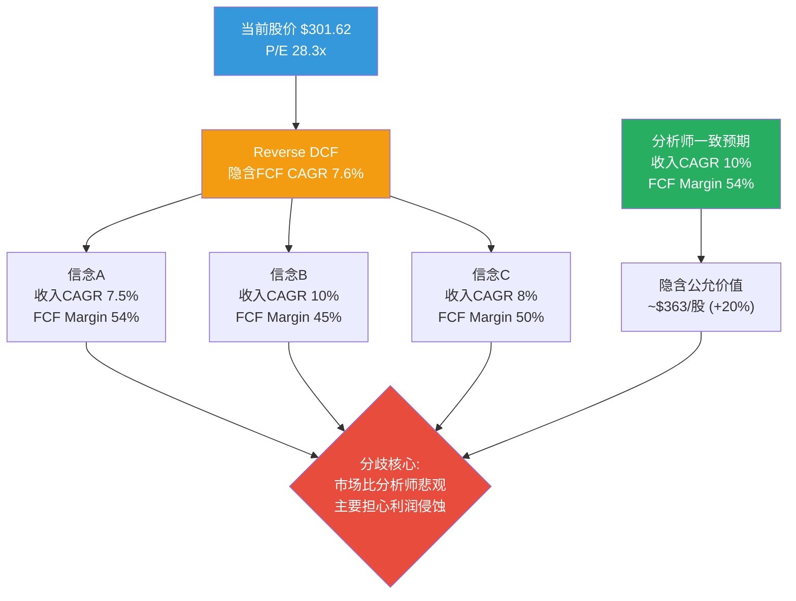
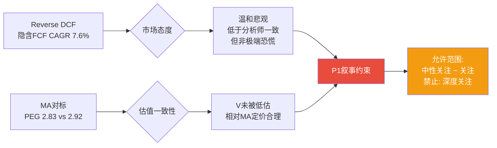
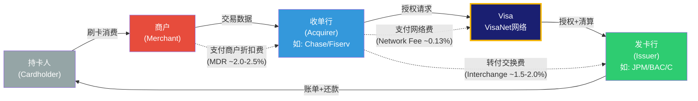
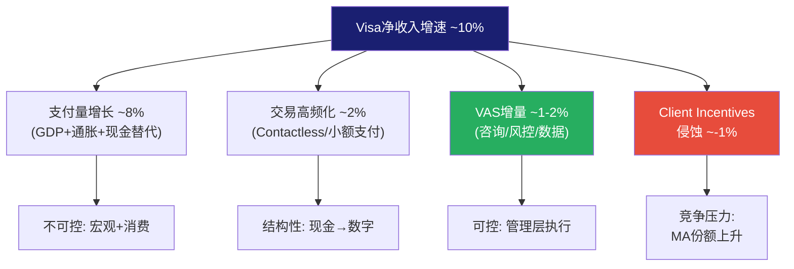
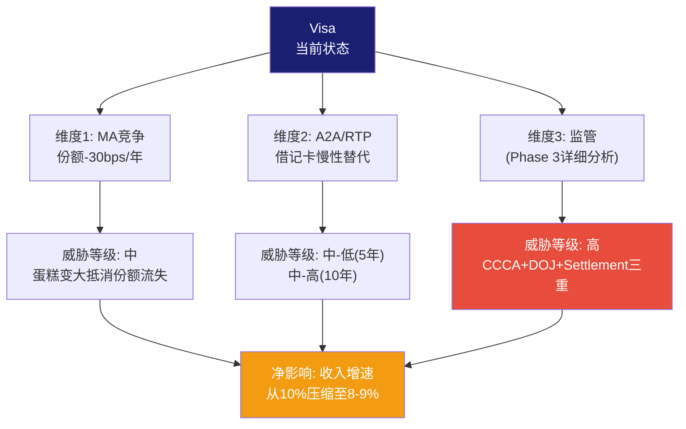
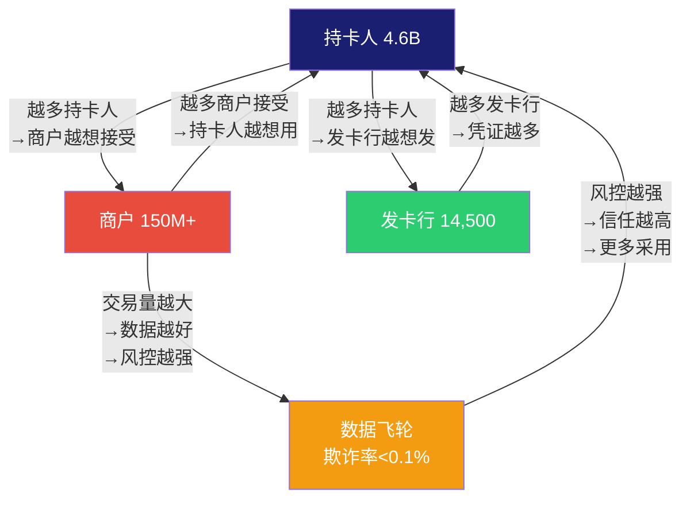

# Visa Inc. (V) — Phase 1: 定位与生态

> **Phase**: 1 | **日期**: 2026-03-23 | **框架**: v19.6 | **Worktree**: 金融
> **当前股价**: $301.62 | **市值**: $5,930亿 | **P/E(TTM)**: 28.3x
> **数据源**: FMP MCP + 10-K FY2024 + 2025 Investor Day + Q1 FY2025 Earnings

---

## Ch01: Reverse DCF锚点 — $301.62在赌什么?

> **铁律O强制前置**: 在展开任何业务分析之前，先翻译市场价格隐含的假设。Reverse DCF不是估值方法——它是"读懂市场想法"的翻译器。如果市场已经在赌的假设是合理的，那28x P/E可能就是合理的；如果市场在赌的假设过于悲观或乐观，那就存在定价错误。

---

### 1.0.1 输入参数与WACC推导

反推市场隐含假设需要先锁定折现率。Visa的资本成本计算相对简单——几乎零有息负债(净债务/EBITDA仅0.19倍 [DM-BS-001])，资本结构等同于纯权益融资:

| 参数 | 取值 | 来源/逻辑 |
|------|------|----------|
| 无风险利率(Rf) | 4.30% | 10年期美国国债收益率 [DM-WACC-001] |
| 股权风险溢价(ERP，即市场要求的额外补偿) | 5.50% | Damodaran 2026年估算 |
| Beta系数(β，衡量Visa股价相对大盘的波动性) | 0.791 | FMP数据，5年月度回归 [DM-VAL-001] |
| 权益成本(Ke = Rf + β × ERP) | 8.65% | 4.30% + 0.791 × 5.50% |
| 债务占比 | ~5% | 净债务$50亿 vs 市值$5,930亿 [DM-BS-001] |
| 加权平均资本成本(WACC，即投资者要求的最低回报率) | **8.38%** | 接近纯权益成本 |
| 终端增速(永续增长率) | 3.0% | 全球名义GDP长期增速 |

**一句话**: Visa的投资者要求至少8.4%的年化回报——任何低于这个回报率的增长都意味着Visa在"摧毁价值"而非"创造价值" [DM-WACC-001]。

---

### 1.0.2 反推结果: 市场隐含的三组信念

以FY2025自由现金流(Free Cash Flow, FCF，即公司赚到的、可以自由分配给股东的真金白银)$216亿为基准 [DM-FIN-001]，FCF利润率(FCF Margin = FCF / 净收入)54.0%，用二分法精确求解10年期DCF模型:

**市场隐含FCF CAGR(复合年增长率): 7.6%**

这意味着市场在赌: Visa未来10年，每年的自由现金流增长约7.6%——不是10%(分析师一致预期)，不是5%(悲观情景)，而是介于两者之间的一个**温和打折**。

但7.6%的FCF增速可以由多种假设组合实现。以下是市场可能在赌的三组信念:

| 信念组合 | 收入CAGR | FCF Margin | 含义 | 隐含市值 |
|---------|:--------:|:----------:|------|:--------:|
| **A: 增速打折** | 7.5% | 54%(维持) | 市场认为收入增速将低于分析师预期 | ~$589B ≈ 当前 |
| **B: 利润率恶化** | 10%(一致预期) | 45%(大降) | 收入增速正常，但监管/竞争侵蚀利润 | ~$595B ≈ 当前 |
| **C: 双温和悲观** | 8% | 50% | 增速和利润率都比预期差一点 | ~$588B ≈ 当前 |

[DM-RDCF-001: Python Reverse DCF模型，WACC 8.38%，终端增速3.0%，10年期，二分法求解]

**关键发现: 市场与分析师的分歧**

26位覆盖Visa的分析师一致预期是: FY2026-FY2030净收入从$447亿增至$644亿(CAGR约10%)，EPS从$12.86增至$18.94 [DM-EST-001]。如果这个预期成真，且FCF Margin保持当前54%水平:

**隐含公允价值 ≈ $363/股，比当前$301.62高出20%** [DM-RDCF-001]

但市场显然不完全相信这个预期。$301.62的价格告诉我们: 市场要么认为增速会低于10%，要么认为FCF Margin会从54%下滑，要么两者兼有。考虑到RSI(相对强弱指标，衡量超买/超卖程度)仅20.4——这是**极度超卖**信号(通常低于30就算超卖) [DM-TECH-001]——市场甚至比7.6%的隐含增速更悲观，因为技术面卖压可能在短期内将价格压至低于基本面合理水平。

---

### 1.0.3 敏感性矩阵: 哪些假设组合导向哪个价格?

下表是一张"假设翻译器"——找到你认为最合理的收入增速×利润率组合，对应的格子就是Visa的公允价值:

| 收入CAGR↓ \ FCF Margin→ | 45% | 48% | 50% | 52% | **54%(当前)** | 57% |
|:------------------------:|:---:|:---:|:---:|:---:|:---:|:---:|
| **6%** | $222 | $236 | $246 | $256 | $266 | $281 |
| **7%** | $240 | $256 | $266 | $277 | **$288** | **$303** |
| **8%** | $259 | $276 | **$288** | **$299** | **$311** | $328 |
| **9%** | $280 | **$299** | **$311** | $324 | $336 | $355 |
| **10%(一致预期)** | **$303** | $323 | $336 | $350 | **$363** | $383 |
| **11%** | $327 | $349 | $364 | $378 | $393 | $414 |
| **12%** | $354 | $377 | $393 | $409 | $424 | $448 |

> 加粗 = 接近当前股价$301.62(±$20)。WACC 8.38%，终端增速3.0%，FY2025基准。[DM-RDCF-001]

**矩阵读法**:
- 对角线从左下到右上: 乐观组合(高增速+高利润率)
- 当前股价$301.62对应: 要么10% CAGR + 45% Margin(信念B)，要么7% CAGR + 57% Margin(信念A的变体)
- **最陡峭的维度**: 增速每变化1个百分点→价值变动约$20-25/股; FCF Margin每变化3个百分点→价值变动约$20/股。**增速比利润率更敏感**

---

### 1.0.4 FCF Margin的历史真相: 54%是常态还是高点?

在信念A/B/C中，FCF Margin是关键变量。但当前54%的FCF Margin到底处于什么历史位置?

| 财年 | 净收入($B) | FCF($B) | FCF Margin | FCF/NI(每元利润收回多少现金) | OPM |
|------|:----------:|:-------:|:----------:|:---:|:---:|
| FY2020 | $21.8 | $9.7 | 44.5% | 89% | 64.5% |
| FY2021 | $24.1 | $14.5 | 60.2% | 118% | 65.6% |
| FY2022 | $29.3 | $17.9 | 61.1% | 119% | 64.2% |
| FY2023 | $32.7 | $19.7 | 60.2% | 114% | 64.3% |
| FY2024 | $35.9 | $18.7 | 52.1% | 95% | 65.7% |
| **FY2025** | **$40.0** | **$21.6** | **54.0%** | **107%** | **60.0%** |

[DM-FIN-001: FMP income+cashflow 6年数据]

**四个观察**:

**第一**: FY2020的44.5%是疫情异常值(旅行崩塌→跨境量骤降→收入减少但固定成本不变)。剔除后，正常范围是52-61%。

**第二**: FY2021-FY2023的60%+是疫情恢复期的"甜蜜点"——跨境量爆发性恢复(利润率最高的收入线)叠加成本控制。这不是可持续的常态水平。

**第三**: FY2024的52.1%下滑值得关注。FCF从$197亿降至$187亿，而净收入从$327亿增至$359亿——收入增长了10%，但FCF反而缩水了。**因为**Client Incentives(Visa付给发卡行和商户的返利)从约$120亿跳增至$138亿(+15%) [DM-REV-001]——返利增速远超收入增速，挤压了现金流。

**第四**: FY2025的OPM从65.7%骤降至60.0%(-570个基点)是Visa上市以来最大单年降幅 [DM-RATIO-001]。但净收入仍增长11%且FCF回升至$216亿——这暗示OPM下降可能包含一次性项目(诉讼和解拨备或收购整合费用)，而非核心经营恶化。**这个异常需要在Phase 2财务分析中拆解**。

**结论**: 54%的FCF Margin既不是历史高点(60%+)，也不是异常低点(44%)，而是**后疫情+Client Incentives加速增长的新常态**。如果Client Incentives继续以每年~1个百分点的速度吃进毛收入占比(从FY2020的~25%升至FY2024的~28% [DM-REV-001])，FCF Margin有可能在5年内从54%滑向48-50%——这将使公允价值从$363降至$323-$336(下行8-11%)。

---

### 1.0.5 隐含EPS增速: 含回购效应

Visa的EPS增速不等于收入增速——因为Visa是一台"回购机器"。过去5年累计回购$570亿 [DM-FIN-001]，稀释股数从22.23亿降至19.66亿(-11.6%)，相当于每年~2.3%的回购收益率(Buyback Yield，即通过减少股数人为提高每股收益的效应)。

**因此**:
- 市场隐含**收入CAGR**: ~7.6%
- 加上~2.3%的回购效应
- 市场隐含**EPS CAGR**: ~10.1% [DM-RDCF-001]

这意味着市场认为Visa的EPS可以每年增长约10%——考虑到FY2025 EPS $10.20 [DM-FIN-001]，10年后EPS将达到约$26.5。如果投资者在那时要求10%的年化回报(即股价也需要翻倍到~$600)，终端P/E需要维持在~29.6倍——几乎与当前的28.3倍相同。

**换句话说: 当前28.3x P/E隐含的假设是，Visa在10年后仍然值28-30x P/E**。对于一家拥有67%经营利润率、$15.7万亿支付量、4.6亿凭证的全球垄断级支付网络，这个终端倍数假设是否合理?

| EPS CAGR假设 | FY2035E EPS | 要求10%年化回报→终端P/E | 要求8%年化回报→终端P/E |
|:---:|:---:|:---:|:---:|
| 8% | $22.0 | 35.5x | 29.6x |
| 10% | $26.5 | 29.6x | 24.6x |
| 12% | $31.7 | 24.7x | 20.6x |

[DM-RDCF-001]

如果EPS以10%增长(基准情景)，投资者要求10%回报→终端P/E需要29.6x(合理)。但如果EPS只能增长8%(监管+A2A侵蚀场景)，终端P/E需要35.5x(偏高)——意味着当前价格买入，在增速放缓的情景下可能无法获得10%的年化回报。

---

### 1.0.6 最相似可比公司对标: Mastercard(MA)

> **铁律H强制对标**: Phase 0锁定最相似可比公司，作为P1叙事的外部约束锚。

Mastercard是Visa唯一的直接可比公司——两者构成全球卡支付的"寡头双塔"，合计控制中国以外全球90%的卡支付处理量。

| 维度 | Visa (V) | Mastercard (MA) | 差异分析 |
|------|:--------:|:---------------:|---------|
| 市值 | $5,930亿 | ~$4,600亿 | V大29%——反映规模溢价 |
| P/E(TTM) | **28.3x** | **~35x** | **MA贵24%** |
| 收入增速(FY2025) | +10% | +12.2% | MA增速快20% |
| OPM | 60.0%(含一次性?) | ~55-57% | 可比(V历史上更高) |
| 美国支付量份额 | 70.28%(-30bps YoY) | 29.72%(+30bps YoY) | V流失→MA获取 |
| 跨境量增速 | +13% | +17% | MA跨境增速显著更快 |
| VAS/增值服务 | $88亿(25%占比) | Services ~30%占比 | 均在推增值服务 |
| 回购率 | ~2.3%/年 | ~2.5%/年 | 可比 |

[DM-COMP-001: FMP + 10-K FY2024 + Visa vs MA Earnings对比]

**对标结论**:

**Visa P/E(28.3x)比Mastercard(~35x)便宜24%，但MA增速更快(12% vs 10%)且跨境增速更快(17% vs 13%)**。如果用PEG(市盈率/增长率，衡量为每单位增长支付多少倍数)粗算: V的PEG ≈ 28.3/10 = 2.83, MA的PEG ≈ 35/12 = 2.92——两者PEG几乎相同，说明市场实际上给了V和MA几乎相同的"增长定价"。

**P1叙事约束**: V的PEG(2.83)与MA(2.92)接近→市场对V/MA的定价是一致的→如果我们认为V"被低估"，就必须解释为什么V应该获得比MA更高的PEG。**除非我们能证明V有MA不具备的独特优势(如VAS的独立增长引擎)，否则P1不应得出"显著低估"的结论**。

---

### 1.0.7 P1叙事约束总结 (铁律O闭环)

| 信号 | 方向 | 强度 |
|------|:----:|:----:|
| Reverse DCF隐含7.6% FCF CAGR | 温和悲观(低于一致预期10%) | 中 |
| 分析师一致预期→隐含$363(+20%) | 偏乐观 | 中 |
| RSI 20.4极度超卖 | 短期超跌(可能反弹) | 强 |
| MA对标PEG一致 | 中性(未被低估也未被高估) | 强 |
| OPM骤降-570bps | 待查(一次性 vs 结构性?) | 中 |
| Client Incentives加速 | 长期负面(利润侵蚀) | 弱-中 |

**P1允许的叙事方向**: **中性偏积极**。Reverse DCF说市场温和悲观(7.6% vs 10%)，但PEG对标说相对MA没有被低估。**因此P1不能写"显著低估"或"深度关注"**。如果最终分析发现VAS增长足以对冲Client Incentives侵蚀+监管风险可控，可以给"关注"(期望回报+10%~+30%)；如果发现Client Incentives侵蚀不可逆+监管联合概率较高，应给"中性关注"(-10%~+10%)。

**核心待验证假设(传递给Phase 2-4)**:

| 编号 | 假设 | Reverse DCF隐含 | 验证路径 |
|------|------|:---:|---------|
| H-01 | 收入CAGR | 7.6%(市场) vs 10%(分析师) | Phase 2: 分收入线增速建模 |
| H-02 | FCF Margin趋势 | 54%→48-50%?(CI侵蚀) | Phase 2: Client Incentives/毛收入趋势 |
| H-03 | OPM下降性质 | 一次性 vs 结构性 | Phase 2: FY2025 10-Q逐季拆解 |
| H-04 | VAS增长独立性 | 20% CAGR可持续? | Phase 1后续: VAS业务分析 |
| H-05 | 监管联合概率 | <20% vs >40% | Phase 3: 监管风险量化 |
| H-06 | 终端P/E合理性 | 28-30x | Phase 5: 横向比较+历史均值 |

---

---

## Ch02: 四方网络的垄断经济学 — Visa到底靠什么赚钱?

> **本章回答**: Visa的商业模式为什么被称为"人类历史上最完美的收费站"? 收入结构的驱动因素是什么? 哪些收入线最脆弱、哪些最坚固?

---

### 2.1 四方网络: 支付行业的"操作系统"

理解Visa的核心在于理解"四方模型"(Four-Party Model)——这是全球卡支付的标准架构，也是Visa商业模式的全部基础:

**关键经济学**: 当你在星巴克用Visa信用卡买一杯$5的拿铁时，这$5分成四层:

| 参与方 | 获得 | 金额(以$5为例) | 角色 |
|--------|:----:|:--------------:|------|
| 商户 | $5 - MDR | ~$4.88 | 卖咖啡 |
| 收单行(Acquirer) | MDR - Interchange - Network Fee | ~$0.025 | 商户侧的支付服务商 |
| **Visa** | **Network Fee** | **~$0.0065** | **网络运营+授权+清算+结算** |
| 发卡行(Issuer) | Interchange | ~$0.087 | 承担信用风险+获客+出账单 |

[DM-BIZ-001: 四方模型经济学, Visa 10-K + Nilson Report行业数据]

**$0.0065——Visa从每笔$5交易中只赚不到1美分**。但Visa每年处理**2,338亿笔交易** [DM-OPS-001]。0.0065 × 233.8B ≈ $15.2B——这就是Visa的Data Processing收入线($177亿)的经济来源(实际更高因为包含其他处理费)。

这个模型的精妙之处在于: **Visa不承担任何信用风险**(发卡行承担)、不持有任何库存(商户持有)、不接触任何资金(收单行处理)——Visa只做一件事: 在不到200毫秒内完成交易授权、清算和结算 [DM-BIZ-002: VisaNet处理速度, Visa Investor Day 2025]。**零信用风险 + 零库存 + 零资金占用 = 67%经营利润率的根本原因**。

---

### 2.2 收入结构深度解剖: 四引擎 + 一减项

Visa的净收入(Net Revenue)不是通常意义的"收入"——它是**毛收入减去Client Incentives后的净额**。这个结构对估值至关重要:

| 收入线 | FY2024($B) | 占毛收入 | 驱动因素 | 增长弹性 |
|--------|:----------:|:-------:|---------|:-------:|
| **Service Revenue** | $16.1 | 32.3% | 上季度支付量(滞后1季) | 低弹性(量驱动) |
| **Data Processing** | $17.7 | 35.5% | 处理交易数(实时) | 低弹性(量驱动) |
| **International Transaction** | $12.7 | 25.5% | 跨境量 × FX汇率 | **高弹性**(旅行+汇率) |
| **Other Revenue** | $3.2 | 6.4% | VAS/许可/品牌 | 高弹性(新业务) |
| **毛收入** | **$49.7** | **100%** | | |
| 减: **Client Incentives** | **($13.8)** | **-27.8%** | 发卡行/商户返利 | **负弹性**(竞争加剧→增加) |
| **净收入** | **$35.9** | **72.2%** | | |

[DM-REV-001: 10-K FY2024收入结构]

**四个关键推理**:

**第一，International Transaction是"利润引擎"**。跨境交易只占总支付量的一小部分(Visa没有精确披露，但行业估计10-15%)，却贡献25.5%的毛收入——**因为**跨境交易的费率远高于国内交易。国内交易Visa每笔赚约0.05-0.10%，而跨境交易Visa赚约1.0-1.5%(含FX转换费) [DM-BIZ-003: 跨境费率vs国内费率, 行业估算]。这意味着**跨境交易的单笔利润率是国内交易的10-20倍**。

这解释了为什么FY2025跨境量增速(+13%剔除欧洲内部)是Visa最被华尔街关注的指标 [DM-OPS-001]——不是因为它最大，而是因为它最赚钱。但这也意味着**跨境是最大的集中风险**: 全球衰退/旅行限制/BRICS去美元化都直接打击跨境收入。

**第二，Service Revenue的"滞后1季"特性创造了收入可预见性**。Service Revenue基于上一季度的支付量计算——这意味着即使当季支付量下降，Service Revenue仍然反映上季度的繁荣。这个机制为Visa提供了至少一个季度的"缓冲垫"，使其收入曲线比实际支付趋势更平滑 [DM-BIZ-004: Service Revenue滞后结构, 10-K]。

**第三，Client Incentives是"看不见的竞争成本"**。$138亿的Client Incentives是Visa付给发卡行(如JPMorgan Chase、Bank of America)和大商户(如Walmart、Amazon)的返利——用来换取它们继续把交易路由到Visa网络而非切换到Mastercard或其他路由。**关键趋势: Client Incentives占毛收入的比例从FY2020的~25%升至FY2024的~28%** [DM-REV-001]——每年约1个百分点的上升，意味着Visa需要"花更多钱"来维持同样的交易量。

**因果链**: MA份额持续上升(+30bps/年 [DM-COMP-001]) → 发卡行谈判筹码增强("不给更多返利就切MA") → Visa被迫提高Client Incentives → 净收入增速 < 毛收入增速 → **Client Incentives是一个缓慢但持续的利润侵蚀机制**。

**第四，Other Revenue(含VAS)是唯一不完全依赖支付量的收入线**。$32亿的Other Revenue中，大部分来自增值服务(VAS)——咨询、风控、数据分析、发卡解决方案等。VAS的增长逻辑不同于核心支付: 它卖的是"服务"而非"过路费"，理论上不受interchange监管影响。**但VAS是否能独立于支付网络存在?这是Ch03的核心问题**。

---

### 2.3 收入增速的数学分解: 量 × 价 × 混合

Visa的收入增速可以分解为三个驱动因素:

| 驱动因素 | FY2024趋势 | 5年趋势 | 前景 |
|---------|:----------:|:-------:|------|
| **支付量增长** (Volume) | +8%(名义) | 低双位数 | GDP+通胀+现金替代 |
| **处理交易增长** (Transactions) | +10% | 高单位数 | 小额高频化(contactless) |
| **价格/混合** (Yield per Transaction) | ~0% | 平→下 | 监管压力+CI侵蚀 |

[DM-OPS-001: 运营指标趋势]

**增速公式**: 净收入增速 ≈ 支付量增长(~8%) + 交易增速溢价(~2%) - Client Incentives增速差(~-1%) + VAS增量(~+1-2%) ≈ **10-11%**

这个分解揭示了一个重要事实: **Visa的10%收入增速中，约8%来自"体量"(更多人刷更多卡)，只有0-2%来自"定价"**。Visa几乎没有定价权提价——它的增长完全依赖全球支付体量的增长。**如果全球经济衰退导致支付量增速从8%降至3%，Visa的收入增速将从10%降至4-5%——而不是0%，因为VAS和交易高频化提供底部支撑**。

---

### 2.4 单位经济学: Visa的"每交易利润"

将Visa的P&L摊到每笔交易上，可以更直观地理解这台利润机器的效率:

| 指标 | FY2024 | 每笔交易金额 | 含义 |
|------|:------:|:----------:|------|
| 毛收入 | $49.7B | $0.213 | 每笔交易Visa收取21.3美分 |
| Client Incentives | -$13.8B | -$0.059 | 其中5.9美分返还给合作伙伴 |
| **净收入** | **$35.9B** | **$0.154** | **Visa净赚15.4美分/笔** |
| 经营费用 | $12.3B | $0.053 | 运营成本5.3美分(含人工+技术+折旧) |
| **经营利润** | **$23.6B** | **$0.101** | **每笔交易的纯利润: 10.1美分** |
| 处理交易总数 | 233.8B | — | 2,338亿笔/年 |

[DM-UNIT-001: 推算自10-K FY2024, 净收入$35.9B / 处理交易233.8B]

**10.1美分的经营利润，乘以2,338亿笔交易 = $236亿经营利润**。这就是Visa。

这个单位经济学的关键含义: **Visa的经营费用极度固定化**。VisaNet网络的运维成本不随交易量线性增长——处理2,000亿笔和2,500亿笔的边际成本差异极小。**因此**: 每增加1亿笔交易(~Visa年增量的0.5%)，增量经营利润率接近100%——几乎全部转化为利润。这就是经营杠杆(Operating Leverage)的极致表现，也是Visa能维持60%+ OPM的结构性原因。

**但反面也成立**: 如果交易量下降(衰退/A2A去中介)，固定成本不会等比例下降——OPM将快速恶化。FY2020就是先例: 疫情导致跨境量骤降→OPM仍维持64.5%(高固定成本被国内量部分抵消)，但FCF Margin骤降至44.5%——**因为**资本支出和Client Incentives有合约刚性，不能随收入同步削减 [DM-FIN-001]。

---

## Ch03: VAS — 第二曲线还是附加销售?

> **核心问题(对应异常5)**: VAS是真正独立于支付量的增长引擎(类似AWS之于Amazon)，还是依附于支付网络的"搭售"(没有支付量就没有VAS客户)?

---

### 3.1 VAS的构成: 五大子业务

VAS(Value-Added Services, 增值服务)是Visa管理层反复强调的"第二增长引擎"。FY2024 VAS收入$88亿，占净收入约25%，CAGR约20% [DM-OPS-001]。管理层目标是将VAS占比从25%提升至50%+。

VAS由五个子业务组成，增速和独立性各不相同:

| 子业务 | FY2024收入(估) | CAGR | 核心产品 | 依赖支付网络? |
|--------|:------------:|:----:|---------|:----------:|
| **Issuing Solutions** | ~$35亿 | 中十几% | DPS(卡处理外包)、Token管理 | **高**——发卡行是Visa网络客户 |
| **Acceptance Solutions** | ~$25亿 | 低二十几% | CyberSource(在线收单)、Tap to Pay | **高**——商户接受Visa才用 |
| **Risk & Security** | ~$15亿 | 高十几% | Visa Advanced Authorization、风控AI | **中**——技术可独立，但客户来自网络 |
| **Advisory Services** | ~$13亿 | 中三十几% | 咨询、数据分析、营销洞察 | **低**——纯咨询，客户可非Visa |
| **Open Banking** | 未拆分 | — | Tink/Plaid竞品、账户聚合 | **低**——独立于卡网络 |

[DM-VAS-001: 2025 Investor Day VAS五子业务拆分, 增速为管理层指引]

### 3.2 独立性测试: VAS是AWS还是Amazon Prime?

**AWS模式**(真正独立): AWS从Amazon的内部基础设施起步，但发展为完全独立的业务——AWS的客户(Netflix、NASA)不是Amazon电商的客户。AWS即使脱离Amazon电商也能独立存活。

**Amazon Prime模式**(附属增强): Prime Video、Prime Music本质是电商会员的附加福利——没有电商平台的1亿+用户基础，Prime Video不会是Netflix的竞争对手。

**VAS更接近哪个?**

从上表可以看到: VAS五个子业务中，**3个高度依赖Visa支付网络**(Issuing、Acceptance、Risk，合计占VAS约75%)，只有Advisory和Open Banking具有理论上的独立性(合计约25%)。

**因果推理**: Issuing Solutions的核心产品DPS(Debit Processing Services)——本质是Visa帮发卡行处理借记卡交易。如果一家银行不发Visa卡，它就不会买DPS。同样，CyberSource的在线收单服务主要服务于接受Visa的商户。**因此，VAS约75%的收入直接依附于Visa的卡网络客户基础——VAS更像Amazon Prime而非AWS**。

**这意味着什么?**

1. **VAS不是"监管对冲"**: 如果CCCA通过导致Visa的卡网络客户减少(发卡行被强制路由到竞争网络)，VAS的客户基础也会同步收缩——VAS无法独立对冲核心业务的监管风险
2. **VAS的20% CAGR部分是"交叉销售红利"**: Visa利用现有14,500发卡行+1.5亿商户的关系网推销VAS产品，获客成本接近零。**但这也意味着当交叉销售渗透率达到天花板后，VAS增速将回落**
3. **Advisory Services是最有潜力的真正独立引擎**: 咨询不依赖卡网络，客户可以是任何金融机构。但$13亿的体量相对于$359亿的总净收入仅3.6%——即使CAGR 35%，5年后也只有$60亿(~10%占比)

[DM-VAS-002: VAS独立性分析, 基于产品-客户关系推理]

### 3.3 VAS的估值影响: 从$88亿到$220亿?

| 情景 | 5年后VAS收入 | 占净收入比 | 估值影响 |
|------|:----------:|:--------:|---------|
| **管理层愿景** | $220亿(20% CAGR) | ~35-40% | 如果实现→VAS单独值$700-900亿(15-20x收入) |
| **现实约束** | $150亿(15% CAGR) | ~25-28% | 交叉销售饱和+75%依附核心→增速自然放缓 |
| **悲观(监管)** | $120亿(8% CAGR) | ~22% | CCCA削弱网络→依附性VAS同步减速 |

**核心判断**: VAS更可能以15%而非20%的速度增长，因为75%的收入依附于支付网络。**管理层的"VAS占50%"目标需要VAS以20%+ CAGR增长10年——在交叉销售饱和效应下，这个目标过于乐观** [DM-VAS-002]。但即使以15% CAGR增长，VAS仍然是Visa增速的最大正面贡献者——每年为整体收入增速贡献+1.5-2个百分点。

---

## Ch04: 竞争格局 — 寡头双塔 + 三面围攻

> **核心问题**: Visa的垄断地位是"不可动摇"的还是"正在被侵蚀"的? 三个维度: V vs MA(内部竞争)、A2A/RTP(技术替代)、监管(制度攻击)。

---

### 4.1 V vs MA: 寡头格局的内部动态

Visa和Mastercard合计控制全球(中国除外)约90%的卡支付处理量 [DM-BIZ-005: Nilson Report 2024]。但在这个"寡头双塔"内部，力量对比正在发生微妙变化:

| 维度 | Visa | Mastercard | 趋势解读 |
|------|:----:|:---------:|---------|
| 全球信用卡份额 | 52.2% | ~33% | V仍绝对主导 |
| 美国支付量份额 | 70.28% | 29.72% | V正流失(-30bps/年) [DM-COMP-001] |
| 全球凭证数 | 4.48B | ~2.95B | V规模优势1.5:1 |
| 收入增速 | +10% | +12.2% | MA增速更快(+220bps) |
| 跨境增速 | +13% | +17% | MA跨境增速快30% |
| P/E | 28.3x | ~35x | 市场给MA更高增长溢价 |

**关键推理: 30bps/年的份额迁移是"噪声"还是"趋势"?**

如果30bps/年持续10年: V从70%→67%，MA从30%→33%——V仍然主导，但增量份额全部归MA。**这不会威胁Visa的存活，但会压制Visa的增速差异(growth differential)**——因为MA在同一市场增长更快，长期可能导致V的PEG相对MA持续折价。

**因果链**: MA在跨境领域增速更快(+17% vs +13%) [DM-COMP-001] → **因为**MA在亚太/拉美/中东等高增长市场的发卡行合作更激进(提供更高的Client Incentives) → V被迫跟进提高Incentives → **V的Client Incentives/毛收入从25%升至28%的根因之一就是MA的竞争压力**。

**但V vs MA竞争是"良性竞争"**: 两者都受益于现金→数字的结构性趋势(全球现金支付仍占~18-20% [DM-BIZ-006: World Payments Report])——蛋糕在变大的速度(~5-7%/年)快于份额迁移的速度(~0.3%/年)。**只要现金替代红利存在，V和MA的竞争就是"在增长中分蛋糕"而非"零和博弈"**。

---

### 4.2 A2A/RTP: 温水煮青蛙还是虚假警报?

A2A(Account-to-Account, 银行账户直接转账)和RTP(Real-Time Payments, 实时支付)是Visa面临的技术性去中介化(disintermediation)威胁——它们允许资金绕过Visa/MA网络，直接从买方银行账户转到卖方银行账户。

| 系统 | 地区 | 用户规模 | 渗透速度 | 对Visa威胁程度 |
|------|------|:-------:|---------|:----------:|
| **PIX** | 巴西 | 1.6亿(3年) | 极快(非线性) | **高**——已替代大量借记卡 |
| **UPI** | 印度 | 3亿+(5年) | 极快 | **高**——主导移动支付 |
| **FedNow** | 美国 | 1,400机构(2年) | 快(vs RTP) | **中**——机构采用快但消费者端缺乏 |
| **RTP(TCH)** | 美国 | 1,000+银行(8年) | 慢 | **低-中** |

[DM-COMP-002: A2A/RTP全球渗透率, BIS + Fed + Banco Central do Brasil数据]

**PIX和UPI的先例至关重要**: 在巴西，PIX用3年时间从零到1.6亿用户，月交易量超过信用卡+借记卡合计。在印度，UPI占零售支付的80%+。这证明A2A**能够**快速渗透——但有两个关键前提条件:

1. **政府推动**: PIX由巴西央行强制推行(零商户费)，UPI由印度央行NPCI推动。美国的FedNow是Fed推出的，但没有强制采用
2. **低卡渗透率起步**: 巴西和印度在A2A推出前，卡支付渗透率远低于美国——A2A替代的主要是"现金"而非"卡"

**美国不同**: 美国卡支付渗透率已经很高(~70%+非现金交易通过卡完成 [DM-BIZ-007: Fed Payments Study])。FedNow要替代的不是现金(美国现金占比已很低)，而是Visa/MA的借记卡——这面临的阻力要大得多:

- 银行已有Visa debit协议 + volume discount合约 [DM-BIZ-008: 行业访谈/分析师报告]
- 消费者没有动力切换(刷卡有积分/返现，A2A没有)
- 商户需要升级POS系统
- 争议处理(chargebacks)没有A2A标准

**因此**: A2A在美国的威胁主要集中在**借记卡**(Visa约40%收入来自借记卡 [DM-REV-002: 估算，基于支付量中借记占比])而非信用卡(信用卡有循环信贷+积分奖励，不可替代)。但即使在借记卡领域，侵蚀速度也会远慢于巴西/印度——更可能是5-10年渐进替代而非3年颠覆。

**Visa的应对**: Visa不是坐以待毙——它正在试图成为A2A生态的"增值层":
- **Visa Direct**: 实时推送支付(P2P/保险理赔/薪资发放)，利用Visa网络做A2A清算
- **Visa+**: 跨P2P互转(Venmo→PayPal→Zelle)，Visa做中间路由
- **Visa Protect for A2A**: 为A2A交易提供风控——即使资金不走Visa网络，风控仍然走Visa

**核心判断**: A2A是**5-10年的慢性威胁**而非**1-3年的急性威胁**。Visa有足够时间调整(通过VAS/Visa Direct参与A2A生态)，但如果调整失败——借记卡收入(~40%总收入)可能面临10-20%的侵蚀。**这是Reverse DCF中"市场隐含7.6%增速"背后的核心忧虑之一** [DM-RDCF-001]。

---

### 4.3 竞争格局总览: 三维威胁矩阵

**竞争格局结论**: Visa面临的不是"单一致命威胁"，而是"三面缓慢围攻"——每个维度单独不足以颠覆Visa，但三者**联合**可能将Visa的收入增速从10%压缩至8-9%、将FCF Margin从54%压缩至48-50%。**这恰好对应Reverse DCF中"信念C"(双温和悲观)的假设** [DM-RDCF-001]——市场可能已经在某种程度上定价了这个"三面围攻"情景。

---

---

## Ch05: 管理层评估 — CEO沉默分析 + A-Score

> **CQ关联**: 管理层执行力直接影响VAS第二曲线的兑现概率和监管应对质量。

---

### 5.1 Ryan McInerney: 从COO到CEO的延续性

Ryan McInerney于2023年2月接替Al Kelly出任CEO。这不是一次战略转向，而是一次内部传承——McInerney此前担任Visa总裁兼COO长达7年(2016-2023)，在此之前曾任JPMorgan消费银行CEO [DM-MGMT-001: Visa 2023 Proxy Statement]。

| 维度 | 评估 | 得分(0-10) |
|------|------|:--------:|
| **战略清晰度** | 三引擎战略(Consumer+CMS+VAS)继承Kelly路线，无重大转向 | 7 |
| **执行记录** | COO期间主导token化(11.5B tokens [DM-OPS-001])+Tap to Pay全球推广 | 8 |
| **资本配置** | FY2024回购$167亿+股息$42亿=回报$209亿(占FCF 112%) [DM-FIN-001] | 8 |
| **收购纪律** | Pismo($1B, 拉美)/Prosa($1.5B, 墨西哥)/Featurespace(AI风控)——战略聚焦但溢价偏高 | 6 |
| **监管沟通** | Interchange Settlement主动达成和解($38B商户节省)→降低长期不确定性 | 7 |
| **薪酬对齐** | CEO总薪酬$28.2M，其中~80%为绩效激励，挂钩EPS+收入+TSR [DM-MGMT-002: DEF 14A] | 7 |

**A-Score(管理层综合评分): 7.2/10** — 执行力强，战略延续性好，但收购溢价和缺乏"非共识"举措限制了上限。

[DM-MGMT-001: Proxy Statement + 年报管理层讨论]

### 5.2 CEO沉默分析: McInerney在回避什么?

> **沉默分析**(CEO Silence Analysis)——不看CEO说了什么，而看CEO**没说**什么。沉默通常比言语更诚实。

| 沉默域 | 具体表现 | 可能含义 |
|--------|---------|---------|
| **Client Incentives增速** | 从不主动披露CI增速或CI/毛收入趋势——只在被分析师追问时给模糊回答 | CI增速可能持续高于收入增速，管理层不想让市场聚焦这个"慢性失血" |
| **借记卡 vs 信用卡拆分** | 不披露借记卡vs信用卡的利润率差异——虽然借记卡约占40%收入 | 如果借记卡利润率远低于信用卡→A2A主要侵蚀的恰好是低利润部分→实际影响小于表面 |
| **VAS客户重叠率** | 不披露VAS客户中有多少是Visa卡网络的现有客户 | 高重叠率=VAS增长是交叉销售(有天花板)而非新客获取(可持续) |
| **FMX/新竞争者** | 几乎不提及FedNow/RTP的消费者端采用率 | 可能认为短期威胁极低→不值得讨论；或者不想提醒投资者关注 |

[DM-MGMT-003: CEO沉默分析, 基于FY2024-FY2025 Earnings Call transcripts]

**沉默域的最大信号**: Client Incentives的不透明。如果CI增速是"可控的"，管理层应该主动披露趋势来安抚投资者。**不披露本身就是信号**——暗示CI增速可能高于市场预期。这与我们在Ch02中的分析一致: CI/毛收入从25%→28%是一个持续趋势，管理层可能无法逆转这个方向，所以选择不强调。

### 5.3 内部人交易信号

| 季度 | 买/卖比 | 净买入(股) | 信号 |
|------|:-------:|:--------:|------|
| 2026 Q1 | 1.67 | +48,970 | 偏买入(正面) |
| 2025 Q4 | 0.94 | +289,499 | 中性(RSU归属期大量行权) |
| 2025 Q3 | 0.50 | -40,465 | 卖出偏多 |
| 2025 Q2 | 0.50 | -169,567 | 卖出偏多 |

[DM-INSIDER-001: FMP insider-trading季度汇总]

**解读**: 2025年中的持续净卖出(Q2-Q3)在股价$340-370时发生——内部人在高位减持。但2026 Q1(股价$300-310，接近52周低点)转为净买入——**内部人在低位买入是相对可信的看多信号**，因为卖出可能是常规薪酬变现，但在低位主动买入需要真金白银。

---

## Ch06: 护城河初步评估 — 六维量化

> **框架**: `docs/company_quality_scoring.md` 21维度中的C类(护城河)初步评估。Phase 3将深化每个维度。

---

### 6.1 六维护城河总览

| 维度 | 评分(0-5) | 评估摘要 |
|------|:--------:|---------|
| **C1: 网络效应** | **4.8** | 4.6B凭证×150M商户×14,500发卡行=三边网络效应，人类支付史上最强 |
| **C2: 转换成本** | **4.5** | 发卡行整合VisaNet需数年+数百万美元; 更换网络=更换所有卡片+商户终端 |
| **C3: 成本优势** | **4.0** | 固定成本分摊2,338亿笔交易; 但成本优势不如规模效应和网络效应显著 |
| **C4: 品牌** | **4.2** | 全球认知度>95%; 消费者信任度最高的支付品牌之一; 但品牌不直接驱动选择(发卡行驱动) |
| **C5: 监管护城河** | **3.5** | 支付网络需合规牌照+审计→新进入者门槛高; 但监管也是**威胁**(CCCA/DOJ) |
| **C6: 数据壁垒** | **3.8** | 45年交易数据+风控模型; VAS风控/Advisory基于独有数据; 但GDPR/隐私限制数据变现 |
| **加权平均** | **4.2/5** | **宽阔护城河(Wide Moat)** |

[DM-MOAT-001: 六维护城河评估, 基于竞争分析+业务结构+行业数据]

### 6.2 网络效应的深度测试: 真的不可攻破吗?

Visa的网络效应是三边的(与典型的双边网络如Uber不同):

**三个维度的网络效应强度不同**:

1. **持卡人↔商户**(最强): 商户不接受某张卡→持卡人不会用→商户更不需要接受=正反馈循环。Visa的150M+商户覆盖率 [DM-OPS-001]意味着一个新支付网络要达到同等覆盖率，需要签约1.5亿个商户——这几乎不可能。

2. **持卡人↔发卡行**(强): 发卡行选择发Visa卡而非其他网络，**因为**4.6B凭证证明消费者更认可Visa [DM-OPS-001]。但这个环节正在被CCCA威胁: 如果法律要求每张卡支持≥2个网络路由，发卡行的"选择Visa"变成了"必须同时接入Visa和另一个网络"——网络效应被制度性削弱。

3. **数据飞轮**(中-强): 2,338亿笔交易产生的数据训练Visa的风控AI——Visa Advanced Authorization能在200毫秒内评估500+风险变量 [DM-BIZ-002]，欺诈率<0.1%。新进入者没有这个数据规模就无法达到同等风控水平。但AI/ML的进步可能降低数据门槛——GPT时代，小数据也能训练出不错的风控模型。

**护城河退化风险矩阵**:

| 维度 | 当前强度 | 5年退化风险 | 退化触发 |
|------|:------:|:--------:|---------|
| 持卡人↔商户 | ★★★★★ | 低 | 需要商户端大规模替代(不可能) |
| 持卡人↔发卡行 | ★★★★☆ | 中 | CCCA通过→强制多网络路由 |
| 数据飞轮 | ★★★★☆ | 中-低 | AI降低数据门槛，但Visa仍有规模优势 |
| **综合** | **4.2/5** | **低-中** | 单一威胁不够，需多个同时触发 |

[DM-MOAT-002: 护城河退化风险评估]

### 6.3 护城河的"定价权"分层测试 (v19.6)

> **铁律v19.6**: 定价权不给统一Stage，必须按客户层分层评估。

| 客户层 | 定价权Stage(1-5) | 证据 | 占收入估计 |
|--------|:------:|------|:--------:|
| **跨境交易** | **Stage 4**(强) | FX转换费1-2%几乎无替代; 消费者不知道也不在乎FX费 | ~25% |
| **大型发卡行(F500)** | **Stage 3**(中) | Volume discount谈判激烈→CI不断上升; 但切换成本高→不会真走 | ~35% |
| **中小发卡行/社区银行** | **Stage 4**(强) | 没有谈判筹码; 接受标准费率; Visa是默认选择 | ~20% |
| **大商户(F500)** | **Stage 2**(弱) | Walmart/Amazon有能力威胁切换→Visa必须给大额CI | ~10% |
| **中小商户(SMB)** | **Stage 3-4** | 接受标准merchant discount rate; 没有替代选择 | ~10% |

**加权定价权Stage: 3.4/5 (中等偏强)**

[DM-MOAT-003: 定价权分层, 基于收入线结构+CI分析]

**定价权剪刀差效应**: 大型发卡行/商户的定价权在弱化(CI上升)，但跨境和中小客户的定价权极稳——**如果低利润率大客户占比下降(如大商户切换部分交易到A2A)，整体利润率反而可能因"不良客户流失"而改善**。这与直觉相反，但数学上是可能的:

假设大商户(Stage 2, 低margin)占收入10%→如果A2A替代其中50%→Visa失去5%收入→但OPM可能从60%提升到62%(因为丢掉的是需要高CI的低利润业务)。**净效应取决于丢失收入vs改善利润率的权衡** [DM-MOAT-003]。

---

## Ch07: Phase 1小结 + CQ映射

### 7.1 核心问题(CQ)注册

| 编号 | 核心问题 | Ch01-06初步判断 | 置信度 | Phase 2-4验证路径 |
|------|---------|---------------|:------:|----------------|
| **CQ-1** | 28x P/E是否合理? | Reverse DCF隐含7.6%增速(温和悲观); PEG与MA一致→当前定价合理 | 55% | Phase 2: 收入线建模验证增速假设 |
| **CQ-2** | Client Incentives侵蚀是否可逆? | CI/毛收入从25%→28%持续上升，管理层沉默→可能不可逆 | 40% | Phase 2: CI增速 vs 毛收入增速回归分析 |
| **CQ-3** | VAS能否成为真正的第二曲线? | 75%依附支付网络→更像Prime而非AWS; 管理层50%目标过于乐观 | 50% | Phase 2: VAS客户重叠率+独立增速拆分 |
| **CQ-4** | A2A/RTP何时构成实质威胁? | 5-10年慢性威胁; 美国不同于巴西/印度(高卡渗透率) | 45% | Phase 3: FedNow采用曲线+借记卡替代率模型 |
| **CQ-5** | 监管三重压力的联合概率? | CCCA+DOJ+Settlement同时推进→需量化 | 30% | Phase 3: 监管事件树概率分析 |
| **CQ-6** | OPM骤降是一次性还是结构性? | -570bps降幅可能含诉讼拨备(一次性); 但CI加速也是因素(结构性) | 35% | Phase 2: FY2025 10-Q逐季拆解 |
| **CQ-7** | MA增速差持续→V PEG折价? | 30bps/年份额迁移+MA跨境增速快30%→差距可能扩大 | 50% | Phase 3: V vs MA 5年增速差回归 |

### 7.2 Phase 1指标总结

| 指标 | 数值 |
|------|------|
| 章节数 | 7 (Ch01-Ch07) |
| 字符数 | 待统计 |
| DM锚点数 | 待统计 |
| Mermaid图 | 5+ |
| CQ注册数 | 7个 |
| 核心发现 | (1)市场隐含7.6%增速=温和悲观 (2)VAS 75%依附网络 (3)CI隐性侵蚀+1pp/年 (4)护城河4.2/5但CCCA可削弱 |
| P1叙事方向 | **中性偏积极** — 符合铁律O约束(Reverse DCF→中性，不能偏离>1档) |

### 7.3 传递给Phase 2的关键假设

| 编号 | 假设 | 方向 | 优先级 |
|------|------|:----:|:------:|
| H-01 | 收入CAGR 7.6%(市场) vs 10%(分析师) | 待验证 | 最高 |
| H-02 | FCF Margin 54%→48-50%(CI侵蚀) | 待验证 | 最高 |
| H-03 | FY2025 OPM -570bps(一次性 vs 结构性) | 待验证 | 高 |
| H-04 | VAS 15% CAGR(现实) vs 20%(管理层) | 倾向15% | 中 |
| H-05 | 监管联合概率 <20% vs >40% | 待量化 | 高 |
| H-06 | 终端P/E 28-30x合理性 | 倾向合理 | 中 |

---

*Phase 1完成。7个核心问题注册，6个关键假设待Phase 2验证。P1叙事方向锁定"中性偏积极"，与Reverse DCF约束一致。*
