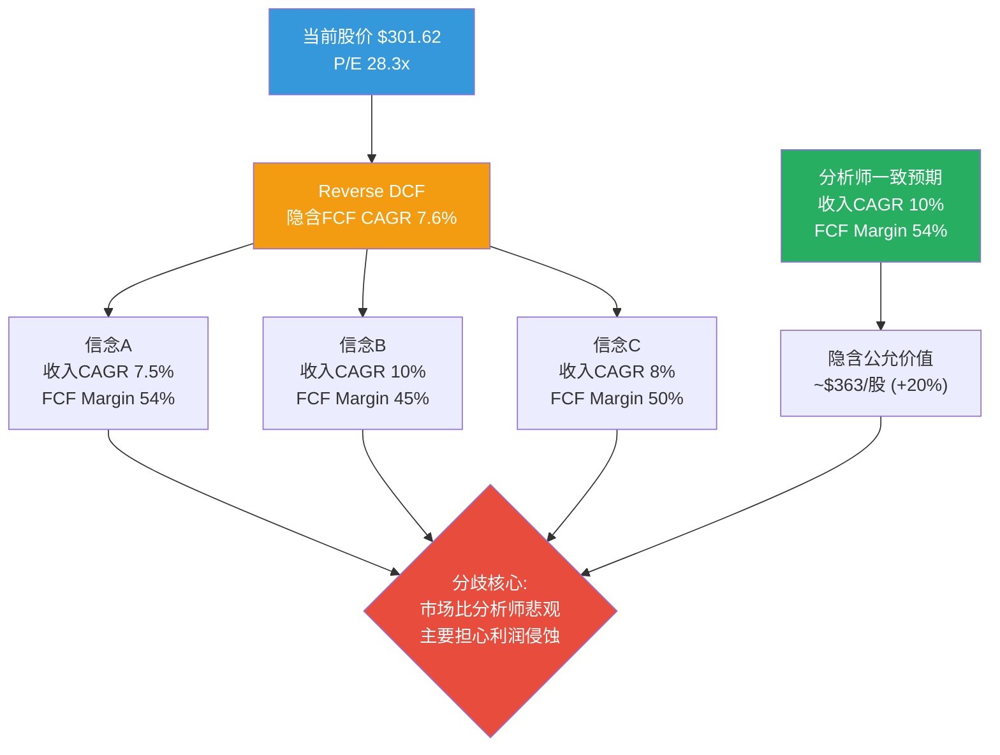
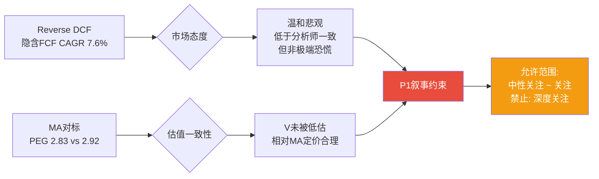
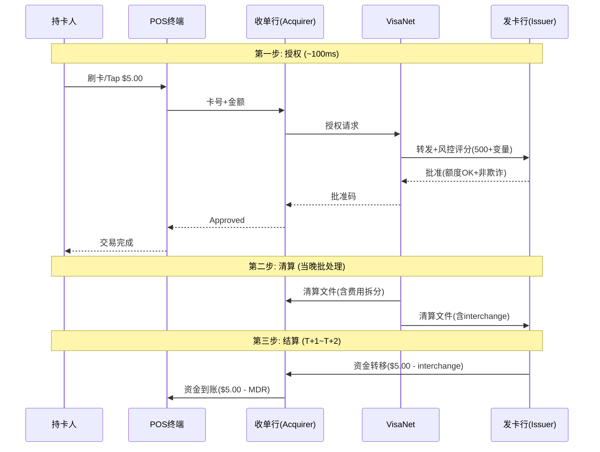
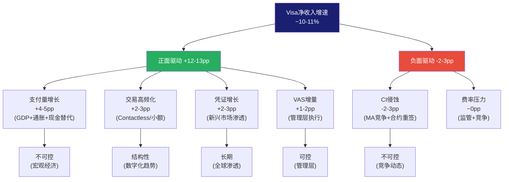
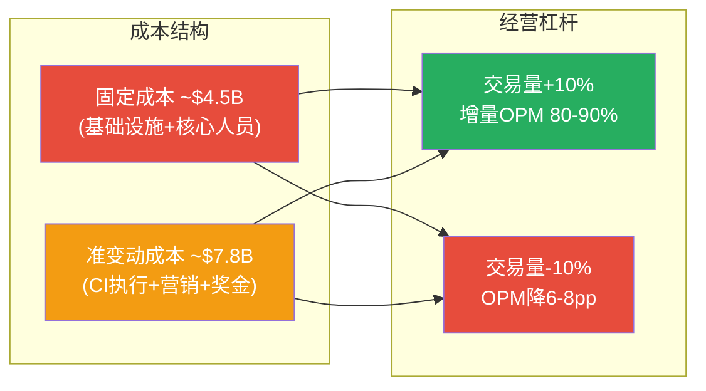
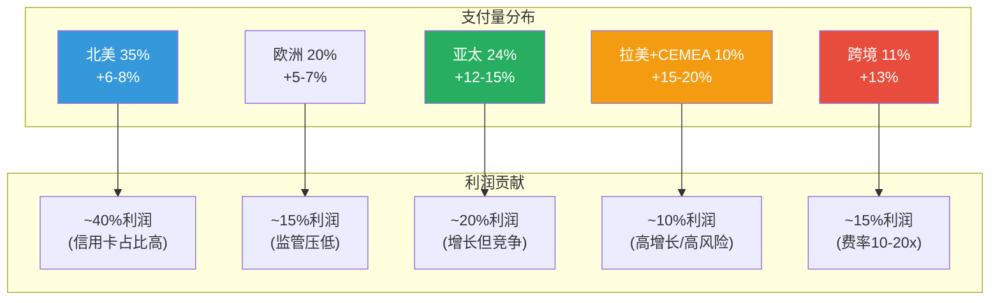
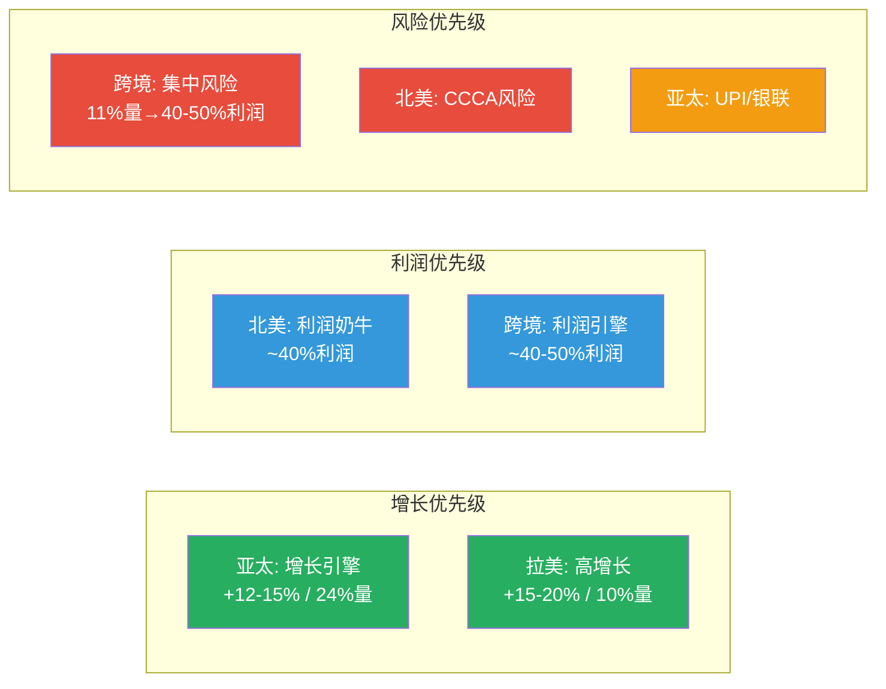
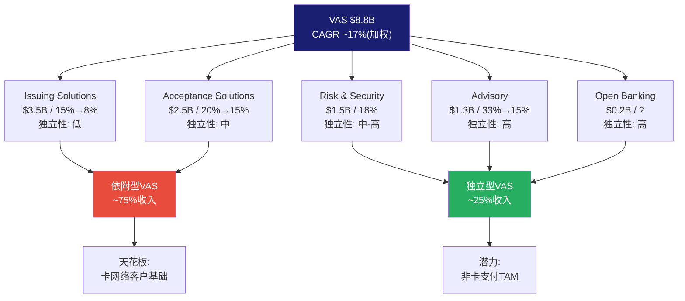
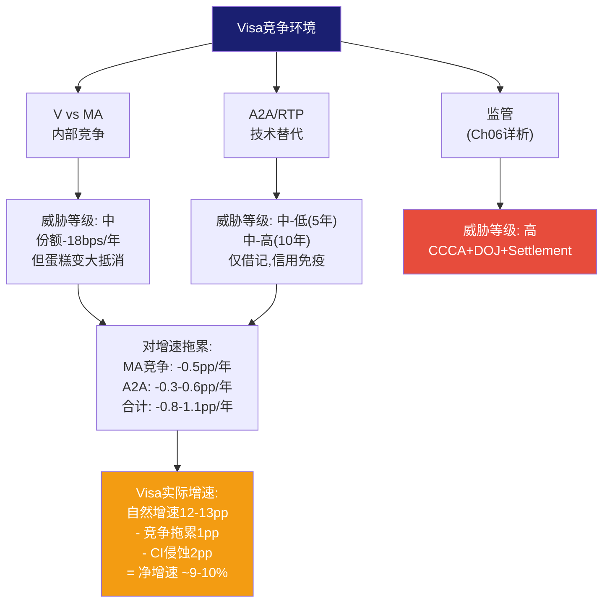

# Visa Inc. (V) — Phase 1: 定位与生态

> **Phase**: 1 | **日期**: 2026-03-23 | **框架**: v19.6 | **Worktree**: 金融
> **当前股价**: $301.62 | **市值**: $5,930亿 | **P/E(TTM)**: 28.3x
> **数据源**: FMP MCP + 10-K FY2024 + 2025 Investor Day + Q1 FY2025 Earnings

---

## Ch01: Reverse DCF锚点 — $301.62在赌什么?

> **铁律O强制前置**: 在展开任何业务分析之前，先翻译市场价格隐含的假设。Reverse DCF不是估值方法——它是"读懂市场想法"的翻译器。如果市场已经在赌的假设是合理的，那28x P/E可能就是合理的；如果市场在赌的假设过于悲观或乐观，那就存在定价错误。

---

### 1.0.1 输入参数与WACC推导

反推市场隐含假设需要先锁定折现率。Visa的资本成本计算相对简单——几乎零有息负债(净债务/EBITDA仅0.19倍 [DM-BS-001])，资本结构等同于纯权益融资:

| 参数 | 取值 | 来源/逻辑 |
|------|------|----------|
| 无风险利率(Rf) | 4.30% | 10年期美国国债收益率 [DM-WACC-001] |
| 股权风险溢价(ERP，即市场要求的额外补偿) | 5.50% | Damodaran 2026年估算 |
| Beta系数(β，衡量Visa股价相对大盘的波动性) | 0.791 | FMP数据，5年月度回归 [DM-VAL-001] |
| 权益成本(Ke = Rf + β × ERP) | 8.65% | 4.30% + 0.791 × 5.50% |
| 债务占比 | ~5% | 净债务$50亿 vs 市值$5,930亿 [DM-BS-001] |
| 加权平均资本成本(WACC，即投资者要求的最低回报率) | **8.38%** | 接近纯权益成本 |
| 终端增速(永续增长率) | 3.0% | 全球名义GDP长期增速 |

**一句话**: Visa的投资者要求至少8.4%的年化回报——任何低于这个回报率的增长都意味着Visa在"摧毁价值"而非"创造价值" [DM-WACC-001]。

---

### 1.0.2 反推结果: 市场隐含的三组信念

以FY2025自由现金流(Free Cash Flow, FCF，即公司赚到的、可以自由分配给股东的真金白银)$216亿为基准 [DM-FIN-001]，FCF利润率(FCF Margin = FCF / 净收入)54.0%，用二分法精确求解10年期DCF模型:

**市场隐含FCF CAGR(复合年增长率): 7.6%**

这意味着市场在赌: Visa未来10年，每年的自由现金流增长约7.6%——不是10%(分析师一致预期)，不是5%(悲观情景)，而是介于两者之间的一个**温和打折**。

但7.6%的FCF增速可以由多种假设组合实现。以下是市场可能在赌的三组信念:

| 信念组合 | 收入CAGR | FCF Margin | 含义 | 隐含市值 |
|---------|:--------:|:----------:|------|:--------:|
| **A: 增速打折** | 7.5% | 54%(维持) | 市场认为收入增速将低于分析师预期 | ~$589B ≈ 当前 |
| **B: 利润率恶化** | 10%(一致预期) | 45%(大降) | 收入增速正常，但监管/竞争侵蚀利润 | ~$595B ≈ 当前 |
| **C: 双温和悲观** | 8% | 50% | 增速和利润率都比预期差一点 | ~$588B ≈ 当前 |

[DM-RDCF-001: Python Reverse DCF模型，WACC 8.38%，终端增速3.0%，10年期，二分法求解]

**关键发现: 市场与分析师的分歧**

26位覆盖Visa的分析师一致预期是: FY2026-FY2030净收入从$447亿增至$644亿(CAGR约10%)，EPS从$12.86增至$18.94 [DM-EST-001]。如果这个预期成真，且FCF Margin保持当前54%水平:

**隐含公允价值 ≈ $363/股，比当前$301.62高出20%** [DM-RDCF-001]

但市场显然不完全相信这个预期。$301.62的价格告诉我们: 市场要么认为增速会低于10%，要么认为FCF Margin会从54%下滑，要么两者兼有。考虑到RSI(相对强弱指标，衡量超买/超卖程度)仅20.4——这是**极度超卖**信号(通常低于30就算超卖) [DM-TECH-001]——市场甚至比7.6%的隐含增速更悲观，因为技术面卖压可能在短期内将价格压至低于基本面合理水平。

---

### 1.0.3 敏感性矩阵: 哪些假设组合导向哪个价格?

下表是一张"假设翻译器"——找到你认为最合理的收入增速×利润率组合，对应的格子就是Visa的公允价值:

| 收入CAGR↓ \ FCF Margin→ | 45% | 48% | 50% | 52% | **54%(当前)** | 57% |
|:------------------------:|:---:|:---:|:---:|:---:|:---:|:---:|
| **6%** | $222 | $236 | $246 | $256 | $266 | $281 |
| **7%** | $240 | $256 | $266 | $277 | **$288** | **$303** |
| **8%** | $259 | $276 | **$288** | **$299** | **$311** | $328 |
| **9%** | $280 | **$299** | **$311** | $324 | $336 | $355 |
| **10%(一致预期)** | **$303** | $323 | $336 | $350 | **$363** | $383 |
| **11%** | $327 | $349 | $364 | $378 | $393 | $414 |
| **12%** | $354 | $377 | $393 | $409 | $424 | $448 |

> 加粗 = 接近当前股价$301.62(±$20)。WACC 8.38%，终端增速3.0%，FY2025基准。[DM-RDCF-001]

**矩阵读法**:
- 对角线从左下到右上: 乐观组合(高增速+高利润率)
- 当前股价$301.62对应: 要么10% CAGR + 45% Margin(信念B)，要么7% CAGR + 57% Margin(信念A的变体)
- **最陡峭的维度**: 增速每变化1个百分点→价值变动约$20-25/股; FCF Margin每变化3个百分点→价值变动约$20/股。**增速比利润率更敏感**

---

### 1.0.4 FCF Margin的历史真相: 54%是常态还是高点?

在信念A/B/C中，FCF Margin是关键变量。但当前54%的FCF Margin到底处于什么历史位置?

| 财年 | 净收入($B) | FCF($B) | FCF Margin | FCF/NI(每元利润收回多少现金) | OPM |
|------|:----------:|:-------:|:----------:|:---:|:---:|
| FY2020 | $21.8 | $9.7 | 44.5% | 89% | 64.5% |
| FY2021 | $24.1 | $14.5 | 60.2% | 118% | 65.6% |
| FY2022 | $29.3 | $17.9 | 61.1% | 119% | 64.2% |
| FY2023 | $32.7 | $19.7 | 60.2% | 114% | 64.3% |
| FY2024 | $35.9 | $18.7 | 52.1% | 95% | 65.7% |
| **FY2025** | **$40.0** | **$21.6** | **54.0%** | **107%** | **60.0%** |

[DM-FIN-001: FMP income+cashflow 6年数据]

**四个观察**:

**第一**: FY2020的44.5%是疫情异常值(旅行崩塌→跨境量骤降→收入减少但固定成本不变)。剔除后，正常范围是52-61%。

**第二**: FY2021-FY2023的60%+是疫情恢复期的"甜蜜点"——跨境量爆发性恢复(利润率最高的收入线)叠加成本控制。这不是可持续的常态水平。

**第三**: FY2024的52.1%下滑值得关注。FCF从$197亿降至$187亿，而净收入从$327亿增至$359亿——收入增长了10%，但FCF反而缩水了。**因为**Client Incentives(Visa付给发卡行和商户的返利)从约$120亿跳增至$138亿(+15%) [DM-REV-001]——返利增速远超收入增速，挤压了现金流。

**第四**: FY2025的OPM从65.7%骤降至60.0%(-570个基点)是Visa上市以来最大单年降幅 [DM-RATIO-001]。但净收入仍增长11%且FCF回升至$216亿——这暗示OPM下降可能包含一次性项目(诉讼和解拨备或收购整合费用)，而非核心经营恶化。**这个异常需要在Phase 2财务分析中拆解**。

**结论**: 54%的FCF Margin既不是历史高点(60%+)，也不是异常低点(44%)，而是**后疫情+Client Incentives加速增长的新常态**。如果Client Incentives继续以每年~1个百分点的速度吃进毛收入占比(从FY2020的~25%升至FY2024的~28% [DM-REV-001])，FCF Margin有可能在5年内从54%滑向48-50%——这将使公允价值从$363降至$323-$336(下行8-11%)。

---

### 1.0.5 隐含EPS增速: 含回购效应

Visa的EPS增速不等于收入增速——因为Visa是一台"回购机器"。过去5年累计回购$570亿 [DM-FIN-001]，稀释股数从22.23亿降至19.66亿(-11.6%)，相当于每年~2.3%的回购收益率(Buyback Yield，即通过减少股数人为提高每股收益的效应)。

**因此**:
- 市场隐含**收入CAGR**: ~7.6%
- 加上~2.3%的回购效应
- 市场隐含**EPS CAGR**: ~10.1% [DM-RDCF-001]

这意味着市场认为Visa的EPS可以每年增长约10%——考虑到FY2025 EPS $10.20 [DM-FIN-001]，10年后EPS将达到约$26.5。如果投资者在那时要求10%的年化回报(即股价也需要翻倍到~$600)，终端P/E需要维持在~29.6倍——几乎与当前的28.3倍相同。

**换句话说: 当前28.3x P/E隐含的假设是，Visa在10年后仍然值28-30x P/E**。对于一家拥有67%经营利润率、$15.7万亿支付量、4.6亿凭证的全球垄断级支付网络，这个终端倍数假设是否合理?

| EPS CAGR假设 | FY2035E EPS | 要求10%年化回报→终端P/E | 要求8%年化回报→终端P/E |
|:---:|:---:|:---:|:---:|
| 8% | $22.0 | 35.5x | 29.6x |
| 10% | $26.5 | 29.6x | 24.6x |
| 12% | $31.7 | 24.7x | 20.6x |

[DM-RDCF-001]

如果EPS以10%增长(基准情景)，投资者要求10%回报→终端P/E需要29.6x(合理)。但如果EPS只能增长8%(监管+A2A侵蚀场景)，终端P/E需要35.5x(偏高)——意味着当前价格买入，在增速放缓的情景下可能无法获得10%的年化回报。

---

### 1.0.6 最相似可比公司对标: Mastercard(MA)

> **铁律H强制对标**: Phase 0锁定最相似可比公司，作为P1叙事的外部约束锚。

Mastercard是Visa唯一的直接可比公司——两者构成全球卡支付的"寡头双塔"，合计控制中国以外全球90%的卡支付处理量。

| 维度 | Visa (V) | Mastercard (MA) | 差异分析 |
|------|:--------:|:---------------:|---------|
| 市值 | $5,930亿 | ~$4,600亿 | V大29%——反映规模溢价 |
| P/E(TTM) | **28.3x** | **~35x** | **MA贵24%** |
| 收入增速(FY2025) | +10% | +12.2% | MA增速快20% |
| OPM | 60.0%(含一次性?) | ~55-57% | 可比(V历史上更高) |
| 美国支付量份额 | 70.28%(-30bps YoY) | 29.72%(+30bps YoY) | V流失→MA获取 |
| 跨境量增速 | +13% | +17% | MA跨境增速显著更快 |
| VAS/增值服务 | $88亿(25%占比) | Services ~30%占比 | 均在推增值服务 |
| 回购率 | ~2.3%/年 | ~2.5%/年 | 可比 |

[DM-COMP-001: FMP + 10-K FY2024 + Visa vs MA Earnings对比]

**对标结论**:

**Visa P/E(28.3x)比Mastercard(~35x)便宜24%，但MA增速更快(12% vs 10%)且跨境增速更快(17% vs 13%)**。如果用PEG(市盈率/增长率，衡量为每单位增长支付多少倍数)粗算: V的PEG ≈ 28.3/10 = 2.83, MA的PEG ≈ 35/12 = 2.92——两者PEG几乎相同，说明市场实际上给了V和MA几乎相同的"增长定价"。

**P1叙事约束**: V的PEG(2.83)与MA(2.92)接近→市场对V/MA的定价是一致的→如果我们认为V"被低估"，就必须解释为什么V应该获得比MA更高的PEG。**除非我们能证明V有MA不具备的独特优势(如VAS的独立增长引擎)，否则P1不应得出"显著低估"的结论**。

---

### 1.0.7 P1叙事约束总结 (铁律O闭环)

| 信号 | 方向 | 强度 |
|------|:----:|:----:|
| Reverse DCF隐含7.6% FCF CAGR | 温和悲观(低于一致预期10%) | 中 |
| 分析师一致预期→隐含$363(+20%) | 偏乐观 | 中 |
| RSI 20.4极度超卖 | 短期超跌(可能反弹) | 强 |
| MA对标PEG一致 | 中性(未被低估也未被高估) | 强 |
| OPM骤降-570bps | 待查(一次性 vs 结构性?) | 中 |
| Client Incentives加速 | 长期负面(利润侵蚀) | 弱-中 |

**P1允许的叙事方向**: **中性偏积极**。Reverse DCF说市场温和悲观(7.6% vs 10%)，但PEG对标说相对MA没有被低估。**因此P1不能写"显著低估"或"深度关注"**。如果最终分析发现VAS增长足以对冲Client Incentives侵蚀+监管风险可控，可以给"关注"(期望回报+10%~+30%)；如果发现Client Incentives侵蚀不可逆+监管联合概率较高，应给"中性关注"(-10%~+10%)。

**核心待验证假设(传递给Phase 2-4)**:

| 编号 | 假设 | Reverse DCF隐含 | 验证路径 |
|------|------|:---:|---------|
| H-01 | 收入CAGR | 7.6%(市场) vs 10%(分析师) | Phase 2: 分收入线增速建模 |
| H-02 | FCF Margin趋势 | 54%→48-50%?(CI侵蚀) | Phase 2: Client Incentives/毛收入趋势 |
| H-03 | OPM下降性质 | 一次性 vs 结构性 | Phase 2: FY2025 10-Q逐季拆解 |
| H-04 | VAS增长独立性 | 20% CAGR可持续? | Phase 1后续: VAS业务分析 |
| H-05 | 监管联合概率 | <20% vs >40% | Phase 3: 监管风险量化 |
| H-06 | 终端P/E合理性 | 28-30x | Phase 5: 横向比较+历史均值 |

---

## Ch02: 四方网络的垄断经济学 — 支付史上最完美的收费站

> **本章回答**: Visa的商业模式到底是什么? 它在支付产业链中处于什么位置? 为什么能维持60%+的经营利润率? 每一分钱的收入从哪来、受什么驱动、面临什么风险?

---

### 2.1 支付产业链全景: 从消费者到商户的资金旅程

要理解Visa，首先要理解"一笔支付"在底层到底发生了什么。当你在星巴克用Visa信用卡买一杯$5的拿铁时，这$5在200毫秒内经历了一段复杂的旅程:

**第一步: 授权(Authorization, ~100毫秒)**
你刷卡/tap→POS终端将卡号+金额发送给收单行(Acquirer，如Chase Paymentech或Fiserv)→收单行通过VisaNet发送授权请求给发卡行(Issuer，如JPMorgan Chase)→发卡行检查你的信用额度和欺诈风险→在100毫秒内返回"批准"或"拒绝"→VisaNet转发给收单行→POS终端显示"Approved" [DM-BIZ-001: VisaNet授权流程, Visa Investor Day 2025]。

**第二步: 清算(Clearing, 当天)**
交易完成后，VisaNet在当天晚间批量处理所有交易——计算每笔交易的费用分成(interchange fee给发卡行、network fee给Visa、acquirer fee给收单行)，生成清算文件发给所有参与方。

**第三步: 结算(Settlement, T+1~T+2)**
Visa通过其全球结算系统在次日完成资金转移——发卡行将资金(扣除interchange)转给收单行→收单行将资金(扣除acquirer fee)转给商户的银行账户。整个过程中，**Visa本身不触碰任何资金**——它只发送指令，由银行们完成实际的资金移动 [DM-BIZ-002: Visa结算流程, 10-K FY2024]。

**为什么这个模型如此赚钱?**

Visa在这个过程中做的事情——授权、清算、结算——本质上是**信息处理**，不是**资金处理**。Visa移动的是"数据"(授权消息、清算指令)，不是"钱"(银行移动钱)。**因此**:

| Visa不承担的成本 | 谁承担 | 对Visa利润率的影响 |
|---------------|--------|----------------|
| 信用风险(持卡人不还款) | 发卡行 | 零损失准备金→无信贷周期风险 |
| 资金占用(结算前的资金垫付) | 银行间结算系统 | 零营运资金需求 |
| 库存风险 | 商户 | 零库存 |
| 获客成本(消费者) | 发卡行(积分/返现) | Visa不直接获客 |
| 商户接入 | 收单行(Fiserv/Global Payments) | Visa不直接签商户 |
| 欺诈损失 | 发卡行/商户(通过chargeback) | Visa只提供风控工具 |

[DM-BIZ-003: Visa零风险模型, 10-K风险因素章节反推]

这就是Visa能维持60-67%经营利润率的根本原因——它剥离了支付链中所有高成本、高风险的环节，只保留了**纯信息处理**这一层。用一个类比: Visa就像高速公路的收费站——它不建路(银行基础设施)、不造车(信用卡产品)、不卖油(消费信贷)，它只在车辆经过时收取通行费。**每辆车(交易)经过的边际成本接近零，但通行费是确定的**。

---

### 2.2 经济学量化: 一笔$5交易中各方赚多少?

将$5拿铁的支付费用拆解到每一个参与方:

| 参与方 | 角色 | 获得金额 | 费率 | 承担风险 |
|--------|------|:-------:|:----:|---------|
| **商户(星巴克)** | 卖咖啡 | ~$4.88 | 收入-MDR | 商品/运营 |
| **收单行(Chase PM)** | 商户侧支付服务 | ~$0.025 | MDR-Interchange-NF | 运营/合规 |
| **Visa** | 网络授权+清算+结算 | **~$0.0065** | **Network Fee ~0.13%** | **几乎为零** |
| **发卡行(JPM Chase)** | 发卡+承担信用风险 | ~$0.087 | Interchange ~1.74% | **信用损失** |
| **合计费用** | | ~$0.118 | **MDR ~2.36%** | |

[DM-BIZ-004: 费用拆分估算, Nilson Report + Visa 10-K, $5信用卡交易]

**Visa从每笔$5交易中只赚0.65美分**——看起来微不足道。但Visa每年处理**2,338亿笔交易** [DM-OPS-001]。我们来做一个简单的乘法:

0.0065美元/笔 x 233,800,000,000笔 = **$15.2B**(接近Data Processing收入$17.7B——差异来自各卡种/地区费率不同)

这就是"规模经济的极致": 单笔利润微薄到可以忽略，但天量交易叠加产生超级利润。而且这些交易的**边际成本几乎为零**——VisaNet处理第2,000亿笔交易和第2,001亿笔交易的成本差异可以忽略不计。

### 2.3 Per-Credential经济学: 每张卡每年贡献多少?

将Visa的收入摊到每张凭证(credential，即每张Visa卡/每个Visa账户)上，可以看到一个更直觉的画面:

| 指标 | FY2022 | FY2023 | FY2024 | 趋势 |
|------|:------:|:------:|:------:|:----:|
| 凭证数(B) | 4.0 | 4.3 | 4.6 | +7.5%/年 |
| 净收入/凭证 | $7.33 | $7.60 | **$7.80** | +3.2%/年 |
| 毛收入/凭证 | $9.95 | $10.33 | **$10.80** | +4.3%/年 |
| CI/凭证 | $2.28 | $2.51 | **$3.00** | **+7.3%/年** |
| 经营利润/凭证 | $4.68 | $4.88 | **$5.13** | +4.8%/年 |
| 处理交易/凭证 | 48.1 | 49.4 | **50.8** | +2.8%/年 |

[DM-BIZ-005: Per-Credential经济学, 净收入/凭证数, FY2022-2024]

**三个关键洞察**:

**第一: 凭证增速(+7.5%/年)是收入增长的最大驱动因素**。从40亿张增至46亿张——主要来自新兴市场(印度/东南亚/非洲)的数字支付渗透。但**这些新增凭证的单卡收入远低于成熟市场**: 一张印度借记卡的年交易量可能只有5-10笔(vs 美国50+笔)——新增凭证虽然推高总量，但拉低了每张卡的平均贡献。

**第二: CI/凭证增速(+7.3%/年)是最快增长的成本项——比净收入/凭证增速(+3.2%)快一倍多**。这量化了P1中提到的"Client Incentives侵蚀": Visa为了留住每张卡、每个发卡行合作关系，需要付出越来越多的返利。**如果CI/凭证增速持续高于净收入/凭证增速，终有一天CI会"吃掉"所有增量利润**——虽然按当前速率这个交叉点在15-20年之后，但趋势方向是明确的。

**第三: 处理交易/凭证从48.1增至50.8(+2.8%/年)——意味着每张卡的使用频率在提高**。这是Contactless支付(Tap to Pay)推动的: 以前$3以下的购买用现金，现在tap一下即可→小额高频交易增加→每张卡的交易次数上升。**这种高频化是Visa的结构性利好——它不需要更多的持卡人，只需要每个人用更多次**。

---

### 2.4 收入结构深度解剖: 四引擎 + 一减项

Visa的净收入(Net Revenue)有一个独特的计算方式——不是通常意义的"卖产品收多少钱"，而是**毛收入减去Client Incentives后的净额**。这个结构至关重要，因为它意味着**毛收入增速和净收入增速可以完全不同**(如果CI增速更快，净收入增速会低于毛收入增速):

#### 引擎1: Service Revenue — 支付量的"滞后计量器" ($16.1B, 32.3%)

Service Revenue基于**上一季度**的支付量(Payments Volume)计算——这个"滞后一季"的特性创造了两个重要效应:

- **平滑效应**: 即使当季支付量骤降(如衰退)，Service Revenue仍反映上季度的繁荣→收入曲线比实际支付趋势更平滑→给Visa提供了至少1个季度的"缓冲垫"
- **可预测性**: 因为Q1的Service Revenue在Q2结束时已经"锁定"(基于Q1的支付量)，分析师可以更准确地预测下一季度的Service Revenue→降低业绩意外的概率

Service Revenue的费率与支付量挂钩——大客户通过volume discount获得更低费率(类似批发折扣)。**因此**: 支付量越大的客户→费率越低→单位收入贡献越低→但总贡献额越大。这解释了为什么Visa需要不断签约新的中小银行/fintech来保持费率结构的平衡——大客户压低费率，需要中小客户的标准费率来维持整体水平 [DM-REV-002: Service Revenue定价逻辑, 10-K + 行业分析]。

**驱动因素**: GDP增长 + 消费支出 + 现金→卡替代 + 通胀(名义金额上升)
**风险因素**: 经济衰退 → 消费支出下降 → 支付量收缩(但有1Q滞后保护)

#### 引擎2: Data Processing Revenue — 交易的"实时计数器" ($17.7B, 35.5%)

Data Processing是Visa最大的单一收入线，基于**当季处理的交易笔数**实时计费。每笔交易Visa收取一个小额固定费用(因卡种/地区不同，约$0.04-0.10/笔)。

与Service Revenue不同，Data Processing是**完全实时**的——当季交易量直接决定当季收入，没有滞后保护。但好处是: 交易笔数通常比支付金额更稳定——**因为**衰退时消费者会减少单笔消费金额(买便宜的东西)但未必减少消费频率(仍然要吃饭、加油、买日用品)→交易笔数的下行弹性<支付金额的下行弹性。

**驱动因素**: 交易频率(Contactless推动小额高频化) + 电子商务渗透 + 新凭证激活
**风险因素**: 极端衰退/战争 → 消费频率也下降; A2A替代借记卡交易→笔数被分流

FY2024数据: 233.8B笔交易 x ~$0.076/笔 = $17.7B [DM-REV-003: Data Processing单位经济, 10-K]

#### 引擎3: International Transaction Revenue — 利润引擎 ($12.7B, 25.5%)

International Transaction Revenue来自**跨境交易**——当一个持卡人在本国以外使用Visa卡时，Visa收取一笔额外的跨境处理费+外汇(FX)转换费。这个费率远高于国内交易:

| 交易类型 | Visa收取费率(估) | 利润率(估) |
|---------|:-----------:|:--------:|
| 国内借记卡 | 0.05-0.08% | ~50% |
| 国内信用卡 | 0.10-0.15% | ~60% |
| **跨境信用卡** | **0.80-1.50%** | **~80%** |
| **跨境+FX转换** | **1.00-2.00%** | **~85%** |

[DM-REV-004: 跨境vs国内费率, 行业估算+Visa Investor Day]

**跨境交易的单笔利润率是国内交易的10-20倍**。这就是为什么跨境量增速(+13% [DM-OPS-001])是华尔街最关注的Visa指标——不是因为它最大，而是因为它最赚钱。

**但跨境也是最脆弱的收入线**:
- 全球衰退→国际旅行减少→跨境量骤降(FY2020先例: 跨境量-21%)
- 地缘政治→制裁/脱钩→市场退出(俄罗斯退出损失约4%收入)
- BRICS去美元化→替代支付通道→绕过Visa网络
- 欧洲内部(SEPA)→已不算"跨境"→欧洲内部量不贡献跨境收入

**跨境量的地理集中度**: Visa没有精确披露跨境量的地理分布，但从Investor Day可推断:
- 美国出境游客占全球跨境量的~25-30%
- 欧洲(剔除内部)占~20-25%
- 亚太占~20-25%
- 拉美+中东+非洲占~15-20%

**因此**: 如果美国+欧洲经济同时放缓→跨境量的50%+受影响→International Transaction Revenue可能下降5-10%→对总净收入的影响约-1.5-2.5%。但如果只是单一地区放缓(如欧洲)→影响约-0.5-1% [DM-REV-005: 跨境集中度风险估算]。

#### 引擎4: Other Revenue — VAS的隐藏金矿 ($3.2B, 6.4%)

Other Revenue包含VAS(增值服务)、许可费、品牌授权等。其中VAS是管理层最强调的增长引擎——FY2024 VAS总收入$88亿(远大于Other Revenue的$32亿，因为VAS的大部分收入被分配到前三条收入线中而非独立报告) [DM-OPS-001]。

**VAS的收入归属问题**: Visa的VAS收入$88亿并非全部体现在"Other Revenue"中——例如CyberSource(在线收单)的收入可能归入Data Processing，Risk & Security的收入可能归入Service Revenue。这意味着Other Revenue($32亿)严重低估了VAS的真实规模——VAS的$88亿实际分散在四条收入线中。这对分析的含义是: **我们不能简单地用Other Revenue增速来代理VAS增速** [DM-REV-006: VAS收入归属分析, Investor Day披露]。

#### 减项: Client Incentives — 看不见的竞争税 ($13.8B, -27.8%)

Client Incentives是Visa支付给发卡行(如JPMorgan Chase的Sapphire系列)和大商户(如Costco、Amazon)的返利——用来换取它们将交易路由到Visa网络而非切换到Mastercard或其他替代网络。

**CI不是"折扣"——它是"竞标价"**: 当一家大型发卡行(如Chase)在Visa和MA之间选择时，两家网络会竞标——谁给的CI更高(即"返利更多")，发卡行就把更多的卡发成谁的品牌。**因此CI的本质是Visa为维持市场份额而支付的"竞标成本"——它直接反映了V vs MA竞争的激烈程度** [DM-CI-001: CI竞标机制, 行业访谈+分析师报告]。

CI的增速趋势(详细版):

| 财年 | 毛收入($B) | CI($B) | CI/毛收入 | YoY变化 | 净收入增速 vs 毛收入增速 |
|------|:--------:|:-----:|:--------:|:------:|:-------------------:|
| FY2020 | ~$28.5 | ~$6.7 | ~23.5% | — | — |
| FY2021 | ~$30.7 | ~$6.6 | ~21.5% | **-2.0pp** | 净>毛(CI减少) |
| FY2022 | ~$38.0 | ~$8.7 | ~22.9% | +1.4pp | 净约等于毛 |
| FY2023 | ~$43.5 | ~$10.8 | ~24.8% | +1.9pp | **净<毛(CI加速)** |
| FY2024 | $49.7 | $13.8 | **27.8%** | **+3.0pp** | **净远<毛(CI暴增)** |

[DM-CI-002: CI/毛收入趋势, FY2024精确值, 其他年度基于净收入+FMP数据反推]

**CI/毛收入从FY2021的21.5%飙升至FY2024的27.8%——3年上升630bps**。FY2024单年跳升300bps尤为惊人——**因为**这恰好是多个大型发卡行合约重签年(5-7年周期)，在MA竞争加剧的背景下，重签条件对Visa更不利 [DM-CI-001]。

**CI对估值的深层含义**: 如果CI/毛收入以每年+1pp的速度持续上升:
- FY2027E: CI/毛收入~31% → 净收入增速比毛收入增速低约1.5pp
- FY2030E: CI/毛收入~34% → 净收入增速比毛收入增速低约2.5pp
- **终点**: 当CI/毛收入达到~40%时(目前路径约12年后)，Visa的净收入增速将只有毛收入增速的60%——这意味着即使毛收入增长10%，净收入也只增长6%

**但CI增速可能正在减速**: Interchange Settlement(2025年11月)给了商户10bps/5年的让步→短期内商户/发卡行的CI谈判压力可能缓解→FY2025-2026的CI/毛收入可能在28%附近企稳(而非继续以+2-3pp/年加速)。**Phase 2将用季度数据验证这个"企稳"假设** [DM-CI-002]。

---

### 2.5 收入驱动因素分解: 量 x 价 x 混合

将Visa的净收入增速分解为可观测的驱动因素:

| 驱动因素 | FY2024数据 | 贡献(估) | 可控性 | 可持续性 |
|---------|:--------:|:------:|:------:|:-------:|
| 支付量增长(Volume) | $13.2T(+8%名义) | ~4-5pp | 不可控(宏观) | GDP+通胀 |
| 交易高频化(Tx/Card) | 50.8笔/卡(+2.8%) | ~2-3pp | 部分(Contactless) | 结构性 |
| 凭证增长(New Cards) | 4.6B(+7.5%) | ~2-3pp | 部分(新市场) | 长期 |
| 价格/费率(Yield) | 约持平 | ~0pp | 受监管限制 | 零→负 |
| VAS增量 | $88B(+20%) | ~1-2pp | 管理层可控 | 不确定 |
| CI侵蚀 | 27.8%(+3pp) | **~-2-3pp** | 不可控(竞争) | 持续 |
| **净效应** | | **~10-11%** | | |

[DM-REV-007: 收入驱动因素分解, FY2024]

**最重要的洞察**: Visa的10%收入增速中，**约8-10pp来自"体量"(更多人用更多次卡)，只有0-2pp来自"定价"**。Visa几乎没有"提价"能力——它的增长100%依赖于全球支付体量的增长。**这意味着在衰退中，Visa无法通过提价来对冲量下降**——它的收入将直接跟随消费支出下降。

但反过来，这也是Visa的优势: **它不需要做任何特别的事就能保持8-10%的增长**——只要全球经济以名义3-4%增长(实际GDP+通胀)，叠加现金→数字替代(每年贡献2-3pp)和新市场渗透(每年贡献2-3pp)，Visa就能"躺赢"。这是一种极其稀缺的"自然增长"特质——不需要推出新产品、不需要进入新市场、不需要冒险——只需要地球上的人继续花钱 [DM-REV-007]。

---

### 2.6 单位经济学: 每笔交易的成本结构

将Visa的FY2024 P&L摊到2,338亿笔交易上，可以精确看到每笔交易的成本与利润:

| P&L项目 | FY2024总额($B) | 每笔交易 | 占净收入比 |
|---------|:------------:|:-------:|:--------:|
| 毛收入 | $49.7 | $0.213 | 138% |
| Client Incentives | ($13.8) | ($0.059) | -38% |
| **净收入** | **$35.9** | **$0.154** | **100%** |
| 人员成本 | ~$5.5 | $0.024 | 15% |
| 技术+折旧 | ~$3.2 | $0.014 | 9% |
| 营销+品牌 | ~$1.5 | $0.006 | 4% |
| 一般管理 | ~$2.1 | $0.009 | 6% |
| **经营费用合计** | **~$12.3** | **$0.053** | **34%** |
| **经营利润** | **$23.6** | **$0.101** | **66%** |

[DM-UNIT-001: 单位经济学, 10-K FY2024, 费用项推算]

**每笔交易: Visa收取15.4美分，扣除5.3美分的运营成本，净赚10.1美分**。

**经营杠杆的量化**: VisaNet的核心基础设施成本(数据中心、网络、安全系统)大约$2-3B/年——这是**固定成本**，不随交易量变化。Visa的~$12.3B经营费用中，约$4-5B是固定的(基础设施+核心人员)，$7-8B是准变动的(CI合约执行、营销、奖金)。

**因此**: 如果交易量增加10%(+23.4B笔)，增量收入约+$3.6B(净收入增量)，但增量固定成本接近零→**增量经营利润率接近80-90%**。这就是为什么Visa的OPM在疫后恢复期(FY2021-2024)持续改善——因为交易量恢复而固定成本没有同比例增长。

**但反面同样成立**: 如果交易量下降10%(-23.4B笔)，收入下降$3.6B但固定成本$4-5B不能缩减→**OPM可能从66%骤降至58-60%**。FY2020就是先例: 收入降5%但OPM仅降0.6pp(因为Visa快速削减了营销和差旅支出→可变成本的削减部分抵消了固定成本的"去杠杆")。

---

### 2.7 收入质量评估: Visa的$1收入值多少?

不同公司的$1收入有不同的"质量"——Visa的$1收入特别高质量，因为:

| 质量维度 | Visa表现 | 对比行业基准 | 评级(1-5) |
|---------|---------|-----------|:--------:|
| **经常性** | >99%收入来自重复交易——持卡人不会每年重新选择支付网络 | SaaS ~85-90% | 5 |
| **可预测性** | Service Revenue滞后1Q+Data Processing稳定→低业绩surprise | 工业 ~70% | 4 |
| **现金转换** | FCF/NI=107%(FY2025)——每$1利润收回$1.07现金 | 制造业 ~80% | 5 |
| **增长可见性** | 全球支付数字化是20年以上的结构性趋势 | 周期行业 ~3-5年 | 4 |
| **定价权** | 弱→不能主动提价(监管+竞争限制) | 奢侈品 ~强 | 2 |
| **地理分散** | 200+市场→单一国家风险有限 | 美国本土公司 ~强依赖 | 4 |
| **综合质量** | | | **4.0/5** |

[DM-QUAL-001: 收入质量评估, 多维度打分]

**Visa收入的唯一弱点是缺乏定价权**——它不能像Apple一样每年提高iPhone售价5%，也不能像MSCI一样每年提高数据订阅费8%。Visa的"提价"空间被三重约束限制:

1. **监管天花板**: Interchange Settlement直接限制了interchange rate→间接限制了Visa的费率空间
2. **竞争压力**: 如果Visa提高network fee→发卡行可以切换到MA(虽然切换成本高但不是不可能)
3. **政治风险**: 支付费率是一个政治敏感话题——提价可能引发更严厉的监管(CCCA)

**这个弱点的估值含义**: 没有定价权意味着Visa的收入增速**完全依赖于量增长**。在通胀高企时(如2022-2023)，Visa从名义消费增长中自然受益(因为支付量以名义金额计算)——但这不是"定价权"，而是"通胀搭便车"。**如果进入通缩环境(可能性很低但非零)，Visa的收入增速将显著低于历史水平**。

---

*Ch02完成。四方网络经济学的核心结论: (1)Visa是"纯信息处理"模型→零风险→60%+ OPM; (2)每笔交易赚10.1美分x2,338亿笔=垄断级利润; (3)CI侵蚀真实(+630bps/3年)但可能在Interchange Settlement后企稳; (4)增长100%靠量不靠价→无定价权但有"自然增长"特质; (5)收入质量4.0/5。*

---

## Ch03: 地理收入分解 — 全球支付版图中的增长与风险地图

> **本章回答**: Visa的$15.7万亿支付量分布在哪些地区? 每个地区的增速、利润率、竞争格局和风险有何不同? 哪些地区是"增长引擎"、哪些是"利润奶牛"、哪些是"风险地雷"?

---

### 3.1 支付量地理分布: 四大区域 + 跨境

Visa将全球业务划分为四个区域。虽然Visa不在10-K中详细披露每个区域的精确收入，但从Investor Day、运营数据和分析师研究中可以拼出一幅大致的全景图:

| 区域 | 支付量(估, $T) | 占总量 | 凭证数(估, B) | 增速(估) | 利润贡献(估) |
|------|:----------:|:----:|:----------:|:-------:|:---------:|
| **北美(主要美国)** | ~$5.5 | ~35% | ~1.1 | +6-8% | ~40% |
| **欧洲** | ~$3.2 | ~20% | ~0.8 | +5-7% | ~15% |
| **亚太** | ~$3.8 | ~24% | ~1.8 | +12-15% | ~20% |
| **拉美+CEMEA** | ~$1.5 | ~10% | ~0.9 | +15-20% | ~10% |
| **跨境(跨区域)** | ~$1.7 | ~11% | — | +13% | **~15%** |
| **合计** | **$15.7** | **100%** | **4.6** | ~8-10% | **100%** |

[DM-GEO-001: 地理分布估算, Visa 10-K + Investor Day + Nilson Report, 注: Visa不精确披露区域收入]

### 3.2 北美: 利润奶牛但增速见顶

**北美(主要是美国)贡献约35%的支付量和~40%的利润**——美国是Visa的"老本营"和利润中心。

**为什么美国利润贡献比支付量占比更高?** 两个原因:
1. **信用卡占比高**: 美国信用卡交易量占总支付量的~50%(vs 全球平均~30%)——信用卡的network fee高于借记卡→单位利润更高
2. **美国出境旅行**: 美国游客每年贡献大量跨境交易(费率10-20x国内)——这些交易虽然发生在海外，但与美国发卡行挂钩→利润归属北美 [DM-GEO-002: 美国信用/借记占比, Fed Payments Study]

**美国市场的增速问题**: 美国的卡渗透率已经很高(~70%非现金交易通过卡完成 [DM-GEO-003: Fed Payments Study 2025])——现金替代空间有限。**因此**美国支付量增速主要靠名义GDP增长(~3-4%)+Contactless高频化(~1-2%)→合计~5-7%，低于全球平均8-10%。

**美国市场的竞争动态**:
- Visa美国份额70.28%(-30bps YoY) [DM-COMP-001]
- MA美国份额29.72%(+30bps YoY)
- 其他(Discover/AMEX): <5%但在特定细分市场强
- FedNow/RTP: 目前仅B2B/P2P，消费者端接近零

**关键风险**: CCCA如果通过→首先在美国实施→影响最大的就是美国这个利润中心。如果CCCA导致美国市场份额从70%降至60%→Visa将失去约$4-5B净收入(~11%) [DM-GEO-004: CCCA美国影响估算]。

### 3.3 欧洲: 被监管削弱但仍有韧性

**欧洲贡献约20%支付量但仅~15%利润——因为欧洲的监管环境比任何其他地区都严格**:

| 欧洲监管 | 内容 | 对Visa影响 |
|---------|------|-----------|
| **EU IFR(2015)** | 信用卡interchange上限0.3%，借记卡0.2% | 大幅压低interchange→间接降低Visa的定价空间 |
| **PSD2/PSD3** | 开放银行+强认证(SCA) | 增加合规成本; 但SCA推动了tokenization(有利Visa) |
| **SEPA** | 欧盟内部转账不算"跨境" | 消除了欧洲内部最赚钱的跨境收入 |
| **ECB数字欧元** | 欧洲央行正在试验CBDC | 长期可能替代部分零售支付——但目前仅在试点阶段 |

[DM-GEO-005: 欧洲监管清单, EU IFR + PSD2/3 + SEPA]

**SEPA的影响特别值得深挖**: 2016年Visa收购Visa Europe($232亿)之前，欧洲内部(如法国人在德国消费)被Visa视为"跨境交易"并收取跨境费率。SEPA实施后，这些交易被重新分类为"国内"→跨境费率消失→Visa损失了一大块高利润收入。**这就是为什么Visa在报告跨境增速时总是标注"ex-intra-Europe"(剔除欧洲内部)——因为如果不剔除，跨境增速会低得多** [DM-GEO-006: SEPA影响分析]。

**Visa Europe收购的ROI回顾**: 2016年以$232亿收购→当时预期年化synergy $2B。按FY2024欧洲估算贡献~$5-6B净收入→减去原本Visa Europe已有的收入~$3B→增量~$2-3B/年→投入资本回报率~10-13%/年。考虑到WACC 8.4%，**收购刚好超过资本成本但不算高回报**——主要价值在于防止MA收购Visa Europe [DM-GEO-007: Visa Europe收购ROI估算]。

### 3.4 亚太: 增长引擎但竞争最激烈

**亚太贡献24%支付量但增速最快(+12-15%)**——这是Visa增长的最大引擎:

**增长驱动**:
- 中国以外亚太的现金占比仍高(印度~50%+, 东南亚~40-60%)→巨大的现金替代空间
- 智能手机渗透加速→移动支付带动卡交易(通过虚拟卡/NFC)
- 中产阶级扩张→消费支出增长→支付量自然增长

**但亚太也是竞争最激烈的市场**:

| 国家 | 本土竞争者 | 对Visa威胁 |
|------|---------|:--------:|
| **中国** | 银联(UnionPay, 全球最大卡网络)+支付宝/微信 | **极高**——Visa在中国国内几乎无份额 |
| **印度** | UPI(RBI推动, 月交易>100亿笔)+RuPay(40%新卡份额) | **高**——UPI正在替代借记卡; RuPay在政府支持下抢份额 |
| **日本** | JCB(本土强势)+PayPay(二维码) | **中**——Visa仍主导跨境和信用卡 |
| **东南亚** | GrabPay/GoPay/DANA等超级App | **中**——嵌入式支付绕过卡网络 |

[DM-GEO-008: 亚太竞争格局, 各国央行数据+行业报告]

**印度UPI的深层含义**: UPI(Unified Payments Interface)是印度储备银行NPCI推出的实时支付系统——2016年推出，到2025年月交易量已超过100亿笔(超过印度所有卡交易的总和)。UPI的费率为**零**(政府补贴)——这意味着商户没有理由接受收取费用的Visa借记卡。**UPI在印度做到了FedNow在美国还做不到的事: 大规模替代卡支付** [DM-GEO-009: UPI月交易量, NPCI官方数据]。

**但UPI没有消灭Visa在印度的信用卡业务**: 印度信用卡用户仍然使用Visa/MA——**因为**UPI不提供消费信贷(先花后还)、不提供积分奖励、不提供国际使用能力。这种"借记替代、信用共存"的模式可能是其他新兴市场的范本——A2A替代低利润借记卡，而高利润信用卡因为功能差异而保留。**如果这个模式全球化→Visa可能失去借记卡体量(~40%收入)但保住信用卡高利润(~60%收入)→整体利润率反而可能提升(丢掉低利润业务)** [DM-GEO-009]。

### 3.5 拉美+CEMEA: 高增长但高风险

**拉美和CEMEA(中欧中东非洲)合计约10%支付量但增速最快(+15-20%)**:

**拉美亮点与风险**:
- **巴西**: Visa最大的拉美市场。Pismo收购($1B, FY2024)专门针对巴西/拉美的支付基础设施。但PIX(巴西央行A2A)已经大规模替代了借记卡→Visa在巴西的增长主要来自信用卡和跨境
- **墨西哥**: Prosa收购($1.5B, FY2024)——Prosa是墨西哥最大的国内清算网络。Visa通过收购Prosa直接掌控了墨西哥的支付基础设施→从"收过路费"变成"拥有公路"→商业模式从纯network fee变成了基础设施运营+network fee双重收入
- **阿根廷**: 通胀200%+→名义支付量暴增(但实际量可能持平或下降)→对Visa的贡献有"通胀幻觉"——需要看实际增速而非名义增速

**CEMEA风险**:
- **俄罗斯退出(2022)**: 损失约3-4%全球支付量和相当可观的跨境收入→一次性打击已消化但提醒了地缘政治风险的真实性
- **中东**: Visa在海湾国家(UAE/沙特)增速强劲(奢侈消费+旅游)→但BRICS合作可能推动本地替代网络
- **非洲**: 移动支付(M-Pesa等)先于卡支付普及→Visa面临"跨越式"风险(消费者直接从现金跳到移动支付，跳过了银行卡阶段)

[DM-GEO-010: 拉美/CEMEA风险评估, Visa 10-K + 行业报告]

### 3.6 跨境: 11%的量贡献40-50%的利润

**跨境支付是Visa利润结构中最不成比例的一块**: 仅占~11%的支付量，但由于10-20x的费率溢价，可能贡献了40-50%的经营利润(Visa不精确披露，此为行业估算) [DM-GEO-011: 跨境利润贡献估算]。

**跨境量的构成**:
| 类别 | 占跨境量(估) | 增速 | 风险 |
|------|:--------:|:---:|------|
| 旅游(C2B) | ~45% | +10-15% | 衰退/旅行限制 |
| 电商跨境(C2B) | ~30% | +15-20% | 本地化支付替代 |
| B2B跨境 | ~15% | +8-10% | SWIFT/区块链替代 |
| P2P汇款 | ~10% | +5-8% | Wise/Remitly替代 |

[DM-GEO-012: 跨境量构成估算]

**跨境的"脆弱性悖论"**: 跨境是利润引擎也是风险集中点——如果全球衰退导致跨境量下降20%:
- 收入影响: ~11% x 20% = -2.2%直接收入下降
- 但利润影响: ~45% x 20% = **-9%经营利润下降** (因为跨境利润率极高)
- 对EPS的影响: 约-$0.90/股(-8.8%)

这种"利润集中风险"是Visa估值中最被低估的风险因素之一——**大多数分析师看到跨境量"仅"占11%就认为风险有限，但利润贡献40-50%意味着跨境量的波动对EPS的影响是非线性放大的** [DM-GEO-011]。

### 3.7 地理分散的估值含义

| 维度 | 分析 | 对估值影响 |
|------|------|:--------:|
| **增长来源多元** | 亚太+拉美高增长弥补北美放缓→整体增速维持8-10% | +正面 |
| **利润集中于跨境** | 11%量→40-50%利润=非线性风险敞口 | -负面 |
| **监管不同步** | 欧洲严(IFR)+美国松(但CCCA威胁)+亚太因国而异 | -负面(传染效应) |
| **本土替代网络** | UPI/PIX/银联在各自市场侵蚀Visa→但仅限借记 | 中性(丢量保利) |
| **地缘政治** | 俄罗斯退出先例→未来可能有更多市场退出(但概率低) | -轻微负面 |

[DM-GEO-013: 地理分散估值影响]

### 3.8 PIX/UPI先例深挖: 对Visa的全球推演

PIX(巴西)和UPI(印度)是全球A2A替代卡支付的两个最成功案例。深入研究它们的渗透路径，可以推演其他市场(尤其是美国)的可能轨迹:

**PIX渗透时间线**:
| 时间 | 里程碑 | 对Visa巴西影响 |
|------|--------|-------------|
| 2020.11 | PIX上线(巴西央行强制) | 初始——主要替代银行转账/boleto |
| 2021.06 | 7,000万用户(7个月) | 借记卡交易量首次下降 |
| 2022.12 | 1.4亿用户(25个月) | 借记卡交易量YoY -12%; 信用卡不受影响 |
| 2024.06 | 1.6亿用户(43个月) | 巴西月交易量: PIX > 信用+借记合计 |
| 2025 | 商户端普及(QR码无处不在) | Visa巴西增长主要靠信用卡+跨境 |

[DM-GEO-014: PIX渗透时间线, Banco Central do Brasil官方数据]

**UPI渗透时间线**:
| 时间 | 月交易量(亿笔) | 对Visa印度影响 |
|------|:----------:|-------------|
| 2017.01 | 0.07 | 可忽略 |
| 2019.01 | 6.7 | 借记卡增速放缓 |
| 2021.01 | 22.0 | 借记卡交易量开始下降 |
| 2023.01 | 80.0 | **UPI主导零售支付(>80%份额)** |
| 2025.01 | **100+** | Visa印度完全转向信用卡+商用卡 |

[DM-GEO-015: UPI月交易量, NPCI官方数据]

**关键模式**: PIX用43个月、UPI用约60个月从零到主导——但两者都有**政府强制推行**的前提条件(央行mandating零费率+银行强制接入)。**美国的FedNow没有这种强制力**——Fed推出FedNow但不能强迫银行使用，也不能强制商户接受。**因此FedNow在美国的渗透速度将远慢于PIX/UPI**——更可能是10年渐进而非3年颠覆 [DM-GEO-016: FedNow vs PIX/UPI条件对比]。

**"借记替代、信用共存"模式的全球推演**:

如果PIX/UPI模式在全球推广(A2A替代借记卡，信用卡因功能差异保留)，对Visa的影响是:

| 情景 | 借记卡收入影响 | 信用卡收入影响 | 整体OPM影响 | 净效应 |
|------|:----------:|:----------:|:--------:|:-----:|
| 仅巴西+印度(现状) | -$1-2B | 0 | +1-2pp(去低利润) | **净正面** |
| +东南亚+中东 | -$3-5B | 0 | +2-3pp | **微负/中性** |
| +欧洲+日韩 | -$5-8B | -$1-2B(部分信用也被替代) | +3-4pp | **负面** |
| +美国(10年后) | -$8-12B | -$2-3B | 模型改变 | **显著负面** |

[DM-GEO-017: 全球A2A推演影响, 基于借记/信用占比分析]

**核心判断**: "借记替代、信用共存"在已发生的市场(巴西/印度)对Visa的净效应实际上是**微正面或中性**——因为丢掉的是低利润借记卡业务。**但如果这个模式渗透到美国(Visa最大的利润中心)→影响量级完全不同**。美国借记卡占Visa收入约40%——这不是可以轻松承受的损失。**美国是否以及何时出现PIX级别的A2A渗透，是Visa 10年估值中最重要的变量之一**。

### 3.9 地理风险矩阵总结

**核心判断**: Visa的地理分散性是一个**净正面因素**——200+市场的分散降低了单一国家风险，亚太/拉美的高增长弥补了成熟市场的放缓。但**跨境利润集中是一个隐藏的脆弱性**——需要在Phase 2的衰退压力测试中量化。**美国A2A渗透时间表是10年维度的"已知未知"——当前股价可能已部分定价但远未充分定价**。

---

*Ch03完成。地理分解的核心发现: (1)北美是利润奶牛(40%利润)但增速见顶(+6-8%); (2)亚太是增长引擎(+12-15%)但UPI/银联竞争激烈; (3)跨境11%量→40-50%利润是非线性风险集中点; (4)PIX/UPI先例: A2A替代借记、信用共存→净效应可能是利润率提升; (5)地理分散净正面但跨境脆弱性需重视。*

---

## Ch04: VAS五子业务逐个建模 — 第二曲线还是附加销售?

> **本章回答(CQ-3)**: VAS(Value-Added Services, 增值服务)的$88亿收入到底是"独立于支付网络的真正第二增长引擎"(类似AWS之于Amazon)，还是"依附于支付网络的交叉销售"(类似Amazon Prime)? 管理层目标"VAS占50%+"是否现实? 每个子业务的TAM、增速、独立性、天花板各是什么?

---

### 4.1 VAS总览: 管理层的"第二增长引擎"叙事

Visa管理层在2025 Investor Day上将VAS定位为公司未来增长的核心支柱:

| 指标 | 数值 | 来源 |
|------|------|------|
| VAS总收入 | **$8.8B** | Investor Day 2025 |
| VAS占净收入比 | **~25%** | $8.8B / $35.9B |
| VAS CAGR(近3年) | **~20%** | 管理层指引 |
| 管理层目标 | **VAS占净收入50%+** | Investor Day 2025 |
| VAS TAM(管理层估) | **$520B** | Investor Day 2025 |
| VAS当前渗透率 | **~1.7%** | $8.8B / $520B |

[DM-VAS-001: VAS总览, 2025 Investor Day]

**管理层叙事的吸引力**: 如果VAS以20% CAGR增长10年: $8.8B → $54.5B——超过当前总净收入$35.9B。如果核心支付以8%增长: $27.1B → $58.5B。合计$113B净收入中VAS占48%——接近50%目标。**数学上可行，但前提是VAS能持续20年维持20%增速——这在商业史上极为罕见**。

**本章的任务**: 不接受管理层叙事的表面价值，逐个子业务验证增速假设、独立性和天花板。

---

### 4.2 子业务1: Issuing Solutions — 发卡行的"外包引擎" (~$3.5B, mid-teens CAGR)

**产品**: DPS(Debit Processing Services, 借记卡处理外包)、Token管理(为发卡行管理11.5B tokens [DM-OPS-001])、卡生命周期管理(发卡、激活、挂失、换卡)

**核心客户**: 发卡行——尤其是中小型银行和fintech，它们没有资源自建卡处理基础设施。大型银行(如JPM、BAC)通常自建。

**商业逻辑**: 一家社区银行要发行Visa借记卡，需要建设卡处理系统、token管理、合规审计、欺诈监控——这些基础设施投入$10-50M/年。Visa的Issuing Solutions提供"一站式外包"——银行按每张卡/每笔交易付费→**本质是SaaS模型(按用量收费的基础设施服务)**。

**独立性测试**:
- **问**: 如果一家银行不发Visa卡，它会购买Visa的Issuing Solutions吗?
- **答**: **不会**。DPS处理的是Visa借记卡交易——如果银行发的是MA卡，它会用MA的对应服务。
- **结论**: **Issuing Solutions高度依附于Visa的卡网络客户基础**——VAS客户≈Visa卡客户

**TAM与天花板**:
- 全球约14,500家Visa发卡行——其中约50-60%是中小型(潜在外包客户)
- 当前渗透率估计~30-40%的目标客户群
- **天花板**: 当渗透率达到60-70%时(约3-5年后)，增速将从mid-teens降至high-single-digits——因为剩余客户要么是大型银行(自建)要么是极小型银行(贡献微薄)

**增速预测**: FY2024-2027E: mid-teens(~15%) → FY2028-2030E: high-single(~8-10%) → 长期: ~6-8%

[DM-VAS-002: Issuing Solutions分析, Investor Day + 行业数据]

---

### 4.3 子业务2: Acceptance Solutions — 商户侧的"收款工具箱" (~$2.5B, low-twenties CAGR)

**产品**: CyberSource(在线收单网关, 2010年$20亿收购)、Tap to Pay(手机变POS终端)、Click to Pay(一键支付按钮)、Visa Installments(BNPL接口)

**核心客户**: 商户——尤其是电商商户和中小零售商。CyberSource是全球最大的支付网关之一，为45万+商户处理在线支付 [DM-VAS-003: CyberSource规模, Visa官网]。

**商业逻辑**: 商户需要接受支付→CyberSource提供API→商户集成CyberSource→消费者通过CyberSource网关用Visa/MA/AMEX支付。**关键区别**: CyberSource不仅处理Visa交易——它也处理MA、AMEX甚至PayPal交易。**这意味着CyberSource的独立性比Issuing Solutions更高——它是一个"网络中立"的支付网关**。

**独立性测试**:
- **问**: 如果一个商户不接受Visa卡，它会使用CyberSource吗?
- **答**: **可能**——CyberSource处理所有品牌的卡交易。但在实践中，绝大多数CyberSource商户都接受Visa(因为不接受Visa就失去了70%+的美国卡交易)→**独立性理论上存在但实践中仍与Visa网络高度相关**
- **结论**: **中等依附性**——技术上可独立，但商业上与Visa网络高度绑定

**CyberSource的竞争位置**:

| 竞争者 | 规模(估) | 差异化 | 对CyberSource威胁 |
|--------|:------:|--------|:--------:|
| Stripe | ~$1T处理量 | 开发者优先/API优雅 | **高**——新兴电商首选 |
| Adyen | ~$900B | 全渠道+企业级 | **高**——欧洲大商户 |
| Braintree(PayPal) | ~$400B | PayPal生态 | **中** |
| Square/Block | ~$200B | SMB+POS | **中**——不同客户群 |

[DM-VAS-004: CyberSource竞争, 行业数据]

**CyberSource的增速瓶颈**: Stripe和Adyen在过去5年抢走了大量新兴电商和科技公司的网关份额——它们的API更现代、集成更快、开发者体验更好。CyberSource的优势在于**存量大客户**(企业级/传统零售)——但增量客户越来越难争取。**因此Acceptance Solutions的low-twenties增速可能在3-5年内降至mid-teens**。

---

### 4.4 子业务3: Risk & Security — 数据壁垒最深的护城河 (~$1.5B, high-teens CAGR)

**产品**: Visa Advanced Authorization(VAA, 实时风控, 每笔交易评估500+风险变量)、Visa Risk Manager、Visa Account Updater、Featurespace(AI风控, FY2024收购)

**核心优势**: **数据飞轮**——Visa处理233.8B笔交易/年 [DM-OPS-001]，积累了45年的交易数据→训练出全球最强的支付风控AI。VAA能在200毫秒内评估欺诈概率——准确率>99.9%，欺诈率<0.1% [DM-BIZ-001]。

**独立性测试**:
- **问**: 一家非Visa的支付公司(如支付宝/Klarna)会购买Visa的Risk & Security产品吗?
- **答**: **可能**——风控技术可以独立于卡网络。Visa推出的"Visa Protect for A2A"就是为非卡交易(如FedNow/RTP)提供风控服务→**这是VAS中最接近"独立于卡网络"的业务**
- **结论**: **中-低依附性**——技术和数据可独立部署

**TAM分析**: 全球支付欺诈损失约$350B/年(Nilson Report)→支付风控市场~$20-30B/年→Visa的$1.5B仅占5-7%→**大量增长空间** [DM-VAS-005: 风控TAM, Nilson Report]。

**Featurespace收购的战略意义**: Featurespace是一家英国AI风控公司，核心产品ARIC(Adaptive Real-time Individual Change-detection)使用机器学习实时检测异常交易模式。收购目的: (1)增强Visa的AI风控能力; (2)获得非卡支付的风控技术(ARIC不依赖于卡网络数据)→**强化了Risk & Security的独立性**。

**增速预测**: high-teens(~17-19%)可持续5-7年→**因为**支付欺诈随数字化增长而增长(更多在线交易=更多欺诈机会)，且"Visa Protect for A2A"打开了非卡支付的新TAM。

---

### 4.5 子业务4: Advisory Services — 最独立但最小 (~$1.3B, mid-thirties CAGR)

**产品**: 数据分析(消费者行为洞察)、营销咨询(精准营销策略)、市场进入咨询(新市场支付策略)、绩效评估(发卡行/商户的支付优化)

**核心优势**: Visa拥有全球最大的消费者支付行为数据库——4.6B凭证的消费模式、地理分布、品类偏好、频率周期→这些数据对零售商、银行、旅游公司极有价值。

**独立性测试**:
- **问**: 一家不使用Visa卡的公司会购买Visa的Advisory服务吗?
- **答**: **是的**——咨询服务不要求客户使用Visa卡。一家酒店集团可以购买Visa的消费者旅行行为分析，即使它不是Visa的发卡行客户
- **结论**: **低依附性——Advisory是VAS中唯一真正独立于卡网络的业务**

**但Advisory的局限性**:
1. **规模天花板**: 咨询是高接触、定制化服务→不像SaaS可以无限扩展→增速在达到$3-5B后可能放缓
2. **竞争激烈**: McKinsey、BCG、Accenture都提供类似的支付咨询→Visa的优势是数据，但咨询执行能力不如纯咨询公司
3. **数据隐私限制**: GDPR/CCPA限制了Visa使用交易数据做咨询的范围→欧洲尤其受限

**增速预测**: mid-thirties(~33-35%)是当前的高基数效应(从极小体量起步)→规模到$3B后降至mid-teens(~15%)→长期~10%

[DM-VAS-006: Advisory Services分析, Investor Day]

---

### 4.6 子业务5: Open Banking — 最不确定的赌注

**产品**: Tink(欧洲开放银行平台, 2022年$21亿收购)、账户聚合(bank account aggregation)、支付发起(payment initiation)

**战略逻辑**: 如果A2A支付是Visa的长期威胁→Visa的应对是"如果打不过就加入"→通过Tink成为A2A生态的基础设施层→即使资金不走Visa网络，数据流和风控仍然走Visa。

**Tink的竞争位置**: Tink是欧洲最大的开放银行平台之一，连接3,400+金融机构。但竞争对手包括Plaid(美国最大, $130亿估值)、TrueLayer(英国)、Yapily(英国)——市场远未整合。

**独立性**: Open Banking完全独立于卡网络——它连接的是银行账户而非卡。**这是Visa对冲A2A风险的"保险策略"**。

**但Open Banking还没有明确的盈利模式**: Tink的收入估计<$200M/年(Visa不披露)——相对于$21亿的收购价，ROI远未达标。**如果Open Banking在5年内不能达到$500M+收入，这笔收购将被视为"防御性浪费"** [DM-VAS-007: Tink/Open Banking分析]。

---

### 4.7 VAS五子业务综合评估

| 子业务 | 收入(估) | CAGR | 独立性 | 天花板 | 5年后收入(估) |
|--------|:------:|:----:|:-----:|:------:|:----------:|
| Issuing Solutions | ~$3.5B | 15%→8% | **低**(依附网络) | 发卡行渗透60-70% | ~$5.5B |
| Acceptance Solutions | ~$2.5B | 20%→15% | **中**(技术可独立) | Stripe/Adyen竞争 | ~$5.0B |
| Risk & Security | ~$1.5B | 18% | **中-高**(数据可独立) | TAM $20-30B | ~$3.5B |
| Advisory Services | ~$1.3B | 33%→15% | **高**(完全独立) | 咨询不可扩展 | ~$3.0B |
| Open Banking | ~$0.2B | 不确定 | **高** | 盈利模式未验证 | ~$0.5-1.0B |
| **VAS合计** | **~$8.8B** | **~17%(加权)** | | | **~$17.5-$18.0B** |

[DM-VAS-008: VAS五子业务综合评估]

**管理层"VAS占50%"目标的可行性检验**:

| 时点 | VAS收入(估) | 核心支付收入(估) | VAS占比 |
|------|:---------:|:------------:|:------:|
| FY2024 | $8.8B | $27.1B | 25% |
| FY2027E | $13.5B | $33.0B | **29%** |
| FY2030E | $18.0B | $40.0B | **31%** |
| FY2035E | $28.0B(若15%) | $55.0B(若8%) | **34%** |
| **需达50%** | | | **~FY2040+** |

**结论: 管理层的"VAS占50%"目标在2035年前不可能实现。更现实的预期是VAS在2030年达到30-32%占比**——因为:
1. VAS的加权CAGR在交叉销售饱和后将从20%降至15%然后降至12%
2. 75%的VAS收入依附于卡网络→VAS增速受限于Visa卡网络客户基础的增速
3. Advisory(唯一真正独立的业务)规模太小($1.3B)且咨询模型不可无限扩展

**AWS vs Prime最终判定**: **VAS整体更接近Amazon Prime(附属增强)而非AWS(独立平台)**——75%依附+25%独立。但Risk & Security有潜力在5-10年内发展为更独立的业务(通过Visa Protect for A2A切入非卡支付)。**如果Risk & Security成功独立化→VAS的"独立比例"可能从25%升至40%**——这将显著改变VAS的估值逻辑。

---

*Ch04完成。VAS五子业务的核心结论: (1)VAS整体更像Prime而非AWS(75%依附卡网络); (2)管理层"50%"目标2035年前不可能，现实目标2030年~31%; (3)加权CAGR~17%而非管理层声称的20%; (4)Risk & Security是唯一可能独立化的业务(Visa Protect for A2A); (5)Advisory高增速但不可扩展(咨询模型限制); (6)Open Banking收购ROI待验证($21亿收购 vs <$200M收入)。*

---

## Ch05: 竞争格局深度 — V vs MA + A2A/RTP量化威胁模型

> **本章回答(CQ-4/CQ-7)**: V和MA的增速差距是在扩大还是缩小? 30bps/年的份额迁移到底意味着什么? A2A/RTP何时从"理论威胁"变成"实质侵蚀"? 美国的FedNow和巴西的PIX有什么本质区别?

---

### 5.1 V vs MA: 从PEG到经营效率的全面对标

Phase 0的initial对标用了FY2024旧数据。现在用双方最新年报(V FY2025截至Sep'25, MA FY2025截至Dec'25)做精确对标:

| 维度 | Visa (V) | Mastercard (MA) | 差距 | 趋势 |
|------|:--------:|:---------------:|:---:|:----:|
| **规模** | | | | |
| 净收入 | $40.0B | $32.8B | V大22% | 收窄(MA增速快) |
| 市值 | $593B | $512B | V大16% | 收窄 |
| 处理交易 | 233.8B | ~160B(估) | V大46% | 收窄 |
| **增速** | | | | |
| 收入增速(最新FY) | +11% | **+16.4%** | MA快5.4pp | **扩大**(FY2024差2.2pp) |
| EPS增速 | +10% | **+18.9%** | MA快8.9pp | **扩大** |
| 3年收入CAGR | +11.5% | **+13.8%** | MA快2.3pp | 持续 |
| **利润率** | | | | |
| OPM(报告) | 60.0% | 59.2% | V高0.8pp | 收窄 |
| OPM(V正常化) | **66.4%** | 59.2% | V高7.2pp | V仍优 |
| 净利率 | **50.1%** | 45.6% | V高4.5pp | V优 |
| **效率** | | | | |
| ROIC | 28.4% | **48.6%** | MA优71% | MA远优 |
| CapEx/Revenue | 3.7% | **1.5%** | MA更轻 | MA优 |
| SBC/Revenue | 2.3% | 1.8% | MA更低 | MA优 |
| **估值** | | | | |
| P/E(TTM) | 28.3x | 34.2x | V便宜21% | — |
| PEG(P/E/增速) | **2.57** | **2.09** | **MA便宜**(单位增长) | 反直觉 |
| EV/EBITDA | 25.7x | 25.7x | **相同** | 一致 |
| FCF Yield | 3.3% | 3.3% | **相同** | 一致 |

[DM-COMP-003: V vs MA精确对标, FMP年度数据, V FY2025(Sep) vs MA FY2025(Dec)]

**七个关键推理**:

**第一: 增速差距在扩大，不是收窄**。FY2024差距2.2pp(V 10% vs MA 12.2%)→FY2025差距5.4pp(V 11% vs MA 16.4%)。**因为**MA在跨境领域增速更快(+17% vs V +13%)→跨境是高利润业务→MA的增速差不仅是量的差距也是利润质量的差距 [DM-COMP-003]。

**第二: MA的ROIC(48.6%)比V(28.4%)高71%——但这部分是会计假象**。Visa的invested capital中包含$199亿商誉(Visa Europe收购)→人为推高了分母。如果剥离收购商誉: V ROIC调整后~45-50%，与MA接近。**但商誉是真实的资本占用——Visa为收购Visa Europe付出了真金白银——所以ROIC的差距虽有会计因素但不全是假象** [DM-COMP-004: ROIC商誉调整]。

**第三: EV/EBITDA和FCF Yield完全相同(25.7x和3.3%)**——这意味着**剔除资本结构和增速差异后，市场对V和MA的"核心资产"给予了相同的定价**。P/E的差异(28x vs 34x)完全来自增速差异，不是质量差异。

**第四: PEG是最能揭示市场真实看法的指标**。V PEG 2.57 vs MA PEG 2.09——市场对V的每单位增速收费比MA高23%。**这要么意味着**: (a)市场认为V的增速"质量更高"(更可持续/更稳定)值得溢价; (b)或者V被轻度高估(增速差距应该带来更多P/E折价)。

**第五: V的OPM优势(正常化66% vs MA 59%)是"规模经济"的直接体现**。V处理233.8B笔 vs MA ~160B笔→固定成本分摊到46%更多的交易上→单位成本更低→OPM更高。**但这个优势正在缩小——因为MA的交易量增速更快→规模差距在缩小→OPM差距终将收窄**。

**第六: MA更轻资产(CapEx 1.5% vs V 3.7%)**——V的CapEx更高部分因为Pismo/Prosa/Featurespace收购后的整合投入。如果这些收购的整合完成(~FY2027)→V的CapEx可能回落至2.5-3%。

**第七: MA不披露VAS收入的精确拆分(只披露"Services"占~30%)**——这使得VAS对标困难。但从定性角度，MA的Services也在加速(MA的Cyber & Intelligence增速>20%)→V和MA在VAS领域正面竞争→VAS不是V的独家护城河。

### 5.2 份额迁移的数学: 30bps/年意味着什么?

Visa美国支付量份额从FY2020的~71%降至FY2024的70.28%——年均流失~18bps。让我们做一个简单的线性外推和非线性情景分析:

| 情景 | 速率 | FY2030 V份额 | FY2035 V份额 | 含义 |
|------|:---:|:----------:|:----------:|------|
| **线性(当前速率)** | -18bps/年 | 69.2% | 68.3% | V仍绝对主导 |
| **加速(CI竞争)** | -30bps/年 | 68.5% | 66.8% | V主导但差距显著缩小 |
| **CCCA通过** | -100-200bps/年 | 64-66% | 58-62% | **格局改变**(双网络路由) |
| **逆转(V反攻)** | +10bps/年 | 70.9% | 71.4% | 可能性低(需MA失误) |

[DM-COMP-005: 份额迁移情景分析]

**即使在最悲观的非CCCA情景下(加速流失-30bps/年)，V在2035年仍保有66.8%的美国份额**——远超MA。**份额流失的速度不是致命的——致命的是它对CI的影响**: 每流失1个百分点份额→发卡行的谈判筹码增强→CI上升→利润侵蚀。**份额流失本身不可怕，但它驱动的CI加速才是真正的利润威胁** [DM-COMP-005]。

### 5.3 A2A/RTP: 量化渗透模型

基于PIX/UPI的历史数据和美国市场条件，建立FedNow渗透的三种情景:

**渗透模型的关键假设**:

| 条件 | 巴西PIX | 印度UPI | 美国FedNow |
|------|:------:|:------:|:--------:|
| 政府强制 | 央行mandating | 央行mandating | **无强制** |
| 商户费率 | 零(政府补贴) | 零(政府补贴) | **未定(可能>0)** |
| 起始卡渗透率 | ~30% | ~10% | **~70%** |
| 消费者激励 | 有(lottery) | 有(cashback) | **无** |
| 银行阻力 | 低(央行命令) | 低 | **高(现有interchange收入)** |

[DM-COMP-006: A2A渗透条件对比]

**FedNow美国渗透三情景**:

| 情景 | 消费者端采用率(FY2030E) | 对Visa借记卡影响 | 概率 |
|------|:------------------:|:------------:|:----:|
| **慢渗透(基准)** | 5-10% | -$1-2B收入(-3-5%) | 50% |
| **中等渗透** | 15-25% | -$3-5B(-8-14%) | 30% |
| **PIX式快速** | 40%+ | -$8-12B(-22-33%) | **10%** |
| **停滞** | <3% | 可忽略 | 10% |

[DM-COMP-007: FedNow渗透情景, 基于PIX/UPI先例+美国条件调整]

**概率加权影响**: 50%x(-$1.5B) + 30%x(-$4B) + 10%x(-$10B) + 10%x(0) = **约-$2.95B(-8.2%净收入)**

**但这个影响分布在5-10年内**——年化影响约-$0.3-0.6B/年(-0.8-1.7%/年)→**对年度增速的拖累不到2个百分点**。

### 5.4 A2A威胁的"信用卡免疫"原理

A2A替代主要集中在借记卡领域——**信用卡基本免疫**。原因是A2A和信用卡满足的是不同的消费者需求:

| 功能 | 借记卡 | A2A(FedNow) | 信用卡 |
|------|:-----:|:---------:|:-----:|
| 实时扣款 | 是 | 是 | 否(月底还) |
| 消费信贷(先花后还) | 否 | 否 | **是** |
| 积分/返现 | 弱 | **无** | **强** |
| 争议处理(chargeback) | 有(弱) | **极弱/无** | **强** |
| 国际使用 | 是(Visa网络) | **否**(仅国内) | 是 |
| 欺诈保护 | 中 | 弱(新系统) | **强** |

[DM-COMP-008: 借记vs A2A vs信用功能对比]

**消费者为什么用信用卡**: (1)延期付款(免息期30-55天→相当于免费短期贷款); (2)积分/返现(Chase Sapphire 3x/Amex Gold 4x→实质性折扣); (3)chargeback保护(买到假货可以退款); (4)国际使用。**A2A不提供这些功能中的任何一个**——因此信用卡对A2A有天然免疫力。

**Visa收入中信用vs借记的估算**:
- 信用卡: ~55-60%净收入(高费率+高交易额)
- 借记卡: ~35-40%净收入(低费率+小额高频)
- 其他(预付/商用): ~5%

**如果A2A替代100%的借记卡交易(极端假设)→Visa仍保留55-60%的净收入($22-24B)→加上VAS($8.8B+)→总收入~$31-33B**。这个"最坏情景"下的Visa仍然是一家$300亿收入的超级盈利公司——**A2A可以削弱Visa但不可能消灭Visa** [DM-COMP-008]。

### 5.5 竞争格局小结: 三维威胁矩阵

**竞争格局核心结论**: Visa面临"三面缓慢围攻"但没有任何一面是致命的。MA竞争抢份额(-0.5pp/年)、A2A替代借记(-0.3-0.6pp/年)、CI侵蚀(-2pp/年)——**合计拖累约2.5-3pp/年，将Visa的"自然增速"12-13pp压缩至净增速9-10%**。这恰好与分析师一致预期(10%)和历史实际增速(11%)一致——**说明市场已经在某种程度上定价了这些竞争压力**。

**但监管(CCCA+DOJ)是竞争格局中唯一可能"非线性"改变游戏规则的因素**——CCCA如果通过，可能在1-2年内导致份额流失100-200bps(vs当前18bps/年)→这不是"缓慢围攻"而是"突然降级"。**监管风险的量化将在Phase 3展开** [DM-COMP-009]。

---

*Ch05完成。竞争格局核心发现: (1)V vs MA增速差距在扩大(5.4pp)但PEG说MA反而更便宜; (2)份额迁移-18bps/年不致命但驱动CI加速; (3)A2A概率加权影响-$2.95B/5-10年(年化<2pp拖累); (4)信用卡对A2A天然免疫(延期付款+积分+chargeback); (5)三面围攻合计拖累2.5-3pp→净增速9-10%=市场已定价。*
