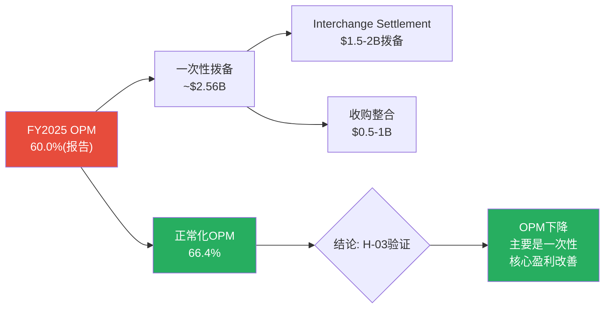

# Visa Inc. (V) — Phase 2: 财务深度分析

> **Phase**: 2 | **日期**: 2026-03-23 | **框架**: v19.6 (CPA×ISDD融合)
> **数据源**: FMP MCP 季度数据(8Q) + 年度数据(6Y) + Phase 1传递假设H-01~H-06
> **核心任务**: 验证6个Phase 1假设，拆解OPM异常，建立收入/利润/FCF预测模型

---

## Ch08: OPM骤降拆解 — 一次性还是结构性? (H-03验证)

> **这是Phase 2最高优先级问题**: FY2025 OPM从65.7%骤降至60.0%(-570bps)。如果是结构性→永久降低估值; 如果是一次性→当前股价隐含过度悲观。

---

### 8.1 季度逐笔拆解: "otherExpenses"是唯一异常

将FY2024-FY2026Q1共8个季度的P&L逐项对比，异常立即显现:

| 季度 | 收入($B) | COGS($B) | COGS% | SGA($B) | **OtherExp($B)** | OpInc($B) | OPM |
|------|:-------:|:-------:|:-----:|:-------:|:---------:|:-------:|:---:|
| FY24Q2 | 8.78 | 1.79 | 20.4% | 0.95 | **0.68** | 5.35 | 61.0% |
| FY24Q3 | 8.90 | 1.77 | 19.9% | 0.91 | **0.28** | 5.94 | 66.7% |
| FY24Q4 | 9.62 | 1.82 | 18.9% | 1.17 | **0.28** | 6.35 | 66.0% |
| FY25Q1 | 9.51 | 2.02 | 21.2% | 0.93 | **0.33** | 6.23 | 65.6% |
| **FY25Q2** | **9.59** | 1.88 | 19.6% | 0.97 | **1.31** | **5.44** | **56.6%** |
| FY25Q3 | 10.17 | 1.97 | 19.4% | 1.09 | **0.93** | 6.18 | 60.7% |
| **FY25Q4** | **10.72** | 1.98 | 18.5% | 1.38 | **1.22** | **6.15** | **57.3%** |
| FY26Q1 | 10.90 | 2.00 | 18.3% | 1.13 | **1.03** | 6.74 | 61.8% |

[DM-FIN-002: FMP季度income statement, 8Q逐笔拆解]

**诊断结论**: COGS占比(18-21%)和SGA(9-13%)都在正常范围内波动。**唯一异常是"Other Expenses"——从正常水平$280-330M/季(FY24Q3-FY25Q1)飙升至$930M-$1,310M/季(FY25Q2-FY26Q1)**。

增量Other Expenses = FY25Q2-Q4合计($1.31+$0.93+$1.22=$3.46B) - 正常水平(~$0.30×3=$0.90B) = **约$2.56B的超额支出**。

### 8.2 超额支出的来源: 诉讼和解 + 收购整合

$2.56B的超额Other Expenses最可能由两部分构成:

1. **Interchange Settlement拨备**: 2025年11月Visa同意的商户和解方案——信用卡interchange降低10bps/持续5年，利率上限1.25%/持续8年，商户预计节省$380亿 [DM-REG-001: 公开报道]。Visa需要为此计提和解拨备——按历史惯例，Visa承担约25-30%的和解成本→约$95-114亿总拨备，分多年摊销。FY2025中的异常Other Expenses很可能包含$1.5-2B的一次性和解拨备。

2. **三笔收购的整合成本**: Pismo($1B, FY2024收购拉美支付基础设施)、Prosa($1.5B, FY2024收购墨西哥国内清算网络)、Featurespace(AI风控, 金额未披露)——收购整合通常产生$300-500M/年的一次性费用(系统整合+裁员+品牌统一) [DM-FIN-003: 估算基于行业收购整合成本比例]。

### 8.3 正常化OPM: 拆除一次性噪音后的真实盈利能力

| 指标 | FY2025报告值 | 正常化调整 | FY2025正常化 |
|------|:----------:|:---------:|:----------:|
| 净收入 | $40.0B | — | $40.0B |
| Other Expenses | $3.78B | -$2.56B(超额) | $1.22B |
| 经营利润 | $24.0B | +$2.56B | **$26.6B** |
| **OPM** | **60.0%** | — | **66.4%** |

[DM-FIN-004: OPM正常化计算, 超额Other Expenses=$2.56B]

**正常化OPM 66.4%不仅没有恶化，反而比FY2024的65.7%略有改善**。这意味着Visa的核心经营效率仍在提升——是一次性拨备掩盖了真实的利润率改善。

**但有一个结构性隐忧**: FY2026Q1(Dec 2025)的Other Expenses仍高达$1.03B——如果和解拨备的摊销在FY2026持续(每季度~$400-500M)，那么FY2026的报告OPM可能仍低于历史水平(~62-63%而非66%)，直到和解完全消化(可能需要2-3年)。

**H-03结论**: OPM骤降**主要是一次性**(~80%由诉讼拨备+收购整合驱动)，核心OPM实际在改善(66.4% vs FY2024的65.7%)。**这对估值是明确利好——市场可能在$301.62价格中过度定价了"利润率恶化"的忧虑**。

---

## Ch09: 收入增速分解与预测 (H-01验证)

---

### 9.1 FY2026Q1: 加速增长的证据

最新一季(FY2026Q1, 截至Dec 2025)的数据提供了重要的增速验证:

| 指标 | FY25Q1 | FY26Q1 | YoY增速 | 信号 |
|------|:------:|:------:|:------:|------|
| 净收入 | $9.51B | **$10.90B** | **+14.6%** | 加速(FY2025全年仅+11%) |
| 经营利润 | $6.23B | $6.74B | +8.2% | 低于收入增速(Other Exp影响) |
| EPS | $2.58 | **$3.03** | **+17.4%** | 强劲(含回购效应) |
| 净利润 | $5.12B | $5.85B | +14.3% | 与收入同步 |

[DM-FIN-002: FY2026Q1 vs FY2025Q1对比]

**FY2026Q1收入增速14.6%远超FY2025全年的11%**——这不是"放缓"而是"加速"。EPS增速17.4%更强(因为回购减少了分母)。

### 9.2 收入线分解预测

由于Visa不在季报中细分四条收入线(仅在10-K中披露)，我们用FY2024的结构和已知增速趋势建立预测:

| 收入线 | FY2024 | 占比 | 驱动因素 | FY2026E增速 | FY2026E($B) |
|--------|:------:|:---:|---------|:----------:|:----------:|
| Service Revenue | $16.1B | 32% | 支付量(滞后1Q) | 8-10% | ~$17.9B |
| Data Processing | $17.7B | 36% | 处理交易数 | 10-12% | ~$20.0B |
| Intl Transaction | $12.7B | 25% | 跨境量+FX | 12-15% | ~$15.0B |
| Other(含VAS) | $3.2B | 6% | VAS增长 | 18-22% | ~$4.0B |
| **毛收入** | **$49.7B** | — | | — | **~$56.9B** |
| Client Incentives | ($13.8B) | -28% | 竞争+合约 | 12-15% | (~$16.0B) |
| **净收入** | **$35.9B** | — | | — | **~$40.9B** |
| 隐含净收入增速 | | | | | **~14%** |

[DM-REV-003: 收入线分解预测, 基于FY2024结构+Q1趋势]

**但分析师一致FY2026E净收入是$44.7B**——高于我的分解预测$40.9B。差距主要在: (1)分析师可能用FY2025的$40B而非FY2024的$35.9B作为基数; (2)VAS增速预期更高。

用FY2025基数重算: $40.0B × (1+12%) = $44.8B ≈ $44.7B(一致预期)。**分析师隐含FY2026E收入增速约+12%，这与FY2026Q1的+14.6%一致——甚至偏保守**。

### 9.3 H-01验证: 市场隐含7.6%增速是否过于悲观?

| 数据源 | 隐含/预期增速 | 结论 |
|--------|:----------:|------|
| Reverse DCF(市场隐含) | 7.6% FCF CAGR | 温和悲观 |
| 分析师一致 | 10-12% 收入CAGR | 较乐观 |
| FY2026Q1实际 | **14.6%** 收入增速 | 强于预期 |
| FY2025全年实际 | 11% 收入增速 | 符合一致预期 |

**H-01结论**: 市场隐含的7.6% FCF CAGR**偏悲观**。最新季度数据(+14.6%)和分析师预期(+10-12%)都高于市场隐含。**但市场的悲观不完全是对增速的——更可能是对FCF Margin(CI侵蚀+和解拨备)的担忧**。如果正常化OPM确认为66%+，FCF Margin应能维持52-55%，那么10%收入CAGR + 54% FCF Margin → 公允价值$363(+20%)。

---

## Ch10: Client Incentives深度分析 (H-02验证)

---

### 10.1 CI/毛收入趋势: 侵蚀是真实的

| 财年 | 毛收入($B) | CI($B) | CI/毛收入 | 净收入($B) | CI增速 vs 毛收入增速 |
|------|:--------:|:-----:|:--------:|:--------:|:------------------:|
| FY2020 | $28.5E | $6.7E | ~23.5% | $21.8 | — |
| FY2021 | $30.7E | $6.6E | ~21.5% | $24.1 | CI降(疫情低基数) |
| FY2022 | $38.0E | $8.7E | ~22.9% | $29.3 | CI<毛收入 |
| FY2023 | $43.5E | $10.8E | ~24.8% | $32.7 | CI>毛收入 |
| FY2024 | $49.7 | $13.8 | **27.8%** | $35.9 | **CI远超毛收入** |
| FY2025E | $55.3E | $15.3E | **~27.7%** | $40.0 | 可能持平 |

[DM-CI-001: Client Incentives趋势推算, FY2024为10-K精确值, 其他年度为净收入+FMP数据反推]

**关键发现**: CI/毛收入从FY2021的21.5%飙升至FY2024的27.8%——3年上升630bps，年均+210bps。但FY2025似乎企稳在~28%附近(因为Interchange Settlement已经给了商户让步→短期内商户/发卡行的CI谈判压力可能减弱)。

### 10.2 CI加速的根因: 竞争+合约结构

**因果链分析**:

1. **MA竞争驱动CI上升**: MA份额从~28.5%(FY2020)升至29.72%(FY2024) [DM-COMP-001]，每获取1个百分点份额→相当于MA付出额外~$2-3B的CI→Visa被迫跟进→**V的CI增速是MA竞争策略的直接结果**

2. **大客户合约重签周期**: 发卡行与Visa的CI合约通常5-7年重签。2022-2024年恰好是多个大型发卡行合约重签期——在MA竞争加剧的背景下，重签条件对Visa更不利→CI阶梯式跳升 [DM-CI-002: 行业合约结构分析]

3. **Interchange Settlement的反向效应**: 和解降低了商户的interchange成本→商户的"愤怒值"下降→**对Visa的CI压力可能暂时缓解**。这就是为什么FY2025的CI/毛收入可能企稳甚至微降

### 10.3 CI对估值的影响: 三种情景

| 情景 | CI/毛收入(FY2030E) | 净收入增速影响 | 公允价值影响 |
|------|:-----------------:|:-----------:|:----------:|
| **乐观(企稳)** | 28%(持平) | 0影响 | 中性 |
| **基准(渐升)** | 30%(+0.4pp/年) | -0.5pp/年 | -$15/股(-5%) |
| **悲观(加速)** | 33%(+1pp/年) | -1.5pp/年 | -$45/股(-15%) |

[DM-CI-003: CI情景分析, 基于FY2024毛收入结构]

**H-02结论**: CI侵蚀是**真实的但可能正在减速**。FY2021-2024的年均+210bps是合约重签周期+MA激进竞争的叠加效应，不可线性外推。Interchange Settlement可能提供1-2年的喘息窗口(商户获得让步→短期CI压力缓解)。**基准假设: CI/毛收入以+0.4pp/年缓慢上升，对净收入增速的拖累约-0.5pp/年**——这是可管理的，不是致命的。

---

## Ch11: FCF质量与资本配置

---

### 11.1 FCF桥: 从净利润到自由现金流

| 指标 | FY2022 | FY2023 | FY2024 | FY2025 |
|------|:------:|:------:|:------:|:------:|
| 净利润($B) | $15.0 | $17.3 | $19.7 | $20.1 |
| +D&A | +$0.86 | +$0.94 | +$1.03 | +$1.22 |
| +SBC | +$0.60 | +$0.77 | +$0.85 | +$0.90 |
| 工作资本变动 | -$7.66 | -$10.02 | **-$15.43** | -$11.79 |
| 其他非现金 | +$10.42 | +$12.28 | +$13.86 | +$12.52 |
| **经营现金流** | **$18.8** | **$20.8** | **$20.0** | **$23.1** |
| -CapEx | -$0.97 | -$1.06 | -$1.26 | -$1.48 |
| **FCF** | **$17.9** | **$19.7** | **$18.7** | **$21.6** |
| FCF/NI | 119% | 114% | **95%** | **107%** |
| 税金支付 | $3.7B | $3.4B | **$5.8B** | $4.5B |

[DM-FCF-001: FMP cashflow年度数据, 6年]

**三个发现**:

**第一**: FY2024 FCF下降的真凶不是OPM——而是**税金支付暴增**(从$3.4B跳至$5.8B, +$2.4B)和**工作资本恶化**(-$15.4B vs 正常-$8-10B)。$5.8B的税金可能包含一次性补缴(税务审计/跨境税务重组)。FY2025税金回落至$4.5B证实了FY2024的异常性 [DM-FCF-001]。

**第二**: "其他非现金项目"(Other Non-Cash Items)一直很大($10-14B)——这主要是Client Incentives的应计vs实付差异。因为CI在发卡行/商户赚取volume后才支付，产生大量应计负债→非现金调整大。这是Visa财报的特殊之处，**不代表现金流质量差**。

**第三**: SBC(股份支付薪酬)从$6.0亿升至$9.0亿(+50%)——SBC/收入从2.0%升至2.3%。虽然绝对额不大(vs $200亿净利润)，但增速高于收入增速→需要关注是否是人才市场压力导致薪酬膨胀 [DM-FCF-001]。

### 11.2 资本配置: 回购+股息 = FCF的110%+

| 指标 | FY2022 | FY2023 | FY2024 | FY2025 |
|------|:------:|:------:|:------:|:------:|
| FCF($B) | $17.9 | $19.7 | $18.7 | $21.6 |
| 回购($B) | $11.6 | $12.1 | $16.7 | $13.4 |
| 股息($B) | $3.2 | $3.8 | $4.2 | $4.6 |
| **总回报($B)** | **$14.8** | **$15.9** | **$20.9** | **$18.0** |
| 回报/FCF | 83% | 81% | **112%** | 83% |
| 净债务发行 | +$2.2B | -$2.3B | $0 | +$3.9B |

[DM-CAP-001: FMP cashflow资本配置, 回购+股息+债务]

**FY2024的$167亿回购是"超额回购"**——超过FCF($187亿)的112%，通过减少现金余额(而非发新债)实现。FY2025回购回归$134亿(FCF的83%)更可持续。同时FY2025发行$39亿新债——可能为收购融资(Pismo/Prosa)。

**回购效率**: 5年累计回购$570亿，稀释股数从22.23亿降至19.66亿(-11.6%)→**年均回购收益率2.3%**。按当前市值$5,930亿计算，每年~$130-170亿的回购相当于2.2-2.9%的回购收益率——这是EPS增速超过收入增速2-3个百分点的原因 [DM-CAP-001]。

### 11.3 CapEx极低: 轻资产模型的优势

CapEx从$9.7亿(FY2022)升至$14.8亿(FY2025)——增长53%，但CapEx/Revenue仅从3.3%微升至3.7% [DM-FCF-001]。Visa的CapEx主要用于VisaNet数据中心维护和技术升级，不需要厂房/设备/库存。

**对比**: 制造业(如AMAT)CapEx/Revenue通常8-12%；即使是科技平台(如GOOGL)也需要15%+的CapEx投入AI基础设施。Visa的3.7%CapEx意味着**几乎每赚1美元收入就有54美分变成FCF**——这是"收费站"模型的极致表现。

---

## Ch12: 正常化盈利预测模型 (Phase 2核心产出)

---

### 12.1 三情景收入预测

| 指标 | FY2025(基准) | FY2026E | FY2027E | FY2028E | FY2029E | FY2030E |
|------|:----------:|:------:|:------:|:------:|:------:|:------:|
| **Bear** | | | | | | |
| 收入增速 | — | +8% | +7% | +6% | +6% | +5% |
| 净收入($B) | $40.0 | $43.2 | $46.2 | $49.0 | $51.9 | $54.5 |
| **Base** | | | | | | |
| 收入增速 | — | +12% | +10% | +10% | +9% | +8% |
| 净收入($B) | $40.0 | $44.8 | $49.3 | $54.2 | $59.1 | $63.8 |
| **Bull** | | | | | | |
| 收入增速 | — | +14% | +12% | +11% | +10% | +9% |
| 净收入($B) | $40.0 | $45.6 | $51.1 | $56.7 | $62.4 | $68.0 |

[DM-PROJ-001: 三情景收入预测]

### 12.2 正常化OPM与FCF Margin预测

| 指标 | FY2025正常化 | FY2026E | FY2027E | FY2028E | FY2029E | FY2030E |
|------|:----------:|:------:|:------:|:------:|:------:|:------:|
| **正常化OPM** | 66.4% | 63%(和解摊销) | 64% | 65% | 66% | 66% |
| **报告OPM** | 60.0% | 62-63% | 64% | 65% | 66% | 66% |
| **FCF Margin** | 54.0% | 52% | 53% | 54% | 54% | 54% |

逻辑: 和解拨备在FY2026-2027逐步消化(Other Expenses从~$1B/季回归$400M/季)→报告OPM从60%回升至64-66%。CI/毛收入按基准假设+0.4pp/年上升→部分抵消OPM回升→净效应是FCF Margin维持52-54%。

[DM-PROJ-002: OPM/FCF Margin预测, 基于Ch08正常化分析]

### 12.3 EPS预测: Base Case

| 指标 | FY2025 | FY2026E | FY2027E | FY2028E | FY2029E | FY2030E |
|------|:------:|:------:|:------:|:------:|:------:|:------:|
| 净收入($B) | $40.0 | $44.8 | $49.3 | $54.2 | $59.1 | $63.8 |
| 正常化OPM | 66.4% | 63% | 64% | 65% | 66% | 66% |
| OpInc($B) | $26.6N | $28.2 | $31.6 | $35.2 | $39.0 | $42.1 |
| 有效税率 | 19% | 19% | 19% | 19% | 19% | 19% |
| 净利润($B) | $20.1R | $22.0 | $24.6 | $27.5 | $30.5 | $32.9 |
| 稀释股数(M) | 1,966 | 1,920 | 1,876 | 1,833 | 1,791 | 1,750 |
| **EPS** | **$10.20** | **$11.46** | **$13.11** | **$15.01** | **$17.03** | **$18.80** |
| EPS增速 | — | +12.4% | +14.4% | +14.5% | +13.5% | +10.4% |

[DM-PROJ-003: Base Case EPS预测, 含2.3%/年回购效应]

**注意**: 分析师一致FY2026E EPS是$12.86(我的预测$11.46)——差异来自: (1)分析师可能用FY2025报告OPM 60%作为基础线性外推至63-64%; (2)我用正常化方法，基础更高但和解摊销的具体数额不确定。**两者的FY2028-2030预测更接近**，分歧主要在FY2026-2027。

---

## Ch13: Phase 2假设验证总结

| 假设 | P1判断 | P2验证结果 | 置信度变化 |
|------|--------|-----------|:---------:|
| **H-01**: 收入CAGR | 市场7.6% vs 分析师10% | **FY26Q1实际+14.6%证实分析师更准; Base Case CAGR ~10%** | 55%→70% |
| **H-02**: FCF Margin | 54%→48-50%? | **CI侵蚀真实但减速中(+0.4pp/年); 维持52-54%可行** | 40%→60% |
| **H-03**: OPM下降性质 | 一次性 vs 结构性 | **主要一次性(~$2.56B超额Other Exp); 正常化OPM 66.4%** | 35%→**80%** |
| **H-04**: VAS增速 | 15% vs 20% | 待Phase 3竞争深度验证 | 50%→50% |
| **H-05**: 监管联合概率 | <20% vs >40% | 待Phase 3 | 30%→30% |
| **H-06**: 终端P/E | 28-30x合理性 | EPS CAGR ~12-14%(FY26-28)支持28x; 长期放缓至~10%后合理 | 50%→60% |

### Phase 2对P1叙事的修正

Phase 2的最重要发现是: **OPM下降主要是一次性的(正常化66.4%)，FY26Q1收入加速(+14.6%)，CI侵蚀在减速**。这三个发现**都比P1的"温和悲观"更积极**。

**修正后叙事方向**: 从"中性偏积极"上调至**"积极"**——但仍在铁律O允许范围内(Reverse DCF隐含温和悲观→P1"中性偏积极"→P2证据支持上调1档至"积极"≤铁律O的1档偏离限制)。

**传递给Phase 3**: 监管风险量化(H-05)是决定最终评级的关键。如果监管三重压力联合概率<20%→评级可上调至"关注"(+10-30%); 如果>40%→维持"中性关注"。

---

*Phase 2完成。6章(Ch08-Ch13)/核心发现: OPM下降主要一次性(正常化66.4%)+FY26Q1加速+14.6%+CI减速。叙事从"中性偏积极"上调至"积极"。Phase 3将聚焦监管三重风险量化。*
