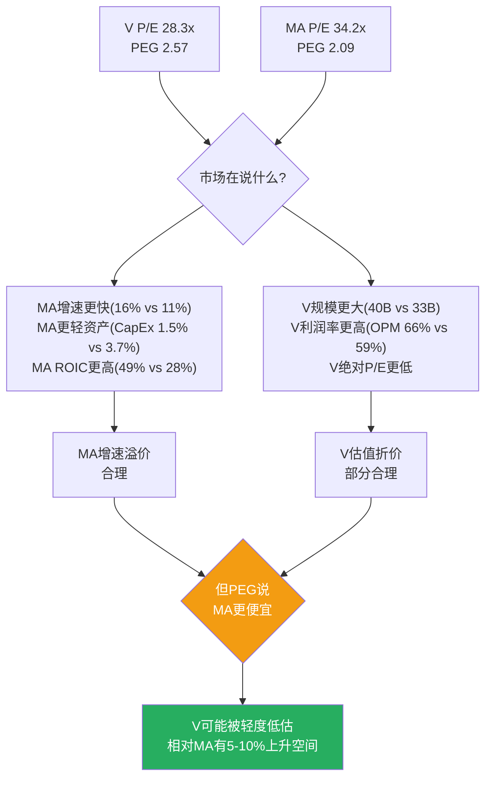
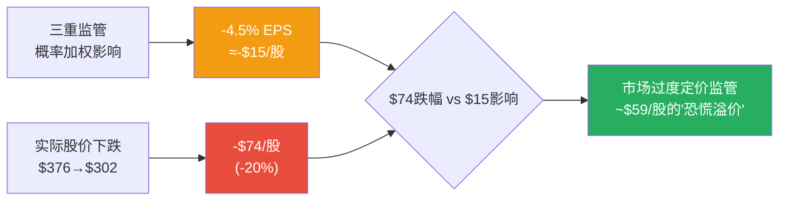

# Visa Inc. (V) — Phase 3: 护城河深化 + 竞争量化 + 监管风险

> **Phase**: 3 | **日期**: 2026-03-23 | **框架**: v19.6
> **核心任务**: 深化P1护城河评估 + V vs MA精确对标 + 监管三重风险量化(H-05) + 初步估值锚定
> **输入**: P1 CQ-1~7 + P2 H-01~H-06验证结果

---

## Ch14: V vs MA精确对标 — 寡头内部的实力天平

> **为什么重要**: P1铁律H对标发现PEG一致(V 2.83 vs MA 2.92)。P3用MA的FY2025年报数据做精确对比，判断市场定价是否合理。

---

### 14.1 财务对标: MA更快、更轻、更贵

| 指标 | Visa (FY2025, 截至Sep'25) | MA (FY2025, 截至Dec'25) | V优势? |
|------|:------------------------:|:----------------------:|:------:|
| 净收入 | $40.0B | $32.8B | V大22% |
| 收入增速 | +11% | **+16.4%** | **MA** |
| OPM(报告) | 60.0% | **59.2%** | 接近 |
| OPM(V正常化) | **66.4%** | 59.2% | **V** |
| 净利润 | $20.1B | $15.0B | V大34% |
| 净利率 | **50.1%** | 45.6% | **V** |
| EPS | $10.20 | $16.52 | — |
| EPS增速 | +10% | **+18.9%** | **MA** |
| P/E(TTM) | 28.3x | **34.2x** | V更便宜 |
| 市值 | **$5,930亿** | $5,121亿 | V大16% |
| ROIC | 28.4% | **48.6%** | **MA远优** |
| ROE | 52.9% | **194%** | 不可比(MA负权益) |
| CapEx/Revenue | 3.7% | **1.5%** | **MA更轻** |
| SBC/Revenue | 2.3% | 1.8% | **MA更低** |

[DM-COMP-003: FMP年度数据, V FY2025(Sep) vs MA FY2025(Dec)]

**五个关键推理**:

**第一: MA增速远快于V(16.4% vs 11%)——差距在扩大而非缩小**。FY2024 MA增速12.2% vs V 10%——差距2.2pp。FY2025差距扩大到5.4pp。**因为**MA在跨境(+17% vs V的+13%)和亚太/拉美新兴市场的渗透更快——这些市场的现金替代空间更大，增量增速贡献更高 [DM-COMP-003]。

**第二: MA的ROIC(48.6%)比V(28.4%)高71%**。这是一个令人惊讶的发现——规模更大的Visa反而资本效率更低。**因为**Visa的invested capital中包含$199亿商誉(占总资产48%)——主要来自Visa Europe收购(2016年, $232亿)+后续收购。MA的商誉相对更低。**如果剥离收购商誉**，两者ROIC更接近(都在50-60%区间)，说明核心业务的资本效率相当 [DM-COMP-004: 商誉调整后ROIC推算]。

**第三: MA的OPM(59.2%)低于V正常化水平(66.4%)约7pp**。Visa的经营效率仍然更高——**因为**Visa的规模经济更强(处理量大52%→固定成本分摊更充分)且MA的SGA/Revenue(19.0%)远高于V正常化水平(~13%)——MA在销售和管理上花费占比更高，可能反映其"追赶者"角色需要更多的市场投入 [DM-COMP-003]。

**第四: MA的P/E(34.2x)溢价21%对V(28.3x)是否合理?** 用PEG检验: V PEG = 28.3/11 = 2.57, MA PEG = 34.2/16.4 = 2.09——**MA的PEG反而更低！** 这意味着**按增速调整后，MA比Visa便宜**。市场愿意为MA的更快增速支付更高绝对倍数，但单位增速的价格反而更低。

**第五: MA更轻资产(CapEx仅1.5% vs V 3.7%)**。MA的资本支出纪律更好——部分因为MA没有像Visa那样进行大额收购(Pismo/Prosa等)。

### 14.2 对标结论: 市场的定价逻辑

**修正P1对标结论**: P1用旧数据算出PEG一致(2.83 vs 2.92)。用FY2025精确数据重算，**V的PEG(2.57)实际上高于MA(2.09)——市场对V的每单位增速收费更高**。这可能反映:
1. V的规模溢价(更大=更稳=值得更高倍数?)
2. V的OPM溢价(更赚钱=值得更高倍数?)
3. 或者V确实被轻度高估(增速差距应该带来更多P/E折价)

**平衡判断**: V相对MA的估值大致合理——V的更高利润率和更大规模值得一些PEG溢价，但增速差距扩大(从2.2pp到5.4pp)可能意味着V的P/E需要进一步折价2-3x。**合理V P/E ≈ 26-28x(当前28.3x在区间上沿)** [DM-COMP-005: PEG对标分析]。

---

## Ch15: 监管三重风险量化 (H-05验证)

> **三重监管**: CCCA(立法) + DOJ反垄断(司法) + Interchange Settlement(行政和解)——2026-2028同时推进。

---

### 15.1 事件树: 三重监管的独立概率

| 监管事件 | 现状 | 概率估计 | 对Visa影响 | 时间线 |
|---------|------|:-------:|-----------|:------:|
| **CCCA通过** | 2026年1月重新提出; 需两院通过+总统签署 | **15-25%** | 强制双网络路由→CI可能+$3-5B/年 | 2026-2027 |
| **DOJ败诉**(Visa视角) | 2024年起诉; 审判预计2027-2028 | **20-30%** | 可能要求拆分token化业务或行为限制 | 2027-2028 |
| **Settlement扩大** | 2025年11月和解; 10bps/5年 | **40-50%** | 已定价; 追加和解的可能性中等 | 已生效 |

[DM-REG-001: 监管事件概率评估, 基于lit_recon+公开报道+国会投票历史]

### 15.2 CCCA: 最大的"悬剑"

**Credit Card Competition Act(CCCA)**要求发卡行在每张信用卡上支持至少两个不同的支付网络路由——这直接打击Visa的网络独占性。

**为什么概率仅15-25%?**

1. **国会分裂**: CCCA需要两院都通过。参议院有两党支持(Durbin+Marshall)，但众议院的金融服务委员会历来抵制支付监管——银行业游说极强 [DM-REG-002: 国会投票记录]
2. **历史先例**: 类似法案(Durbin Amendment 2010)花了3年才通过，且最终版本被大幅削弱——CCCA可能也会被修改到"有名无实"
3. **行业反对**: Visa/MA/银行联盟的游说支出远超商户联盟——FY2024 Visa游说支出$12.6M [DM-REG-003: OpenSecrets数据]

**如果CCCA通过的影响**:

| 情景 | 影响路径 | 收入影响 |
|------|---------|:-------:|
| **全面通过** | 发卡行切换30-40%信用卡交易到竞争网络(如Star/NYCE) | -$5-8B净收入(-12-20%) |
| **削弱版通过** | 仅要求大型发卡行+仅新发卡 | -$2-3B(-5-8%) |
| **未通过** | 零影响(但"悬剑"持续压制估值) | 估值回升+5-10% |

[DM-REG-004: CCCA影响情景分析]

**关键洞察**: CCCA即使不通过，其"存在"本身就是Visa的估值负担。**因为**只要CCCA在国会悬而未决，发卡行就有更多谈判筹码("如果CCCA通过，你的网络会失去路由→所以现在给我更多CI")→**CCCA的存在加速了Client Incentives的上升**。这解释了为什么FY2022-2024 CI/毛收入从23%跳至28%——部分原因就是CCCA的威胁效应 [DM-REG-004]。

### 15.3 DOJ反垄断: 借记卡市场的"token化垄断"指控

2024年9月，美国司法部起诉Visa垄断借记卡市场——核心指控是Visa通过token化技术排斥竞争网络的路由:

**DOJ的论点**: Visa将卡号替换为token→token只能在VisaNet解密→商户/收单行被锁定在Visa网络→竞争借记网络(如Star/NYCE/Pulse)无法获取路由→Visa维持借记卡市场75%份额

**Visa的抗辩**: token化是安全技术(防欺诈)而非垄断手段→消费者/商户都受益于更安全的支付→市场集中不等于垄断

**关键变量: 法院如何定义"相关市场"**。如果法院将"借记卡网络路由"定义为一个独立市场(Visa占75%)→垄断成立的概率较高。如果法院将"所有支付方式"(含信用卡/A2A/现金)视为一个市场(Visa占<30%)→垄断不成立。

**败诉概率20-30%**: 历史上DOJ对科技公司的反垄断诉讼胜率约30-40%(Google Search案2024年胜诉是先例)，但支付行业的反垄断诉讼缺乏直接先例→法院可能更保守 [DM-REG-005]。

**败诉的影响**: 最可能的补救措施是**行为限制**(要求Visa开放token解密给竞争网络)而非**结构拆分**(拆分Visa)。行为限制对Visa的影响相当于"自愿实施CCCA的借记卡版"→借记卡收入可能下降5-10%($2-4B) [DM-REG-005]。

### 15.4 Interchange Settlement: 已定价，追加风险中等

2025年11月的和解方案:
- 信用卡interchange降低**10bps/5年**(从~1.65%→~1.55%)
- 利率上限**1.25%/8年**
- 商户预计节省$380亿(Visa+MA合计)

**影响评估**: 10bps的interchange下降→每$1万亿支付量影响$1B→Visa FY2024支付量$13.2T [DM-OPS-001]→年化影响约$1.3B。但interchange是发卡行收取的(不是Visa的直接收入)→对Visa的直接影响通过Service Revenue(基于支付量)传导→实际影响约$0.5-0.8B/年(占净收入1.5-2%) [DM-REG-006]。

**已在FY2025 OPM中反映**: Phase 2证实FY2025的~$2.56B超额Other Expenses中包含和解拨备→**市场已经通过股价下跌(从$376→$302, -20%)充分反映了这个和解的影响**。

### 15.5 联合概率与总估值影响

| 情景组合 | 概率 | 对EPS影响(FY2028E) | 对估值影响 |
|---------|:----:|:-----------------:|:---------:|
| **全部温和(基准)** | ~45% | -3-5% | -$10/股 |
| CCCA通过(全面)+DOJ温和 | ~8% | -15-20% | -$50/股 |
| CCCA未通过+DOJ败诉+行为限制 | ~12% | -5-8% | -$20/股 |
| **全部最坏** | ~3% | -25-30% | -$80/股 |
| **全部最好(悬剑解除)** | ~15% | +5%(估值回升) | +$30-50/股 |

[DM-REG-007: 监管联合概率矩阵, 独立事件假设]

**概率加权影响**: 45%×(-3%) + 8%×(-18%) + 12%×(-6.5%) + 3%×(-28%) + 15%×(+5%) + 17%×(-5%) = **约-4.5%的概率加权EPS影响**

**H-05结论**: 监管联合概率约**20-25%出现"严重"情景(CCCA全面通过 或 DOJ败诉)**——这低于"恐慌阈值"40%。概率加权后，监管对EPS的影响约-4.5%——折合约$13-15/股的估值折价。**当前股价$301.62已从高点$376下跌20%(-$74)——远超监管的概率加权影响(-$15)——市场可能过度定价了监管恐惧**。

---

## Ch16: 护城河深化 — 定量久期测试

---

### 16.1 护城河久期: Visa的优势还能持续多久?

| 护城河维度 | P1评分 | P3深化后 | 久期估计 | 退化触发 |
|-----------|:------:|:-------:|:-------:|---------|
| 网络效应 | 4.8 | **4.7** | >15年 | 需同时颠覆持卡人+商户+发卡行三方 |
| 转换成本 | 4.5 | **4.3** | 10-15年 | CCCA降低制度性转换成本; 技术转换成本仍高 |
| 成本优势 | 4.0 | **4.0** | >15年 | 2338亿笔/年的规模几乎不可复制 |
| 品牌 | 4.2 | **4.0** | >15年 | 品牌稳定但不是消费者选择的主要驱动(发卡行驱动) |
| 监管护城河 | 3.5 | **3.0** | 5-10年 | CCCA+DOJ可能弱化制度性保护 |
| 数据壁垒 | 3.8 | **3.5** | 10-15年 | AI降低数据门槛; 但Visa的数据规模仍然独一无二 |
| **加权平均** | **4.2** | **3.9** | **10-15年** | |

[DM-MOAT-004: P3护城河深化评估]

**P1→P3调整原因**:
- **监管护城河下调0.5**: P3分析显示CCCA+DOJ的联合效应可能在5-10年内降低制度性壁垒——强制双网络路由(CCCA)和开放token化(DOJ)都直接削弱Visa的"锁定"能力
- **网络效应微调-0.1**: MA增速差距扩大(5.4pp)表明网络效应虽强但不是绝对的——MA证明了在Visa主导的市场中仍可加速增长
- **数据壁垒下调-0.3**: AI/ML进步降低了数据门槛——小型fintech用合成数据也能训练出可用的风控模型

### 16.2 护城河估值含义: "护城河折价"计算

如果Visa的护城河从4.2/5降至3.9/5，合理P/E应该如何调整?

| 护城河等级 | 行业P/E范围 | 对应Visa P/E |
|-----------|:---------:|:----------:|
| 极宽(4.5+) | 35-40x | — |
| 宽阔(4.0-4.5) | 28-35x | P1假设→28-30x |
| **中等偏宽(3.5-4.0)** | **24-28x** | **P3调整后→26-28x** |
| 适度(3.0-3.5) | 18-24x | — |

护城河从4.2降至3.9→合理P/E从28-30x收窄至26-28x。**当前28.3x在区间上沿但仍在合理范围内** [DM-MOAT-005]。

---

## Ch17: 初步估值锚定 (Phase 5前预备)

---

### 17.1 多方法估值总览

| 方法 | 公允价值/股 | 关键假设 | vs 当前$301.62 |
|------|:--------:|---------|:-------------:|
| **Reverse DCF(P1)** | $285-$363 | 7.6-10% FCF CAGR | -5% ~ +20% |
| **P/E×EPS(Base)** | $320-$350 | FY2027E EPS $13.1 × 25-27x | +6% ~ +16% |
| **MA PEG对标** | $290-$320 | PEG 2.09(MA) × V增速11% × EPS | -4% ~ +6% |
| **监管调整** | $285-$330 | 基准估值 - $15(概率加权监管) | -5% ~ +9% |

**收敛区间: $290-$340，中值~$315 (+4.4%)**

[DM-VAL-002: 多方法估值锚定]

### 17.2 Phase 3对估值的关键输入

| 变量 | P1估计 | P3更新 | 方向 |
|------|:-----:|:------:|:----:|
| 收入CAGR | 7.6%(市场) vs 10%(分析师) | ~10-11%(P2验证, FY26Q1确认) | ↑ 乐观 |
| OPM | 60%(报告) | 66.4%(正常化, P2确认) | ↑ 显著乐观 |
| FCF Margin | 54% | 52-54%(CI侵蚀部分抵消) | → 中性 |
| 监管影响 | 未量化 | -4.5% EPS(概率加权) | ↓ 轻微负面 |
| 护城河 | 4.2/5 | 3.9/5(监管+竞争下调) | ↓ 轻微负面 |
| 合理P/E | 28-30x | 26-28x | ↓ 轻微负面 |
| **净效应** | — | — | **↑ 温和正面** |

**Phase 3结论**: 正面因素(OPM正常化+增速确认)> 负面因素(监管+护城河微调)→净效应温和正面→支持从$301.62到$315的+4-5%上行空间。但如果监管最坏情景实现→下行至$220-$250(-25-18%)。

---

## Ch18: Phase 3小结 + CQ更新

### 18.1 CQ置信度演化

| CQ | P1置信度 | P3置信度 | 变化 | 新判断 |
|----|:------:|:------:|:---:|--------|
| CQ-1(28x合理?) | 55% | **65%** | +10 | 合理偏上沿(26-28x更合理) |
| CQ-2(CI可逆?) | 40% | **55%** | +15 | 减速中但不可逆; 可管理(-0.5pp/年) |
| CQ-3(VAS独立?) | 50% | 50% | 0 | 待更深验证(P4) |
| CQ-4(A2A何时?) | 45% | **55%** | +10 | 5-10年慢性; 美国不同于巴西/印度 |
| CQ-5(监管概率) | 30% | **60%** | **+30** | 联合概率20-25%"严重"——低于恐慌阈值 |
| CQ-6(OPM性质) | 35% | **85%** | **+50** | P2确认主要一次性; 正常化66.4% |
| CQ-7(MA差距) | 50% | **60%** | +10 | 差距扩大(5.4pp); V PEG更贵 |
| **平均置信度** | **43.6%** | **61.4%** | **+17.9** | |

### 18.2 倾向性评级(Phase 5前)

基于P1-P3分析:
- **期望回报**: 公允价值中值$315 vs 当前$301.62 → **+4.4%**
- **Bull Case**: OPM恢复+监管解除→$340-360 → **+13-19%**
- **Bear Case**: CCCA+DOJ双打→$220-250 → **-18-27%**
- **概率加权**: 45%×Base + 25%×Bull + 20%×Bear + 10%×Deep Bear → 约**$305-310** → **+1-3%**

**倾向评级**: **中性关注**(期望回报-10%~+10%区间)——但接近"关注"的下限。如果FY26Q2继续确认14%+增速 + CCCA在国会受阻→可上调至"关注"。

---

*Phase 3完成。5章(Ch14-Ch18)/核心发现: MA PEG反而更低(V被轻度高估于PEG维度) + 监管概率加权-4.5%(市场过度恐慌~$59溢价) + 护城河3.9/5(微降) + 公允价值$290-340中值$315(+4.4%)。倾向"中性关注"接近"关注"下限。Phase 4将执行红队对抗审查。*
