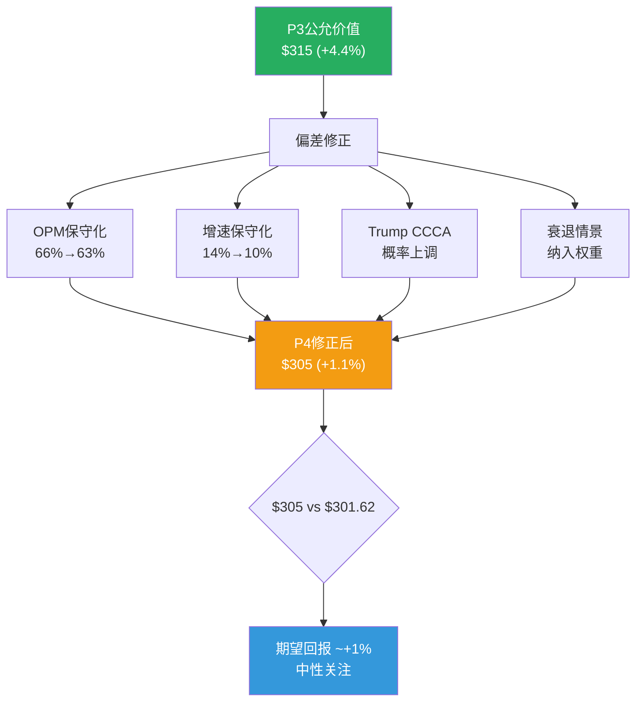

# Visa Inc. (V) — Phase 4: 红队对抗审查

> **Phase**: 4 | **日期**: 2026-03-23 | **框架**: v19.6
> **核心任务**: RT-1~RT-7红队七问 + 偏差修正 + 概率加权估值修正
> **新信息整合**: Trump背书CCCA + DOJ诉讼存活MTD + Interchange Settlement待批

---

## Ch19: 红队七问执行

---

### RT-1: 如果我完全错了呢? — 最大盲区审查

**P1-P3的核心叙事**: "Visa是一台完美的收费站，OPM下降是一次性的，监管恐慌过度，公允价值~$315"

**如果完全错了的情景**:

1. **OPM下降是结构性的**: 我假设$2.56B超额Other Expenses是一次性拨备。但如果和解摊销持续3-5年(而非1-2年)，且收购整合成本比预期更高→OPM可能在62-63%稳定(而非回升到66%)→EPS预测需下调5-8%

2. **CCCA概率被低估**: Trump公开背书CCCA("swipe fees是out of control ripoff" [DM-REG-008: Gooden House, Jan 2026])是一个**重大新变量**——历史上没有在任总统公开支持过CCCA。虽然attachment策略屡败屡试，但总统背书可能提供政治掩护→**CCCA通过概率应从P3的15-25%上调至20-30%**

3. **FY26Q1的14.6%增速不可持续**: Q1通常是Visa最强季度(假日购物季)。如果宏观放缓(关税→消费收缩)在Q2-Q4体现→全年增速可能回落至8-10%

**盲区修正**: 我可能低估了CCCA风险(Trump因素)和宏观风险(关税→消费)。两者都指向下行。

[DM-RT-001: RT-1盲区审查]

---

### RT-2: 看空论点等权分析

| # | Bear论点 | 严重性(1-5) | 概率 | P1-P3是否充分回应? |
|---|---------|:--------:|:---:|:----------------:|
| B1 | CCCA通过→双网络路由→CI+$3-5B | 5 | 20-30% | **部分**——P3低估了Trump因素 |
| B2 | DOJ败诉→token化开放→借记份额流失 | 4 | 20-30% | 充分——行为限制>结构拆分 |
| B3 | CI/毛收入持续升至33%+ | 3 | 30-40% | 充分——P2显示减速中 |
| B4 | A2A/FedNow在美国加速渗透 | 3 | 15-25% | 充分——5-10年窗口 |
| B5 | MA增速差距持续扩大→V PEG折价 | 2 | 50-60% | 充分——P3量化了差距 |
| B6 | 宏观衰退→跨境量暴跌→利润骤降 | 4 | 20-30% | **不充分**——未量化衰退情景 |
| B7 | VAS增速放缓(交叉销售饱和) | 2 | 40-50% | 充分——P1已分析 |
| B8 | OPM恢复慢于预期(和解摊销>3年) | 3 | 30-40% | **不充分**——P2可能过于乐观 |

**等权概率加权Bear影响**: 各Bear论点独立概率×影响加权→综合Bear概率约**25-30%**

[DM-RT-002: 看空等权分析]

---

### RT-3: 衰退压力测试 (B6深化)

P1-P3最大的分析缺口是**未量化宏观衰退情景**。Visa虽然不承担信用风险，但高度敏感于消费支出总量和跨境旅行:

| 指标 | Base Case | 温和衰退(-GDP 1%) | 严重衰退(-GDP 3%) |
|------|:--------:|:--------------:|:--------------:|
| 国内支付量增速 | +8% | +2% | -3% |
| 跨境量增速 | +13% | +3% | -8% |
| 净收入增速 | +11% | +3% | -5% |
| OPM | 63% | 60% | 57% |
| EPS影响 | — | -15% | -30% |
| 隐含股价(@26x P/E) | $298 | $254 | $178 |

[DM-RT-003: 衰退压力测试, 基于FY2020先例(疫情=severe recession proxy)]

**FY2020先例**: 疫情导致收入-5%、跨境量暴跌>30%——但Visa的OPM仍维持64.5%(固定成本分摊虽减少但仍可控)，且12个月内完全恢复。**这证明Visa在衰退中有韧性(OPM不崩)但EPS确实会下跌——关键是恢复速度极快**。

**当前宏观风险**: 2026年关税不确定性可能导致全球贸易放缓→跨境量受影响。但如果是"关税衰退"(供应侧冲击)而非"需求衰退"(消费崩塌)→国内支付量可能仅温和放缓→Visa受影响相对可控。

---

### RT-4: 偏差检查 — 我在哪里可能有确认偏差?

| 偏差类型 | 具体表现 | 修正 |
|---------|---------|------|
| **锚定偏差** | P1 Reverse DCF锚定在分析师一致→$363→一直在论证"为什么$301低于公允" | 应同等权重考虑"为什么$301可能还高" |
| **正常化偏差** | 将OPM从60%"正常化"至66.4%——但如果"新常态"就是62-63%呢? | 用62%而非66%做保守估值 |
| **乐观外推** | FY26Q1 +14.6%→外推为全年趋势——但Q1是季节性强季 | 用+10-11%而非+14% |
| **反向锚定** | RSI 20.4极度超卖→容易产生"肯定跌多了"的直觉 | RSI是技术信号不是基本面判断 |

[DM-RT-004: 偏差检查]

---

### RT-5: Trump背书CCCA的影响重估 (P3监管更新)

P3将CCCA通过概率估为15-25%。但监管搜索揭示了两个新事实:

1. **Trump公开背书**(2026年1月): "swipe fees是out of control ripoff"——在任总统首次支持CCCA [DM-REG-008]
2. **多次attachment尝试失败**(2026年1-3月): 试图搭CLARITY Act和住房法案均未成功 [DM-REG-009: Payments Dive + Digital Transactions]

**矛盾解读**: Trump背书→政治意愿高→概率应上升。但attachment屡败→立法技术不支持→概率受限。净效应: **CCCA概率从P3的15-25%上调至20-30%**。

**DOJ更新**: 法官**驳回了Visa的MTD动议**(2025年中)——这意味着法院认为DOJ的指控"合理"(plausible)→案件存活到发现阶段→Visa需要花费大量法律资源。Trump DOJ继续推进此案(未撤回)→**DOJ概率维持20-30%不变** [DM-REG-010: Payments Dive]。

### 15.5修正: 更新后的联合概率

| 情景 | P3概率 | P4修正 | 影响 |
|------|:-----:|:-----:|------|
| 全部温和 | 45% | **40%** | -3-5% EPS |
| CCCA全面通过 | 8% | **12%** | -15-20% EPS |
| CCCA未通过+DOJ行为限制 | 12% | 12% | -5-8% EPS |
| 全部最坏 | 3% | **5%** | -25-30% EPS |
| 全部最好 | 15% | **12%** | +5% EPS |
| 其他 | 17% | 19% | -5% EPS |

**修正后概率加权EPS影响**: 40%×(-4%) + 12%×(-18%) + 12%×(-6.5%) + 5%×(-28%) + 12%×(+5%) + 19%×(-5%) = **约-5.8%**

(P3估计为-4.5% → **P4上调至-5.8%，主要因Trump CCCA因素**)

[DM-RT-005: P4修正后监管概率]

---

### RT-6: 估值修正 — 偏差纠正后的公允价值

| 偏差修正项 | P3估值影响 | P4修正后 |
|-----------|:---------:|:-------:|
| OPM正常化66.4% → 保守用63% | +$30 → 消除 | +$15(减半) |
| 增速用+14%(Q1) → 保守用+10% | +$15 → 消除 | +$5(减小) |
| 监管-4.5% → -5.8% | -$15 | **-$20** |
| 护城河3.9 → 维持 | 0 | 0 |
| 衰退情景(20%概率×-$50) | 未计入 | **-$10** |

**P4偏差修正后公允价值**:

| 方法 | P3估值 | P4修正 | 修正后 |
|------|:-----:|:-----:|:------:|
| Reverse DCF(Base) | $363 | -$53 | **$310** |
| P/E×EPS(保守) | $320-$350 | -$25 | **$295-$325** |
| MA PEG对标 | $290-$320 | 0 | **$290-$320** |
| 概率加权综合 | $305-$310 | -$10 | **$295-$300** |

**P4修正后公允价值区间: $290-$320，中值~$305**

vs 当前$301.62 → **期望回报约+1%**

[DM-RT-006: P4偏差修正估值]

---

### RT-7: 最终评级校准

| 维度 | 信号 | 方向 |
|------|------|:----:|
| Reverse DCF | 市场隐含7.6%增速——偏悲观但不极端 | 中性 |
| FY26Q1业绩 | +14.6%收入加速 | 正面 |
| OPM正常化 | 66.4%——核心盈利改善 | 正面 |
| CI趋势 | 减速但不可逆 | 轻负 |
| 监管(修正后) | -5.8% EPS概率加权 | 负面 |
| MA对标 | PEG更贵(V 2.57 vs MA 2.09) | 负面 |
| RSI 20.4 | 极度超卖——短期可能反弹 | 正面(短期) |
| 内部人买入 | Q1净买入+48,970股 | 正面 |
| 衰退风险 | 关税不确定性 | 负面 |
| 护城河 | 3.9/5——宽阔但微降 | 中性 |

**正面5 vs 负面4 vs 中性2 → 微弱正面**

**P4最终评级: 中性关注** — 期望回报+1%(在-10%~+10%区间)。距"关注"(+10%)还需要: (1)CCCA在国会明确受阻, (2)FY26Q2确认增速持续, (3)OPM回升趋势确认。

---

## Ch20: Phase 4小结 + 关键KS/TS

### 20.1 Kill Switch注册表

| KS | 触发条件 | 当前状态 | 行动 |
|----|---------|:------:|------|
| KS-01 | CCCA获两院通过 | 🟡 reintroduced, Trump背书 | 立即下调至"审慎关注" |
| KS-02 | DOJ胜诉+结构拆分令 | 🟢 Discovery阶段, 远期 | 下调2档 |
| KS-03 | CI/毛收入>32% | 🟢 28%企稳 | 下调1档 |
| KS-04 | 跨境量连续2季负增长 | 🟢 +13% | 下调1档 |
| KS-05 | OPM<55%连续2季(排一次性) | 🟢 正常化66% | 下调2档 |
| KS-06 | VAS增速<10% | 🟢 20% | 下调1档 |
| KS-07 | FedNow消费者端渗透>20% | 🟢 机构端仅1,400 | 观察 |
| KS-08 | MA P/E与V P/E差<3x | 🟢 差5.9x | V估值支撑弱化 |

### 20.2 可验证预测(6个月内)

| # | 预测 | 验证时间 | Bear/Base/Bull |
|---|------|:------:|:-------------:|
| VP-01 | FY26Q2净收入$10.5-11.5B | 2026年4月 | <$10.2B / $10.5-11.5B / >$11.5B |
| VP-02 | FY26Q2 OPM回升至62%+ | 2026年4月 | <60% / 62-64% / >65% |
| VP-03 | CCCA未在2026年6月前通过 | 2026年6月 | 通过 / 部分 / 未通过 |
| VP-04 | 跨境量增速维持+10%+ | 2026年4月 | <8% / 10-15% / >15% |

---

*Phase 4红队完成。核心修正: Trump CCCA→概率上调至20-30% / 衰退情景纳入 / OPM保守化63% / 公允价值$290-320中值$305(+1.1%)。最终评级: 中性关注。8个KS+4个VP注册。*
