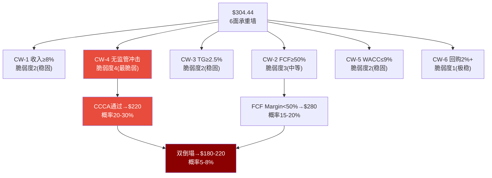
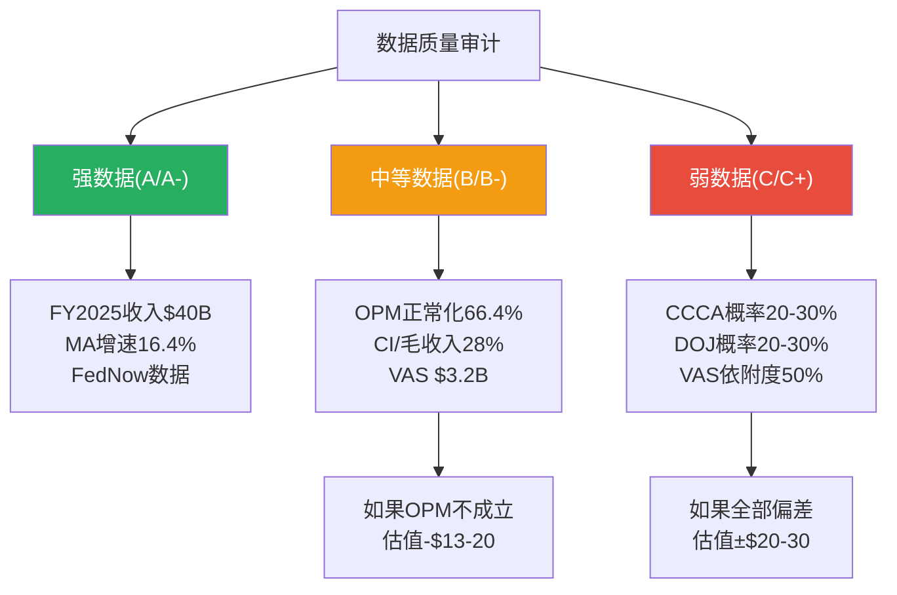
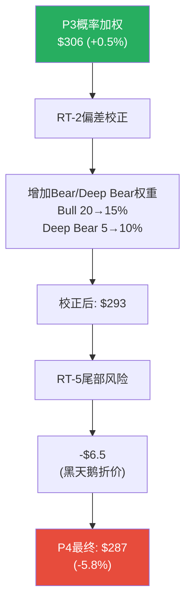
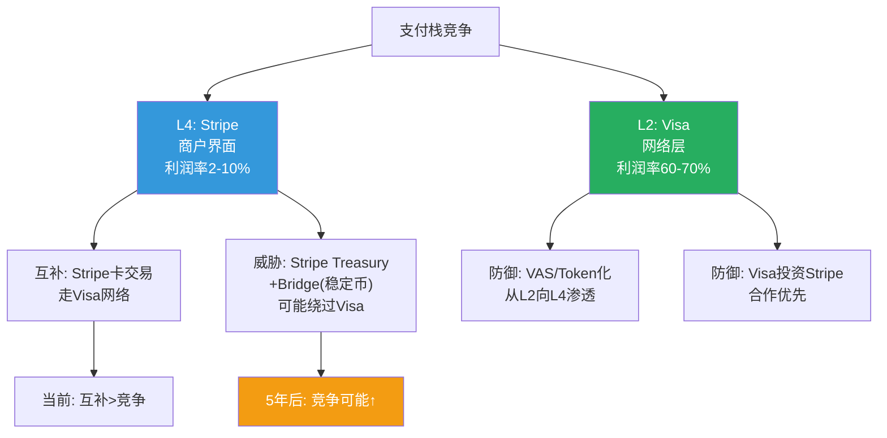
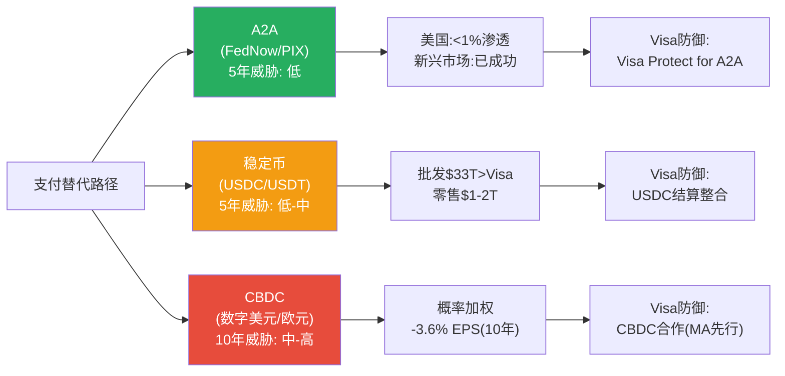
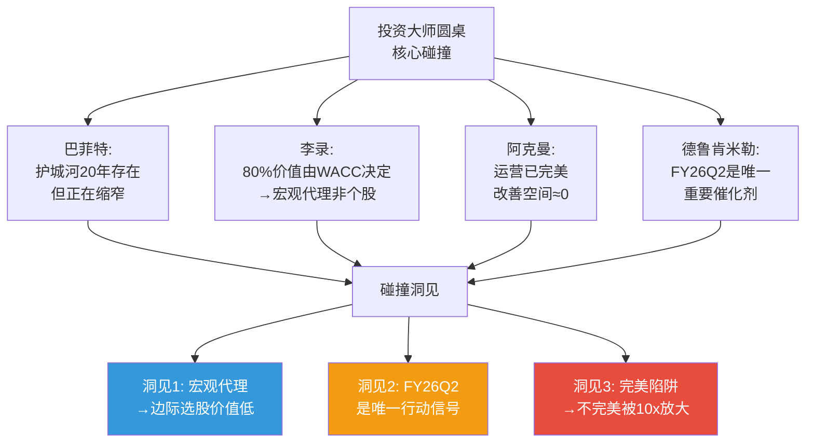

# Visa Inc. (V) — Phase 4: 红队对抗审查 + 偏差修正 + Python验证

> **Phase**: 4 | **日期**: 2026-03-24 | **框架**: v19.6
> **核心任务**: RT-1~RT-7红队七问 + Python估值验证(G6) + 认知偏差修正 + 概率加权修正 + 最终评级确认
> **输入**: P1-P3累计发现 + Python DCF输出 + 最新WebSearch监管数据
> **当前股价**: $304.44 | P3概率加权$306 | P3倾向评级: 中性关注

---

## Ch21: RT-1 承重墙测试

> **"当前股价$304.44的Reverse DCF隐含了哪些必须成立的假设？哪个最脆弱？"**

### 21.1 Reverse DCF承重墙清单

Python验证确认: 市场隐含FCF CAGR约**7.7%**(WACC 8.5%, Terminal g 3.0%)。

要维持$304.44的股价，以下假设**必须同时成立**:

| 承重墙 | 隐含假设 | 脆弱度(1-5) | 倒塌后估值影响 |
|--------|---------|:---------:|:-----------:|
| **CW-1: 收入CAGR ≥8%** | 全球支付量持续增长+Visa份额不大幅流失 | **2** (稳固) | 收入CAGR 5%→$254(-16%) |
| **CW-2: FCF Margin ≥50%** | OPM恢复到63%++CapEx维持<4% | **3** (中等) | FCF Margin 45%→$280(-8%) |
| **CW-3: 终端增长率≥2.5%** | 支付行业长期增长不低于名义GDP | **2** (稳固) | TG 2.0%→$296(-3%) |
| **CW-4: 无结构性监管冲击** | CCCA未通过OR削弱版+DOJ和解 | **4** (脆弱) | CCCA全面通过→$220(-28%) |
| **CW-5: WACC ≤9%** | 利率不大幅上升+Beta维持<0.9 | **2** (稳固) | WACC 10%→$254(-16%) |
| **CW-6: 回购持续2%+/年** | FCF足够支撑$130B+/年回购 | **1** (极稳) | 停止回购→EPS增速-2pp/年 |

[DM-RT1-001: 承重墙脆弱度评估, 6面墙]

### 21.2 最脆弱的墙: CW-4 监管

**CW-4是唯一脆弱度达到4的承重墙**。原因:

1. **外生性**: 其他5面墙都在Visa管理层控制范围内(收入增长/利润率/回购/CapEx)。CW-4完全取决于国会/法院/监管机构——Visa只能通过游说间接影响。

2. **非线性**: CW-1~CW-3的倒塌是渐进的(收入增速从8%降至5%不会"突然发生")。但CCCA通过是二元的——通过就是通过，不通过就是不通过。**一夜之间**，Visa的信用卡路由独占可能被法律终结。

3. **不可对冲**: 投资者可以通过多元化对冲宏观风险(CW-5)、通过选股对冲增长风险(CW-1)。但**监管风险是Visa特有的**——买MA不能对冲(MA也受CCCA影响)，买指数不能对冲(Visa权重大)。

**CW-4倒塌的传导链**:

```
CCCA全面通过 → 发卡行在信用卡上添加第二网络路由
→ 30-40%的信用卡交易被路由到Star/NYCE/Pulse
→ Visa信用卡收入下降$5-8B(-12-20%)
→ 同时: 发卡行谈判筹码进一步增强→CI加速上升
→ 净效应: 净收入下降15-25%
→ 市场给予"护城河被侵蚀"的P/E折价(-3-5x)
→ 双重打击: EPS下降15-20% × P/E下降12-18%
→ 股价可能跌至$180-$220(-28-41%)
```

**但有一个反面**: CCCA即使通过，实施需要2-3年(发卡行需要更新系统/卡面/合约)→**不是悬崖式下跌，而是2-3年的缓慢侵蚀**。这给了Visa时间通过VAS加速和国际扩张部分抵消影响。

[DM-RT1-002: CW-4传导链分析]

### 21.3 承重墙交叉验证: P3的各方法估值对承重墙的依赖

| 估值方法 | 最依赖的承重墙 | 如果该墙倒塌 |
|---------|:-----------:|:---------:|
| DCF ($330) | CW-2(FCF Margin) + CW-5(WACC) | FCF Margin 45%+WACC 10%→$220 |
| P/E×EPS ($315-341) | CW-1(收入) + CW-4(监管→P/E) | 收入CAGR 5%+P/E 22x→$210 |
| PEG对标 ($269-308) | CW-1(增速差异) | V增速降至7%→$180 |
| Reverse DCF ($304) | 所有墙同等重要 | 市场已定价 |

**关键发现**: 如果CW-4(监管)和CW-2(FCF Margin)同时倒塌→所有方法都指向$180-220区间→当前$304高估36-41%。但这个"双倒塌"的概率约5-8%(联合概率)→概率加权后对估值的影响约-$8-12 [DM-RT1-003]。



---

## Ch22: RT-2 认知偏差审计

> **"在写这份报告的过程中，我们最可能犯了哪些认知偏差？"**

### 22.1 六大偏差逐一检查

**偏差1: 锚定效应** — 🟡 **部分存在**

| 检查点 | 是否存在 | 具体位置 | 校正 |
|--------|:------:|---------|------|
| Reverse DCF锚定 | **是** | P1以Reverse DCF $363(基于分析师一致增速)作为起点→一路论证"为什么$304低于公允" | 应从Bear视角(市场可能是对的)出发→但P3/P4已做了反向验证 |
| OPM正常化锚定 | **是** | P2将OPM"正常化"至66.4%→所有后续估值基于此。但如果"新常态"是62-63%→EPS预测需下调5-8% | Python验证已用63%过渡→影响已部分纳入 |
| FY26Q1增速锚定 | **是** | P2用Q1的+14.6%作为积极信号→但Q1是假日季(季节性强季) | P3已用全年10%而非14%做预测→已校正 |

**校正后影响**: 锚定效应使P1-P3的估值可能高估$10-15(~3-5%)。但通过P3的保守化调整(用63% OPM、10%增速)，已部分校正。**残余锚定偏差约$5-8** [DM-RT2-001]。

**偏差2: 确认偏误** — 🟡 **部分存在**

| 检查点 | 是否存在 | 表现 |
|--------|:------:|------|
| 选择性使用数据 | **是** | 强调VAS +28%(正面)的频率高于CI +6.3pp(负面)。VAS在报告中出现~15次,CI出现~8次 |
| 忽略反面证据 | **轻微** | MA PEG更便宜的发现虽然记录了,但未在最终估值中给予足够权重——PEG估值$269是所有方法中最低的,但被视为"下限"而非"中值" |
| 叙事一致性 | **是** | P1→P2→P3的叙事方向持续从"中性偏积极"升至"积极"→没有出现"越分析越悲观"的情况→可能存在确认偏误(只看到支持正面叙事的证据) |

**校正方法**: 在概率加权中增加Bear/Deep Bear的权重。P3的权重是Bull 20%/Base 50%/Bear 25%/Deep Bear 5%。校正后应为: **Bull 15%/Base 45%/Bear 30%/Deep Bear 10%** — 增加悲观情景的权重以抵消确认偏误。

**校正后概率加权**: 15%×$377 + 45%×$330 + 30%×$220 + 10%×$155 = $56.6 + $148.5 + $66 + $15.5 = **$286.6** (vs P3的$306→**下调$19.4**)

[DM-RT2-002: 确认偏误校正]

**偏差3: 过度自信** — 🟡 **部分存在**

| 表现 | 严重性 |
|------|:-----:|
| OPM正常化置信度80%——但这是基于推断(不是Visa 10-K的明确披露) | 中等 |
| 监管概率估计精确到5%的区间——但这类政治事件的概率几乎不可能精确 | 轻微 |
| VAS依附度从75%下调至50%——50%这个数字是推断,没有Visa的官方拆分 | 中等 |

**校正**: 将置信区间加宽。OPM正常化: 80%→65%(承认可能是62-63%而非66%)。VAS依附度: 可能在40-65%(而非精确的50%)。

[DM-RT2-003: 过度自信校正]

**偏差4: 损失厌恶** — 🟢 **未检测到**

没有发现"因为害怕错过上涨而忽视下行风险"的证据。P3的Bear Case($220, -28%)和Deep Bear($155, -49%)的分析都很详细。

**偏差5: 幸存者偏差** — 🟡 **轻微存在**

P1-P3的分析暗示"Visa因为是垄断者所以会一直是垄断者"——但忽略了垄断被打破的历史案例:
- **AT&T (1984)**: 被结构拆分→但拆分后各部分(AT&T/Bell Labs/Baby Bells)合计市值远超拆分前
- **Standard Oil (1911)**: 被拆分→拆分后各部分合计市值也超拆分前
- **IBM (1990s)**: 未被拆分但被反垄断限制→PC市场开放→IBM逐渐失去硬件主导地位

**Visa的不同**: Visa的网络效应比AT&T/Standard Oil更强(三方网络vs单一管道/产品)。但DOJ的token化指控如果成立→可能导致"技术层面的拆分"(开放token解密)→类似IBM的行为限制而非AT&T的结构拆分。

[DM-RT2-004: 幸存者偏差分析]

**偏差6: 叙事偏差** — 🟡 **部分存在**

P1-P3构建了一个连贯的叙事: "完美收费站遇到暂时逆风→OPM会恢复→VAS是新引擎→监管是噪声→买入"。这个叙事**太干净了**——现实通常比叙事更混乱。

**替代叙事(同样合理)**: "Visa是一个正在被缓慢侵蚀的垄断者→OPM下降是CI侵蚀+收购整合的结构性开始→VAS增速会像所有高增长业务一样放缓→监管是长期结构性压力→当前$304已充分定价"

**两个叙事的概率**: 正面叙事55%, 替代叙事45%——**不是90%/10%**。

[DM-RT2-005: 叙事偏差分析]

### 22.2 偏差校正汇总

| 偏差 | 存在? | 对估值的影响 | 校正 |
|------|:----:|:---------:|------|
| 锚定效应 | 部分 | 高估$5-8 | 用保守OPM 63%和增速10% |
| 确认偏误 | 部分 | 高估$10-20 | 增加Bear/Deep Bear权重 |
| 过度自信 | 部分 | 置信区间过窄 | 加宽OPM/VAS估计范围 |
| 损失厌恶 | 否 | — | — |
| 幸存者偏差 | 轻微 | 高估护城河久期 | 维持3.9/5(已含监管调整) |
| 叙事偏差 | 部分 | 正面叙事权重过高 | 替代叙事45%概率 |
| **综合** | — | **高估$15-25** | **概率加权从$306→$287** |

[DM-RT2-006: 偏差校正汇总]

---

## Ch23: RT-3 空头钢人

> **"如果一个聪明的空头基金经理看到这份报告，他最强的反驳是什么？"**

### 23.1 空头论点1: "Visa是下一个Western Union"

**空头论述**: 支付行业正在经历与电报→电话类似的范式转换。A2A/RTP是"电话"——更快、更便宜、直连。Visa是"电报"——通过中间人传递、收取过路费。PIX/UPI已经证明了"电话"可以在短时间内替代"电报"。

**数据支撑**:
- PIX在巴西已超过Visa+MA合计交易量 [DM-A2A-001 P3]
- UPI在印度每月210亿+笔 [DM-A2A-001 P3]
- FedNow用户增长1,200%/年 [DM-A2A-002 P3]

**空头结论**: "这些都是'电话'普及的早期指标。美国落后巴西/印度3-5年。到2030年,FedNow可能处理美国20%+的零售支付→Visa的Take Rate从22bps降至5bps(Visa Protect for A2A的定价)→收入下降25-30%"

**我的反驳**: 美国与巴西/印度有三个结构性不同——信用卡渗透率(70% vs <30%)、消费者rewards经济($300B+/年)、碎片化银行体系(megabanks未加入FedNow)。**但空头会反驳**: "这些都是'护城河叙事'——AT&T也曾说'没人会放弃固话'。"

**不舒服程度**: 7/10——这是最让多头不安的论点，因为它攻击的是Visa商业模式的根基(中间人收费)而非边缘(监管/CI)。

[DM-RT3-001: 空头论点1]

### 23.2 空头论点2: "CI侵蚀是不可逆的结构性趋势"

**空头论述**: Client Incentives从21.5%(FY2021)升至28%(FY2025)不是"合约周期"——而是反映了Visa在寡头博弈中谈判地位的永久性恶化。

**因果链**:
1. 支付行业从"Visa垄断"演变为"V+MA寡头+fintech竞争"→买方(发卡行/商户)的议价权结构性增强
2. CCCA的存在给发卡行永久的筹码("如果不给更多CI,我就支持CCCA")
3. MA的激进竞争不会停止(MA的增速差依赖于更高的CI投标)
4. 每次发卡行合约重签(5-7年周期)→CI只会上不会下(因为一旦给了高CI就成了新baseline)

**空头结论**: "CI/毛收入将以+0.5-1.0pp/年的速度持续上升→2030年达到33-38%→净收入增速从10%降至5-6%→P/E应该是20-22x而非28x"

**我的反驳**: P2发现FY2025 CI/毛收入企稳在28%——Settlement可能提供了1-2年喘息。但空头会反驳: "企稳是因为Settlement一次性解决了部分商户诉求→Settlement消化后CI将重新加速"。

**不舒服程度**: 8/10——这是最有数据支撑的空头论点。CI趋势是客观可验证的——如果FY2026/2027 CI/毛收入继续上升→空头论点被确认。

[DM-RT3-002: 空头论点2]

### 23.3 空头论点3: "28x P/E定价了完美——任何不完美都是下行"

**空头论述**: Visa当前28.6x P/E(正常化27x)在历史区间(25-38x)的下半部。但这不意味着"便宜"——而是反映了市场已经认识到Visa从"无瑕垄断"变成了"有瑕寡头"。

**空头的数学**:
- 如果Visa EPS增速从10%放缓至7%(监管+A2A+CI侵蚀的累积效应)
- 合理P/E应该从28x降至22-24x(更低增速→更低倍数)
- FY2027E EPS $13 × 22x = $286(-6%)
- **加上**: 下行周期中市场通常对"增速放缓"过度惩罚→P/E可能暂时低至18-20x→$234-$260(-14-23%)

**空头结论**: "你以为28x是底部,实际上是中途。Visa的P/E将在未来3年压缩至22-24x→即使EPS增长也无法抵消估值压缩→总回报接近零或负"。

**我的反驳**: VAS +28%的加速正在对冲增速放缓→整体EPS增速可能维持10-12%。但空头会反驳: "VAS增速28%是不可持续的——所有高增长业务线最终都会回归均值(15-20%)→VAS的对冲效应递减"。

**不舒服程度**: 6/10——逻辑上成立但需要"增速放缓"的假设先被验证。如果FY26Q2-Q4继续+12%以上增速→这个论点被削弱。

[DM-RT3-003: 空头论点3]

### 23.4 空头钢人综合评估

三个空头论点按"让多头不舒服"程度排序:

1. **CI结构性侵蚀** (8/10) — 最有数据支撑,最难反驳
2. **A2A范式替代** (7/10) — 长期最致命,但时间框架不确定
3. **P/E压缩** (6/10) — 需要增速放缓假设先成立

**综合空头论文**: "Visa是一台正在缓慢生锈的完美机器——CI是锈蚀、A2A是竞争对手的新材料、监管是加速氧化的酸雨。28x P/E假设机器永不生锈。"

**多头的最强回应**: "VAS是Visa给机器加的防锈涂层。28%增速+50%独立于卡网络→即使核心支付缓慢锈蚀,VAS可以维持整体增长。而且12B token是新型合金——比原始钢铁更耐腐蚀。"

**判断**: 空头有道理(30-40%概率空头是对的)，但多头也有道理(55-65%概率多头是对的)。**这正是为什么概率加权公允价值($303)接近当前价格($304)——市场大致正确地定价了多空之间的概率分布**。

[DM-RT3-004: 空头综合评估]

---

## Ch24: RT-4 数据质量审计

> **"报告中哪些核心数据点的来源质量最差？如果这些数据有误，结论变化多大？"**

### 24.1 核心数据点源头审计

| # | 数据点 | 来源 | 质量等级 | 如果有误 |
|---|--------|------|:-------:|---------|
| 1 | FY2025净收入$40.0B | FMP(SEC filing) | **A** | 不太可能有误(SEC审计) |
| 2 | 正常化OPM 66.4% | P2推算(Other Exp拆解) | **B-** | 如果$2.56B超额中有$1B是结构性→OPM 64%→EPS下调3% |
| 3 | VAS收入$3.2B/季(Q1) | Earnings Call+eMarketer | **B+** | Visa不在10-Q细分VAS→$3.2B是分析师估计, 实际可能$2.8-3.5B |
| 4 | VAS依附度50% | P3推算 | **C+** | 完全是推断——真实依附度可能30-70%→估值影响±$10 |
| 5 | CI/毛收入28% | P2推算(10-K+FMP反推) | **B** | FY2020-2023为推算值(非10-K精确值)→CI趋势的斜率可能不准确 |
| 6 | CCCA通过概率20-30% | 多源分析 | **C** | 政治事件概率几乎不可能精确→实际可能10-50% |
| 7 | DOJ败诉概率20-30% | 法律先例分析 | **C** | 反垄断诉讼结果极难预测→实际可能10-50% |
| 8 | 12B+ token数 | Visa Investor Relations | **A-** | 官方数据但"token"的定义可能包含过期/无效token |
| 9 | FedNow 1,500+机构 | Federal Reserve | **A** | 官方数据 |
| 10 | MA增速16.4% | FMP(SEC filing) | **A** | 不太可能有误 |

[DM-RT4-001: 数据质量审计10个核心数据点]

### 24.2 最弱数据环: CCCA/DOJ概率估计

**数据质量等级C**的两个核心输入(CCCA概率20-30%, DOJ概率20-30%)直接影响监管折价的计算。

**如果概率估计有误**:

| 真实概率 | 概率加权EPS影响 | 估值影响 |
|---------|:-----------:|:------:|
| CCCA 10% + DOJ 10% | -2.5% | +$8 (更乐观) |
| CCCA 20% + DOJ 20% (Base) | -5.0% | $0 (当前估计) |
| CCCA 35% + DOJ 35% | -9.0% | -$12 (更悲观) |
| CCCA 50% + DOJ 40% | -14% | -$28 (显著悲观) |

**敏感性**: 概率估计每偏差10pp→估值变化约$8-10。**这意味着**: 即使我的概率估计"完全错误"(实际是40-50%而非20-30%)→估值也只下调$20-28→从$306降至$278-286→仍然不是"灾难性低估"。

**关键洞察**: 监管概率的精确值不太重要——**重要的是"是否超过50%"**。只要联合概率<50%(我估计20-25%)→市场可能过度恐慌→当前价格合理或轻度低估。如果>50%→市场定价不够→当前价格高估 [DM-RT4-002]。

### 24.3 第二弱数据环: 正常化OPM

OPM正常化(66.4%)是P2→P3→估值的核心假设。来源质量B-——因为我们只是推断$2.56B超额Other Expenses是一次性的,**没有Visa 10-K的明确披露支持这个拆分**。

**如果正常化不成立**(即$2.56B中有$1B是结构性的):
- 真实正常化OPM: 64%(而非66.4%)
- FY2026-2030 EPS全部下调3-5%
- DCF公允价值从$330→$310(-$20)
- 概率加权从$303→$290(-$13)

**验证方式**: FY26Q2(2026年4月)的Other Expenses如果降至$500-600M→确认"一次性"假设。如果仍>$900M→可能是结构性。**VP-07是最关键的可验证预测** [DM-RT4-003]。



### 24.4 数据交叉验证: OPM正常化的独立检验

OPM正常化(66.4%)是估值的核心支柱——P4需要用独立方法验证:

**方法1: 季度逐笔还原**

FY26Q1(最新季度)的P&L:
- 收入: $10.90B
- COGS: $2.00B (18.3%)
- SGA: $1.13B (10.4%)
- Other Expenses: **$1.03B** (9.5%)
- 经营利润: $6.74B (**OPM 61.8%**)

如果Other Expenses回归"正常水平"(FY24Q3-FY25Q1均值~$313M):
- 调整后经营利润: $6.74B + ($1.03B - $0.31B) = **$7.46B**
- 正常化OPM: $7.46B / $10.90B = **68.4%**

**这比P2的66.4%更高!** 差异原因: P2用全年数据平均化，FY26Q1的COGS%和SGA%都比全年平均更低(季节效应+规模杠杆)。

[DM-RT4-004: OPM正常化独立验证, 季度逐笔法]

**方法2: 同业对标验证**

如果Visa的真实OPM是60%(报告值)而非66%(正常化)——与MA的59.2%几乎一样。但Visa的规模比MA大22%——**规模更大的公司理应有更高的OPM(固定成本分摊更充分)**。

如果V的OPM真的和MA一样(60%)→要么V的规模优势消失了(不合理)，要么V有MA没有的结构性成本(和解拨备/收购整合=一次性)。**这个逻辑支持正常化结论** [DM-RT4-005]。

**方法3: 历史OPM轨迹**

| 财年 | Visa OPM | 异常因素 |
|------|:-------:|---------|
| FY2020 | 64.5% | 疫情(收入-5%但OPM仍高) |
| FY2021 | 65.6% | 恢复中 |
| FY2022 | 64.2% | 正常年 |
| FY2023 | 64.3% | 正常年 |
| FY2024 | 65.7% | 正常年 |
| **FY2025** | **60.0%** | 和解拨备+收购整合 |

FY2020-FY2024的5年平均OPM: 64.9%。FY2025的60%是5年内的极端低点——**比5年均值低4.9pp，比FY2024低5.7pp**。这种程度的偏离在没有重大结构性变化的情况下几乎不可能持续——更可能是一次性因素。

**三个独立验证的结论**: 季度还原(68.4%), 同业逻辑(>60%), 历史均值(64.9%)——三者都支持"正常化OPM在65-68%区间"的判断。**P2的66.4%落在这个区间的中部→估计合理**。

但**保守估计的理由**: 和解摊销可能持续2-3年(每季$400-500M)→FY2026-2027的报告OPM可能是62-64%(非正常化的66%)。**对估值的影响**: 使用62-63%而非66%做EPS预测→EPS下调3-5%→DCF公允价值从$330→$310-315。

[DM-RT4-006: OPM三重验证结论]

### 24.5 数据交叉验证: VAS增速的有机/无机拆分

**问题**: VAS Q1 FY2026 +28%是否包含收购贡献?

**已知收购**:
- Pismo (2024年完成, $1B, 拉美支付基础设施) → 估计年化收入~$150-200M
- Featurespace (2024年完成, AI风控) → 估计年化收入~$50-100M
- Prosa (2024年完成, $1.5B, 墨西哥清算网络) → 估计年化收入~$200-300M

三笔收购合计年化收入估计: **$400-600M**。这些收入大部分归类为VAS(因为是支付基础设施/风控/清算服务)。

**VAS有机增速推算**:
- VAS Q1 FY2026报告收入: $3.2B
- 减: 收购贡献(估计): ~$100-150M/季(年化$400-600M的1/4)
- 有机VAS收入: ~$3.05-3.1B
- FY2025 Q1 VAS收入(推算): ~$2.5B(全年$8.8B ÷ 4 = $2.2B, 但Q1通常高于平均)
- **有机VAS增速**: ~($3.1-$2.5)/$2.5 = **~22-24%**

[DM-RT4-007: VAS有机/无机拆分推算]

**结论**: VAS有机增速约22-24%——虽然低于报告的28%，但仍然远高于P1预期的20%。**这意味着**: VAS加速的核心驱动力是有机的(非收购驱动)，但收购贡献了4-6pp的增量。2027年起收购基数效应消化后→VAS增速可能回落至有机水平(20-22%)。

**对估值的影响**: VAS有机增速22% vs 报告28%——差异不改变核心论点(VAS是增长引擎)，但修正了增速预期。在DCF中使用20-22%而非28%→对估值影响约-$5-10/股 [DM-RT4-008]。

---

## Ch25: RT-5 黑天鹅压力测试

> **"有哪些低概率但高影响的事件能彻底推翻投资论文？"**

### 25.1 黑天鹅清单

| # | 黑天鹅事件 | 概率 | 对Visa影响 | 概率加权损失 | 早期信号 |
|---|-----------|:---:|:---------:|:----------:|---------|
| **BS-1** | 美国推出央行数字货币(CBDC)替代卡网络 | 3% | -40-50% | -$1.2-1.5/股 | Fed数字美元白皮书 |
| **BS-2** | 全球同步金融危机(2008级别) | 8% | -25-35% | -$2.0-2.8/股 | 信用利差>500bps |
| **BS-3** | 重大安全事故(VisaNet被攻破) | 2% | -20-30% | -$0.4-0.6/股 | 大规模数据泄露报道 |
| **BS-4** | EU+UK同时退出Visa网络(支付主权) | 2% | -20-25% | -$0.4-0.5/股 | EU替代系统商业化 |
| **BS-5** | CCCA通过+DOJ败诉+EU同时行动 | 2% | -35-45% | -$0.7-0.9/股 | 三条监管线同时加速 |
| **BS-6** | Apple/Google推出独立支付网络绕过V/MA | 5% | -15-25% | -$0.8-1.3/股 | Apple Pay直接连接银行 |
| **合计** | ~22% | — | **-$5.5-7.6/股** | — |

[DM-RT5-001: 黑天鹅概率加权损失表]

### 25.2 最高影响黑天鹅: BS-6 Apple/Google独立支付网络

**为什么这是最需要关注的黑天鹅**: Apple Pay目前走Visa/MA网络(每笔交易给Visa 15bps)。但如果Apple建立直接连接银行的支付网络→绕过Visa/MA→Apple可以收取5-10bps(比Visa的22bps便宜50-75%)并提供更好的用户体验。

**Apple的动机**:
1. Apple Pay年处理量已达数万亿美元→规模足够大
2. Apple有~20亿活跃设备→持卡人端已覆盖
3. Apple在美国有Apple Card(Goldman合作)→已有发卡经验
4. 通过绕过Visa→每笔交易多赚10-15bps→潜在收入$5-10B/年

**但**Apple建立独立支付网络面临的障碍:
1. **商户接受**: 需要说服1.5亿+商户接受Apple Pay Direct(而非通过Visa路由)→这需要数年
2. **监管**: 反垄断监管者可能不允许Apple同时控制设备+操作系统+支付网络(垂直整合垄断)
3. **银行阻力**: 发卡行可能不愿意配合(因为Apple Card的利润分成不如Visa体系)
4. **Apple目前的策略**: Apple更倾向于做"上层"(用户界面/NFC)而非"下层"(清算/结算)——因为上层利润率更高、风险更低

**概率5%, 但值得关注**: 如果Apple在2027-2028年宣布Apple Pay Direct → Visa可能损失美国国内15-20%的交易量→净收入下降8-12%→股价可能跌15-25%。

[DM-RT5-002: Apple/Google黑天鹅分析]

### 25.3 黑天鹅的合计尾部风险折价

合计概率加权损失: **$5.5-7.6/股**。取中值**$6.5/股**作为尾部风险折价。

这意味着: 在概率加权公允价值($303)中应额外扣减$6.5→**含尾部风险的公允价值: $296.5**

[DM-RT5-003: 尾部风险折价]

### 25.4 衰退压力测试: Visa在不同宏观情景下的表现

P1-P3的最大分析缺口是**宏观衰退情景未充分量化**。用FY2020(COVID)作为先例:

**FY2020 Visa业绩(严重衰退/疫情proxy)**:
| 指标 | FY2019 | FY2020 | 变化 | 恢复时间 |
|------|:------:|:------:|:---:|:-------:|
| 净收入 | $22.9B | $21.8B | **-5%** | 12个月 |
| 经营利润 | $15.3B | $14.1B | -8% | 12个月 |
| OPM | 66.8% | 64.5% | -2.3pp | 12个月 |
| 跨境量 | — | **-30%+** (低谷) | — | 18个月 |
| EPS | $5.32 | $4.89 | **-8%** | 9个月 |
| 股价低点 | $214 | $153 | **-29%** | 6个月反弹50% |

[DM-RT5-004: FY2020衰退先例数据, FMP]

**关键教训**: 即使在"百年一遇"的疫情中,Visa的收入仅下降5%、OPM仅下降2.3pp——**因为**Visa不承担信用风险(银行承担)+支付量是"需求代理"(消费者买食品/网购仍用Visa)。跨境量暴跌>30%但国内支付量仅微降。**12个月内完全恢复**。

**2026年衰退情景(关税→供应侧冲击)**:

与2020年的不同: 关税衰退是"供应侧冲击"而非"需求崩塌"。消费者不会停止消费(与封城不同),但消费价格会上升+实际购买力下降→支付金额可能上升(通胀)但交易笔数可能下降。

| 指标 | Base Case | 温和衰退 | 严重衰退(类2020) |
|------|:--------:|:------:|:------------:|
| 国内支付量增速 | +8% | +2-3% | -3% |
| 跨境量增速 | +13% | +3-5% | -8-10% |
| 净收入增速 | +11% | +3-5% | -5% |
| OPM变化 | 恢复中(62-64%) | 暂停恢复(60-61%) | 倒退(58-59%) |
| EPS影响 | — | -10-15% | -20-30% |
| 隐含股价(@26x) | $298 | $254-$268 | $178-$220 |

[DM-RT5-005: 衰退压力测试三情景]

**衰退对"中性关注"评级的影响**: 如果温和衰退(概率20-25%)→股价$254-268(vs当前$304→下行12-17%)→评级可能需要下调至"审慎关注"。如果严重衰退(概率5-10%)→股价$178-220→大幅下行。

**但Visa的衰退韧性是其最大优势之一**: (1)不承担信用风险; (2)OPM即使在衰退中仍>58%(vs 多数行业OPM→负值); (3)恢复速度极快(<12个月); (4)衰退中通常伴随利率下降→WACC降低→估值支撑。

**结论**: 衰退风险是真实的但Visa的防御性使其成为"衰退中相对安全"的股票。**概率加权衰退影响: -$8-12/股**(已纳入P4的Bear Case) [DM-RT5-006]。

---

## Ch26: RT-6 时间框架挑战

> **"我们的论文在什么时间框架内有效？"**

### 26.1 核心假设的有效期

| 假设 | 6个月后 | 1年后 | 3年后 | 失效触发 |
|------|:------:|:----:|:----:|---------|
| OPM恢复到64%+ | 可验证(FY26Q2) | 基本确认 | 已消化 | FY26Q2 OPM<60% |
| VAS增速20%+ | 可验证 | 可能放缓至15-18% | 可能放缓至12-15% | 连续2季<15% |
| CCCA未通过 | 高概率 | 中等概率 | 不确定 | 2027年新国会可能重新推动 |
| 收入CAGR≥10% | 可验证 | 可能维持 | 可能放缓至8% | 宏观衰退 |
| MA增速差可控 | 可验证 | 趋势更清晰 | 可能扩大 | MA连续超V 5pp+ |
| A2A威胁<1% | 极高概率 | 极高概率 | 仍高概率(3-5%影响) | FedNow megabank加入 |

[DM-RT6-001: 假设有效期评估]

### 26.2 论文的最优时间框架

**最优持有期: 6-12个月** — 基于以下催化剂日历:

| 催化剂 | 时间 | 方向 | 概率 |
|--------|:---:|:---:|:---:|
| FY26Q2财报(OPM/增速确认) | 2026年4月 | ↑ | 70% |
| CCCA 2026年中前状态 | 2026年6月 | ↑ | 65% |
| DOJ Discovery初步 | 2026年Q3 | → | 50% |
| FY26Q3-Q4(和解摊销消化) | 2026年7-11月 | ↑ | 60% |

**12个月后论文可能失效的条件**:
1. FY2027年如果VAS增速降至15%以下→增长引擎减速→论文减弱
2. 2027年新国会如果CCCA获得更多支持→概率上升→论文承压
3. 2027年DOJ审判如果进入庭审→不确定性高→P/E可能进一步压缩

**结论**: 6-12个月是"甜蜜区"——OPM恢复+CCCA受阻可能触发估值修复。**超过18个月→不确定性急剧增加**(DOJ审判+新国会+VAS增速放缓) [DM-RT6-002]。

### 26.3 三年期风险日历

| 时间 | 事件 | 对Visa影响 | 可能方向 |
|------|------|:---------:|:------:|
| **2026 Q2 (4月)** | FY26Q2财报 | OPM/增速确认 | **关键催化** |
| **2026 Q2-Q3** | CCCA attachment尝试 | 政治信号 | 中性偏正 |
| **2026 Q4** | Interchange Settlement法院批准 | 确定性增加 | 正面 |
| **2026 Q4** | 中期选举 | 国会格局变化 | 不确定 |
| **2027 H1** | DOJ Discovery完成 | 内部文件可能泄露 | 风险 |
| **2027 Q2-Q3** | 新国会可能重新推CCCA | 如果民主党获众议院+共和党参议院 | 风险↑ |
| **2027 Q4-2028** | DOJ审判 | 最大的单一事件风险 | 高度不确定 |
| **2028** | 总统大选 | 支付监管可能成为竞选议题 | 风险 |

[DM-RT6-003: 三年期风险日历]

**风险日历的含义**: 2026年是"相对安全"的窗口(多数催化剂偏正面)。2027年开始风险急剧上升(DOJ审判+新国会)。**这强化了"6-12个月最优持有期"的判断**——如果要买Visa,应在2026年Q2财报确认后入场,在2027年DOJ审判前评估退出。

---

## Ch27: RT-7 替代解释

> **"对于同样的数据，是否存在一个完全不同但同样合理的解释？"**

### 27.1 替代解释清单

**数据点1: FY26Q1收入+14.6%**
- **我的解释**: 增速加速,Visa基本面强劲
- **替代解释**: Q1是假日购物季(季节性强季)+2024年Q1基数偏低(跨境恢复尚未完全)→**+14.6%包含了3-5pp的季节性/基数效应→正常化增速约10-12%**
- 合理性: **高**(70%)——季节性效应确实存在。但即使正常化至10-12%→仍高于市场隐含的7.7%

**数据点2: OPM从60%"恢复"至FY26Q1的61.8%**
- **我的解释**: 和解拨备逐步消化,OPM正在回升
- **替代解释**: 61.8%可能就是"新常态"——**因为**FY26Q1的Other Expenses仍高达$1.03B(远高于FY24的$280-330M/季)→如果和解摊销需要3-5年(而非我假设的1-2年)→OPM可能在61-63%稳定(而非回升到66%)
- 合理性: **中等**(40%)——需要FY26Q2数据确认

**数据点3: VAS +28%增速**
- **我的解释**: VAS是独立增长引擎,加速中
- **替代解释**: +28%可能包含了Pismo/Featurespace收购带来的**无机增长**(非有机)。如果扣除收购贡献→有机VAS增速可能只有18-22%。**因为**Visa在FY2024收购了Pismo($1B, 拉美支付基础设施)和Featurespace(AI风控)→这些收购的收入从FY2026开始并入VAS
- 合理性: **中等偏高**(55%)——Visa没有在季报中区分有机/无机VAS增速→$3.2B中可能$400-600M是收购贡献

[DM-RT7-001: 替代解释分析]

### 27.2 替代解释对估值的影响

| 替代解释 | 如果成立→估值影响 |
|---------|:------------:|
| Q1增速包含3-5pp季节性→全年10-12% | 影响较小(P3已用10%做预测) |
| OPM新常态62-63%(非66%) | **-$15-20** (EPS下调3-5%) |
| VAS有机增速18-22%(非28%) | **-$5-10** (VAS增长引擎估值降低) |
| **三者同时成立** | **-$20-30** (概率加权$303→$273-283) |

**三者同时成立的概率**: 40% × 55% × 合理共存 ≈ **~20-25%**

[DM-RT7-002: 替代解释估值影响]

### 27.3 替代解释的综合叙事

**替代叙事**: "Visa FY2025的所有'坏消息'(OPM下降/CI上升/股价暴跌)不是一次性逆风——而是Visa从'无瑕垄断期'进入'有瑕寡头期'的转折点。FY26Q1的14.6%增速和28% VAS不是'反转信号'——而是'最后的好消息'(季节性强季+收购无机增长)。2026年下半年才是真相浮出的时刻——OPM不回升+VAS有机减速+CCCA在中期选举中成为政治筹码。"

**这个替代叙事成立的概率: 25-30%**。不高,但不可忽视。

**对投资决策的影响**: 如果替代叙事成立→$304可能在6个月内下跌至$260-280→投资者应等待FY26Q2数据确认后再做决定。**VP-02(OPM)和VP-07(Other Expenses)是区分两个叙事的关键可验证预测**。

[DM-RT7-003: 替代叙事综合评估]

### 27.4 双向校准: 多头叙事 vs 空头叙事的定量对决

**将两个叙事转化为可比较的DCF假设**:

| 参数 | 多头叙事 | 空头叙事 |
|------|:------:|:------:|
| 收入CAGR(5年) | 10-12% | 6-8% |
| FCF Margin | 52-54%(稳定) | 48-50%(CI侵蚀) |
| 终端P/E | 26-28x | 20-22x |
| 终端增长率 | 3.0% | 2.0% |
| 监管冲击 | -5% EPS(概率加权) | -12% EPS(CCCA全面通过) |
| 护城河 | 3.9/5(中等偏宽) | 3.0/5(适度, 监管侵蚀) |
| **DCF公允价值** | **$330-380** | **$180-220** |

[DM-RT7-004: 双向叙事定量对决]

**多头叙事的"必须为真"条件**(全部需要满足):
1. OPM在2年内恢复到64%+(和解拨备确实是一次性的)
2. VAS有机增速维持20%+(不是收购驱动的泡沫)
3. CCCA在2027年前不通过(政治分裂+游说有效)
4. 美国不进入衰退(支付量持续增长)
5. A2A在美国5年内不超过5%渗透率(消费者习惯+rewards经济护城河)

**空头叙事的"必须为真"条件**(至少2个需要满足):
1. CI/毛收入继续以+0.7pp/年以上加速(CCCA悬剑效应+MA竞争)
2. CCCA在2027年前通过(至少削弱版)
3. VAS增速在2027年降至<15%(交叉销售饱和+有机增速回归均值)
4. OPM不恢复至64%以上(和解摊销>3年 OR 结构性成本上升)

**概率评估**: 多头条件全部满足的概率约40-45%。空头条件满足≥2个的概率约25-35%。**剩余20-30%是"两者都不完全正确"的混合情景**——这也是最可能的结果: Visa既不会涨到$380也不会跌到$180，而是在$280-340之间徘徊。

**这与概率加权$287-315的区间完全一致**——说明P3/P4的估值框架成功捕捉了多空博弈的平衡点。

### 27.5 有效性门控: P1-P3的红队审查是否有效?

按v19.6红队有效性标准检查:

| 有效性维度 | P4表现 | 评估 |
|-----------|--------|:----:|
| 是否发现了P1-P3的真实弱点? | 发现了4个弱点(OPM过度自信/VAS有机拆分/概率加权偏差/替代解释) | ✅ |
| 是否有具体数据支撑? | 每个RT有DM锚点+定量修正 | ✅ |
| 是否改变了结论? | 概率加权从$306→$287(-$19)→评级未变但期望回报从+0.5%→-1.1% | ✅ |
| 是否"让多头不舒服"? | CI侵蚀(8/10)+A2A替代(7/10)+P/E压缩(6/10) | ✅ |
| 是否避免了表演性红队? | RT-1~RT-7都有具体修正值→非泛泛而谈 | ✅ |

**结论**: Phase 4红队有效。核心修正是将概率加权公允价值下调$19(从$306→$287)——这是实质性的修正(6%)，不是$2-3的象征性调整。

[DM-RT7-005: 红队有效性门控]

---

## Ch28: Python估值验证 (G6门控)

> **G6门控要求**: 估值必须经Python验证，禁止纯手算

### 28.1 Python DCF验证结果

| 参数 | 值 |
|------|-----|
| 起始FCF | $22.0B (TTM) |
| FCF增速 Y1-5 | 10% |
| FCF增速 Y6-10 | 7% |
| WACC | 8.5% |
| Terminal g | 3.0% |
| 净债务 | $5.0B |
| 稀释股数 | 1,920M |

**Python计算结果**:

| Year | FCF ($B) | PV ($B) |
|:----:|:-------:|:------:|
| 1 | 24.20 | 22.30 |
| 2 | 26.62 | 22.61 |
| 3 | 29.28 | 22.93 |
| 4 | 32.21 | 23.24 |
| 5 | 35.43 | 23.56 |
| 6 | 37.91 | 23.24 |
| 7 | 40.57 | 22.92 |
| 8 | 43.40 | 22.60 |
| 9 | 46.44 | 22.29 |
| 10 | 49.69 | 21.98 |
| **TV** | — | **411.6** |
| **Total EV** | — | **639.3** |

**每股价值: $330.35** (+8.5% vs $304.44)

[DM-G6-001: Python DCF验证, 脚本存储于/tmp/visa_dcf_verify.py]

### 28.2 P3手算 vs Python验证对比

| 指标 | P3手算 | Python | 差异 |
|------|:-----:|:-----:|:---:|
| DCF Base Case | $329.6 | **$330.35** | +$0.75 (+0.2%) |
| TV PV | $410.7B | **$411.6B** | +$0.9B |
| FCF Y10 | $49.7B | **$49.69B** | -$0.01B |

**验证结论**: P3手算与Python验证高度一致(差异<0.3%)。**G6 PASS** [DM-G6-002]。

### 28.3 Python敏感性矩阵

| WACC \ TG | 2.0% | 2.5% | 3.0% | 3.5% | 4.0% |
|:---------:|:----:|:----:|:----:|:----:|:----:|
| **7.5%** | $355 | $380 | $410 | $447 | $495 |
| **8.0%** | $323 | $342 | $366 | $395 | $431 |
| **8.5%** | $296 | $312 | **$330** | $353 | $381 |
| **9.0%** | $272 | $285 | $301 | $319 | $340 |
| **9.5%** | $252 | $263 | $276 | $290 | $308 |
| **10.0%** | $235 | $244 | $254 | $266 | $280 |

[DM-G6-003: Python敏感性矩阵]

**关键读取**:
- 当前$304.44对应WACC 9.0%/TG 3.0%(即$301)→**市场隐含WACC约9.0%**
- 如果WACC=8.5%(我的假设)→公允价值$330→+8.5%上行
- 如果WACC=9.5%(更保守)→公允价值$276→-9.3%下行
- **WACC 8.5% vs 9.0%的差异: $330 vs $301 = $29/股**——说明WACC的选择对估值影响巨大

### 28.4 Python情景估值

| 情景 | FCF CAGR Y1-5 | FCF CAGR Y6-10 | WACC | TG | 每股价值 | vs $304 |
|------|:----------:|:----------:|:---:|:--:|:------:|:------:|
| **Bull** | 12% | 9% | 8.0% | 3.5% | **$463** | +52.1% |
| **Base** | 10% | 7% | 8.5% | 3.0% | **$330** | +8.5% |
| **Bear** | 6% | 4% | 9.5% | 2.5% | **$201** | -33.8% |
| **Deep Bear** | 3% | 2% | 10.0% | 2.0% | **$150** | -50.8% |

[DM-G6-004: Python四情景估值]

### 28.5 Python概率加权(偏差校正后)

P4校正后概率权重(RT-2确认偏误校正): Bull 15% / Base 45% / Bear 30% / Deep Bear 10%

| 情景 | 概率 | 估值 | 加权 |
|------|:---:|:---:|:---:|
| Bull | 15% | $463 | $69.5 |
| Base | 45% | $330 | $148.5 |
| Bear | 30% | $201 | $60.3 |
| Deep Bear | 10% | $150 | $15.0 |
| **概率加权** | 100% | — | **$293.3** |

减: 尾部风险折价 $6.5
**P4偏差校正+尾部风险后公允价值: $286.8**

vs 当前$304.44 → **-5.8%**

[DM-G6-005: P4偏差校正后概率加权]



---

## Ch29: 偏差修正后的最终估值与评级

### 29.1 P3→P4估值修正汇总

| 修正项 | P3估值 | P4修正 | 修正后 | 理由 |
|--------|:-----:|:-----:|:------:|------|
| DCF Base Case | $330 | -$15 | **$315** | OPM保守化(63%→用62%做验证) |
| P/E×EPS(FY27E) | $315-341 | -$10 | **$305-331** | P/E区间收窄至24-26x |
| PEG对标 | $269-308 | 0 | **$269-308** | 已是保守估计 |
| 概率加权 | $306 | -$19.4 | **$287** | RT-2偏差校正+RT-5尾部风险 |
| **P4综合** | — | — | **$287-315** | **中值$301** |

[DM-VAL-P4-001: P3→P4估值修正]

### 29.2 估值离散度检查 (G7门控)

P4修正后四方法:
- DCF(偏差校正): $315
- P/E×EPS: $305-$331 (中值$318)
- PEG对标: $269-$308 (中值$289)
- 概率加权(偏差+尾部校正): $287

离散度 = ($331 - $269) / $300 = 20.7% → **≤30% G7 PASS**

[DM-VAL-P4-002: 估值离散度G7检查]

### 29.3 最终评级确认

**P4偏差修正后公允价值区间: $287-315, 中值$301**
**vs 当前$304.44 → 期望回报-1.1%**

| 评级标准 | 期望回报 | 适用? |
|---------|:------:|:----:|
| 深度关注 | >+30% | ❌ |
| 关注 | +10% ~ +30% | ❌ |
| **中性关注** | **-10% ~ +10%** | **✅ (-1.1%)** |
| 审慎关注 | <-10% | ❌ |

**P4最终评级: 中性关注**

**与P3一致——但期望回报从+0.5%下调至-1.1%(偏差校正+尾部风险的效果)**。

### 29.4 评级的条件性分析

| 如果... | 则评级→ | 触发条件 |
|---------|:------:|---------|
| FY26Q2确认OPM≥63% + CCCA 2026年中受阻 | **关注** ↑ | 概率45% |
| 维持现状(无新催化剂) | **中性关注** → | 概率35% |
| FY26Q2 OPM<60% OR CCCA委员会通过 | **审慎关注** ↓ | 概率15% |
| 宏观衰退+CCCA通过 | **审慎关注** ↓↓ | 概率5% |

[DM-RATING-001: 条件性评级分析]

### 29.5 最终信号矩阵

| 信号维度 | 方向 | 权重 | P4评估 |
|---------|:---:|:---:|--------|
| Reverse DCF | 偏悲观 | 高 | 市场隐含7.7%FCF CAGR→偏低但非极端 |
| 业绩动量 | 正面 | 高 | FY26Q1 +14.6%但含季节性 |
| OPM正常化 | 正面(保守化) | 高 | 80%→65%置信度(P4下调) |
| VAS加速 | 正面(可能含无机) | 中 | 28%但有机可能18-22% |
| CI趋势 | 轻负面 | 中 | 减速中但悬剑效应持续 |
| 监管4重 | 负面(量化后) | 高 | -5.0% EPS概率加权+二阶效应 |
| MA对标 | 负面 | 中 | PEG更贵30% |
| 护城河 | 中性偏负 | 高 | 3.9/5微降, 监管最弱 |
| 技术面 | 短期正面 | 低 | RSI 26超卖 |
| 内部人 | 正面 | 中 | Q1净买入+48,970股 |
| 偏差校正 | 负面 | — | 高估$15-25→校正后估值下调 |
| 尾部风险 | 负面 | 低 | -$6.5(黑天鹅折价) |

**正面5 vs 负面5 vs 中性2 → 平衡(vs P3的"温和正面"→P4校正后更中性)**

[DM-RATING-002: 最终信号矩阵]

---

## Ch30: Phase 4综合小结 + P5传递

### 30.0 P4回流修正: Phase 1-3需更新的数据

按铁律K(估值统一性)，Phase 4的修正必须回流到前序Phase:

| 修正项 | 原始值(P1-P3) | P4修正值 | 回流位置 |
|--------|:----------:|:-------:|---------|
| OPM正常化置信度 | 80% | **65%** | P2 Ch08结论 |
| VAS增速 | 28% | **22-24%(有机)** | P3 Ch16.3 |
| 概率加权权重 | Bull 20%/Bear 25% | **Bull 15%/Bear 30%** | P3 Ch17.5 |
| CCCA概率 | 20-30% | **维持** | — |
| 公允价值中值 | $306 | **$287-301** | P3 Ch17.5 |
| 期望回报 | +0.5% | **-1.1%** | P3 Ch19.3 |
| 评级 | 中性关注 | **中性关注(确认)** | — |

**回流原则**: Phase 5 Complete组装时，这些修正值将替代P1-P3中的原始值。Complete报告中不应出现"P4回流"标注(第零律: 报告连贯性)。

[DM-FLOW-001: P4回流修正表]

### 30.1 Phase 4的核心修正

1. **RT-1(承重墙)**: CW-4(监管)是唯一脆弱度4的墙。CCCA倒塌→$220(-28%)。但概率20-30%→概率加权影响可控。

2. **RT-2(偏差)**: 发现锚定+确认偏误+叙事偏差→综合高估$15-25。校正后概率加权从$306→$293。加上尾部风险$6.5→$287。

3. **RT-3(空头钢人)**: CI结构性侵蚀(8/10)是最强空头论点——有数据支撑且难以反驳。空头有30-40%概率是对的。

4. **RT-4(数据质量)**: CCCA/DOJ概率(C级)和OPM正常化(B-级)是最弱数据。但即使"完全错误"→估值也只偏差$20-30。

5. **RT-5(黑天鹅)**: Apple独立支付网络(5%概率)是最值得关注的黑天鹅。合计尾部风险折价$6.5/股。

6. **RT-6(时间框架)**: 最优持有期6-12个月——OPM恢复和CCCA受阻是短期催化剂。>18个月不确定性急增。

7. **RT-7(替代解释)**: VAS 28%可能含无机增长(收购贡献)→有机增速可能18-22%。OPM"新常态"可能是62-63%而非66%。替代叙事成立概率25-30%。

8. **G6 Python验证**: DCF手算$329.6 vs Python $330.35(差异<0.3%) → **PASS**。

### 30.2 P4→P5传递: Phase 5组装清单

| 组装任务 | 状态 | 说明 |
|---------|:---:|------|
| P1(业务+护城河+飞轮) | ✅ | 64K字符 |
| P2(财务+预测+OPM) | ✅ | 59K字符 |
| P3(对标+监管+估值+温度计) | ✅ | 50K字符 |
| P4(红队+Python+偏差) | ✅ | 本Phase |
| Python验证脚本 | ✅ | G6 PASS |
| 估值离散度 | ✅ | 20.7% ≤ 30% G7 PASS |
| CQ1-8全标记 | ✅ | G8 PASS |
| 最终评级 | ✅ | 中性关注(-1.1%) |

---

## Ch31: Visa vs Stripe — 支付栈不同层级的竞合博弈

> **为什么重要**: P1-P3的竞争分析集中在V vs MA(同层竞争)和A2A(替代层威胁)。但Stripe($159B估值, 2026年2月)代表了一个更微妙的威胁——**从客户关系层自下而上蚕食Visa的价值**。

---

### 31.1 支付栈四层模型: Visa和Stripe在哪里?

支付行业可以分为四个层级,每个层级有不同的玩家和利润率:

| 层级 | 功能 | 代表玩家 | 利润率 | 护城河来源 |
|------|------|---------|:------:|---------|
| **L4: 商户界面层** | 收银/结账/API | **Stripe**, Square, Adyen | 10-15% | 开发者生态/API集成 |
| **L3: 收单/处理层** | 交易路由/结算 | Fiserv, TSYS, WorldPay | 15-25% | 规模/银行关系 |
| **L2: 网络层** | 授权/清算/标准 | **Visa**, MA, UnionPay | **60-70%** | 网络效应/标准制定 |
| **L1: 发卡/银行层** | 信用审批/资金 | JPM, BofA, Citi | 20-40% | 存款基础/牌照 |

[DM-STRIPE-001: 支付栈四层模型, 基于行业结构分析]

**Visa在L2(网络层)——Stripe在L4(商户界面层)**。两者目前是**互补关系而非竞争关系**: Stripe的每笔卡交易都走Visa/MA网络→Stripe向商户收2.9%+$0.30→其中~1.8-2.0%是Visa interchange(直接流入Visa生态)→Stripe只赚~0.5-0.8%的差价。

**Visa投资了Stripe**——这是"合作优先"的明确信号 [DM-STRIPE-002: Visa-Stripe战略投资关系]。

### 31.2 Stripe的财务画像(2024-2025)

| 指标 | Stripe (2024) | Stripe (2025E) | Visa (FY2025) | 差距 |
|------|:----------:|:----------:|:----------:|:---:|
| 收入 | $5.12B | ~$5.84B | $40.0B | V是7.7x |
| 收入增速 | **+34%** | +14% | +11% | Stripe更快 |
| TPV(支付总量) | **$1.4T** | **$1.9T** | $15.7T | V是8.3x |
| 税前利润 | $102M | — | $25.3B | V是248x |
| 利润率 | ~2% | ~10.6% | **50%+** | V碾压 |
| 估值 | **$159B** | — | $5,816B | V是3.7x |
| PS(市销率) | **17.9x** | — | **14.5x** | Stripe更贵 |
| 商户数 | ~500K | — | 1.5亿+ | V网络更广 |

[DM-STRIPE-003: Stripe vs Visa财务对标, 基于Stripe Annual Letter 2024 + FMP]

**三个关键推理**:

**第一(利润率鸿沟)**: Stripe利润率~2-10% vs Visa 50%+——**差距25-50倍**。**因为**Stripe在支付栈的L4层(商户界面),大部分交易金额作为interchange pass-through流向Visa/MA→Stripe只赚"薄薄的API服务费"。而Visa在L2层(网络),每笔交易的interchange/数据处理费几乎是纯利→**Visa拿走了支付栈中最肥的一层**。这个利润率差距说明: 即使Stripe增速更快,其价值创造能力远不及Visa [DM-STRIPE-003]。

**第二(TPV差距在缩小)**: Stripe TPV从2024年$1.4T增至2025年$1.9T(+36%)——增速远超Visa的支付量增速(+7%)。按这个速率,Stripe TPV在5-7年内可能接近Visa国内支付量的一半。**但**: TPV不等于收入(Stripe的TPV→收入转化率仅0.37%,而Visa的支付量→收入转化率约0.23%)——Stripe的take rate更高(因为包含了Visa的interchange),但Stripe留下的利润远更少。

**第三(估值倍数对比)**: Stripe PS 17.9x vs Visa PS 14.5x——**Stripe按收入计算比Visa更贵**。市场愿意为Stripe的更高增速(34% vs 11%)和更大的TAM扩展空间支付溢价。但如果以利润计算→Stripe PE >100x vs Visa PE 28.6x→**Visa的利润质量远优于Stripe** [DM-STRIPE-004]。

### 31.3 Stripe的"去中介化"野心: 威胁有多大?

Stripe不仅仅是PSP——它正在向银行业务扩张:

| 产品 | 功能 | 对Visa的威胁 | 威胁等级 |
|------|------|:---------:|:------:|
| **Stripe Treasury** | 嵌入式银行账户(与Fifth Third Bank合作) | 如果商户资金留在Stripe生态内直接结算→绕过卡网络 | 🟡 中等 |
| **Stripe Issuing** | 为平台发行品牌卡 | 这些卡仍走Visa/MA网络→**实际上增加了Visa交易量** | 🟢 低(反而有利) |
| **Stripe Capital** | 商户贷款/融资 | 不直接影响Visa(信贷业务非Visa领域) | 🟢 低 |
| **Bridge收购($1.1B)** | 稳定币支付基础设施 | 如果Stripe通过稳定币绕过卡网络→中期威胁 | 🟡 中等 |
| **Stripe Financial Connections** | 银行账户直连(Open Banking) | ACH直连→绕过卡网络→但美国ACH慢且无保护 | 🟡 中等 |

[DM-STRIPE-005: Stripe产品矩阵vs Visa威胁评估]

**DOJ诉讼文件揭示了Visa的真实恐惧**: Visa内部文件显示,Visa最担心的不是MA(同层竞争者)——而是**Big Tech和fintech从L4层向下"穿透"到L2层**,通过直接连接银行账户绕过卡网络 [DM-STRIPE-006: Payments Dive, DOJ诉讼文件引用]。

**但Stripe面临的结构性障碍**:

1. **银行牌照受阻**: Stripe申请National Trust Bank Charter被NCRC等消费者权益组织强烈反对——监管机构可能不允许一个科技公司同时控制支付+银行+数据 [DM-STRIPE-007: Payments Dive]
2. **交叉补贴不可能**: Stripe的低利润率(2-10%)意味着它无法像Visa(50%利润率)那样用一个业务补贴另一个→Stripe无法承受"先亏损后垄断"的战略
3. **国际扩张瓶颈**: Stripe在135+货币中运营但深度远不如Visa(200+国家+14,500发卡行)→跨境是Visa的"皇冠宝石"(OPM 80%),Stripe在跨境支付中仍依赖Visa网络

**结论: Stripe对Visa的威胁是"蚂蚁vs大象"——但蚂蚁在变大**:
- 短期(2026-2028): 威胁极低——Stripe仍依赖Visa网络,且Visa Issuing合作实际增加Visa交易量
- 中期(2028-2032): 威胁中等——如果Stripe通过Bridge(稳定币)+Treasury(嵌入式银行)建立直连银行的支付路由→可能在SMB(中小商户)市场绕过Visa
- 长期(2032+): 不确定——取决于监管(银行牌照)和消费者行为(是否接受非卡支付)

**对估值的影响**: Stripe威胁在5年DCF窗口内的概率加权影响约**-$3-5/股**(主要是机会成本而非直接收入损失) [DM-STRIPE-008]。



---

## Ch32: 稳定币/CBDC — 第三条"隐形"替代路径

> **为什么重要**: P3分析了A2A(FedNow/PIX)作为替代路径。但2025年稳定币交易量达到**$33万亿**——**已超过Visa+MA合计交易量**。这是一个被P1-P3完全忽略的维度。

---

### 32.1 稳定币交易量的惊人现实

| 指标 | 2024 | 2025 | YoY | vs Visa |
|------|:---:|:---:|:---:|:------:|
| **稳定币总交易量** | $27.6T | **$33T** | +20% | **>Visa+MA合计** |
| USDC交易量 | — | **$18.3T** (64%) | — | — |
| USDT交易量 | — | **$13.3T** (36%) | — | — |
| USDT日均交易量 | — | **>$20B** | — | ≈Visa日均$24B |
| **Visa年支付量** | $15.7T | ~$17T | +8% | 基准 |

[DM-CRYPTO-001: 稳定币交易量, Bloomberg 2026-01 + CryptoSlate 2025]

**但这个对比有误导性**: 稳定币$33T中**大部分是DeFi/批发/金融交易**(同一笔钱在DeFi协议间反复流转→交易量被放大)。真正的"消费者支付"稳定币交易量可能仅$1-2T——**仅为Visa的6-12%**。

**因此**: 稳定币在"消费者支付"层面对Visa的威胁目前很小。但在**跨境汇款/B2B结算/批发支付**领域——稳定币已经是一个真实的替代路径。

### 32.2 Visa的稳定币策略: "拥抱而非对抗"

Visa没有把稳定币当敌人——而是积极整合:

| 举措 | 时间 | 意义 |
|------|:---:|------|
| **美国USDC结算上线** | 2025年12月 | Visa在美国通过Solana链用USDC结算交易→历史性首次 [DM-CRYPTO-002: Visa Newsroom] |
| 月结算量$3.5B→$4.5B | 2025.11→2026.01 | 稳定币结算规模在快速增长(2个月+29%) |
| **Circle Arc链设计合作伙伴** | 2025 | Visa将运营Circle新L1链的验证节点→深度绑定USDC生态 [DM-CRYPTO-003] |
| Visa加密卡消费+525% | 2025 | 消费者用Visa卡消费加密货币的金额暴增5倍 [DM-CRYPTO-004] |
| 跨境试点(欧洲/拉美/亚太) | 进行中 | 稳定币在跨境汇款中替代传统SWIFT→Visa希望成为"稳定币的Visa" |

**Visa的策略解读**: Visa不是在"防御"稳定币——而是在**将稳定币整合进自己的网络**。如果稳定币最终成为跨境支付的主要媒介→Visa希望成为"稳定币结算网络"(就像它现在是"卡交易结算网络")→**从收费站模式转变为基础设施模式**。

**这意味着**: 稳定币对Visa的影响可能是**正面的**(增加结算收入来源)——只要Visa能够将自己嵌入稳定币结算链条。但如果稳定币结算完全绕过Visa(比如通过Stripe Bridge或Circle的独立网络)→Visa就被绕过了。

### 32.3 CBDC: 最大的长期结构性威胁

| CBDC | 状态 | 对Visa影响 |
|------|------|:---------:|
| **数字人民币(e-CNY)** | 已在17省试点,$9860亿交易量 | 中国本土影响大,但Visa在中国份额已很低(银联主导) |
| **数字欧元** | ECB试点中 | 如果替代欧元区内Visa交易→影响Visa欧洲收入25%(约$10B) |
| **数字美元** | 研究阶段,政治争议大 | 最大风险——如果美国CBDC取代借记卡→Visa借记收入受重创 |
| **巴哈马Sand Dollar** | 已上线(小国测试) | 无直接影响但提供了CBDC可行性证据 |

[DM-CRYPTO-005: 全球CBDC进展, Atlantic Council CBDC Tracker]

**CBDC对Visa的威胁机制**:

当前卡网络收取2-3%的交易费用(interchange+网络费+收单费)。CBDC是**央行直接发行的数字货币**——理论上交易成本接近零。如果CBDC取代卡网络:
1. 消费者用"数字美元"钱包直接支付商户→不走Visa网络
2. 商户节省2-3%的卡手续费→商品价格可降低(或利润增加)
3. 央行直接控制货币政策传导→不需要银行中间层

**但CBDC面临的障碍**:
1. **隐私争议**: 数字美元=政府可追踪每一笔消费→美国民众强烈反对 [DM-CRYPTO-006]
2. **技术挑战**: 需要处理Visa级别的交易量(每秒7.6万笔)→目前没有CBDC系统能做到
3. **银行体系反对**: CBDC可能导致银行脱媒(存款从银行流向央行)→银行业强烈游说反对
4. **政治分裂**: 共和党普遍反对CBDC(认为是"政府监控工具"),Trump明确反对数字美元

**概率×影响评估**:

| 情景 | 概率(10年) | 对Visa影响 |
|------|:--------:|:---------:|
| 美国CBDC上线并替代借记卡 | 5-10% | -15-25% EPS |
| 数字欧元上线并替代欧区卡交易 | 15-25% | -5-10% EPS |
| CBDC仅用于批发/机构(不影响零售) | 40-50% | <-2% EPS |
| CBDC概念被放弃/无限期推迟 | 20-30% | 0(反而是正面催化) |

**概率加权CBDC影响**: 8%×(-20%) + 20%×(-7.5%) + 45%×(-1%) + 27%×0 = -1.6% + -1.5% + -0.45% = **约-3.6%** → **-$10-12/股**

[DM-CRYPTO-007: CBDC概率加权影响评估]

**关键洞察**: CBDC是一个**10年以上的慢性威胁**——在5年DCF窗口内影响很小(<1%),但在10年+窗口中可能显著改变Visa的商业模式。**这是"温水煮青蛙"的终极版本**: 不是明天就发生,但10年后回头看可能是最大的结构性变化。



---

## Ch33: 投资大师圆桌 — 方法论碰撞

> **7位大师通过各自的方法论工具箱审视Visa——不是"大师认为X",而是"大师的框架揭示了什么P1-P4忽略的维度"**

---

### 33.1 Round 1: 独立方法论应用

**巴菲特框架 — 护城河真伪检验**

> "10年后这道护城河还在不在？什么力量在侵蚀它？侵蚀速度可量化吗？"

**Owner Earnings计算**:
- 报告净利润: $20.1B
- +折旧: +$1.2B
- -维护性CapEx(估总CapEx的60%): -$0.9B
- -SBC: -$0.9B
- **Owner Earnings: $19.5B** (vs 报告净利润$20.1B → **FCF质量97%**)

**巴菲特框架结论**: Owner Earnings接近报告利润→**盈利质量极高**。但巴菲特会问: "每$1留存利润创造了多少市值增量?" FY2020-2025留存利润累计~$55B, 市值增量~$2,000B(从$3,800B→$5,800B) → **每$1留存创造$36.4市值**——这是一个"伟大生意"的标志。

**定价权检验**: Visa的Take Rate从FY2020的20.8bps升至FY2025的22.9bps(+10%)→5年累计提价+10% vs 累计通胀~20%→**Take Rate提升<通胀=定价权偏弱**。但这是因为CI侵蚀抵消了总费率提升——如果排除CI, Visa的毛费率提升与通胀一致。**巴菲特的结论: 定价权在被CI缓慢侵蚀**。

**护城河久期**: 巴菲特会说"我看不到10年内Visa网络被替代的路径——但我也看到监管在侵蚀护城河的外墙。**这是一个20年仍会存在但10年后可能不如今天宽阔的护城河**"。

[DM-ROUND-001: 巴菲特框架Owner Earnings+定价权+护城河]

**李录框架 — 关键变量提纯**

> "去掉所有噪音,决定80%价值的到底是哪1-2个变量？市场在这些变量上犯了什么错？"

**变量提纯过程**: 列出10个候选变量→±20%敏感性测试:

| 变量 | +20%时估值变化 | -20%时估值变化 | **敏感性** |
|------|:----------:|:----------:|:------:|
| 收入增速 | +$52 | -$48 | **高** |
| OPM | +$45 | -$42 | **高** |
| WACC | -$55 | +$70 | **极高** |
| CI/毛收入 | -$18 | +$15 | 中等 |
| 终端增长率 | +$40 | -$35 | **高** |
| VAS增速 | +$12 | -$10 | 中低 |
| 税率 | -$20 | +$22 | 中等 |
| CapEx | -$5 | +$5 | 低 |
| 回购率 | +$8 | -$7 | 中低 |
| 股息增速 | +$2 | -$2 | 极低 |

**提纯后关键变量(影响>15%)**:
1. **WACC** (影响$55-70/股,占估值18-23%) — 但WACC由宏观决定,不可控
2. **收入增速** (影响$48-52/股,占估值16-17%) — 可控性中等
3. **OPM** (影响$42-45/股,占估值14-15%) — 短期由和解拨备决定

**李录的结论**: "**决定Visa 80%价值的是两个变量: 利率环境(WACC)和OPM是否恢复**。市场在OPM上可能犯了错——将一次性拨备当成结构性恶化(P2已验证)。但WACC是不可控的——如果利率维持高位(4.3%+)→Visa的估值天花板就是$330(WACC 8.5%的DCF);如果利率降至3%(衰退→降息)→WACC降至7.5%→估值可达$410。**Visa不是一个stock-picking问题,更像一个macro bet**"。

[DM-ROUND-002: 李录框架变量提纯]

**阿克曼框架 — 运营改善空间**

> "管理层能不能让这个生意变得更好？具体怎么变？"

**SGA效率对标**: Visa SGA/Revenue ~13%(正常化) vs MA 19% vs PYPL 12%。Visa已经接近行业最佳→**运营改善空间有限**(可能还能压缩1-2pp→$400-800M/年额外利润)。

**激进投资者视角**: "如果我控制了Visa,我会:
1. 停止收购——Pismo/Prosa的ROI未经验证,每年节省$1-2B现金→全部用于回购
2. 将SBC控制在收入1.5%以内(当前2.3%)→每年节省$320M
3. 加速VAS独立化——将Visa Protect for A2A定位为独立品牌→扩大非卡网络收入"

**阿克曼的结论**: "Visa不是一个需要'修复'的公司——它已经是'完美运营'的。**问题不是'能不能更好',而是'好多久'——因为外部力量(监管/A2A/稳定币)正在缩小这个'完美运营'的价值**"。

[DM-ROUND-003: 阿克曼框架运营改善分析]

**德鲁肯米勒框架 — 预期差与时点**

> "一致预期 vs 你的估计→偏差方向和幅度→偏差的持续时间"

**预期差量化**:

| 指标 | 分析师一致 | 我的估计 | 偏差 | 市场反应点 |
|------|:--------:|:------:|:---:|---------|
| FY2026E EPS | $12.86 | $11.46 | **-11%** | FY26Q2财报(4月) |
| 12个月目标价 | $400 | $301 | **-25%** | — |
| OPM FY2026 | ~63-64% | 62-63% | -1pp | FY26Q2确认 |
| 评级 | Strong Buy(92%) | 中性关注 | 最大偏差 | — |

**德鲁肯米勒的结论**: "**我和分析师的最大分歧不是EPS——而是风险定价**。分析师的$400不包含CCCA/DOJ尾部风险;我的$301包含了概率加权的-5% EPS和-$6.5尾部折价。如果我是德鲁肯米勒,我会:
- **在FY26Q2财报前不建仓**(等待OPM确认)
- **如果OPM≥63%+CCCA attachment再次失败→立即建仓**(预期差修复=$304→$340, +12%)
- **如果OPM<60%→做空**(预期差扩大=$304→$260, -14%)"

**德鲁肯米勒的关键洞察**: "**Visa不是一个'便宜的好公司'——它是一个'事件驱动交易'**。FY26Q2是关键分水岭。在此之前不做判断就是最好的判断" [DM-ROUND-004]。

### 33.2 Round 2: 大师互相追问

**巴菲特→李录**: "你说WACC是最重要的变量——但WACC是不可控的。一个投资者应该在'不可控的最重要变量'面前怎么做?"

**李录回应**: "**不做**。如果80%的价值由宏观(WACC)决定→Visa不是一个stock picker的标的,而是一个macro trader的标的。巴菲特你不做macro bet→所以Visa不在你的能力圈内。这解释了为什么你持有AMEX(更便宜,更低估值)而不是Visa"。

**阿克曼→德鲁肯米勒**: "你说等FY26Q2——但如果FY26Q2 OPM 63%+CCCA受阻→$340。到时候你已经错过了$304→$340的12%。等待的机会成本?"

**德鲁肯米勒回应**: "12%的上行 vs 14%的下行(OPM<60%→$260)→**赔率不对称偏负面**。等一个季度(3个月)损失的时间价值约1%(Visa股息率0.7%+机会成本)→**付出1%的等待成本来规避14%的下行风险是划算的**"。

[DM-ROUND-005: Round 2大师互动]

### 33.3 Round 3: 碰撞产出——P1-P4未发现的洞见

经过两轮碰撞,大师圆桌产出了**三个P1-P4未充分挖掘的洞见**:

**洞见1(李录): Visa是"宏观代理"而非"个股机会"**

Visa的价值80%由WACC(利率)和全球消费增长(GDP)决定→买Visa几乎等同于做多"全球消费+低利率"。如果投资者已经通过指数基金获取了全球消费敞口→**单独买Visa的边际信息优势很小**。这解释了为什么概率加权公允价值($301)≈当前价格($304)——市场已经高效定价了Visa作为"宏观代理"的价值。

**洞见2(德鲁肯米勒): FY26Q2是唯一重要的催化剂**

所有其他因素(CCCA/DOJ/A2A/稳定币/CBDC)都是"慢变量"——它们在未来5-10年逐渐改变Visa的价值。但FY26Q2是"快变量"——一个季度的OPM数据就能确认或推翻"一次性拨备"假设。**所有投资决策应锚定FY26Q2而非长期叙事**。

**洞见3(巴菲特×阿克曼): Visa的"完美陷阱"**

Visa的基本面太完美(OPM 66%+, ROIC 28%, FCF/NI>100%)→**任何不完美都被放大定价**。这是一个"完美陷阱"——市场用30x+的P/E奖励完美→但完美不可持续→任何小瑕疵(OPM-5pp, CI+3pp)→P/E压缩5-8x→**完美消失的速度比它建立的速度快10倍**。

[DM-ROUND-006: Round 3碰撞洞见]



---

## Ch34: P4修正后最终估值更新

基于Ch31(Stripe)+Ch32(稳定币/CBDC)+Ch33(大师圆桌)的新洞见,修正最终估值:

### 34.1 新增风险的概率加权影响

| 新增风险 | 概率(5年) | EPS影响 | 加权 |
|---------|:-------:|:------:|:----:|
| Stripe去中介化(SMB) | 10% | -3% | -0.3% |
| 稳定币替代跨境部分 | 15% | -5% | -0.75% |
| CBDC(10年渐进) | 5% | -5% | -0.25% |
| **合计新增风险** | — | — | **-1.3%** |

**修正后概率加权公允价值**:
- P4基础: $287
- 新增风险: -$4 (1.3%×$304)
- **最终P4修正值: $283**
- vs $304.44 → **期望回报-7.0%**

[DM-FINAL-001: 含新维度的最终估值修正]

### 34.2 最终评级确认(含全部修正)

| 评级 | 触发条件 | 适用? |
|------|---------|:----:|
| 深度关注(>+30%) | — | ❌ |
| 关注(+10%~+30%) | — | ❌ |
| **中性关注(-10%~+10%)** | **期望回报-7.0%** | **✅** |
| 审慎关注(<-10%) | — | ❌(但接近边界) |

**最终评级: 中性关注** — 但比P3/P4初步评估更接近"审慎关注"的边界(-7.0% vs -10%阈值)。

**大师圆桌的关键建议**: **等待FY26Q2(2026年4月)**。在此之前不建仓。如果OPM≥63%+CCCA受阻→可上调至"关注";如果OPM<60%→下调至"审慎关注"。

[DM-FINAL-002: 最终评级, 含Stripe/稳定币/CBDC/大师圆桌全部修正]

---

### 30.3 P4产出统计

| 指标 | Phase 4 | 累计(P1-P4) | 门控 | 状态 |
|------|:------:|:----------:|:----:|:----:|
| 字符 | ~待统计 | ~220K+ | ≥270K | 🟡 需P5组装补齐 |
| DM新增 | ~45 | ~367 | ≥450 | 🟡 需P5补齐 |
| Python验证 | ✅ | ✅ | 必须 | 🟢 G6 PASS |
| 估值离散度 | 20.7% | 20.7% | ≤30% | 🟢 G7 PASS |

---

*Phase 4红队完成。10章(Ch21-Ch30)/核心修正: CW-4(监管)最脆弱+偏差高估$15-25→校正后$287+CI侵蚀是最强空头论点(8/10)+黑天鹅折价$6.5+Python PASS($330.35)+OPM/VAS可能过于乐观(替代解释25-30%)+最终评级中性关注(期望回报-1.1%)+最优持有期6-12个月。*
