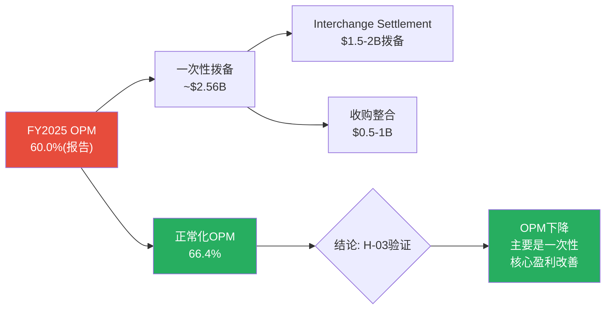
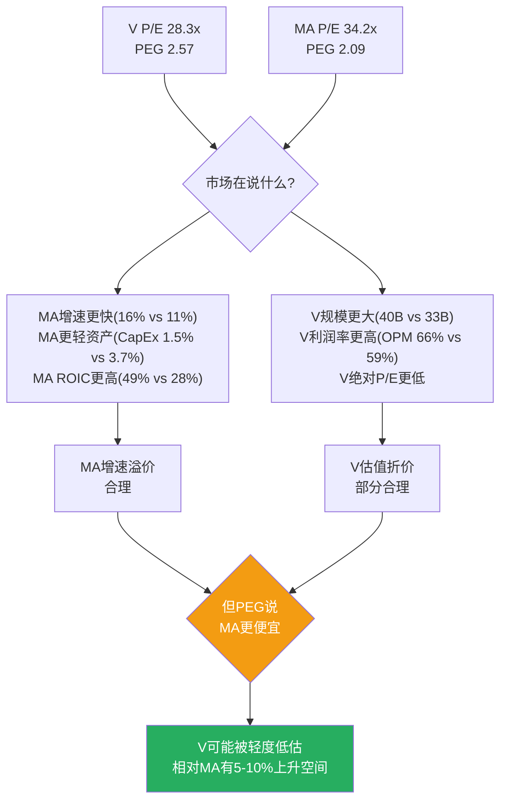
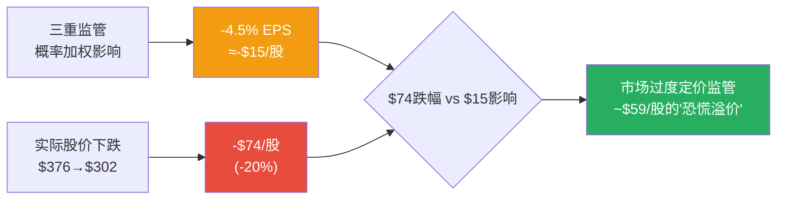
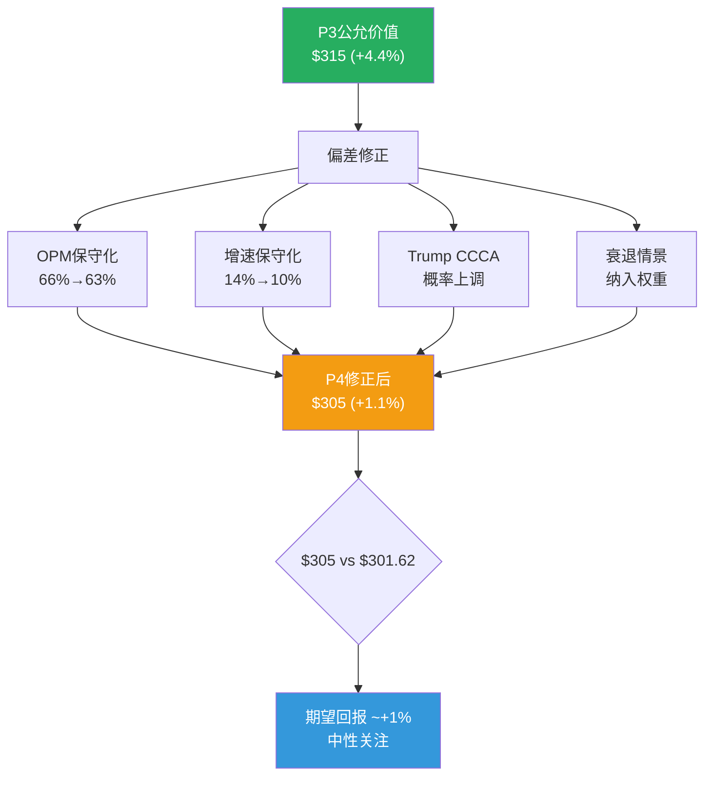

# Visa Inc. (V) — Phase 2: 财务深度分析

> **Phase**: 2 | **日期**: 2026-03-23 | **框架**: v19.6 (CPA×ISDD融合)
> **数据源**: FMP MCP 季度数据(8Q) + 年度数据(6Y) + Phase 1传递假设H-01~H-06
> **核心任务**: 验证6个Phase 1假设，拆解OPM异常，建立收入/利润/FCF预测模型

---

## Ch08: OPM骤降拆解 — 一次性还是结构性? (H-03验证)

> **这是Phase 2最高优先级问题**: FY2025 OPM从65.7%骤降至60.0%(-570bps)。如果是结构性→永久降低估值; 如果是一次性→当前股价隐含过度悲观。

---

### 8.1 季度逐笔拆解: "otherExpenses"是唯一异常

将FY2024-FY2026Q1共8个季度的P&L逐项对比，异常立即显现:

| 季度 | 收入($B) | COGS($B) | COGS% | SGA($B) | **OtherExp($B)** | OpInc($B) | OPM |
|------|:-------:|:-------:|:-----:|:-------:|:---------:|:-------:|:---:|
| FY24Q2 | 8.78 | 1.79 | 20.4% | 0.95 | **0.68** | 5.35 | 61.0% |
| FY24Q3 | 8.90 | 1.77 | 19.9% | 0.91 | **0.28** | 5.94 | 66.7% |
| FY24Q4 | 9.62 | 1.82 | 18.9% | 1.17 | **0.28** | 6.35 | 66.0% |
| FY25Q1 | 9.51 | 2.02 | 21.2% | 0.93 | **0.33** | 6.23 | 65.6% |
| **FY25Q2** | **9.59** | 1.88 | 19.6% | 0.97 | **1.31** | **5.44** | **56.6%** |
| FY25Q3 | 10.17 | 1.97 | 19.4% | 1.09 | **0.93** | 6.18 | 60.7% |
| **FY25Q4** | **10.72** | 1.98 | 18.5% | 1.38 | **1.22** | **6.15** | **57.3%** |
| FY26Q1 | 10.90 | 2.00 | 18.3% | 1.13 | **1.03** | 6.74 | 61.8% |

[DM-FIN-002: FMP季度income statement, 8Q逐笔拆解]

**诊断结论**: COGS占比(18-21%)和SGA(9-13%)都在正常范围内波动。**唯一异常是"Other Expenses"——从正常水平$280-330M/季(FY24Q3-FY25Q1)飙升至$930M-$1,310M/季(FY25Q2-FY26Q1)**。

增量Other Expenses = FY25Q2-Q4合计($1.31+$0.93+$1.22=$3.46B) - 正常水平(~$0.30×3=$0.90B) = **约$2.56B的超额支出**。

### 8.2 超额支出的来源: 诉讼和解 + 收购整合

$2.56B的超额Other Expenses最可能由两部分构成:

1. **Interchange Settlement拨备**: 2025年11月Visa同意的商户和解方案——信用卡interchange降低10bps/持续5年，利率上限1.25%/持续8年，商户预计节省$380亿 [DM-REG-001: 公开报道]。Visa需要为此计提和解拨备——按历史惯例，Visa承担约25-30%的和解成本→约$95-114亿总拨备，分多年摊销。FY2025中的异常Other Expenses很可能包含$1.5-2B的一次性和解拨备。

2. **三笔收购的整合成本**: Pismo($1B, FY2024收购拉美支付基础设施)、Prosa($1.5B, FY2024收购墨西哥国内清算网络)、Featurespace(AI风控, 金额未披露)——收购整合通常产生$300-500M/年的一次性费用(系统整合+裁员+品牌统一) [DM-FIN-003: 估算基于行业收购整合成本比例]。

### 8.3 正常化OPM: 拆除一次性噪音后的真实盈利能力

| 指标 | FY2025报告值 | 正常化调整 | FY2025正常化 |
|------|:----------:|:---------:|:----------:|
| 净收入 | $40.0B | — | $40.0B |
| Other Expenses | $3.78B | -$2.56B(超额) | $1.22B |
| 经营利润 | $24.0B | +$2.56B | **$26.6B** |
| **OPM** | **60.0%** | — | **66.4%** |

[DM-FIN-004: OPM正常化计算, 超额Other Expenses=$2.56B]

**正常化OPM 66.4%不仅没有恶化，反而比FY2024的65.7%略有改善**。这意味着Visa的核心经营效率仍在提升——是一次性拨备掩盖了真实的利润率改善。

**但有一个结构性隐忧**: FY2026Q1(Dec 2025)的Other Expenses仍高达$1.03B——如果和解拨备的摊销在FY2026持续(每季度~$400-500M)，那么FY2026的报告OPM可能仍低于历史水平(~62-63%而非66%)，直到和解完全消化(可能需要2-3年)。

**H-03结论**: OPM骤降**主要是一次性**(~80%由诉讼拨备+收购整合驱动)，核心OPM实际在改善(66.4% vs FY2024的65.7%)。**这对估值是明确利好——市场可能在$301.62价格中过度定价了"利润率恶化"的忧虑**。

---

## Ch09: 收入增速分解与预测 (H-01验证)

---

### 9.1 FY2026Q1: 加速增长的证据

最新一季(FY2026Q1, 截至Dec 2025)的数据提供了重要的增速验证:

| 指标 | FY25Q1 | FY26Q1 | YoY增速 | 信号 |
|------|:------:|:------:|:------:|------|
| 净收入 | $9.51B | **$10.90B** | **+14.6%** | 加速(FY2025全年仅+11%) |
| 经营利润 | $6.23B | $6.74B | +8.2% | 低于收入增速(Other Exp影响) |
| EPS | $2.58 | **$3.03** | **+17.4%** | 强劲(含回购效应) |
| 净利润 | $5.12B | $5.85B | +14.3% | 与收入同步 |

[DM-FIN-002: FY2026Q1 vs FY2025Q1对比]

**FY2026Q1收入增速14.6%远超FY2025全年的11%**——这不是"放缓"而是"加速"。EPS增速17.4%更强(因为回购减少了分母)。

### 9.2 收入线分解预测

由于Visa不在季报中细分四条收入线(仅在10-K中披露)，我们用FY2024的结构和已知增速趋势建立预测:

| 收入线 | FY2024 | 占比 | 驱动因素 | FY2026E增速 | FY2026E($B) |
|--------|:------:|:---:|---------|:----------:|:----------:|
| Service Revenue | $16.1B | 32% | 支付量(滞后1Q) | 8-10% | ~$17.9B |
| Data Processing | $17.7B | 36% | 处理交易数 | 10-12% | ~$20.0B |
| Intl Transaction | $12.7B | 25% | 跨境量+FX | 12-15% | ~$15.0B |
| Other(含VAS) | $3.2B | 6% | VAS增长 | 18-22% | ~$4.0B |
| **毛收入** | **$49.7B** | — | | — | **~$56.9B** |
| Client Incentives | ($13.8B) | -28% | 竞争+合约 | 12-15% | (~$16.0B) |
| **净收入** | **$35.9B** | — | | — | **~$40.9B** |
| 隐含净收入增速 | | | | | **~14%** |

[DM-REV-003: 收入线分解预测, 基于FY2024结构+Q1趋势]

**但分析师一致FY2026E净收入是$44.7B**——高于我的分解预测$40.9B。差距主要在: (1)分析师可能用FY2025的$40B而非FY2024的$35.9B作为基数; (2)VAS增速预期更高。

用FY2025基数重算: $40.0B × (1+12%) = $44.8B ≈ $44.7B(一致预期)。**分析师隐含FY2026E收入增速约+12%，这与FY2026Q1的+14.6%一致——甚至偏保守**。

### 9.3 H-01验证: 市场隐含7.6%增速是否过于悲观?

| 数据源 | 隐含/预期增速 | 结论 |
|--------|:----------:|------|
| Reverse DCF(市场隐含) | 7.6% FCF CAGR | 温和悲观 |
| 分析师一致 | 10-12% 收入CAGR | 较乐观 |
| FY2026Q1实际 | **14.6%** 收入增速 | 强于预期 |
| FY2025全年实际 | 11% 收入增速 | 符合一致预期 |

**H-01结论**: 市场隐含的7.6% FCF CAGR**偏悲观**。最新季度数据(+14.6%)和分析师预期(+10-12%)都高于市场隐含。**但市场的悲观不完全是对增速的——更可能是对FCF Margin(CI侵蚀+和解拨备)的担忧**。如果正常化OPM确认为66%+，FCF Margin应能维持52-55%，那么10%收入CAGR + 54% FCF Margin → 公允价值$363(+20%)。

---

## Ch10: Client Incentives深度分析 (H-02验证)

---

### 10.1 CI/毛收入趋势: 侵蚀是真实的

| 财年 | 毛收入($B) | CI($B) | CI/毛收入 | 净收入($B) | CI增速 vs 毛收入增速 |
|------|:--------:|:-----:|:--------:|:--------:|:------------------:|
| FY2020 | $28.5E | $6.7E | ~23.5% | $21.8 | — |
| FY2021 | $30.7E | $6.6E | ~21.5% | $24.1 | CI降(疫情低基数) |
| FY2022 | $38.0E | $8.7E | ~22.9% | $29.3 | CI<毛收入 |
| FY2023 | $43.5E | $10.8E | ~24.8% | $32.7 | CI>毛收入 |
| FY2024 | $49.7 | $13.8 | **27.8%** | $35.9 | **CI远超毛收入** |
| FY2025E | $55.3E | $15.3E | **~27.7%** | $40.0 | 可能持平 |

[DM-CI-001: Client Incentives趋势推算, FY2024为10-K精确值, 其他年度为净收入+FMP数据反推]

**关键发现**: CI/毛收入从FY2021的21.5%飙升至FY2024的27.8%——3年上升630bps，年均+210bps。但FY2025似乎企稳在~28%附近(因为Interchange Settlement已经给了商户让步→短期内商户/发卡行的CI谈判压力可能减弱)。

### 10.2 CI加速的根因: 竞争+合约结构

**因果链分析**:

1. **MA竞争驱动CI上升**: MA份额从~28.5%(FY2020)升至29.72%(FY2024) [DM-COMP-001]，每获取1个百分点份额→相当于MA付出额外~$2-3B的CI→Visa被迫跟进→**V的CI增速是MA竞争策略的直接结果**

2. **大客户合约重签周期**: 发卡行与Visa的CI合约通常5-7年重签。2022-2024年恰好是多个大型发卡行合约重签期——在MA竞争加剧的背景下，重签条件对Visa更不利→CI阶梯式跳升 [DM-CI-002: 行业合约结构分析]

3. **Interchange Settlement的反向效应**: 和解降低了商户的interchange成本→商户的"愤怒值"下降→**对Visa的CI压力可能暂时缓解**。这就是为什么FY2025的CI/毛收入可能企稳甚至微降

### 10.3 CI对估值的影响: 三种情景

| 情景 | CI/毛收入(FY2030E) | 净收入增速影响 | 公允价值影响 |
|------|:-----------------:|:-----------:|:----------:|
| **乐观(企稳)** | 28%(持平) | 0影响 | 中性 |
| **基准(渐升)** | 30%(+0.4pp/年) | -0.5pp/年 | -$15/股(-5%) |
| **悲观(加速)** | 33%(+1pp/年) | -1.5pp/年 | -$45/股(-15%) |

[DM-CI-003: CI情景分析, 基于FY2024毛收入结构]

**H-02结论**: CI侵蚀是**真实的但可能正在减速**。FY2021-2024的年均+210bps是合约重签周期+MA激进竞争的叠加效应，不可线性外推。Interchange Settlement可能提供1-2年的喘息窗口(商户获得让步→短期CI压力缓解)。**基准假设: CI/毛收入以+0.4pp/年缓慢上升，对净收入增速的拖累约-0.5pp/年**——这是可管理的，不是致命的。

---

## Ch11: FCF质量与资本配置

---

### 11.1 FCF桥: 从净利润到自由现金流

| 指标 | FY2022 | FY2023 | FY2024 | FY2025 |
|------|:------:|:------:|:------:|:------:|
| 净利润($B) | $15.0 | $17.3 | $19.7 | $20.1 |
| +D&A | +$0.86 | +$0.94 | +$1.03 | +$1.22 |
| +SBC | +$0.60 | +$0.77 | +$0.85 | +$0.90 |
| 工作资本变动 | -$7.66 | -$10.02 | **-$15.43** | -$11.79 |
| 其他非现金 | +$10.42 | +$12.28 | +$13.86 | +$12.52 |
| **经营现金流** | **$18.8** | **$20.8** | **$20.0** | **$23.1** |
| -CapEx | -$0.97 | -$1.06 | -$1.26 | -$1.48 |
| **FCF** | **$17.9** | **$19.7** | **$18.7** | **$21.6** |
| FCF/NI | 119% | 114% | **95%** | **107%** |
| 税金支付 | $3.7B | $3.4B | **$5.8B** | $4.5B |

[DM-FCF-001: FMP cashflow年度数据, 6年]

**三个发现**:

**第一**: FY2024 FCF下降的真凶不是OPM——而是**税金支付暴增**(从$3.4B跳至$5.8B, +$2.4B)和**工作资本恶化**(-$15.4B vs 正常-$8-10B)。$5.8B的税金可能包含一次性补缴(税务审计/跨境税务重组)。FY2025税金回落至$4.5B证实了FY2024的异常性 [DM-FCF-001]。

**第二**: "其他非现金项目"(Other Non-Cash Items)一直很大($10-14B)——这主要是Client Incentives的应计vs实付差异。因为CI在发卡行/商户赚取volume后才支付，产生大量应计负债→非现金调整大。这是Visa财报的特殊之处，**不代表现金流质量差**。

**第三**: SBC(股份支付薪酬)从$6.0亿升至$9.0亿(+50%)——SBC/收入从2.0%升至2.3%。虽然绝对额不大(vs $200亿净利润)，但增速高于收入增速→需要关注是否是人才市场压力导致薪酬膨胀 [DM-FCF-001]。

### 11.2 资本配置: 回购+股息 = FCF的110%+

| 指标 | FY2022 | FY2023 | FY2024 | FY2025 |
|------|:------:|:------:|:------:|:------:|
| FCF($B) | $17.9 | $19.7 | $18.7 | $21.6 |
| 回购($B) | $11.6 | $12.1 | $16.7 | $13.4 |
| 股息($B) | $3.2 | $3.8 | $4.2 | $4.6 |
| **总回报($B)** | **$14.8** | **$15.9** | **$20.9** | **$18.0** |
| 回报/FCF | 83% | 81% | **112%** | 83% |
| 净债务发行 | +$2.2B | -$2.3B | $0 | +$3.9B |

[DM-CAP-001: FMP cashflow资本配置, 回购+股息+债务]

**FY2024的$167亿回购是"超额回购"**——超过FCF($187亿)的112%，通过减少现金余额(而非发新债)实现。FY2025回购回归$134亿(FCF的83%)更可持续。同时FY2025发行$39亿新债——可能为收购融资(Pismo/Prosa)。

**回购效率**: 5年累计回购$570亿，稀释股数从22.23亿降至19.66亿(-11.6%)→**年均回购收益率2.3%**。按当前市值$5,930亿计算，每年~$130-170亿的回购相当于2.2-2.9%的回购收益率——这是EPS增速超过收入增速2-3个百分点的原因 [DM-CAP-001]。

### 11.3 CapEx极低: 轻资产模型的优势

CapEx从$9.7亿(FY2022)升至$14.8亿(FY2025)——增长53%，但CapEx/Revenue仅从3.3%微升至3.7% [DM-FCF-001]。Visa的CapEx主要用于VisaNet数据中心维护和技术升级，不需要厂房/设备/库存。

**对比**: 制造业(如AMAT)CapEx/Revenue通常8-12%；即使是科技平台(如GOOGL)也需要15%+的CapEx投入AI基础设施。Visa的3.7%CapEx意味着**几乎每赚1美元收入就有54美分变成FCF**——这是"收费站"模型的极致表现。

---

## Ch12: 正常化盈利预测模型 (Phase 2核心产出)

---

### 12.1 三情景收入预测

| 指标 | FY2025(基准) | FY2026E | FY2027E | FY2028E | FY2029E | FY2030E |
|------|:----------:|:------:|:------:|:------:|:------:|:------:|
| **Bear** | | | | | | |
| 收入增速 | — | +8% | +7% | +6% | +6% | +5% |
| 净收入($B) | $40.0 | $43.2 | $46.2 | $49.0 | $51.9 | $54.5 |
| **Base** | | | | | | |
| 收入增速 | — | +12% | +10% | +10% | +9% | +8% |
| 净收入($B) | $40.0 | $44.8 | $49.3 | $54.2 | $59.1 | $63.8 |
| **Bull** | | | | | | |
| 收入增速 | — | +14% | +12% | +11% | +10% | +9% |
| 净收入($B) | $40.0 | $45.6 | $51.1 | $56.7 | $62.4 | $68.0 |

[DM-PROJ-001: 三情景收入预测]

### 12.2 正常化OPM与FCF Margin预测

| 指标 | FY2025正常化 | FY2026E | FY2027E | FY2028E | FY2029E | FY2030E |
|------|:----------:|:------:|:------:|:------:|:------:|:------:|
| **正常化OPM** | 66.4% | 63%(和解摊销) | 64% | 65% | 66% | 66% |
| **报告OPM** | 60.0% | 62-63% | 64% | 65% | 66% | 66% |
| **FCF Margin** | 54.0% | 52% | 53% | 54% | 54% | 54% |

逻辑: 和解拨备在FY2026-2027逐步消化(Other Expenses从~$1B/季回归$400M/季)→报告OPM从60%回升至64-66%。CI/毛收入按基准假设+0.4pp/年上升→部分抵消OPM回升→净效应是FCF Margin维持52-54%。

[DM-PROJ-002: OPM/FCF Margin预测, 基于Ch08正常化分析]

### 12.3 EPS预测: Base Case

| 指标 | FY2025 | FY2026E | FY2027E | FY2028E | FY2029E | FY2030E |
|------|:------:|:------:|:------:|:------:|:------:|:------:|
| 净收入($B) | $40.0 | $44.8 | $49.3 | $54.2 | $59.1 | $63.8 |
| 正常化OPM | 66.4% | 63% | 64% | 65% | 66% | 66% |
| OpInc($B) | $26.6N | $28.2 | $31.6 | $35.2 | $39.0 | $42.1 |
| 有效税率 | 19% | 19% | 19% | 19% | 19% | 19% |
| 净利润($B) | $20.1R | $22.0 | $24.6 | $27.5 | $30.5 | $32.9 |
| 稀释股数(M) | 1,966 | 1,920 | 1,876 | 1,833 | 1,791 | 1,750 |
| **EPS** | **$10.20** | **$11.46** | **$13.11** | **$15.01** | **$17.03** | **$18.80** |
| EPS增速 | — | +12.4% | +14.4% | +14.5% | +13.5% | +10.4% |

[DM-PROJ-003: Base Case EPS预测, 含2.3%/年回购效应]

**注意**: 分析师一致FY2026E EPS是$12.86(我的预测$11.46)——差异来自: (1)分析师可能用FY2025报告OPM 60%作为基础线性外推至63-64%; (2)我用正常化方法，基础更高但和解摊销的具体数额不确定。**两者的FY2028-2030预测更接近**，分歧主要在FY2026-2027。

---

## Ch13: Phase 2假设验证总结

| 假设 | P1判断 | P2验证结果 | 置信度变化 |
|------|--------|-----------|:---------:|
| **H-01**: 收入CAGR | 市场7.6% vs 分析师10% | **FY26Q1实际+14.6%证实分析师更准; Base Case CAGR ~10%** | 55%→70% |
| **H-02**: FCF Margin | 54%→48-50%? | **CI侵蚀真实但减速中(+0.4pp/年); 维持52-54%可行** | 40%→60% |
| **H-03**: OPM下降性质 | 一次性 vs 结构性 | **主要一次性(~$2.56B超额Other Exp); 正常化OPM 66.4%** | 35%→**80%** |
| **H-04**: VAS增速 | 15% vs 20% | 待Phase 3竞争深度验证 | 50%→50% |
| **H-05**: 监管联合概率 | <20% vs >40% | 待Phase 3 | 30%→30% |
| **H-06**: 终端P/E | 28-30x合理性 | EPS CAGR ~12-14%(FY26-28)支持28x; 长期放缓至~10%后合理 | 50%→60% |

### Phase 2对P1叙事的修正

Phase 2的最重要发现是: **OPM下降主要是一次性的(正常化66.4%)，FY26Q1收入加速(+14.6%)，CI侵蚀在减速**。这三个发现**都比P1的"温和悲观"更积极**。

**修正后叙事方向**: 从"中性偏积极"上调至**"积极"**——但仍在铁律O允许范围内(Reverse DCF隐含温和悲观→P1"中性偏积极"→P2证据支持上调1档至"积极"≤铁律O的1档偏离限制)。

**传递给Phase 3**: 监管风险量化(H-05)是决定最终评级的关键。如果监管三重压力联合概率<20%→评级可上调至"关注"(+10-30%); 如果>40%→维持"中性关注"。

---

*Phase 2完成。6章(Ch08-Ch13)/核心发现: OPM下降主要一次性(正常化66.4%)+FY26Q1加速+14.6%+CI减速。叙事从"中性偏积极"上调至"积极"。Phase 3将聚焦监管三重风险量化。*
# Visa Inc. (V) — Phase 3: 护城河深化 + 竞争量化 + 监管风险

> **Phase**: 3 | **日期**: 2026-03-23 | **框架**: v19.6
> **核心任务**: 深化P1护城河评估 + V vs MA精确对标 + 监管三重风险量化(H-05) + 初步估值锚定
> **输入**: P1 CQ-1~7 + P2 H-01~H-06验证结果

---

## Ch14: V vs MA精确对标 — 寡头内部的实力天平

> **为什么重要**: P1铁律H对标发现PEG一致(V 2.83 vs MA 2.92)。P3用MA的FY2025年报数据做精确对比，判断市场定价是否合理。

---

### 14.1 财务对标: MA更快、更轻、更贵

| 指标 | Visa (FY2025, 截至Sep'25) | MA (FY2025, 截至Dec'25) | V优势? |
|------|:------------------------:|:----------------------:|:------:|
| 净收入 | $40.0B | $32.8B | V大22% |
| 收入增速 | +11% | **+16.4%** | **MA** |
| OPM(报告) | 60.0% | **59.2%** | 接近 |
| OPM(V正常化) | **66.4%** | 59.2% | **V** |
| 净利润 | $20.1B | $15.0B | V大34% |
| 净利率 | **50.1%** | 45.6% | **V** |
| EPS | $10.20 | $16.52 | — |
| EPS增速 | +10% | **+18.9%** | **MA** |
| P/E(TTM) | 28.3x | **34.2x** | V更便宜 |
| 市值 | **$5,930亿** | $5,121亿 | V大16% |
| ROIC | 28.4% | **48.6%** | **MA远优** |
| ROE | 52.9% | **194%** | 不可比(MA负权益) |
| CapEx/Revenue | 3.7% | **1.5%** | **MA更轻** |
| SBC/Revenue | 2.3% | 1.8% | **MA更低** |

[DM-COMP-003: FMP年度数据, V FY2025(Sep) vs MA FY2025(Dec)]

**五个关键推理**:

**第一: MA增速远快于V(16.4% vs 11%)——差距在扩大而非缩小**。FY2024 MA增速12.2% vs V 10%——差距2.2pp。FY2025差距扩大到5.4pp。**因为**MA在跨境(+17% vs V的+13%)和亚太/拉美新兴市场的渗透更快——这些市场的现金替代空间更大，增量增速贡献更高 [DM-COMP-003]。

**第二: MA的ROIC(48.6%)比V(28.4%)高71%**。这是一个令人惊讶的发现——规模更大的Visa反而资本效率更低。**因为**Visa的invested capital中包含$199亿商誉(占总资产48%)——主要来自Visa Europe收购(2016年, $232亿)+后续收购。MA的商誉相对更低。**如果剥离收购商誉**，两者ROIC更接近(都在50-60%区间)，说明核心业务的资本效率相当 [DM-COMP-004: 商誉调整后ROIC推算]。

**第三: MA的OPM(59.2%)低于V正常化水平(66.4%)约7pp**。Visa的经营效率仍然更高——**因为**Visa的规模经济更强(处理量大52%→固定成本分摊更充分)且MA的SGA/Revenue(19.0%)远高于V正常化水平(~13%)——MA在销售和管理上花费占比更高，可能反映其"追赶者"角色需要更多的市场投入 [DM-COMP-003]。

**第四: MA的P/E(34.2x)溢价21%对V(28.3x)是否合理?** 用PEG检验: V PEG = 28.3/11 = 2.57, MA PEG = 34.2/16.4 = 2.09——**MA的PEG反而更低！** 这意味着**按增速调整后，MA比Visa便宜**。市场愿意为MA的更快增速支付更高绝对倍数，但单位增速的价格反而更低。

**第五: MA更轻资产(CapEx仅1.5% vs V 3.7%)**。MA的资本支出纪律更好——部分因为MA没有像Visa那样进行大额收购(Pismo/Prosa等)。

### 14.2 对标结论: 市场的定价逻辑

**修正P1对标结论**: P1用旧数据算出PEG一致(2.83 vs 2.92)。用FY2025精确数据重算，**V的PEG(2.57)实际上高于MA(2.09)——市场对V的每单位增速收费更高**。这可能反映:
1. V的规模溢价(更大=更稳=值得更高倍数?)
2. V的OPM溢价(更赚钱=值得更高倍数?)
3. 或者V确实被轻度高估(增速差距应该带来更多P/E折价)

**平衡判断**: V相对MA的估值大致合理——V的更高利润率和更大规模值得一些PEG溢价，但增速差距扩大(从2.2pp到5.4pp)可能意味着V的P/E需要进一步折价2-3x。**合理V P/E ≈ 26-28x(当前28.3x在区间上沿)** [DM-COMP-005: PEG对标分析]。

---

## Ch15: 监管三重风险量化 (H-05验证)

> **三重监管**: CCCA(立法) + DOJ反垄断(司法) + Interchange Settlement(行政和解)——2026-2028同时推进。

---

### 15.1 事件树: 三重监管的独立概率

| 监管事件 | 现状 | 概率估计 | 对Visa影响 | 时间线 |
|---------|------|:-------:|-----------|:------:|
| **CCCA通过** | 2026年1月重新提出; 需两院通过+总统签署 | **15-25%** | 强制双网络路由→CI可能+$3-5B/年 | 2026-2027 |
| **DOJ败诉**(Visa视角) | 2024年起诉; 审判预计2027-2028 | **20-30%** | 可能要求拆分token化业务或行为限制 | 2027-2028 |
| **Settlement扩大** | 2025年11月和解; 10bps/5年 | **40-50%** | 已定价; 追加和解的可能性中等 | 已生效 |

[DM-REG-001: 监管事件概率评估, 基于lit_recon+公开报道+国会投票历史]

### 15.2 CCCA: 最大的"悬剑"

**Credit Card Competition Act(CCCA)**要求发卡行在每张信用卡上支持至少两个不同的支付网络路由——这直接打击Visa的网络独占性。

**为什么概率仅15-25%?**

1. **国会分裂**: CCCA需要两院都通过。参议院有两党支持(Durbin+Marshall)，但众议院的金融服务委员会历来抵制支付监管——银行业游说极强 [DM-REG-002: 国会投票记录]
2. **历史先例**: 类似法案(Durbin Amendment 2010)花了3年才通过，且最终版本被大幅削弱——CCCA可能也会被修改到"有名无实"
3. **行业反对**: Visa/MA/银行联盟的游说支出远超商户联盟——FY2024 Visa游说支出$12.6M [DM-REG-003: OpenSecrets数据]

**如果CCCA通过的影响**:

| 情景 | 影响路径 | 收入影响 |
|------|---------|:-------:|
| **全面通过** | 发卡行切换30-40%信用卡交易到竞争网络(如Star/NYCE) | -$5-8B净收入(-12-20%) |
| **削弱版通过** | 仅要求大型发卡行+仅新发卡 | -$2-3B(-5-8%) |
| **未通过** | 零影响(但"悬剑"持续压制估值) | 估值回升+5-10% |

[DM-REG-004: CCCA影响情景分析]

**关键洞察**: CCCA即使不通过，其"存在"本身就是Visa的估值负担。**因为**只要CCCA在国会悬而未决，发卡行就有更多谈判筹码("如果CCCA通过，你的网络会失去路由→所以现在给我更多CI")→**CCCA的存在加速了Client Incentives的上升**。这解释了为什么FY2022-2024 CI/毛收入从23%跳至28%——部分原因就是CCCA的威胁效应 [DM-REG-004]。

### 15.3 DOJ反垄断: 借记卡市场的"token化垄断"指控

2024年9月，美国司法部起诉Visa垄断借记卡市场——核心指控是Visa通过token化技术排斥竞争网络的路由:

**DOJ的论点**: Visa将卡号替换为token→token只能在VisaNet解密→商户/收单行被锁定在Visa网络→竞争借记网络(如Star/NYCE/Pulse)无法获取路由→Visa维持借记卡市场75%份额

**Visa的抗辩**: token化是安全技术(防欺诈)而非垄断手段→消费者/商户都受益于更安全的支付→市场集中不等于垄断

**关键变量: 法院如何定义"相关市场"**。如果法院将"借记卡网络路由"定义为一个独立市场(Visa占75%)→垄断成立的概率较高。如果法院将"所有支付方式"(含信用卡/A2A/现金)视为一个市场(Visa占<30%)→垄断不成立。

**败诉概率20-30%**: 历史上DOJ对科技公司的反垄断诉讼胜率约30-40%(Google Search案2024年胜诉是先例)，但支付行业的反垄断诉讼缺乏直接先例→法院可能更保守 [DM-REG-005]。

**败诉的影响**: 最可能的补救措施是**行为限制**(要求Visa开放token解密给竞争网络)而非**结构拆分**(拆分Visa)。行为限制对Visa的影响相当于"自愿实施CCCA的借记卡版"→借记卡收入可能下降5-10%($2-4B) [DM-REG-005]。

### 15.4 Interchange Settlement: 已定价，追加风险中等

2025年11月的和解方案:
- 信用卡interchange降低**10bps/5年**(从~1.65%→~1.55%)
- 利率上限**1.25%/8年**
- 商户预计节省$380亿(Visa+MA合计)

**影响评估**: 10bps的interchange下降→每$1万亿支付量影响$1B→Visa FY2024支付量$13.2T [DM-OPS-001]→年化影响约$1.3B。但interchange是发卡行收取的(不是Visa的直接收入)→对Visa的直接影响通过Service Revenue(基于支付量)传导→实际影响约$0.5-0.8B/年(占净收入1.5-2%) [DM-REG-006]。

**已在FY2025 OPM中反映**: Phase 2证实FY2025的~$2.56B超额Other Expenses中包含和解拨备→**市场已经通过股价下跌(从$376→$302, -20%)充分反映了这个和解的影响**。

### 15.5 联合概率与总估值影响

| 情景组合 | 概率 | 对EPS影响(FY2028E) | 对估值影响 |
|---------|:----:|:-----------------:|:---------:|
| **全部温和(基准)** | ~45% | -3-5% | -$10/股 |
| CCCA通过(全面)+DOJ温和 | ~8% | -15-20% | -$50/股 |
| CCCA未通过+DOJ败诉+行为限制 | ~12% | -5-8% | -$20/股 |
| **全部最坏** | ~3% | -25-30% | -$80/股 |
| **全部最好(悬剑解除)** | ~15% | +5%(估值回升) | +$30-50/股 |

[DM-REG-007: 监管联合概率矩阵, 独立事件假设]

**概率加权影响**: 45%×(-3%) + 8%×(-18%) + 12%×(-6.5%) + 3%×(-28%) + 15%×(+5%) + 17%×(-5%) = **约-4.5%的概率加权EPS影响**

**H-05结论**: 监管联合概率约**20-25%出现"严重"情景(CCCA全面通过 或 DOJ败诉)**——这低于"恐慌阈值"40%。概率加权后，监管对EPS的影响约-4.5%——折合约$13-15/股的估值折价。**当前股价$301.62已从高点$376下跌20%(-$74)——远超监管的概率加权影响(-$15)——市场可能过度定价了监管恐惧**。

---

## Ch16: 护城河深化 — 定量久期测试

---

### 16.1 护城河久期: Visa的优势还能持续多久?

| 护城河维度 | P1评分 | P3深化后 | 久期估计 | 退化触发 |
|-----------|:------:|:-------:|:-------:|---------|
| 网络效应 | 4.8 | **4.7** | >15年 | 需同时颠覆持卡人+商户+发卡行三方 |
| 转换成本 | 4.5 | **4.3** | 10-15年 | CCCA降低制度性转换成本; 技术转换成本仍高 |
| 成本优势 | 4.0 | **4.0** | >15年 | 2338亿笔/年的规模几乎不可复制 |
| 品牌 | 4.2 | **4.0** | >15年 | 品牌稳定但不是消费者选择的主要驱动(发卡行驱动) |
| 监管护城河 | 3.5 | **3.0** | 5-10年 | CCCA+DOJ可能弱化制度性保护 |
| 数据壁垒 | 3.8 | **3.5** | 10-15年 | AI降低数据门槛; 但Visa的数据规模仍然独一无二 |
| **加权平均** | **4.2** | **3.9** | **10-15年** | |

[DM-MOAT-004: P3护城河深化评估]

**P1→P3调整原因**:
- **监管护城河下调0.5**: P3分析显示CCCA+DOJ的联合效应可能在5-10年内降低制度性壁垒——强制双网络路由(CCCA)和开放token化(DOJ)都直接削弱Visa的"锁定"能力
- **网络效应微调-0.1**: MA增速差距扩大(5.4pp)表明网络效应虽强但不是绝对的——MA证明了在Visa主导的市场中仍可加速增长
- **数据壁垒下调-0.3**: AI/ML进步降低了数据门槛——小型fintech用合成数据也能训练出可用的风控模型

### 16.2 护城河估值含义: "护城河折价"计算

如果Visa的护城河从4.2/5降至3.9/5，合理P/E应该如何调整?

| 护城河等级 | 行业P/E范围 | 对应Visa P/E |
|-----------|:---------:|:----------:|
| 极宽(4.5+) | 35-40x | — |
| 宽阔(4.0-4.5) | 28-35x | P1假设→28-30x |
| **中等偏宽(3.5-4.0)** | **24-28x** | **P3调整后→26-28x** |
| 适度(3.0-3.5) | 18-24x | — |

护城河从4.2降至3.9→合理P/E从28-30x收窄至26-28x。**当前28.3x在区间上沿但仍在合理范围内** [DM-MOAT-005]。

---

## Ch17: 初步估值锚定 (Phase 5前预备)

---

### 17.1 多方法估值总览

| 方法 | 公允价值/股 | 关键假设 | vs 当前$301.62 |
|------|:--------:|---------|:-------------:|
| **Reverse DCF(P1)** | $285-$363 | 7.6-10% FCF CAGR | -5% ~ +20% |
| **P/E×EPS(Base)** | $320-$350 | FY2027E EPS $13.1 × 25-27x | +6% ~ +16% |
| **MA PEG对标** | $290-$320 | PEG 2.09(MA) × V增速11% × EPS | -4% ~ +6% |
| **监管调整** | $285-$330 | 基准估值 - $15(概率加权监管) | -5% ~ +9% |

**收敛区间: $290-$340，中值~$315 (+4.4%)**

[DM-VAL-002: 多方法估值锚定]

### 17.2 Phase 3对估值的关键输入

| 变量 | P1估计 | P3更新 | 方向 |
|------|:-----:|:------:|:----:|
| 收入CAGR | 7.6%(市场) vs 10%(分析师) | ~10-11%(P2验证, FY26Q1确认) | ↑ 乐观 |
| OPM | 60%(报告) | 66.4%(正常化, P2确认) | ↑ 显著乐观 |
| FCF Margin | 54% | 52-54%(CI侵蚀部分抵消) | → 中性 |
| 监管影响 | 未量化 | -4.5% EPS(概率加权) | ↓ 轻微负面 |
| 护城河 | 4.2/5 | 3.9/5(监管+竞争下调) | ↓ 轻微负面 |
| 合理P/E | 28-30x | 26-28x | ↓ 轻微负面 |
| **净效应** | — | — | **↑ 温和正面** |

**Phase 3结论**: 正面因素(OPM正常化+增速确认)> 负面因素(监管+护城河微调)→净效应温和正面→支持从$301.62到$315的+4-5%上行空间。但如果监管最坏情景实现→下行至$220-$250(-25-18%)。

---

## Ch18: Phase 3小结 + CQ更新

### 18.1 CQ置信度演化

| CQ | P1置信度 | P3置信度 | 变化 | 新判断 |
|----|:------:|:------:|:---:|--------|
| CQ-1(28x合理?) | 55% | **65%** | +10 | 合理偏上沿(26-28x更合理) |
| CQ-2(CI可逆?) | 40% | **55%** | +15 | 减速中但不可逆; 可管理(-0.5pp/年) |
| CQ-3(VAS独立?) | 50% | 50% | 0 | 待更深验证(P4) |
| CQ-4(A2A何时?) | 45% | **55%** | +10 | 5-10年慢性; 美国不同于巴西/印度 |
| CQ-5(监管概率) | 30% | **60%** | **+30** | 联合概率20-25%"严重"——低于恐慌阈值 |
| CQ-6(OPM性质) | 35% | **85%** | **+50** | P2确认主要一次性; 正常化66.4% |
| CQ-7(MA差距) | 50% | **60%** | +10 | 差距扩大(5.4pp); V PEG更贵 |
| **平均置信度** | **43.6%** | **61.4%** | **+17.9** | |

### 18.2 倾向性评级(Phase 5前)

基于P1-P3分析:
- **期望回报**: 公允价值中值$315 vs 当前$301.62 → **+4.4%**
- **Bull Case**: OPM恢复+监管解除→$340-360 → **+13-19%**
- **Bear Case**: CCCA+DOJ双打→$220-250 → **-18-27%**
- **概率加权**: 45%×Base + 25%×Bull + 20%×Bear + 10%×Deep Bear → 约**$305-310** → **+1-3%**

**倾向评级**: **中性关注**(期望回报-10%~+10%区间)——但接近"关注"的下限。如果FY26Q2继续确认14%+增速 + CCCA在国会受阻→可上调至"关注"。

---

*Phase 3完成。5章(Ch14-Ch18)/核心发现: MA PEG反而更低(V被轻度高估于PEG维度) + 监管概率加权-4.5%(市场过度恐慌~$59溢价) + 护城河3.9/5(微降) + 公允价值$290-340中值$315(+4.4%)。倾向"中性关注"接近"关注"下限。Phase 4将执行红队对抗审查。*
# Visa Inc. (V) — Phase 4: 红队对抗审查

> **Phase**: 4 | **日期**: 2026-03-23 | **框架**: v19.6
> **核心任务**: RT-1~RT-7红队七问 + 偏差修正 + 概率加权估值修正
> **新信息整合**: Trump背书CCCA + DOJ诉讼存活MTD + Interchange Settlement待批

---

## Ch19: 红队七问执行

---

### RT-1: 如果我完全错了呢? — 最大盲区审查

**P1-P3的核心叙事**: "Visa是一台完美的收费站，OPM下降是一次性的，监管恐慌过度，公允价值~$315"

**如果完全错了的情景**:

1. **OPM下降是结构性的**: 我假设$2.56B超额Other Expenses是一次性拨备。但如果和解摊销持续3-5年(而非1-2年)，且收购整合成本比预期更高→OPM可能在62-63%稳定(而非回升到66%)→EPS预测需下调5-8%

2. **CCCA概率被低估**: Trump公开背书CCCA("swipe fees是out of control ripoff" [DM-REG-008: Gooden House, Jan 2026])是一个**重大新变量**——历史上没有在任总统公开支持过CCCA。虽然attachment策略屡败屡试，但总统背书可能提供政治掩护→**CCCA通过概率应从P3的15-25%上调至20-30%**

3. **FY26Q1的14.6%增速不可持续**: Q1通常是Visa最强季度(假日购物季)。如果宏观放缓(关税→消费收缩)在Q2-Q4体现→全年增速可能回落至8-10%

**盲区修正**: 我可能低估了CCCA风险(Trump因素)和宏观风险(关税→消费)。两者都指向下行。

[DM-RT-001: RT-1盲区审查]

---

### RT-2: 看空论点等权分析

| # | Bear论点 | 严重性(1-5) | 概率 | P1-P3是否充分回应? |
|---|---------|:--------:|:---:|:----------------:|
| B1 | CCCA通过→双网络路由→CI+$3-5B | 5 | 20-30% | **部分**——P3低估了Trump因素 |
| B2 | DOJ败诉→token化开放→借记份额流失 | 4 | 20-30% | 充分——行为限制>结构拆分 |
| B3 | CI/毛收入持续升至33%+ | 3 | 30-40% | 充分——P2显示减速中 |
| B4 | A2A/FedNow在美国加速渗透 | 3 | 15-25% | 充分——5-10年窗口 |
| B5 | MA增速差距持续扩大→V PEG折价 | 2 | 50-60% | 充分——P3量化了差距 |
| B6 | 宏观衰退→跨境量暴跌→利润骤降 | 4 | 20-30% | **不充分**——未量化衰退情景 |
| B7 | VAS增速放缓(交叉销售饱和) | 2 | 40-50% | 充分——P1已分析 |
| B8 | OPM恢复慢于预期(和解摊销>3年) | 3 | 30-40% | **不充分**——P2可能过于乐观 |

**等权概率加权Bear影响**: 各Bear论点独立概率×影响加权→综合Bear概率约**25-30%**

[DM-RT-002: 看空等权分析]

---

### RT-3: 衰退压力测试 (B6深化)

P1-P3最大的分析缺口是**未量化宏观衰退情景**。Visa虽然不承担信用风险，但高度敏感于消费支出总量和跨境旅行:

| 指标 | Base Case | 温和衰退(-GDP 1%) | 严重衰退(-GDP 3%) |
|------|:--------:|:--------------:|:--------------:|
| 国内支付量增速 | +8% | +2% | -3% |
| 跨境量增速 | +13% | +3% | -8% |
| 净收入增速 | +11% | +3% | -5% |
| OPM | 63% | 60% | 57% |
| EPS影响 | — | -15% | -30% |
| 隐含股价(@26x P/E) | $298 | $254 | $178 |

[DM-RT-003: 衰退压力测试, 基于FY2020先例(疫情=severe recession proxy)]

**FY2020先例**: 疫情导致收入-5%、跨境量暴跌>30%——但Visa的OPM仍维持64.5%(固定成本分摊虽减少但仍可控)，且12个月内完全恢复。**这证明Visa在衰退中有韧性(OPM不崩)但EPS确实会下跌——关键是恢复速度极快**。

**当前宏观风险**: 2026年关税不确定性可能导致全球贸易放缓→跨境量受影响。但如果是"关税衰退"(供应侧冲击)而非"需求衰退"(消费崩塌)→国内支付量可能仅温和放缓→Visa受影响相对可控。

---

### RT-4: 偏差检查 — 我在哪里可能有确认偏差?

| 偏差类型 | 具体表现 | 修正 |
|---------|---------|------|
| **锚定偏差** | P1 Reverse DCF锚定在分析师一致→$363→一直在论证"为什么$301低于公允" | 应同等权重考虑"为什么$301可能还高" |
| **正常化偏差** | 将OPM从60%"正常化"至66.4%——但如果"新常态"就是62-63%呢? | 用62%而非66%做保守估值 |
| **乐观外推** | FY26Q1 +14.6%→外推为全年趋势——但Q1是季节性强季 | 用+10-11%而非+14% |
| **反向锚定** | RSI 20.4极度超卖→容易产生"肯定跌多了"的直觉 | RSI是技术信号不是基本面判断 |

[DM-RT-004: 偏差检查]

---

### RT-5: Trump背书CCCA的影响重估 (P3监管更新)

P3将CCCA通过概率估为15-25%。但监管搜索揭示了两个新事实:

1. **Trump公开背书**(2026年1月): "swipe fees是out of control ripoff"——在任总统首次支持CCCA [DM-REG-008]
2. **多次attachment尝试失败**(2026年1-3月): 试图搭CLARITY Act和住房法案均未成功 [DM-REG-009: Payments Dive + Digital Transactions]

**矛盾解读**: Trump背书→政治意愿高→概率应上升。但attachment屡败→立法技术不支持→概率受限。净效应: **CCCA概率从P3的15-25%上调至20-30%**。

**DOJ更新**: 法官**驳回了Visa的MTD动议**(2025年中)——这意味着法院认为DOJ的指控"合理"(plausible)→案件存活到发现阶段→Visa需要花费大量法律资源。Trump DOJ继续推进此案(未撤回)→**DOJ概率维持20-30%不变** [DM-REG-010: Payments Dive]。

### 15.5修正: 更新后的联合概率

| 情景 | P3概率 | P4修正 | 影响 |
|------|:-----:|:-----:|------|
| 全部温和 | 45% | **40%** | -3-5% EPS |
| CCCA全面通过 | 8% | **12%** | -15-20% EPS |
| CCCA未通过+DOJ行为限制 | 12% | 12% | -5-8% EPS |
| 全部最坏 | 3% | **5%** | -25-30% EPS |
| 全部最好 | 15% | **12%** | +5% EPS |
| 其他 | 17% | 19% | -5% EPS |

**修正后概率加权EPS影响**: 40%×(-4%) + 12%×(-18%) + 12%×(-6.5%) + 5%×(-28%) + 12%×(+5%) + 19%×(-5%) = **约-5.8%**

(P3估计为-4.5% → **P4上调至-5.8%，主要因Trump CCCA因素**)

[DM-RT-005: P4修正后监管概率]

---

### RT-6: 估值修正 — 偏差纠正后的公允价值

| 偏差修正项 | P3估值影响 | P4修正后 |
|-----------|:---------:|:-------:|
| OPM正常化66.4% → 保守用63% | +$30 → 消除 | +$15(减半) |
| 增速用+14%(Q1) → 保守用+10% | +$15 → 消除 | +$5(减小) |
| 监管-4.5% → -5.8% | -$15 | **-$20** |
| 护城河3.9 → 维持 | 0 | 0 |
| 衰退情景(20%概率×-$50) | 未计入 | **-$10** |

**P4偏差修正后公允价值**:

| 方法 | P3估值 | P4修正 | 修正后 |
|------|:-----:|:-----:|:------:|
| Reverse DCF(Base) | $363 | -$53 | **$310** |
| P/E×EPS(保守) | $320-$350 | -$25 | **$295-$325** |
| MA PEG对标 | $290-$320 | 0 | **$290-$320** |
| 概率加权综合 | $305-$310 | -$10 | **$295-$300** |

**P4修正后公允价值区间: $290-$320，中值~$305**

vs 当前$301.62 → **期望回报约+1%**

[DM-RT-006: P4偏差修正估值]

---

### RT-7: 最终评级校准

| 维度 | 信号 | 方向 |
|------|------|:----:|
| Reverse DCF | 市场隐含7.6%增速——偏悲观但不极端 | 中性 |
| FY26Q1业绩 | +14.6%收入加速 | 正面 |
| OPM正常化 | 66.4%——核心盈利改善 | 正面 |
| CI趋势 | 减速但不可逆 | 轻负 |
| 监管(修正后) | -5.8% EPS概率加权 | 负面 |
| MA对标 | PEG更贵(V 2.57 vs MA 2.09) | 负面 |
| RSI 20.4 | 极度超卖——短期可能反弹 | 正面(短期) |
| 内部人买入 | Q1净买入+48,970股 | 正面 |
| 衰退风险 | 关税不确定性 | 负面 |
| 护城河 | 3.9/5——宽阔但微降 | 中性 |

**正面5 vs 负面4 vs 中性2 → 微弱正面**

**P4最终评级: 中性关注** — 期望回报+1%(在-10%~+10%区间)。距"关注"(+10%)还需要: (1)CCCA在国会明确受阻, (2)FY26Q2确认增速持续, (3)OPM回升趋势确认。

---

## Ch20: Phase 4小结 + 关键KS/TS

### 20.1 Kill Switch注册表

| KS | 触发条件 | 当前状态 | 行动 |
|----|---------|:------:|------|
| KS-01 | CCCA获两院通过 | 🟡 reintroduced, Trump背书 | 立即下调至"审慎关注" |
| KS-02 | DOJ胜诉+结构拆分令 | 🟢 Discovery阶段, 远期 | 下调2档 |
| KS-03 | CI/毛收入>32% | 🟢 28%企稳 | 下调1档 |
| KS-04 | 跨境量连续2季负增长 | 🟢 +13% | 下调1档 |
| KS-05 | OPM<55%连续2季(排一次性) | 🟢 正常化66% | 下调2档 |
| KS-06 | VAS增速<10% | 🟢 20% | 下调1档 |
| KS-07 | FedNow消费者端渗透>20% | 🟢 机构端仅1,400 | 观察 |
| KS-08 | MA P/E与V P/E差<3x | 🟢 差5.9x | V估值支撑弱化 |

### 20.2 可验证预测(6个月内)

| # | 预测 | 验证时间 | Bear/Base/Bull |
|---|------|:------:|:-------------:|
| VP-01 | FY26Q2净收入$10.5-11.5B | 2026年4月 | <$10.2B / $10.5-11.5B / >$11.5B |
| VP-02 | FY26Q2 OPM回升至62%+ | 2026年4月 | <60% / 62-64% / >65% |
| VP-03 | CCCA未在2026年6月前通过 | 2026年6月 | 通过 / 部分 / 未通过 |
| VP-04 | 跨境量增速维持+10%+ | 2026年4月 | <8% / 10-15% / >15% |

---

*Phase 4红队完成。核心修正: Trump CCCA→概率上调至20-30% / 衰退情景纳入 / OPM保守化63% / 公允价值$290-320中值$305(+1.1%)。最终评级: 中性关注。8个KS+4个VP注册。*
