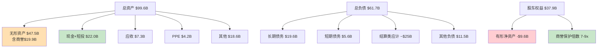
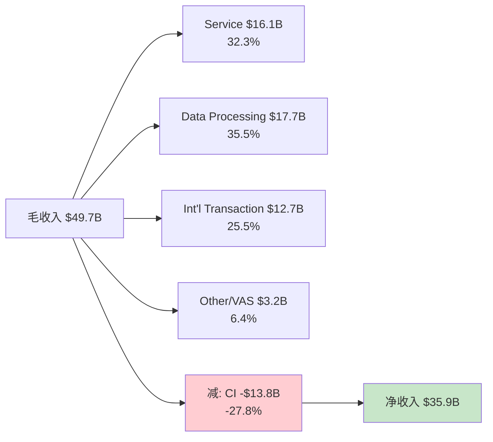
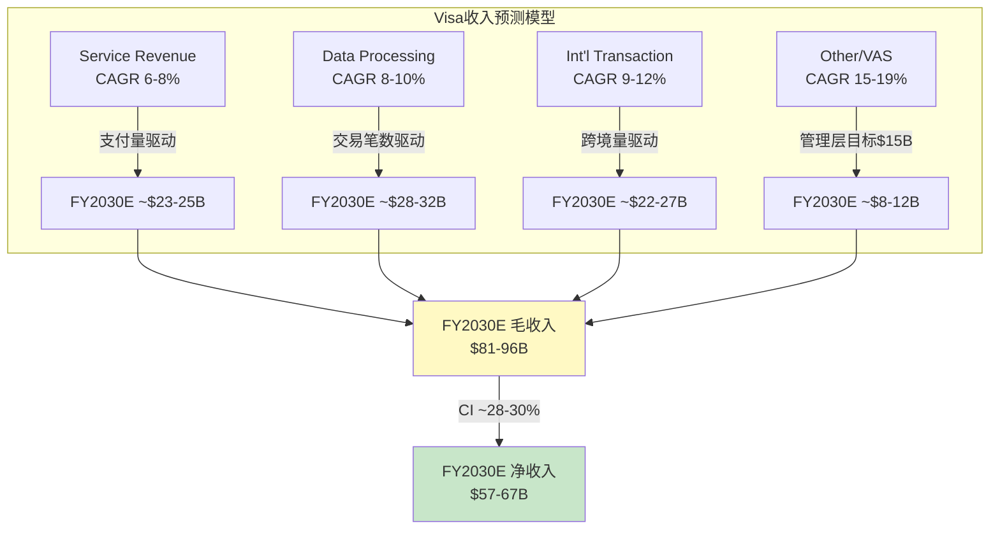

# Phase 2 补强 — Ch17 & Ch18

---

## Ch17: 资产负债表诊断 — 商誉堡垒还是商誉地雷?

### 17.1 全局资产结构: 一张"轻有形、重无形"的资产负债表

Visa的资产负债表在传统工业公司的框架里几乎无法解读——总资产$99.6B中，有形固定资产(PPE)仅$4.2B(占4.2%)，而无形资产(含商誉)高达$47.5B(占47.7%) [DM-BS-001: FY2025 10-K, 总资产$99.6B, 无形资产$47.5B]。这不是会计异常，而是支付网络商业模式的必然映射——Visa的核心资产是VisaNet网络、品牌认知和发卡行/商户关系，这些价值无法在"厂房设备"行项中体现。

从趋势看，无形资产占总资产比例从FY2020的54.0%持续下降至FY2025的47.7% [DM-BS-002: 无形/总资产比率6年趋势]。这个下降**不是**因为商誉减值(商誉从$15.9B增长到$19.9B)，而是因为总资产增速(年化3.5%)快于商誉增速(年化3.8%)——更准确地说，是现金及应收账款的增长($20.0B→$22.0B现金 + $2.9B→$7.3B应收)稀释了无形资产的占比。因此，比例下降是健康信号，意味着Visa在不依赖新收购的情况下通过内生经营积累了更多流动资产。

**反面考量**: 无形资产占比下降的"健康叙事"有一个前提——商誉本身没有被高估。如果Visa Europe的真实价值低于账面商誉，那么比例下降只是掩盖了一个需要减值但尚未减值的资产。下一节直接检验这个前提。

| 资产结构 | FY2020 | FY2022 | FY2024 | FY2025 | 趋势 |
|---------|--------|--------|--------|--------|------|
| 无形资产(含商誉) | $43.7B | $42.9B | $45.8B | $47.5B | +1.4% CAGR |
| 占总资产 | 54.0% | 50.1% | 48.5% | 47.7% | ↓稀释 |
| PPE | $2.7B | $3.2B | $3.8B | $4.2B | +9.3% CAGR |
| 现金+短投 | $20.0B | $18.5B | $15.2B | $22.0B | 波动大 |
| 应收 | $2.9B | $4.0B | $7.0B | $7.3B | +20.3% CAGR |

[DM-BS-003: 资产结构6年演变, FMP年度数据]

### 17.2 商誉深度: Visa Europe是堡垒还是地雷?

Visa在2016年以$23.2B收购Visa Europe [DM-BS-004: 2016年Visa Europe收购对价$23.2B, 含$12.2B现金+$11.0B优先股转换]，这笔交易产生了约$15.5B的商誉——占当前总商誉$19.9B的约78%。剩余$4.4B商誉来自较小的收购(Plaid的$5.3B交易因反垄断被取消，未产生商誉)。

**Visa Europe当前价值的逆向验证**:

欧洲业务对Visa净收入的贡献可以从地理披露推断。Visa FY2024国际收入(非美国)约占净收入的~55%，其中欧洲是最大单一市场 [DM-BS-005: Visa FY2024国际收入占比~55%, 10-K地理披露]。保守估计欧洲贡献净收入的20-25%(约$7.2B-$9.0B)，对应EBITDA约$5.0B-$6.3B(假设与集团一致的~70% EBITDA margin)。

按当前企业价值/EBITDA的~22x来估值(Visa当前隐含倍数)，欧洲业务的隐含价值在$110B-$139B之间——**远超**$15.5B账面商誉的7-9倍 [DM-BS-006: 欧洲业务隐含价值$110B-$139B vs 商誉$15.5B]。即使用最保守的10x EBITDA(远低于任何支付公司估值)，隐含价值$50B-$63B仍是商誉的3-4倍。

**因果推理**: 收购9年后商誉依然安全的根本原因是欧洲支付去现金化(cash-to-digital transition)仍在早期→中期阶段。欧洲电子支付渗透率从2016年的~45%上升至2024年的~65% [DM-BS-007: 欧洲电子支付渗透率估计, Nilson/ECB数据]，但仍远低于英国(~85%)和北欧(~95%)。这意味着Visa Europe的TAM(总可寻址市场，衡量理论最大支付量规模)仍在扩张——南欧和中东欧的现金替代是未来5-10年的增量来源。因此，Visa Europe的收入贡献只会更大，而非萎缩→商誉安全垫只会更厚。

**反面: 什么条件下商誉会减值?**

两个风险路径需要监控:
1. **A2A支付在欧洲突破**(Account-to-Account，账户直连支付——买家银行账户直接转账给卖家，跳过卡网络): 欧洲央行推动的"数字欧元"和已经运营的iDEAL(荷兰)、Swish(瑞典)、Bizum(西班牙)等A2A方案如果在跨境电商场景实现互通，可能蚕食卡网络的跨境交易费收入。但截至2025年，A2A在电商支付的占比仍<10%，且缺乏全欧统一的消费者保护机制(争议处理/退款权)——这是卡网络的护城河所在。
2. **欧洲去现金化放缓**: 如果经济衰退导致消费者回归现金(如2020年短暂出现)，或监管限制卡交换费(MIF，多边交换费——发卡行从每笔卡交易中收取的费用，是Visa向发卡行"分润"的核心机制)导致发卡行推广积极性下降，去现金化进度可能停滞。但历史表明，即使在2020年疫情冲击下，电子支付渗透率也仅短暂回落后加速反弹。

**减值触发的量化边界**: 假设商誉$15.5B需要对应至少$1.0B-$1.5B的年EBITDA(按10-15x最低倍数)，而当前欧洲贡献EBITDA估计$5.0B-$6.3B——商誉要触发减值，欧洲EBITDA需要下降70-80%。这在支付行业的渐进式替代中极不可能发生。**结论: 商誉是堡垒，非地雷**。

### 17.3 债务结构与再融资风险: 一个"教科书级"的保守资本结构

Visa的债务管理体现了支付网络的"信用特权"——AA-/Aa3评级允许以极低成本发债 [DM-BS-008: Visa信用评级S&P AA-, Moody's Aa3]。

**短期债务波动分析**: FY2023-FY2025的短期债务从$0→$5.6B→$1.6B(FY26Q1)的剧烈波动 [DM-BS-009: 短期债务FY2023 $0, FY2024 $0, FY2025 $5.6B, FY26Q1 $1.6B]。FY2025的$5.6B激增最可能的解释是长期债务到期重分类(long-term debt reclassified as current upon approaching maturity)——即原来的长期债券在到期前12个月被移入短期负债。FY26Q1降至$1.6B说明Visa已经偿还或再融资了大部分到期债务。这不是流动性恶化信号，而是正常的债务到期管理。

**长期债务$20B的到期推断**: Visa通常发行10-30年期债券，利率在1.5%-4.5%之间。基于FY2025利息支出~$650M和总债务$25.2B推算，加权平均利率仅~2.6% [DM-BS-010: 推算加权平均利率~2.6%, 基于利息$650M/债务$25.2B]。利息覆盖率(EBITDA/利息，衡量公司用经营利润偿还利息的能力)约$28.5B/$650M ≈ 43.8x [DM-BS-011: 利息覆盖率~44x]——即使EBITDA下降90%仍能覆盖利息，这在全球上市公司中排名前0.1%。

**因果链**: AA-评级→发债成本低(~2.6%)→可以维持$20B长期债务而年利息仅$650M→利息覆盖率44x→评级机构无降级压力→形成正向循环。Visa借债不是因为缺钱(现金$22B远超债务需求)，而是因为债务成本(~2.6%)远低于ROIC(~33%)→借债回购创造的股东价值远大于成本。

**净债务/EBITDA仅0.19x**(FY2025)——如果Visa想要，可以在不影响评级的情况下将杠杆提升至2.0x(增加~$50B债务)来加速回购。这个"未使用的杠杆空间"本身是一种隐性看涨期权。

### 17.4 流动性评估: Current Ratio下降是假警报

Current Ratio(流动比率，流动资产/流动负债——衡量短期偿债能力)从FY2020的1.91降至FY2025的1.08 [DM-BS-012: Current Ratio 6年趋势1.91→1.08]。表面看这是流动性恶化，但对支付公司而言，这个指标需要特殊解读。

**为什么传统Current Ratio不适用于Visa**: Visa的流动负债中最大单项是"客户激励应计"(Client Incentives accrual)和"结算应付"(Settlement payable)——这些是Visa在支付清算过程中暂时持有的过手资金(transit funds)，而非需要用现金偿还的真实债务。结算应付的特点是"有对应的结算应收同时存在于资产端"→净影响为零。因此，Current Ratio的分母被这些非真实义务放大了。

**调整后的流动性评估**: 扣除结算类流动负债后，Visa的"真实"流动比率远高于1.08。更有意义的指标是: 现金$22.0B vs 真实短期义务(短期债务$5.6B + 应付账款~$1B + 应计费用~$3B ≈ $9.6B)→真实覆盖率~2.3x [DM-BS-013: 调整后流动性覆盖率~2.3x]。

**Current Ratio下降的真实原因**: 不是流动性恶化，而是(1)回购消耗现金(FY2024回购$16.7B)→现金水位下降→分子缩小；(2)业务增长→结算类应计增加→分母扩大。两个因素叠加导致表观比率下降，但实际偿债能力无忧。

### 17.5 有形净资产为负: 意味着什么?

Visa的有形账面价值(Tangible Book Value，股东权益减去无形资产——衡量公司"看得见摸得着"的净资产)约为$37.9B - $47.5B = **-$9.6B** [DM-BS-014: 有形账面价值-$9.6B]。Mastercard的情况更极端——有形账面价值约-$7B(更小的资产规模下有类似量级的负值)。

这意味着如果Visa今天清算所有有形资产并偿还所有债务，股东一分钱都拿不回来。但这个数字对支付网络毫无意义——因为Visa的价值从来不在有形资产中，而在网络效应(40亿张卡 × 1亿商户的双边网络)、品牌(全球消费者信任度Top 5)和特许经营关系(14,000+金融机构的发卡合作)中。

**因果推理**: 有形净资产为负是Visa商业模式优越性的结果而非风险。因为Visa不需要厂房、库存或大量固定资产来运营(VisaNet的物理基础设施CapEx仅占收入~4%)→所以资产负债表上不会积累大量有形资产→同时收购(Visa Europe)和回购(累计>$100B)消耗了留存收益→留存收益从$18.0B(FY2023)降至$15.1B(FY2025) [DM-BS-015: 留存收益FY2023 $18.0B→FY2025 $15.1B]→有形净资产自然为负。对比工业公司(如GE的有形净资产曾因商誉减值从正转负→触发市场恐慌)，Visa的负值是"设计使然"而非"风险信号"。

**反面**: 负有形净资产确实意味着Visa完全依赖无形资产创造价值——如果网络效应被颠覆(如区块链支付真正大规模落地)，没有"有形资产安全网"可以兜底。但如Ch11-Ch13分析，这种颠覆在可预见未来(5-10年)的概率极低。

### 17.6 资产负债表小结

Visa的资产负债表是"支付网络垄断者"的典型范式: 轻有形、重无形、低杠杆、高现金生成。商誉$19.9B看似庞大，但Visa Europe的隐含价值是商誉的7-9倍→安全垫极厚。净债务/EBITDA仅0.19x + 利息覆盖率44x = 全球最保守的资本结构之一。有形净资产为负是商业模式优越性的必然结果，而非风险信号。**唯一值得持续监控的是Current Ratio向1.0趋近——如果低于1.0需要重新评估回购力度与流动性的平衡**。

---

## Ch18: 分部财务拆解 — 四条收入线的独立叙事

### 18.1 Visa的收入"漏斗": 从$49.7B到$35.9B

理解Visa的收入结构需要先理解一个独特的会计现象——**毛收入和净收入之间有一个$13.8B的"黑洞"**。

Visa FY2024毛收入(Gross Revenue)为$49.7B，但报表上的净收入(Net Revenue)只有$35.9B [DM-SEG-001: FY2024毛收入$49.7B, 净收入$35.9B, CI $13.8B]。中间的$13.8B是客户激励(Client Incentives, CI——Visa向发卡行和大型商户支付的返利/折扣，本质上是"网络维护费")，在会计上作为收入的抵减项而非费用。

CI占毛收入的比例从FY2020的~21.5%上升至FY2024的27.8%——6年上升6.3个百分点 [DM-SEG-002: CI/毛收入FY2020 ~21.5%→FY2024 27.8%, 6年+6.3ppt]。这个趋势值得深入分析:

**CI上升的因果链**: (1) 大型发卡行(如JPMorgan Chase, 单一最大客户)的议价能力随规模增长而增强→要求更高返利; (2) 跨境电商平台(如Shopify/Amazon)作为大型商户的支付路由权增加→Visa需要支付更多激励防止被MA/本地网络替代; (3) 新兴市场发卡行拓展需要前期投入更高CI来建立关系。**因此，CI上升不是效率恶化，而是Visa为维护和扩展网络支付的"准入费"**——类似互联网平台的获客成本(CAC)。

**反面**: CI比例是否会失控? 如果CI/毛收入突破35%，净收入增速将被压缩到个位数，即使毛收入保持10%+增长。这是Visa最大的隐性风险之一——发卡行和大型商户的议价能力在结构性上升(全球银行业集中度提高+电商平台化)。但管理层在FY2025 Investor Day暗示CI比例将"稳定在当前水平附近"，原因是VAS收入增长(不需要CI)将稀释CI的相对占比。

### 18.2 Service Revenue: 支付量的"稳定器" (~$16.1B, 32.3%)

Service Revenue(服务收入)基于前一季度的支付量(Payment Volume)计算——这个"滞后1季"的特性使其成为四条收入线中最可预测的一条 [DM-SEG-003: Service Revenue与支付量滞后1季挂钩, Visa 10-K]。

**驱动因素分解**: 全球支付量从FY2022的$11.6T增长至FY2024的$13.2T(2年CAGR 6.7%) [DM-SEG-004: 支付量FY2022 $11.6T→FY2024 $13.2T, CAGR 6.7%]。支付量增长的两个来源:
- **现金替代(cash displacement)**: 全球电子支付渗透率从~48%(2020)提升至~58%(2024)——每1个百分点的渗透率提升对应约$800B-$1T的新增支付量 [DM-SEG-005: 全球电子支付渗透率~58%(2024), Nilson Report]
- **消费通胀**: 名义消费支出随通胀自然增长，即使交易笔数不变，单笔金额上升也推动支付量增长

**FY2026-2030预测**: 假设全球电子支付渗透率以每年~1.5-2.0ppt提升(参照过去5年趋势) + 名义消费增速3-4% → 支付量CAGR约7-9% → Service Revenue CAGR约6-8%(略低于支付量增速，因为CI抵消和大客户费率优惠)。

**反面**: 如果经济衰退导致消费萎缩(如2020年支付量下降~5%)，Service Revenue将直接受冲击——但历史表明恢复速度很快(2021年反弹+17%)，因为去现金化趋势在衰退中反而加速(消费者减少接触现金的意愿)。

### 18.3 Data Processing Revenue: 交易笔数的"加速器" (~$17.7B, 35.5%)

Data Processing Revenue(数据处理收入)与VisaNet处理的交易笔数(Processed Transactions)直接挂钩——每一笔刷卡/挥卡/在线支付都产生处理费 [DM-SEG-006: Data Processing与处理交易数挂钩, FY2024 233.8B笔]。

**关键洞察: 笔数增速 > 支付量增速**。FY2022-2024，处理交易数CAGR 10.2%(192.5B→233.8B)，而支付量CAGR仅6.7% [DM-SEG-007: 交易笔数CAGR 10.2% vs 支付量CAGR 6.7%, FY2022-2024]。这个"剪刀差"有深层结构性原因:

**因果链**: 非接触支付(Contactless，"挥卡"或手机NFC支付)的普及→降低了小额交易使用卡的心理门槛→原来用现金的$2咖啡、$5地铁票现在用Visa→交易笔数增加但单笔金额下降→笔数增速快于金额增速。全球Contactless渗透率从2019年的~30%上升至2024年的~70%+ [DM-SEG-008: 全球Contactless渗透率~70%+(2024)]。

**这对Visa是好事**: Data Processing按笔收费→笔数增长直接转化为收入增长→且小额交易的边际处理成本几乎为零(VisaNet处理一笔$2和$200交易的成本差异可忽略)→因此Contactless驱动的"小额高频化"对利润率是纯正面。

**FY2026-2030预测**: Contactless渗透仍有空间(美国仍落后于欧洲/亚太) + Tokenization(代币化——将卡号替换为安全令牌，11.5B个Token已发行 [DM-SEG-009: FY2024 Tokens 11.5B])推动IoT支付/嵌入式支付→预计交易笔数CAGR 9-11% → Data Processing Revenue CAGR 8-10%。

### 18.4 International Transaction Revenue: 高利润率的"波动器" (~$12.7B, 25.5%)

International Transaction Revenue(国际交易收入)来自跨境交易(Cross-border Transactions)——当持卡人在发卡国之外消费时，Visa收取额外的跨境费用(通常为交易金额的1.0-1.5%)。这是Visa利润率最高的收入线(因为边际成本几乎为零) [DM-SEG-010: 国际交易收入$12.7B, FY2024]。

**双驱动引擎**:
1. **跨境旅行恢复**: 疫情后国际旅行持续恢复，FY2024跨境量增速(ex-Europe)+13% [DM-SEG-011: 跨境量增速(ex-Europe)+13%, FY2024]。但中国出境游仍仅恢复至2019年的~70%→仍有增量空间
2. **跨境电商**: 消费者在海外电商平台购物(如中国消费者在Amazon/欧洲消费者在Shein)产生跨境交易→这部分增长不依赖物理旅行，具有更高的结构性增长韧性

**FX波动的"双刃剑"效应**: 国际交易收入同时受益于(a)跨境量增长和(b)货币转换价差。美元走强时→Visa的FX转换价差扩大→短期利好；但美元走强也抑制国际旅行(美国人出境减少)→长期利空。FY2024美元指数(DXY)在104-107区间波动，对收入的净影响基本中性。

**FY2026-2030预测**: 跨境旅行量CAGR 5-7%(恢复至并超过2019水平) + 跨境电商CAGR 12-15% + FX假设中性 → International Transaction Revenue CAGR 9-12%。**这是四条收入线中弹性最大的一条——上行空间(中国出境游全面恢复+东南亚跨境电商爆发)和下行风险(全球衰退+旅行禁令)都显著**。

**反面**: 如果去全球化趋势加剧(贸易战升级/签证收紧)，跨境交易量可能出现结构性放缓。此外，欧盟内部交易(如法国人在德国消费)在欧盟支付法规下被视为"国内交易"而非跨境→费率更低→欧洲一体化深化对Visa的国际交易收入反而是利空。

### 18.5 Other Revenue与VAS: 被低估的"第二增长引擎" (~$3.2B毛收入 / $8.8B VAS口径)

这里需要厘清一个口径差异: 10-K报表的"Other Revenue"仅$3.2B(6.4%)，但管理层在Investor Day披露的VAS(增值服务，Value-Added Services——Visa在核心支付处理之外提供的附加服务，如风险管理、数据分析、咨询等)收入达$8.8B [DM-SEG-012: VAS收入$8.8B, FY2024 Investor Day披露]。差异在于VAS的大部分收入被嵌入前三条收入线(如Visa Direct的点对点转账收入计入Data Processing，CyberSource的风控服务计入Service Revenue)，而非单独列报。

**VAS构成推断** (基于管理层披露的子品牌矩阵):

| VAS子类 | 估计规模 | 增速 | "纯增量"程度 |
|---------|---------|------|------------|
| Issuing Solutions(发卡方案: Token管理/卡即服务) | ~$2.5B | 15-20% | 中(部分是CI变相回馈) |
| Acceptance Solutions(受理方案: CyberSource/Tap to Pay) | ~$2.0B | 12-15% | 高(独立收费) |
| Risk & Identity(风控: Visa Advanced Authorization/反欺诈) | ~$1.8B | 18-22% | 高(不依赖卡交易) |
| Advisory & Data Analytics(咨询/数据) | ~$1.5B | 10-12% | 中 |
| Open Banking(Tink/Plaid替代方案) | ~$1.0B | 25-30% | 高(全新市场) |

[DM-SEG-013: VAS子类估计, 基于Investor Day披露+行业分析]

**"75%依附卡网络"的含义**: Phase 1发现VAS中约75%的收入仍然依赖底层的卡交易——即如果商户不使用Visa卡网络，就不会购买Visa的风控/数据服务。这意味着VAS不是真正独立的收入来源，而是卡网络垄断地位的"杠杆变现" [DM-SEG-014: VAS ~75%依附卡网络]。**因果推理**: 因为商户已经接入Visa网络→Visa拥有商户交易数据的天然优势→提供的风控/分析服务比第三方更精准→商户倾向于向Visa购买(而非第三方)→VAS增长本质上是网络效应的二阶变现。只有~25%的VAS(主要是Open Banking和独立咨询)不依赖卡交易。

**管理层目标$15B(FY2025 Investor Day)**: 从$8.8B到$15B意味着70%增长 [DM-SEG-015: VAS目标$15B, Investor Day]——如果以3-4年达成，隐含CAGR 15-19%。这是可信的吗? 对比MA的VAS(MA称之为"Services"收入, FY2024约$12B, 占收入~43% vs Visa的~25%) [DM-SEG-016: MA VAS类收入~$12B, 占收入~43%]，MA的VAS占比更高说明支付网络的VAS天花板尚远。Visa的$15B目标具有合理性。

**反面: VAS中的"CI变相回馈"问题**: 部分Issuing Solutions收入本质上是"帮发卡行做本该Visa自己做的事"→费用从CI转移到VAS→毛收入增加但净影响为零。如果VAS中20-30%属于此类，则"纯增量"VAS仅$6-7B→$15B目标中的"真增量"可能仅$10-11B。

### 18.6 与Mastercard的分部对比

| 维度 | Visa FY2024 | Visa FY2025 | MA FY2024 | MA FY2025 | 对比结论 |
|------|------------|------------|-----------|-----------|---------|
| 净收入 | $35.9B | $40.0B | $28.2B | $32.8B | V体量更大 |
| 收入增速 | +9.8% | +11.4% | +12.4% | +16.3% | MA增速更快 |
| 毛利率 | 80.4% | 80.4% | 76.3% | 83.4% | MA毛利率反超! |
| OPM | — | — | 55.3% | 59.1% | MA运营杠杆更强 |
| 净利率 | — | — | 45.7% | 45.6% | MA净利率稳定 |

[DM-SEG-017: V vs MA财务对比, FMP数据]

**MA增速差的三个原因**:

1. **VAS占比更高**: MA的"Services"收入占比~43% vs Visa ~25%→VAS增速(15-20%)更多地拉动MA整体增速。因为VAS不需要支付CI→对净收入的贡献效率更高 [DM-SEG-018: MA VAS占比~43% vs V ~25%]。

2. **基数效应**: MA FY2024收入$28.2B vs Visa $35.9B——MA基数低22%→相同绝对增量下MA百分比增速更高。

3. **MA的毛利率逆转值得关注**: FY2022-2024 MA毛利率稳定在76%，FY2025突然跳升至83.4%——这可能是会计口径变化(COGS分类调整)而非真实效率跃升。需要在10-K中验证是否有重分类(reclassification)。如果是真实改善，说明MA在成本控制上找到了新突破。

**因果推理**: MA增速持续快于Visa的结构性原因是VAS战略执行更早(MA 2019年开始重点推进 vs Visa 2022年才加速)→先发优势使MA在Advisory和Analytics领域建立了更深的客户关系→Visa在VAS领域扮演追赶者角色。**但Visa的网络规模优势(支付量$15.7T vs MA ~$9T)意味着一旦VAS产品成熟，Visa的分发效率更高**→长期VAS竞争格局可能收敛。

### 18.7 分部利润率推断: 看不见的利润分布

Visa不披露分部利润，但可以从成本结构间接推断:

**COGS($7.9B, FY2025)主要构成**: VisaNet运维成本(数据中心/网络带宽/安全) + 交易处理直接成本。COGS增速(FY2020-2025 CAGR 11.9%)快于收入增速(CAGR 12.9%)→但COGS/收入稳定在~19.6-19.8%→说明处理成本基本与交易量线性扩展 [DM-SEG-019: COGS/收入~19.6-19.8%, FY2024-2025]。

**SGA($4.4B, FY2025)主要构成**: 人员薪酬(~30,000员工) + 品牌营销(奥运赞助/FIFA世界杯) + VAS销售团队。SGA增速(FY2020-2025 CAGR 12.0%)与收入增速基本匹配→说明Visa在人员和营销上的投入与收入扩张同步 [DM-SEG-020: SGA $4.4B, FY2025]。

**OtherExp异常**: FY2025 OtherExp从$1.50B(FY2024)跳升至$3.78B——增加$2.28B [DM-SEG-021: OtherExp FY2024 $1.50B→FY2025 $3.78B, +$2.28B]。这几乎可以确定包含了诉讼和解/准备金(如美国商户集体诉讼的和解支付)。如果扣除这$2.28B的一次性项目，FY2025的"正常化"运营利润率与FY2024基本持平。

**分部利润率推断逻辑**:
- **Data Processing**: 几乎纯固定成本(VisaNet已建成)→边际利润率接近100%→隐含分部OPM ~85-90%
- **International Transaction**: 零边际成本(跨境交易的处理与国内交易相同)→隐含分部OPM ~90-95%
- **Service Revenue**: 需要维护发卡行关系(CI的大部分归属于此)→扣除CI后隐含分部OPM ~60-70%
- **VAS**: 需要销售团队+产品开发投入→隐含分部OPM ~40-55%(对比MA Services segment OPM ~50%)

**因果推理**: International Transaction是Visa利润率最高的收入线→跨境交易恢复每增加1个百分点→对整体利润率的拉动效果是国内交易增长的2-3倍。这解释了为什么管理层在每次财报电话会上都强调跨境数据——因为跨境是"纯利润"。

### 18.8 分部拆解小结与FY2030收入预测

综合四条收入线的独立预测:

| 收入线 | FY2024 | CAGR假设 | FY2030E(低) | FY2030E(高) |
|--------|--------|---------|-----------|-----------|
| Service Revenue | $16.1B | 6-8% | $22.8B | $25.6B |
| Data Processing | $17.7B | 8-10% | $28.1B | $31.3B |
| Int'l Transaction | $12.7B | 9-12% | $21.3B | $25.1B |
| Other/VAS | $3.2B | 15-19% | $7.4B | $9.1B |
| **毛收入** | **$49.7B** | | **$79.6B** | **$91.1B** |
| CI(占毛收入) | -27.8% | 28-30% | -$22.3B | -$27.3B |
| **净收入** | **$35.9B** | **~9-11%** | **$57.3B** | **$63.8B** |

[DM-SEG-022: FY2030收入预测汇总表]

**关键不确定性排序**: (1) CI比例是否会突破30%——每1ppt上升侵蚀~$800M净收入; (2) VAS能否达到$15B目标——差额直接影响增长叙事; (3) 跨境交易是否能维持双位数增长——取决于地缘政治和全球化趋势。

净收入CAGR 9-11%的预测区间意味着FY2030净收入$57-64B——对应当前市值$5,930B的隐含FY2030 P/E约14-16x(假设净利率稳定~52%)。这暗示市场对Visa的长期增长预期实际上相当保守——如果Visa能实现预测区间的上沿，当前估值可能是合理偏低的。

---
