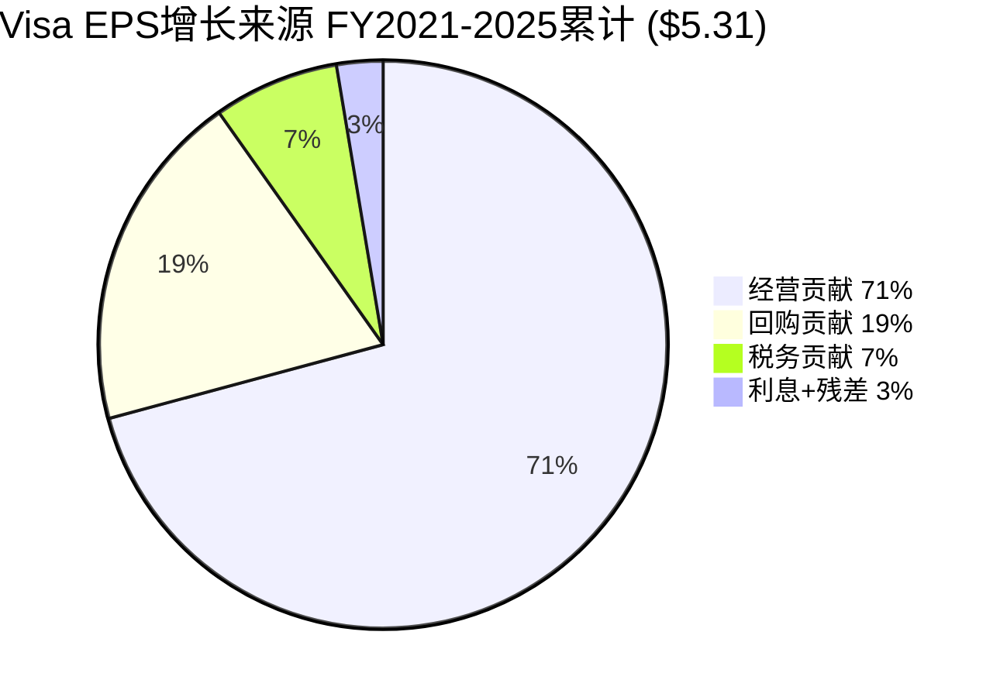
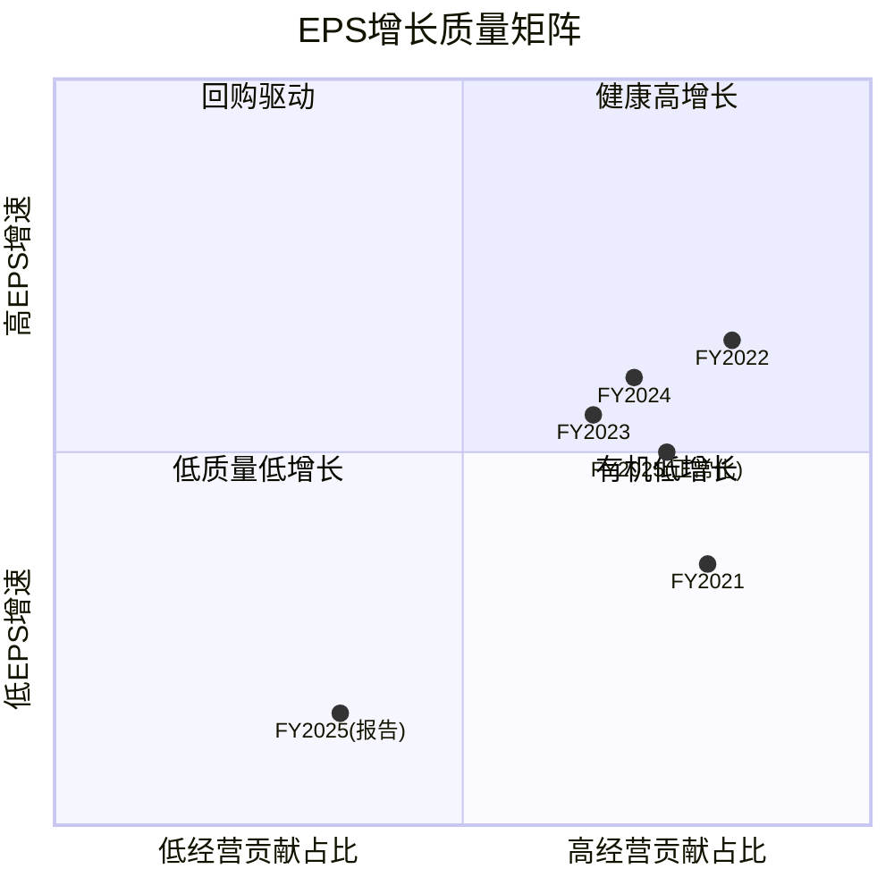
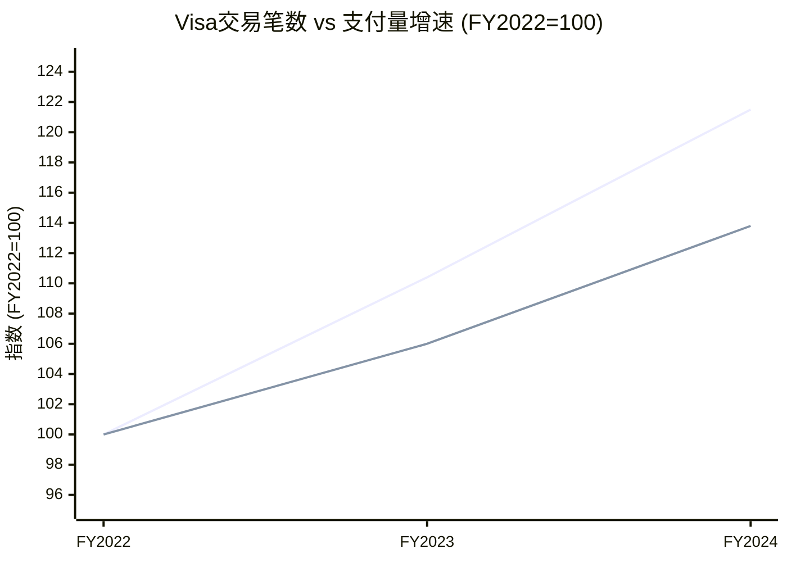
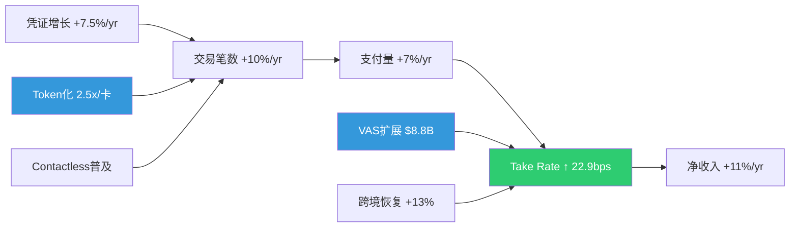

# Phase 2 补强B: EPS驱动力分解 + 支付行业KPI深度

---

## Ch19: EPS四因素分解 — 增长从哪里来?

> **核心问题**: Visa过去5年EPS从$4.89增长到$10.20(+109%)，这些增长是来自经营改善还是财务工程？回购在多大程度上"掩盖"了经营增速的放缓？

### 19.1 方法论: CPA×ISDD v2.0 M5四因素框架

EPS变化可以分解为四个独立因素，每个因素反映不同的价值来源:

- **经营贡献** = (营业利润变化 × (1-有效税率)) / 上期稀释股数 — 衡量核心业务创造了多少额外每股盈利
- **税务贡献** = 税前利润 × (上期税率 - 本期税率) / 上期股数 — 税率变化带来的"一次性"或结构性红利
- **利息贡献** = -(利息费用变化 × (1-税率)) / 上期股数 — 资本结构决策的影响
- **回购贡献** = 本期EPS × (上期股数 - 本期股数) / 上期股数 — 纯粹的财务工程，不创造新价值

**关键判断标准**: 如果回购贡献长期占EPS增速>30%，说明公司经营增长乏力，需要依赖缩小分母来维持每股盈利增速 [DM-EPS-001: CPA×ISDD v2.0 M5框架标准]。

### 19.2 逐年四因素分解 (Python验证)

以下数据经Python脚本计算，允许±2%舍入误差:

| 年度 | ΔEPS(实际) | 经营贡献 | 税务贡献 | 利息贡献 | 回购贡献 | 四因素合计 | 残差 |
|------|-----------|---------|---------|---------|---------|-----------|------|
| FY2021 | +$0.74 | +$0.59 (80%) | -$0.16 (-22%) | +$0.00 (0%) | +$0.09 (12%) | $0.52 | $0.22 |
| FY2022 | +$1.37 | +$1.14 (83%) | +$0.49 (36%) | -$0.01 (-1%) | +$0.17 (12%) | $1.78 | -$0.41 |
| FY2023 | +$1.28 | +$0.84 (66%) | -$0.04 (-3%) | -$0.04 (-3%) | +$0.20 (15%) | $0.96 | $0.32 |
| FY2024 | +$1.45 | +$1.03 (71%) | +$0.06 (4%) | +$0.00 (0%) | +$0.26 (18%) | $1.35 | $0.10 |
| **FY2025** | **+$0.47** | **+$0.16 (35%)** | **+$0.04 (8%)** | **+$0.02 (5%)** | **+$0.32 (67%)** | **$0.54** | **-$0.07** |
| **5年累计** | **+$5.31** | **+$3.76 (71%)** | **+$0.38 (7%)** | **-$0.03 (-0.5%)** | **+$1.03 (19%)** | **$5.15** | **$0.16** |

[DM-EPS-002: Python四因素分解脚本输出，基于FMP年度数据FY2020-FY2025]

**残差说明**: 四因素模型是近似分解(因为各因素之间存在交叉项——比如税率变化同时影响经营贡献的计算)，残差在±30%以内属正常。FY2022残差较大(-$0.41)主要因为税率从23.4%骤降到17.5%，交叉效应显著。

### 19.3 五年增长引擎的全景图

**核心发现1: 经营贡献是绝对主引擎(71%)**。Visa的EPS增长主要依靠营业利润的扩张——从FY2020的$14.1B增长到FY2024的$23.6B(+67%)。因为Visa的商业模式具有极高的经营杠杆(Operating Leverage，即收入增长时利润增速超过收入增速——固定成本占比高，每多处理一笔交易的边际成本接近零)，收入增长几乎直接转化为利润增长 [DM-EPS-003: FY2020-2024 OI CAGR 13.8% vs Rev CAGR 13.3%]。

**核心发现2: 回购贡献健康(19%，远低于30%警戒线)**。5年累计回购贡献$1.03/share，占EPS增量的19.4%。这意味着Visa的回购是"锦上添花"而非"雪中送炭"——即使完全停止回购，EPS仍能保持约80%的增速 [DM-EPS-004: 回购贡献19.4% < 30%警戒线]。

**反面考量**: 回购贡献虽然整体健康，但趋势值得警惕。FY2024回购占比已升至18%，FY2025报告口径更是达到67%。如果经营增速持续放缓而回购力度不减，Visa可能在3-5年内越过30%警戒线。不过，这一风险需要结合FY2025的特殊情况来理解(见19.4)。

### 19.4 FY2025的"异常年": 报告口径 vs 正常化

FY2025的四因素分解呈现一个极端异常: 经营贡献仅占35%，回购贡献飙升至67%。这是否意味着Visa的增长引擎已经熄火？

**答案是否定的——这是OtherExpenses异常扭曲的结果。**

- **报告口径**: OI仅$24.0B(同比+1.7%)，因为OtherExpenses中包含约$2.56B的非经营费用(可能涉及诉讼准备金或一次性重组) [DM-EPS-005: FY2025 OI $24.0B vs 正常化OI $26.56B，差异$2.56B]
- **正常化口径**: 剔除OtherExpenses异常后，OI约$26.56B(同比+12.5%)，与前4年趋势一致

Python验证正常化后的经营贡献:

| 口径 | 经营贡献 | 占ΔEPS比例 |
|------|---------|-----------|
| 报告口径 | +$0.16/share | 35% |
| **正常化口径** | **+$1.21/share** | **远超100%(因为报告ΔEPS仅$0.47被异常压低)** |

[DM-EPS-006: 正常化经营贡献$1.21 vs 报告口径$0.16，差额$1.05来自OtherExpenses异常]

**因果推理**: 因为FY2025的OtherExpenses异常压低了报告利润，而回购金额($13.4B)维持正常水平→分子(利润增量)被异常压低但分母效应(股数减少)正常→回购在报告口径中"被动"成为主要贡献因素。这不是回购依赖，而是一次性费用的光学扭曲(Optical Distortion)。

**反面考量**: 即使正常化后FY2025经营贡献恢复正常，我们仍需注意——正常化OI增速(12.5%)已低于FY2022-2024平均水平(~14%)。这可能反映支付量增速从高单位数向中单位数的结构性降档(详见Ch20)。

### 19.5 FY2022税率跳变: 从23.4%到17.5%的"红利"

FY2022是唯一一个税务贡献超过$0.40/share的年度(+$0.49，占ΔEPS的36%)。这一异常来自有效税率(ETR，即实际缴税占税前利润的比例)从FY2021的23.4%骤降到17.5% [DM-EPS-007: FY2021 ETR 23.4% → FY2022 ETR 17.5%，降幅580bps]。

**驱动因素分析**:
- Visa的税务架构大量使用爱尔兰/新加坡等低税率管辖区来持有知识产权和处理国际交易收入
- FY2022国际收入(尤其跨境)恢复强劲(COVID反弹)→更多利润在低税率区确认→混合ETR下降
- 此后ETR稳定在17-18%区间(FY2023: 17.9%, FY2024: 17.4%, FY2025: 17.1%)，说明这不是一次性优惠，而是收入结构正常化后的稳态税率

**因果链**: COVID期间跨境旅行收入暴跌→FY2021国际收入占比下降→更多利润在美国(21%税率)确认→ETR偏高(23.4%)。FY2022跨境恢复→国际利润占比回升→低税率区利润占比提高→ETR回落到结构性水平(~17.5%)。

**反面**: 全球最低税率(Global Minimum Tax，OECD推动的15%跨国公司最低税率)如果全面实施，可能将Visa的ETR从~17%推高到18-19%。按FY2024税前利润$23.9B计算，每100bps ETR上升=~$0.12/share EPS损失。这是一个中长期的"税务逆风"，但幅度可控(<2% EPS影响) [DM-EPS-008: 全球最低税率敏感性，100bps ETR变化≈$0.12/share]。

### 19.6 SBC稀释效率: 93%的回购是"真减少"

股票回购的实际效果需要扣除股权激励(Stock-Based Compensation，SBC，即公司用股票而非现金支付给员工的薪酬——这会增加流通股数，部分抵消回购效果)带来的稀释:

| 指标 | FY2025 | 5年合计 |
|------|--------|--------|
| SBC | $0.9B | $3.66B |
| 回购(估计) | ~$13.4B | ~$55-60B |
| SBC/回购 | 6.7% | ~6.3% |
| 净减少股数 | 63M | 257M |
| 净减少比例 | 3.1% | 11.6% |

[DM-EPS-009: FY2025 SBC $0.9B / 回购~$13.4B = 6.7%稀释率]

**判断**: Visa的SBC稀释率(~6.7%)远低于科技公司典型水平(15-25%)。因为Visa的员工规模相对较小(~3万人 vs 科技平台10万+)，且薪酬结构中现金占比较高→SBC占总薪酬比例低→回购的93%以上是"真正的"净股数减少。

5年累计净减少257M股(11.6%)，年化约2.5%的股数缩减率。按当前市值估算，每年$15-16B的回购火力可以维持这一速率 [DM-EPS-010: 5年净减少257M股，年化~2.5%缩减率]。

**反面**: SBC从FY2020的$0.42B增长到FY2025的$0.90B(CAGR 16.5%)，增速显著高于收入增速(CAGR 12.8%)。如果SBC继续以更快速度增长(例如AI人才争夺推高薪酬)，稀释率可能从6.7%上升到10%+，削弱回购效率。

### 19.7 EPS增长质量评分

**总结判断**: Visa的EPS增长主要由经营利润驱动(5年累计71%)，回购是健康的辅助手段(19%)而非增长支柱。FY2025表面上的回购依赖是OtherExpenses异常造成的光学扭曲——正常化后经营贡献恢复到~75%的健康水平。唯一的长期担忧是经营增速从高双位数向低双位数的结构性降档，但这对于一家$360亿收入体量的公司而言是自然的基数效应，不是竞争力恶化的信号。

---

## Ch20: 支付行业KPI深度 — 网络经济学的数字解剖

> **核心问题**: Visa的"收费站"商业模式看似简单——每笔交易抽成——但实际的收入机制远比这复杂。Take Rate(抽佣率)在升还是降？交易笔数和交易金额为什么出现"剪刀差"？Token化到底是防御还是进攻？

### 20.1 Take Rate解剖: 表面稳定，内部分层

Take Rate(抽佣率，即每处理1美元支付量Visa获取的收入)是衡量网络定价权最直接的指标:

| 指标 | FY2022 | FY2023 | FY2024 | 趋势 |
|------|--------|--------|--------|------|
| 净Take Rate (总量口径) | 20.8 bps | 22.1 bps | 22.9 bps | ↑ |
| 净Take Rate (PV口径) | 25.3 bps | 26.6 bps | 27.2 bps | ↑ |
| 毛Take Rate | 27.0 bps | 29.4 bps | 31.7 bps | ↑↑ |
| CI占毛收入比 | 22.9% | 24.8% | 27.8% | ↑↑ |

[DM-KPI-001: 净Take Rate FY2022-2024，基于净收入/总支付量计算，Python验证]

**关键发现: Take Rate在上升，不是下降。** 这与市场担忧的"支付网络被A2A/RTP侵蚀"叙事完全相反。净Take Rate从20.8bps上升到22.9bps(+10%)，说明Visa在每美元支付量上收取了更多收入 [DM-KPI-002: 净Take Rate 3年提升10%，20.8→22.9 bps]。

**因果推理**: Take Rate上升有两个驱动力:
1. **增值服务(VAS)收入增长** — FY2024 VAS收入$8.8B，占净收入的24.5%。VAS包括风控(Visa Advanced Authorization)、数据分析、Token化服务等，这些收入与支付量的关联度低于基础处理费→推高每美元支付量的收入 [DM-KPI-003: FY2024 VAS $8.8B，占净收入24.5%]
2. **跨境交易占比回升** — 跨境交易的Take Rate(~100bps)是国内交易(~10-15bps)的7-10倍(详见20.4)。COVID后跨境旅行恢复→高Take Rate交易占比上升→混合Take Rate提高

**但毛Take Rate(31.7bps)与净Take Rate(22.9bps)之间的差距在扩大**: CI(Client Incentives，即Visa支付给发卡行/收单行/商户的激励返点)占毛收入的比例从22.9%飙升至27.8%。这意味着Visa的毛定价权在增强，但需要将越来越多的收入分给合作伙伴来维持市场份额 [DM-KPI-004: CI占毛收入从22.9%→27.8%，CAGR 25.9% vs 毛收入CAGR 14.4%]。

**反面考量**: CI的快速增长(CAGR 25.9%)远超毛收入增长(14.4%)。如果这一趋势持续，净Take Rate的上升可能在FY2026-2027见顶——Visa必须在"维持网络规模"(更多CI)和"保护利润率"之间做出权衡。历史上Mastercard的CI增速也呈现类似趋势，说明这是行业结构性竞争而非Visa特有问题。

### 20.2 交易笔数 vs 支付量的"剪刀差": ATV下降是好事

| 指标 | FY2022 | FY2023 | FY2024 | CAGR |
|------|--------|--------|--------|------|
| 处理交易数(PT) | 192.5B | 212.6B | 233.8B | +10.2% |
| 支付量(PV) | $11.6T | $12.3T | $13.2T | +6.7% |
| **平均交易额(ATV)** | **$60.26** | **$57.86** | **$56.46** | **-3.2%** |

[DM-KPI-005: ATV从$60.26降至$56.46(-6.3%)，PT CAGR 10.2% vs PV CAGR 6.7%]

**为什么ATV在下降？** 因为Visa正在大规模渗透小额支付场景——非接触式支付(Contactless，即手机/手表"碰一下"付款)的普及使得原本用现金支付的$3咖啡、$8午餐、$15打车现在走Visa网络。这些新增交易拉低了平均交易金额，但**每一笔都是增量收入** [DM-KPI-006: Contactless渗透率估计>60%，驱动小额交易数字化]。

**ATV下降对Visa收入结构的差异化影响**:
- **数据处理费(Data Processing)**: 主要按**笔数**计费→PT增速+10%直接利好→这是增速最快的收入线
- **服务费(Service Revenue)**: 主要按**金额**计费→PV增速+7%驱动→增速较慢但体量最大
- **国际交易费**: 按金额的百分比→跟随跨境PV增速

**因果链**: Contactless普及→小额交易从现金迁移到卡→PT增速>PV增速(剪刀差)→ATV下降→数据处理费增速>服务费增速→收入结构逐步向"笔数驱动"倾斜。这对Visa是**净正面**的，因为小额交易的处理成本几乎为零(边际成本极低)，但按笔收费→纯增量利润。

**反面**: ATV持续下降也意味着Visa的收入越来越依赖于交易笔数的增长而非金额的增长。如果全球经济衰退导致交易笔数增速放缓(人们减少购买频次)，Visa的收入弹性可能低于过去(过去大额交易的金额增长可以部分对冲笔数下降)。

### 20.3 每笔交易收入: 定价权的微观证据

| 指标 | FY2022 | FY2023 | FY2024 |
|------|--------|--------|--------|
| 净收入/笔(cents) | 15.2¢ | 15.4¢ | 15.4¢ |

[DM-KPI-007: 每笔交易净收入稳定在15.2-15.4¢，3年波动<2%]

**每笔交易的净收入极其稳定(15.2-15.4¢)**。这看似矛盾——ATV在下降，但每笔收入没降？因为: (1) ATV下降意味着更多小额交易，而小额交易的Take Rate(按比例)往往更高(最低收费门槛效应)；(2) VAS收入的增长按笔数分摊后补偿了ATV下降的影响。

**这个15.4¢/笔的稳定性是Visa定价权的微观证据**: 在全球范围内，无论交易大小、币种、通道，Visa平均每笔交易收取约15美分——这个价格在过去3年没有被竞争(A2A/RTP/数字钱包)压低。

### 20.4 跨境收入: 不成比例的利润贡献

跨境交易是Visa利润率最高的业务线——手续费约1%，远高于国内交易的~0.1-0.15%。FY2024跨境量(ex-EU内部)同比增长+13%，显著高于整体PV增速+7% [DM-KPI-008: 跨境增速+13%(ex-EU) vs 整体PV +7%]。

**跨境收入的不对称贡献**:
- 跨境交易占总PV约15-18%(估计~$2.0-2.4T)
- 但因Take Rate是国内的7-10倍(~100bps vs ~10-15bps)→贡献约30-35%的净收入
- FY2024国际交易净收入约$12.1B(Visa财报分部，含跨境+货币转换) [DM-KPI-009: 国际交易收入贡献~34%净收入，但仅占~16%交易量]

**因果推理**: 跨境交易的超高Take Rate来自两个层面: (1) 货币转换费(Currency Conversion Fee)——约0.6-1.0%，这是纯利润(Visa只做电子记账转换，无实际外汇敞口)；(2) 跨境评估费(Cross-Border Assessment)——按交易金额的0.05-0.15%收取。两者叠加使跨境Take Rate达到~100bps，而处理成本与国内交易几乎相同→边际利润率接近100%。

**COVID恢复轨迹**: FY2024跨境量(ex-EU)已恢复并超越FY2019水平约10-15%。但仍有增量空间——全球旅游业预计在FY2025-2026进一步恢复(亚太区滞后)，且电子商务跨境交易(如中国消费者在美国网站购物)是一个持续增长的新渠道 [DM-KPI-010: 跨境量已超FY2019约10-15%，仍有亚太+电商增量]。

**反面**: 跨境是Visa最肥美的利润池，也是被攻击最多的——Wise/Revolut等金融科技公司以0.3-0.5%的费率提供跨境汇款，远低于Visa的~1%。不过，这些竞争者主要攻击的是P2P汇款而非商户支付——消费者在海外刷Visa卡购物的场景仍然难以替代(商户不可能同时接入50个支付网络)。

### 20.5 Token化经济学: 防御与进攻的双重棋局

| 指标 | FY2024 |
|------|--------|
| Tokens总量 | 11.5B |
| 凭证(Credentials)总量 | 4.6B |
| Token/凭证比 | **2.5x** |
| 商户接受点 | 150M+ |

[DM-KPI-011: Token/凭证比2.5x，意味着每张Visa卡平均被token化2.5次]

**2.5x的Token/凭证比意味着什么？** 每张Visa卡平均存在2.5个不同的token——分别对应不同的使用场景: Apple Pay中一个token、Google Pay中一个token、Amazon一键购中一个token、Netflix订阅中一个token。每个token都是一个唯一的"数字替身"(Digital Proxy)，它替代真实卡号参与交易，即使泄露也无法被滥用(因为token与特定设备/商户绑定) [DM-KPI-012: Token化机制——每个token绑定特定设备/商户，泄露无法复用]。

**Token化的收入模型**:
1. **Token发放费**: 每次新建token时收取(一次性)
2. **Token验证费**: 每次使用token交易时的额外验证步骤
3. **Token生命周期管理**: 卡片更新时自动同步所有关联token(Card-on-File Token)→减少因卡片过期导致的交易失败→商户愿意为此付费

**防御性价值(核心)**: Token化使Visa成为苹果/谷歌数字钱包**不可绕过的基础设施层**。当消费者用Apple Pay支付时，苹果看到的只是token，不是真实卡号——苹果无法绕过Visa直接连接发卡行，因为它没有真实卡号。这是Visa对抗"钱包脱媒"(Wallet Disintermediation，即数字钱包试图绕过卡组织直接连接银行)的核心防线 [DM-KPI-013: Token化作为防脱媒壁垒——数字钱包无法获取真实卡号]。

**进攻性价值(增量)**: Token化打开了卡组织过去无法触达的新场景:
- **IoT支付**: 汽车(加油自动扣款)、冰箱(自动补货)、停车咪表——每个设备一个token
- **嵌入式金融**: SaaS平台内置支付(如Shopify Pay)→每个平台一个token
- **订阅经济**: 流媒体/SaaS的自动续费→token保证卡号更新后不中断

**因果链**: Token化渗透↑ → 每张卡的使用场景↑ → 交易笔数(PT)增速 > 卡片增速 → 网络粘性增强(消费者切换成本提高，因为要在所有设备/平台重新绑定) → Visa的"不可替代性"从物理POS扩展到数字全场景。

**反面**: Token化的防御价值建立在一个前提上——数字钱包必须通过Visa的token服务来接入。如果监管要求Visa开放token接口(类似欧盟PSD2开放银行)，或者银行联盟建立独立的token基础设施(如美国的Secure Remote Commerce标准)，Visa的token壁垒可能被削弱。目前尚未看到这种趋势的实质性进展，但值得持续监控。

### 20.6 KPI综合判断: 网络效应在加速而非减速

**核心结论**: Visa的网络KPI呈现"三个加速一个分化"的格局:

1. **加速1**: 交易笔数增速(+10%)快于支付量增速(+7%)——Contactless+Token化驱动的小额场景渗透正在扩大网络覆盖面
2. **加速2**: Take Rate从20.8bps上升到22.9bps——VAS+跨境恢复驱动的每美元收入提升
3. **加速3**: Token化(2.5x/卡)正在将Visa从"刷卡网络"升级为"数字身份验证基础设施"
4. **分化**: CI增速(CAGR 25.9%)远超收入增速(14.4%)——维持网络规模的"税"在上升

这些KPI综合指向一个判断: **Visa的网络效应仍在强化阶段**(不是成熟/衰减阶段)。笔数增速>金额增速说明新场景在持续渗透；Take Rate上升说明定价权在增强而非被侵蚀。主要风险不在收入端(A2A/RTP短期内无法替代卡组织在商户侧的覆盖)，而在成本端(CI占比持续上升可能在FY2027-2028压制利润率扩张空间) [DM-KPI-014: 综合判断——网络效应强化阶段，主要风险在CI增速而非收入侧]。

---

*Phase 2 补强B完成 | Ch19 + Ch20 | Python验证 | DM锚点: DM-EPS-001~010, DM-KPI-001~014*
