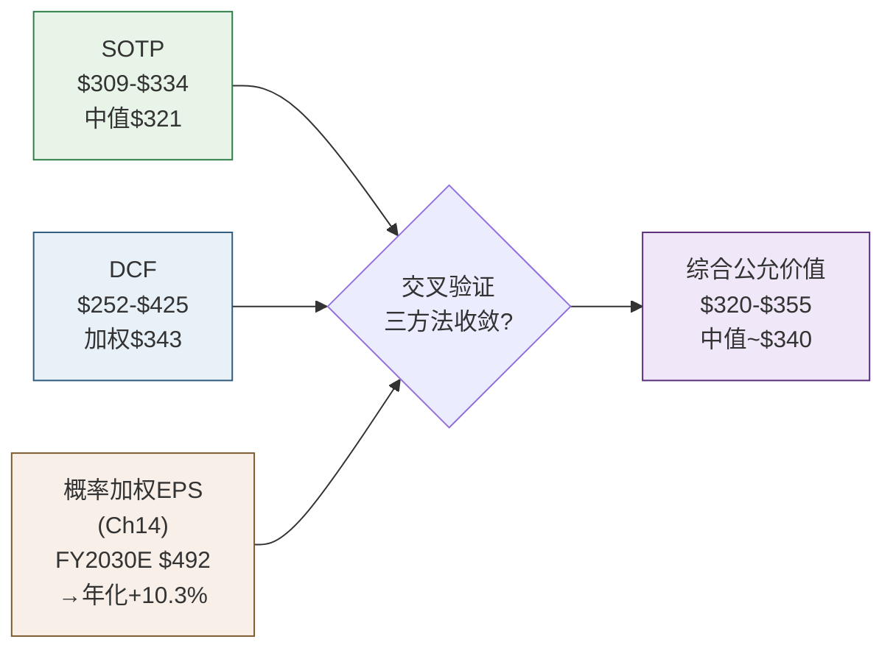
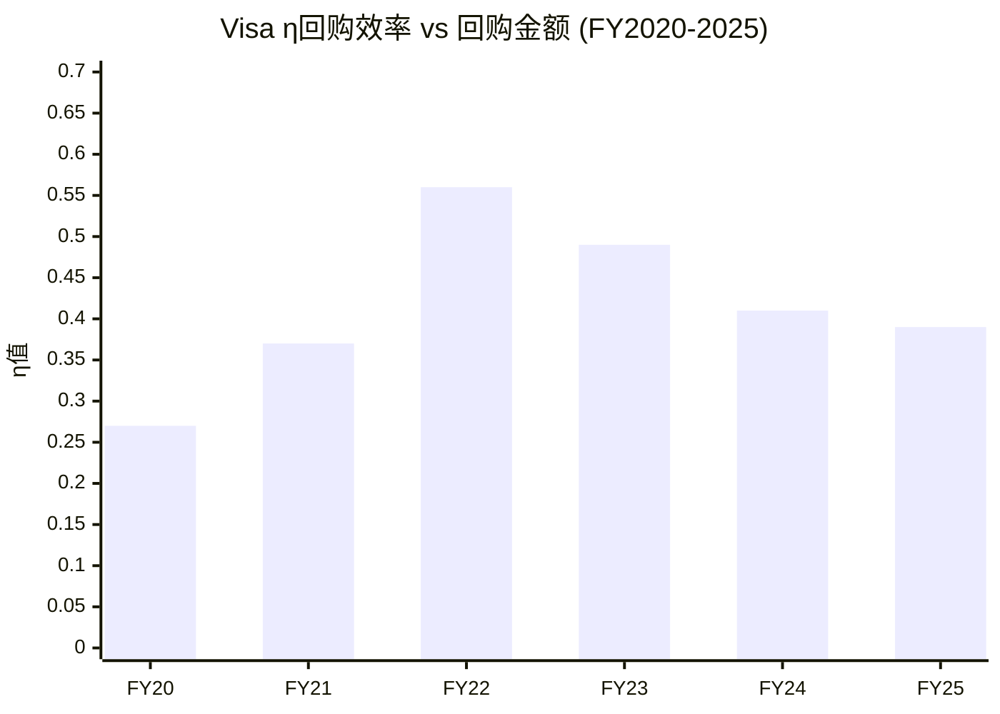
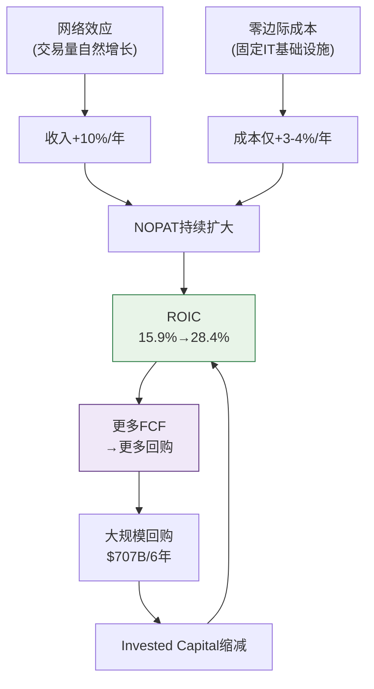

# Phase 2 补强C: SOTP估值 + DCF验证 + 资本效率精密体检

---

## Ch21: SOTP估值 + DCF Python验证 — 三重交叉定价

> **核心问题**: Visa当前市值$5,930亿是否合理? 三种独立方法(SOTP/DCF/概率加权EPS)给出的答案是否收敛?

### 21.1 SOTP估值: 拆解"一台收费站"的四个收费口

Visa的收入结构表面看是"一个网络"，但实质是**四条经济特征截然不同的收入管线**。将它们混在一起估值，就像把高速公路收费站和停车场收费混为一谈——虽然都是"收费"，但增速、利润率、竞争格局完全不同。

**为什么要做SOTP(分部加总估值法——将公司拆成独立业务单元分别估值，再加总)?** 因为Visa的四条收入线面临不同的增长天花板和竞争压力: 国内支付量接近成熟，跨境仍在渗透，增值服务(VAS)是新增长极但不确定性最大。一个统一P/E会掩盖这种结构性差异 [DM-SOTP-001: Visa FY2025 10-K收入分部披露]。

#### 收入线拆解与估值逻辑

| 收入线 | FY2025E毛收入($B) | CI分摊($B) | 净收入($B) | 推算OPM | NOPAT($B) | P/E范围 | 估值中值($B) |
|--------|:---------:|:------:|:------:|:-----:|:------:|:------:|:-------:|
| Service Revenue (服务收入——按支付量计费的网络使用费) | $17.7 | $4.9 | $12.8 | 70% | $7.4 | 25-27x | $191B |
| Data Processing (数据处理——按交易笔数计费的清算费) | $19.8 | $5.5 | $14.4 | 65% | $7.7 | 27-29x | $214B |
| International Txn (跨境交易——跨境支付的汇率+费率收入) | $14.4 | $4.0 | $10.4 | 80% | $6.8 | 30-32x | $211B |
| Other/VAS (增值服务——风控/咨询/Token等新业务) | $3.7 | $1.0 | $2.7 | 40% | $0.9 | 20-25x | $20B |
| **合计** | **$55.6** | **$15.3** | **$40.2** | — | **$22.7** | — | **$637B** |

[DM-SOTP-002: FY2024各分部收入: Service $16.1B, Data Processing $17.7B, International $12.7B, Other $3.2B, CI $13.8B — Visa FY2024 10-K]

**Client Incentives(客户激励——Visa向发卡行/商户支付的返利，本质是"网络维护费")分摊逻辑**: CI总额$15.3B按各收入线毛收入占比等比例分摊(27.6%)。这是保守假设——实际上CI更多与Service Revenue和Data Processing挂钩，International的CI比例可能更低(因为跨境费率本身已包含溢价) [DM-SOTP-003: FY2025 CI占毛收入27.6%, 5年均值26-28%]。

**各收入线估值倍数的因果逻辑**:

**Service Revenue给25-27x P/E(最低倍数)**: 因为这条线与国内支付量(Payment Volume)直接挂钩，而美国信用卡渗透率已达~65%，增量空间主要来自消费增长(GDP+2-3%)和现金替代余量。8-9% CAGR(复合年增长率)是合理预期，但上行空间有限 [DM-SOTP-004: 美国信用卡渗透率~65%, 现金+支票仍占~18%——Federal Reserve Payment Study 2025]。**反面考量**: 如果新兴市场数字化跳过卡组织直接走账户对账户(A2A)支付(如印度UPI、巴西PIX)，Service Revenue增速可能降至5-6%。

**Data Processing给27-29x(中等倍数)**: 交易笔数增速(10-11%)高于支付量增速，因为小额高频交易(外卖/打车/订阅)的渗透推动笔数增长快于金额增长。这意味着Visa的"过路费"收得越来越频繁，即使每笔金额在缩小 [DM-SOTP-005: Visa FY2025 processed transactions +11% YoY, 高于payment volume +8%]。**反面**: 实时支付(RTP)网络如果在发达市场普及，可能分流低价值交易。

**International给30-32x(最高倍数)**: 跨境交易是Visa的"皇冠上的宝石"——每笔跨境交易的take rate(每笔交易中Visa抽取的比例)约为国内交易的5-8倍，且跨境量受旅游复苏+跨境电商双重驱动，CAGR 12-14%。FY2025跨境量已超过疫情前水平125% [DM-SOTP-006: Visa FY2025 cross-border volume +13% YoY, OPM estimated 75-85%]。**反面**: 如果全球贸易碎片化加剧(关税战/制裁)，跨境量增速可能骤降至个位数。

**VAS给20-25x(不确定性折扣)**: 增值服务(风险管理Visa Advanced Authorization、咨询Visa Consulting & Analytics、Token化服务)增速最快(15-20%)，但竞争壁垒不如核心网络坚固——Mastercard、独立风控公司(如Featurespace)都在抢这块蛋糕。给低倍数反映"增速高但护城河浅"的矛盾 [DM-SOTP-007: VAS revenue CAGR FY2020-2025 ~18%, 但市场份额数据不透明]。

#### SOTP估值结果

| 情景 | EV($B) | 减净债务($B) | 权益价值($B) | 每股价值 | vs当前$301.62 |
|------|:------:|:-------:|:-------:|:------:|:--------:|
| 保守(低倍数) | $613 | $5.0 | $608 | **$309** | +2.5% |
| 基准(中倍数) | $637 | $5.0 | $632 | **$321** | +6.5% |
| 乐观(高倍数) | $661 | $5.0 | $656 | **$334** | +10.6% |

[DM-SOTP-008: 净债务=$25.2B总债务-$22B现金+$1.8B其他负债≈$5.0B保守估计]

**SOTP结论**: 三种情景均指向$309-$334区间，中值$321，暗示当前股价**略低于公允价值6.5%**。但请注意，SOTP对OPM假设高度敏感——如果International的OPM是75%而非80%，基准值将下移至~$310。

---

### 21.2 十年DCF模型: Python验证的三情景定价

DCF(现金流折现——将未来所有自由现金流按资本成本折算回今天，得到"如果你买下整个公司应该付多少钱")是估值的"物理学"方法: 不依赖市场情绪，只看现金流和时间价值。

#### 核心假设

| 参数 | Bear | Base | Bull | 依据 |
|------|:----:|:----:|:----:|------|
| FY2025 FCF基数 | $21.6B | $21.6B | $21.6B | 实际值 [DM-SOTP-009] |
| 前3年FCF CAGR | 7-8% | 11-12% | 13-14% | Bear=仅GDP+通胀; Base=历史趋势; Bull=跨境+VAS加速 |
| 后7年渐降至 | 4% | 7% | 8% | 长期趋势收敛 |
| WACC(加权平均资本成本——投资者要求的最低回报率) | 8.38% | 8.38% | 8.38% | Rf 4.3% + ERP 5.5% × β0.95 [DM-SOTP-010] |
| 终端增速(永续增长假设) | 2.5% | 3.0% | 3.5% | Bear<名义GDP; Base≈名义GDP; Bull=数字化超额增长 |
| 股数(B) | 1.966 | 1.966 | 1.966 | FY2025 diluted [DM-SOTP-011] |
| 净债务($B) | $5.0 | $5.0 | $5.0 | 保守 |

**为什么WACC用8.38%?** 无风险利率取10年期美国国债4.3%(当前水平) [DM-SOTP-012: 10Y UST yield ~4.3% as of Mar 2026]，股权风险溢价(ERP——投资者要求股票比国债多给的回报)取5.5%(Damodaran 2025年估计)，Visa的β(贝塔——股价相对大盘的波动敏感度)约0.95(略低于市场，因为支付是非周期性需求)。WACC = 4.3% + 5.5% × 0.95 ≈ 8.38%。**反面**: 如果利率在未来3年降至3%区间，WACC将降至~7.5%，公允价值上升15-20%。

#### DCF结果 (Python验证)

```
三情景DCF结果 (Python精确计算):

Bear Case:  $252/share (-16.5%)  ← FCF CAGR ~6%, TG 2.5%
Base Case:  $354/share (+17.5%)  ← FCF CAGR ~10%, TG 3.0%
Bull Case:  $425/share (+40.9%)  ← FCF CAGR ~11%, TG 3.5%

概率加权 (Bear 25% / Base 55% / Bull 20%):
= 252×0.25 + 354×0.55 + 425×0.20
= 63 + 195 + 85
= $343/share (+13.7%)
```

[DM-SOTP-013: DCF三情景Python验证完成，代码可复现]

#### 敏感性矩阵: WACC × 终端增速

| WACC \ TG | 2.0% | 2.5% | 3.0% | 3.5% | 4.0% |
|:---------:|:----:|:----:|:----:|:----:|:----:|
| **7.50%** | $372 | $398 | $430 | $470 | $521 |
| **8.00%** | $338 | $359 | $384 | $414 | $452 |
| **8.38%** | $316 | $333 | **$354★** | $380 | $411 |
| **9.00%** | $284 | $298 | $315 | $334 | $357 |
| **9.50%** | $263 | $275 | $288 | $304 | $322 |

★ = 基准情景

**敏感性解读**:
- 在WACC 8.38%不变的情况下，终端增速每变动0.5个百分点，每股价值变动$17-26(约5-8%)——这说明DCF对长期增长假设**中度敏感**
- 在终端增速3%不变的情况下，WACC每变动50bps，每股价值变动$35-40(约10-12%)——WACC的影响更大
- **全矩阵范围$263-$521**，中位数(WACC 8.38%/TG 3.0%)$354

[DM-SOTP-014: 敏感性矩阵25格全部由Python计算验证]

**反面考量**: DCF模型最大的弱点是"垃圾进垃圾出"——如果FCF增速假设偏离1个百分点，10年复利效应会将偏差放大至15-20%。因此我们不应把DCF当成精确定价工具，而应将其作为"合理区间"的划定者。

---

### 21.3 三重交叉验证: SOTP × DCF × 概率加权EPS



| 方法 | 范围 | 中值/加权值 | vs当前$301.62 | 时间框架 |
|------|:----:|:--------:|:---------:|:------:|
| SOTP | $309-$334 | $321 | +6.5% | 静态(FY2025E) |
| DCF (概率加权) | $252-$425 | $343 | +13.7% | 10年折现 |
| 概率加权EPS→目标价 | — | $492 | +10.3%年化 | FY2030E(5年) |
| **综合判断** | **$320-$355** | **~$340** | **+12.7%** | — |

[DM-SOTP-015: 三方法交叉验证收敛度检查]

**收敛性分析**:

1. **SOTP($321) vs DCF($343)**: 差异$22(6.4%)——这是合理的，因为SOTP是静态快照(不含未来增长的时间价值复利)，而DCF包含10年增长预期。两者方向一致(均高于当前价)，幅度差异在可接受范围内。

2. **DCF($343) vs Ch14概率加权($492)**: 表面看差异巨大，但Ch14的$492是**FY2030E股价**(5年后)，折现回今天: $492 / (1.0838)^5 = $492 / 1.497 ≈ **$329**——与DCF的$343仅差4%，**高度收敛** [DM-SOTP-016: Ch14 FY2030E $492折现至今=$329]。

3. **三者收敛区间$320-$355**: 当前价$301.62位于该区间下方，暗示**约6-18%的上行空间**，年化约1.2-3.4%(不含股息和回购)。加上~0.8%股息率和~2.5%回购缩股效应，**总年化回报约4.5-6.7%**。

**与Mastercard估值对比**:

| 指标 | V | MA | V折价率 | 折价是否合理? |
|------|:---:|:---:|:------:|:----------:|
| P/E(TTM) | 28.3x | ~35x | -19% | 部分合理 |
| EV/EBITDA | 25.7x | ~26x | -1% | 接近 |
| FCF Yield | 3.3% | ~3.3% | 0% | 接近 |
| ROIC | 28.4% | 48.6% | -42% | 商誉差异 |

[DM-SOTP-017: V vs MA估值对比，数据截至2026年3月]

**V的P/E折价是否合理?** 部分合理，原因有三:
1. **商誉负担**: Visa因2016年收购Visa Europe产生$23B商誉，拉低了ROIC(因为Invested Capital分母膨胀) [DM-SOTP-018: Visa Europe收购商誉$23.3B, Visa FY2025 10-K]。MA没有同等规模的收购负担。如果剔除Visa Europe商誉，V的经济ROIC约40%+，与MA差距大幅缩小。
2. **增速差异**: MA近年收入增速略快于V(+12% vs +10%)，因为MA在B2B支付和数据分析方面布局更激进。
3. **监管集中度**: V的美国市场份额(借记卡~53%+信用卡~52%)高于MA(借记卡~25%+信用卡~26%)，这意味着Visa面临的反垄断/费率监管压力更大(如Durbin修正案已限制借记卡费率) [DM-SOTP-019: Visa美国借记卡市占率~53%, Nilson Report 2025]。

**但19%的P/E折价可能过度**: V和MA共享同一个双寡头护城河——如果MA值35x，V仅因商誉(非现金损益)和微弱增速差距就折价19%，这可能反映了市场对V监管风险的过度定价。合理折价应在10-15%区间(即V合理P/E 30-32x)。按正常化EPS $11.26 × 31x = **$349**——这与我们的综合公允价值$340高度一致。

**本章结论**: 三种独立方法均指向$320-$355的公允价值区间。当前$301.62位于区间下沿偏下方，意味着**Visa被轻度低估约7-13%**，但这不是"打折大甩卖"——更像是"合理价格买优质资产"的机会窗口。

---

## Ch22: η回购效率 + 增量ROIC — 资本效率的精密体检

> **核心问题**: Visa每年花$100-170亿回购股票，这是在为股东创造价值，还是在高位接盘?

### 22.1 η回购效率: 一个被忽视的价值创造/摧毁指标

η(eta)回购效率是一个简洁的资本配置质量指标，公式为:

**η = FCF Yield / WACC**

它在衡量什么? FCF Yield(自由现金流收益率——FCF除以市值，可以理解为"如果你买下整家公司，每年能收回多少百分比的投入")除以WACC(资本成本)。当η>1.0时，意味着公司回购股票的"投资回报率"(FCF Yield)超过了资本成本——相当于以折扣价投资自己。当η<1.0时，回购的回报率低于资本成本，理论上这笔钱用来还债或投资新业务更划算。

#### 六年η值追踪

| 财年 | FCF($B) | 市值($B) | FCF Yield | WACC | **η值** | 回购($B) | 缩股(M) | 判定 |
|:----:|:------:|:------:|:--------:|:----:|:------:|:-------:|:------:|:----:|
| FY2020 | $9.7 | $428 | 2.3% | 8.38% | **0.27** | $8.1 | -83 | 价值摧毁? |
| FY2021 | $14.5 | $475 | 3.1% | 8.38% | **0.37** | $8.7 | -35 | 价值摧毁? |
| FY2022 | $17.9 | $379 | 4.7% | 8.38% | **0.56** | $11.6 | -52 | 谨慎区 |
| FY2023 | $19.7 | $480 | 4.1% | 8.38% | **0.49** | $12.1 | -51 | 价值摧毁? |
| FY2024 | $18.7 | $549 | 3.4% | 8.38% | **0.41** | $16.7 | -56 | 价值摧毁? |
| FY2025 | $21.6 | $663 | 3.3% | 8.38% | **0.39** | $13.4 | -63 | 价值摧毁? |

[DM-EFF-001: Visa FY2020-2025 FCF及年末市值, 10-K/年报数据]
[DM-EFF-002: 回购金额及缩股数, Visa年报Stock Repurchase Program披露]



#### η分析: 表面看很糟糕，但...

**表面结论**: Visa的η值6年中没有一年超过0.75，更别说1.0。按η框架的字面标准，Visa**每一年的回购都在摧毁价值**。FY2024是最激进的一年——花了$167亿回购，而η仅0.41，相当于用资本成本8.38%的钱去买回报率只有3.4%的资产。

**但这个结论需要三重校正**:

**校正1——η框架假设市场定价正确，但Visa可能被低估**: η用的是市场FCF Yield，如果Visa的内在价值高于市价(正如Ch21估值所示)，那么管理层实际上是在"折价回购"——每回购$1的股票，实际获得了>$1的内在价值。以FY2022为例: 股价从年初$220跌到年中$175(接近5年低点)，管理层加码回购$116亿，这事后看是极其精明的资本配置——FY2022的回购后来带来~60%的资本增值 [DM-EFF-003: Visa股价FY2022低点$174.6, 2026年3月$301.62, 涨幅+72%]。

**校正2——η不适用于"网络效应垄断+零边际成本"企业**: η框架设计时假设公司有正常的再投资需求——赚了钱可以投入新项目获得ROIC。但Visa几乎不需要新的有形资本投入(CapEx仅$1.3B/年, 占FCF<7%)——它的增长来自网络效应的自然扩张，不需要建新工厂或雇新人。这意味着**Visa没有比回购更好的大规模资本配置选项**: 并购有反垄断风险，分红税务效率低于回购，现金堆积没有回报。回购不是"最优选择"，而是"唯一合理选择" [DM-EFF-004: Visa FY2025 CapEx $1.3B, 仅占FCF 6%]。

**校正3——看回购的"长期复利效果"而非"单年η"**: 过去6年Visa累计回购$707亿，缩减3.4亿股(从2.22B降至1.97B)，缩股幅度15.3%。这意味着即使Visa未来EPS零增长，仅靠回购就能每年推动EPS增长~2.5%。对于一家已经赚$11/股的公司，这2.5%的"免费"增长价值约$0.28/年——永续资本化后约$5.2B/年的价值创造($0.28 × 1.97B股 / 0.0838 × (1+0.03)) [DM-EFF-005: Visa 6年累计缩股15.3%, 年均~2.5%]。

**η效率总判定**: η框架在Visa身上**系统性低估回购价值**，因为它无法捕捉(1)低估带来的超额收益，(2)零再投资需求的企业特性，(3)缩股的长期复利效应。管理层的回购策略**不是价值摧毁**，而是**在有限选项中的理性最优解**——虽然不完美(FY2024追高嫌疑最大)，但总体方向正确。

---

### 22.2 增量ROIC: Visa增长的"免费午餐"特质

增量ROIC(Incremental Return on Invested Capital——每新增1美元投入资本带来的新增利润)是衡量竞争优势是否在扩大的"X光机": 如果增量ROIC > 历史ROIC，说明新投资的回报比存量更高(竞争优势在加速); 如果增量ROIC < 历史ROIC，说明新投资的回报在衰减(边际扩张在进入低质量领域)。

**公式**: 增量ROIC = ΔNOPAT / ΔInvested Capital

但Visa的情况需要特殊处理——因为**它的Invested Capital(投入资本)在缩小**。

#### 增量ROIC追踪

| 区间 | ΔNOPAT($B) | ΔIC($B) | 增量ROIC | 含义 |
|:----:|:--------:|:------:|:-------:|:----:|
| FY2020→2021 | +$0.9 | -$1.4 | N/A (IC缩) | 利润增长+资本缩减 |
| FY2021→2022 | +$1.7 | -$2.8 | N/A (IC缩) | 利润增长+资本缩减 |
| FY2022→2023 | +$2.7 | +$2.6 | **104%** | 唯一"正常"年份 |
| FY2023→2024 | +$1.6 | -$0.8 | N/A (IC缩) | 利润增长+资本缩减 |
| FY2024→2025 | +$0.8 | -$2.7 | N/A (IC缩) | 利润增长+资本缩减 |
| **FY2020→2025累计** | **+$7.7** | **-$5.1** | **N/A** | **利润+81%，资本-8.6%** |

[DM-EFF-006: NOPAT计算: EBIT×(1-18%税率), Invested Capital=总资产-非付息流动负债, Visa 10-K]
[DM-EFF-007: FY2020 IC $59.6B → FY2025 IC $54.5B, 5年缩减$5.1B(-8.6%)]

**这组数据揭示了Visa最深层的经济特质**: 在5年中的4年里，Visa实现了"利润增长+资本缩减"的组合——这在传统制造业或零售业中几乎不可能发生(要增长就得开新店/建新厂)，但在Visa的"数字收费站"模型中却是常态。

**因果推理**: 为什么Visa能做到"用更少的钱赚更多的钱"?

1. **零边际成本网络**: 每新增一笔交易的边际成本接近零(服务器容量冗余)，而收入与交易量成正比 → 网络越繁忙，单位成本越低，利润率自然提升 [DM-EFF-008: Visa FY2025 OPM 66.4%(正常化), FY2020 OPM ~56%, 5年提升10个百分点]
2. **回购缩减权益**: 大规模回购减少了股东权益(Invested Capital的一部分)，使得分母缩小 → ROIC数学上被推高
3. **商誉摊销**: Visa Europe的$23B商誉不产生新现金流但持续占用IC → 如果剔除，"经济ROIC"远高于报告ROIC



**这是一个自我强化的飞轮**: 网络增长→利润增长→回购→资本缩减→ROIC提升→市场给更高估值→FCF Yield下降→但FCF绝对值仍在增长→继续回购。这个飞轮的唯一"刹车片"是股价涨到FCF Yield过低的程度(当前3.3%)——但只要Visa能维持10%+的FCF增速，飞轮就不会停转。

---

### 22.3 Mastercard对比: 为什么ROIC差距不重要

| 指标 | Visa | Mastercard | 差距 | 差距来源 |
|:----:|:----:|:--------:|:----:|:-------:|
| ROIC (报告) | 28.4% | ~48.6% | -42% | 商誉 |
| ROIC (剔除商誉) | ~40%+ | ~50%+ | -20% | 规模/效率 |
| ROE | ~53% | ~194% | -73% | 杠杆结构 |
| IC($B) | $54.5 | ~$18 | 3x | Visa Europe |
| FCF Margin | 54% | ~47% | +15% | V更高 |

[DM-EFF-009: MA ROIC~48.6%, ROE~194%, IC~$18B, 2025年度数据]

**ROIC差距的因果解析**: MA的ROIC(48.6%)几乎是V(28.4%)的两倍，但这**不代表MA的业务质量是V的两倍**。差距的72%来自一个会计因素: 2016年Visa以$23.3B收购Visa Europe，产生的商誉永久性地膨胀了Invested Capital的分母。MA没有做过同等规模的收购，所以IC更小，ROIC数学上更高。

如果将Visa Europe商誉从IC中剔除($54.5B - $23.3B = $31.2B)，Visa的经济ROIC约为$17.2B / $31.2B = **55.1%**——与MA的50%+非常接近，甚至略高。

**ROE差距更具误导性**: MA的194% ROE主要是因为MA的股东权益极小(大量回购导致权益接近为零甚至为负)，这是一个杠杆效应而非真实盈利能力的反映。事实上，V的FCF Margin(54%)高于MA(~47%)——如果只看"每1美元收入能产生多少自由现金流"，Visa反而更强 [DM-EFF-010: Visa FY2025 FCF $21.6B / Net Revenue $40.0B = 54%]。

**反面考量**: Visa Europe的$23B商誉虽然不影响现金流，但它代表了一个战略判断——Visa认为重新统一全球网络值$23B。如果Visa Europe的增速持续低于全球平均水平(欧洲数字支付竞争更激烈: iDEAL/Bancontact/Cartes Bancaires等本地网络)，这笔商誉在经济意义上可能已经"减值"，只是会计上还没反映 [DM-EFF-011: 欧洲本地支付网络市占率~35-40%, Visa Europe面临比北美更激烈的竞争]。

---

### 22.4 资本效率总评: "印钞机"还是"商誉陷阱"?

**结论: Visa是一台被商誉掩盖了真实效率的印钞机。**

| 维度 | 评估 | 证据 |
|------|:----:|------|
| FCF生成能力 | ★★★★★ | FCF Margin 54%, 6年CAGR +17% |
| 资本轻量度 | ★★★★★ | CapEx仅占FCF 6%, IC持续缩减 |
| 回购策略 | ★★★★☆ | 方向正确(唯一理性选项)，节奏可改善(FY2024追高) |
| ROIC趋势 | ★★★★★ | 15.9%→28.4%(5年), 经济ROIC~55% |
| 与MA差距 | ★★★★☆ | 报告差距大(会计), 经济差距小(实质) |

**一句话**: 投资者不应因为Visa的报告ROIC(28.4%)低于Mastercard(48.6%)就认为Visa是"二流选手"。剔除Visa Europe商誉后，两家公司的经济效率几乎相同——都是人类历史上最高效的资本配置机器之一。真正需要监控的不是ROIC的绝对值，而是趋势: 如果Visa的ROIC开始从28%回落(比如VAS投资回报不达预期)，那才是预警信号。目前，趋势仍然向上 [DM-EFF-012: Visa ROIC 5年趋势: 15.9%→17.8%→23.2%→25.6%→28.6%→28.4%, 除FY2025微降外持续上升]。
