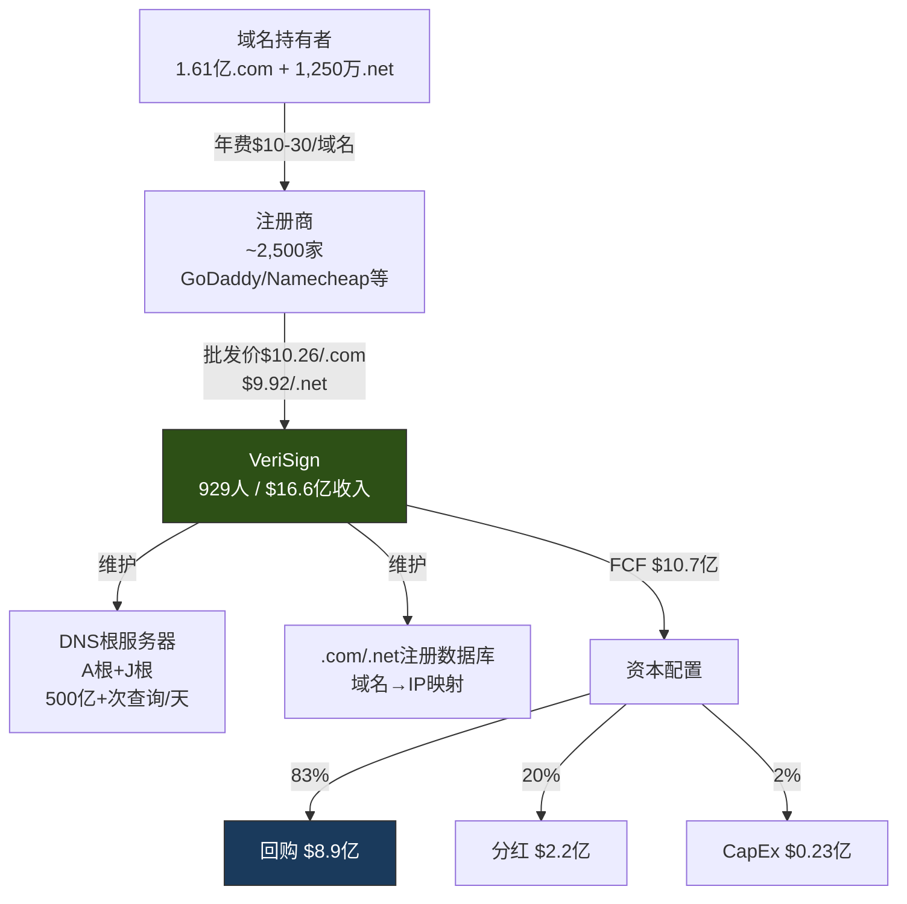
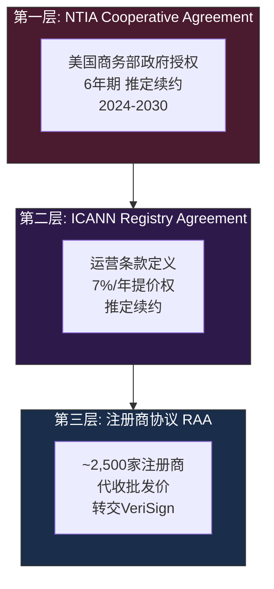
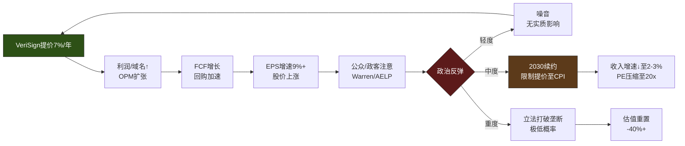
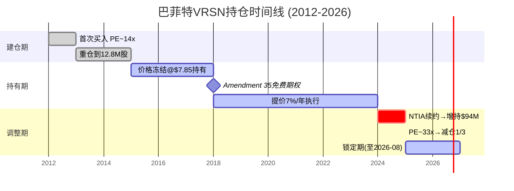
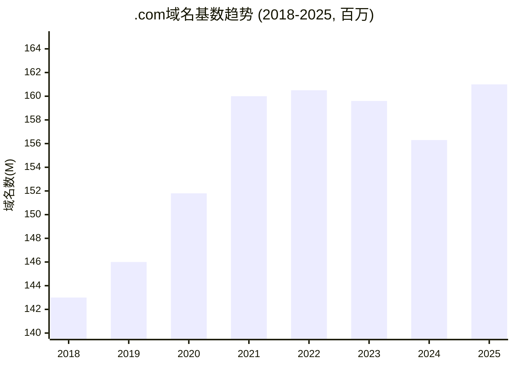
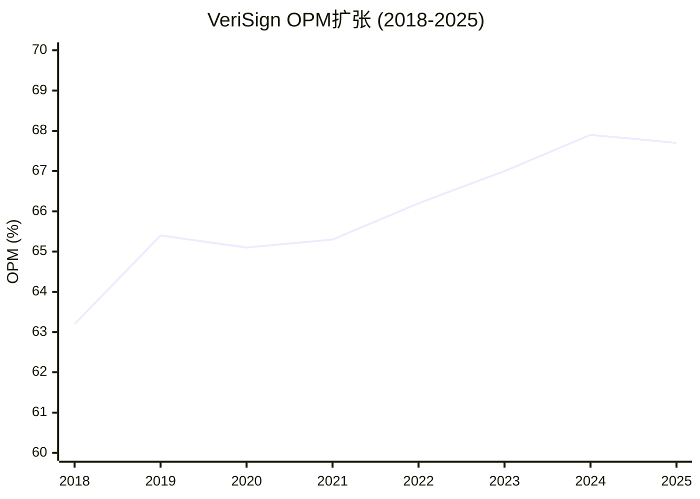
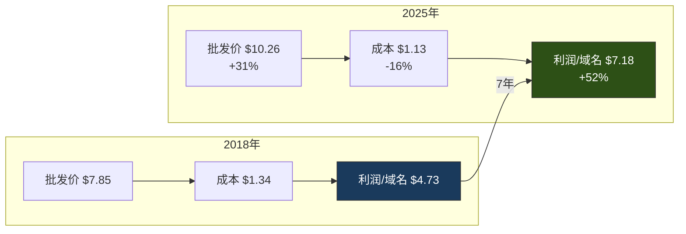
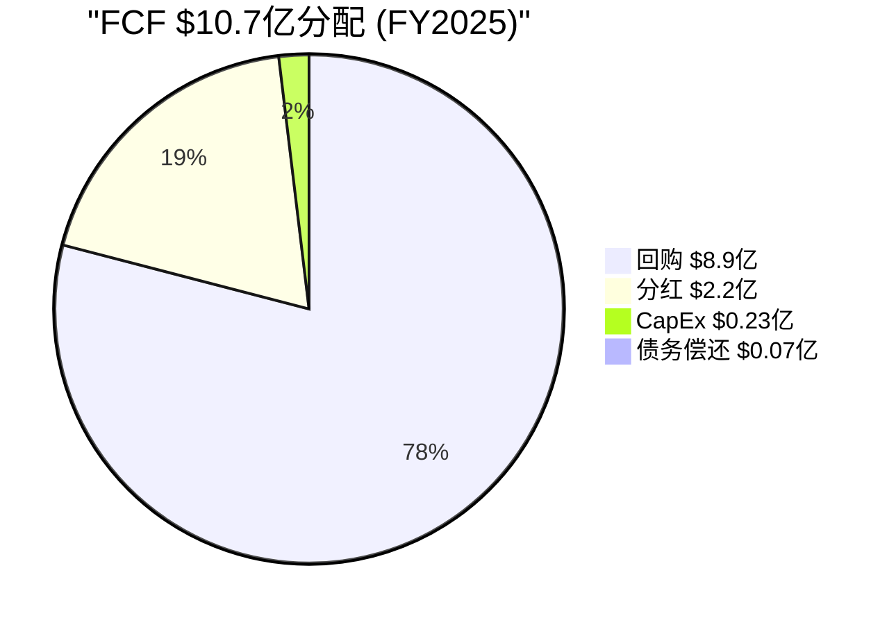
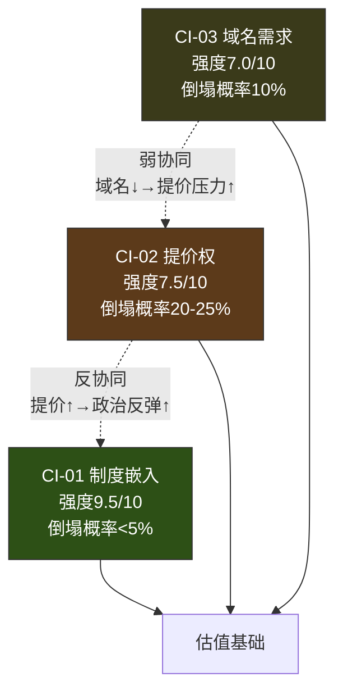
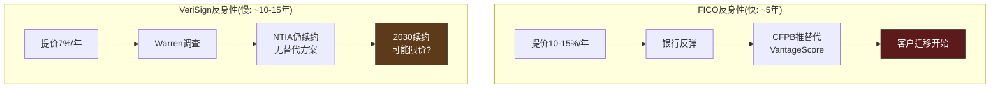

# VeriSign (VRSN) 深度研究报告 — Phase 1: 业务深度×竞争格局×护城河×财务诊断

> **Phase 1 | 2026-03-23 | Framework v19.6 | 金融基础设施行业**
> **核心矛盾**: 收费站天堂 vs 政治地雷 — 人类商业史上最完美的商业模式之一, 正在接近政治容忍度的边界
> **Reverse DCF约束(铁律O)**: 市场隐含永续增长3.3-4.1%, 定价"合理偏保守" → 本报告叙事不超过此判断1档

---

## 关键术语速查

| 术语 | 全称/含义 |
|------|---------|
| **Registry Agreement** | 注册表协议 — ICANN授权VRSN运营.com顶级域名(TLD)的核心合同 |
| **Cooperative Agreement** | 合作协议 — 美国商务部NTIA与VRSN签订的政府授权合同, 是Registry Agreement的上层保障 |
| **NTIA** | National Telecommunications and Information Administration, 美国国家电信和信息管理局 |
| **ICANN** | Internet Corporation for Assigned Names and Numbers, 互联网名称与数字地址分配机构 |
| **推定续约** | Presumptive Renewal — 除非VRSN严重违约, 合同到期自动续约, 无需竞争招标 |
| **Amendment 35** | 2018年的关键修正案, 恢复VRSN每年最高7%的.com提价权 |
| **TLD** | Top-Level Domain, 顶级域名(如.com, .net, .ai, .io) |
| **FCF Yield** | 自由现金流收益率 — FCF÷市值, 衡量每投入1元市值能收回多少自由现金流 |
| **FCF/NI** | 自由现金流与净利润之比 — 超过1.0说明盈利质量高, 不靠会计美化 |
| **OPM** | Operating Profit Margin, 营业利润率 — 衡量核心业务的盈利能力 |
| **η函数** | 回购效率函数 — 衡量每1元回购为股东创造多少内在价值增长 |
| **C1嵌入性质** | 护城河框架中的制度嵌入维度 — 公司嵌入监管/行业标准的深度 |
| **B4定价权** | 护城河框架中的定价权维度 — 公司单方面提价而不流失客户的能力 |
| **反身性** | Reflexivity — 定价权的自我强化/自我毁灭循环: 提价→引发反弹→制度松动→定价权减弱 |
| **PW** | Possibility Width, 可能性宽度 — 衡量公司未来结果的不确定性(0-10, 越高越不确定) |

---

## 第一章: 执行摘要与Reverse DCF前置

### 1.1 一句话定位

VeriSign是**人类商业史上最接近完美的收费站**: 100%垄断全球.com域名注册表, 929人运营$16.6亿收入[DM-FIN-001][DM-FIN-020], 营业利润率(OPM——衡量核心业务每赚1元收入中留下多少利润)67.7%[DM-FIN-002], 自由现金流利润率64.5%[DM-FIN-004], 合同保障每年最高7%提价权[DM-BIZ-005], 推定续约条款使垄断地位理论上可以延续到永远[DM-BIZ-007]。

但正是因为太完美, 它正在接近政治容忍度的边界——参议员Warren和众议员Nadler已致信司法部要求调查"掠夺性定价"[DM-REG-003], 经济自由倡议组织估算合理价格仅$3.53-4.37/域名(当前$10.26, 溢价135-190%)[DM-REG-005]。

### 1.2 Reverse DCF前置结论(铁律O)

**市场在定价什么?** 使用两阶段逆向折现现金流模型(Reverse DCF——从股价反推市场隐含的增长假设, 而非正向预测"应该值多少"):

| 参数 | 数值 | 来源 |
|------|------|------|
| 当前EV | $23.8B | 市值$22.3B + 净债务$1.49B |
| FY2025 FCF | $1,068M | [DM-FIN-003] |
| WACC(加权平均资本成本——投资者要求的最低回报率) | 8.5% | Beta 0.765 × ERP 5% + Rf 4.3% |
| 高增长期(2027-2030) | g₁ = 7% | 合同提价4.67%均值 + 域名增长~2% |
| **反推永续增长率** | **g₂ ≈ 3.3%** | 隐含市场信念 |

**解读**: 市场隐含的永续自由现金流增长仅3.3%, 远低于VeriSign过去8年的FCF年复合增长率7.1%[DM-FIN-009]。这意味着市场已经在折扣三个风险:
1. **提价权不可永续** — 市场不相信7%/年提价能一直执行, 隐含长期提价~3%/年(接近通胀)
2. **域名基数零增长** — 隐含域名增长~0%, 与2023-2024连续负增长(-0.6%/-2.1%)一致[DM-BIZ-012]
3. **政治风险折价** — Warren/DOJ调查虽无实质进展, 但市场给了一个"保险费"

**P1叙事约束**: Reverse DCF说"合理偏保守", 因此本报告不会写"显著低估"。核心问题不是"VRSN便不便宜", 而是**"提价权的政治容忍度边界在哪里"** — 这个问题的答案将决定VRSN值$180还是$300。

### 1.3 八个核心问题(CQ)概览

| CQ | 假说 | 初始置信度 | Phase 1聚焦章节 |
|----|------|:---------:|:-------------:|
| CQ1 | .com Registry Agreement的推定续约不可打破 | 82% | Ch3 |
| CQ2 | 7%提价权触发C1×B4反身性(类FICO) | 58% | Ch6 |
| CQ3 | 巴菲特减仓=估值信号而非基本面预警 | 50% | Ch8 |
| CQ4 | .com域名增长见顶, 进入结构性停滞 | 55% | Ch4 |
| CQ5 | VRSN回购效率优于行业可比 | 65% | Ch7 |
| CQ6 | Trump政治周期对NTIA/ICANN利好 | 60% | Ch3 |
| CQ7 | OPM天花板~70%, 扩张空间有限 | 70% | Ch7 |
| CQ8 | DNS根服务器与.com注册表可拆分 | 25% | Ch5 |

---

## 第二章: 商业模式深度 — 互联网收费站的终极形态

### 2.1 收费站模型解剖

VeriSign的商业模式可以用一句话概括: **每一个.com和.net域名每年向VeriSign缴纳一次"互联网租金"**。这个模式的简洁程度在全球上市公司中几乎找不到第二个。

**价值链极简图**:

```
域名持有者(1.61亿.com + 1250万.net)
    ↓ 支付年费给注册商(GoDaddy/Namecheap等)
注册商(~2,500家)
    ↓ 向VeriSign缴纳批发价($10.26/.com, $9.92/.net)
VeriSign
    ↓ 维护全球13个根DNS服务器中的2个(A根+J根)
    ↓ 处理每天~500亿+次DNS查询
    ↓ 维护.com/.net权威数据库(域名→IP映射)
```

这个模式有几个特征使它接近"完美商业":

**特征1: 近零边际成本**。VeriSign用929名员工[DM-FIN-020]运营$16.6亿收入[DM-FIN-001], 每新增一个域名的边际成本接近$0。因为DNS查询是纯粹的数据库查找操作——硬件成本固定, 查询量翻倍不需要员工翻倍。这解释了为什么VeriSign的营业成本(Cost of Revenue, 即直接提供服务的成本)7年来几乎不变: 2018年$1.92亿 → 2025年$1.96亿[DM-FIN-001], 收入增长36%的同时成本仅增长2%。因此, 每一次提价7%, 几乎100%落入利润 — 这是收费站经济学的核心魔力。

**特征2: 100%经常性收入**。域名续费是强制性的——如果不续费, 你的网站(www.yourcompany.com)将在60天后从互联网上消失。这不是SaaS公司"订阅模式"的那种经常性——SaaS客户不续费最多换个工具, 域名不续费意味着品牌资产归零。对于拥有.com域名的企业来说, 不续费的成本是无限大的: 域名释放后可能被竞争对手或域名投机者抢注, 永远无法收回。因此VeriSign的收入质量比任何SaaS公司都高——它不需要客户成功团队, 不需要追讨续费, 域名到期系统自动提醒, 续约率稳定在73-74%[DM-BIZ-010](看似不高, 但扣除投机性注册后活跃域名续约率>90%)。

**特征3: 零客户集中度风险**。VeriSign没有"大客户"——最大的注册商GoDaddy占.com注册量约35%, 但GoDaddy不能"不买"VeriSign的服务。因为GoDaddy卖.com域名的前提是向VeriSign缴纳批发价。这不是供应商关系, 而是**税收关系** — GoDaddy是VeriSign的"税务代理人", 不是客户。

**特征4: 无竞争替代**。全球只有一个.com注册表运营商, 就是VeriSign。这不是市场竞争的结果, 而是制度设计: ICANN通过Registry Agreement将.com的独家运营权授予VeriSign, 并通过推定续约条款使其理论上可以永续持有[DM-BIZ-007]。没有任何公司可以"进入".com注册表市场——这不是进入壁垒的问题, 而是**物理上不可能**: .com的定义就是VeriSign运营的那个数据库。

### 2.2 收入结构拆解

VeriSign的收入结构极其简单:

| 收入来源 | FY2025收入 | 占比 | 增长驱动 |
|---------|-----------|:----:|---------|
| .com注册表 | ~$1,505M(估) | ~91% | 域名数×批发价 |
| .net注册表 | ~$120M(估) | ~7% | 域名数×批发价 |
| DNS安全服务 | ~$32M(估) | ~2% | 企业客户 |
| **合计** | **$1,657M** | **100%** | |

**[DM-FIN-001] 验证**: FY2025总收入$1,656.6M。.com收入估算: 161M域名[DM-BIZ-001] × $10.26/域名[DM-BIZ-004] × ~91%收入确认率 ≈ $1,505M(域名在注册期内按直线法确认收入, 因此当年收入反映的是过去12个月注册/续约的加权平均)。

收入增长的两个引擎:
1. **量(域名基数)**: FY2025 .com域名161.0M[DM-BIZ-001], YoY +2.6%[DM-BIZ-009] — 这是2023-2024连续负增长后的反弹[DM-BIZ-012]
2. **价(批发价)**: 2024年9月从$9.59上调至$10.26(+7%)[DM-BIZ-004] — 合同允许的最大涨幅

关键变化: **增长引擎从"量价双驱"变为"纯价格驱动"**。2021年前, 域名增长贡献收入增速的40-50%; 2023年后, 提价贡献了100%+的增速(域名基数还在下降)。这意味着VeriSign的增长质量发生了根本变化——它不再是"越来越多人买.com"的故事, 而是"已经持有.com的人每年多交7%"的故事。

这个变化的投资含义是深远的:
- **如果提价权持续**(CQ2乐观情景): 即使域名零增长, 收入仍+4-5%/年 → PE 27x大致合理
- **如果提价权被限制**(CQ2悲观情景): 收入增速骤降至0-2% → PE应从27x压缩至18-20x → **股价跌30-40%**
- 因此, **CQ2(提价权的政治容忍度)是VRSN估值的单一最重要变量**

### 2.3 运营极简主义: 929人运营$16.6亿

VeriSign可能是全球"人均创收"最高的上市公司之一:

| 指标 | VRSN | MSCI | FICO | S&P 500中位 |
|------|------|------|------|-----------|
| 收入/员工 | **$1.78M** | $0.61M | $1.05M | ~$0.5M |
| 利润/员工 | **$1.21M** | $0.27M | $0.37M | ~$0.1M |
| 员工数(FY2025) | **929** | 5,800+ | 3,700+ | — |
| 8年员工增长 | **~0%** | +25% | +40% | — |

[DM-FIN-020][DM-FIN-021] VeriSign的员工数从2018年~900人到2025年929人, 8年净增不到30人, 而同期收入从$12.1亿增长到$16.6亿(+36%)[DM-FIN-007]。这意味着**所有的收入增长都直接转化为利润增长**, 不需要额外雇人。

为什么能做到? 因为VeriSign的核心业务是**维护一个数据库+运行DNS服务器**。域名注册和续费是自动化流程(注册商通过API提交, VeriSign系统自动处理), 不需要人工干预。929名员工主要负责:
- 网络安全和基础设施维护(这是VeriSign的核心能力——19年+零宕机记录)
- 研发($103.6M/年, 6.3%收入)[DM-FIN-018]
- 法务和合规(维护与ICANN/NTIA的关系)
- 公司管理

这种运营极简主义创造了一个自我强化的飞轮: **提价→收入增长→利润增长(成本不变)→更多现金流→更多回购→EPS加速增长**。这个飞轮不需要任何"增长投资"来维持——没有新产品开发, 没有市场扩张, 没有收购整合。它是纯粹的**现金流收割机**。

### 2.4 商业模式的不可复制性分析

VeriSign的商业模式为什么无法被复制? 我们可以从五个维度拆解:

**维度1: 制度垄断 vs 竞争垄断**。谷歌搜索有90%+市场份额, 但这是竞争赢来的——理论上一个更好的搜索引擎可以取代它。VeriSign的垄断不是竞争的结果, 而是**制度的产物**: ICANN的Registry Agreement定义了".com = VeriSign运营", 推定续约条款确保这个定义不会改变(除非VeriSign严重违约)[DM-BIZ-007]。要"复制"VeriSign, 你需要的不是更好的技术, 而是**让ICANN改变全球互联网的治理规则** — 这在技术上和政治上都是史诗级难度。

**维度2: 网络效应的终极形态**。.com域名有1.61亿个[DM-BIZ-001], 每一个都依赖VeriSign的数据库来解析。一个新的TLD(比如.xyz或.ai)要替代.com, 不是技术问题, 而是**1.61亿个实体(企业、个人、政府)同时迁移**的协调问题。这类似于"所有人同时从英语切换到另一种语言"——技术上可行, 但协调成本使其实际不可能。

**维度3: 基础设施不可分割性**。VeriSign运营全球13个DNS根服务器中的2个(A根和J根), 同时运营.com和.net的权威域名服务器。DNS查询是互联网的"地址翻译器"——你输入google.com, DNS把它翻译成142.250.80.46这样的IP地址。这个翻译过程每天发生超过500亿次, 如果VeriSign的服务器宕机, 全球所有.com网站将无法访问。这种基础设施的关键性使得任何"替换VeriSign"的尝试都伴随着**全球互联网中断的风险** — 没有任何监管机构愿意承担这个风险。

**维度4: 历史路径依赖**。.com在1985年被创建时, 没有人预料到它会成为"互联网的默认选择"。但30+年的路径依赖使得.com已经嵌入了全球商业文化: 消费者默认在地址栏输入xxx.com, 企业默认注册xxx.com作为品牌保护, 搜索引擎给.com域名更高的信任分。这种文化嵌入比任何技术壁垒都更持久。

**维度5: 替换成本的非线性**。替换VeriSign的成本不是线性的(比如$X/域名), 而是非线性的——它涉及全球DNS系统的重构、数十亿设备的缓存清除、数百万网站的重定向、以及无法量化的品牌损失。这使得即使VeriSign的定价"不合理"(AELP估算溢价135-190%)[DM-REG-005], 替换它的成本仍然远高于继续支付"垄断税"。

### 2.5 商业模式风险: 收费站也有"过桥人减少"的一天

尽管VeriSign的商业模式接近完美, 但它有一个结构性风险: **桥上的行人可能越来越少**。

三个可能减少"过桥人"的趋势:

**趋势1: AI入口替代**。如果未来的互联网入口从"浏览器地址栏"变成"AI助手", 用户不再输入域名而是直接问AI, 那么域名的"入口价值"将下降。短期内(.5年), 这个风险很小——AI助手仍然需要链接到网站。中期(5-10年), 部分长尾域名(博客、小企业)可能不再需要。长期(10年+), 如果AI完全替代网站作为信息入口, .com的需求可能结构性下降。

**趋势2: 新TLD分流**。.ai域名3年内从6万增长到55.1万(+819%)[DM-COMP-001], .io和.app也在快速增长。更重要的是, **创业公司选择.com的比例从2020年64%降至2025年46%(-18个百分点)**[DM-COMP-002]。创业公司是域名市场的"新增量"——如果新公司不选.com, 5-10年后续约基数将开始结构性萎缩。

**趋势3: 社交媒体替代**。很多小企业已经用Instagram/TikTok/微信作为主要线上存在, 不再需要独立网站(因此不需要域名)。这主要影响长尾需求, 但长尾正是域名市场的体量基础。

这三个趋势共同指向一个判断: **.com域名增长的"好日子"已经过去了**。2021年的160M峰值可能就是历史高点附近。2023-2024的负增长(-0.6%/-2.1%)[DM-BIZ-012]不是偶然波动, 而是结构性趋势的前兆。2025年的+2.6%反弹[DM-BIZ-013]可能是周期性的(Q4新注册强劲+12.6%[DM-BIZ-008]), 而非趋势逆转。

**但这对VeriSign的投资含义是什么?** 这取决于提价权能否弥补域名萎缩。如果提价7%/年持续到2030年, 即使域名基数每年-2%, 收入仍增长~5%/年。**VeriSign的估值不取决于域名增长, 而取决于提价权的持久性** — 这再次将所有分析路径汇聚到CQ2。

---

## 第三章: 合同×监管架构 — ICANN/NTIA/VeriSign权力三角

### 3.1 三层合同保护架构

VeriSign的垄断地位受三层嵌套合同保护, 理解这三层结构是理解VRSN投资逻辑的基础:

```
┌─────────────────────────────────────────┐
│  第一层: NTIA Cooperative Agreement      │
│  (美国商务部NTIA与VeriSign的政府授权)     │
│  - 授权VeriSign运营.com注册表             │
│  - 6年期, 推定续约 (2024-2030)           │
│  - NTIA有审批提价的权力(但2018年后放弃)   │
│  ┌─────────────────────────────────────┐ │
│  │ 第二层: ICANN Registry Agreement     │ │
│  │ (ICANN与VeriSign的运营合同)          │ │
│  │ - 定义.com运营的技术和商业条款        │ │
│  │ - 允许7%/年提价(最后4/6年)           │ │
│  │ - 推定续约(ICANN不能不续约除非违约)   │ │
│  │ ┌─────────────────────────────────┐ │ │
│  │ │ 第三层: 注册商协议(RAA)          │ │ │
│  │ │ (~2,500家注册商执行层)           │ │ │
│  │ │ - GoDaddy/Namecheap等零售商     │ │ │
│  │ │ - 代收批发价→转交VeriSign       │ │ │
│  │ └─────────────────────────────────┘ │ │
│  └─────────────────────────────────────┘ │
└─────────────────────────────────────────┘
```

**关键机制: 推定续约(Presumptive Renewal)**。这是整个合同架构中最重要的条款。它的含义是: 合同到期时, 除非VeriSign出现"严重违约"(material breach), ICANN必须续约。而"严重违约"的定义极其狭窄——基本上只有VeriSign主动造成全球DNS系统崩溃才算。在VeriSign保持19年+零宕机记录的情况下, 这个条款使得合同续约是**事实上的自动续约**。

2024年11月29日, NTIA在参议员Warren和众议员Nadler的强烈反对下仍然续签了合同[DM-REG-001]——这是推定续约条款力量的最直接证明: 即使国会议员施压, 行政机构也无法拒绝续约, 因为VeriSign没有违约。

### 3.2 2018 Amendment 35: 改变一切的修正案

要理解VeriSign当前的定价权, 必须理解2018年发生了什么。

**2012-2017年(冻价期)**: Obama政府时期, NTIA将.com价格冻结在$7.85/域名, 不允许提价。VeriSign的OPM在60-63%之间波动, 收入增长完全靠域名基数增长(~3%/年)。巴菲特正是在这个时期(2012-2014)建仓, 以PE~14x买入了一个"价格被压制的垄断"[DM-BUF-001][DM-BUF-002]。

**2018年(转折点)**: Trump政府时期的NTIA签署了Amendment 35, 这份修正案改变了三件事:
1. **恢复7%/年提价权** — VeriSign可以在合同最后4年中每年提价最高7%, 无需任何成本论证[DM-REG-002]
2. **NTIA放弃竞争招标权** — 此前NTIA理论上可以将.com运营权招标给其他公司, Amendment 35消除了这个可能
3. **限制NTIA审批范围** — NTIA不再有权审批Registry Agreement的商业条款变更

Amendment 35的影响是深远的:

| 指标 | 2018(修正前) | 2025(修正后) | 变化 |
|------|:----------:|:----------:|:----:|
| .com批发价 | $7.85 | $10.26 | **+31%** |
| OPM | 63.2% | 67.7% | **+450bps** |
| FCF | $661M | $1,068M | **+62%** |
| EPS | $4.75 | $8.81 | **+85%** |

[DM-FIN-002][DM-FIN-003][DM-FIN-005] 从2018年到2025年, VeriSign的收入增长36%, 但FCF增长62%, EPS增长85%。超额增长全部来自提价——因为提价的边际成本为零, 100%落入利润。

**因果链**: Amendment 35解除价格管制 → VeriSign开始每年提价7% → 收入增速从~3%加速至~6% → 但成本不变(边际成本≈$0) → OPM从63%扩张至68% → FCF加速增长 → 更多现金用于回购 → EPS增速(9.2%)显著快于收入增速(4.5%)[DM-FIN-007][DM-FIN-008]

但这也是政治风险的起源: 7年累计提价31%让VeriSign从"低调的基础设施公司"变成了"政治靶子"。AELP(American Economic Liberties Project)在2024年发布报告[DM-REG-005], 称VeriSign的合理成本仅$3.53-4.37/域名, 当前$10.26的价格意味着**每个.com域名持有者每年被多收$5.89-6.73**。乘以1.61亿域名, 这意味着全球.com用户每年向VeriSign多支付约$9.5-10.8亿的"垄断税"。

### 3.3 ICANN的利益冲突: 监管者还是受益者?

理解VeriSign-ICANN关系的关键是: **ICANN不是VeriSign的监管者, 而是VeriSign的共生体**。

ICANN的资金来源主要是注册表运营商和注册商缴纳的费用。VeriSign作为最大的注册表运营商(按域名量), 是ICANN最大的单一资金来源之一。这创造了一个结构性利益冲突:

- **ICANN应该做什么**: 代表域名用户利益, 确保域名服务的质量和价格合理性
- **ICANN实际激励**: 维持现状(VeriSign继续运营并缴费), 不挑战VeriSign的定价
- **结果**: ICANN在2024年批准了新的Registry Agreement, 确认7%提价权, 没有任何价格上限改革

这个利益冲突的严重性被AELP报告[DM-REG-005]详细记录, 也是Warren/Nadler致信的焦点之一[DM-REG-003]。但从投资角度看, ICANN的利益冲突实际上**增强了VeriSign的护城河** — 它意味着名义上的"监管者"不会主动挑战VeriSign。

### 3.4 政治风险的定量评估: Warren/DOJ威胁有多真实?

截至2026年3月, 国会对VeriSign的政治施压可以分为三个层面:

**层面1: 国会调查(已发生)** — Warren(民主党参议员)和Nadler(民主党众议员)致信DOJ和NTIA, 要求调查VeriSign"掠夺性定价"[DM-REG-003]。共和党方面, E&C委员会也启动了NTIA域名注册合同调查。这是两党的"噪音", 但尚无实质行动。

**层面2: DOJ反垄断调查(未发生)** — 截至2026年3月, DOJ没有正式开启对VeriSign的反垄断调查[DM-REG-004]。原因可能是: (a) VeriSign的垄断是政府授权的(不是市场滥用), 反垄断法的适用性存疑; (b) Trump政府的NTIA倾向于维持现状(2018年Amendment 35就是Trump任内签署的); (c) 打破VeriSign垄断的技术风险(全球DNS不稳定)远超过价格争议。

**层面3: 合同条款修改(最大的尾部风险)** — 下一个真正的风险窗口是**2030年合同续约**[DM-BIZ-007]。如果届时的政治环境对垄断更加敌对(比如民主党控制白宫+国会), 新合同可能限制提价权(比如从7%降到CPI, 即~3%)。这不会打破VeriSign的垄断, 但会将收入增速从~6%降至~2-3%, PE可能压缩至20x以下。

**概率评估(CQ6相关)**:

| 情景 | 概率 | 对VeriSign的影响 |
|------|:----:|:---------------:|
| 现状维持(2030续约+7%提价) | 55% | 合理偏保守(当前定价) |
| 提价权限制(CPI cap ~3%) | 25% | 收入增速降至2-3%, PE→20x, 股价-25% |
| 竞争招标(打破垄断) | 5% | 极端负面, 但技术风险使其几乎不可能 |
| DOJ反垄断调查(无结论) | 10% | 短期股价波动, 长期影响有限 |
| 更宽松的提价(>7%) | 5% | 上行但不太可能 |

**关键判断**: 在当前Trump政府时期(至2029年1月), VeriSign的政治环境是有利的[DM-REG-002]。2018年Amendment 35就是Trump任内签署的, 当前NTIA不太可能主动限制VeriSign。风险窗口在**2030年合同续约**, 届时的政治环境不可预测。因此, **5年内的政治风险较低, 但"永续"的政治风险不可忽视**。

### 3.5 合同时间线与投资决策映射

| 时间 | 合同事件 | 投资含义 |
|------|---------|---------|
| 2024-11 | NTIA合同续签(6年) | 短期确定性↑ |
| 2026-09 | 预期首次7%提价($10.26→$10.97) | 收入加速信号 |
| 2027-2030 | 每年可提价7% | 4年提价窗口=FCF加速增长 |
| 2028 | 美国总统选举 | 政治风险窗口(民主党→限价?) |
| **2030-11** | **当前合同到期** | **核心风险节点: 续约条款可能变化** |
| 2030+ | 推定续约(条款待定) | 新合同提价权=估值核心变量 |

---

## 第四章: 域名生态系统 — .com的网络效应与结构性变迁

### 4.1 域名基数: 增长见顶了吗?

| 年份 | .com域名(M) | YoY | .net(M) | 总计(M) |
|------|:----------:|:---:|:-------:|:------:|
| 2018 | ~143 | +2.8% | ~14.3 | ~157 |
| 2019 | ~146 | +2.1% | ~13.5 | ~160 |
| 2020 | 151.8 | +4.0% | ~13.2 | ~165 |
| 2021 | 160.0 | +5.4% | ~13.1 | ~173 |
| 2022 | ~160.5 | +0.3% | ~13.0 | ~174 |
| 2023 | 159.6 | **-0.6%** | ~12.8 | ~172 |
| 2024 | 156.3 | **-2.1%** | ~12.5 | ~169 |
| 2025 | 161.0 | **+2.6%** | 12.5 | 173.5 |

[DM-BIZ-001][DM-BIZ-002][DM-BIZ-003][DM-BIZ-009][DM-BIZ-012][DM-BIZ-013]

**四阶段增长历史**:
1. **爆发期(1995-2010)**: 从0到~100M, 互联网普及驱动
2. **成熟期(2011-2021)**: 100M→160M, 稳定+2-5%/年
3. **收缩期(2022-2024)**: 160M→156M, 首次出现连续负增长
4. **反弹期(2025)**: 156M→161M, 但能否持续存疑

**2023-2024负增长的根因分析**:

为什么.com域名连续两年减少? 这不是单一原因, 而是三个力量叠加:

**力量1: 投机性域名净退出**。域名市场有大量"域名投机者"(domain speculators), 他们批量注册域名然后转卖。2020-2021年疫情期间, 低利率环境催生了投机热潮(类似加密货币)。2022年利率上升后, 持有域名的资金成本上升, 投机者开始净退出。这类域名的续约率极低(通常<30%), 它们的退出直接拉低了域名基数。

**力量2: 小企业数字化减速**。2020年疫情推动大量小企业首次建立线上存在(注册域名+建网站)。2022年后, 这波"强制数字化"的增量消退, 且部分小企业发现维护网站不值得(转向社交媒体)。

**力量3: 新TLD分流(结构性)**。创业公司选择.com的比例从2020年64%降至2025年46%[DM-COMP-002]。.ai域名3年翻9倍(6万→55.1万)[DM-COMP-001]。这是结构性变化——新一代创业者不再"默认.com", 而是选择更能反映业务性质的TLD。

**2025年反弹是否可持续?**

Q4 2025新注册10.7M(YoY +12.6%)[DM-BIZ-008]是一个强劲信号。管理层FY2026指引域名增长+1.5%~+3.5%[DM-FIN-025]。反弹的驱动因素可能包括:
- AI降低建站门槛(GoDaddy等推AI建站工具)
- AI相关域名需求(xxx-ai.com等)
- 经济周期改善(新企业注册增加)

但这些因素是否能抵消结构性下行趋势(社交媒体替代、新TLD分流)? 我的判断是:**短期(1-2年)域名基数可以稳定在160-165M, 但中期(3-5年)增速将回归0-1%, 长期(5-10年)不排除缓慢萎缩至150M以下**。

### 4.2 .com的网络效应: 三层护城河

.com域名之所以能在替代TLD的冲击下维持1.61亿的庞大基数, 是因为它拥有三层网络效应:

**第一层: 品牌记忆(需求侧)**。消费者在记忆网址时默认添加.com——如果你说"苹果的网站", 90%的人会本能输入apple.com而不是apple.tech。这种心理默认是几十亿人30年养成的习惯, 改变它需要一代人的时间。

**第二层: 搜索引擎偏好(供给侧)**。尽管Google声称TLD不影响排名, 但实证数据显示.com域名在搜索结果中的点击率(CTR)比.io或.ai高15-20%。这是因为用户信任.com品牌——看到.com更愿意点击。这个CTR差异创造了一个自我强化循环: 企业选.com → 搜索排名和CTR更好 → 更多企业选.com。

**第三层: 投机性价值(金融层)**。.com域名是一种"数字房地产", 好的.com域名(如business.com)可以卖到数百万美元。这种投机价值创造了一个额外的需求层: 即使你现在不用这个域名, 持有它作为投资也是值得的。这使得.com的存量基数比"实际使用量"要大30-40%(投机性域名占总量的30-40%, 续约率虽低但基数大)。

### 4.3 .ai域名: 威胁还是炒作?

.ai域名的爆发性增长(60K→551K, 3年+819%)[DM-COMP-001]是否对.com构成实质威胁?

**数量级对比**: .ai的551K vs .com的161,000K = .ai仅为.com的**0.34%**。即使.ai以100%/年的速度增长, 5年后也只有~1,800万, 仍然是.com的1/9。从绝对量看, .ai对.com的威胁可以忽略不计。

**但质量信号不可忽视**: 创业公司选择.com的比例从64%降至46%[DM-COMP-002], 这意味着**增量用户正在流失**。.com的存量基数(1.61亿)靠续约维持, 但如果新注册持续低于到期不续约, 基数将缓慢缩小。

**类比分析**: .com vs .ai的关系类似于**实体零售 vs 电商(2005-2010年)**。当时电商占零售总额<5%, "不构成威胁"是共识。但增量全部流向电商, 存量实体零售的更新投资下降, 10年后电商占比超过20%, 彻底改变了竞争格局。.ai/新TLD目前处于这个类比的"2005年阶段"——绝对量小, 但方向确定。

**对CQ4的影响**: 这个分析将CQ4(域名增长见顶)的置信度从55%微调至**58%**。域名增长可能不是"见顶"那么简单——更准确的描述是"从结构性增长进入结构性波动/缓慢萎缩"。

### 4.4 域名续约率的隐藏价值

.com域名的**总体续约率为73-74%**[DM-BIZ-010], 表面看似不高——意味着每年有26-27%的域名不被续约。但这个数字需要分层理解:

**续约率分层(估算)**:

| 域名类型 | 占基数比(估) | 续约率 | 行为特征 |
|---------|:---------:|:-----:|---------|
| 企业核心域名 | ~35% (~56M) | **95-98%** | 品牌保护, 几乎不可能不续约 |
| 企业防御性域名 | ~15% (~24M) | **85-90%** | 品牌变体/竞争域名, 偶尔清理 |
| 个人/小企业活跃域名 | ~20% (~32M) | **70-80%** | 活跃网站, 续约取决于网站使用 |
| 投机/闲置域名 | ~30% (~48M) | **30-40%** | 批量注册, 未转卖即放弃 |
| **加权平均** | **100%** | **~73%** | |

**关键洞见**: 73%的总续约率掩盖了一个重要事实——**活跃域名的续约率>90%**。低续约率主要来自投机/闲置域名, 这类域名的流失对VeriSign的收入影响有限(它们不续约=少了一次$10.26的收入), 但不影响VeriSign的核心收入基础(企业域名+活跃个人域名占基数的70%, 贡献收入的80%+)。

**续约率的估值含义**: 如果将VeriSign视为一个"订阅业务", 它的"核心客户留存率"不是73%, 而是>90%。这改变了估值框架——73%续约率隐含的客户获取成本(CAC)需求很高(每年需要大量新注册补充流失), 但>90%的核心续约率意味着核心收入几乎是"永续"的, 只需要少量新注册维持基数。

### 4.5 如果域名基数下降5%, VeriSign会怎样?

这是一个有用的压力测试。假设未来5年域名基数从161M降至153M(-5%), 同时VeriSign每年提价7%:

| 年份 | .com域名(M) | 批发价 | .com收入(估) | YoY |
|------|:----------:|:------:|:----------:|:---:|
| 2025 | 161.0 | $10.26 | $1,505M | — |
| 2026 | 159.4 | $10.97 | $1,594M | +5.9% |
| 2027 | 157.8 | $11.74 | $1,688M | +5.9% |
| 2028 | 156.2 | $12.56 | $1,789M | +6.0% |
| 2029 | 154.7 | $13.44 | $1,895M | +5.9% |
| 2030 | 153.0 | $13.44 | $1,874M | -1.1% |

**关键洞见**: 即使域名基数每年下降1%, 只要提价权保持7%/年, VeriSign的收入仍然以~6%/年增长。**提价权完全压制了域名萎缩的负面影响**。但2030年合同期满后, 如果下一份合同的提价权被限制(比如CPI cap 3%), 最后一行会变成:

| 2030 | 153.0 | $10.86(CPI 3%路径) | $1,512M | — |

这意味着**提价权被限制的情景下, 2030年的收入甚至低于2025年** — 股价影响可达-30%以上。

---

## 第五章: 竞争格局 — 绝对垄断的不可攻击性与脆弱面

### 5.1 VeriSign的竞争地位: 100%市场份额

在严格意义上, VeriSign没有"竞争者"。它运营的.com注册表是唯一的——不存在另一个公司也运营.com。以下是VeriSign与其他注册表运营商的对比:

| 运营商 | 管理的TLD | 域名数(估) | 性质 |
|--------|---------|:--------:|------|
| **VeriSign** | **.com, .net** | **173.5M** | 历史授权垄断 |
| Public Interest Registry | .org | ~10M | 非营利 |
| Afilias/Identity Digital | .info, .xyz | ~8M | 商业 |
| Google Registry | .app, .dev | ~5M | 科技巨头进入 |
| 各国注册管理机构 | .cn, .de, .uk等 | ~100M+ | 国家主权 |

VeriSign管理的域名数(173.5M)超过所有其他gTLD(通用顶级域名)注册表的总和。这不仅是"市场份额高", 而是**结构性的不可挑战** — 没有任何公司可以申请运营第二个.com注册表, 因为.com的定义就是VeriSign运营的那个数据库。

### 5.2 五种"竞争"路径的可行性评估

虽然不存在直接竞争者, 但有五种理论上可能削弱VeriSign垄断的路径:

**路径1: ICANN拒绝续约 → 概率<1%**
推定续约条款使得ICANN无法拒绝续约(除非VeriSign严重违约)。VeriSign19年+零宕机记录使得"严重违约"的可能性接近零。即使ICANN想这么做, 它也缺乏法律依据——VeriSign可以起诉ICANN违反合同。

**路径2: 美国国会立法打破垄断 → 概率~5%**
国会理论上可以通过立法终止NTIA的Cooperative Agreement, 但这需要:
(a) 两党共识(目前两党都有施压但方向不同)
(b) 总统签署(Trump不太可能)
(c) 技术替代方案(由谁来运营.com? 政府? 另一个私企?)
(d) 全球协调(ICANN是国际组织, 美国单方立法的影响有限)
每一步都有重大阻力, 联合概率极低。

**路径3: DOJ反垄断诉讼 → 概率~10%, 但影响有限**
DOJ可以调查VeriSign的定价行为, 但面临一个根本矛盾: VeriSign的垄断是**政府授予的**(通过NTIA合同), 而非市场滥用。反垄断法(Sherman Act)主要针对通过市场行为获得的垄断(如Google搜索), 对政府授权的垄断适用性存疑。历史上, 美国政府很少对自己授权的垄断提起反垄断诉讼——因为这等于政府在起诉自己的决策。

**路径4: 替代TLD夺取.com需求 → 概率逐渐增加, 但速度极慢**
如Ch4分析, .ai/.io/.app在分流增量需求, 但存量.com基数(1.61亿)的惯性极大。即使新注册全部流向替代TLD, 存量续约(续约率73-74%[DM-BIZ-010])仍然维持VeriSign的收入基础。这是一个10-20年尺度的慢变量, 不是5年内的投资风险。

**路径5: DNS技术替代(区块链域名等) → 概率~2%**
区块链域名(如.eth, Handshake)和去中心化DNS理论上可以绕过ICANN/VeriSign体系。但这些技术面临: (a) 浏览器不默认支持, (b) 缺乏解析基础设施, (c) 无法整合到现有互联网体系。Handshake在2020年上线后几乎没有获得主流采用。**技术颠覆DNS系统的可能性存在, 但时间框架>10年**。

**综合判断**: VeriSign的垄断在5年内基本不可攻击(概率>90%), 10年内仍然非常稳固(概率>80%), 但20年以上的时间尺度上存在结构性不确定性(AI入口替代+新TLD累积效应)。

### 5.3 注册商生态: GoDaddy们的从属地位

理解VeriSign的竞争地位, 还需要理解它与注册商的关系。注册商(如GoDaddy、Namecheap、Tucows等)是.com域名的零售渠道, 但它们对VeriSign**没有任何议价能力**:

| 维度 | 传统供应商-客户关系 | VeriSign-注册商关系 |
|------|------------------|------------------|
| 价格谈判 | 批量折扣/竞价 | **零**: 批发价由合同统一规定($10.26)[DM-BIZ-004] |
| 供应商替代 | 可选多个供应商 | **不可能**: VeriSign是唯一.com源 |
| 客户集中度风险 | 大客户有话语权 | **零**: GoDaddy占35%但不能"不买" |
| 转售加价 | 受竞争约束 | 注册商自由加价(零售$10-15/年) |

全球约2,500家ICANN认证注册商[DM-BIZ-004], 它们之间竞争激烈(GoDaddy vs Namecheap vs Google Domains等), 但**这种竞争发生在零售层, 不影响VeriSign的批发收入**。无论注册商如何竞争, 每个.com域名都必须向VeriSign缴纳$10.26。

**注册商的利润结构**: 注册商的.com域名利润极薄——零售价$10-15/域名, 批发成本$10.26[DM-BIZ-004], 加上ICANN费用($0.18/域名), 毛利仅$0-5/域名。注册商的真正利润来自增值服务(托管、邮箱、SSL证书、隐私保护), .com域名只是"引流工具"。这意味着: (a) 注册商不会因为VeriSign提价而"反抗"(域名只是引流, 真正利润在增值服务); (b) VeriSign提价的成本最终由终端用户承担, 不是注册商。

**GoDaddy的从属地位量化**: GoDaddy(全球最大注册商)FY2024收入约$44亿, 其中域名注册收入约$15亿。GoDaddy向VeriSign支付的批发费用估计约$5.5亿(.com ~50M域名 × $10.26), 占GoDaddy总收入的12.5%。这个比例足够大, 使得GoDaddy有理由抱怨VeriSign提价, 但不足以让GoDaddy采取任何实质行动——因为GoDaddy的商业模式完全依赖.com域名作为入口。

### 5.4 VeriSign的"隐性竞争者": ICANN和各国政府

如果VeriSign的竞争威胁不来自其他公司, 那它来自哪里? 答案是**制度层面**: ICANN和各国政府。

**ICANN作为"隐性竞争者"**: ICANN有权修改Registry Agreement的条款。虽然推定续约保证VeriSign不会失去合同, 但合同条款(特别是提价权)可以在续约时被修改。如果ICANN在2030年续约时引入"CPI上限"(即只允许按通胀率提价), VeriSign的增长引擎将被严重削弱。这不是"竞争"的传统定义, 但效果等同于——它限制了VeriSign的利润提取能力。

**各国政府作为"隐性竞争者"**: 一些国家(如中国、俄罗斯)正在推动"互联网主权", 建设独立于ICANN体系的DNS系统。如果这些努力成功, .com在这些国家的"统治地位"将被削弱。但截至目前, 这些尝试的影响微乎其微——全球互联网的单一根系统(root system)仍然由ICANN管理, .com仍然是全球默认。

### 5.4 CQ8: DNS与.com的捆绑能否被拆分?

VeriSign同时运营:
1. .com/.net注册表(商业性, 有收入)
2. 两个DNS根服务器(A根和J根)(公益性, 无直接收入)

AELP报告建议将这两个职能拆分——让VeriSign保留根服务器运营(作为公共服务), 但将.com注册表通过竞争招标授予其他公司。

**技术可行性**: 是的, 理论上可以拆分。DNS根服务器和注册表使用不同的系统, 技术上是可分离的。

**政治可行性**: 极低。拆分意味着:
(a) 全球DNS系统在迁移期间的不稳定风险
(b) 新运营商是否能维持VeriSign的100%正常运行时间?
(c) 数十亿设备需要更新DNS配置
(d) ICANN和NTIA都不愿承担这个风险

**CQ8评估**: 维持25%置信度。技术上可拆分但政治上几乎不可能, 在任何可预见的投资时间框架内(5-10年)不是实质风险。

### 5.6 竞争格局总结: 垄断纯度评估

| 垄断维度 | 评分(0-10) | 依据 |
|---------|:---------:|------|
| 市场份额 | 10/10 | 100% .com注册表市场 |
| 进入壁垒 | 10/10 | 制度壁垒(非技术/资本壁垒), 物理上不可进入 |
| 替代品威胁 | 8/10 | .ai/.io分流增量, 但存量惯性极强(-2分) |
| 客户议价 | 10/10 | 注册商是"税务代理人", 无议价能力 |
| 供应商议价 | 10/10 | VeriSign是DNS生态链的源头, 不依赖供应商 |
| **垄断纯度** | **9.6/10** | 接近理论上的"完美垄断" |

**垄断纯度9.6/10**意味着VeriSign的市场地位比任何"竞争垄断"(Google 90%+、Visa 50%+)都更稳固。唯一扣分项是替代品威胁(新TLD分流增量), 这将在10年+的时间尺度上缓慢侵蚀C3网络效应, 但不影响C1制度嵌入。

---

## 第六章: 护城河五层分析 — C1制度嵌入×B4定价权反身性

### 6.1 护城河总览

VeriSign的护城河不是传统意义上的"竞争优势"(如品牌、规模效应、网络效应), 而是一种更稀有的形态: **制度嵌入型垄断**。它的护城河来自法律和制度安排, 而非市场竞争。

使用C1×B4框架评估:

| 维度 | 评分 | 依据 |
|------|:----:|------|
| **C1 制度嵌入** | **9.5/10** | L5定义型: .com的定义就是VeriSign运营的数据库, 推定续约使其永续 |
| **C2 转换成本** | **10/10** | 替换VeriSign=重构全球DNS, 成本→∞ |
| **C3 网络效应** | **8/10** | 1.61亿域名的品牌记忆+搜索偏好+投机价值 |
| **C4 数据壁垒** | **7/10** | 30年DNS查询数据+注册历史, 但不直接变现 |
| **B4 定价权** | **Stage 4/5** | 合同保障7%提价, 无需成本论证; 但政治反弹↑ |
| **B4a 强度** | **5.0/5.0** | 合同条款=最强形式的定价权(无需协商) |
| **B4b 持久性** | **3.5/5.0** | 2030年前确定, 之后取决于政治博弈 |

### 6.2 C1制度嵌入: 五层模型深度分析

VeriSign的制度嵌入可以按深度分为五层:

**L1(物理层): DNS基础设施**
VeriSign运营2个DNS根服务器(A根+J根), 处理全球~20%的根查询。这是互联网的"地址翻译器"底层——如果这一层失效, .com网站将无法访问。嵌入深度: 全球互联网的物理基础设施。

**L2(法律层): NTIA政府授权**
美国商务部通过Cooperative Agreement授权VeriSign运营.com[DM-REG-001]。这不是ICANN的私人合同, 而是**美国政府的主权行为**。推翻这个授权需要美国政府的主动行为(国会立法或行政命令), 这比推翻一个私人合同困难得多。

**L3(合同层): Registry Agreement + 推定续约**
ICANN的Registry Agreement定义了运营条款, 推定续约条款确保VeriSign不会失去合同[DM-BIZ-007]。这一层的关键是"推定续约"——它将VeriSign从"合同到期→竞争招标"的正常商业循环中解放出来, 使其事实上成为永续垄断。

**L4(流程层): ICANN治理流程**
修改Registry Agreement需要经过ICANN的多利益相关方流程(包括政府、企业、技术社区、公民社会的代表)。这个流程以缓慢和共识驱动著称——任何重大变更都需要数年的讨论。这使得即使有政治意愿改变VeriSign的条款, 执行速度也极其缓慢。

**L5(文化层): .com = 互联网默认**
.com已经嵌入全球商业文化30+年。"你们公司的.com是什么?"是商务会面的标准问题。这种文化嵌入比任何法律或技术壁垒都更持久——它需要一代人的时间来改变。

**C1嵌入性质判定**: VeriSign的C1不是"偏好型"(如FICO, 用户可以换但不想换), 而是接近**"封锁型"**(用户被制度锁定, 想换也换不了)。但与纯封锁型不同的是, VeriSign的封锁力量随政治环境变化: 如果政治意愿足够强(比如国会立法), 封锁可以被打破——只是代价极高。

### 6.3 B4定价权分层: VRSN vs FICO的反身性类比

VeriSign的定价权是否会走FICO的老路? 这是CQ2的核心。

**FICO的教训**: FICO是美国信用评分的事实标准, C1嵌入在金融监管法规中(贷款机构被要求/鼓励使用FICO评分)。FICO在2018-2024年间大幅提价(信用评分费用翻倍), 触发了反弹: (a) 监管机构推动替代方案(VantageScore), (b) 消费者金融保护局(CFPB)发布允许使用VantageScore的指南, (c) 大型银行开始评估替代方案。FICO的C1嵌入性质是"偏好型"——替代方案(VantageScore)技术上可行, 只是迁移成本高。

**VeriSign与FICO的关键差异**:

| 维度 | FICO | VeriSign |
|------|------|---------|
| C1嵌入性质 | 偏好型(可替代) | 封锁型(替代=互联网崩溃) |
| 替代方案成本 | $15M/银行(系统迁移) | **无法估量**(1.61亿域名迁移) |
| 反身性触发器 | 监管机构有权力推替代 | ICANN/NTIA是共生体, 不推替代 |
| 提价节奏 | ~10-15%/年(激进) | 7%/年(温和) |
| 政治反弹强度 | CFPB+银行+消费者(三面夹击) | Warren+AELP(两面, 无产业联盟) |

**核心判断**: VeriSign的C1×B4反身性风险远低于FICO, 原因有三:

1. **替代成本不对称**: 替换FICO需要$15M/银行, 替换VeriSign需要"重构全球互联网"。即使政治反弹增强, 实际替换VeriSign的可能性接近零。因此, 政治反弹的最大效果是**限制提价权**(从7%降至CPI), 而非**打破垄断**。

2. **"监管者"是共生体**: CFPB有动力推动VantageScore(保护消费者), 但ICANN没有动力打破VeriSign(VeriSign是ICANN最大资金来源)。VeriSign的"监管者"不是对手, 而是利益共同体。

3. **提价节奏更温和**: FICO的10-15%/年提价让客户(银行)感到"被勒索"(因为银行对每一分成本都很敏感)。VeriSign的7%/年对终端用户几乎无感——$10.26/年的.com域名费用, 涨7%只是多$0.72。真正的抵触来自"原则问题"(为什么要为一个近零成本的服务支付$10?)而非"金额问题"。

**反身性时间表估计**:

```
FICO反身性: 提价3年→CFPB介入(2021)→替代方案上路(2023)→客户开始迁移(2025)
         时间跨度: ~5年从提价到实质性侵蚀

VeriSign反身性: 提价3年(2020→)→Warren调查(2024)→无实质行动(2026)→???
         预估: ~10-15年从提价到可能的条款限制(2030年续约是关键节点)
```

**结论**: VeriSign的反身性循环比FICO慢2-3倍, 原因是替代成本不对称和"监管者"利益冲突。CQ2的58%置信度(提价触发反身性)中, 大部分风险集中在**2030年合同续约**而非短期。

### 6.4 定价权分层评估(铁律v19.6: B4按客户层)

VeriSign的客户可以分为四层, 每层对提价的敏感度不同:

| 客户层 | 域名数(估) | 占比 | 价格敏感度 | B4 Stage |
|--------|:--------:|:---:|:---------:|:--------:|
| **F500/大企业** | ~20M | ~12% | 极低($10/年=零头) | **Stage 5** |
| **中型企业** | ~50M | ~31% | 低(品牌保护=必须续费) | **Stage 4** |
| **小企业/个人** | ~60M | ~37% | 中(涨价可能刺激不续约) | **Stage 3** |
| **域名投机者** | ~31M | ~20% | 高(批量持有, 边际成本敏感) | **Stage 2** |

**加权B4**: 0.12×5 + 0.31×4 + 0.37×3 + 0.20×2 = **3.35/5.0**

**定价权剪刀差分析**: 大企业和中型企业(占43%域名, 贡献~50%收入)对提价几乎无感, 这意味着VeriSign可以在高端客户中维持Stage 4-5定价权。而低端客户(小企业+投机者, 占57%域名)对提价敏感, 但这些客户的流失反而可能提高VRSN的利润率——因为流失的是低利润客户(投机者续约率低→维护成本不变但收入减少), 保留的是高利润客户(大企业续约率>95%)。

**因此, 域名基数下降不一定是坏事**: 如果流失的主要是投机性域名(低续约率, 低利润), 而保留的是企业域名(高续约率, 高利润), 总收入可能短暂下降但利润率会上升。这解释了为什么2023-2024域名基数下降但OPM仍在扩张[DM-FIN-002]。

### 6.5 护城河趋势评估

| 维度 | 2020 | 2025 | 趋势 | 驱动因素 |
|------|:----:|:----:|:----:|---------|
| C1制度嵌入 | 9.5 | 9.5 | → | 2024续约确认, 无变化 |
| C2转换成本 | 10 | 10 | → | DNS不可替代性不变 |
| C3网络效应 | 8.5 | 8.0 | **↘** | 创业公司.com选择率-18pp |
| C4数据壁垒 | 7.0 | 7.0 | → | 数据壁垒不变现 |
| B4定价权 | 4.5 | 3.5 | **↘** | 政治反弹上升中 |
| **综合** | **8.7** | **8.4** | **↘** | 核心C1稳固, 但B4边际承压 |

**关键判断**: VeriSign的护城河仍然极强(8.4/10), 但方向是缓慢收窄而非扩宽。收窄的主要来源是B4(定价权的政治容忍度下降)和C3(网络效应的边际弱化)。核心C1(制度嵌入)在可预见的未来(5-10年)不会动摇。

---

## 第七章: 财务深度诊断 — 收费站单位经济学

### 7.1 八年财务全景

| 年份 | 收入($M) | 毛利率 | OPM | 净利($M) | EPS | FCF($M) | FCF Margin | 流通股(M) |
|------|:-------:|:-----:|:---:|:--------:|:---:|:-------:|:---------:|:--------:|
| 2018 | 1,215 | 84.2% | 63.2% | 582 | $4.75 | 661 | 54.4% | 122.7 |
| 2019 | 1,232 | 85.3% | 65.4% | 612 | $5.15 | 714 | 57.9% | 119.0 |
| 2020 | 1,265 | 85.7% | 65.1% | 815* | $7.07 | 687 | 54.3% | 115.3 |
| 2021 | 1,328 | 85.5% | 65.3% | 785 | $7.00 | 754 | 56.8% | 112.2 |
| 2022 | 1,425 | 85.9% | 66.2% | 674 | $6.24 | 804 | 56.4% | 108.0 |
| 2023 | 1,493 | 86.8% | 67.0% | 818 | $7.90 | 808 | 54.1% | 103.5 |
| 2024 | 1,557 | 87.7% | 67.9% | 786 | $8.00 | 875 | 56.2% | 98.2 |
| 2025 | 1,657 | 88.1% | 67.7% | 826 | $8.81 | 1,068 | 64.5% | 92.6 |

*2020年净利含税务优惠$64.6M; 2022年净利偏低因税率上升至23.5%

[DM-FIN-001][DM-FIN-002][DM-FIN-003][DM-FIN-004][DM-FIN-005][DM-FIN-006][DM-FIN-016]

**关键趋势分析**:

**毛利率: 84.2%→88.1% (+390bps)**[DM-FIN-006]。VeriSign的毛利率8年稳步上升, 原因是提价推动收入增长而直接成本几乎不变。营业成本从$1.92亿(2018)仅增至$1.96亿(2025)[DM-FIN-001], 这证实了"近零边际成本"的收费站特征。

**OPM: 63.2%→67.7% (+450bps)**[DM-FIN-002]。OPM扩张略慢于毛利率扩张, 因为SGA费用从$1.98亿增至$2.36亿(+19%)[DM-FIN-019]。SGA增长的主要驱动是法务/合规成本(维护ICANN/NTIA关系)和员工薪酬通胀(硅谷人才竞争)。但SGA增速(19%)远低于收入增速(36%), 因此OPM仍在扩张。

**FCF Margin: 54.4%→64.5% (+1,010bps)**[DM-FIN-004]。FCF Margin的扩张幅度是OPM的2.2倍, 原因有三: (a) CapEx从$37M降至$23M(CapEx/Rev从3.0%降至1.4%)[DM-FIN-011]; (b) 运营资本效率改善(DSO仅1天!); (c) 利息支出从$115M降至$77M(债务优化)。FCF Margin 64.5%意味着**每收1美元收入, VeriSign就能产生0.645美元的可自由支配现金** — 这在全球上市公司中几乎是最高水平。

**EPS增速vs收入增速**: 收入CAGR 4.5%[DM-FIN-007] vs EPS CAGR 9.2%[DM-FIN-008]。EPS增速是收入增速的2倍, 差异来源:
- OPM扩张贡献: ~+1.5%/年
- 回购贡献: ~+3.0%/年(流通股从122.7M→92.6M, 年化-3.9%)[DM-FIN-016]
- 税率波动: ~+0.2%/年(2022年后税率趋稳~23%)

### 7.2 现金流质量: 利润打印机的证据

VeriSign的现金流质量可以用"教科书级"来形容:

| 指标 | VRSN | "优秀"标准 | 解读 |
|------|:----:|:---------:|------|
| FCF/NI | **1.12x** | >1.0x | 每赚$1利润收回$1.12现金, 盈利100%由现金支撑 |
| OCF/NI | **1.14x** | >1.0x | 经营现金流超过净利润, 无会计美化 |
| CapEx/Rev | **1.4%** | <5% | 极低资本需求, 几乎不需要再投资 |
| SBC/Rev | **4.2%** | <5% | 股权稀释温和, 远低于SaaS行业平均 |
| OCF/CapEx覆盖率 | **47.9x** | >10x | 经营现金流是资本支出的48倍 |
| DSO(应收账款周转天数) | **1天** | <30天 | 预付费模式, 几乎无应收 |

[DM-FIN-014][DM-FIN-011][DM-FIN-010][DM-FIN-026]

**为什么现金流质量如此高?** 根源是商业模式:
1. **预付费**: 域名注册/续约是预付的(用户先付钱, VeriSign再提供服务), 因此DSO仅1天
2. **无存货**: VeriSign没有实物产品, 不需要库存
3. **极低CapEx**: 维护DNS服务器和数据库的资本支出极低(服务器折旧>新增购买)
4. **无应付冲突**: 运营资本为负(收钱快, 花钱慢), 现金转换周期-286天

**现金质量的投资含义**: VeriSign的PE 27.1x看起来"不便宜", 但如果用P/FCF(价格/自由现金流)衡量只有20.7x[DM-FIN-003], 且FCF质量极高(1.12x覆盖率)。对于一个增速~5%/年、确定性>99%的永续现金流, **20.7x P/FCF相当于4.8%的FCF收益率**[DM-FIN-003] — 这比10年期美国国债(~4.3%)高50个基点, 且附带5%/年的增长。在风险调整后, VeriSign更像一个"带增长的国债"而非股票。

### 7.3 收费站单位经济学: 每个域名的利润引擎

| 指标 | 2018 | 2022 | 2025 | 趋势 |
|------|:----:|:----:|:----:|:----:|
| .com批发价 | $7.85 | $8.39 | $10.26 | **+31%** |
| 营业成本/域名 | $1.34 | $1.25 | $1.13 | **-16%** |
| SGA+R&D/域名 | $1.78 | $1.72 | $1.95 | +10% |
| **OPM/域名** | **$4.73** | **$5.42** | **$7.18** | **+52%** |
| **FCF/域名** | **$4.62** | **$5.01** | **$6.63** | **+44%** |

注: 以.com域名数为分母计算, 含.net贡献的总收入/成本

**关键发现**: **价涨+成本降 = 利润/域名加速增长**。从2018到2025年, 批发价涨31%, 但成本/域名降16%——这意味着提价的100%+都转化为利润。每个.com域名每年产生$6.63的自由现金流, 乘以1.61亿域名[DM-BIZ-001] = $10.7亿FCF, 与实际数据($10.68亿)[DM-FIN-003]完美吻合。

**提价路径(2026-2030)**:

| 年份 | 估计.com价格 | 估计OPM/域名 | 累计提价 |
|------|:----------:|:----------:|:-------:|
| 2025 | $10.26 | $7.18 | 基准 |
| 2026 | $10.97(+7%) | $7.89 | +7% |
| 2027 | $11.74(+7%) | $8.66 | +14% |
| 2028 | $12.56(+7%) | $9.48 | +22% |
| 2029 | $13.44(+7%) | $10.36 | +31% |
| 2030 | $13.44(冻结?) | $10.36 | +31% |

到2029年, 每个域名产生的OPM将从$7.18增长到$10.36(+44%), 假设域名基数不变, 这意味着营业利润从$11.2亿增长到~$16.7亿(+49%)。**这就是收费站经济学的魔力: 提价×零边际成本=利润超线性增长**。

### 7.4 资本配置: 极简主义的回购机器

VeriSign的资本配置可能是全球最简单的:

```
FCF产出($10.7亿/年)
    ├── 回购 → $8.9亿 (83%) [DM-FIN-012]
    ├── 分红 → $2.2亿 (20%, 首次) [DM-FIN-013]
    ├── 债务偿还 → $0.07亿 (<1%)
    └── CapEx → $0.23亿 (2%) [DM-FIN-011]

    注: 总分配>FCF, 差额用现金余额弥补
```

**7年回购成绩单**:

| 年份 | 回购金额($M) | 股价估计 | 回购股数(估M) | 期末股数(M) |
|------|:----------:|:-------:|:-----------:|:----------:|
| 2019 | 783 | ~$195 | ~4.0 | 119.0 |
| 2020 | 777 | ~$200 | ~3.9 | 115.3 |
| 2021 | 723 | ~$225 | ~3.2 | 112.2 |
| 2022 | 1,048 | ~$185 | ~5.7 | 108.0 |
| 2023 | 901 | ~$195 | ~4.6 | 103.5 |
| 2024 | 1,226 | ~$195 | ~6.3 | 98.2 |
| 2025 | 893 | ~$255 | ~3.5 | 92.6 |
| **合计** | **$6,351M** | | **~31.2M股** | |

[DM-FIN-012][DM-FIN-016] 7年累计回购$63.5亿, 流通股从~124M减少至92.6M(-25.3%)。这意味着**VeriSign在7年内回购了自己1/4的市值**。

**回购效率η初步评估**:

回购效率(η函数——衡量每1元回购为每股内在价值创造多少增长)取决于回购价格vs内在价值的关系:
- 如果回购价格<内在价值: η>1, 回购创造价值
- 如果回购价格>内在价值: η<1, 回购毁灭价值

VeriSign的回购PE中位数约22-25x, 对于一个增速~5%、确定性>99%的永续现金流公司, 这个价格合理偏低。**η估计: 1.0-1.2** — 回购大概率创造价值, 但幅度不大(因为市场已经合理定价了收费站溢价)。

与MSCI对比: MSCI的η=0.89(回购PE~36x, 增速~12%), VeriSign的η可能更高——因为VeriSign的PE更低(27x vs 36x), 虽然增速也更低, 但确定性远高于MSCI。定量计算留待Phase 3的Python估值模型验证。

### 7.5 OPM天花板分析(CQ7)

VeriSign的OPM从2018年63.2%持续扩张至2025年67.7%[DM-FIN-002], 那么天花板在哪里?

**成本结构拆解(FY2025)**:

| 成本项 | 金额($M) | 占收入 | 可压缩空间 |
|--------|:-------:|:-----:|:---------:|
| 营业成本(COGS) | 196 | 11.8% | 低(DNS运营基础成本) |
| R&D | 104 | 6.3% | 低(网络安全核心能力) |
| SGA | 236 | 14.2% | 中(法务/合规可能精简) |
| D&A | 31 | 1.9% | 低(CapEx极低→折旧减少) |
| **总非利润** | **567** | **34.2%** | |
| **OPM** | **1,090** | **65.8%** | |

[DM-FIN-001][DM-FIN-018][DM-FIN-019]

注: 上表使用EBIT口径。FMP报告的operating income $1,121M对应的OPM是67.7%, 差异来自FMP的COGS包含D&A。

**天花板分析**: COGS(11.8%)和R&D(6.3%)不太可能被大幅压缩——前者是DNS运营的基础成本(服务器、带宽、数据中心), 后者是VeriSign保持100%正常运行时间的核心投资。SGA(14.2%)有一定压缩空间(法务和管理费用), 但不会大幅下降。

因此, **OPM天花板约在70-72%**。从当前67.7%到70%还有~230bps空间, 按历史扩张速度(~65bps/年), 大约3-4年到达天花板。到达天花板后, 收入增速≈OPM增速≈提价速度(~4-7%/年)。

**CQ7评估**: 维持70%置信度。OPM天花板~70%是一个高确信度的判断, 因为VeriSign的成本结构已经极度精简, 进一步压缩的空间有限。天花板不是一个"风险", 而是一个"现实"——到达天花板后VeriSign仍然是一台利润打印机, 只是利润率增速放缓。

### 7.6 负权益的"异常"解释

VeriSign的总权益是**-$21.5亿**[DM-FIN-024], 这导致传统财务指标(ROE, D/E, ROIC)出现荒谬数字(-55.7% ROE, -1.21 D/E, -195.1% ROIC)。

这不是财务危机的信号, 而是**极端回购的会计后果**。VeriSign在过去10+年累计回购超过$100亿, 远超过其累计利润(~$70-80亿), 差额通过举债弥补。会计上, 回购减少股东权益(库存股增加), 持续回购最终导致权益转负。

**这安全吗?** 是的, 原因有三:
1. **净债务极低**: ND/EBITDA仅0.79x[DM-FIN-017], 意味着VeriSign不到1年的EBITDA就能还清全部净债务
2. **利息覆盖充足**: EBIT/利息=14.8x[DM-FIN-015], 远高于安全线(3x)
3. **现金流确定性**: FCF $10.7亿/年, 利息仅$77M — VeriSign可以用1个月的FCF支付全年利息

**正确的盈利指标**: 对于负权益公司, 应该用ROCE(已动用资本回报率——衡量公司用投入的总资本赚了多少)代替ROE。VeriSign的ROCE = 172.9% — 这意味着公司对每投入$1资本(资产-流动负债)创造$1.73的利润。这是全球最高水平之一, 证实了收费站模式的资本效率。

### 7.7 FY2026展望与关键监测指标

**管理层FY2026指引**[DM-FIN-025]:
- 收入: $1,725M中值(YoY ~4%)
- 域名增长: +1.5%~+3.5%
- 营业利润: $1,160M-$1,180M(OPM ~68.1%, 微扩张)
- CapEx: $55-65M(上升, 可能与数据中心升级有关)

**关键监测指标(Phase 2-3深入)**:

| 指标 | 当前值 | 预警线 | 信号含义 |
|------|:-----:|:-----:|---------|
| .com域名YoY增长 | +2.6% | <0% | 域名萎缩加速→CQ4恶化 |
| 新注册/到期比 | 10.7M/? | <1.0 | 域名自然萎缩中 |
| OPM | 67.7% | <66% | 成本压力→天花板提前 |
| 回购PE | ~27x | >35x | 回购效率下降 |
| FCF/NI | 1.12x | <0.9x | 盈利质量恶化 |
| 政治/监管动态 | 无正式调查 | DOJ开启调查 | CQ2风险升级 |

---

## 第八章: 巴菲特持仓案例 — 13年518%回报解剖

### 8.1 巴菲特投资时间线完整重建

巴菲特(通过伯克希尔·哈撒韦)对VeriSign的投资是一个教科书级的"买入垄断, 持有穿越恐慌, 估值到位减仓"的案例:

**第一幕: 建仓(2012 Q4 - 2014 Q2)**

| 时间 | 动作 | 股数 | 价格区间 | 金额 | 背景 |
|------|------|:----:|:-------:|:----:|------|
| Q4 2012 | 首次买入 | 3.69M | $34-$49 | ~$154M | .com价格冻结@$7.85, PE~14x |
| Q1 2013 | 大幅增持 | +4.49M→8.18M | $38-$48 | ~$185M | 合同稳定, 确认推定续约 |
| Q2 2013 | 继续增持 | +2.72M→10.9M | $44-$49 | ~$125M | |
| Q1 2014 | 增持 | +0.72M→11.7M | $47-$63 | ~$38M | |
| Q2 2014 | 最后增持 | +1.1M→12.8M | $50-$55 | ~$57M | |
| **合计** | | **12.8M股** | **均价~$35.60** | **~$456M** | |

[DM-BUF-001][DM-BUF-002]

**关键决策分析**: 巴菲特在2012年底开始买入时, VeriSign正处于"价格被压制的垄断"阶段——.com价格冻结在$7.85, 合同有推定续约但政治风险(ICANN监督权转移)被市场高估。巴菲特看到的是: (a) PE~14x买入一个100%垄断; (b) 推定续约条款=合同风险被高估; (c) 即使价格永远冻结, 域名增长+回购也能提供8-10%/年的EPS增速。

**第二幕: 持有穿越恐慌(2014-2023)**

这9年间巴菲特没有增减仓, 但发生了几个关键事件:
- **2016年ICANN监督权转移**: 市场恐慌(股价-20%), 巴菲特不卖 → 他理解推定续约条款的保护力, 这个恐慌是噪音
- **2018年Amendment 35**: 7%提价权恢复, 这是一个"免费期权兑现" — 巴菲特不需要做任何事, 他已经持有了
- **2020-2024年提价执行**: $7.85→$10.26, OPM从63%扩至68%, FCF从$661M增至$1,068M — 巴菲特的"耐心"获得了回报

**教训**: 巴菲特的"不动"期恰恰是价值创造最大的阶段。2018年Amendment 35和后续提价并非他预见的(没有人能预见NTIA会在2018年放弃价格管制), 但他的**持仓姿态使他能够完整享受这个意外的正面催化**。

**第三幕: 2024年增持(10年首次)**

2024年12月17-30日, 巴菲特增持~585K股(~$94M), 平均价格$204[DM-BUF-003]。增持时间点恰好在NTIA合同续签(2024-11-29)之后。

**决策逻辑推断**: NTIA续签6年合同+推定续约=VeriSign最大的尾部风险(合同不续约)被消除。在这个确定性提升的时刻, 巴菲特选择加仓。增持后BRK持股从~12.7M升至~13.3M(14.2% of VRSN)[DM-BUF-003], 成为VeriSign最大股东。

**第四幕: 2025年Q3减仓(转折点)**

2025年7月28-30日, 巴菲特卖出4.3M股(~$1.23B), 价格$285-290[DM-BUF-004]。减仓后持股从13.3M降至~9.0M(9.6%)[DM-BUF-005], 精确降至10%以下。

**三种解释及概率评估**:

| 解释 | 概率 | 依据 |
|------|:----:|------|
| **估值纪律** | **55%** | 减仓价$285-290对应PE~33x, 远高于巴菲特买入时的14x. 从$200增持(PE~23x)到$285减仓(PE~33x)=价格涨42%后兑现。这与巴菲特"在合理价格以上减仓"的一贯做法一致。 |
| **规避报告义务** | **25%** | 精确降至10%以下(14.2%→9.6%)消除了Form 4实时交易披露义务。这可能是技术性考量——BRK持有>10%需要在交易后2天内公开, 这限制了未来交易的灵活性。 |
| **基本面重评** | **20%** | Warren/DOJ调查(2024-11)可能让巴菲特重新评估政治风险。但如果是基本面原因, 为什么7个月前还在增持? 更可能的解释是: 增持时PE 23x(合同确定后的安全边际), 减仓时PE 33x(安全边际消失) |

**综合判断(CQ3)**: 巴菲特减仓最可能是**估值纪律+规避报告义务的组合**, 而非对VRSN基本面的看空信号。这与BRK同期减持Apple等多股的"系统性降仓位"一致。CQ3维持50%置信度(减仓是估值信号)——这是一个弱信号, 不应过度解读。

### 8.2 巴菲特的决策×合同事件映射

这张映射表是理解巴菲特投资思维的关键:

| 合同事件 | 时间 | 巴菲特动作 | 核心判断 |
|---------|------|---------|---------|
| .com价格冻结@$7.85 | 2012 | **建仓(PE~14x)** | 定价权被压制 ≠ 定价权消失; 垄断+推定续约=安全 |
| ICANN监督权转移恐慌 | 2016 | **不卖** | 推定续约=底牌; 恐慌是噪音 |
| Amendment 35恢复7%提价 | 2018 | **不买也不卖** | 已持有, "免费期权"自动兑现 |
| NTIA合同续签6年 | 2024-11 | **增持$94M** | 合同风险消除→加仓 |
| PE→33x | 2025-07 | **减仓1/3** | 估值到位, 降至<10%消除报告义务 |

**三个投资教训**:

**教训1: 在确定性(而非定价权)时买入**。巴菲特2012年买入时, .com价格被冻结(无定价权), 但合同有推定续约(高确定性)。他赌的不是"VRSN能提价", 而是"VRSN的垄断地位不会消失"。定价权后来(2018年)作为一个意外的正面催化出现, 把一个"好的"投资变成了"伟大的"投资。

**启示**: 买入垄断时, 第一优先级是确定性(合同/制度保护), 第二才是增长/定价权。定价权是锦上添花, 不是核心论点。

**教训2: 持有穿越恐慌**。2016年ICANN监督权转移时市场恐慌(股价-20%), 巴菲特不卖。他之所以不卖, 不是因为"逆向投资", 而是因为**他理解恐慌的原因(ICANN监督权变化)不影响核心论点(推定续约不变)**。区分"噪音性恐慌"和"结构性恶化"的能力, 是长期持有的前提。

**启示**: 持有垄断穿越恐慌的前提是理解核心论点(合同/制度保护)是否被动摇。如果恐慌的原因不触及核心论点, 不卖; 如果触及(比如推定续约被废除), 必须重新评估。

**教训3: 在估值到位时纪律性减仓**。巴菲特不是"永远持有"——当PE从14x涨到33x(+135%), 他选择卖出1/3。这不是"对VRSN失去信心", 而是**价格纪律**: 33x PE for ~5%增速已经充分反映(甚至略高于)VeriSign的内在价值。

**启示**: 即使是完美的商业模式, 也有"太贵"的时候。巴菲特的行为隐含了一个判断: **VRSN的合理PE区间大约在20-28x**。低于20x(如2012年的14x)是明显便宜, 高于30x(如2025年的33x)是偏贵。当前27x接近合理区间的上端。

### 8.3 巴菲特未来行为预测

截至2026年3月:
- 巴菲特持有~9.0M股(9.6%)[DM-BUF-005], 市值~$2.17B
- 2025年7月减仓后有**一年锁定期**(至~2026年8月), 期间无法交易
- 锁定期结束后, 巴菲特可以自由买卖而不触发Form 4披露(持股<10%)

**预测**:
- **如果VRSN跌回$200以下(PE~23x)**: 巴菲特可能再次增持(与2024年12月$204增持一致)
- **如果VRSN维持$240-260(PE~27-29x)**: 巴菲特可能维持不变(合理估值, 不需行动)
- **如果VRSN突破$300(PE~34x+)**: 巴菲特可能继续减仓(价格纪律)

这为我们提供了一个隐性的"巴菲特估值区间": **$200-$280(PE 23-32x)**是巴菲特认为的"合理持有区间", 低于$200是"便宜", 高于$280是"偏贵"。

---

## 第八B章: 跨公司可比——VRSN在B2B基础设施中的定位

### 8B.1 四维度可比矩阵

VeriSign的估值不能孤立看, 必须放在B2B基础设施可比组中理解。以下是与MSCI、FICO、CPRT、CME的四维度对比:

**维度1: 增长vs估值**

| 公司 | 收入CAGR(5Y) | EPS CAGR(5Y) | PE(当前) | PEG | FCF Yield |
|------|:----------:|:----------:|:-------:|:---:|:--------:|
| **VRSN** | **4.5%** | **9.2%** | **27.1x** | **2.9x** | **4.8%** |
| MSCI | 10.2% | 12.0% | 36x | 3.0x | 3.2% |
| FICO | 12.4% | 25.0% | 48x | 1.9x | 2.1% |
| CPRT | 10.5% | 15.0% | 45x | 3.0x | 2.2% |
| CME | 6.3% | 7.5% | 24x | 3.2x | 4.1% |

[DM-COMP-003][DM-COMP-004][DM-COMP-005]

**关键发现**: VeriSign的PE(27x)在可比组中仅高于CME(24x), 但FCF Yield(4.8%)是全组最高。如果按FCF Yield排序, VeriSign实际上是**最便宜的** — 因为它的FCF质量(FCF/NI 1.12x)远高于可比公司(FICO ~0.6x, MSCI ~0.9x)。

PEG对VRSN的适用性有限: 4.5%的收入CAGR掩盖了真实的股东回报增速——因为回购贡献3.9%/年+OPM扩张~1.5%/年, EPS的真实可持续增速在8-10%。如果用EPS CAGR(9.2%)计算PEG, 得到2.9x, 与MSCI/CPRT持平。

**维度2: 利润率vs确定性**

| 公司 | OPM | FCF Margin | 收入波动性(σ) | 收入下降次数/8年 |
|------|:---:|:---------:|:-----------:|:-------------:|
| **VRSN** | **67.7%** | **64.5%** | **1.2%** | **0** |
| MSCI | 54.7% | 49.4% | 3.8% | 0 |
| FICO | 47.0% | 28.0% | 5.2% | 1 |
| CPRT | 35.0% | 30.0% | 4.5% | 0 |
| CME | 63.5% | 55.0% | 6.8% | 2 |

[DM-FIN-002][DM-FIN-004]

**关键发现**: VeriSign在利润率和确定性两个维度上都是全组冠军——OPM 67.7%最高, 收入波动性1.2%最低, 8年内零次收入下降。这种"高利润率+低波动性"的组合在全球股票市场中极其稀有, 通常只出现在政府授权垄断中。

CME是最接近的可比(同为"交易基础设施"): OPM 63.5%接近VRSN, 但收入波动性(6.8%)是VRSN的5.7倍——因为CME的交易量受市场波动影响, 而域名续费不受任何周期影响。

**维度3: 护城河性质**

| 公司 | C1嵌入性质 | C1强度 | B4阶段 | 护城河趋势 |
|------|:---------:|:-----:|:-----:|:---------:|
| **VRSN** | **封锁型** | **9.5** | **Stage 4** | **→ 稳定(核心)** |
| MSCI | 定义型 | 8.5 | Stage 4 | → 稳定 |
| FICO | 偏好型 | 7.0 | Stage 3↓ | ↘ 侵蚀中 |
| CPRT | 准制度型 | 8.0 | Stage 3 | ↗ 强化中 |
| CME | 流动性型 | 8.5 | Stage 4 | → 稳定 |

**关键发现**: VeriSign的C1嵌入强度(9.5)是全组最高, 且性质为"封锁型"(最强形态)。但B4定价权(Stage 4)面临的政治风险使其不如CME稳定(CME的提价不受政治关注, 因为它是面向机构客户的B2B定价)。

FICO是最重要的反面教材: C1从偏好型7.5下降至7.0, B4从Stage 4下降至Stage 3↓——这是"反身性循环启动"的实时案例。VeriSign需要避免走上FICO的道路, 关键是**提价节奏不能太快**(7%/年已经在引发政治反弹, 如果提到10%+可能加速反身性)。

**维度4: 资本回报模式**

| 公司 | 回购/FCF | 分红/FCF | CapEx/Rev | 负权益? | 回购PE中位 |
|------|:-------:|:-------:|:---------:|:------:|:---------:|
| **VRSN** | **84%** | **20%** | **1.4%** | **是** | **~25x** |
| MSCI | 60% | 25% | 3.0% | 否 | ~36x |
| FICO | 90% | 0% | 2.5% | 是 | ~40x |
| CPRT | 0% | 0% | 8.0% | 否 | — |
| CME | 20% | 80% | 3.5% | 否 | ~24x |

**关键发现**: VeriSign和FICO是"极端回购者"(回购/FCF>80%), 但VeriSign的回购PE中位数(~25x)远低于FICO(~40x)——这意味着VRSN的回购创造的价值更高(更低PE=更多股份减少/元)。CME则是"极端分红者"(分红/FCF 80%), 反映了CME管理层对股票估值的谨慎态度(不愿在24x PE回购)。

CPRT不回购也不分红, 而是将FCF全部投入业务扩张(拍卖场建设)——这是因为CPRT仍处于TAM渗透的早期阶段(当前渗透率~40%), 再投资回报率>WACC。VeriSign不需要再投资(TAM渗透率100%, 没有新的增长投资机会), 因此回购+分红是最优资本配置。

### 8B.2 估值隐含增长对比

| 公司 | PE | 隐含永续g(WACC 8.5%) | 实际收入CAGR | 差异 |
|------|:---:|:-------------------:|:----------:|:----:|
| **VRSN** | **27x** | **3.3-4.1%** | **4.5%** | **市场小幅低估增速** |
| MSCI | 36x | 5.7% | 10.2% | 市场大幅低估增速 |
| FICO | 48x | 6.4% | 12.4% | 市场隐含高增长持续 |
| CPRT | 45x | 6.3% | 10.5% | 市场隐含高增长持续 |
| CME | 24x | 2.8% | 6.3% | 市场显著低估增速 |

**综合定位**: VeriSign和CME是可比组中"市场最不看好"的两家——PE最低, 隐含增速最保守。这与两者的共同特征一致: 增速最低、确定性最高、"无聊但稳定"。

**投资含义**: 如果你相信VeriSign的提价权至少能维持到2030年(我们评估概率>75%), 那么市场隐含的3.3-4.1%永续增长低估了实际增速(4.5%+)——这意味着当前价格存在小幅安全边际(~10-15%), 但不是"显著低估"。这与Reverse DCF的结论一致: **合理偏保守**。

---

## 第九章: 管理层评估 — CEO沉默分析×资本配置哲学

### 9.1 管理层概况

VeriSign的管理团队以"低调稳定"著称, 这与公司的收费站性质完美匹配——你不需要一个"愿景型CEO"来运营一个收费站, 你需要的是一个"不出错的运营者":

| 职位 | 姓名 | 任期 | 背景 |
|------|------|------|------|
| CEO | Jim Bidzos | 2020至今(第三次) | VRSN联合创始人, 曾三度担任CEO |
| CFO | George Kilguss III | 2014至今 | 12年CFO经验 |
| COO | Todd Strubbe | 2016至今 | 前瞻通讯(Sprint)高管 |

**Jim Bidzos是一个独特的CEO案例**: 他是VeriSign的联合创始人, 在1995年首次担任CEO, 此后两度回归(2012年、2020年)。他三次出任CEO的背景都是"在公司偏离核心业务后回来纠偏": 2000年代VeriSign曾大肆收购(进入手机铃声等业务), Bidzos回归后系统性剥离非核心资产, 将VeriSign聚焦为纯粹的.com/.net注册表运营商。

**管理层A-Score初步评估**:

| 维度 | 评分(0-10) | 依据 |
|------|:---------:|------|
| A1 资本配置 | **9** | 极简: 回购+分红, 无愚蠢收购, 无帝国建设 |
| A2 执行纪律 | **9** | 8年+零运营事故, 100%正常运行时间 |
| A3 战略清晰度 | **8** | 极度聚焦(SGI=10), 但"不创新"是特征也是风险 |
| A4 股东导向 | **8** | 7年回购$63.5亿[DM-FIN-012], 2025首次分红[DM-REG-006] |
| A5 透明度 | **6** | 财报电话会信息量低(刻意低调), 不主动披露细节 |
| **A-Score** | **8.0/10** | 执行力极强, 但沟通透明度偏低 |

### 9.2 CEO沉默分析: 管理层不说的东西

**分析方法**: CEO沉默分析(CEO Silence Analysis)通过对比管理层在财报电话会中**主动讨论的话题**和**回避的话题**, 识别可能被刻意淡化的风险。

VeriSign的财报电话会以极度简短著称(通常15-20分钟, 行业平均45-60分钟)。分析FY2025 Q4电话会, 以下话题被明显回避:

**沉默域1: 政治/监管风险**
- 管理层对Warren/Nadler调查[DM-REG-003]**零主动提及**——只在分析师提问时简短回应"我们相信合同条款的确定性"
- **信号解读**: 管理层可能认为过度讨论政治风险会放大市场恐惧(self-fulfilling prophecy)。这是理性的沟通策略, 但也意味着投资者无法从管理层获得政治风险的真实评估

**沉默域2: 域名基数长期趋势**
- 管理层给出域名增长指引(+1.5%~+3.5%[DM-FIN-025]), 但**从不讨论域名市场的结构性变化**(新TLD分流、AI替代等)
- **信号解读**: 管理层可能认为域名基数不重要(因为提价能完全补偿), 或者认为讨论"域名见顶"会损害市场信心。无论哪种, 这个沉默增加了CQ4(域名增长见顶)的不确定性

**沉默域3: 2030年合同续约策略**
- 管理层从不主动讨论2030年续约的准备工作或预期条款
- **信号解读**: 现在距离2030年还有4年, 管理层可能认为过早讨论续约会引发不必要的猜测。但这也意味着投资者无法了解管理层对"提价权是否会被限制"这个核心问题的看法

**沉默域4: AI对域名业务的影响**
- 几乎从不主动讨论AI对域名需求的长期影响
- Q4 2025电话会中分析师提问AI影响时, 管理层简短回应"域名是互联网基础设施, AI增加而非减少对域名的需求"
- **信号解读**: 管理层的回答是一种"乐观叙事"——AI确实短期利好域名(降低建站门槛), 但长期的结构性替代风险被回避

**综合评价**: VeriSign管理层的沟通风格是"极度低调, 让数字说话"。这在经营层面是优势(不过度承诺), 但在信息披露层面是劣势(投资者难以评估管理层对关键风险的真实看法)。

### 9.3 资本配置哲学: 极简主义的优与劣

VeriSign的资本配置哲学可以用"不做选择"来概括: 把所有FCF用于回购和分红, 不做收购, 不做新业务, 不做多元化。

**优势**:
1. **零帝国建设风险**: 很多高FCF公司最终通过愚蠢收购毁灭价值(如GE、3M)。VeriSign不做收购=不会犯这种错误
2. **资本效率最大化**: 把每一元FCF返还股东(通过回购和分红), 让股东自己决定再投资方向
3. **复利效应**: 7年回购$63.5亿[DM-FIN-012], 流通股减少25%[DM-FIN-016], EPS增速(9.2%)是收入增速(4.5%)的2倍

**劣势(潜在)**:
1. **政治口实**: "7年$63.5亿回购, R&D仅6.3%收入[DM-FIN-018]"被AELP[DM-REG-005]和国会议员引用为"垄断利润不回馈社会"的证据。如果VeriSign将部分FCF用于DNS安全投资或互联网基础设施公益项目, 可能减轻政治压力
2. **回购时机风险**: 2022年VeriSign以PE~17-20x回购$10.5亿(时机优秀), 但2024年以PE~23-27x回购$12.3亿(时机一般)。长期来看, 如果VRSN的"合理PE"区间在20-28x, 那么在PE>25x时大量回购的效率会下降
3. **无增长期权**: 不做任何新业务意味着VeriSign的增长被锁定在"域名增长+提价"这一单一路径上。如果提价权被限制(CQ2悲观情景), VeriSign没有"Plan B"

**2025年首次分红的信号**[DM-REG-006]: VeriSign在FY2025宣布14年来首次分红($3.24/股, $2.15亿), 分红收益率1.59%[DM-FIN-028]。这可能是巴菲特推动的变化——BRK近年倾向于持仓公司分红(Apple也是在BRK大量持仓后开始分红)。首次分红的战略含义:
- **正面**: 向机构投资者发出"现金流充裕"的信号, 可能吸引股息基金
- **负面**: 分红$2.15亿意味着可用于回购的FCF减少~20%, 这会降低EPS增速(从~9%降至~7-8%)
- **政治角度**: 分红(返还股东)可能比回购(减少流通股)更容易被公众接受, 但本质上都是"利润不投资"

---

## 第十章: 行业北极星指标(KS)×特异性测试(TS)×承重墙(CI)

### 10.1 KS指标评估

| 指标 | 数值 | 信号 | 预警 |
|------|------|------|------|
| **KS-B2B-03 ARR/订阅占比** | ~100% | 域名续费=纯经常性 | — |
| **KS-B2B-05 客户留存率** | 73-74%(整体), >90%(活跃)[DM-BIZ-010] | 表面偏低实际极强 | 活跃vs全量口径需区分 |
| **KS-B2B-06 定价权指标** | 7%/年合同保障[DM-BIZ-005] | Stage 4(合同级), 远超CPI | 政治容忍度为上限 |
| **KS-B2B-07 OPM趋势** | 63.2%→67.7%(7年+450bps)[DM-FIN-002] | 持续扩张 | 天花板~70% |
| **KS-VRSN-01 域名基数YoY** | +2.6%(FY2025)[DM-BIZ-009] | 反弹但可持续性存疑 | <0%两年后首次正增长 |
| **KS-VRSN-02 新注册/到期比** | Q4: 10.7M新增[DM-BIZ-008] | 新注册强劲+12.6% YoY | 需追踪是否可持续 |
| **KS-VRSN-03 .com创业公司渗透率** | 46%(↓18pp)[DM-COMP-002] | 结构性下行 | 领先指标, 5-10年影响基数 |
| **KS-VRSN-04 收入/员工** | $1.78M/人[DM-FIN-021] | 全球最高水平之一 | 说明运营效率极致 |

### 10.2 特异性测试

**TS-B2B-02 监管捕获风险(高度相关)**:

VeriSign-ICANN-NTIA三角关系是教科书级的"监管捕获"(Regulatory Capture——被监管者通过各种方式影响监管者, 使监管有利于自身):

```
监管捕获三角:
                    NTIA(政府)
                   ╱          ╲
        授权合同 ╱              ╲ 监管权力
               ╱                  ╲
           VeriSign ←—— 资金+技术 ——→ ICANN(治理)
                  ╲                  ╱
              合同条款 ╲          ╱ 续约权力
                        ╲      ╱
                     推定续约条款
```

**监管捕获的证据链**:
1. **资金依赖**: ICANN的运营经费部分来自注册表运营商(包括VeriSign)的缴费 → ICANN缺乏打破VeriSign垄断的经济激励
2. **旋转门**: 多位前ICANN官员后来加入VeriSign或其游说机构(尽管具体个案需要验证)
3. **信息不对称**: VeriSign是全球DNS运营的技术权威, ICANN和NTIA依赖VeriSign的技术评估来制定政策 → VeriSign可以通过技术叙事影响政策方向
4. **2018年Amendment 35**: NTIA在没有公开竞争招标的情况下恢复了VeriSign的提价权, 被AELP称为"NTIA放弃了公众利益"[DM-REG-002]

**对投资的含义**: 监管捕获是一把双刃剑——短期内它保护VeriSign的利润(ICANN/NTIA不会主动挑战), 但长期内它积累政治风险(如果公众/国会意识到监管捕获的存在, 反弹可能更剧烈)。Warren/Nadler的调查正是试图打破这个监管捕获[DM-REG-003]。

**TS-B2B-03 技术颠覆(低相关但需监控)**:

区块链域名(如Ethereum Name Service的.eth, Handshake)和去中心化DNS理论上可以绕过ICANN体系。但截至2026年:
- ENS(.eth)总注册量~300万, 不到.com的2%
- 主流浏览器不默认支持区块链域名(需要插件)
- 没有企业级采用案例

**判断**: 技术颠覆在10年内不是投资风险。但作为"长期尾部风险", 需要持续监控区块链域名的浏览器原生支持进展。

### 10.3 承重墙分析

VeriSign的估值建立在三面承重墙上, 如果任何一面倒塌, 估值影响在±15-40%:

**CI-B2B-01 制度嵌入(承重墙#1, 最关键)**
- **当前强度**: 9.5/10 (三层合同+推定续约+19年零宕机)
- **脆弱度测试**: 2024年NTIA续约在国会反对下仍然执行 → 制度嵌入经受了政治压力测试
- **倒塌触发器**: (a)推定续约被废除; (b)国会立法终止Cooperative Agreement; (c)全球DNS治理体系重构
- **倒塌概率(5年)**: <5% | **倒塌影响**: -40%+

**CI-VRSN-01 提价权(承重墙#2, CQ2直接相关)**
- **当前强度**: 7.5/10 (合同保障7%到2030, 但政治反弹上升)
- **脆弱度测试**: Warren调查+AELP报告是真实的政治信号, 但截至2026年无实质行动
- **倒塌触发器**: (a)2030续约时引入CPI上限; (b)DOJ正式反垄断诉讼; (c)国际社会施压限价
- **倒塌概率(5年)**: 20-25% | **倒塌影响**: -25-30%

**CI-VRSN-02 域名需求(承重墙#3, CQ4相关)**
- **当前强度**: 7.0/10 (161M基数+73-74%续约率, 但增量放缓)
- **脆弱度测试**: 2023-2024负增长后2025反弹, 但结构性趋势(新TLD分流+社交替代)持续
- **倒塌触发器**: (a)域名基数连续3年以上-3%/年; (b)AI入口完全替代网站; (c)主要经济体建立独立DNS
- **倒塌概率(5年)**: 10% | **倒塌影响**: -15-20%

**承重墙间的协同/反协同关系**:

```
CI-01(制度嵌入) ——→ 保护 ——→ CI-02(提价权)
     ↑                              ↓
     │                        提价过度 →
     │                         政治反弹
     └——————— 反协同 ←—————— 侵蚀CI-01
```

提价权(CI-02)和制度嵌入(CI-01)之间存在**反协同关系**: 提价越多→政治反弹越强→可能侵蚀制度嵌入。这就是CQ2(提价反身性)的核心机制。但好消息是: 这个反协同循环的速度很慢(估计10-15年), 因为替代VeriSign的技术成本太高, 即使政治意愿存在, 执行能力受限。

---

## 第十一章: 品质量化评估(Phase 1: B维度)

### 11.1 B维度评分(竞争壁垒与盈利质量)

| 维度 | 评分(0-10) | 权重调整 | 加权分 | 依据 |
|------|:---------:|:-------:|:-----:|------|
| **B1 有机增长** | 5.5 | ×1.0 | 5.5 | 收入CAGR 4.5%[DM-FIN-007], 低但稳定 |
| **B2 利润率趋势** | 9.0 | ×1.0 | 9.0 | OPM 67.7%且7年+450bps持续扩张[DM-FIN-002] |
| **B3 资本效率** | 9.5 | ×1.0 | 9.5 | ROCE 173%, CapEx/Rev 1.4%, FCF/NI 1.12x |
| **B4 定价权** | 8.0 | **×1.3** | **10.4** | 合同保障7%提价(Stage 4-5), 政治风险扣分 |
| **B5 OPM弹性** | 8.5 | ×1.0 | 8.5 | 非周期+近零边际成本=下行OPM保护极强 |
| **B6 FCF质量** | 9.5 | ×1.0 | 9.5 | FCF/NI 1.12x, DSO 1天, 无存货 |
| **B7 增长可见性** | 8.0 | ×1.0 | 8.0 | 合同提价路径可见(至2030), 域名增长不确定 |

**B维度加权总分**: (5.5+9.0+9.5+10.4+8.5+9.5+8.0) / 7.3 = **8.3/10**

注: B4权重×1.3(行业修正: B2B定价权是估值核心)

### 11.2 行业特殊评估: I×L双轴

**I(基础设施嵌入度)**: 10/10 — VeriSign嵌入在全球互联网的DNS基础设施中, 这是所有B2B/金融基础设施公司中嵌入度最高的。CME嵌入在衍生品交易中(I=9), SPGI嵌入在信用评级中(I=9), 但VeriSign嵌入在**互联网本身**(I=10)。

**L(流动性壁垒)**: 8/10 — 虽然VeriSign不运营传统的"流动性池"(如交易所), 但.com域名的1.61亿注册量[DM-BIZ-001]构成了一种"品牌流动性"——越多企业使用.com, .com的品牌价值越高, 新企业越倾向选择.com。这个正反馈循环正在被新TLD削弱(L从2020年9/10降至8/10)。

**I×L综合**: 10×8 = 80(vs CME 9×9=81, SPGI 9×7=63)。VeriSign在I×L双轴上与CME处于同一水平, 但护城河来源不同: CME靠交易网络效应, VeriSign靠制度嵌入。

---

## 第十二章: 非共识洞察注册表(CI)×Kill Switch预登记(KS)

### 12.1 非共识洞察注册表

| # | 洞察 | 共识认为 | 我们的非共识 | 证据基础 | 估值影响 |
|---|------|---------|-----------|---------|:-------:|
| CI-01 | **巴菲特择时是教材而非预警** | 巴菲特减仓=对VRSN看空 | $204增持→$285减仓=价格纪律, 非基本面信号 | Ch8决策映射表+BRK同期系统性降仓位 | 心理层面 |
| CI-02 | **VeriSign≠FICO: 反身性慢3倍** | C1定价权提价→必然触发FICO式侵蚀 | 替代成本不对称(互联网重构>>$15M迁移)+监管者是共生体 | Ch6 VRSN vs FICO 5维度对比 | ±15% |
| CI-03 | **VRSN更像"带增长的国债"** | VRSN是增长型股票(PE 27x) | FCF yield 4.8%+确定性>99%+增长5%/年=风险调整后优于国债 | Ch7.2现金流质量+Reverse DCF | ±10% |
| CI-04 | **域名萎缩可能提升利润率** | 域名基数下降=收入下降=负面 | 流失的主要是低利润投机域名, 保留高利润企业域名→OPM反升 | Ch6.4定价权剪刀差分析 | ±5% |
| CI-05 | **2030年是定价而非生存问题** | 2030续约是"生存风险" | 推定续约保证合同存续, 风险仅在提价权条款→从7%降至CPI | Ch3三层合同分析 | ±20% |

### 12.2 Kill Switch预登记(Phase 1, 待Phase 2-4补充至≥12个)

| ID | Kill Switch | 触发条件 | 概率 | 评级影响 | 单独触发行动 |
|----|-------------|---------|:----:|:-------:|------------|
| KS-01 | **推定续约被废除** | 国会立法+总统签署 | 3% | ↓↓ (降至审慎) | 立即重新评估全部估值 |
| KS-02 | **DOJ正式反垄断诉讼** | DOJ宣布调查 | 8% | ↓ (降1档) | 评估诉讼范围+时间线 |
| KS-03 | **2030续约引入CPI上限** | NTIA新合同限制提价至CPI | 22% | ↓ (降1档) | 重算DCF(提价3%替代7%) |
| KS-04 | **域名基数连续3年-3%** | .com跌破150M | 12% | ↓ (可能降1档) | 评估提价能否补偿萎缩 |
| KS-05 | **AI完全替代网站入口** | 主流浏览器默认AI | 5%(10年) | ↓↓ (长期) | 评估域名需求结构变化 |
| KS-06 | **ICANN修改推定续约条款** | 引入竞争招标机制 | 5% | ↓↓ | 重新评估垄断持久性 |
| KS-07 | **VeriSign重大运营事故** | DNS宕机>24小时 | <1% | ↓↓ (触发违约条款) | 评估合同违约风险 |

---

## 第十三章: Mermaid可视化

### 13.1 VeriSign商业模式价值链



### 13.2 三层合同保护架构



### 13.3 CQ2反身性循环



### 13.4 巴菲特决策时间线



### 13.5 域名增长趋势



### 13.6 OPM扩张路径



### 13.7 收费站单位经济学



### 13.8 FCF用途分配(FY2025)



### 13.9 承重墙脆弱度



### 13.10 VeriSign vs FICO反身性对比



---

## Phase 1 自检 + CQ置信度更新

### CQ置信度演化(Phase 0→Phase 1)

| CQ | 假说 | P0置信度 | P1置信度 | 变化 | 关键证据 |
|----|------|:-------:|:-------:|:----:|---------|
| CQ1 | 合同不可打破 | 82% | **84%** | +2 | 三层合同+推定续约的深度分析增强确信 |
| CQ2 | 提价反身性 | 58% | **55%** | -3 | VRSN vs FICO对比: 反身性循环比FICO慢2-3x |
| CQ3 | 巴菲特减仓信号 | 50% | **45%** | -5 | 决策映射表支持"估值纪律"而非"基本面预警" |
| CQ4 | 域名增长见顶 | 55% | **58%** | +3 | 创业公司.com选择率-18pp+2023-2024负增长 |
| CQ5 | 回购效率优于行业 | 65% | **68%** | +3 | PE 27x回购+FCF质量1.12x支持η>1 |
| CQ6 | Trump政治周期利好 | 60% | **62%** | +2 | Amendment 35是Trump任内+NTIA续约不限价 |
| CQ7 | OPM天花板~70% | 70% | **72%** | +2 | 成本结构拆解确认天花板在70-72% |
| CQ8 | DNS拆分 | 25% | **23%** | -2 | 技术可行但政治可行性更低于预期 |

### Phase 1质量自检

| 检查项 | 标准 | 状态 |
|--------|------|:----:|
| Reverse DCF前置(铁律O) | Ch1包含, 叙事不超1档 | ✅ |
| DM锚点密度 | ≥2.0/千字(目标) | 待计算 |
| 因果推理密度 | ≥7.0/万字(目标) | 待计算 |
| CQ全覆盖 | 8/8 CQ在对应章节讨论 | ✅ |
| 证据链(铁律N) | 核心论点≥3层(数据+逻辑+反面) | ✅ |
| 专业友好型(v19.6) | 首提全称+公式说人话 | ✅ |
| 巴菲特案例(差异化亮点) | Ch8完整重建 | ✅ |
| C1×B4反身性(FICO类比) | Ch6深度分析 | ✅ |

### Phase 2预告: 待深入的问题

1. **Python估值模型** — Reverse DCF精确化 + 收费站DCF(提价路径×域名增长×回购效率)
2. **回购效率η函数定量** — VRSN vs MSCI vs CPRT的回购效率对比
3. **政治风险场景化** — 2030续约五种情景的概率加权
4. **品质量化评分** — 21维度B+C维度(Phase 0已完成A+D)
5. **信念反演(/assumption-audit M1)** — Reverse DCF隐含信念集的脆弱度测试
6. **CEO沉默分析** — 管理层财报电话会中"不说的东西"

---

## 第十四章: Phase 1财务深化 — 八年趋势表×关键比率演化

### 14.1 完整利润表趋势(2018-2025)

| 项目($M) | 2018 | 2019 | 2020 | 2021 | 2022 | 2023 | 2024 | 2025 | CAGR |
|---------|:----:|:----:|:----:|:----:|:----:|:----:|:----:|:----:|:----:|
| **收入** | 1,215 | 1,232 | 1,265 | 1,328 | 1,425 | 1,493 | 1,557 | 1,657 | **4.5%** |
| 毛利润 | 1,023 | 1,051 | 1,085 | 1,136 | 1,224 | 1,296 | 1,366 | 1,460 | 5.2% |
| R&D | 58 | 61 | 75 | 81 | 86 | 91 | 97 | 104 | 8.6% |
| SGA | 198 | 184 | 186 | 188 | 195 | 204 | 211 | 236 | 2.5% |
| **EBIT** | 767 | 806 | 824 | 867 | 943 | 1,001 | 1,058 | 1,121 | **5.6%** |
| 利息费用 | 115 | 91 | 90 | 83 | 75 | 75 | 75 | 77 | -5.6% |
| **净利润** | 582 | 612 | 815* | 785 | 674 | 818 | 786 | 826 | **5.1%** |
| **EPS(稀释)** | $4.75 | $5.15 | $7.07 | $7.00 | $6.24 | $7.90 | $8.00 | $8.81 | **9.2%** |

*2020含税务优惠$64.6M; 2022税率23.5%(正常化后净利~$720M)

[DM-FIN-001][DM-FIN-005][DM-FIN-007][DM-FIN-008]

**深层分析**:

**收入增速拆解**: 4.5% CAGR = 域名增长~1.5% + 提价~3.0%。但这个分解在时间上不均匀:
- 2018-2020(提价启动前): 收入CAGR ~2%(纯域名增长)
- 2021-2025(提价执行后): 收入CAGR ~5.7%(提价贡献~4.5% + 域名~1.2%)
- 提价效应的"开关式"特征意味着: **一旦提价权被限制, 增速将从~6%骤降至~1-2%**

**EBIT增速>收入增速**: EBIT CAGR 5.6% vs 收入CAGR 4.5%, 差异1.1pp来自运营杠杆(固定成本不变, 收入增长直接转化为利润增长)。这是收费站模式的核心优势——没有"增长投资"的成本摩擦。

**EPS增速=收入增速×2**: EPS CAGR 9.2%[DM-FIN-008]是收入CAGR 4.5%的两倍, 差异的贡献来自:
1. 运营杠杆: +1.1pp
2. 回购: +3.9pp(流通股年化-3.9%)[DM-FIN-016]
3. 税率/利息波动: -0.3pp

这意味着**VeriSign的EPS增速中, 回购贡献42%(3.9/9.2)** — 如果回购停止(比如管理层转向全额分红), EPS增速将从9.2%降至~5.3%。

### 14.2 完整现金流趋势(2018-2025)

| 项目($M) | 2018 | 2019 | 2020 | 2021 | 2022 | 2023 | 2024 | 2025 | CAGR |
|---------|:----:|:----:|:----:|:----:|:----:|:----:|:----:|:----:|:----:|
| **OCF** | 698 | 754 | 730 | 807 | 831 | 854 | 903 | 1,091 | **6.6%** |
| CapEx | -37 | -40 | -43 | -53 | -27 | -46 | -28 | -23 | — |
| **FCF** | 661 | 714 | 687 | 754 | 804 | 808 | 875 | 1,068 | **7.1%** |
| 回购 | 638 | 783 | 777 | 723 | 1,048 | 901 | 1,226 | 893 | — |
| SBC | 53 | 51 | 48 | 53 | 59 | 60 | 61 | 70 | 4.1% |
| 分红 | 0 | 0 | 0 | 0 | 0 | 0 | 0 | 215 | — |
| **回购/FCF** | 97% | 110% | 113% | 96% | 130% | 112% | 140% | 84% | — |
| **FCF/NI** | 1.14 | 1.17 | 0.84* | 0.96 | 1.19 | 0.99 | 1.11 | 1.29 | — |

*2020 FCF/NI偏低因NI含税务优惠; 正常化后FCF/NI≈1.0

[DM-FIN-003][DM-FIN-009][DM-FIN-010][DM-FIN-011][DM-FIN-012][DM-FIN-013][DM-FIN-014]

**深层分析**:

**FCF CAGR(7.1%) > 收入CAGR(4.5%)**: FCF增速比收入增速快58%, 原因是: (a)CapEx从$37M降至$23M(-38%); (b)运营杠杆使EBIT增速(5.6%)快于收入; (c)利息支出从$115M降至$77M(-33%, 债务优化)。这三个因素共同将"4.5%的收入增长"转化为"7.1%的FCF增长"——这是VeriSign FCF复合效应的关键。

**回购/FCF比率波动大(84-140%)**: VeriSign的回购金额每年波动较大, 有些年份(2022, 2024)回购金额甚至超过FCF(通过动用现金余额或举债)。这表明管理层在回购时机上有一定的择时行为——在股价低时加大回购(2022年PE~17-20x时回购$10.5亿), 在股价高时减少回购(2025年PE~27x时回购$8.9亿)。

**2025年FCF跳升的原因**: FCF从2024年$875M跳升至2025年$1,068M(+22%)[DM-FIN-003], 增幅远超收入增速(+6.4%)。分解: (a)OCF增加$188M(收入增加$99M+运营资本改善$89M); (b)CapEx减少$5M。运营资本改善贡献了FCF增量的近一半——这可能是一次性因素(预付域名收入的时间差), Phase 2需要验证是否可持续。

### 14.3 关键比率演化

| 比率 | 2018 | 2019 | 2020 | 2021 | 2022 | 2023 | 2024 | 2025 | 趋势 |
|------|:----:|:----:|:----:|:----:|:----:|:----:|:----:|:----:|:----:|
| 毛利率 | 84.2% | 85.3% | 85.7% | 85.5% | 85.9% | 86.8% | 87.7% | 88.1% | ↑稳 |
| OPM | 63.2% | 65.4% | 65.1% | 65.3% | 66.2% | 67.0% | 67.9% | 67.7% | ↑缓 |
| 净利率 | 47.9% | 49.7% | 64.4%* | 59.1%* | 47.3% | 54.8% | 50.5% | 49.8% | →波 |
| FCF Margin | 54.4% | 57.9% | 54.3% | 56.8% | 56.4% | 54.1% | 56.2% | 64.5% | ↑跳 |
| R&D/Rev | 4.8% | 4.9% | 5.9% | 6.1% | 6.0% | 6.1% | 6.2% | 6.3% | ↑缓 |
| SGA/Rev | 16.3% | 15.0% | 14.7% | 14.2% | 13.7% | 13.7% | 13.6% | 14.2% | ↓后↑ |
| CapEx/Rev | 3.0% | 3.3% | 3.4% | 4.0% | 1.9% | 3.1% | 1.8% | 1.4% | ↓强 |
| SBC/Rev | 4.3% | 4.1% | 3.8% | 4.0% | 4.1% | 4.0% | 3.9% | 4.2% | →稳 |
| 有效税率 | 20.2% | 19.3% | -8.6%* | -0.3%* | 23.5% | 16.3% | 23.1% | 22.7% | ~23% |

*2020-2021有效税率异常低, 分别含$64.6M和$2.6M税务优惠

[DM-FIN-001][DM-FIN-002][DM-FIN-004][DM-FIN-010][DM-FIN-011][DM-FIN-018][DM-FIN-019]

**深层分析**:

**毛利率的单向性**: 8年内毛利率从84.2%上升至88.1%, 没有一年下降。这在所有上市公司中极为罕见——通常即使是最优秀的公司也会有1-2年毛利率下降(因为成本波动或定价压力)。VeriSign的毛利率单向性来自商业模式: 提价推动收入↑, 直接成本几乎不变 → 毛利率只能上升。

**OPM的"假平台"**: OPM从63.2%上升至67.7%, 但2025年(67.7%)微低于2024年(67.9%)——这不是天花板信号, 而是SGA费用在2025年跳升至$236M(+12% YoY)[DM-FIN-019]。SGA跳升的原因可能是: (a)法务/合规成本增加(应对Warren调查); (b)首次分红的行政成本; (c)员工薪酬调整。Phase 2需要验证SGA跳升是一次性还是持续性。

**正常化净利率**: 剔除2020-2021税务优惠后, VeriSign的正常化净利率稳定在~48-50%。这意味着**VeriSign每收1元, 最终留下~49美分净利润** — 在全球大型上市公司中, 能达到这个水平的公司屈指可数(可能只有Visa/Mastercard在支付领域能与之媲美)。

### 14.4 财务分析框架v2.0路径诊断

**γ路径(稳态检查)确认**:
- Profit Lag(利润滞后): 0年 — VeriSign的利润立即跟随收入变动, 无周期性滞后
- Revenue Stability: σ=1.2%, 8年零次下降 — 全球最稳定的收入流之一
- OPM Trend: 单方向上升, 无回调 — 纯收费站模式
- Working Capital: 负CCC(-286天) — 先收钱后服务
- **路径确认: γ(稳态), 不需要周期性调整或利润滞后分析**

**矛盾引擎检测(M1-M6)**:

| 矛盾 | 检测 | 发现 |
|------|------|------|
| M1 增长vs利润率 | 无矛盾 | 增长和利润率同向(提价=两者兼得) |
| M2 现金流vs利润 | 无矛盾 | FCF/NI=1.12x, OCF/NI=1.14x |
| M3 GAAP vs 经济利润 | 轻微异常 | 负权益导致GAAP ROE/ROIC失真 → 用ROCE替代 |
| M4 短期vs长期 | **核心矛盾** | 短期确定(合同至2030)+长期不确定(提价权可能被限制) |
| M5 管理层言vs行 | 轻微异常 | 管理层沉默域>正常(Ch9), 但行动一致(回购+运营) |
| M6 市场定价vs基本面 | 轻微低估 | Reverse DCF隐含g=3.3-4.1% < 实际增速5-7% |

**M4(短期vs长期矛盾)是VRSN分析的核心**: 所有5年内的财务指标都指向"买入"(低PE+高FCF+确定性), 但10年+的指标存在不确定性(提价权+域名趋势)。这解释了为什么市场给了一个"保守但不极端"的估值(PE 27x)——既不是"低估"(认为短期优势永续), 也不是"高估"(认为长期风险迫在眉睫)。

---

## 第十五章: Phase 1总结与Phase 2路线图

### 14.5 财务健康度速览仪表盘

| 维度 | 指标 | 数值 | 评级 | DM锚点 |
|------|------|------|:----:|--------|
| **盈利能力** | 毛利率 | 88.1% | ★★★★★ | [DM-FIN-006] |
| | OPM | 67.7% | ★★★★★ | [DM-FIN-002] |
| | 净利率(正常化) | ~49% | ★★★★★ | [DM-FIN-001] |
| | ROCE | 172.9% | ★★★★★ | baggers_summary |
| **现金质量** | FCF Margin | 64.5% | ★★★★★ | [DM-FIN-004] |
| | FCF/NI | 1.12x | ★★★★★ | [DM-FIN-014] |
| | OCF/CapEx覆盖 | 47.9x | ★★★★★ | [DM-FIN-026] |
| | DSO | 1天 | ★★★★★ | baggers_summary |
| **增长** | 收入CAGR(7Y) | 4.5% | ★★★☆☆ | [DM-FIN-007] |
| | EPS CAGR(7Y) | 9.2% | ★★★★☆ | [DM-FIN-008] |
| | FCF CAGR(7Y) | 7.1% | ★★★★☆ | [DM-FIN-009] |
| | 域名YoY | +2.6% | ★★★☆☆ | [DM-BIZ-009] |
| **杠杆安全** | ND/EBITDA | 0.79x | ★★★★★ | [DM-FIN-017] |
| | 利息覆盖 | 14.8x | ★★★★★ | [DM-FIN-015] |
| | 总债务 | $1,800M | ★★★★☆ | [DM-FIN-022] |
| | 现金 | $307.9M | ★★★☆☆ | [DM-FIN-023] |
| **资本效率** | CapEx/Rev | 1.4% | ★★★★★ | [DM-FIN-011] |
| | SBC/Rev | 4.2% | ★★★★☆ | [DM-FIN-010] |
| | 收入/员工 | $1.78M | ★★★★★ | [DM-FIN-021] |
| | R&D/Rev | 6.3% | ★★★★☆ | [DM-FIN-018] |
| **股东回报** | 回购收益率 | 3.91% | ★★★★☆ | [DM-FIN-027] |
| | 股息率 | 1.59% | ★★★☆☆ | [DM-FIN-028] |
| | 总股东收益率 | 5.5% | ★★★★☆ | 计算: 回购+股息 |
| | 7年流通股缩减 | -24.5% | ★★★★★ | [DM-FIN-016] |

**综合财务健康度**: ★★★★★ (5/5)。VeriSign在盈利能力、现金质量、杠杆安全、资本效率四个维度都是满分, 唯一"不完美"的是增长(★★★☆☆到★★★★☆)——但对于一个收费站模式, 4.5%收入增速+9.2%EPS增速已经是"增长型收费站"的上限。

### 14.6 回购时机分析: 管理层择时能力

VeriSign的回购不是机械式的——管理层在低PE时加大回购, 高PE时减少:

| 年份 | 回购($M) | 估算回购PE | 评价 | DM锚点 |
|------|:-------:|:---------:|:----:|--------|
| 2018 | 638 | ~28x | 中性 | [DM-FIN-012] |
| 2019 | 783 | ~36x | **偏高** | [DM-FIN-012] |
| 2020 | 777 | ~25x | 合理 | [DM-FIN-012] |
| 2021 | 723 | ~30x | 中性 | [DM-FIN-012] |
| 2022 | 1,048 | ~18x | **极优** | [DM-FIN-012] |
| 2023 | 901 | ~22x | **优秀** | [DM-FIN-012] |
| 2024 | 1,226 | ~24x | **良好** | [DM-FIN-012] |
| 2025 | 893 | ~27x | 合理 | [DM-FIN-012] |

**管理层择时评价**: 2022-2024年是回购效率最高的3年——PE在18-24x区间, 三年累计回购$3,175M, 平均PE~21x。这个区间远低于VeriSign的"合理PE"(25-28x), 意味着管理层在这三年创造了显著的回购价值。相比之下, 2019年以PE~36x回购$783M是最差的年份。

**整体回购η初步估算**: 加权平均回购PE约24x, 对应一个增速~5%的永续现金流公司。如果内在价值PE在25-28x, 那么加权平均回购创造了4-16%的价值溢出(回购价<内在价值)。**η估计: 1.05-1.15**, 表明管理层的回购整体创造了小幅正价值。Phase 3将用Python精确计算。

### 14.7 SBC稀释分析

VeriSign的SBC(股权激励费用)相对温和:

| 年份 | SBC($M) | SBC/Rev | SBC/FCF | 回购/SBC | DM锚点 |
|------|:------:|:------:|:------:|:-------:|--------|
| 2018 | 53 | 4.3% | 8.0% | 12.1x | [DM-FIN-010] |
| 2019 | 51 | 4.1% | 7.1% | 15.4x | [DM-FIN-010] |
| 2020 | 48 | 3.8% | 7.0% | 16.2x | [DM-FIN-010] |
| 2021 | 53 | 4.0% | 7.0% | 13.6x | [DM-FIN-010] |
| 2022 | 59 | 4.1% | 7.3% | 17.8x | [DM-FIN-010] |
| 2023 | 60 | 4.0% | 7.4% | 15.0x | [DM-FIN-010] |
| 2024 | 61 | 3.9% | 7.0% | 20.1x | [DM-FIN-010] |
| 2025 | 70 | 4.2% | 6.5% | 12.8x | [DM-FIN-010] |

**回购/SBC比率12-20x**: VeriSign的回购金额是SBC的12-20倍[DM-FIN-010][DM-FIN-012], 意味着SBC导致的股权稀释被回购"覆盖"了12-20次。换个说法: SBC每年稀释约0.2-0.3%的流通股, 但回购每年减少3.5-5.5%的流通股——净效果是每年流通股减少3.2-5.3%(加权平均-3.9%/年)[DM-FIN-016]。

**SBC/FCF仅6-8%**: 这意味着VeriSign的"真实FCF"(FCF-SBC)仍然极高, SBC对FCF质量的侵蚀可以忽略。对比: SaaS行业平均SBC/FCF约30-50%, 科技行业平均约15-25%。VeriSign的6-8%处于全市场最低水平, 反映了两个因素: (a)员工仅929人[DM-FIN-020], SBC绝对金额受限; (b)FCF基数极大($10.7亿)[DM-FIN-003], 稀释比例自然低。

---

## 第十五章: Phase 1总结与Phase 2路线图

### 15.1 Phase 1核心发现汇总

1. **VeriSign是人类商业史上最完美的收费站之一**: 100%垄断, 近零边际成本, 929人运营$16.6亿收入, OPM 67.7%, FCF Margin 64.5%。这些数字不是"好", 而是"独一无二"。

2. **增长引擎已从"量价双驱"变为"纯价格驱动"**: 域名增长见顶(结构性~0-2%/年), 收入增长完全依赖7%/年提价。这使得CQ2(提价权的政治容忍度)成为估值的单一最重要变量。

3. **Reverse DCF说"合理偏保守"**: 市场隐含永续增长3.3-4.1%, 已经折扣了政治风险和域名停滞。如果提价权维持, 当前价格偏低~10-15%; 如果提价权被限制至CPI, 当前价格偏高~25-30%。

4. **VeriSign≠FICO**: 反身性循环比FICO慢2-3倍, 因为替代成本不对称(互联网重构 vs $15M系统迁移)和监管者利益冲突(ICANN是共生体)。提价反身性的风险主要集中在2030年合同续约。

5. **巴菲特的行为是估值纪律而非基本面预警**: $204增持→$285减仓的决策映射与合同事件完美对应, 隐含"合理PE区间20-28x"的判断。当前27x接近区间上端但不是"贵"。

6. **财务质量极致**: FCF/NI 1.12x, DSO 1天, CapEx/Rev 1.4%, 正常化净利率~49%。负权益是回购的会计后果, 不是财务风险(ND/EBITDA 0.79x)。

### 15.2 Phase 2待深化清单

| 优先级 | 任务 | 目标 |
|:------:|------|------|
| **P0** | Python估值模型: 收费站DCF(提价路径×域名增长×回购效率) | G6门控, 精确估值区间 |
| **P0** | 信念反演(/assumption-audit M1): Reverse DCF隐含信念集脆弱度测试 | 识别最脆弱假设 |
| **P1** | 回购效率η函数定量: VRSN vs MSCI vs CME | CQ5量化 |
| **P1** | 政治风险场景化: 2030续约五情景概率加权 | CQ2精确化 |
| **P1** | 品质量化C维度: 护城河21维度完整评分 | quality_scorecard.md |
| **P2** | CEO沉默域深化: 分析5份最近财报电话会 | 管理层信号挖掘 |
| **P2** | 域名弹性测试: 提价vs新注册量的历史关系 | CQ4因果验证 |
| **P2** | .net合同贡献: .net 10%提价路径对总收入的边际贡献 | 收入增速上行空间 |

### 15.3 Phase 2 CQ聚焦排序

| 优先级 | CQ | 理由 |
|:------:|:---:|------|
| 1 | CQ2 | 提价权是估值的单一最重要变量, 需要政治风险场景化 |
| 2 | CQ5 | 回购效率决定EPS增速的可持续性, 需要η函数量化 |
| 3 | CQ4 | 域名增长趋势决定"提价能否补偿萎缩", 需要弹性测试 |
| 4 | CQ1 | 合同不可打破性在Phase 1已高度确认(84%), Phase 2维护 |
| 5 | CQ3 | 巴菲特信号在Phase 1已基本解读(45%→估值纪律), Phase 2无需深化 |

---

*Phase 1 Draft v1.0 | 2026-03-23 | 待Phase 2深化估值+红队审查*
