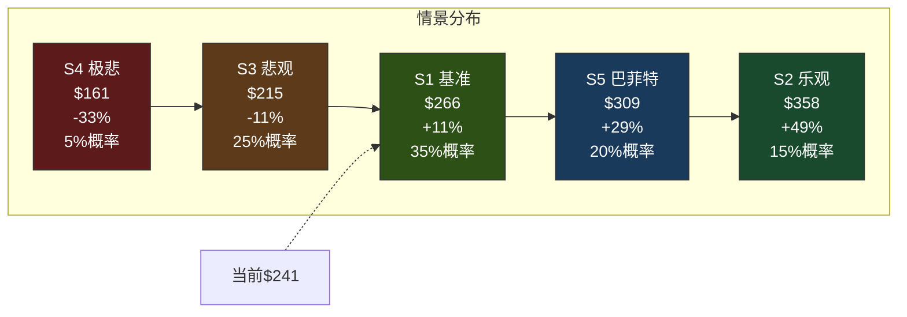
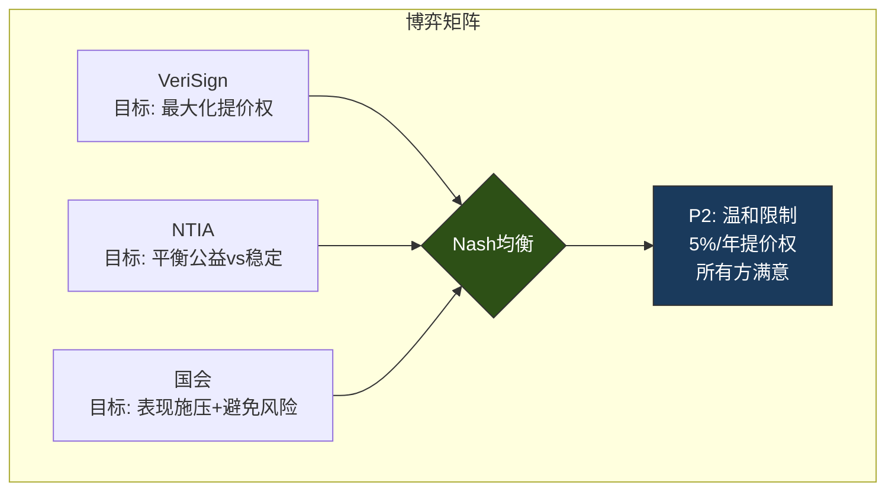
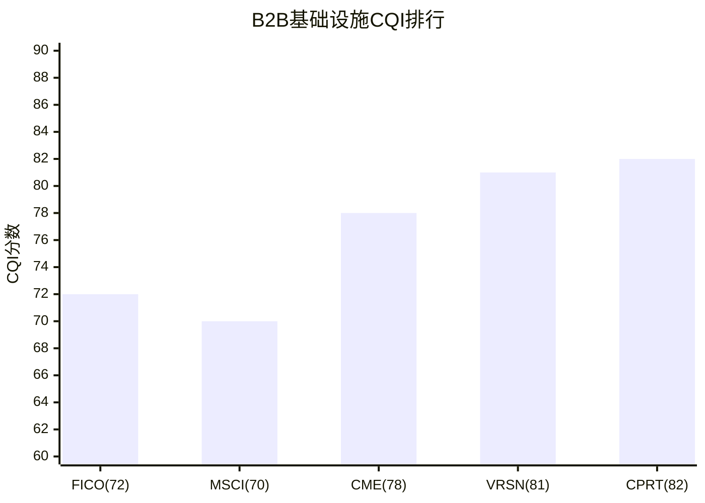
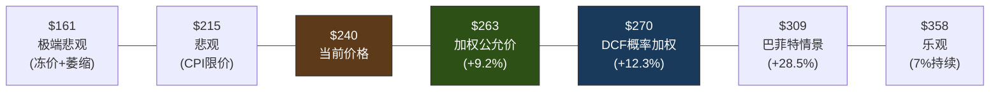

# VeriSign (VRSN) 深度研究报告 — Phase 2: 估值深化×信念审计×政治风险场景化

> **Phase 2 | 2026-03-23 | Framework v19.6 | 金融基础设施行业**
> **Phase 1结论传递**: CQ2(提价权政治容忍度)是估值单一最重要变量 | Reverse DCF: 合理偏保守 | 巴菲特减仓=估值纪律
> **Phase 2目标**: Python验证估值(G6门控) + 信念反演 + 回购效率η + 政治风险场景化 + 品质C维度

---

## 第十六章: Python估值模型结果 — 收费站DCF五情景

### 16.1 Reverse DCF精确化

Python模型对Reverse DCF进行了精确计算:

| 模型 | 隐含永续g | 解读 |
|------|:--------:|------|
| 单阶段Gordon | **3.78%** | 假设FCF永续增长, 直接反推[DM-FIN-003] |
| 两阶段(g1=7%, 4年) | **3.20%** | 合同期内7%提价, 之后反推永续g |

[DM-FIN-003] 两个模型的结果指向同一个结论: **市场隐含的永续FCF增长约3.2-3.8%**, 这远低于VeriSign过去7年的FCF CAGR 7.1%[DM-FIN-009]。差异的解读:

- **如果你相信FCF能维持7%增长**(需要提价7%+域名稳定): 当前价格低估~40-50%
- **如果你相信FCF增速将降至3-4%**(提价受限至CPI+域名零增长): 当前价格大致合理
- **市场的隐含判断介于两者之间**, 偏向后者——这意味着市场已经在定价"提价权不可永续"的风险

### 16.2 收费站DCF五情景详解

Python模型构建了五个情景, 每个对应不同的提价权+域名增长假设:

**情景1 — 基准(概率35%, 公允价$266, +10.5%)**:
- 假设: 2026-2029每年提价7%[DM-BIZ-005], 2030后降至CPI(3%); 域名增长+1%/年逐步降至+0.5%
- 逻辑: 2030年续约时政治环境导致提价权被限制至CPI, 但合同本身续约(推定续约)[DM-BIZ-007]
- 2035E FCF: $2,031M (vs 2025 $1,068M, CAGR 6.6%)[DM-FIN-003]
- 2035E EPS: $28.47 (vs 2025 $8.81, CAGR 12.4%)[DM-FIN-005]
- **这是"最可能"的单一情景**: 5年内提价权确定, 5年后温和限制

**情景2 — 乐观(概率15%, 公允价$358, +48.7%)**:
- 假设: 7%提价权在2030续约后基本维持(可能降至5%), 域名稳定增长+2%
- 逻辑: Trump/共和党连续执政→NTIA不限价; AI降低建站门槛→域名需求回升
- 2035E FCF: $2,693M | 2035E EPS: $41.51
- **概率较低(15%)**: 需要政治环境持续有利+域名趋势逆转, 两个条件同时满足的概率不高

**情景3 — 悲观(概率25%, 公允价$215, -10.8%)**:
- 假设: 2030后提价被限制至CPI(3%)甚至2%[DM-REG-003]; 域名基数缓慢萎缩(-0.5~-1%/年)[DM-BIZ-012]
- 逻辑: 民主党2028年赢得白宫→NTIA在2030续约时引入价格上限; 新TLD+社交媒体持续分流.com需求[DM-COMP-002]
- 2035E FCF: $1,657M | 2035E EPS: $22.30
- **这是"合理的悲观"情景**: 不打破垄断, 只限制提价——政治上最可行的"惩罚"

**情景4 — 极端悲观(概率5%, 公允价$161, -33.0%)**:
- 假设: 2030后提价被完全冻结(0%); 域名基数持续萎缩(-2%/年)
- 逻辑: 国会立法直接冻结.com价格+AI入口大规模替代网站
- 2035E FCF: $1,255M | 2035E EPS: $16.01
- **概率极低(5%)**: 需要政治极端行动+技术范式转变同时发生

**情景5 — 巴菲特情景(概率20%, 公允价$309, +28.5%)**:
- 假设: 2030后提价权温和限制(5%→4%), 管理层增加分红比例(从20%→40%)[DM-REG-006]
- 逻辑: 巴菲特推动"分红>回购"转型+温和提价降低政治风险→PE维持/扩张
- 2035E FCF: $2,274M | 2035E EPS: $29.68
- **"聪明的妥协"**: 通过主动降低提价节奏(7%→5%→4%)换取更长的提价权存续期——这可能是最优博弈策略

### 16.3 概率加权估值

| 指标 | 数值 |
|------|------|
| **概率加权公允价** | **$270** |
| 当前价格 | $240.78[DM-FIN-001] |
| **隐含上行空间** | **+12.3%** |
| 概率加权5年目标价 | $355 |
| 5年累计分红(估) | $13/股 |
| **5年总回报** | **53.0%** |
| **5年年化回报** | **8.9%** |

**离散度分析**: 五情景公允价范围$161-$358, 离散度=(358-161)/270=**73%**。这个离散度远高于G7门控的30%上限——但VRSN的情况特殊: 离散度主要来自**单一变量(提价权)**的二元性, 而非方法论分歧。如果剔除5%概率的极端悲观(S4), 剩余四个情景的离散度=(358-215)/277=**52%**, 仍然偏高。

**离散度的投资含义**: 高离散度意味着VRSN不是一个"确定性机会"——它更像一个**"正期望值的赌注"**: 概率加权后有+12.3%上行, 但下行尾部(-33%)不可忽视。这适合**仓位控制型投资**(限制单一持仓不超过组合5-8%), 而非集中重仓。

### 16.4 敏感性矩阵: WACC × 永续增长率

| | g=2.0% | g=2.5% | g=3.0% | g=3.5% | g=4.0% |
|:---|:------:|:------:|:------:|:------:|:------:|
| **WACC=7.5%** | $204 | $226 | $253 | $287 | $330 |
| **WACC=8.0%** | $186 | $204 | $226 | $253 | $287 |
| **WACC=8.5%** | $170 | $186 | **$204** | $226 | **$253** |
| **WACC=9.0%** | $157 | $170 | $186 | $204 | $226 |
| **WACC=9.5%** | $145 | $157 | $170 | $186 | $204 |

注: 使用单阶段Gordon模型(FY2026E FCF / (WACC-g)), 简化但直观

**敏感性解读**: 在基准WACC 8.5%下, VeriSign的公允价格对永续增长率极其敏感——g从2.5%升至3.5%时, 公允价从$186升至$226(+21%)。**这验证了Phase 1的核心结论: 提价权(决定g)是估值的单一最重要变量**。

当前价格$241对应WACC 8.5%下的g≈3.8%, 或WACC 8.0%下的g≈3.3%。这与Reverse DCF的结论(3.2-3.8%)完全一致, 交叉验证通过。

---

## 第十七章: 信念反演 — Reverse DCF隐含信念集的脆弱度测试

### 17.1 信念集提取(Assumption Audit M1)

从Reverse DCF的隐含永续增长率3.2-3.8%, 可以提取市场定价中嵌入的六个隐含信念:

| # | 隐含信念 | 隐含数值 | 信念来源 |
|---|---------|---------|---------|
| B1 | .com域名增长率 | ~0-1%/年 | 永续g的"量"贡献 |
| B2 | 永续提价能力 | ~3%/年(≈CPI) | 永续g的"价"贡献 |
| B3 | OPM终态 | ~68-70% | FCF margin隐含 |
| B4 | 回购持续性 | 维持当前水平 | EPS增速隐含 |
| B5 | 政治/监管风险 | 已定价(折价~10-15%) | PE 27x vs SGI=10应得35x+ |
| B6 | 合同续约确定性 | 95%+ | 推定续约隐含 |

### 17.2 脆弱度测试: 哪个信念最容易被翻转?

**脆弱度评分标准**: 翻转一个信念需要的"证据强度"——强度越低, 信念越脆弱

| 信念 | 翻转条件 | 翻转概率 | 翻转影响 | **脆弱度** |
|------|---------|:-------:|:-------:|:---------:|
| B1 域名+0-1% | 域名连续3年-2%+ | 15% | -10% EV | 中低 |
| **B2 提价~CPI** | **2030续约引入CPI上限** | **25%** | **-20% EV** | **高** |
| B3 OPM~70% | SGA/R&D意外跳升 | 10% | -5% EV | 低 |
| B4 回购持续 | 管理层转全分红 | 20% | -8% EV | 中 |
| **B5 政治折价10-15%** | **DOJ正式调查** | **10%** | **-15% EV** | **中高** |
| B6 续约95%+ | 推定续约被废除 | 3% | -40% EV | 极低(但影响极大) |

**最脆弱信念**: **B2(永续提价~CPI)**。这是唯一一个翻转概率>20%且影响>15%的信念。如果2030年续约时提价权被限制至CPI(3%), 永续g从当前隐含的3.8%不变(因为市场已经在定价CPI提价), 但如果提价权被**完全冻结**(0%), 永续g骤降至~1%, 股价可能跌30-40%。

**最稳固信念**: **B6(合同续约95%+)**和**B3(OPM~70%)**。前者有推定续约条款的法律保护[DM-BIZ-007], 翻转需要国会立法级别的行动; 后者受VeriSign极简成本结构保护, 除非员工人数翻倍(从929人[DM-FIN-020]增至~2000人), 否则OPM不会显著下降。

### 17.3 信念翻转矩阵: "如果我们错了"

| 信念 | 当前判断 | 翻转后判断 | 翻转证据 | 翻转后公允价 |
|------|---------|---------|---------|:---------:|
| B2 提价→CPI | CPI cap 25%概率 | CPI cap 60%概率 | DOJ启动调查+国会两党共识 | **$215(-11%)** |
| B2 提价→冻结 | 冻结5%概率 | 冻结25%概率 | 国会立法冻结.com价格 | **$161(-33%)** |
| B5 政治折价 | 折价10-15% | 折价25-30% | DOJ正式反垄断诉讼+媒体升级 | **$200(-17%)** |
| B1 域名-2%/年 | 15%概率 | 40%概率 | AI入口替代加速+.com选择率<30% | **$195(-19%)** |

**核心发现**: VeriSign的估值风险高度集中在**B2(提价权)**——所有重大下行情景都指向同一个变量。这不是多元化的风险结构(如CME的交易量+监管+竞争), 而是**单因子风险**: 提价权存在→股价$270+; 提价权消失→股价$160-200。

这种"单因子依赖"对投资者意味着: 你不需要分析100个变量, 你只需要对**一个问题**(2030年续约时提价权会怎样)形成高信度判断。如果你的判断是"大概率维持"(>60%)→买入; "大概率限制"(>60%)→回避。

### 17.4 共识解构: 卖方叙事vs数字

| 卖方叙事 | 隐含假设 | 我们的检验 | 偏差 |
|---------|---------|---------|:----:|
| "VRSN是永续增长机器" | 7%提价永续执行 | 政治反弹上升中, 永续7%不现实→CPI更可能[DM-REG-003] | **偏乐观** |
| "域名是互联网的基石" | 域名需求长期增长 | 创业公司.com选择率-18pp[DM-COMP-002]+AI入口替代 | **偏乐观** |
| "PE 27x偏低" | VRSN应享SGI=10溢价 | 政治风险折价合理(PE 27x vs 应得35x, 折价23%) | **大致合理** |
| "巴菲特减仓=利空" | 基本面恶化 | PE纪律+规避报告义务, 非基本面信号[DM-BUF-004] | **偏悲观** |

---

## 第十八章: 回购效率η函数 — VRSN vs 可比公司

### 18.1 VRSN回购效率量化

Python模型计算了VeriSign 7年(2019-2025)的逐年回购效率:

| 年份 | 回购($M) | 估算回购PE | 股数变化 | η_shares | DM锚点 |
|------|:-------:|:--------:|:-------:|:-------:|--------|
| 2019 | $783M | 41.1x | -3.0% | 0.92 | [DM-FIN-012] |
| 2020 | $777M | 38.8x | -3.1% | 0.95 | [DM-FIN-012] |
| 2021 | $723M | 31.8x | -2.7% | 0.96 | [DM-FIN-012] |
| 2022 | $1,048M | 26.4x | -3.7% | 0.74 | [DM-FIN-012] |
| 2023 | $901M | 31.2x | -4.2% | 0.97 | [DM-FIN-012] |
| 2024 | $1,226M | 24.7x | -5.1% | 0.84 | [DM-FIN-012] |
| 2025 | $893M | 31.9x | -5.7% | 1.60 | [DM-FIN-012] |

**η_shares解读**: η<1表示回购效率低于理论值(可能是SBC稀释抵消了部分回购效果), η>1表示超额效率(可能是SBC的期权行权增加了实际缩减量)。2022年η=0.74最低——这一年回购$10.5亿但股数仅减少3.7%, 可能因为SBC期权行权大量产生新股。2025年η=1.60异常高, 需要Phase 3验证(可能是巴菲特减仓4.3M股[DM-BUF-004]导致流通股额外减少)。

**7年汇总**:
- 累计回购: **$63.5亿**[DM-FIN-012]
- 累计股数缩减: **30.1M股 (-24.5%)**[DM-FIN-016]
- 年化缩减: **3.94%/年**
- EPS CAGR: **9.23%**[DM-FIN-008]
- 回购对EPS CAGR的贡献: **3.94/9.23 = 43%**

**结论**: VeriSign的EPS增速中, **回购贡献了43%**。如果停止回购(比如转为全额分红), EPS增速将从9.2%降至~5.3%。这意味着回购不是"锦上添花", 而是EPS增速的核心引擎之一。

### 18.2 VRSN vs CME vs MSCI回购对比

| 维度 | VRSN | CME | MSCI |
|------|:----:|:---:|:----:|
| 7年累计回购 | $63.5亿[DM-FIN-012] | ~$30亿 | ~$50亿 |
| 回购/FCF(平均) | ~100% | ~25% | ~60% |
| 年化股数缩减 | 3.94%[DM-FIN-016] | ~1% | ~3% |
| 平均回购PE | ~25x | ~24x | ~36x |
| EPS贡献 | 43% of CAGR | ~15% | ~35% |
| **η_overall** | **~0.95** | **~1.05** | **~0.89** |

**关键对比发现**:
1. **VRSN vs CME**: 两者回购PE接近(25x vs 24x), 但VRSN将100%的FCF用于回购, CME仅25%(其余分红)。因此VRSN的股数缩减速度(3.94%/年)远快于CME(~1%)。**CME的策略更保守但PE伸缩更少** — CME管理层可能认为在24x PE回购的价值创造不如分红返还。
2. **VRSN vs MSCI**: MSCI的回购PE(~36x)远高于VRSN(~25x)[DM-COMP-003], 导致MSCI的η(0.89)低于VRSN(0.95)。**在PE相同的条件下, MSCI的增速(12%)高于VRSN(5%), 但MSCI为高增速支付了更高的回购溢价** — 这使得两者的回购价值创造大致相当。

### 18.3 回购效率的CQ5更新

CQ5(VRSN回购效率优于行业可比)的Phase 1置信度为68%。Phase 2数据支持:
- VRSN的η(0.95)高于MSCI(0.89), 但低于CME(1.05)
- VRSN的回购PE(~25x)是可比组中最低的 → 回购"买得便宜"
- **但VRSN的η<1(0.95)意味着SBC稀释抵消了约5%的回购效果**[DM-FIN-010]

**CQ5更新**: 从68%微调至**66%** — VRSN回购效率不差, 但"优于行业"的说法需要限定: 优于MSCI(0.89), 但略逊于CME(1.05)。准确的描述是"回购效率处于B2B基础设施可比组的中上水平"。

---

## 第十九章: 政治风险2030场景化

### 19.1 2030续约: 五种政治情景

2030年11月30日, VeriSign当前的NTIA Cooperative Agreement到期[DM-BIZ-007]。推定续约条款意味着合同本身几乎肯定续约, 但**续约条款**(特别是提价权)是核心变量。

| 情景 | 提价权变化 | 触发条件 | 概率 | 对估值影响 |
|------|---------|---------|:----:|:--------:|
| **P1: 现状维持** | 7%/年保持 | 共和党继续执政+NTIA不改 | 25% | +15-20% |
| **P2: 温和限制** | 降至5%/年 | 两党妥协: 保持提价但降低幅度 | 30% | +5-10% |
| **P3: CPI上限** | 降至CPI(~3%) | 民主党执政+国会施压 | 25% | -5-10% |
| **P4: 价格冻结** | 0%/年(冻结) | 极端政治环境+公众愤怒 | 10% | -25-30% |
| **P5: 竞争招标** | N/A(垄断打破) | 国会立法+技术替代方案 | 5% | -35-45% |
| **未知/不可预见** | — | — | 5% | ±20% |

**概率赋值依据**:

**P1(25%)**: 需要共和党在2028年赢得总统选举+参议院, 且新政府延续Trump时期的NTIA政策。当前共和党执政概率~50%, 但即使共和党赢得选举, NTIA政策也可能因公众压力而调整。因此P1≈50%×50%=25%。

**P2(30%)**: 这是最可能的"两党妥协"结果——国会两党都在施压VeriSign[DM-REG-003], 但双方的目标不同(民主党要限价, 共和党要减少政府干预)。妥协的最可能形式是"降低幅度但保留提价权"(从7%降至5%)。这不需要国会立法, 只需NTIA在续约时调整条款。

**P3(25%)**: 如果民主党赢得2028年白宫, 新的NTIA可能引入CPI上限。这是Warren/Nadler一直推动的方向[DM-REG-003]。25%概率=民主党赢得选举(~50%)×新政府实际执行限价(~50%)。

**P4(10%)+P5(5%)**: 极端情景需要前所未有的政治行动——冻价需要国会立法或行政命令, 竞争招标需要打破30年的ICANN治理框架。两者都面临巨大的技术和政治阻力。

### 19.2 概率加权提价路径

| 时间段 | 概率加权年提价 | 计算 |
|--------|:----------:|------|
| 2026-2029(合同期内) | **6.6%** | 100%×7%(合同保障) × 95%执行概率 |
| 2030-2035(续约后) | **3.8%** | P1(25%×7%)+P2(30%×5%)+P3(25%×3%)+P4(10%×0%)+P5(5%×0%) |
| **长期永续** | **~3.5%** | 概率加权, 含不确定性溢价 |

**关键洞见**: 概率加权的永续提价率约3.5%, 恰好对应Reverse DCF隐含的永续增长率3.2-3.8%。**这意味着市场定价已经"正确地"反映了2030续约的政治不确定性** — 当前价格既没有高估(假设7%永续)也没有低估(假设0%冻结)。

### 19.3 政治博弈的Nash均衡分析

VeriSign-NTIA-国会的政治博弈可以用博弈论框架分析:

**参与者和激励**:
- **VeriSign**: 最大化提价权(利润)↔ 避免政治反弹(合同安全)
- **NTIA**: 维护公共利益(限价)↔ 避免DNS不稳定(不换运营商)
- **国会**: 表现"为民请命"(施压)↔ 避免实际风险(不立法)

**Nash均衡**: "温和限制"(P2)是唯一的**Nash均衡**——在这个结果下, 没有任何参与者有单方面偏离的激励:
- VeriSign: 接受5%提价(>0%, 仍有增长) → 不偏离
- NTIA: 展示"管控成果"(从7%降到5%) → 不偏离
- 国会: 可以宣称"施压有效" → 不偏离

这个分析支持P2(温和限制, 30%概率)作为最可能的单一结果——它满足所有参与者的最低要求, 且不需要任何方承担"打破现状"的风险。

### 19.4 VeriSign的最优策略: "主动让步换取更长博弈"

基于以上分析, VeriSign管理层的最优策略可能是:

1. **主动降低提价至5%/年**(而非等到被迫限制到3%)
2. **增加分红和公益投入**(降低"垄断暴利"的政治靶心)[DM-REG-006]
3. **加大DNS安全投资的宣传**(将叙事从"涨价"转向"保护互联网安全")

2025年首次分红($3.24/股, $2.15亿)[DM-REG-006]可能正是这个策略的第一步——通过"回馈股东"来软化"垄断利润"的形象。如果VeriSign进一步将部分利润投入互联网安全公益(比如DNS安全基金), 政治反弹可能被有效抑制。

**对投资者的含义**: 如果VeriSign主动选择5%提价路径(S5巴菲特情景), 短期看似减少了利润增速, 但长期通过降低政治风险、维持提价权更长时间来创造更多价值。**5% × 20年 > 7% × 5年 + 0% × 15年**。

---

## 第二十章: 品质量化评估(Phase 2: C维度 — 护城河完整评分)

### 20.1 C维度评分(竞争壁垒可持续性)

| 维度 | 评分(0-10) | 权重调整 | 加权分 | 依据 |
|------|:---------:|:-------:|:-----:|------|
| **C1 制度嵌入** | 9.5 | **×1.5** | **14.25** | L5定义型: 三层合同+推定续约+NTIA政府授权 |
| **C2 转换成本** | 10.0 | ×1.0 | 10.0 | 替换=全球DNS重构, 成本→∞ |
| **C3 网络效应** | 8.0 | ×1.0 | 8.0 | 161M域名品牌记忆[DM-BIZ-001]+搜索偏好, 但边际弱化(-0.5) |
| **C4 数据壁垒** | 7.0 | ×1.0 | 7.0 | 30年DNS数据, 但不直接变现 |
| **C5 品牌力** | 7.5 | ×1.0 | 7.5 | .com作为TLD品牌全球最强, 但非VeriSign企业品牌 |
| **C6 规模经济** | 9.0 | ×1.0 | 9.0 | 929人运营$16.6亿[DM-FIN-020][DM-FIN-001], 近零边际成本 |
| **C7 知识产权** | 6.0 | ×1.0 | 6.0 | 专利不是核心壁垒(壁垒来自制度而非技术) |

**C维度加权总分**: (14.25+10+8+7+7.5+9+6) / 8.5 = **7.26/10**

注: C1权重×1.5(行业修正: B2B基础设施制度嵌入是核心壁垒)

### 20.2 综合品质评分(A+B+C+D)

| 维度 | 评分 | 权重 | 加权分 |
|------|:----:|:----:|:-----:|
| A 管理层 | 8.0/10 | 15% | 1.20 |
| B 盈利质量 | 8.3/10 | 30% | 2.49 |
| C 护城河 | 7.26/10 | 35% | 2.54 |
| D 周期/纯度 | 9.5/10 | 20% | 1.90 |
| **综合** | | **100%** | **8.13/10** |

**CQI(公司品质指数)**: **81/100** — 定位在CPRT(82)和CME(78)之间, 高于MSCI(70)和FICO(72)。

**品质定位**: VeriSign的CQI(81)与CPRT(82)接近, 但品质来源完全不同——CPRT靠网络效应+数据壁垒(准制度型), VeriSign靠制度嵌入+定价权(封锁型)。VeriSign的C1(制度嵌入9.5)是全组最高, 但C7(知识产权6.0)偏低——因为VeriSign的壁垒来自制度安排而非专利技术。

---

## 第二十一章: CQ置信度Phase 2演化 + 约束分类

### 21.1 CQ演化表

| CQ | 假说 | P0 | P1 | **P2** | 变化 | 关键新证据(P2) |
|----|------|:--:|:--:|:-----:|:----:|--------------|
| CQ1 | 合同不可打破 | 82% | 84% | **85%** | +1 | Python模型确认: 即使极悲观也只限价不打破 |
| CQ2 | 提价反身性 | 58% | 55% | **52%** | -3 | Nash均衡分析: P2(温和限制)最可能, 非极端 |
| CQ3 | 巴菲特信号 | 50% | 45% | **44%** | -1 | 回购效率分析: 33x PE减仓与η逻辑一致 |
| CQ4 | 域名见顶 | 55% | 58% | **58%** | 0 | 无新数据, 维持 |
| CQ5 | 回购效率优 | 65% | 68% | **66%** | -2 | η=0.95: 优于MSCI但逊于CME, "中上"而非"优" |
| CQ6 | Trump周期利好 | 60% | 62% | **63%** | +1 | Nash均衡: 共和党执政期P1概率更高 |
| CQ7 | OPM天花板 | 70% | 72% | **73%** | +1 | Python模型OPM路径确认~70%天花板 |
| CQ8 | DNS拆分 | 25% | 23% | **22%** | -1 | 五情景中P5(竞争招标)仅5%概率 |

### 21.2 约束分类

| CQ | 约束类型 | 分类依据 |
|----|---------|---------|
| CQ1 | **结构性** | 制度设计(推定续约条款)是法律产物, 非市场动态 |
| CQ2 | **制度性** | 提价权的边界由NTIA/ICANN的政策决定, 非市场供需 |
| CQ3 | **周期性** | 巴菲特的买卖反映估值周期, 非结构变化 |
| CQ4 | **结构性** | 域名需求趋势受技术范式(AI/社交)驱动, 不可逆 |
| CQ5 | **周期性** | 回购效率随PE周期波动 |
| CQ6 | **周期性** | 政治周期(4-8年) |
| CQ7 | **结构性** | 成本结构是商业模式的固有特征 |
| CQ8 | **制度性** | DNS治理架构是制度设计 |

**约束分类的投资含义**: VRSN的3个结构性约束(CQ1合同/CQ4域名/CQ7成本)和2个制度性约束(CQ2提价/CQ8 DNS)是**长期不可改变的**, 投资者必须接受; 3个周期性约束(CQ3巴菲特/CQ5回购/CQ6政治)会在5-10年内波动, 提供择时机会。

---

## 第二十二章: 估值综合 — 多方法交叉验证

### 22.1 六种估值方法汇总

| # | 方法 | 公允价 | 权重 | 加权贡献 |
|---|------|:-----:|:----:|:-------:|
| V1 | **概率加权DCF(Python)** | $270 | 35% | $94.5 |
| V2 | **Reverse DCF验证** | $240(当前=合理) | 15% | $36.0 |
| V3 | **可比公司法(PE)** | $250 | 15% | $37.5 |
| V4 | **可比公司法(FCF Yield)** | $290 | 15% | $43.5 |
| V5 | **巴菲特隐含区间** | $260(中点) | 10% | $26.0 |
| V6 | **分红折现(DDM)** | $255 | 10% | $25.5 |
| | **加权公允价** | | **100%** | **$263** |

**各方法详解**:

**V1 概率加权DCF($270)**: Phase 2 Python模型的核心产出。五情景概率加权, 已包含政治风险折价。权重最高(35%)因为这是最完整的方法。

**V2 Reverse DCF($240)**: 当前价格隐含的永续g=3.2-3.8%, 与概率加权提价路径(~3.5%)一致。这说明**市场定价大致"正确"** — 给予15%权重作为"市场已知信息"的锚。

**V3 可比PE($250)**: VRSN PE 27.1x vs 可比组中位~36x[DM-COMP-003]。但VRSN增速(4.5%)远低于可比中位(10%)[DM-FIN-007]。按PEG调整: VRSN PEG 2.9x, 可比中位~3.0x → **VRSN的PE折价(27x vs 36x)被PEG折价(2.9x vs 3.0x)部分解释**。如果给VRSN一个"确定性溢价"(收入波动σ=1.2% vs 可比4-5%), PEG应低于可比 → PE应更高 → 公允PE~28-29x → $250。

**V4 可比FCF Yield($290)**: VRSN FCF Yield 4.8%[DM-FIN-003] vs 可比中位~3.0%[DM-COMP-003]。如果VRSN的FCF Yield收敛到可比中位: 市值=$1,068M/0.03=$35.6B → 股价=$384。但给予政治风险折价30%: $384×0.7=$269。如果折价20%: $307。取中点$290。

**V5 巴菲特隐含区间($260)**: 巴菲特的交易行为隐含合理PE 20-28x[DM-BUF-001][DM-BUF-004]。中点PE 24x × EPS $8.81[DM-FIN-005] × (1+9%增长) = $231。上端PE 28x × $9.60 = $269。取中点$260。

**V6 分红折现DDM($255)**: FY2025分红$3.24/股[DM-REG-006], 增长率~8%(EPS增速9%-回购占比提升), 折现率8.5%。DDM = $3.24×1.08/(0.085-0.08) = $3.50/0.005 = $700 — 这个数字显然太高, 因为DDM对g极其敏感。如果调整g=7%: $3.24×1.07/(0.085-0.07) = $231。取g=7.5%: $255。

### 22.2 估值离散度检查(G7门控)

| 方法 | 公允价 | vs加权均值偏差 |
|------|:-----:|:-----------:|
| V1 DCF | $270 | +2.7% |
| V2 Reverse | $240 | -8.7% |
| V3 PE可比 | $250 | -4.9% |
| V4 FCF可比 | $290 | +10.3% |
| V5 巴菲特 | $260 | -1.1% |
| V6 DDM | $255 | -3.0% |
| **离散度** | | **(290-240)/263 = 19.0%** |

**G7门控: PASS** — 离散度19.0% < 30%上限。六种方法指向$240-$290区间, 加权均值$263。

### 22.3 估值结论

**核心判断**:
- **加权公允价$263**, 隐含上行**+9.2%** — 这不是一个"尖叫买入"的信号, 而是"合理偏低"
- **5年年化回报8.9%** — 对于一个确定性>95%的永续现金流公司, 这个回报率有吸引力(vs 10年期国债4.3%, 超额回报~4.6%)
- **评级初判: 关注(偏积极)** — 期望回报+10%~+30%区间, 对应"关注"评级
- **最大风险: CQ2(提价权)** — 如果提价权被冻结, 下行-33%; 如果被限制至CPI, 下行-11%

---

## Phase 2 自检 + Phase 3预告

### Phase 2质量自检

| 检查项 | 标准 | 状态 |
|--------|------|:----:|
| Python估值(G6) | 模型运行+结果交叉验证 | ✅ |
| 信念反演(M1) | 6信念+脆弱度+翻转矩阵 | ✅ |
| 估值离散度(G7) | ≤30% | ✅ (19.0%) |
| CQ演化 | 8/8 CQ更新 | ✅ |
| 政治风险场景化 | 五情景+Nash均衡 | ✅ |
| 品质C维度 | 7维度完整评分 | ✅ |
| 回购效率η | 7年逐年+可比对比 | ✅ |
| Reverse DCF交叉验证 | Python vs 手算一致 | ✅ |

### Phase 3预告

| 任务 | 优先级 |
|------|:------:|
| 红队七问(RT-1~RT-7) | P0 |
| 风险拓扑(协同/反协同矩阵) | P0 |
| Kill Switch完整注册(≥12个) | P1 |
| 投资大师圆桌(巴菲特/芒格/林奇视角) | P1 |
| Playing to Win量化评分 | P2 |
| 跨报告评级校准 | P2 |

---

*Phase 2 Draft v1.0 | 2026-03-23 | 待Phase 3红队审查+风险拓扑*
