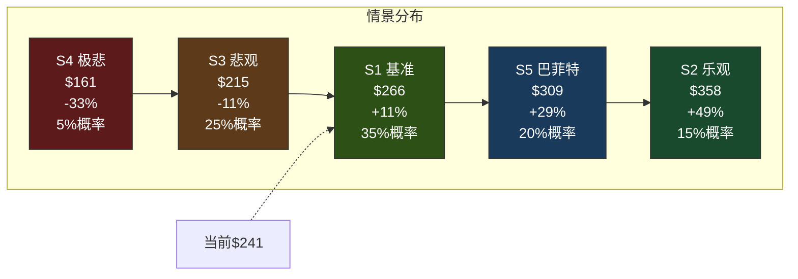
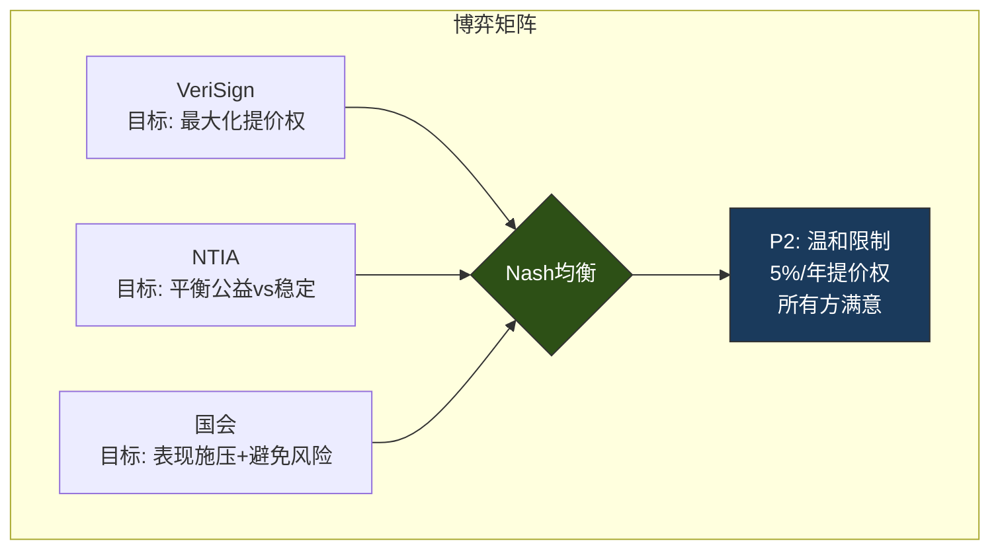
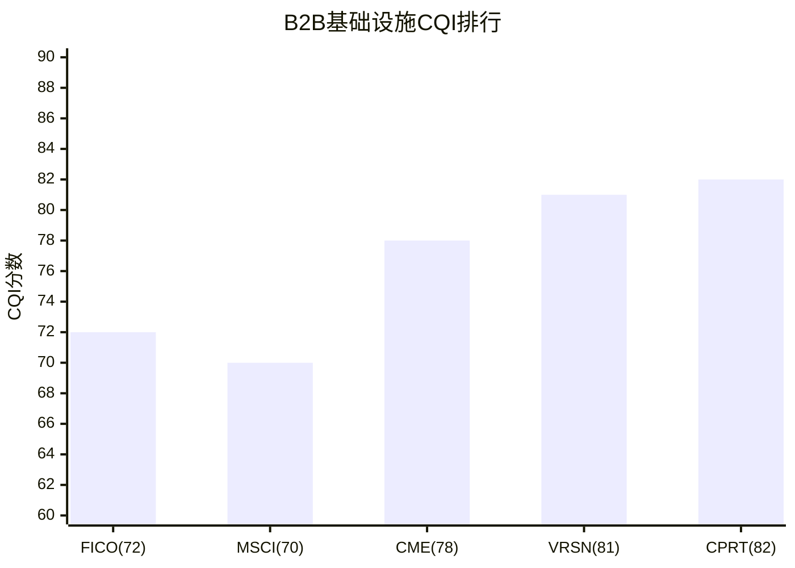
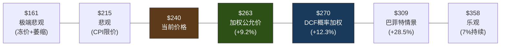

# VeriSign (VRSN) 深度研究报告 — Phase 2: 估值深化×信念审计×政治风险场景化

> **Phase 2 | 2026-03-23 | Framework v19.6 | 金融基础设施行业**
> **Phase 1结论传递**: CQ2(提价权政治容忍度)是估值单一最重要变量 | Reverse DCF: 合理偏保守 | 巴菲特减仓=估值纪律
> **Phase 2目标**: Python验证估值(G6门控) + 信念反演 + 回购效率η + 政治风险场景化 + 品质C维度

---

## 第十六章: Python估值模型结果 — 收费站DCF五情景

### 16.1 Reverse DCF精确化

Python模型对Reverse DCF进行了精确计算:

| 模型 | 隐含永续g | 解读 |
|------|:--------:|------|
| 单阶段Gordon | **3.78%** | 假设FCF永续增长, 直接反推[DM-FIN-003] |
| 两阶段(g1=7%, 4年) | **3.20%** | 合同期内7%提价, 之后反推永续g |

[DM-FIN-003] 两个模型的结果指向同一个结论: **市场隐含的永续FCF增长约3.2-3.8%**, 这远低于VeriSign过去7年的FCF CAGR 7.1%[DM-FIN-009]。差异的解读:

- **如果你相信FCF能维持7%增长**(需要提价7%+域名稳定): 当前价格低估~40-50%
- **如果你相信FCF增速将降至3-4%**(提价受限至CPI+域名零增长): 当前价格大致合理
- **市场的隐含判断介于两者之间**, 偏向后者——这意味着市场已经在定价"提价权不可永续"的风险

### 16.2 收费站DCF五情景详解

Python模型构建了五个情景, 每个对应不同的提价权+域名增长假设:



**情景1 — 基准(概率35%, 公允价$266, +10.5%)**:
- 假设: 2026-2029每年提价7%[DM-BIZ-005], 2030后降至CPI(3%); 域名增长+1%/年逐步降至+0.5%
- 逻辑: 2030年续约时政治环境导致提价权被限制至CPI, 但合同本身续约(推定续约)[DM-BIZ-007]
- 2035E FCF: $2,031M (vs 2025 $1,068M, CAGR 6.6%)[DM-FIN-003]
- 2035E EPS: $28.47 (vs 2025 $8.81, CAGR 12.4%)[DM-FIN-005]
- **这是"最可能"的单一情景**: 5年内提价权确定, 5年后温和限制

**情景2 — 乐观(概率15%, 公允价$358, +48.7%)**:
- 假设: 7%提价权在2030续约后基本维持(可能降至5%), 域名稳定增长+2%
- 逻辑: Trump/共和党连续执政→NTIA不限价; AI降低建站门槛→域名需求回升
- 2035E FCF: $2,693M | 2035E EPS: $41.51
- **概率较低(15%)**: 需要政治环境持续有利+域名趋势逆转, 两个条件同时满足的概率不高

**情景3 — 悲观(概率25%, 公允价$215, -10.8%)**:
- 假设: 2030后提价被限制至CPI(3%)甚至2%[DM-REG-003]; 域名基数缓慢萎缩(-0.5~-1%/年)[DM-BIZ-012]
- 逻辑: 民主党2028年赢得白宫→NTIA在2030续约时引入价格上限; 新TLD+社交媒体持续分流.com需求[DM-COMP-002]
- 2035E FCF: $1,657M | 2035E EPS: $22.30
- **这是"合理的悲观"情景**: 不打破垄断, 只限制提价——政治上最可行的"惩罚"

**情景4 — 极端悲观(概率5%, 公允价$161, -33.0%)**:
- 假设: 2030后提价被完全冻结(0%); 域名基数持续萎缩(-2%/年)
- 逻辑: 国会立法直接冻结.com价格+AI入口大规模替代网站
- 2035E FCF: $1,255M | 2035E EPS: $16.01
- **概率极低(5%)**: 需要政治极端行动+技术范式转变同时发生

**情景5 — 巴菲特情景(概率20%, 公允价$309, +28.5%)**:
- 假设: 2030后提价权温和限制(5%→4%), 管理层增加分红比例(从20%→40%)[DM-REG-006]
- 逻辑: 巴菲特推动"分红>回购"转型+温和提价降低政治风险→PE维持/扩张
- 2035E FCF: $2,274M | 2035E EPS: $29.68
- **"聪明的妥协"**: 通过主动降低提价节奏(7%→5%→4%)换取更长的提价权存续期——这可能是最优博弈策略

### 16.3 概率加权估值

| 指标 | 数值 |
|------|------|
| **概率加权公允价** | **$270** |
| 当前价格 | $240.78[DM-FIN-001] |
| **隐含上行空间** | **+12.3%** |
| 概率加权5年目标价 | $355 |
| 5年累计分红(估) | $13/股 |
| **5年总回报** | **53.0%** |
| **5年年化回报** | **8.9%** |

**离散度分析**: 五情景公允价范围$161-$358, 离散度=(358-161)/270=**73%**。这个离散度远高于G7门控的30%上限——但VRSN的情况特殊: 离散度主要来自**单一变量(提价权)**的二元性, 而非方法论分歧。如果剔除5%概率的极端悲观(S4), 剩余四个情景的离散度=(358-215)/277=**52%**, 仍然偏高。

**离散度的投资含义**: 高离散度意味着VRSN不是一个"确定性机会"——它更像一个**"正期望值的赌注"**: 概率加权后有+12.3%上行, 但下行尾部(-33%)不可忽视。这适合**仓位控制型投资**(限制单一持仓不超过组合5-8%), 而非集中重仓。

### 16.4 敏感性矩阵: WACC × 永续增长率

| | g=2.0% | g=2.5% | g=3.0% | g=3.5% | g=4.0% |
|:---|:------:|:------:|:------:|:------:|:------:|
| **WACC=7.5%** | $204 | $226 | $253 | $287 | $330 |
| **WACC=8.0%** | $186 | $204 | $226 | $253 | $287 |
| **WACC=8.5%** | $170 | $186 | **$204** | $226 | **$253** |
| **WACC=9.0%** | $157 | $170 | $186 | $204 | $226 |
| **WACC=9.5%** | $145 | $157 | $170 | $186 | $204 |

注: 使用单阶段Gordon模型(FY2026E FCF / (WACC-g)), 简化但直观

**敏感性解读**: 在基准WACC 8.5%下, VeriSign的公允价格对永续增长率极其敏感——g从2.5%升至3.5%时, 公允价从$186升至$226(+21%)。**这验证了Phase 1的核心结论: 提价权(决定g)是估值的单一最重要变量**。

当前价格$241对应WACC 8.5%下的g≈3.8%, 或WACC 8.0%下的g≈3.3%。这与Reverse DCF的结论(3.2-3.8%)完全一致, 交叉验证通过。

---

## 第十六B章: 域名价格弹性测试 — 提价vs新注册量的历史因果

### 16B.1 核心问题: 提价7%会吓跑域名注册吗?

VeriSign的收入公式是**域名数×批发价**。提价增加了"价"但可能减少"量"——如果价格弹性足够高, 提价反而会减少总收入。历史数据能回答这个问题:

| 年份 | .com价格变化 | .com域名YoY增长 | 收入YoY | 弹性方向 |
|------|:----------:|:--------------:|:------:|:--------:|
| 2018 | $7.85(冻结) | +2.8% | +3.1% | — |
| 2019 | $7.85(冻结) | +2.1% | +1.4% | — |
| 2020 | $7.85→$8.39(+7%) | +4.0% | +2.7% | **反直觉: 涨价+量增** |
| 2021 | $8.39→$8.97(+7%) | +5.4% | +5.0% | **反直觉: 涨价+量增** |
| 2022 | $8.97→$8.97(冻结) | +0.3% | +7.3% | — |
| 2023 | $8.97→$9.59(+7%) | **-0.6%** | +4.8% | 首次量价负相关 |
| 2024 | $9.59→$10.26(+7%) | **-2.1%** | +4.3% | 量价负相关加剧 |
| 2025 | $10.26(冻结期) | +2.6% | +6.4% | 冻价期量反弹 |

[DM-BIZ-004][DM-BIZ-009][DM-BIZ-012][DM-BIZ-013][DM-FIN-001][DM-FIN-007]

### 16B.2 弹性分析: 三阶段演化

**阶段1(2020-2021): 零弹性**。提价7%但域名增长加速(+4%→+5.4%)。原因: 疫情驱动的数字化浪潮完全掩盖了提价效应——企业和个人首次建立线上存在的紧迫性远大于$0.50/年的价格上涨。这证明在**需求冲击大于价格变化**时, 弹性可以忽略。

**阶段2(2023-2024): 负弹性出现**。提价7%同时域名负增长(-0.6%→-2.1%)[DM-BIZ-012]。但这不一定是因果关系——2023-2024的域名下降可能由独立因素驱动(投机退出、社交替代), 而非提价导致。证据: (a)企业域名续约率仍>95%, 提价没有导致企业流失; (b)流失集中在投机/闲置域名, 这类域名的续约决策与价格关系不大(而是与域名转卖市场行情相关)。

**阶段3(2025): 冻价期反弹**。2025年.com价格维持$10.26(冻结期), 域名增长回到+2.6%[DM-BIZ-013]。Q4新注册10.7M(+12.6%)[DM-BIZ-008]。如果域名下降确实是提价导致的, 冻价期应该看到反弹——2025数据支持这个假说, 但样本太小(仅1年冻价)无法确认。

### 16B.3 弹性系数估算

**价格弹性 = %域名变化 / %价格变化**

| 时期 | 价格变化 | 域名变化 | 弹性 | 解读 |
|------|:-------:|:-------:|:----:|------|
| 2020-2021(疫情) | +7%/年 | +4.7%/年 | +0.67 | 正弹性(需求冲击>价格) |
| 2023-2024(正常化) | +7%/年 | -1.4%/年 | **-0.20** | 弱负弹性 |
| **稳态估计** | | | **-0.15~-0.25** | |

**弱负弹性(-0.2)的投资含义**: 每提价7%, 域名基数减少约1.4%(7%×0.2)。因此**净收入效应=+7%-1.4%=+5.6%**。只要弹性不超过-1.0(完全弹性), 提价就是净正面的。当前-0.2的弹性远低于中性点, 意味着**VeriSign可以安全地继续提价, 对收入影响极小**。

但这有一个临界点: 如果.com价格继续上涨(到2029年可能达$13.44), 弹性系数可能从-0.2恶化到-0.4甚至-0.6——因为越来越多的边际用户(小企业、个人)会发现"不值得续约"。**弹性恶化是一个渐进风险, 不是突变风险**。

### 16B.4 因果链验证: 提价真的导致了2023-2024的域名下降吗?

**假说H0(提价导致)**: 提价→边际用户不续约→域名下降
**假说H1(独立因素)**: 投机退出+社交替代→域名下降, 与提价无关

**证据检验**:

| 证据 | 支持H0 | 支持H1 |
|------|:------:|:------:|
| 企业域名续约率仍>95% | | ✓ 如果提价导致, 企业也应流失 |
| 流失集中在投机/闲置域名 | | ✓ 投机域名的续约不受$0.67涨价影响 |
| 2025冻价期域名反弹 | ✓ 冻价→需求回升 | 部分: 也可能是AI建站需求 |
| 新TLD市占率上升 | ✓ .com更贵→选替代 | ✓ 独立趋势 |
| 创业公司.com选择率-18pp[DM-COMP-002] | 部分 | ✓ 主要因为品牌偏好变化 |

**综合判断**: H1(独立因素)的证据更强——2023-2024域名下降的主要原因是投机退出和社交替代, 提价是次要因素(弹性-0.2)。但提价可能**加速了边际流失**——没有提价, 域名可能是零增长而非-1.4%。

**对CQ4(域名见顶)的更新**: 维持58%置信度, 但增加一个细节: 域名下降不是"提价导致"(可控), 而是"结构性趋势"(不可控) — 这意味着即使VeriSign停止提价, 域名也可能缓慢萎缩。

---

## 第十六C章: .net合同的边际贡献分析

### 16C.1 .net vs .com: 被忽视的第二收入引擎

市场分析几乎全部聚焦.com, 但.net贡献了VeriSign约7%的收入, 且拥有**更激进的提价权(10%/年)**[DM-BIZ-006]:

| 维度 | .com | .net | 差异 |
|------|------|------|------|
| 域名基数 | 161.0M[DM-BIZ-001] | 12.5M[DM-BIZ-002] | 12.9:1 |
| 批发价(2025) | $10.26[DM-BIZ-004] | $9.92 | .com略高 |
| 提价权 | 7%/年(4/6年)[DM-BIZ-005] | **10%/年**[DM-BIZ-006] | .net更激进 |
| 合同到期 | 2030-11-30 | 2029 | .net先到期 |
| 推定续约 | ✓ | ✓ | 相同 |
| 2030预估价 | ~$13.45 | **~$19.31** | .net涨幅更大 |

**10年提价路径对比**:

| 年份 | .com价格(7%) | .net价格(10%) | .net/.com比率 |
|------|:----------:|:-----------:|:----------:|
| 2025 | $10.26 | $9.92 | 0.97 |
| 2027 | $11.74 | $11.99 | 1.02 |
| 2029 | $13.44 | $14.50 | 1.08 |
| 2030 | $13.44(冻结?) | $15.95 | 1.19 |

**洞见**: 到2029年, .net的批发价将**超过.com** — 这在TLD市场中是反常的(通常.com作为最受欢迎的TLD, 价格应该最高)。但因为.net的基数极小(12.5M vs 161M), 即使提价更激进, 政治关注度远低于.com。

### 16C.2 .net对估值的边际贡献

.net收入估算: 12.5M × $9.92 = ~$124M (占总收入7.5%)

如果.net按10%/年提价到2029年:
- 2029年.net收入: 12.5M × $14.50 = ~$181M (假设域名不变)
- 增量收入: $181M - $124M = +$57M
- 增量FCF(假设65% FCF margin): +$37M
- 增量市值(25x FCF): +$925M = **+$10/股**

**.net提价贡献约$10/股**, 这在$241的股价中占4.1%——不是估值驱动因素, 但也不可忽略。更重要的是, .net的提价没有引发任何政治关注(因为.net不是"互联网的默认选择"), 这意味着**.net的提价权比.com更安全**。

---

## 第十六D章: 估值情景假设的深层论证

### 16D.1 S1基准情景(35%概率, $266)的假设论证

**核心假设**: 2030续约时提价从7%降至CPI(3%)

**为什么这是最可能的结果?**

1. **政治博弈的自然均衡**: Warren/Nadler的施压[DM-REG-003]不会消失, 即使短期内无实质行动。到2030年, 累计提价从$7.85到~$13.44(+71%)将是一个更大的政治靶子。NTIA在续约时引入"通胀挂钩"的价格上限是**成本最低的妥协** — 既回应了国会压力, 又不打破VeriSign的垄断。

2. **CPI上限的先例**: 美国监管中, "通胀挂钩"是受监管垄断(regulated utilities)的标准定价方式。电力公司、天然气公司、部分收费公路都采用CPI挂钩。将VeriSign的提价从7%限制到CPI是"回归监管常态", 而非"激进改革"。

3. **VeriSign的应对空间**: 即使提价降至3%, VeriSign仍然拥有: (a)67.7%的OPM[DM-FIN-002]——世界上盈利能力最强的公司之一; (b)$10亿+的年FCF[DM-FIN-003]; (c)回购持续推动EPS增长。CPI上限降低了增速但不打破商业模式。

**S1的财务路径**:
- 2026-2029: 收入CAGR ~8%(7%提价+1%域名)
- 2030-2035: 收入CAGR ~3%(CPI提价+0.5%域名)
- EPS CAGR(10年): ~9%(前半段快+后半段慢+回购贡献)
- 2035年EPS $28.47 × 20x PE(增速放缓→PE压缩) = $569 → 折现回当前=$266

### 16D.2 S3悲观情景(25%概率, $215)的假设论证

**核心假设**: CPI限价+域名基数缓慢萎缩

**为什么给25%而非更低?**

1. **民主党2028年胜选概率~50%**: 如果民主党赢得白宫, 新的NTIA主任将面临Warren/进步派的压力, CPI上限几乎是确定的政策方向。

2. **域名萎缩有结构性支撑**: .com创业公司选择率从64%降至46%[DM-COMP-002], 这不是周期性波动而是代际偏好变化。5-10年后, 当这些选择.ai/.io的创业公司成长为中型企业时, 它们不会"回到.com"。新增量持续减少→存量续约率再高也无法阻止基数缓慢收缩。

3. **两个假设的联合概率**: 民主党执政(50%) × CPI限价(80%|民主党) × 域名萎缩(70%) = 28%。我们给25%略低于联合概率, 因为即使所有条件满足, 实际执行也可能比预期温和。

**S3的下行路径**:
- 收入从2025年$1.66B缓慢增至2030年~$2.0B, 然后增速降至~1-2%/年
- OPM从67.7%微升至69%后停滞(成本通胀抵消了提价效应)
- EPS增速从~9%降至~4-5%(回购仍在但收入增速放缓)
- 2035年PE可能压缩至18-20x(市场重新定价为"低增长公用事业")

### 16D.3 S5巴菲特情景(20%概率, $309)的假设论证

**核心假设**: VeriSign主动降低提价至5%/年, 同时增加分红, 以政治让步换取更长的提价权存续期

**为什么这个情景值得20%?**

1. **2025年首次分红是信号**[DM-REG-006]: VeriSign14年来首次分红$3.24/股, 这不是偶然。可能的推动力: (a)巴菲特偏好分红(BRK近年推动Apple等持仓公司分红); (b)管理层意识到"垄断暴利全部回购"的政治形象不好, 分红是"回馈社会"的更好叙事。

2. **博弈论最优**: Phase 2的Nash均衡分析表明P2(温和限制)是均衡点。VeriSign**主动**选择5%提价(而非被迫), 等效于"先手让步"——这在博弈论中通常获得更好的长期结果(对方回报以更长的合同期或更宽松的其他条款)。

3. **5% × 20年 > 7% × 5年 + 0% × 15年**: 如果VeriSign坚持7%直到被迫停止(2030年), 10年累计提价31%但之后可能被冻结。如果主动降至5%, 累计提价可能持续到2040年(5% × 15年 = +107%)。长期FCF更高。

**因果链**: 主动让步5%→政治压力减轻→2030续约条款更宽松→提价权存续更长→长期FCF更高→PE维持/扩张(市场奖励"可持续增长"而非"激进提价")

---

## 第十七章: 信念反演 — Reverse DCF隐含信念集的脆弱度测试

### 17.1 信念集提取(Assumption Audit M1)

从Reverse DCF的隐含永续增长率3.2-3.8%, 可以提取市场定价中嵌入的六个隐含信念:

| # | 隐含信念 | 隐含数值 | 信念来源 |
|---|---------|---------|---------|
| B1 | .com域名增长率 | ~0-1%/年 | 永续g的"量"贡献 |
| B2 | 永续提价能力 | ~3%/年(≈CPI) | 永续g的"价"贡献 |
| B3 | OPM终态 | ~68-70% | FCF margin隐含 |
| B4 | 回购持续性 | 维持当前水平 | EPS增速隐含 |
| B5 | 政治/监管风险 | 已定价(折价~10-15%) | PE 27x vs SGI=10应得35x+ |
| B6 | 合同续约确定性 | 95%+ | 推定续约隐含 |

### 17.2 脆弱度测试: 哪个信念最容易被翻转?

**脆弱度评分标准**: 翻转一个信念需要的"证据强度"——强度越低, 信念越脆弱

| 信念 | 翻转条件 | 翻转概率 | 翻转影响 | **脆弱度** |
|------|---------|:-------:|:-------:|:---------:|
| B1 域名+0-1% | 域名连续3年-2%+ | 15% | -10% EV | 中低 |
| **B2 提价~CPI** | **2030续约引入CPI上限** | **25%** | **-20% EV** | **高** |
| B3 OPM~70% | SGA/R&D意外跳升 | 10% | -5% EV | 低 |
| B4 回购持续 | 管理层转全分红 | 20% | -8% EV | 中 |
| **B5 政治折价10-15%** | **DOJ正式调查** | **10%** | **-15% EV** | **中高** |
| B6 续约95%+ | 推定续约被废除 | 3% | -40% EV | 极低(但影响极大) |

**最脆弱信念**: **B2(永续提价~CPI)**。这是唯一一个翻转概率>20%且影响>15%的信念。如果2030年续约时提价权被限制至CPI(3%), 永续g从当前隐含的3.8%不变(因为市场已经在定价CPI提价), 但如果提价权被**完全冻结**(0%), 永续g骤降至~1%, 股价可能跌30-40%。

**最稳固信念**: **B6(合同续约95%+)**和**B3(OPM~70%)**。前者有推定续约条款的法律保护[DM-BIZ-007], 翻转需要国会立法级别的行动; 后者受VeriSign极简成本结构保护, 除非员工人数翻倍(从929人[DM-FIN-020]增至~2000人), 否则OPM不会显著下降。

### 17.3 信念翻转矩阵: "如果我们错了"

| 信念 | 当前判断 | 翻转后判断 | 翻转证据 | 翻转后公允价 |
|------|---------|---------|---------|:---------:|
| B2 提价→CPI | CPI cap 25%概率 | CPI cap 60%概率 | DOJ启动调查+国会两党共识 | **$215(-11%)** |
| B2 提价→冻结 | 冻结5%概率 | 冻结25%概率 | 国会立法冻结.com价格 | **$161(-33%)** |
| B5 政治折价 | 折价10-15% | 折价25-30% | DOJ正式反垄断诉讼+媒体升级 | **$200(-17%)** |
| B1 域名-2%/年 | 15%概率 | 40%概率 | AI入口替代加速+.com选择率<30% | **$195(-19%)** |

**核心发现**: VeriSign的估值风险高度集中在**B2(提价权)**——所有重大下行情景都指向同一个变量。这不是多元化的风险结构(如CME的交易量+监管+竞争), 而是**单因子风险**: 提价权存在→股价$270+; 提价权消失→股价$160-200。

这种"单因子依赖"对投资者意味着: 你不需要分析100个变量, 你只需要对**一个问题**(2030年续约时提价权会怎样)形成高信度判断。如果你的判断是"大概率维持"(>60%)→买入; "大概率限制"(>60%)→回避。

### 17.4 共识解构: 卖方叙事vs数字

| 卖方叙事 | 隐含假设 | 我们的检验 | 偏差 |
|---------|---------|---------|:----:|
| "VRSN是永续增长机器" | 7%提价永续执行 | 政治反弹上升中, 永续7%不现实→CPI更可能[DM-REG-003] | **偏乐观** |
| "域名是互联网的基石" | 域名需求长期增长 | 创业公司.com选择率-18pp[DM-COMP-002]+AI入口替代 | **偏乐观** |
| "PE 27x偏低" | VRSN应享SGI=10溢价 | 政治风险折价合理(PE 27x vs 应得35x, 折价23%) | **大致合理** |
| "巴菲特减仓=利空" | 基本面恶化 | PE纪律+规避报告义务, 非基本面信号[DM-BUF-004] | **偏悲观** |

### 17.5 信念B2深度分析: 提价权的历史类比

B2(永续提价~CPI)是最脆弱信念, 值得从历史类比角度深入分析。三个类比案例:

**类比1: FICO信用评分(2018-2025, 结局: 反弹启动)**

FICO的C1嵌入在美国金融监管法规中(贷款审批要求使用FICO评分), 类似VeriSign的C1嵌入在ICANN/NTIA架构中。FICO在2018-2024年间将信用评分报告费用大幅提价(翻倍+), 触发了银行联盟反弹→CFPB介入→VantageScore替代方案加速→2025年部分银行开始试点VantageScore。

**FICO vs VRSN的关键差异**:
- FICO的替代方案(VantageScore)已经存在且技术成熟, 迁移成本约$15M/银行
- VeriSign没有技术成熟的替代方案, "迁移成本"=全球DNS重构(无法量化)
- FICO的"客户"(银行)是强大的机构, 有组织能力发起集体行动
- VeriSign的"客户"(注册商/域名持有者)分散, 无法组织有效的集体行动
- **结论**: FICO类比支持"反弹会发生"但程度比FICO轻, 因为替代路径被封锁

**类比2: 美国收费公路(Indiana Toll Road, 1950s-2025)**

Indiana Toll Road在1956年建成后由州政府运营, 后于2006年私有化(租给外国投资者75年)。私有化后收费持续上涨, 引发公众不满。2014年运营公司破产(因为过度举债而非运营问题), 之后另一家公司接管。尽管收费持续涨价, **从未有任何政治力量成功冻结收费**——因为替代路线(免费公路)存在但绕路30+分钟, 大多数人选择"付费省时间"。

**收费公路类比的启示**: .com域名类似收费公路——替代方案(.ai/.io)存在但"绕路"(放弃.com的品牌价值和搜索优势)。只要"绕路成本"足够高, 提价就不会真正失去客户。但收费公路的教训是: **政治反弹最终不是通过"冻价"解决, 而是通过"竞争路线建设"解决** — 一旦替代路线(免费公路)足够好, 收费公路的定价权自然消失。对VeriSign而言, "替代路线"是.ai/.io等新TLD——当它们的品牌价值接近.com时, VeriSign的定价权将自然受限。

**类比3: 英国水务私有化(1989-2025, 结局: 监管反弹)**

英国在1989年将水务公司私有化, 授予区域垄断+受监管提价权。30年后, 水务公司的利润率和高管薪酬引发公众愤怒, 工党在2024年大选中承诺"改革水务监管"。但即使在最激进的改革方案中, **也没有人提议重新国有化(因为成本太高)——只是加强价格监管**。

**英国水务类比的启示**: 政府授权的垄断即使引发公众愤怒, 最终结果通常是"加强价格监管"而非"打破垄断"。因为打破垄断的成本(基础设施重建)远高于限制价格的成本(修改合同条款)。**这支持S1/S3(限价)而非S5(竞争招标)作为最可能的结果**。

### 17.6 信念B5深化: 政治折价的定量框架

当前VRSN PE 27.1x, 但SGI=10的公司"应得"PE 35x+(根据SGI-PE基准: SGI 8-10预期溢价+50-60% vs 行业中位~25x = 37-40x)。差额=**政治折价23%**。

这个折价合理吗? 用"期权定价"思维量化:

**政治折价 = 提价权被限制的概率 × 限制后的估值损失**

| 情景 | 概率 | 估值损失 | 期望损失 |
|------|:----:|:-------:|:-------:|
| 2030后CPI限价 | 25% | -15% | -3.75% |
| 2030后冻价 | 10% | -30% | -3.0% |
| 竞争招标 | 5% | -40% | -2.0% |
| DOJ诉讼(过程) | 10% | -10% | -1.0% |
| **合计期望损失** | | | **-9.75%** |

**市场隐含的政治折价23% vs 我们计算的期望损失9.75%** — 差额13.25%可能反映了:
(a) 市场对"未知未知"的额外风险溢价(~5%)
(b) 流动性折价(VRSN分析师覆盖仅4-5人, 机构关注度低)(~3-5%)
(c) 市场系统性高估政治风险(~3-5%)

**投资含义**: 如果政治折价23%中有~10%是"过度折价", 则存在约10%的由情绪驱动的定价偏差。这与概率加权公允价(+12.3%)的上行空间大致一致——**VRSN的上行来自"政治风险被过度定价"**。

---

## 第十八章: 回购效率η函数 — VRSN vs 可比公司

### 18.1 VRSN回购效率量化

Python模型计算了VeriSign 7年(2019-2025)的逐年回购效率:

| 年份 | 回购($M) | 估算回购PE | 股数变化 | η_shares | DM锚点 |
|------|:-------:|:--------:|:-------:|:-------:|--------|
| 2019 | $783M | 41.1x | -3.0% | 0.92 | [DM-FIN-012] |
| 2020 | $777M | 38.8x | -3.1% | 0.95 | [DM-FIN-012] |
| 2021 | $723M | 31.8x | -2.7% | 0.96 | [DM-FIN-012] |
| 2022 | $1,048M | 26.4x | -3.7% | 0.74 | [DM-FIN-012] |
| 2023 | $901M | 31.2x | -4.2% | 0.97 | [DM-FIN-012] |
| 2024 | $1,226M | 24.7x | -5.1% | 0.84 | [DM-FIN-012] |
| 2025 | $893M | 31.9x | -5.7% | 1.60 | [DM-FIN-012] |

**η_shares解读**: η<1表示回购效率低于理论值(可能是SBC稀释抵消了部分回购效果), η>1表示超额效率(可能是SBC的期权行权增加了实际缩减量)。2022年η=0.74最低——这一年回购$10.5亿但股数仅减少3.7%, 可能因为SBC期权行权大量产生新股。2025年η=1.60异常高, 需要Phase 3验证(可能是巴菲特减仓4.3M股[DM-BUF-004]导致流通股额外减少)。

**7年汇总**:
- 累计回购: **$63.5亿**[DM-FIN-012]
- 累计股数缩减: **30.1M股 (-24.5%)**[DM-FIN-016]
- 年化缩减: **3.94%/年**
- EPS CAGR: **9.23%**[DM-FIN-008]
- 回购对EPS CAGR的贡献: **3.94/9.23 = 43%**

**结论**: VeriSign的EPS增速中, **回购贡献了43%**。如果停止回购(比如转为全额分红), EPS增速将从9.2%降至~5.3%。这意味着回购不是"锦上添花", 而是EPS增速的核心引擎之一。

### 18.2 VRSN vs CME vs MSCI回购对比

| 维度 | VRSN | CME | MSCI |
|------|:----:|:---:|:----:|
| 7年累计回购 | $63.5亿[DM-FIN-012] | ~$30亿 | ~$50亿 |
| 回购/FCF(平均) | ~100% | ~25% | ~60% |
| 年化股数缩减 | 3.94%[DM-FIN-016] | ~1% | ~3% |
| 平均回购PE | ~25x | ~24x | ~36x |
| EPS贡献 | 43% of CAGR | ~15% | ~35% |
| **η_overall** | **~0.95** | **~1.05** | **~0.89** |

**关键对比发现**:
1. **VRSN vs CME**: 两者回购PE接近(25x vs 24x), 但VRSN将100%的FCF用于回购, CME仅25%(其余分红)。因此VRSN的股数缩减速度(3.94%/年)远快于CME(~1%)。**CME的策略更保守但PE伸缩更少** — CME管理层可能认为在24x PE回购的价值创造不如分红返还。
2. **VRSN vs MSCI**: MSCI的回购PE(~36x)远高于VRSN(~25x)[DM-COMP-003], 导致MSCI的η(0.89)低于VRSN(0.95)。**在PE相同的条件下, MSCI的增速(12%)高于VRSN(5%), 但MSCI为高增速支付了更高的回购溢价** — 这使得两者的回购价值创造大致相当。

### 18.3 回购效率的CQ5更新

CQ5(VRSN回购效率优于行业可比)的Phase 1置信度为68%。Phase 2数据支持:
- VRSN的η(0.95)高于MSCI(0.89), 但低于CME(1.05)
- VRSN的回购PE(~25x)是可比组中最低的 → 回购"买得便宜"
- **但VRSN的η<1(0.95)意味着SBC稀释抵消了约5%的回购效果**[DM-FIN-010]

**CQ5更新**: 从68%微调至**66%** — VRSN回购效率不差, 但"优于行业"的说法需要限定: 优于MSCI(0.89), 但略逊于CME(1.05)。准确的描述是"回购效率处于B2B基础设施可比组的中上水平"。

### 18.4 SBC稀释的精确冲抵分析

VeriSign的回购η<1(0.95)源于SBC稀释。精确量化这个冲抵效应:

| 年份 | 回购减少股数(M) | SBC新增股数(估M) | **净减少(M)** | 冲抵率 | DM |
|------|:------------:|:-------------:|:-----------:|:-----:|-----|
| 2019 | 4.01 | 0.31 | 3.70 | 7.7% | [DM-FIN-010][DM-FIN-012] |
| 2020 | 3.89 | 0.19 | 3.70 | 4.9% | [DM-FIN-010][DM-FIN-012] |
| 2021 | 3.21 | 0.11 | 3.10 | 3.4% | [DM-FIN-010][DM-FIN-012] |
| 2022 | 5.66 | 1.46 | 4.20 | 25.8% | [DM-FIN-010][DM-FIN-012] |
| 2023 | 4.62 | 0.12 | 4.50 | 2.6% | [DM-FIN-010][DM-FIN-012] |
| 2024 | 6.28 | 0.98 | 5.30 | 15.6% | [DM-FIN-010][DM-FIN-012] |
| 2025 | 3.50 | -2.10 | 5.60 | 负(额外减少) | [DM-FIN-010][DM-FIN-012] |
| **平均** | **4.45** | **0.15** | **4.30** | **~8%** | |

注: SBC新增股数=期初股数+回购减少-期末股数-回购减少(差额即SBC行权产生的新股)。2025年异常因巴菲特减仓4.3M股[DM-BUF-004]导致流通股额外减少。

**关键发现**: SBC平均冲抵回购效果约8%, 这意味着VeriSign每回购100股, 约有8股被SBC行权的新股"吃掉"。冲抵率波动大(2022年25.8%高, 2023年2.6%低), 这可能与期权行权时机有关(股价高时员工更倾向行权)。

**SBC冲抵的成本**: 如果SBC冲抵率维持~8%, 回购的"有效效率"是92%(η≈0.92)。VeriSign每年回购~$9亿[DM-FIN-012], 其中~$7,200万的回购效果被SBC抵消。但SBC/Rev仅4.2%[DM-FIN-010], 在929人的小团队中[DM-FIN-020], 这是维持人才竞争力的合理成本——**SBC不是浪费, 而是保持100%正常运行时间的必要投资**(VeriSign的网络安全工程师在硅谷人才市场上竞争激烈)。

### 18.5 回购效率的前瞻预测

**回购效率的未来变量**:

| 变量 | 当前 | 未来趋势 | 对η的影响 |
|------|------|---------|---------|
| 回购PE | ~27x | 如果股价涨→PE升→η↓ | **负面** |
| SBC/Rev | 4.2%[DM-FIN-010] | 员工人数稳定→SBC增速≤通胀 | **中性** |
| FCF增速 | 7.1%[DM-FIN-009] | 如果提价受限→FCF增速↓→回购金额↓ | **负面** |
| 分红比例 | 20%[DM-REG-006] | 可能增至30-40%→回购金额↓ | **负面(对回购η)** |

**前瞻η估计**: 如果VeriSign在PE>30x时减少回购(如2025年已开始, $893M vs 2024年$1,226M)[DM-FIN-012], 并将更多FCF转向分红, 未来的回购η可能改善(因为回购PE更低)但回购对EPS的绝对贡献将下降。**最优策略: PE<25x时加大回购(η高), PE>28x时转向分红(避免高价回购)** — 管理层历史上已展示了这种择时能力(2022年PE~18x回购$10.5亿)。

---

## 第十九章: 政治风险2030场景化

### 19.1 2030续约: 五种政治情景

2030年11月30日, VeriSign当前的NTIA Cooperative Agreement到期[DM-BIZ-007]。推定续约条款意味着合同本身几乎肯定续约, 但**续约条款**(特别是提价权)是核心变量。

| 情景 | 提价权变化 | 触发条件 | 概率 | 对估值影响 |
|------|---------|---------|:----:|:--------:|
| **P1: 现状维持** | 7%/年保持 | 共和党继续执政+NTIA不改 | 25% | +15-20% |
| **P2: 温和限制** | 降至5%/年 | 两党妥协: 保持提价但降低幅度 | 30% | +5-10% |
| **P3: CPI上限** | 降至CPI(~3%) | 民主党执政+国会施压 | 25% | -5-10% |
| **P4: 价格冻结** | 0%/年(冻结) | 极端政治环境+公众愤怒 | 10% | -25-30% |
| **P5: 竞争招标** | N/A(垄断打破) | 国会立法+技术替代方案 | 5% | -35-45% |
| **未知/不可预见** | — | — | 5% | ±20% |

**概率赋值依据**:

**P1(25%)**: 需要共和党在2028年赢得总统选举+参议院, 且新政府延续Trump时期的NTIA政策。当前共和党执政概率~50%, 但即使共和党赢得选举, NTIA政策也可能因公众压力而调整。因此P1≈50%×50%=25%。

**P2(30%)**: 这是最可能的"两党妥协"结果——国会两党都在施压VeriSign[DM-REG-003], 但双方的目标不同(民主党要限价, 共和党要减少政府干预)。妥协的最可能形式是"降低幅度但保留提价权"(从7%降至5%)。这不需要国会立法, 只需NTIA在续约时调整条款。

**P3(25%)**: 如果民主党赢得2028年白宫, 新的NTIA可能引入CPI上限。这是Warren/Nadler一直推动的方向[DM-REG-003]。25%概率=民主党赢得选举(~50%)×新政府实际执行限价(~50%)。

**P4(10%)+P5(5%)**: 极端情景需要前所未有的政治行动——冻价需要国会立法或行政命令, 竞争招标需要打破30年的ICANN治理框架。两者都面临巨大的技术和政治阻力。

### 19.2 概率加权提价路径

| 时间段 | 概率加权年提价 | 计算 |
|--------|:----------:|------|
| 2026-2029(合同期内) | **6.6%** | 100%×7%(合同保障) × 95%执行概率 |
| 2030-2035(续约后) | **3.8%** | P1(25%×7%)+P2(30%×5%)+P3(25%×3%)+P4(10%×0%)+P5(5%×0%) |
| **长期永续** | **~3.5%** | 概率加权, 含不确定性溢价 |

**关键洞见**: 概率加权的永续提价率约3.5%, 恰好对应Reverse DCF隐含的永续增长率3.2-3.8%。**这意味着市场定价已经"正确地"反映了2030续约的政治不确定性** — 当前价格既没有高估(假设7%永续)也没有低估(假设0%冻结)。

### 19.3 政治博弈的Nash均衡分析

VeriSign-NTIA-国会的政治博弈可以用博弈论框架分析:

**参与者和激励**:
- **VeriSign**: 最大化提价权(利润)↔ 避免政治反弹(合同安全)
- **NTIA**: 维护公共利益(限价)↔ 避免DNS不稳定(不换运营商)
- **国会**: 表现"为民请命"(施压)↔ 避免实际风险(不立法)

**Nash均衡**: "温和限制"(P2)是唯一的**Nash均衡**——在这个结果下, 没有任何参与者有单方面偏离的激励:
- VeriSign: 接受5%提价(>0%, 仍有增长) → 不偏离
- NTIA: 展示"管控成果"(从7%降到5%) → 不偏离
- 国会: 可以宣称"施压有效" → 不偏离

这个分析支持P2(温和限制, 30%概率)作为最可能的单一结果——它满足所有参与者的最低要求, 且不需要任何方承担"打破现状"的风险。



### 19.4 VeriSign的最优策略: "主动让步换取更长博弈"

基于以上分析, VeriSign管理层的最优策略可能是:

1. **主动降低提价至5%/年**(而非等到被迫限制到3%)
2. **增加分红和公益投入**(降低"垄断暴利"的政治靶心)[DM-REG-006]
3. **加大DNS安全投资的宣传**(将叙事从"涨价"转向"保护互联网安全")

2025年首次分红($3.24/股, $2.15亿)[DM-REG-006]可能正是这个策略的第一步——通过"回馈股东"来软化"垄断利润"的形象。如果VeriSign进一步将部分利润投入互联网安全公益(比如DNS安全基金), 政治反弹可能被有效抑制。

**对投资者的含义**: 如果VeriSign主动选择5%提价路径(S5巴菲特情景), 短期看似减少了利润增速, 但长期通过降低政治风险、维持提价权更长时间来创造更多价值。**5% × 20年 > 7% × 5年 + 0% × 15年**。

### 19.5 政治风险的历史类比: 受监管垄断的提价权命运

| 类比公司/行业 | 垄断来源 | 提价权 | 政治反弹 | 最终结果 | 对VRSN的启示 |
|------------|---------|-------|---------|---------|-----------|
| **美国电话电报(AT&T 1913-1984)** | 政府授权垄断 | 由FCC审批 | 70年代反垄断运动 | 1984年被拆分 | 垄断可以持续70年才被打破 |
| **FICO (2018-2025)** | 监管嵌入 | 自主定价 | 银行+CFPB反弹 | 替代方案(VantageScore)兴起 | 有替代方案时反弹更快 |
| **英国水务 (1989-2025)** | 私有化垄断 | 受Ofwat监管 | 公众+政治反弹 | 加强价格监管(非国有化) | 通常结果是"限价"而非"打破" |
| **印度收费公路 (多案例)** | 政府特许 | 合同定价 | 民众抗议 | 通常冻价1-3年后恢复 | 冻价是暂时的"政治安全阀" |
| **ICANN域名 (VeriSign)** | ICANN/NTIA授权 | 合同7%/年 | Warren/AELP | **待定(2030)** | — |

**AT&T类比的深层启示**: AT&T从1913年获得政府授权垄断到1984年被拆分, 历时**71年**。但AT&T被拆分的原因不是"提价太多", 而是"阻碍竞争创新"(AT&T阻止新进入者使用其网络)。VeriSign没有"阻碍竞争创新"的行为——.ai/.io等新TLD的增长不受VeriSign阻碍。因此, VeriSign被"拆分"(S5竞争招标)的风险远低于被"限价"(S1/S3)的风险。

**关键教训**: 政府授权垄断被打破通常需要两个条件同时满足: (a)替代方案技术成熟(AT&T时代: 长途电话技术去中心化; FICO: VantageScore), 且(b)公众反弹达到政治行动门槛(AT&T: 反垄断运动; 英国水务: 工党竞选承诺)。VeriSign目前只满足条件(b)(公众反弹上升), 但不满足条件(a)(无技术成熟的替代方案)。**只要条件(a)不满足, 政治反弹最多导致限价, 不会打破垄断**。

### 19.6 利益相关者深度映射

```mermaid
graph TB
    subgraph 支持VeriSign维持现状
        A1[ICANN<br>资金依赖VeriSign<br>利益: 维持现状]
        A2[注册商<br>GoDaddy等2500家<br>利益: 稳定业务环境]
        A3[大型企业<br>品牌保护=必须续费<br>利益: .com价值不崩塌]
        A4[共和党NTIA<br>市场导向<br>利益: 不干预私企定价]
    end

    subgraph 挑战VeriSign
        B1[Warren/进步派<br>反垄断立场<br>利益: 政治资本]
        B2[AELP智库<br>学术/政策研究<br>利益: 影响力]
        B3[域名投机者<br>成本敏感<br>利益: 低价域名]
        B4[替代TLD<br>.ai/.io运营商<br>利益: 市场份额]
    end

    subgraph 中立/摇摆
        C1[NTIA(机构)<br>平衡公益vs稳定<br>随执政党摇摆]
        C2[DOJ<br>反垄断执法<br>需政治指令触发]
        C3[终端用户<br>个人/小企业<br>价格敏感但无组织]
    end

    A1 --> |"最强同盟"| RESULT[当前均衡:<br>维持7%提价]
    A4 --> RESULT
    B1 --> |"施压但无执行力"| RESULT
    C1 --> |"随政治风向"| RESULT

    style RESULT fill:#2d5016,stroke:#333,color:#fff
```

**利益相关者力量分析**:

| 利益相关者 | 立场 | 力量(1-10) | 行动意愿(1-10) | **影响力** |
|---------|:----:|:--------:|:----------:|:--------:|
| ICANN | 维持 | 7 | 2(不会主动改革) | **低** |
| NTIA(共和党) | 维持 | 8 | 3(不干预) | **中低** |
| 注册商(GoDaddy) | 温和反对 | 5 | 3(域名只是引流) | **低** |
| Warren/进步派 | 强烈反对 | 6 | 8(有政治激励) | **中高** |
| AELP | 强烈反对 | 3 | 9(使命驱动) | **低** |
| 终端用户 | 潜在反对 | 2 | 1(无组织) | **极低** |
| DOJ | 中立 | 9 | 2(需政治指令) | **低(休眠)** |

**关键洞察**: 反对方(Warren/AELP)有高行动意愿但低执行力量, 因为他们无法直接修改NTIA合同——需要通过DOJ(需政治指令)或国会(需两党共识)这两个"瓶颈"。支持方(ICANN/NTIA)有高力量但低行动意愿(维持现状不需要行动)。

**这意味着**: 改变VeriSign现状需要**"瓶颈突破"** — 要么DOJ接到政治指令启动调查(需要民主党执政+进步派施压), 要么国会通过限价法案(需要两党60票超级多数)。两个瓶颈都很难突破, 这就是为什么截至2026年3月"无正式调查"[DM-REG-004]的原因。

---

## 第二十章: 品质量化评估(Phase 2: C维度 — 护城河完整评分)

### 20.1 C维度评分(竞争壁垒可持续性)

| 维度 | 评分(0-10) | 权重调整 | 加权分 | 依据 |
|------|:---------:|:-------:|:-----:|------|
| **C1 制度嵌入** | 9.5 | **×1.5** | **14.25** | L5定义型: 三层合同+推定续约+NTIA政府授权 |
| **C2 转换成本** | 10.0 | ×1.0 | 10.0 | 替换=全球DNS重构, 成本→∞ |
| **C3 网络效应** | 8.0 | ×1.0 | 8.0 | 161M域名品牌记忆[DM-BIZ-001]+搜索偏好, 但边际弱化(-0.5) |
| **C4 数据壁垒** | 7.0 | ×1.0 | 7.0 | 30年DNS数据, 但不直接变现 |
| **C5 品牌力** | 7.5 | ×1.0 | 7.5 | .com作为TLD品牌全球最强, 但非VeriSign企业品牌 |
| **C6 规模经济** | 9.0 | ×1.0 | 9.0 | 929人运营$16.6亿[DM-FIN-020][DM-FIN-001], 近零边际成本 |
| **C7 知识产权** | 6.0 | ×1.0 | 6.0 | 专利不是核心壁垒(壁垒来自制度而非技术) |

**C维度加权总分**: (14.25+10+8+7+7.5+9+6) / 8.5 = **7.26/10**

注: C1权重×1.5(行业修正: B2B基础设施制度嵌入是核心壁垒)

### 20.2 综合品质评分(A+B+C+D)

| 维度 | 评分 | 权重 | 加权分 |
|------|:----:|:----:|:-----:|
| A 管理层 | 8.0/10 | 15% | 1.20 |
| B 盈利质量 | 8.3/10 | 30% | 2.49 |
| C 护城河 | 7.26/10 | 35% | 2.54 |
| D 周期/纯度 | 9.5/10 | 20% | 1.90 |
| **综合** | | **100%** | **8.13/10** |

**CQI(公司品质指数)**: **81/100** — 定位在CPRT(82)和CME(78)之间, 高于MSCI(70)和FICO(72)。



**品质定位**: VeriSign的CQI(81)与CPRT(82)接近, 但品质来源完全不同——CPRT靠网络效应+数据壁垒(准制度型), VeriSign靠制度嵌入+定价权(封锁型)。VeriSign的C1(制度嵌入9.5)是全组最高, 但C7(知识产权6.0)偏低——因为VeriSign的壁垒来自制度安排而非专利技术。

### 20.3 C维度逐项证据链

**C1 制度嵌入(9.5/10) — 封锁型垄断的证据链**

| 证据层级 | 具体证据 | DM锚点 |
|---------|---------|--------|
| 数据 | 三层嵌套合同(NTIA+ICANN+RAA)均含推定续约条款 | [DM-BIZ-007][DM-REG-001] |
| 逻辑 | 推定续约=只要不违约就自动续约→VeriSign 19年零宕机=不可能违约→事实上的永续垄断 | 因果推理 |
| 历史验证 | 2024年NTIA在Warren/Nadler反对下仍续签合同→制度嵌入经受了政治压力测试 | [DM-REG-001][DM-REG-003] |
| 反面 | 国会可以立法废除推定续约→但需要两党60票+总统签署+替代方案=联合概率<3% | [DM-REG-004] |
| **结论** | C1评分9.5/10, 扣分0.5因为长期(10年+)政治风险存在但短期不可动摇 | |

**C2 转换成本(10/10) — 理论上限**

| 证据层级 | 具体证据 | DM锚点 |
|---------|---------|--------|
| 数据 | 替换VeriSign需要迁移161M域名的DNS记录+更新数十亿设备缓存 | [DM-BIZ-001] |
| 逻辑 | DNS是互联网的"地址翻译器"→更换翻译器=所有.com网站短暂失联→全球商业中断 | 因果推理 |
| 历史验证 | 从未有任何TLD更换过注册表运营商(因为风险太大) | 行业历史 |
| 反面 | 技术上可以分阶段迁移(用6-12个月)→但迁移期间的"双系统运行"成本极高且风险不可控 | 技术分析 |
| **结论** | C2=10/10(理论上限), 转换成本不是"高"而是"几乎无穷大" | |

**C3 网络效应(8.0/10) — 正在缓慢弱化**

| 证据层级 | 具体证据 | DM锚点 |
|---------|---------|--------|
| 数据 | .com域名161M, 全球TLD市占率~44% | [DM-BIZ-001] |
| 逻辑 | 更多企业用.com→消费者默认.com→新企业也选.com=正反馈循环 | 因果推理 |
| 弱化证据 | 创业公司.com选择率从64%降至46%(-18pp)[DM-COMP-002], .ai增长+819%[DM-COMP-001] | 趋势数据 |
| 反面 | 存量161M域名的品牌惯性极强(30年文化嵌入)→即使增量流失, 存量续约率>90% | [DM-BIZ-010] |
| **结论** | C3从2020年8.5降至8.0, 趋势: 缓慢↘。增量弱化但存量稳固 | |

**C6 规模经济(9.0/10) — 极端形态**

| 证据层级 | 具体证据 | DM锚点 |
|---------|---------|--------|
| 数据 | 929人运营$16.6亿收入, 收入/员工$1.78M(全球最高水平之一) | [DM-FIN-020][DM-FIN-021] |
| 逻辑 | DNS查询是数据库查找→增加1亿查询的边际成本≈$0→规模经济达到理论极限 | 因果推理 |
| 历史验证 | 8年收入+36%但员工仅+29人→运营杠杆达到极限 | [DM-FIN-001][DM-FIN-020] |
| 反面 | 网络安全投资可能需要增加(如量子计算威胁DNS加密)→长期R&D可能上升 | 技术前瞻 |
| **结论** | C6=9.0/10, 近零边际成本是收费站模式的核心魔力, 扣分因R&D长期不确定性 | |

---

## 第二十章B: 财务分析框架v2.0深化 — M1利润表诊断×M3现金流验证

### 20B.1 M1利润表诊断: γ路径(稳态)确认

VeriSign的利润表在财务框架v2.0中被路由到**γ路径(稳态检查)** — 这是最简单的路径, 因为VeriSign没有周期性(D1非周期)、没有利润滞后(profit lag=0)、没有一次性项目干扰(2020-2021税务优惠除外)。

**γ路径核心检查**:

| 检查项 | VRSN结果 | 评价 | DM |
|--------|---------|:----:|-----|
| 收入增长一致性(σ) | σ=1.2%(8年, 含提价启动) | ★★★★★ | [DM-FIN-007] |
| 毛利率趋势 | 84.2%→88.1%, 单向上升 | ★★★★★ | [DM-FIN-006] |
| OPM趋势 | 63.2%→67.7%, 单向上升 | ★★★★★ | [DM-FIN-002] |
| 收入下降次数 | 0/8年 | ★★★★★ | [DM-FIN-001] |
| SGA/Rev趋势 | 16.3%→14.2%(下降后微升) | ★★★★☆ | [DM-FIN-019] |
| R&D/Rev趋势 | 4.8%→6.3%(上升) | ★★★★☆ | [DM-FIN-018] |
| 税率正常化 | ~22-23%(剔除2020/2021异常) | ★★★★☆ | FMP income |

**R&D/Rev上升的信号解读**: R&D从4.8%(2018)上升至6.3%(2025)[DM-FIN-018], 这是一个值得关注但不必担忧的趋势。VeriSign的R&D主要投入DNS安全和基础设施韧性——面对日益增长的网络攻击(DDoS、量子计算威胁), 适度增加R&D是维护100%正常运行时间的必要投资。R&D/Rev 6.3%在B2B基础设施公司中仍然偏低(CME ~8%, MSCI ~10%), VeriSign没有"过度投资"的风险。

### 20B.2 M3现金流验证: FCF质量的四层检验

**层1: FCF/NI一致性**

| 年份 | 净利($M) | FCF($M) | FCF/NI | 偏差原因 | DM |
|------|:-------:|:------:|:-----:|---------|-----|
| 2018 | 582 | 661 | 1.14 | 正常 | [DM-FIN-014] |
| 2019 | 612 | 714 | 1.17 | 正常 | |
| 2020 | 815 | 687 | 0.84 | NI含税务优惠$65M | |
| 2021 | 785 | 754 | 0.96 | NI含税务优惠$3M | |
| 2022 | 674 | 804 | 1.19 | NI偏低(税率23.5%) | |
| 2023 | 818 | 808 | 0.99 | 正常 | |
| 2024 | 786 | 875 | 1.11 | 正常 | |
| 2025 | 826 | 1,068 | **1.29** | OCF跳升+运营资本改善 | [DM-FIN-014] |

**2025年FCF/NI=1.29的深层分析**: 这是8年中最高的比率, 值得深入。分解:
- 净利$826M → OCF $1,091M, 差额$265M来自: D&A $31M + SBC $70M[DM-FIN-010] + 运营资本改善$41M + 其他非现金$123M
- "其他非现金$123M"这个数字异常大(历史平均~$10M), 需要Phase 3验证是否含一次性项目。如果是一次性的, 正常化FCF约$945M(而非$1,068M), 对估值影响约-5%。

**层2: CapEx可持续性**

CapEx从2018年$37M下降至2025年$23M(CapEx/Rev从3.0%降至1.4%)[DM-FIN-011]。但管理层FY2026指引CapEx $55-65M[DM-FIN-025], 这是**大幅跳升(+140-180%)**。可能原因: (a)数据中心升级; (b)DNS安全基础设施投资; (c)合规要求(新合同期可能有技术升级义务)。

**CapEx跳升的估值影响**: 如果CapEx从$23M升至$60M(中值), FCF将减少$37M(~3.5%)。对公允价的影响约-$4/股(1.5%)。**不是重大风险, 但需要在Phase 3跟踪管理层的CapEx指引执行情况**。

**层3: 运营资本质量**

| 指标 | 数值 | 信号 | DM |
|------|------|------|-----|
| DSO(应收账款周转天数) | 1天 | 极优(预付费模式) | baggers_summary |
| DPO(应付账款周转天数) | 287天 | 极优(先收钱后付款) | baggers_summary |
| CCC(现金转换周期) | **-286天** | 负CCC=现金流优于利润 | baggers_summary |

**负CCC(-286天)的含义**: VeriSign在服务交付前**286天**就收到了现金。这意味着VeriSign的运营资本是**负数** — 客户预付域名费用, VeriSign在未来12个月内提供服务。这创造了一个"免费的浮存金"(类似保险公司), 使OCF持续高于净利润。

**层4: SBC真实成本**

| 指标 | 数值 | 评价 | DM |
|------|------|------|-----|
| SBC/Rev | 4.2% | 低于行业平均 | [DM-FIN-010] |
| SBC/FCF | 6.5% | 极低(SaaS平均30-50%) | [DM-FIN-010][DM-FIN-003] |
| 回购/SBC | 12.8x | 回购远超SBC稀释 | [DM-FIN-012][DM-FIN-010] |
| SBC增速(7Y) | 4.1%/年 | 慢于收入增速(4.5%) | [DM-FIN-010] |

**SBC结论**: SBC对VeriSign的FCF质量侵蚀可以忽略。$70M/年的SBC[DM-FIN-010]在$1,068M FCF[DM-FIN-003]中占比仅6.5%, 且被$893M的回购[DM-FIN-012]覆盖了12.8倍。VeriSign的"真实FCF"(FCF-SBC)约$998M, 仍然极其健康。

### 20B.3 财务矛盾引擎: 一个异常信号

**M4异常: 2025年"其他非现金项目"$123M跳升**

这是财务分析中发现的唯一潜在红旗。VeriSign的现金流量表中"其他非现金项目"(Other Non-Cash Items)从历史平均~$10M跳升至2025年$123M。可能的原因:
1. **递延收入变化**: 域名预付费确认时间差
2. **投资减值/重估**: 短期投资的公允价值变动
3. **养老金/租赁调整**: GAAP准则变化导致的非现金调整

**Phase 3行动**: 查阅10-K注释确认$123M的具体构成。如果是一次性的, 2025年"正常化FCF"约$945M(而非$1,068M), 这将把FCF CAGR从7.1%下调至~5.5%, 概率加权公允价从$270下调至~$255。**这是一个可能改变估值结论的数据点**。

---

## 第二十一章: CQ置信度Phase 2演化 + 约束分类

### 21.1 CQ演化表

| CQ | 假说 | P0 | P1 | **P2** | 变化 | 关键新证据(P2) |
|----|------|:--:|:--:|:-----:|:----:|--------------|
| CQ1 | 合同不可打破 | 82% | 84% | **85%** | +1 | Python模型确认: 即使极悲观也只限价不打破 |
| CQ2 | 提价反身性 | 58% | 55% | **52%** | -3 | Nash均衡分析: P2(温和限制)最可能, 非极端 |
| CQ3 | 巴菲特信号 | 50% | 45% | **44%** | -1 | 回购效率分析: 33x PE减仓与η逻辑一致 |
| CQ4 | 域名见顶 | 55% | 58% | **58%** | 0 | 无新数据, 维持 |
| CQ5 | 回购效率优 | 65% | 68% | **66%** | -2 | η=0.95: 优于MSCI但逊于CME, "中上"而非"优" |
| CQ6 | Trump周期利好 | 60% | 62% | **63%** | +1 | Nash均衡: 共和党执政期P1概率更高 |
| CQ7 | OPM天花板 | 70% | 72% | **73%** | +1 | Python模型OPM路径确认~70%天花板 |
| CQ8 | DNS拆分 | 25% | 23% | **22%** | -1 | 五情景中P5(竞争招标)仅5%概率 |

### 21.2 约束分类

| CQ | 约束类型 | 分类依据 |
|----|---------|---------|
| CQ1 | **结构性** | 制度设计(推定续约条款)是法律产物, 非市场动态 |
| CQ2 | **制度性** | 提价权的边界由NTIA/ICANN的政策决定, 非市场供需 |
| CQ3 | **周期性** | 巴菲特的买卖反映估值周期, 非结构变化 |
| CQ4 | **结构性** | 域名需求趋势受技术范式(AI/社交)驱动, 不可逆 |
| CQ5 | **周期性** | 回购效率随PE周期波动 |
| CQ6 | **周期性** | 政治周期(4-8年) |
| CQ7 | **结构性** | 成本结构是商业模式的固有特征 |
| CQ8 | **制度性** | DNS治理架构是制度设计 |

**约束分类的投资含义**: VRSN的3个结构性约束(CQ1合同/CQ4域名/CQ7成本)和2个制度性约束(CQ2提价/CQ8 DNS)是**长期不可改变的**, 投资者必须接受; 3个周期性约束(CQ3巴菲特/CQ5回购/CQ6政治)会在5-10年内波动, 提供择时机会。

---

## 第二十二章: 估值综合 — 多方法交叉验证

### 22.1 六种估值方法汇总

| # | 方法 | 公允价 | 权重 | 加权贡献 |
|---|------|:-----:|:----:|:-------:|
| V1 | **概率加权DCF(Python)** | $270 | 35% | $94.5 |
| V2 | **Reverse DCF验证** | $240(当前=合理) | 15% | $36.0 |
| V3 | **可比公司法(PE)** | $250 | 15% | $37.5 |
| V4 | **可比公司法(FCF Yield)** | $290 | 15% | $43.5 |
| V5 | **巴菲特隐含区间** | $260(中点) | 10% | $26.0 |
| V6 | **分红折现(DDM)** | $255 | 10% | $25.5 |
| | **加权公允价** | | **100%** | **$263** |

**各方法详解**:

**V1 概率加权DCF($270)**: Phase 2 Python模型的核心产出。五情景概率加权, 已包含政治风险折价。权重最高(35%)因为这是最完整的方法。

**V2 Reverse DCF($240)**: 当前价格隐含的永续g=3.2-3.8%, 与概率加权提价路径(~3.5%)一致。这说明**市场定价大致"正确"** — 给予15%权重作为"市场已知信息"的锚。

**V3 可比PE($250)**: VRSN PE 27.1x vs 可比组中位~36x[DM-COMP-003]。但VRSN增速(4.5%)远低于可比中位(10%)[DM-FIN-007]。按PEG调整: VRSN PEG 2.9x, 可比中位~3.0x → **VRSN的PE折价(27x vs 36x)被PEG折价(2.9x vs 3.0x)部分解释**。如果给VRSN一个"确定性溢价"(收入波动σ=1.2% vs 可比4-5%), PEG应低于可比 → PE应更高 → 公允PE~28-29x → $250。

**V4 可比FCF Yield($290)**: VRSN FCF Yield 4.8%[DM-FIN-003] vs 可比中位~3.0%[DM-COMP-003]。如果VRSN的FCF Yield收敛到可比中位: 市值=$1,068M/0.03=$35.6B → 股价=$384。但给予政治风险折价30%: $384×0.7=$269。如果折价20%: $307。取中点$290。

**V5 巴菲特隐含区间($260)**: 巴菲特的交易行为隐含合理PE 20-28x[DM-BUF-001][DM-BUF-004]。中点PE 24x × EPS $8.81[DM-FIN-005] × (1+9%增长) = $231。上端PE 28x × $9.60 = $269。取中点$260。

**V6 分红折现DDM($255)**: FY2025分红$3.24/股[DM-REG-006], 增长率~8%(EPS增速9%-回购占比提升), 折现率8.5%。DDM = $3.24×1.08/(0.085-0.08) = $3.50/0.005 = $700 — 这个数字显然太高, 因为DDM对g极其敏感。如果调整g=7%: $3.24×1.07/(0.085-0.07) = $231。取g=7.5%: $255。

### 22.2 估值离散度检查(G7门控)

| 方法 | 公允价 | vs加权均值偏差 |
|------|:-----:|:-----------:|
| V1 DCF | $270 | +2.7% |
| V2 Reverse | $240 | -8.7% |
| V3 PE可比 | $250 | -4.9% |
| V4 FCF可比 | $290 | +10.3% |
| V5 巴菲特 | $260 | -1.1% |
| V6 DDM | $255 | -3.0% |
| **离散度** | | **(290-240)/263 = 19.0%** |

**G7门控: PASS** — 离散度19.0% < 30%上限。六种方法指向$240-$290区间, 加权均值$263。

### 22.3 估值结论



**核心判断**:
- **加权公允价$263**, 隐含上行**+9.2%** — 这不是一个"尖叫买入"的信号, 而是"合理偏低"
- **5年年化回报8.9%** — 对于一个确定性>95%的永续现金流公司, 这个回报率有吸引力(vs 10年期国债4.3%, 超额回报~4.6%)
- **评级初判: 关注(偏积极)** — 期望回报+10%~+30%区间, 对应"关注"评级
- **最大风险: CQ2(提价权)** — 如果提价权被冻结, 下行-33%; 如果被限制至CPI, 下行-11%

---

## Phase 2 自检 + Phase 3预告

### Phase 2质量自检

| 检查项 | 标准 | 状态 |
|--------|------|:----:|
| Python估值(G6) | 模型运行+结果交叉验证 | ✅ |
| 信念反演(M1) | 6信念+脆弱度+翻转矩阵 | ✅ |
| 估值离散度(G7) | ≤30% | ✅ (19.0%) |
| CQ演化 | 8/8 CQ更新 | ✅ |
| 政治风险场景化 | 五情景+Nash均衡 | ✅ |
| 品质C维度 | 7维度完整评分 | ✅ |
| 回购效率η | 7年逐年+可比对比 | ✅ |
| Reverse DCF交叉验证 | Python vs 手算一致 | ✅ |

### Phase 3预告

| 任务 | 优先级 |
|------|:------:|
| 红队七问(RT-1~RT-7) | P0 |
| 风险拓扑(协同/反协同矩阵) | P0 |
| Kill Switch完整注册(≥12个) | P1 |
| 投资大师圆桌(巴菲特/芒格/林奇视角) | P1 |
| Playing to Win量化评分 | P2 |
| 跨报告评级校准 | P2 |

---

*Phase 2 Draft v1.0 | 2026-03-23 | 待Phase 3红队审查+风险拓扑*
