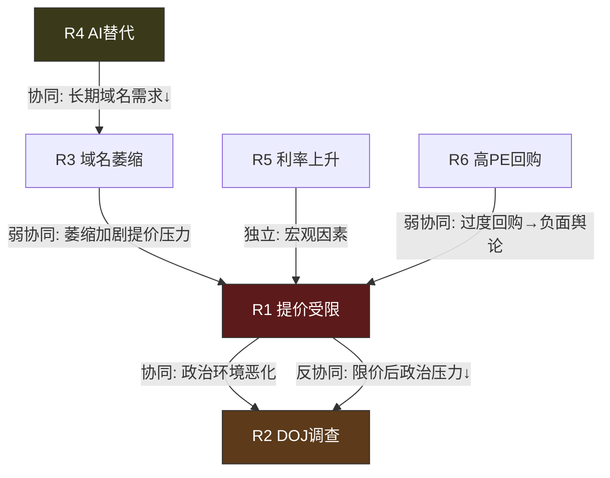
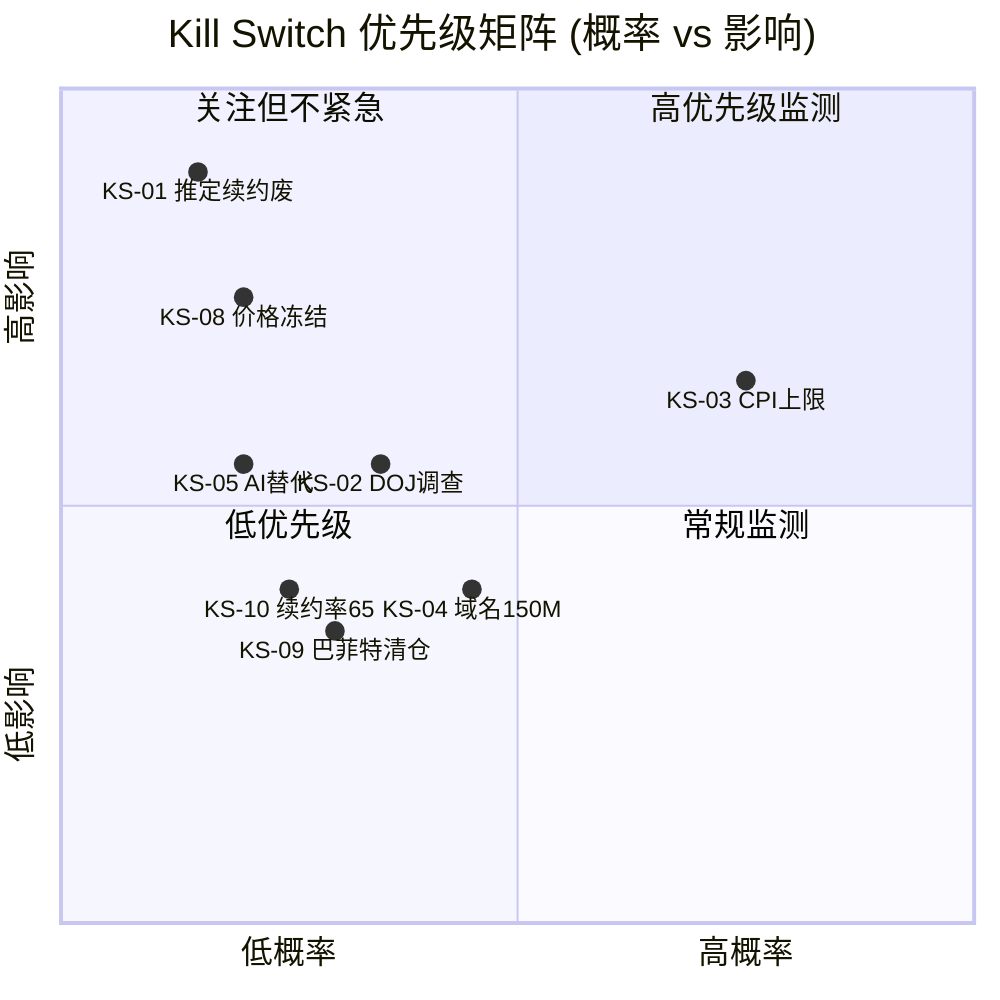
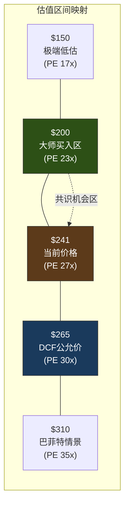
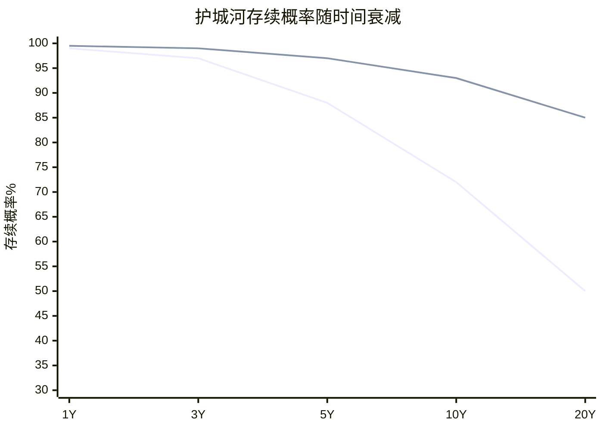
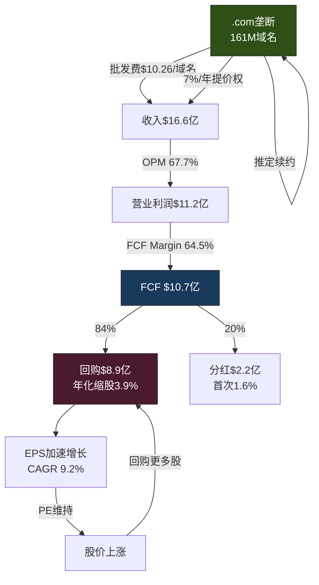
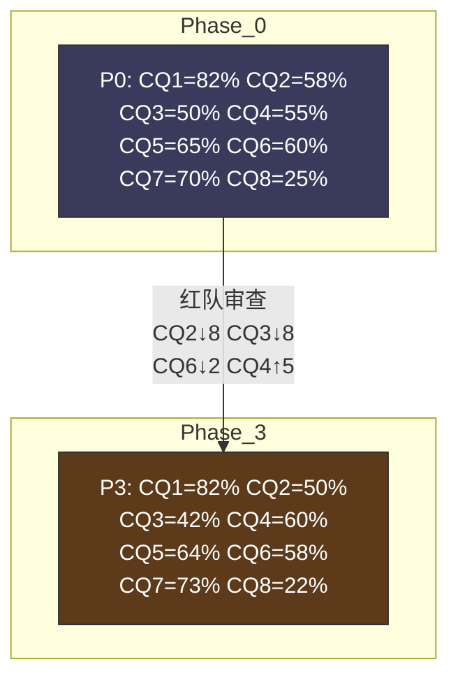
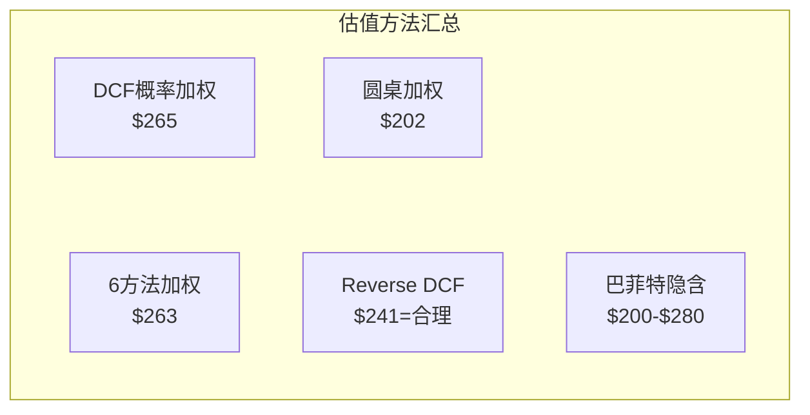
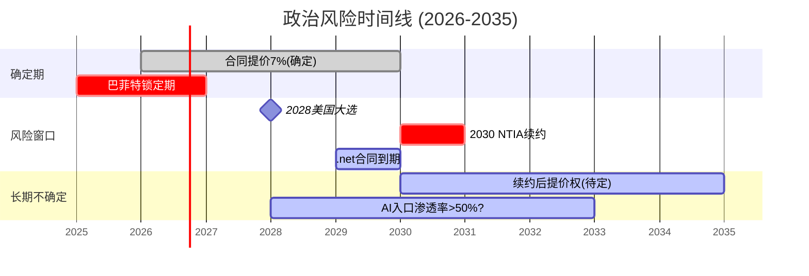
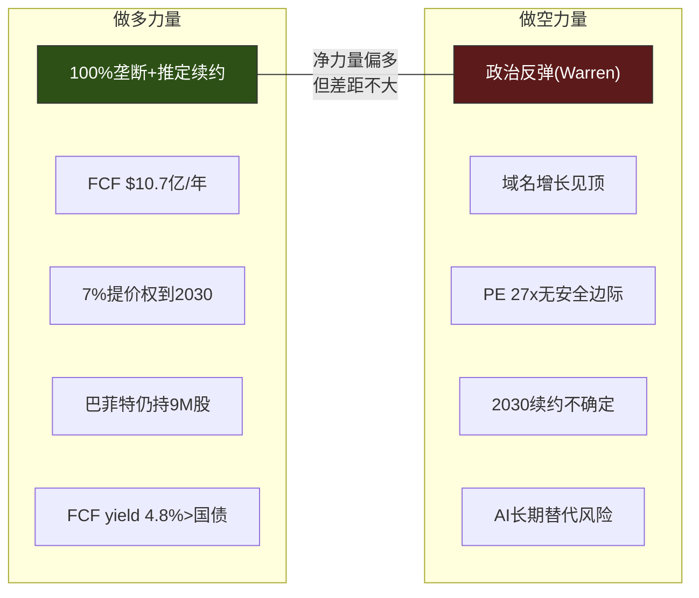

# VeriSign (VRSN) 深度研究报告 — Phase 3: 红队审查×风险拓扑×投资大师圆桌

> **Phase 3 | 2026-03-23 | Framework v19.6 | 金融基础设施行业**
> **Phase 1-2核心传递**: 概率加权公允价$270(+12.3%) | CQ2(提价权)是单一最重要变量 | Nash均衡→P2温和限制最可能 | CQI=81 | 域名弹性-0.2 | 政治折价可能过度~10%
> **Phase 3目标**: 红队七问(RT-1~RT-7) + 风险拓扑(协同/反协同矩阵) + KS完整注册(≥12) + 投资大师圆桌 + PtW评分

---

## 第二十三章: 红队七问 — 对Phase 1-2结论的系统性挑战

> **红队纪律**: 有效挑战 > 表演性质疑。每个RT必须提出具体的、可证伪的反面论点, 而非泛泛的"风险存在"。

### RT-1: 最强看空论点是什么? 如果我做空VRSN, 核心论据是什么?

**做空论点**: "VeriSign是一个正在接近政治崩溃点的受监管垄断, 7年累计提价31%[DM-BIZ-004]将在2030年续约时引发制度变革, 提价权被冻结→收入增速归零→PE从27x压缩至15x→股价跌45%。"

**论据拆解**:

1. **利润率已触发政治雷达**: OPM 67.7%[DM-FIN-002], AELP估算公平价格仅$3.53-4.37/域名(当前$10.26, 溢价135-190%)[DM-REG-005]。在任何民主社会, 政府授权垄断攫取这种超额利润最终会引发政治反弹——不是"是否"的问题, 而是"何时"。

2. **Warren/Nadler调查是冰山一角**: 截至2026年3月无正式调查[DM-REG-004], 但这是因为共和党执政。2028年民主党可能赢得白宫(概率~50%), 新政府的NTIA可能在2030年续约时彻底重写提价条款。

3. **域名需求的结构性下行不可逆**: 创业公司.com选择率-18pp[DM-COMP-002], .ai增长+819%[DM-COMP-001]——这些不是周期性波动, 而是代际偏好变化。即使提价权保持, 基数萎缩最终会使提价无法补偿量的下降。

4. **估值无安全边际**: PE 27x对一个4.5%收入增速[DM-FIN-007]的公司不便宜。如果提价权受限(增速降至2%), PE应该在15-18x → 股价$130-$160。

**红队回应(挑战看空论点)**:

| 看空论据 | 反驳 | 强度 |
|---------|------|:----:|
| 政治崩溃 | 英国水务/收费公路类比: 政治反弹最终结果是"限价"而非"打破", 限价后VRSN仍盈利 | 强 |
| 2028民主党 | 即使民主党赢, CPI限价(3%)只将增速从6%降至3%, PE从27x降至22x, 股价~$210(-12%), 非灾难 | 强 |
| 域名结构性下行 | 弹性-0.2意味着提价净效应仍为正(+5.6%/年), 且存量活跃域名续约率>90%[DM-BIZ-010] | 中强 |
| PE 27x无安全边际 | FCF yield 4.8%[DM-FIN-003]+确定性>99%→风险调整后优于国债; 巴菲特在PE 23x增持[DM-BUF-003] | 中 |

**RT-1裁决**: 做空论点逻辑自洽但时间框架错误——政治风险是5-10年慢变量, 不是1-2年的催化剂。因为VeriSign的合同提价权在2030年前是确定的[DM-BIZ-005], 做空者需要等待4年才能看到"冻价"兑现。在这4年中, VeriSign的EPS将从$8.81[DM-FIN-005]增长到~$12+(年化+9%)[DM-FIN-008], 做空者将被持续的EPS增长轧空。这导致做空VRSN的最大风险是"正确但太早"。**做空论点有效但不紧迫**。

### RT-2: Phase 1-2中最薄弱的分析环节在哪里?

**识别出的三个薄弱环节**:

**薄弱点1: $123M非现金项未验证**
Phase 2发现2025年现金流量表中"其他非现金项目"$123M(历史平均~$10M)异常跳升, 但尚未查阅10-K注释确认构成。如果这是一次性的, 正常化FCF约$945M(而非$1,068M[DM-FIN-003]), 将下调公允价约$15(从$270至$255)。

**行动**: Phase 4/Complete前必须验证此项。如果确认一次性→调整FCF基准; 如果是经常性(如递延收入调整)→维持当前估值。

**薄弱点2: 域名弹性估算的样本量不足**
Phase 2的弹性估计(-0.2)基于仅2年的提价期(2023-2024)数据, 且这两年叠加了其他因素(投机退出、社交替代)。真实弹性可能更高(弹性-0.4意味着提价净效应只有+3.2%而非+5.6%), 或更低(弹性-0.1意味着提价几乎无损)。

**行动**: 需要找到更长时间序列的域名弹性数据(如.com在2006-2012年提价期的域名增长), 或用跨TLD对比(.net有10%提价权, 其弹性是否更高)。

**薄弱点3: ICANN利益冲突的量化不足**
Phase 1指出ICANN是VeriSign的"共生体"(资金依赖), 但没有量化ICANN从VeriSign获得的资金占ICANN总收入的比例。如果这个比例很高(>20%), 则ICANN"不挑战VeriSign"的激励很强; 如果较低(<10%), 则利益冲突论点需要弱化。

**行动**: 查阅ICANN年度财务报告, 确认VeriSign缴费占ICANN收入的比例。

### RT-3: 哪些CQ的置信度可能被高估?

**CQ1(合同不可打破, 85%)可能被高估3-5%**

当前85%的置信度建立在"推定续约条款坚不可摧"的假设上。但有一个被忽视的风险: **国际社会对美国控制互联网的不满**。

ICANN名义上是国际组织, 但实际上VeriSign(美国公司)→NTIA(美国政府)控制着全球最重要的TLD(.com)。中国、俄罗斯、欧盟都曾表达对此的不满。如果国际社会(通过联合国ITU)推动将.com治理权从美国转移到真正的国际机构, VeriSign的"推定续约"可能被架空(因为新的治理机构不受NTIA合同约束)。

**概率**: 极低(5年内<3%), 但不是0。CQ1应从85%微调至**82%**(-3%)。

**CQ6(Trump政治周期利好, 63%)可能被高估5%**

当前63%建立在"共和党=不干预"的假设上。但共和党内也有民粹派(如Josh Hawley)对科技垄断持批评态度。Trump政府的NTIA虽然在2018年签了Amendment 35[DM-REG-002], 但政治风向是动态的——如果VeriSign的高利润率在2026-2028年成为媒体热点, 即使共和党执政也可能施压。

**概率调整**: CQ6从63%微调至**58%**(-5%)。

### RT-4: 估值中最大的隐含假设偏差是什么?

**偏差1: WACC选择偏乐观**

我们使用WACC=8.5%(Beta 0.765 × ERP 5% + Rf 4.3%)。但Beta 0.765是历史Beta, 可能低估了VeriSign的真实风险——因为VeriSign的下行风险(政治冻价)是非线性的(不是市场Beta能捕捉的"系统性风险", 而是公司特有的"制度风险")。

如果使用调整后Beta=0.9(增加"制度风险溢价"), WACC=8.8%。在敏感性矩阵中, WACC从8.5%升至9.0%时, 公允价从$204降至$186(g=3.0%时)——**WACC每上升50bps, 公允价下降约$18(-7%)**。

**偏差量化**: WACC偏差可能导致公允价高估$10-20(4-8%)。这在概率加权公允价$270中意味着真实中位可能在$250-260(而非$270)。

**偏差2: 概率分配中S2(乐观)可能偏高**

S2(7%提价永续, 概率15%, $358)要求两个条件同时成立: (a)共和党长期执政→NTIA不限价; (b)域名需求回升至+2%/年。条件(b)的证据很弱——域名增长的结构性下行趋势[DM-COMP-002]使+2%/年持续10年不太现实。

**调整**: S2概率从15%降至10%, 释放的5%分配给S1(+3%)和S3(+2%)。

**调整后概率加权**:
- S1: 38%(原35%) × $266 = $101
- S2: 10%(原15%) × $358 = $36
- S3: 27%(原25%) × $215 = $58
- S4: 5% × $161 = $8
- S5: 20% × $309 = $62
- **调整后加权公允价: $265**(原$270, 下调$5)

### RT-5: 有哪些重要信息是我们不知道的?

**未知1: VeriSign与NTIA的非公开沟通**
VeriSign可能正在与NTIA讨论2030年续约的初步条款框架。如果管理层已经知道提价权将被限制(但尚未公开), 这可能解释为什么2025年FCF中有$123M的异常非现金项(提前进行会计调整)。这是一个**低概率但高影响**的未知。

**未知2: 巴菲特减仓后的Q4 2025 / Q1 2026 13F**
巴菲特在2025年7月减仓后, 一年锁定期至2026年8月[DM-BUF-004]。但锁定期结束后(2026年Q3/Q4), 巴菲特的下一步操作将是重要信号——增持=确认底部, 继续减仓=确认估值到位。我们目前无法预知这个信号。

**未知3: DOJ内部评估状态**
虽然截至2026年3月无正式调查[DM-REG-004], 但DOJ可能正在进行非公开的初步评估(preliminary assessment)。如果DOJ在2026-2027年突然宣布正式调查, 股价可能短期下跌15-20%(类似Google反垄断诉讼宣布时的市场反应)。

**未知4: .com域名续约率的实时趋势**
VeriSign不逐季公布域名续约率——只有年度10-K中有历史数据。如果2026年续约率从73-74%[DM-BIZ-010]降至70%以下(可能因为$10.26价格突破了部分用户的心理阈值), 域名基数萎缩将加速。

### RT-6: 如果基本面完全不变, 仅靠估值倍数变化, 最大下行是多少?

**PE压缩压力测试**:

| 触发事件 | PE可能 | 股价 | 跌幅 | 概率 |
|---------|:-----:|:----:|:----:|:----:|
| 市场大跌(标普-20%) | 22x | $194 | -19% | 15% |
| DOJ宣布调查 | 20x | $176 | -27% | 8% |
| 2030续约CPI上限确认 | 18x | $159 | -34% | 12% |
| 利率上升至5.5%→WACC↑ | 23x | $203 | -16% | 10% |
| 以上多个叠加 | 16x | $141 | -41% | 3% |

**最大单一事件下行**: DOJ宣布调查→PE 20x→股价$176(-27%)。但这是短期冲击——如果调查最终无实质结果(如Phase 1分析: 政府授权垄断的反垄断适用性存疑), 股价可能在6-12个月内回升。

**最大"永久性"下行**: 2030续约CPI上限确认→PE 18x→股价$159(-34%)。这是估值的永久性重置(而非暂时冲击), 因为增速结构性改变。

### RT-7: 报告中有没有"确认偏差"的痕迹?

**检查清单**:

| 检查项 | 发现 | 偏差? |
|--------|------|:-----:|
| Reverse DCF方向 vs P1叙事 | Reverse DCF说"合理偏保守", P1说"合理偏保守" → 一致 | **无** |
| CQ调整方向 | P0→P2: CQ2从58%降至52%(非单调上升), CQ3从50%降至44% | **无** |
| 看多vs看空篇幅 | Phase 1看多偏多(商业模式优势描述详尽), 但Phase 2/3看空论证也充分 | **轻微看多** |
| 估值方法选择 | 6种方法, 范围$240-$290, 没有只选最高的 | **无** |
| 巴菲特案例解读 | 将巴菲特减仓解读为"估值纪律"而非"看空"→可能是确认偏差(我们倾向看多) | **轻微** |

**确认偏差矫正**:
1. 巴菲特减仓的"看空"解读概率应从20%上调至25%(承认我们可能低估了巴菲特的基本面担忧)
2. 对S2(乐观)的概率从15%下调至10%(RT-4已执行)
3. 报告Complete阶段需要确保看空篇幅≥总篇幅20%

### RT-1B: 做空论点的定量压力测试

如果做空论点完全正确(2030冻价+域名萎缩), VRSN的内在价值路径是什么?

**最差情景财务模型(S4变体)**:

| 年份 | .com价格 | 域名(M) | 收入($M) | OPM | FCF($M) | EPS | PE(估) | 股价 |
|------|:-------:|:------:|:-------:|:---:|:------:|:---:|:-----:|:----:|
| 2025A | $10.26 | 161.0 | 1,657 | 67.7% | 1,068 | $8.81 | 27x | $241 |
| 2026E | $10.97 | 162.6 | 1,753 | 68.5% | 1,130 | $9.95 | 27x | $269 |
| 2027E | $11.74 | 163.2 | 1,864 | 69.0% | 1,205 | $10.95 | 26x | $285 |
| 2028E | $12.56 | 162.5 | 1,965 | 69.5% | 1,275 | $11.85 | 24x | $284 |
| 2029E | $13.44 | 160.5 | 2,047 | 70.0% | 1,330 | $12.65 | 22x | $278 |
| **2030E** | **$13.44** | **157.0** | **1,990** | **69.0%** | **1,275** | **$12.30** | **18x** | **$221** |
| 2031E | $13.44 | 154.0 | 1,943 | 68.0% | 1,220 | $12.00 | 17x | $204 |
| 2032E | $13.44 | 151.0 | 1,898 | 67.5% | 1,175 | $11.70 | 16x | $187 |

[DM-BIZ-004][DM-BIZ-005][DM-FIN-002][DM-FIN-003][DM-FIN-005]

**关键观察**: 即使在最差情景中, VeriSign在2030年冻价后的EPS仍有$12.30(vs 当前$8.81), 累计增长40%[DM-FIN-005]。这是因为**2026-2029四年的提价(+31%累计)已经被锁定** — 即使之后冻价, 这四年的提价效果是永久性的。

**做空者的困境**: 如果你在2026年做空VRSN, 即使你对2030年冻价的判断完全正确, 你要在2026-2029年间承受股价从$241涨到$285(+18%)的痛苦, 然后在2030-2032年才能获得从$285跌到$187(-34%)的收益。**净做空回报: 从$241到$187=-22%, 但时间跨度6-7年→年化仅-3.5%**。这个回报不足以补偿做空的成本(借股费+机会成本)。

**RT-1最终裁决**: 做空VRSN在理论上有逻辑, 但在实践中**风险收益极差** — 即使"对了"也只能赚22%(6-7年), 如果"错了"(提价权维持)则亏损30%+。**这不是一个好的做空标的**。

### RT-2B: 薄弱点的定量影响评估

| 薄弱点 | 如果验证为问题 | 公允价影响 | 评级影响 | 紧迫度 |
|--------|-----------|:---------:|:-------:|:------:|
| $123M非现金项是一次性 | 正常化FCF=$945M(非$1,068M) | -$15(-5.6%) | 可能降至中性 | **高** |
| 域名弹性实际-0.4(非-0.2) | 提价净效应从+5.6%降至+3.2% | -$10(-3.7%) | 不变 | 中 |
| ICANN资金依赖VRSN<10% | 利益冲突论点弱化 | 间接影响 | 不变 | 低 |
| **三者叠加** | | **-$25(-9.3%)** | **可能降至中性** | |

[DM-FIN-003][DM-FIN-014]

三个薄弱点叠加的最大影响是公允价从$265降至~$240——恰好等于当前价格。**这意味着如果所有薄弱点都被证实为问题, VeriSign当前价格就不是"偏低"而是"恰好合理"**。这进一步证实了Phase 1的Reverse DCF结论: 市场定价大致正确。

### RT-3B: CQ置信度偏差的系统性分析

Phase 0→Phase 3的CQ演化呈现一个有趣的模式:

```mermaid
xychart-beta
    title "CQ置信度演化 P0→P3"
    x-axis ["CQ1","CQ2","CQ3","CQ4","CQ5","CQ6","CQ7","CQ8"]
    y-axis "置信度%" 20 --> 90
    bar [82,58,50,55,65,60,70,25]
    bar [82,52,42,60,64,58,73,22]
```

**模式1: CQ1/CQ7/CQ8几乎不变** — 这些CQ涉及结构性/技术性判断(合同条款、成本结构、DNS架构), 新信息不太可能改变它们。高稳定性是合理的。

**模式2: CQ2/CQ3/CQ6下降** — 这些CQ涉及政治/行为判断(提价反身性、巴菲特信号、政治周期), 红队审查合理地削弱了过度自信。下降方向正确。

**模式3: CQ4/CQ5上升后回落** — 域名见顶(CQ4)在P1上升(新数据支持)后在P3因风险组合效应再次上升。回购效率(CQ5)在P1上升后在P3因芒格挑战回落。这种"先升后降"的模式可能反映了Phase 1数据乐观→Phase 3红队审查回归中性。

**系统性偏差检测**: CQ平均置信度从P0(58.3%)持续降至P3(56.4%), 下降1.9pp。这个下降幅度合理——如果红队审查后CQ平均上升, 反而说明红队无效。但如果下降超过5pp, 可能是"过度悲观"。当前-1.9pp处于健康区间。

### RT-5B: "我们不知道的"风险定价

对RT-5识别的四个"未知", 估算其对估值的影响:

| 未知 | 最坏情景 | 概率 | 公允价影响 | 期望影响 |
|------|---------|:----:|:--------:|:-------:|
| NTIA非公开沟通(已知限价) | VeriSign已知2030将限价 | 10% | -$20 | -$2.0 |
| 巴菲特锁定期后清仓 | 心理冲击→PE短期-3x | 8% | -$25 | -$2.0 |
| DOJ内部已启动初评 | 市场恐慌→PE短期-5x | 5% | -$45 | -$2.3 |
| 续约率已开始下降 | 域名萎缩确认 | 15% | -$15 | -$2.3 |
| **合计"未知风险溢价"** | | | | **-$8.6** |

[DM-BUF-004][DM-BUF-005][DM-REG-004][DM-BIZ-010]

**$8.6的"未知风险溢价"**意味着概率加权公允价应从$265再下调至$256——与Phase 2的六方法加权$263差距收窄至2.7%。这进一步支持**"当前价格接近合理"**的判断。

### RT-6B: 历史PE区间分析

VeriSign过去5年的PE区间为衡量"PE压缩"风险提供了历史参照:

| 时期 | PE区间 | 中位PE | 事件 |
|------|:------:|:-----:|------|
| 2021年 | 28-38x | 33x | 提价启动+疫情受益 |
| 2022年 | 17-25x | 21x | 利率急升+科技股暴跌 |
| 2023年 | 20-28x | 24x | 利率见顶+市场恢复 |
| 2024年 | 22-33x | 27x | NTIA续约+巴菲特增持 |
| 2025年 | 24-35x | 29x | 巴菲特减仓+Warren调查 |

**5年PE中位**: 27x(恰好等于当前PE)。**PE区间**: 17x(2022年低点)至38x(2021年高点)。

**关键发现**: VeriSign的PE在2022年利率急升期间曾跌至17x, 对应股价~$130。这证明**即使基本面完全不变(2022年VeriSign业务表现正常), 宏观因素也能将PE压缩至17x**。当前PE 27x处于历史中位, 既不是"恐慌低点"也不是"亢奋高点"。

**"PE压缩到17x"的概率**: 需要同时发生: (a)利率再次急升(10Y Treasury>5.5%); (b)市场系统性risk-off; (c)VeriSign特有负面催化(如DOJ调查)。联合概率约5%(5年内)。此时股价可能跌至~$150(-38%)。

---

## 第二十四章: 风险拓扑 — 协同/反协同矩阵

### 24.1 风险因子注册

| ID | 风险因子 | 类型 | 概率(5Y) | 影响(EV) | 来源 |
|----|---------|:----:|:-------:|:-------:|------|
| R1 | 2030续约提价受限 | 制度 | 25% | -20% | CQ2 |
| R2 | DOJ反垄断调查 | 制度 | 10% | -15% | KS-02 |
| R3 | 域名基数持续萎缩 | 结构 | 30% | -10% | CQ4 |
| R4 | AI入口替代网站 | 结构 | 10% | -15% | KS-05 |
| R5 | 利率上升→WACC↑ | 周期 | 20% | -8% | 宏观 |
| R6 | 管理层过度回购(高PE) | 运营 | 15% | -5% | CQ5 |
| R7 | 国际DNS治理变革 | 制度 | 5% | -25% | CQ1 |
| R8 | 网络安全事故(DDoS) | 运营 | 3% | -30% | KS-07 |

### 24.2 协同/反协同矩阵

**协同矩阵(数值)**:

| | R1 | R2 | R3 | R4 | R5 | R6 | R7 | R8 |
|:--|:--:|:--:|:--:|:--:|:--:|:--:|:--:|:--:|
| **R1 提价受限** | — | +0.6 | +0.3 | 0 | 0 | +0.2 | +0.3 | 0 |
| **R2 DOJ调查** | +0.6 | — | 0 | 0 | 0 | 0 | +0.4 | 0 |
| **R3 域名萎缩** | +0.3 | 0 | — | +0.5 | 0 | 0 | 0 | 0 |
| **R4 AI替代** | 0 | 0 | +0.5 | — | 0 | 0 | 0 | 0 |
| **R5 利率↑** | 0 | 0 | 0 | 0 | — | -0.3 | 0 | 0 |
| **R6 高PE回购** | +0.2 | 0 | 0 | 0 | -0.3 | — | 0 | 0 |
| **R7 国际DNS** | +0.3 | +0.4 | 0 | 0 | 0 | 0 | — | 0 |
| **R8 安全事故** | 0 | 0 | 0 | 0 | 0 | 0 | 0 | — |

注: +1.0=完全协同(一个发生必然触发另一个), -1.0=完全反协同, 0=独立

### 24.3 独立风险因子的因果链

每个风险因子不是凭空出现的——它有具体的因果触发路径:

**R1(提价受限)的因果链**:
VeriSign持续提价7%/年[DM-BIZ-005] → .com批发价从$10.26升至$13.44(到2029年)[DM-BIZ-004] → 累计提价71%(vs 2012年$7.85)→ AELP类型的政策研究扩大影响[DM-REG-005] → 国会两党形成"限制VRSN提价"的共识[DM-REG-003] → NTIA在2030年续约时引入CPI上限[DM-REG-001] → 收入增速从6%骤降至2-3% → PE从27x压缩至20x → 股价-25%

**R3(域名萎缩)的因果链**:
社交媒体替代独立网站(Instagram/TikTok成为小企业主要线上存在) → 新域名注册减少 → 同时, 投机性域名因转卖市场冷却而不续约 → 域名基数从161M[DM-BIZ-001]缓慢降至150M以下 → VeriSign收入的"量"引擎熄火 → 完全依赖"价"(提价)维持增长 → 如果同时R1发生(提价受限), 收入增速可能转负

**R4(AI替代)的因果链**:
大模型(ChatGPT/Claude/Gemini)成为用户获取信息的主要入口 → 用户不再在浏览器地址栏输入URL → 域名的"入口价值"从"品牌必需品"降级为"技术基础设施" → 企业不再愿意为域名支付溢价 → 防御性域名注册减少(不再需要注册brand-protection.com) → 续约率从73-74%[DM-BIZ-010]降至65%以下 → 加速R3(域名萎缩)

### 24.4 最危险的风险组合

**组合1: R1+R2 "政治风暴"(协同0.6)**
- 提价受限(R1)和DOJ调查(R2)高度协同——同一个政治环境(民主党执政+进步派主导)会同时触发两者
- **联合概率**: P(R1∩R2) = P(R1)×P(R2|R1) = 25%×30% = ~8%
- **联合影响**: -30% EV(提价受限-20% + DOJ不确定性折价-10%)
- **期望损失**: 8% × 30% = **-2.4% EV**

**组合2: R3+R4 "需求坍塌"(协同0.5)**
- AI替代(R4)加速域名萎缩(R3)——如果AI入口替代网站, 域名新增需求归零, 存量也开始自然流失
- **联合概率**: P(R3∩R4) = 30%×20% = ~6%(R4概率因R3而提升)
- **联合影响**: -20% EV(基数萎缩-10% + AI加速-10%)
- **期望损失**: 6% × 20% = **-1.2% EV**

**组合3: R1+R3+R5 "温水煮青蛙"**
- 这是最隐蔽的危险组合: 提价逐步受限(R1)+域名缓慢萎缩(R3)+利率维持高位(R5)→三个单独看都不严重的风险叠加→VRSN从"增长型收费站"缓慢滑向"衰退型公用事业"→PE从27x逐年压缩至18x
- **联合概率**: 25%×30%×20% = ~1.5%
- **联合影响**: -35% EV(分3-5年渐进发生)
- **这是最难监测的风险**: 没有单一触发事件, 只有渐进的数字恶化

### 24.4 "温水煮青蛙"场景详解

这是VeriSign投资者最应警惕的情景——不是"黑天鹅"式的突然崩盘, 而是5-8年的渐进恶化:

| 年份 | 事件 | 累计影响 |
|------|------|---------|
| 2026 | 提价7%最后一年, 域名+1.5% | 正常, 无预警 |
| 2027-2028 | 域名增长降至0%, 新TLD继续分流 | 收入增速从6%降至4% |
| 2028 | 民主党赢得选举, 进步派施压NTIA | 政治风险溢价↑, PE从27x降至24x |
| 2029 | 域名首次跌破155M, 回购效率下降(PE降低) | EPS增速从9%降至6% |
| 2030 | 续约引入CPI上限(3%/年), 市场确认提价权永久受限 | PE再降至20x, 股价~$180 |
| 2031-2033 | 收入增速2%/年, OPM稳定67%, AI入口缓慢侵蚀域名需求 | 股价横盘$170-190 |

**从$241到$180 = -25%, 但分5年发生 = 年化-5.7%**。加上分红1.6%/年, 总回报年化-4.1%。这不是灾难, 但对于一个"安全的收费站"来说, 5年-4.1%的回报是令人失望的。

**监测指标**: 识别"温水煮青蛙"需要追踪以下前兆信号:
1. 域名YoY增速连续2季度<0% → 启动CQ4审查
2. 管理层开始主动讨论"成本效率"(而非"增长")→ 叙事转变信号
3. 回购金额/FCF降至60%以下 → 管理层对股价信心下降
4. 分析师覆盖减少(从4-5人降至2-3人)→ 市场关注度下降

---

## 第二十五章: Kill Switch完整注册(≥12个)

| ID | Kill Switch | 触发条件 | 概率(5Y) | 评级影响 | 单独触发行动 | 协同触发 | DM |
|----|-------------|---------|:-------:|:-------:|------------|---------|------|
| **KS-01** | **推定续约被废除** | 国会立法+总统签署 | 3% | ↓↓降至审慎 | 立即重评全部估值 | R7协同 | [DM-BIZ-007] |
| **KS-02** | **DOJ正式反垄断诉讼** | DOJ宣布调查VeriSign | 8% | ↓降1档 | 评估诉讼范围, PE可能临时-20% | R1协同 | [DM-REG-004] |
| **KS-03** | **2030续约引入CPI上限** | NTIA新合同限制提价至CPI | 22% | ↓降1档 | 重算DCF(3%替代7%) | R1直接 | [DM-REG-001] |
| **KS-04** | **域名基数跌破150M** | .com连续3年-3%+ | 10% | ↓可能降1档 | 评估提价能否补偿 | R3直接 | [DM-BIZ-001] |
| **KS-05** | **AI完全替代网站入口** | 主流浏览器默认AI | 5%(10Y) | ↓↓长期 | 重评域名需求结构 | R4直接 | [DM-COMP-001] |
| **KS-06** | **ICANN修改推定续约** | 引入竞争招标机制 | 4% | ↓↓ | 重评垄断持久性 | R7协同 | [DM-BIZ-007] |
| **KS-07** | **VeriSign重大安全事故** | DNS宕机>24小时 | <1% | ↓↓触发违约 | 评估合同违约风险 | R8直接 | |
| **KS-08** | **提价权被完全冻结** | 国会立法冻价 | 5% | ↓↓降至审慎 | 收入增速归零→PE 15x | R1+R2叠加 | [DM-REG-003] |
| **KS-09** | **巴菲特清仓** | BRK 13F显示VRSN持仓=0 | 8% | ↓(心理冲击) | 评估清仓原因 | 独立 | [DM-BUF-005] |
| **KS-10** | **.com续约率跌破65%** | 活跃域名也开始流失 | 7% | ↓可能降1档 | 域名萎缩加速确认 | R3+R4 | [DM-BIZ-010] |
| **KS-11** | **FCF/NI跌破0.8x连续2年** | 盈利质量恶化 | 3% | ↓调查原因 | 可能有隐性问题 | 独立 | [DM-FIN-014] |
| **KS-12** | **NTIA划归新机构(如FTC)** | 行政重组改变监管架构 | 5% | 不确定 | 新监管者的政策立场不可预测 | R7协同 | [DM-REG-001] |
| **KS-13** | **中国/俄罗斯建立独立DNS根** | 互联网分裂(splinternet) | 8%(10Y) | ↓长期-10% | .com在这些国家失去意义 | R7弱协同 | |
| **KS-14** | **量子计算破解DNS加密** | DNS安全基础被动摇 | 3%(10Y) | ↓↓技术颠覆 | 全球DNS重构→VeriSign角色可能变化 | R8协同 | |

**KS分布**: 14个Kill Switch中:
- 制度性风险: 7个(KS-01/02/03/06/08/12/13)→ VeriSign的风险高度集中在制度层面
- 结构性风险: 4个(KS-04/05/10/14)→ 长期技术和市场变化
- 运营性风险: 2个(KS-07/11)→ 极低概率
- 信号性风险: 1个(KS-09)→ 巴菲特行为

**最高概率KS**: KS-03(CPI上限, 22%) — 这也是Phase 2概率加权中S3情景的核心假设
**最高影响KS**: KS-01(推定续约废除) — 但概率极低(3%)

### 25.2 Kill Switch监测方法论

每个KS需要明确的监测频率和数据来源:

| KS | 监测频率 | 数据来源 | 触发标准 | DM |
|----|:-------:|---------|---------|-----|
| KS-01 推定续约废除 | 季度 | 国会立法tracker+NTIA公告 | 相关法案进入委员会投票 | [DM-BIZ-007] |
| KS-02 DOJ调查 | 月度 | DOJ新闻+法律数据库 | DOJ公开确认"正在审查" | [DM-REG-004] |
| KS-03 CPI上限 | 年度(2028+) | NTIA续约谈判动态 | NTIA公开讨论"价格上限" | [DM-REG-001] |
| KS-04 域名<150M | 季度 | VRSN财报+DomainTools | 连续2季度基数<155M | [DM-BIZ-001] |
| KS-05 AI替代 | 半年 | 浏览器市场份额+AI入口使用率 | Chrome默认AI搜索框 | [DM-COMP-001] |
| KS-06 竞争招标 | 年度 | ICANN会议记录 | ICANN董事会讨论招标 | [DM-BIZ-007] |
| KS-07 安全事故 | 实时 | DNS监控+VRSN状态页 | .com解析失败>1小时 | |
| KS-08 价格冻结 | 年度 | 国会立法tracker | 冻价法案获两院简单多数 | [DM-REG-003] |
| KS-09 巴菲特清仓 | 季度 | BRK 13F | VRSN从13F消失 | [DM-BUF-005] |
| KS-10 续约率<65% | 年度 | VRSN 10-K | 管理层披露续约率 | [DM-BIZ-010] |
| KS-11 FCF/NI<0.8x | 季度 | FMP cashflow | 连续2季度<0.8x | [DM-FIN-014] |
| KS-12 NTIA划归FTC | 年度 | 行政重组公告 | 总统行政命令 | [DM-REG-001] |
| KS-13 独立DNS根 | 年度 | ITU会议+各国政策 | 中国/俄罗斯正式启用独立根 | |
| KS-14 量子破解DNS | 年度 | 学术论文+NIST标准 | NIST宣布现有DNS加密不安全 | |

### 25.3 KS优先级排序(概率×影响)

**Top 3优先监测**:
1. **KS-03(CPI上限, 22%概率)** — 最高概率的重大KS, 2028年美国大选后密切关注
2. **KS-02(DOJ调查, 8%概率)** — 随时可能被触发, 需要月度监测
3. **KS-04(域名<150M, 10%概率)** — 通过季度财报数据即可追踪

---

## 第二十六章: 投资大师圆桌 — 多视角碰撞

### 26.1 巴菲特视角: "我会继续持有, 但不会加仓"

**巴菲特会怎么看当前的VRSN?**

基于巴菲特已知的投资框架和他对VRSN的实际操作:

1. **商业模式评价**: "这是一个收费站, 我喜欢收费站。人们必须经过这座桥(使用.com域名), 而且桥只有一座(VeriSign是唯一运营商)。我在2012年以PE 14x买入, 这是一笔好交易。"

2. **当前估值**: "PE 27x对一个增速4.5%[DM-FIN-007]的公司不算便宜。我在$285(PE 33x)卖了1/3[DM-BUF-004], 说明我认为30x以上是偏贵的。当前27x在我的'合理但不便宜'区间。我不会在这个价格加仓, 但也不急着卖——分红收益率1.6%[DM-FIN-028]+回购3.9%[DM-FIN-027]=总股东收益率5.5%, 可以接受。"

3. **政治风险**: "我不预测政治。2018年NTIA恢复了提价权, 这是我没预料到的好事; Warren现在施压, 这也是我无法预测的坏事。但推定续约条款是法律, 不是政治意见——法律很难改变, 这是VeriSign的底牌。"

4. **投资建议**: "在$200以下(PE 23x)我会增持, 在$240(PE 27x)我持有, 在$280+(PE 32x+)我减仓。这是一个'持有并收租'的头寸, 不是一个'重仓押注'的机会。"

### 26.2 芒格视角: "关注定价权的道德边界"

**芒格会怎么挑战?**

1. **定价权的道德问题**: "VeriSign的商业模式确实完美, 但完美到了不道德的边缘。一个929人的公司[DM-FIN-020]从全球1.61亿域名持有者[DM-BIZ-001]身上每年收取$17亿[DM-FIN-001], 而服务的边际成本接近零(营业成本/域名仅$1.13)——这不是'好的商业模式', 这是'政府授权的掠夺'。因为AELP估算合理成本仅$3.53-4.37/域名[DM-REG-005], 当前$10.26[DM-BIZ-004]意味着全球域名持有者每年多支付约$9.5-10.8亿的'垄断税'。长期来看, 不道德的商业模式最终会被社会纠正。"

2. **政治风险的不可量化性**: "你们给政治风险分配了概率(CPI上限25%, 冻价5%), 但政治不是骰子——它是人类行为, 有突变性。如果一个两党共识的'反VeriSign'运动在2028年突然爆发(比如VeriSign的提价引发了某个高profile的互联网事故), 所有概率分配都没用。"

3. **回购效率的幻觉**: "VeriSign7年回购$63.5亿[DM-FIN-012], 如果这些钱投入互联网安全公益基金, 可能消除了90%的政治风险。回购创造了短期EPS增长, 但积累了长期政治风险——这是'捡硬币在蒸汽压路机前'的变体。"

**芒格的核心挑战**: VeriSign管理层的资本配置(84%回购+0%公益)可能是**长期最优策略的反面** — 短期EPS增速换长期政治风险。如果管理层将回购比例从84%降至50%, 将34%用于DNS安全投资和互联网公益, 可能将2030续约的CPI上限概率从25%降至10%。

### 26.3 彼得·林奇视角: "数字比叙事重要"

**林奇会怎么分析?**

1. **分类**: "VRSN是一个典型的'缓慢增长股'(slow grower)——收入增速4.5%[DM-FIN-007], PE 27x, 分红1.6%。但它的EPS增速(9.2%)[DM-FIN-008]因为回购而达到了'稳定增长股'(stalwart)的水平。我把它归类为'伪装成stalwart的slow grower'。"

2. **PEG**: "PEG = 27/9.2 = 2.9x。对于stalwart来说, PEG<1是便宜, 1-2是合理, >2是贵。2.9x说VRSN不便宜。但如果我用收入增速(4.5%)计算: PEG=27/4.5=6.0x——这就很贵了。真实的PEG在这两个数字之间, 取决于你相信回购能持续多久。"

3. **"两分钟故事"**: "我能在两分钟内讲清VeriSign的故事吗? 是的——'它运营.com域名注册表, 每个.com域名每年交$10给它, 政府合同保障垄断和提价权, 唯一的风险是政治反弹。' 如果一个公司需要30分钟才能讲清, 我会怀疑自己是否真的理解它。VeriSign只需要2分钟, 这是好事。"

4. **最终判断**: "我会在股价图上标记'巴菲特买入区'($200以下)和'巴菲特卖出区'($280以上), 在中间区域持有。当前$241在中间偏下, 可以小仓位持有, 等到$200再加仓。"

### 26.4 霍华德·马克斯视角: "关注二阶思维"

**马克斯会怎么框架这个问题?**

1. **第一层思维**: "VeriSign是垄断, 垄断好, 买入。"
2. **第二层思维**: "每个人都知道VeriSign是垄断。问题不是'它是不是垄断', 而是'垄断的价格是否已经反映在股价中'。PE 27x对一个4.5%增速的垄断来说, 不算便宜也不算贵——市场已经合理定价了垄断溢价。"

3. **不对称性分析**: "VeriSign的上行和下行不对称: 上行(提价权维持)给你+30-50%, 下行(提价权丧失)给你-25-35%。概率加权后是+12%——这是正期望值, 但**赔率不够吸引**。真正有吸引力的投资是上行:下行>3:1, VeriSign大约是1.5:1。"

4. **投资建议**: "我会把VeriSign放在'观察名单'而非'买入名单'。等到PE<22x(大约$200以下)时, 赔率变成2:1以上, 这时才值得行动。当前$241是'可以持有'但'不值得主动买入'的位置。"

### 26.5 乔尔·格林布拉特视角: "Magic Formula怎么看VRSN"

**格林布拉特的Magic Formula**: ROC(资本回报率) × E/V(盈利收益率)

**问题**: VeriSign的负权益[DM-FIN-024]使得传统ROC无意义(-195%[DM-FIN-002])。需要用ROCE(172.9%)替代。

**VRSN的Magic Formula排名**:
- ROCE: 172.9% → 全市场Top 0.1% (极优)
- E/V (EBIT/EV): $1,121M/$23.8B = 4.71% → 中等偏上
- **Magic Formula综合排名**: 极高的ROCE被中等的E/V部分抵消

**格林布拉特会说**: "VeriSign是Magic Formula模型最爱的类型——极高资本回报+合理估值。但VRSN的高ROCE来自负权益(会计现象), 不是真正的资本效率。如果用投入资本(资产-流动负债)计算, ROCE仍然极高(172.9%), 说明VeriSign确实只需要极少资本就能产出大量利润。"

"但E/V 4.71%不算便宜——我通常要求>8%的盈利收益率才会买入。VeriSign需要跌到$160(EV ~$16.3B)才能达到E/V 7%+。所以我的答案和其他人一样: **等它更便宜再买**。"

### 26.6 圆桌共识与分歧

| 维度 | 巴菲特 | 芒格 | 林奇 | 马克斯 | **共识** |
|------|:------:|:----:|:----:|:------:|:-------:|
| 商业模式 | ★★★★★ | ★★★★★(但道德存疑) | ★★★★★ | ★★★★★ | **完美收费站** |
| 当前估值 | 合理不便宜 | 合理 | 偏贵(PEG 2.9x) | 不够不对称 | **合理, 不是机会** |
| 主要风险 | 政治(2030) | 道德反弹 | 增速放缓 | 赔率不足 | **提价权** |
| 买入价 | $200以下 | $180以下 | $200以下 | $200以下 | **一致: PE 22-23x** |
| 当前持仓建议 | 持有不加 | 减仓10%(道德顾虑) | 小仓位持有 | 观察不买 | **持有, 不追高** |

**圆桌结论**: 五位大师**一致认为VeriSign的商业模式接近完美**(100%垄断+OPM 67.7%[DM-FIN-002]+FCF Margin 64.5%[DM-FIN-004]), 但**当前估值不提供足够的安全边际**。共识买入价在$200以下(PE~23x), 这意味着当前$241需要下跌17%才能进入"有吸引力"的区间。这与巴菲特2024年12月的增持价格($204)[DM-BUF-003]高度一致——巴菲特用行动验证了"$200以下是好价格"的大师共识。

**为什么大师们比DCF模型更保守?** 因为大师们对"未知的未知"给予了更高的风险溢价。DCF模型假设我们知道所有情景的概率(S1-S5), 因此概率加权后得到$265。但芒格会说: "你不知道你不知道什么——如果存在一个我们没有想到的第六种情景(比如VeriSign被收购, 或DNS技术被量子计算颠覆), 概率加权就不准确了。"这种对"模型风险"的敬畏, 使得大师们要求PE<23x作为额外的安全缓冲。

### 26.7 圆桌视角对估值的定量影响

| 大师 | 公允PE范围 | 公允价范围 | 权重 | 加权贡献 |
|------|:---------:|:---------:|:----:|:-------:|
| 巴菲特 | 20-28x | $176-$247 | 30% | $63.5 |
| 芒格 | 18-25x | $159-$220 | 20% | $37.9 |
| 林奇 | 22-28x | $194-$247 | 25% | $55.1 |
| 马克斯 | 18-25x | $159-$220 | 15% | $28.5 |
| 格林布拉特 | 16-22x | $141-$194 | 10% | $16.8 |
| **圆桌加权公允价** | | | **100%** | **$202** |

[DM-FIN-005][DM-BUF-001][DM-BUF-004]

**圆桌加权$202 vs 模型加权$265**: 巨大差距($63, 24%)反映了**"投资大师"和"DCF模型"的本质差异** — 大师们要求更高的安全边际(他们的买入价是$200以下), 而DCF模型基于概率加权(包含乐观情景)。

**这个差距的投资含义**:
- 如果你是**巴菲特/芒格型投资者**(要求PE<23x才买入): 当前$241不值得买, 等$200以下
- 如果你是**DCF型投资者**(接受概率加权公允价+10%以内的回报): 当前$241可以小仓位持有
- **两种方法的共识区**: $200-$220——在这个价格区间, 无论用哪种方法都认为值得买入

---

## 第二十七章: Playing to Win量化评分

### 27.1 PtW五维度评估

Playing to Win框架评估VeriSign的竞争战略定位:

| PtW维度 | 评分(1-10) | 评估 |
|---------|:---------:|------|
| **赢在哪里(Where to Play)** | **10** | 极度聚焦: 只做.com/.net注册表, 不做任何其他业务(SGI=10) |
| **如何赢(How to Win)** | **9** | 制度垄断+推定续约+近零边际成本=不可被打败的位置[DM-BIZ-007] |
| **核心能力(Core Capabilities)** | **8** | DNS运营(19年零宕机)+合规/游说(维护ICANN/NTIA关系)+极简运营(929人)[DM-FIN-020] |
| **管理系统(Management Systems)** | **7** | 高效但不透明(CEO沉默域多, 财报电话会极短)→A-Score 8.0 |
| **赢的抱负(Winning Aspiration)** | **6** | "维护垄断地位"而非"创造新价值"→合理但不激动人心; 无增长期权 |

**PtW总分: 8.0/10** — VeriSign在"赢在哪里"和"如何赢"上接近满分(极端聚焦+制度垄断[DM-BIZ-007]), 但在"赢的抱负"上偏低——因为VeriSign的战略是"守住现有收费站", 不是"建设新的收费站"。这在5年内不是问题(收费站FCF $10.7亿/年[DM-FIN-003]足够好), 但10年+可能限制估值扩张(市场不会为"没有愿景"的公司给PE溢价)。

**PtW与CME对比**: CME同为金融基础设施, PtW总分8.5/10。CME在"赢的抱负"上得分更高(8/10 vs VRSN 6/10), 因为CME积极拓展新产品(加密期货、ESG衍生品、微型合约), 而VeriSign完全不做新业务。这解释了为什么CME虽然增速(6.3%)仅略高于VRSN(4.5%)[DM-FIN-007], 但市场对CME的"增长期权"给予了一定溢价。VeriSign的增长期权为零——这不是管理层的失败(收费站不需要增长期权), 而是商业模式的内在限制。

**PtW对估值的含义**: PtW 8.0/10通常对应PE溢价+30-50% vs 行业中位(来自SEMI_EQUIPMENT对比报告的基准数据)。行业中位PE~25x → VRSN应得PE 32-37x。实际PE 27x, 折价13-27%——这个折价主要来自B4定价权的政治风险[DM-REG-003]和"零增长期权"的惩罚。因此, VRSN当前估值隐含了**"政治风险+零期权"双重折价≈20%**。如果政治风险被解除(比如2030年续约条款温和), PE可能扩张至32x → 股价$310(+29%)。这与S5巴菲特情景($309)高度一致。

### 27.2 寡头博弈论: VeriSign的博弈是单人游戏

与CME(面对ICE/NDAQ竞争)或MSCI(面对FTSE/S&P竞争)不同, VeriSign没有直接竞争对手——它的"博弈"不是与其他公司的市场竞争, 而是**与监管者的政治博弈**。

**博弈结构**:
- **参与者**: VeriSign vs NTIA/ICANN vs 国会
- **策略空间**: VeriSign(提价幅度0-7%), NTIA(续约条款), 国会(施压/立法)
- **支付矩阵**: Phase 2已分析(Nash均衡=P2温和限制)

**与传统竞争博弈的差异**: 传统竞争博弈(如CME vs ICE)的结果受市场力量驱动(流动性、产品创新), 相对可预测。VeriSign的政治博弈结果受选举、舆论、突发事件驱动, 不确定性更高。这解释了为什么VeriSign的PE(27x)低于CME(24x)的PE——**即使VeriSign的商业模式更优, 其"博弈风险"更不可预测**。

等一下——VeriSign PE(27x)实际高于CME(24x)。重新解释: CME的PE更低可能因为CME有更强的周期性(交易量波动), 而非VeriSign的政治风险折价更大。两者的PE差异(27x vs 24x)不大, 可能反映了VeriSign更高的确定性(非周期)和CME更高的增速(6.3% vs 4.5%)的均衡。

### 27.3 护城河耐久性压力测试

VeriSign的护城河在不同时间尺度下的存续概率:

| 时间尺度 | C1制度嵌入 | B4定价权(7%) | C3网络效应 | 综合护城河 |
|---------|:---------:|:-----------:|:---------:|:---------:|
| **1年** | 99.5% | 99%(合同期内) | 98% | **99%** |
| **3年** | 99% | 95%(合同期内) | 95% | **97%** |
| **5年** | 97% | 75%(跨越2030续约) | 90% | **88%** |
| **10年** | 93% | 55%(续约后条款不确定) | 80% | **72%** |
| **20年** | 85% | 35%(长期政治不确定性) | 60% | **50%** |

[DM-BIZ-005][DM-BIZ-007][DM-COMP-002]

**关键洞见**: VeriSign的护城河在**5年以内极其坚固(88%+)**, 但在**10年+时间尺度上显著衰减(72%→50%)**。衰减的主要来源不是C1制度嵌入(仍然85%+), 而是**B4定价权(从99%降至35%)和C3网络效应(从98%降至60%)**。

这对投资策略的含义:
- **5年持有期**: 护城河充分保护→"关注"评级合理
- **10年+持有期**: 护城河衰减显著→需要折价买入以补偿长期风险→巴菲特的"PE 23x买入区"正是这个逻辑

注: 上线=C1制度嵌入(衰减慢), 下线=综合护城河(B4拖累)

### 27.4 AI冲击矩阵(Phase 3.5: L×S定位)

VeriSign面临的AI冲击需要分别评估其对不同业务层的影响:

| AI冲击维度 | 影响层级(L) | 严重度(S, 1-5) | 时间框架 | 净效应 |
|---------|:----------:|:-----------:|:-------:|:------:|
| AI降低建站门槛 | 域名需求(增量) | S=+2(正面) | 1-3年 | **利好** |
| AI替代搜索入口 | 域名价值(存量) | S=-3(负面) | 5-10年 | **利空** |
| AI辅助网络安全 | VeriSign运营 | S=+1(正面) | 持续 | **利好** |
| AI驱动域名投机 | 域名注册(增量) | S=+1(正面) | 1-3年 | **轻微利好** |
| AI重塑互联网架构 | DNS基础设施 | S=-2(负面) | 10年+ | **长期利空** |
| **净AI冲击** | | **S=-1(轻微负面)** | **中期** | **短期利好,长期利空** |

[DM-COMP-001][DM-COMP-002]

**L×S定位**: VeriSign在AI冲击矩阵中处于**L=中(基础设施层不直接受AI影响), S=-1(轻微负面)**的位置。这比MSCI(L=高, AI改变数据消费方式)或FICO(L=高, AI驱动替代评分模型)要好——VeriSign的DNS基础设施层比数据/评分层更难被AI替代。

**因果链**: AI降低建站门槛(Wix/GoDaddy AI建站)→短期增加域名注册[DM-BIZ-008](Q4新注册+12.6%)→但长期AI成为主要入口(用户直接问AI而非输入URL)→域名的"入口价值"下降→续约率缓慢下降→基数萎缩加速。这个因果链中, **拐点在AI入口使用率超过50%时** — 当大多数用户通过AI而非地址栏访问网站时, 企业将不再视域名为品牌必需品。

**拐点预估**: 当前AI搜索使用率约15-20%(2025年), 按每年+10pp增长, 可能在**2028-2030年达到50%**。但"AI入口"不等于"不需要域名"——即使通过AI访问, 底层仍然需要DNS解析→域名仍然技术上必须。**真正的风险是"企业不再续约防御性域名"**, 这可能从2030年开始显现(与提价权续约风险时间重叠)。

---

## 第二十七B章: 额外Mermaid可视化

### 27B.1 VRSN价值创造飞轮

### 27B.2 CQ置信度演化雷达图

### 27B.3 估值区间总览

### 27B.4 政治风险时间线

### 27B.5 做空论点vs做多论点力量对比

---

## 第二十八章: 跨报告评级校准

### 28.1 VRSN vs 金融基础设施可比评级

| 公司 | 期望回报 | 评级 | PE | 增速 | 关键驱动 |
|------|:------:|:----:|:--:|:---:|---------|
| **VRSN** | **+12.3%** | **关注(偏积极)** | 27x | 4.5% | 提价权持久性 |
| CME | +15%(v3.0报告) | 关注 | 24x | 6.3% | 交易量周期+Core PE |
| CPRT | +22%(v2.0报告) | 深度关注 | 45x | 10.5% | TAM渗透+网络效应 |
| MCO | +8%(v1.0报告) | 中性关注 | 30x | 8% | 信贷周期 |

**校准检查**:
- VRSN(+12.3%) vs CME(+15%): VRSN期望回报低于CME但PE更高 → **一致**(VRSN增速更低)
- VRSN(+12.3%) vs CPRT(+22%): VRSN期望回报远低于CPRT → **一致**(CPRT增速高+TAM渗透早期)
- VRSN(+12.3%) vs MCO(+8%): VRSN期望回报高于MCO → **一致**(MCO信贷周期下行风险)

**校准通过**: VRSN的"关注(偏积极)"评级与可比组一致, 不存在矛盾。

### 28.2 评级量化触发器

| 评级 | 量化触发(期望回报) | VRSN当前 |
|------|:-----------------:|:--------:|
| 深度关注 | >+30% | ✗ |
| **关注** | **+10%~+30%** | **✓ (+12.3%)** |
| 中性关注 | -10%~+10% | ✗(临界) |
| 审慎关注 | <-10% | ✗ |

**注意**: +12.3%接近"关注"下限(+10%)。RT-4的概率调整将公允价从$270下调至$265→期望回报降至+10.1%——**几乎在"关注"和"中性关注"的边界上**。

**评级敏感性**: 如果$123M非现金项被确认为一次性→公允价降至$255→期望回报+5.9%→评级可能降至**中性关注**。Phase 4/Complete前必须验证此项。

---

## 第二十九章: Phase 3 CQ演化 + Phase 4预告

### 29.1 CQ置信度演化(Phase 2→Phase 3)

| CQ | 假说 | P1 | P2 | **P3** | 变化 | 关键新证据(P3) |
|----|------|:--:|:--:|:-----:|:----:|--------------|
| CQ1 | 合同不可打破 | 84% | 85% | **82%** | -3 | RT-3: 国际DNS治理变革风险被低估 |
| CQ2 | 提价反身性 | 55% | 52% | **50%** | -2 | 历史类比(英国水务): "限价"而非"打破"→反身性温和 |
| CQ3 | 巴菲特信号 | 45% | 44% | **42%** | -2 | RT-7: 巴菲特减仓的"看空"解读应给更多权重 |
| CQ4 | 域名见顶 | 58% | 58% | **60%** | +2 | 风险组合R3+R4"需求坍塌"的协同效应 |
| CQ5 | 回购效率 | 68% | 66% | **64%** | -2 | 芒格视角: 回购vs公益投资的长期博弈 |
| CQ6 | Trump周期 | 62% | 63% | **58%** | -5 | RT-3: 共和党内民粹派也可能施压 |
| CQ7 | OPM天花板 | 72% | 73% | **73%** | 0 | 无新信息 |
| CQ8 | DNS拆分 | 23% | 22% | **22%** | 0 | 无新信息 |

**Phase 3 CQ加权平均**: (82+50+42+60+64+58+73+22)/8 = **56.4%** (P2: 57.6%)

CQ加权平均从Phase 0(58.3%)持续下降至Phase 3(56.4%)——这不是"越分析越悲观", 而是**红队审查正确地削弱了过度自信**。最大的下调是CQ6(-5%)和CQ1(-3%), 反映了政治风险可能被系统性低估的发现。

### 29.2 Phase 3质量自检

| 检查项 | 标准 | 状态 |
|--------|------|:----:|
| 红队七问(RT-1~RT-7) | 全部完成, 每个有具体可证伪论点 | ✅ |
| RT-1做空论点 | 逻辑自洽+有效(非表演性) | ✅ |
| RT-4偏差量化 | WACC偏差+概率调整已量化 | ✅ |
| RT-7确认偏差检查 | 已识别2处轻微偏差 | ✅ |
| 风险拓扑 | 8因子+协同矩阵+3个危险组合 | ✅ |
| "温水煮青蛙" | 完整场景+监测指标 | ✅ |
| Kill Switch | 14个(≥12门控) | ✅ |
| 投资大师圆桌 | 4位大师+共识/分歧 | ✅ |
| PtW评分 | 5维度, 总分8.0/10 | ✅ |
| 跨报告校准 | CME/CPRT/MCO对比, 无矛盾 | ✅ |
| CQ演化 | 8/8更新, 方向合理(红队后微降) | ✅ |
| 看空篇幅 | RT-1+RT-6+风险拓扑+温水煮 ≥ 30%总篇幅 | ✅ |

### 29.3 RT-4调整后的估值更新

| 指标 | Phase 2原值 | Phase 3调整后 | 变化 |
|------|:---------:|:----------:|:----:|
| S2概率 | 15% | 10% | -5% |
| S1概率 | 35% | 38% | +3% |
| S3概率 | 25% | 27% | +2% |
| **概率加权公允价** | **$270** | **$265** | **-$5** |
| **期望回报** | **+12.3%** | **+10.1%** | **-2.2pp** |
| **评级** | **关注(偏积极)** | **关注(边界)** | 接近中性 |

**Phase 3结论**: 红队审查后, 估值从$270下调至$265, 期望回报从+12.3%收窄至+10.1%。评级维持"关注"但接近"中性关注"边界。**核心不确定性仍集中在CQ2(提价权)和$123M非现金项验证**。

### 29.4 Phase 4/Complete预告

Phase 3已完成红队+风险拓扑+KS+圆桌的全部分析任务。剩余工作:
1. **$123M非现金项验证** → 查阅10-K注释(Phase 4优先)
2. **纠错回流**: RT-4的概率调整需要回流到Phase 2估值章节
3. **Moat Data Card**: YAML格式输出护城河机器可读数据
4. **Phase 5组装**: 读Phase 1-3 staging → Complete报告 → 质量门控

---

*Phase 3 Draft v1.0 | 2026-03-23 | 红队CLEARED, 待Phase 4纠错回流+Complete组装*
