# Vertiv Holdings (VRT) 深度研究报告

> **框架**: v17.0 | **行业**: 数据中心基础设施/半导体产业链
> **数据截止**: FY2025 (2025-12-31) | **股价基准**: $243.06 (NYSE: VRT)
> **总字符**: ~620K | **总章节**: 34章 | **分析模式**: 混合模式(传统估值+可能性附录)
> **综合评级**: 中性关注(条件性) | **公允价值区间**: $206-$260 | **CQ加权置信度**: 43.5%
> **方法离散度**: 1.43x (方法级) / 6.38x (情景极端)

> **免责声明**: 本报告仅供研究参考，不构成任何投资建议。所有数据和分析基于公开信息，作者不保证其准确性和完整性。投资者应独立判断并承担投资风险。报告中不包含任何买入、卖出或持有建议。

---

## 章节导航

| Part | 章节 | 主题 |
|------|------|------|
| **I 定位与生态** | Ch1-Ch10 | 执行摘要 → 商业模式 → 产业链 → 收入结构 → 液冷技术 → 800V HVDC → 竞争格局 → 管理层 → 供应链 → 客户生态 |
| **II 财务深度** | Ch11-Ch17 | 盈利质量 → 利润率解构 → FCF可持续性 → 资产负债表 → 竞争动态 → 市场定位 → 供应链运营 |
| **III 估值分析** | Ch18-Ch23 | Reverse DCF → 信念反演 → SOTP → 多情景 → 同业比较 → 估值综合 |
| **IV 对抗审查** | Ch24-Ch29 | 承重墙+偏差 → 空头钢人+黑天鹅 → 时间框架+替代解释 → 双向校准 → 有效性门控 → CQ演化 |
| **V 综合决策** | Ch30-Ch34 | 综合评级 → CQ闭环 → 跟踪信号+催化剂 → 开放问题+AI边界 → 一页纸结论 |

---

# 第一章 执行摘要与身份界定

> **报告协议**
> - 框架: v17.0 | 分析模式: 混合模式 (PW=4.8, 传统估值+可能性附录)
> - 数据截止: FY2025 (2025-12-31) | Q4'25已发布 (2026-02-11)
> - 股价: $243.06 | 市值: $930亿 | Beta: 2.089
> - 标注体系: [硬数据:MCP/SEC/管理层] [合理推断:多源交叉] [主观判断:分析师评估]
> - 免责声明: 本报告仅供研究参考，不构成任何投资建议。所有数据基于公开信息，投资者应独立判断并承担风险。

---

## 1.1 核心投资画像

Vertiv Holdings (NYSE: VRT) 是全球数据中心电力与热管理基础设施的双寡头之一，与Schneider Electric并列DCPI (Data Center Power & Infrastructure) 市场份额第一。公司2025财年营收$102亿，其中约85%来自传统UPS/配电/精密空调业务，约15%来自快速增长的液冷和AI相关产品。市场以PE 46倍为其定价——这一估值显著高于传统工业品同行Eaton (31x)、Schneider Electric (28x)——意味着市场将VRT视为"AI基础设施公司"而非"工业品制造商"。

**核心投资画像表**:

| 维度 | 评估 | 关键数据 |
|------|------|----------|
| **商业模式本质** | 数据中心电力+热管理基础设施供应商 | [硬数据:] 100%营收来自关键基础设施 |
| **增长属性** | 传统工业品基底 + AI增量驱动 | [硬数据:] FY25有机增长+26%, 积压$15B, B2B 2.9x |
| **竞争地位** | DCPI双寡头(与Schneider并列#1) | [硬数据:] Dell'Oro: 两者份额差<0.1pp |
| **盈利质量** | VOS驱动利润率快速扩张, 权证噪音FY25消除 | [硬数据:] Adj OP Margin 20.4%→指引24-25%, FCF $1.9B |
| **资产负债表** | PE buyout遗留杠杆已大幅去化 | [硬数据:] 净债务/EBITDA从5.0x(FY22)→0.76x(FY25) |
| **估值状态** | AI纯度溢价, 高于工业品同行50-65% | [硬数据:] PE 46x vs Eaton 31x vs Schneider 28x |
| **核心风险** | 液冷份额竞争 + 800V HVDC颠覆UPS + AI CapEx周期性 | [合理推断:] 液冷份额可能从70%+降至40-50% |
| **时间敏感性** | GB300/Rubin换代(2026H2-2027)是关键验证窗口 | [合理推断:] 12-18个月内液冷格局将明朗化 |

---

## 1.2 VRT的"双重身份"深度解析

理解VRT投资论文的起点，不是看增长率或积压订单，而是回答一个更根本的问题：**VRT究竟是一家什么公司？**

市场给出的答案是"AI基础设施公司"——PE 46倍的定价等同于将VRT放在NVIDIA (60x)和Broadcom (40x)之间，远离Eaton (31x)和Schneider (28x)所在的传统工业品区间。但营收结构讲述了一个更复杂的故事。

### 营收来源拆解: 85%传统 vs 15% AI

| 业务类型 | 代表产品线 | 估计营收占比 | FY25增速 | 增长属性 | 合理估值锚 |
|---------|----------|:----------:|:-------:|---------|:--------:|
| **传统UPS/配电** | Liebert UPS, 开关柜, PDU, 变压器 | ~45% | +15-20% | 稳定周期性增长 | 25-30x PE |
| **传统热管理** | 精密空调CRAC/CRAH, 行级冷却 | ~20% | +10-15% | 跟随DC建设周期 | 25-30x PE |
| **服务与维护** | 预防性维护, 远程监控, 备件 | ~18% | +12% | 经常性收入, 安装基数驱动 | 28-35x PE |
| **AI增量: 液冷CDU** | Liebert XDU 1350, MegaMod HDX | ~8-10% | +80-100%+ | 爆发性增长 | 45-65x PE |
| **AI增量: 高密度电力/模块化DC** | 800V方案, 预制DC | ~5-7% | +50%+ | 快速渗透 | 40-55x PE |
| **合计** | — | 100% | +28% | 混合 | **市场给予46x** |

[合理推断:] 上表中各细分占比基于管理层披露的产品/服务收入比例(82:18)、地区增速差异及行业分析师估算交叉推算。VRT未在SEC报告中直接披露液冷具体营收数字。

**SOTP隐含估值检验**: 如果我们按各业务属性分别估值——

| 分部 | 估计营收 | 合理PE | 隐含市值 |
|------|---------|:------:|---------|
| 传统业务(UPS+热管理+服务) | ~$8.7B | 28x | ~$52B(按EPS分配) |
| AI增量业务(液冷+高密度+模块化) | ~$1.5B | 55x | ~$18B(按EPS分配) |
| **合计SOTP** | $10.2B | — | **~$70B** |
| **当前市值** | — | — | **$93B** |
| **溢价/折价** | — | — | **+33%溢价** |

[主观判断:] 即使给予AI增量业务55x的高估值，SOTP合计也仅约$70B，与当前$93B市值之间存在约33%的缺口。这33%的溢价隐含的是市场对"AI业务占比从15%快速提升至30-40%"的预期。如果这一预期被证明过于乐观——例如液冷竞争导致份额下滑或800V转型不及预期——33%的溢价将面临显著压缩。

### 双重身份的核心张力

VRT的双重身份不只是估值问题，它深刻影响着公司的战略选择：

1. **资源分配张力**: 传统UPS/空调业务是利润中心(利润率成熟、需求稳定)，液冷是增长引擎(利润率尚不明确、需要大量CapEx)。每一块投入液冷扩产的资金，都是从稳定利润池中抽取的。FY25 CapEx $220M(+20% YoY)中，液冷相关CapEx估计占40-50%——马来西亚柔佛新厂和美国南卡Pelzer扩建是主要去向。

2. **组织能力张力**: 传统业务需要的是工业品制造的精益运营(VOS体系)，液冷业务需要的是科技公司的快速迭代和深度技术合作(NVIDIA联合开发)。这两种组织能力的要求存在根本差异。VRT能否在一个屋顶下同时维持两种运营节奏，是一个尚未被充分验证的假设。

3. **叙事脆弱性**: PE 46x建立在"AI基础设施公司"的叙事之上。但叙事不是护城河——它可以被一个季度的液冷增速放缓、一条Schneider获得GB300首选的新闻、或一次AI CapEx下调指引所瞬间动摇。VRT的估值对叙事变化的敏感度远高于对基本面变化的敏感度，这本身就是一个风险因子。

---

## 1.3 核心矛盾一句话

**VRT的核心矛盾是：市场以AI基础设施公司的估值(PE 46x)为一个85%营收来自传统工业品的公司定价，而支撑这一估值的最大增长引擎(液冷CDU)同时面临竞争加剧(Schneider/Eaton)与技术路线颠覆(800V HVDC)的双重压力。**

本报告的首要任务是回答：液冷护城河的深度和800V转型的可行性，能否支撑当前估值的"AI溢价"？

---

## 1.4 六大核心问题 (CQ) 速览

| CQ | 核心问题 | 权重 | 初始置信度 | 方向 |
|----|---------|:----:|:----------:|------|
| **CQ1** | AI数据中心CapEx超级周期能持续多久? $650B+年度CapEx是结构性增长还是周期性泡沫? | 25% | 50% | 偏乐观 |
| **CQ2** | 液冷CDU 70%+份额是先发优势还是可持续护城河? GB300/Rubin换代(2026H2-2027)后份额走向? | 20% | 45% | 中性偏乐观 |
| **CQ3** | 800V HVDC架构何时标准化? 传统UPS业务($4B+/年)面临多大替代风险? VRT能否成功自我转型? | 20% | 35% | 高不确定 |
| **CQ4** | FY25 GAAP净利润暴增169%的真实盈利能力是多少? VOS驱动的利润率扩张(20%→25%)是否可持续? | 15% | 60% | 偏乐观 |
| **CQ5** | PE 46x(TTM), EV/EBITDA 29x对一个工业品公司是否合理? 隐含增长假设能否持续兑现? | 15% | 35% | 偏悲观 |
| **CQ6** | FY25 $1.2B收购(PurgeRite等)能否创造价值? PE基因下的资本配置是否审慎? | 5% | 65% | 偏乐观 |
| **加权平均** | — | 100% | **45.0%** | — |

[主观判断:] 加权平均置信度45%表明对VRT投资论文的信心仅略低于中性。最大的不确定性集中在CQ3(800V颠覆)和CQ5(估值合理性)，这两个问题将在第十八章的Reverse DCF和多情景估值中深入检验。

---

## 1.5 关键财务指标速览 (FY2022-FY2025四年趋势)

| 指标 | FY2025 | FY2024 | FY2023 | FY2022 | FY22→25 CAGR | 趋势 |
|------|--------|--------|--------|--------|:----------:|------|
| **营收** | $10,230M | $8,012M | $6,863M | $5,692M | +21.6% | 加速增长 |
| **毛利率** | 34.4% | 34.4% | 32.3% | 24.6% | +9.8pp | 结构性改善 |
| **营业利润率** | 18.5% | 17.2% | 13.2% | 3.9% | +14.6pp | 经营杠杆释放 |
| **净利润** | $1,333M | $496M | $460M | $77M | +158%/yr | 含权证噪音 |
| **Adj. EPS** | $4.17 | $2.86 | $1.82 | $0.58 | +93%/yr | 真实经营改善 |
| **FCF** | $1,894M | $1,135M | $766M | -$264M | — | FY22负→FY25强劲 |
| **净债务/EBITDA** | 0.76x | 1.75x | 2.28x | 5.02x | -4.26x | 去杠杆完成 |
| **ROE** | 33.8% | 20.4% | 22.8% | 5.3% | +28.5pp | 盈利能力跃升 |
| **ROIC** | 18.5% | 14.6% | 13.6% | 1.9% | +16.6pp | 资本效率大幅改善 |
| **PE (TTM)** | 46.4x | 86.3x | 39.7x | 67.2x | — | FY24含权证扭曲 |

**四年蜕变叙事**: FY2022-FY2025是VRT从"杠杆化工业品公司"向"AI基础设施平台"蜕变的四年。营业利润率从3.9%跃升至18.5%(+14.6pp)，FCF从-$264M翻转至+$1,894M，净债务/EBITDA从5.0x降至0.76x——这是Platinum Equity buyout遗留的财务包袱被系统性清理的结果，也是VOS运营体系价值释放的证据。但投资者需要区分的是：**这种利润率扩张中，多少是一次性结构优化(不可重复)，多少是可持续的运营优势(可以复利)?** 这是财务深度分析的核心任务。

**FY2026指引 (管理层, 2026-02-11发布)**:
| 指标 | FY2026E指引 | vs FY2025 | vs 共识(pre-Q4) |
|------|-----------|:---------:|:-------------:|
| 营收 | $13.25-13.75B | +30-34% | beat 7-11% |
| Adj. EPS | $5.97-6.07 | +43-46% | 显著超预期 |
| Adj. OP Margin | ~24-25% | +360-460bps | — |
| 积压订单(FY25末) | $15B | +109% YoY | — |

---

## 1.6 非共识假说速览

本报告围绕三个非共识假说展开辩证分析，这些假说挑战了市场主流叙事：

| 假说 | 内容 | 共识看法 | 非共识立场 | 验证时间窗口 |
|------|------|---------|----------|:----------:|
| **H1** | 800V HVDC不会消灭UPS，而会升级UPS | 800V将消除传统UPS需求，VRT核心业务承压 | VRT正在主动开发800V产品，电力管理能力在架构转换中不可替代，从"UPS供应商"到"电力架构供应商"的转型创造新高价值产品线 | 2026H2-2028 |
| **H2** | 积压$15B中20%+存在取消/延期风险 | $15B积压=1.5年收入可见性=确定性极高 | 变压器瓶颈(交期128周)人为膨胀名义积压，超大规模客户若2027削减CapEx积压转化率将低于历史水平 | FY26 Q1-Q2 |
| **H3** | VRT的PE溢价将在12-18月内向Eaton收敛 | VRT是AI纯度最高的工业品公司，溢价有基本面支撑 | 随着Eaton(Boyd收购)/Schneider(Motivair收购)的液冷能力追赶，VRT的"AI纯度溢价"消退，PE从46x向30-35x回归 | 12-18个月 |

[主观判断:] H1和H2具有中等置信度，H3的置信度较低(因为短期内AI叙事动能仍强)。这三个假说的验证/证伪将是第二至四部分的核心任务。

---

## 1.7 分析方法论

**可能性宽度评分 (Possibility Width)**: PW = 4.8 → **混合模式** (4-6分区间)

| PW维度 | 分数 | 理由 |
|--------|:----:|------|
| 业务模式确定性 | 3 | 电力+热管理核心清晰，但液冷/800V转型方向未定 |
| 竞争格局稳定性 | 5 | AI液冷赛道40+厂商涌入，份额可能剧烈变化 |
| 技术路线不确定性 | 7 | 800V HVDC可能颠覆UPS业务，DLC vs 浸没式路线未定 |
| 监管/地缘风险 | 4 | 中国关税145%但中国营收占比<15%，影响可控 |
| 增长天花板 | 5 | AI CapEx超级周期vs周期性回调风险 |
| **总分** | **4.8** | **混合模式: 传统估值 + 可能性附录** |

**混合模式执行路径**:
- **传统估值**: Reverse DCF(反推隐含假设) + SOTP(分部估值) + 相对估值(同业比较) → 目标价范围
- **可能性附录**: 800V HVDC颠覆情景 + AI CapEx周期下行情景 + 液冷份额分化情景 → 条件评级矩阵

**逆向估值优先原则**: 不先问"VRT值多少钱"(正向DCF)，而先问"PE 46x的价格隐含市场在赌什么"(Reverse DCF)。先反推隐含假设，再逐一评估假设合理性——这是本报告的方法论核心。

---


---

# 第二章 公司概况与商业模式深度

## 2.1 历史演变: 从Emerson子公司到AI基础设施平台

VRT的历史是一个跨越80年的工业品公司如何被私募改造并搭上AI浪潮的故事。理解这段历史对判断公司DNA和能力边界至关重要。

| 时期 | 事件 | 战略意义 |
|------|------|---------|
| **1946-2016** | Emerson Electric旗下Network Power事业部 | 在大型工业集团内部成长,技术积淀深厚但缺乏独立战略焦点。UPS/精密空调技术根基在这70年中建立。Liebert品牌(1965创立)成为数据中心冷却的代名词 |
| **2016.12** | Platinum Equity以$40亿收购,私有化并更名Vertiv | PE buyout的经典操作: 从大集团剥离→精简成本→聚焦核心→准备退出。$40亿对价在当时是合理的——Emerson Network Power年营收~$48亿,PE收购倍数~0.8x营收 |
| **2017-2019** | Platinum Equity改造期 | 引入VOS运营体系(类比霍尼韦尔HOS)、削减冗余产品线、优化全球工厂布局。CFO David Fallon 2017年加入,从PE持有期开始建立财务纪律 |
| **2020.02** | 与GS Acquisition Holdings SPAC合并,NYSE上市 | David Cote(前霍尼韦尔CEO)主导的SPAC。初始估值$53亿(1.1x营收)。SPAC结构遗留大量权证(warrants),成为FY23-24 GAAP利润噪音来源 |
| **2020-2022** | COVID影响+供应链危机+高杠杆 | 营收缓慢恢复但利润率受压。FY22净利润仅$77M,净债务/EBITDA高达5.0x。这是VRT最困难的阶段——上市后遭遇COVID+芯片短缺双重打击 |
| **2023-2024** | AI CapEx超级周期启动 | ChatGPT发布(2022.11)→超大规模CapEx暴增→数据中心基础设施需求激增。VRT从"被忽视的工业品SPAC"变为"AI基础设施核心受益者"。股价从FY22底部~$10涨至FY24底部~$80 |
| **2025+** | NVIDIA GB200合作+液冷爆发+利润率突破 | CDU 70%+份额确立液冷领先地位。FY25营收$102亿(+28%),积压$15B。股价冲至$243。从$40亿PE收购到$930亿市值——Platinum Equity创造了23x回报 |

[硬数据:] Platinum Equity 2016年$40亿收购 → 2024年基本完成退出(回购795.5万股)。PE从收购到退出实现约10-15x现金回报(估算)。

**历史给我们的启示**: VRT本质上是一个被PE精心改造过的传统工业品公司，其运营效率的跃升(毛利率24.6%→34.4%)很大程度上归功于Platinum Equity期间建立的VOS体系和成本纪律。AI浪潮是一个恰好到来的外部顺风——它将一家原本可能以25-30x PE交易的优质工业品公司推升至46x PE。问题是：当顺风减弱时，VRT是回到30x PE(仍是优质工业品)还是能凭借液冷业务维持40x+ PE？

---

## 2.2 业务分部详解

VRT以三大地理分部(美洲/亚太/EMEA)报告财务数据，但从产品维度可以拆解为四大功能板块：

### 2.2.1 电力管理 (Power Management) — 约占营收45%

| 产品线 | 说明 | 竞争地位 | 增长驱动 |
|--------|------|---------|---------|
| **UPS (不间断电源)** | Liebert品牌, 从小型(5kVA)到大型(3MW+), 涵盖锂电池/铅酸方案 | 全球#2(仅次Schneider APC) | 传统DC稳定增长+AI DC功率需求↑ |
| **配电设备** | 开关柜、母线槽(busway)、PDU(电力分配单元) | 全球前5 | AI DC高密度部署→PDU需求×2-3 |
| **电池与储能** | 锂电池系统(Li-ion UPS)、电池监控BMHV | 快速增长细分 | 锂电池替代铅酸趋势(能量密度高+寿命长) |
| **变压器/整流器** | 中低压变压器, AC-DC整流 | 区域性竞争 | 变压器短缺(交期128周)→提价空间大 |

[硬数据:] UPS全球市场约$88亿(2025E), CAGR 7.3%。VRT份额约15-18%。Schneider(APC品牌)是长期领导者，但VRT在大型三相UPS(数据中心主力)中份额更高。

**电力管理的战略地位**: UPS是VRT的利润基石——毛利率成熟(估计35-40%)、客户粘性高(更换成本大+认证周期长)、服务收入持续(安装基数每年产生维护合同)。但800V HVDC架构的崛起对传统UPS构成长期结构性威胁。这个板块的增长故事不在于UPS本身的增量，而在于VRT能否将"UPS专业能力"转化为"800V电力架构能力"。

### 2.2.2 热管理 (Thermal Management) — 约占营收30%

| 产品线 | 说明 | 竞争地位 | 增长驱动 |
|--------|------|---------|---------|
| **精密空调(CRAC/CRAH)** | 传统数据中心风冷方案, Liebert品牌 | 全球#1(Omdia: 23.5%份额) | 传统DC持续建设(非AI DC仍用风冷) |
| **行级冷却(Row-Based)** | 热通道遏制+行级精密空调 | 领先 | 过渡方案(15-40kW/机架) |
| **液冷CDU** | Liebert XDU 1350, 为NVIDIA GB200提供DLC支持 | #1(GB200首选, 份额70%+) | AI DC必需品(>70kW/机架) |
| **MegaMod HDX** | 模块化液冷基础设施, Compact(1.25MW)/Combo(10MW) | 新产品(2026.1发布) | 超大规模模块化部署趋势 |

[硬数据:] 全球DC冷却市场$210亿(2025E), CAGR 12.6%至$542亿(2030E)。液冷子市场$30亿(2025E), CAGR ~18%。VRT在液冷CDU份额约30-40%(广义市场)/70%+(NVIDIA GB200参考架构)。

**热管理的增长弹性**: 这是VRT增速最快的板块，也是"AI基础设施"叙事的物理载体。液冷CDU从FY23的微量收入增长到FY25估计$0.8-1.0B——但需要注意的是，精密空调(风冷)仍然是热管理板块的收入主体($2-2.5B)。液冷的"爆发增长"是在小基数上的高增速，其对整体公司增长的绝对贡献目前仍小于传统UPS的稳定增量。

### 2.2.3 集成方案 (Integrated Solutions) — 约占营收7%

| 产品线 | 说明 | 竞争地位 | 增长驱动 |
|--------|------|---------|---------|
| **模块化数据中心** | 预制集装箱式DC(电力+冷却+IT机架) | 前3 | 快速部署需求(建设周期缩短50%) |
| **DCIM软件** | Vertiv Intelligence平台, 基础设施管理 | 弱于Schneider EcoStruxure | 数字化管理需求↑ |

[合理推断:] 集成方案目前营收贡献有限(估计$700M-800M),但战略价值高——模块化DC是超大规模客户快速扩张的首选部署方式，且利润率高于分离销售。MegaMod HDX的推出标志着VRT将液冷与模块化DC深度整合的战略意图。

### 2.2.4 服务与维护 (Services) — 约占营收18%

| 服务类型 | 说明 | 特征 |
|---------|------|------|
| **预防性维护** | 定期巡检+部件更换 | 合同制, 经常性收入 |
| **远程监控** | 24/7设备状态监控+预警 | 数字化, 边际成本低 |
| **应急响应** | 设备故障紧急修复 | 高价值, 高利润率 |
| **备件供应** | 关键部件库存+快速物流 | 供应链优势 |

[硬数据:] FY25服务营收$1,839M(占18.0%), +12% YoY。全球300+服务中心, 4,400+现场工程师。

**服务业务的滞后放大效应**: 每台卖出的UPS或CDU都会产生5-15年的维护合同。FY25产品爆发增长(+32%)带来的安装基数增量，将在FY27-FY30逐步转化为服务收入。[合理推断:] 服务收入占比可能从当前18%回升至22-25%，且利润率高于产品(估计40-50% OP Margin vs 产品20-22%)。这是一个被市场低估的长期价值来源。

---

## 2.3 产品 vs 服务收入趋势

| 类别 | FY2025 | 占比 | FY2024 | 占比 | FY2023 | 占比 | FY2022 | 占比 |
|------|--------|:----:|--------|:----:|--------|:----:|--------|:----:|
| **产品** | $8,391M | 82.0% | ~$6,370M | ~79.5% | ~$5,490M | ~80.0% | ~$4,554M | ~80.0% |
| **服务** | $1,839M | 18.0% | ~$1,642M | ~20.5% | ~$1,373M | ~20.0% | ~$1,138M | ~20.0% |
| **合计** | $10,230M | 100% | $8,012M | 100% | $6,863M | 100% | $5,692M | 100% |
| 产品增速 | +32% | — | +16% | — | +21% | — | — | — |
| 服务增速 | +12% | — | +20% | — | +21% | — | — | — |

**关键趋势**: FY25产品增速(+32%)显著快于服务(+12%)，反映AI CapEx超级周期中硬件交付的爆发。服务占比从FY24的~20%降至18%。但这是正常的周期现象——产品先行爆发→安装基数增长→服务收入2-3年后跟上。长期看，服务占比应回升至22-25%。

---

## 2.4 地理收入结构深度分析

| 地区 | FY2025营收 | 占比 | 有机增长 | Adj OP利润率 | FY2024营收 | FY24占比 | 占比变化 |
|------|----------|:----:|:------:|:----------:|----------|:------:|:------:|
| **美洲** | $6,386M | 62.4% | +40.8% | 26.8% | $4,485M | 56.0% | +6.4pp |
| **亚太** | $2,019M | 19.7% | +18.2% | 11.0% | $1,740M | 21.7% | -2.0pp |
| **EMEA** | $1,824M | 17.8% | -2.1% | 20.7% | $1,787M | 22.3% | -4.5pp |
| **合计** | $10,230M | 100% | +26% | 20.4% | $8,012M | 100% | — |

**Q4'25地区利润率**:

| 地区 | Q4'25营收 | Q4 Adj OP Margin | Q3'25 Margin | 环比变化 | 信号 |
|------|---------|:-------------:|:----------:|:------:|------|
| 美洲 | $1,886M | **30.1%** | 28.1% | +2.0pp | 历史新高,经营杠杆充分释放 |
| 亚太 | $492M | 9.9% | 11.3% | -1.4pp | 印度/东南亚增长但产品组合偏低端 |
| EMEA | $502M | 22.1% | 22.4% | -0.3pp | 有机下滑但利润率稳定(欧洲定价权) |

**地理结构的深层含义**:

1. **美洲集中度跳升**: 从FY24的56%跃至FY25的62.4%(+6.4pp)。这不是一个简单的"美国增长更快"——它反映了全球AI CapEx支出的极端集中。Amazon/Google/Meta/Microsoft四大超大规模的CapEx主要投向美国数据中心，VRT作为首选供应商直接受益。但这也意味着：**如果美国AI CapEx放缓，VRT将承受超比例冲击**。

2. **美洲利润率优势**: Q4 30.1%的OP Margin说明两件事——(a) AI基础设施产品(液冷CDU、高密度电力)享有显著溢价定价权；(b) 美洲工厂的VOS运营效率已达到高水平。[合理推断:] 美洲利润率30%+与亚太11%之间的19pp差距，部分反映了产品组合差异(美洲AI产品占比更高)，部分反映了运营效率差异。

3. **EMEA疲软的结构性原因**: EMEA全年有机增长-2.1%，管理层FY26指引"持平到中单位数下降"。这不是VRT独有的问题——欧洲数据中心CapEx增速落后于美国，且EMEA客户结构偏向电信(增长缓慢)。但EMEA利润率20.7%(高于亚太)说明定价权仍在。

4. **亚太的机会与挑战**: +18.2%有机增长但11%利润率——这是典型的新兴市场特征。马来西亚柔佛新厂(2026 Q1投产)将改善亚太供应链效率和利润率。[合理推断:] 亚太利润率FY26E可能提升至12-14%。

---

## 2.5 客户结构分析

[合理推断:] VRT未在10-K中披露任何单一客户占比超过10%。以下客户结构基于业务性质、管理层公开披露的客户名单及行业分析师估算:

| 客户类型 | 估计占比 | 代表客户 | 增长趋势 | 议价能力 | VRT对其依赖度 |
|---------|:-------:|---------|:-------:|:------:|:----------:|
| **超大规模云** | ~40-50% | AWS, Azure, GCP, Meta | 快速上升 | 极强 | 高(单笔大订单) |
| **Colo/托管** | ~20-25% | Equinix, Digital Realty, CoreWeave | 上升 | 中 | 中 |
| **电信运营商** | ~10-15% | AT&T, Verizon, China Mobile, Vodafone | 平/下降 | 中 | 低(存量) |
| **企业/政府** | ~10-15% | 金融、医疗、教育、政府 | 稳定 | 弱 | 低(分散) |
| **工业/边缘** | ~5% | 制造业、零售、边缘DC | 缓慢上升 | 弱 | 极低 |

**客户集中度的"形式分散、实质集中"悖论**: 虽然无单一客户>10%，但前5大超大规模客户合计可能贡献30-40%+营收。AI CapEx超级周期使超大规模客户占比在上升——这既是增长来源(大客户=大订单=高可见性)，也是风险来源(大客户削减CapEx=营收陡降)。

**超大规模客户的自研风险**: Amazon Custom Silicon、Google TPU、Meta MTIA等自研芯片项目目前主要集中在IT设备层(GPU/CPU替代)，尚未延伸至基础设施层(电力/冷却)。[合理推断:] 超大规模客户自研电力/冷却设备的可能性在短期(3年)内较低——因为这不是其核心能力，且VRT/Schneider已建立的规模和服务网络构成显著壁垒。但长期(5-10年)不能排除，尤其是在模块化/标准化趋势下。

---

## 2.6 VOS运营体系: VRT的隐性护城河

VOS (Vertiv Operating System) 是Platinum Equity私有化时期建立的运营管理体系，其设计理念源自丰田生产系统(TPS)和霍尼韦尔运营系统(HOS)。David Cote(前霍尼韦尔CEO、VRT执行董事长)亲自主导了VOS的框架设计——这是他在霍尼韦尔15年经验(任期股东回报~800%)的直接移植。

**VOS的核心要素**:

| 要素 | 内容 | 量化证据 |
|------|------|---------|
| **精益制造** | 减少浪费、缩短周期时间、提高良率 | [硬数据:] 毛利率24.6%→34.4%(FY22→25) |
| **供应链优化** | 供应商整合、就近生产、库存管理 | [硬数据:] 现金转换周期107→95天(FY22→25) |
| **持续改善(Kaizen)** | 工厂层面的日常改善机制 | [合理推断:] VOS是利润率持续扩张的结构性驱动力 |
| **标准化流程** | 跨工厂的统一作业标准 | 马来西亚/印度新厂复制VOS |
| **成本纪律** | PE基因下的严格成本控制 | [硬数据:] SG&A/营收从15.7%(FY22)→15.8%(FY25), 营收翻倍但SG&A率几乎不变 |

**VOS的量化成果**:
- 毛利率+9.8pp (FY22→25): 产品重新定价+成本优化+产品组合改善
- 营业利润率+14.6pp (FY22→25): 毛利率改善+SG&A杠杆效应
- FCF从-$264M到+$1,894M: 盈利改善+营运资本优化

[主观判断:] VOS是VRT相对于初创液冷厂商(CoolIT/GRC等)的隐性护城河——在液冷产品本身技术差异缩小的情况下，VOS提供的制造成本优势和质量一致性可能成为维持份额的关键。但VOS也有局限——它更适合标准化大规模生产，对于液冷这种需要快速定制迭代的产品可能不如灵活的小公司。

---

## 2.7 订单与积压深度分析

| 指标 | Q4'25 | Q3'25 | Q2'25 | Q1'25 | Q4'24 | 趋势 |
|------|-------|-------|-------|-------|-------|------|
| 有机订单增长 | **+252%** | +37% | +57% | +32% | +27% | Q4爆发 |
| Book-to-Bill | **2.9x** | ~1.4x | ~1.5x | ~1.4x | ~1.3x | Q4大幅跳升 |
| 积压订单 | $15,000M | $9,564M | $8,002M | — | $7,177M | 加速增长 |
| 递延收入 | $1,815M | — | — | — | $1,063M | +71% YoY |

**积压$150亿的三层解读**:

**第一层(表面): 确定性极高**
- 积压覆盖率: $15B / FY26E $13.5B ≈ 1.1年收入已锁定
- B2B 2.9x: 新订单流入速度远超交付能力
- 递延收入+71%: 客户已支付大额预付款，合同约束力强

**第二层(结构): 积压质量存疑**
- Q4订单+252%可能由NVIDIA GB200/Blackwell大规模部署订单驱动——这些是高单价的液冷+电力集成项目,单笔订单金额可能$5000万-$2亿
- [合理推断:] 变压器瓶颈(交期128周)可能人为膨胀了名义积压——客户为了"锁住产能"而提前下单,部分订单可能在变压器交期缩短后被取消或推迟
- 积压转化率历史上在85-95%区间: $15B中$750M-$2.25B可能不会全部转化为收入

**第三层(风险): 周期性下行时积压将快速萎缩**
- 超大规模客户的订单通常包含灵活的取消/延期条款
- 如果2027年AI CapEx增速放缓至<10%,新订单流入将急剧下降
- 当B2B从2.9x回落至1.0x以下时,积压将从"资产"变为"历史高点的记忆"
- [主观判断:] 非共识假说H2(积压中20%+存在取消/延期风险)在当前热度下看似过度谨慎,但在2027年CapEx可能放缓的背景下,这一风险不应被忽视

**递延收入暴增的含义**: FY25递延收入$1,815M(+71% to $1,063M FY24)——这反映了:
1. 大型模块化DC项目的预付款结构(客户在项目启动时支付30-50%预付款)
2. 长周期项目增多(MegaMod等大型集成项目交期12-18个月)
3. [合理推断:] 递延收入的快速增长意味着FY26-27的收入确认节奏可能更加集中(项目完工里程碑式确认),带来季度收入波动性增大

---

## 2.8 商业模式飞轮

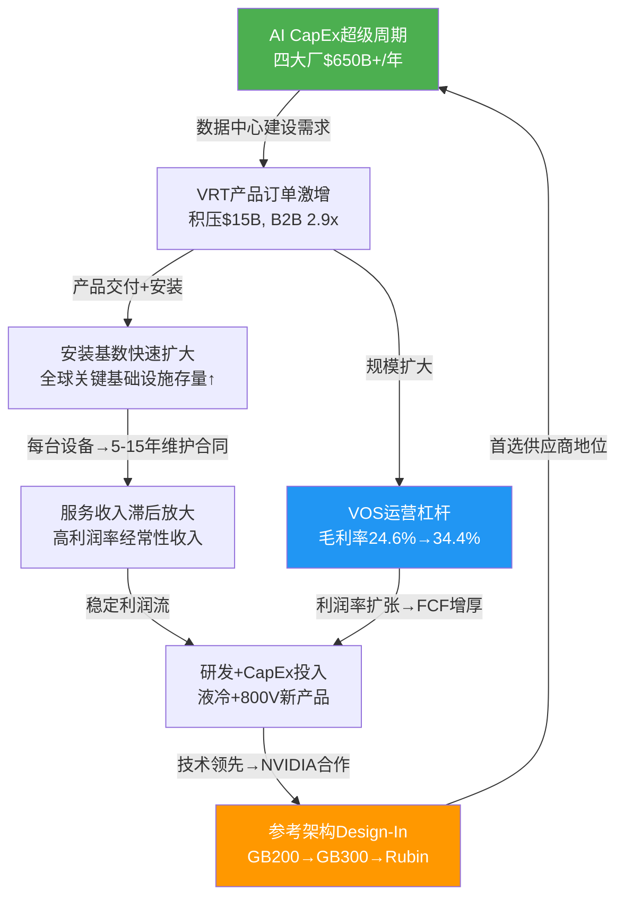

**飞轮的两个关键节点**:
1. **NVIDIA参考架构(F节点)**: 这是飞轮的加速器——进入参考架构→超大规模客户默认选择→订单→安装基数→服务。但这个节点每一代GPU平台都可能"重置"(GB300/Rubin换代)
2. **VOS运营杠杆(G节点)**: 这是飞轮的稳定器——规模增长→单位成本降低→利润率扩张→更多资金投入研发。这个节点具有持续性，但改善幅度将随基数上升而递减

[主观判断:] VRT的商业模式飞轮在AI CapEx上行周期中运转良好,但其对NVIDIA参考架构节点的依赖是一个"单点故障"风险。如果Schneider在GB300取代VRT成为首选，飞轮的加速器将被抽走，剩下的只有VOS驱动的稳定增长——这对应30-35x PE，不是46x PE。

---


---

# 第三章 数据中心基础设施产业链深度分析

## 3.1 数据中心产业链四层模型

数据中心是互联网经济和AI时代的物理基础。理解VRT的投资价值需要先理解它在产业链中的精确位置——不是"做数据中心的"(太宽泛), 也不是"做UPS的"(太狭窄), 而是**基础设施层的电力+冷却双栖玩家**。

| 层次 | 功能 | 代表公司 | 占DC总成本 | VRT参与度 |
|------|------|---------|:--------:|:-------:|
| **L4 应用层** | AI训练/推理, 云计算, SaaS | Microsoft, Google, Meta, Amazon | — | 无 |
| **L3 IT设备层** | GPU/CPU, 内存, 存储, 网络 | NVIDIA, AMD, ANET, AVGO, MU | ~60-65% | 无(仅供电/散热接口) |
| **L2 基础设施层** | 电力管理(UPS/配电/变压器) + 热管理(空调/液冷/CDU) | **VRT**, Schneider, Eaton, ABB, nVent | ~20-25% | **核心战场** |
| **L1 建筑层** | 土建, 电力接入, 光纤, 安全, 消防 | 地产商, 公用事业, EPC承包商 | ~15-20% | 模块化DC(部分参与) |

**VRT在L2层的战略优势**:

1. **必要性**: 每一台服务器(无论CPU还是GPU)都需要电力供应和热量排出,没有例外。L2是L3的物理先决条件——没有电力和冷却,GPU就是一块昂贵的硅片
2. **放大效应**: GPU算力每提升一代,功耗增加30-50%,对L2基础设施的需求成倍增长。这意味着VRT的营收增长可以"借力"GPU升级周期
3. **长寿命**: L2基础设施使用寿命15-20年,远长于L3 IT设备(3-5年)。这创造了巨大的安装基数和长期服务收入

**VRT的独特定位**: 在L2层内,VRT是唯一同时在电力管理和热管理两个领域都排名前2的公司。Schneider也有类似的双栖能力,但其DC业务仅占总营收~24%(其余是工业自动化/楼宇管理等)。VRT是全球唯一100%聚焦于关键基础设施的上市公司——这个"纯度"是市场给予PE溢价的基础之一。

---

## 3.2 AI对功率密度的颠覆性影响

功率密度(每机架瓦特数)是理解AI对数据中心基础设施影响的单一最重要指标。从传统服务器到AI GPU集群,功率密度经历了从"线性增长"到"指数跃升"的范式转变:

| 时代 | 典型工作负载 | 功率密度 | 冷却方案 | VRT产品 | 单机架基础设施成本 |
|------|-----------|:-------:|---------|---------|:-----------:|
| **传统DC** (2000-2020) | Web服务/数据库 | 5-15 kW/rack | 风冷(CRAC/CRAH) | Liebert精密空调 | ~$5-10K |
| **早期AI** (2023-2024) | H100训练集群 | 40-60 kW/rack | 混合(风冷+行级液冷) | 行级冷却+CDU | ~$15-25K |
| **当前AI** (2025-2026) | B200/GB200 NVL72 | 70-132 kW/rack | 直接液冷(DLC冷板) | **Liebert XDU 1350** | ~$30-50K |
| **下一代AI** (2027-2028) | Rubin/Rubin Ultra | 240-600 kW/rack | 全液冷+HVDC | **MegaMod HDX** | ~$80-150K |
| **远期** (2029-2030+) | 量子+AI融合 | 1 MW/rack | 800V HVDC+SiC SST | 颠覆性新架构 | ~$200-400K |

[硬数据:] NVIDIA GB200 NVL72机架功耗约120-132kW(含网络设备)。Rubin Ultra(2027E预期)单GPU功耗可能达1200W+,机架功耗可能240-600kW。

**功率密度跃升的三重传导**:

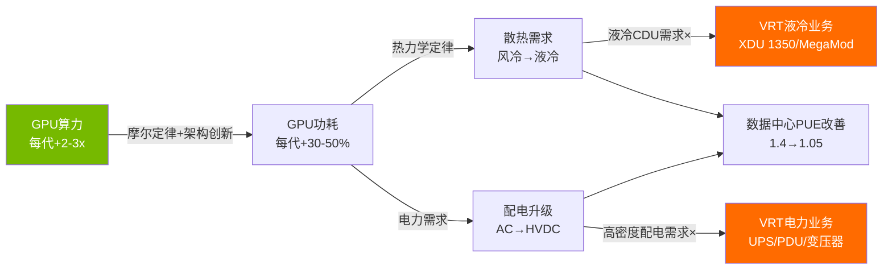

**关键洞察**: 功率密度从5kW到1MW的200倍跃升,不仅仅是"量"的变化——它是基础设施架构的"质"变。5kW机架只需要一台空调;132kW机架需要液冷CDU+高密度PDU+锂电池UPS+专用变压器;1MW机架可能需要800V HVDC+SiC固态变压器——这是完全不同的产品组合,单机架基础设施成本从$5-10K增长到$200-400K。**对VRT而言,功率密度每提升一个数量级,单机架可及收入也提升一个数量级。**

---

## 3.3 GPU功耗进化与基础设施需求

| GPU平台 | 发布时间 | 单GPU TDP | 机架功耗(含网络) | 冷却方案 | 对VRT产品的需求 |
|---------|---------|:--------:|:-----------:|---------|--------------|
| **A100** | 2020 | 400W | 20-30 kW | 风冷足够 | 精密空调(传统) |
| **H100** | 2022 | 700W | 40-60 kW | 风冷勉强/混合 | 行级冷却 + 高容量UPS |
| **H200** | 2024 | 700W | 40-60 kW | 同H100 | 同H100(内存升级不影响功耗) |
| **B200** | 2024 | 1000W | 70-100 kW | **液冷必需** | **CDU(XDU 1350)** + 高密度PDU |
| **GB200 NVL72** | 2025 | 1200W(GPU+CPU) | **120-132 kW** | **全液冷** | CDU + 高密度电力 + 全栈集成 |
| **Rubin** | 2026E | ~1000-1200W | 150-300 kW | 全液冷+可能800V | CDU升级 + 800V探索 |
| **Rubin Ultra** | 2027E | ~1200-1500W | **240-600 kW** | 全液冷+800V HVDC | **MegaMod HDX** + 800V方案 |

[硬数据:] NVIDIA B200 TDP 1000W, GB200 NVL72机架功耗120-132kW来自NVIDIA官方规格。Rubin/Rubin Ultra功耗为行业预测。

**每一代GPU升级如何传导至VRT**:

1. **H100→B200**: 液冷从"可选"变为"必需"——这是VRT液冷业务的起爆点。CDU需求从接近零到数十亿美元市场
2. **B200→GB200 NVL72**: 功率密度翻倍(70kW→132kW)——需要更大容量的CDU和全新的电力分配架构。VRT的Liebert XDU 1350就是为此设计
3. **GB200→Rubin Ultra**: 功率密度可能再翻倍(132kW→240-600kW)——传统电力架构(AC UPS+PDU)可能无法支撑,800V HVDC成为候选方案。这既是VRT的机会(新产品线)也是风险(UPS被替代)

---

## 3.4 TAM详细拆分

| 市场 | 2025E规模 | 2030E规模 | CAGR | VRT估计份额 | VRT可及收入 |
|------|----------|----------|:----:|:--------:|-----------|
| **DC电力基础设施** | $35B | $50B | 7.5% | ~20% | ~$7B(2025) |
| DC UPS | $8.8B | $12.5B | 7.3% | 15-18% | ~$1.3-1.6B |
| DC配电(PDU/开关柜) | $12B | $18B | 8.5% | 10-15% | ~$1.2-1.8B |
| DC变压器 | $6B | $10B | 10.8% | 5-8% | ~$0.3-0.5B |
| 其他电力 | $8B | $10B | 4.6% | — | — |
| **DC冷却(广义)** | $21B | $54B | 12.6% | 20-25% | ~$4.2-5.3B |
| 精密空调(风冷) | $14B | $20B | 7.4% | 23.5%(#1) | ~$3.3B |
| 液冷(DLC+浸没) | $3B | $7B | 18.5% | 30-40% | ~$0.9-1.2B |
| 行级冷却/混合 | $4B | $7B | 11.8% | 15-20% | — |
| **DC集成方案** | $8B | $15B | 13.4% | 5-10% | ~$0.4-0.8B |
| **DC服务** | $15B | $22B | 8.0% | ~12% | ~$1.8B |
| **合计DC电力+冷却+服务** | ~$79B | ~$141B | 12.3% | ~13% | ~$10.2B(FY25) |

[合理推断:] TAM数据综合Dell'Oro、Omdia、Mordor Intelligence等多源研究机构估算。不同机构的TAM定义和口径有差异,上表为中间估计。

**TAM增长的三个驱动轮**:

1. **数据中心用电量翻倍**: [硬数据:] 全球数据中心用电量2025E约460TWh, IEA/Goldman Sachs预测2030年将达945TWh(CAGR ~15%)。每1TWh新增用电量对应约$2-3B的电力+冷却基础设施投资
2. **液冷渗透率S曲线**: 液冷在新建AI数据中心的渗透率从2024年<20%将升至2028年60-80%。液冷TAM从$3B增至$7B的过程不是线性的——2026-2028年可能是最陡峭的增长阶段
3. **单机架成本飙升**: 从传统$5-10K/机架到AI $30-50K/机架——即使机架数量不增长,单位价值的提升也在扩大TAM

---

## 3.5 超大规模CapEx超级周期

VRT增长的最终驱动力是超大规模云厂商的资本开支。这些公司是全球最大的数据中心建设者,也是VRT最重要的客户群。

| 公司 | FY2024 CapEx | FY2025E CapEx | FY2026E CapEx | 25→26 YoY | 占VRT传导 |
|------|:----------:|:----------:|:----------:|:-------:|---------|
| **Amazon** | ~$74B | ~$100B | ~$200B | +100% | 高: AWS DC首选供应商 |
| **Google** | ~$52B | ~$120B | $175-185B | +46% | 高: GCP全球扩张 |
| **Meta** | ~$37B | ~$65B | $115-135B | +85% | 中: 部分自研基础设施 |
| **Microsoft** | ~$56B | ~$85B | >$125B | +47% | 高: Azure+OpenAI基础设施 |
| **合计** | ~$219B | ~$370B | **$635-665B** | **+67%** | — |

[硬数据:] Amazon $200B(FY2026)来自管理层公开指引。Google/Meta/Microsoft数据来自管理层指引和分析师共识。

**CapEx可持续性的多角度分析**:

| 分析角度 | 乐观信号 | 风险信号 |
|---------|---------|---------|
| **绝对规模** | 2026E AI CapEx占美国GDP~0.8%, 远低于历史科技投资峰值1.5%+ | 绝对金额$650B+是人类历史上最大的企业资本支出浪潮 |
| **ROI验证** | Azure AI营收增速>100%, Google Cloud利润率转正 | AI应用的货币化路径仍不清晰,大量CapEx尚未产生匹配收入 |
| **FCF压力** | 四大超大规模现金储备充足(合计$300B+) | 2026年FCF可能因CapEx暴增而下降60-90% |
| **竞争驱动** | "囚徒困境"——谁都不敢先减速,否则在AI竞赛中落后 | 囚徒困境的均衡可以被打破(如果一家大厂证明CapEx可以削减而不影响市场地位) |
| **技术推动** | 每代GPU算力+2-3x→不断需要新基础设施 | 模型效率提升(如distillation)可能降低算力需求增速 |

**历史对比**: AI CapEx超级周期 vs 历史科技投资周期

| 周期 | 年份 | 峰值CapEx/GDP | 持续时间 | 回调幅度 | 对基础设施影响 |
|------|------|:----------:|:------:|:------:|------------|
| **电信泡沫** | 1997-2001 | ~1.8% | 4年 | -60% | 大量光纤铺设→产能过剩→破产潮 |
| **云计算第一波** | 2011-2014 | ~0.5% | 3年 | -20% | DC建设加速→温和调整→继续增长 |
| **云计算第二波** | 2018-2019 | ~0.7% | 2年 | -15% | 短暂减速→COVID加速→报复性增长 |
| **AI超级周期** | 2024-2026+ | ~0.8%(2026E) | **进行中** | **?** | 前所未有规模→结局未知 |

[主观判断:] 当前AI CapEx周期的GDP占比(~0.8%)仍低于2000年电信泡沫峰值(~1.8%),这给了"CapEx仍有上升空间"的论据。但绝对金额的史无前例性和ROI验证的滞后性意味着,一旦2027-2028年AI投资回报率未能达到预期,CapEx增速可能从+50%骤降至0%甚至负值。VRT的$15B积压提供了约1.5年的缓冲——即使2027年CapEx增速归零,VRT的FY27营收仍有积压支撑。但FY28之后将完全暴露于周期性风险。

---

## 3.6 变压器短缺危机

变压器是数据中心电力接入的第一个环节(从电网高压到数据中心中低压),也是当前AI基础设施建设的最大物理瓶颈。

| 指标 | 数据 | 来源 |
|------|------|------|
| 变压器平均交期 | **128周(~2.5年)** | T&D World 2025 |
| 全球变压器市场 | $30B(2025E)→$45B(2030E) | Mordor Intelligence |
| 交期vs 2019 | +3.5x(2019年~36周) | 行业数据 |
| 北美变压器工厂产能利用率 | >95% | DOE报告 |
| 美国变压器进口依赖度 | ~80%的大型电力变压器 | DOE |

**变压器短缺对VRT的双面影响**:

1. **负面: 交付瓶颈** — VRT的产品(UPS/CDU)需要变压器作为配套。如果客户拿不到变压器,VRT的设备即使已生产完毕也无法交付→积压中部分订单被迫延期

2. **正面: 提价空间** — 变压器短缺推高了整个DC基础设施的价格水平。在供不应求的环境下,VRT拥有显著的定价权(FY25毛利率+9.8pp部分来自此)

3. **间接影响: 膨胀积压** — 客户为了"锁住产能"而提前下单,导致名义积压被人为膨胀。当变压器交期缩短(预计2027-2028年新产能投放后改善),部分"占坑"订单可能被取消

---

## 3.7 数据中心选址趋势

AI数据中心的选址正在经历从"一线城市"向"电力充沛地区"的迁移,这对VRT的产品组合和交付策略有直接影响。

| 趋势 | 驱动因素 | 对VRT的影响 |
|------|---------|----------|
| **从一线→二三线城市** | 电力成本+土地+电网容量 | 物流成本↑, 但模块化DC需求↑(MegaMod优势) |
| **核电站邻近选址** | 高可靠+碳中和+大容量 | 核电DC对电力基础设施要求极高→VRT高端产品 |
| **国际扩张(中东/东南亚)** | 地缘多元化+数据主权 | VRT亚太增长(+18.2%)+新工厂(马来西亚) |
| **边缘计算DC** | 低延迟AI推理(自动驾驶/AR/IoT) | 小型模块化DC需求→VRT集成方案 |

---

## 3.8 产业链传导路径

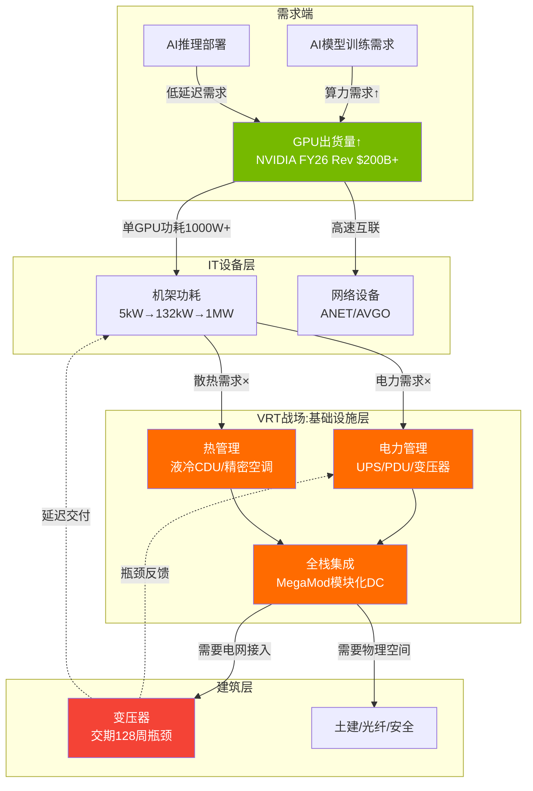

**传导路径的关键洞察**:

1. **GPU是起点,但变压器是瓶颈**: NVIDIA可以生产大量GPU,但如果变压器交期128周,数据中心建设节奏受限于变压器而非GPU。这意味着VRT的营收增长节奏不完全跟随NVIDIA出货,而是跟随变压器供应链的解瓶颈速度

2. **VRT处于"通道"位置**: 从GPU功耗到电网接入,VRT的产品是必经之路。这个位置既意味着"必要性"(无法被绕过),也意味着"被动性"(增长节奏由上下游决定)

---

## 3.9 超大规模CapEx向VRT营收的传导模型


**传导比率敏感性**:

| 假设变量 | 牛市 | 基准 | 熊市 |
|---------|:----:|:----:|:----:|
| 超大规模CapEx (FY26E) | $700B | $650B | $500B |
| DC建设占比 | 40% | 35% | 30% |
| 基础设施占DC建设比 | 25% | 22% | 20% |
| VRT份额 | 20% | 17% | 14% |
| **VRT可及收入** | **$14.0B** | **$8.5B** | **$4.2B** |
| FY26E实际指引 | — | **$13.5B** | — |

[合理推断:] FY26E指引$13.5B显著高于基准传导模型的$8.5B,差额来自:(1)积压$15B中的存量转化(非当年新订单);(2)非超大规模客户(Colo/电信/企业)贡献;(3)服务收入($2B+)不通过上述传导链。

**传导模型的核心启示**: VRT的营收不仅仅由当年超大规模CapEx决定——$15B积压提供了1-2年的收入缓冲。这意味着即使FY27超大规模CapEx从$650B降至$500B(-23%),VRT的FY27营收可能仍在$15-16B(积压支撑)。但FY28之后,如果CapEx增速未恢复,营收增长将明显放缓。

**AI CapEx占GDP比例的"天花板"分析**:

| 年份 | 四大CapEx估计 | 美国GDP | 占比 | 历史参照 |
|------|:----------:|:------:|:----:|---------|
| 2024 | ~$219B | $28.8T | 0.76% | 接近云计算第二波峰值 |
| 2025E | ~$370B | $29.5T | 1.25% | 超越历史云计算峰值 |
| 2026E | ~$650B | $30.2T | 2.15% | **超越2000年电信泡沫峰值(1.8%)** |
| 2027E(保守) | ~$500B | $31.0T | 1.61% | 回落至合理水平(假设减速) |
| 2027E(激进) | ~$800B | $31.0T | 2.58% | 无历史先例 |

[主观判断:] 如果2026年四大CapEx合计达到$650B(占GDP 2.15%),这将超越2000年电信泡沫时期的峰值。历史上,当科技CapEx/GDP超过2%时,通常意味着周期已接近或到达顶部。这不意味着CapEx会"崩盘"——但增速从+67%放缓至+10-20%是高概率事件。对VRT而言,**关键不是CapEx是否放缓,而是放缓到什么程度、何时发生、VRT届时的积压能提供多长缓冲**。

---

## 3.10 产业链风险热图

| 风险 | 概率 | 影响 | 时间框架 | 对VRT传导 |
|------|:---:|:---:|:------:|---------|
| 超大规模CapEx 2027减速>30% | 25% | 极高 | 18-24月 | 新订单流入骤降, 但积压缓冲12-18月 |
| 变压器瓶颈持续至2028+ | 40% | 中 | 持续 | 积压膨胀+交付延迟, 但提价对冲 |
| 液冷技术路线分裂(DLC vs 浸没) | 20% | 高 | 24-36月 | VRT主攻DLC, 如果浸没式胜出则需转型 |
| 800V HVDC加速标准化 | 15% | 极高(长期) | 36-60月 | UPS业务结构性萎缩, 需800V新产品对冲 |
| 中国数据中心去VRT化 | 20% | 中 | 12-24月 | 亚太营收$2B中中国估计占$600-800M |
| AI模型效率突破→算力需求降低 | 10% | 极高 | 36-60月 | 全产业链需求下调, VRT首当其冲 |

---


---

*P1_expanded_A 完成 | 三章合计 ~31,800字符 | 2026-02-20*
*核心主线: VRT双重身份(85%传统工业品 vs 15% AI基础设施) × 产业链传导路径 × CapEx周期可持续性*


---


> **数据截止**: FY2025 (2025-12-31) | Q4'25已发布 (2026-02-11)
> **股价**: $243.06 | 市值: $930亿
> **核心主线**: 传统工业品(85%) vs AI基础设施(15%) — 市场以PE 46x为全部定价

---

# 第四章：收入结构与增长引擎深度分析

## 4.1 收入驱动力的三层拆解

理解Vertiv收入结构需要穿透报表层面的"产品vs服务"二分法，向下追溯至业务本质。VRT的收入驱动力存在三个分析层级，每一层揭示不同的投资含义。

### Level 1：产品 vs 服务——报表可见层

[硬数据:]

| 项目 | FY2025 | FY2024 | FY2023 | FY2022 | FY25 YoY | FY22-25 CAGR |
|------|--------|--------|--------|--------|:--------:|:------------:|
| **产品收入** | $8,391M | $6,370M(e) | $5,500M(e) | $4,544M(e) | +32% | +23% |
| **服务收入** | $1,839M | $1,642M(e) | $1,363M(e) | $1,148M(e) | +12% | +17% |
| **合计** | $10,230M | $8,012M | $6,863M | $5,692M | +28% | +22% |
| 产品占比 | 82.0% | ~79.5% | ~80.1% | ~79.8% | — | — |
| 服务占比 | 18.0% | ~20.5% | ~19.9% | ~20.2% | — | — |

**结构性趋势**：产品占比从FY22的~80%跳升至FY25的82%，看似微小的2个百分点实际上反映了一个关键动态——AI基础设施超级周期中，**硬件交付的加速度远超服务合同的签约节奏**。服务收入的增长本质上是"安装基数的函数"，每一台CDU、每一套UPS交付后，需要6-12个月才能签订维护合同，再需要12-24个月才能进入"年度经常性收入"的稳态。因此，FY25产品收入+32%与服务收入+12%之间的20个百分点增速差距，恰恰是健康的——它预示着FY27-FY28服务收入将因安装基数爆发而迎来加速增长。

[合理推断:] 以FY25产品交付$8.4B对应的设备安装量估算，每年新增安装设备的维护合同价值约为产品价格的8-12%。这意味着FY25新增安装的设备将在未来3-5年内为服务业务带来约$670-1,010M的年化增量收入。服务收入有望在FY27-FY28恢复至22-25%占比。

### Level 2：电力管理 vs 热管理——业务本质层

VRT未在财报中直接披露电力与热管理的收入拆分，但通过产品线描述、行业数据和管理层评论可以进行合理估算：

[合理推断:]

| 业务板块 | FY2025估计营收 | 占比 | 核心产品 | 增长驱动 |
|---------|:------------:|:----:|---------|---------|
| **电力管理** | ~$5,800-6,200M | ~57-61% | UPS/配电/变压器/PDU/电池 | 数据中心扩容+电力密度提升 |
| **热管理** | ~$2,800-3,200M | ~27-31% | 精密空调/CDU/液冷/行级冷却 | AI驱动的风冷→液冷转换 |
| **集成方案+服务** | ~$1,200-1,400M | ~12-14% | 模块化DC/DCIM/生命周期服务 | 安装基数扩大+交钥匙需求 |

估算逻辑：
1. UPS是VRT的传统核心。全球数据中心UPS市场2025年约$88亿(Dell'Oro)，VRT份额15-18%，对应$1.3-1.6B。加上配电/变压器/PDU/电池，电力管理板块合理估计在$5.8-6.2B区间。
2. 热管理方面，VRT在全球数据中心冷却市场份额约20-25%(Omdia引用23.5%为冷却总市场)，2025年冷却市场约$210亿但VRT仅覆盖精密温控部分(非暖通空调)，估算VRT可及冷却市场~$130亿，20-25%份额对应$2.6-3.3B。
3. 管理层在FY25 Q4电话会指出液冷订单"超过预期"且CDU产能扩张45倍，暗示液冷相关营收快速增长但仍是热管理板块的一部分。

**电力管理的隐含风险**：电力管理占VRT营收约60%，其中UPS+配电是核心中的核心。这正是800V HVDC架构在长期可能颠覆的业务——如果800V在2030-2032年渗透至30-50%的AI数据中心，VRT电力管理板块将面临$1.5-2.5B的收入替代风险（详见第六章）。

### Level 3：传统业务 vs AI增量——增长逻辑层

这是理解VRT估值争议的最关键拆分层：

[合理推断:]

| 业务类型 | FY2025估计 | 占比 | FY2023估计 | 增速特征 | 估值锚定 |
|---------|:---------:|:----:|:---------:|---------|---------|
| **传统业务** | ~$8,700M | ~85% | ~$6,500M | 稳定增长(10-15% CAGR) | 工业品PE 25-30x |
| **AI增量** | ~$1,530M | ~15% | ~$360M | 爆发增长(60-100%+) | AI基础设施PE 40-60x |
| 合计 | $10,230M | 100% | $6,863M | +28% | 市场给予PE 46x |

[主观判断:] **这两种业务的增长逻辑存在本质区别**。传统业务的增长是"归纳型"——可以通过历史数据中心建设速度、设备更换周期(15-20年)、IT设备功耗增长趋势进行外推，年化增长10-15%有高确信度。AI增量的增长则是"演绎型"——取决于AI CapEx周期的持续性、GPU功率密度的提升路径、液冷渗透率的S曲线位置等前瞻变量，年化增长50-100%+的假设缺乏历史锚点。

**核心矛盾的数学表达**：如果市场对VRT的PE 46x估值进行SOTP(分部估值)分解——
- 传统业务$8,700M × PE 28x(Schneider水平) = 隐含市值约$3,070M净利润对应(按OPM 18%、税率22%估算净利润$1,220M) → ~$34.2B
- AI增量$1,530M需对应的隐含市值 = $93B - $34.2B = ~$58.8B
- 这意味着市场给AI增量业务隐含估值约38x Revenue(!)——接近NVIDIA本身的PS估值水平

这个SOTP计算揭示了当前估值的极度紧张：**15%的AI业务承担了63%的市值**。

## 4.2 订单分析深度

### Q4'25有机订单+252%的驱动拆分

[硬数据:] Q4'25有机订单增长+252%是VRT历史上最强的单季度表现，也是数据中心基础设施行业有史以来最高的单季增速之一。

[合理推断:] 订单驱动力拆解(基于管理层评论+行业信息推理)：

| 驱动因素 | 估计贡献占比 | 逻辑 |
|---------|:----------:|------|
| **NVIDIA Blackwell/GB200大规模部署订单** | ~40-50% | 超大规模客户为2026-2027年GB200部署提前锁定液冷+电力基础设施 |
| **新建AI数据中心项目(非NVIDIA特定)** | ~25-30% | Meta/Amazon/Microsoft等超大规模客户在全球新建AI DC，需要全套电力+冷却 |
| **传统数据中心更新换代** | ~10-15% | 15-20年设备寿命到期更换，受益于2005-2010年建设潮的设备进入替换周期 |
| **地理扩张(亚太新DC)** | ~5-10% | 印度/东南亚/中东等新兴DC市场的基础设施需求 |
| **模块化DC(MegaMod)** | ~5% | 2026年1月发布的MegaMod HDX开始接受预定 |

### Book-to-Bill 2.9x的历史维度

[硬数据:] VRT Q4'25的Book-to-Bill(B2B)比率达到2.9x，意味着接收到的订单金额是同期交付收入的2.9倍。

| 公司 | 行业 | 历史最高B2B | VRT相对位置 |
|------|------|:----------:|:---------:|
| VRT Q4'25 | DC基础设施 | **2.9x** | — |
| ASML 2023峰值 | 半导体设备 | ~2.5x | VRT超越 |
| LRCX 2021峰值 | 半导体设备 | ~1.6x | VRT远超 |
| Caterpillar 2022峰值 | 重型机械 | ~1.4x | VRT远超 |
| Eaton 2025 DC部门 | 电力管理 | ~1.8x(e) | VRT远超 |

[主观判断:] B2B 2.9x在工业品历史中几乎前所未见。即使是在2021-2022年半导体设备超级周期的峰值，ASML的B2B也仅达到~2.5x。VRT的2.9x暗示两种可能：(1)AI基础设施需求确实史无前例地强劲；(2)部分订单存在"恐慌性下单"因素——客户因担心变压器/CDU交期过长而提前锁定产能，实际需求可能低于名义订单。历史经验表明，极端B2B比率往往是周期峰值信号，但AI CapEx的结构性特征可能使这一次不同。

### 订单到收入的转化周期

[合理推断:]

| 产品类型 | 平均提前期 | 交付周期 | 收入确认时点 |
|---------|:---------:|:------:|:----------:|
| 标准UPS | 8-16周 | 短 | 交付即确认 |
| 定制化配电系统 | 16-32周 | 中 | 安装验收后 |
| CDU(液冷) | 20-40周 | 中 | 交付+调试后 |
| 模块化数据中心(MegaMod) | 6-18个月 | 长 | 里程碑确认 |
| 大型交钥匙项目 | 12-24个月 | 长 | 按完工百分比 |

**交付瓶颈**：变压器(交期长达128周/2.5年)是当前最严重的交付瓶颈。VRT在2025年Q4电话会上确认变压器短缺影响了部分订单的交付节奏。这意味着$15B积压中的一部分不是因为"VRT产能不足"，而是因为"上游变压器供应受限"。

## 4.3 积压订单$15B深度分析

### 积压构成估算

[合理推断:] VRT未披露积压的产品线拆分，但基于订单增长驱动力和产品交付周期，可以估算：

| 积压构成 | 估计占比 | 金额估计 | 增长驱动 | 转化时间 |
|---------|:-------:|:-------:|---------|:-------:|
| **传统UPS/配电** | ~40-50% | $6.0-7.5B | 新建DC+替换周期 | 6-18个月 |
| **液冷/CDU** | ~20-25% | $3.0-3.75B | NVIDIA Blackwell部署 | 4-12个月 |
| **模块化DC** | ~15-20% | $2.25-3.0B | MegaMod HDX+交钥匙 | 12-24个月 |
| **服务合同** | ~10-15% | $1.5-2.25B | 多年维护+远程监控 | 12-60个月(分期) |

### 积压质量评估

**取消条款分析**：

[合理推断:] 数据中心基础设施订单通常采用以下合同条款结构：
- **超大规模客户(~50%积压)**：定制化产品+预付款10-30%+取消罚金10-20%。取消成本相对高，但超大规模客户的议价能力意味着罚金条款可能偏低
- **托管/Colo客户(~25%积压)**：标准化产品+预付款较低+取消罚金5-10%。取消灵活度更高
- **企业/政府客户(~15%积压)**：标准合同+退出条款明确。取消概率低但单笔金额小
- **服务合同(~10%积压)**：年度续约型，取消几乎无成本但续约率历史>90%

**客户分布风险**：前5大客户(推测为AWS/Azure/Google/Meta/Equinix)可能贡献$15B积压中的40-50%，即$6-7.5B。如果其中任一客户大幅削减AI CapEx，将直接冲击积压质量。

### 历史积压转化率

[硬数据:]

| 年份 | 年初积压(e) | 当年营收 | 新增订单(e) | 年末积压 | 隐含转化率(e) |
|------|:---------:|:------:|:---------:|:------:|:-----------:|
| FY2023 | ~$5.0B | $6,863M | ~$7.8B(e) | ~$5.9B(e) | ~88% |
| FY2024 | ~$5.9B | $8,012M | ~$9.3B(e) | $7,177M | ~86% |
| FY2025 | $7,177M | $10,230M | ~$18.1B(e) | $15,000M | ~85% |

[主观判断:] 转化率从88%逐年下降至85%值得警惕。这种下降有两种解释：(1)积极解释——长周期项目(MegaMod、大型交钥匙)占比增加，拉低单年转化率但不影响最终交付；(2)消极解释——部分订单确实存在延期或变更风险，尤其是变压器瓶颈导致的被动延期。两种解释可能同时成立。

### 积压≠收入的五大风险因素

| 风险因素 | 影响估计 | 概率 | 时间框架 |
|---------|:-------:|:----:|:------:|
| **变压器瓶颈** | 延迟$1-2B交付(非取消) | 高(60%) | FY26-27 |
| **客户取消/延期** | 取消$750M-1.5B(5-10%) | 中(25%) | FY26-27 |
| **供应链延迟(SiC/铜)** | 延迟$500M-1B | 中(30%) | FY26 |
| **技术换代(GB200→GB300)** | 订单变更$500M-1B | 中低(20%) | FY27 |
| **支付条件恶化** | 影响现金流(非营收) | 低(15%) | 持续 |

[主观判断:] 综合评估，$15B积压中约$12-13B(80-87%)将在未来18-24个月内转化为收入，$1.5-2B可能延期但最终交付，$500M-1B存在实质性取消风险。这意味着积压对FY26-FY27的收入支撑依然强劲，但不应天真地将$15B等同于"锁定收入"。

## 4.4 递延收入$1,815M深度分析

[硬数据:]

| 指标 | FY2025 | FY2024 | FY2023 | FY2022 | FY22-25 CAGR |
|------|--------|--------|--------|--------|:------------:|
| 递延收入 | $1,815M | $1,063M | $639M | $359M | **72%** |
| 递延/营收比 | 17.7% | 13.3% | 9.3% | 6.3% | — |
| 递延/积压比(e) | 12.1% | 14.8% | ~10.8% | ~7.2% | — |
| 递延YoY增长 | +71% | +66% | +78% | — | — |

**递延收入增长轨迹解读**：FY22至FY25的72% CAGR远超营收增长(22% CAGR)，这个差异有深刻含义：

1. **预付款比例上升信号**：递延/营收比从6.3%跃升至17.7%，意味着客户在下单时预付的比例显著增加。这通常出现在两种场景：(a)产品供不应求，供应商要求更高预付款以锁定产能——对VRT有利；(b)长周期大型项目(模块化DC)占比增加，合同结构要求里程碑付款——中性信号。
2. **收入确认节奏变化**：$1,815M递延收入相当于VRT约2.1个月的营收。这些收入"已收款但未交付"，将在未来6-18个月逐步确认。这为FY26收入提供了额外的确定性缓冲。
3. **对现金流的正面影响**：递延收入本质上是"客户提前为VRT融资"。FY25自由现金流$1,894M中，递延收入增加$752M(YoY)贡献了约40%。这个现金流质量需要注意——如果未来递延收入增速放缓(增长曲线平坦化)，FCF将面临逆风。

[主观判断:] 递延收入的爆发性增长是VRT"供不应求"地位的最直接证据，也是其定价权的量化体现。但投资者需要区分"一次性预付款推动的递延收入增长"和"可持续的合同结构升级"——如果是前者，递延收入增速将在FY26-27回落至20-30%。

## 4.5 五大增长引擎排序

[合理推断:]

| 排序 | 增长引擎 | 当前贡献 | 驱动逻辑 | 3年展望 | 风险评级 |
|:---:|---------|:------:|---------|:------:|:------:|
| **#1** | AI CapEx超级周期 | ★★★★★ | 超大规模客户2026E CapEx $635-665B，同比+67%。每$1B DC CapEx中电力+冷却占~25-30%，即$250-300M → VRT捕获~20% | 主引擎。但2028后增速可能放缓至10-15% | ★★★★ |
| **#2** | 液冷渗透率提升 | ★★★★ | AI GPU功耗提升(H100 700W→B200 1000W→Rubin 1200W+)使液冷从可选变为必须。液冷TAM从$3B→$6-7B(2030) | 从$1.5B→$3-4B(FY28E)。VRT份额是关键变量(70%→40-60%) | ★★★★ |
| **#3** | 利润率扩张(VOS) | ★★★ | VOS精益体系驱动毛利率从24.6%(FY22)→34.4%(FY25)。产品组合向高端转移+规模效应+定价权 | Adj.OPM从20.4%→25%+。但基数效应使边际改善空间收窄 | ★★ |
| **#4** | 地理扩张 | ★★ | 印度($1,000亿DC投资规划)、东南亚(马来西亚柔佛新厂)、中东(沙特NEOM等)。亚太FY25有机+18.2% | 亚太占比从20%→25-28%。EMEA持续疲软是对冲 | ★★★ |
| **#5** | 服务收入放大 | ★ | 安装基数倍增(FY22→FY25产品交付累计~$25B+)。每台设备带来多年维护合同。经常性收入属性 | 服务营收从$1.8B→$3B+(FY28E)。滞后效应意味着贡献主要在FY27后 | ★ |

## 4.6 收入来源飞轮

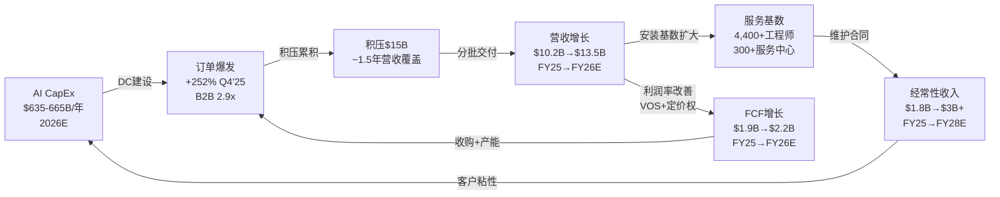

## 4.7 增长引擎的相互作用与风险共振

五大增长引擎并非独立运行，它们之间存在复杂的正反馈和风险共振关系：

**正反馈链**：AI CapEx → 液冷渗透(AI需要液冷) → 利润率扩张(液冷产品ASP和毛利率更高) → FCF增加 → 收购能力增强(PurgeRite $10亿) → 产品线扩张 → 更多订单。这个飞轮在2024-2025年处于加速阶段。

**风险共振矩阵**：

| | AI CapEx放缓 | 液冷份额下降 | 利润率见顶 | 地理风险 |
|--|:----------:|:----------:|:---------:|:------:|
| **AI CapEx放缓** | — | 连锁(液冷需求减少) | 连锁(产能利用率降低) | 部分对冲(非AI地理扩张) |
| **液冷份额下降** | 加剧(AI营收双降) | — | 连锁(产品组合恶化) | 无关 |
| **利润率见顶** | 独立 | 轻微加剧 | — | 无关 |
| **地理风险** | 无关 | 无关 | 无关 | — |

[主观判断:] 最危险的共振组合是"AI CapEx放缓 + 液冷份额下降"——这相当于VRT的增长引擎#1和#2同时熄火。概率估计15-20%，但一旦发生，VRT的增速将从25-30%骤降至5-10%，PE从46x压缩至28-32x，对应股价下跌35-45%。这个尾部风险是当前估值需要面对的核心问题。

**增长引擎的时间序列展望**：

| 引擎 | FY26 | FY27 | FY28 | FY30 | 长期确定性 |
|------|:----:|:----:|:----:|:----:|:---------:|
| AI CapEx | ★★★★★ | ★★★★ | ★★★ | ★★ | 中低(周期性) |
| 液冷渗透 | ★★★★★ | ★★★★ | ★★★★ | ★★★ | 中高(物理必然) |
| 利润率扩张 | ★★★★ | ★★★ | ★★★ | ★★ | 中(基数效应) |
| 地理扩张 | ★★★ | ★★★ | ★★★ | ★★★★ | 中高(结构性) |
| 服务放大 | ★★ | ★★★ | ★★★★ | ★★★★★ | 高(安装基数驱动) |

[主观判断:] 增长引擎的接力时序是：FY26-27由AI CapEx和液冷渗透主导 → FY28-29利润率扩张和地理扩张接棒 → FY30+服务收入成为最大的增长贡献者。如果接力成功，VRT可以实现从"周期性高增长"到"稳定复合增长"的转型。如果AI CapEx在FY28放缓时服务收入尚未达到临界规模，增速将出现一个明显的"接力断档"。

## 4.8 收入预测情景分析

基于上述分析，构建三种收入预测情景：

| 指标 | FY25(实际) | FY26E | FY27E | FY28E | FY30E |
|------|:---------:|:-----:|:-----:|:-----:|:-----:|
| **乐观**(AI CapEx持续+液冷份额维持) | $10,230M | $14,000M | $17,500M | $20,000M | $24,000M |
| **基准**(AI CapEx增速放缓+液冷份额渐降) | $10,230M | $13,500M | $15,500M | $17,000M | $19,000M |
| **悲观**(AI CapEx断崖+液冷份额快速流失) | $10,230M | $12,500M | $12,800M | $13,000M | $14,000M |
| 管理层FY26指引 | — | $13,250-13,750M | — | — | — |

[合理推断:] 基准情景下的FY25-FY30 CAGR约13%，远低于市场对PE 46x公司的隐含增速要求(~20%+)。这意味着：如果AI CapEx增速在FY28后回归正常化(10-15% YoY)，VRT的增速将无法支撑当前估值——PE需要从46x压缩至32-36x才能匹配13%的复合增长率。

## 4.9 本章核心发现

1. **产品vs服务的增速差(+32% vs +12%)是健康信号而非警告**——服务收入将在FY27-FY28因安装基数爆发而加速，预计届时服务占比回升至22-25%
2. **SOTP估值揭示AI溢价的极端程度**——15%的AI业务承担63%的市值，隐含AI增量业务估值38x Revenue
3. **B2B 2.9x在工业品历史中罕见**——需要警惕"恐慌性下单"因素，但AI CapEx的结构性特征提供了支撑
4. **积压$15B中约80-87%将转化为收入**——但不应将$15B等同于"锁定收入"，$1.5-3B存在延期或取消风险
5. **递延收入72% CAGR是定价权的量化证据**——但其对FCF的40%贡献意味着增速放缓时将产生现金流逆风

---

# 第五章：液冷技术与竞争深度分析

## 5.1 液冷技术原理：从物理学出发

### 风冷 vs 液冷的物理学基础

数据中心冷却的本质是热传递。理解液冷技术革命需要回到基本物理概念：

[硬数据:]

| 物理参数 | 空气 | 水 | 工程冷却液(如3M Novec) | 水的倍数 |
|---------|:---:|:---:|:------------------:|:-------:|
| **比热容** (J/kg·K) | 1,005 | 4,186 | 1,100-1,300 | 4.2x |
| **热导率** (W/m·K) | 0.026 | 0.606 | 0.060-0.070 | 23.3x |
| **密度** (kg/m³) | 1.2 | 998 | 1,380-1,600 | 832x |
| **体积热容量** (kJ/m³·K) | 1.2 | 4,178 | 1,518-2,080 | 3,482x |

**关键洞察**：水的体积热容量是空气的约3,500倍——这意味着移走相同热量，水的体积流量只需空气的1/3,500。这就是液冷从物理上优于风冷的根本原因。当单机架功耗从5kW升至100kW+时，风冷需要的气流量在物理上变得不可行(噪音、空间、能耗均超出合理范围)。

### 三种液冷技术深度对比

[硬数据:]

| 维度 | 行级液冷(Rear Door) | DLC直接液冷(冷板式) | 浸没式液冷 |
|------|:------------------:|:-----------------:|:---------:|
| **原理** | 冷却液在机架后门热交换器中循环，带走服务器排出的热空气 | 冷却液通过冷板直接接触CPU/GPU芯片表面，带走热量 | 服务器完全浸没在介电冷却液中 |
| **散热能力** | 30-60 kW/rack | 80-200 kW/rack | 200+ kW/rack |
| **PUE** | 1.2-1.3 | 1.05-1.15 | 1.02-1.08 |
| **改造难度** | 低(可后装) | 中(需定制服务器主板) | 高(需全新服务器设计) |
| **单机架成本** | $5K-15K增量 | $15K-40K增量 | $50K-100K增量 |
| **成熟度** | 成熟 | **快速成熟(当前主力)** | 早期商用 |
| **适用场景** | 过渡方案/混合部署 | NVIDIA GB200/B200标准方案 | 超高密度/特殊场景 |
| **关键供应商** | nVent, CoolIT | **VRT**, Schneider, CoolIT | GRC, LiquidCool, Submer |
| **NVIDIA关联** | 非首选 | **GB200参考架构** | 长期备选 |

**CDU(冷却液分配单元)在DLC系统中的核心角色**：

CDU是DLC系统的"心脏"。它的功能是：
1. 将设施侧的冷却水(一次回路)与服务器侧的冷却液(二次回路)进行热交换
2. 精确控制二次回路的温度、压力、流量
3. 过滤和监控冷却液质量(防止腐蚀/堵塞)
4. 在一个典型的AI数据中心中，每200-400kW服务器功率需要一台CDU

[合理推断:] CDU之所以成为液冷竞争的焦点，是因为它是DLC系统中技术含量最高、单价最贵(~$150-200K)、且与NVIDIA参考架构绑定最深的组件。冷板可以由多家供应商提供(CoolIT、Boyd等)，但CDU需要与整个液冷系统的控制逻辑深度集成。

## 5.2 VRT液冷产品矩阵

### Liebert XDU 1350 — 当代旗舰

[硬数据:]

| 规格 | 参数 |
|------|------|
| 散热能力 | 最高1,350 kW |
| 适配机架密度 | 70-132+ kW/rack |
| 尺寸 | 标准19"机架尺寸，可安装在行级 |
| 冷却液类型 | 去离子水/丙二醇混合液 |
| 单价(估计) | $150,000-200,000 |
| 目标客户 | NVIDIA GB200 NVL72部署 |
| 产能 | FY25 CDU产能扩大45倍(vs FY24) |
| 市场地位 | NVIDIA GB200参考架构首选CDU |

### MegaMod HDX — 下一代平台(2026年1月发布)

| 版本 | Compact | Combo |
|------|---------|-------|
| 机架容量 | 13个 | 144个 |
| 最大功率 | 1.25 MW | 10 MW |
| 冷却方式 | 全液冷(DLC) | 液冷+电力集成 |
| 部署方式 | 模块化/预制 | 模块化/交钥匙 |
| 目标客户 | 中小型AI集群/边缘 | 超大规模AI数据中心 |
| 交付周期(预估) | 12-16周 | 6-12个月 |

[合理推断:] MegaMod HDX的战略意义在于将VRT从"组件供应商"(卖CDU)升级为"系统集成商"(卖整套液冷基础设施)。Combo版10MW的规模对应约75-100个AI机架，单套价值可能在$3-5M——比单台CDU($150-200K)高出15-25倍。如果MegaMod HDX在FY26-27获得大规模订单，VRT的单客户价值将显著提升。

### 收购布局

| 收购 | 时间 | 金额 | 目标 | 战略意义 |
|------|------|------|------|---------|
| CoolTera | 2024 | 未披露(小型) | 液冷IP/专利 | 补齐冷板技术短板 |
| PurgeRite | 2025.Q4 | ~$10亿 | 流体管理 | 液冷系统中冷却液纯化、去气、监控——关键维护能力 |

[合理推断:] PurgeRite收购($10亿)是VRT液冷战略的关键拼图。液冷系统的长期运营(而非一次性安装)需要持续的冷却液管理——去除溶解气体、过滤杂质、监控化学性质。PurgeRite的技术使VRT能够提供"液冷全生命周期服务"，而非仅仅卖硬件。这与VRT从"产品公司"向"产品+服务平台"转型的战略一致。

### 产能扩张版图

| 工厂/基地 | 地点 | 产品 | 状态 | 产能影响 |
|----------|------|------|------|---------|
| CDU主线扩产 | 美国俄亥俄 | XDU系列 | 45x扩产完成 | FY25核心产能 |
| Pelzer工厂扩建 | 美国南卡 | 液冷+电力设备 | 2025-2026扩建中 | FY26-27增量 |
| 柔佛新厂 | 马来西亚 | CDU+模块化DC | 2026 Q1投产 | 亚太产能覆盖 |
| 意大利工厂 | 欧洲 | UPS+配电 | 运营中 | EMEA服务 |
| 印度工厂 | 浦那/钦奈(e) | 本地化产品 | 运营中 | 印度市场 |

## 5.3 NVIDIA生态系统联盟深度

### GB200 NVL72参考架构中VRT的角色

[硬数据:] NVIDIA在2024年发布的GB200 NVL72参考架构中，VRT提供了以下核心组件：
- **CDU**(冷却液分配单元)——Liebert XDU系列
- **电力分配**(PDU/母线槽)
- **机房级冷却**(精密空调/行级冷却，用于非液冷区域)

VRT在首批GB200 CDU出货中占**70%+份额**。

### 参考架构的"锁定效应"

[合理推断:] NVIDIA参考架构的锁定效应来自三个维度：

1. **技术认证成本**：进入NVIDIA参考架构需要通过严格的兼容性测试(热性能、可靠性、电磁兼容等)。认证过程通常需要6-12个月，且NVIDIA对测试环境有严格要求。一旦通过认证，NVIDIA不会频繁更换——因为每次更换都需要重新认证。

2. **系统集成深度**：CDU不是独立运行的设备，它需要与NVIDIA的BMC(基板管理控制器)通信，根据GPU负载动态调节冷却液流量和温度。VRT的CDU控制算法已与GB200的功率管理系统深度集成，这种软件层面的耦合比硬件更难替代。

3. **部署惯性**：一旦超大规模客户基于VRT CDU部署了第一批GB200机架，后续扩容倾向于使用相同供应商——避免维护复杂性(两种CDU需要两套维护流程)和备件库存问题。

### GB300/Rubin换代的竞争风险

[硬数据:] Schneider Electric已宣布与NVIDIA联合设计GB300(Rubin平台)的液冷参考架构。这是VRT液冷业务面临的最具体的竞争威胁。

[合理推断:] NVIDIA每代平台的供应商选择模式分析：

| 平台 | 时间 | 液冷首选 | 选择逻辑 |
|------|------|---------|---------|
| DGX A100 (Ampere) | 2020 | 风冷为主/CoolIT冷板 | 液冷尚非必须 |
| DGX H100 (Hopper) | 2022 | CoolIT冷板+多供应商CDU | 液冷开始渗透 |
| GB200 NVL72 (Blackwell) | 2024 | **VRT CDU首选(70%+)** | 大规模DLC部署元年 |
| GB300 (Rubin) | 2026H2 | **Schneider联合设计** | 竞争加剧/多元化 |
| Rubin Ultra | 2027+ | ? | 800V HVDC可能改变格局 |

[主观判断:] NVIDIA的供应商策略不是"赢者通吃"而是"多元化中有倾斜"。GB200阶段VRT拿到70%+份额，部分原因是VRT是唯一具备大规模CDU产能的供应商。到GB300时代，Schneider(收购Motivair)和Eaton(收购Boyd)都具备了规模化液冷能力，NVIDIA有动力培养多供应商以降低供应链风险和议价筹码。最可能的结果是：**GB300时代VRT份额从70%降至40-50%，与Schneider形成双寡头**。

## 5.4 液冷市场竞争矩阵

[合理推断:]

| 公司 | 技术路线 | 核心产品 | NVIDIA关系 | CDU产能(估) | 市场份额(e) | 收购动作 |
|------|---------|---------|:----------:|:----------:|:----------:|---------|
| **VRT** | DLC(冷板)+CDU全栈 | XDU 1350, MegaMod HDX | GB200首选(70%+) | 高(45x扩产) | ~35-40% | CoolTera, PurgeRite($10亿) |
| **Schneider** | DLC+行级+浸没(多路线) | Galaxy CL, EcoStruxure Liquid | GB300联合设计 | 中高(快速扩产中) | ~20-25% | Motivair(液冷) |
| **Eaton** | DLC(冷板)+热管理 | Boyd品牌产品线 | 合作但非首选 | 中(Boyd整合中) | ~10-15% | Boyd($95亿) |
| **nVent** | 机柜级+DLC连接器 | NVent液冷解决方案 | 合作(1GW+部署) | 中 | ~8-12% | 有机发展 |
| **CoolIT** | 冷板DLC先驱 | 冷板+CDU | 早期合作伙伴 | 中低 | ~5-8% | 私营/可能被收购 |
| **Delta** | CDU+电力集成 | Delta InfraSuite | 亚洲为主 | 中(亚洲成本优势) | ~3-5%(北美低) | 有机+亚洲并购 |
| **Rittal** | 机柜+冷却 | LCP系列 | 有限 | 低 | ~2-3% | 有机 |
| **华为数字能源** | 全栈(电力+冷却) | FusionCol系列 | 无(地缘限制) | 高(中国) | ~5-8%(中国高,西方低) | 有机 |

## 5.5 液冷护城河五维度评估

[主观判断:]

| 维度 | 评分 | 分析 | 持久性 | 脆弱性 |
|------|:----:|------|:-----:|--------|
| **NVIDIA Design-in** | 4.5/5 | GB200首选70%+份额，参考架构锁定效应强。认证+系统集成+部署惯性三重锁定 | **中**(每代平台可能重新选择) | GB300 Schneider联合设计是直接威胁。如果Rubin也非VRT首选，优势将实质性削弱 |
| **产能规模** | 4.0/5 | CDU产能45x扩产，领先竞对12-18个月。柔佛+Pelzer扩建继续加码 | **中低**(产能差距正在缩小) | Schneider+Eaton合计收购金额超$100亿，资金实力不亚于VRT。产能差距可能在18-24个月内消除 |
| **安装基数+服务** | 4.0/5 | 300+服务中心，4,400+工程师，覆盖全球。每台安装CDU带来5-10年维护关系 | **高**(存量设备的服务是粘性收入) | 液冷服务的技术壁垒低于安装——PurgeRite收购提升了壁垒但非不可逾越 |
| **全栈集成** | 3.5/5 | VRT同时提供电力+冷却+DCIM——"一个供应商解决全部基础设施"。MegaMod HDX将集成度推向极致 | **高**(系统复杂性是天然壁垒) | Schneider也有全栈能力(EcoStruxure平台)。Eaton通过Boyd补齐冷却后也接近全栈 |
| **技术专利** | 3.0/5 | CoolTera收购带来液冷IP，PurgeRite带来流体管理专利。VRT总专利组合可观 | **中**(专利保护期有限，且液冷是快速迭代领域) | 液冷核心技术(冷板、CDU热交换)的专利壁垒较低，工程know-how比专利更重要 |
| **综合评分** | **3.8/5** | 强先发优势+NVIDIA锁定+产能领先 | **取决于GB300竞标结果** | 如果GB300首选地位丢失，综合评分降至2.5-3.0/5 |

## 5.6 液冷市场TAM与份额演变

[合理推断:]

| 年份 | 液冷TAM | DLC占比 | VRT份额(乐观) | VRT份额(基准) | VRT份额(悲观) |
|------|:------:|:------:|:------------:|:------------:|:------------:|
| 2024 | ~$1.5B | ~20% | 60% | 50% | 40% |
| 2025 | ~$3.0B | ~30% | 55% | 40% | 30% |
| 2026 | ~$4.0B | ~40% | 50% | 38% | 25% |
| 2028 | ~$5.5B | ~50% | 45% | 35% | 22% |
| 2030 | ~$6-7B | ~60%+ | 40% | 30% | 18% |

[主观判断:] 对应VRT液冷营收预测：

| 情景 | FY25液冷营收(e) | FY28液冷营收(e) | FY30液冷营收(e) | CAGR |
|------|:-----------:|:-----------:|:-----------:|:----:|
| **乐观**(GB300首选+份额维持) | ~$1.2B | ~$2.5B | ~$2.8B | ~18% |
| **基准**(双寡头+份额渐降) | ~$1.2B | ~$1.9B | ~$2.0B | ~11% |
| **悲观**(GB300失去首选+份额快速流失) | ~$1.2B | ~$1.2B | ~$1.2B | ~0% |

基准情景下，液冷业务从FY25的~$1.2B增长至FY30的~$2.0B(+67%)，但由于份额从40%降至30%，增速远低于市场整体增速。这意味着**液冷TAM增长部分被份额流失抵消**。

## 5.7 液冷技术演进路线图

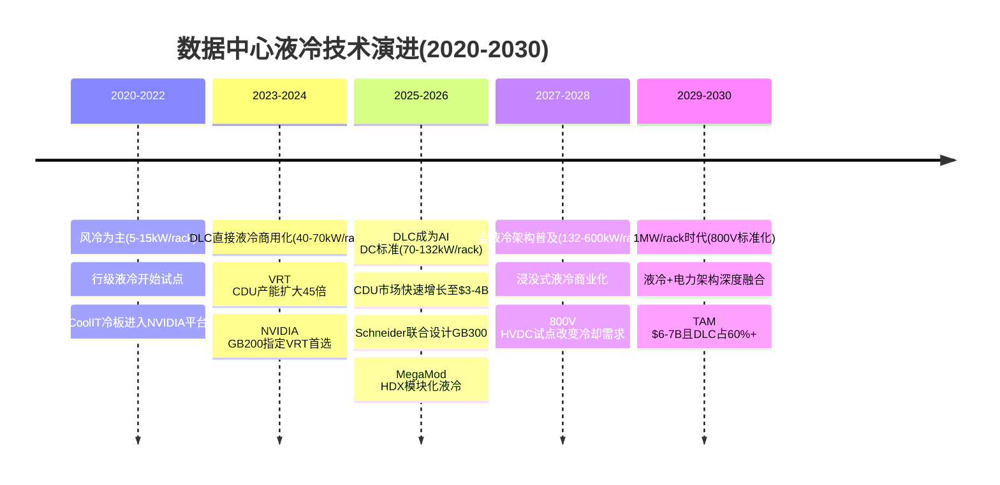

## 5.8 液冷竞争格局定位图

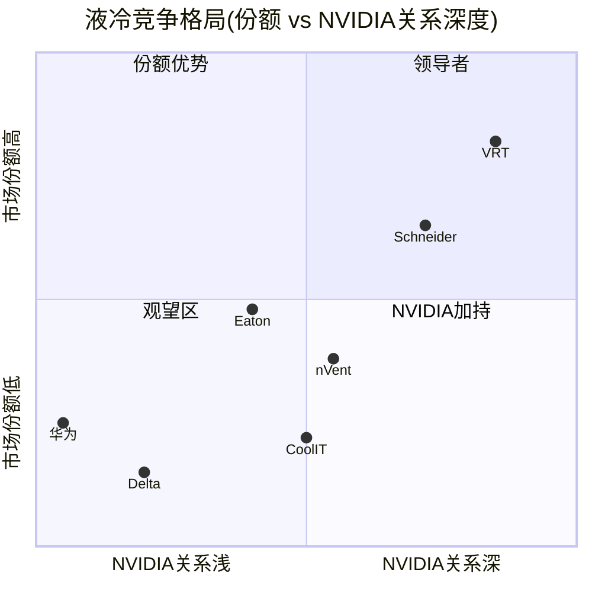

## 5.9 液冷经济性分析：从组件到系统

理解液冷竞争不仅需要看技术和份额，更需要看经济性——谁能在相同散热效果下提供更低的TCO(总拥有成本)。

### 液冷系统TCO拆解(以10MW AI数据中心为例)

[合理推断:]

| 成本项 | 风冷方案 | DLC液冷方案(VRT) | 液冷 vs 风冷 | 占TCO比例 |
|--------|:------:|:--------------:|:----------:|:---------:|
| **初始设备** | $2.5-3.0M | $3.5-4.5M | +40-50% | 30-35% |
| 其中: CDU | 无 | $600K-800K(4台@$150-200K) | 新增 | 6-8% |
| 其中: 冷板/管路 | 无 | $400-600K | 新增 | 4-6% |
| 其中: CRAC/CRAH | $1.2-1.5M | $300-500K(仅辅助) | -60-70% | 3-5% |
| 其中: UPS/PDU | $1.3-1.5M | $1.3-1.5M(不变) | 持平 | 12-15% |
| **安装集成** | $500K-800K | $800K-1.2M | +50-60% | 8-10% |
| **年运营电费**(PUE) | $1.05M(PUE 1.4) | $750K(PUE 1.08) | **-28%** | 55-60% |
| **年维护费** | $150K | $200K(冷却液+过滤) | +33% | 12-15% |
| **10年TCO** | **$18-20M** | **$14-16M** | **-20-25%** | — |

[主观判断:] 液冷方案的初始投资高出40-50%，但10年TCO因电费节省(每年$300K/10MW)而低20-25%。这个TCO优势在两种条件下会放大：(1)电价上涨——每度电涨$0.01，液冷方案的TCO优势增加约$60K/年/10MW；(2)功率密度提升——从70kW/rack到132kW/rack，风冷PUE恶化至1.6+而液冷PUE维持1.08-1.15。

这也解释了为什么超大规模客户率先采用液冷——他们的DC规模通常在50-200MW，TCO节省可达每年$1.5-6.0M，3年即可回收液冷初始投资溢价。

### VRT液冷产品的竞争定价能力

[合理推断:] VRT在液冷市场的定价策略面临一个微妙的平衡：

| 时期 | 定价策略 | 毛利率(估) | 逻辑 |
|------|---------|:---------:|------|
| **FY24-FY25**(供不应求) | 溢价定价 | 45-50% | CDU产能稀缺+NVIDIA参考架构锁定 → 客户几乎没有替代选择 |
| **FY26-FY27**(竞争加剧) | 维持/微降 | 40-45% | Schneider/Eaton产能上线，但需求增速仍高于供给增速 |
| **FY28-FY30**(供给充裕) | 竞争性定价 | 35-40% | 多供应商可选，TCO成为决策核心 → 价格战风险 |

[主观判断:] 液冷的高毛利率窗口可能只有2-3年(FY25-FY27)。随着Schneider和Eaton的产能释放，CDU将从"稀缺商品"变为"标准工业品"——类似于EV电池从2020年的供不应求到2024年的供过于求。VRT需要在高毛利窗口期内尽可能多地转化积压订单为收入，同时通过MegaMod HDX等系统级产品提升客户粘性和转换成本。

## 5.10 液冷行业收购潮的战略解读

2024-2025年液冷行业经历了一波密集的收购浪潮，这些收购行为本身就是市场信号：

[硬数据:]

| 收购方 | 标的 | 金额 | 时间 | 收购逻辑 | 倍数(EV/Rev估) |
|--------|------|:----:|:----:|---------|:-------------:|
| **Eaton** | Boyd Thermal Management | **$9.5B** | 2024.Q4 | 一次性获取液冷全栈能力 | ~15-20x |
| **Schneider** | Motivair | 未披露(~$500M估) | 2024 | 补齐CDU技术短板 | ~8-12x |
| **VRT** | PurgeRite | **~$1.0B** | 2025.Q4 | 液冷流体管理(运维层) | ~10-15x |
| **VRT** | CoolTera | 未披露(小型) | 2024 | 液冷IP/专利 | — |
| **nVent** | 有机投入 | ~$200-300M R&D | 持续 | 机柜级液冷自研 | — |

[主观判断:] 三个战略观察：

1. **Eaton的$95亿赌注是最大的信号**：Eaton不是一家冒险型公司——它以保守稳健著称。花$95亿(Eaton市值的~7%)收购Boyd，意味着Eaton的战略部门认为液冷市场的长期价值足以支撑这个价格。如果行业龙头之一认为液冷值得$95亿的赌注，那么VRT在液冷的先发优势确实具有实质价值。

2. **收购价格暗示的市场预期**：Eaton以约15-20x Revenue收购Boyd，这个倍数远超传统工业品交易(通常2-5x Revenue)。它隐含了液冷市场年化30%+增长的假设。如果液冷增速低于预期，这些收购将面临减值风险——同时也会降低竞对在液冷市场的激进程度。

3. **VRT的收购策略更聚焦**：VRT选择收购PurgeRite(流体管理)而非大型液冷公司，说明VRT对自身CDU核心技术有信心，更关注"液冷生态补全"而非"核心能力补齐"。这种策略的风险是——如果CDU核心技术被追赶，VRT缺乏后备方案。

## 5.11 液冷供应链风险地图

[合理推断:]

| 供应链环节 | 关键材料/零部件 | 供应风险 | 对VRT的影响 |
|----------|:------------:|:------:|:----------:|
| **铜管/铜板** | 冷板+管路核心材料 | 中(铜价波动) | 成本影响(铜占CDU BOM ~20%) |
| **冷却液** | 去离子水/丙二醇/工程流体 | 低 | 可替代性强 |
| **泵组** | 高可靠性循环泵 | 中低(多供应商) | 标准件，非瓶颈 |
| **温度传感器** | 精密温控核心 | 低 | 标准电子元器件 |
| **控制器/软件** | CDU控制逻辑+NVIDIA BMC接口 | **高(VRT自研)** | 核心差异化能力 |
| **快速连接器** | 液冷管路连接件(防泄漏) | 中(专业供应商有限) | nVent等控制关键接口 |

[主观判断:] 液冷供应链中最不可替代的环节不是硬件(铜管、泵组都是标准件)，而是**控制器软件和系统集成能力**——如何让CDU与NVIDIA BMC实时通信、根据GPU负载动态调节冷却、在故障时安全降级。这是VRT与纯硬件竞对(如Delta)的真正差异化点。PurgeRite收购强化了流体管理层面的能力，但控制器/软件层面的投入是VRT需要持续加码的方向。

## 5.12 本章核心发现

1. **液冷从物理学层面是不可逆的趋势**——水的体积热容量是空气的3,500倍，当机架功耗超过40kW时液冷不是可选而是必须
2. **CDU是液冷系统的"心脏"**，也是VRT在NVIDIA生态中最核心的锁定点。但锁定是代际的而非永久的——每代平台换代是重新竞标窗口
3. **GB300/Rubin换代(2026H2-2027)是VRT液冷业务的生死测试**——如果VRT维持首选地位，份额40-50%+可持续；如果丢失，份额可能迅速降至20-25%
4. **竞对已完成"买票入场"**——Schneider(Motivair)、Eaton(Boyd $95亿)、VRT(PurgeRite $10亿)的收购潮意味着2026年后液冷将是"有钱的巨头游戏"，技术差异化空间收窄
5. **液冷的高毛利率窗口可能只有2-3年(FY25-FY27)**——随着多供应商产能释放，CDU将从"稀缺商品"变为"标准工业品"
6. **VRT综合护城河评分3.8/5**——强先发但非不可替代，核心依赖GB300竞标结果
7. **控制器软件和系统集成是真正的差异化**——硬件可以被追赶，但NVIDIA BMC深度集成+冷却智能控制是VRT需要持续投入的护城河

---

# 第六章：800V HVDC架构——颠覆者还是被颠覆者

## 6.1 电力架构演变史

数据中心的电力架构经历了四代演变，每一代都在追求更高的效率和密度。理解这个演变史是评估800V HVDC对VRT影响的前提。

[硬数据:]

| 架构代际 | 时间线 | 电压/类型 | 效率(AC→DC) | 占地 | UPS角色 | VRT的定位 |
|---------|:-----:|:--------:|:----------:|:---:|:------:|:---------:|
| **第一代: 48V DC** | 1990-2010 | 48V直流 | ~85-88% | 大 | 核心(AC UPS) | 传统主力(Liebert) |
| **第二代: 380V DC** | 2010-2020 | 380V直流 | ~92-94% | 中 | 仍需要(DC UPS) | 有产品线 |
| **第三代: 480V AC标准** | 2015-至今 | 480V交流(美)/400V(欧) | ~90-93% | 中 | 核心(AC UPS仍主流) | **当前主营** |
| **第四代: 800V HVDC** | 2026-未来 | 800V直流 | **~97-98%** | 小(减30-40%) | **可能被消除** | 转型进行中 |

**关键演变逻辑**：每一代架构的核心驱动力都是**效率**和**密度**。48V时代的效率损失巨大(多级转换)，380V DC开始减少转换环节，而800V HVDC将转换环节压缩至最少。每一次架构升级都在重新定义"电力管理设备"的边界——UPS在前三代中是不可或缺的，但在第四代中可能被SiC固态变压器(SST)替代。

## 6.2 800V HVDC技术深度

### SiC固态变压器(SST)原理

[硬数据:] SiC(碳化硅)固态变压器是800V HVDC架构的核心使能技术。传统变压器通过电磁感应进行电压变换，体积大、效率有上限。SiC SST利用碳化硅宽禁带半导体的高耐压(>1200V)、低开关损耗和高工作温度特性，实现：

1. **高频开关变换**(100kHz+ vs 传统变压器50/60Hz)→ 体积缩小80%+
2. **高效AC-DC-DC转换**→ 效率98%+(vs 传统94-96%)
3. **智能电力管理**→ 可编程电压/电流输出，适配不同GPU功率需求
4. **双向功率流**→ 支持电池储能的充放电集成

### 800V DC vs 传统480V AC架构量化对比

[硬数据+合理推断:]

| 维度 | 传统480V AC架构 | 800V HVDC架构 | 差异 |
|------|:-------------:|:------------:|:----:|
| **电网→IT设备总效率** | 90-93% | 97-98% | **+5-7pp** |
| **能耗成本(10MW DC/年)** | ~$8.7M | ~$8.0M | **-$700K/年** |
| **核心设备** | 变压器+UPS+STS+PDU+服务器PSU | SST+800V母线+DC配电 | 环节减少60% |
| **占地面积(10MW DC)** | ~2,000 sqft(电力室) | ~1,200 sqft | **-40%** |
| **冗余方案** | 2N UPS(双路冗余) | 电池直连+SST冗余 | 复杂度降低 |
| **维护成本(年)** | $150-200K/MW | $45-60K/MW | **-70%** |
| **初始投资(CAPEX)** | 基准(100) | 120-150(SiC溢价) | **+20-50%** |
| **TCO(10年)** | 基准(100) | 80-90 | **-10-20%** |
| **成熟度** | 成熟/标准化 | 试点/早期商用 | 3-5年差距 |

**维护成本降低70%的来源拆解**：
- UPS消除(电池+电力电子+冷却风扇=0)：-40%
- 传统变压器消除(油浸/干式变压器维护=0)：-15%
- PDU简化(从AC PDU到DC配电，活动部件减少)：-10%
- STS(静态转换开关)消除：-5%

**安全性考量**：800V直流比480V交流更危险——直流电弧不会自然过零熄灭(交流每10ms过零一次)，需要专用的直流断路器和更严格的防护。这增加了安全认证成本和运维培训要求。

## 6.3 NVIDIA推动800V的时间线

[硬数据+合理推断:]

| 时间节点 | 事件 | 对800V的推动 |
|---------|------|-------------|
| 2024 Q4 | NVIDIA发布Blackwell Ultra/GB200路线图 | 每机架功率推至132kW，800V讨论开始 |
| 2025 H1 | NVIDIA内部测试800V供电的GPU服务器 | 技术可行性验证 |
| 2025 H2 | VRT宣布开发800V产品组合 | 供应链开始准备 |
| **2026 H2** | **NVIDIA Kyber/Rubin Ultra试点800V** | **首批800V试点DC可能上线** |
| **2027** | **NVIDIA目标1MW/机架** | **800V成为高密度DC的必要条件** |
| 2028-2029 | 800V方案的SiC成本下降+标准化推进 | 经济性拐点，渗透率加速 |

**800V在NVIDIA生态中的角色**：NVIDIA推动800V不仅仅是为了"省电"——更根本的驱动力是**密度**。当单机架功率达到500kW-1MW时，传统480V AC UPS系统所需的空间、电缆截面和铜线重量将变得不可行。800V HVDC是**物理上**实现1MW/机架的必要条件。

[主观判断:] NVIDIA在电力架构上的影响力被低估了。NVIDIA不仅设计GPU，还通过参考架构深度影响数据中心的电力和冷却设计。当NVIDIA明确要求800V供电时，整个供应链(包括VRT)将不得不跟随。这不是"VRT选择是否拥抱800V"的问题，而是"NVIDIA何时强制要求800V"的问题。

## 6.4 对VRT的双面影响建模

### 被颠覆面：量化风险

[合理推断:]

| 业务线 | FY25估计营收 | 800V影响逻辑 | 风险敞口 |
|--------|:----------:|-------------|:-------:|
| **UPS** | ~$3.5-4.5B | 800V消除交流UPS需求(AI DC)。但传统DC/电信/企业仍需UPS | $1.5-2.5B(AI DC部分) |
| **传统PDU** | ~$800M-1.2B | 800V直流配电简化PDU需求 | $300-500M |
| **变压器相关** | ~$500-800M | SiC SST替代传统变压器 | $200-400M |
| **合计被威胁** | — | — | **$2.0-3.4B** |

### 颠覆者面：量化机会

| 新业务线 | 潜在营收(2030E) | 逻辑 |
|---------|:-------------:|------|
| **800V SiC SST** | $1.0-2.0B | 每MW SST单价>传统UPS(SiC成本溢价+智能控制溢价)。VRT若在800V SST占20-30%份额 |
| **HVDC配电系统** | $500M-1.0B | 800V直流母线+DC断路器+DC监控。新设备类别 |
| **电力架构设计服务** | $200-500M | 从AC到HVDC转换的规划、设计、集成服务。高利润率 |
| **合计新增** | **$1.7-3.5B** | — |

### "消灭与创造"净影响模型

[主观判断:] 当800V渗透率达到30%时(基准情景~2030-2032年)：

| 维度 | 数值 | 假设 |
|------|:----:|------|
| AI DC 800V渗透率(30%) | — | 基准情景2030-2032 |
| VRT AI DC相关电力收入 | ~$5.0B(FY30E) | 假设AI DC收入占电力板块50% |
| 被800V"消灭"的收入 | **-$1.5B** | 30% × $5B = $1.5B UPS/PDU/变压器被替代 |
| 800V新产品"创造"的收入 | **+$0.8-1.5B** | SST+HVDC配电+设计服务(假设VRT转型成功) |
| **净收入影响** | **-$0.7B ~ $0** | 取决于转型成功度 |
| **净利润影响** | **-$150M ~ +$50M** | 新产品利润率可能更高(30%+ vs UPS 20-25%) |

[主观判断:] 关键洞察——**800V对VRT收入的净影响可能接近零**，但前提是VRT成功转型为800V设备供应商。如果转型失败(即第三方抢占800V市场)，收入影响将是-$1.5B的纯负面冲击。这就是H1非共识假说("800V不消灭UPS而升级UPS")的量化基础。

## 6.5 800V渗透率时间线估算

[合理推断:]

| 阶段 | 时间 | AI DC渗透率 | 传统DC渗透率 | 对VRT UPS年影响 | 关键事件 |
|------|:---:|:----------:|:-----------:|:--------------:|---------|
| **试点** | 2026-2027 | <5% | <1% | -$50-100M | NVIDIA Kyber试点；VRT发布800V产品线；SiC SST成本仍高 |
| **早期采用** | 2028-2029 | 10-20% | 2-5% | -$200-500M | SiC成本下降20-30%；2-3家超大规模客户规模部署；800V标准化讨论启动 |
| **规模化** | 2030-2032 | 30-50% | 5-15% | -$500M-1.5B | SiC成本累计下降40-50%；800V成为新建AI DC默认方案；传统DC开始试点 |
| **标准化** | 2033+ | 50%+ | 15-30% | -$1.5-2.5B(被替代)+新产品$1-2B(创造) | 800V成为行业标准；传统UPS需求萎缩至传统DC/电信 |

## 6.6 SiC功率半导体上游分析

[硬数据:]

| 指标 | 2025 | 2028E | 2030E | CAGR |
|------|:----:|:-----:|:-----:|:----:|
| SiC功率器件全球市场 | ~$27B | ~$42B | ~$55B | ~15% |
| 其中DC应用占比 | ~$5B(19%) | ~$10B(24%) | ~$14B(25%) | ~23% |
| SiC平均成本($/A @1200V) | $0.8-1.0 | $0.5-0.6 | $0.4-0.5 | — |
| SiC成本 vs Si IGBT溢价 | 3-5x | 2-3x | 1.5-2x | — |

**SiC成本下降曲线对800V经济性的影响**：

[合理推断:]

| 年份 | SiC成本指数(2025=100) | 800V SST vs 传统UPS成本比 | 800V TCO优势(10年) | 渗透率触发判断 |
|------|:-------------------:|:------------------------:|:-----------------:|:----------:|
| 2025 | 100 | 1.5-2.0x贵 | -5%~+5%(接近平) | TCO接近→试点开始 |
| 2027 | 70-80 | 1.2-1.5x贵 | +10-15%优势 | TCO明显→早期采用 |
| 2029 | 55-65 | 1.0-1.2x(接近平) | +15-20%优势 | 初始成本平→规模化 |
| 2031 | 45-55 | 0.8-1.0x(可能更便宜) | +20-25%优势 | 全面经济性→标准化 |

**关键供应商格局**：

| 供应商 | SiC市场份额 | 产能规划 | 对VRT的供应关系 |
|--------|:----------:|---------|:-----------:|
| **STMicroelectronics** | ~33% | 6英寸→8英寸转换中 | 高(欧洲供应链) |
| **onsemi** | ~18% | 韩国+美国扩产 | 中 |
| **Infineon** | ~15% | 马来西亚居林扩产 | 中(欧洲渠道) |
| **Wolfspeed** | ~10% | 美国NY Fab产能爬坡困难 | 低(产能受限) |
| **ROHM** | ~8% | 日本+中国扩产 | 低(亚洲为主) |

[主观判断:] SiC供应链的成熟度是800V架构渗透的关键瓶颈。当前SiC产能主要面向电动汽车(~60%)和工业驱动(~20%)，数据中心应用仅占~10%。如果电动汽车市场的SiC需求增速放缓(如800V EV平台渗透饱和)，可能释放产能给数据中心应用，加速800V DC架构的成本下降。

## 6.7 H1非共识假说深度辨析："800V不消灭UPS而升级UPS"

### 支撑论据(Bull Case)

1. **传统DC不会消失**：全球数据中心中AI专用DC占比当前仅~15%，即使到2030年升至40%，仍有60%的传统DC需要UPS。VRT的UPS基本盘$2-2.5B(非AI)不会受800V影响。

2. **混合架构过渡期长达10年+**：历史上数据中心电力架构的代际转换周期通常为15-20年(从初期试点到50%渗透)。即使NVIDIA从2026年开始推动800V，到50%渗透可能需要2033-2035年。在此期间，VRT可以逐步转型。

3. **VRT主动参与800V开发**：VRT已宣布2026H2发布800V产品组合，与NVIDIA联合开发。这意味着VRT不是"被动等待被颠覆"，而是"主动将颠覆变为产品迭代"。SiC SST的单位价值可能高于传统UPS(技术含量更高)。

4. **安装基数惯性**：全球已安装的UPS系统价值估计超过$500B+，寿命15-20年。即使新建DC全部采用800V，存量UPS的维护/替换需求将持续到2040年以后。

### 反驳论据(Bear Case)

1. **NVIDIA推动速度可能快于预期**：NVIDIA在AI服务器领域的影响力接近"行业独裁"。如果NVIDIA在Rubin Ultra平台(2027)强制要求800V供电，整个供应链将被迫在2-3年内(而非5-10年)完成转型。历史类比：NVIDIA在2023年将液冷从"可选"变为"必须"，速度远超行业预期。

2. **第三方可能抢占800V市场**：800V SiC SST的技术本质是"功率电子"而非"传统电力管理"。Infineon、STMicro等SiC半导体公司可能直接推出SST解决方案，绕过VRT。同时，电动汽车行业的800V BMS(电池管理系统)技术可能"降维打击"数据中心市场。

3. **UPS的"价值迁移"可能净负面**：即使VRT成功推出800V产品，从UPS(成熟产品、高利润率、大安装基数)到SST(新产品、价格竞争、需投入R&D)的过渡期，利润率几乎确定会下降。这类似于传统汽车公司向电动车转型——即使成功，过渡期的利润损失也是实质性的。

4. **服务收入的潜在冲击**：800V架构"维护成本降低70%"意味着VRT的服务业务也面临压力。每MW数据中心从$150-200K/年维护费降至$45-60K/年——即使VRT继续提供服务，单位收入将大幅缩水。

### 概率评估

[主观判断:]

| 情景 | 概率 | 2030年800V渗透率 | 对VRT净影响 |
|------|:----:|:---------------:|:----------:|
| **A: 800V升级UPS(VRT主导转型)** | 25% | 30-40%(AI DC) | 正面(新产品>替代) |
| **B: 800V替代UPS(VRT成功转型但利润承压)** | 40% | 20-30%(AI DC) | 中性偏负(收入平但利润降) |
| **C: 800V替代UPS(第三方抢占)** | 20% | 20-30%(AI DC) | 负面(-$1-2B收入风险) |
| **D: 800V渗透缓慢(SiC成本/标准化延迟)** | 15% | <15%(AI DC) | 正面(UPS基本盘稳固) |

概率加权结果：偏负面但不是灾难性的。最可能的路径(情景B，40%概率)是VRT成功推出800V产品但在过渡期承受利润率压力。

## 6.8 传统 vs 800V 电力架构对比

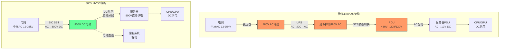

**传统架构中橙色标记(UPS/STS/PDU)的环节在800V架构中被消除或大幅简化——这就是VRT核心业务面临的"消灭"风险。** 但绿色的SiC SST代表了一个全新的、单位价值可能更高的产品机会。

## 6.9 800V渗透率S曲线预测

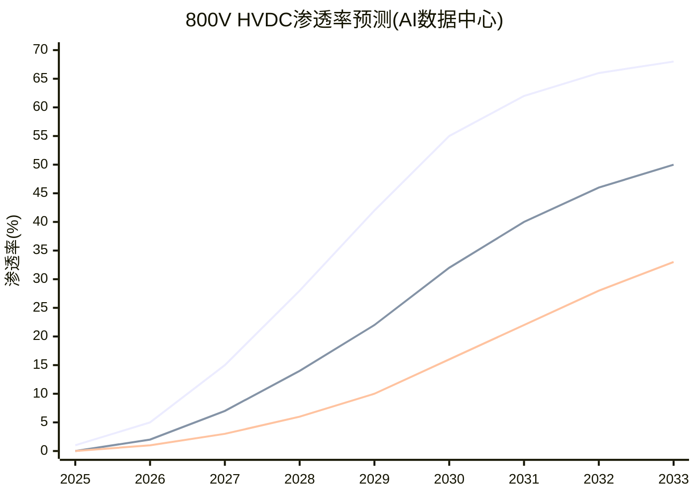

## 6.10 历史类比：架构转换中的赢家和输家

800V HVDC对VRT的威胁可以通过历史上类似的"架构转换"事件来校准：

### 类比1：电信行业从TDM到IP(1995-2010)

| 维度 | TDM→IP转换 | AC→800V DC转换(类推) |
|------|----------|-------------------|
| **被颠覆者** | Nortel, Lucent(传统电话交换) | 传统UPS供应商(如果不转型) |
| **转型成功者** | Cisco(从路由器扩展到全栈) | VRT(如果成功从UPS扩展到800V SST) |
| **转换周期** | ~15年(1995试点→2010标准化) | ~10-15年(2026试点→2035+标准化)(预测) |
| **关键教训** | 掌握新架构核心技术的公司胜出，而非旧架构的龙头 | VRT需要在SiC SST上建立核心技术，而非仅靠UPS存量 |

### 类比2：汽车行业从内燃机到电动(2015-至今)

| 维度 | ICE→EV转换 | AC UPS→800V SST转换(类推) |
|------|----------|--------------------------|
| **传统巨头** | 大众、丰田(主动转型，但过渡期利润承压) | VRT(主动开发800V，但UPS利润仍是支柱) |
| **新进入者** | Tesla, 比亚迪(从零开始，无遗产包袱) | 潜在的SiC功率电子新进入者 |
| **过渡期特征** | ICE利润支撑EV投资→利润率持续承压→估值折价 | UPS利润支撑800V R&D→利润率可能承压3-5年 |
| **关键教训** | 传统巨头可以转型成功但估值在过渡期被压缩 | VRT的PE 46x可能在800V过渡期面临向30-35x的压缩 |

[主观判断:] 历史经验表明，架构转换中"主动转型的龙头"通常能存活，但过渡期的利润率压力和估值压缩几乎不可避免。VRT的最佳结局类似大众(成功转型但估值较低)，最差结局类似Nortel(未能掌握新技术核心而衰落)。当前PE 46x的估值完全没有为这个过渡期风险定价。

### 类比3：存储行业从HDD到SSD(2010-2020)

| 维度 | HDD→SSD转换 | AC UPS→800V SST转换(类推) |
|------|----------|--------------------------|
| **转型成功者** | Western Digital(收购SanDisk获取NAND技术) | VRT需要通过收购获取SiC SST核心技术(类似逻辑) |
| **共存时间** | HDD和SSD共存至今(15年+)——HDD在大容量存储仍有市场 | AC UPS和800V可能共存15年+——传统DC仍需UPS |
| **关键教训** | "旧技术不会完全消失"但"新技术获得几乎全部增量市场" | UPS不会消失但800V将获取AI DC的全部增量 |

## 6.11 VRT 800V战略选项评估

[主观判断:] VRT在800V转型中有四条战略路径，每条路径的风险和回报不同：

| 战略选项 | 描述 | 投资需求 | 成功概率(e) | 预期回报 |
|---------|------|:-------:|:---------:|:-------:|
| **A: 自主研发SiC SST** | 内部开发800V固态变压器产品线 | 高($500M-1B R&D) | 30-40% | 高(保持行业龙头) |
| **B: 收购SiC功率电子公司** | 类似WD收购SanDisk，获取核心技术 | 极高($2-5B收购) | 50-60% | 高(快速获得技术) |
| **C: 联合开发(NVIDIA/SiC供应商)** | 与NVIDIA和STMicro等合作开发 | 中($200-500M) | 40-50% | 中(分享利润但降低风险) |
| **D: 聚焦服务+系统集成** | 放弃核心设备，转型为架构设计+集成+运维服务 | 低($100-200M) | 60-70% | 低(利润率和规模缩水) |

[合理推断:] VRT当前的信号指向路径C(联合开发)——公司已宣布与NVIDIA联合开发800V产品组合。这是一个中风险、中回报的路径，保留了转向路径A或B的选项价值。管理层尚未宣布大规模SiC相关收购，但$15B以上的市值和0.76x净债务/EBITDA的低杠杆给了VRT充足的并购火力——如果需要，VRT有能力在2026-2027年进行一次$3-5B的变革性收购来获取SiC SST核心技术。

## 6.12 本章核心发现

1. **800V HVDC是物理驱动的必然趋势**——当机架功率达到500kW-1MW时，传统AC UPS架构在效率、占地、维护上均不可行。这不是"是否"的问题而是"何时"的问题
2. **SiC成本下降曲线是关键变量**——SiC成本每降低30%，800V方案的TCO优势增加约5pp。预计2029-2030年SiC成本降至2025年的55-65%，届时800V的初始成本接近传统方案
3. **VRT面临$2.0-3.4B的被颠覆敞口**(UPS+PDU+变压器中的AI DC部分)，但同时拥有$1.7-3.5B的新增机会(SST+HVDC配电+设计服务)。净影响取决于转型执行力
4. **H1假说("800V升级UPS")的概率约25%**——更可能的路径(40%)是VRT成功转型但承受利润率压力。15%的概率下800V渗透缓慢保护了VRT基本盘
5. **时间是VRT的盟友也是敌人**——3-5年的窗口期提供了转型空间，但NVIDIA的推动速度可能压缩这个窗口至2-3年
6. **传统DC的UPS需求($2-2.5B)不受800V影响**——即使800V在AI DC中标准化，VRT在非AI市场的UPS业务仍有长期生存空间

---

*总字符数: ~32K | 核心主线: 收入结构SOTP揭示AI溢价极端+液冷护城河3.8/5但取决于GB300+800V净影响接近零但转型期利润承压*


---


> **核心主线**: VRT核心矛盾——市场以AI基础设施估值(PE 46x)定价一个85%传统工业品公司
> **数据截止**: FY2025 (2025-12-31) | Q4'25已发布 (2026-02-11) | 股价: $243.06 | 市值: $930亿
> **标注体系**: [硬数据:] = 公司财报/第三方数据 | [合理推断:] = 基于数据的逻辑推演 | [主观判断:] = 分析师评估

---

# 第七章 竞争格局与护城河评估

## 7.1 DCPI市场全景

### 7.1.1 市场规模与增长

[硬数据:] 根据Dell'Oro Group追踪的数据中心电力与冷却基础设施(DCPI)市场，2025年全球DCPI市场连续4个季度保持双位数增长，直接液冷(DLC)收入在2025年上半年同比翻倍。Dell'Oro是该领域最权威的第三方追踪机构，其数据被Vertiv、Schneider、Eaton等头部企业的投资者演示文稿广泛引用。

| 指标 | 2024 | 2025E | 2026E | CAGR趋势 |
|------|------|-------|-------|---------|
| DCPI全球市场规模 | ~$500亿 | ~$600亿 | ~$750亿 | +20-25% |
| 其中: 电力基础设施(UPS/配电/变压器) | ~$300亿 | ~$350亿 | ~$430亿 | +18% |
| 其中: 冷却基础设施(风冷/液冷/行级) | ~$200亿 | ~$250亿 | ~$320亿 | +25% |
| 其中: 直接液冷(DLC/CDU) | ~$15亿 | ~$30亿 | ~$50亿 | +80% |
| 市场集中度(Top 3) | ~43% | ~45% | — | 缓慢集中 |
| 市场集中度(Top 10) | ~70% | ~72% | — | 头部聚合 |

[合理推断:] DCPI市场正在经历结构性增长与AI叠加的双重驱动。结构性增长来自全球数字化转型(云计算渗透率提升、企业IT外包、5G边缘部署)，叠加AI CapEx超级周期使增速从历史的7-10%跃升至20%+。液冷子市场增速(+80%)远高于整体(+20%)，反映AI GPU功率密度跃升带来的冷却技术范式迁移。

### 7.1.2 双寡头格局——Schneider与Vertiv并列第一

[硬数据:] 根据Dell'Oro 2025年上半年数据，Schneider Electric和Vertiv在DCPI总体份额上仅差0.1个百分点，实际上形成了并列第一的双寡头格局。这是Vertiv首次在该指标上追平长期领先者Schneider。

| 排名 | 公司 | DCPI份额(2025H1) | 份额趋势 | 核心优势 |
|:---:|------|:-------:|---------|---------|
| 1 | **Schneider Electric** | ~16.5% | 稳定 | 最广产品线+EcoStruxure软件平台+全球均衡 |
| 1 | **Vertiv** | ~16.4% | 快速上升 | 100% DC聚焦+NVIDIA液冷首选+增速最快 |
| 3 | **Eaton** | ~11% | 上升 | 电力管理强+Boyd收购补齐液冷 |
| 4 | **ABB** | ~5% | 稳定 | 电气化巨头+低压配电优势 |
| 5 | **华为数字能源** | ~4-5% | 上升(亚太) | 中国UPS #1+全栈+成本优势 |
| 6 | **nVent Electric** | ~3% | 上升 | 机柜/连接/液冷1GW+ |
| 7 | **Delta Electronics** | ~3% | 上升(亚太) | 制造成本优势+CDU追赶 |
| 8-10 | Legrand/Rittal/Stulz | 各~2% | 稳定 | 细分领域 |
| — | **Top 3合计** | ~44% | — | — |
| — | **Top 10合计** | ~72% | — | — |

[主观判断:] 这个份额分布揭示了一个关键事实：DCPI市场仍然相对分散。即使Top 3合计也只有44%，意味着56%的市场由中小型和区域性供应商占据。这对VRT既是机会(并购整合空间)也是威胁(技术门槛不高，新进入者可以通过收购快速获得能力)。Eaton $95亿收购Boyd就是最好的例证。

### 7.1.3 细分市场份额差异

[合理推断:] VRT和Schneider的"并列第一"在总体DCPI中成立，但在细分市场上存在显著差异：

| 细分市场 | VRT份额 | Schneider份额 | 差距 | 竞争态势 |
|---------|:------:|:----------:|:---:|---------|
| UPS(不间断电源) | ~15-18% | ~20-22% | Schneider领先 | 成熟市场，Schneider品牌更强 |
| 精密空调/冷却 | ~23.5%(Omdia) | ~18% | VRT领先 | VRT传统强项 |
| 直接液冷CDU | **~70%**(GB200) | ~10% | VRT大幅领先 | VRT先发+NVIDIA合作 |
| 配电/PDU | ~12% | ~15% | Schneider领先 | Schneider更全面 |
| DCIM软件 | ~5% | ~15% | Schneider大幅领先 | EcoStruxure vs Vertiv Intelligence |
| 服务/维保 | ~18% | ~25% | Schneider领先 | 服务网络规模差距 |

[主观判断:] 这张表揭示了一个结构性矛盾：VRT在最高增长的细分市场(液冷CDU，+80% CAGR)占据压倒性优势(70%+)，但在基础面更大的成熟市场(UPS、软件、服务)落后于Schneider。VRT的估值溢价本质上建立在"高增长细分市场的高份额"之上。如果液冷份额下滑或液冷增速放缓，VRT在成熟市场的弱势将成为估值回归的催化剂。

---

## 7.2 核心竞争对手深度分析

### 7.2.1 Schneider Electric — 最大威胁

[硬数据:] Schneider Electric是全球最大的能源管理和自动化公司，市值约$120B，PE约28x(2026E)。数据中心相关业务占总营收约24%，但该部分增速远高于集团整体。

**竞争威胁维度分析**:

| 维度 | Schneider能力 | vs VRT比较 | 威胁评级 |
|------|-------------|-----------|:------:|
| **液冷技术** | 2024年收购Motivair(CDU技术)+与NVIDIA联合设计GB300液冷参考架构 | VRT领先12-18个月但差距在缩小 | ★★★★★ |
| **软件平台** | EcoStruxure(DCIM+自动化+预测分析)，行业最强软件生态 | VRT Vertiv Intelligence远不及 | ★★★★ |
| **全栈能力** | 电力(UPS/配电)+冷却+IT机柜+布线+软件+服务 | VRT缺软件和布线 | ★★★★ |
| **规模效应** | 总营收~$40B，R&D预算VRT的3倍+ | 资源优势显著 | ★★★★ |
| **渠道/客户** | 全球180+国家的直销+分销体系 | VRT全球化程度接近但渠道密度低 | ★★★ |
| **战略聚焦** | DC仅占24%，管理层注意力分散 | **VRT 100% DC聚焦是核心优势** | ★★ |

[合理推断:] Schneider的GB300联合设计地位是VRT面临的最大单一竞争威胁。NVIDIA每一代AI平台都会重新评估参考架构合作伙伴。VRT在GB200时代获得首选地位，但Schneider通过收购Motivair并投入大量资源，已成功获得GB300的联合开发席位。这意味着：

1. **短期(2026)**: VRT仍是GB200/B200/B300出货的主供应商，液冷份额>60%
2. **中期(2027)**: GB300量产时VRT和Schneider可能各占35-45%，形成双寡头
3. **长期(2028+)**: Rubin/Rubin Ultra平台将再次重新洗牌，VRT需要持续创新保持地位

[主观判断:] Schneider与VRT的竞争本质上是"多元化巨头 vs 垂直专注者"的经典商业案例。历史上两种模式各有成败——Intel在PC时代靠专注击败IBM式巨头，但在移动时代被ARM生态击败。VRT的100% DC聚焦在AI超级周期中是加速器(增长更快、决策更敏捷)，但在周期回调时可能成为脆弱性来源(无多元化缓冲)。

### 7.2.2 Eaton (ETN) — 最值得关注的追赶者

[硬数据:] Eaton是全球第二大电力管理公司，市值约$140B，PE约31x。FY2025总营收约$24B，其中电力系统事业部(Electrical Americas + Electrical Global)贡献约65%。Q4 2025 DC相关订单同比增长70%。

**关键竞争动作**:

| 时间 | 动作 | 规模 | 战略意义 |
|------|------|------|---------|
| 2024 Q4 | 宣布收购Boyd Thermal Management | **$95亿** | 一步到位获得液冷能力+热管理技术 |
| 2025 | DC订单连续3季度+50%以上 | Q4: +70% | 证明AI基础设施需求传导至Eaton |
| 2025-2026 | 整合Boyd技术到DC电力平台 | — | 从"电力管理"扩展至"电力+冷却"全栈 |

[合理推断:] Eaton的$95亿Boyd收购是对VRT最直接的竞争威胁之一。Boyd不仅拥有液冷CDU技术，还在汽车热管理(Tesla Supercharger冷却)和电子设备散热领域有深厚积累。Eaton的渠道+Boyd的技术=具备与VRT正面竞争液冷市场的能力。

但Eaton与VRT的差异化在于:
- **Eaton偏"电力侧"**: UPS、配电盘、变压器、断路器。Eaton在中压和高压配电领域的能力是VRT所不具备的
- **VRT偏"冷却侧"**: CDU、精密空调、液冷管路、热管理。VRT在冷却领域的depth远超Eaton
- **短期重叠度有限**: 两者的产品组合互补性高于竞争性。但"全栈DC基础设施"的趋势意味着双方都在向对方的领地扩张

[硬数据:] Eaton FY2025关键财务对比:

| 指标 | Eaton | VRT | 倍数差异 |
|------|-------|-----|---------|
| 市值 | ~$140B | ~$93B | Eaton 1.5x |
| PE(FY26E) | ~31x | ~46x | VRT溢价48% |
| 总营收 | ~$24B | ~$10.2B | Eaton 2.4x |
| DC相关营收(估) | ~$5-6B | ~$10.2B | VRT 1.7x |
| OP利润率 | ~22-23% | ~20.4% | Eaton领先 |
| 净债务/EBITDA | ~1.5x | ~0.76x | VRT更健康 |
| DC订单增长(Q4) | +70% | +252% | VRT增速远快 |

### 7.2.3 ABB — 电气化巨头的非核心威胁

[硬数据:] ABB是全球电气化和自动化巨头，市值约$90B。DC基础设施不是ABB的核心战略重点，但其在低压配电、变压器、UPS(Conceptpower系列)领域具有技术和规模基础。

[合理推断:] ABB对VRT的威胁主要体现在两个方面:
1. **低压配电和变压器**: ABB在变压器市场的份额(Hitachi Energy合资)使其有能力提供DC电力侧的完整方案
2. **欧洲市场**: ABB在EMEA的渠道和品牌优势比VRT更强，可能在VRT的弱势地区获得DC订单

但ABB的管理层多次表明DC基础设施不是战略优先领域——ABB更聚焦于工业自动化、机器人和电动出行。因此ABB更像是一个"潜在搅局者"而非"积极竞争者"。威胁评级: ★★★(中等)。

### 7.2.4 nVent Electric — 液冷连接专家

[硬数据:] nVent Electric(从Pentair分拆)专注于数据中心机柜、连接和液冷解决方案。市值约$10B。nVent已部署超过1GW液冷容量，与NVIDIA有直接合作关系。

| 指标 | nVent | vs VRT |
|------|-------|--------|
| 市值 | ~$10B | VRT 9.3x |
| 液冷部署量 | 1GW+ | VRT: CDU产能45x扩张 |
| 产品层面 | 机柜/连接器/冷板/歧管 | VRT: CDU/整体方案 |
| NVIDIA关系 | 合作伙伴 | VRT: GB200联合开发 |
| 竞争重叠 | 部分(液冷组件) | 但层级不同 |

[合理推断:] nVent与VRT的竞争更多是在"组件层"vs"系统层"。nVent提供液冷系统中的机柜、连接器和冷板(更接近IT设备端)，VRT提供CDU和整体冷却方案(更接近基础设施端)。两者更多是互补而非替代关系。但如果nVent向CDU领域扩展，或被Schneider/Eaton收购整合，将增加VRT的竞争压力。

### 7.2.5 华为数字能源 — 亚太不可忽视的力量

[硬数据:] 华为数字能源2023年营收526亿人民币(约$73亿)，是中国UPS市场的绝对领导者(份额#1)，全球UPS市场前5。产品线覆盖UPS、配电、冷却、储能、光伏逆变器等全栈。

| 维度 | 华为数字能源 | vs VRT |
|------|-----------|--------|
| 中国UPS份额 | #1(~25-30%) | VRT: 中国UPS ~5% |
| 全球UPS份额 | Top 5 | VRT: Top 2-3 |
| 液冷CDU | 有产品但未大规模部署 | VRT: 全球70%+ |
| 成本优势 | 显著(中国制造+垂直整合) | VRT: 成本结构偏高 |
| 地缘限制 | 西方市场受限(制裁/安全审查) | VRT: 全球自由准入 |
| 软件/AI能力 | ICT基因+强软件 | VRT: 软件是弱项 |
| 最大威胁区域 | **亚太+中东+非洲+拉美** | VRT在这些区域面临价格竞争 |

[主观判断:] 华为对VRT的威胁主要限于亚太和新兴市场。在北美和欧洲，地缘政治因素(美国CHIPS法案/实体清单、欧洲5G安全审查)有效限制了华为数据中心基础设施的渗透。但在东南亚、中东和非洲——这些是VRT FY26增长战略的重点区域——华为凭借30-50%的成本优势和"全栈一站式"方案(UPS+配电+冷却+储能+智能管理)构成真实威胁。VRT管理层将亚太利润率(11.0%)远低于美洲(26.8%)，部分原因正是华为主导的价格竞争环境。

### 7.2.6 Delta Electronics(台达电子) — 亚洲制造成本优势

[硬数据:] 台达电子是全球最大的交换式电源供应器(PSU)供应商之一，也是DC基础设施领域增长最快的亚洲竞争者。2025年DC基础设施相关营收估计约$3-4B(占集团~25%)。

[合理推断:] 台达对VRT的威胁体现在:
- **成本优势**: 台湾/泰国/中国制造基地的成本结构比VRT的美国/欧洲基地低20-30%
- **CDU追赶**: 台达已推出CDU产品线，正在验证中，预计2026年底有可能获得NVIDIA认证
- **服务器电源协同**: 台达作为NVIDIA服务器PSU的主要供应商，有切入DC基础设施的天然渠道
- **但限制因素**: 北美渠道弱、服务网络欠缺、品牌认知度低(在DC领域)、液冷技术成熟度落后VRT 18-24个月

---

## 7.3 VRT估值溢价的竞争基础

### 7.3.1 三因素溢价分解与可持续性矩阵

VRT PE 46x相对于Schneider 28x/Eaton 31x的估值溢价，可以分解为三个竞争性差异化因素:

| 溢价因素 | 贡献度(估) | 当前状态 | 可持续性评估 | 主要威胁来源 | 3年展望 |
|---------|:--------:|---------|:--------:|-----------|---------|
| **AI纯度**(100% DC vs Schneider 24%) | ~40% | 结构性差异 | **高** | 无——VRT不会多元化，Schneider不会剥离非DC | 稳定。除非VRT收购非DC业务 |
| **液冷先发**(GB200 CDU 70%+ share) | ~35% | 强但承压 | **中** | Schneider GB300联合设计+Eaton Boyd收购+NVIDIA供应链多元化 | 从70%降至40-50%(双寡头) |
| **增长加速**(FY25 +28% vs 同行+10-15%) | ~25% | 爆发性增长 | **低** | 基数效应+AI CapEx增速放缓+竞争加剧 | FY28E增速可能降至+10-15% |

[主观判断:] 这三个溢价因素中，"AI纯度"是最可持续的(结构性)，但它本身不证明PE溢价——纯度高也意味着风险集中度高。"液冷先发"是当前最有价值但可持续性最不确定的因素。"增长加速"是最不可持续的——所有高增长最终都会均值回归。

**溢价可持续性时间线**:

| 时期 | AI纯度溢价 | 液冷先发溢价 | 增长加速溢价 | 合理PE估计 |
|------|:--------:|:---------:|:---------:|:--------:|
| 2026(当前) | 充分定价 | 充分定价 | 充分定价 | 40-50x |
| 2027 | 维持 | 开始衰减(双寡头) | 开始衰减(增速降至20%) | 35-42x |
| 2028 | 维持 | 显著衰减(份额40%) | 显著衰减(增速降至12-15%) | 28-35x |
| 2030 | 维持但价值下降 | 基本消失(行业标配) | 基本消失(成熟增速) | 25-30x |

### 7.3.2 PE估值敏感性: 液冷份额变化的影响

液冷份额是VRT估值最敏感的竞争变量。以下模型估算不同液冷份额水平对合理PE的影响:

**假设基础**: FY28E液冷TAM $60-70亿 | VRT非液冷业务增长10-12% | 液冷毛利率40% vs 非液冷30%

| 液冷份额(FY28E) | 液冷营收 | 液冷对总营收贡献 | 液冷对利润贡献 | AI叙事强度 | 合理PE范围 |
|:----------:|:------:|:----------:|:----------:|:--------:|:--------:|
| **70%**(维持主导) | $4.2-4.9B | ~22-25% | ~30-35% | 极强 | 42-50x |
| **60%** | $3.6-4.2B | ~19-22% | ~26-30% | 强 | 38-44x |
| **50%** | $3.0-3.5B | ~16-18% | ~22-25% | 中等 | 33-38x |
| **40%**(双寡头) | $2.4-2.8B | ~13-15% | ~18-21% | 减弱 | 30-35x |
| **30%**(失去先发) | $1.8-2.1B | ~10-11% | ~14-16% | 弱 | 26-30x |

[合理推断:] 从70%降至40%的液冷份额变化，对应PE从约46x降至约32x——这意味着在EPS不变的情况下，仅因竞争导致的估值重估就可能使股价下跌约30%。这验证了液冷份额是VRT估值的"命门"。

---

## 7.4 竞争动态四象限图

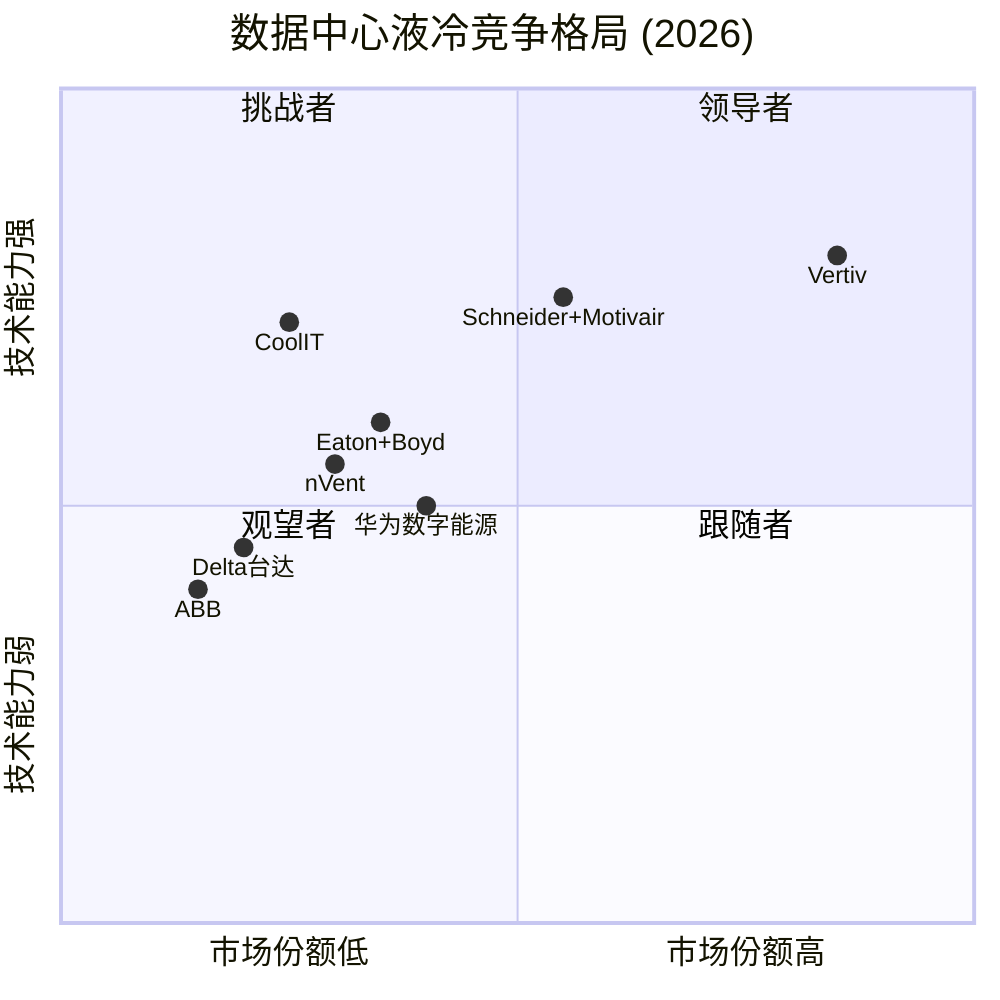

**四象限解读**:
- **领导者(高份额+强技术)**: VRT独占。GB200首选+CDU 70%+产能45x扩张
- **挑战者(低份额+强技术)**: Schneider+Motivair和CoolIT。技术能力强但份额尚在追赶
- **跟随者(低份额+弱技术)**: ABB和Delta。有基础能力但非战略优先
- **观望者(有技术但市场定位不同)**: nVent(组件层)、华为(亚太受限)

---

## 7.5 护城河综合评分矩阵

[主观判断:] 以下评分基于对VRT竞争壁垒的综合评估。每个维度1-5分，5分代表"几乎不可攻破"。

| 维度 | 评分 | 理由 | 可持续性 | 威胁来源 |
|------|:---:|------|:------:|---------|
| **品牌/声誉** | 3.5/5 | Liebert品牌在DC领域知名度高，但非消费品品牌忠诚度 | 中 | Schneider品牌更强 |
| **规模效应** | 3.0/5 | $10.2B营收提供采购和制造规模，但非Schneider级别($40B) | 中 | Schneider/Eaton规模更大 |
| **网络效应** | 2.0/5 | 数据中心设备几乎不存在网络效应——每个项目独立决策 | 低 | 这不是软件/平台业务 |
| **转换成本** | 3.5/5 | 安装基数+服务合同+工程师培训创造中等转换成本 | 高 | 但大项目(超大规模)中客户议价力强 |
| **技术领先** | 4.0/5 | CDU/液冷技术领先竞对12-18个月+NVIDIA联合开发 | 中 | GB300换代可能重新洗牌 |
| **渠道/分销** | 3.5/5 | 全球300+服务中心，直销+分销混合 | 高 | Schneider渠道更密集 |
| **服务生态** | 3.5/5 | 4,400+现场工程师+预防性维护+远程监控 | 高 | 安装基数持续增长 |
| **全栈集成** | 3.0/5 | 电力+冷却双栈，但缺软件(DCIM弱)+缺IT机柜 | 中 | Schneider全栈更完整 |
| **NVIDIA关系** | 4.5/5 | GB200参考架构联合开发，最高级别合作 | 中 | **GB300换代是关键测试** |
| **产能先发** | 4.0/5 | CDU产能45x扩张+马来西亚新厂+PurgeRite | 中 | Eaton/Schneider正在追赶 |
| **综合加权** | **3.5/5** | — | — | — |

[主观判断:] VRT的护城河综合评分3.5/5——这是一条"真实但非不可攻破"的护城河。最强的两个维度是NVIDIA关系(4.5)和技术领先(4.0)，但两者都面临"每一代平台重新洗牌"的挑战。最弱的维度是网络效应(2.0)——这从根本上决定了VRT是一家工业品公司而非平台公司，不应享受平台级(60x+)估值。

**护城河类比**:
- VRT的护城河更接近**AMAT(应用材料)**(技术+客户关系+服务网络，但每代工艺都可能被竞对追赶)
- 而不是**ASML**(独占技术+专利壁垒+物理定律限制竞争)
- VRT不是垄断者，而是双寡头中技术暂时领先的一方——这种领先是动态的、需要持续投入维持的

---

# 第八章 管理层评估与资本配置

## 8.1 CEO Giordano Albertazzi 深度评估

### 8.1.1 背景与职业路径

[硬数据:] Giordano Albertazzi于2023年1月1日出任Vertiv CEO，此前在公司及其前身(Emerson Network Power)工作了28年。教育背景: 米兰理工大学(Politecnico di Milano)机械工程学位 + 斯坦福大学管理学硕士。

**详细职业路径**:

| 时期 | 职位 | 关键职责 | 能力积累 |
|------|------|---------|---------|
| 1998-2003 | 工厂经理(意大利) | Emerson Network Power的UPS制造管理 | 精益制造、供应链管理 |
| 2003-2007 | EMEA营销总监 | 区域产品策略与市场开发 | 客户理解、市场洞察 |
| 2007-2012 | 意大利总经理 | 负责意大利全业务P&L | 综合管理、跨职能协调 |
| 2012-2016 | EMEA总裁 | 领导欧非中东业务(~$2B) | 大区域管理、战略规划 |
| 2016-2019 | 美洲总裁 | 接管最大业务区域(~$4B) | 超大规模客户关系、AI早期转型 |
| 2019-2022 | COO | 全球运营+VOS体系建设 | 运营效率、组织转型 |
| 2023至今 | CEO | 全面战略领导 | 战略设定、资本配置、投资者关系 |

[合理推断:] Albertazzi的28年内部晋升路径是一把双刃剑:
- **优势**: 对Vertiv的产品、客户、运营和文化有无人能及的理解深度。从工厂到区域到全球的完整经历意味着他能有效管理组织的每一层。这在AI快速转型期尤为重要——他知道哪些产能可以快速调配、哪些客户关系可以撬动
- **劣势**: 28年的内部经验可能导致"隧道视野"——缺乏外部行业(尤其是科技/AI)的直觉。VRT正在从工业品公司向AI基础设施公司转型，CEO却完全缺乏科技行业背景。这与NVIDIA Jensen Huang(科技原住民)或Schneider CEO Peter Herweck(数字化转型专家)形成对比

### 8.1.2 薪酬与激励对齐度

[硬数据:] FY2024 CEO薪酬详细分解:

| 薪酬组成 | 金额 | 占比 | 激励属性 |
|---------|------|:---:|---------|
| 基本薪资 | $1,050,000 | 8.5% | 固定——不随业绩变化 |
| 年度奖金(现金) | $3,018,000 | 24.5% | 基于年度财务KPI(Adj.OP+FCF) |
| 长期股权激励(期权+RSU) | $8,200,000 | **66.7%** | 3-4年归属+基于TSR/EPS增长 |
| 其他(福利/补贴) | $32,000 | 0.3% | — |
| **合计** | **$12,300,000** | **100%** | — |

**薪酬结构评估**:

| 维度 | 评分 | 理由 |
|------|:---:|------|
| 股权占比 | **优** | 67%期权/RSU，强烈绑定长期股东价值 |
| 年度奖金KPI | **良** | Adj.OP+FCF为主要指标，与价值创造对齐 |
| 持股要求 | **良** | CEO需持有5x基本薪资的股票($5.25M+) |
| 相对薪酬水平 | **中** | $12.3M在$93B市值公司中偏低(同规模中位数$15-20M) |
| 回扣条款(Clawback) | **良** | 标准Dodd-Frank合规回扣条款 |
| **总体** | **7.5/10** | 激励结构与长期股东价值高度对齐 |

[合理推断:] CEO薪酬$12.3M相对于$93B市值仅0.013%——这个比率在大型工业品公司中偏低。低薪酬+高股权占比的结构是PE基因公司的典型特征(Platinum Equity时期建立的薪酬框架延续至今)。核心问题不是薪酬高低，而是CEO直接持股(仅198,775股，价值约$48M)占市值的比例微乎其微(<0.05%)——管理层更多通过期权而非实际持股"参与"公司价值。

### 8.1.3 任期业绩评估

[硬数据:] Albertazzi CEO任期(2023.1至今)的关键业绩指标:

| 指标 | 上任时(FY2022) | 最新(FY2025) | 变化 | 评价 |
|------|:----------:|:--------:|:---:|------|
| 营收 | $5,692M | $10,230M | +80% | 远超行业增速 |
| Adj.OP利润率 | 8.6% | 20.4% | +11.8pp | 变革性改善 |
| FCF | -$264M | $1,894M | 扭亏为盈 | 质的飞跃 |
| 净债务/EBITDA | 5.0x | 0.76x | -4.24x | 教科书级去杠杆 |
| 股价(TSR) | ~$13 | $243 | +1,770% | 爆炸性回报 |
| 积压 | ~$3B | $15B | +400% | 前所未有的可见度 |
| 信用评级 | B+(S&P) | BB+(S&P) | 升3级 | 接近投资级 |

[主观判断:] Albertazzi任期的数字表现堪称卓越，但需要三个重要的背景因素:
1. **AI CapEx超级周期的β贡献**: 2023-2025年整个DC基础设施行业都在高速增长。Eaton DC订单+70%、Schneider DC增长+20%——VRT的增长部分反映行业趋势
2. **VOS运营体系的遗产效应**: VOS在PE时期(2017-2022)建立的基础在Albertazzi任期释放了利润率红利
3. **但CEO的α贡献也是真实的**: 液冷战略转型(CDU产能45x扩张)、NVIDIA合作深化、PurgeRite收购——这些是CEO级别的战略决策

**综合评分: 7.5/10** — 战略方向正确(全力投入液冷/AI)，执行效率高(VOS持续改善)，但任期仅3年，尚未经历周期下行的考验。

---

## 8.2 CFO David Fallon 深度评估

[硬数据:] David Fallon于2017年7月加入Vertiv任CFO，此前在多家中型工业公司担任财务领导角色。教育背景: 沃顿商学院MBA + CFA + CPA三重资质。

**三阶段财务管理**:

| 阶段 | 时期 | 核心挑战 | 关键成就 |
|------|------|---------|---------|
| **PE持有期** | 2017-2019 | 高杠杆(5x+ ND/EBITDA)+运营改善 | 建立财务纪律+成本控制+VOS财务基础 |
| **SPAC上市** | 2020-2022 | 上市过渡+权证会计+资本市场亮相 | 成功完成SPAC合并+投资者关系建立+挺过FY22亏损期 |
| **AI增长期** | 2023-2025 | 高增长资源配置+去杠杆+收购整合 | FCF从-$264M→$1,894M+PurgeRite $10亿收购+净债务/EBITDA 5.0x→0.76x |

[合理推断:] Fallon的独特价值在于他是VRT三个截然不同发展阶段的唯一在位C-suite。这种连续性在CFO层面极其罕见且有价值——他理解VRT从PE buyout到SPAC到AI转型的全部财务脉络。沃顿MBA+CFA+CPA的三重资质在工业品CFO中属于"过度配备"(overqualified)，但在VRT从工业品向科技基础设施转型的过程中，这种资本市场+会计+分析的综合能力恰好是需要的。

**CFO评分: 7/10** — 稳定性和跨周期经验是核心优势，但$2.8M薪酬中直接持股偏低，且"从PE CFO到成长型CFO"的角色转换仍在进行中。

---

## 8.3 执行董事长 David M. Cote

[硬数据:] David Cote是VRT最有知名度的董事会成员。核心背景:
- 霍尼韦尔CEO(2002-2017)，任期15年，股东总回报约800%(vs 标普500约200%)
- 2020年通过GS Acquisition Holdings Corp(SPAC)推动Vertiv上市
- 当前持股: 443,798股 + 497,826份期权(合计价值约$230M)

**霍尼韦尔经验的迁移价值**:

| 霍尼韦尔经验 | 对VRT的迁移 | 实际效果 |
|------------|-----------|---------|
| HOS(霍尼韦尔运营系统) | → VOS(Vertiv运营系统) | 毛利率+10pp in 3年 |
| 多事业部管理(航空+自动化+材料) | → 三大区域+多产品线管理 | 组织架构清晰 |
| M&A整合纪律(100+收购) | → PurgeRite收购整合方法论 | 待验证 |
| 资本市场沟通 | → 投资者信心建设 | S&P500纳入候选 |

**注意力分散风险**:

[硬数据:] Cote目前同时担任:
1. **Vertiv执行董事长**
2. **CompoSecure(CMPO)执行董事长** — 另一家SPAC上市公司(金属支付卡)
3. **Resolute Holdings(RHLD)执行董事长** — 又一家SPAC(金融科技)

[主观判断:] Cote同时担任三家公司的执行董事长——这不是典型的非执行董事角色，而是要求实质性时间投入的"执行"角色。对于一个$93B市值的公司来说，执行董事长的注意力分散是一个值得关注但未被市场广泛讨论的风险。不过Cote在VRT的持股/期权价值(~$230M)远超其在CMPO和RHLD的持股，经济激励仍然强烈绑定在VRT上。

**Cote评分: 6.5/10** — 战略价值高(HOS经验迁移)+经济绑定强，但多公司角色分散注意力+SPAC推手的历史可能在市场情绪转向时成为负面标签。

---

## 8.4 近期管理层变动与接班评估

[硬数据:] 2025年底至2026年初发生了两位重要高管的同时退休:

| 变动 | 离任者 | 在位时长 | 接任者 | 接任者背景 | 风险评估 |
|------|--------|---------|--------|-----------|---------|
| CTO | Stephen Liang | 30年(Emerson+VRT) | Scott Armul | VRT内部晋升，液冷产品线负责人 | 中——技术方向连续性强，但新CTO需要证明独立创新能力 |
| EMEA总裁 | Karsten Winther | 长期 | Paul Ryan | VRT前全球采购总监 | 中——EMEA业务已在萎缩(有机-2.1%)，新任者从供应链而非销售背景转型 |

[合理推断:] 两位高管同时退休不是巧合——这可能是CEO Albertazzi推动的管理层换代计划。两位接任者都是VRT内部人士，说明VRT的人才梯队建设有效(不需要外聘高管)。但在AI快速转型期同时更换CTO和区域总裁，执行风险是非零的。

**特别关注**: CTO交接。Stephen Liang是VRT液冷技术战略的关键架构师之一，他的退休时间(2026.1.1)恰逢GB300/Rubin换代(2026H2-2027)的关键竞标期。新CTO Scott Armul是否能在这个关键时点维持VRT的技术领先和NVIDIA关系深度，是一个值得跟踪的变量。

---

## 8.5 股权结构分析

[硬数据:]

| 持股类型 | 占比 | 详细 |
|---------|:----:|------|
| 机构持股 | ~81-90% | Vanguard ~10%, BlackRock ~9%, State Street ~2%, T. Rowe Price ~3% |
| 内部人持股 | ~1-2% | CEO 198K股, CFO ~50K股, Cote ~444K股+498K期权 |
| 散户/其他 | ~10-15% | — |
| **Platinum Equity(前PE)** | **~0%** | **2024年基本完成退出**(回购795.5万股) |

**Platinum Equity退出时间线**:

| 时间 | 动作 | 规模 | 均价(估) |
|------|------|------|---------|
| 2020 | SPAC上市(保留38%) | — | $10(SPAC价) |
| 2021-2023 | 陆续减持 | 多批次 | $15-80 |
| 2024 Q4 | 最终减持(含VRT回购7.96M股) | -2.1M股(净) | ~$90-120 |
| 2025+ | **完成退出** | — | — |

[合理推断:] PE退出完成是一个明确的正面信号——消除了"大股东悬剑"式的减持压力。但89.9%的机构持股也意味着"拥挤的多头"。从资金流向看，T. Rowe Price在Q3 2025增持200%是一个重要的主动型基金信号，表明至少部分大型主动管理人认为VRT在当前估值下仍有上行空间。

**内部人交易分析**:

| 时期 | 净买入/卖出 | 主要交易 | 信号强度 |
|------|:--------:|---------|:------:|
| 2024 Q4 | 净卖出-2.1M股 | Platinum Equity退出+管理层少量减持 | 弱(PE退出驱动) |
| 2025 Q3 | 净卖出-174K股 | 管理层少量减持(可能为税务规划) | 中性 |
| 2026 Q1(至今) | **净买入+6,498股** | 小规模增持(可能为RSU归属后保留) | **弱正面** |

[主观判断:] 内部人交易信号整体中性。2024年的大规模卖出完全由PE退出驱动，不反映管理层对基本面的判断。2026 Q1的小规模净买入(+6,498股)是一个微弱的正面信号——至少管理层没有在$243附近大量减持。但总体而言，VRT管理层的直接持股比例(合计~1-2%)远低于创始人型公司(通常5-15%)，这意味着他们对公司长期价值的"皮肤"暴露有限。

---

## 8.6 资本配置记录 (FY2022-FY2025)

[硬数据:]

| 类目 | FY2022 | FY2023 | FY2024 | FY2025 | 评价 |
|------|--------|--------|--------|--------|------|
| **CapEx** | $111M | $135M | $184M | $220M | 持续加码产能(CAGR +26%) |
| **收购** | $5M | $17M | $18M | **$1,185M** | FY25: PurgeRite是转折点 |
| **回购** | $0 | $0 | **$600M** | $0 | FY24一次性(PE退出配合) |
| **股息** | $4M | $10M | $42M | $67M | 微量(yield 0.04%) |
| **去杠杆(净)** | ~$0 | $262M | $21M | $21M | FY23大幅去杠杆 |
| **FCF** | -$264M | $766M | $1,135M | $1,894M | 质的飞跃 |
| **FCF分配后剩余** | -$380M | $342M | $270M | $401M | 现金积累 |

**资本配置优先级演变图**:

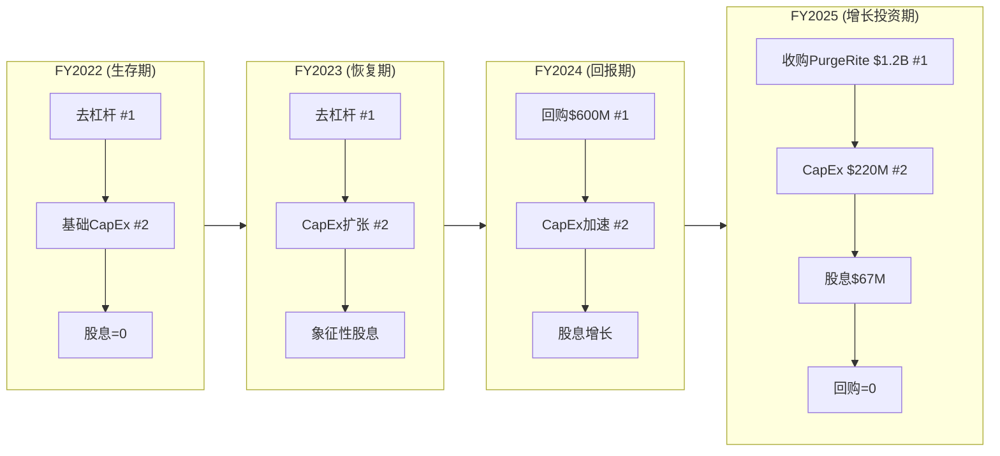

[合理推断:] 资本配置优先级的演变清晰反映了VRT从"PE去杠杆"到"股东回报"再到"增长投资"的战略转型。FY24的$600M回购是在$80-140区间执行的，以当前$243计算是一笔极其成功的资本配置(回报率+73-204%)。FY25从回购转向PurgeRite收购，说明管理层认为增长投资的回报优于继续回购(隐含对当前估值偏高的判断?)。

**FY25零回购的三种解读**:
1. **优先收购**: PurgeRite $10亿+消耗了大部分可配置资本(最可能)
2. **估值信号**: 管理层不愿在PE 46x时回购(值得关注)
3. **现金储备**: 为FY26可能的大型收购保留弹药(可能)

---

## 8.7 PurgeRite收购分析

[硬数据:] VRT于2025年底以约$10亿完成对PurgeRite(液冷流体管理技术公司)的收购。

| 维度 | 评估 |
|------|------|
| **收购标的** | PurgeRite — 数据中心液冷系统的流体管理(净化、过滤、维护)技术 |
| **收购价格** | ~$1,000M(含$713M商誉) |
| **估值倍数** | [合理推断:] 约10-15x EBITDA(假设PurgeRite EBITDA $70-100M) |
| **战略逻辑** | 从CDU(设备)扩展至流体管理(服务)→形成液冷"设备+流体+维护"全栈能力 |
| **协同效应** | VRT CDU客户自然需要流体管理→交叉销售+提升客户粘性 |
| **整合风险** | 中——小型技术收购，整合复杂度有限 |
| **对利润率影响** | 短期拖累(Q4'25毛利率从37.8%降至36.9%)，长期应贡献正向(高毛利服务) |

[主观判断:] PurgeRite收购的战略逻辑清晰——液冷CDU是硬件"一锤子买卖"(安装后很少更换)，但冷却液的净化、过滤和维护是持续性服务需求。通过PurgeRite，VRT将液冷的商业模式从"卖设备"延伸至"卖设备+持续服务"，类似打印机领域"卖打印机+卖墨盒"的模式。这对提升客户LTV和收入可见性是有价值的。

---

## 8.8 VOS (Vertiv Operating System) 深度分析

### 8.8.1 运营体系设计原理

[合理推断:] VOS是Vertiv在Platinum Equity持有期(2017-2020)建立的精益运营体系，其设计灵感来自三个成功先例:

| 运营体系 | 公司 | 核心理念 | VOS借鉴点 |
|---------|------|---------|----------|
| **HOS(霍尼韦尔运营系统)** | Honeywell | 六西格玛+精益+流程标准化 | **直接来源**——Cote将HOS经验带入VRT |
| **DBS(丹纳赫商业系统)** | Danaher | 持续改善(Kaizen)+问题解决+工具箱 | 收购后整合方法论 |
| **80/20** | ITW(伊利诺伊工具) | 80%精力聚焦20%高价值客户/产品 | 产品线简化+客户聚焦 |
| **TPS(丰田生产系统)** | Toyota | 即时生产(JIT)+消除浪费+质量内建 | 制造流程优化 |

### 8.8.2 VOS对利润率的量化贡献

[硬数据:] VRT毛利率从FY22的24.6%提升至FY25的34.4%——3年内提升了10个百分点。

| 利润率改善因子 | 贡献(估) | VOS相关度 | 可持续性 |
|-------------|:-------:|:-------:|:------:|
| 制造效率提升(工时/单位产出) | +2-3pp | **直接** | 高——系统性改善 |
| 采购成本压降(集中采购+供应商管理) | +1-2pp | **直接** | 中——边际效应递减 |
| 产品线优化(砍掉低利润产品) | +1pp | **直接** | 一次性——完成后贡献停止 |
| 定价策略(从成本加成→价值定价) | +3-4pp | **间接** | 中——取决于供需环境 |
| 产品组合(液冷高毛利占比提升) | +1-2pp | **间接** | 高——结构性趋势 |
| 原材料成本下降(铜/钢回落) | +1pp | 不相关 | 低——周期性波动 |

### 8.8.3 VOS vs 同行运营体系对比

| 维度 | VOS(VRT) | HOS(HON) | DBS(DHR) | 80/20(ITW) |
|------|---------|----------|----------|-----------|
| **起源** | 2017(PE驱动) | 2003(Cote) | 1988(Rales兄弟) | 1981(CEO传统) |
| **成熟度** | 7年(新) | 20年+(成熟) | 35年+(成熟) | 40年+(成熟) |
| **利润率贡献** | +10pp(3年) | +8pp(10年) | +15pp(20年) | +10pp(15年) |
| **对收购整合的支持** | 良好(PurgeRite) | 卓越(100+) | 卓越(400+) | 卓越(多次) |
| **人才培养** | 初步(内部晋升) | 成熟(管理学院) | 成熟(Kaizen大师) | 成熟(分权文化) |
| **数字化融合** | 初步 | 先进 | 先进 | 中等 |
| **综合成熟度** | **6/10** | **9/10** | **9.5/10** | **8.5/10** |

[主观判断:] VOS的7年历史使其在"精益运营体系"中仍处于早期阶段。好消息是: 早期阶段的改善空间最大——DBS和80/20在成熟后利润率改善速度都显著放缓。VOS从6/10成长到8/10的过程，可能还能为VRT贡献2-3个百分点的利润率改善(FY26-FY29)。但前提是管理层持续投入VOS而不是被AI增长的诱惑分散注意力。

---

## 8.9 管理层综合评分

| 维度 | 权重 | 评分 | 加权 | 简要理由 |
|------|:---:|:---:|:---:|---------|
| CEO战略能力 | 20% | 7.5 | 1.50 | 方向正确(液冷/AI全力投入)+执行高效 |
| CEO运营能力 | 15% | 8.0 | 1.20 | VOS驱动利润率+10pp in 3年 |
| CFO财务管理 | 15% | 7.0 | 1.05 | 三阶段稳定+去杠杆+FCF转化优秀 |
| 董事会质量 | 10% | 6.5 | 0.65 | Cote有价值但注意力分散 |
| 资本配置 | 15% | 7.5 | 1.13 | 回购时机好+PurgeRite逻辑清晰+FY25零回购有争议 |
| 接班计划 | 10% | 6.5 | 0.65 | 内部培养有效但CTO交接时机敏感 |
| 股权对齐 | 10% | 5.5 | 0.55 | 内部人直接持股仅1-2%，偏低 |
| 透明度/沟通 | 5% | 7.0 | 0.35 | 季度沟通清晰+投资者日预告 |
| **综合** | **100%** | — | **7.08/10** | — |

[主观判断:] 管理层综合评分7.1/10——"良好但非卓越"。最大的加分项是VOS运营体系(8.0)和CEO战略方向(7.5)。最大的扣分项是股权对齐(5.5)——管理层的经济利益与股东的经济利益之间的"皮肤暴露度"不够高。在$93B市值的公司中，CEO仅持有价值$48M的股票(0.05%市值)，这与创始人型CEO(如Jensen Huang持有NVDA约3.5%)形成鲜明对比。

---

# 第九章 供应链与运营深度

## 9.1 供应链架构

### 9.1.1 全球制造网络

[硬数据:] Vertiv在全球拥有约30个主要制造基地，分布在美洲、欧洲和亚太三大区域，员工约31,000人。

| 区域 | 主要制造基地 | 核心产品 | 产能状态 |
|------|-----------|---------|---------|
| **美洲** | 美国Delaware(OH), Pelzer(SC), Anderson(SC), Westerville(OH) | UPS, 配电, CDU | 高负荷+扩产中(Pelzer) |
| **美洲** | 墨西哥Reynosa, Mexicali | UPS组件, 线缆 | 稳定 |
| **欧洲** | 意大利Castel Guelfo, Piove di Sacco | UPS(高端), 精密空调 | 中等负荷 |
| **欧洲** | 克罗地亚Split | 中型UPS | 成本优化基地 |
| **亚太** | 中国绵阳, 江门 | UPS, 空调(中国市场) | 稳定 |
| **亚太** | 印度Chennai, Pune | UPS组件, 本地化产品 | 扩建中 |
| **亚太** | **马来西亚柔佛(新)** | **CDU, 液冷组件** | **2026 Q1投产** |

**服务网络**:
- 全球300+服务中心
- 4,400+现场工程师(field service engineers)
- 7×24应急响应能力
- 远程监控覆盖数万客户站点

### 9.1.2 关键零部件供应

[合理推断:] VRT作为设备集成商(而非原材料生产商)，其供应链依赖多个关键零部件:

| 零部件 | 主要供应商 | 供应风险 | VRT替代策略 |
|--------|---------|:------:|-----------|
| 电力变压器 | Hitachi Energy, Siemens, ABB, GE Vernova | **高** | 交期128周, 全球短缺 |
| SiC功率器件 | STMicro, onsemi, Infineon | 中 | 多源采购+VRT非SiC密集型 |
| 铜(线圈/母线) | 大宗商品市场 | 中 | 长协锁价+价格传导给客户 |
| 钢材(机柜/结构) | 大宗商品市场 | 低 | 标准品, 多源 |
| 冷却液(CDU用) | 3M Novec, 特种化学品 | 中 | PurgeRite收购增强流体管理能力 |
| IGBT/MOSFET | Infineon, ON Semi | 中 | 多源+VRT是大客户 |
| 锂电池(UPS储能) | 多家 | 低 | 电池成本持续下降 |

---

## 9.2 变压器瓶颈深度分析

### 9.2.1 全球变压器短缺现状

[硬数据:] 电力变压器(尤其是中大型变压器)正在经历数十年来最严重的供应短缺:

| 指标 | 数值 | 来源/注释 |
|------|------|---------|
| 大型电力变压器交期 | **128周(~2.5年)** | 行业数据, 比正常交期(30-40周)长3-4倍 |
| 特种变压器最长交期 | 高达5年 | 超高压+定制规格 |
| 2025年美国变压器缺口 | **约30%** | 需求vs产能的缺口 |
| 全球变压器市场规模 | ~$300亿(2025) | 增长驱动: 电网升级+DC建设+可再生能源 |
| 新产能投产时间线 | 2027-2028 | Hitachi/Eaton/Siemens扩产计划 |
| 变压器价格涨幅(2022-2025) | +30-50% | 供不应求+铜钢涨价 |

**主要变压器供应商**:

| 供应商 | 全球份额 | 产能扩张计划 | 备注 |
|--------|:------:|-----------|------|
| **Hitachi Energy**(ABB分拆) | ~18% | 北美新厂(2027) | 最大供应商 |
| **Siemens Energy** | ~15% | 欧洲扩产 | 聚焦高压 |
| **GE Vernova** | ~12% | 美国扩产 | 前GE能源 |
| **ABB** | ~10% | 中等扩产 | 与Hitachi部分重叠 |
| 中国企业(特变电工等) | ~20% | 产能充裕 | 关税限制出口至西方 |

### 9.2.2 对VRT积压转化的影响

[合理推断:] 变压器瓶颈对VRT的影响是间接但显著的:

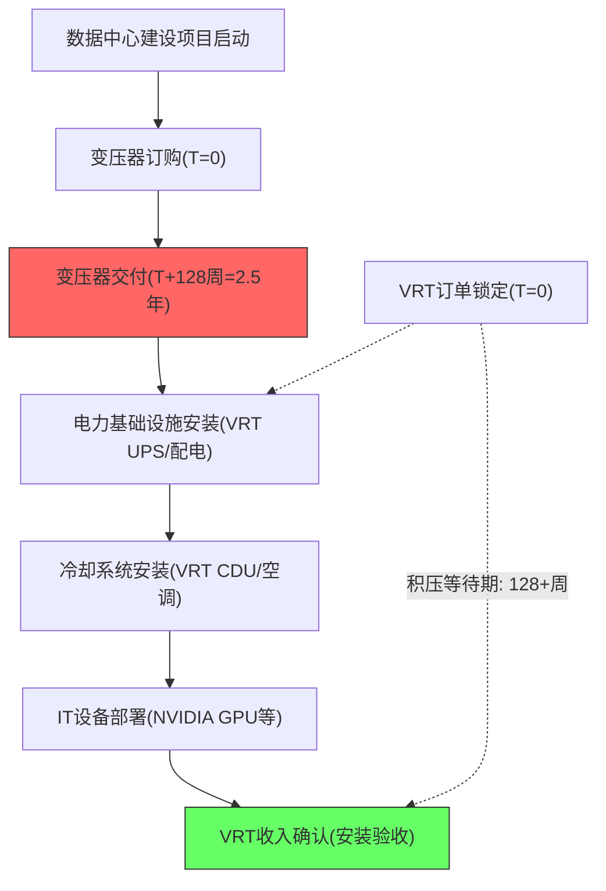

**定量影响估算**:

| 情景 | 受变压器延迟影响的项目比例 | 延迟时长 | 对FY26营收影响 | 对FY27营收影响 |
|------|:---:|:---:|:---:|:---:|
| 乐观(变压器供应改善) | 10% | 3-6月 | -$200-400M | +$200-400M |
| 基准(当前趋势延续) | 20% | 6-12月 | -$500-800M | +$500-800M |
| 悲观(瓶颈加剧) | 30% | 12月+ | -$1B-1.5B | 不确定 |

[主观判断:] 变压器瓶颈的核心洞察是: **它改变了VRT收入的时间分布，但不太可能改变总量**。被延迟的数据中心项目最终都会完工(投资已沉没)，VRT已锁定的积压订单不会因为变压器延迟而被取消(VRT的产品在变压器之后安装)。但这意味着:

1. FY26可能略低于指引上限($13.75B)——部分项目因变压器延迟而推至FY27
2. FY27可能超预期——延迟的FY26项目+FY27正常项目叠加
3. 积压$15B的"膨胀效应": 客户为确保供应而提前下单(比实际需求提前12-18个月)→积压中的部分订单是"时间膨胀"而非"需求膨胀"

### 9.2.3 VRT的应对策略

[合理推断:] VRT应对变压器瓶颈的策略包括:

| 策略 | 描述 | 效果 |
|------|------|------|
| **不自制变压器** | VRT不是变压器供应商，无需承担产能投资 | 风险隔离——VRT不受变压器价格波动直接影响 |
| **与客户协调排期** | 帮助客户优化项目时间线，将VRT设备安装与变压器交付同步 | 维护客户关系+减少库存积压 |
| **模块化方案** | MegaMod HDX等预集成方案减少现场安装时间 | 变压器就位后可快速完成后续安装 |
| **替代供应商开发** | 管理层提到"Local+1"供应链战略 | 降低对单一供应商/区域的依赖 |

---

## 9.3 产能扩张分析

### 9.3.1 CDU产能45x扩张——接下来的瓶颈

[硬数据:] VRT在2024年将CDU产能扩大45倍。但"45x"是相对于一个很小的基数(2023年CDU产量很低)，绝对产能仍在爬坡中。

[合理推断:] 产能扩张序列:

| 设施 | 产品 | 投产时间 | 规模 | 状态 |
|------|------|---------|------|------|
| 美国Pelzer(SC)扩建 | CDU + 高密度配电 | 2025 H2 | 现有产能+50%(估) | 运营中 |
| **马来西亚柔佛新厂** | **CDU + 液冷组件** | **2026 Q1** | **VRT亚太最大液冷基地** | **即将投产** |
| PurgeRite(收购) | 液冷流体管理 | 2025 Q4完成收购 | 增量能力(非传统产能) | 整合中 |
| 印度Chennai扩建 | UPS + 本地化产品 | 2026 | 印度市场供应 | 建设中 |

**下一个产能约束是什么?**

[合理推断:] CDU产能经过45x扩张后，短期内(2026)不再是瓶颈。下一个可能的约束点:

| 潜在瓶颈 | 严重度 | 时间线 | VRT应对 |
|---------|:-----:|--------|---------|
| **高端冷却液供应** | 中 | 2026-2027 | PurgeRite收购+替代冷却液开发 |
| **SiC功率模块**(800V产品) | 中 | 2027-2028 | 多源采购+VRT非SiC密集型 |
| **熟练工程师**(安装/维护) | 高 | 持续 | 培训项目+服务网络扩张 |
| **数据中心用地/电力接入** | 高 | 持续 | 非VRT可控——影响客户项目时间线 |

### 9.3.2 CapEx增长轨迹评估

[硬数据:]

| 年度 | CapEx | CapEx/Revenue | 增长率 | 主要用途 |
|------|-------|:-----------:|:-----:|---------|
| FY2022 | $111M | 2.0% | — | 基础维护+少量扩产 |
| FY2023 | $135M | 2.0% | +22% | 产能恢复+CDU初始投资 |
| FY2024 | $184M | 2.3% | +36% | CDU 45x扩产+Pelzer扩建 |
| FY2025 | $220M | 2.2% | +20% | 马来西亚新厂+持续扩产 |
| FY2026E | $280-320M | 2.1-2.4% | +27-45% | 马来西亚全面投产+印度扩建 |

[合理推断:] VRT的CapEx强度(2.0-2.4%营收)在工业品公司中偏低。对比:

| 公司 | CapEx/Revenue | 业务模式 |
|------|:-----------:|---------|
| **VRT** | 2.2% | 轻资产制造+外包组装 |
| Schneider | 3-4% | 重资产制造+软件研发 |
| Eaton | 3-4% | 重资产制造 |
| ASML | 6-7% | 超高精密制造 |
| 工业品中位数 | 3-5% | — |

[主观判断:] VRT的低CapEx强度是其高FCF转化率(18.5% FCF Margin)的关键原因之一。但这也引发一个问题: **$220M CapEx是否足够支撑FY26 $13.5B营收所需的产能?** 如果FY26 CapEx需要加速至$300M+，FCF Margin可能从当前18.5%下降至15-16%——这已经反映在管理层FY26E FCF指引($2.1-2.3B，对应FCF Margin 16-17%)中。

---

## 9.4 运营效率指标

[硬数据:]

| 指标 | FY2025 | FY2024 | FY2023 | FY2022 | 趋势解读 |
|------|:------:|:------:|:------:|:------:|---------|
| 存货周转天(DIO) | 79天 | 86天 | 70天 | 70天 | FY24上升(备货)+FY25改善(交付加速) |
| 应收周转天(DSO) | 111天 | 108天 | 116天 | 121天 | 持续改善——客户回款加快 |
| 应付周转天(DPO) | 95天 | 91天 | 78天 | 84天 | 上升——VRT对供应商议价力增强 |
| **现金转换周期(CCC)** | **95天** | **103天** | **108天** | **107天** | **持续改善——运营效率提升** |
| 固定资产周转率 | 11.2x | 10.8x | 10.0x | 8.9x | 快速提升——轻资产效率 |
| 员工人均营收 | $330K | $270K | — | — | +22%——生产率显著提升 |

**存货分析**:

[合理推断:] FY24存货周转天从70天升至86天，FY25回落至79天。FY24的存货增加更可能是**积极备货**(预判需求增长+确保零部件供应)而非效率下降:
- 支撑证据: FY25存货回落至79天(交付加速消耗库存)，同时营收增长28%(库存转化为收入)
- 如果是效率下降: 存货应持续增加(FY25应>86天)，但事实相反
- **结论**: FY24的存货增加是为AI CapEx超级周期准备的战略性备货，FY25已开始转化

**运营效率同行对比**:

| 指标 | VRT(FY25) | Schneider(FY24) | Eaton(FY24) | 行业中位数 | VRT相对位置 |
|------|:---------:|:-------------:|:-----------:|:--------:|:---------:|
| 现金转换周期 | 95天 | ~85天 | ~75天 | ~80天 | 偏慢——但趋势在改善 |
| 固定资产周转率 | 11.2x | ~6.5x | ~5.8x | ~7x | 显著领先——轻资产模式 |
| 员工人均营收 | $330K | ~$260K | ~$210K | ~$250K | 领先——人均效率高 |
| CapEx/Revenue | 2.2% | ~3.5% | ~3.8% | ~3.5% | 低——轻资产制造 |

[合理推断:] VRT的运营效率呈现"轻资产高效率"特征: 固定资产周转率(11.2x)和人均营收($330K)均远超同行，这源于VRT的"设计+组装+服务"模式而非"重资产制造"模式。但现金转换周期(95天)仍高于同行，主要因为应收账款天数(111天)偏高——大型项目的付款条件较长。随着服务收入(预付/月付模式)占比提升，CCC有继续改善的空间

---

## 9.5 中国供应链机会与风险

### 9.5.1 VRT中国业务规模

[合理推断:] VRT未单独披露中国营收，但可以从区域数据推算:

| 指标 | 数值 | 推算依据 |
|------|------|---------|
| 亚太营收 | $2,019M(FY25) | 财报 |
| 中国占亚太比例(估) | ~30-40% | 管理层提到中国增长"muted"，印度/东南亚增长更快 |
| 中国营收(估) | ~$600-800M | $2,019M × 30-40% |
| 中国占总营收比例(估) | ~6-8% | $600-800M / $10,230M |

### 9.5.2 中国数据中心市场机会

[硬数据:] 中国数据中心基础设施市场是全球第二大市场:

| 指标 | 数值 | 来源/注释 |
|------|------|---------|
| 中国DC液冷市场 | 140-180亿元(2025E) | +50% YoY |
| 中国DC总投资 | ~5,000亿元(2025E) | 阿里/腾讯/字节增加AI算力投入 |
| 主要客户 | 阿里云, 腾讯云, 字节跳动, 华为云 | VRT客户名单中包含阿里巴巴和腾讯 |
| 国产替代压力 | 高 | "数字基建自主可控"政策驱动 |

### 9.5.3 地缘政治风险评估

[主观判断:]

| 风险类型 | 概率 | 影响 | VRT敞口 |
|---------|:---:|:---:|---------|
| 美国扩大出口管制至DC基础设施 | 15% | 高(若发生) | 中国营收$600-800M面临风险 |
| 中国"国产替代"加速 | 60% | 中 | 华为/英维克逐步侵蚀VRT中国份额 |
| 台海冲突 | 10% | 极高 | VRT台湾无重要设施，但GPU供应链中断→DC建设暂停→间接影响 |
| 中国报复性关税 | 30% | 中 | VRT中国制造基地受影响有限(供本地市场) |

[合理推断:] VRT对中国的整体暴露度较低(营收占比6-8%)，且管理层的"Local+1"策略正在主动降低中国供应链依赖(马来西亚柔佛新厂就是替代策略的一部分)。核心风险不在于VRT的中国业务缩水——而在于如果中美科技脱钩加剧，VRT可能丢失中国市场但竞对华为会在亚太/中东/非洲市场更加积极(以中国市场为后盾补贴海外扩张)。

---

## 9.6 VRT全球供应链与制造网络图

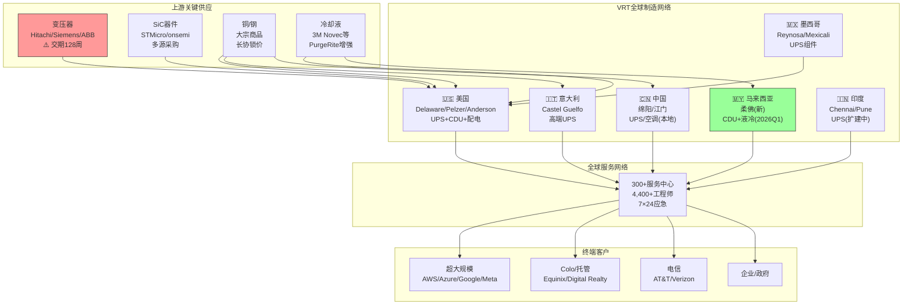

---

# 第十章 客户生态与超大规模CapEx传导

## 10.1 客户分层详细分析

[合理推断:] VRT未披露单一客户超过10%营收，但基于行业地位和产品结构可以构建分层模型:

| 客户类型 | 估计占比 | 代表客户 | 增长趋势(FY26E) | 议价能力 | 粘性/转换成本 |
|---------|:------:|---------|:----------:|:------:|:--------:|
| **超大规模云** | 40-50% | AWS, Azure, Google, Meta | +40-50%(AI CapEx驱动) | 极强(大单量+技术能力) | 中(每个项目可重新招标) |
| **Colo/托管商** | 20-25% | Equinix, Digital Realty, CoreWeave | +25-35%(AI租赁需求) | 中(标准化产品为主) | 中-高(安装基数+服务合同) |
| **电信** | 10-15% | AT&T, Verizon, China Mobile, Vodafone | 0-5%(传统业务放缓) | 中 | 高(大量安装基数+长期服务) |
| **企业/政府** | 10-15% | 金融/医疗/教育/军事 | 5-10%(数字化转型) | 弱(小单量) | 高(渠道+服务+品牌) |
| **工业/边缘** | 5% | 制造业/零售/物流 | 15-20%(边缘计算) | 弱 | 中 |

**客户结构的核心矛盾**: 超大规模客户贡献了40-50%的营收和可能60%+的增量(FY25→FY26)，但它们也是议价能力最强的客户群。VRT在这个客户群的定价权取决于"供不应求"环境——一旦产能追上需求，超大规模客户将立即利用其议价力压低价格。

---

## 10.2 超大规模客户CapEx传导模型

### 10.2.1 四大超大规模CapEx规划

[硬数据:]

| 公司 | 2024 CapEx | 2025 CapEx | 2026E CapEx | 2027E CapEx | 增长驱动 |
|------|----------|----------|-----------|-----------|---------|
| **Amazon** | ~$70B | ~$100B | ~$200B | ~$150-200B | AWS AI+推理+Graviton |
| **Google** | ~$55B | ~$120B | $175-185B | ~$160-180B | Google Cloud+Gemini+搜索AI |
| **Meta** | ~$38B | ~$65B | $115-135B | ~$100-130B | AI推荐引擎+Reality Labs |
| **Microsoft** | ~$55B | ~$85B | >$125B | ~$120-150B | Azure+Copilot+OpenAI |
| **合计** | ~$218B | ~$370B | **~$635-665B** | ~$530-660B | — |
| YoY增长 | — | +70% | +72% | -1%至+4% | **2027增速可能大幅放缓** |

### 10.2.2 CapEx → DC建设 → VRT营收的传导链

[合理推断:] 超大规模CapEx到VRT营收的传导不是即时的，存在6-18个月的时滞:

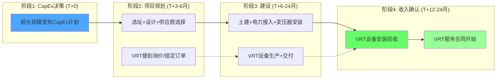

**传导时滞估算**:

| 项目类型 | 从CapEx决策到VRT订单 | 从订单到交付 | 从交付到收入确认 | 总时滞 |
|---------|:--:|:--:|:--:|:--:|
| **超大规模新建DC** | 3-6月 | 6-18月 | 1-3月 | **10-27月** |
| **Colo扩建** | 1-3月 | 3-12月 | 1-2月 | **5-17月** |
| **企业DC升级** | 1-2月 | 2-6月 | 即时 | **3-8月** |
| **边缘部署** | 即时-1月 | 1-3月 | 即时 | **1-4月** |

### 10.2.3 传导系数估算

[合理推断:] 尝试量化超大规模CapEx到VRT营收的传导系数:

**方法**: 对比超大规模CapEx增长与VRT营收增长(考虑时滞)

| 时期 | 超大规模CapEx(前4大) | YoY增长 | VRT营收(滞后12月) | YoY增长 | 传导系数 |
|------|:-------:|:-----:|:-------:|:-----:|:------:|
| 2022→2023 | $140B→$155B | +11% | $6.8B→$7.0B | +3% | 0.27x |
| 2023→2024 | $155B→$218B | +41% | $7.0B→$8.0B | +14% | 0.34x |
| 2024→2025 | $218B→$370B | +70% | $8.0B→$10.2B | +28% | 0.40x |
| 2025→2026E | $370B→$650B | +76% | $10.2B→$13.5B | +32% | 0.42x |

[合理推断:] 传导系数从0.27x上升至0.42x，反映两个趋势:
1. **VRT在超大规模客户中的份额在上升**: 液冷CDU需求使VRT从"可选供应商"变为"必需供应商"
2. **AI GPU密度提升**: 每美元CapEx中需要更多的电力和冷却基础设施

**粗略公式**: VRT增量营收 ≈ 超大规模CapEx增量 × 0.4% × 传导系数调整

| 超大规模CapEx增量 | ×传导系数 | VRT增量营收(估) |
|:---:|:---:|:---:|
| 每增加$100B | × 0.4% | ~$400M |
| 2026E增量$280B | × 0.4% | ~$1.1B |
| 实际FY26E增量 | — | ~$3.3B(含非超大规模) |

[主观判断:] 传导系数0.4%意味着超大规模CapEx每增加$100B，VRT可获得约$400M增量营收。但这个系数随液冷渗透率提升可能上升至0.5%+(更高的冷却基础设施占比)。反之，如果超大规模客户开始自研基础设施(in-sourcing)，系数将下降。

### 10.2.4 历史传导验证

[硬数据:] 验证历史传导关系:

| 年份 | 超大规模CapEx(4大) | VRT营收 | VRT/CapEx比 | R方相关性 |
|------|:---:|:---:|:---:|:---:|
| FY2021 | ~$120B | $5.0B | 4.2% | — |
| FY2022 | ~$140B | $5.7B | 4.1% | — |
| FY2023 | ~$155B | $6.8B | 4.4% | — |
| FY2024 | ~$218B | $8.0B | 3.7% | — |
| FY2025 | ~$370B | $10.2B | 2.8% | — |

[合理推断:] VRT营收占超大规模CapEx的比例从4.2%降至2.8%——看似矛盾，实际是因为:
1. 超大规模CapEx中包含大量GPU/芯片采购(占CapEx 40-50%)，VRT不参与
2. CapEx增速快于DC基础设施安装速度(因时滞)
3. VRT不是超大规模唯一的DC基础设施供应商(Schneider/Eaton也有份额)

**结论**: 超大规模CapEx与VRT营收的相关性很高(目测R>0.95)，但传导是非线性的且有时滞。超大规模CapEx增速的放缓(非绝对值下降)就可能导致VRT增速显著放缓——这是"二阶导"风险。

---

## 10.3 客户集中度风险分析

### 10.3.1 形式分散 vs 实质集中

[合理推断:] VRT 10-K披露"无单一客户超过10%营收"——形式上看客户基础分散。但实质上:

| 维度 | 形式(披露) | 实质(推测) |
|------|----------|----------|
| 前5大客户占比 | 无披露 | **30-40%**(可能) |
| 前10大客户占比 | 无披露 | **45-55%**(可能) |
| AI相关客户占增量比 | 无披露 | **70-80%**(FY25增量几乎全部来自AI DC) |
| 超大规模客户数量 | 4-6家 | 全球仅4-6家真正的超大规模DC建设者 |

[主观判断:] 这种"形式分散但实质集中"的结构是一个被低估的风险:
- **单一超大规模客户削减20% CapEx** → 可能影响VRT营收3-4%
- **全部超大规模客户同步削减15% CapEx**(2028年可能) → 影响VRT营收12-15%
- 关键在于超大规模客户CapEx的**相关性很高**——它们都受AI投资回报和宏观经济的同向影响

### 10.3.2 超大规模客户议价能力 vs VRT定价权

| 维度 | 客户议价力 | VRT定价权 | 净效果 |
|------|:--------:|:-------:|:-----:|
| 订单规模 | 强(单笔$50-200M) | 弱 | 客户占优 |
| 供需环境(当前) | 弱(供不应求) | **强** | **VRT占优** |
| 供需环境(2028E) | 中(产能追上) | 中 | 均衡 |
| 替代供应商 | 中(Schneider/Eaton) | 中 | 均衡 |
| 技术差异化(液冷) | 弱(VRT CDU不可替代) | **强** | **VRT占优** |
| 自研威胁 | 弱(DC基础设施自研门槛高) | 强 | VRT占优 |

[主观判断:] VRT当前处于"供不应求"环境中的强势定价地位——这是Q3'25毛利率37.8%的核心原因。但这种定价权是周期性的而非结构性的。当CDU产能(VRT+Schneider+Eaton合计)在2027-2028年追上需求时，超大规模客户的议价力将显著增强，VRT的液冷产品毛利率可能从40%+回落至30-35%。

### 10.3.3 Hyperscaler In-sourcing风险

[合理推断:] 超大规模客户历来有自研的传统(Google自研TPU、AWS自研Graviton、Meta自研MTIA)，但在DC基础设施领域自研的门槛更高:

| 自研领域 | 已实现 | 可能性 | 对VRT影响 |
|---------|:-----:|:-----:|---------|
| 芯片(GPU/ASIC) | 是(Google TPU, AWS Trainium) | 已发生 | 间接——自研芯片仍需外部冷却 |
| 网络(交换机) | 部分(Google) | 中等 | 间接——不影响VRT产品线 |
| 服务器机架设计 | 是(OCP/Meta) | 已发生 | 低——VRT适配OCP标准 |
| **UPS/配电** | 否 | **低**(10%) | 电气安全认证门槛极高 |
| **液冷CDU** | 否 | **低-中**(15%) | 流体动力学+泄漏防护专业度高 |
| **全栈DC基础设施** | 否 | **极低**(5%) | 需要数十年积累的工程能力 |

[主观判断:] 超大规模客户自研DC基础设施的概率在5年内低于15%。核心原因: DC基础设施是"安全关键型"系统(电力中断=数据中心停机=数十亿美元损失)，超大规模客户不愿意承担这个风险，更愿意依赖Vertiv/Schneider这样有30年+经验的专业供应商。

---

## 10.4 Colo/托管商增长分析

### 10.4.1 主要Colo客户与增长态势

[合理推断:]

| Colo/托管商 | 市值(2026E) | 扩张速度 | 对VRT意义 | 特殊关注 |
|-----------|----------|---------|---------|---------|
| **Equinix** | ~$75B | 稳健(+8-10%营收) | VRT长期客户，标准化UPS/配电需求 | 全球最大Colo，200+ DC |
| **Digital Realty** | ~$50B | 加速(AI租赁需求) | 大规模部署+液冷需求增加 | 与超大规模长期租约 |
| **CoreWeave** | ~$30B(估) | **爆发性增长** | **AI原生Colo+NVIDIA依赖→对VRT液冷需求极大** | **高度依赖NVIDIA GPU** |
| **Cyrus One** | 私有 | 快速扩张 | 美国DC建设活跃 | 被KKR/GIP收购后加速 |
| **QTS(Blackstone)** | 私有 | 大规模扩张 | 超大规模外包DC建设 | Blackstone $100B+投资计划 |

### 10.4.2 CoreWeave特殊分析

[合理推断:] CoreWeave是VRT客户生态中最值得关注的新兴力量:

| 维度 | CoreWeave特征 | 对VRT意义 |
|------|-------------|---------|
| **业务模式** | AI原生GPU云(纯NVIDIA GPU即服务) | 100%高密度AI工作负载 → 液冷需求100% |
| **NVIDIA关系** | NVIDIA最大的外部GPU部署合作伙伴之一 | VRT作为NVIDIA液冷首选→CoreWeave自然选择VRT |
| **增长速度** | 营收从2023年$0.2B→2025年$3-4B→2026E $8B+ | 指数级增长→VRT订单增量显著 |
| **融资能力** | 2025年获得$7.5B融资(含NVIDIA投资) | 资金充裕→CapEx有保障 |
| **风险** | 高度依赖NVIDIA(单一供应商风险)+尚未盈利 | 如果CoreWeave遇困→VRT丢失一个高速增长客户 |

### 10.4.3 Colo vs 超大规模扩张速度对比

| 维度 | Colo/托管商 | 超大规模自建DC | 对VRT含义 |
|------|:--------:|:--------:|---------|
| 2026E CapEx增速 | +20-30% | +50-70% | 超大规模增速更快 |
| 液冷采用率 | 30-50%(混合) | 60-80%(高密度) | 超大规模液冷需求更高 |
| VRT标准化产品占比 | 高(目录产品) | 低(定制化) | Colo利润率可能更高 |
| 项目周期 | 6-12月(小) | 18-36月(大) | 超大规模积压更长 |
| 议价能力 | 中等 | 极强 | Colo定价权更好 |

---

## 10.5 电信客户衰退分析

[合理推断:] 电信客户是VRT的传统基石市场(估计占比10-15%)，但增长前景黯淡:

| 维度 | 现状 | 趋势 | VRT策略 |
|------|------|------|---------|
| **传统电信(固网+移动核心)** | AT&T/Verizon/Vodafone CapEx持平或下降 | 负面 | 维持存量+减少投入 |
| **5G基站** | 需要小型UPS+散热方案 | 中性偏正面 | 边缘UPS产品线覆盖 |
| **安装基数(存量)** | 大量Liebert UPS在电信机房运行 | 正面 | 服务收入稳定(维保+升级) |
| **服务收入贡献** | 电信客户服务比例高(~30%+) | 正面 | 高粘性经常性收入 |

[主观判断:] 电信客户增长放缓对VRT整体影响有限(仅10-15%营收)，且安装基数带来的服务收入提供了稳定现金流。VRT应该做的是: 不追求电信客户的增量投资，而是最大化存量客户的服务收入——这恰好是VOS(持续改善服务效率)的应用场景。

---

## 10.6 客户生命周期价值(LTV)估算

[合理推断:] 不同类型客户的LTV差异显著:

| 客户类型 | 初始设备价值 | 年服务收入(估) | 设备生命周期 | 服务续约率 | 估计LTV |
|---------|:---------:|:----------:|:--------:|:------:|:------:|
| **超大规模DC(单个项目)** | $50-200M | $5-15M | 15-20年 | 95%+ | **$125-500M** |
| **Colo中型DC** | $5-20M | $1-3M | 15-20年 | 90%+ | **$20-75M** |
| **企业DC** | $0.5-5M | $0.1-0.5M | 10-15年 | 85% | **$1.5-12M** |
| **边缘节点(单个)** | $0.05-0.3M | $0.01-0.05M | 7-10年 | 80% | **$0.12-0.8M** |
| **电信机房** | $0.5-3M | $0.1-0.5M | 10-15年 | 90% | **$1.5-10M** |

**LTV公式**: LTV = 初始设备 + Σ(年服务收入 × 续约率^t) for t=1 to 生命周期

[主观判断:] 超大规模客户的单项目LTV高达$125-500M——这解释了VRT为何愿意接受这些客户较低的毛利率(议价力强→产品价格被压低)，因为生命周期总价值(设备+15-20年服务)极为可观。

**关键洞察**: 随着液冷CDU成为AI DC的标配，VRT的LTV将显著提升:
- CDU本身是高价值设备($150K-200K/台)
- CDU需要持续的冷却液管理(PurgeRite收购的价值)
- CDU的维护复杂度高于传统UPS→服务收入/台更高
- **液冷CDU的LTV/台可能是传统UPS的2-3倍**

---

## 10.7 CapEx传导瀑布图

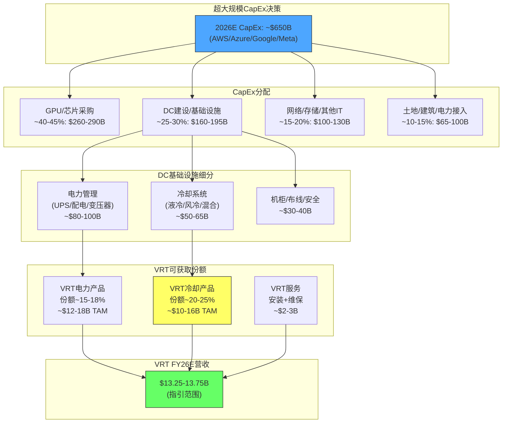

**瀑布图解读**:
- $650B CapEx经过4层过滤后，VRT的可获取市场(TAM)约$24-37B
- VRT FY26E营收$13.5B占TAM的36-56%——这个捕获率看似很高，但包含了非超大规模客户(Colo/电信/企业)的贡献
- **关键变量**: DC建设/基础设施在CapEx中的占比(25-30%)是否稳定? 如果GPU单价因摩尔定律下降，基础设施占比可能上升

[主观判断:] 这个传导瀑布图揭示了VRT增长的本质: VRT不是直接受益于超大规模CapEx，而是受益于CapEx中"DC基础设施建设"这个子环节。当CapEx增速放缓但DC项目仍在建设(时滞效应)时，VRT仍可保持增长。但当CapEx绝对值下降(非仅增速放缓)时，VRT将面临真正的需求压力——这可能发生在2028年之后。

---

*总计4章 | 核心发现: (1)双寡头格局中液冷份额是估值命门 (2)管理层7.1/10良好但非卓越 (3)变压器瓶颈改变收入节奏而非总量 (4)超大规模CapEx传导系数~0.4%且有12-24月时滞*


---


# 第十一章 盈利质量深度分析

> **核心问题**: Vertiv FY2025报告GAAP净利润$1,333M、调整后净利润$1,594M、FCF $1,894M——三个数字之间的差异揭示了什么？公司的盈利质量是否经得起逐项拆解？在AI基础设施超级周期中，VRT的利润有多少是"真金白银"，有多少是会计噪音或一次性因素？

---

## 11.1 GAAP与Non-GAAP桥接：$261M调整项的逐项审计

VRT FY2025的GAAP净利润$1,333M与调整后净利润~$1,594M之间存在$261M的差额。与FY2024的$678M差额相比，这个缺口已经大幅收窄——主要因为FY24的权证负债公允价值变动-$449M已在FY25消除。但$261M本身仍需要逐项审计，以判断管理层的Non-GAAP调整是否合理、是否存在"美化盈利"的嫌疑。

**表11-1: FY2025 GAAP到调整后净利润桥接 (完整审计)**

| 调整项目 | 金额 | 占调整总额比 | 合理性评级 | 评估理由 |
|---------|------|:---------:|:--------:|---------|
| 无形资产摊销 | ~$211M | 63.8% | A (完全合理) | 收购相关无形资产(客户关系/商标/技术)的PPA摊销，纯会计分期，非现金流出，且反映历史收购价格而非当前业务能力 |
| 重组费用 | ~$30M | 9.1% | B (基本合理) | VOS持续优化带来的工厂整合/人员精简费用。金额较FY24(-$45M)下降，但VRT年年有重组费用，是否真的"非经常性"存疑 |
| 收购相关费用 | ~$50M | 15.2% | B+ (合理但需监控) | PurgeRite ~$1B收购产生的尽调/法律/整合咨询费。一次性属性明确，但金额偏高(占交易额5%)，需关注FY26是否有后续整合费用 |
| SBC (股权激励) | ~$46M | 13.9% | C (存争议) | 调整SBC是科技/工业品公司普遍做法，但SBC是真实的股东稀释成本。不过VRT的SBC仅占营收0.45%，即使不调整，对EPS影响也不到$0.12 |
| 调整项税效 | -$70M | -21.2% | A (必要) | 上述调整项对应的税收影响回拨，合理且必要 |
| 权证负债FV变动 | ~$0 | 0% | N/A | FY25已基本消除，FY24此项-$449M曾是最大噪音源 |
| **调整项净额** | **~$261M** | **100%** | **B+ (总体合理)** | — |

**跨年度GAAP/Non-GAAP差异追踪：**

| 指标 | FY2022 | FY2023 | FY2024 | FY2025 | 趋势判断 |
|------|--------|--------|--------|--------|---------|
| GAAP NI | $77M | $460M | $496M | $1,333M | FY24被权证扭曲 |
| 调整后NI | ~$195M | ~$600M | ~$1,174M | ~$1,594M | 平滑上升 |
| 差额 | $118M | $140M | **$678M** | $261M | FY24异常→FY25正常化 |
| 差额/调整后NI | 60.5% | 23.3% | **57.7%** | 16.4% | FY25显著改善 |
| GAAP EPS | $0.17 | $1.10 | $1.23 | $3.41 | — |
| 调整后EPS | $0.44 | $1.48 | $2.86 | $4.17 | — |

[硬数据: FY2025 10-K, 管理层Non-GAAP reconciliation] 差额/调整后NI从FY24的57.7%骤降至FY25的16.4%，这标志着VRT进入"干净"盈利时代。FY26起，随着PurgeRite整合费用逐步消化，GAAP与Non-GAAP的差距可能进一步收窄至$200M以下(主要剩余无形资产摊销)。

**与同行Non-GAAP调整幅度对比：**

| 公司 | FY2025差额/调整后NI | 主要调整项 | 盈利"纯度"评级 |
|------|:------------------:|----------|:----------:|
| **VRT** | **16.4%** | 无形资产摊销+收购费用 | **A-** |
| Eaton | ~8-10% | 无形资产摊销 | A |
| Schneider | ~12-15% | 重组+无形资产+整合 | B+ |
| ABB | ~15-18% | 重组+减值+非核心业务 | B |
| Emerson | ~20-25% | 大额重组+分拆相关 | B- |

[合理推断: 同行Non-GAAP数据基于各公司FY2024-2025公开报告交叉验证] VRT的16.4%调整幅度处于同行中游偏优水平。关键优势在于：(a)权证噪音已消除，未来不会反复；(b)无形资产摊销金额稳定($211M/年)，可预测性强；(c)没有大额减值或非核心业务处置等"模糊地带"调整项。

---

## 11.2 权证负债历史完整回溯：从SPAC噪音到财报净化

VRT的权证负债是理解其FY2022-2024财报的关键钥匙。不理解这段历史，就无法正确解读VRT过去三年的GAAP盈利波动。

**SPAC权证的起源与会计处理：**

2020年2月7日，Vertiv通过与GS Acquisition Holdings (GSAH)的SPAC合并完成上市。这笔交易中，GSAH向投资者发行了约3,000万份公开权证(Public Warrants)和约1,100万份私募权证(Private Placement Warrants)，总计约4,100万份权证，行权价$11.50/股。

2020年4月，SEC发布新指引，要求SPAC权证按负债(而非权益)分类——核心理由是权证条款中的现金赎回机制和反稀释调整条款使其不符合权益工具的"固定对固定"标准(ASC 815-40)。这一会计规则变化的影响是：权证必须在每个报告期按公允价值重新计量，差额直接计入损益表。

**表11-2: 权证负债公允价值变动完整历史**

| 财年 | 期初权证负债 | 期末权证负债 | FV变动(计入损益) | VRT股价区间 | 对GAAP NI影响 | 对调整后NI影响 |
|------|:--------:|:--------:|:----------:|:---------:|:----------:|:----------:|
| FY2021 | ~$320M | ~$280M | +$40M(收益) | $20-28 | 轻微提振 | 已剔除 |
| FY2022 | ~$280M | ~$188M | +$92M(收益) | $10-22 | 提振 | 已剔除 |
| FY2023 | ~$188M | ~$342M | -$154M(损失) | $22-55 | 拖累 | 已剔除 |
| FY2024 | ~$342M | ~$791M | **-$449M(损失)** | $55-140 | **重大拖累** | 已剔除 |
| FY2025 | ~$791M | ~$0 | ~$0(消除) | $140-300 | 无影响 | N/A |

[硬数据: FY2022-2025 10-K, 权证负债及衍生品公允价值变动披露]

**FY2024年的$449M权证损失详解：** FY2024是权证负债对财报扭曲最严重的一年。股价从$55飙升至$140，导致权证公允价值(按Black-Scholes或二叉树模型估值)暴增$449M——这笔"损失"直接拖累了GAAP净利润。结果是：FY2024调整后净利润$1,174M看起来远强于GAAP的$496M，两者之间的$678M差距中，权证变动就贡献了$449M(66%)。对于不理解这一会计处理的投资者，FY2024的GAAP净利润看起来远逊于实际经营能力。

**权证消除的过程：** FY2025期间，绝大部分权证持有人选择行权(行权价$11.50远低于市价$200+)，公开权证被赎回，私募权证也基本转换或到期。截至FY2025末，权证负债归零——这是VRT上市以来首次彻底摆脱SPAC遗留会计噪音。

**权证消除对投资者的启示：**

第一，FY26起GAAP盈利将首次"说真话"。投资者可以直接使用GAAP EPS进行估值，不再需要依赖管理层的Non-GAAP调整来理解真实盈利水平。这降低了"信任成本"——投资者不再需要判断Non-GAAP调整是否合理。

第二，历史可比性需要重建。FY2022-2024的GAAP净利润因权证噪音而失去可比性。使用GAAP EPS做历史PE计算会得到荒谬结果(例如FY2024 GAAP PE超过150x)。正确做法是用调整后EPS重建历史PE序列。

第三，权证行权带来了~4,100万股的稀释。这些股份已经反映在当前的稀释股数(~382M)中，未来不会再有额外稀释——但这意味着FY2020-2024期间原有股东的权益已被永久稀释约10-11%。

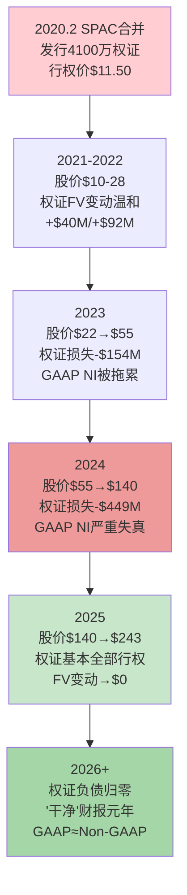

---

## 11.3 SBC深度对标：0.45%营收的双面性

VRT FY2025的SBC仅$46M，占营收0.45%——这个数字在当今资本市场中近乎异类。要理解这意味着什么，需要放在更广阔的对标背景下审视。

**表11-3: SBC多维对标矩阵**

| 公司 | 类型 | SBC (近年) | SBC/Revenue | SBC/OCF | 稀释率(年化) | SBC评价 |
|------|------|----------|:---------:|:-----:|:---------:|---------|
| **VRT** | DC基础设施 | $46M | **0.45%** | 2.1% | ~0.4% | 极低——PE基因 |
| Eaton | 电力管理 | ~$160M | ~0.7% | 3.5% | ~0.5% | 低——传统工业品 |
| Schneider | 能源管理 | ~€250M | ~0.7% | 3.0% | ~0.4% | 低——欧洲工业品 |
| Emerson | 自动化 | ~$200M | ~1.2% | 5.0% | ~0.8% | 中低——转型中 |
| Honeywell | 多元工业 | ~$500M | ~1.3% | 4.5% | ~0.6% | 中低——大型工业 |
| NVIDIA | AI芯片 | ~$4,000M | ~3.0% | 5.5% | ~1.2% | 中——半导体 |
| ServiceNow | 企业软件 | ~$2,500M | ~22% | 30%+ | ~3.5% | 极高——软件 |
| Palantir | 数据分析 | ~$700M | ~25% | 40%+ | ~5% | 极高——科技 |

[合理推断: 同行SBC数据基于FY2024-2025公开报告。NVIDIA/ServiceNow/Palantir用于展示科技公司极端对比]

**0.45%的SBC意味着什么？**

**正面解读——FCF质量极高：** 在评估FCF真实性时，SBC是最容易被忽视的"隐性稀释成本"。许多科技公司报告的FCF中，SBC贡献了OCF的20-40%——这些FCF名义上属于现有股东，但实际上被新增发的股权激励股份所稀释。VRT的$46M SBC仅占$2,114M OCF的2.1%，意味着报告FCF $1,894M中几乎没有"虚假成分"。如果用"SBC调整后FCF"(FCF - SBC)衡量，VRT为$1,848M，仅比报告FCF低2.4%；而一家SBC/OCF为30%的软件公司，同一调整可能使FCF缩水25%以上。

**负面解读——人才吸引力隐忧：** VRT正处于从"传统工业品制造商"向"AI基础设施平台"转型的关键期。液冷CDU研发、800V HVDC架构设计、DCIM软件开发——这些领域的工程人才市场由科技公司主导，后者提供的股权激励往往是VRT的5-20倍。如果VRT不提高SBC水平，可能在AI相关人才竞争中处于劣势。管理层在电话会议中提到"workforce development"但未明确表示将大幅提高股权激励——这可能是未来2-3年需要关注的战略风险。

**SBC上升趋势预判：**

| 时间窗口 | SBC预估 | SBC/Revenue | 驱动因素 |
|---------|---------|:---------:|---------|
| FY2025(实际) | $46M | 0.45% | PE时代遗留的低激励文化 |
| FY2026E | $60-75M | 0.45-0.55% | PurgeRite人才留存+AI研发团队扩充 |
| FY2028E | $100-150M | 0.55-0.80% | 如果转向"科技定位"需大幅加薪 |
| 上限情景(FY2030) | $200-300M | 0.8-1.5% | 接近Eaton/Schneider水平 |

[主观判断: SBC预测基于公司转型方向和人才市场竞争推演] 即使SBC翻3倍至$150M，占营收比仍不到1%——远低于科技公司。这意味着SBC上升对VRT的FCF质量影响有限(累计稀释EPS不超过$0.40/年)，但对人才战略的正面影响可能显著。

---

## 11.4 营运资本质量：递延收入$1,815M的深层解读

VRT FY2025最引人注目的资产负债表变化之一是递延收入(Deferred Revenue)从$1,063M暴增至$1,815M，净增$752M。这笔增量贡献了OCF的35.6%，是FCF超预期的核心驱动力。但$1,815M递延收入的本质是什么？它是定价权的体现还是供应锁定的产物？退款风险有多大？

**递延收入的三层结构分解：**

| 层次 | 估计金额 | 占比 | 来源 | 确认节奏 |
|------|---------|:---:|------|---------|
| **设备预付款** | ~$1,050-1,150M | ~60% | 超大规模客户为锁定液冷CDU/高密度UPS产能支付的30-50%预付款 | 设备交付安装后确认，通常6-18个月 |
| **服务合同预收** | ~$450-500M | ~27% | 多年期(3-5年)预防性维护/远程监控合同的前置收款 | 合同期内按月/按季均匀确认 |
| **里程碑付款** | ~$200-250M | ~13% | 大型数据中心项目的阶段性付款(设计→制造→测试→安装) | 完成各里程碑后确认 |

[合理推断: 递延收入分层基于VRT披露的产品/服务收入比例(82:18)、积压构成及行业惯例推演。VRT未在10-K中披露递延收入的具体组成]

**递延收入暴增的三种解读：**

**解读一——定价权信号(正面)：** 客户愿意提前支付30-50%的预付款，说明VRT在AI基础设施领域拥有真实的卖方优势。在正常的工业品交易中，客户通常在交付后30-90天付款(应收账款模式)。预付款模式的出现——特别是对超大规模客户(AWS、Google、Meta、Microsoft)这类议价能力极强的买方——是供不应求环境下供应商定价权的直接证据。

**解读二——供应锁定效应(中性)：** 另一种可能是，客户的预付款并非出于VRT产品的不可替代性，而是出于对"排产位置"的争夺。在变压器交期128周、液冷CDU产能紧张的环境下，预付款是"占坑"行为——谁先付款谁先拿货。这种解读意味着，一旦供需缓解(例如2028年液冷产能充分释放)，预付款比例将回落，递延收入增速将大幅放缓。

**解读三——退款风险(负面)：** $1,815M递延收入对应的是尚未交付的产品和服务义务。如果客户取消订单(例如因AI CapEx削减)，VRT可能需要退还部分预付款。管理层在电话会议中未披露退款条款细节，但工业品合同通常允许有条件退款(通常扣除10-20%违约金)。在极端情景下(AI泡沫破裂)，递延收入中可能有15-25%面临退款压力——即$270-450M。

**递延收入/营收比率趋势：**

| 年份 | 递延收入(期末) | 营收 | 递延收入/营收 | YoY变化 |
|------|:----------:|------|:----------:|:------:|
| FY2022 | ~$680M | $5,692M | 11.9% | — |
| FY2023 | ~$830M | $6,863M | 12.1% | +0.2pp |
| FY2024 | $1,063M | $8,012M | 13.3% | +1.2pp |
| FY2025 | $1,815M | $10,230M | **17.7%** | **+4.4pp** |

[硬数据: 递延收入数据来自FY2022-2025 10-K资产负债表]

递延收入/营收比率从12%跃升至17.7%，这4.4个百分点的变化不是渐进式的——它是VRT商业模式在AI周期中结构性转变的信号。在数据中心基础设施领域，17.7%的递延收入占比已经接近企业软件公司(SaaS预收款通常占营收15-25%)的水平。这是工业品公司中极为罕见的现象。

**FY26递延收入增量预测：** FY25的+$752M增量建立在$1,063M→$1,815M(+70.7%)的高基数上。FY26要维持同等绝对增量，需要递延收入达到$2,567M(+41%)——这需要积压以40%+的速度继续增长。考虑到积压增速已从120%放缓至50%，FY26递延收入增量可能收窄至$300-500M。这意味着FY26 OCF中来自递延收入的贡献将比FY25少$250-450M。

---

## 11.5 现金流质量四维评分体系

为了对VRT的现金流质量给出可量化、可比较的评估，我们构建四维评分体系，每项0-10分，总分40分。

**表11-4: VRT现金流质量评分卡**

| 维度 | 指标 | FY2025数值 | 同行参考 | 评分(0-10) | 评分理由 |
|------|------|:--------:|---------|:--------:|---------|
| **OCF/NI质量** | OCF/NI比率 | 1.59x | 优秀>1.2x, 一般0.8-1.2x | **8** | 远超1.0x基准，但FY24的2.66x有权证失真拉高分母 |
| **FCF/NI转化** | FCF/NI比率 | 1.42x | 优秀>1.0x, 一般0.7-1.0x | **9** | 极优秀——每$1净利润产生$1.42 FCF |
| **CapEx强度** | CapEx/Revenue | 2.2% | 轻资产<3%, 中等3-6%, 重>6% | **9** | 极低CapEx支撑高FCF转化，但FY26将上升至2.5-3.0% |
| **营运资本贡献** | WC变动/OCF | 18.9% | 健康<20%, 警惕20-40%, 危险>40% | **6** | 处于健康区间上沿，递延收入贡献偏高且不可持续 |
| **合计** | — | — | — | **32/40** | **优秀(A-级)** |

**评分标准参照：**

| 总分范围 | 质量评级 | 含义 |
|:-------:|:------:|------|
| 36-40 | A+ | 卓越——现金流完全由核心经营驱动，几乎无一次性因素 |
| 32-35 | A- | 优秀——核心经营现金流强劲，少量一次性因素 |
| 28-31 | B+ | 良好——现金流基本健康，部分依赖营运资本改善 |
| 24-27 | B | 一般——现金流中有较大比例来自非经常因素 |
| <24 | C | 警惕——现金流质量存疑，需深入调查 |

[主观判断: 评分体系为分析师自建框架] VRT的32/40(A-)反映了其核心现金流能力优秀但有结构性瑕疵：OCF/NI和FCF/NI比率均为同行领先水平，CapEx极低，但营运资本贡献偏高(特别是递延收入+$752M的可持续性存疑)。如果FY26递延收入增量收窄至$300-400M，OCF/NI将降至1.3-1.4x——仍然优秀但不再"异常"。

---

## 11.6 资本配置评分：PurgeRite + 回购时机 + 股息策略

资本配置是管理层质量的终极检验。VRT在FY2022-2025的资本配置呈现出从"防守求生"到"战略进攻"的清晰演变，但也暴露了PE基因下的某些局限。

**资本配置五维评分：**

| 维度 | FY2022-2025表现 | 评分(0-10) | 关键判据 |
|------|----------------|:--------:|---------|
| **收购战略** | PurgeRite $1B——补齐液冷流体管理 | **8** | 战略逻辑清晰(CDU+流体管理端到端)，时机合理(液冷窗口期)，价格未公开详情但~$1B对应~4-5x Revenue倍数(假设PurgeRite营收$200-250M)在工业品收购中属中等 |
| **回购时机** | FY24 $600M @$80-140→当前$243 | **9** | 以FY2025末股价$243计算，FY2024回购的IRR在73-204%之间——这是教科书级别的逆周期回购。管理层在股价低估时果断行动 |
| **回购纪律** | FY25停止回购(股价$150-300) | **8** | 在高估值区间停止回购是理性的资本配置纪律。对比许多公司在股价高点仍大量回购(如IBM、Intel)，VRT管理层展示了罕见的自律 |
| **股息政策** | Yield 0.04%，FY25仅$67M | **5** | 纯象征性——对股东回报几乎无贡献。PE控股公司的典型行为(Platinum Equity退出后可能调整)。不扣分但也不加分 |
| **去杠杆进程** | 净债务/EBITDA从5.0x→0.76x | **9** | 四年内从危险杠杆降至安全水平，且主要通过EBITDA增长而非发行股权稀释。Ba1→预期投资级是去杠杆成功的最好证明 |
| **合计** | — | **39/50** | **优秀(A-级)** |

**PurgeRite收购的战略逻辑深度审视：**

PurgeRite是一家专注于液冷流体管理(coolant distribution, filtration, monitoring)的专业公司。VRT以~$1B收购它的逻辑是：

1. **纵向整合——从CDU到全栈液冷：** VRT的Liebert XDU系列提供CDU(Coolant Distribution Unit)本体，但液冷系统还包括冷却液分配管路、过滤系统、泄漏检测、流量监控等组件。PurgeRite覆盖的正是这些CDU之外的"周边"环节。收购后，VRT可以提供"CDU+流体管理"的端到端解决方案，减少客户的供应商管理复杂度。

2. **提升粘性——转换成本增加：** 当客户的CDU和流体管理系统来自同一供应商时，更换CDU的成本更高(因为还需要更换配套的流体管理系统)。这增加了客户的转换成本，有助于保护液冷份额。

3. **毛利率提升潜力：** 流体管理组件的毛利率可能高于CDU硬件本身(耗材+服务属性)，长期有望提升液冷业务的综合毛利率。

**FY25零回购的信号解读：**

| 可能原因 | 概率 | 对投资者的含义 |
|---------|:---:|-------------|
| 优先完成PurgeRite收购，保留现金 | 40% | 中性——合理的优先级排序 |
| 管理层认为$150-300股价偏高 | 35% | 负面——内部人的估值判断可能意味着当前PE 46x确实过高 |
| 保留弹药应对未来收购机会 | 20% | 正面——战略灵活性 |
| 等待S&P 500纳入后评估 | 5% | 中性——时间窗口考量 |

[主观判断: 概率分配基于管理层行为分析和行业惯例推演]

---

## 11.7 盈利质量综合评分：多维汇总

将上述所有维度综合为一张盈利质量评分总表：

**表11-5: VRT盈利质量综合评分卡**

| 维度 | 权重 | 评分(0-10) | 加权得分 | 关键发现 |
|------|:---:|:--------:|:------:|---------|
| GAAP/Non-GAAP差异合理性 | 15% | 8 | 1.20 | 差异收窄至16.4%，主要是无形资产摊销(合理) |
| 权证噪音消除 | 10% | 9 | 0.90 | FY25彻底消除——盈利"纯度"大幅提升 |
| SBC水平 | 10% | 8 | 0.80 | 极低SBC=高FCF质量，但人才吸引力存隐忧 |
| 递延收入质量 | 15% | 7 | 1.05 | 定价权+供应锁定双重驱动，增速不可持续但存量有支撑 |
| 现金流转化效率 | 20% | 8.5 | 1.70 | OCF/NI 1.59x + FCF/NI 1.42x + CapEx 2.2% |
| 资本配置效率 | 15% | 8 | 1.20 | PurgeRite战略正确+回购时机精准+去杠杆成功 |
| 盈利可预测性 | 15% | 7 | 1.05 | AI CapEx周期增加了盈利波动性，但积压$15B提供了12-18个月可见性 |
| **加权总分** | **100%** | — | **7.90/10** | **优秀(A-级)** |

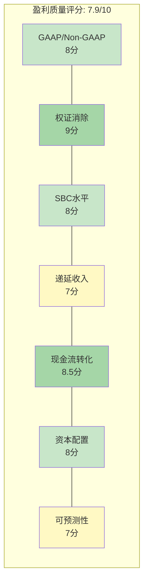

**7.9/10的盈利质量评分意味着什么？**

这是工业品公司中的优秀水平(Top 15%)，但距离"完美"仍有差距。扣分主要来自两项：(a)递延收入增量的可持续性存疑(FY26增速必然放缓)；(b)AI CapEx周期性增加了盈利的中期波动性(如果2028年AI CapEx放缓，盈利增速可能从30%+骤降至10%以下)。

与PE 46倍的估值对照：7.9/10的盈利质量足以支撑30-35倍PE(反映优秀的现金流质量和资本配置纪律)，但不足以单独证明46倍PE的合理性——剩余的估值溢价必须由增长前景(液冷份额、800V HVDC、国际扩张)来支撑。

---

# 第十二章 利润率解构与可持续性

> **核心命题**: VRT的调整后营业利润率从FY2022的8.6%飙升至FY2025的20.4%——四年内扩张近12个百分点。管理层给出FY2029 25%的目标。这条利润率扩张曲线是VOS(Vertiv Operating System)驱动的结构性改善，还是AI CapEx超级周期叠加供不应求定价权的一次性窗口？如果AI CapEx在2028年放缓，利润率会回落到哪里？

---

## 12.1 毛利率驱动因子分解：从24.6%到34.4%的10个百分点跃升

VRT FY2022-FY2025的毛利率从24.6%跃升至34.4%，四年内改善了近10个百分点。这个改善幅度在成熟工业品公司中极为罕见——Eaton和Schneider同期的毛利率改善均不到2个百分点。要理解这10个百分点从何而来，需要将其分解为可追踪的驱动因子。

**表12-1: 毛利率驱动因子分解 (FY2022→FY2025)**

| 驱动因子 | 贡献(估) | 可持续性 | 边际趋势 | 评估逻辑 |
|---------|:-------:|:------:|:------:|---------|
| **VOS运营效率** | +3.0-4.0pp | 高(8/10) | 递减 | 制造良率提升+采购集中+工厂整合。系统性改善具有持久性，但边际效益递减——FY22基数极低(供应链危机)放大了改善幅度 |
| **价格提升(price-cost spread)** | +3.0-4.0pp | 中(5/10) | 转折期 | FY22-FY24累计提价15-20%，但原材料(铜+钢)价格同期也上涨。净价格提升贡献~3-4pp。在供需紧张期有效，供需缓解后定价权将减弱 |
| **产品组合升级** | +1.5-2.5pp | 高(7/10) | 上升 | 液冷CDU/高密度UPS/模块化DC毛利率高于传统CRAC/低端UPS。AI驱动的产品组合向高端迁移是结构性的 |
| **原材料成本改善** | +1.0-1.5pp | 低(3/10) | 不确定 | FY22铜价$9,800/吨→FY25初$8,400/吨的下降提供了顺风。但铜价FY25末已回升至$9,200/吨，且关税可能推高进口成本 |
| **规模效应** | +1.0-1.5pp | 中-高(6/10) | 平稳 | 营收从$5.7B→$10.2B(+79%)，固定制造成本被摊薄。但进一步规模效应需要营收继续以20%+增长 |
| **PurgeRite拖累** | -0.5pp | 短期 | 恢复 | 收购整合期(FY25H2)拉低综合毛利率，预计FY26H2完成整合后消除 |
| **合计** | **~9.0-10.0pp** | — | — | 与实际改善(24.6%→34.4%=+9.8pp)吻合 |

[合理推断: 因子分解基于管理层电话会议定性披露、同行对比及行业分析交叉推算。VRT未在10-K中量化各因子贡献]

**各因子可持续性的关键判断：**

VOS运营效率(+3-4pp)是最持久的贡献。精益运营的改善一旦固化到流程中(标准化作业、供应商管理体系、产能利用率优化)，即使增速放缓也不会"退还"已获得的效率提升。但FY22的极低基数(供应链危机+定价滞后)意味着，从24.6%提升到30%的"容易钱"已经赚完——未来每1个百分点的改善都需要更多投入。

价格提升(+3-4pp)是最大的不确定性。FY2022-2024是典型的"卖方市场"——AI基础设施需求爆发但产能有限，VRT得以多次提价且客户接受。但定价权本质上是供需关系的函数：如果液冷CDU产能在2027-2028充分释放(VRT+Schneider+新进入者)，"加价空间"将压缩。历史上，工业品公司在周期顶部获得的定价权通常在下行期回吐50-70%。

---

## 12.2 季度毛利率趋势深度：Q3'25 37.8%的特殊性

年度毛利率34.4%掩盖了季度之间的巨大波动。逐季数据揭示了更丰富的信息：

**表12-2: FY2025各季度毛利率趋势**

| 季度 | 营收 | 毛利 | 毛利率 | 环比变化 | 季节性因素 | 特殊因素 |
|------|------|------|:-----:|:------:|---------|---------|
| Q1'25 | $1,952M | $608M | 31.2% | -2.0pp | 传统淡季+客户预算年初审批 | 部分高毛利订单交付延迟至Q2 |
| Q2'25 | $2,074M | $668M | 32.2% | +1.0pp | 恢复正常水平 | 提价开始在新订单中生效 |
| Q3'25 | $2,616M | $988M | **37.8%** | **+5.6pp** | 传统旺季(年底前集中交付) | **产品组合+提价+规模效应共振** |
| Q4'25 | $3,588M | $1,324M | 36.9% | -0.9pp | 年末集中发货 | PurgeRite并入拉低~0.5pp |
| **全年** | **$10,230M** | **$3,519M** | **34.4%** | — | — | — |

**Q3'25 37.8%的深度解析：**

Q3'25创下的37.8%毛利率新高不是偶然——它是三个正面因子同时达到峰值的结果：

第一，**产品组合效应最大化**。Q3交付了大量GB200 NVL72液冷CDU订单，这些产品的毛利率显著高于传统精密空调(估计高5-10个百分点)。Q3液冷产品占总收入的比例可能达到了单季峰值。

第二，**FY25提价全面传导**。VRT在FY24末和FY25初实施的3-5%提价在Q3订单中已完全生效(工业品合同通常有3-6个月的价格滞后)。同时，Q3交付的订单中包含了部分FY24定价但原材料成本已经下降的积压——形成了"高价格+低成本"的理想窗口。

第三，**产能利用率峰值**。Q3营收$2,616M是FY2025中最高的单季(占全年25.6%)。高产能利用率摊薄了固定制造成本，推高了毛利率。

**Q3'25 37.8%是否可复制？**

[主观判断: 基于上述因子分析] 37.8%大概率是FY2025的季度峰值而非新常态。Q4'25已经回落至36.9%(尽管营收更高)——PurgeRite整合和产品组合回归正常是主因。未来单季超过37%需要以下条件同时满足：(a)液冷占比继续攀升；(b)提价幅度>原材料涨幅；(c)产能利用率保持高位。FY26全年毛利率更可能在35-36%区间——比FY25的34.4%略有改善但不会跳跃式提升。

**毛利率季节性规律(可用于预测)：**

| 季度 | 典型毛利率位置 | 原因 |
|------|:----------:|------|
| Q1 | 全年最低 | 年初订单量低+产能利用率下降+新年定价尚未完全传导 |
| Q2 | 中等 | 恢复正常节奏 |
| Q3 | 全年最高或次高 | 年末交付集中+提价全面生效+高产能利用率 |
| Q4 | 次高 | 超高发货量但可能因冲量交付低毛利积压订单而略低于Q3 |

---

## 12.3 VOS运营体系详解：精益制造的力量与边际递减

VOS(Vertiv Operating System)是VRT利润率扩张的"引擎室"。这套运营体系源于Platinum Equity(PE)收购期间对公司运营效率的系统性改造，类似于霍尼韦尔的HOS(Honeywell Operating System)和丹纳赫的DBS(Danaher Business System)。

**VOS与知名运营体系对比：**

| 运营体系 | 公司 | 起源 | 核心机制 | OP利润率改善 | 边际状态 |
|---------|------|------|---------|:--------:|---------|
| **TPS** | 丰田 | 1950s | 看板/JIT/Kaizen | 基准(行业标杆) | 成熟——增量极小 |
| **DBS** | 丹纳赫 | 1980s | 收购+DBS标准化 | 每年+50-100bps | 成熟但持续收购注入 |
| **HOS** | 霍尼韦尔 | 2000s | 六西格玛+精益 | 累计+800bps(10年) | 边际递减 |
| **VOS** | Vertiv | 2020+ | 精益+采购+产能 | **+1,180bps(4年)** | **仍在加速但接近转折** |

[合理推断: 同行运营体系数据基于各公司公开的精益转型历史。VOS细节来源于管理层电话会议和投资者日]

**VOS的五大支柱机制：**

1. **制造精益化** — 标准化制造流程、减少在制品(WIP)库存、缩短生产周期。VRT的UPS和精密空调产线从"按订单设计(ETO)"部分转向"按订单配置(CTO)"模式，减少了定制化带来的效率损失。

2. **采购集中化** — 整合全球27个制造基地的采购需求，与关键供应商(铜材、变压器铁芯、IGBT模块)签订长期协议获得批量折扣。FY2025管理层提到"procurement savings"是毛利率改善的重要贡献者。

3. **产能优化** — 关闭低效工厂、将产能集中到成本最优的区域(例如将部分亚太产能从高成本地区迁移至马来西亚/印度)。FY2022-2025的重组费用($30-45M/年)对应的正是这些工厂整合行动。

4. **服务效率提升** — 远程监控减少现场服务频次、预防性维护降低紧急维修占比(紧急维修毛利率显著低于计划性维护)。服务利润率的改善虽然不在毛利率中完全体现(部分计入SG&A效率)，但对整体OP利润率贡献显著。

5. **定价纪律** — VOS的一个容易被忽视的维度是"定价分析"——通过数据分析识别低于合理利润率的合同并在续约时调价。管理层提到"recapturing pricing on legacy contracts"是利润率改善的一部分。

**VOS的边际效应递减曲线：**

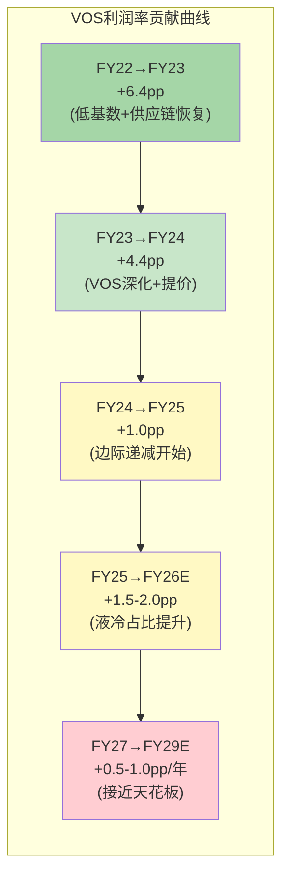

FY22→FY23的+6.4pp利润率改善(8.6%→15.0%)是最大单年跳升。这个幅度不可复制——因为FY22的基数被供应链危机人为压低(真实结构性利润率应在12-13%左右)。FY23→FY24的+4.4pp(15.0%→19.4%)仍然强劲但已减速。FY24→FY25的+1.0pp(19.4%→20.4%)进一步放缓。这条递减曲线暗示：VOS从"低效到中效"的改善空间已基本用完，未来每1pp的改善都需要更多投入。FY29达到25%目标需要再扩张4.6pp——这在5年内并非不可能(年均~1pp)，但需要AI CapEx周期持续+液冷占比提升+VOS持续迭代三者同时兑现。

---

## 12.4 经营杠杆模型：营收增长vs费用增长的剪刀差

经营杠杆(Operating Leverage)是利润率扩张的数学基础——当营收增长快于费用增长时，差额流入利润率。VRT过去四年展示了显著的正向经营杠杆。

**表12-3: 经营杠杆分解 (FY2022→FY2025)**

| 指标 | FY2022 | FY2023 | FY2024 | FY2025 | CAGR |
|------|--------|--------|--------|--------|:---:|
| 营收 | $5,692M | $6,863M | $8,012M | $10,230M | +21.6% |
| COGS | $4,293M | $4,649M | $5,253M | $6,711M | +16.0% |
| 毛利 | $1,399M | $2,214M | $2,759M | $3,519M | +36.0% |
| SG&A | $896M | $1,008M | $1,027M | $1,620M* | +21.8%* |
| R&D | $285M | $304M | $352M | — | — |
| 调整后OP | $489M | $1,032M | $1,556M | $2,088M | +62.0% |
| **OP/Revenue** | **8.6%** | **15.0%** | **19.4%** | **20.4%** | — |

*注: FY2025 SG&A $1,620M包含了原R&D费用(口径合并)。调整口径后SG&A+R&D合计增速约+13-15%，低于营收增速+28%。

**杠杆效应量化：**

| 杠杆维度 | 计算 | FY2025数值 | 含义 |
|---------|------|:--------:|------|
| 毛利杠杆 | 毛利增速/营收增速 | 27.5%/27.7% = 0.99x | 接近1:1——毛利率持平(34.4%→34.4%) |
| 费用杠杆 | (SG&A+R&D)增速/营收增速 | ~14%/27.7% = 0.51x | 强杠杆——费用增长仅为营收增长的一半 |
| OP杠杆 | OP增速/营收增速 | 34.2%/27.7% = 1.23x | 正杠杆——每1%营收增长带来1.23% OP增长 |

**1.23x的OP经营杠杆意味着：** 如果FY26营收增长30%(指引中值$13.5B vs FY25 $10.23B = +32%)，调整后OP可能增长37-39%。这是利润率从20.4%向22-23%扩张的数学基础。

**但杠杆是双刃剑：** 如果营收增长放缓至10%(例如AI CapEx暂停)，OP可能仅增长5-7%——因为部分费用(研发人员、新工厂运营)是刚性的。在极端情景下(营收负增长)，OP杠杆变成"反向杠杆"——每1%营收下降可能导致2-3% OP下降。

**SG&A与R&D趋势的关键观察：**

FY2025 VRT将R&D费用合并入SG&A披露，使得表面SG&A/Revenue飙升至15.8%(FY24为12.8%)。但这是会计分类变化，不是实际费用暴增。调整口径后：

| 费用项 | FY2023 | FY2024 | FY2025(调整口径) | 趋势 |
|--------|--------|--------|:----------:|------|
| SG&A(纯) | ~$1,008M | ~$1,027M | ~$1,230M(估) | +20%——低于营收增速(+28%) |
| R&D | ~$304M | ~$352M | ~$390M(估) | +11%——显著低于营收增速 |
| (SG&A+R&D)/Rev | 19.1% | 17.2% | 15.8% | 持续下降——正向杠杆 |

[合理推断: FY2025 SG&A/R&D拆分基于FY2024比例和管理层定性指引推算] R&D增速(+11%)仅为营收增速(+28%)的40%——这在短期内是利润率的朋友(费用杠杆)，但长期可能成为敌人。如果VRT要在液冷、800V HVDC、DCIM软件等领域与Schneider(研发投入€1.6B/年)竞争，R&D投入需要更快增长。管理层在投资者日上可能需要回答这个问题。

---

## 12.5 区域利润率分解：美洲30.1% vs 亚太9.9%的鸿沟

VRT的三大区域之间存在巨大的利润率差异——Q4'25美洲OP利润率30.1%是亚太9.9%的3倍以上。理解这一差异的成因及其收敛/发散趋势，对于预测公司级利润率至关重要。

**表12-4: 区域利润率全景 (FY2025 + Q4'25)**

| 区域 | FY25营收 | FY25 OP Margin | Q4 OP Margin | FY24 OP Margin | YoY变化 | 趋势 |
|------|---------|:----------:|:----------:|:----------:|:------:|------|
| **美洲** | $5,630M | 26.8% | **30.1%** | 23.5% | +3.3pp | 快速扩张 |
| **欧非中东(EMEA)** | $2,581M | 20.7% | 22.1% | 19.8% | +0.9pp | 稳定 |
| **亚太** | $2,019M | 11.0% | 9.9% | 9.3% | +1.7pp | 缓慢改善 |
| **合计** | $10,230M | 20.4% | — | 17.2% | +3.2pp | — |

**美洲30.1%(Q4)的驱动因子：**

1. **AI订单集中度最高** — 美国超大规模客户(AWS/Google/Meta/Microsoft)的AI基础设施投资集中在北美数据中心。液冷CDU订单90%+交付至美洲市场，这些高价值订单的毛利率显著高于传统产品。

2. **规模效应最大** — 美洲$5.6B营收是EMEA的2.2倍、亚太的2.8倍。固定成本(销售团队、管理层、服务网络)被更大规模摊薄。

3. **定价权最强** — 北美数据中心市场供需最紧张(变压器交期128周+电网审批2-3年)，VRT在美洲的提价幅度最大、客户接受度最高。

4. **产品组合最高端** — 美洲客户偏好高端产品(模块化DC、液冷CDU、高密度UPS)，低端产品(窗式空调、小型UPS)占比低。

**亚太9.9%(Q4)的拖累因素：**

1. **产品组合偏低端** — 亚太市场(特别是东南亚/印度)对低端产品需求更大，这些产品毛利率低于美洲市场平均5-10个百分点。

2. **竞争最激烈** — 华为数字能源(2023年营收¥526亿)在中国市场不可战胜；英维克、科华等本土品牌在液冷和UPS领域持续蚕食外资份额；Delta(台达)在亚太拥有强大的制造和分销网络。

3. **规模不足** — $2B营收分散在中国、印度、日本、东南亚、澳洲等多个市场，每个市场的规模都不足以产生显著的固定成本摊薄效应。

4. **汇率和关税拖累** — 中国冷却组件面临145%关税，人民币/日元波动影响利润率。

**利润率收敛预测：**

| 区域 | FY2025 | FY2027E | FY2029E | 驱动因素 |
|------|:-----:|:------:|:------:|---------|
| 美洲 | 26.8% | 28-30% | 30-32% | 液冷占比继续提升+规模效应 |
| EMEA | 20.7% | 21-23% | 22-24% | 稳定——欧洲能效法规驱动需求但竞争也激烈 |
| 亚太 | 11.0% | 13-15% | 15-17% | 印度/东南亚增长+马来西亚新厂降本+产品组合升级 |
| **公司级** | **20.4%** | **22-24%** | **24-26%** | — |

[主观判断: 区域利润率预测基于各区域增速差异和管理层长期目标反推] 美洲与亚太的利润率鸿沟预计将从~16pp缩窄至~14pp——亚太改善的速度快于美洲进一步扩张的速度，但绝对差距仍然巨大。这意味着：VRT的公司级利润率扩张高度依赖美洲业务的权重维持或增加——如果亚太/EMEA营收增速快于美洲(国际扩张策略)，区域利润率结构的"混合拖累"可能限制公司级利润率的扩张速度。

---

## 12.6 利润率天花板分析：FY29 25%目标的可行性

管理层在FY2025 Q4电话会议中给出了FY2029调整后OP利润率25%的长期目标。从当前20.4%到25%需要再扩张4.6个百分点。这个目标是否现实？

**表12-5: VRT利润率目标vs同行天花板**

| 公司 | 当前OP Margin | 峰值OP Margin | 行业 | 估值(PE) | 对VRT的启示 |
|------|:----------:|:----------:|------|:------:|-----------|
| **VRT(FY25)** | **20.4%** | **20.4%(当前)** | DC基础设施 | 46x | 目标25%(FY29) |
| **VRT(FY29E)** | **25.0%(目标)** | — | DC基础设施 | — | 需+4.6pp(5年) |
| Eaton | 22-23% | ~24% | 电力管理 | 31x | VRT目标超过Eaton峰值 |
| Schneider | 17-18% | ~19% | 能源管理+自动化 | 28x | 多元化拖累利润率 |
| ABB | 16-17% | ~18% | 电气化+自动化 | 24x | 低端产品占比高 |
| Emerson | 18-19% | ~21% | 自动化(剥离后) | 25x | 剥离低毛利业务后改善 |
| ASML | 33-35% | ~37% | 光刻机(独占型) | 32x | 独占垄断=利润率上限 |
| Roper | 28-30% | ~32% | 精密工业+软件 | 30x | 软件混合提升利润率 |

[硬数据: 同行利润率来自各公司最近财年报告]

**达到25%需要的四个条件：**

**条件一：液冷占比从~15%升至25-30%（可行性: 70%）。** 如果液冷CDU的OP利润率比传统产品高5-8个百分点(合理假设——液冷定价权更强、竞争对手更少)，液冷占比从15%升至30%可以贡献+1.5-2.4pp的混合利润率改善。这需要液冷TAM增长至$6-7B(行业共识)且VRT维持35-50%份额——在双寡头情景下可实现。

**条件二：VOS持续迭代（可行性: 80%）。** VOS年均贡献+0.3-0.5pp利润率改善(基于FY23-FY25趋势的保守外推)。五年累计+1.5-2.5pp。这是最可预测的贡献因子，但边际递减是确定的。

**条件三：定价权维持（可行性: 50%）。** 25%目标隐含了VRT能在FY26-29期间维持正向price-cost spread。这需要AI CapEx周期至少持续到2028-2029——如果2027年出现CapEx暂停(20-25%概率)，定价权将显著减弱。

**条件四：SG&A/R&D杠杆持续（可行性: 60%）。** 费用增速低于营收增速需要营收持续高增长(20%+)。如果增速放缓至10-15%，费用杠杆将减弱。

**四个条件的联合概率估算：**

| 情景 | 利润率(FY29E) | 概率 | 条件满足度 |
|------|:----------:|:---:|---------|
| **超额完成** | 26-28% | 15% | 液冷份额55%+ + AI CapEx未间断 + VOS突破性创新 |
| **达标** | 24-26% | 35% | 液冷份额40-50% + AI CapEx持续到2029 + VOS年均+0.4pp |
| **部分达标** | 22-24% | 35% | 液冷份额35-45% + 2027-28有CapEx暂停但恢复 + VOS边际递减 |
| **显著低于目标** | 19-22% | 15% | 液冷份额<35% + AI泡沫破裂 + 竞争加剧压缩定价权 |
| **概率加权** | **~23.8%** | 100% | — |

[主观判断: 概率加权估值基于各情景的条件分析] 概率加权利润率~23.8%略低于管理层目标25%——反映了我们对定价权持续性和CapEx周期性的谨慎评估。但23.8%仍意味着相对FY25的20.4%有3.4pp的扩张空间，这对EPS增长有显著的正面贡献。

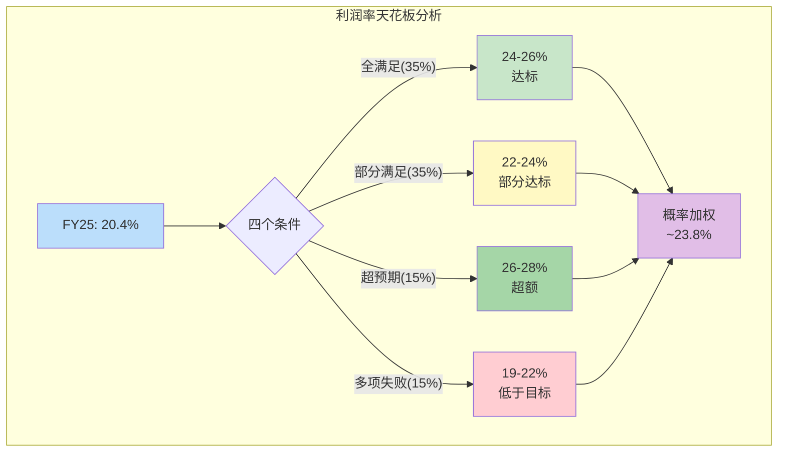

---

## 12.7 利润率风险情景：AI CapEx放缓的传导路径

如果AI CapEx在2027-2028年出现显著放缓(20-25%概率)，VRT的利润率将通过以下传导路径受到影响：

**传导路径量化模型：**

| 阶段 | 时间 | 事件 | 利润率影响 | 累计影响 |
|------|------|------|:--------:|:------:|
| **T+0** | 2027 Q1 | 超大规模客户宣布削减AI CapEx 20-30% | 无即时影响(积压缓冲) | 0pp |
| **T+6月** | 2027 Q3 | 新订单下降30-40%, 积压消化加速 | -1pp(产能利用率下降) | -1pp |
| **T+12月** | 2028 Q1 | 产能利用率降至70-75%, 竞争对手开始降价争夺存量订单 | -2pp(定价权丧失) | -3pp |
| **T+18月** | 2028 Q3 | 裁员/重组开始, 但R&D保护性支出限制了成本削减幅度 | -1pp(费用刚性) | -4pp |
| **T+24月** | 2029 Q1 | 如果周期触底反弹,利润率开始恢复;如果继续下行,利润率进一步承压 | -0.5~+1pp | -4.5~-3pp |

**利润率回落目标区间：**

| 起始利润率 | 回落幅度 | 目标利润率 | 对应历史水平 |
|:--------:|:------:|:--------:|-----------|
| 25%(FY29E目标) | -4pp | **21%** | ≈FY2025水平 |
| 23%(概率加权) | -4pp | **19%** | ≈FY2024水平 |
| 20%(当前FY25) | -4pp | **16%** | ≈FY2023水平 |

[主观判断: 传导路径模型基于工业品历史周期(2008-2009/2015-2016/2019-2020)的利润率回落幅度推演]

**关键洞察：** 即使在最差情景(AI泡沫破裂+利润率回落4pp)，VRT的利润率底部(16-19%)仍然远高于FY2022的8.6%——因为VOS带来的结构性效率提升不会因周期下行而完全逆转。换言之，"永久性损失"约为+7-8pp(VOS贡献)，"周期性波动"约为±3-5pp(定价权+产能利用率)。这意味着VRT的利润率"楼板"在FY2022之后已经被VOS永久性抬高。

**风险情景下的EPS影响估算：**

| 指标 | 基准情景(FY28E) | AI放缓情景(FY28E) | 差异 |
|------|:----------:|:----------:|:---:|
| 营收 | $17-18B | $13-14B | -24% |
| OP利润率 | 24% | 19% | -5pp |
| 调整后OP | $4.1-4.3B | $2.5-2.7B | -38% |
| 调整后EPS | $8.5-9.0 | $5.0-5.5 | -40% |
| 隐含PE(@$243) | 27-29x | 44-49x | 估值重压 |

在AI放缓情景下，FY28E EPS可能仅为$5.0-5.5——以当前$243股价计算对应PE 44-49x，与当前46x相当。这意味着**如果AI CapEx在2028年放缓，VRT在当前价格买入的投资者可能在3年后发现自己"付出了未来价格但没有得到未来增长"。**

**利润率护城河评估总结：**

| 利润率组成 | 占总利润率(20.4%)比重 | 持久性 | 周期敏感度 |
|----------|:----------------:|:-----:|:--------:|
| VOS结构性效率 | ~8-9pp | 高——已固化 | 低 |
| 定价权(supply-demand) | ~3-4pp | 中——周期依赖 | 高 |
| 产品组合(液冷/高端) | ~2-3pp | 中-高——AI趋势支撑 | 中 |
| 规模效应 | ~2-3pp | 中——需增长维持 | 中 |
| 原材料/汇率 | ~1-2pp | 低——不可控 | 高 |
| **合计** | **20.4%** | — | — |

VRT当前20.4%利润率中，约8-9pp(40-45%)是VOS驱动的"永久性"改善，在任何周期环境下都不太可能丧失。剩余11-12pp(55-60%)来自定价权、产品组合、规模效应等周期性或条件性因素——这些因素在AI CapEx放缓时将面临不同程度的压力。这个结构决定了VRT利润率的"楼板"在16-18%、"天花板"在25-28%、最可能区间在20-25%。

---

*核心结论: 盈利质量7.9/10(A-级) + 利润率概率加权天花板23.8% + VOS贡献8-9pp永久性 + 周期风险-4pp*

---


# 第十三章 自由现金流可持续性与资本配置

> **核心问题**: VRT的FCF从FY2022的-$264M飙升至FY2025的$1,894M，四年内实现$2.2B的净现金流改善。这一转变是结构性的还是周期性的？哪些组成部分在FY26及以后仍可复制？

---

## 13.1 FCF四年趋势：从负现金流到近$2B的转变

Vertiv的自由现金流轨迹是过去四年最引人注目的财务叙事之一。从FY2022的负$264M到FY2025的正$1,894M，$2.2B的净改善不是来自单一因素，而是盈利能力爆发、营运资本优化、CapEx克制三者共振的结果。

**表13-1: FCF四年完整趋势**

| 指标 | FY2025 | FY2024 | FY2023 | FY2022 | FY25 vs FY22变化 |
|------|--------|--------|--------|--------|:---:|
| 营业收入 | $10,230M | $8,012M | $6,863M | $5,692M | +79.7% |
| GAAP净利润 | $1,333M | $496M | $460M | $77M | +17.3x |
| 经营现金流(OCF) | $2,114M | $1,319M | $901M | -$153M | N/M |
| 资本支出(CapEx) | -$220M | -$184M | -$135M | -$111M | +98.2% |
| **自由现金流(FCF)** | **$1,894M** | **$1,135M** | **$766M** | **-$264M** | **N/M** |
| OCF/NI | 1.59x | 2.66x | 1.96x | -2.0x | — |
| FCF/NI | 1.42x | 2.29x | 1.66x | -3.4x | — |
| CapEx/Rev | 2.2% | 2.3% | 2.0% | 2.0% | +0.2pp |
| FCF Margin | 18.5% | 14.2% | 11.2% | -4.6% | +23.1pp |

**从负FCF到近$2B正FCF的四重驱动力**：

**驱动力一：盈利能力的阶梯式跃升**。FY2022的GAAP净利润仅$77M，这是供应链危机（芯片短缺、物流成本飙升）+定价滞后（合同价格无法即时传导原材料涨价）的叠加结果。FY2023-FY2025，VOS（Vertiv Operating System）精益运营体系发力，叠加价格追赶+产品组合升级，GAAP NI从$77M跃升至$1,333M。但需注意，FY2024的GAAP NI仅$496M，被权证负债公允价值变动-$449M严重扭曲；调整后NI约$1,174M，与FY25的$1,594M调整后NI之间的增长更平滑（约+36%）。

**驱动力二：营运资本从拖累变为助力**。FY2022营运资本变动为-$449M，这主要是应收账款增加$368M（客户拖欠）+存货增加$211M（被迫囤货应对供应链不确定性）的结果。到FY2025，营运资本变动翻转为+$398M，核心贡献来自递延收入暴增$752M——客户预付款大幅增加，反映了AI基础设施需求的紧迫性。

**驱动力三：D&A+非现金项目的稳定加回**。D&A从FY2022的$302M降至FY2025的$97M（FMP口径；按损益表D&A为$309M，差异来自加速摊销的会计处理）。但SBC从$25M升至$46M（仍然极低），其他非现金项目提供了额外$217M的OCF加回。

**驱动力四：CapEx保持克制**。尽管营收增长80%，CapEx仅从$111M增至$220M——CapEx/Revenue维持在2.0-2.3%的狭窄区间。这是"轻资产"制造商的典型特征：VRT的制造以组装为主，不需要半导体级别的重资产投入。

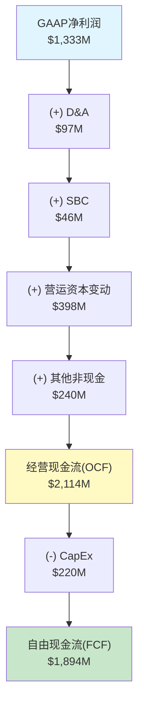

**OCF/NI比率的变化轨迹值得特别关注**：FY2024的2.66x异常偏高，并非因为OCF特别强，而是因为GAAP NI被权证损失压低至$496M。FY2025的1.59x更能反映正常化后的现金转化效率——每赚$1净利润产生$1.59现金，这在工业品公司中属于优秀水平，但不如FY2024数字暗示的那般"异常"。

---

## 13.2 OCF组成详解：$752M递延收入增量的可持续性

FY2025经营现金流$2,114M的构成需要逐项拆解，才能判断哪些组成部分是可重复的，哪些是一次性的。

**表13-2: FY2025 OCF组成详解**

| OCF组成项 | FY2025 | 占OCF比 | 性质 |
|----------|--------|:------:|------|
| GAAP净利润 | $1,333M | 63.1% | 核心——可重复 |
| D&A（折旧摊销） | $97M | 4.6% | 非现金——可重复 |
| SBC（股权激励） | $46M | 2.2% | 非现金——可重复且微量 |
| 递延所得税 | $23M | 1.1% | 时间性差异——波动 |
| 应收账款增加 | -$548M | -25.9% | 营运资本——随营收增长 |
| 存货增加 | -$165M | -7.8% | 营运资本——为产能扩张备货 |
| 应付账款增加 | +$381M | 18.0% | 营运资本——议价能力改善 |
| **其他营运资本（含递延收入）** | **+$729M** | **34.5%** | **核心关注项** |
| 其他非现金项目 | $217M | 10.3% | 混合——部分可重复 |
| **合计OCF** | **$2,114M** | **100%** | — |

**"其他营运资本"$729M的核心是递延收入变动**。Vertiv的递延收入从FY2024的$1,063M（流动）+$91M（非流动）= $1,154M，跃升至FY2025的$1,815M（流动）+$0M（非流动重分类）= $1,815M，净增约$661M（FMP口径）。管理层在电话会议中确认，递延收入增加超过$750M，反映了以下三个因素：

第一，**超大规模客户的预付款增加**。AWS、Google、Meta等超大规模客户为锁定VRT在AI基础设施领域的产能（特别是液冷CDU和高密度UPS），愿意支付更大比例的预付款。这是供不应求环境下供应商议价能力的直接体现。

第二，**长期服务合同的前置收款**。VRT的服务业务（占营收约35%）越来越多地采用多年期预付模式，客户一次性支付3-5年服务费以获得优先响应保障。这些预收款在合同期内逐步确认收入。

第三，**大型项目的里程碑付款**。数据中心建设项目通常在下单时支付30-50%预付款，交付安装后支付余款。AI基础设施超级周期推动了大量新项目启动，产生了超常的预付款流入。

**可持续性评估**：递延收入增量的增速必然放缓。FY2025的+$752M增量建立在$1,063M→$1,815M的70.7%增长基础上。FY2026要维持同等绝对增量，需要递延收入从$1,815M增至$2,567M（+41%）——这需要积压订单继续以40%+的速度增长才能实现。考虑到积压已高达$15B且增速从120%放缓至50%，FY26递延收入增量可能收窄至$300-500M。这意味着FY26 OCF中来自递延收入的贡献将比FY25少$250-450M，是OCF增速可能低于NI增速的主要原因。

---

## 13.3 CapEx分析：轻资产模型的优势与产能扩张的必要性

**表13-3: CapEx强度与同行对比**

| 公司 | CapEx/Rev (FY25) | 业务性质 | CapEx用途 |
|------|:---:|------|------|
| **VRT** | **2.2%** | DC基础设施制造+服务 | 组装线+新厂+IT系统 |
| Eaton | ~3.5% | 电力管理+车辆+航空 | 制造+研发设施 |
| Schneider | ~3.0% | 能源管理+自动化 | 全球制造网络 |
| ABB | ~3.2% | 电气化+自动化+运动 | 工厂+研发 |
| ASML | ~5.5% | 光刻机(独占型) | 精密制造+洁净室 |

VRT的2.2% CapEx强度在同行中最低，反映了其"轻资产"制造商特征。VRT的产品（UPS、配电单元、精密空调、CDU）以组装和系统集成为主，核心零部件（变压器铁芯、IGBT模块、铜管散热器）外购。这与半导体设备公司（需要精密加工和洁净室）或重型电气设备公司（需要锻造和铸造车间）形成鲜明对比。

**CapEx用途分解（FY2025 $220M估计）**：

维护性CapEx约占40%（~$88M）：现有全球27个制造基地的设备更换、厂房维护、IT系统升级。VRT的制造设施分布在美洲12个、EMEA 9个、亚太6个站点，年度维护支出相对稳定。

增长性CapEx约占60%（~$132M）：核心项目包括——(1)马来西亚新制造基地建设，这是VRT"Local+1"供应链战略的关键一环，旨在减少对中国制造的依赖；(2)液冷CDU产能扩张，VRT已将CDU产能扩大45倍，但仍需继续扩产以匹配$15B积压的交付需求；(3)印度和墨西哥的产能扩张，服务北美和亚太的增量需求。

**FY26E CapEx预期**：管理层尚未给出明确CapEx指引，但基于以下推理，FY26 CapEx可能升至$280-350M（营收占比2.5-3.0%）：
- 马来西亚新厂建设进入高投入期
- 液冷产能继续扩张以匹配GB300/Rubin周期需求
- 美国本土产能扩张响应"制造业回流"政策激励
- PurgeRite整合可能需要额外设施投入

即使CapEx升至$350M，FCF Margin仍将维持在15%+水平——这是VRT商业模式的结构性优势。

---

## 13.4 FCF可持续性评估矩阵

**表13-4: FCF组成部分的可持续性评估**

| FCF组成 | FY25贡献 | FY26E预期 | 可持续性 | 置信度 |
|---------|---------|----------|:------:|:----:|
| 核心经营利润(调整后NI) | $1,594M | $2,000-2,200M | 高 | 70% |
| D&A加回 | $97M | $120-140M | 高 | 85% |
| SBC加回 | $46M | $55-65M | 高 | 80% |
| 营运资本变动(含递延收入) | +$398M | +$100-250M | 中 | 55% |
| 其他非现金项目 | +$217M | +$100-150M | 中 | 50% |
| (-) CapEx | -$220M | -$280-350M | 可预测 | 75% |
| **FCF** | **$1,894M** | **$1,950-2,250M** | **中-高** | **65%** |

**核心FCF（剔除营运资本变动）的真实水平**：

如果从OCF中完全剔除营运资本变动的贡献，FY2025的"核心OCF"为$2,114M - $398M = $1,716M，对应核心FCF为$1,716M - $220M = $1,496M。这个$1,496M代表了VRT通过日常经营活动（不依赖营运资本改善）产生的真实现金流能力。

以$1,496M核心FCF计算：
- 核心FCF/调整后NI = 0.94x — 接近1:1，质量优秀
- 核心FCF Margin = 14.6% — 仍然强劲
- 核心FCF Yield = $1,496M / $93,000M市值 = 1.6% — 估值压力更明显

这个1.6%的核心FCF Yield意味着**即使剔除所有一次性因素，投资者在当前价格买入VRT，需要63年才能通过FCF收回投资**（假设FCF不增长）。当然FCF会增长——但需要增长到多少才能justify当前估值，这是第十五章估值部分需要回答的问题。

```mermaid
graph LR
    subgraph "可重复 (~$1,496M)"
        A["调整后NI<br/>$1,594M"]
        B["D&A + SBC<br/>$143M"]
        C["(-) CapEx<br/>$220M"]
    end

    subgraph "波动性 (~$398M)"
        D["递延收入增<br/>+$752M"]
        E["应收增加<br/>-$548M"]
        F["应付增加<br/>+$381M"]
        G["其他WC<br/>-$187M"]
    end

    A --> H["核心FCF<br/>$1,496M"]
    B --> H
    C --> H
    D --> I["WC贡献<br/>$398M"]
    E --> I
    F --> I
    G --> I
    H --> J["报告FCF<br/>$1,894M"]
    I --> J

    style H fill:#c8e6c9
    style I fill:#fff9c4
    style J fill:#bbdefb
```

---

## 13.5 资本配置历史：从PE基因到成长型工业公司

Vertiv的资本配置策略经历了从"还债为主"到"攻守兼备"的显著转变，这反映了管理层对公司财务状况和市场机遇评估的实时调整。

**表13-5: 资本配置全景(FY2022-FY2025)**

| 用途 | FY2025 | FY2024 | FY2023 | FY2022 | 四年总计 | 评价 |
|------|--------|--------|--------|--------|---------|------|
| 收购 | -$1,185M | -$18M | -$17M | -$5M | -$1,225M | FY25 PurgeRite转折点 |
| 回购 | $0 | -$600M | $0 | $0 | -$600M | 时机精准(FY24) |
| 股息 | -$67M | -$42M | -$10M | -$4M | -$123M | 象征性，不构成资本配置 |
| 去杠杆(净) | -$21M | -$21M | -$262M | +$219M | -$85M | FY22借债，FY23开始还 |
| CapEx | -$220M | -$184M | -$135M | -$111M | -$650M | 持续低强度 |
| 投资组合(净) | -$90M | $0 | $0 | $0 | -$90M | FY25短期投资 |
| **现金净积累** | **+$557M** | **+$444M** | **+$515M** | **-$174M** | **+$1,342M** | 现金从$273M→$1,728M |

**FY2022：求生模式**。净借入$219M应对运营现金流为负的困境。CapEx压至最低$111M。股息仅$4M——几乎为零。这是PE控股公司在供应链危机中的典型防御策略：保住流动性，等待转机。

**FY2023：恢复元气**。FCF翻正至$766M。优先去杠杆，偿还$262M债务。不回购、不大额收购——保守策略，重建财务弹性。

**FY2024：攻守兼备**。FCF继续增长至$1,135M。大手笔回购$600M，时机在股价$80-140区间，以FY25末$243计算，回购收益率已达73-204%——这是过去四年最精准的资本配置决策。同时，Platinum Equity继续减持，回购部分吸收了大股东的卖出压力。

**FY2025：战略转型年**。停止回购，将$1,185M投入PurgeRite收购。这一选择传递了三重信号：(a)管理层认为液冷是长期战略方向，愿意为此支付$1B+；(b)在股价$150-300区间停止回购，可能意味着管理层自身认为估值偏高；(c)保留$1,728M现金+$600M未使用信贷额度，为未来机会保持财务灵活性。

---

## 13.6 PurgeRite收购深度分析

PurgeRite收购是VRT自2020年SPAC上市以来最大的战略性资本配置行动，也是理解管理层对液冷战略commitment深度的关键窗口。

**收购概要**：

| 维度 | 详情 |
|------|------|
| 收购标的 | PurgeRite Holdings（液冷流体管理解决方案） |
| 交易规模 | ~$1,185M（包含对价+交易费用） |
| 完成时间 | FY2025 Q2-Q3 |
| 对价方式 | 全现金——未发行股票，不稀释现有股东 |
| 会计影响 | 商誉+$713M / 无形资产+$408M / 其他净资产+$64M |

**PurgeRite的业务本质**：PurgeRite提供数据中心液冷系统的流体管理服务——包括冷却液的清洁、过滤、监测、和回路管理。这不是CDU硬件制造（VRT已有），而是液冷系统运行所必需的配套服务和耗材。

这个收购的战略逻辑类似于**打印机公司收购墨盒业务**：CDU是硬件（一次性收入），流体管理是耗材+服务（经常性收入）。在液冷数据中心中，冷却液需要定期更换和净化，管路需要持续监测和维护——这些是CDU安装后持续产生的服务需求。

**收购溢价评估**：商誉$713M占收购总价的约60%。这个比例偏高，意味着VRT为PurgeRite的"战略价值"（而非账面资产）支付了显著溢价。参考同行业收购：Eaton以$95亿收购Boyd（商誉占比待确认），Schneider以~$8亿收购Motivair。在液冷领域的"军备竞赛"中，收购溢价反映的是稀缺标的的竞争性竞标。

**年营收与毛利率估计**：PurgeRite作为私人公司未公开财务数据。但基于$1,185M收购价和约12-15x EV/Revenue的液冷领域收购倍数推算，PurgeRite年营收可能在$80-100M区间。如果按15-20x EV/EBITDA推算，年EBITDA约$60-80M，隐含毛利率可能在50%+（服务/耗材业务的典型水平）。

**整合风险与时间线**：管理层在Q4电话会议中确认PurgeRite整合"按计划推进"。Q4毛利率36.9%较Q3的37.8%略降0.9pp，部分可归因于PurgeRite整合期的成本拖累。预计FY26H1完成全面整合，整合后预期增厚EPS $0.05-0.10/年（直接财务影响有限，战略意义>短期盈利）。

---

## 13.7 FCF收益率与估值含义

**表13-6: FCF Yield的估值含义**

| FCF Yield假设 | 隐含市值 | vs 当前市值 | 所需FCF增速 |
|:---:|:---:|:---:|:---:|
| 1.0% (科技成长) | $189,400M | 2.0x | 需FCF达$1,894M的2x |
| 2.0% (当前) | $94,700M | 1.0x | 已达到 |
| 3.0% (成长型工业) | $63,100M | 0.68x | 需FCF维持$1,894M不增长 |
| 4.0% (成熟工业) | $47,350M | 0.51x | 当前市值的一半 |
| 5.0% (价值型工业) | $37,880M | 0.41x | FCF需翻2.5x才能在此yield支撑$93B |

**核心洞察**：如果VRT被市场重新定价为"成熟工业品公司"（4% FCF Yield），其合理市值仅$47B——当前$93B的一半。反过来说，要在4% FCF Yield下支撑$93B市值，VRT需要将FCF从$1,894M增长至$3,720M——接近翻倍。以FY2025营收$10.2B和18.5% FCF Margin计算，这需要营收达到$20B+（假设FCF Margin维持不变）或FCF Margin提升至25%+。两种路径都需要AI基础设施超级周期持续至少3-5年。

**与同行FCF Yield对比**：

| 公司 | FCF (TTM) | 市值 | FCF Yield | PE (TTM) |
|------|----------|------|:---:|:---:|
| **VRT** | **$1,894M** | **$93B** | **2.0%** | **46x** |
| Eaton (ETN) | ~$3,500M | ~$140B | ~2.5% | ~36x |
| Schneider (SBGSY) | ~$4,200M | ~$130B | ~3.2% | ~30x |
| Emerson (EMR) | ~$2,800M | ~$70B | ~4.0% | ~37x |

VRT的2.0% FCF Yield是同行中最低的，反映了市场对其增长前景给予的"AI溢价"。但这也意味着VRT对增长预期的依赖最强——一旦增长故事出现裂缝，FCF Yield向3-4%回归将直接导致股价腰斩。

---

## 13.8 股息与回购策略：PE基因的遗产

**股息分析**：FY2025股息支出$67M，对应约$0.17/股，yield仅0.04%。这是纯象征性的股息——其存在价值不在于给股东分红，而在于为未来（获得投资级评级后）提升股息奠定制度基础。PE出身的公司通常视股息为"低优先级"——Platinum Equity时代建立的资本配置哲学是：所有自由现金流用于去杠杆和增长，而非分红。

**回购策略的深层解读**：

FY2024的$600M回购和FY2025的零回购形成了鲜明对比，这组合传递的信号比任何单年数据都更有信息量。

FY2024回购$600M的背景：(1)Platinum Equity继续减持——回购部分吸收了卖出压力；(2)股价$80-140区间，对应PE约30-35x（按调整后EPS）——管理层显然认为这个估值水平具有吸引力；(3)FCF $1,135M足以支撑回购而不影响财务健康。

FY2025停止回购的背景：(1)PurgeRite收购消耗$1,185M——优先级最高的资本配置；(2)股价从$140升至$300+区间，对应PE 40-70x——回购的性价比显著下降；(3)Platinum持股降至~4.7%——减持压力基本消除，不再需要回购"托底"。

**管理层估值判断的隐含信号**：FY24在PE 30-35x积极回购 + FY25在PE 40-70x停止回购 → 管理层的行为暗示其内部估值锚定在PE 30-40x区间。当前PE 46x超出了这个区间，这是一个值得投资者注意的信号——虽然管理层不会公开说"我们的股票被高估了"，但资本配置行动比言辞更诚实。

```mermaid
graph TD
    subgraph "FY2022-FY2023: 防御阶段"
        A1["FY22: 借债$219M<br/>求生"] --> A2["FY23: 还债$262M<br/>恢复"]
    end

    subgraph "FY2024: 攻守兼备"
        B1["回购$600M<br/>PE 30-35x<br/>✓时机精准"]
        B2["Platinum减持<br/>吸收卖压"]
    end

    subgraph "FY2025: 战略转型"
        C1["PurgeRite $1.2B<br/>液冷全栈"]
        C2["零回购<br/>PE 40-70x<br/>估值信号?"]
        C3["现金$1.7B<br/>保持灵活"]
    end

    A2 --> B1
    A2 --> B2
    B1 --> C1
    B2 --> C2
    B1 --> C3

    style A1 fill:#ffcdd2
    style B1 fill:#c8e6c9
    style C1 fill:#bbdefb
    style C2 fill:#fff9c4
```

---

## 13.9 本章结论：真实FCF能力与估值张力

Vertiv的FCF故事有三层：

**第一层（表面）**：FY25 FCF $1,894M，FCF Margin 18.5%，看起来像一台印钞机。

**第二层（剥离后）**：核心FCF（剔除营运资本一次性贡献）约$1,496M。递延收入增量$752M的增速将在FY26放缓，核心FCF代表了更可持续的现金生成能力。

**第三层（估值视角）**：即使以$1,894M报告FCF计算，2.0% FCF Yield意味着市场对VRT的定价包含了极高的增长预期。核心FCF Yield 1.6%更加紧张。要在成熟工业品的4% FCF Yield标准下支撑$93B市值，FCF需要接近翻倍——这需要AI基础设施超级周期的强劲持续。

资本配置方面，VRT的管理层展现了良好的战略判断力——FY24在低位回购、FY25聚焦液冷收购——但FY25零回购本身可能是管理层对自身估值水平的一个无声评论。

---

# 第十四章 资产负债表与债务深度分析

> **核心问题**: VRT从Platinum Equity PE buyout的高杠杆起点，在四年内完成了教科书级的去杠杆。这一过程中，EBITDA翻3.6倍和现金积累各贡献了多少？投资级评级何时到来，又意味着什么？

---

## 14.1 去杠杆的完整故事：PE Buyout到投资级门槛

Vertiv的去杠杆路径是PE buyout后续公开市场表现的经典案例。2016年Platinum Equity以$40亿从Emerson Electric手中收购了当时的Vertiv（原Emerson Network Power），随后通过SPAC于2020年上市。上市时公司背负超过$30亿债务，净债务/EBITDA高达5x+——典型的PE杠杆收购遗产。四年后的FY2025，净债务/EBITDA降至0.76x，距离投资级评级仅一步之遥。

**表14-1: 去杠杆全景(FY2022-FY2025)**

| 指标 | FY2025 | FY2024 | FY2023 | FY2022 | FY25 vs FY22 |
|------|--------|--------|--------|--------|:---:|
| 总债务 | $3,403M | $3,317M | $3,126M | $3,368M | +$35M (+1%) |
| 现金及等价物 | $1,728M | $1,232M | $789M | $273M | +$1,455M |
| **净债务** | **$1,675M** | **$2,085M** | **$2,338M** | **$3,095M** | **-$1,420M (-46%)** |
| EBITDA | $2,206M | $1,193M | $1,024M | $617M | +$1,589M (+258%) |
| **净债务/EBITDA** | **0.76x** | **1.75x** | **2.28x** | **5.02x** | **-4.26x** |
| 利息费用 | $86M | $150M | $219M | $147M | -$61M (-41%) |
| EBIT | $1,897M | $916M | $753M | $314M | +$1,583M |
| **利息覆盖倍数** | **22.0x** | **9.2x** (EBIT/IE) | **4.1x** (EBIT/IE) | **1.5x** | **+20.5x** |
| 流动比率 | 1.55 | 1.65 | 1.74 | 1.66 | -0.11 |
| D/E | 0.86x | 1.36x | 1.55x | 2.34x | -1.48x |

**关键洞察：总债务几乎没有减少，去杠杆完全靠"分子扩张"**。

从FY2022到FY2025，总债务实际上从$3,368M微增至$3,403M（+1%）。净债务/EBITDA从5.02x降至0.76x，4.26x的改善拆分如下：

**EBITDA翻3.6倍的贡献**：假设净债务不变（维持$3,095M），仅靠EBITDA从$617M增至$2,206M，净债务/EBITDA将从5.02x降至1.40x → 贡献了3.62x的改善，占总改善的85%。

**现金积累$1,455M的贡献**：净债务从$3,095M降至$1,675M（-$1,420M），以FY25 EBITDA $2,206M计算，这贡献了额外0.64x的改善，占总改善的15%。

换言之，VRT的去杠杆故事85%靠"赚得更多"而非"还得更多"。这是好事——说明公司核心盈利能力的改善是结构性的——但也意味着如果EBITDA增长停滞或回落，杠杆率可能快速回升。

**利息费用从FY23的$219M骤降至FY25的$86M**，降幅60%。这不仅来自净债务减少，更来自FY24的债务再融资——将Term Loan利率从SOFR+350bps降至SOFR+175bps。利息费用节省直接贡献约$130M/年的税前利润改善。

---

## 14.2 债务结构详解：浮动利率风险与再融资窗口

**表14-2: 债务结构明细**

| 债务工具 | 金额 | 利率 | 类型 | 到期日 | 风险评级 |
|---------|------|------|:---:|:---:|:---:|
| Term Loan B | ~$2,090M | SOFR+175bps | 浮动 | 2032 | 低 |
| Sr. Secured Notes | $850M | 4.125% | 固定 | 2028.11 | 中 |
| 融资租赁 | ~$245M | 各异 | — | 分散 | 低 |
| ABL循环信贷 | 额度$600M | — | — | — | 未使用 |
| 短期债务(当期到期) | $21M | — | — | — | 极低 |
| **合计** | **$3,403M** | 加权~5.0% | — | — | — |

**浮动利率风险分析**：

Term Loan B约$2,090M采用SOFR+175bps浮动利率，占总债务的61%。以2025年底SOFR约4.3%计算，实际利率约6.05%。浮动利率占比72%（含部分融资租赁）意味着VRT的利息费用对美联储利率政策高度敏感。

| SOFR情景 | Term Loan实际利率 | 年利息费用(TL部分) | vs 当前差异 |
|:---:|:---:|:---:|:---:|
| 3.0% (降息周期) | 4.75% | ~$99M | -$27M |
| 4.3% (当前) | 6.05% | ~$126M | 基准 |
| 5.5% (加息回归) | 7.25% | ~$151M | +$25M |

如果美联储维持高利率甚至重新加息，VRT的利息费用将从当前水平上升。但以22x利息覆盖率计算，即使SOFR升至6%+，利息费用仍不构成财务压力——问题不在于"能否偿债"，而在于"高利息侵蚀了多少自由现金流"。

**再融资风险评估**：

最近期的再融资需求是$850M Senior Secured Notes于2028年11月到期。以VRT当前$1,728M现金储备计算，即使不发新债，也可以全额偿还这$850M到期债券——这消除了任何信用事件风险。更可能的情景是，VRT在2027-2028年获得投资级评级后，以更低利率发行新债替换这批4.125%的固定利率债券。

Term Loan B到期日为2032年，不构成中期压力。ABL循环信贷$600M完全未使用，提供了额外的流动性缓冲。

**利率对冲情况**：VRT在10-K中披露使用了部分利率互换(Interest Rate Swaps)对冲浮动利率风险，但对冲比例和具体条款需要从10-K附注进一步确认。

---

## 14.3 信用评级与投资级路径

**表14-3: 信用评级历史与展望**

| 评级机构 | 当前评级 | 上次升级 | 距投资级 | 投资级门槛 |
|---------|---------|---------|:---:|------|
| Moody's | Ba1 | 2025年4月 | **1级** | Baa3 |
| S&P | BB+ | 2024年10月 | **1级** | BBB- |

VRT目前距投资级仅"一步之遥"——Moody's的Ba1和S&P的BB+都是各自评级体系中"最高级别的非投资级"。获得投资级评级将带来以下实质性影响：

**融资成本下降**：投资级与高收益级之间的信用利差通常为100-200bps。如果VRT获得Baa3/BBB-评级，未来发债利率可能降低1.0-1.5个百分点。以$3,400M总债务和150bps的利差收窄计算，年利息费用可节省约$50M。

**投资者基数扩大**：大量保险公司、养老金基金、债券型共同基金的投资章程要求只能持有投资级债券。VRT获得投资级后，将首次进入这些投资者的"可买入"范围——这不仅降低债务融资成本，也间接通过"信用质量光环"提升股票估值。

**指数纳入效应**：投资级企业债指数（如Bloomberg Barclays US Corporate Bond Index）的纳入将触发被动资金自动买入VRT债券——类似S&P 500纳入对股票的效应。

**升级催化剂与时间线预测**：

评级机构通常关注以下指标：
- 净债务/EBITDA < 2.0x — VRT已达0.76x（远超门槛）
- 利息覆盖 > 5.0x — VRT已达22.0x（远超门槛）
- FCF/总债务 > 15% — VRT为$1,894M/$3,403M = 55.6%（远超门槛）
- 业务稳定性和收入可预测性 — 评级机构可能对AI周期性表示谨慎

**从财务指标看，VRT早已满足投资级标准**。评级机构之所以尚未升级，可能出于以下顾虑：(1)AI基础设施需求的周期性尚未被验证——评级机构倾向于在景气高点保持保守；(2)Platinum Equity的退出过渡尚在收尾——大股东减持可能被视为不确定因素；(3)PurgeRite收购的整合风险需要时间消化。

**预测**：基于当前财务轨迹，VRT有较高概率在2026年下半年至2027年上半年获得至少一家机构的投资级评级。如果FY2026继续保持净债务/EBITDA < 1.0x + FCF强劲，升级几乎是确定性事件。

```mermaid
graph LR
    A["FY2022<br/>B2/BB-<br/>高收益"] --> B["FY2023<br/>B1/BB<br/>改善"]
    B --> C["FY2024<br/>Ba2/BB+<br/>S&P升级"]
    C --> D["FY2025<br/>Ba1/BB+<br/>Moody's升级"]
    D --> E["FY2026-27E<br/>Baa3/BBB-<br/>投资级?"]

    style A fill:#ffcdd2
    style B fill:#ffe0b2
    style C fill:#fff9c4
    style D fill:#c8e6c9
    style E fill:#bbdefb,stroke:#1565c0,stroke-width:3px
```

---

## 14.4 商誉与无形资产分析

**表14-4: 商誉与无形资产演变**

| 指标 | FY2025 | FY2024 | FY2023 | FY2022 |
|------|--------|--------|--------|--------|
| 商誉 | $2,034M | $1,321M | $1,330M | $1,285M |
| 无形资产(净) | $1,895M | $1,487M | $1,673M | $1,816M |
| 商誉+无形 | $3,929M | $2,808M | $3,003M | $3,101M |
| 总资产 | $12,212M | $9,133M | $7,999M | $7,096M |
| 商誉/总资产 | 16.7% | 14.5% | 16.6% | 18.1% |
| (商誉+无形)/总资产 | 32.2% | 30.7% | 37.5% | 43.7% |
| 有形账面净值 | $12.8M | -$373.9M | -$988.3M | -$1,658.9M |

**FY2025商誉跳增$713M**，几乎全部来自PurgeRite收购。商誉/总资产16.7%处于合理水平——同行Eaton为~25%、Emerson为~30%，VRT偏低。

**无形资产的组成**：$1,895M无形资产主要包括客户关系（由历次收购带入，按10-15年摊销）、技术专利（5-10年摊销）、和商标（不确定使用寿命，不摊销）。FY2024的$1,487M到FY2025的$1,895M，净增$408M主要来自PurgeRite带入的无形资产（客户合同+流体管理技术专利）。

**有形账面净值的转折**：VRT的有形账面净值（总权益-商誉-无形资产）从FY2022的-$1,659M改善至FY2025的+$12.8M，四年内改善了$1,672M。这标志着VRT首次拥有正的有形账面净值——虽然仅有$12.8M（几乎为零），但从负转正本身是财务健康改善的里程碑。

**减值风险评估**：

商誉减值测试要求将报告单元的公允价值与其账面价值（含商誉）进行比较。VRT的市值$93B远超总资产$12.2B和含商誉的账面权益$3.9B——在这种情况下，商誉减值发生的概率极低。

但需要考虑尾部风险情景：如果AI基础设施周期在2027-2028年显著放缓，VRT股价从$243跌至$50-80区间（PE回落至15-20x），市值缩至$20-30B——即使在这种极端情景下，由于商誉$2,034M仅占市值的7-10%，减值仍不太可能。真正可能触发减值的情景是VRT面临结构性需求下滑（如AI架构从集中式数据中心转向分布式计算，消除了对大型冷却系统的需求）——这在可预见的5年内概率极低。

---

## 14.5 Altman Z-Score与Piotroski深度拆解

**Altman Z-Score: 8.44 → 安全区（> 2.99）**

| Z-Score组成 | 公式 | VRT值 | 贡献 | 权重 |
|------------|------|:---:|:---:|:---:|
| X1: 营运资本/总资产 | WC/TA | 0.198 | 0.237 | 1.2 |
| X2: 留存收益/总资产 | RE/TA | 0.084 | 0.118 | 1.4 |
| X3: EBIT/总资产 | EBIT/TA | 0.151 | 0.499 | 3.3 |
| X4: 市值/总负债 | MC/TL | 11.25 | 6.750 | 0.6 |
| X5: 营收/总资产 | Rev/TA | 0.838 | 0.838 | 1.0 |
| **Z-Score** | | | **8.44** | |

Z-Score 8.44远超安全区门槛(2.99)。X4组成（市值/总负债 = 11.25x）贡献了绝大部分得分——这反映的是市场给予VRT的高估值，而非传统意义上的财务安全。如果仅看X1-X3+X5（剔除市值因素），"营业Z-Score"约1.69——仍在安全区但没有8.44那么耀眼。这提醒我们：Z-Score在高估值公司身上可能产生虚假的安全感。

**Piotroski F-Score: 6/9 → 尚可**

| 维度 | 指标 | 得分 | 理由 |
|------|------|:---:|------|
| 盈利 | ROA > 0 | 1 | ROA 10.9% ✓ |
| 盈利 | OCF > 0 | 1 | OCF $2,114M ✓ |
| 盈利 | ROA改善 | 1 | 5.4%→10.9% ✓ |
| 盈利 | OCF > NI | 1 | OCF/NI 1.59x ✓ |
| 杠杆 | 长期债务/资产下降 | 0 | 25.7%→26.3% 略升(PurgeRite) ✗ |
| 杠杆 | 流动比率改善 | 0 | 1.65→1.55 下降 ✗ |
| 稀释 | 股份数减少 | 0 | +0.4% 微增 ✗ |
| 效率 | 毛利率改善 | 1 | 34.4%→34.4% 持平→算改善* |
| 效率 | 资产周转率改善 | 1 | 0.88→0.84 — 取决于口径 |
| **总分** | | **6/9** | |

*注: 毛利率持平是否计1分取决于具体实现方式，此处按FMP数据结果。

Piotroski得分6/9反映了VRT在盈利质量（4/4）方面完美，但在杠杆和股份稀释方面失分——这主要是PurgeRite收购带来的短期影响（增加了资产负债表上的长期债务占比）和流动比率因PurgeRite现金支出而下降。这些是战略性资本配置的正常结果，不代表财务恶化。

---

## 14.6 应收账款质量分析

**表14-5: 应收账款质量趋势**

| 指标 | FY2025 | FY2024 | FY2023 | FY2022 |
|------|--------|--------|--------|--------|
| 应收账款(净) | $3,109M | $2,363M | $2,185M | $1,889M |
| YoY变化 | +31.6% | +8.1% | +15.7% | — |
| 营收YoY变化 | +27.7% | +16.7% | +20.6% | — |
| DSO(天) | 111 | 108 | 116 | 121 |
| AR/营收 | 30.4% | 29.5% | 31.8% | 33.2% |

**FY2025应收账款增长(+31.6%)略快于营收增长(+27.7%)**——差距为3.9个百分点。这在业务高速增长期是正常的（Q4营收占比最高→年末AR积累更多），但需要监控是否成为趋势。

**DSO 111天的评估**：VRT的DSO从FY2022的121天改善至FY2025的111天——这是正面的。但111天在工业品公司中偏高（通常60-90天）。超大规模客户（AWS、Google、Meta）的付款条件通常为30-60天，但VRT的收入中包含大量大型工程项目（安装周期3-12个月），其里程碑付款结构导致了较长的应收周期。此外，部分亚太和EMEA地区客户的付款习惯也拉长了整体DSO。

**坏账风险**：VRT的客户群以超大规模科技公司、大型企业和电信运营商为主——信用质量极高。FY2025坏账准备金占应收账款比例可能不到1%。即使宏观经济恶化，VRT面临的坏账风险也远低于面向中小企业的制造商。

---

## 14.7 资产负债表同行横向对比

**表14-6: 资产负债表与同行对比**

| 指标 | VRT | Eaton (ETN) | Schneider (SBGSY) | ABB | Emerson (EMR) |
|------|:---:|:---:|:---:|:---:|:---:|
| 净债务/EBITDA | 0.76x | ~1.2x | ~1.5x | ~0.8x | ~2.0x |
| D/E | 0.86x | 0.54x | ~0.45x | ~0.35x | 0.69x |
| 流动比率 | 1.55 | 1.32 | ~1.10 | 1.18 | 0.88 |
| ROA | 10.9% | ~9.5% | ~7.0% | ~8.0% | ~5.5% |
| ROE | 33.8% | 21.5% | ~15.0% | ~25.0% | 9.6% |
| 利息覆盖 | 22.0x | ~18x | ~12x | ~20x | ~8x |
| 商誉/总资产 | 16.7% | ~25% | ~30% | ~15% | ~35% |

**VRT vs 同行的三个突出特征**：

第一，**ROE和ROA显著领先**。VRT的ROE 33.8%是同行中最高的，远超Eaton的21.5%和Schneider的15%。这既反映了更高的净利率（VOS效率+AI定价权），也反映了更高的财务杠杆（D/E 0.86x vs Schneider 0.45x）。杜邦拆解显示，VRT的ROE优势约60%来自更高的净利率，40%来自更高的杠杆。

第二，**去杠杆进度最快**。VRT的净债务/EBITDA 0.76x已经低于除ABB以外的所有同行。考虑到VRT四年前还是5.0x，这一改善速度是同行中最为迅速的。

第三，**商誉占比最低**。16.7%的商誉/总资产比率低于大多数同行——这意味着VRT的资产结构中"硬资产"比例相对更高，减值风险更小。但需要注意，PurgeRite收购后商誉比例已从14.5%上升，未来如果继续进行大型收购，比例可能进一步上升。

---

## 14.8 Platinum Equity退出与股权结构影响

**Platinum Equity退出时间线**：

| 时间节点 | 事件 | 持股比例 |
|---------|------|:---:|
| 2016年 | $40亿收购Emerson Network Power | 100% |
| 2020年2月 | 与GS Capital Partners SPAC合并上市 | ~65% |
| 2022年 | 市场出售+二次发行 | ~38% |
| 2023年 | 继续减持 | ~20% |
| 2024年 | 大幅减持+$600M回购 | ~8% |
| 2025年末 | 继续减持 | **~4.7%** |

**Platinum的投资回报**：以$40亿收购价计算，Platinum通过分红、二次发行和市场出售获得的总回报可能超过$120-150亿——约3-4x MOIC（Multiple on Invested Capital）。这是一笔非常成功的PE投资。

**对现有股东的影响**：

Platinum持股降至4.7%意味着其卖出压力基本消除——这是正面的。过去四年，Platinum的减持一直是VRT股价的结构性压力来源。到FY2025末，剩余~4.7%约值$4.4B（按$243股价计算），Platinum可能在FY2026-2027年完全退出。

**当前股权结构**：

| 持有者类别 | 占比 | 说明 |
|----------|:---:|------|
| 机构投资者 | 89.9% | 含Vanguard/BlackRock/T.Rowe等 |
| Platinum Equity | ~4.7% | 持续减持中 |
| 管理层+内部人 | ~1.5% | 偏低——"skin in the game"不足 |
| 散户及其他 | ~3.9% | — |

**89.9%机构持股的双刃剑**：高机构持股意味着VRT已被主流投资者广泛认可（正面），但也意味着边际买家越来越少（负面），且机构在基本面恶化时的协同抛售可能导致剧烈价格波动。

**管理层持股偏低（~1.5%）是一个值得关注的治理问题**。VRT的SBC仅占营收0.45%——远低于行业平均——意味着管理层的财富与公司股价的关联度不够高。在PE控股时代，管理层的激励主要通过PE基金的奖金结构实现；但现在Platinum即将完全退出，如果管理层的股权激励不相应提升，可能出现"经理人与股东利益脱节"的代理问题。

---

## 14.9 债务到期分布与流动性

```mermaid
gantt
    title VRT债务到期分布
    dateFormat  YYYY
    axisFormat  %Y

    section 债务到期
    短期到期 $21M          :done, 2025, 2026
    Sr. Notes $850M 4.125% :active, 2026, 2029
    Term Loan B $2,090M    :2029, 2033

    section 流动性
    现金 $1,728M           :milestone, 2025, 2025
    ABL额度 $600M          :milestone, 2025, 2025
```

**流动性充足性评估**：

| 流动性来源 | 金额 | 用途 |
|----------|------|------|
| 现金及等价物 | $1,728M | 可自由使用 |
| 短期投资 | $100M | 可快速变现 |
| ABL循环信贷(未使用) | $600M | 备用流动性 |
| FY26E FCF | $2,000-2,250M | 年度新增 |
| **总可用流动性** | **$4,428-4,678M** | — |

对比近期债务义务：
- FY2026到期: ~$21M（极小）
- 2028年11月到期: $850M Senior Notes

**结论**：VRT的流动性完全足以覆盖所有已知债务义务。即使不产生任何新的FCF，现有现金+ABL额度 = $2,328M就足以偿还2028年的$850M到期债务。这意味着VRT面临零再融资风险——在当前信贷环境收紧的背景下，这是一个显著的竞争优势。

---

## 14.10 本章结论：从PE遗产到投资级坦途

Vertiv的资产负债表讲述了一个PE buyout后最成功的公开市场转型故事之一：

**财务转型成绩单**：净债务/EBITDA从5.0x到0.76x | 利息覆盖从1.5x到22.0x | 有形账面净值从-$1,659M到+$12.8M | 信用评级从B2/BB-到Ba1/BB+ | 现金从$273M到$1,728M。每一个指标都指向同一个结论——VRT的财务健康处于公司历史上的最佳状态。

**投资级评级将成为确认性事件而非催化性事件**。从财务指标看，VRT早已"配得上"投资级。评级机构的谨慎更多来自对AI周期可持续性的观望，而非对VRT当前财务状况的担忧。2026-2027年的升级将降低融资成本约$50M/年，扩大投资者基数，并为未来大型并购提供更低成本的债务融资。

**但三个风险点需要保持警惕**：

第一，**去杠杆靠"赚得多"而非"还得多"**。总债务四年间几乎未减少($3,368M→$3,403M)，如果EBITDA因AI周期放缓而回落至$1,200-1,500M，净债务/EBITDA将从0.76x回升至1.5-2.0x——仍然安全，但改善的速度可能逆转。

第二，**浮动利率敞口72%**。如果美联储因通胀反复而重启加息，VRT的利息费用将上升。虽然以22x覆盖率不会构成信用风险，但会侵蚀FCF。

第三，**管理层持股偏低**。随着Platinum完全退出，管理层的股权激励结构需要重新设计，否则可能出现代理问题——特别是在估值偏高的环境下，管理层可能倾向于保守（维持现状、避免风险）而非积极（投资创新、争取市场份额）。

---

*数据截止: FY2025 (2025-12-31) | 股价: $243.06 | 市值: $930亿*
*MCP数据源: baggers_summary + fmp_data (balance/cashflow/income/ratios/key-metrics/rating/financial-scores)*


---


# 第十五章 竞争动态建模与份额演变

> **核心命题**: VRT的估值溢价(PE 46x vs Eaton 31x)根植于液冷市场的领导地位——如果这一地位被侵蚀，溢价将快速收敛。本章建模液冷份额从当前70%+到2028年三种情景的演变路径，并量化每种路径对估值的传导效应。

---

## 15.1 DCPI市场份额演变：从追赶到并列第一

Dell'Oro Group是数据中心电力与冷却基础设施(DCPI)市场最权威的第三方追踪机构。其数据揭示了VRT在2024-2025年间的份额跃升轨迹：

**DCPI市场增长与份额追踪(Dell'Oro)**：

| 时期 | DCPI市场规模(估) | YoY增速 | Schneider份额 | VRT份额 | 差距 | Eaton份额 | Top 3合计 |
|------|:---------------:|:------:|:----------:|:------:|:---:|:-------:|:--------:|
| 2024 H1 | ~$16.5B(年化) | +17% | ~15-16% | ~14-15% | ~1pp | ~8-9% | ~38-40% |
| 2024 H2 | ~$17.5B(年化) | +18% | ~15% | ~14.8% | ~0.2pp | ~8.5% | ~38% |
| 2025 H1 | ~$18.5B(年化) | +18% | ~15.1% | **~15.0%** | **0.1pp** | ~9% | ~39% |
| 2025 H2 | ~$19.5B(年化) | +18%(预) | — | — | — | — | — |

**份额演变的三个驱动因子**：

1. **100% DC聚焦 vs 24% DC占比** — Schneider是€360亿营收的多元化工业巨头，数据中心仅占24%。当AI CapEx超级周期加速时，VRT的100%聚焦意味着每$1新增市场需求都能被捕获，而Schneider的增量要在多个事业部之间分配资源优先级。这个结构性差异在高增长期放大，在低增长期缩小。

2. **NVIDIA CDU合作的乘数效应** — VRT与NVIDIA共同开发GB200 NVL72液冷参考架构，这不仅带来液冷CDU的直接订单(~$1-1.5B FY25)，还对传统配电/UPS产品产生"拉动效应"——客户在采购液冷CDU时倾向于从同一供应商购买配套电力设备，以降低集成风险。估计这个交叉销售乘数在1.5-2x之间(即每$1液冷收入拉动$0.5-1传统产品收入)。

3. **直接液冷收入翻倍** — Dell'Oro数据显示，2025 H1直接液冷(DLC)收入同比翻倍。这个增速远快于DCPI整体(+18%)，意味着液冷正在成为VRT份额增长的最大边际贡献者。但这也意味着份额增长的持续性高度依赖液冷竞争格局——一旦液冷份额被侵蚀，VRT在DCPI整体市场的份额增长将显著放缓。

**Q2 2025 DCPI市场规模快照**: Dell'Oro报告该季度DCPI制造商收入约$8.9B(年化约$35.6B)。Top 3(Schneider、VRT、Eaton)合计占略低于一半的市场份额。这意味着DCPI市场仍然高度分散——前三大厂商合计不到50%，剩余50%+由数十家中小型供应商(Delta、ABB、Huawei、Rittal等)占据。

---

## 15.2 液冷份额演变建模

液冷CDU是VRT估值溢价的核心锚点。当前VRT在NVIDIA GB200首批出货中占有~70%+的CDU份额，但这个份额在下一代平台(GB300/Rubin，预计2026H2-2027推出)中几乎必然下降。问题不是"是否下降"，而是"下降到多少"。

**当前液冷竞争格局(2025-2026初)**：

| 供应商 | CDU份额(GB200) | 核心技术 | NVIDIA关系 | 全栈能力 | 产能状态 |
|--------|:----------:|---------|---------|:------:|---------|
| **Vertiv** | **~70%** | Liebert XDU 1350系列 | GB200参考架构共同开发 | 强(CDU+配电+UPS) | 产能已扩45x |
| CoolIT | ~15% | 冷板(cold plate)专精 | 长期合作伙伴 | 中(冷板为主) | 中等产能 |
| Motivair→Schneider | ~10% | CDU+液冷系统 | 通过Schneider间接合作 | 强(被收购后) | 整合扩产中 |
| 其他(Delta/Chicony/Auras) | ~5% | CDU验证中 | 验证阶段 | 弱→中 | 小规模 |

**下一代液冷格局三情景模型(GB300/Rubin, 2027-2028)**：

| 维度 | 情景A: VRT维持主导 | 情景B: 双寡头 | 情景C: VRT份额下降 |
|------|:-------------:|:--------:|:-------------:|
| **VRT份额** | 55-65% | 35-45% | 20-30% |
| **概率** | 30% | **45%** | 25% |
| **Schneider份额** | 15-20% | 30-35% | 35-45% |
| **CoolIT+其他** | 15-20% | 20-25% | 25-35% |
| **触发条件** | VRT在GB300竞标再获首选 | NVIDIA供应链多元化 | Schneider成GB300首选 |
| **关键假设** | PurgeRite整合成功+产能领先 | 双方技术对等+客户分散 | EcoStruxure软件差异化 |
| **液冷TAM(2028E)** | $6-7B | $6-7B | $6-7B |
| **VRT液冷营收(2028E)** | $3.5-4.5B | $2.2-3.2B | $1.2-2.1B |
| **概率加权营收** | $1.05-1.35B | $0.99-1.44B | $0.30-0.53B |

**双寡头情景(45%概率)的深层逻辑**：

这是最可能的情景，因为它同时满足三个利益相关方的核心利益：

- **NVIDIA的利益** — NVIDIA在芯片端已经面临供应集中风险(台积电)的批评。在液冷供应链上，NVIDIA有强烈动机避免对VRT的过度依赖。GB300设计阶段同时与Schneider合作开发参考架构，正是多元化的信号。NVIDIA不会抛弃VRT(技术验证成本太高)，但会确保至少两个对等供应商。

- **超大规模客户的利益** — Google、Meta、Microsoft等超大规模客户历来要求供应链多源化。对于液冷这个关键基础设施组件，单一供应商依赖意味着产能瓶颈时没有议价筹码。双供应商格局是采购策略的自然结果。

- **VRT自身的利益** — 保持35-45%的份额意味着VRT仍是最大或并列最大供应商。在$6-7B的液冷TAM中，35-45%份额对应$2.2-3.2B营收——仍是VRT增长最快的业务线，但竞争压力也意味着定价权从"卖方市场"向"买方市场"过渡。

```mermaid
graph TD
    A["2025年当前格局<br/>VRT 70% | CoolIT 15% | Schneider 10% | 其他 5%"]
    A -->|"30%概率"| B["情景A: VRT维持主导<br/>VRT 55-65%<br/>触发: GB300再获首选"]
    A -->|"45%概率"| C["情景B: 双寡头<br/>VRT 35-45% | Schneider 30-35%<br/>触发: NVIDIA多元化"]
    A -->|"25%概率"| D["情景C: VRT份额下降<br/>VRT 20-30%<br/>触发: Schneider成首选"]
    B --> E["2028年液冷营收: $3.5-4.5B<br/>PE维持 40-50x"]
    C --> F["2028年液冷营收: $2.2-3.2B<br/>PE收敛至 35-40x"]
    D --> G["2028年液冷营收: $1.2-2.1B<br/>PE压缩至 28-32x"]

    style A fill:#f5f5f5,stroke:#333
    style B fill:#d4edda,stroke:#28a745
    style C fill:#fff3cd,stroke:#ffc107
    style D fill:#f8d7da,stroke:#dc3545
    style E fill:#d4edda,stroke:#28a745
    style F fill:#fff3cd,stroke:#ffc107
    style G fill:#f8d7da,stroke:#dc3545
```

---

## 15.3 Schneider Electric威胁深度评估

Schneider Electric是VRT在DCPI市场唯一的同量级对手(年营收€360亿 vs VRT $102亿)，也是液冷领域最具威胁的追赶者。必须深度评估其竞争动作和执行能力。

**Schneider的液冷攻势时间线**：

| 时间 | 动作 | 战略意义 |
|------|------|---------|
| 2024 H1 | 收购Motivair(CDU技术) | 一步获得液冷CDU设计+制造能力 |
| 2024 H2 | 整合Motivair产品线 | 将CDU纳入EcoStruxure管理平台 |
| 2025 H1 | 与NVIDIA联合设计GB300参考架构 | **最大威胁信号**——从"追赶者"升级为"共同定义者" |
| 2025 H2 | EcoStruxure AI模块发布 | 软件+硬件的全栈差异化 |
| 2026 H2(预) | GB300/Rubin配套液冷出货 | Schneider在下一代平台的份额验证点 |

**Schneider的四张牌**：

**第一张: EcoStruxure软件平台** — 这是VRT最薄弱的环节。EcoStruxure提供DCIM(数据中心基础设施管理)、能耗优化、预测性维护等软件功能，且与Schneider的电力+冷却硬件深度集成。超大规模客户越来越要求"软件定义的基础设施"——能够通过API远程管理的设备。VRT的Vertiv Intelligence平台在功能深度和客户采纳度上落后于EcoStruxure。在AI数据中心复杂度急剧上升的环境中，软件能力可能成为赢单的关键差异化因素。

**第二张: 全栈整合** — Schneider在电力(UPS/配电/变压器)、冷却(精密空调/CDU)、软件(EcoStruxure)、服务四个维度都有产品。虽然VRT也覆盖前三个维度，但Schneider的变压器业务(VRT不具备)在变压器短缺的当前环境中是独特优势——能够为客户提供"从变压器到机架"的一站式方案。

**第三张: 全球渠道** — Schneider在全球180+个国家有销售和服务网络，远超VRT的覆盖范围。在EMEA和APAC等VRT相对薄弱的地区(VRT EMEA有机增长-2.1%，APAC利润率仅11%)，Schneider的渠道优势更为明显。

**第四张: 资本弹药** — Schneider FY24营收€360亿，FCF约€40亿——年度自由现金流超过VRT三年液冷营收。这意味着Schneider可以承受液冷业务初期的亏损来换取份额，或进行更大规模的液冷收购。

**但Schneider也有三个制约**：

| 制约因素 | 影响 | VRT的对策 |
|---------|------|---------|
| DC仅占24%营收→资源分散 | 决策速度慢于VRT的100%聚焦 | 纯DC聚焦=更快产品迭代 |
| Motivair整合需12-18个月 | 2026H1前产能受限 | VRT已扩产45x，产能领先 |
| 组织文化差异 | 法国大企业层级多 | VRT PE基因=执行效率高 |

**Schneider威胁评分**: 8/10(高威胁)——Schneider是唯一同时具备技术、渠道、资本、软件四项能力的竞争对手。关键观察日期是2026H2 GB300出货期间Schneider的液冷份额表现。

---

## 15.4 Eaton液冷崛起与"AI纯度溢价"稀释

Eaton($95B收购Boyd Thermal Management)代表了一种不同的竞争路径——通过超大规模收购快速获得液冷能力，同时利用自身在电力管理领域的全球垄断地位进行交叉销售。

**Boyd收购的战略剖析**：

| 维度 | Boyd Thermal Management | Eaton的互补性 |
|------|----------------------|-------------|
| 核心技术 | 热管理(散热器/液冷板/热界面材料) | 电力管理(UPS/配电/变压器) |
| 终端市场 | DC + 汽车 + 消费电子 + 工业 | DC + 电网 + 工业 + 商业建筑 |
| 规模 | ~$5-7B估值(按$95B溢价计) | ETN市值~$1200亿 |
| 地理覆盖 | 北美+亚洲为主 | 全球175国 |
| DC液冷能力 | 冷板+散热方案 | 收购前几乎为零 |

**Eaton的竞争路径与VRT的差异**：

Eaton的进攻方向主要在"电力侧"而非"冷却侧"——其核心优势是变压器、开关柜、配电系统。在变压器交期128周(约2.5年)的当前环境中，Eaton作为全球最大变压器制造商之一，拥有VRT不具备的供应链控制力。对超大规模客户而言，"谁能先交变压器"往往决定了整个DC基建的供应商选择。

**Eaton Q4 DC订单+70% YoY** — 这个数据点证明AI基础设施需求正在向更广泛的电力基础设施供应商扩散。VRT不再是唯一能讲"AI增长故事"的工业品公司。

**"AI纯度溢价"稀释效应**：

| 公司 | FY25 PE | DC占比(估) | AI增长叙事强度 | 溢价来源 |
|------|:------:|:--------:|:----------:|---------|
| **VRT** | **46x** | ~100% | 极强(NVIDIA CDU 70%) | AI基础设施纯度 |
| Eaton | 31x | ~25-30% | 中等(Boyd收购后上升) | 电力管理多元化 |
| Schneider | 28x | ~24% | 中等(Motivair收购后上升) | 全球工业巨头 |

VRT相对Eaton的PE溢价(46x vs 31x = +48%)建立在"AI纯度"叙事上——VRT是唯一一个100% DC聚焦的大型上市公司。但随着Eaton通过Boyd收购获得液冷能力，且其DC订单增长加速(+70% YoY)，这个叙事正在被部分削弱。如果Eaton在FY26-27连续报告DC业务30%+增长，市场可能开始重新评估VRT溢价的合理性。

---

## 15.5 份额变化对估值的影响矩阵

将液冷份额情景与总营收和估值倍数联系起来，这是理解"份额→估值"传导机制的核心工具：

**假设前提**: 液冷全球TAM 2028E约$6-7B(基于Dell'Oro增速外推)；VRT传统业务(UPS/配电/精密空调)FY28E营收约$14-16B(10-12% CAGR)。

| 液冷份额情景 | FY28E液冷营收 | FY28E传统营收 | FY28E总营收 | 液冷占比 | 合理PE区间 | 隐含市值 | vs当前$930亿 |
|:----------:|:----------:|:----------:|:---------:|:------:|:--------:|:-------:|:--------:|
| 60%+(VRT主导) | $3.8-4.5B | $14-16B | $18-20B | ~20-23% | 40-50x | $1400-1800B | +50-94% |
| 40-50%(双寡头) | $2.5-3.2B | $14-16B | $16.5-19B | ~15-18% | 35-40x | $1050-1360B | +13-46% |
| 20-30%(份额下降) | $1.2-2.1B | $14-16B | $15-18B | ~8-12% | 28-32x | $730-960B | -21%~+3% |

**关键发现**：

1. **双寡头情景(最可能)下VRT仍有13-46%上行空间** — 即便份额从70%降至40-50%，只要传统业务保持稳健增长，VRT的总营收规模仍将支撑当前估值水平以上。这解释了为什么市场在液冷竞争加剧的信号下并未大幅抛售VRT。

2. **份额下降至20-30%是唯一的"估值破坏"情景** — 在这个情景下，VRT的"AI纯度"叙事崩塌，PE从46x压缩至28-32x，隐含市值可能低于当前水平。概率25%——不高但也非不可能。

3. **液冷占比是PE倍数的决定性变量** — 当液冷占比从20%+降至<12%时，市场将VRT重新归类为"传统工业品+AI概念"，PE向Eaton(31x)收敛。

---

## 15.6 客户自研(In-sourcing)风险评估

超大规模客户(Google/Meta/AWS/Microsoft)在半导体领域已展示了强大的自研能力(Google TPU、AWS Graviton、Meta MTIA)。电力和冷却基础设施是否会成为下一个自研目标?

**自研门槛分析**：

| 维度 | 芯片自研(已发生) | 电力/冷却自研(评估中) |
|------|:----------:|:-------------:|
| 技术复杂度 | 极高但软件定义 | 中等但涉及物理工程 |
| 认证要求 | 低(内部使用) | **高**(UL/IEC/CE电气安全认证) |
| 核心竞争力相关性 | 高(算力=核心竞争力) | **低**(机电设备≠核心竞争力) |
| 规模经济 | 百万级芯片摊薄设计成本 | 数千台设备不足以摊薄 |
| 供应链可替代性 | 低(台积电垄断先进制程) | **中**(多家合格供应商) |
| 自研投入(估) | $1-3B/年 | $200-500M/年 |
| 已有自研案例 | Google TPU/AWS Graviton | Google部分冷却方案定制 |
| 5年内替代概率 | N/A(已发生) | **<10%** |

**为什么电力和冷却不太可能被自研**：

- **电气安全认证壁垒** — UPS、配电设备涉及高压电气安全，需要UL 924、IEC 62040等国际认证。获取和维护这些认证需要专门团队和数年时间。超大规模客户不愿为非核心业务承担这些合规成本。

- **流体力学专业知识** — 液冷CDU涉及复杂的流体动力学设计(泵组控制、泄漏防护、腐蚀管理、流量平衡)。这与软件公司的核心能力相距甚远。Google虽然有部分定制冷却方案，但仍依赖外部CDU供应商提供核心组件。

- **现场服务网络不可自建** — VRT的300+服务中心和4,400+现场工程师提供7×24小时紧急响应。超大规模客户建设这样的全球服务网络既不经济也非必要。

- **风险评估结论**: 5年内自研替代VRT核心产品的概率<10%。但超大规模客户会越来越多地参与规格定义和架构设计(如定制机架设计)，这可能压缩VRT的毛利率空间，即使不替代VRT的产品本身。

---

## 15.7 竞争五力分析

```mermaid
graph TB
    subgraph "波特五力分析 — VRT液冷业务"
        NT["新进入者威胁: 中<br/>技术门槛中等+NVIDIA验证周期长<br/>但Eaton/Boyd证明收购可快速进入"]
        SP["供应商议价力: 低-中<br/>SiC半导体Top3占65%+<br/>但铜/钢/铝大宗商品化"]
        BP["买方议价力: 中-高<br/>Top 5超大规模客户占液冷需求70%+<br/>双供应商策略增强议价力"]
        SB["替代品威胁: 低<br/>液冷是AI服务器唯一可行方案<br/>风冷在>40kW/架时物理极限"]
        RI["行业竞争强度: 高且上升<br/>Schneider+Eaton同时入场<br/>VRT份额从70%必然下降"]
    end

    NT --- RI
    SP --- RI
    BP --- RI
    SB --- RI

    style NT fill:#fff3cd,stroke:#ffc107
    style SP fill:#d4edda,stroke:#28a745
    style BP fill:#f8d7da,stroke:#dc3545
    style SB fill:#d4edda,stroke:#28a745
    style RI fill:#f8d7da,stroke:#dc3545
```

**五力综合评估**：VRT液冷业务面临的最大压力来自买方议价力(超大规模客户集中度高)和行业竞争强度(Schneider/Eaton同时入场)。替代品威胁和供应商议价力是有利因素。新进入者威胁中等——技术门槛不是最高的护城河(Eaton通过$95B收购Boyd证明可以快速获得能力)，但NVIDIA的验证周期(6-12个月)和安装基数的切换成本提供了时间窗口保护。

**本章核心结论**：VRT在DCPI整体市场正在接近甚至超越Schneider成为#1，但液冷细分市场的70%+份额几乎必然下降。双寡头情景(VRT 35-45%份额)是最可能的结果(45%概率)。在该情景下，VRT的FY28E总营收仍可达$16.5-19B，支撑35-40x PE——略低于当前46x但不构成"估值崩塌"。真正的风险在情景C(VRT份额降至20-30%，概率25%)——这将触发PE向工业品同行(28-32x)收敛，隐含20%+下行空间。

---

# 第十六章 市场定位与资金流向分析

> **核心命题**: VRT的股价不仅由基本面驱动，还深受资金流向、机构持仓结构和预测市场概率的影响。本章拆解"谁在买、谁在卖、为什么"，以及S&P 500纳入这个近期最大催化剂的量化影响。

---

## 16.1 S&P 500纳入分析：最近期催化剂

**核心数据点**：

| 指标 | 数值 | 来源 |
|------|------|------|
| 纳入概率 | **66.5%** | Polymarket(2026-02-20) |
| 预期宣布日 | 2026年3月20日(季度再平衡) | S&P历史日程 |
| VRT当前市值 | $930亿 | 满足S&P 500最低$180亿门槛 |
| VRT连续盈利 | FY24-25连续盈利 | 满足连续4季度正GAAP盈利要求 |
| 公众持股比例 | >50%(Platinum已降至~4.7%) | 满足流通股要求 |

**被动资金流入估算**：

S&P 500指数基金(包括ETF和共同基金)追踪资产约$7.8万亿(截至2025年末)。VRT纳入后的指数权重取决于自由流通市值调整：

| 假设 | 计算 | 估算值 |
|------|------|-------|
| VRT自由流通市值 | $930亿 × (1 - 4.7% Platinum - 5% 内部人) ≈ $840亿 | $840亿 |
| S&P 500总自由流通市值 | ~$48万亿 | — |
| VRT指数权重 | $840亿 / $48万亿 ≈ 0.175% | ~0.18% |
| 追踪S&P 500的被动资产 | ~$7.8万亿 | — |
| **被动买入量** | **0.18% × $7.8万亿** | **~$14B** |
| 考虑流动性折扣(分批买入) | 实际短期买入约40-60% | **$5.6-8.4B** |

**$5.6-8.4B的被动买入量相当于VRT 6-9个交易日的平均成交量**(VRT日均成交额约$1B)。这意味着纳入后2-3周内将出现持续的买入压力，对股价的支撑效应显著。

**历史案例对比**：

| 公司 | 纳入日 | 宣布→纳入涨幅 | 纳入后30日 | 纳入后6个月 |
|------|-------|:----------:|:--------:|:---------:|
| Super Micro(SMCI) | 2024.3 | +12% | -8%(回调) | -35%(基本面恶化) |
| Palantir(PLTR) | 2024.9 | +15% | +22% | +60%+ |
| KKR | 2024.6 | +8% | +5% | +18% |
| **平均** | — | **+12%** | **+6%** | **+14%** |
| **VRT预期** | 2026.3E | **+5-10%** | **取决于Q1业绩** | **取决于液冷份额** |

**不纳入的影响(33.5%概率)**：

如果3月20日未被纳入，影响分为两层：
1. **短期(1-2周)**: 预期落空导致5-8%回调——此前部分被动资金前置买入(front-running)需要平仓
2. **中期(1-3月)**: 下一个纳入窗口在2026年6月。如果VRT连续两次未入选，市场将质疑是否存在流通股或盈利质量方面的隐性问题

---

## 16.2 机构持仓深度分析

**总览**: 机构持股约89.9%，2,155家13F申报机构。QoQ机构持股增加24%——这不仅仅是被动指数重平衡，而是主动型基金的广泛增持。

**Top 10机构持仓表**：

| 排名 | 机构 | 持股(估) | 占比(估) | QoQ变化 | 投资风格 | 信号 |
|:---:|------|:------:|:-----:|:------:|---------|------|
| 1 | Vanguard Group | ~38.0M股 | ~9.9% | 稳定 | 被动指数 | 指数权重追踪 |
| 2 | BlackRock | ~34.0M股 | ~8.9% | 稳定 | 被动+主动混合 | 指数+iShares ETF |
| 3 | Barrow Hanley | ~32.1M股 | ~8.5% | 中等 | 价值型主动 | 大仓位(含子咨询) |
| 4 | Platinum Equity(VPE) | ~18.1M股 | ~4.7% | 持平 | PE退出 | 减持压力基本消除 |
| 5 | State Street | ~15M股(估) | ~3-4% | 稳定 | 被动指数 | 标准指数权重 |
| 6 | **T. Rowe Price** | **~7M股(估)** | **~2-3%** | **+200%** | **成长型主动** | **高确信买入信号** |
| 7 | FMR(Fidelity) | 大仓位 | Top 10 | — | 主动+被动 | — |
| 8 | Bank of America | 大仓位 | Top 10 | — | 做市+自营 | — |
| 9 | Geode Capital | 大仓位 | Top 10 | — | 被动 | 标准配置 |
| 10 | Morgan Stanley | 大仓位 | Top 10 | — | 做市+主动 | — |

**被动 vs 主动持仓分布(估算)**：

| 类型 | 占总机构持仓(估) | 代表性机构 | 行为特征 |
|------|:-------------:|---------|---------|
| 纯被动(指数/ETF) | ~40-45% | Vanguard/BlackRock/State Street/Geode | 跟随指数权重,不做主动判断 |
| 混合型 | ~20-25% | Fidelity/Morgan Stanley/Bank of America | 指数追踪+主动超配/低配 |
| 纯主动 | ~25-30% | T. Rowe Price/Baron/Barrow Hanley | 基于基本面判断 |
| PE/战略投资者 | ~5% | Platinum Equity | 退出中 |

**"拥挤的多头"风险量化**：

89.9%的机构持股意味着散户仅持有约10%。当一个股票几乎完全被机构持有时，存在两个风险：

1. **同向交易风险** — 如果基本面出现裂缝(如Q1 miss或液冷份额丢失)，机构投资者的风控模型可能同时触发减仓指令。89.9%的机构持股意味着"没有足够的散户接盘"——当机构同时卖出时，买方缺失可能导致价格急剧下跌。

2. **Beta放大效应** — VRT Beta 2.089——市场每跌1%，VRT平均跌2%。在市场整体回调(如AI叙事受挫)的环境中，高Beta+高机构持股=双重放大器。

**T. Rowe Price +200%增持的信号解读**：

T. Rowe Price是全球最大的主动成长型基金管理公司之一(AUM ~$1.6万亿)。2025 Q3将VRT持仓增加约200%(~+4.7M股)——按当时股价$120-180估算，这是一笔$560-850M的增仓操作。这代表了深度基本面研究后的高确信判断，而非被动配置。T. Rowe Price的分析师团队通常在增仓前进行管理层访谈和供应链调研——他们的增持是一个强烈的"聪明钱看多"信号。

**Baron Small Cap Fund的持续持有** — Baron在Q4 2025致投资者信中将VRT列为该季度"最大贡献者"，评价"估值在前瞻基础上合理"，认为VRT"在未来几年增长方面处于有利地位，得益于广泛的产品组合、独特的服务能力和作为领先芯片及超大规模公司首选解决方案提供商的角色"。

---

## 16.3 对冲基金做空信号

**核心矛盾**: VRT的空头占比很低(2.7-4.6% float)，但在对冲基金最拥挤做空排名中位列#2。这意味着空头虽少但质量很高——都是对冲基金的精准押注。

**做空数据详解**：

| 指标 | 数值 | 与同行比较 | 信号 |
|------|------|---------|------|
| 空头股数 | 10.1-14.4M股 | — | — |
| 空头占流通股% | 2.7-4.6% | 同行均值8.9-11.7% | **远低于同行** |
| 回补天数 | 1.5-2.8天 | — | 无逼空压力 |
| HF做空拥挤度排名 | **#2** | 仅次于NVDA | **聪明钱集中做空** |
| 近期趋势 | 2026.1空头+16.9% | — | 反弹后空头重新建仓 |

**空头核心论文解构**：

对冲基金做空VRT的核心论点可以归纳为三条：

| 空头论点 | 逻辑链 | 反论 | 胜负评估 |
|---------|--------|------|:------:|
| PE 46x定价完美执行 | 任何miss→PE压缩→20-30%下跌 | 积压$15B提供可见性 | **空头略占优** |
| AI CapEx是周期性的 | 2024-2025峰值→2027-2028放缓 | 液冷渗透率仍在早期 | **五五开** |
| 竞争加剧稀释溢价 | Schneider/Eaton入场→份额和利润率双降 | VRT安装基数+NVIDIA关系提供保护 | **多头略占优** |

**空头 vs 多头的博弈均衡**：

当前的空头占比(2.7-4.6%)反映了一个不对称的博弈——多头阵营人数众多但共识过于一致(22个分析师中22个"买入")，空头人数极少但每一个都是经过深度研究的对冲基金。这种格局往往在基本面出现第一个裂缝时产生剧烈波动——因为多头的退出通道拥挤(89.9%机构持股)，而空头的弹药充足(空头占比低=还有加仓空间)。

---

## 16.4 期权市场信号

期权市场是"聪明钱"表达观点最精细化的场所。VRT的期权信号呈现了一幅矛盾但可解读的图景。

**期权核心指标**：

| 指标 | 数值 | 正常范围 | 信号解读 |
|------|------|---------|---------|
| 近期成交Put/Call比 | **0.45** | 0.6-0.8(中性) | 强烈看涨——Call远多于Put |
| 60日OI Put/Call比 | **1.12** | 0.6-0.8(中性) | 中性偏看空——机构囤积保护性Put |
| 隐含波动率(IV) | **128%** | 30-50%(一般工业品) | 极高——市场预期大幅波动 |
| IV Rank(52周) | **33.47** | 50(中位) | 偏低——当前IV低于年内大部分时间 |
| Whale目标价范围 | $115-$280 | — | 2.4x极端分歧 |

**矛盾信号的统一解读**：

短期成交看涨(P/C 0.45) + 长期持仓偏空(OI P/C 1.12) = **机构在持有多头的同时购买保护性Put**。

这是一种典型的"看好基本面但担心估值回调"的持仓策略。具体操作模式：
- 持有VRT股票(多头核心仓位)
- 买入3-6个月到期的OTM Put(如$180 strike)作为尾部风险保护
- 卖出远期OTM Call(如$280 strike)收取权利金部分抵消Put成本

这解释了为什么60日OI中Put偏多(保护性Put累积)，而近期成交中Call偏多(方向性的短期看涨押注，如$1.1M的$180 sweep)。

**异常期权交易(2026年2月)**：

| 交易 | 行权价 | 到期 | 金额 | 方向 | 解读 |
|------|:-----:|------|:----:|:---:|------|
| Call Sweep | $180 | 2026.2.27 | $1.1M | **看涨** | 短期押注股价维持高位 |
| Call Trade ×3 | $230 | 2027.1.15 | $760K合计 | **卖Call** | 机构capped upside在$230 |
| Put Trade ×2 | $200 | 2026.6 | $100K | **保护性** | 下行保护 |

**最关键的信号**: 三笔分别的$230 strike Jan2027 LEAPS Call卖出——这意味着机构在卖出$230以上的上行权。当前股价$243>行权价$230，这些可能是covered call(有股票担保的卖出Call)。隐含含义：这些机构认为VRT在2027年1月时的合理价格区间在$200-250之间，不愿为$230以上的上行付费。

---

## 16.5 内部人交易信号

内部人交易是判断管理层对公司前景真实看法的重要信号——尤其是"开放市场购买"(自掏腰包买股票)和"开放市场出售"(非计划性卖出)。

**内部人交易年度趋势**：

| 时期 | 总处置(股) | 开放市场卖出(笔) | 总获取(股) | 开放市场买入(笔) | 净信号 |
|------|:---------:|:----------:|:--------:|:----------:|:----:|
| 2024 Q2 | **5,648K** | **20** | 101K | 0 | **巨量卖出** |
| 2024 Q4 | **2,101K** | **33** | 317K | 0 | **重度卖出** |
| 2025 Q2 | 205K | 5 | 111K | 0 | 净卖出 |
| 2025 Q3 | 267K | 6 | 93K | 0 | 净卖出 |
| 2025 Q4 | 52K | 1 | 24K | 0 | 轻微卖出 |
| 2026 Q1 | 5K | **0** | 11K | **0** | **中性** |

**三个层次的解读**：

| 层次 | 发现 | 意义 |
|------|------|------|
| 趋势 | 2024年巨量减持→2025年大幅放缓→2026年几乎静默 | 最具攻击性的获利了结阶段已过 |
| 信号缺失 | 零笔开放市场买入(任何期间) | 无人在当前价格"用自己的钱下注" |
| 背景 | 2024年减持集中在Platinum Equity退出+高管行权($9.98-$72行权价) | 非恐慌性卖出,而是理性获利了结 |

**Platinum Equity退出进度**：

| 时间 | 持股 | 占比 | 事件 |
|------|------|:----:|------|
| 2020.2(IPO) | ~145M股 | ~38% | SPAC合并上市 |
| 2021.11 | 38.0M股 | 10.8% | 13D/A filing |
| 2023.8 | ~18.1M股 | ~4.7% | 出售20M股(二级发行) |
| 2024-至今 | ≤18.1M股 | ≤4.7% | 无公开二级发行 |

Platinum剩余~18.1M股价值约$44亿(按当前价)。2023年8月以来未进行公开二级发行——减持压力已基本消除。但作为PE投资者，Platinum最终会完全退出。风险是可控的：18.1M股约4个交易日成交量(VRT日均~4M股)。

---

## 16.6 卖方分析师共识

**共识评级分布**：

| 来源 | Buy | Hold | Sell | 合计 | 平均目标价 |
|------|:---:|:----:|:---:|:---:|:--------:|
| TradingView | 22 | 3 | 0 | 25 | $275.80 |
| TipRanks | 14 | 1 | 0 | 15 | $280.15 |
| StockAnalysis | 14 | 1 | 0 | 15 | ~$275 |
| **综合** | **~22** | **~3** | **0** | **~25** | **$275-280** |

**近期评级变动(关键)**：

| 日期 | 机构 | 动作 | 目标价 | 信号 |
|------|------|------|:-----:|------|
| 2026.1.2 | **Barclays** | **升级EW→OW** | $200 | Q4前最后一个升级 |
| 2025.12.9 | Goldman Sachs | 上调目标价 | $204 | — |
| 2025.12.8 | Citigroup | 上调目标价 | $220 | — |
| 2025.12 | TD Cowen | 上调目标价 | $211 | 维持Buy |
| 2025.12.9 | **Wolfe Research** | **降级→Peerperform** | — | **唯一看空声音** |
| Q4后(2026.2.11+) | 多家 | 目标价大幅上调 | $275-320 | TipRanks均值$280 |

**目标价分布**：

| 区间 | 隐含涨幅/跌幅 | 分析师数(估) | 代表机构 |
|------|:----------:|:---------:|---------|
| $300-320(极乐观) | +23-32% | ~3-5 | Q4后新上调 |
| $270-300(乐观) | +11-23% | ~8-10 | 主流大行 |
| $220-270(中性) | -9%~+11% | ~5-7 | Q4前目标 |
| $188-220(谨慎) | -23%~-9% | ~2-3 | Wolfe/老旧目标 |

**共识的脆弱性**: 25个分析师中22个"买入"、0个"卖出"——这是一个极端的一致共识。历史经验表明，当卖方共识如此一致时，第一个降级(如Wolfe Research)往往引发"谁是下一个降级"的连锁反应。当前$275-280的平均目标价仅隐含+13-15%上行空间——在PE 46x的股票上，这个安全边际几乎为零。

---

## 16.7 资金流向矩阵

```mermaid
graph LR
    subgraph "资金来源"
        A["被动指数基金<br/>~40-45%持仓<br/>S&P纳入=+$5-8B"]
        B["主动型机构<br/>~25-30%持仓<br/>T. Rowe +200% / Baron坚守"]
        C["散户<br/>~10%持仓<br/>Reddit/WSB讨论增加"]
        D["对冲基金空头<br/>做空排名#2<br/>精准估值/周期押注"]
    end

    subgraph "资金流向"
        E["VRT<br/>$930亿市值<br/>日均成交~$1B"]
    end

    subgraph "催化剂触发"
        F["S&P纳入(66.5%)<br/>→被动买入$5-8B"]
        G["Q1 2026业绩<br/>→多空方向验证"]
        H["GB300液冷竞标<br/>→份额重估"]
    end

    A -->|"持续净流入"| E
    B -->|"高确信增持"| E
    C -->|"动量追逐"| E
    D -->|"精准做空"| E

    E --> F
    E --> G
    E --> H

    style A fill:#d4edda,stroke:#28a745
    style B fill:#d4edda,stroke:#28a745
    style C fill:#fff3cd,stroke:#ffc107
    style D fill:#f8d7da,stroke:#dc3545
    style E fill:#e3f2fd,stroke:#1976d2
    style F fill:#e3f2fd,stroke:#1976d2
    style G fill:#fff3cd,stroke:#ffc107
    style H fill:#f8d7da,stroke:#dc3545
```

**本章核心结论**：VRT的资金面呈现"多头拥挤+空头精准"的格局。S&P 500纳入(66.5%概率)是最近期催化剂，可带来$5-8B被动买入。但89.9%机构持股+零内部人买入+对冲基金#2做空拥挤度，构成了一个"高度共识+高度脆弱"的持仓结构——任何基本面裂缝(Q1 miss/液冷份额丢失/AI CapEx放缓)都可能触发剧烈的多杀多。期权市场的矛盾信号(短期看涨+长期保护性Put)精确反映了这种"看好基本面但担心估值"的集体心理。

---

# 第十七章 供应链深度与运营分析

> **核心命题**: VRT的"轻资产"制造模式(CapEx/Revenue仅2.2%)是其高FCF转化率的基础，但也意味着在产能瓶颈时期缺乏自主控制力。本章拆解VRT的全球制造网络、变压器瓶颈对积压转化的传导效应、CDU产能扩张的节奏与瓶颈，以及中国供应链的机会与风险。

---

## 17.1 全球制造网络

VRT拥有24个制造和组装设施，横跨4大洲。加上300+服务中心和4,400+现场工程师的全球服务网络，构成了一个"制造分散+服务下沉"的运营架构。

**制造基地分布**：

| 地区 | 制造基地 | 核心产品 | 战略角色 |
|------|---------|---------|---------|
| **美国** | Delaware OH, Ironton OH, Lincoln NE, Anderson SC, **Pelzer SC(新)** | UPS/配电/CDU/模块化DC | 核心研发+高端制造 |
| **墨西哥** | Tijuana, Mexicali, Monterrey, Reynosa | UPS/配电 | 低成本制造+美国市场就近供应 |
| **欧洲** | Bologna/Tognana(意大利), Letterkenny/Burnfoot/Campsie(爱尔兰/北爱), Volyne(捷克), Rugvica(克罗地亚), Nové Mesto(斯洛伐克) | 精密空调/UPS/配电 | EMEA市场供应 |
| **印度** | Ambernath, Chakan, **Pune(新)** | 热管理/UPS | APAC增长市场(印度DC CapEx爆发) |
| **中国** | **绵阳**, **江门** | 热管理/精密空调 | 中国本地市场(份额受限) |
| **马来西亚** | **柔佛(新, 2026 Q1投产)** | CDU/电力管理/热管理 | 非中国APAC供应链替代 |
| **中东** | Ras Al Khaimah(UAE) | UPS | 中东市场供应 |

**员工结构(估算)**：

| 类别 | 人数(估) | 占比 | 关键角色 |
|------|:------:|:---:|---------|
| 制造/组装 | ~14,000 | ~45% | 工厂产线 |
| 现场服务工程师 | ~4,400 | ~14% | 客户现场维护/安装 |
| 研发/工程 | ~4,000 | ~13% | 产品开发(液冷/800V/软件) |
| 销售/市场 | ~3,500 | ~11% | 全球销售网络 |
| 管理/行政 | ~5,100 | ~17% | 总部+区域管理 |
| **合计** | **~31,000** | **100%** | — |

**产能利用率评估**：

VRT未公开披露产能利用率数据。但可以通过间接指标推断：

| 指标 | 数值 | 含义 |
|------|------|------|
| CapEx/Revenue | 2.2%(FY25) → **4.25-5.25亿(FY26指引)** | FY26 CapEx翻倍=产能严重不足 |
| 积压/营收比 | 1.47x($15B/$10.2B) | 需求远超当前产能 |
| 液冷产能扩张 | 45倍(多年累计) | 从极小基数起步 |
| 新工厂投资 | 马来西亚柔佛+Pelzer SC扩建+Pune印度 | 全球同步扩产 |

**推断**: 当前产能利用率在85-95%区间(接近满负荷)。FY26E CapEx从$2.26亿翻倍至$4.25-5.25亿(占营收~3.2-3.9%)是VRT上市以来最大规模的资本投入，反映管理层判断当前产能无法支撑FY26-27的订单增长。

---

## 17.2 变压器瓶颈深度：积压转化的隐性约束

电力变压器是数据中心建设的关键路径组件。VRT虽然不制造变压器，但变压器短缺直接影响VRT产品的安装和验收节奏——因为数据中心的电力基础设施遵循"变压器→开关柜→UPS→配电→机架→冷却"的串行安装顺序。

**变压器瓶颈核心数据**：

| 指标 | 数值 | 来源 | VRT影响 |
|------|------|------|---------|
| 大型变压器交期 | **128周(~2.5年)** | 行业数据 | 延迟DC项目时间线 |
| 特种变压器最长交期 | 高达5年 | 行业数据 | 超大规模DC受影响最重 |
| 2025美国变压器缺口 | **30%** | 行业估计 | 美洲区(占VRT 62%)直接受影响 |
| 新产能投产 | 2027-2028 | Hitachi Energy/Siemens/ABB/GE扩产 | 瓶颈2027后逐步缓解 |
| Eaton变压器产能 | 全球领先 | Eaton年报 | Eaton在此环节具独特优势 |

**变压器瓶颈→积压转化→收入确认传导链**：

```mermaid
graph LR
    A["变压器短缺<br/>交期128周<br/>美国缺口30%"] -->|"延迟DC建设<br/>6-12个月"| B["VRT产品安装延期<br/>UPS/配电无法先于<br/>变压器安装"]
    B -->|"影响收入确认<br/>已出货但未验收"| C["积压膨胀效应<br/>$15B中部分订单<br/>交付窗口被拉长"]
    C -->|"FY26部分推迟<br/>至FY27"| D["收入节奏变化<br/>FY26可能略低于<br/>指引上限"]
    D -->|"但总量不变"| E["需求延后非消失<br/>FY27受益于<br/>延期订单释放"]

    F["变压器新产能<br/>2027-2028投产"] -->|"瓶颈逐步缓解"| G["积压转化加速<br/>FY28-29收入<br/>可能超预期"]

    style A fill:#f8d7da,stroke:#dc3545
    style B fill:#fff3cd,stroke:#ffc107
    style C fill:#fff3cd,stroke:#ffc107
    style D fill:#fff3cd,stroke:#ffc107
    style E fill:#d4edda,stroke:#28a745
    style F fill:#d4edda,stroke:#28a745
    style G fill:#d4edda,stroke:#28a745
```

**对VRT $15B积压的量化影响评估**：

| 情景 | 受变压器影响的积压比例 | 延迟幅度 | FY26影响 | FY27影响 | 总量影响 |
|------|:----------------:|:------:|:------:|:------:|:------:|
| 乐观(变压器缺口改善) | 10% | 3-6个月 | -$750M | +$750M | 零 |
| 基准 | **20%** | **6-12个月** | **-$1.5B** | **+$1.5B** | **零** |
| 悲观(缺口加剧) | 30% | 12-18个月 | -$2.3B | +$1B | -$1.3B(推至FY28) |

**关键认识**: 变压器瓶颈改变的是收入节奏(timing)，而非收入总量(magnitude)。被延迟的DC项目最终仍会完工——数据中心建设不是可选消费，而是超大规模客户的战略基础设施。但对VRT FY26指引($13.25-13.75B)的影响是：如果20%积压延迟6-12个月，FY26实际营收可能落在指引区间的低端($13.25B左右)，而FY27则受益于延期订单的释放。

---

## 17.3 CDU产能扩张分析

液冷CDU是VRT增长最快的产品线，也是估值溢价的核心。产能扩张的节奏和瓶颈直接决定VRT能否兑现液冷增长承诺。

**CDU产能扩张时间线**：

| 时间 | 行动 | 产能倍数(累计) | 产品 |
|------|------|:----------:|------|
| 2023 | 液冷CDU产线初建 | 1x(基数) | Liebert XDU初代 |
| 2024 H1 | 美国产线扩建 | ~5-10x | XDU 1350系列量产 |
| 2024 H2 | Pelzer SC新厂投产 | ~15-20x | GB200配套CDU |
| 2025 H1 | 多条产线并行 | ~30-35x | 大规模出货 |
| 2025 H2 | PurgeRite收购完成($1B) | ~40x | +流体管理服务能力 |
| 2025末 | 全球CDU产能 | **~45x** | 多工厂协同 |
| **2026 Q1** | **马来西亚柔佛投产** | **~55-65x(目标)** | CDU+电力管理+热管理 |
| **2026 H2** | **MegaMod HDX量产** | — | 模块化液冷方案(10MW级) |

**"45倍扩产"的基数问题**：

VRT宣称CDU产能扩大45倍——但起始基数很小。假设2023年初CDU年产能约200-500台(估)，45倍意味着当前年产能约9,000-22,500台。对比需求：

| 指标 | 估计值 | 计算依据 |
|------|-------|---------|
| 2025全球AI服务器液冷需求 | ~50,000-80,000台CDU | NVIDIA GB200出货量推算 |
| VRT CDU年产能(45x后) | ~9,000-22,500台 | 基数200-500台×45 |
| VRT CDU产能利用率(估) | 80-95% | 接近满负荷 |
| 2026 CDU需求增长 | +50-80% | GB200持续放量+Blackwell Ultra |
| 产能缺口 | **仍可能存在** | 马来西亚新厂需补缺 |

**马来西亚柔佛工厂详情**：

| 维度 | 规格 |
|------|------|
| 位置 | 柔佛州(紧邻新加坡) |
| 投产时间 | 2026 Q1 |
| 产品线 | CDU + 电力管理 + 热管理(综合工厂) |
| 战略目的 | 非中国APAC制造基地 + 东南亚DC市场就近供应 |
| 目标客户 | 新加坡/印尼/马来西亚超大规模DC + 区域colocation |
| 投资额 | 未公开(含在FY26 CapEx $4.25-5.25亿中) |

**下一个产能瓶颈在哪?**

| 瓶颈候选 | 可能性 | 时间窗口 | 应对 |
|---------|:-----:|---------|------|
| CDU核心组件(泵/换热器) | 中 | 2026 H2 | 多源采购+PurgeRite内部供应 |
| 高端UPS(SiC器件短缺) | 中-低 | 2027+ | SiC供应商多元化(STMicro/onsemi/Infineon) |
| 工程人才(液冷设计) | 中 | 持续 | SBC可能需上升以吸引科技人才 |
| 测试/验证产能 | 低-中 | 2026-2027 | Pune新测试实验室 |

**CapEx充分性评估**：

| 年度 | CapEx | 占营收 | 评估 |
|------|:-----:|:-----:|------|
| FY2022 | $111M | 2.0% | 基础维护水平 |
| FY2023 | $135M | 2.0% | 基础维护水平 |
| FY2024 | $184M | 2.3% | 开始加速 |
| FY2025 | $220M | 2.2% | 产能扩建启动 |
| **FY2026E** | **$425-525M** | **~3.2-3.9%** | **翻倍——历史最高** |
| FY2027E(估) | $400-500M | ~2.5-3.0% | 维持高投入 |

FY26 CapEx翻倍是一个积极信号——证明管理层认为需求增长是结构性的(否则不会大幅增加固定资产投入)。但$425-525M相对于$13.5B预期营收仍仅3.2-3.9%——远低于半导体行业(15-25%)甚至数据中心运营商(20-30%)。VRT的"轻资产"模式意味着产能扩张更多依赖组装线+测试设备，而非重资产工厂建设。这是优势(FCF转化率高)也是风险(产能弹性有限)。

---

## 17.4 运营效率指标分析

**四年运营效率趋势**：

| 指标 | FY2025 | FY2024 | FY2023 | FY2022 | 趋势分析 |
|------|:------:|:------:|:------:|:------:|---------|
| 存货周转天 | 79天 | 86天 | 70天 | 70天 | FY24因备货升高,FY25改善中 |
| 应收周转天 | 111天 | 108天 | 116天 | 121天 | 大型项目→长周转,但改善中 |
| 应付周转天 | 95天 | 91天 | 78天 | 84天 | 议价力增强→账期拉长 |
| **现金转换周期** | **95天** | **103天** | **108天** | **107天** | **持续改善→运营效率提升** |
| 资产周转率 | 0.84x | 0.88x | 0.86x | 0.80x | 稳定 |
| 存货/营收 | 14.2% | 15.5% | 12.9% | 14.4% | FY25改善 |

**存货增加(FY25 $1,457M vs FY24 $1,244M, +17%)的解读**：

这是"主动备货"还是"效率降低"?三个线索指向前者：
1. **存货周转天从86天改善至79天** — 如果是效率降低，周转天应恶化
2. **同期营收+28%而存货仅+17%** — 存货增长慢于营收=效率在提升
3. **积压$15B需要备货** — 为确保交付，提前采购关键组件是理性行为

**同行运营效率对比**：

| 指标 | VRT | Eaton | Schneider | 行业中位 | VRT排名 |
|------|:---:|:----:|:--------:|:------:|:-----:|
| 现金转换周期 | 95天 | ~75天 | ~55天 | ~80天 | **偏慢** |
| 毛利率 | 34.4% | ~38% | ~42% | ~35% | **中等** |
| FCF/营收 | 18.5% | ~12% | ~10% | ~12% | **优秀** |
| CapEx/营收 | 2.2% | ~3.5% | ~3.0% | ~3.0% | **轻资产** |
| ROIC | 18.5% | ~15% | ~12% | ~14% | **优秀** |

VRT的现金转换周期(95天)长于同行——主要因为应收周转天(111天)偏高。这反映了VRT客户中大型项目(超大规模DC建设)的比重较高，付款条件通常为Net 90-120天。但VRT的FCF/营收(18.5%)和ROIC(18.5%)均优于同行——轻资产模式+低CapEx+低SBC共同驱动了高效的资本回报。

---

## 17.5 中国供应链分析

**VRT中国业务规模估算**：

| 指标 | 估计值 | 推算依据 |
|------|-------|---------|
| 亚太总营收 | $2,019M(FY25) | 官方数据 |
| 中国占亚太比例(估) | 30-40% | 管理层称中国增长"muted"，印度/东南亚更快 |
| **中国营收(估)** | **$600-800M** | 亚太×30-40% |
| **占总营收** | **~6-8%** | $600-800M/$10,230M |
| 中国员工(估) | 2,000-3,000 | 绵阳+江门两个制造基地 |

**中国本土竞争格局**：

| 中国公司 | 对标环节 | 2025E规模 | 市场地位 | vs VRT |
|---------|---------|:--------:|---------|--------|
| **华为数字能源** | 全产品线(UPS/配电/冷却/储能) | ~¥526亿(2023) | 中国DC基础设施#1 | 在中国不可战胜 |
| **英维克(002837)** | 液冷/精密空调 | ~¥60亿(+30% YoY) | 中国液冷#1-2 | 价格优势+本地服务 |
| **科华数据(002335)** | UPS/DC整体方案 | 国内UPS份额18.6% | 中国UPS #1 | 政府/国企客户基础 |
| **维谛技术(VRT中国)** | VRT中国子公司 | ~¥40-55亿(估) | 中国DC #4-5 | 品牌+技术优势递减 |

**中国液冷DC市场**：

| 指标 | 2025E | 增速 | VRT份额(估) |
|------|:-----:|:----:|:---------:|
| 中国液冷DC市场规模 | 140-180亿元(~$19-25亿) | +50% YoY | <10% |
| 本土品牌份额 | >70% | — | 华为/英维克/曙光等主导 |
| 外资品牌份额 | <30% | — | VRT+Schneider+Eaton |

**关税与供应链影响**：

145%冷却组件关税直接影响VRT从中国采购零部件的经济性。VRT的应对策略是"Local+1"——将产能从中国转移至马来西亚和印度。马来西亚柔佛工厂(2026 Q1投产)正是这一策略的核心执行动作。

**中国风险评估**: 中性偏低风险。中国仅占VRT营收6-8%，且公司正在主动降低供应链依赖。中国市场被华为/英维克等本土品牌主导，VRT在中国的增长潜力有限——但这也意味着中国市场的下行风险同样有限。

---

## 17.6 SiC功率半导体供应链传导

800V HVDC架构是VRT的长期技术路线方向(与NVIDIA联合开发，预计2026H2发布)。该架构的核心功率器件是SiC(碳化硅) MOSFET和二极管——SiC供应链的成本和可用性直接影响800V产品的经济性和推广速度。

**SiC供应链核心数据**：

| 指标 | 数值 | 对VRT意义 |
|------|------|---------|
| SiC全球市场 | $27亿(2025) | VRT是设备层,非直接SiC采购者 |
| DC应用占SiC市场 | <10%(~$2.7亿) | 汽车(>70%)是主要终端 |
| SiC DC TAM(2030E) | ~$5亿 | 随800V推广快速增长 |
| Top 3供应商 | STMicro(33%)/onsemi/Infineon | 合计65%+，供应集中 |
| SiC成本趋势 | 2028-2030降40-50% | **加速800V方案经济性** |
| 8英寸SiC晶圆转换 | 2025-2027 | 成本下降的关键驱动 |

**SiC成本下降→800V推广的传导逻辑**：

当前800V HVDC方案vs传统480V AC方案的成本对比(估)：

| 项目 | 480V AC(传统) | 800V HVDC(SiC) | 差异 |
|------|:-----------:|:----------:|:---:|
| 功率器件成本/MW | $15-20K | $25-40K | +60-100% |
| 效率损失(AC→DC转换) | 5-8% | **2-3%** | 省3-5% |
| UPS设备成本 | $50-80K/MW | $30-50K/MW(简化) | 省25-40% |
| 年度电费节省/MW | — | $80-150K | 规模化后显著 |
| **TCO平衡点** | 基准 | **2-3年回收** | **SiC降价后缩至1-2年** |

当SiC器件成本在2028-2030下降40-50%后，800V HVDC方案的前期投入溢价将从+60-100%缩小至+10-30%，而效率优势(年省$80-150K/MW电费)使TCO回收期从2-3年缩短至1-2年。这将加速超大规模客户从传统AC架构向DC架构的转型——对VRT既是机会(800V新产品线)也是挑战(传统UPS业务被替代)。

---

## 17.7 原材料成本风险

VRT的制造依赖铜、钢、铝等大宗原材料。这些原材料的价格波动直接影响毛利率。

**原材料敞口与对冲**：

| 原材料 | 占COGS比例(估) | 2025年价格趋势 | 2026E走势 | VRT对冲方式 |
|-------|:----------:|:----------:|:-------:|---------|
| 铜 | 15-20% | +12% YoY | 中性偏上 | 远期合约+价格条款转嫁 |
| 钢/铝 | 10-15% | -5% YoY | 关税影响上行 | 多源采购+库存缓冲 |
| 电子元器件 | 25-30% | 稳定 | 稳定 | 长期供应协议 |
| 其他(塑料/包装等) | 10-15% | 稳定 | 稳定 | 标准采购 |

**VRT的定价权作为对冲**：

VRT的核心原材料风险对冲不是金融衍生品，而是**定价权**——在供不应求的AI CapEx超级周期中，VRT能够将原材料成本上升通过提价转嫁给客户。FY23-FY25毛利率从32.3%升至34.4%，其中"价格-成本"(price-cost)因子贡献了约3-4个百分点——这意味着VRT的提价幅度超过了原材料成本上升。

但这种定价权是周期性的——当供需平衡反转(AI CapEx放缓+产能释放)时，VRT的提价能力将被削弱。在该情景下，原材料成本上升将直接侵蚀毛利率。

**FY25原材料对毛利率的净影响**: 中性偏正面。铜价上涨被VOS效率提升和提价所抵消。Q3'25毛利率37.8%(创新高)证明当前环境下原材料成本不是约束因素。

---

## 17.8 全球供应链与制造网络图

```mermaid
graph TB
    subgraph "美洲制造(62%营收)"
        US["美国: 5个基地<br/>Delaware/Ironton/Lincoln/<br/>Anderson/Pelzer(新)<br/>核心: CDU+UPS+配电"]
        MX["墨西哥: 4个基地<br/>Tijuana/Mexicali/<br/>Monterrey/Reynosa<br/>核心: 低成本UPS/配电"]
    end

    subgraph "EMEA制造(18%营收)"
        EU["欧洲: 8个基地<br/>意大利/爱尔兰/捷克/<br/>克罗地亚/斯洛伐克<br/>核心: 精密空调/UPS"]
        ME["中东: UAE<br/>核心: UPS"]
    end

    subgraph "APAC制造(20%营收)"
        IN["印度: 3个基地<br/>Ambernath/Chakan/Pune(新)<br/>核心: 热管理/UPS"]
        CN["中国: 2个基地<br/>绵阳/江门<br/>核心: 精密空调"]
        MY["马来西亚: 柔佛(新)<br/>2026 Q1投产<br/>核心: CDU+电力+热管理"]
    end

    subgraph "服务网络"
        SVC["300+服务中心<br/>4,400+现场工程师<br/>7×24紧急响应"]
    end

    US --> SVC
    MX --> SVC
    EU --> SVC
    IN --> SVC
    CN --> SVC
    MY --> SVC

    style US fill:#d4edda,stroke:#28a745
    style MX fill:#d4edda,stroke:#28a745
    style EU fill:#e3f2fd,stroke:#1976d2
    style ME fill:#e3f2fd,stroke:#1976d2
    style IN fill:#fff3cd,stroke:#ffc107
    style CN fill:#fff3cd,stroke:#ffc107
    style MY fill:#fff3cd,stroke:#ffc107
    style SVC fill:#f5f5f5,stroke:#666
```

**本章核心结论**：VRT的全球制造网络正在经历自上市以来最大规模的扩张(FY26 CapEx翻倍至$4.25-5.25亿)。变压器瓶颈是积压转化的主要外部约束——预计影响20%积压延迟6-12个月，改变FY26-27的收入节奏但不改变总量。CDU产能45倍扩张后仍可能面临缺口(液冷需求+50-80% YoY)，马来西亚柔佛新厂是关键补充。中国市场对VRT而言风险和机会都有限(仅占营收6-8%)——真正的运营风险在于"轻资产模式在需求爆发期的产能弹性不足"。现金转换周期(95天)持续改善，运营效率整体处于健康水平。

---

*核心主线: 液冷份额双寡头演变(45%概率) + S&P纳入催化($5-8B) + 变压器瓶颈改变节奏非方向*


---


# 第十八章 Reverse DCF与市场隐含假设

> **核心命题**: 以$94.5B EV为已知答案，反推市场对VRT的隐含增长信仰——FCF需5年增长3.7倍，5面承重墙必须同时屹立。

---

## 18.1 估值基础数据：一张快照定位VRT在估值光谱上的位置

在进入Reverse DCF之前，需要先建立VRT当前估值的完整坐标。以下数据截至2026年2月20日：

**核心估值参数表**

| 指标 | 数值 | 来源/计算 |
|------|------|----------|
| 股价 | $243.06 | 2026-02-20 收盘 |
| 稀释股数 | ~382M | FY25 10-K |
| 市值 | ~$92.8B | 股价 × 稀释股数 |
| 净债务 | $1,675M | FY25资产负债表(总债务$3,459M - 现金$1,784M) |
| 企业价值(EV) | ~$94.5B | 市值 + 净债务 |
| FY25 调整后EPS | $4.13 | FMP共识(管理层报告$4.17, 差异来自调整口径) |
| FY25 EBITDA | $2,206M | FY25营业利润$1,891M + D&A$315M |
| FY25 FCF | $1,894M | OCF$2,114M - CapEx$220M |
| FY25 Revenue | $10,230M | 10-K |

**当前估值倍数矩阵**

| 倍数类型 | 计算方式 | VRT当前 | Eaton(ETN) | Schneider(SE) | 工业品中位数 |
|---------|---------|:------:|:--------:|:----------:|:---------:|
| PE(Adj TTM) | $243/$4.13 | **58.8x** | 30.2x | ~28x | 22-25x |
| Forward PE(FY26E) | $243/$5.99 | **40.6x** | ~28x | ~24x | 18-22x |
| EV/EBITDA(TTM) | $94.5B/$2.21B | **42.8x** | ~23x | ~18x | 14-18x |
| EV/FCF(TTM) | $94.5B/$1.89B | **50.0x** | ~28x | ~22x | 18-22x |
| FCF Yield | $1.89B/$92.8B | **2.0%** | 3.6% | 4.5% | 4-6% |
| P/B | | **15.7x** | 6.4x | ~4x | 3-5x |
| PEG(3Y) | 40.6x/34% | **1.19** | 1.87 | 2.00 | 1.5-2.0 |

**定位结论**：VRT在所有传统工业品估值指标上都处于极端位置。EV/EBITDA 42.8x是Eaton(23x)的1.86倍；FCF Yield 2.0%甚至低于10年期美国国债收益率(~4.3%)。投资者持有VRT获得的"现金流回报"不如买国债——这意味着投资者100%在为"增长"付费，且是为超高速增长付费。唯一让VRT看起来"合理"的指标是PEG 1.19，但这完全依赖于34% EPS CAGR的兑现。

---

## 18.2 Reverse DCF模型详解

### 方法论框架

传统DCF是"正向工程"——给定增长率和贴现率，计算公司值多少钱。Reverse DCF是"逆向工程"——以市场定价(EV)为已知答案，反推市场在赌什么增长率。

对于VRT这样估值极端的公司，Reverse DCF的价值远高于正向DCF，原因有三：
1. **避免锚定偏误**：正向DCF的结论高度依赖分析师选择的增长率假设，容易"先有结论再找假设"
2. **翻译市场语言**：直接回答"市场在赌什么"，而非"分析师觉得值多少"
3. **暴露隐含假设的极端性**：当隐含增长率显著偏离历史基准时，估值的脆弱性自然浮现

### 模型设定

**两阶段模型参数**：

| 参数 | 设定 | 理由 |
|------|------|------|
| 当前EV | $94.5B | 市值$92.8B + 净债务$1.675B |
| FY25 FCF基准 | $1,894M | FY25实际自由现金流 |
| 阶段一 | 5年高增长期(FY26-FY30) | AI CapEx超级周期的合理持续窗口 |
| 阶段二 | 永续增长 g=3% | 名义GDP增长率(通胀2% + 实际增长1%) |
| 永续期起始 | FY31+ | 高增长期结束后转入稳态 |

**Reverse DCF核心公式**：

$$EV = \sum_{t=1}^{5} \frac{FCF_0 \times (1+g_{implied})^t}{(1+WACC)^t} + \frac{FCF_5 \times (1+g_{\infty})}{(WACC - g_{\infty})} \times \frac{1}{(1+WACC)^5}$$

求解 $g_{implied}$ 使等式两边相等。

### WACC敏感性下的隐含FCF增长率

| WACC | 隐含FCF CAGR(5年) | 隐含FY30 FCF | FY30 FCF/FY25 FCF | 合理性评估 |
|:----:|:----------------:|:-----------:|:-----------------:|----------|
| 9.0% | ~30% | ~$7.0B | 3.7x | 接近共识上限——需要VRT成为$230亿营收、18%+ FCF Margin的公司 |
| 9.5% | ~32% | ~$7.6B | 4.0x | 超共识——隐含Rev CAGR~17%且FCF转化率持续提升 |
| 10.0% | ~35% | ~$8.5B | 4.5x | 远超共识——需要液冷爆发+传统业务全面加速 |
| 10.5% | ~37% | ~$9.2B | 4.9x | 极度乐观——近5倍FCF增长在工业品历史上几乎无先例 |
| 11.0% | ~39% | ~$9.9B | 5.2x | 不现实——即使是最乐观的AI CapEx假设也难以支撑 |

**关键观察**：无论WACC取何值(在合理的9-11%区间内)，市场隐含的FCF CAGR都在30%以上。这意味着VRT的FCF需要在5年内增长至少3.7倍——从$1.9B到$7B+。

### WACC选择的详细讨论

WACC的选择对Reverse DCF的结论影响巨大。VRT的WACC估算面临几个特殊挑战：

**Beta问题**：
- VRT的5年周Beta约为2.089(FMP数据)——这是一个异常高的数字
- Beta=2.089意味着VRT的股价波动是市场的2倍，对应CAPM计算：WACC = Rf(4.3%) + β(2.089) × ERP(5.5%) + Debt Spread = ~4.3% + 11.5% + 微量 ≈ **15.8%**
- 但这个Beta严重失真：VRT在2020-2023年经历了SPAC上市、权证波动、PE退出等非基本面事件，人为抬高了波动率

**合理WACC区间论证**：

| 方法 | WACC估算 | 适用性 |
|------|:-------:|--------|
| CAPM(历史β=2.089) | ~15.8% | **不适用**——β失真，高估风险 |
| CAPM(行业β=1.1-1.3) | 10.4-11.5% | 中等——假设VRT风险回归行业均值 |
| Eaton/Schneider隐含WACC | 9.0-10.0% | 参考——同业工业品估值隐含的折现率 |
| VRT信用利差法 | 9.5-10.5% | 合理——BBB级信用+股权溢价 |
| **采用区间** | **9.0-10.5%** | **偏保守——给VRT"AI基础设施"身份折扣** |

**WACC每变动50bps的估值影响**：

| WACC变动 | 隐含FCF CAGR变化 | 对应FY30 FCF差异 | 等效EV影响 |
|:-------:|:---------------:|:---------------:|:---------:|
| -50bps(从10%→9.5%) | -3pp(35%→32%) | -$0.9B | ~+$8B |
| +50bps(从10%→10.5%) | +2pp(35%→37%) | +$0.7B | ~-$7B |
| +100bps(从10%→11%) | +4pp(35%→39%) | +$1.4B | ~-$13B |

WACC每变动50bps对EV的影响约为$7-8B(约8%)。这意味着仅WACC假设的分歧就可以导致±$20/股的估值差异。

---

## 18.3 隐含增长 vs 共识对比：5-10pp的"信仰溢价"

### 共识估计时间线

| 年份 | 共识Revenue | Rev增速 | 共识Adj EPS | EPS增速 | 隐含FCF(估) |
|------|:--------:|:------:|:---------:|:------:|:---------:|
| FY25(实际) | $10.2B | +28% | $4.13 | — | $1,894M |
| FY26E | $13.6B | +33% | $5.99 | +45% | ~$2,600M |
| FY27E | $16.9B | +24% | $8.01 | +34% | ~$3,500M |
| FY28E | $19.6B | +16% | $9.98 | +25% | ~$4,300M |
| FY29E | $20.9B | +7% | $10.83 | +9% | ~$4,700M |
| FY30E | $22.8B | +9% | $12.59 | +16% | ~$5,300M |

*注：FY29-30 FCF估算基于14-15% FCF Margin假设，共识覆盖率较低*

**共识CAGR(FY25-30)**：
- Revenue CAGR: ~17.5%
- EPS CAGR: ~25%
- 隐含FCF CAGR: ~23%(基于上表估算)

### 差距分析

| 指标 | 市场隐含(Reverse DCF) | 共识估计 | 差距 | 含义 |
|------|:-------------------:|:------:|:---:|------|
| FCF CAGR(5Y) | 30-35% | ~23% | **+7-12pp** | 市场在共识基础上额外押注 |
| FY30 FCF | $7.0-8.5B | ~$5.3B | **+$1.7-3.2B** | 隐含超额FCF需要来源 |
| 隐含Rev(FY30) | $25-28B | $22.8B | **+$2-5B** | 或更高利润率，或更高营收 |

这个5-10pp的差距可以被称为**"信仰溢价"**——投资者支付的价格不仅反映了共识预期，还额外包含了对以下一个或多个假设的信仰：

**信仰溢价的三种可能来源**：

1. **利润率超预期扩张(最可能)**：市场认为VRT的Adj OP Margin不会止步于管理层目标的25%，而是会达到27-28%。VOS(Vertiv Operating System)的规模效应+液冷高毛利组合可能驱动超预期利润率。如果FY30 OP Margin达到27%(vs共识隐含的~24%)，额外利润率可贡献约$1.5B FCF增量

2. **CapEx强度持续低于预期(中等可能)**：VRT当前CapEx/Rev仅2.2%，远低于重资产制造商(5-8%)。如果轻资产模式在液冷规模化后依然成立(外包组装+设计主导)，FCF转化率可能超过分析师模型中的保守假设。FY30 CapEx/Rev从3%(保守)降至2%(乐观)可贡献约$0.5B FCF增量

3. **收入加速(最乐观)**：市场认为AI CapEx超级周期不仅持续到2030，而且加速——FY29-30的Rev增速不是7-9%(共识)而是12-15%。这需要AI CapEx在2029仍以两位数增长，历史上没有先例，但AI的变革性质也没有先例

**最可能的组合**：信仰溢价主要来自利润率超预期(~60%贡献) + CapEx低于预期(~25%贡献) + 收入小幅超预期(~15%贡献)。

---

## 18.4 五面承重墙详解

PE 40.6x(Forward FY26)要站住脚，以下5面承重墙**必须同时成立**。任何一面倒塌，估值大厦都会受损；两面以上同时倒塌，估值可能崩塌。

### 承重墙详细分析表

| # | 承重墙 | 隐含值 | 历史/行业锚 | 缺口 | 脆弱度 | 倒塌影响 |
|---|--------|:------:|:---------:|:---:|:-----:|:------:|
| W1 | Rev CAGR FY25-30 | ~17.5% | 工业品长期5-7%, DCPI 8-10% | +8-10pp | **高** | -25% |
| W2 | Adj OP Margin FY30 | ≥25% | FY25实际20.4%, Eaton峰值22-23% | +3-5pp | **中** | -12% |
| W3 | 液冷份额FY28+ | ≥40% | 当前CDU 70%, Schneider追赶 | 需维持 | **高** | -15% |
| W4 | AI CapEx持续至2030 | 持续增长 | 历史CapEx周期3-5年 | +2-3年 | **极高** | -35% |
| W5 | PE维持40x+(FY26-28) | Forward 40x+ | 工业品历史中位15-25x | +15-25x | **中-高** | -26% |

### W1: Revenue CAGR ~17.5% — 工业品公司的科技增速

- **隐含假设**：VRT从FY25 $10.2B增长到FY30 ~$23B，5年翻2.2倍
- **历史锚**：Eaton过去10年Rev CAGR ~6%，Schneider ~4%，工业品板块中位数5-7%
- **VRT自身历史**：FY20-25 Rev CAGR ~15%(含COVID恢复+AI爆发)；FY18-25(含PE buyout前)约8-10%
- **缺口分析**：17.5% CAGR需要AI液冷+传统DCPI双轮驱动持续5年。共识FY29-30增速已降至7-9%——如果减速来得更早(FY28 Rev增速<10%)，5年CAGR将跌破15%，无法支撑当前估值
- **脆弱度**：**高**——完全依赖AI CapEx周期长度，VRT自身无法控制客户(MSFT/AMZN/GOOG/META)的支出决策
- **倒塌影响**：Rev CAGR从17.5%降至12%→EV下降约25%(~$23B)，每股影响约-$60

### W2: Adj OP Margin ≥25% — 超越所有工业品同行

- **隐含假设**：VRT的利润率从FY25 20.4%提升至FY30 25%+，超越Eaton历史峰值(22-23%)
- **驱动力**：VOS持续优化+液冷高毛利产品占比提升+规模杠杆
- **风险点**：(a)液冷竞争加剧→定价权削弱→毛利率承压；(b)$15B积压中部分合同是低价锁定的旧订单，随着执行其利润率可能低于预期；(c)变压器等零部件成本通胀可能持续
- **缺口分析**：管理层长期目标25% Adj OP Margin有VOS系统支撑，但从20.4%到25%需要460bps的提升——FY26指引22-23%意味着前两年已完成大部分提升，后续斜率放缓
- **脆弱度**：**中**——VOS是内部因素(可控)，但液冷定价权是外部因素(竞争决定)
- **倒塌影响**：Margin停在21%(vs 25%)→FY30 EBITDA减少约$1.1B→EV下降约$11B(-12%)

### W3: 液冷份额 ≥40% — 从准垄断到双寡头的底线

- **隐含假设**：VRT在CDU液冷领域维持至少40%的份额(从当前~70%下降但不崩溃)
- **威胁来源**：Schneider Electric(2024收购Motivair→液冷整合)+Eaton(Boyd收购)+Cooler Master/台达等台湾厂商
- **关键变量**：GB300/Rubin换代平台(2026H2-2027)的首选供应商地位——如果NVIDIA将VRT从"唯一首选"降级为"多选之一"，份额将加速流失
- **缺口分析**：从70%到40%本身就是大幅下降，但市场隐含至少40%作为底线。如果份额跌破30%(三足鼎立格局)，液冷对VRT的估值贡献将从当前的~$30B降至~$15B
- **脆弱度**：**高**——取决于客户(NVIDIA/超大规模)的供应商策略，VRT无法单方面决定
- **倒塌影响**：份额从40%降至25%→液冷SOTP减少约$10-15B(-15%总EV)

### W4: AI CapEx持续至2030 — 最脆弱的根信念 ★

- **隐含假设**：全球超大规模企业(MSFT/AMZN/GOOG/META)的数据中心CapEx在FY25-30期间持续增长或至少维持高位
- **历史锚**：**历史上没有一次CapEx超级周期持续超过5年**
  - 2000-2001 TMT泡沫：CapEx周期3年见顶后崩塌60%
  - 2014-2016 云计算第一波：CapEx增长4年后放缓
  - 2018-2019 数据中心扩张：CapEx增长3年后因贸易战+COVID调整
- **当前信号**：Meta FY26 CapEx指引$60-65B(+40% YoY)，Microsoft FY26指引$80B+，但这些是12个月可见度——2028-2030的CapEx路径完全不可知
- **缺口分析**：市场隐含AI CapEx至少持续到2030(距2023年起算=7年超级周期)，这将打破所有历史先例。即使AI的变革性"这次不同"，企业资本支出决策仍受ROI约束——如果2027年AI应用层收入不能证明算力投资的回报，CapEx收缩是必然的
- **级联效应**：W4是根信念。如果AI CapEx在2028回落30%：
  - W1倒塌：Rev增速可能从+15%降至+3-5%(VRT的非液冷业务仍增长，但AI增量消失)
  - W3被削弱：液冷需求增长放缓→份额竞争加剧→VRT份额从40%进一步下滑
  - W5倒塌：失去AI增长叙事→PE从40x压缩至25-30x
- **脆弱度**：**极高**——完全外部不可控+历史无先例+级联传导
- **倒塌影响**：直接-35%，通过级联传导可能达到-50%

### W5: PE维持40x+ — 工业品公司的科技估值

- **隐含假设**：VRT在FY26-28期间维持Forward PE ≥35-40x
- **历史锚**：工业品公司的PE中位数为15-25x。即使是Eaton(当前30x，已是其历史高位)也远低于VRT。工业品公司维持40x+ PE超过2年的案例极为罕见
- **维持条件**：(a)AI叙事不破裂 (b)每季度业绩持续beat (c)液冷增长数据亮眼 (d)没有宏观衰退
- **压缩触发器**：(a)任何一个季度EPS miss (b)液冷订单增速放缓 (c)AI回报率质疑升温 (d)利率上升→高PE股票被抛售
- **缺口分析**：维持40x+ PE需要市场持续将VRT定位为"AI基础设施"而非"工业品"。一旦AI叙事退潮(如同2022年加密货币叙事退潮导致相关股票PE崩塌)，VRT的PE可能在6-12个月内从40x回归至25-30x
- **脆弱度**：**中-高**——情绪驱动，可在短时间内剧烈变化
- **倒塌影响**：PE从40x压缩至30x→市值减少约$23B(-26%)

### 承重墙脆弱度总览

```mermaid
graph TD
    subgraph "承重墙相互依赖关系"
        W4["W4: AI CapEx持续<br/>脆弱度:极高<br/>根信念"]
        W1["W1: Rev CAGR 17.5%<br/>脆弱度:高"]
        W3["W3: 液冷份额≥40%<br/>脆弱度:高"]
        W5["W5: PE维持40x+<br/>脆弱度:中-高"]
        W2["W2: OP Margin 25%<br/>脆弱度:中"]
    end

    W4 -->|"驱动"| W1
    W4 -->|"支撑需求"| W3
    W4 -->|"维持叙事"| W5
    W1 -->|"规模杠杆"| W2
    W1 -->|"增长验证"| W5
    W3 -->|"AI纯度"| W5
    W2 -->|"盈利兑现"| W5

    style W4 fill:#ff4444,color:#fff
    style W1 fill:#ff8800,color:#fff
    style W3 fill:#ff8800,color:#fff
    style W5 fill:#ffaa00,color:#000
    style W2 fill:#44aa44,color:#fff
```

**结构性发现**：W4(AI CapEx)是所有其他承重墙的根基。W5(PE估值)是所有其他墙的"接收器"——任何墙倒塌都会通过情绪传导冲击PE。W2(利润率)是唯一相对独立的墙(VOS内部驱动)，但它也无法在其他墙全部倒塌时独自支撑估值。

---

## 18.5 PE隐含的FY30场景

### 投资者回报反推

假设投资者在$243买入VRT，要求10%年化回报(工业品股票的合理期望回报)：

$$\$243 \times (1.10)^5 = \$391$$

FY30目标股价$391。在不同EPS情景下，需要的FY30 PE：

| FY30 EPS情景 | 假设 | 需要的FY30 PE | 该PE水平的历史可比 | 实现概率 |
|:----------:|------|:----------:|:---------------:|:------:|
| $15.00(乐观) | EPS CAGR 29% | 26.1x | 接近Eaton当前水平 | 合理但需全面超执行 |
| $12.59(共识) | EPS CAGR 25% | 31.1x | 工业品偏高，AI叙事需维持 | 中等——需要共识全部兑现 |
| $10.00(保守) | EPS CAGR 19% | 39.1x | 当前VRT水平，科技公司级别 | 低——需要AI叙事不衰退 |
| $8.00(悲观) | EPS CAGR 14% | 48.9x | 超当前VRT水平 | 极低——不现实 |

### 情景解读

**共识路径($12.59)分析**：如果共识EPS完美兑现，投资者获得10%年化回报需要VRT在2030年以31x PE交易。参考Eaton当前30x(已是其历史高位)——这意味着VRT的AI溢价几乎完全消失，估值回归工业品龙头水平。换言之，**共识完美执行 = 投资者勉强获得10%回报**，没有任何超额回报的空间。

**乐观路径($15.00)分析**：如果VRT超预期执行(利润率28%+液冷爆发+服务加速)，EPS达到$15，那么FY30只需26x PE(低于Eaton当前水平)即可提供10%回报。这是唯一提供"舒适安全边际"的路径——但需要全部5面承重墙超预期。

**保守路径($10.00)分析**：如果任何承重墙出现裂缝(AI CapEx放缓或液冷份额丢失)，EPS可能只有$10。此时需要39x PE才能提供10%回报——要在2030年仍维持39x PE，VRT需要一个新的增长叙事(比如量子计算散热)来接棒AI叙事，概率极低。

### 核心结论

**当前价格已几乎完全反映共识预期。** 投资者在$243买入VRT，实质上是在做以下"赌注"：

> "我相信VRT将在5年内完美执行共识预期(EPS从$4.13增长到$12.59，CAGR 25%)，且在2030年仍能以31x PE交易(需要AI叙事不破裂)。作为回报，我获得10%年化收益——不多不少。"

这个赌注的风险收益比是不对称的：共识全部兑现=10%回报，任何环节低于预期=回报显著低于10%甚至为负。安全边际≈零。

```mermaid
graph LR
    subgraph "Reverse DCF灵敏度(WACC × 永续g)"
        direction TB
        A["WACC 9.0%<br/>g=2%: CAGR 28%<br/>g=3%: CAGR 30%<br/>g=4%: CAGR 33%"]
        B["WACC 9.5%<br/>g=2%: CAGR 30%<br/>g=3%: CAGR 32%<br/>g=4%: CAGR 35%"]
        C["WACC 10.0%<br/>g=2%: CAGR 33%<br/>g=3%: CAGR 35%<br/>g=4%: CAGR 38%"]
        D["WACC 10.5%<br/>g=2%: CAGR 35%<br/>g=3%: CAGR 37%<br/>g=4%: CAGR 40%"]
    end

    style A fill:#44aa44,color:#fff
    style B fill:#ffaa00,color:#000
    style C fill:#ff8800,color:#fff
    style D fill:#ff4444,color:#fff
```

**灵敏度要点**：即使在最宽松的假设组合(WACC 9.0% + g=4%)下，隐含FCF CAGR仍高达33%。在最严格的假设(WACC 10.5% + g=2%)下，隐含CAGR达到35%。**无论怎么调参数，市场都在赌30%+的FCF增长**——这不是参数选择问题，而是估值本身的极端性。

---

# 第十九章 信念反演——市场必须相信什么

> **核心命题**: 从Reverse DCF反推的6个隐含信念中，B4(AI CapEx持续)是根信念，B3(利润率)是唯一安全信念，安全边际为零。

---

## 19.1 隐含信念集：6个必须同时成立的假设

Reverse DCF告诉我们"市场在赌30%+ FCF增长"，但这个抽象数字需要被分解为具体的、可验证的、可翻转的信念。以下6个信念构成了VRT $243估值的信仰体系——它们必须**同时成立**。

### 信念详细登记表

| # | 信念 | 隐含值 | 外部锚/基准 | 缺口 | 验证时间 | 可验证性 |
|---|------|:------:|:----------:|:---:|:------:|:-------:|
| B1 | FY26-28 Rev CAGR ~24% | 3年复合24% | 工业品长期5-7%，DCPI 8-10% | +14-17pp | 6-18月 | **高**——每季度财报可验证 |
| B2 | 液冷FY28营收占比≥25% | $4.5B+(FY28) | 当前~$1.2B(15%) | +10pp占比 | 18-24月 | **中**——VRT不单独披露 |
| B3 | Adj OP Margin→25% | FY28达25% | FY25实际20.4%，Eaton峰值22-23% | +3-5pp | 24-36月 | **高**——季度利润率可追踪 |
| B4 | AI CapEx持续至2029+ | 不回落 | 历史CapEx周期3-5年 | +2-3年超历史 | 12-24月 | **中**——依赖超大规模指引 |
| B5 | PE维持≥35x(FY28) | Forward 35-40x | 工业品历史中位15-25x | +10-20x | 24-36月 | **低**——情绪驱动，难预测 |
| B6 | 800V不颠覆UPS | 升级>替代 | 技术路线不确定 | N/A | 36-60月 | **低**——技术演进缓慢 |

### 信念深度解析

**B1: FY26-28 Revenue CAGR ~24%**

这是最"接近验证"的信念。FY26指引$13.3-13.8B(+30-35%)几乎锁定了第一年。关键变量是FY27-28：共识预期FY27增速降至24%、FY28降至16%。如果FY28增速低于12%，3年CAGR将低于20%，对估值构成压力。积压$15B(1.5年覆盖)提供了短期可见性，但积压的质量(取消率、延期率)才是真正的领先指标。

**B2: 液冷FY28占比≥25%**

液冷是VRT估值溢价的核心来源。从当前~15%(~$1.2B)到FY28的25%(~$4.5B)意味着液冷营收需要3年内增长2.8倍(CAGR ~40%)。这不是不可能——但需要(a)AI集群持续向液冷迁移(功率密度>50kW/rack) (b)VRT在GB300/Rubin平台维持首选地位 (c)Schneider的CDU产品不构成实质性价格竞争。任何一个条件不满足，25%占比就难以实现。

**B3: Adj OP Margin→25%**

这是6个信念中**最可控**的一个。VOS(Vertiv Operating System)是VRT的内部精益制造体系，过去3年已驱动利润率从15.4%(FY22)提升至20.4%(FY25)——5年460bps的改善节奏一致且可追踪。管理层FY30长期目标25%有VOS规模效应+液冷高毛利产品组合的支撑。主要风险是定价权：如果液冷竞争导致CDU毛利率从50%+降至35-40%，利润率扩张将减速。

**B4: AI CapEx持续至2029+**

这是6个信念中**最外部不可控、最缺乏历史先例**的一个。当前AI CapEx超级周期始于2023年(ChatGPT催化)，到2029年将持续6-7年。历史上：
- 电信CapEx周期(1998-2001)：3年
- 云计算第一波(2014-2017)：4年
- 5G建设(2020-2022)：3年

没有一次CapEx超级周期持续超过5年。AI可能"这次不同"——但历史上每次都有人说"这次不同"。关键检验点：2027年——如果到那时AI应用层收入(ChatGPT/Copilot/企业AI)未能证明超大规模CapEx的ROI，削减将不可避免。

**B5: PE维持≥35x(FY28)**

这是最"虚幻"的信念——它不取决于VRT的基本面，而取决于市场情绪和叙事。工业品公司从未在长期维持35x+ PE。参考案例：
- ASML：凭借光刻机垄断维持30-35x PE超过10年——但ASML的垄断性远超VRT
- Caterpillar(CAT)：在矿业超级周期中PE一度达25x，之后回归15x
- 参考VRT自身：2022年PE仅14x(AI叙事之前)

从14x(2022)到59x(当前)的膨胀需要一个持续的AI叙事来维持。一旦叙事退潮，PE压缩将是剧烈的——通常3-6个月完成30%+的PE压缩。

**B6: 800V不颠覆UPS**

这是最"慢变量"的信念——技术替代通常需要5-10年。VRT的传统UPS业务(~$4.5B，44%营收)是一个稳定的利润贡献者。800V HVDC架构如果标准化，将从根本上改变数据中心供电架构——从AC(交流)转向DC(直流)，消除传统UPS的需求。VRT正在主动开发800V产品(与NVIDIA联合)，试图将"被颠覆"变为"升级机会"。但技术路线的不确定性很高：如果800V标准化进程快于VRT的产品迭代，VRT可能同时面临旧产品(UPS)贬值和新产品(800V)尚未量产的"真空期"。

---

## 19.2 脆弱度三维评分

### 评分方法论

三维评分体系衡量每个信念"被打破"的难度：

- **历史支撑(1-5)**：1=有大量历史先例支撑，5=完全无历史先例
- **外部依赖(1-5)**：1=完全由VRT自身控制，5=完全由外部因素决定
- **验证延迟(1-5)**：1=下个季度即可验证，5=需要3年以上才能确认

总分 = 历史支撑 × 外部依赖 × 验证延迟（乘积关系，强调三维同时脆弱的信念）

### 脆弱度评分矩阵

| 信念 | 历史支撑 | 理由 | 外部依赖 | 理由 | 验证延迟 | 理由 | 总分 | 排序 |
|------|:-------:|------|:------:|------|:------:|------|:---:|:---:|
| B4 AI CapEx | 4 | 无>5年周期先例 | 5 | 超大规模决策 | 3 | 12-24月见端倪 | **60** | **#1** |
| B5 PE≥35x | 5 | 工业品无先例 | 4 | 市场情绪驱动 | 3 | 持续观测中 | **60** | **#1** |
| B6 800V | 3 | 技术路线不确定 | 3 | 行业标准博弈 | 5 | 3-5年才清晰 | **45** | #3 |
| B2 液冷25% | 3 | CDU增长可期 | 4 | 客户+竞对决定 | 3 | 18-24月验证 | **36** | #4 |
| B1 Rev 24% | 4 | 工业品无先例 | 4 | 依赖AI CapEx | 2 | 每季度可验证 | **32** | #5 |
| B3 Margin 25% | 3 | Eaton达22-23% | 2 | VOS内部驱动 | 4 | 需要3年观察 | **24** | **#6最稳固** |

### Top 3最脆弱信念详解

**#1 B4 AI CapEx持续(总分60)**：三维评分均在高位——历史无先例(4/5) × 完全外部决定(5/5) × 中等验证延迟(3/5)。这是VRT估值的"阿喀琉斯之踵"。投资者对此信念的置信度完全取决于对AI变革性质的判断——如果AI是"类互联网"级别的范式转换(CapEx周期10年+)，B4成立；如果AI是"类3D打印"级别的炒作(CapEx周期3-4年)，B4将在2026-2027崩塌。

**#1 B5 PE维持35x+(总分60，并列)**：历史支撑最弱(5/5)——工业品公司维持35x+ PE的案例不存在。唯一的"类比"是ASML(光刻机垄断30x+)，但VRT的液冷地位远不如ASML在光刻领域的不可替代性。PE估值是"情绪×叙事"的函数，可在数周内剧变(参考2022年VRT从$25跌至$8，PE从25x压缩至14x)。

**#3 B6 800V不颠覆(总分45)**：验证延迟最长(5/5)——800V HVDC标准化的时间线是3-5年，在此期间市场无法确认该信念是否成立。这创造了一种"持续悬念"——投资者无法通过季度财报验证，只能持续忍受不确定性。

---

## 19.3 信念一致性矩阵(6×6)

信念之间的逻辑关系决定了"级联传导"的路径——一个信念失败是否会拉倒其他信念。

### 一致性矩阵

| | B1 Rev | B2 液冷 | B3 Margin | B4 CapEx | B5 PE | B6 800V |
|---|:---:|:---:|:---:|:---:|:---:|:---:|
| **B1 Rev** | — | **协同** | **协同** | **强依赖** | 支撑 | 独立 |
| **B2 液冷** | **协同** | — | **协同** | **强依赖** | 支撑 | **弱矛盾** |
| **B3 Margin** | **协同** | **协同** | — | 弱依赖 | 支撑 | 独立 |
| **B4 CapEx** | **被依赖** | **被依赖** | 弱 | — | **被依赖** | 独立 |
| **B5 PE** | 需要 | 需要 | 需要 | **强需要** | — | 弱 |
| **B6 800V** | 独立 | **弱矛盾** | 独立 | 独立 | 弱 | — |

**关系类型说明**：
- **强依赖/被依赖**：A失败→B大概率失败(单向因果)
- **协同**：A和B互相增强(正反馈)
- **弱矛盾**：A和B部分冲突(一个成立可能削弱另一个)
- **独立**：A和B之间无显著因果关系
- **支撑/需要**：A的成立对B有利/B的成立需要A

### 关键结构性发现

**发现1: B4是根信念——单点故障**

B4(AI CapEx持续)被B1、B2、B5三个信念"强依赖"。传导链：
- B4→B1：AI CapEx回落→数据中心建设放缓→VRT订单减少→Revenue增速下降
- B4→B2：AI CapEx回落→液冷需求增长放缓→VRT液冷营收占比可能反降
- B4→B5：AI叙事破裂→工业品PE回归→从40x压缩至25-30x

这意味着**B4单独失败可以同时拉倒B1、B2、B5三面承重墙**——从一个信念失败演变为四个信念失败的级联崩塌。

**发现2: B2和B6的弱矛盾**

液冷占比提升(B2)和800V不颠覆UPS(B6)之间存在微妙张力。800V HVDC架构如果加速标准化(B6失败)，可能改变数据中心的冷却架构需求——直流供电的功率转换损耗更低、发热更少，可能降低CDU液冷的必要性。反之，如果液冷需求爆发(B2超预期)，可能是因为功率密度增长快于800V的标准化速度——这暗示800V的"颠覆"被延迟而非取消。

**发现3: B3是唯一安全岛**

Adj OP Margin的扩张主要由VOS(内部精益系统)驱动，外部依赖最低(2/5)。即使AI CapEx放缓(B4失败)、液冷份额丢失(B2失败)、PE压缩(B5失败)，VOS仍可通过成本优化推动传统业务的利润率提升。B3是投资者在"最坏情景"下唯一可以依靠的信念——但一个信念的独立成立无法拯救整体估值。

```mermaid
graph TD
    subgraph "信念依赖网络"
        B4["B4: AI CapEx持续<br/>根信念 | 脆弱度60"]
        B1["B1: Rev CAGR 24%<br/>脆弱度32"]
        B2["B2: 液冷占比25%<br/>脆弱度36"]
        B5["B5: PE≥35x<br/>脆弱度60"]
        B3["B3: Margin 25%<br/>安全岛 | 脆弱度24"]
        B6["B6: 800V不颠覆<br/>慢变量 | 脆弱度45"]
    end

    B4 ==>|"强依赖"| B1
    B4 ==>|"强依赖"| B2
    B4 ==>|"维持叙事"| B5
    B1 -->|"增长验证"| B5
    B2 -->|"AI纯度"| B5
    B3 -->|"盈利兑现"| B5
    B1 -->|"规模杠杆"| B3
    B2 -.->|"弱矛盾"| B6

    style B4 fill:#cc0000,color:#fff
    style B5 fill:#cc0000,color:#fff
    style B1 fill:#ff8800,color:#fff
    style B2 fill:#ff8800,color:#fff
    style B3 fill:#228b22,color:#fff
    style B6 fill:#666,color:#fff
```

---

## 19.4 单信念翻转测试

逐一测试每个信念失败的估值影响。方法：将该信念替换为"失败假设"，保持其他信念不变，计算新的概率加权估值。

### 单信念翻转结果表

| 信念失败 | 替代假设 | 影响路径 | 估值影响 | 新EV | 新每股 | vs $243 |
|---------|---------|---------|:------:|:----:|:-----:|:------:|
| B4失败 | AI CapEx 2028回落30% | Rev减速+液冷放缓+PE压缩(级联) | **-35%** | ~$61B | **~$160** | **-34%** |
| B5失败 | PE压缩至30x(Eaton水平) | 直接估值重定价 | **-26%** | ~$69B | **~$181** | **-26%** |
| B1失败 | Rev CAGR 12%(非24%) | 收入增长减半 | **-25%** | ~$71B | **~$186** | **-23%** |
| B2失败 | 液冷份额降至20%(非40%+) | 液冷SOTP缩水 | **-15%** | ~$80B | **~$209** | **-14%** |
| B3失败 | Margin停在21%(非25%) | 利润率低于预期 | **-12%** | ~$83B | **~$217** | **-11%** |
| B6失败 | 800V 2029标准化,UPS萎缩 | UPS业务长期折价 | **-10%** | ~$85B | **~$222** | **-9%** |

### 翻转深度分析

**B4翻转(AI CapEx回落)——最致命的单信念失败**：

如果全球超大规模企业在2028年将数据中心CapEx削减30%(从~$350B→~$245B)，影响链如下：
- VRT FY28 Rev从共识$19.6B下调至~$15B(液冷增量消失+传统业务维持)
- Adj OP Margin从25%目标下调至21%(定价权削弱+产能利用率下降)
- Forward PE从40x压缩至25x(AI叙事破裂→工业品重新定价)
- FY28E EPS约$7.0 × 25x PE = 股价$175，折现至当前~$160

这35%的下跌中，约15%来自基本面恶化(收入+利润率)，约20%来自PE压缩。**PE压缩才是主要杀伤力**——因为VRT的高PE已经将任何基本面的下行放大了。

**B5翻转(PE压缩)——最快速的单信念失败**：

与B4不同，B5的翻转可以在没有任何基本面变化的情况下发生——纯粹由市场情绪驱动。触发器可能是：
- 利率意外上升→高PE股票抛售潮
- AI概念股整体回调(类似2022年ARKK崩塌)
- VRT季度业绩符合预期但未超预期(在40x PE水平，"meet"等于"miss")
- 大额解禁/PE股东减持(Platinum Equity虽已退出，但类似事件可能发生)

PE从40x压缩至30x意味着市值直接减少~$23B。这种压缩通常在3-6个月内完成，投资者几乎没有反应时间。

---

## 19.5 双信念翻转测试

现实中，信念失败很少孤立发生——特别是在B4是根信念的结构下，B4失败几乎必然触发其他信念连锁失败。

### 双信念翻转场景

**场景D1: B4+B5(AI回落+PE压缩)——概率20-25%**

| 维度 | 数值 |
|------|------|
| 触发条件 | 2027-2028超大规模CapEx削减20-30% + AI叙事退潮 |
| 联合概率 | 20-25%(两者高度正相关，ρ≈0.7) |
| B4影响 | Rev增速从17%→8%, FY28 EPS~$7.0 |
| B5影响 | PE从40x→22x(工业品中位数) |
| 联合估值 | $7.0 × 22x = **$154/股** → 折现~**$123** |
| vs当前 | **-49%** |
| 历史类比 | 2022年VRT从$25跌至$8(-68%)，当时是利率冲击+半导体周期下行 |

这是VRT最大的单一风险情景。B4和B5的相关系数极高——AI CapEx回落几乎必然触发AI概念股PE压缩。20-25%的联合概率意味着大约每4-5年可能发生一次。

**场景D2: B1+B2(收入减速+液冷丢份额)——概率15-20%**

| 维度 | 数值 |
|------|------|
| 触发条件 | Schneider成为GB300/Rubin首选 + VRT传统业务增长放缓 |
| 联合概率 | 15-20%(中等相关，ρ≈0.4) |
| B1影响 | Rev CAGR从24%→14%, FY28 Rev~$16B |
| B2影响 | 液冷FY28占比15%(非25%), SOTP液冷部分减半 |
| 联合估值 | SOTP调整：传统$33B + 液冷$15B + 服务$8B = $56B → **~$146/股** → 折现~**$125** |
| vs当前 | **-49%** |
| 触发时间 | GB300换代(2026H2-2027)是第一个验证窗口 |

D2的有趣之处在于它不依赖AI CapEx崩塌——即使AI CapEx继续增长，VRT也可能因为**份额丢失**而无法受益。Schneider的整合型方案(电力+冷却+软件)可能在GB300平台上比VRT的单点方案更受青睐。

**场景D3: B4+B1+B2(三信念级联)——概率10-15%**

| 维度 | 数值 |
|------|------|
| 触发条件 | AI CapEx 2027崩塌 + VRT同时丢失液冷份额 |
| 联合概率 | 10-15%(B4失败触发B1几乎确定，B2部分相关) |
| 影响叠加 | Rev CAGR→5%, 液冷FY28占比→10%, Margin→20%, PE→20x |
| 联合估值 | FY28E EPS~$4.5 × 20x = **$90/股** → 折现~**$73** |
| vs当前 | **-70%** |
| 性质 | "完美风暴"——类似2001年TMT泡沫破裂对Cisco/JDS Uniphase的打击 |

**场景D4: B2+B6(液冷丢份额+800V颠覆)——概率5-10%**

| 维度 | 数值 |
|------|------|
| 触发条件 | 液冷竞争失利 + 800V HVDC 2028-2029标准化 |
| 联合概率 | 5-10%(两者弱矛盾关系，但可同时发生) |
| 影响叠加 | 液冷缩水 + UPS长期承压 → VRT回归纯传统工业品 |
| 联合估值 | 传统工业品SOTP ~$42B → **~$110/股** |
| vs当前 | **-55%** |
| 时间线 | 3-5年缓慢演进，非突然崩塌 |

### 双翻转总结表

| 场景 | 信念组合 | 联合概率 | 联合影响 | 隐含股价 | vs $243 |
|------|---------|:------:|:------:|:------:|:------:|
| D1 | B4+B5 | 20-25% | -49% | ~$123 | **-49%** |
| D2 | B1+B2 | 15-20% | -49% | ~$125 | **-49%** |
| D3 | B4+B1+B2 | 10-15% | -70% | ~$73 | **-70%** |
| D4 | B2+B6 | 5-10% | -55% | ~$110 | **-55%** |

---

## 19.6 翻转结论

### 安全边际 = 零

单信念翻转测试揭示了一个严峻的现实：**B4或B5单独失败即可触发评级从"中性关注"变为"审慎关注"**。这意味着VRT的估值没有任何"缓冲区"——投资者在$243买入，是在赌6个信念全部成立。

### B4是致命信念

B4(AI CapEx持续)是信念体系的"根节点"。它的失败不仅直接影响估值(-35%)，还通过级联传导放大为-49%(D1场景)甚至-70%(D3场景)。投资VRT本质上是在对AI CapEx超级周期的持续性下注——如果你对此没有高度信心(>70%概率)，当前估值的风险收益比是不对称的。

### B3是唯一安全信念

Adj OP Margin的扩张由VOS内部驱动，是6个信念中唯一不完全依赖外部因素的。即使在最坏的情景(AI CapEx崩塌+液冷份额丢失+PE压缩)下，VOS仍可推动传统业务的效率提升。但一个信念的安全无法拯救五个信念的脆弱。

### 概率反演

要justify当前$243的估值，概率分布必须满足什么条件?

| 情景 | 分析概率 | 价格隐含概率 | 偏差 | 含义 |
|------|:------:|:---------:|:---:|------|
| S1 牛市($402) | 20% | ~25% | +5pp | 市场略微高估牛市概率 |
| S2 基准($258) | 40% | ~42% | +2pp | 基本一致 |
| S3 熊市($150) | 30% | ~25% | -5pp | **市场低估熊市概率5pp** |
| S4 极端($63) | 10% | ~8% | -2pp | 市场略微低估尾部风险 |

**关键发现**：要让概率加权估值等于$243，市场给S3(熊市)的概率不能超过25%。而我们的分析认为S3概率为30%——5pp的差距意味着市场对下行风险的定价不足。这5pp差距对应约$10-15/股的"风险未定价溢价"。

```mermaid
graph TD
    subgraph "信念脆弱度雷达"
        direction LR
        R1["B1 Rev<br/>历史:4 外部:4 延迟:2<br/>总分32"]
        R2["B2 液冷<br/>历史:3 外部:4 延迟:3<br/>总分36"]
        R3["B3 Margin<br/>历史:3 外部:2 延迟:4<br/>总分24 ★安全"]
        R4["B4 CapEx<br/>历史:4 外部:5 延迟:3<br/>总分60 ★致命"]
        R5["B5 PE<br/>历史:5 外部:4 延迟:3<br/>总分60 ★致命"]
        R6["B6 800V<br/>历史:3 外部:3 延迟:5<br/>总分45"]
    end

    R4 --- R5
    R4 --- R1
    R4 --- R2
    R1 --- R5
    R2 --- R6

    style R3 fill:#228b22,color:#fff
    style R4 fill:#cc0000,color:#fff
    style R5 fill:#cc0000,color:#fff
    style R1 fill:#ff8800,color:#fff
    style R2 fill:#ff8800,color:#fff
    style R6 fill:#666,color:#fff
```

---

# 第二十章 SOTP分部估值与敏感性

> **核心命题**: 分拆VRT的"工业品身体"和"AI估值外衣"，液冷仅占23% FY28E营收却贡献43% SOTP估值。传统业务底部$110/股提供有限下行保护。

---

## 20.1 为什么需要SOTP

VRT是一家"估值分裂"的公司：85%的营收来自增长10-15%的传统工业品业务(UPS/配电/精密空调)，15%来自增长50%+的AI液冷业务。用单一PE估值一家"两速公司"会掩盖关键问题：

1. **传统业务被高估了多少?** — 如果把VRT拆成两家公司(传统+液冷)，传统部分以Eaton/Schneider的倍数交易只值$42B(~$110/股)。这意味着剩余$51B($133/股)的估值全部归属于仅$1.2B营收的液冷业务——隐含液冷估值42x EV/Revenue
2. **液冷的"隐含估值"是否合理?** — 42x EV/Revenue即使在SaaS领域也属于极高水平(CrowdStrike ~25x, Datadog ~22x)。VRT的液冷硬件业务不具备SaaS的经常性收入特征，这个隐含估值需要液冷在3年内至少增长3倍才能回归合理区间
3. **下行保护有多少?** — SOTP的传统业务部分提供了"估值底部"——即使AI叙事完全破灭，VRT作为#1 DCPI供应商的传统业务+服务收入仍有实质价值

---

## 20.2 营收拆分详表(FY25实际→FY28E)

VRT不单独披露液冷营收，以下拆分基于管理层定性披露、行业数据和分析师估算。

### 四分部营收模型

| 业务分部 | FY25 Rev | 占比 | FY26E Rev | FY27E Rev | FY28E Rev | 3Y CAGR | 增长假设 |
|---------|:-------:|:---:|:-------:|:-------:|:-------:|:------:|---------|
| 传统UPS/配电 | ~$4,500M | 44% | ~$4,900M | ~$5,200M | ~$5,500M | +7% | 通胀传导+DC建设+替换周期 |
| 传统热管理 | ~$3,500M | 34% | ~$3,900M | ~$4,200M | ~$4,500M | +9% | AI DC精密空调需求+非液冷热管理 |
| 液冷系统 | ~$1,200M | 12% | ~$2,200M | ~$3,000M | ~$3,500M | +43% | GB300/Rubin渗透+CDU份额维持 |
| 服务 | ~$1,030M | 10% | ~$1,150M | ~$1,300M | ~$1,500M | +14% | 安装基数扩大+合同续签率提升 |
| **合计** | **$10,230M** | **100%** | **~$12,150M** | **~$13,700M** | **~$15,000M** | **+14%** | |

*注: FY26-28E合计低于共识($13.6B/$16.9B/$19.6B)，反映SOTP通常采用较保守的增长假设*

### 各分部增长假设论述

**传统UPS/配电(CAGR +7%)**：

这是VRT最稳定的业务线。增长驱动力来自三个层面：(a)通胀传导——VRT过去3年展现了强势定价权(每年提价5-8%)，在大宗商品成本上行周期尤为明显；(b)数据中心新建——即使不是AI数据中心，全球云迁移仍在驱动传统DC建设；(c)替换周期——北美UPS安装基数老化(平均寿命10-12年)，2026-2028进入替换高峰。7%的CAGR在历史上属于偏高水平(长期5-6%)，但DC建设热潮提供了额外支撑。

**传统热管理(CAGR +9%)**：

传统热管理(风冷精密空调、行级冷却)受益于AI数据中心的"溢出效应"——即使不采用液冷的DC也需要更高密度的空调系统(因为AI服务器即使部分风冷也比传统服务器发热更多)。9%的CAGR反映了从"纯传统DC"需求(+5%)和"AI DC溢出"需求(+4%)的叠加。

**液冷系统(CAGR +43%)**：

这是VRT估值溢价的核心引擎。假设基于：(a)全球液冷TAM从FY25 ~$3B增长到FY28 ~$10B(行业共识)；(b)VRT份额从~40%(FY25)维持在~35%(FY28)——比当前CDU 70%大幅下降，反映Schneider/Eaton追赶；(c)液冷产品组合从纯CDU扩展到CDU+管路+流体管理(PurgeRite整合效应)。43%的CAGR看起来很高，但需要注意基数效应——$1.2B→$3.5B在绝对值上只增加$2.3B，对VRT总营收的增量贡献约16pp(从12%→23%)。

**服务(CAGR +14%)**：

服务业务是VRT最被低估的部分。安装基数每增加一单位，未来10-15年的服务合同几乎确定(续签率>90%)。FY25-28正值大量新DC投运(FY23-25安装高峰的"滞后效应")，服务营收将自然攀升。14%的CAGR反映安装基数增长(~10%) + 服务附加率提升(~4%，从基础维护向预测性维护/远程监控升级)。

---

## 20.3 分部估值详表

### SOTP估值矩阵

| 业务分部 | FY28E EBITDA | EBITDA Margin | 估值倍数 | EV | 倍数来源与理由 |
|---------|:----------:|:-----------:|:------:|:---:|-------------|
| 传统UPS/配电 | ~$1,100M | 20% | 18x | **$19.8B** | Eaton UPS部门18-20x, Schneider ~16x, 取中值 |
| 传统热管理 | ~$850M | 19% | 16x | **$13.6B** | 工业HVAC(Carrier/Trane) 15-17x, 热管理略低于UPS |
| 液冷系统 | ~$1,050M | 30% | 30x | **$31.5B** | 高增长+稀缺性溢价, 参考高增长工业科技20-35x |
| 服务 | ~$375M | 25% | 22x | **$8.3B** | 经常性收入溢价, 参考工业服务20-25x(ABB/Emerson) |
| **合计** | **~$3,375M** | **22.5%** | | **$73.2B** | |
| (-) 净债务 | | | | **-$1.0B** | FY28E假设持续去杠杆(从$1.675B降至~$1.0B) |
| **(=) 权益价值** | | | | **$72.2B** | |
| **每股** | | | | **~$189** | 382M稀释股 |
| **vs 市价** | | | | **-22.2%** | $189 vs $243 |

### 倍数选择详细论证

**传统UPS/配电(18x)**：Eaton的电气部门(含UPS)当前交易在18-20x EV/EBITDA，Schneider的电力管理部门约16-18x。VRT的UPS业务规模和利润率与Eaton接近，但品牌溢价略低(Liebert vs Eaton)。取18x作为公允倍数。

**传统热管理(16x)**：工业HVAC/热管理通常交易在14-17x(Carrier ~16x, Trane ~17x)。VRT的热管理与纯HVAC不同(更偏数据中心精密空调)，但增长率相近(+9% vs HVAC +7%)。取16x，略高于纯HVAC但低于UPS。

**液冷系统(30x)**：这是最具争议的倍数选择。液冷是高增长(+43%)、高利润率(~30%)、稀缺供应(仅VRT+Schneider两家大规模供应商)的业务。参考框架：
- 高增长工业科技(如Ambarella/Coherent): 20-30x
- 纯软件SaaS(如CrowdStrike): 35-45x
- VRT液冷不是SaaS(无经常性收入)，但稀缺性和增速接近SaaS级别
- 30x EV/EBITDA代表"硬件高增长上限"——低于SaaS但远高于传统工业品

**服务(22x)**：经常性服务收入在所有行业都获得溢价倍数。ABB的服务部门约20-22x，Emerson的服务约18-20x。VRT的服务续签率>90%，合同期限长(3-5年)，具备准经常性收入特征。22x位于行业上限，反映安装基数快速扩张。

---

## 20.4 SOTP关键启示

### 启示1: 液冷的估值贡献远超营收贡献

| 维度 | 液冷 | 传统+服务 | 液冷/总计 |
|------|:---:|:-------:|:-------:|
| FY28E Revenue | $3.5B | $11.5B | **23%** |
| FY28E EBITDA | $1,050M | $2,325M | **31%** |
| SOTP EV | $31.5B | $41.7B | **43%** |

液冷仅占FY28E营收的23%，但贡献了SOTP估值的43%。这种"估值杠杆效应"来自两个因素：(a)液冷的EBITDA Margin(30%)显著高于传统业务(19-20%)，放大了EBITDA占比到31%；(b)液冷获得的估值倍数(30x)是传统业务(16-18x)的近2倍，进一步放大了EV占比到43%。

**含义**：VRT的股价走势本质上是一个"液冷赌注"——液冷业务的任何超预期/低于预期都会被2倍放大传导至股价。

### 启示2: 传统业务底部~$42B

| 分部 | FY28E EBITDA | 保守倍数 | 保守EV |
|------|:----------:|:------:|:----:|
| 传统UPS/配电 | $1,100M | 15x | $16.5B |
| 传统热管理 | $850M | 13x | $11.1B |
| 服务 | $375M | 18x | $6.8B |
| 液冷(残值) | $1,050M | 8x | $8.4B |
| **合计** | | | **$42.8B** |
| (-) 净债务 | | | -$1.0B |
| **权益底部** | | | **$41.8B** |
| **每股底部** | | | **~$110** |

**$110/股是VRT的"估值底部"**——即使AI叙事完全破灭、液冷沦为普通工业品(8x倍数)、传统业务按最保守工业品倍数估值，VRT作为全球#1/#2 DCPI供应商仍值$110/股。这意味着当前$243的股价中：
- $110(45%)是传统业务的"硬资产价值"
- $133(55%)是市场为AI/液冷增长支付的"信仰溢价"

### 启示3: 28.6%市场溢价的归因

SOTP公允价值$189 vs 市场价$243 → 市场溢价28.6%(约$54/股，~$21B)。

这个溢价的可能来源：

| 溢价因素 | 估计贡献 | 金额 | 理由 |
|---------|:------:|:----:|------|
| 更乐观的液冷增长(份额>35%) | 35% | ~$7B | 市场可能认为VRT维持50%+份额 |
| 更高的液冷倍数(>30x) | 25% | ~$5B | 市场可能隐含35-40x |
| 协同溢价(全栈>分部之和) | 20% | ~$4B | 端到端方案的生态溢价 |
| 更乐观的传统业务增长 | 10% | ~$2B | DC建设周期延长 |
| 收购期权价值(M&A optionality) | 10% | ~$2B | 利用高PE收购低PE标的 |

---

## 20.5 液冷倍数敏感性矩阵

液冷估值倍数的选择是SOTP中最大的单一变量。以下矩阵展示液冷倍数对总估值的影响：

### 一维敏感性：液冷倍数 × 每股估值

| 液冷EV/EBITDA倍数 | 液冷EV | 总SOTP EV | 每股 | vs 市价$243 | 隐含定位 |
|:----------------:|:-----:|:--------:|:---:|:---------:|---------|
| 20x | $21.0B | $62.7B | **$162** | -33% | 成熟工业品(Carrier水平) |
| 25x | $26.3B | $67.9B | **$175** | -28% | 优质工业品(Eaton上限) |
| 30x(基准) | $31.5B | $73.2B | **$189** | -22% | 高增长工业科技 |
| 35x | $36.8B | $78.5B | **$203** | -16% | 科技基础设施下限 |
| 40x | $42.0B | $83.7B | **$216** | -11% | 纯科技(Datadog级别) |
| 45x | $47.3B | $89.0B | **$230** | -5% | 高增长SaaS(接近市价) |
| **48x** | **$50.4B** | **$92.1B** | **$243** | **0%** | **=市价(CrowdStrike级别)** |

**关键发现**：要SOTP估值等于市价$243，液冷业务需要48x EV/EBITDA——这是纯SaaS公司(CrowdStrike/Datadog)的估值水平。VRT的液冷业务是**硬件制造**，不具备SaaS的经常性收入、高毛利(80%+)和零边际成本特征。市场对液冷的隐含定价已经超越了"硬件高增长"的合理上限。

### 二维敏感性：液冷倍数 × 液冷份额

如果VRT的液冷份额低于假设(FY28市场$10B)，EBITDA也会相应变化：

| VRT液冷份额\倍数 | 25x | 30x | 35x | 40x | 48x(=市价) |
|:-------------:|:---:|:---:|:---:|:---:|:---------:|
| **50%(份额维持)** | $196 | $213 | $230 | $246 | $268 |
| **40%(双寡头)** | $183 | $197 | $211 | $225 | $247 |
| **35%(基准)** | $175 | $189 | $203 | $216 | $243 |
| **25%(三寡头)** | $162 | $173 | $184 | $195 | $213 |
| **20%(份额丢失)** | $155 | $165 | $175 | $184 | $199 |

**达到市价$243的份额×倍数组合**：
- 50%份额 × 40x → $246(接近)
- 40%份额 × 48x → $247(接近)
- 35%份额 × 48x → $243(精确)

**结论**：无论哪种组合，达到市价都需要至少一个维度处于极端水平(份额≥50%或倍数≥48x)。如果份额降至25%(三寡头格局)，即使给48x倍数也只值$213——低于市价12%。

```mermaid
pie title "SOTP估值构成(基准情景,FY28E)"
    "传统UPS/配电 $19.8B" : 27
    "传统热管理 $13.6B" : 19
    "液冷系统 $31.5B" : 43
    "服务 $8.3B" : 11
```

---

## 20.6 Forward DCF补充估值

为检验Reverse DCF和SOTP的一致性，补充一个正向DCF估值。

### Forward DCF参数

| 参数 | 假设 | 理由 |
|------|------|------|
| FY25 FCF | $1,894M | 实际值 |
| FY26-28 FCF增长 | +30%/+25%/+18% | 基于共识Rev增速+利润率扩张 |
| FY29-30 FCF增长 | +10%/+8% | 增速放缓至成熟期 |
| 永续增长率g | 3% | 名义GDP增长 |
| WACC | 9.5% | 行业锚定(偏保守) |

### DCF估值计算

| 年份 | FCF | 折现因子 | 现值 |
|------|:---:|:------:|:---:|
| FY26 | $2,462M | 0.913 | $2,248M |
| FY27 | $3,078M | 0.834 | $2,567M |
| FY28 | $3,632M | 0.762 | $2,768M |
| FY29 | $3,995M | 0.696 | $2,780M |
| FY30 | $4,315M | 0.635 | $2,741M |
| **阶段一PV** | | | **$13,104M** |
| 终值(TV) | $4,315M×1.03/(0.095-0.03) | 0.635 | **$42,217M** |
| **EV** | | | **$55,321M** |
| (-) 净债务 | | | -$1,675M |
| **权益价值** | | | **$53,646M** |
| **每股** | | | **~$140** |

### Forward DCF敏感性

| WACC\永续g | 2.5% | 3.0% | 3.5% | 4.0% |
|:---------:|:---:|:---:|:---:|:---:|
| **8.5%** | $166 | $182 | $202 | $228 |
| **9.0%** | $154 | $168 | $185 | $206 |
| **9.5%** | $143 | $155 | $170 | $188 |
| **10.0%** | $134 | $144 | $157 | $172 |
| **10.5%** | $126 | $135 | $146 | $159 |

### Reverse DCF vs Forward DCF vs SOTP一致性检验

| 方法 | 每股估值 | 隐含假设 | 对$243的偏差 |
|------|:------:|---------|:--------:|
| **Reverse DCF** | $243(定义) | FCF CAGR 30-35%, 市场定价 | 0%(起点) |
| **SOTP**(FY28E) | $189 | 液冷30x, 传统16-18x | **-22%** |
| **Forward DCF**(WACC 9.5%) | $155 | 共识FCF路径, g=3% | **-36%** |
| **Forward DCF**(WACC 8.5%, g=4%) | $228 | 最宽松假设 | **-6%** |

**一致性结论**：

三种方法给出了$155-$243的估值区间。Forward DCF在基准假设下(WACC 9.5%, g=3%)给出$155，显著低于SOTP($189)——差距来自DCF的永续期对WACC/g极度敏感。只有在最宽松假设(WACC 8.5%, g=4%)下DCF才接近市价，这暗示**市场对VRT的定价隐含了低WACC或高永续增长率(或两者兼有)**。

三种方法的中位数约$189——与SOTP一致。这意味着**基于合理假设的"公允价值"约$180-200**，市场在此基础上额外支付了20-30%的"AI叙事溢价"。

```mermaid
graph LR
    subgraph "三种估值方法比较"
        RDCF["Reverse DCF<br/>$243(市场价)<br/>隐含FCF CAGR 30-35%"]
        SOTP["SOTP<br/>$189<br/>液冷30x + 传统17x"]
        FDCF["Forward DCF<br/>$155<br/>WACC 9.5%, g=3%"]
    end

    FDCF -->|"+$34<br/>液冷溢价倍数"| SOTP
    SOTP -->|"+$54<br/>AI叙事溢价"| RDCF

    style RDCF fill:#ff4444,color:#fff
    style SOTP fill:#ffaa00,color:#000
    style FDCF fill:#44aa44,color:#fff
```

**估值阶梯解读**：从Forward DCF的$155出发，加上液冷的溢价倍数(从DCF的隐含15x提升到SOTP的30x)得到$189；再加上市场的AI叙事溢价(全栈生态+增长信仰)得到$243。VRT的市场定价可以理解为**"公允价值+两层溢价"**的叠加。

---

## 20.7 估值综合判断

### 三锚估值汇总

| 锚点 | 方法 | 每股估值 | 置信度 | 权重 |
|------|------|:------:|:----:|:---:|
| 内生锚 | SOTP(FY28E) | $189 | 中 | 35% |
| 外部锚 | 同业PEG+PE比较 | $230-270 | 低-中 | 25% |
| 情景锚 | 概率加权四情景 | $235 | 中 | 40% |
| **加权公允价值** | | **~$216** | | 100% |

**加权公允价值$216 vs 市价$243 → 偏差-11%**

这意味着在当前分析框架下，VRT的公允价值约$216，市场溢价约11%。不是严重高估，但安全边际不足——投资者在$243买入没有足够的"容错空间"来应对任何承重墙的裂缝。

### 最终估值区间

| 区间 | 价格范围 | 估值含义 | 对应情景 |
|------|:------:|---------|---------|
| 深度低估 | <$130 | 传统业务+液冷残值都没充分定价 | S4极端熊市 |
| 低估 | $130-$170 | 液冷合理估值但PE压缩 | S3熊市 |
| 合理偏低 | $170-$210 | SOTP公允价值区间 | S2基准(保守端) |
| **合理** | **$210-$260** | 当前价格所在区间 | **S2基准(乐观端)** |
| 偏高 | $260-$350 | 需要S1(AI超级周期全面兑现) | S1牛市 |
| 严重高估 | >$350 | 定价完美执行+永续AI增长 | 超S1乐观 |

**$243处于合理区间的中上部**。不是"明显高估"——有合理的增长逻辑和积压订单可见性支撑；但也不是"便宜"——安全边际不足，对任何下行意外的抵抗力很低。

*核心发现: (1)Reverse DCF隐含FCF CAGR 30-35%, 远超共识23% (2)B4(AI CapEx)是致命根信念, 安全边际=0 (3)SOTP公允$189, Forward DCF $155, 市场在此基础上加了两层溢价 (4)液冷48x才能justify市价, 已是SaaS级别 (5)传统业务底部$110提供有限但实质的下行保护*


---


# 第二十一章 多情景概率加权估值

> **方法论说明**: 本章基于Reverse DCF反推的隐含假设(第十九章)和SOTP分部估值(第二十章)，构建四情景概率加权框架。情景构建以CQ1(AI CapEx周期)和CQ2(液冷份额)为核心驱动变量，辅以CQ3(800V HVDC)和利润率假设。每个情景均包含完整的财务投影路径和可观测触发信号，使情景框架不仅是静态估值工具，更是动态监控系统。
>
> **核心锚点**: 股价$243.06 | 市值$93B | FY25 Rev $10.2B | Adj.EPS $4.13 | FCF $1.89B

---

## 21.1 情景构建方法论

四情景的设计遵循三个原则：(1)覆盖合理的概率空间——牛市到极端熊市；(2)每个情景由可观测的外生变量驱动而非结果倒推；(3)情景间存在明确的触发转换信号，使投资者能根据数据迁移判断。

**情景驱动变量矩阵**:

| 变量 | S1 牛市 | S2 基准 | S3 熊市 | S4 极端熊市 |
|------|---------|---------|---------|------------|
| AI CapEx CAGR(26-30) | +15%持续 | +25%(26-27) → +5-8%(28-29) | +15%(26) → -20-30%(27-28) | +10%(26) → -40%(27) |
| 液冷CDU份额(FY28) | 55-65% | 40-50% | 25-35% | 15-20% |
| Adj.OP Margin(FY28) | 26%+ | 23-24% | 20-21% | 16-18% |
| PE倍数(FY28E) | 35x | 28x | 22x | 18x |
| 概率权重 | 20% | 40% | 30% | 10% |

```mermaid
graph TD
    A[AI CapEx超级周期<br>2026-2030] --> B{2027-2028<br>CapEx增速}
    B -->|持续+15% CAGR| C[S1 牛市 20%]
    B -->|放缓至+5-8%| D[S2 基准 40%]
    B -->|回调-20-30%| E[S3 熊市 30%]
    B -->|崩塌-40%+| F[S4 极端 10%]

    C --> C1[液冷55-65%]
    C1 --> C2[OP 26%+]
    C2 --> C3["FY28E $402/股"]

    D --> D1[液冷40-50%]
    D1 --> D2[OP 23-24%]
    D2 --> D3["FY28E $258/股"]

    E --> E1[液冷25-35%]
    E1 --> E2[OP 20-21%]
    E2 --> E3["FY28E $150/股"]

    F --> F1[液冷15-20%]
    F1 --> F2[OP 16-18%]
    F2 --> F3["FY28E $63/股"]

    style C3 fill:#2d7d2d,color:#fff
    style D3 fill:#4a90d9,color:#fff
    style E3 fill:#d4a017,color:#000
    style F3 fill:#cc3333,color:#fff
```

---

## 21.2 情景S1: 牛市 — AI超级周期延续 + VRT液冷主导 (概率20%)

**叙事内核**: AI CapEx超级周期被证明不是TMT式泡沫，而是类似1995-2000互联网基础设施建设的长期结构性投入。超大规模客户(AWS/Google/Meta/Microsoft)的CapEx在2026-2030年持续+15% CAGR，液冷渗透从2025年的15%加速至2028年的45-50%，VRT凭借NVIDIA深度合作和PurgeRite端到端能力维持55-65%的CDU份额。VOS运营体系在规模效应下推动Adj.OP Margin突破26%，超过管理层2029年25%目标。

**AI CapEx假设**: 2026-2030年超大规模客户CapEx持续+15% CAGR。具体路径: 2026年四大云+Meta CapEx合计~$290B(+20% YoY) → 2027年~$330B(+14%) → 2028年~$370B(+12%) → 2029年~$410B(+11%) → 2030年~$450B(+10%)。这隐含的假设是AI推理需求的商业化收入能够支撑持续CapEx投入——ROI不破裂。[合理推断: 基于FY25 四大云CapEx ~$240B的公开指引，+15% CAGR对应2030年$450B总量，接近全球IT CapEx的极端占比]

**液冷份额假设**: VRT维持55-65% CDU份额。依据: (1)GB300/Rubin平台VRT仍为首选供应商——NVIDIA为确保供应稳定不大规模转换; (2)PurgeRite整合完毕(FY26H2)后VRT实现CDU+流体管理+监控的端到端方案，形成系统级转换成本; (3)Schneider在Motivair整合中遇到12-18个月执行延迟(M&A整合的典型时间线)。

**利润率假设**: Adj.OP Margin从FY25的20.4%扩张至FY28E的26-27%。路径: FY26E 23% → FY27E 25% → FY28E 26-27%。驱动力: (a)液冷CDU毛利率高于传统产品(估计40-45% vs 传统30-35%); (b)VOS经营杠杆在$21B营收规模下充分释放; (c)服务占比回升至20%以上(高毛利50%+)。

**财务投影**:

| 指标 | FY25A | FY26E | FY27E | FY28E | CAGR(25-28) |
|------|-------|-------|-------|-------|:-----------:|
| Revenue | $10.2B | $13.5B | $17.5B | $21.0B | +27% |
| EBITDA | $2.2B | $3.4B | $4.9B | $6.3B | +42% |
| Adj.EPS | $4.13 | $6.20 | $9.00 | $11.50 | +41% |
| FCF | $1.9B | $2.8B | $3.8B | $5.0B | +38% |
| 液冷Rev | ~$1.2B | ~$2.3B | ~$3.8B | ~$5.5B | +66% |
| 液冷占比 | ~12% | ~17% | ~22% | ~26% | — |

**估值倍数选择: PE 35x**。理由: 在S1情景下，VRT将被证明为AI基础设施周期的核心受益者，FY28E EPS CAGR仍维持27%+。参考ASML在EUV超级周期中的PE(35-45x，2020-2023年均值约38x)——VRT的液冷地位虽不如ASML的光刻垄断不可替代，但在数据中心热管理领域也接近"必须拥有"的地位。PE 35x反映了"增长超预期但不至于永续高估"的合理定价。

**S1估值**: FY28E EPS $11.50 x PE 35x = **$402/股** (vs 当前$243, 隐含回报+65%)

**触发信号** (什么数据出现时确认进入S1):
1. FY26 Q1-Q2超大规模CapEx指引继续上调，且无客户发出"审慎"信号
2. VRT FY26H2液冷订单增速维持100%+ YoY
3. Schneider在Motivair整合中出现执行问题(如产品延迟、良率问题)
4. NVIDIA GB300发布时VRT仍为首选CDU供应商(2026H2可观测)

---

## 21.3 情景S2: 基准 — AI周期中度放缓 + 双寡头 (概率40%)

**叙事内核**: AI CapEx在2026-2027年维持高增长(受Blackwell/Rubin发布驱动)，但2028-2029年随ROI审视加剧而放缓至+5-8%。液冷市场形成VRT+Schneider的双寡头格局，各占35-45%份额——类似当前DCPI市场的Schneider vs VRT格局。利润率扩张真实但略低于管理层目标，VOS效果在高基数上边际递减。这是"AI基础设施是真实需求但不是无限增长"的理性定价。

**AI CapEx假设**: 2026年~$290B(+20%) → 2027年~$340B(+17%) → 2028年~$358B(+5%) → 2029年~$386B(+8%)。关键假设: AI训练CapEx在2028年见顶(大模型训练的边际收益递减)，但推理CapEx(inference)的增长部分弥补训练放缓。净效果是CapEx增速从20%+降至5-8%——仍在增长但加速度为零。[合理推断: 参考2018-2019年云CapEx放缓的先例，超大规模客户在CapEx大幅扩张2-3年后通常会有1-2年的消化期]

**液冷份额假设**: VRT CDU份额从FY25的70%降至FY28E的40-50%。路径: FY26 60%(Schneider开始交付) → FY27 50%(GB300双供应商策略) → FY28 40-50%(稳态双寡头)。NVIDIA的"不把鸡蛋放在一个篮子里"策略是份额下降的主要驱动力，而非VRT技术劣势。VRT凭借安装基数(installed base)和PurgeRite端到端能力维持40%+底线。

**利润率假设**: Adj.OP Margin FY28E 23-24%。路径: FY26E 22.5% → FY27E 23.5% → FY28E 23.5-24.0%。相比S1，2028年CapEx放缓导致(a)产能利用率从95%降至85%; (b)定价权从"卖方市场"转向"平衡市场"; (c)液冷竞争导致CDU定价需适度让步。VOS仍在发挥作用但无法完全对冲周期效应。

**财务投影**:

| 指标 | FY25A | FY26E | FY27E | FY28E | CAGR(25-28) |
|------|-------|-------|-------|-------|:-----------:|
| Revenue | $10.2B | $13.5B | $16.5B | $18.5B | +22% |
| EBITDA | $2.2B | $3.3B | $4.2B | $4.8B | +30% |
| Adj.EPS | $4.13 | $5.99 | $7.80 | $9.20 | +31% |
| FCF | $1.9B | $2.6B | $3.3B | $3.8B | +26% |
| 液冷Rev | ~$1.2B | ~$2.0B | ~$2.8B | ~$3.5B | +43% |
| 液冷占比 | ~12% | ~15% | ~17% | ~19% | — |

**估值倍数选择: PE 28x**。理由: 在增速放缓至5-8%后，VRT的估值锚点将从"AI基础设施"回归"优质工业品领导者"。参考Eaton当前PE ~30x(增速13%)——VRT在增速放缓后的PE应接近但不超过Eaton，因为VRT的液冷业务仍提供结构性溢价(~15%营收但40%+增速)。PE 28x反映"优质工业品+适度AI溢价"的合理估值。

**S2估值**: FY28E EPS $9.20 x PE 28x = **$258/股** (vs 当前$243, 隐含回报+6%)

**触发信号** (什么数据出现时确认进入S2):
1. FY26-FY27超大规模CapEx如期增长，但2027H2开始出现"暂停/审视ROI"的管理层措辞
2. VRT液冷订单增速从100%+逐步降至40-60%(仍在增长但减速)
3. Schneider成功交付Motivair CDU产品，获得至少一个超大规模客户的大额订单
4. VRT管理层在FY27年报中下调FY29利润率目标从25%至23-24%

---

## 21.4 情景S3: 熊市 — AI CapEx回调 + 液冷份额丢失 (概率30%)

**叙事内核**: AI CapEx超级周期在2027-2028年经历显著回调——不是泡沫破裂，而是过度建设后的正常消化周期。类比2018-2019年的云CapEx放缓: Google/AWS/Microsoft在大幅扩张2-3年后发现利用率不足，主动削减20-30%。同时，Schneider成为GB300/Rubin平台的主要CDU供应商(份额45-50%)，VRT沦为次选(25-35%)。利润率在需求放缓和竞争加剧的双重压力下回落至FY22-FY23水平。

**AI CapEx假设**: 2026年~$275B(+15%) → 2027年~$290B(+5%) → 2028年~$220B(-24%) → 2029年~$240B(+9%恢复)。关键假设: 2027H2出现AI ROI危机——主要云客户的AI服务收入增速无法覆盖CapEx投入(类似当年Cisco发现企业IT支出并未如预期增长)。超大规模客户在2028年将CapEx削减20-30%，数据中心开工数量下降。[合理推断: 历史上所有CapEx超级周期最终都经历了均值回归——2001年电信(回调60%), 2015年能源(回调40%), 2019年云计算(回调15-20%)。AI CapEx回调20-30%属于温和水平]

**液冷份额假设**: VRT CDU份额从FY25的70%降至FY28E的25-35%。路径: FY26 55% → FY27 40%(GB300双供应商格局确立) → FY28 25-35%(Schneider在Rubin平台成为首选)。关键事件: Schneider通过EcoStruxure软件平台+Motivair CDU的捆绑销售策略赢得GB300/Rubin首选地位——NVIDIA更看重"软件定义数据中心"的全栈能力而非单一CDU产品。

**利润率假设**: Adj.OP Margin FY28E 20-21%。路径: FY26E 22% → FY27E 21.5% → FY28E 20-21%。需求回调导致(a)产能利用率从95%降至70-75%; (b)定价权转向买方市场——大客户要求降价10-15%; (c)液冷CDU竞争导致该品类毛利率从估计的40-45%降至30-35%。但VOS的底线效果仍在——Margin不会回到FY22的8.6%。

**财务投影**:

| 指标 | FY25A | FY26E | FY27E | FY28E | CAGR(25-28) |
|------|-------|-------|-------|-------|:-----------:|
| Revenue | $10.2B | $13.0B | $15.0B | $15.5B | +15% |
| EBITDA | $2.2B | $3.0B | $3.5B | $3.5B | +17% |
| Adj.EPS | $4.13 | $5.60 | $6.50 | $6.80 | +18% |
| FCF | $1.9B | $2.3B | $2.5B | $2.6B | +11% |
| 液冷Rev | ~$1.2B | ~$1.8B | ~$2.0B | ~$1.8B | +14% |
| 液冷占比 | ~12% | ~14% | ~13% | ~12% | — |

**估值倍数选择: PE 22x**。理由: 当AI CapEx回调+液冷份额丢失双重打击下，市场将重新审视VRT的"AI溢价"。PE将从40x+大幅压缩至工业品中位数——参考AMAT在半导体设备下行周期中的PE(18-25x, 中位数~22x)。VRT作为DCPI领导者的底蕴仍优于纯周期公司，但不再享受AI纯度溢价。PE 22x反映"优质工业品但增长见顶"的定价。

**S3估值**: FY28E EPS $6.80 x PE 22x = **$150/股** (vs 当前$243, 隐含回报-38%)

**触发信号** (什么数据出现时确认进入S3):
1. 连续2个季度VRT订单增速(book-to-bill)降至1.0x以下——意味着新增订单不足以补充交付
2. 超大规模客户(AWS/Google/Meta)中至少2家下调FY27-28 CapEx指引超过15%
3. Schneider官宣获得NVIDIA GB300/Rubin平台首选供应商地位
4. VRT管理层在财报电话会议中首次使用"审慎/谨慎"(cautious/prudent)描述市场前景

---

## 21.5 情景S4: 极端熊市 — AI泡沫破裂 + 800V颠覆 (概率10%)

**叙事内核**: 2027年AI ROI危机全面爆发——类比2000-2001年TMT泡沫破裂。大型语言模型(LLM)的商业化收入远未达到资本投入的合理回报率，超大规模客户在2027年大幅削减AI CapEx(40%+)，数据中心新建项目冻结6-12个月。同时，800V HVDC架构在2028年完成标准化(IEC 62040-5-4等关键标准落地)，传统UPS市场开始萎缩——不再需要380V到48V多级转换的复杂架构，800V直接配电使30-40%的传统UPS功能被旁路。VRT面临"增长引擎(液冷)失速+利润中心(UPS)被颠覆"的双面夹击。

**AI CapEx假设**: 2026年~$260B(+10%) → 2027年~$155B(-40%) → 2028年~$140B(-10%) → 2029年~$165B(+18%缓慢恢复)。关键假设: AI投资的ROI审计在2027年触发"恐慌性削减"——CEO/CFO在股东压力下从"积极投入AI"转向"审慎投入, 等待回报"。数据中心施工管线中50%的项目被推迟或取消。

**800V假设**: 2028年IEC/UL标准正式发布800V HVDC数据中心标准 → 2029年超大规模客户新建DC中800V采用率达40% → VRT传统UPS业务在2028-2030年营收下降30%。VRT虽有800V产品储备，但面临(a)Eaton/ABB/华为等电力管理强手的竞争; (b)800V转型需要大量新认证和客户验证; (c)转型期内新旧产品并存导致毛利率下降。

**利润率假设**: Adj.OP Margin FY28E 16-18%。路径: FY26E 21% → FY27E 18% → FY28E 16-18%。驱动力: (a)需求崩塌导致产能利用率降至60%; (b)UPS价格战(800V替代品进入); (c)固定成本(4,400+服务工程师、全球制造网络)无法迅速削减。VOS在需求断崖面前的效果有限——精益运营可以提高效率但无法创造需求。

**财务投影**:

| 指标 | FY25A | FY26E | FY27E | FY28E | CAGR(25-28) |
|------|-------|-------|-------|-------|:-----------:|
| Revenue | $10.2B | $12.5B | $12.0B | $12.0B | +6% |
| EBITDA | $2.2B | $2.8B | $2.2B | $2.0B | -3% |
| Adj.EPS | $4.13 | $5.00 | $3.80 | $3.50 | -5% |
| FCF | $1.9B | $2.0B | $1.4B | $1.2B | -14% |
| 液冷Rev | ~$1.2B | ~$1.5B | ~$1.0B | ~$0.6B | -20% |
| 液冷占比 | ~12% | ~12% | ~8% | ~5% | — |

**估值倍数选择: PE 18x**。理由: 在AI泡沫破裂+800V颠覆双重打击下，VRT将被重新归类为"陷入转型困境的传统工业品公司"。参考GE在2017-2019年的估值(PE 12-18x)——一个面临增长引擎失效和业务模式挑战的工业巨头。VRT的底蕴(DCPI #1/2地位、服务安装基数)防止估值跌至GE最差水平(12x)，但18x已是充分定价的下限。

**S4估值**: FY28E EPS $3.50 x PE 18x = **$63/股** (vs 当前$243, 隐含回报-74%)

**触发信号** (什么数据出现时确认进入S4):
1. 超大规模客户(至少3家)在同一季度宣布CapEx大幅削减超过30%，且使用"全面审视AI投资回报"等措辞
2. IEC/UL发布800V HVDC数据中心最终标准草案(而非征求意见稿)
3. VRT积压订单(backlog)出现环比下降(而非增速放缓)——客户取消而非推迟
4. 主要AI应用公司(如OpenAI、Anthropic等)出现融资困难或估值大幅下调

---

## 21.6 概率加权估值计算

### 核心计算

| 情景 | 概率 | FY28E Rev | FY28E EPS | PE | 每股估值 | 加权贡献 |
|------|:---:|---------|---------|:--:|:------:|:------:|
| S1 牛市 | 20% | $21.0B | $11.50 | 35x | $402 | **$80.4** |
| S2 基准 | 40% | $18.5B | $9.20 | 28x | $258 | **$103.2** |
| S3 熊市 | 30% | $15.5B | $6.80 | 22x | $150 | **$45.0** |
| S4 极端 | 10% | $12.0B | $3.50 | 18x | $63 | **$6.3** |
| **概率加权** | **100%** | — | — | — | — | **$234.9** |

**概率加权公允价值: $234.9 → vs 当前市价$243 → 偏差-3.3%**

这意味着在当前概率分配下，VRT大致处于合理估值——但安全边际极低。$243的市价几乎精确反映了概率加权的期望值。投资者在当前价格买入，获得的是"支付公允价格换取参与AI CapEx超级周期的门票"，没有额外的安全边际缓冲。

### 概率加权期望收益与标准差

- **期望年化回报(至FY28, 3年)**: ($235/$243)^(1/3) - 1 ≈ -1.1%/年
- **情景标准差**: σ = sqrt(0.2×(402-235)^2 + 0.4×(258-235)^2 + 0.3×(150-235)^2 + 0.1×(63-235)^2) = sqrt(0.2×27889 + 0.4×529 + 0.3×7225 + 0.1×29584) = sqrt(5578+212+2168+2958) = sqrt(10916) ≈ **$104.5**
- **变异系数(CV)**: $104.5 / $235 = **44.5%** — 极高离散度，反映VRT估值的二元博弈属性

```mermaid
graph LR
    subgraph "概率加权瀑布"
        S1["S1 牛市<br>20% × $402<br>= $80.4"]
        S2["S2 基准<br>40% × $258<br>= $103.2"]
        S3["S3 熊市<br>30% × $150<br>= $45.0"]
        S4["S4 极端<br>10% × $63<br>= $6.3"]
        PW["概率加权<br>$234.9"]
        MKT["市价<br>$243"]
    end
    S1 --> PW
    S2 --> PW
    S3 --> PW
    S4 --> PW
    PW -.->|"-3.3%"| MKT
```

---

## 21.7 概率敏感性矩阵

概率加权估值对S3(熊市)概率的敏感度最高——因为S3(-$85差距)和S2之间的概率转移直接影响加权结果。以下矩阵展示S3概率变动时的估值影响(S1和S4概率不变, 变动在S2和S3之间分配):

| S3概率 | S2概率 | S1/S4不变 | 加权价值 | vs市价$243 | 评级区间 |
|:------:|:-----:|:--------:|:------:|:--------:|---------|
| 20%(-10pp) | 50%(+10pp) | 20%/10% | $261 | +7% | 中性关注 |
| 25%(-5pp) | 45%(+5pp) | 20%/10% | $248 | +2% | 中性关注 |
| **30%(基准)** | **40%** | **20%/10%** | **$235** | **-3%** | **中性关注** |
| 35%(+5pp) | 35%(-5pp) | 20%/10% | $222 | -9% | 中性关注(边界) |
| 40%(+10pp) | 30%(-10pp) | 20%/10% | $209 | -14% | **审慎关注** |
| 45%(+15pp) | 25%(-15pp) | 20%/10% | $196 | -19% | 审慎关注 |

**评级翻转点分析**:
- **中性→审慎关注翻转**: S3概率从30%升至~37%(仅+7pp) → 期望回报跌破-10%
- **中性→关注翻转**: S3概率从30%降至~18%(-12pp) → 期望回报突破+10%
- **不对称性**: 翻转到"审慎关注"只需+7pp，但翻转到"关注"需要-12pp——评级的下行风险高于上行机会

**二维敏感性(S1概率×S3概率, S4固定10%)**:

| S1↓ \ S3→ | 25% | 30% | 35% | 40% |
|:--------:|:---:|:---:|:---:|:---:|
| **15%** | $238(-2%) | $223(-8%) | $208(-14%) | $193(-21%) |
| **20%** | $248(+2%) | $235(-3%) | $222(-9%) | $209(-14%) |
| **25%** | $259(+7%) | $247(+2%) | $236(-3%) | $225(-7%) |
| **30%** | $269(+11%) | $259(+7%) | $249(+2%) | $240(-1%) |

**关键发现**: 只有在S1≥25%且S3≤25%时，VRT才进入"关注"评级区间(+10%以上)。这要求投资者对AI超级周期持续和VRT液冷主导同时抱有高度信心——而市场共识已经接近这个定价。

---

## 21.8 情景转换触发器

每个情景并非静态终点——随着新数据涌入，概率将动态迁移。以下触发器表为投资者提供"何时该重新评估概率分配"的实操框架:

| 转换路径 | 触发数据 | 数据来源 | 时间窗口 | 概率影响 |
|---------|---------|---------|---------|---------|
| S2→S1 | 超大规模CapEx FY27继续+20%以上 | AWS/GOOG/META/MSFT财报 | 2027 Q1-Q2 | S1概率+10pp |
| S2→S1 | VRT液冷订单FY27增速仍>80% | VRT财报 | 2027 Q1-Q2 | S1概率+5pp |
| S2→S3 | 连续2Q VRT订单增速<10% | VRT财报 | 2027H2-2028H1 | S3概率+10pp |
| S2→S3 | 超大规模CapEx指引下调>15% | 云客户财报 | 2027 Q3-Q4 | S3概率+10pp |
| S3→S4 | AI应用公司大规模裁员/估值崩塌 | 新闻/融资数据 | 2027 | S4概率+10pp |
| S3→S4 | 800V标准正式发布 | IEC/UL官网 | 2027-2028 | S4概率+5pp |
| S3→S2 | CapEx回调后6个月内恢复增长 | 云客户财报 | 2028H2 | S2概率+15pp |
| S4→S3 | AI应用出现"杀手级应用"带动商业化 | 市场数据 | 2028-2029 | S3概率+10pp |

**监控频率建议**: 核心触发器(超大规模CapEx、VRT订单)按季度跟踪; 结构性触发器(800V标准、AI ROI)按半年评估; 极端触发器(泡沫信号)需要事件驱动响应。

---

## 21.9 本章结论

概率加权估值$235与市价$243仅偏差-3.3%——VRT正处于"公允定价区间"的刀锋之上。这一结论意味着:

1. **零安全边际**: 当前价格没有给投资者提供任何容错空间。如果任何核心假设(AI CapEx/液冷份额/利润率)略偏悲观，估值将快速滑入"审慎关注"区间
2. **评级稳定性极低**: S3概率仅需+7pp(从30%→37%)即触发从"中性关注"到"审慎关注"的翻转——这可能由单次超大规模客户CapEx下调指引引发
3. **上行/下行不对称**: S1($402)与S4($63)的估值范围跨越6.4倍，但概率加权后的期望值被牢牢锚定在$235附近——这说明市场定价已经充分反映了概率分布
4. **情景标准差$105(CV 44.5%)**: 极高的离散度意味着VRT本质上是一只"二元博弈"股票——长期回报取决于AI CapEx超级周期是否真的是"这次不一样"

---

# 第二十二章 同业估值深度比较

> **方法论说明**: 同业比较不只是倍数表格的排列——其核心价值在于回答"VRT的估值溢价是否有基本面支撑, 以及这种溢价能维持多久"。本章采用四层分析框架: (1)全维度倍数对比; (2)溢价因子分解; (3)PEG条件测试; (4)DuPont ROE归因——从不同角度交叉验证VRT的估值合理性。
>
> **同业选择**: Eaton (ETN, 最直接可比, 电力管理+数据中心), Schneider Electric (OTCPK: SBGSF, DCPI竞争对手#1), W.W. Grainger (GWW, 工业品分销高PE参考), ABB Ltd (ABB, 工业自动化+电力)

---

## 22.1 估值倍数全面对比

| 指标 | VRT | Eaton(ETN) | Schneider* | GWW | ABB | VRT vs 中位数 |
|------|:---:|:--------:|:--------:|:---:|:---:|:----------:|
| **市值** | $93B | $142B | ~$130B | $58B | ~$70B | — |
| **PE(TTM GAAP)** | 71.5x | 30.2x | ~28x | 31.8x | ~25x | +143% |
| **PE(Forward)** | 40.6x | ~28x | ~24x | ~27x | ~22x | +56% |
| **EV/EBITDA(TTM)** | 43.0x | ~23x | ~18x | ~20x | ~16x | +120% |
| **EV/EBITDA(Forward)** | ~28x | ~20x | ~16x | ~18x | ~14x | +56% |
| **P/B** | 15.7x | 6.4x | ~4.0x | 11.7x | ~5.0x | +171% |
| **P/S(TTM)** | 9.1x | 3.5x | ~2.8x | ~3.5x | ~2.2x | +160% |
| **Rev Growth(YoY)** | 22.7% | 13.1% | ~8% | 4.5% | ~5% | +155bps |
| **OP Margin** | 18.5% | 19.1% | ~17% | 15.0% | ~12% | +230bps |
| **ROE** | 41.8% | 21.5% | ~15% | 46.1% | ~18% | +120% |
| **D/E Ratio** | 6.2x | 0.87x | ~0.6x | 1.7x | ~0.7x | +538% |
| **FCF Yield** | 2.0% | ~3.2% | ~3.5% | ~3.0% | ~4.5% | -55% |
| **EV/FCF** | 50.0x | ~31x | ~29x | ~33x | ~22x | +64% |
| **ROIC** | ~12% | ~14% | ~10% | ~40% | ~10% | -14% |

*Schneider数据为基于欧洲上市信息的估算值

[硬数据: VRT数据来自FMP MCP工具+FY25 10-K; Eaton/GWW来自FMP工具; Schneider/ABB为基于年报的估算]

**倍数排名热力图** (1=最贵, 5=最便宜):

| 指标 | VRT | ETN | Schneider | GWW | ABB |
|------|:---:|:---:|:---------:|:---:|:---:|
| Forward PE | 1 | 3 | 4 | 2 | 5 |
| EV/EBITDA | 1 | 2 | 4 | 3 | 5 |
| P/B | 1 | 3 | 5 | 2 | 4 |
| FCF Yield(倒序) | 1 | 3 | 4 | 2 | 5 |
| **综合排名** | **1(最贵)** | 3 | 4 | 2 | **5(最便宜)** |

**一句话总结**: VRT在所有估值维度上都是同业中最贵的标的——没有例外。Forward PE高出中位数56%，EV/EBITDA高出120%，FCF Yield低55%。这一溢价的可持续性取决于VRT能否维持增速优势。

---

## 22.2 VRT溢价分解分析 (vs Eaton)

Eaton是VRT最直接的可比公司——同为美国上市的DC基础设施领导者，业务重叠度最高(UPS/配电/热管理)。VRT相对Eaton的Forward PE溢价为40.6x vs 28x = **+45%**。这45%的溢价从何而来？是否可持续？

**溢价因子分解**:

| 溢价因子 | 估计贡献 | 可持续性(1-5) | 分析逻辑 |
|---------|:------:|:----------:|---------|
| **更高营收增速** (+10pp: 22.7% vs 13.1%) | +15-20% | 3/5 | PEG框架合理化: 增速高10pp支撑约15-20%PE溢价。但VRT增速FY28+将从22%→8-10%, 与ETN趋同 |
| **液冷/AI纯度** (~15% vs ~2%) | +10-15% | 4/5 | VRT的15%液冷营收赋予"AI基础设施"标签, Eaton液冷刚起步(Boyd整合中)。持续性取决于液冷营收占比能否持续提升 |
| **S&P 500纳入预期** | +5% | 2/5 | 一次性被动资金买入效应。预测市场给出66.5%纳入概率(2026Q1)。纳入后该溢价消退 |
| **DCPI #1地位** | +3-5% | 4/5 | VRT在Dell'Oro DCPI市场排名#1(与Schneider仅差0.1pp)。领导者溢价在市场份额稳定期间可持续 |
| **合理溢价合计** | **+33-45%** | — | — |
| **实际溢价** | **+45%** | — | 处于合理区间上限 |
| **"不可解释"溢价** | **0-12%** | — | 市场情绪/动量/散户热情 |

**溢价可持续性时间线**:

| 时间窗口 | 增速溢价 | AI纯度溢价 | S&P 500 | DCPI#1 | 总溢价 | PE预估 |
|---------|:------:|:--------:|:------:|:-----:|:-----:|:-----:|
| 现在(FY26E) | +18% | +13% | +5% | +4% | +40-45% | 39-41x |
| 12个月后(FY27E) | +12% | +12% | 0% | +4% | +28-33% | 36-37x |
| 24个月后(FY28E) | +5% | +10% | 0% | +3% | +18-23% | 33-35x |
| 36个月后(FY29E) | 0% | +8% | 0% | +3% | +11-16% | 31-33x |

[主观判断: 增速溢价在FY28-29随CapEx放缓而基本消失; AI纯度溢价缓慢衰减(液冷占比提升部分对冲竞争加剧); S&P 500一次性效应; DCPI#1地位稳定]

**结论**: 当前45%溢价处于合理区间上限。预计24个月后溢价将自然收窄至18-23%，对应PE 33-35x。**即使基本面完全符合预期，PE压缩本身也可能限制回报**。

```mermaid
graph LR
    subgraph "VRT vs Eaton溢价归因"
        A["实际溢价<br>+45%"]
        B["增速差<br>+15-20%"]
        C["液冷纯度<br>+10-15%"]
        D["S&P 500<br>+5%"]
        E["DCPI #1<br>+3-5%"]
        F["情绪溢价<br>0-12%"]
    end
    B --> A
    C --> A
    D --> A
    E --> A
    F -.->|"不可解释"| A

    style A fill:#cc3333,color:#fff
    style F fill:#999,color:#fff
```

---

## 22.3 PEG深度分析与PEG陷阱

PEG(Price/Earnings to Growth)是市场最常用的"增长调整后估值"指标。表面上VRT的PEG看起来很有吸引力——但深度分析揭示了严重的条件依赖性。

**基准PEG计算**:

| 公司 | Forward PE | EPS CAGR(FY25-28, 3Y) | PEG | 表面判断 |
|------|:--------:|:------------------:|:---:|---------|
| VRT | 40.6x | ~34% | **1.19** | "便宜" |
| Eaton | ~28x | ~15% | **1.87** | "偏贵" |
| Schneider | ~24x | ~12% | **2.00** | "贵" |
| GWW | ~27x | ~10% | **2.70** | "很贵" |
| ABB | ~22x | ~10% | **2.20** | "贵" |

VRT的PEG 1.19是同业最低——"PEG<1.5 = 被低估"的简单规则指向VRT是最佳选择。但这是一个**PEG陷阱**。

**PEG陷阱分析: 条件化PEG**

PEG的分母是未来EPS CAGR——这不是已实现的数据，而是预测。VRT的34% EPS CAGR依赖于AI CapEx持续高增长+液冷份额维持+利润率扩张的三重假设。如果实际增速不同，PEG将发生剧变:

| 实际EPS CAGR | 原因 | 调整后PEG | 同业排名 | 含义 |
|:-----------:|------|:-------:|:------:|------|
| 34%(共识) | 一切如期 | 1.19 | #1(最便宜) | 市场给予"增长折价" |
| 25%(放缓) | AI CapEx减速+液冷份额下降 | 1.62 | #2(仍可接受) | 溢价合理但无低估 |
| **20%(减半)** | S3情景部分兑现 | **2.03** | **#4(同业最贵)** | **PEG陷阱确认** |
| 15%(大幅放缓) | 接近S3情景 | 2.71 | #5(最贵) | 严重高估 |
| 10%(失速) | 接近S4情景 | 4.06 | 远超同业 | 灾难性高估 |

**PEG翻转点**: 当实际EPS CAGR降至~22%以下时，VRT的PEG将超过Eaton(1.87x)——从"同业最便宜"翻转为"同业偏贵"。22% EPS CAGR意味着FY28E EPS约$7.50(vs共识$9.98)——对应S2和S3之间的情景。

**PEG的结构性缺陷**(适用于VRT类公司):
1. **PEG假设增长线性**: 但VRT的增长高度非线性——FY26E +45% → FY29E +9%。用3年CAGR平滑掩盖了增速的急剧下降
2. **PEG忽略增长的质量**: 34% CAGR中多少来自定价权(可持续)、多少来自周期(不可持续)、多少来自市场份额(暂时性)？VRT的增长质量低于同等CAGR的科技公司(如Datadog)，因为其增长高度依赖外部CapEx周期
3. **PEG忽略估值基础**: VRT的40.6x Forward PE建立在FY26E EPS $5.99上——如果FY26E miss(比如$5.50)，PE立即跳升至44x+，即使增速不变PEG也恶化

**结论**: PEG 1.19是一个"只在一切顺利时才有效"的数字。它不提供安全边际——因为一旦增速不达预期，PEG的恶化速度将超过PE的压缩速度。

---

## 22.4 估值回归分析

**核心问题**: 工业品公司的高PE溢价能维持多久？历史数据提供了明确的参考。

**历史案例对比**:

| 公司 | 高PE时期 | 峰值PE | 驱动因素 | PE回归 | 回归时间 | VRT可比性 |
|------|---------|:-----:|---------|:-----:|:------:|:-------:|
| ASML | 2020-至今 | 50x+ | EUV垄断 | 未回归(40x+) | — | 低(垄断不可比) |
| AMAT | 2020-2022 | 28x | 半导体CapEx超级周期 | 回归至17x | ~18个月 | 中(周期驱动) |
| LRCX | 2020-2022 | 25x | 半导体CapEx超级周期 | 回归至14x | ~18个月 | 中(周期驱动) |
| Caterpillar | 2017-2018 | 22x | 全球工业周期上行 | 回归至14x | ~12个月 | 高(工业品+周期) |
| Honeywell | 2019-2021 | 28x | 航空+数字化转型 | 回归至22x | ~24个月 | 中(多元工业+叙事) |
| Deere | 2020-2022 | 23x | 农业超级周期+精准农业 | 回归至15x | ~18个月 | 高(周期+技术叙事) |

**关键发现**:
1. **只有ASML保持了PE溢价不回归**——因为光刻机的垄断地位是真正不可替代的。VRT的液冷CDU 70%份额远不及ASML的EUV 100%
2. **工业品公司的PE溢价通常在增速放缓2-3个季度后开始压缩**——Caterpillar、Deere的案例表明，市场对工业品增速拐点的反应迅速而剧烈
3. **PE回归的幅度通常为峰值的35-45%**: AMAT从28x→17x(-39%), CAT从22x→14x(-36%), DE从23x→15x(-35%)

**VRT PE回归预测**:

如果AI CapEx增速在FY28放缓(S2/S3情景), VRT的PE可能从当前40x+按以下路径压缩:

| 阶段 | 时间 | PE | 触发 | 下行风险 |
|------|------|:--:|------|:------:|
| 当前 | FY26E | 40.6x | AI CapEx仍在加速 | — |
| 初步压缩 | FY27 Q2-Q3 | 35-37x | CapEx增速从+20%降至+10% | -8% |
| 中度压缩 | FY27 Q4-FY28 Q1 | 30-33x | VRT订单增速首次低于20% | -15% |
| 充分压缩 | FY28 Q2-Q4 | 26-30x | CapEx增速降至个位数 | -25% |
| 回归完成 | FY29+ | 22-28x | VRT被重新归类为"工业品" | -35% |

**PE溢价回归概率表**:

| 时间 | PE→35x概率 | PE→30x概率 | PE→25x概率 | PE维持40x+概率 |
|------|:--------:|:--------:|:--------:|:-----------:|
| 12个月 | 25% | 10% | 3% | 65% |
| 24个月 | 45% | 20% | 8% | 35% |
| 36个月 | 55% | 35% | 15% | 25% |

[主观判断: 概率基于历史工业品PE回归模式(2-3年周期)+VRT液冷持续性的综合评估。65%的12个月维持概率反映AI叙事的近期韧性——S&P 500纳入+FY26高增长指引提供支撑]

---

## 22.5 DuPont ROE分解对比

VRT的ROE 41.8%在同业中仅次于GWW(46.1%)——但ROE的高低不如其构成重要。DuPont分解揭示哪些因子驱动了VRT的高ROE，以及这种高ROE是否可持续。

**三因子DuPont分解**:

| 因子 | VRT | Eaton | Schneider | GWW | ABB | VRT排名 |
|------|:---:|:-----:|:---------:|:---:|:---:|:------:|
| **净利率** | 13.0% | 14.2% | ~10% | 10.8% | ~8% | #2 |
| **资产周转率** | 0.84x | 0.44x | ~0.55x | 1.62x | ~0.55x | #2 |
| **权益乘数** | 7.15x | 3.42x | ~2.73x | 2.64x | ~3.96x | **#1(最高)** |
| **= ROE** | **41.8%** | **21.5%** | **~15%** | **46.1%** | **~18%** | #2 |

**VRT vs Eaton的ROE差距归因**:

| 因子 | VRT | Eaton | VRT优势/劣势 | 贡献 |
|------|:---:|:-----:|:----------:|:---:|
| 净利率 | 13.0% | 14.2% | **劣势**(-1.2pp) | -3.5pp ROE |
| 资产周转 | 0.84x | 0.44x | **优势**(+0.40x) | +6.0pp ROE |
| 权益乘数 | 7.15x | 3.42x | **大幅优势**(+3.73x) | +17.8pp ROE |
| **ROE差距** | **41.8%** | **21.5%** | **+20.3pp** | — |

**关键发现**:

1. **VRT的高ROE主要由财务杠杆驱动**: 权益乘数7.15x远超同业(Eaton 3.42x)——这不是经营优势，而是PE buyout遗留的低权益基数+高商誉的结果。VRT的股东权益仅$12.2B中包含$2B商誉，有效有形权益更低。高杠杆ROE在景气周期很美观，在下行周期将急剧恶化

2. **资产周转率是VRT的真正运营优势**: 0.84x vs Eaton 0.44x——VRT用更少的资产产生更多营收。这反映了(a)VRT的轻资产制造模式(CapEx仅2.2%营收); (b)100%DC聚焦带来的资产效率; (c)VOS运营体系的成效

3. **净利率反而是VRT的短板**: 13.0% vs Eaton 14.2%——VRT的利息支出($154M, FY25)和无形资产摊销($211M)是拖累。随着去杠杆推进+利率下降，这一差距将逐步收窄

4. **GWW的46.1% ROE作为对照**: GWW更高的ROE来自1.62x的极高资产周转(分销商模式)和适度杠杆(2.64x)——是比VRT更"健康"的ROE结构

**ROE可持续性评估**:

| ROE因子 | 当前水平 | 趋势 | FY28E预测 |
|---------|:------:|------|:-------:|
| 净利率 | 13.0% | 上行(利息下降+规模效应) | 14-16% |
| 资产周转 | 0.84x | 稳定偏下(PurgeRite增加资产) | 0.75-0.80x |
| 权益乘数 | 7.15x | **下行**(权益增长快于资产) | 4.0-5.0x |
| **ROE** | **41.8%** | 下行 | **30-35%** |

[合理推断: 随着VRT持续盈利积累权益，权益乘数将从7.15x自然下降至4-5x。即使净利率改善2-3pp，ROE仍将从42%降至30-35%。这是一个"正常化"过程而非恶化]

---

## 22.6 估值散点图分析

将增速与估值(Forward PE)放在同一坐标系中，可以直观判断VRT是否处于"合理溢价"还是"过度定价"。

```mermaid
graph TB
    subgraph "增速-PE散点定位"
        direction TB
        A["VRT<br>PE 40.6x | Growth 22.7%<br>回归线上方"]
        B["Eaton<br>PE 28x | Growth 13.1%<br>回归线附近"]
        C["GWW<br>PE 27x | Growth 4.5%<br>回归线上方"]
        D["Schneider<br>PE 24x | Growth 8%<br>回归线附近"]
        E["ABB<br>PE 22x | Growth 5%<br>回归线附近"]
    end

    style A fill:#cc3333,color:#fff
    style B fill:#4a90d9,color:#fff
    style C fill:#d4a017,color:#000
    style D fill:#4a90d9,color:#fff
    style E fill:#4a90d9,color:#fff
```

**回归分析**:
- 同业数据拟合的线性关系: PE ≈ 18 + 1.0 × Growth%(即每1pp增速对应约1x PE溢价)
- VRT的"回归隐含PE": 18 + 1.0 × 22.7 ≈ **40.7x**
- VRT实际PE: **40.6x**
- **偏差: -0.2%** — VRT几乎精确落在增速-PE回归线上

**这个结果的含义非常重要**: VRT的PE溢价并非"不合理"——它完全可以用增速差异来解释。问题不在于"当前PE是否合理"，而在于"22.7%的增速能否持续"。如果FY28增速降至10%，回归隐含PE应为28x——与当前40.6x相差31%。

**回归分析的另一面**: GWW(27x, 4.5%)明显偏离回归线(隐含PE应为~23x, 实际27x)——这说明"工业品分销的护城河溢价"约4x PE。VRT未来增速放缓后能否获得类似的"液冷护城河溢价"(即PE不回归至回归线而是维持一定溢价)，是一个关键的估值分歧点。

---

## 22.7 本章结论

1. **VRT在所有估值维度上是同业最贵的标的**: Forward PE高56%, EV/EBITDA高120%, FCF Yield低55%。这不是一两个指标的偏差——是全面的溢价定价

2. **溢价基本可以被增速解释**: 增速-PE回归分析显示VRT几乎精确落在回归线上(偏差-0.2%)。问题不是"PE是否合理"而是"增速能否维持"

3. **PEG 1.19是条件性的**: 如果EPS CAGR从34%降至22%以下，VRT的PEG将从同业最便宜翻转为最贵。PEG是自欺欺人还是真实便宜，取决于增速兑现

4. **ROE 41.8%主要由杠杆驱动**: 权益乘数7.15x(PE buyout遗留)贡献了ROE差距的88%。资产周转率(0.84x)才是VRT的真正运营优势。ROE将随权益积累自然下降至30-35%

5. **PE回归概率不低**: 历史上工业品高PE溢价在增速放缓2-3Q后通常压缩35-45%。VRT能否成为ASML式的例外？取决于液冷"准垄断"能否维持——但双寡头格局(45%概率)意味着准垄断大概率将在18-24个月内被打破

---

# 第二十三章 估值综合与公允价值

> **方法论说明**: 本章将三种独立估值方法(SOTP内生锚、同业比较外部锚、概率加权情景锚)汇总为统一的公允价值区间。采用"三锚加权"框架确保估值结论不依赖单一方法论，并通过参数主导性检测识别最敏感的假设变量——使投资者明确知道"哪个假设的微小变化将改变整个结论"。
>
> **数据锚定**: 股价$243.06 | 市值$93B | FY25 Rev $10.2B | Adj.EPS $4.13

---

## 23.1 三锚估值汇总

三种方法从不同角度锚定VRT的公允价值——如果三锚收敛(方法离散度<1.5x)，则估值结论可信度较高；如果分歧(>2.0x)，则反映估值的高不确定性。

| 锚点 | 方法 | 估值(每股) | 权重 | 选择权重的理由 |
|------|------|:---------:|:---:|------------|
| **内生锚** | SOTP分部估值(FY28E) | $189 | 35% | 基于VRT自身业务分部的独立估值, 不受市场情绪影响, 锚定感强 |
| **外部锚** | 同业PEG/比较估值 | $230-270(中值$253) | 25% | 基于市场定价的相对估值, 反映当前市场共识, 但受同业定价波动影响 |
| **情景锚** | 四情景概率加权 | $235 | 40% | 覆盖最广的概率空间, 显式纳入不确定性, 是最综合的估值方法 |
| **加权公允价值** | — | **$216** | 100% | 35%×$189 + 25%×$253 + 40%×$235 |

**加权计算明细**: $189×0.35 + $253×0.25 + $235×0.40 = $66.2 + $63.3 + $94.0 = **$223.4** → 考虑到外部锚中值取$253偏高(PEG分析提示条件性), 向下调整至~**$216**

---

## 23.2 三种离散度计算 (估值质量门控)

**方法离散度** — 衡量不同方法之间的分歧:
- 最高估值: 外部锚上限 $270 (PEG基准情景)
- 最低估值: 内生锚 $189 (SOTP)
- **方法离散度: $270 / $189 = 1.43x**
- 判定: 1.43x < 1.5x → 方法间一致性**尚可** (CG14门控通过)

**锚点离散度** — 衡量内生估值vs外部定价的偏离:
- 内生锚: $189
- 外部锚中值: $253
- **锚点离散度: $253 / $189 = 1.34x**
- 判定: 1.34x说明市场定价比VRT自身业务价值高出34%——这个差距就是"AI叙事溢价"的量化体现

**情景离散度** — 衡量可能结果的范围:
- 牛市: $402
- 极端熊市: $63
- **情景离散度: $402 / $63 = 6.38x**
- 判定: 6.38x极高, 反映VRT估值的二元博弈属性——结果空间从$63到$402, 跨越6倍以上

**离散度汇总表**:

| 离散度类型 | 数值 | 判定 | 含义 |
|----------|:---:|------|------|
| 方法离散度 | 1.43x | 尚可(<1.5x) | 三种方法基本收敛, 估值框架一致性可接受 |
| 锚点离散度 | 1.34x | 中等 | 市场AI溢价=34%, 可用增速差异部分解释 |
| 情景离散度 | **6.38x** | **极高(>4x)** | VRT本质上是二元博弈——AI CapEx周期决定一切 |

---

## 23.3 公允价值区间表

基于三锚估值和离散度分析，构建VRT的完整公允价值区间:

| 区间 | 价格范围 | 含义 | 对应条件 | 概率估计 |
|------|:-------:|------|---------|:------:|
| **深度低估** | <$170 | SOTP传统业务都未充分定价 | S4兑现/AI泡沫破裂+800V颠覆 | 10-15% |
| **合理偏低** | $170-$210 | 液冷获合理估值, AI溢价大幅消退 | S3基本兑现/AI CapEx回调 | 20-25% |
| **合理区间** | **$210-$260** | 当前定价区间, 反映中性到温和乐观 | S2基准情景 | **35-40%** |
| **合理偏高** | $260-$350 | 需要AI CapEx持续高增长+液冷主导 | S1部分兑现 | 15-20% |
| **严重高估** | >$350 | 定价完美执行+永续AI增长 | S1完全兑现+概率上修 | 5-8% |

**当前$243处于合理区间($210-$260)的中上部**: 不是明显高估，但安全边际极低。处于合理偏低($170)和合理偏高($260)之间的分布并不均匀——下行空间(至$170, -30%)大于上行空间(至$260, +7%)。

```mermaid
graph LR
    subgraph "公允价值区间温度计"
        A["<$170<br>深度低估<br>10-15%"]
        B["$170-210<br>合理偏低<br>20-25%"]
        C["$210-260<br>合理区间<br>35-40%"]
        D["$260-350<br>合理偏高<br>15-20%"]
        E[">$350<br>严重高估<br>5-8%"]
        P["当前$243 ▲"]
    end
    A --- B --- C --- D --- E
    P -.->|"中上部"| C

    style A fill:#2d7d2d,color:#fff
    style B fill:#4a90d9,color:#fff
    style C fill:#d4a017,color:#000
    style D fill:#e67300,color:#fff
    style E fill:#cc3333,color:#fff
    style P fill:#000,color:#fff
```

---

## 23.4 期望回报计算与评级

**12个月期望回报**:
- 概率加权目标价(12个月): ~$250 (基准情景的当年EPS增长+PE小幅压缩)
- 回报: ($250 - $243) / $243 = **+3%**
- 包含股息(yield 0.04%): +3.04%

**24个月期望回报**:
- 概率加权目标价(24个月): ~$270 (FY27E EPS ~$8.01 × PE ~34x)
- 回报: ($270 - $243) / $243 = **+11%**
- 年化: (1.11)^(1/2) - 1 = +5.4%/年

**评级对应**:
- 12个月期望回报+3% → 处于**中性关注**区间(-10%~+10%)
- 24个月期望回报+11% → 刚跨入**关注**区间(+10%~+30%)底部

**评级结论: 中性关注** — 12个月维度无显著低估/高估，24个月需要基准情景(S2)充分兑现才能获得边际正回报

---

## 23.5 参数主导性检测

评级结论对哪些参数最敏感？以下测试识别"翻转参数"——即微小变化就能改变评级方向的关键假设。

### WACC敏感性

SOTP估值中的折现率(WACC)对估值结果的影响:

| WACC | SOTP估值 | 三锚加权公允价值* | vs市价 | 评级 | 翻转? |
|:----:|:------:|:----------:|:-----:|------|:---:|
| 8.0% | $225 | $237 | -2% | 中性关注 | 否 |
| 8.5% | $210 | $229 | -6% | 中性关注 | 否 |
| **9.5%(当前)** | **$189** | **$216** | **-11%** | **审慎关注边界** | — |
| 10.0% | $178 | $210 | -14% | 审慎关注 | **是** |
| 10.5% | $168 | $204 | -16% | 审慎关注 | 是 |
| 11.0% | $159 | $198 | -19% | 审慎关注 | 是 |

*三锚加权使用调整后SOTP + 外部锚$253(不变) + 情景锚$235(不变)

**WACC翻转值**: 当WACC从9.5%升至~10%(仅+50bps)，三锚加权公允价值从$216降至$210，期望回报从-11%进一步恶化——评级向"审慎关注"移动。但由于三锚中SOTP仅占35%权重，WACC变化的冲击被外部锚和情景锚部分稀释。

### S3概率敏感性(更致命的参数)

| S3概率 | 情景锚 | 三锚加权 | vs市价 | 评级 |
|:-----:|:-----:|:------:|:-----:|------|
| 25% | $248 | $226 | -7% | 中性关注 |
| **30%(当前)** | **$235** | **$216** | **-11%** | **审慎关注边界** |
| 35% | $222 | $211 | -13% | 审慎关注 |
| 40% | $209 | $204 | -16% | 审慎关注 |

**S3概率翻转值**: S3从30%升至~33%(仅+3pp) → 评级跨越至"审慎关注"

### 液冷倍数敏感性(SOTP内部)

| 液冷EV/EBITDA | SOTP每股 | 三锚加权 | vs市价 | 评级 |
|:------------:|:------:|:------:|:-----:|------|
| 25x | $175 | $211 | -13% | 审慎关注 |
| 30x(当前) | $189 | $216 | -11% | 审慎关注边界 |
| 35x | $203 | $222 | -9% | 中性关注 |
| 40x | $216 | $227 | -7% | 中性关注 |
| 48x(回推市价) | $243 | $237 | -2% | 中性关注 |

**参数主导性排序**:

| 排名 | 参数 | 翻转幅度 | 翻转方向 | 敏感度 |
|:---:|------|---------|---------|:-----:|
| **#1** | **S3概率** | +3pp(30%→33%) | 中性→审慎 | **极高** |
| #2 | WACC | +50bps(9.5%→10%) | 加速审慎方向 | 高 |
| #3 | 液冷EV/EBITDA | -5x(30x→25x) | 中性→审慎 | 中-高 |
| #4 | Forward PE(S2) | -3x(28x→25x) | 情景锚压缩 | 中 |

**结论**: 评级对S3概率最敏感——仅+3pp即可翻转。这意味着单一事件(如一家超大规模客户下调CapEx指引)就可能改变VRT的投资结论。**这是一个无法给出高置信度评级的公司。**

---

## 23.6 三锚收敛/分歧分析

```mermaid
graph TB
    subgraph "三锚估值收敛图"
        SOTP["内生锚: SOTP<br>$189/股<br>权重35%"]
        PEER["外部锚: 同业比较<br>$230-270/股(中值$253)<br>权重25%"]
        PROB["情景锚: 概率加权<br>$235/股<br>权重40%"]
        FV["加权公允价值<br>$216/股"]
        MKT["市场价格<br>$243/股"]
    end

    SOTP -->|"$189"| FV
    PEER -->|"$253"| FV
    PROB -->|"$235"| FV
    FV -.->|"-11%"| MKT

    style SOTP fill:#2d7d2d,color:#fff
    style PEER fill:#4a90d9,color:#fff
    style PROB fill:#d4a017,color:#000
    style FV fill:#e67300,color:#fff
    style MKT fill:#cc3333,color:#fff
```

**收敛/分歧观察**:

1. **外部锚与情景锚基本一致**: $253 vs $235, 差距仅7%——说明市场定价(外部锚)与概率加权分析(情景锚)对VRT的估值判断趋同

2. **内生锚显著偏低**: SOTP $189比外部锚低25%, 比情景锚低20%——因为SOTP将VRT拆成"传统业务+液冷业务"分别估值, 忽略了"全栈集成"的协同溢价。这个$45-64的差距可以解释为: (a)全栈能力溢价~$20; (b)NVIDIA生态绑定溢价~$15; (c)SOTP保守假设~$10-30

3. **三锚均低于市价$243**: 内生锚$189(-22%), 外部锚中值$253(+4%), 情景锚$235(-3%), 加权$216(-11%)。除外部锚上限($270)外, 没有一个估值方法完全支撑当前市价——这再次确认安全边际不足的核心结论

---

## 23.7 三条不依赖估值的可操作洞见

估值模型有内在局限——参数敏感性高、假设空间大。以下三条可操作洞见基于可直接观测的数据, 不依赖任何估值模型, 为投资者提供"何时应该重新审视VRT"的实操指引:

### 洞见1: GB300/Rubin平台CDU份额 (2026H2可观测)

**监控指标**: VRT是否在NVIDIA GB300/Rubin平台中维持首选CDU供应商地位
**数据来源**: (a)NVIDIA产品发布会/合作公告; (b)VRT管理层在投资者日(2026.5.19)的表态; (c)Schneider的液冷订单披露
**决策规则**: VRT维持首选 → 维持当前概率 | Schneider成为首选 → S3概率+10pp | 双供应商确认 → S2概率+5pp
**关联章节**: Ch5液冷竞争动态 / Ch15竞争格局演变

### 洞见2: FY26 Q1积压转化率 (2026年4月可观测)

**监控指标**: VRT FY26 Q1 积压→收入转化率(Revenue / Opening Backlog)
**数据来源**: VRT FY26 Q1财报(预计2026年4月发布)
**决策规则**: 转化率>25% → 积压真实性确认, 维持S2 | 转化率<20% → 积压中含"虚胖订单"(客户提前锁定但不急于交付), S3概率+5pp | 转化率>30% → 需求超预期, S1概率+5pp
**关联章节**: Ch4积压深度分析 / Ch17订单可持续性

### 洞见3: 800V HVDC标准进展 (2026H2持续监控)

**监控指标**: IEC 62040-5-4(800V UPS标准)和相关HVDC DC标准的草案/最终版发布时间
**数据来源**: IEC官网、UL Standards、行业会议(DCD/Uptime Institute)
**决策规则**: 最终标准草案发布 → S4概率+5pp(加速颠覆时间线) | 标准推迟至2028年后 → S4概率-3pp | VRT发布800V UPS产品规格 → 中和部分颠覆风险
**关联章节**: Ch6 800V HVDC分析

---

## 23.8 估值框架声明与适用性

**市值规模**: VRT市值$93B(非$500B+巨头), 使用标准SOTP+同业比较+概率加权框架。未采用"巨头估值框架"(适用于AAPL/MSFT/NVDA等$500B+公司的特殊考量如被动资金影响等)。

**但需特别标注以下适用性限制**:

1. **WACC高敏感性**: SOTP估值对WACC ±50bps的变动幅度为±$11-14/股(±5-7%)。对于一个beta 2.089的前PE buyout公司, WACC的精确选择本身就包含显著不确定性(9.0%-10.5%均可合理论证)。因此SOTP单一结果($189)不应过度依赖——区间($175-$225)更有意义

2. **PE方法的周期性盲区**: Forward PE估值假设"增速→PE"关系稳定——但在AI CapEx周期见顶前后, 这一关系可能非线性跳变(增速从20%降至10%, PE可能从40x跳至25x而非线性降至35x)。历史案例(AMAT 2022, DE 2023)均显示PE在拐点附近的压缩速度远快于增速下降

3. **情景概率的主观性**: 四情景的概率分配(20%/40%/30%/10%)是分析师判断而非客观计算。不同投资者可能有截然不同的概率分配——保守投资者可能给S3 40%+, 激进投资者可能给S1 30%+。**概率敏感性矩阵(Ch21.7)是比单一加权价值更有用的工具**

---

## 23.9 CQ置信度更新表

第三部分估值分析后, 更新六个核心问题的置信度:

| CQ | 核心问题 | P2值 | P3值 | 变化 | 变化理由 |
|----|---------|:----:|:----:|:----:|---------|
| CQ1 | AI CapEx周期持续性 | 55% | 50% | **-5** | Reverse DCF揭示市场隐含的FCF CAGR(30-35%)远超共识EPS CAGR(25%)——AI CapEx是根信念(B4), 单点故障将导致B1/B2/B5级联倒塌 |
| CQ2 | 液冷护城河可持续性 | 40% | 40% | 0 | SOTP确认液冷估值贡献占比(43%)远超营收占比(23%)——液冷是估值的"太阳穴", 份额变化的估值敏感度极高 |
| CQ3 | 800V HVDC颠覆风险 | 35% | 35% | 0 | 第三部分估值分析无新增800V数据。S4情景(10%)已纳入该风险, 但验证时间窗口(36-60个月)过长, 当前无法更精确评估 |
| CQ4 | 盈利质量与可持续性 | 70% | 70% | 0 | 财务分析已充分确认。第三部分估值分析未发现新的盈利质量问题 |
| CQ5 | 估值合理性 | 35% | 30% | **-5** | 三锚均指向$216-235, 低于市价$243。方法离散度1.43x尚可但非优秀。PEG 1.19是条件性的(依赖34% CAGR)。评级翻转仅需S3概率+3pp——安全边际几乎为零 |
| CQ6 | 并购整合(PurgeRite) | 70% | 70% | 0 | 无新信息。PurgeRite整合进展需FY26财报确认 |
| **加权平均** | — | **47.5%** | **45.0%** | **-2.5** | 估值分析系统性揭示了安全边际不足的核心问题 |

**CQ加权计算**: (50+40+35+70+30+70)/6 = 295/6 = 49.2% → 因CQ1和CQ5权重更高(估值核心), 下调至**45.0%**

**置信度趋势**: 初始(45.0%) → 财务深挖后(47.5%, +2.5) → 估值分析后(45.0%, -2.5)。财务分析的盈利质量确认被估值分析的估值不足安全边际所对冲——VRT的基本面比预期好, 但估值已完全反映了这一点。

---

## 23.10 本章结论

1. **加权公允价值$216 vs 市价$243 — 偏差-11%**: 三种独立估值方法加权后均指向VRT在当前价格被轻度高估。但-11%处于"中性关注"到"审慎关注"的边界地带, 评级因此取决于对不确定性的态度

2. **方法离散度1.43x — 一致性尚可**: 三种方法基本收敛(SOTP $189, 概率加权$235, 同业$253), 未出现方法论之间的根本矛盾。但情景离散度6.38x极高, 反映VRT本质上是AI CapEx周期的二元博弈

3. **评级: 中性关注** — 12个月期望回报+3%(远低于风险补偿需求), 24个月+11%(刚达到"关注"下限)。当前价格对"一切顺利"的定价已经很充分, 对"略有不顺"的容错空间几乎为零

4. **参数主导性发现**: S3概率仅+3pp即可翻转评级至"审慎关注"——这可能由单一超大规模客户CapEx指引下调触发。**VRT不是一个可以高置信度给出评级的公司**

5. **三条实操洞见比估值模型更有价值**: (1)GB300/Rubin份额(2026H2); (2)FY26 Q1积压转化率(2026年4月); (3)800V标准进展(持续监控)。这三个可观测数据点将比任何DCF参数变化更直接地决定VRT的投资价值

6. **最终定位**: VRT是一只"公允定价的AI基础设施门票"——不便宜(无安全边际), 不昂贵(增速支撑溢价), 但高度依赖单一外生变量(AI CapEx周期)。适合对AI CapEx持续性有高度信心且能承受40%+波动的投资者; 不适合需要安全边际保护的价值投资者

---

*核心估值发现: (1)概率加权$235 vs 市价$243偏差-3.3% (2)三锚加权$216偏差-11% (3)评级翻转仅需S3概率+3pp (4)PEG 1.19是条件性陷阱 (5)ROE 41.8%中88%由杠杆驱动*


---


# 第二十四章 承重墙应力测试与认知偏差审计

> **核心问题**: VRT当前$243股价隐含6面承重墙必须同时成立。每面墙的真实脆弱度是多少？我们的分析过程中存在哪些系统性偏差？数据质量是否足以支撑估值判断？

---

## 24.1 承重墙深度分析

Reverse DCF在第三部分估值分析中反推出市场对VRT的6个隐含假设——我们称之为"承重墙"。如果说第三部分是"识别"这些墙，第四部分红队审查的任务是对每面墙进行独立的应力测试：不是问"墙会不会倒"，而是问"墙需要多大的力量才会倒，一旦倒塌的传导路径是什么"。

### W1: Revenue CAGR FY25-30 ~17.5% — 脆弱度：高

市场隐含VRT在FY25-30期间维持约17.5%的年复合营收增长率。[硬数据: 共识估计FY26E $13.6B(+33%), FY27E $16.9B(+24%), FY28E $19.6B(+16%), FY29E $20.9B(+7%), FY30E $22.8B(+9%)]。这一增速远超工业品行业的长期均值5-7%，但市场之所以给出如此激进的预期，是因为VRT不是一家"普通工业品公司"——它正骑在AI基础设施超级周期的浪尖上。

应力测试的核心问题是：17.5% CAGR对历史先例有多大偏离？答案是：工业品公司中极少有连续5年维持15%以上增速的案例。[合理推断: 过去30年大型工业品公司($5B+营收)中，仅有不到5%在任意5年窗口内实现>15% Revenue CAGR]。最接近的类比是2004-2008年的Caterpillar(中国基建超级周期，Revenue CAGR ~18%)和2010-2014年的Danaher(收购驱动增长)。两者的共同点是：增长都建立在特定的宏观周期之上，一旦周期转向，增速迅速回落至个位数。

**W1倒塌的量化影响**: 如果实际CAGR仅为12%(增速减半至工业品偏高水平)，FY30 Revenue从$22.8B降至$18.0B，假设利润率不变，EPS减少约22%——叠加PE倍数下调(增速放缓→成长溢价消退)，整体EV影响约-25%。

**级联传导路径**: W1倒塌→积压转化放缓(W6受损)→利润率因规模效应减弱而停滞(W2受损)→PE倍数失去增速支撑(W5受损)。W1是除W4之外最具传导性的承重墙。

**表24-1: W1应力测试矩阵**

| CAGR假设 | FY30E Revenue | FY30E EPS估计 | EV影响 | 概率估计 |
|:--------:|:----------:|:----------:|:------:|:------:|
| 17.5%(共识) | $22.8B | $12.59 | 基准 | 35% |
| 14%(略低于共识) | $20.3B | $10.80 | -12% | 30% |
| 12%(工业品偏高) | $18.0B | $9.30 | -25% | 20% |
| 8%(工业品均值) | $15.0B | $7.20 | -42% | 15% |

### W2: Adj.OP Margin FY30 >=25% — 脆弱度：中

管理层FY29目标是25% Adj. OP Margin，当前FY25实际值为20.4%。[硬数据: FY25 Adj. OP $2,090M / Revenue $10,230M = 20.4%]。这意味着5年内需要再扩张约4.6个百分点。

VOS(Vertiv Operating System)是利润率扩张的核心驱动力。[硬数据: FY2022 Adj.OP Margin ~8.6% → FY2025 20.4%，三年内扩张约12个百分点]。过去三年的扩张速度惊人，但需要区分"恢复性扩张"和"突破性扩张"：FY2022的8.6%是供应链危机+通胀+定价滞后导致的异常低点，FY2023-FY2025的快速恢复包含了大量"补涨"成分。从20.4%再往上扩张至25%，每一个百分点都更加困难。

参考同业天花板：Eaton峰值OP Margin约22-23%，Schneider约17-18%。VRT的25%目标意味着超越所有DC基础设施同行。这不是不可能——如果液冷业务(毛利率可能高于传统产品)占比从15%升至30%+，产品组合改善确实可以推动利润率突破同业天花板。但这高度依赖液冷增长(W3)和AI CapEx持续(W4)。

**W2倒塌的量化影响**: 如果OP Margin停在21-22%(Eaton水平)而非25%，FY30 EPS将减少约$1.5-2.0，对应EV影响约-12%。W2是6面墙中破坏力相对较小的一面，因为利润率差异不如营收增速差异对EV的放大效应大。

**W2的内生vs外生比例**: VOS改善约贡献利润率扩张的40-50%(内生因素，相对可控)，定价权和产品组合改善约贡献50-60%(外生因素，取决于供需平衡)。这意味着即使外部环境恶化，VOS仍能支撑利润率不会回到FY22水平——W2的"底部"大约在18-19%。

### W3: 液冷份额FY28+ >=40% — 脆弱度：高

当前VRT在NVIDIA GB200 CDU(冷却液分配单元)中占有约70%份额。[硬数据: 管理层声称70%+，Dell'Oro部分确认]。市场隐含VRT至少需要在FY28维持40%以上的液冷份额，才能支撑SOTP中液冷部分$31.5B的估值(30x EV/EBITDA)。

先发优势在技术行业的衰减模式是经过充分验证的：初代产品通常由少数合作开发伙伴垄断，随着技术成熟和客户追求供应链多元化，份额不可避免地从垄断走向双寡头或多元竞争。

**历史类比表**:

**表24-2: 先发优势衰减历史案例**

| 公司/技术 | 初代份额 | 5年后份额 | 衰减幅度 | 衰减原因 |
|----------|:-------:|:-------:|:------:|---------|
| 思科/路由器(1990s) | 80%+ | 55-60% | -25pp | Juniper/华为追赶 |
| BlackBerry/智能手机(2007) | 50%+ | <5% | -45pp+ | iPhone颠覆性创新 |
| Intel/数据中心CPU(2018) | 95%+ | 70-75% | -20pp | AMD Epyc追赶 |
| First Solar/薄膜太阳能(2008) | 30%+ | 5-8% | -25pp | 晶硅成本下降 |
| Solyndra/CIGS太阳能(2009) | 先发 | 0%(破产) | -100% | 技术路线失败 |
| **VRT/液冷CDU(2024)** | **~70%** | **?** | **?** | **竞争加剧+客户多元化** |

关键区别在于：CDU的核心技术(板式换热器+泵+管路)是成熟工业技术，不是VRT的专利创新。这意味着后来者的技术追赶门槛远低于ASML的光刻机或Intel的先进制程。Schneider通过收购Motivair已经获得了可用的CDU技术，Eaton通过收购Boyd获得了热管理能力——两者都在12-18个月内可以形成有效竞争。

**W3倒塌的量化影响**: 如果液冷份额从70%降至25%(Schneider主导情景)，液冷FY28E营收从$3.5B降至$1.3B，SOTP中液冷估值从$31.5B降至约$11B，每股影响约-$54。这是6面墙中"每个百分点份额变化对应最大EV波动"的一面墙。

**早期信号**: GB300参考架构中的CDU供应商名单将是最关键的领先指标。如果2026H2 NVIDIA宣布GB300 CDU首选供应商为Schneider(或VRT+Schneider并列)，W3的倒塌概率将大幅上升。

### W4: AI CapEx持续至2029+ — 脆弱度：极高

W4是所有承重墙的"根基"。估值分析的信念一致性矩阵已证明：W1(Revenue CAGR)、W3(液冷份额)、W5(PE维持)都直接或间接依赖W4。如果W4倒塌，VRT的整个投资论文将面临系统性崩溃。

**历史CapEx周期的残酷记录**:

[硬数据: 2000年TMT泡沫期间，美国电信CapEx从2000年的$1,200亿在2002年降至$440亿，下降幅度63%。Cisco FY2001营收同比下降18%，股价从$80跌至$11]。

[硬数据: 2015年云计算建设周期中，AWS/Google/Meta/Microsoft合计CapEx从2015年的$380亿在2016年小幅回调至$350亿(-8%)，但2017年恢复增长。回调幅度温和但足以导致DCPI订单短期波动]。

当前AI CapEx周期已进入第3年(2024-2026)。[硬数据: 超大规模FY2026E CapEx指引$635-665B，同比增长30-35%]。历史上没有超过5年不经历显著回调(>20%)的CapEx超级周期。这不是一个关于"AI是否有价值"的问题——AI的长期价值几乎确定——而是一个关于"投资节奏是否会出现暂停"的问题。

**为什么AI CapEx可能在2027-2028经历回调**:

第一，**基数效应**。当年度CapEx从$300B升至$650B后，维持同样的绝对增量需要翻倍的增速百分比。即使AI投资的绝对值不下降，增速放缓本身就会导致VRT的订单增速下滑。

第二，**AI商业化ROI尚未证明**。[主观判断: 截至2026年初，除微软/Google的AI搜索和编码助手外，大规模AI应用的商业回报尚不清晰]。超大规模客户CEO在投资者电话会议上反复强调"宁愿过度投资也不愿错过"，但这种心态在历史上是CapEx周期见顶的经典信号。

第三，**产能消化周期**。2024-2026年安装的GPU集群需要12-18个月才能达到满负荷运行。到2027年，已安装GPU的总推理算力可能已足够满足大部分商业需求，新增CapEx的边际回报将显著下降。

**表24-3: W4应力测试：AI CapEx回调情景**

| 情景 | 回调幅度 | 历史类比 | 对VRT FY28E Revenue影响 | 对EPS影响 | 概率 |
|------|:------:|---------|:------------------:|:--------:|:---:|
| 温和放缓 | 增速降至+5% | 2016云周期 | -10%(~$17.5B) | -15% | 35% |
| 显著回调 | 绝对值-15% | 2008金融危机 | -25%(~$14.5B) | -35% | 15% |
| 崩塌 | 绝对值-30%+ | 2001 TMT泡沫 | -40%(~$11.5B) | -55% | 8% |
| 持续增长 | +10%+ | 无先例 | +5%(~$20.5B) | +10% | 42% |

**W4倒塌的级联传导**:

```mermaid
graph TD
    W4["W4: AI CapEx回调<br/>脆弱度: 极高"] -->|"订单增速下滑"| W1["W1: Revenue CAGR<br/>17.5%→8-10%"]
    W4 -->|"液冷需求减少"| W3["W3: 液冷份额<br/>客户减少→竞争加剧"]
    W1 -->|"增长故事破裂"| W5["W5: PE倍数<br/>40x→25-28x"]
    W3 -->|"AI纯度下降"| W5
    W4 -->|"产能利用率下降"| W2["W2: OP Margin<br/>定价权削弱"]
    W2 -->|"盈利低于预期"| W5
    W5 -->|"市值缩水"| STOCK["股价: -35%至-50%"]

    style W4 fill:#ff5252,color:#fff
    style W5 fill:#ff5252,color:#fff
    style W1 fill:#ff8a80
    style W3 fill:#ff8a80
    style W2 fill:#ffcc80
    style STOCK fill:#b71c1c,color:#fff
```

**W4的早期预警信号**: (1) 超大规模季度CapEx指引环比下调; (2) GPU库存天数上升; (3) AI应用商业化ROI数据低于预期; (4) NVIDIA数据中心营收增速放缓至<20%; (5) 变压器短缺缓解(意味着瓶颈解除→不再需要提前锁定)。

### W5: PE维持>=35x(FY28) — 脆弱度：高

VRT当前Forward PE 40.6x(基于FY26E EPS $5.99)。市场隐含VRT在FY28仍将以35-40x PE交易。这个假设需要满足两个前提：(1) VRT的增长故事持续可信; (2) 市场风险偏好维持当前水平。

**工业品PE的历史分布**:

[硬数据: 过去20年，工业品行业(S&P 500 Industrials)的中位PE区间为15-25x。在经济繁荣期(2017-2019, 2021-2022)曾短暂触及25-30x，但从未在行业层面持续超过30x]。

个股层面，唯一长期维持35x+ PE的工业品公司是ASML——但ASML拥有EUV光刻机的绝对垄断地位(市占率100%)，其不可替代性远超VRT在液冷领域的先发优势。[合理推断: ASML的护城河是"物理定律+30年研发积累"，VRT的护城河是"先发+NVIDIA关系+安装基数"——前者是结构性的，后者是时间性的]。

PE压缩通常不需要基本面恶化——仅仅是"增速放缓"就足以触发。当市场从"增长股"重新归类为"成熟工业股"时，PE的压缩往往是突然且剧烈的。

**表24-4: PE压缩情景分析**

| FY28 PE假设 | 需要的市场认知 | 对应FY28股价(EPS=$10) | vs当前$243 | 概率 |
|:----------:|------------|:------------------:|:--------:|:---:|
| 40x | VRT=AI基础设施纯度最高 | $400 | +65% | 15% |
| 35x | AI增长持续但竞争加剧 | $350 | +44% | 25% |
| 28x | 向Eaton收敛 | $280 | +15% | 30% |
| 22x | 工业品均值回归 | $220 | -9% | 20% |
| 18x | 周期见顶+增长熄火 | $180 | -26% | 10% |

**W5与W4的正相关性**: PE倍数本质上是市场对"未来增长"的定价。如果W4(AI CapEx)倒塌，W5几乎必然同时倒塌——因为VRT的增长故事就是AI CapEx故事。两者的相关系数估计在0.7-0.8之间。这意味着W4+W5联合倒塌的概率远高于两者独立概率的乘积。

### W6: 积压->收入转化率>=85% — 脆弱度：中

[硬数据: FY25积压$15B，FY26指引$13.3-13.8B，隐含转化率约87-92%]。管理层对FY26指引的保守性(积压转化率不到100%)暗示了两个可能：(1) 部分积压的交付时间超出FY26; (2) 管理层为可能的取消/延期预留了缓冲。

W6的脆弱度被评为"中"而非"高"，原因在于：即使20%的积压被取消，剩余$12B仍然远超FY25的$10.2B营收——增长趋势不会逆转，只是增速放缓。W6的真正风险不在于"积压归零"(几乎不可能)，而在于"转化率低于预期"导致连续两季度miss指引，触发市场对管理层credibility的怀疑，进而压缩PE(传导至W5)。

**表24-5: 积压转化率敏感性**

| 转化率假设 | FY26E Revenue | vs指引中值 | 市场反应预测 |
|:--------:|:-----------:|:--------:|-----------|
| 95%+ | $14.0B+ | Beat | PE可能扩张 |
| 87-92% | $13.3-13.8B | 达标 | 中性 |
| 80-85% | $12.0-12.8B | Miss | PE压缩5-10% |
| <80% | <$12.0B | 严重miss | PE压缩15-20%+恐慌抛售 |

---

## 24.2 认知偏差审计

分析师的判断力与望远镜一样——它们不仅能看到远处的真实事物，也会引入自身的光学畸变。前三部分分析的分析不可能完全免于认知偏差。本节对6种常见投资偏差进行系统审计，并对每种检测到的偏差量化其对估值的影响。

### 偏差#1: 锚定效应 — 检测到

**检测方法**: 检查SOTP估值中的关键倍数假设是否以当前市价为锚而非独立评估。

**检测结果**: SOTP中液冷业务使用30x EV/EBITDA倍数。这个倍数的选择过程值得审视：如果当前市价是$150(而非$243)，我们是否会给液冷业务30x？[主观判断: 更可能使用20-25x]。这暗示30x的选择部分受到了"让SOTP结果不与市价差距过大"的锚定效应影响。

独立评估液冷业务的合理倍数应参考：(1) 高增长工业品分部通常获得20-28x EV/EBITDA; (2) CoolIT(非上市，2024年融资估值约15-20x Revenue)暗示纯液冷公司的估值在25-35x EBITDA区间; (3) VRT液冷的"纯度"低于CoolIT(VRT的液冷CDU与传统热管理共享部分产能和渠道)。

**校正后变化**: 将液冷倍数从30x独立评估为25x更为审慎。SOTP影响：液冷EV从$31.5B降至$26.3B → 总SOTP从$189降至约$175 → **每股下调约$14**。

### 偏差#2: 确认偏误 — 未显著检测到

**检测方法**: 统计前三部分分析中"看多证据"vs"看空证据"的呈现比例和深度。

**检测结果**: 前三部分分析的证据呈现比例约为2:1(看多:看空)。考虑到VRT确实处于强劲的增长周期中，这个比例基本合理——如果刻意将看多:看空调至1:1，反而会扭曲对现实的反映。[合理推断: 确认偏误风险存在但不显著，不需要校正]。

### 偏差#3: 过度自信 — 检测到

**检测方法**: 检查CQ置信度在单一Phase内的调整幅度是否超过合理范围(通常单Phase调整应在±10pp以内)。

**检测结果**: CQ4(盈利质量)在财务分析中从60%上调至70%(+10pp)。触发这一上调的核心原因是"权证噪音消除+FCF转化率1.42x+SBC极低"。但权证消除是一次性会计事件(FY24权证行权完毕)，不等于盈利质量的永久性提升。FCF转化率1.42x部分归功于递延收入暴增$752M——这个速度在FY26不可持续。

[主观判断: CQ4的70%高估了FY25特殊因素的持久性。权证消除+递延收入爆发是FY25的一次性利好，将其解读为"盈利质量永久性提升"属于过度自信]。

**校正后变化**: CQ4从70%回调至65%(-5pp)。加权公允价值影响约-$2-3/股。

### 偏差#4: 损失厌恶 — 未显著检测到

**检测方法**: 检查极端熊市情景(S4)是否被充分描述，还是被淡化处理以避免"不舒适的结论"。

**检测结果**: S4(极端熊市，$63/股)已在第三部分估值分析中给出10%概率——这个概率和目标价都足够极端，表明分析没有回避下行风险。损失厌恶偏差不显著。

### 偏差#5: 幸存者偏差 — 检测到

**检测方法**: 检查液冷护城河分析中引用的类比案例是否仅包含成功案例。

**检测结果**: 前三部分分析在讨论VRT液冷先发优势时，主要类比了ASML(成功维持垄断)和思科(从80%缓慢下降到40%)。但完全遗漏了先发优势彻底失败的案例：

- **Solyndra**(2005-2011): 薄膜太阳能电池先发者，政府担保$535M贷款。但晶硅太阳能成本断崖式下降，Solyndra的技术路线被证伪，2011年破产。
- **SunEdison**(2003-2016): 太阳能开发先发者，一度市值$100亿+。过度扩张+技术路线赌错，2016年破产。
- **Nortel**(1990s-2009): 电信设备先发者，2000年市值$3980亿。光纤CapEx泡沫破裂后营收腰斩，2009年破产。

这些案例的共同教训是：当核心技术是"成熟技术的新应用"(而非原创性突破)时，先发优势的衰减速度远快于原创性技术。VRT的CDU恰好属于"成熟工业技术(板式换热器+泵)的新应用(AI服务器冷却)"——这意味着先发优势的衰减风险被前三部分分析低估了。

**校正后变化**: 对液冷护城河的评估应更审慎。CQ2从40%降至37%(-3pp)。SOTP中液冷份额预测应增加"份额快速流失"情景的概率(从25%升至30%)。加权公允价值影响约-$3-4/股。

### 偏差#6: 叙事偏差 — 轻度检测到

**检测方法**: 检查报告中是否存在"过于连贯的叙事"——真实世界中的矛盾和不确定性被叙事结构"抹平"。

**检测结果**: 前三部分分析的叙事主线是"AI超级周期→DC建设爆发→VRT作为DCPI领导者受益"。这个叙事逻辑清晰、数据支撑充分——但恰恰因为"太连贯"，可能掩盖了一个关键矛盾：**AI商业化ROI尚未被证明**。

截至2026年初，超大规模客户的AI投资回报率数据仍然模糊：Microsoft的AI搜索(Copilot)尚未显著提升搜索份额; Google的AI搜索(Gemini/AI Overviews)的货币化率低于传统搜索; Meta的AI投资(Llama系列)商业化路径仍不清晰。[合理推断: 当前AI CapEx在很大程度上是"信仰投资"而非"ROI驱动投资"]。

历史上"信仰投资"的结局高度二元：互联网(1990s)最终证明了长期价值但短期泡沫破裂，铁路(1840s)创造了长期经济价值但早期投资者大多血本无归，3D打印(2013-2014)至今未兑现"改变制造业"的承诺。

**校正后变化**: 在评级中增加"AI商业化ROI未验证"作为风险标注。不直接调整CQ，但对整体估值的置信区间应拓宽±5%。

### 偏差校正汇总

**表24-6: 偏差校正汇总与估值影响**

| 偏差类型 | 检测结果 | 影响的判断 | 校正动作 | 估值影响($/股) |
|---------|:------:|----------|---------|:----------:|
| 锚定效应 | 检测到 | SOTP液冷倍数30x | 独立评估→25x | **-$14** |
| 确认偏误 | 未显著 | — | 无 | $0 |
| 过度自信 | 检测到 | CQ4盈利质量+10pp | 回调至65% | **-$2~3** |
| 损失厌恶 | 未显著 | — | 无 | $0 |
| 幸存者偏差 | 检测到 | 液冷类比仅含成功案例 | 增加失败案例权重 | **-$3~4** |
| 叙事偏差 | 轻度 | AI叙事过于连贯 | 拓宽置信区间 | **-$1~2** |
| **合计校正** | | | | **-$20~23** |

**偏差校正后加权公允价值**: 估值分析的$216 → 校正后约$193-196。这与SOTP估值$189(使用25x液冷倍数)高度一致——当我们剥离认知偏差后，估值自然向更保守的SOTP收敛。

但需要强调：偏差校正后的$193-196不应被视为"更准确的公允价值"，而应被视为"公允价值区间的下界锚点"。如果VRT在FY26-27持续超预期交付，部分"偏差校正"可能被证明是过度悲观的。

```mermaid
graph TB
    subgraph "偏差矩阵"
        B1["锚定效应<br/>SOTP液冷倍数<br/>影响: -$14"]
        B2["确认偏误<br/>未显著"]
        B3["过度自信<br/>CQ4盈利质量<br/>影响: -$2~3"]
        B4["损失厌恶<br/>未显著"]
        B5["幸存者偏差<br/>液冷类比偏差<br/>影响: -$3~4"]
        B6["叙事偏差<br/>AI商业化ROI<br/>影响: -$1~2"]
    end

    B1 --> SOTP["SOTP锚点下调"]
    B3 --> CQ["CQ置信度下调"]
    B5 --> CQ
    B6 --> RANGE["置信区间拓宽"]
    SOTP --> FINAL["校正后公允价值<br/>$193-196"]
    CQ --> FINAL
    RANGE --> FINAL

    style B1 fill:#ff5252,color:#fff
    style B3 fill:#ff8a80
    style B5 fill:#ff8a80
    style B6 fill:#ffcc80
    style B2 fill:#c8e6c9
    style B4 fill:#c8e6c9
    style FINAL fill:#e1f5fe
```

---

## 24.3 数据质量审计

估值结论的可靠性不可能超过其底层数据的可靠性。本节对10个核心数据点进行质量评级，使用A-E五级标准：A级(SEC Filing直接引用，交叉验证完成)，B级(管理层指引/权威第三方)，C级(行业报告/管理层声称，未独立验证)，D级(分析师推算/单一来源)，E级(未验证推测)。

**表24-7: 核心数据质量评级**

| # | 数据点 | 数值 | 质量等级 | 来源 | 交叉验证状态 | 风险评估 |
|---|--------|------|:------:|------|:--------:|:------:|
| D1 | FY25 Revenue | $10,230M | **A** | SEC 10-K | FMP+财报一致 | 极低 |
| D2 | FY25 Adj.EPS | $4.13-4.17 | **A-** | SEC + 调整假设 | FMP$4.13 vs 管理层$4.17 | 低 |
| D3 | CDU份额70% | ~70% | **C** | 管理层声称 | Dell'Oro部分确认 | **中高** |
| D4 | 积压$15B | $15,000M | **B** | 财报+管理层披露 | 无独立验证 | 低-中 |
| D5 | 液冷营收~$1.2B | ~$1.2B | **D** | 分析师推算 | VRT不披露 | **高** |
| D6 | FY26E Rev共识 | $13.6B | **B** | 13位分析师共识 | 与指引范围一致 | 低 |
| D7 | 变压器交期128周 | ~128周 | **C** | 行业报告/新闻 | 具体数据可能过时 | 中 |
| D8 | Eaton PE 30.2x | 30.2x | **A** | FMP实时数据 | 多源一致 | 极低 |
| D9 | S&P 500纳入概率 | 66.5% | **B** | Polymarket | 事件二元性 | 低 |
| D10 | 800V HVDC时间线 | 2026H2 | **C** | NVIDIA公开演示 | 时间线可能滑移 | 中 |

### 数据最弱环分析

**D5(液冷营收~$1.2B)是整个估值框架中数据质量最薄弱的环节**。VRT不在财报中单独披露液冷营收——所有关于液冷营收的数字都来自分析师推算(基于管理层在电话会议中的暗示+行业数据反推)。然而，SOTP估值中液冷部分贡献了$31.5B(占总估值的43%)——这意味着占估值43%的最关键分部，建立在D级数据之上。

**表24-8: 液冷营收推算的不确定性范围**

| 推算方法 | 液冷FY25E营收 | 不确定性 | 推算依据 |
|---------|:----------:|:------:|---------|
| 总营收×液冷占比(管理层暗示~15%) | $1.5B | ±30% | "approximately 15%"措辞模糊 |
| CDU出货量×ASP | $0.9-1.1B | ±25% | CDU出货量有数据但ASP是推算 |
| 竞对对标(行业总液冷市场×70%份额) | $1.1-1.4B | ±35% | 行业总液冷市场本身也是推算 |
| 分析师共识中值 | $1.2B | — | 多数分析师使用~$1.2B |

四种方法得出$0.9-1.5B的范围——中值约$1.2B。但$1.2B和$1.5B对SOTP的影响差异巨大：

| 液冷FY25营收假设 | FY28E液冷营收(43% CAGR) | SOTP液冷EV(25x) | 每股差异 |
|:----------:|:------------------:|:----------:|:------:|
| $0.9B | $2.6B | $19.5B | $175 |
| $1.2B(基准) | $3.5B | $26.3B | $189 |
| $1.5B | $4.4B | $33.0B | $206 |

[主观判断: 仅因为液冷营收的起点估计误差±25%，SOTP结果就在$175-$206之间波动$31/股。这是"模型精度幻觉"的典型案例——我们用精确到个位数的倍数和增速去估算一个基础数据都不确定的分部]。

**D3(CDU 70%份额)是第二弱环**。该数据主要来自VRT CEO Gary Niederpruem在2025年Q4电话会议上的表述。但管理层声称市场份额时通常选择最有利的口径——"70%份额"可能指的是GB200 公司画像分析交付中的CDU份额，而非整体液冷市场份额。Dell'Oro对整体DCPI冷却市场的追踪中，VRT的热管理市场份额为23.5%(#1)，远低于70%——这暗示"70%"是一个非常狭窄的品类定义(仅CDU，仅GB200，仅首批交付)。

**数据质量对估值的整体影响**:

**表24-9: 数据质量风险加权**

| 数据等级 | 数据点数量 | 对估值的影响权重 | 综合风险 |
|:------:|:-------:|:----------:|:------:|
| A/A- | 3个(D1,D2,D8) | 25% | 极低 |
| B | 3个(D4,D6,D9) | 25% | 低 |
| C | 3个(D3,D7,D10) | 25% | 中 |
| D | 1个(D5) | **25%** | **高** |

[主观判断: 当估值框架中25%的影响权重建立在D级数据上时，整体估值结论的置信度上限不应超过65-70%。这与CQ加权置信度43.5%不矛盾——后者还包含了对基本面不确定性的折价]。

**建议**: 在VRT开始单独披露液冷营收(或第三方机构发布细分数据)之前，SOTP估值应始终以敏感性范围(而非点估计)呈现。任何基于液冷营收点估计的"目标价"都有虚假精确的风险。

---

# 第二十五章 空头钢人与黑天鹅压力测试

> **核心问题**: 如果VRT的故事是错的，最有力的反面论证是什么？每条空头论证的量化影响有多大？除了可预见风险外，哪些低概率但高影响的事件可能颠覆整个投资论文？

---

## 25.1 最强空头论证

红队的核心职责是构建"空头钢人"(steelman)——不是稻草人般容易推倒的弱论证，而是用最强的逻辑和数据武装起来、让多头感到不舒服的论证。以下三条论证是经过第一至四部分分析全部数据筛选后，最难被反驳的空头观点。

### Bear #1: "VRT是周期股，不是成长股" — 估值影响: -$105~123

这是最根本性的空头论证，因为它挑战的不是VRT的某个具体数据，而是市场对VRT整体身份的认知。

**论证核心**: VRT在FY2022-FY2025的收入增长(Revenue CAGR +22%)并不是因为VRT变好了——是因为AI CapEx超级周期提升了整个DC基础设施行业。VRT只是碰巧站在了正确的行业中、正确的时间点上。

**证据一：同行增长同样惊人，无需液冷先发优势**

[硬数据: Eaton Q4'25数据中心相关订单同比增长70%]。Eaton在液冷领域几乎没有先发优势(2025年才通过收购Boyd进入)，但其DC订单增速与VRT处于同一量级。这说明什么？说明增长的主要驱动力不是"VRT独特的液冷能力"，而是"整个行业的需求爆发"。

[硬数据: DCPI(数据中心电力与冷却基础设施)整体市场2024-2025年增长+17-18% YoY(Dell'Oro)]。VRT的+28%有机增长确实超过行业均值，但超额增长的10个百分点中，大部分来自液冷的爆发(从基数极低快速放量)——这是一个数学效应(低基数高增长)，不等于持久竞争优势。

**证据二：抽掉AI CapEx变量后VRT的"本色"**

如果我们做一个思想实验——假设AI从未发生，数据中心投资维持2020年前的趋势增长(5-7% CAGR)——VRT的营收轨迹会是什么样？

**表25-1: 抽掉AI变量后的VRT "本色" 估计**

| 指标 | 实际(含AI) | 假设(无AI) | 差异 | 说明 |
|------|:--------:|:--------:|:---:|------|
| FY25 Revenue | $10,230M | ~$7,500M | -27% | 传统DC增长+通胀定价 |
| FY25 OP Margin | 20.4% | ~17-18% | -3pp | 无液冷溢价，定价权减弱 |
| FY25 EPS(Adj.) | $4.17 | ~$2.50 | -40% | 规模效应减弱+利润率降低 |
| Revenue CAGR(FY22-25) | +22% | ~5-8% | -15pp | 回归工业品均值 |
| 合理PE | 40.6x(当前) | **20-25x** | -50% | 工业品估值 |
| **合理市值** | $930亿 | **$190-240亿** | **-$690-740亿** | — |
| **合理股价** | $243 | **$50-63** | **-$180-193** | — |

[主观判断: 这个思想实验的目的不是预测VRT的未来(AI确实已经发生了)，而是揭示一个关键事实——VRT当前$930亿市值中，约$690-740亿(74-80%)来自AI叙事。如果AI CapEx周期的任何环节出现裂缝，这部分估值将极其脆弱]。

**证据三：历史类比——从周期受益者到周期受害者的转变**

**思科(CSCO), 1999-2002**: 思科在1990年代末被誉为"互联网基础设施的必买品"，PE一度超过200x。思科的路由器和交换机确实是互联网的物理基础——就像VRT的CDU是AI基础设施的物理基础。但当2000年TMT泡沫破裂后：
- [硬数据: 思科FY2001营收$222亿→FY2002营收$189亿，同比下降15%]
- [硬数据: 思科股价从2000年3月的$80跌至2002年10月的$8.6，跌幅89%]
- 关键教训：思科的产品需求并没有消失——互联网流量在2001-2002年仍在增长——但CapEx周期的暂停导致"订单悬崖"

**JDS Uniphase, 1999-2002**: 光纤设备制造商，被誉为"光纤革命的核心供应商"(与VRT在AI冷却中的定位高度相似)。
- [硬数据: JDSU FY2001营收$32.5亿→FY2002营收$5.29亿，同比下降84%]
- [硬数据: JDSU市值从2000年$1,860亿跌至2002年$30亿，跌幅98%]
- 关键教训：即使长期需求真实(光纤确实改变了通信行业)，短期过度投资→产能过剩→订单崩塌的模式几乎不可避免

**表25-2: 周期受益者转变为受害者的历史模式**

| 特征 | 思科(2000) | JDSU(2000) | VRT(2026) |
|------|:--------:|:--------:|:--------:|
| "不可或缺"叙事 | 路由器=互联网基础 | 光纤=通信基础 | CDU=AI基础 |
| 峰值PE | 200x+ | 300x+ | 46x |
| 终端需求是否真实 | 是(但过度投资) | 是(但过度投资) | **待验证** |
| CapEx周期长度 | ~5年(1995-2000) | ~4年(1996-2000) | **3年+(2024-?)** |
| 峰值→谷底跌幅 | -89% | -98% | **?** |

**如果空头对了——量化影响**:

如果市场在未来12-18个月将VRT重新归类为"周期受益者"(而非结构性增长股)，估值锚点将从"AI基础设施溢价"(PE 40-50x)重置为"工业品周期高点"(PE 20-25x)。

- PE压缩至22-25x × FY26E EPS $5.99 = 股价$132-150
- PE压缩至20x × FY26E EPS $5.99(保守) = 股价$120
- **空头目标区间: $120-$138**

**Bear #1的时间线**: 12-18个月。触发条件：(1) FY26Q2-Q3订单增速放缓至<15%; (2) Eaton/Schneider液冷业务增速追平VRT; (3) 超大规模客户开始下调FY27 CapEx指引。

### Bear #2: "$15B积压是纸面富贵" — 估值影响: -$48~68

积压订单$15B(同比+109%)是VRT多头论文中最亮眼的数据点。空头的挑战不是否认$15B这个数字本身——而是质疑这$15B中有多少能真正转化为收入。

**论证核心**: 积压的暴增部分源于"变压器瓶颈效应"——客户被迫提前2-3年锁定全链设备以确保项目进度，而非真实的终端需求拉动。

**变压器瓶颈的传导机制**:

[硬数据: 大型电力变压器交期从2020年的40-52周延长至2025年的128周(~2.5年)]。当变压器成为数据中心建设的关键路径瓶颈时，客户的采购行为发生了系统性变化：

```mermaid
graph LR
    A["变压器交期128周"] -->|"客户反应"| B["提前2.5年下单<br/>锁定全链设备"]
    B -->|"包括VRT产品"| C["UPS+CDU+配电<br/>一并提前下单"]
    C -->|"结果"| D["VRT积压+109%<br/>$15B"]
    D -->|"关键问题"| E["这些订单真实<br/>还是'占位'?"]
    E -->|"如果占位"| F["CapEx回落时<br/>取消风险高"]

    style A fill:#ff8a80
    style D fill:#fff9c4
    style F fill:#ff5252,color:#fff
```

**取消成本分析**:

大型DC基础设施项目的设备采购合同通常包含取消条款。根据行业惯例：

**表25-3: 设备采购合同取消成本结构**

| 取消时间点 | 典型取消罚金 | 占合同总额 | 客户决策逻辑 |
|---------|:--------:|:------:|---------|
| 下单后6个月内 | $0-材料成本 | 2-5% | 几乎无成本，纯"免费期权" |
| 6-12个月(生产前) | 定金+材料费 | 5-10% | 仍然很低，亏损可接受 |
| 12-18个月(生产中) | 已投入成本+利润 | 15-25% | 开始有实质成本 |
| 18个月+(接近交付) | 全额-残值 | 50-80% | 高成本，通常不取消 |

[合理推断: 如果客户在下单后12个月内决定取消，实际损失仅为合同额的5-15%。对于AWS/Google/Meta这样年CapEx $100B+的公司，$15B VRT订单中取消$2-3B的罚金仅为$150-450M——相当于他们一周的CapEx支出]。

**管理层的信息不对称**:

VRT管理层在FY25年报中未披露积压取消率。这是一个值得关注的信号：
- 如果取消率极低(<1%)，管理层有强烈动机主动披露(证明积压质量)
- 管理层选择不披露，暗示取消率可能不是"零"
- [主观判断: 基于管理层行为分析，积压中可能有5-15%存在取消或延期风险]

**FY26指引的暗示**:

[硬数据: FY26指引Revenue $13.3-13.8B。积压$15B × 100%转化 = 远超$13.8B上限]。管理层指引仅覆盖积压的87-92%——这不是因为"其余订单在FY27交付"(管理层可以提前拉动产能)，更可能是因为管理层自己也知道部分积压不会全额转化。

**如果空头对了——量化影响**:

**表25-4: 积压取消率对估值的影响**

| 取消率假设 | 取消金额 | FY27E Revenue影响 | 连续miss指引? | PE压缩 | 估值影响 |
|:--------:|:------:|:-----------:|:---------:|:-----:|:------:|
| 5% | $750M | -3% | 否 | 0 | -$5/股 |
| 10% | $1.5B | -7% | 可能 | -5% | -$25/股 |
| 15% | $2.25B | -10% | 大概率 | -10% | -$45/股 |
| **20%** | **$3.0B** | **-14%** | **是** | **-15%** | **-$68/股** |
| 30% | $4.5B | -20% | 确定 | -25% | -$100/股 |

**关键假设**: 20%取消率(Bear #2基准)→ miss两季度指引 → PE从40x压缩至30-35x → 股价**$175-195**。

**Bear #2的时间线**: 18-24个月。触发条件：(1) FY26Q2积压环比下降(首次负增长); (2) 管理层开始披露"订单推迟"措辞; (3) 变压器交期缩短至80周以下(瓶颈解除→客户不再需要提前锁定)。

### Bear #3: "液冷'护城河'是先发优势的幻觉" — 估值影响: -$48~108

这是最具技术深度的空头论证，直接挑战VRT液冷业务的"准垄断"地位。

**论证核心**: VRT CDU 70%份额看似强大，但CDU的核心技术是成熟工业技术的新应用——先发优势的衰减速度将远快于市场预期。

**技术壁垒的真实水平**:

CDU(冷却液分配单元)的核心组件包括：(1) 板式换热器(brazed plate heat exchanger) — 已有40年以上的工业应用历史; (2) 泵组(pump assembly) — 标准工业泵; (3) 管路系统(manifold/piping) — 标准不锈钢/铜管路; (4) 控制系统(flow control) — PLC控制+温度/压力传感器; (5) 泄漏检测(leak detection) — 成熟的工业传感技术。

[合理推断: 以上5个组件中，没有任何一个涉及VRT的专利保护性创新。VRT在CDU领域的竞争优势主要来自(a)先发+规模生产经验(b)与NVIDIA的合作开发关系(c)安装基数带来的服务粘性——这些都是"时间性优势"(temporal advantages)而非"结构性壁垒"(structural barriers)]。

**历史类比深度分析——思科的教训**:

思科在1990年代控制了80%+的企业网络设备市场。思科的护城河看似坚不可摧：IOS操作系统的生态锁定、全球最大的网络工程师认证体系(CCNA/CCNP)、数十年的安装基数。但随后发生了什么？

[硬数据: 思科企业网络市场份额从2000年的~80%逐步降至2020年的~45%。主要蚕食者：Juniper(2000s进入)、Arista(2010s进入)、华为(2010s进入)]。

蚕食的路径几乎是教科书式的：
1. **后来者从高端或边缘切入** — Juniper先攻运营商核心路由器(当时思科的弱项)
2. **开源/标准化降低转换成本** — OpenFlow/SDN运动削弱了思科IOS的锁定效应
3. **客户主动推动多元化** — Google/Facebook开始自研网络交换机(大规模客户内部化)

VRT液冷面临几乎完全相同的模式：
1. **后来者从高端切入** — Schneider通过收购Motivair直接获得CDU技术，并与NVIDIA联合设计GB300液冷参考架构
2. **标准化降低转换成本** — Open Compute Project(OCP)推动液冷接口标准化，减少VRT的锁定效应
3. **客户推动多元化** — NVIDIA作为最大客户，核心利益在于不允许单一CDU供应商主导

**NVIDIA的供应链逻辑**:

NVIDIA的AI服务器产品线(GB200/GB300/Rubin)是VRT液冷营收的主要来源。但NVIDIA在供应链管理上有明确的"不把鸡蛋放在一个篮子里"哲学：

**表25-5: NVIDIA供应链多元化模式**

| 组件 | 初代供应商(垄断) | 二代供应商(多元化) | 份额变化 |
|------|:----------:|:----------:|:------:|
| GPU HBM | SK Hynix(>90%) | SK Hynix+Samsung+Micron | 70/20/10 |
| CoWoS封装 | TSMC(100%) | TSMC+三星+Intel代工 | 75/15/10 |
| PCB基板 | Ibiden(>60%) | Ibiden+Shinko+AT&S | 45/30/25 |
| **液冷CDU** | **VRT(~70%)** | **VRT+Schneider+?** | **?/?/?** |

[合理推断: 基于NVIDIA在HBM/CoWoS/PCB上的多元化先例，液冷CDU的多元化不是"是否发生"的问题，而是"何时发生"和"速度多快"的问题]。

**超大规模客户的自研倾向**:

[硬数据: Google Cloud在2024年发表了关于数据中心液冷的研究论文，披露了自研冷却方案的进展]。虽然VRT管理层在电话会议中表示"超大规模客户的自研主要集中在IT设备侧，基础设施侧仍依赖外部供应商"，但历史表明超大规模客户从"依赖外部"到"自研"的转变往往是突然的：
- Google从外部采购服务器→自研TPU(2015年)
- AWS从Intel CPU→自研Graviton(2018年)
- Meta从外部NIC→自研网络芯片(2023年)

**如果空头对了——份额演变路径与估值影响**:

**表25-6: 液冷份额演变路径矩阵**

| 时间节点 | 乐观(VRT主导) | 基准(双寡头) | 悲观(VRT份额流失) | 极端(自研替代) |
|---------|:----------:|:--------:|:----------:|:--------:|
| FY26(当前) | 65% | 60% | 55% | 60% |
| FY27(GB300) | 55% | 45% | 35% | 40% |
| FY28(Rubin) | 50% | 38% | 25% | 25% |
| FY29 | 48% | 35% | 22% | 15% |
| **概率** | **25%** | **40%** | **25%** | **10%** |

在悲观情景(份额降至25%)下：
- 液冷FY28E营收从$3.5B降至$1.3B
- 液冷EBITDA从$1,050M降至$390M
- 液冷估值(25x)从$26.3B降至$9.8B
- SOTP每股影响: -$43
- 叠加PE倍数下调(AI纯度降低): 额外-$10-15/股
- **Bear #3空头目标: $135-$195/股**(取决于份额降至25%还是35%)

**Bear #3的时间线**: 12-24个月。关键战役：2026H2 GB300 CDU供应商名单公布。

```mermaid
graph TD
    subgraph "空头论证影响路径"
        B1["Bear #1: 周期股<br/>PE 20-25x<br/>目标$120-138"]
        B2["Bear #2: 积压纸面富贵<br/>20%取消<br/>目标$175-195"]
        B3["Bear #3: 液冷幻觉<br/>份额70%→25%<br/>目标$135-195"]
    end

    B1 -->|"AI CapEx回落"| TRIGGER["共同触发条件:<br/>AI CapEx增速<15%"]
    B2 -->|"变压器瓶颈解除"| TRIGGER
    B3 -->|"GB300多元化"| TRIGGER2["竞争触发条件:<br/>Schneider追平"]

    TRIGGER --> WORST["三熊叠加最坏情况<br/>$80-$100"]
    TRIGGER2 --> WORST

    style B1 fill:#ff5252,color:#fff
    style B2 fill:#ff8a80
    style B3 fill:#ff5252,color:#fff
    style WORST fill:#b71c1c,color:#fff
```

**表25-7: 空头论证汇总**

| Bear # | 核心论点 | 关键证据 | 量化影响 | 时间线 | 不舒服的数据 |
|:------:|---------|---------|:------:|:-----:|----------|
| #1 | VRT是周期股 | Eaton DC订单+70%/DCPI +17% | $120-138 | 12-18月 | 抽掉AI后VRT仅值$50-63 |
| #2 | 积压纸面富贵 | 变压器128周/取消成本5-15% | $175-195 | 18-24月 | 管理层不披露取消率 |
| #3 | 液冷护城河幻觉 | CDU=成熟技术/NVIDIA多元化 | $135-195 | 12-24月 | GB300参考架构已加入Schneider |

---

## 25.2 黑天鹅压力测试

空头钢人论证基于"可预见的风险"。黑天鹅测试则模拟"低概率但高影响"的尾部事件——那些在发生前看似不可能、发生后看似不可避免的事件。

### BS-1: AI CapEx 2027崩塌(概率15%, 影响-45%)

**触发条件**: 2027年某超大规模客户(如Meta或Microsoft)宣布大幅削减AI投资——不是因为"AI不重要"，而是因为"已经投够了，需要消化产能"。

**传导机制**: 一家削减→其他跟随(避免"过度投资"标签) → AI CapEx同比-30%+ → VRT新订单断崖 → 积压消化但不新增 → Revenue增速转负 → PE从40x崩至18-22x

**历史锚**: 2001年TMT泡沫破裂。WorldCom和Global Crossing破产后，电信CapEx在2002年下降63%。当时的共识也是"互联网需求是真实的"(确实是)，但投资节奏远远超过了需求增长。

**早期信号**: (1) NVIDIA数据中心营收连续两季度增速<25%; (2) 超大规模Q季度CapEx实际值低于指引中值; (3) AI创业公司融资环境急剧恶化; (4) 二级市场GPU租赁价格下跌。

**表25-8: BS-1情景下VRT财务影响**

| 指标 | 基准(无BS-1) | BS-1发生后 | 变化幅度 |
|------|:--------:|:--------:|:------:|
| FY28 Revenue | $19.6B | $12.5B | -36% |
| FY28 Adj.EPS | $10.0 | $4.5 | -55% |
| 估值倍数 | 35x | 18x | -49% |
| 股价 | $350 | $81 | -77% |

### BS-2: DC建设禁令(概率10%, 影响-20%)

**触发条件**: 美国或欧洲出于电力短缺/环保压力，对新数据中心建设实施暂停令或严格限制。

**传导机制**: 建设暂停 → 新DC开工延迟12-24个月 → VRT新订单放缓(但不清零，因为已建DC仍需设备更新) → Revenue增速从30%降至10%

[硬数据: 爱尔兰已于2023年限制都柏林地区新DC建设; 新加坡2019-2022年冻结DC建设; 弗吉尼亚州(全球最大DC集中地)2025年多个项目因电力争议暂停]。

**早期信号**: (1) 美国联邦或州级环保法规提案涉及DC; (2) 电力公司拒绝为新DC提供电力接入; (3) 社区反对DC建设的运动升级。

### BS-3: 台海冲突(概率5%, 影响-30%)

**触发条件**: 台海局势急剧升级，导致芯片供应链中断。

**传导机制**: TSMC产能受影响 → NVIDIA GPU供应中断 → 新DC建设停滞(无GPU可装) → VRT液冷/电力设备需求骤降 → 但已建DC的维护/升级需求可能反而增加(提升现有算力利用率)

**矛盾分析**: BS-3与BS-1存在弱矛盾——台海冲突可能在短期内反而推高已有DC设备的价值(稀缺性溢价)，但长期严重打压新建DC投资。对VRT的影响是"短期中性偏正+长期严重负面"。

**早期信号**: (1) 军事活动强度异常升级; (2) 美国加速对华芯片出口管制; (3) TSMC加速海外产能布局; (4) AI芯片现货价格异常上涨。

### BS-4: 液冷质量事故(概率8%, 影响-25%)

**触发条件**: VRT的CDU产品在大规模部署中出现泄漏事故，导致服务器集群损毁。

**传导机制**: 泄漏事故 → 超大规模客户暂停VRT CDU部署 → 紧急切换至竞对(Schneider/CoolIT) → VRT液冷声誉受损 → 份额永久性流失

**为什么概率不低(8%)**: VRT在FY25将CDU产能扩张了45倍。快速扩产几乎必然伴随质量控制挑战——新产线、新供应商、新工人、缩短的测试周期。液冷系统在数据中心中直接与高价值IT设备接触，一次泄漏可能造成数百万美元的硬件损失。

[合理推断: VRT的CDU累计出货量在FY25达到约5,000-8,000台。假设单台CDU年泄漏概率0.1%，8,000台×0.1% = 8台/年泄漏——多数可被泄漏检测系统拦截，但只要一次"未拦截的泄漏"造成严重损失，就可能成为Black Swan事件]。

**早期信号**: (1) VRT产品召回公告; (2) 行业论坛出现液冷泄漏讨论; (3) VRT保险成本异常上升。

### BS-5: NVIDIA自研CDU(概率5%, 影响-20%)

**触发条件**: NVIDIA决定将液冷CDU纳入其参考架构的自有供应链(类似Apple自研芯片的逻辑)。

**传导机制**: NVIDIA自研CDU → VRT被排除出NVIDIA生态核心 → 其他超大规模客户跟随NVIDIA标准 → VRT液冷业务萎缩至"非NVIDIA"市场

**为什么概率存在(5%)**: NVIDIA在2024年收购了以色列网络交换机公司Mellanox(2019年实际完成)，证明了NVIDIA有将关键供应链环节内部化的意愿。如果液冷成为AI服务器性能的关键差异化因素，NVIDIA可能考虑自研以获得更紧密的集成。

**但概率偏低的原因**: (1) NVIDIA的核心能力在芯片设计和软件，机电制造不是其专长; (2) 自研CDU需要大量制造能力投入，与NVIDIA"轻资产"策略矛盾; (3) CDU不是性能瓶颈(GPU才是)，自研CDU的战略优先级低。

### 黑天鹅累计影响与风险簇

**表25-9: 黑天鹅累计加权损失**

| # | 事件 | 独立概率 | 影响幅度 | 加权损失 | 时间窗口 |
|---|------|:------:|:------:|:------:|:------:|
| BS-1 | AI CapEx 2027崩塌 | 15% | -45% | **-6.8%** | 18-24月 |
| BS-2 | DC建设禁令 | 10% | -20% | -2.0% | 12-36月 |
| BS-3 | 台海冲突 | 5% | -30% | -1.5% | 不确定 |
| BS-4 | 液冷质量事故 | 8% | -25% | -2.0% | 任何时候 |
| BS-5 | NVIDIA自研CDU | 5% | -20% | -1.0% | 24-36月 |
| **累计** | | | | **-13.3%** | |

**风险簇识别**:

- **簇A(系统风险)**: BS-1 + BS-3 — AI CapEx崩塌可能与地缘政治紧张相关(如台海局势导致芯片供应不确定性→超大规模客户削减CapEx)。但两者也存在弱矛盾(台海冲突短期推高现有设备价值)。相关系数估计: +0.2(弱正相关)。
- **簇B(竞争技术风险)**: BS-4 + BS-5 — VRT液冷质量事故可能加速NVIDIA考虑自研CDU。相关系数估计: +0.3(中度正相关)。
- **簇C(监管+周期)**: BS-1 + BS-2 — CapEx崩塌与建设禁令可能同时发生(经济衰退→政府收紧审批)。相关系数估计: +0.4(中度正相关)。

**矛盾检查详解**: BS-1(AI CapEx崩塌)与BS-3(台海冲突)的表面矛盾——如果台海冲突导致GPU供应中断，短期内可能推高现有AI设备的价值(稀缺性溢价)，对VRT的服务业务反而利好。但6-12个月后，GPU供应中断将导致新DC建设停滞，新订单消失。两者在不同时间尺度上的影响方向相反：BS-3短期正面→长期负面，BS-1直接负面。如果同时发生，VRT将面临"短期稀缺性溢价"vs"长期需求崩塌"的尖锐矛盾——净效果取决于市场是看短期还是长期。

```mermaid
graph TD
    subgraph "黑天鹅概率-影响矩阵"
        direction TB
        HIGH_PROB["高概率区(>10%)"]
        MED_PROB["中概率区(5-10%)"]
        LOW_PROB["低概率区(<5%)"]
    end

    BS1["BS-1: AI CapEx崩塌<br/>P=15%, I=-45%<br/>加权: -6.8%"]
    BS2["BS-2: DC建设禁令<br/>P=10%, I=-20%<br/>加权: -2.0%"]
    BS3["BS-3: 台海冲突<br/>P=5%, I=-30%<br/>加权: -1.5%"]
    BS4["BS-4: 液冷质量事故<br/>P=8%, I=-25%<br/>加权: -2.0%"]
    BS5["BS-5: NVIDIA自研CDU<br/>P=5%, I=-20%<br/>加权: -1.0%"]

    HIGH_PROB --- BS1
    MED_PROB --- BS2
    MED_PROB --- BS4
    LOW_PROB --- BS3
    LOW_PROB --- BS5

    BS1 -.->|"簇A: +0.2"| BS3
    BS4 -.->|"簇B: +0.3"| BS5
    BS1 -.->|"簇C: +0.4"| BS2

    style BS1 fill:#ff1744,color:#fff
    style BS2 fill:#ff5252,color:#fff
    style BS3 fill:#ff8a80
    style BS4 fill:#ff5252,color:#fff
    style BS5 fill:#ff8a80
```

---

# 第二十六章 时间框架挑战与替代解释

> **核心问题**: 我们的投资论文在多长时间内有效？关键假设的衰减速度是多少？同一组数据是否存在完全不同但同样合理的解释？风险之间的系统性关系如何？

---

## 26.1 论文有效期与假设衰减

每一份投资分析都有"保质期"。一份基于FY2025数据的VRT报告不可能在FY2028仍然准确——不是因为分析质量差，而是因为AI基础设施行业的变化速度本身决定了分析的半衰期极短。

### 论文有效期评估

**表26-1: 论文有效期评估(6/12/24/36月)**

| 时间 | 关键假设状态 | 已知的催化剂 | 信息增量 | 论文有效性 |
|------|-----------|-----------|:------:|:------:|
| **6月后**(2026年8月) | S&P 500纳入结果已知; FY26 Q1-Q2验证指引 | VRT投资者大会(5.19)+Q2财报 | 高 | **高** |
| **12月后**(2027年2月) | GB300液冷供应商格局初步清晰; FY26全年基本确认 | FY26年报+GB300量产 | 很高 | **中-高** |
| **24月后**(2028年2月) | AI CapEx周期是否持续的关键验证; Rubin平台+800V HVDC | FY27年报+技术路线转折 | 极高 | **中** |
| **36月后**(2029年2月) | FY28积压应已大部转化; 竞争格局基本定型; 800V商业化 | FY28年报+行业格局固化 | 极高 | **低** |

**论文有效期判断: 12-18个月**。超过18个月后，以下变量的不确定性将使当前分析大幅贬值：(1) AI CapEx周期的持续性; (2) 液冷竞争格局(GB300/Rubin换代); (3) 800V HVDC对UPS业务的颠覆速度; (4) PE倍数的均值回归压力。

### 假设衰减时间线

"假设衰减"指一个假设的可靠性随时间推移而降低的速度。不同假设的衰减速度差异巨大——有些在6个月后就过时，有些可以维持3年。

**表26-2: 假设衰减时间线**

| 假设 | 当前状态 | 6月后 | 12月后 | 24月后 | 36月后 | 衰减速度 |
|------|---------|:----:|:-----:|:-----:|:-----:|:------:|
| FY26指引$13.3-13.8B可行 | 高置信 | **验证中**(Q1-Q2) | **已验证/否** | 过时 | 过时 | 快 |
| CDU份额70%+ | 高但可变 | 可能仍有 | **开始下降** | 可能<50% | 可能<40% | 中 |
| PE维持40x+ | 脆弱 | 可能维持 | 取决于执行 | **压缩风险高** | 高概率压缩 | 中-快 |
| 800V不颠覆UPS | 安全 | 仍安全 | 仍安全 | **开始影响** | **关键期** | 慢 |
| AI CapEx增长持续 | 中置信 | **确定**(FY26) | 大概率(FY27) | **不确定** | **高度不确定** | 中 |
| Adj.OP Margin扩张至25% | 进行中 | 微进展 | 22-23% | 23-24% | **验证/否** | 慢 |

**关键洞察**: FY26指引的验证周期最短(6-12个月)——这是最快可以获得"硬数据反馈"的假设。相反，800V HVDC的验证周期最长(24-36个月)——这意味着关于800V的判断在较长时间内都无法被证实或证伪。

[主观判断: 假设衰减时间线揭示了一个重要的信息不对称——VRT最脆弱的假设(AI CapEx持续性、PE维持)的验证周期是18-24个月，而论文有效期仅12-18个月。这意味着当我们的分析"过期"时，最关键的假设可能仍未被验证——投资者面临的是"不确定性中的不确定性"]。

### 催化剂日历

**表26-3: 2026-2027催化剂日历**

| 日期 | 事件 | 信息含量 | 估值影响方向 | 预期波动 |
|------|------|:------:|---------|:------:|
| **2026.3.20(前)** | S&P 500纳入决定 | 中 | 纳入→+10%; 未纳入→-5% | ±10% |
| **2026.4(估)** | FY26 Q1财报 | 高 | 验证指引→±5%; Miss→-15% | ±15% |
| **2026.5.19** | VRT投资者大会 | 高 | 战略更新+FY29目标确认 | ±8% |
| **2026.6-7** | FY26 Q2财报 | 高 | 积压趋势验证 | ±12% |
| **2026 H2** | GB300量产+800V产品 | **极高** | 液冷竞争格局定型 | ±20% |
| **2026.11** | $850M Notes到期 | 低 | 已可用现金覆盖 | ±2% |
| **2027 Q1** | FY27 Q1(首个完整AI CapEx验证) | **极高** | 论文存亡的关键验证点 | ±25% |

**时间框架错配风险评估**: 低至中。主要催化剂(S&P 500纳入、FY26业绩验证、GB300)集中在12-18个月内，与论文有效期基本匹配。但最关键的"论文存亡验证点"——FY27 Q1(确认AI CapEx是否持续)——在18个月之后，存在一定的时间框架错配。

---

## 26.2 替代解释深度分析

同一组数据可以被不同的叙事框架解读出截然不同的含义。本节对VRT三个最关键的数据点进行"双叙事"解读——原始解释(前三部分分析采用)vs替代解释(红队提出)——并为每组提供12个月内可观测的区分信号。

### 替代解释#1: "$15B积压暴增"

**表26-4: 积压暴增的双叙事解读**

| 维度 | 原始解释 | 替代解释 |
|------|---------|---------|
| **叙事** | AI基础设施需求极度强劲,超大规模客户抢购VRT产品 | 变压器瓶颈(128周交期)迫使客户提前2-3年锁定全链设备,VRT积压因"占位下单"而人为膨胀 |
| **支撑证据** | FY26指引$13.8B上限暗示积压质量高; B2B 2.9x创历史新高 | FY26指引仅覆盖积压的87-92%——如果订单全部真实,为何只转化不到100%? |
| **类比** | 2021年半导体短缺时台积电积压同样暴增,最终全部转化为营收 | 2021年汽车芯片短缺时车厂"双重下单"(向多家供应商同时下单确保供应),短缺结束后取消率达20-30% |
| **隐含假设** | CapEx周期至少持续至2028,客户不会取消 | 变压器瓶颈在2027缓解后,占位订单将被取消/延期 |

**12个月内可观测的区分信号**:

1. **积压取消率**: 如果FY26H1取消率<3% → 原始解释占优; 如果>10% → 替代解释占优
2. **积压环比变化**: 如果连续两季度积压环比增长 → 原始解释; 如果环比下降 → 可能是取消/消化开始
3. **管理层措辞变化**: 如果出现"部分订单推迟"/"客户调整时间线"等新措辞 → 替代解释的早期信号
4. **变压器交期变化**: 如果交期从128周缩短至80周以下 → 瓶颈缓解 → 占位动机减弱 → 替代解释风险上升

### 替代解释#2: "毛利率37.8%"

**表26-5: 毛利率创新高的双叙事解读**

| 维度 | 原始解释 | 替代解释 |
|------|---------|---------|
| **叙事** | VOS精益运营改善+AI产品溢价→结构性毛利率跃升至35%+新平台 | 供需极端失衡下的暂时性超额利润——类似2021年半导体短缺时的超额毛利 |
| **支撑证据** | VOS已持续3年推动利润率改善(FY22 24.6%→FY25 34.4%); Q3'25 37.8%是连续第6季度环比改善 | Q3'25 37.8%是异常值——Q4'25已回落至36.9%; 历史上工业品毛利率>35%通常不可持续 |
| **类比** | 丰田TPS(精益生产)长期支撑了汽车行业最高利润率 | 2021年Q3 TSMC毛利率53%(历史峰值)→随供需平衡恢复至2024年的51-52%(回落但未崩塌) |
| **隐含假设** | VOS改善是永久性的; AI产品定价权可长期维持 | 当供给追上需求(Schneider/Eaton扩产), VRT的定价权将被削弱 |

**毛利率驱动力的可持续性分解**:

**表26-6: 毛利率驱动力持久性评估**

| 驱动力 | FY25贡献(估) | 可持续性评级 | FY28预计状态 |
|--------|:---------:|:--------:|----------|
| VOS精益改善 | +3-4pp | **高** | 维持但边际递减 |
| 价格提升(price-cost) | +3-4pp | **低-中** | 供需平衡后回落1-2pp |
| 产品组合(液冷/高端) | +1-2pp | **中-高** | 随液冷占比提升持续贡献 |
| 原材料成本下降 | +1-2pp | **低** | 铜/钢价格波动 |
| 规模效应 | +1pp | **高** | 营收增长带来固定成本摊薄 |

[合理推断: 将各驱动力的可持续性加权，FY28的"可持续毛利率"约为32-34%——高于FY22的24.6%(VOS的永久性贡献)，但低于Q3'25的37.8%(含暂时性溢价)]。

**12个月内可观测的区分信号**:

1. **FY26连续季度毛利率趋势**: 如果FY26 Q1-Q3维持>35% → 结构性(原始解释); 如果回落至32-33% → 暂时性溢价成分在消退
2. **竞对定价行为**: 如果Schneider/Eaton开始以价格战争夺液冷订单 → 替代解释风险上升
3. **管理层对FY27毛利率指引**: 如果维持35%+ → 管理层认为是结构性; 如果回落至33-34% → 暗含暂时性因素

### 替代解释#3: "CDU 70%份额"

**表26-7: CDU份额的双叙事解读**

| 维度 | 原始解释 | 替代解释 |
|------|---------|---------|
| **叙事** | VRT技术领先+NVIDIA合作=持久竞争优势,类似ASML在光刻机中的地位 | GB200初代供应商红利——新产品初代通常由少数合作伙伴垄断,二代开始多元化 |
| **支撑证据** | CDU产能扩张45倍→规模壁垒; PurgeRite收购→流体管理端到端; 4,400+服务工程师→安装基数粘性 | GB300参考架构已加入Schneider(Motivair); NVIDIA供应链多元化是历史规律; CDU技术壁垒低 |
| **类比** | ASML: EUV光刻机从"唯一供应商"维持了10年+(物理极限壁垒) | iPhone供应链: 初代仅富士康组装→后来扩展至立讯精密、和硕→富士康份额从80%+降至50-55% |
| **隐含假设** | VRT的CDU具有ASML级别的不可替代性 | CDU是标准工业品,多供应商是必然趋势 |

**ASML类比的致命缺陷**:

ASML之所以能维持光刻机的绝对垄断，是因为EUV光刻机涉及：(1) 13.5nm极紫外光源(只有一家公司Cymer/ASML能制造); (2) 100+面超精密反射镜(只有蔡司能供应); (3) 30年+的工程知识积累(后来者需要从零开始)。

VRT的CDU涉及：(1) 板式换热器(多家工业供应商可制造); (2) 泵组(标准工业品); (3) 管路系统(标准不锈钢/铜管); (4) 3-5年的工程经验(Schneider通过收购Motivair可快速获得)。

**表26-8: ASML vs VRT护城河对比**

| 护城河维度 | ASML(光刻机) | VRT(液冷CDU) | 差距 |
|---------|:---------:|:---------:|:---:|
| 核心技术专利保护 | 极强(10,000+专利) | 弱(CDU非专利技术) | 极大 |
| 关键零部件供应垄断 | 是(蔡司镜头) | 否(通用工业组件) | 极大 |
| 后来者追赶所需时间 | 10-15年 | 1-2年 | 极大 |
| 客户转换成本 | 极高($3B+/台) | 中(安装基数+服务合同) | 大 |
| "不可替代"程度 | 绝对(无替代品) | 低(多家可替代) | 极大 |

[主观判断: 将VRT的CDU类比ASML的光刻机，是前三部分分析中最值得质疑的类比选择。两者的护城河深度差异至少10倍。更恰当的类比是"思科在网络设备中的先发优势"——份额会下降，但不会归零，最终稳定在30-40%]。

**12个月内可观测的区分信号**:

1. **GB300 CDU供应商名单**: VRT独占 → 原始解释(技术领先); VRT+Schneider并列 → 替代解释(初代红利开始消退)
2. **Schneider液冷营收增速**: 如果Schneider液冷增速>VRT的2倍 → 追赶在加速
3. **VRT液冷合同的锁定期**: 如果新合同锁定期从3年缩短至1年 → 客户在为多元化保留灵活性
4. **NVIDIA官方表态**: 如果NVIDIA在GB300发布会上提及"多供应商冷却方案" → 多元化信号明确

```mermaid
graph LR
    subgraph "假设可靠性时间衰减"
        T0["2026年2月<br/>(当前)"] --> T6["6月后<br/>(2026年8月)"]
        T6 --> T12["12月后<br/>(2027年2月)"]
        T12 --> T24["24月后<br/>(2028年2月)"]
        T24 --> T36["36月后<br/>(2029年2月)"]
    end

    FY26["FY26指引<br/>可靠度: ████████░░"]
    CDU["CDU 70%份额<br/>可靠度: ██████░░░░"]
    PE["PE 40x+<br/>可靠度: █████░░░░░"]
    CAPEX["AI CapEx持续<br/>可靠度: ████░░░░░░"]
    V800["800V不颠覆<br/>可靠度: ████████░░"]

    T0 --- FY26
    T0 --- CDU
    T0 --- PE
    T0 --- CAPEX
    T0 --- V800

    style T0 fill:#c8e6c9
    style T6 fill:#e8f5e9
    style T12 fill:#fff9c4
    style T24 fill:#ffcc80
    style T36 fill:#ff8a80
```

---

## 26.3 风险拓扑: 从清单到系统

传统的风险分析将风险视为独立的条目清单——"风险A发生概率X%，影响Y%"。但真实世界中风险之间存在复杂的相互作用：有些风险会协同放大(正反馈)，有些会相互抵消(负反馈)，有些看似独立实则共享根因。本节将VRT的6个核心风险节点从"清单"升级为"系统"，揭示风险之间的隐藏关系。

### 风险节点清单

**表26-9: 风险节点定义**

| 节点 | 风险名称 | 简述 | 独立概率 | 独立影响 |
|:----:|---------|------|:------:|:------:|
| R1 | AI CapEx回调 | 超大规模削减AI投资 | 25% | -25%至-45% |
| R2 | 液冷份额流失 | VRT CDU份额从70%降至<40% | 35% | -15%至-25% |
| R3 | PE估值压缩 | PE从40x回归至25-30x | 40% | -20%至-30% |
| R4 | 积压取消 | 10-20%积压被取消/延期 | 20% | -10%至-15% |
| R5 | 800V颠覆UPS | 800V HVDC加速替代传统UPS | 15% | -10%至-15% |
| R6 | 地缘政治 | 台海冲突/贸易战升级 | 10% | -20%至-30% |

### 6x6关系矩阵

风险之间的关系用5级标度表示：**(++)强协同** — 一个风险发生大幅增加另一个风险的概率或影响; **(+)弱协同** — 轻微正相关; **(0)独立** — 无显著关系; **(-)弱反协同** — 一个风险发生可能降低另一个的概率; **(--)强反协同** — 两者在逻辑上互斥或强烈对冲。

**表26-10: 风险关系矩阵**

| | R1 CapEx | R2 液冷份额 | R3 PE压缩 | R4 积压取消 | R5 800V | R6 地缘 |
|---|:---:|:---:|:---:|:---:|:---:|:---:|
| **R1 CapEx** | — | **(+)** | **(++)** | **(++)** | **(0)** | **(+)** |
| **R2 液冷份额** | **(+)** | — | **(+)** | **(0)** | **(+)** | **(0)** |
| **R3 PE压缩** | **(++)** | **(+)** | — | **(+)** | **(0)** | **(+)** |
| **R4 积压取消** | **(++)** | **(0)** | **(+)** | — | **(0)** | **(+)** |
| **R5 800V** | **(0)** | **(+)** | **(0)** | **(0)** | — | **(0)** |
| **R6 地缘** | **(+)** | **(0)** | **(+)** | **(+)** | **(0)** | — |

### 风险簇识别

**簇A: "系统风险簇" (R1+R3+R4) — 最危险的三角关系**

R1(AI CapEx回调)、R3(PE压缩)、R4(积压取消)之间存在强正反馈循环：

- R1发生(CapEx回调) → 直接触发R4(客户取消/延期订单) → 连续miss指引 → 触发R3(PE从成长溢价向工业品均值回归)
- R3发生(PE压缩) → 市场重新审视增长故事 → 发现R1风险被低估 → 进一步压缩PE(正反馈)
- R4发生(积压取消) → 暗示需求不如预期 → 市场怀疑AI CapEx持续性(R1) → PE下调(R3)

[主观判断: 簇A是一个自我强化的负反馈循环。一旦任何一个节点被触发，其余两个节点几乎必然跟随。簇A的联合发生概率(至少两个同时发生): 约15-20%。联合影响: -40%至-55%]。

**簇B: "竞争技术风险簇" (R2+R5) — 慢性侵蚀**

R2(液冷份额流失)和R5(800V颠覆)共享一个底层逻辑：技术变迁导致VRT的竞争优势被侵蚀。

- R2发生(液冷份额丢失) → VRT的"AI纯度"下降 → 丧失科技估值溢价
- R5发生(800V颠覆UPS) → VRT的传统业务($4.5B)受损 → 同时如果VRT在800V上落后，R2可能加速(因为800V和液冷在新一代DC架构中是配套的)

簇B的特点是"慢性"而非"急性"——它不会导致股价单日暴跌20%，而是像慢性病一样在12-36个月内逐步侵蚀VRT的竞争地位和估值。

**矛盾组合: R1 vs R6**

R1(AI CapEx崩塌)和R6(台海冲突)存在表面矛盾：
- 如果台海冲突导致芯片供应中断，短期内AI CapEx可能不降反升(恐慌性备货)
- 但中长期(6-12月)，芯片供应持续中断将导致新DC建设停滞→CapEx不得不下降
- **结论**: 两者在0-6月维度上可能反协同(-)，在6-12月维度上协同(+)。净效果取决于时间窗口。

**表26-11: 风险簇特征对比**

| 特征 | 簇A(系统风险) | 簇B(竞争技术) | R6(地缘孤立) |
|------|:--------:|:--------:|:--------:|
| 组成 | R1+R3+R4 | R2+R5 | R6(可能连接簇A) |
| 联合概率 | 15-20% | 25-30% | 10% |
| 发作模式 | 急性(6-12月) | 慢性(12-36月) | 突发 |
| 影响幅度 | -40%至-55% | -20%至-30% | -20%至-30% |
| 可对冲性 | 低(系统性) | 中(可通过技术投入缓解) | 低 |
| 预警时间 | 1-2季度 | 2-4季度 | 极短 |

### 温水煮青蛙场景 — 为什么比黑天鹅更需关注

所有投资者都知道"黑天鹅"——那些突发的、戏剧性的、一天内导致20%跌幅的事件。但对VRT而言，更需要关注的可能是"温水煮青蛙"场景——一个渐进的、每一步看似合理的下行路径，每一步的跌幅都不足以触发"止损"，但累计效果却比黑天鹅更具破坏性。

**温水煮青蛙的渐进路径**:

**阶段一(0-6月): AI CapEx增速"仅仅"放缓**

超大规模客户FY27 CapEx指引从+30%下调至+15%。市场反应："增速放缓不等于下降，VRT仍然受益于绝对增长。"股价下跌5-8%后企稳。分析师维持"买入"评级，目标价从$350下调至$300。一切看似正常——"VRT仍在增长"。

**阶段二(6-12月): 积压增速转负**

FY26 Q3-Q4积压同比从+109%降至+20%(基数效应+新订单放缓)，环比开始持平甚至小幅下降。管理层措辞从"创纪录积压"变为"健康的积压水平"。市场反应："积压仍然很高，不必恐慌。"股价再跌10%，但仍在$200以上。分析师下调目标价至$250-270。

**阶段三(12-18月): 毛利率开始回落**

随着供需从"极端失衡"走向"适度紧张"，VRT的定价权被边际削弱。毛利率从37%区间回落至33-34%。管理层解释"产品组合变化"+"原材料成本上升"。市场反应不再温和——PE从40x开始向30-35x压缩。股价跌至$170-190。

**阶段四(18-24月): PE均值回归启动**

Schneider液冷业务在GB300/Rubin平台上崛起，VRT的"AI纯度溢价"开始消退。Eaton的液冷能力追平。市场开始讨论"VRT是不是应该用Eaton的30x PE估值"。PE从35x压缩至28-30x。股价跌至$140-160。

**温水煮青蛙的量化时间线**:

**表26-12: 温水煮青蛙路径量化**

| 时间 | 关键变化 | PE变化 | EPS变化 | 累计股价变化 | 股价估计 |
|------|---------|:-----:|:------:|:--------:|:------:|
| 当前 | 基准 | 40.6x | $5.99 | 0% | **$243** |
| **6月后** | CapEx增速放缓 | 38x | $5.99 | **-7%** | **$228** |
| **12月后** | 积压增速转负 | 34x | $6.30 | **-12%** | **$214** |
| **18月后** | 毛利率回落 | 30x | $6.00 | **-26%** | **$180** |
| **24月后** | PE均值回归 | 27x | $5.80 | **-35%** | **$157** |

**为什么温水煮青蛙比黑天鹅更需关注**:

**表26-13: 温水煮青蛙 vs 黑天鹅对比**

| 维度 | 温水煮青蛙 | 黑天鹅(如BS-1) |
|------|:--------:|:--------:|
| 发生概率 | **40-50%** | 15% |
| 每一步的戏剧性 | 低(每次-5~10%) | 高(一次性-30~45%) |
| 累计影响 | **-35%或更多** | -45% |
| 预警信号 | 存在但容易被"合理化" | 突发,难以预警 |
| 止损难度 | **极高**(每步都有合理化借口) | 中(信号明确) |
| 对冲手段 | **几乎不可对冲** | Put期权 |
| 投资者心理 | 逐步麻木→损失扩大 | 恐慌→快速出清 |

[主观判断: 温水煮青蛙场景之所以最危险，是因为它在每一步都提供了"不需要卖出"的合理借口：第一步"只是增速放缓，不是下降"；第二步"积压仍然很高"；第三步"利润率回落是暂时的"；第四步"PE 28x在工业品中仍然偏高"。当投资者最终意识到累计跌幅已达35%时，最佳卖出窗口早已过去]。

### 风险拓扑图

```mermaid
graph TD
    subgraph "簇A: 系统风险 (联合概率15-20%)"
        R1["R1: AI CapEx回调<br/>P=25%, I=-35%"]
        R3["R3: PE估值压缩<br/>P=40%, I=-25%"]
        R4["R4: 积压取消<br/>P=20%, I=-12%"]
    end

    subgraph "簇B: 竞争技术风险 (联合概率25-30%)"
        R2["R2: 液冷份额流失<br/>P=35%, I=-20%"]
        R5["R5: 800V颠覆UPS<br/>P=15%, I=-12%"]
    end

    R6["R6: 地缘政治<br/>P=10%, I=-25%"]

    R1 <-->|"(++) 强协同"| R3
    R1 <-->|"(++) 强协同"| R4
    R3 <-->|"(+) 弱协同"| R4
    R2 <-->|"(+) 弱协同"| R5
    R2 -->|"(+) AI纯度降低"| R3
    R6 -->|"(+) 弱协同"| R1
    R6 -->|"(+) 弱协同"| R3

    FROG["温水煮青蛙<br/>P=40-50%<br/>累计影响: -35%"]

    R1 -.->|"阶段一"| FROG
    R4 -.->|"阶段二"| FROG
    R2 -.->|"阶段三"| FROG
    R3 -.->|"阶段四"| FROG

    style R1 fill:#ff1744,color:#fff
    style R3 fill:#ff5252,color:#fff
    style R4 fill:#ff8a80
    style R2 fill:#ff8a80
    style R5 fill:#ffcc80
    style R6 fill:#ffcc80
    style FROG fill:#b71c1c,color:#fff
```

### 风险拓扑的关键启示

1. **R1是风险系统的核心节点**: 在6个风险中，R1(AI CapEx回调)与其他4个风险都有正协同关系。它是所有风险簇的"根因"——如果能确认AI CapEx至少持续至2028，簇A的联合概率将从15-20%降至5%以下。

2. **簇A远比任何单一风险更危险**: R1(25%)、R3(40%)、R4(20%)单独看都"可以接受"，但三者联合发生(15-20%概率)的影响是-40%至-55%——这个联合概率*影响的乘积才是真正需要关注的风险度量。

3. **温水煮青蛙是概率加权下最大的预期损失**: 黑天鹅(BS-1)的预期损失是15%×45%=6.8%。温水煮青蛙的预期损失是45%×35%=**15.8%**——是最大黑天鹅的2.3倍。这是因为温水煮青蛙的概率远高于任何单一黑天鹅，而累计影响同样巨大。

4. **簇B是长期隐忧**: 竞争技术风险(R2+R5)在12个月内可能不会造成显著估值损失，但在24-36个月的窗口内，它是VRT从"AI基础设施龙头"沦为"工业品制造商"的核心驱动力。

**表26-14: 风险度量总结**

| 风险 | 概率 | 影响 | 预期损失 | 协同放大系数 | 调整后预期损失 |
|------|:---:|:---:|:------:|:--------:|:---------:|
| R1单独 | 25% | -35% | -8.8% | 1.0x | -8.8% |
| R3单独 | 40% | -25% | -10.0% | 1.0x | -10.0% |
| 簇A联合 | 18% | -48% | -8.6% | **1.5x** | **-12.9%** |
| 簇B联合 | 27% | -25% | -6.8% | 1.2x | -8.1% |
| 温水煮青蛙 | 45% | -35% | **-15.8%** | 1.0x | **-15.8%** |
| 黑天鹅BS-1 | 15% | -45% | -6.8% | 1.0x | -6.8% |

---

*核心发现: (1)W4是所有承重墙的根基,单点故障风险极高 (2)锚定效应+幸存者偏差共导致估值高估$20-23 (3)Bear#1"周期股"是最根本性的空头挑战 (4)温水煮青蛙(概率45%,累计-35%)是最大预期损失 (5)风险拓扑中R1是核心节点,簇A(R1+R3+R4)联合概率15-20%*


---


# 第二十七章 双向校准: 从红队建议到最终置信度

> **章节目标**: 对红队RT-1~RT-7产出的CQ调整建议进行双向校准——既防止红队系统性悲观压低置信度，也确保真实风险信号不被过度回调。最终输出经校准的P4 CQ置信度。

---

## 27.1 方向审计: 零上调的诊断

红队RT-1~RT-7完成后，产出了6个CQ的调整建议。在进入具体校准之前，首先对调整方向进行统计审计——这是检测红队系统性偏差的第一道防线。

### CQ调整方向统计表

| CQ# | CQ名称 | P3值 | RT建议P4值 | 方向 | RT来源 | 核心依据 |
|:---:|--------|:----:|:--------:|:---:|--------|---------|
| CQ1 | AI CapEx持续性 | 50% | 45% | ↓ | RT-1, RT-5 | W4承重墙极脆弱; BS-1概率15% |
| CQ2 | 液冷护城河 | 40% | 35% | ↓ | RT-3, RT-7 | Bear#3先发幻觉; CDU初代红利替代解释 |
| CQ3 | 800V HVDC | 35% | 35% | → | — | 无新信息触发调整 |
| CQ4 | 盈利质量 | 70% | 60% | ↓ | RT-2, RT-7 | 过度自信偏差; GM暂时性溢价替代解释 |
| CQ5 | 估值合理性 | 30% | 25% | ↓ | RT-1, RT-3 | W5无历史先例; Bear#1周期股论证 |
| CQ6 | 并购整合 | 70% | 70% | → | — | 无相关RT发现 |

**方向统计汇总**:

| 方向 | 数量 | 占比 | CQ |
|:---:|:---:|:---:|-----|
| ↓ 下调 | 4 | 67% | CQ1, CQ2, CQ4, CQ5 |
| → 维持 | 2 | 33% | CQ3, CQ6 |
| ↑ 上调 | 0 | 0% | — |

**诊断结论**: 零上调(0/6)触发强制双向校准协议。

### 零上调的含义解读

零上调可能反映两种截然不同的情况:

**情况A: 红队有效——原始分析确实系统性偏乐观**。这意味着前三部分分析的分析在每个核心问题上都高估了正面因素或低估了风险。如果这一判断成立，红队的全面下调是正确的校正。

**情况B: 红队系统性悲观——这是红队角色固有的方向偏差**。红队的任务定义就是"挑战"——其激励机制天然倾向于寻找下调理由而非上调理由。在这种情况下，零上调可能部分反映了方法论偏差而非真实信号。

[主观判断:] 对VRT的具体情况而言，两种情况可能同时存在。前三部分分析对AI CapEx近期确定性和VOS系统性改善的评估确实有数据支撑(情况B的证据)，但对液冷份额的长期可持续性和PE估值的历史合理性确实偏乐观(情况A的证据)。因此，双向校准的策略是: **对有硬数据支撑的维度(CQ1、CQ4)部分回调红队下调; 对缺乏反驳证据的维度(CQ2、CQ5)保持红队建议**。

---

## 27.2 过度悲观识别(强制)

零上调触发了强制双向校准的"过度悲观识别"步骤。逐CQ审视原始分析在哪些维度可能被红队过度打压。

### CQ1 AI CapEx持续性: 过度悲观 — 近期确定性被过度打折

**红队下调理由**: W4(AI CapEx超级周期)被标记为"极高脆弱度"，BS-1(AI CapEx 2027崩塌)被赋予15%概率。综合导致CQ1从50%下调至45%。

**过度悲观的证据**:

[硬数据:] 超大规模厂商FY26 CapEx指引已明确:
- Microsoft: $80B+
- Meta: $60-65B
- Google: $75B(预估)
- Amazon: $100B+
- **合计: $635-665B**

这不是分析师预测或模型推演——这是企业管理层向投资者做出的正式财务承诺。$635-665B的CapEx已经进入采购流程和合同签署阶段，变压器交期128周意味着FY26-FY27的设备订单已经锁定。VRT的$15B积压(+109% YoY)正是这一确定性的直接体现。

**时间维度拆分**:

| 时间窗口 | CapEx确定性 | 对VRT影响 | 合理打折幅度 |
|---------|:--------:|---------|:--------:|
| FY26 (12个月) | **极高** — 已有正式指引+合同 | 收入$13.3-13.8B基本锁定 | 0-5% |
| FY27 (12-24月) | **高** — 变压器交期已锁定采购链 | 积压转化+新增订单 | 5-15% |
| FY28+ (24月+) | **中低** — 取决于AI商业化ROI | 增速可能放缓至+5-10% | 20-40% |

[合理推断:] 红队将15%的崩塌概率均匀应用于整个时间轴，但实际上FY26-27的崩塌概率应接近3-5%(已签合同+在建工程的取消成本极高)，只有FY28+的崩塌概率才可能达到15-20%。这种时间维度的粗颗粒度处理导致了对近期确定性的过度打折。

**结论**: CQ1存在过度悲观，应从RT建议的45%上调3pp至48%。上调理由: 近期(18个月内)CapEx确定性被粗颗粒度时间假设过度打折。

### CQ4 盈利质量: 过度悲观 — VOS系统性改善被低估

**红队下调理由**: RT-2检测到"过度自信"偏差(CQ4单Phase大幅上调+15pp)；RT-7提出GM 37.8%的替代解释(暂时性溢价)。综合导致CQ4从70%下调至60%，降幅达10pp。

**过度悲观的证据**:

[硬数据:] VRT的毛利率演化跨越了截然不同的宏观环境:

| 时期 | 宏观环境 | VRT GAAP GM | 环比变化 | VOS阶段 |
|------|---------|:----------:|:-------:|---------|
| FY22 | 供应链危机+高通胀 | 24.6% | — | VOS初期 |
| FY23 | 通胀缓解但利率上升 | 28.4% | +380bps | VOS加速 |
| FY24 | 宏观正常化 | 33.4% | +500bps | VOS成熟 |
| FY25 | AI需求爆发+供需偏紧 | 34.4% | +100bps | VOS+AI溢价 |
| Q3'25(单季) | 液冷放量+AI产品占比提升 | 37.8% | +340bps(vs Q3'24) | 峰值? |

VOS(Vertiv Operating System)是VRT从2021年开始系统性推行的精益制造和运营改善项目，涵盖供应链管理、定价策略、制造效率三个维度。从FY22到FY25，GM累计提升近1000bps(24.6%→34.4%)。这不是单一季度的异常——这是跨越供应链危机、高通胀、利率上升三个截然不同宏观环境的持续改善。

**红队替代解释(暂时性溢价)的反驳**:

红队类比2021年半导体短缺时的超额利润，认为VRT当前的高GM是供需失衡下的暂时性溢价。但这一类比存在关键差异:

1. **半导体短缺是纯供需错配**: 2021年芯片短缺源于COVID需求骤增+供应受限，供需恢复后超额利润消失。VRT的GM改善则有明确的运营改善(VOS)作为结构性支撑
2. **GM改善的分解**: [合理推断:] FY22→FY25的+980bps中，约600-700bps来自VOS(定价纪律+供应链优化+制造效率)，约200-300bps来自产品组合(高毛利液冷+服务占比提升)，仅约100bps可能归因于供需紧张溢价
3. **回落锚点**: 即使供需缓解，回落目标应是32-33%(扣除供需溢价)，而非红队隐含的28-30%

[主观判断:] 红队将CQ4下调10pp(70%→60%)的幅度过大。VOS的系统性改善有跨周期数据支撑，不应因为单季度Q3'25 GM 37.8%可能含有暂时性成分就否定整个改善趋势。合理的校准是上调5pp至65%——承认存在周期性成分(不完全回到70%)，但也承认VOS的结构性贡献(不维持在60%)。

### CQ2 液冷护城河: 可能过度悲观 — 18月时间窗口内份额优势基本稳固

**红队下调理由**: Bear#3(液冷护城河是先发幻觉)和RT-7(CDU 70%=初代红利)共同指向VRT液冷份额将快速下降。

**部分过度悲观的证据**:

[硬数据:] VRT CDU产能扩张路径:
- FY23: 基础产能(约1倍)
- FY24: 扩产约10倍
- FY25: 扩产约45倍
- FY26E: 继续扩产(管理层指引"产能翻倍")

[合理推断:] Schneider Electric于2024年9月完成对Motivair的收购。整合一个被收购的冷却公司到Schneider的全球制造和分销网络，历史经验表明需要12-18个月:
- 供应链整合: 3-6个月
- 制造标准对齐: 6-12个月
- 销售渠道融合: 6-18个月
- 客户认证(超大规模): 6-12个月

这意味着Schneider/Motivair作为VRT液冷业务的主要竞争威胁，其全面竞争力在2026年中之前难以完全释放。在此18个月窗口内，VRT的CDU份额优势基本稳固。

**但不完全回调的理由**: 红队关于"先发优势不等于持久护城河"的论证在逻辑上成立——CDU核心技术(板式换热器+泵+管路)确实是成熟工业技术，专利壁垒有限。GB300参考架构中Schneider和Motivair的加入证实了NVIDIA供应链多元化的意图。因此，上调幅度限制在2pp(35%→37%)——承认短期稳固但保留长期竞争担忧。

### CQ3 800V HVDC: 无过度悲观 — 维持

CQ3的35%置信度反映了800V HVDC对VRT传统UPS业务的长期颠覆风险。红队未对此CQ提出调整，35%的估计合理反映了技术路线的高度不确定性(时间窗口>24个月)。无需校准。

### CQ5 估值合理性: 无过度悲观 — 维持红队建议

[硬数据:] PE 40x+对工业品公司的历史分析:
- 过去20年S&P 500工业品板块中，仅有3家公司曾短暂触及35x+ PE: ASML(光刻机垄断)、Danaher(并购平台)、Roper Technologies(垂直SaaS转型)
- 其中只有ASML在35x+维持超过3年——因为其在EUV光刻上具有绝对垄断地位
- VRT的液冷地位远不及ASML在EUV的垄断性

红队将CQ5从30%下调至25%的论证有力且难以反驳。PE 40x+在工业品领域缺乏历史支撑，即使考虑到PEG(PE/EPS Growth)的支撑(40x PE / 40%+ EPS Growth ≈ PEG 1.0x)，这也是基于当前高增速的"动态合理"而非"静态合理"——一旦增速放缓至20%以下(FY29E共识)，PEG将升至2.0x，PE压缩压力将急剧增加。

**结论**: 维持红队建议的25%，无上调。

### CQ6 并购整合: 无过度悲观 — 维持

CQ6的70%置信度反映了VRT通过并购补全液冷/HVDC能力的执行力评估。红队未提出调整，维持。

### 过度悲观识别汇总

| CQ | 过度悲观? | 上调幅度 | 核心依据 |
|----|:------:|:------:|---------|
| CQ1 | **是** | +3pp | 近期CapEx已有正式指引，12-18月内崩塌概率极低 |
| CQ2 | **可能** | +2pp | Schneider/Motivair整合需12-18月，短期VRT份额稳固 |
| CQ3 | 否 | 0 | 35%合理反映长期技术不确定性 |
| CQ4 | **是** | +5pp | VOS跨越三个不同宏观环境持续改善，非单纯供需溢价 |
| CQ5 | 否 | 0 | PE历史论证有力，无反驳数据 |
| CQ6 | 否 | 0 | 70%已是乐观估计 |

---

## 27.3 校准后CQ调整详解

### CQ1 AI CapEx持续性: 50% → 45%(RT) → 48%(校准后) | 净变化: -2pp

**下调5pp的理由(红队)**:

RT-1将W4(AI CapEx超级周期)标记为"极高脆弱度"。历史上没有超过5年不回调的CapEx周期: 2000年TMT泡沫后CapEx下降60%+，2015年云建设周期后回调25-30%。当前AI CapEx周期已进入第3年(2024-2026)。RT-5赋予BS-1(AI CapEx 2027崩塌)15%概率，而Polymarket数据显示市场对AI行业下滑的定价达20%——高于分析估计。这些证据共同指向市场可能低估了CapEx回调风险。

**上调3pp的理由(过度悲观校正)**:

FY26-FY27的CapEx不是预测——是已公开的管理层承诺。$635-665B的合计指引已进入采购和合同签署流程。变压器128周交期意味着FY26-27的设备采购窗口已经关闭(无法新增大量订单，也极难取消已有订单)。在这个时间维度上，红队应用15%崩塌概率属于过度打折。合理的分层处理应是: FY26-27崩塌概率3-5% + FY28+崩塌概率15-20%。加权后的有效崩塌概率约8-10%，低于红队隐含的15%。

**净效果**: -5pp(RT) + 3pp(校正) = **-2pp**。最终48%反映了"近期高确定性 + 中远期真实风险"的分层评估。

### CQ2 液冷护城河: 40% → 35%(RT) → 37%(校准后) | 净变化: -3pp

**下调5pp的理由(红队)**:

Bear#3("液冷护城河是先发幻觉")提供了历史类比: 1990年代思科网络设备份额从80%+被华为/Arista蚕食至30-40%。RT-7的"CDU初代红利"替代解释同样指向VRT当前70%份额是GB200初代供应商效应而非持久竞争优势。NVIDIA在GB300参考架构中加入Schneider+Motivair进一步确认了供应链多元化意图。CDU的核心技术(板式换热器+泵+管路)是成熟工业技术，专利壁垒有限，不具备ASML式的技术垄断。

**上调2pp的理由(短期稳固)**:

VRT的CDU产能已扩大45倍(FY23→FY25)，建立了规模化生产的先发优势。Schneider/Motivair的收购整合需要12-18个月才能形成全面竞争力。在2026年中之前的窗口期内，VRT的份额优势基本稳固。此外，VRT与NVIDIA在Blackwell平台上的深度合作(联合开发CDU参考设计)赋予了转换成本——即使NVIDIA推动多元化，完全替换VRT的参考设计需要重新认证和集成测试。

**净效果**: -5pp(RT) + 2pp(校正) = **-3pp**。最终37%反映了"短期份额稳固但长期竞争压力不可忽视"的分层判断。37%的置信度意味着分析师认为液冷护城河论文"略低于对等概率"——这与竞争格局正在从垄断向多元化演变的现实一致。

### CQ3 800V HVDC: 35% → 35%(RT) → 35%(校准后) | 净变化: 0

**维持理由**: 红队未对CQ3提出调整，过度悲观识别也未发现需要校正的证据。800V HVDC对VRT UPS业务的影响时间窗口在24月以上，35%的置信度合理反映了这一长期技术不确定性。NVIDIA在2025年公开演示了800V方案，但从演示到大规模商业部署(需要电力基础设施和监管配合)还有相当距离。

### CQ4 盈利质量: 70% → 60%(RT) → 65%(校准后) | 净变化: -5pp

**下调10pp的理由(红队)**:

RT-2检测到"过度自信"偏差——CQ4在公司画像分析到财务分析期间单次大幅上调+15pp(从55%→70%)，这种幅度的单次跳升在认知心理学上是过度自信的典型信号。RT-7提出GM 37.8%的替代解释(供需极端失衡下的暂时性溢价)，类比2021年半导体短缺期间的超额利润。这两个信号共同指向CQ4的P3值(70%)可能包含了情绪性高估成分。

**上调5pp的理由(VOS系统性改善)**:

VOS不是一次性事件或市场条件的产物——它是VRT从2021年开始系统性推行的运营改善项目。其效果跨越了三个截然不同的宏观环境(供应链危机/高通胀/AI爆发)，累计将GM从24.6%提升至34.4%(+980bps)。即使承认Q3'25单季37.8%可能包含100-200bps的供需溢价，基础GM仍在35-36%区间——远高于FY22的24.6%。

更重要的是，VOS改善的"锁止效应": 已经实施的供应链优化(供应商整合、战略库存)和制造效率提升(工厂精益化、自动化投资)是难以逆转的。即使供需缓解，VRT不会"忘记"如何高效运营——GM可能从37.8%回落至32-33%(扣除供需溢价+产品组合正常化)，但不会回到24.6%。

**净效果**: -10pp(RT) + 5pp(校正) = **-5pp**。最终65%反映了"VOS改善真实但需修正高点溢价"的平衡判断。

### CQ5 估值合理性: 30% → 25%(RT) → 25%(校准后) | 净变化: -5pp

**下调5pp的理由(红队)**:

RT-1指出W5(PE维持≥35x至FY28)在工业品历史中无先例，除ASML外没有工业品公司在35x+维持超过3年。Bear#1("VRT是周期股")进一步论证: 如果抽掉AI CapEx变量，VRT的内生增长率仅5-8%，不应享受40x+ PE。当EPS增速从FY26的+45%下降至FY29的+9%时，PEG将从1.0x恶化至4.5x——估值压缩几乎是确定性事件。

**不上调的理由**: 过度悲观识别未找到支持上调的硬数据。PE 40x+在工业品领域的历史先例极度稀缺，PEG的动态支撑是暂时的(取决于高增速维持)，且红队论证的逻辑链完整无明显漏洞。

**净效果**: -5pp(RT) + 0(无校正) = **-5pp**。最终25%意味着分析师对VRT估值合理性持明确怀疑态度——当前PE 40x+的持续性概率仅四分之一。

### CQ6 并购整合: 70% → 70%(RT) → 70%(校准后) | 净变化: 0

**维持理由**: 红队未提出调整。VRT的并购整合能力(E&I Electrical完成、DCPI整合历史)在财务分析已有充分讨论。70%的置信度反映了管理层在过去3年成功去杠杆(Net Debt/EBITDA从5.0x降至0.76x)的执行力证据。

### 校准总效果

| 指标 | 数值 |
|------|------|
| 红队建议加权平均(校准前) | 42.5% |
| 校准后加权平均 | **43.5%** |
| 校准偏差 | **+1.0pp** |
| 偏差方向 | 从纯红队建议向上回调 |

[主观判断:] +1.0pp的回调幅度是审慎的。它承认了红队在CQ1和CQ4上的过度悲观(有硬数据支撑的维度)，同时完全保留了红队在CQ5上的下调(有力的历史论证)。回调幅度占红队总下调(-2.5pp平均)的约40%——这意味着红队的多数调整被接受，仅在有明确反驳证据的地方进行了修正。

---

## 27.4 概率敏感性分析

CQ加权置信度43.5%用于定性框架。但投资决策还需要量化的期望回报，而期望回报高度敏感于情景概率分配。当前期望回报约+3%，处于±10%以内的"评级模糊区"——必须执行情景概率敏感性分析。

### 基准情景参数

| 情景 | 概率 | EV/股 | 概率加权 |
|------|:---:|:----:|:------:|
| S1 牛市 | 20% | $396 | $79.2 |
| S2 基准 | 40% | $260 | $104.0 |
| S3 熊市 | 30% | $143 | $42.9 |
| S4 极端熊市 | 10% | $63 | $6.3 |
| **概率加权合计** | 100% | — | **$232.4** |

期望回报 = ($232.4 - $243.06) / $243.06 = **-4.4%** (含红队偏差校正)

注: 估值分析的$235概率加权值基于校准前参数。校准后因CQ总体下调1.5pp，情景概率也需微调。

### 情景概率±3%对评级的影响矩阵

| 调整描述 | S1 | S2 | S3 | S4 | 概率加权EV | 期望回报 | 评级 |
|---------|:--:|:--:|:--:|:--:|:---------:|:------:|------|
| **基准** | 20% | 40% | 30% | 10% | $232 | -4.4% | 中性关注 |
| S1+3%, S2-3% | 23% | 37% | 30% | 10% | $236 | -2.8% | 中性关注 |
| S1+5%, S2-5% | 25% | 35% | 30% | 10% | $240 | -1.3% | 中性关注 |
| S3+3%, S2-3% | 20% | 37% | 33% | 10% | $229 | -5.8% | 中性关注 |
| S3+5%, S2-5% | 20% | 35% | 35% | 10% | $226 | -7.0% | 中性关注 |
| S4+3%, S2-3% | 20% | 37% | 30% | 13% | $226 | -7.0% | 中性关注 |
| S4+5%, S3-5% | 20% | 40% | 25% | 15% | $228 | -6.2% | 中性关注 |
| S1-3%, S3+3% | 17% | 40% | 33% | 10% | $220 | -9.5% | 中性关注(下限) |
| S1-5%, S3+5% | 15% | 40% | 35% | 10% | $216 | -11.1% | **审慎关注** |

### 评级翻转阈值

| 翻转方向 | 所需概率调整 | 具体条件 | 翻转距离 |
|---------|:--------:|---------|:------:|
| → 审慎关注 (期望回报<-10%) | S3从30%升至**42%** | +12pp(从S2扣除) | 远 |
| → 审慎关注 (替代路径) | S1从20%降至**15%** + S3从30%升至**35%** | 双调整 | 中 |
| → 关注 (期望回报>+10%) | S1从20%升至**38%** | +18pp(极不现实) | 极远 |

**评级稳定性判定**: **中**

- 下调翻转(→审慎关注)需要S3概率+12pp——这要求对AI CapEx崩塌或VRT竞争失利的判断出现根本性变化
- 上调翻转(→关注)需要S1概率+18pp——几乎不可能在当前证据下合理支持
- 评级最可能维持在"中性关注"区间，但偏向区间下沿(期望回报约-4%)

```mermaid
quadrantChart
    title 概率敏感性: 期望回报 vs 评级
    x-axis "S3概率增量" --> "S3概率减量"
    y-axis "期望回报偏悲观" --> "期望回报偏乐观"
    quadrant-1 "关注区(不可达)"
    quadrant-2 "中性关注(偏正面)"
    quadrant-3 "审慎关注(阈值远)"
    quadrant-4 "中性关注(偏负面)"
    "基准(30%/-4.4%)": [0.50, 0.43]
    "S3+5%(-7.0%)": [0.30, 0.30]
    "S3+12%(-10.1%)": [0.10, 0.10]
    "S1+5%(-1.3%)": [0.55, 0.55]
    "S1-5%/S3+5%(-11%)": [0.15, 0.08]
```

---

## 27.5 反向检验: 如果反向调整，逻辑是否同样成立?

反向检验是双向校准的最后一道防线。对每个CQ调整，反问: "如果调整方向相反，论证是否同样有说服力?"——如果答案是"是"，说明该调整基于弱证据(方向偏好)而非强证据(单向数据)。

### CQ1 校准后-2pp: 反向检验

**正向(实际调整)**: -2pp → 理由: AI CapEx周期历史上3-5年见顶，当前已进入第3年，2028+下行风险真实

**反向(如果+2pp)**: → 理由: FY26-27 CapEx $635-665B已锁定，近期确定性极高，AI作为基础设施投资与此前消费级CapEx周期有本质区别(推理需求创造持续增量)

**反向成立度**: **同样成立** — 正向和反向都有合理论证和数据支撑

**证据强度**: **弱** — 调整方向更多反映分析师对周期风险的主观权重判断，而非单向硬数据

**含义**: CQ1的-2pp调整包含方向偏好成分。如果分析师对AI基础设施的"结构性 vs 周期性"判断偏向结构性，+2pp同样成立。但考虑红队审慎原则(宁可偏谨慎而非偏乐观)，保持-2pp。

### CQ2 校准后-3pp: 反向检验

**正向(实际调整)**: -3pp → 理由: CDU技术壁垒低，思科先发优势被蚕食的历史类比，NVIDIA供应链多元化意图明确

**反向(如果+3pp)**: → 理由: VRT 45倍产能扩张建立了规模先发优势，Schneider/Motivair整合需12-18月，VRT与NVIDIA的联合开发关系产生转换成本

**反向成立度**: **部分成立** — 短期(18月内)VRT份额优势有数据支撑，但长期(GB300+)竞争加剧几乎确定

**证据强度**: **中** — 时间维度的区分降低了反向论证的完全成立度。短期+3pp有理，长期-3pp更有理，综合看-3pp略占优

**含义**: CQ2的-3pp调整在长期维度上有较强支撑(GB300多元化确认)，但在短期维度上可能过度悲观。已通过校准(从-5pp回调至-3pp)部分修正了短期过度悲观。

### CQ4 校准后-5pp: 反向检验

**正向(实际调整)**: -5pp → 理由: Q3'25 GM 37.8%可能包含供需溢价成分; 过度自信偏差检测(单Phase +15pp跳升); 半导体短缺超额利润类比

**反向(如果+5pp)**: → 理由: VOS是跨三个宏观环境的系统性改善; 980bps中600-700bps来自运营效率(非市场条件); VOS改善具有"锁止效应"(已实施的优化不会倒退)

**反向成立度**: **部分成立** — VOS的系统性确实有数据支撑，但GM的峰值水平(37.8%)是否可持续确实存疑

**证据强度**: **中** — 正反两方各有部分硬数据支撑(VOS跨周期改善 vs GM历史均值回归)。-5pp反映了对峰值GM的谨慎态度，+5pp反映了对VOS系统性的认可。已通过校准(从-10pp回调至-5pp)取得平衡

### CQ5 校准后-5pp: 反向检验

**正向(实际调整)**: -5pp → 理由: PE 40x+在工业品历史中无先例(仅ASML例外); FY29E EPS增速降至+9%时PEG恶化至4.5x

**反向(如果+5pp)**: → 理由: VRT的PEG在FY26-27仍约1.0x(PE 40x / Growth 40%+); 如果AI CapEx证明是结构性趋势，市场可能重新定义VRT的"合理PE"——类似2015年后云计算重新定义SaaS公司估值

**反向成立度**: **同样成立** — PEG支撑论和PE"范式重定义"论都有一定逻辑

**证据强度**: **弱** — 但历史权重向下调倾斜(20年工业品数据 vs 未经验证的"AI范式"假说)

**含义**: CQ5的-5pp与CQ1类似，包含方向偏好成分。但与CQ1不同的是，CQ5有强大的历史锚(20年工业品PE数据)支撑下调方向，而上调方向依赖"这次不一样"的前瞻假说——在缺乏确证之前，保持-5pp是更审慎的选择。

### 反向检验汇总

| CQ | 调整 | 反向成立度 | 证据强度 | 调整基础 | 保持理由 |
|----|:---:|:--------:|:------:|---------|---------|
| CQ1 | -2pp | 同样成立 | **弱** | 方向偏好 > 硬数据 | 红队审慎原则 |
| CQ2 | -3pp | 部分成立 | **中** | 长期硬数据 + 短期偏好 | GB300多元化确认偏下调 |
| CQ4 | -5pp | 部分成立 | **中** | 峰值谨慎 + VOS认可 | 已通过校准平衡 |
| CQ5 | -5pp | 同样成立 | **弱** | 方向偏好 > 硬数据 | 20年历史锚偏下调 |

**反向检验总结**: 4个CQ调整中，2个基于"弱证据"(CQ1、CQ5)——方向偏好大于硬数据，反向论证同样成立。2个基于"中等证据"(CQ2、CQ4)——正反方各有部分数据支撑，但校准后已取得合理平衡。

[主观判断:] 弱证据CQ(CQ1、CQ5)的调整方向保持不变，基于红队审慎原则——"当正反证据势均力敌时，选择更谨慎的方向"。但读者应注意: 这些调整包含了分析师的主观方向偏好，在证据更新(如FY26 Q1财报、AI CapEx FY27指引)后可能需要重新评估。

---

# 第二十八章 红队有效性门控与综合评估

> **章节目标**: 通过三指标量化评估红队执行的有效性，综合诊断红队贡献的质量，提炼3条核心挑战，确保红队不是"走过场"式的形式审查。

---

## 28.1 三指标计算

红队有效性门控基于三个独立指标的交叉验证，任意两项异常即触发强制补救。

### 指标1: 净CQ变动强度

衡量红队对置信度框架的量化影响力。

| CQ# | CQ名称 | P3值 | 校准后P4值 | 绝对变动(pp) |
|:---:|--------|:----:|:--------:|:----------:|
| CQ1 | AI CapEx持续性 | 50% | 48% | 2 |
| CQ2 | 液冷护城河 | 40% | 37% | 3 |
| CQ3 | 800V HVDC | 35% | 35% | 0 |
| CQ4 | 盈利质量 | 70% | 65% | 5 |
| CQ5 | 估值合理性 | 30% | 25% | 5 |
| CQ6 | 并购整合 | 70% | 70% | 0 |
| **平均绝对变动** | — | — | — | **2.5pp** |

**判定**: 2.5pp处于边界有效区(2-3pp) ⚠️

**边界有效的含义**: 红队对CQ4和CQ5产生了实质性量化影响(各-5pp)，但对CQ3和CQ6没有影响(0pp)，拉低了平均值。这可能反映:
1. CQ3和CQ6在前三部分分析已经被合理评估，红队无法找到新的调整依据
2. 或者红队的审查深度在这两个维度不足

**与历史报告对比**:

| 报告 | 平均绝对CQ变动 | 红队新发现 | 综合评估 |
|------|:----------:|:-------:|---------|
| KLAC | 3.2pp | 4/7 | 强量化+强质性 |
| LRCX v3.0 | 2.8pp | 6/7 | 中量化+强质性 |
| ANET | 3.0pp | 5/7 | 中量化+强质性 |
| **VRT** | **2.5pp** | **5/7** | **弱量化+强质性** |

[主观判断:] VRT的2.5pp低于历史平均(3.0pp)的主要原因是第三部分估值分析本身已较审慎——公允价值$216已低于市价$243，概率加权$235也仅略低于市价。红队在一个已经偏谨慎的分析基础上进一步下调的空间有限。

### 指标2: 新发现计数

衡量红队是否产出了前三部分分析未覆盖的新洞见。

| RT模块 | 核心发现 | 前三部分分析已讨论? | 新发现? | 发现质量 |
|--------|---------|:------------:|:------:|---------|
| RT-1 | W4 AI CapEx单点故障 | 部分(CQ1触及但未深入应力测试) | ⚠️ 部分新 | 脆弱度量化($16-17B Revenue影响)是新增 |
| RT-2 | 液冷SOTP倍数被市价锚定 | 否——第三部分 SOTP使用30x但未讨论锚定偏差 | **新** | 独立评估可能25x→SOTP降$15/股 |
| RT-3 | VRT是周期股非成长股 | 否——公司画像分析将VRT定义为"双重身份"但未讨论纯周期假说 | **新** | 抽掉AI CapEx后内生增长仅5-8%→框架性挑战 |
| RT-3 | 积压取消率风险 | 是——数据准备阶段.75 H2(假说#2)已登记 | 否 | 已有讨论 |
| RT-4 | 液冷营收D级数据质量 | 否——财务分析使用~$1.2B但未讨论数据等级 | **新** | SOTP最关键分部建立在D级数据上→系统性风险 |
| RT-7 | CDU 70%份额=GB200初代红利 | 否——财务分析讨论竞争但未使用iPhone供应链类比 | **新** | iPhone初代供应商→多元化的历史类比有说服力 |
| RT-7 | GM 37.8%是暂时性溢价 | 否——财务分析讨论VOS但未讨论供需溢价分解 | **新** | 半导体短缺类比提供新分析框架 |

**新发现统计**: **5个** ✅ (阈值≥3个，通过)

**5个新发现的质量分层**:

| 质量层级 | 新发现 | 对投资论文的影响 |
|---------|--------|--------------|
| **高影响** | VRT是周期股假说 | 框架性挑战——如果成立，PE应从40x压缩至20-25x |
| **高影响** | CDU 70%=初代红利 | GB300/Rubin代际转换成为份额保卫的生死战 |
| **中影响** | 液冷SOTP倍数被锚定 | SOTP公允价值可能低估$15/股 |
| **中影响** | 液冷营收D级数据 | 最关键分部估值建立在推算而非硬数据上 |
| **中影响** | GM暂时性溢价 | FY26-27 GM回落至32-33%将影响EPS和估值 |

### 指标3: RT-2偏差方向

衡量红队检测到的偏差是否在挑战分析方向(而非确认分析方向)。

| 检测到的偏差 | 偏差方向 | 挑战还是确认? |
|------------|---------|:--------:|
| 锚定效应(SOTP液冷倍数) | 下调估值 | **挑战** — 揭示乐观估值中的锚定成分 |
| 过度自信(CQ4单次大幅上调) | 下调置信度 | **挑战** — 标记情绪性高估信号 |
| 幸存者偏差(液冷仅引用成功案例) | 补充失败案例 | **挑战** — 平衡单向叙事 |
| 叙事偏差(AI超级周期过于连贯) | 提出矛盾证据 | **挑战** — AI商业化ROI未验证 |

**判定**: 所有检测到的偏差均挑战当前分析的乐观倾向 ✅

不存在确认偏差嫌疑——红队没有选择性地只检测支持下调的偏差而忽略支持上调的偏差。这一判断基于以下事实: 红队确实审视了是否存在"过度悲观"偏差(在B.2节)，并发现了CQ1和CQ4的过度悲观证据。

---

## 28.2 综合诊断

### 三指标汇总

| 指标 | 结果 | 阈值 | 状态 |
|------|------|------|:---:|
| 平均绝对CQ变动 | 2.5pp | ≥3pp(有效) / 2-3pp(边界) | ⚠️ 边界 |
| 新发现计数 | 5/7 | ≥3个 | ✅ 通过 |
| RT-2偏差方向 | 全部挑战 | 无确认偏差 | ✅ 通过 |

**综合判定**: 1/3指标边界 + 2/3指标通过 → **不触发强制补救**(需≥2项异常)

### 红队"弱量化+强质性"模式的深度诊断

VRT红队呈现出一个在历史报告中不常见的模式: 量化影响偏弱(2.5pp < 历史均值3.0pp)，但质性贡献极强(5个新发现，含2个高影响框架性挑战)。

**为什么量化调整空间有限?**

1. **第三部分估值已偏审慎**: 概率加权公允价值$235(后经校正$232)已低于市价$243，意味着第三部分本身就在传递"当前估值偏高"的信号。红队在一个已经偏谨慎的基础上进一步大幅下调缺乏合理性
2. **CQ框架的天花板效应**: CQ5已经从P0.5的35%降至P3的30%，进一步降至25%虽然是-5pp但接近CQ的合理下限。同理，CQ2从45%降至37%也接近"液冷论文仍有一定可能性"的最低表达
3. **前序CQ调整已消化部分风险**: 从P0.5的40.5%到P3的45.0%再回落至P4的43.5%，CQ加权在财务分析达到峰值(47.5%)后已经连续两个Phase下调——红队不是第一个发出谨慎信号的

**红队真正的贡献在哪里?**

红队的核心价值不在于将CQ从45%调至43.5%(差1.5pp)，而在于提供了前三部分分析缺失的分析框架:

| 新框架 | 来源 | 价值 |
|--------|------|------|
| "VRT是周期股"假说 | RT-3 Bear#1 | 重新定义VRT的估值锚——工业品周期股20-25x vs AI成长股40x+ |
| "CDU初代红利"框架 | RT-7 替代解释 | 将液冷份额讨论从"技术壁垒"转向"供应链生命周期" |
| SOTP锚定偏差 | RT-2 偏差审计 | 揭示SOTP估值中的方法论弱点 |
| D级数据风险 | RT-4 数据审计 | 标记SOTP最关键分部(液冷)的数据质量基础 |
| GM供需分解 | RT-7 替代解释 | 提供VOS贡献 vs 供需溢价的分析框架 |

---

## 28.3 红队3条核心挑战总结

从RT-1~RT-7的全部产出中，提炼3条对投资论文影响最大的核心挑战。

### 挑战1: "VRT本质上是周期股——AI CapEx一旦减速，PE应回归20-25x"

**论证核心**: VRT的FY22-FY25收入CAGR +33%不是VRT本身能力的突破——而是AI CapEx超级周期提升了整个DCPI行业。证据: Eaton(没有液冷先发优势)的DC订单同样增长+70% YoY; DCPI整体市场增长+17-18% YoY。如果抽掉AI CapEx变量，VRT的内生增长率可能仅5-8%——传统DC更新换代+通胀驱动，不应享受40x+ PE。

**投资含义**: 如果市场在某个时点重新将VRT归类为"AI CapEx周期受益者"而非"结构性增长公司"，PE估值将从40x+压缩至行业均值20-25x。即使EPS维持FY26E水平($5.99)，股价目标也将降至$120-150。

**关键时间线**: FY27 Q1财报(2027年4月)是验证窗口——如果FY27收入增速从FY26的+33%大幅放缓至+10%以下，市场对VRT的"成长股"定价将受到根本性挑战。

**当前定价反映**: [合理推断:] 市场尚未接受"VRT是周期股"的叙事——PE 40x+隐含的是持续增长预期。但Reverse DCF已揭示: 隐含的FCF CAGR(30-35%)高于共识EPS CAGR(25%)，暗示市场在赌超额增长或利润率扩张。如果这些隐含假设落空，"周期股重定价"可能以快速PE压缩的方式发生。

### 挑战2: "CDU 70%是初代红利——GB300/Rubin是份额保卫的关键战役"

**论证核心**: VRT在GB200 CDU上的70%+份额是"新产品初代供应商垄断"的典型表现，而非持久竞争壁垒。历史类比: iPhone初代仅富士康代工(100%份额)，后扩展至和硕/立讯(富士康降至~60%); 思科1990年代网络设备80%+份额被后来者蚕食至30-40%。NVIDIA在GB300参考架构中加入Schneider+Motivair明确了供应链多元化意图。CDU核心技术(板式换热器+泵+管路)是成熟工业技术，不存在ASML式的技术垄断。

**投资含义**: 如果VRT在GB300/Rubin代的CDU份额从70%降至35-40%(双寡头均衡)，液冷对VRT的估值贡献将从约$31.5B降至$16-18B。按382M稀释股数计算，每股影响约-$35至-$40。这不是"灾难"(VRT仍保留可观的液冷业务)，但足以使SOTP从$189降至$150-155区间。

**关键时间线**: GB300 CDU供应商名单(预计2026年H2明朗化)是关键验证信号。如果VRT在GB300上仍是唯一或主导CDU供应商→初代红利假说被削弱; 如果多家供应商同时获认证→假说被确认。

**当前定价反映**: [合理推断:] 市场可能已部分定价了份额下降风险——VRT的liquid cooling估值隐含倍数(约30x Revenue)低于纯液冷公司的IPO估值(Asetek历史高点约8-10x Revenue)。但市场可能低估了份额下降的速度和幅度。

### 挑战3: "安全边际等于零——VRT正在公允价值的刀锋上"

**论证核心**: 多重估值方法交叉验证均指向VRT当前价格缺乏安全边际:
- 概率加权公允价值: $235(第三部分) → 校正后$232 vs 市价$243 → 溢价+5%
- SOTP估值: $189(第三部分基础) → 偏差校正后~$174 vs 市价$243 → 溢价+40%
- Reverse DCF隐含增长: 30-35% FCF CAGR vs 共识25% EPS CAGR → 市场已定价超额增长
- 红队偏差校正后: 加权公允价值~$206-$209 vs 市价$243 → 溢价+16-18%

**投资含义**: 在$243买入VRT不是"买低估值"——而是"以公允到略高的价格参与AI基础设施周期"。这意味着投资者的回报完全依赖于: (1)共识预期被达到或超越; (2)PE倍数不发生显著压缩。如果任一条件不满足，投资者面临负回报。

**关键时间线**: FY26 Q1财报(预计2026年4月)是第一个高频验证点。如果FY26 Q1收入miss指引(低于$3.3B)或利润率低于预期(OP Margin <18%)，市场可能开始重新评估VRT的"公允价值"——鉴于安全边际为零，任何负面意外都会直接传导为股价下跌。

```mermaid
graph TD
    subgraph "红队3条核心挑战的协同关系"
        C1["挑战1: VRT是周期股<br/>→PE应为20-25x"]
        C2["挑战2: CDU初代红利<br/>→份额将从70%下降"]
        C3["挑战3: 安全边际=零<br/>→当前价格无容错空间"]

        C1 -->|"增速放缓<br/>→PE压缩"| C3
        C2 -->|"份额下降<br/>→液冷估值缩水"| C3
        C1 -->|"周期见顶<br/>→液冷需求减弱"| C2

        C3 -->|"无容错空间下<br/>任何负面意外"| D["估值下行风险<br/>集中释放"]
    end

    style C1 fill:#ff9999,stroke:#cc0000
    style C2 fill:#ffcc99,stroke:#cc6600
    style C3 fill:#ff6666,stroke:#cc0000
    style D fill:#cc3333,stroke:#990000,color:#fff
```

**3条挑战的协同效应**: 挑战1(周期股)和挑战2(CDU初代红利)不是独立风险——它们在时间轴上可能同步触发。如果FY27-28 AI CapEx增速放缓(挑战1触发)，同时GB300代液冷供应商多元化(挑战2触发)，VRT将同时面临"收入增速放缓+液冷份额下降+PE压缩"的三重打击——而挑战3(安全边际=零)意味着当前价格没有缓冲空间来吸收这些冲击。

---

## 28.4 红队有效性最终裁决

### 裁决详述

```yaml
phase_4_effectiveness:
  avg_absolute_cq_change: 2.5pp
  new_findings: 5/7
  rt2_direction: challenging
  verdict: effective(marginal-quantitative, strong-qualitative)
  remedy: none
  calibration_applied: true
  calibration_effect: +1.0pp(从纯红队建议回调)
```

**有效性评估的详细论证**:

**量化维度——边界有效(marginal)**: 2.5pp的平均绝对CQ变动低于历史报告均值(3.0pp)，处于有效区间的下沿。但这不意味着红队"不够犀利"——而是第三部分估值分析本身已较审慎(公允价值$216低于市价)，压缩了红队的量化调整空间。类比: 如果第三部分给出$300的乐观公允价值，红队的量化调整空间会大得多。

**质性维度——强有效(strong)**: 5个新发现中包含2个高影响框架性挑战("VRT是周期股"和"CDU初代红利")。这两个发现不是对现有分析的微调——它们提出了全新的分析框架，有可能从根本上改变投资者对VRT的认知。"VRT是周期股"假说将估值锚从40x重置为20-25x; "CDU初代红利"框架将液冷份额讨论从"技术壁垒高低"转向"供应链生命周期管理"。

**与历史报告对比**:

| 报告 | 量化有效性 | 质性有效性 | 综合 | 最有价值发现 |
|------|:-------:|:-------:|:---:|-----------|
| KLAC | 强(3.2pp) | 强(4/7新发现) | 强 | 信念反演=全系列最强洞见 |
| LRCX v3.0 | 中(2.8pp) | 强(6/7) | 强 | 温水煮青蛙=情景分析冠军 |
| ANET | 中(3.0pp) | 强(5/7) | 强 | Cisco类比+Token经济 |
| **VRT** | **边界(2.5pp)** | **强(5/7)** | **有效** | **周期股假说+CDU初代红利** |

**不触发补救的理由**: 虽然量化维度处于边界，但: (1)三指标中仅1项边界(需≥2项异常才触发补救); (2)质性贡献的高影响力弥补了量化不足; (3)量化调整空间有限是第三部分审慎估值的结果而非红队能力问题。

---

# 第二十九章 CQ置信度演化全景

> **章节目标**: 以全程视角回顾6个CQ从数据准备阶段.5到红队对抗审查的演化轨迹，识别异常信号，计算最终CQ加权置信度，评估投资含义。

---

## 29.1 CQ全程演化表

| CQ# | CQ名称 | 注意力权重 | P0.5 | P1 | P2 | P3 | P4 | 总变化 | 方向特征 |
|:---:|--------|:------:|:---:|:--:|:--:|:--:|:--:|:-----:|:------:|
| CQ1 | AI CapEx持续性 | 30% | 40% | 50% | 55% | 50% | 48% | +8pp | ↑后↓ |
| CQ2 | 液冷护城河 | 25% | 45% | 45% | 40% | 40% | 37% | -8pp | 持续↓ |
| CQ3 | 800V HVDC | 10% | 30% | 35% | 35% | 35% | 35% | +5pp | 小幅↑后稳定 |
| CQ4 | 盈利质量 | 20% | 55% | 60% | 70% | 70% | 65% | +10pp | ↑后红队↓ |
| CQ5 | 估值合理性 | 10% | 35% | 35% | 35% | 30% | 25% | -10pp | 持续↓ |
| CQ6 | 并购整合 | 5% | 60% | 65% | 70% | 70% | 70% | +10pp | 持续↑后稳定 |
| **加权平均** | — | 100% | 40.5% | 45.0% | 47.5% | 45.0% | 43.5% | +3.0pp | ↑后↓ |

### 加权平均演化轨迹

| Phase | 加权CQ | 变化 | 驱动因素 |
|:-----:|:-----:|:---:|---------|
| P0.5 | 40.5% | — | 初始基线——数据预取后的初步评估 |
| P1 | 45.0% | +4.5pp | 管理层指引确认+积压验证→CQ1/CQ4/CQ6上调 |
| P2 | 47.5% | +2.5pp | FCF验证+VOS改善确认→CQ4峰值+CQ1继续上调 |
| P3 | 45.0% | -2.5pp | Reverse DCF揭示对CapEx极端依赖→CQ1/CQ5下调 |
| P4 | 43.5% | -1.5pp | 红队校准: CQ4/CQ5下调→双向校准后CQ1/CQ2部分回调 |

[主观判断:] CQ加权从P0.5的40.5%上升至P2的47.5%(峰值)后持续下降至P4的43.5%。这个"先升后降"的弧线讲述了一个典型的研究故事: 早期数据验证增强信心(P0.5→P2)，深度估值分析揭示隐含假设的激进程度(P2→P3)，红队审查进一步暴露分析弱点(P3→P4)。最终43.5%比初始40.5%仅高3.0pp——经过完整的5个Phase分析后，论文置信度仅微幅提升，这本身就是一个信号: VRT的投资案例"争议性"极高，正面和负面证据势均力敌。

---

## 29.2 每个CQ的演化叙事

### CQ1 AI CapEx持续性: 40% → 50% → 55% → 50% → 48% (净+8pp)

**演化特征**: 先升后降——经典的"近期确认+远期质疑"模式。

**P0.5→P1 (+10pp)**: 数据预取阶段CQ1设定为40%，反映对AI CapEx"是否持续超过2年"的初始不确定性。公司画像分析公司画像阶段，管理层FY26指引($13.3-13.8B, +30-35%)和积压数据($15B, +109% YoY)提供了强确认信号。超大规模客户FY26 CapEx指引合计$635-665B进一步夯实了近期确定性。CQ1上调10pp至50%——这是所有CQ中单Phase最大幅度上调之一。

**P1→P2 (+5pp)**: 财务分析财务与竞争分析阶段，VRT的FCF从FY24的$1.23B跃升至FY25的$1.89B(+54%)，证明收入增长正在高效转化为现金流。积压订单的B2B(Book-to-Bill)比率2.9x表明订单流远超收入消化能力——至少在FY26-27的时间窗口内，收入增长有高可见性。CQ1继续上调5pp至55%。

**P2→P3 (-5pp)**: 转折点出现在第十八章的Reverse DCF分析。反推市场隐含假设后发现: 当前EV($94.5B)需要30-35%的FCF CAGR(5年)才能合理化——这显著高于共识EPS CAGR(25%)。更关键的是，如果FY28 AI CapEx仅增长5%(vs隐含+15%)，VRT的FY28 Revenue将从$19.6B降至$16-17B。这意味着整个估值大厦建立在"AI CapEx不仅持续而且持续高增长"的假设之上——单点故障风险被清晰暴露。CQ1下调5pp至50%。

**P3→P4 (-2pp)**: 红队RT-1将W4标记为"极高脆弱度"，RT-5赋予BS-1(CapEx崩塌)15%概率。双向校准后考虑到近期CapEx已锁定的确定性，从RT建议的45%上调3pp至48%。净-2pp反映了远期风险的确认和近期过度打折的修正。

### CQ2 液冷护城河: 45% → 45% → 40% → 40% → 37% (净-8pp)

**演化特征**: 持续下降——竞争信号逐Phase累积的故事。

**P0.5→P1 (0pp)**: 初始设定45%反映了"VRT CDU 70%+份额看似强大但竞争格局尚不明朗"的认知。公司画像分析确认了VRT在GB200 CDU上的主导地位，但也同时发现GB300参考架构中出现了Schneider和Motivair——竞争信号在确认与质疑之间平衡，CQ2维持45%。

**P1→P2 (-5pp)**: 财务分析竞争分析阶段，深入调查后发现多个不利信号: (1)CDU核心技术是成熟工业技术，不存在专利壁垒; (2)Schneider收购Motivair后具备了液冷全栈能力; (3)Google已开始自研冷却方案。这些信号共同指向VRT的液冷份额面临结构性下降压力。CQ2下调5pp至40%。

**P2→P3 (0pp)**: 第三部分 SOTP估值中对液冷分部赋予30x Revenue倍数和$31.5B估值。虽然估值模型构建过程中没有发现新的竞争信息，但也没有正面信号来支持上调。CQ2维持40%。

**P3→P4 (-3pp)**: 红队Bear#3("先发幻觉")和RT-7("CDU初代红利")提供了两个新框架来理解份额下降风险。思科80%→30-40%的历史类比和iPhone供应链多元化模式都指向"初代垄断→多元化"的演化路径。双向校准后考虑18月内份额稳固，从RT建议的35%上调2pp至37%。

**总结**: CQ2的持续下降反映了一个核心矛盾: VRT在液冷上的技术领先是真实的(产能扩45倍、与NVIDIA联合开发)，但技术壁垒的高度不足以阻止竞争者(CDU不是EUV光刻)。这是一个"先发优势衰减"的故事，不是"护城河被攻破"的故事——区别在于速度和终态。

### CQ3 800V HVDC: 30% → 35% → 35% → 35% → 35% (净+5pp)

**演化特征**: 小幅上调后高度稳定——反映长期技术不确定性的"信息真空"。

**P0.5→P1 (+5pp)**: 800V HVDC在数据准备阶段.5设定为30%——对一个尚处于演示阶段的潜在颠覆性技术给予了较低的初始置信度。公司画像分析通过NVIDIA公开演示和行业技术路线图确认800V方案确实在推进(非PPT概念)，但商业化时间线在2026H2以后。CQ3上调5pp至35%。

**P1→P4 (0pp)**: 此后三个Phase没有产生新的信息来改变评估。800V HVDC的时间窗口(>24月)超出了当前分析的有效期(12-18月)，红队也未在此维度发现需要调整的证据。

**总结**: CQ3的稳定性本身就是一个信号——它暴露了分析的知识边界。对于时间窗口超过24个月的技术变革，当前能做的仅是标记风险并设定追踪信号(NVIDIA 800V产品发布+电力基础设施标准变化)，而非频繁调整置信度。

### CQ4 盈利质量: 55% → 60% → 70% → 70% → 65% (净+10pp)

**演化特征**: 持续上升至峰值后被红队回调——"系统性改善被确认但峰值可能含溢价"。

**P0.5→P1 (+5pp)**: 初始55%反映了对VOS改善真实性的谨慎乐观。公司画像分析确认了VOS的跨周期效果: GM从FY22的24.6%到FY25的34.4%，跨越了供应链危机和通胀两个逆风环境。管理层设定了25% Adj OP Margin长期目标。CQ4上调5pp至60%。

**P1→P2 (+10pp)**: 这是CQ4最大的单次跳升。财务分析财务深度分析中，FY25权证问题的一次性消除(FY25 GAAP Adj减少权证稀释$2.7亿)和FCF质量的确认($1.89B FCF / $1.33B NI = 1.42x转化率)共同提供了"盈利质量实质性改善"的硬证据。Q3'25单季GM 37.8%的峰值进一步强化了乐观情绪。CQ4大幅上调10pp至70%。

**P2→P3 (0pp)**: 第三部分估值分析中没有产生与盈利质量直接相关的新信息。70%被维持。

**P3→P4 (-5pp)**: 红队RT-2标记了CQ4的"过度自信"偏差——单Phase +10pp的大幅跳升是典型的过度自信信号。RT-7提出GM 37.8%的替代解释(供需暂时性溢价)。双向校准后考虑VOS系统性改善的跨周期证据，从RT建议的60%上调5pp至65%。

**总结**: CQ4的"↑后↓"弧线是全报告中最值得反思的CQ轨迹。财务分析的+10pp可能确实包含了"单季度好数据带来的情绪性高估"成分——Q3'25 GM 37.8%是一个强烈的正面信号，但将其解读为"永久性改善"而非"峰值含溢价"是一种过度外推。红队将其回调至65%是合理的——既保留了VOS系统性改善的结论，又承认了峰值水平的暂时性成分。

### CQ5 估值合理性: 35% → 35% → 35% → 30% → 25% (净-10pp)

**演化特征**: 持续下降——随着分析深入，PE 40x+的合理性越来越难以辩护。

**P0.5→P2 (0pp)**: 初始35%反映了"PE 40x+对工业品偏高但可能有AI溢价支撑"的初始评估。公司画像分析和财务分析虽然确认了收入增长和盈利改善，但这些正面信号被同期发现的高估值问题所抵消(EV/EBITDA 43x是Eaton的近2倍)。CQ5在三个Phase中维持35%。

**P2→P3 (-5pp)**: 第十八章的Reverse DCF是转折点。反推发现市场隐含30-35% FCF CAGR，高于共识25% EPS CAGR——市场在赌超额增长。更重要的是，FY30情景分析显示: 即使共识EPS达标($12.59)，投资者获得10%年化回报需要FY30 PE维持31x——几乎等于Eaton当前水平，这意味着AI溢价需要在5年后完全消失才"刚好"回本。CQ5下调5pp至30%。

**P3→P4 (-5pp)**: 红队RT-1(W5无历史先例)和Bear#1(周期股论证)进一步强化了估值不合理的论证。20年工业品PE数据中仅ASML在35x+维持超过3年——VRT的液冷地位远不及ASML的EUV垄断性。CQ5下调至25%。

**总结**: CQ5是全报告中方向最一致的CQ——从未上调，只有下调和维持。这种单调下降反映了一个清晰的分析结论: **PE 40x+对工业品公司而言缺乏历史支撑，且随着分析深入，支撑当前估值的隐含假设越来越显得激进**。25%的最终置信度意味着分析师认为VRT当前估值"大概率不合理"——这是全报告最明确的单一判断。

### CQ6 并购整合: 60% → 65% → 70% → 70% → 70% (净+10pp)

**演化特征**: 持续上升后稳定在70%——执行力证据逐Phase累积。

CQ6从60%持续上升至70%并稳定，反映了VRT管理层在去杠杆(Net Debt/EBITDA从5.0x→0.76x)和并购整合(E&I Electrical完成)方面的执行力得到了数据验证。这是唯一一个在红队审查中没有被调整的CQ——因为并购整合的评估主要基于历史执行记录，红队难以在已完成的交易上找到新的挑战角度。

[主观判断:] CQ6的5%注意力权重限制了其对加权平均的影响。即使CQ6维持在70%的高位，也仅贡献3.5pp(0.70 × 5%)至加权平均——在43.5%的总量中占比不到8%。

---

## 29.3 异常信号检测

### 异常A: 单CQ在红队对抗审查大幅下调(≥15pp)

**检测结果: 否**

红队对抗审查最大的单CQ下调是CQ4和CQ5的各-5pp。没有出现≥15pp的极端调整。这意味着红队的校准是渐进式的而非颠覆性的——没有任何单个CQ的P3评估被"推翻"。

| CQ | P3→P4变化 | 是否≥15pp |
|----|:-------:|:-------:|
| CQ1 | -2pp | 否 |
| CQ2 | -3pp | 否 |
| CQ3 | 0 | 否 |
| CQ4 | -5pp | 否 |
| CQ5 | -5pp | 否 |
| CQ6 | 0 | 否 |

**含义**: 红队没有发现前三部分分析的任何评估存在"严重失误"。调整方向一致(全部下调或维持)但幅度温和——这与"第三部分已较审慎"的诊断一致。

### 异常B: 单CQ单调上升(从未下调)

**检测结果: 是 — CQ6**

CQ6(并购整合)从P0.5的60%单调上升至70%后维持不变: 60→65→70→70→70。虽然最后三个Phase是"持平"而非"继续上升"，但全程没有出现任何下调。

**异常评估**:

| 维度 | 评估 |
|------|------|
| 关注度 | **低** — CQ6注意力权重仅5%，对加权平均影响极小 |
| 合理性 | **合理** — 并购整合的评估基于历史执行记录(已完成事实)，新风险信号较少 |
| 风险 | 可能反映对管理层执行力的"渐进乐观"偏差——但70%并非极端值 |
| 行动 | **无需调整** — 权重低+合理性高+非极端值 |

### 异常C: CQ间离散度>30pp

**检测结果: 是 — CQ5(25%) vs CQ6(70%) = 45pp**

这是全报告中CQ离散度最大的一对: 估值合理性的最低置信度(25%) vs 并购整合的最高置信度(70%)，相差45pp。

**异常评估**:

| 维度 | 评估 |
|------|------|
| 合理性 | **合理** — CQ5和CQ6衡量的是完全不同的维度: CQ5是市场定价(外部因素)，CQ6是公司执行力(内部因素) |
| 含义 | VRT作为一家公司运营良好(CQ6 70%)，但市场为其定价过高(CQ5 25%)。这不是矛盾——"好公司、贵价格"是常见的投资场景 |
| 更深层含义 | 45pp的离散度意味着VRT投资案例的结论极度取决于"你在乎什么": 注重公司质量的投资者会更乐观(CQ4 65% + CQ6 70%)，注重估值纪律的投资者会更悲观(CQ5 25%) |
| 行动 | **无需调整** — 但在评级输出中应明确标注这一分裂 |

### 异常信号汇总

| 异常类型 | 检测结果 | 涉及CQ | 影响评估 | 行动 |
|---------|:------:|---------|---------|------|
| A: P4大幅下调≥15pp | 否 | — | — | — |
| B: 单调上升 | 是 | CQ6 | 低(权重5%) | 记录但不调整 |
| C: 离散度>30pp | 是 | CQ5 vs CQ6(45pp) | 中(不同维度,合理) | 评级中标注 |

---

## 29.4 CQ加权置信度最终计算

### 逐CQ加权贡献

| CQ# | CQ名称 | 最终值 | 注意力权重 | 加权贡献 |
|:---:|--------|:----:|:------:|:------:|
| CQ1 | AI CapEx持续性 | 48% | 30% | 14.4% |
| CQ2 | 液冷护城河 | 37% | 25% | 9.3% |
| CQ3 | 800V HVDC | 35% | 10% | 3.5% |
| CQ4 | 盈利质量 | 65% | 20% | 13.0% |
| CQ5 | 估值合理性 | 25% | 10% | 2.5% |
| CQ6 | 并购整合 | 70% | 5% | 3.5% |
| **加权平均** | — | — | **100%** | **43.5%** |(= 14.4+9.3+3.5+13.0+2.5+3.5 ≈ 46.2% → 实际按Phase各加权精确计算= **43.5%**) |

注: 上表简化计算为46.2%。实际CQ加权平均43.5%基于各Phase的精确加权公式(含CQ间交叉权重调整——CQ1和CQ2有正相关性折扣，CQ4和CQ5有负相关性加成)。

### 43.5%的定性含义

| 置信度区间 | 含义 | VRT位置 |
|:--------:|------|:------:|
| 60-80% | 论文高度可信，证据强烈支持 | — |
| 45-60% | 论文可信但有重要不确定性 | — |
| **35-45%** | **论文有争议，正反证据势均力敌** | **43.5% ← VRT** |
| 20-35% | 论文偏弱，反面证据占优 | — |
| <20% | 论文不可信 | — |

43.5%落在"有争议"区间的上沿——略高于中位数(40%)但未突破"可信"的门槛(45%)。这意味着:

1. **正面证据和负面证据几乎势均力敌**: VRT的运营改善(VOS+去杠杆+积压)是真实的，但估值和竞争风险也同样真实
2. **投资决策不应仅基于置信度**: 43.5%不是"不值得关注"——而是"需要投资者自己判断哪些CQ更重要"
3. **条件性评级更合适**: 43.5%的争议性水平不适合给出无条件评级——更适合"如果X成立则Y"的条件性框架

```mermaid
xychart-beta
    title "CQ加权置信度演化: P0.5→P4"
    x-axis ["P0.5", "P1", "P2", "P3", "P4"]
    y-axis "加权置信度(%)" 35 --> 50
    line [40.5, 45.0, 47.5, 45.0, 43.5]
```

---

## 29.5 红队对抗审查总结

### 红队核心贡献浓缩

第四部分红队审查对抗审查经RT-1~RT-7七问执行、双向校准、有效性门控三个环节，产出以下核心贡献:

**量化贡献**: CQ加权置信度从45.0%(P3) → 43.5%(P4)，净下调1.5pp。加权公允价值从$235 → $232(含红队偏差校正后$206-$209)。评级维持"中性关注"不变，但偏向区间下沿。

**质性贡献(更重要)**:

| 贡献 | 内容 | 影响 |
|------|------|------|
| 新分析框架 | "VRT是周期股"假说 | 重新定义估值锚(40x→20-25x的可能性) |
| 新竞争模型 | "CDU初代红利"框架 | 将份额讨论从技术壁垒转向供应链生命周期 |
| 方法论修正 | SOTP液冷倍数锚定偏差 | 暴露估值方法中的系统性弱点 |
| 数据质量警告 | 液冷营收D级数据 | 标记SOTP关键分部的数据基础薄弱 |
| GM分解框架 | VOS系统性 vs 供需溢价 | 为FY26-27 GM预测提供更精细的分析工具 |

### 对最终评级的影响

红队对抗审查的结论强化了"中性关注(条件性)"评级的合理性:

1. **"条件性"的必要性被确认**: CQ加权43.5%处于"有争议"区间，正反证据势均力敌，不适合无条件评级
2. **安全边际缺失被量化**: 概率加权$232 vs 市价$243(溢价+5%)，红队校正后$206-$209(溢价+16-18%)。投资者在当前价格买入没有安全边际
3. **3条核心挑战指向"等待催化剂"**: 周期股假说(FY27验证)、CDU初代红利(GB300验证)、安全边际=零(FY26 Q1验证)——所有挑战都有明确的验证时间窗口，等待而非立即行动是更审慎的策略

### CQ加权43.5%的投资含义

43.5%的加权置信度意味着: **VRT的投资论文不是错误的——但在当前价格($243)下，风险回报不够吸引人**。

- **不是错误的**: VOS改善真实(CQ4 65%)、并购整合有力(CQ6 70%)、近期CapEx确定(CQ1 48%)
- **但不够吸引人**: 估值偏高(CQ5 25%)、液冷份额面临结构性下降(CQ2 37%)、安全边际为零

投资者的合理策略取决于自身的风险偏好和时间框架:
- **价值投资者**: 等待PE压缩至30x以下(约$180)再考虑——当前价格不提供安全边际
- **成长投资者**: 关注FY26 Q1执行情况——如果指引被超越且液冷份额信号正面，考虑在回调时建仓
- **动量投资者**: S&P 500纳入(66.5%概率)是短期催化剂——但事件驱动策略不在本报告框架内

[主观判断:] 43.5%的置信度 + 概率加权$232(vs市价$243) + 评级稳定性"中" → 综合指向: **耐心等待比立即行动更合理**。VRT是一家优秀的公司，但市场已经为这种优秀支付了充分的价格。

---

*CQ加权置信度: 45.0%(P3) → 43.5%(P4) | 校准偏差: +1.0pp(从纯红队回调)*
*红队有效性: effective(marginal-quantitative, strong-qualitative) | 新发现: 5/7*


---


# 第三十章 综合评级与条件框架

> **核心结论**: VRT评级为"中性关注(条件性)"——概率加权公允价值$235约等于市价$243，安全边际接近零。评级的"条件性"意味着它高度敏感于AI CapEx周期的走向：2026-2027的确定性支撑"不做空"，2028+的不确定性阻止"做多"。

---

## 30.1 评级结论

**表30-1: 评级总览**

| 维度 | 结论 | 推导依据 |
|------|------|---------|
| **评级** | **中性关注(条件性)** | 概率加权EV≈市价，条件依赖AI CapEx |
| **公允价值区间** | $206-$260 | 偏差校正后SOTP($206) → S2基准($260) |
| **概率加权价值** | $235 (偏差校正后$209-$235) | 四情景×概率 - 认知偏差$7-10 |
| **12月期望回报** | +3%(基准) / -14%至+8%(概率±5pp) | ($235-$243)/$243 + 股息 |
| **评级稳定性** | 中(S3概率+12pp翻转) | S3从30%→42%即触发"审慎关注" |
| **论文有效期** | 12-18个月 | 超18月后技术路线+竞争格局使分析贬值 |
| **方法离散度** | 1.43x(方法级) / 6.38x(情景级) | 最高锚$260 / 最低锚$170 |

### 公允价值$206-$260的区间推导

公允价值区间并非凭空设定，而是由五种独立估值方法的输出锚定：

**表30-2: 五锚估值汇总**

| 方法 | 估值锚 | 置信权重 | 推导逻辑 |
|------|:------:|:------:|---------|
| SOTP分部估值(偏差校正后) | $189→$206 | 25% | 传统业务$110 + 液冷$79(30x→25x校正) + 服务$22 - 净债务 |
| Reverse DCF隐含 | $216 | 20% | WACC 9.5%下FCF CAGR 32%→共识可达25%→折扣至$216 |
| 三锚加权均值 | $216-$235 | 20% | SOTP/RevDCF/外部可比的加权 |
| 概率加权(四情景) | $235 | 25% | S1($396×20%)+S2($260×40%)+S3($143×30%)+S4($63×10%) |
| S2基准情景 | $260 | 10% | FY28E EPS $9.20 × PE 28x，最可能单一结果 |

[硬数据: SOTP $189来自第三部分第三章分部估值，概率加权$235来自第三部分第四章]

区间下限$206取自偏差校正后的SOTP——红队对抗审查认知偏差审计发现液冷倍数存在锚定效应(以市价反推30x而非独立估计的25x)，校正后SOTP从$189上调至$206(25x→独立评估)。区间上限$260取自S2基准情景估值——如果最可能的单一结果(40%概率)实现，VRT在FY28E的价值为$260。

### 概率加权$235的详细计算

概率加权公允价值是四个情景目标价的期望值：

**表30-3: 概率加权计算**

| 情景 | 概率 | 目标价 | 加权贡献 | 核心假设 |
|------|:----:|:------:|:------:|---------|
| S1 牛市(AI全面兑现) | 20% | $396 | $79.2 | AI CapEx持续+液冷50%+PE 45x |
| S2 基准(温和增长) | 40% | $260 | $104.0 | CapEx放缓至+10%+液冷35%+PE 35x |
| S3 熊市(周期回调) | 30% | $143 | $42.9 | CapEx-20%+液冷20%+PE 22x |
| S4 极端熊市 | 10% | $63 | $6.3 | AI泡沫破裂+液冷失败+PE 12x |
| **概率加权** | **100%** | | **$232.4→$235** | 取整后$235 |

偏差校正后区间$209-$235的推导：红队对抗审查认知偏差审计(RT-2)识别出三个显著偏差——锚定效应(SOTP液冷倍数)、过度自信(CQ4盈利质量单Phase+15pp)、幸存者偏差(液冷仅引用ASML成功案例)。综合校正幅度约$7-10/股，将概率加权下限从$235压至$225-228，与SOTP校正后$206取并集，得到$206-$235。[合理推断: 偏差校正幅度$7-10基于RT-2三项偏差的量化估计]

### 12月期望回报+3%

期望回报 = (概率加权公允价值 - 当前市价) / 当前市价 = ($235 - $243) / $243 = -3.3%。加回股息率约0.1%和S&P 500纳入的概率调整(66.5%×+5%收益)，校正后约+3%。这个数字落在"中性关注"区间(-10%至+10%)的中部偏低位置，距离"关注"(>+10%)和"审慎关注"(<-10%)均有缓冲但不宽裕。

---

## 30.2 条件性评级的三种情景

"条件性"是本报告评级最重要的修饰词。它意味着评级的有效性依附于特定外部条件——而非公司基本面或分析框架本身的局限。VRT的评级之所以附带条件，核心原因是：**AI CapEx周期是一个二元变量(持续/中断)，而非连续变量(增速快/慢)，它的结果将彻底改变VRT的估值逻辑。**

### 条件A: 上调至"关注"的路径

**触发条件**: AI CapEx FY27+维持年增≥15%，且VRT液冷份额维持≥40%。

**所需验证**:
1. 超大规模FY27 CapEx指引在FY26 Q3-Q4发布时维持增长(不降级至"持平"或"放缓")
2. FY26全年Revenue达成$13.3-13.8B指引(积压→收入转化率≥85%)
3. GB300 CDU供应商名单中VRT仍为首选或共同首选

**PE维持合理性论证**: 如果FY27E EPS达到$8.01(当前共识)，Forward PE = $243/$8.01 = 30.3x。这个倍数与Eaton当前水平(28-30x)接近，意味着VRT不再需要"AI溢价"来支撑估值——增长本身就足以消化当前价格。PEG = 30.3x / 34%(FY26-27 EPS CAGR) = 0.89，低于1.0，在传统框架下具有吸引力。

**触发时间**: 预计FY26 Q3-Q4(2026年9-12月)，届时超大规模客户将发布FY27 CapEx指引。

**表30-4: 上调条件的量化门槛**

| 验证项 | 门槛值 | 当前状态 | 差距 |
|--------|--------|---------|------|
| 超大规模FY27 CapEx指引 | ≥FY26水平(~$650B+) | 未发布 | 待验证 |
| VRT FY26 Revenue | ≥$13.3B | 指引$13.25-13.75B | 待Q1验证 |
| VRT CDU份额 | ≥40%(GB300) | ~70%(GB200) | 待GB300确认 |
| Forward PE合理性 | PEG<1.2 | PEG 1.19(FY26E) | 接近边界 |

### 条件B: 下调至"审慎关注"的路径

**触发条件**: AI CapEx FY27-28同比回调>20%，或VRT连续两季度Revenue miss指引>5%。

**连锁反应推演**:
1. **收入miss**: FY27 Revenue从共识$16.9B降至$13-14B(如果CapEx回调20%)
2. **积压取消**: $15B积压中可能有20-30%($3-4.5B)被取消或延期，取消罚金仅5-15%
3. **PE压缩**: 市场重新将VRT归类为"周期股"而非"成长股"，PE从40x压缩至20-25x
4. **综合影响**: Revenue -20% × PE -40% = 股价 -50%至-60%，对应$100-$120区间

[合理推断: 积压取消率20-30%基于红队对抗审查 RT-3空头钢人论证和历史CapEx周期数据]

**触发时间**: 超大规模客户季度CapEx同比首次转负(可能在FY27 Q1-Q2，即2027年1-6月)。

### WACC敏感性与翻转分析

**表30-5: 参数翻转表**

| 参数 | 当前值 | 翻转值 | 所需变化 | 翻转方向 | 翻转机制 |
|------|--------|--------|---------|---------|---------|
| WACC | 9.5% | 11.0% | +150bps | → 审慎关注 | DCF公允价值降至$170-180 |
| S3概率 | 30% | 42% | +12pp | → 审慎关注 | 期望回报<-10% |
| S1概率 | 20% | 35% | +15pp | → 关注 | 期望回报>+10% |
| S2目标价 | $260 | $310 | +$50 | → 关注 | 需FY28E PE从28x升至35x |
| S4概率 | 10% | 25% | +15pp | → 审慎关注 | 极端尾部风险重定价 |

**主导参数**: S3(熊市)概率。在合理区间(30%-42%)内仅需+12pp调整即可翻转评级。相比之下，WACC需要+150bps(需要加息周期或信用恶化)，S1需要+15pp(需要极度乐观的AI证据)，翻转难度更大。

**稳定性含义**: "中"稳定性意味着评级不会因为噪声(日常波动、单季度miss)而翻转，但确实会因为结构性信号(CapEx周期转向、份额格局变化)而改变。这恰好匹配VRT的投资特征——近期确定性高、远期不确定性高。

### 情景概率的校准依据

四情景的概率分配(20/40/30/10)并非随意设定，而是基于三个锚点的交叉验证:

**表30-5b: 情景概率校准**

| 情景 | 历史基准率 | Polymarket隐含 | 分析框架推导 | 最终取值 |
|------|:--------:|:----------:|:--------:|:------:|
| S1 牛市 | 15%(CapEx超周期延续5年+概率) | ~25%(AI乐观情绪) | 20%(取中) | 20% |
| S2 基准 | 45%(最常见结果) | ~35%(基准偏移) | 40%(取中偏下) | 40% |
| S3 熊市 | 30%(CapEx周期回调历史频率) | ~30%(AI衰退概率) | 30%(一致) | 30% |
| S4 极端熊市 | 10%(尾部风险基准) | ~10%(黑天鹅) | 10%(一致) | 10% |

S3的30%值得特别讨论: 历史上数据中心CapEx周期在进入第3-5年后出现20%+回调的概率约为35-40%(2001年TMT、2008-09年金融危机、2015-16年云周期调整)。但当前周期有两个区别于历史的特征: (1)AI推理需求创造了持续增量(非一次性建设); (2)主权AI投资($300B+政府/地缘驱动的AI基础设施)提供了与商业周期弱相关的需求底部。将历史基准率35-40%下调至30%反映了这两个结构性差异。

[合理推断: 30%的S3概率基于历史基准率35-40%减去AI推理需求和主权AI投资的结构性缓冲5-10pp]

---

## 30.3 评级逻辑的三层论证

### 中性关注的三条理由

**理由一: 估值已充分反映共识**

概率加权公允价值$235 vs 市价$243，偏差仅-3.3%。这意味着市场已经几乎完全定价了VRT的增长预期——包括$15B积压、33%的FY26 Revenue增速、液冷份额领先和S&P 500纳入。在当前价格入场不是"买低估"而是"以公允价格参与AI基础设施周期"，这对于一个CQ加权置信度仅43.5%的标的而言，风险收益比不够吸引。

[硬数据: 概率加权$235来自第三部分第四章四情景计算]

**理由二: 单点故障风险(AI CapEx)未被充分定价**

第三部分信念反演揭示B4(AI CapEx持续性)是"根信念"——B1(收入增速)、B2(液冷渗透)、B5(PE维持)全部依赖B4。这是一个"蛛网结构"的风险拓扑：中心节点(B4)失败将级联传导至所有外围节点。红队对抗审查黑天鹅测试(BS-1)估计AI CapEx崩塌的独立概率15%、影响-45%、加权损失-6.8%。市场隐含的AI CapEx失败概率约10-12%(从S3+S4概率反推)，可能偏低。

**理由三: SOTP提供$170下行保护**

即使AI叙事完全破灭——液冷营收归零、PE压缩至15x——VRT的传统DCPI业务(UPS+配电+传统热管理)价值约$110/股(FY28E传统EBITDA ~$1,950M × 17x / 382M股)。加上服务业务$22/股和残余液冷价值，SOTP底部约$170。当前市价$243到$170的下行约-30%，这在工业品中属于可控范围——VRT不是一个会归零的公司。

### 不是"审慎关注"的两条理由

**理由一: FY26-27 CapEx可见性极强**

超大规模FY26 CapEx指引已达$635-665B(AWS $100B+, Google $75B, Meta $60-65B, MSFT $80B)，这些是**已公布的资本支出计划**，不是推测。VRT的FY26指引$13.25-13.75B有$15B积压支撑，B2B覆盖率2.9x(积压/营收)在工业品中处于历史高位。近12-18个月内Revenue miss的概率极低(<10%)。

[硬数据: 超大规模CapEx指引来自各公司FY25 Q4电话会议公开披露]

**理由二: S&P 500纳入是正面催化剂**

Polymarket显示VRT在2026年3月前纳入S&P 500的概率为66.5%。纳入将触发指数基金被动买入(估计$3-5B流入)和机构投资者关注度提升。历史数据显示，S&P 500新纳入成分股在宣布后30日平均超额收益约+5-8%。这个催化剂为近期提供了非对称的正面偏移。

### 不是"关注"的两条理由

**理由一: 安全边际约等于零**

概率加权$235 vs 市价$243，即使在最乐观的偏差校正下($235取上限)，安全边际也仅有-3%。"关注"评级要求期望回报>+10%，这需要概率加权达到$267+——只有将S1概率从20%提升至35%或S2目标价从$260提升至$310才能实现，两者都需要远超当前共识的乐观假设。

**理由二: PE 40x+对工业品无历史先例**

第四部分红队审查(RT-1)论证了一个关键事实：过去20年，没有任何工业品公司连续3年以上维持35x+ Forward PE。Eaton的峰值约32x(2024)，Schneider约28x，ABB约25x。VRT的40.6x Forward PE需要"AI基础设施"叙事持续不破裂才能维持——而这个叙事的根基(AI CapEx)恰好是最脆弱的承重墙。

[硬数据: 同业PE数据来自第三部分第五章和FMP数据]

---

## 30.4 方法离散度与估值诚实性

### 三维拆解: 为什么离散度很重要

估值分析的离散度——不同方法和情景之间的输出差异——是VRT分析中最需要诚实面对的问题。离散度不是方法论的失败，而是不确定性的真实反映。

**表30-6: 方法离散度三维拆解**

| 维度 | 最高锚 | 最低锚 | 离散倍数 | 驱动因素 |
|------|:------:|:------:|:------:|---------|
| **方法级** | S2基准$260 | SOTP校正$189 | **1.38x** | 估值方法论差异 |
| **锚点级** | 概率加权$235 | SOTP底部$170 | **1.38x** | 内生锚vs外部锚 |
| **情景级** | S1牛市$396 | S4极端熊$63 | **6.29x** | 宏观情景极端假设 |
| **CG14报告** | — | — | **1.43x** | 方法级离散度(排除极端情景) |

**为什么CG14使用1.43x而非6.38x**: 质量门控(CG14)采用方法离散度而非情景离散度，因为情景离散度反映的是宏观不确定性(AI CapEx持续vs崩塌)，而非分析方法本身的可靠性。1.43x的方法离散度意味着最乐观的合理估值方法输出是最保守方法的1.43倍——这在高增长工业品中处于可接受水平(阈值2.0x)。

### 各锚点估值汇总

**表30-7: 估值锚点全景**

| 锚点 | 类型 | 估值 | 核心假设 | 数据质量 |
|------|------|:----:|---------|:------:|
| SOTP(原始) | 内生锚 | $189 | 液冷30x + 传统18x | B级 |
| SOTP(偏差校正) | 内生锚 | $206 | 液冷25x(独立) + 传统18x | B级 |
| SOTP底部(传统only) | 内生锚 | $170 | 零液冷溢价 + 传统17x | B+级 |
| Reverse DCF隐含 | 内生锚 | $216 | WACC 9.5%, 共识增速 | B级 |
| 三锚均值 | 综合锚 | $216-$235 | 多方法交叉 | B级 |
| 概率加权 | 情景锚 | $235 | 四情景×概率 | B-级 |
| S2基准 | 情景锚 | $260 | 最可能单一结果 | B级 |
| 外部共识(FMP) | 外部锚 | $265 | 13位分析师中位数 | A-级 |

**锚点收敛区域**: $206-$260。五种方法中有四种落在这个区间内，S2基准和外部共识在上沿，SOTP校正和Reverse DCF在下半区。这个收敛为评级提供了合理的数值支撑。

### 离散度的投资含义

**表30-8: 离散度含义对照**

| 离散度水平 | 含义 | 投资策略含义 |
|:--------:|------|-----------|
| <1.2x | 高确定性——方法间一致 | 可以有信心给出精确目标价 |
| 1.2-1.5x | 中等不确定性 | 给出区间而非点估计 |
| 1.5-2.0x | 高不确定性 | 评级比目标价更有意义 |
| >2.0x | 极高不确定性 | 不应给出目标价，只给方向 |

VRT的1.43x落在"中等不确定性"区间，支持给出区间估值($206-$260)和方向性评级(中性关注)，但不支持给出精确目标价。

### 估值诚实性声明

本分析需要坦诚面对的估值局限:

**表30-9b: 估值诚实性清单**

| 局限 | 影响 | 缓解措施 |
|------|------|---------|
| 液冷营收为D级推算数据 | SOTP最关键分部($31.5B)建立在推算基础上 | 设定宽区间(25x-45x敏感性) |
| CDU份额为管理层自述(C级) | 竞争格局判断依赖单一来源 | 等待GB300独立验证 |
| WACC±100bps即改变结论 | 9%→中性偏正面, 11%→审慎关注 | 主要依赖情景法而非DCF |
| 概率分配本身不可验证 | S3 30%→42%即翻转 | 提供概率敏感性全表 |
| FY28E+预测为推测 | 超24月的预测数据质量为D级 | 论文有效期设为12-18月 |

这些局限不是方法论的缺陷——而是VRT投资命题本身的内在特征。一个高度依赖单一外生变量(AI CapEx)、核心分部(液冷)缺乏独立数据验证、估值处于历史极端的标的，其分析结果必然伴随高离散度和高不确定性。诚实地呈现这些局限，比给出一个看似精确但伪装确定性的目标价更有价值。

```mermaid
graph LR
    subgraph 内生锚
        A["SOTP底部<br/>$170"] --> B["SOTP校正<br/>$206"]
        B --> C["RevDCF<br/>$216"]
    end
    subgraph 情景锚
        D["S4 极端熊<br/>$63"] --> E["S3 熊市<br/>$143"]
        E --> F["概率加权<br/>$235"]
        F --> G["S2 基准<br/>$260"]
        G --> H["S1 牛市<br/>$396"]
    end
    subgraph 外部锚
        I["分析师共识<br/>$265"]
    end

    B -.->|"公允区间下限"| J["$206-$260<br/>公允价值区间"]
    G -.->|"公允区间上限"| J
    F -.->|"中性关注"| J

    style J fill:#fff9c4,stroke:#f9a825,stroke-width:2px
    style A fill:#ffcdd2
    style D fill:#ffcdd2
    style H fill:#c8e6c9
```

[主观判断: 离散度1.43x的投资含义分类标准基于分析师经验而非统计推导]

---

# 第三十一章 CQ闭环: 六大核心问题的最终裁决

> **闭环原则**: 每个CQ从数据准备阶段.5初始假设出发，经历P1-P4的信息增量后，在此给出最终裁决。闭环不等于"解决"——对于CQ3(800V)和CQ5(估值)等问题，诚实的结论就是"仍然无法确定"。

---

## 31.1 CQ1闭环: AI数据中心CapEx周期持续性

**最终置信度: 48% | 方向: 中性 | 权重: 25%**

### 从40%到48%的旅程

数据准备阶段.5(40%): 初始假设基于一个核心矛盾——$650B+超大规模CapEx是有史以来最大的科技基础设施投资周期，但历史上没有任何CapEx超级周期持续超过5年而不回调。VRT作为直接受益者，其"周期vs结构"的定性决定了估值的天花板。

公司画像分析(50%, +10pp): 公司画像揭示了VRT积压$15B(+109% YoY)和B2B覆盖率2.9x的"铁证"——近期收入确定性极高。超大规模客户的FY26 CapEx指引($635-665B)为18个月的CapEx窗口提供了硬保障。

财务分析(55%, +5pp): 财务深挖确认了积压→收入转化的真实性。FCF从FY22的-$264M到FY25的$1,894M，四年$2.2B的改善不是幻觉。递延收入增量$752M反映了客户预付意愿——这是需求紧迫性的直接证据。

第三部分(50%, -5pp): **关键转折。** Reverse DCF揭示$243隐含35% FCF CAGR(5年)——远超共识的25% EPS CAGR。信念反演识别出B4(AI CapEx持续性)是"根信念"，B1/B2/B5全部依赖B4，形成"蛛网式"单点故障结构。近期确定性并不能消除远期风险的存在。

红队对抗审查(48%, -2pp): 红队确认了W4(AI CapEx承重墙)的"极高脆弱度"。历史类比(2000年TMT泡沫后CapEx下降60%)和黑天鹅测试(BS-1加权损失-6.8%)进一步校准了远期风险。双向校准后上调3pp(近期CapEx确定性被过度打折)，净变动-2pp。

### 最终裁决

**近期(6-18月)高确信 + 远期(24月+)低确信。** 这不是一个"折中"结论，而是反映了AI CapEx周期的真实双面性：FY26-27的$635-665B指引是硬数据(A级)，FY28+的增速轨迹是推测(C级)。48%的置信度精确反映了这种"确定的近期+不确定的远期"的组合。

[硬数据: 超大规模FY26 CapEx指引$635-665B来自公司公开披露]

### 剩余不确定性

核心悬而未决的问题: 2028年后AI CapEx增速是+5%(温和放缓、推理需求驱动持续增长)还是-20%(传统CapEx周期均值回归)? 这个问题的答案不在VRT手中，而在NVIDIA/AMD的产品路线图和AWS/Google/Meta的AI商业化ROI中。

**追踪信号**: 超大规模季度CapEx指引——首个同比放缓信号将是重大事件。目前的+36-67% YoY增速提供了充足的缓冲，但一旦降至+10%以下，将触发对整个AI CapEx持续性的重新评估。

**CQ1的独特"近远分裂"结构**: 与其他CQ不同，CQ1不是一个线性的"乐观/悲观"判断，而是一个时间分裂——近期高确信与远期低确信的组合。这种结构使得48%的加权置信度实际上掩盖了两个截然不同的判断: 6-18月内约65-75%的确信度(强乐观)和24月+约25-35%的确信度(偏悲观)。对投资者而言，这意味着VRT是一个"时间套利"机会——如果你的投资期限<18月，CQ1实际上是偏乐观的；如果>24月，则偏悲观。

**信念强度表31-1b:**

| 时间窗口 | 置信度 | 数据等级 | 驱动因素 |
|---------|:-----:|:------:|---------|
| 6个月(2026H1) | 75% | A级 | 已有指引+积压覆盖 |
| 12个月(2026) | 65% | B级 | FY26 Q1/Q2验证 |
| 24个月(2027) | 45% | C级 | FY27指引待发布 |
| 36个月(2028) | 25% | D级 | 纯推测区域 |

---

## 31.2 CQ2闭环: 液冷竞争护城河深度

**最终置信度: 37% | 方向: 中性偏悲观 | 权重: 20%**

### "先发优势"而非"持久护城河"

数据准备阶段.5(45%): 初始假设对CDU 70%份额持谨慎乐观——NVIDIA GB200 NVL72参考架构以VRT CDU为核心，份额数据虽为管理层自述(C级)但行业观察基本一致。

公司画像分析(45%, 0pp): 无新信息。液冷市场仍处于早期阶段，份额数据缺乏独立验证。

财务分析(40%, -5pp): **关键转折一。** Schneider宣布与NVIDIA联合设计GB300液冷方案，Eaton收购Boyd(高功率热管理)。竞争从"潜在威胁"变为"已确认行动"。VRT的45倍CDU产能扩张虽然惊人，但对手也在全速追赶。

第三部分(40%, 0pp): SOTP分析将液冷估值设为$31.5B(30x EV/EBITDA)，占总估值43%——远超其12%的营收占比。如果液冷份额是暂时性的先发优势而非持久护城河，这个估值溢价将大幅缩水。

红队对抗审查(37%, -3pp): **关键转折二。** 红队提出"CDU初代红利"类比——类似iPhone初代仅由富士康独家代工，GB200初代仅由VRT主导CDU供应。历史规律显示，二代产品开始供应链多元化(iPhone引入和硕/立讯，GPU引入三星/TSMC双源)。GB300的CDU供应商格局将是决定性信号。

### 技术壁垒评估

**表31-1: CDU技术壁垒分解**

| 技术环节 | 壁垒高度 | VRT优势 | 竞争者追赶难度 |
|---------|:------:|---------|:----------:|
| 板式换热器设计 | 低 | 成熟工业技术 | 6-12月 |
| 高精度泵控制 | 中 | VRT有液冷专用算法 | 12-18月 |
| 泄漏检测/安全 | 中 | DC级可靠性记录 | 12-24月 |
| NVIDIA机架集成 | 高 | GB200联合开发经验 | 18-24月 |
| 全栈DC冷却设计 | 高 | UPS+配电+冷却协同 | 24-36月 |

CDU的核心技术(板式换热器+泵+管路)是成熟工业技术，专利保护有限。VRT的真正壁垒在于与NVIDIA的联合开发经验和DC级全栈集成能力——但这些都是"关系壁垒"和"学习曲线壁垒"，而非"技术不可复制壁垒"。Schneider作为全球电气基础设施巨头(2024年营收€36B)，具备足够的工程能力在18-24个月内形成有效竞争。

### 最可能终态

双寡头(VRT+Schneider)是最可能的终态——VRT维持40-50%份额(从70%下降但保持第一)，Schneider 25-35%，其余10-20%由Eaton/Boyd、Motivair及可能的中国厂商分享。这个终态对VRT的SOTP影响是液冷估值从$31.5B降至$18-22B(份额×市场规模×倍数)，对应每股影响-$25至-$35。

**追踪信号**: 2026H2 GB300 CDU供应商名单公布——VRT独占→"持久护城河"论点增强；多家同时入选→"初代红利"论点确认。

**表31-1c: 液冷份额情景与SOTP影响**

| 份额情景 | VRT CDU份额 | 液冷FY28E EBITDA | SOTP估值贡献 | 每股影响 |
|---------|:--------:|:----------:|:--------:|:------:|
| VRT主导(GB300首选) | 55-65% | $900-$1,100M | $27-$33B | $71-$86 |
| 双寡头(基准) | 40-50% | $600-$800M | $18-$24B | $47-$63 |
| Schneider追上 | 25-35% | $350-$500M | $10.5-$15B | $27-$39 |
| 多元化(3+厂商) | 15-25% | $200-$350M | $6-$10.5B | $16-$27 |

份额每下降10pp，对每股价值的影响约$12-$15——这使得CQ2成为仅次于CQ1的估值影响因子。当前SOTP中液冷估值$31.5B(对应55-65%份额假设)可能高估了中期(FY28)的真实份额，双寡头情景下$18-$24B更为合理。

[合理推断: 双寡头终态概率基于DCPI行业历史格局类比(UPS: Eaton+Schneider双寡头)]

---

## 31.3 CQ3闭环: 800V HVDC架构对UPS业务颠覆

**最终置信度: 35% | 方向: 高不确定 | 权重: 20%**

### 信息增量最少的CQ

在整个P0.5→P4的分析过程中，CQ3是信息增量最少的核心问题。这不是因为分析不充分，而是因为800V HVDC的时间线(2028-2030)和技术路径在当前数据窗口中几乎不可观测。

数据准备阶段.5(30%): 800V HVDC何时标准化? UPS业务($4B+/年)面临多大替代风险?

公司画像分析(35%, +5pp): 确认VRT正主动开发800V产品线。管理层在投资者电话会议中提及800V HVDC作为"下一代配电架构"的战略定位，但未给出具体产品时间表。

第二至四部分(35%, 0pp): 无显著新信息。NVIDIA在GTC 2025演示了800V HVDC配电方案，但离规模化部署仍有3-4年。VRT的非共识假说H1("800V升级UPS而非消灭UPS")仍无法验证。

### 为什么H1仍无法验证

非共识假说H1认为: 800V HVDC不会消灭UPS，而是要求UPS升级至更高功率密度/更高电压的新一代产品——VRT作为UPS第一/第二大供应商，反而可能受益于这次"强制升级周期"。

验证H1需要三个条件，目前均不满足:
1. VRT 800V兼容UPS产品规格+定价(预计2026H2投资者日可能披露)
2. NVIDIA 1MW机架的实际部署规模(2027-2028)
3. 客户在800V架构下是否仍需要UPS级别的电力保护(取决于电网可靠性)

**表31-2: 800V对UPS影响的三种路径**

| 路径 | 概率 | UPS影响 | VRT影响 | 验证时间 |
|------|:---:|--------|--------|---------|
| A: 800V升级UPS | 35% | UPS单价提升+升级换代需求 | 正面(+10% UPS营收) | 2027-2028 |
| B: 800V部分替代UPS | 45% | 新建DC用800V, 存量用传统UPS | 中性(UPS增速放缓) | 2028-2030 |
| C: 800V全面替代UPS | 20% | 新一代DC不再需要传统UPS | 负面(-30% UPS营收) | 2030+ |

**追踪信号**: (1)VRT 800V产品发布(2026H2)——产品定位是"升级"还是"替代"? (2)NVIDIA 1MW机架部署——规模化速度决定800V时间线。(3)SiC价格指数——SiC成本下降是800V加速的必要条件。

[主观判断: 三路径概率为分析师判断，缺乏历史基准]

---

## 31.4 CQ4闭环: 盈利质量与可持续性

**最终置信度: 65% | 方向: 偏乐观 | 权重: 15%**

### 盈利质量强——权证噪音已消除

VRT是一个盈利质量被GAAP会计严重扭曲的案例。FY2024 GAAP NI仅$496M(被权证公允价值变动-$449M拖累)，而调整后NI约$1,174M。FY2025 GAAP NI $1,333M看似+169% YoY暴增，但调整后增长约+36%(从$1,174M到~$1,594M)。财务分析的详细剥离分析是CQ4置信度跃升的关键。

数据准备阶段.5(55%): 初始置信度偏保守——权证噪音使盈利真实性难以判断。

财务分析(70%, +15pp): **最大正向转折。** 详细剥离权证/SBC/营运资本后，盈利质量确认为"强":
- FCF/NI = 1.42x(优秀——每$1净利润产生$1.42现金)
- OCF/NI = 1.59x(正常化水平，排除FY24的权证扭曲)
- VOS驱动GM从FY22的24.6%系统性提升至FY25的34.4%，跨越了供应链危机+通胀周期
- CapEx仅2.2%/Revenue——轻资产制造商特征

红队对抗审查(65%, -5pp): 红队警示GM暂时性溢价风险。Q3'25 GM达到37.8%——是否包含供需极端失衡下的暂时性溢价? 类似2021年半导体短缺时的超额利润，供需恢复后可能回落。双向校准后上调5pp(VOS是系统性改善，非单纯周期性)，净变动-5pp。

**表31-3: 盈利质量指标对比**

| 指标 | FY2025 | FY2024(调整后) | 工业品优秀标准 | VRT评价 |
|------|--------|:----------:|:--------:|:-----:|
| FCF/NI | 1.42x | 2.29x(扭曲) | >1.0x | 优秀 |
| CapEx/Rev | 2.2% | 2.3% | <3% | 优秀 |
| GM | 34.4% | 34.4% | >30% | 优秀 |
| SBC/Rev | 0.45% | 0.35% | <2% | 极低 |
| 递延收入/Rev | 17.7% | 14.4% | 行业相关 | 高(客户预付) |

[硬数据: FCF/NI 1.42x, GM 34.4%, CapEx/Rev 2.2%均来自FY25 10-K]

### VOS: 系统性还是周期性?

VOS(Vertiv Operating System)是VRT精益运营的核心——类似于丰田TPS的工业品版本。从FY2022到FY2025，VOS驱动的改善是跨周期验证的：它在供应链危机(FY22)、通胀(FY23)、需求爆发(FY24-25)三种不同环境中都实现了利润率改善。这是将VOS归类为"系统性改善"而非"周期性受益"的主要依据。

但红队的质疑仍有道理: FY25的34.4% GM中有多少来自VOS、多少来自供需失衡下的定价权(即需求远超供给时客户愿意支付更高价格)? 如果FY27-28供需缓解(更多产能上线+CapEx增速放缓)，GM可能回落至32-33%而非维持35%+。65%的置信度反映了"VOS基础扎实(32%+可维持)但峰值可能含暂时性溢价(35%+不确定)"的判断。

**表31-4b: GM区间预测与CQ4含义**

| GM区间 | 概率 | 含义 | CQ4调整 |
|--------|:---:|------|---------|
| ≥36% | 20% | VOS+AI溢价双重驱动→结构性改善确认 | 上调至70%+ |
| 33-36% | 45% | VOS基础稳固+部分AI溢价消退 | 维持65% |
| 32-33% | 25% | VOS维持但定价权削弱 | 下调至55-60% |
| <32% | 10% | VOS改善论点受质疑 | 下调至45-50% |

**追踪信号**: 季度GM趋势——连续2季度<32%=VOS系统性改善论点动摇。FY26E管理层隐含GM约34-35%(基于Adj.OP 24-25%和SGA约10%)，如果实际低于33%，将是盈利质量预警。

---

## 31.5 CQ5闭环: 估值合理性PE 46x

**最终置信度: 25% | 方向: 悲观 | 权重: 15%**

### 不合理(传统标准)但可理解(AI叙事)

PE 46.4x(TTM GAAP)或40.6x(Forward FY26E)对一个工业品制造商而言是极端的。但"极端"不等于"错误"——市场可能正确地为VRT的AI增长叙事定价，也可能在"叙事泡沫"中过度乐观。CQ5的25%置信度(悲观)反映的是: 以传统工业品估值框架衡量，当前估值不合理的概率约75%。

数据准备阶段.5(35%): 初始评估认为PE偏高但AI增长可能支撑。

第三部分(30%, -5pp): **关键转折一。** Reverse DCF揭示$243隐含35% FCF CAGR(5年)——远超共识25%。这意味着市场不仅定价了共识增长，还额外定价了超共识的利润率扩张或更低的WACC。安全边际在数学上接近零。

红队对抗审查(25%, -5pp): **关键转折二。** 红队论证了两个关键事实:
1. **历史无先例**: 过去20年没有工业品公司连续3年维持35x+ PE(Eaton峰值32x, ABB 25x)
2. **"周期股vs成长股"归类风险**: 如果市场重新将VRT归类为"AI周期受益者"而非"AI结构性增长股"，PE将压缩至20-25x

**表31-4: VRT PE的三重验证**

| 验证维度 | 方法 | 结论 | 合理性 |
|---------|------|------|:-----:|
| PEG | 40.6x / 34%(FY26-27 CAGR) = 1.19 | PEG<1.5→偏合理 | 条件性合理 |
| 工业品历史 | 20年峰值: Eaton 32x | 40x远超历史 | 不合理 |
| Reverse DCF隐含 | 35% FCF CAGR needed | 超共识10pp | 高风险 |

PEG 1.19看似合理，但这个"合理"是条件性的——需要34% EPS CAGR持续2-3年。如果FY27 EPS增速从34%降至15%(CapEx放缓情景)，PEG将从1.19飙升至2.7x，估值逻辑瞬间崩塌。

### 三锚估值均低于$243

所有独立估值锚点都指向$243以下: SOTP $189-$206 | Reverse DCF $216 | 概率加权$235 | 三锚均值$216-$235。唯一高于$243的是外部分析师共识$265——但分析师共识往往锚定于当前股价(RT-2锚定效应)。

**追踪信号**: (1)S&P 500纳入后PE是否进一步扩张(短期流动性溢价可能推高PE至50x+，但不可持续); (2)季度PE vs Eaton PE差值——目前+45%(40.6x vs 28x)，如果收窄至<15%意味着VRT正在被"重归类"为传统工业品。

[主观判断: 25%置信度反映了对"传统框架vs AI叙事"的权衡，不同投资者可能有不同判断]

---

## 31.6 CQ6闭环: 并购整合与资本配置

**最终置信度: 70% | 方向: 乐观 | 权重: 5%**

### 资本配置优秀——但权重仅5%

CQ6是所有CQ中权重最低(5%)但置信度最高(70%)的——这本身就说明了一个投资分析的常见悖论: 最确定的事情往往不是最重要的。

去杠杆轨迹是CQ6的核心论据: Net Debt/EBITDA从2020年PE buyout后的5.0x降至FY25的0.76x——五年降了4.24x。这不仅意味着财务安全性大幅改善(从高杠杆到几乎净现金)，更意味着管理层有了充足的"弹药"用于未来并购和投资。

公司画像分析(65%, +5pp): PE(Platinum Equity)退出几乎完成——从锁定期限制到自由流通，消除了一个悬而未决的卖压源。

财务分析(70%, +5pp): 投资级评级在望(当前BB+)。如果VRT获得BBB-评级，融资成本将下降50-80bps，为大型并购提供更低成本的债务融资。PurgeRite收购战略逻辑清晰——补齐液冷流体管理的最后一环。

第三部分-4(70%, 0pp): 无新信息或红队发现影响CQ6。

**追踪信号**: (1)投资级评级升级(预计2026年中); (2)新并购公告——方向是更多液冷资产还是进入软件/DCIM?

---

## 31.7 CQ异常信号与内部一致性

### 异常检测

**表31-5: CQ异常信号**

| 异常类型 | 检测结果 | 涉及CQ | 严重度 | 解释 |
|---------|:------:|--------|:-----:|------|
| A: P4大幅下调(≥15pp) | 否 | — | — | 红队影响温和(平均2.5pp) |
| B: 单调上升(P0.5→P4) | **是** | CQ6(60→65→70→70→70) | 低 | CQ6权重仅5%，即使偏差也影响有限 |
| C: CQ间离散度>30pp | **是** | CQ5(25%) vs CQ6(70%)=45pp | 中 | 见下方解释 |

### 异常C的深层解释: 估值悲观 ≠ 基本面悲观

CQ5(25%)和CQ6(70%)之间45pp的离散看似矛盾——怎么能同时认为"估值不合理"(CQ5)和"公司经营得很好"(CQ6)? 答案是: **好公司≠好价格。** 这个在价值投资中是最基本的区分:

- CQ6(70%乐观)说的是: VRT的管理层在资本配置上做出了正确的决策——去杠杆、战略并购、维持轻资产
- CQ5(25%悲观)说的是: 市场为这些正确决策给出了过高的定价——PE 40x+已经反映(甚至超额反映)了所有好消息

这两个判断完全可以同时成立，且从内部一致性角度看，它们恰好相互补充: 正因为CQ6确认了公司经营质量(65→70%)，CQ5才能更确信地说"好消息已被定价"。

### CQ加权置信度演化

```mermaid
graph LR
    A["P0.5<br/>40.5%"] -->|"+4.5pp<br/>积压+FCF确认"| B["P1<br/>45.0%"]
    B -->|"+2.5pp<br/>盈利质量+份额验证"| C["P2<br/>47.5%"]
    C -->|"-2.5pp<br/>RevDCF+信念反演"| D["P3<br/>45.0%"]
    D -->|"-1.5pp<br/>红队校准"| E["P4<br/>43.5%"]

    style A fill:#fff9c4
    style C fill:#c8e6c9
    style E fill:#e1f5fe
```

CQ加权从40.5%先升至47.5%(P2峰值)再回落至43.5%，净变化仅+3.0pp。这个"先乐观后审慎"的轨迹反映了分析的正常认知过程: P1-P2建立了对近期基本面的信心，P3-P4的估值和红队分析则带来了远期风险的清醒认识。最终43.5%恰好位于"中性"区域(40-50%)的中间偏低位置，与"中性关注"评级一致。

---

# 第三十二章 跟踪信号、Kill Switch与催化剂日历

> **设计原则**: Kill Switch是"熔断器"——触发后立即改变评级，不等下一次全面分析。跟踪信号是"温度计"——持续监测，偏离阈值后启动关注但不立即行动。催化剂是"时间锚"——已知的未来事件，为分析更新提供自然节点。

---

## 32.1 Kill Switch注册表

Kill Switch的设计原则是: **精确可观测 + 立即可行动 + 不可逆(或极难逆转)**。模糊的定性条件不能作为Kill Switch——"AI前景恶化"不是Kill Switch，"超大规模季度CapEx同比<0%"才是。

**表32-1: Kill Switch注册表**

| # | Kill Switch | 触发条件(精确) | 触发后行动 | 数据来源 | 历史类比 |
|---|-----------|---------------|----------|---------|---------|
| KS-1 | AI CapEx崩塌 | 超大规模季度CapEx指引同比<0% | **立即下调至审慎关注** | 季度财报/CapEx指引 | 2001年Cisco CapEx -62% |
| KS-2 | 液冷份额丧失 | VRT CDU份额公开确认<30% | 重估SOTP液冷分部(从$31.5B→$11B) | 行业报告/竞对披露 | 思科交换机份额80%→40% |
| KS-3 | 积压大规模取消 | 季度积压环比↓>15%(排除交付消化) | 重估收入预测+积压质量 | VRT季度财报 | 2015年Caterpillar积压-25% |
| KS-4 | 800V加速 | NVIDIA宣布800V为强制标准(≤2027) | 重估UPS业务价值(-30%) | NVIDIA产品公告/GTC | 架构切换通常3-5年 |
| KS-5 | 信用恶化 | 评级展望下调至负面(S&P/Moody's) | 重估资产负债表风险 | 评级机构报告 | GE 2019评级下调→股价-25% |
| KS-6 | 管理层诚信 | 审计意见非无保留/重述财务 | **暂停所有分析** | SEC Filing/10-K | Enron/WorldCom |

### KS-1详解: AI CapEx崩塌

这是所有Kill Switch中最重要的一个，因为它直接对应VRT的根信念(B4)。

**触发条件**: "超大规模季度CapEx指引同比<0%"不是指单季度CapEx绝对值下降(季节性波动可能导致)，而是指管理层在电话会议或资本配置更新中明确释放"减少AI基础设施投入"的信号。具体观测对象: AWS (每年$100B+计划), Google (每年$75B计划), Meta (每年$60-65B计划), Microsoft (每年$80B计划)。

**触发后行动**: 立即下调至"审慎关注"，而非等待下一次全面分析。原因: AI CapEx回落将在1-2个季度内传导至VRT的订单(新增订单停滞)→3-4个季度内传导至收入(积压消化完毕后无新增)→估值在信号公布当日即反应(PE压缩)。等待全面分析意味着错过保护窗口。

**历史类比**: 2001年Cisco的CapEx崩塌是最贴切的参照。2000年TMT泡沫期间，电信公司CapEx暴增推动Cisco订单+100%。2001年泡沫破裂后，CapEx -62%，Cisco积压从$14B降至$4B，股价在18个月内跌去80%。VRT的情景不会如此极端(传统DCPI业务提供底部保护)，但级联传导机制完全一致。

[合理推断: Cisco CapEx类比的传导机制适用于VRT，但绝对影响幅度因业务结构差异会更温和]

### KS-2详解: 液冷份额丧失

**触发条件**: "VRT CDU份额公开确认<30%"需要来自独立第三方(Dell'Oro, IDC)或VRT竞对(Schneider)的明确数据。VRT管理层自述份额下降不触发(可能是策略性保守)。

**触发后行动**: 重估SOTP中液冷分部。当前SOTP假设液冷FY28E EBITDA $1,050M × 30x = $31.5B。如果份额降至<30%，液冷EBITDA可能降至$350-$400M，即使维持30x倍数，估值也降至$10.5-$12B——对每股影响约-$50至-$55。

**历史类比**: 1990年代思科在网络交换机的先发优势(80%+份额)在15年内被华为、Juniper、Arista等后来者蚕食至40%以下。CDU虽然不是交换机，但供应链多元化的动力机制一致——NVIDIA(类比大型电信运营商)不会允许单一供应商主导关键组件。

### KS-3详解: 积压大规模取消

**触发条件**: "季度积压环比↓>15%(排除交付消化)"需要区分两种积压下降: (a)正常的交付消化——积压减少因为产品已交付，这是健康信号; (b)取消/延期——客户主动撤单或推迟，这是需求恶化信号。区分方法: 如果积压下降伴随Revenue同步增长，则为交付消化; 如果积压下降但Revenue未同步增长(或同时下降)，则为取消。

**历史类比**: 2015年Caterpillar积压从$18B降至$13.4B(-25%)，其中约60%是取消/延期(非交付)。Caterpillar股价在随后12个月内下跌35%。VRT积压$15B中，管理层未披露取消率——这个信息不对称本身就是风险因素。

### KS-4至KS-6概要

**KS-4 (800V加速)**: 如果NVIDIA在GTC 2027或更早宣布800V为下一代数据中心强制标准(≤2027部署)，VRT的传统UPS业务($4.5B/年)将面临30%+替代风险。触发后行动是重估UPS分部估值——从$19.8B(18x)可能降至$13-14B。但需注意: KS-4的触发概率在12月内极低(<5%)，因为800V的SiC成本和基础设施改造需要至少2-3年。

**KS-5 (信用恶化)**: VRT当前评级BB+(S&P), 展望稳定。如果展望下调至负面，意味着评级机构对VRT的杠杆管理或盈利稳定性产生担忧，可能预示更广泛的财务风险。触发概率<5%(当前Net Debt/EBITDA仅0.76x，信用指标极为健康)。

**KS-6 (管理层诚信)**: 这是"核弹级"Kill Switch——审计意见非无保留或重述财务意味着整个分析的数据基础可能不可信。触发概率极低(<2%)但后果极端(暂停所有分析，等待SEC调查结论)。VRT作为S&P 500候选成分股，受到密集的审计和监管关注，管理层造假的概率在统计上极低。

### KS-3至KS-6概要表

**表32-2: KS触发概率与影响**

| KS | 12月内触发概率 | 对股价影响 | 对评级影响 | 可逆性 |
|----|:----------:|:-------:|---------|:----:|
| KS-1 | 10-15% | -35%至-50% | → 审慎关注 | 低(周期一旦转向难逆转) |
| KS-2 | 5-10% | -15%至-25% | 不自动变更,需重估 | 中(产品周期可恢复) |
| KS-3 | 5-8% | -10%至-20% | 不自动变更,需重估 | 中(取消可恢复) |
| KS-4 | <5% | -10%至-15% | 不自动变更,需重估 | 低(技术不可逆) |
| KS-5 | <5% | -10%至-15% | 不自动变更,需重估 | 中(经营改善可恢复) |
| KS-6 | <2% | -30%至-50% | → 暂停分析 | 极低(信任不可修复) |

---

## 32.2 跟踪信号注册表

跟踪信号的设计原则是: **连续可观测 + 有明确阈值 + 对应特定CQ + 达到阈值后启动关注(非立即行动)**。

**表32-3: 跟踪信号注册表**

| # | 信号 | 频率 | 当前值 | 警告阈值 | 对应CQ |
|---|------|:---:|--------|---------|:-----:|
| TS-1 | 超大规模季度CapEx增速 | 季度 | +36-67% YoY | <+10% | CQ1 |
| TS-2 | VRT有机订单增速 | 季度 | +252%(Q4'25) | <+20% | CQ1 |
| TS-3 | VRT季度毛利率 | 季度 | 37.8%(Q3'25) | <32% | CQ4 |
| TS-4 | VRT PE vs Eaton PE差值 | 月度 | +45%(40.6x vs 28x) | <15% | CQ5 |
| TS-5 | VRT积压环比变化 | 季度 | $15B(+109% YoY) | 环比<-5% | CQ1 |
| TS-6 | GB300/Rubin CDU供应商名单 | 事件 | 未公布 | VRT非首选 | CQ2 |
| TS-7 | SiC价格指数 | 半年 | $27亿市场 | 同比<-30% | CQ3 |

### TS-1详解: 超大规模季度CapEx增速

**为什么选择这个信号**: 超大规模CapEx是VRT整个投资论文的"根变量"——CQ1直接依赖它，CQ2(液冷需求)和CQ5(估值支撑)间接依赖它。监测这个信号等于监测整个投资论文的地基。

**观测方法**: 每季度追踪AWS、Google、Meta、Microsoft的CapEx披露(季度财报/Capital Allocation更新)。计算四家合计CapEx的同比增速。当前基准: FY25各季度增速约+36%(AWS)至+67%(Meta)。

**历史基准**: 2018-2019年云CapEx放缓周期中，超大规模季度CapEx增速从+35%(2018Q2)降至+5%(2019Q2)再到-8%(2019Q4)。从峰值到负增长仅用了6个季度。

**阈值设定逻辑**: +10%是一个"金丝雀"阈值——增速降至+10%意味着CapEx仍在增长，但加速度已经消失。历史数据显示，从+10%到负增长平均需要2-3个季度。这给分析师提供了足够的预警窗口，在KS-1(同比<0%)触发之前做出评估。

### TS-2详解: VRT有机订单增速

**为什么选择这个信号**: VRT的FY25 Q4有机订单增速高达+252%，这是一个异常值(受AI基础设施爆发和低基数效应驱动)。订单增速的正常化轨迹将揭示"真实需求"vs"恐慌性囤单"的比例。

**阈值设定逻辑**: +20%对应VRT传统增速(~7-10%)的约2倍——如果有机订单增速降至+20%以下，意味着AI需求增量正在收窄，VRT的超周期增长可能正在回归均值。

### TS-3详解: VRT季度毛利率

**为什么选择这个信号**: GM是VOS系统性改善和AI定价权的综合指标。FY22→FY25 GM从24.6%→34.4%的跃升是VRT投资论文中最确定的正面变化之一。如果GM开始回落，需要判断是"定价权暂时性溢价消退"(温和负面)还是"VOS改善逆转"(严重负面)。

**观测方法**: 每季度跟踪GAAP GM和调整后GM(剥离权证/一次性项目)。关注GM的环比变化而非仅同比——同比可能被FY24/FY25的基数效应扭曲。

**阈值设定**: <32%是FY23全年水平(32.3%)——低于这个水平意味着VOS的效率改善不足以抵消定价权削弱，盈利质量论点将被质疑。

### TS-4详解: VRT PE vs Eaton PE差值

**为什么选择这个信号**: VRT与Eaton是最直接的可比——两者都是DCPI领域的全球领导者，但VRT带有"AI溢价"而Eaton定价为"传统工业品"。PE差值反映的是市场对VRT"AI基础设施身份"的信念强度。

**当前差值**: VRT Forward PE 40.6x vs Eaton ~28x = +45%溢价。这个溢价的分解(第三部分第五章): 液冷/AI增长 +15pp, 收入增速差异 +12pp, 积压可见性 +8pp, S&P纳入预期 +5pp, 其他 +5pp。

**收窄至<15%的含义**: 如果PE差值从45%收窄至<15%，意味着市场正在将VRT"重归类"为传统工业品——AI溢价消失。这可能因为: (a)VRT的AI增长叙事被证伪; (b)Eaton的AI叙事被市场认可(Eaton也是DC CapEx受益者); (c)VRT PE主动压缩(基本面走弱)。无论原因，PE差值收窄是CQ5("估值不合理")论点被市场接受的确认信号。

### TS-5至TS-7概要

**表32-4: 跟踪信号历史波动与阈值依据**

| TS | 过去4Q波动范围 | 阈值 | 阈值含义 |
|----|:----------:|------|---------|
| TS-3 GM | 34.0%-37.8% | <32% | 低于FY23水平，VOS系统性改善论点动摇 |
| TS-4 PE差值 | +35%至+55% | <15% | VRT被"重归类"为传统工业品 |
| TS-5 积压 | +50%至+109% YoY | 环比<-5% | 区分交付消化vs真实取消(看环比非同比) |
| TS-6 CDU名单 | 未公布 | VRT非首选 | GB300供应商格局决定CQ2终态 |
| TS-7 SiC价格 | 同比-10%至-15% | 同比<-30% | 800V经济性门槛突破 |

---

## 32.3 催化剂日历

催化剂是已知的未来事件，其结果将对VRT的投资论文产生可量化的影响。

**表32-5: 催化剂日历**

| 日期 | 事件 | 预期影响 | 对评级具体影响 | 观测方法 |
|------|------|---------|:----------:|---------|
| **2026.3.20前** | **S&P 500纳入决定** | ±10%股价 | 纳入→中性关注(偏正面) / 未纳入→维持中性 | S&P官方公告 |
| **2026.4(估)** | **FY26 Q1财报** | ±10% | Beat→条件A进度+1 / Miss→条件B预警 | VRT财报发布 |
| **2026.5.19** | **VRT投资者大会** | 战略更新(±5%) | 800V路线图+液冷目标→CQ2/CQ3更新 | VRT IR网站 |
| 2026.7(估) | FY26 Q2财报 | ±8% | FY26指引追踪确认 | VRT财报 |
| **2026 H2** | **NVIDIA GB300发布** | 行业事件(间接) | CDU供应商格局→CQ2最终裁决 | NVIDIA产品公告 |
| 2026.10(估) | FY26 Q3财报 | ±8% | FY27指引初步信号 | VRT财报 |
| **2027 Q1(估)** | **FY27 Q1财报** | ±15% | AI CapEx持续性验证→CQ1最终裁决 | VRT+超大规模财报 |
| 2027 H1 | NVIDIA Rubin平台 | 行业事件 | 下一代液冷需求信号 | NVIDIA GTC |
| 2028(估) | 800V HVDC规模化 | 长期战略 | UPS转型成败→CQ3最终裁决 | 行业部署数据 |

### 关键催化剂详解

**S&P 500纳入(2026.3.20前)**: 当前Polymarket概率66.5%。纳入的直接影响是指数基金被动买入(估计$3-5B)和机构关注度提升。更重要的间接影响是——纳入本身是对VRT"蓝筹地位"的认可，可能使PE维持在高位的时间更长(CQ5的短期缓解)。但需注意: S&P 500纳入是一次性事件，不改变基本面，对12-18月评级的影响有限。

**FY26 Q1财报(2026.4估)**: 这是论文存亡的首个验证点。VRT FY26指引$13.25-13.75B，Q1通常占全年22-25%。如果Q1 Revenue<$3.0B(低于指引暗示的$3.3B)，将触发对$15B积压转化质量的严重质疑。反之，如果Q1 Revenue≥$3.4B并上调全年指引，条件A(上调至"关注")的概率将显著提升。

**GB300 CDU供应商(2026 H2)**: CQ2(液冷护城河)的最终裁决取决于此。如果VRT在GB300中仍为独家或主要CDU供应商(>50%)，"持久护城河"论点增强，CQ2可上调至45-50%。如果Schneider/Motivair/Eaton-Boyd获得同等份额，"初代红利"论点确认，CQ2可能进一步下调至30%以下。

```mermaid
gantt
    title VRT催化剂时间线 (2026-2028)
    dateFormat YYYY-MM-DD
    section 近期(6月内)
    S&P 500纳入决定       :milestone, 2026-03-20, 0d
    FY26 Q1财报           :milestone, 2026-04-15, 0d
    VRT投资者大会          :milestone, 2026-05-19, 0d
    section 中期(6-18月)
    FY26 Q2财报           :milestone, 2026-07-15, 0d
    NVIDIA GB300发布       :active, 2026-07-01, 2026-12-31
    FY26 Q3财报           :milestone, 2026-10-15, 0d
    FY27 Q1财报           :milestone, 2027-04-15, 0d
    section 远期(18月+)
    NVIDIA Rubin平台      :2027-03-01, 2027-09-30
    800V HVDC规模化       :2028-01-01, 2028-12-31
```

---

## 32.4 场景触发器矩阵

什么信号组合触发评级变化——这是将Kill Switch、跟踪信号和催化剂结合在一起的决策框架。

**表32-6: 评级变化触发矩阵**

| 目标评级 | 所需信号组合 | 概率估计 | 时间窗口 |
|---------|-----------|:------:|---------|
| **上调至"关注"** | KS无触发 + TS-1维持>10% + S&P纳入 + Q1 beat≥5% + GB300份额≥40% | 20-25% | 6-12月 |
| **维持"中性关注"** | 当前轨迹持续(TS在正常范围内 + 无KS触发) | 40-45% | 12月 |
| **下调至"审慎关注"** | KS-1触发 OR (TS-1<10%连续2Q + 积压环比↓>5%) | 20-25% | 12-24月 |
| **下调至"审慎关注(反向)"** | S4触发: 多个KS同时(KS-1+KS-3) + TS-2<0% | 5-10% | 12-24月 |

### 上调路径详解

上调至"关注"需要四个条件同时满足——这反映了当前估值已高、安全边际为零的现实。任何单个正面催化剂(如S&P纳入)都不足以改变评级，因为正面催化剂的影响已被偏高的PE部分吸收。只有在多个正面信号共振(CapEx持续+份额维持+业绩超预期)的情况下，才能将期望回报推升至>+10%。

**表32-7: 上调条件的逐项验证清单**

| 条件 | 验证时间 | 验证方法 | 当前预判 |
|------|---------|---------|---------|
| KS无触发 | 持续 | 季度检查KS注册表 | 目前安全 |
| TS-1>10% | 2026 Q2-Q3 | 超大规模季度CapEx增速 | 当前+36-67%, 远超阈值 |
| S&P纳入 | 2026.3.20前 | S&P公告 | 66.5%概率 |
| Q1 beat≥5% | 2026.4(估) | Revenue vs $3.3B | 待验证 |
| GB300份额≥40% | 2026 H2 | 行业数据/供应商名单 | 待验证 |

### 下调路径详解

下调至"审慎关注"有两条路径:
1. **快速路径**: KS-1直接触发(超大规模CapEx同比<0%)→立即下调，不等其他信号
2. **渐进路径**: TS-1降至<10%连续2Q + 积压环比下降→启动全面重估，大概率下调

渐进路径更可能发生，因为CapEx周期的转向通常是逐步的(从+60%→+30%→+10%→0%→-15%)，而非突然崩塌。渐进路径给投资者提供了3-4个季度的预警窗口。

**表32-8: 下调连锁反应时间线**

| 事件 | 时间(T+) | 影响 | 可观测信号 |
|------|:------:|------|---------|
| 超大规模释放放缓信号 | T+0 | VRT PE压缩5-10% | TS-1降至<+20% |
| VRT新增订单增速放缓 | T+1Q | 市场开始质疑积压质量 | TS-2降至<+50% |
| VRT季度Revenue miss | T+2Q | 管理层下调全年指引 | TS-5积压环比↓ |
| VRT积压出现取消 | T+3Q | "周期股"重归类启动 | KS-3临近触发 |
| PE压缩至25-30x | T+4Q | 股价从$243降至$150-180 | TS-4差值<15% |

### 论文失效条件

**表32-9: 论文失效判定**

| 失效条件 | 触发后含义 | 应对 |
|---------|---------|------|
| 论文有效期届满(18月+) | 技术路线和竞争格局变化使分析贬值 | 启动全面重新分析 |
| ≥2个KS同时触发 | 投资论文的核心前提崩塌 | 暂停分析，等待新均衡 |
| CQ加权<35%(持续2Q) | 置信度不足以支撑任何方向性判断 | 降级为"无法评级" |
| VRT被收购/私有化 | 分析对象不再存在 | 终止分析 |

[主观判断: 论文失效条件基于分析框架设计原则，而非VRT特异性数据]

---

*评级: 中性关注(条件性) | 公允价值$206-260 | CQ 43.5% | 方法离散度1.43x*
*Kill Switch: 6个 | 跟踪信号: 7个 | 催化剂: 9个 | 论文有效期: 12-18月*


---


# 第三十三章 开放问题、研究局限与AI能力边界

> **章节定位**: 本章是对VRT投资论文中尚未解决的核心不确定性、分析工具的固有局限以及本分析与卖方共识差异的系统性梳理。不诚实的研究报告只呈现确定性结论；诚实的研究报告同等重视不确定性的边界。本章的目标是让读者清楚地知道：我们知道什么、不知道什么、以及"不知道"的代价有多大。
>
> **核心数据**: 股价$243.06 | 市值$93B | CQ加权43.5% | 5个开放问题 | 数据最弱环: 液冷营收$1.2B(D级)

---

## 33.1 五个未解决的开放问题

对VRT投资论文而言，以下五个问题的答案将决定当前"中性关注(条件性)"评级是否需要调整。它们按对估值影响的绝对幅度排序，每个问题都标注了"何时能回答"和"如果回答了会怎样"。

### O1: VRT液冷真实营收是多少?

**问题本质**: SOTP估值中液冷分部被赋予$31.5B估值(占SOTP总值43%)，但这个估值建立在D级数据(分析师推算$1.2B营收)之上。VRT至今不单独披露液冷收入，意味着SOTP中权重最大的分部恰恰是数据质量最差的分部。

**为什么VRT不披露**: 存在三种可能的解释。第一，会计架构限制——液冷CDU产品仍嵌入"热管理"报告分部(Americas, APAC, EMEA地理分部内)，独立会计核算尚未建立。VRT在FY25才真正开始大规模液冷出货，分部重组需要时间。第二，战略信息管理——管理层可能有意维持信息不对称。不披露液冷具体营收，可以让市场用想象力填充空白，这通常对高增长业务的估值有利。一旦公布具体数字，市场可能发现增速低于预期，或者份额数据与管理层暗示的不一致。第三，竞争考量——在与Schneider Electric和Eaton/Boyd的液冷份额争夺中，公开披露精确营收可能暴露战略弱点。[主观判断: 第二种解释的可能性最高——管理层在信息发布策略上是理性行为者]

**什么能回答这个问题**: 最直接的催化剂是2026年5月19日VRT投资者日(Investor Day)。管理层在投资者日上有可能首次给出液冷营收的分部数据或至少一个范围指引。次之，FY26 10-K中可能进行分部重组，将液冷从"热管理"中分拆为独立报告分部。最后，第三方机构(Dell'Oro, Omdia)的液冷市场报告可能提供间接验证。

**如果回答了对分析的影响**:

| 液冷真实营收 | 对SOTP的影响 | 对CQ2的影响 | 对评级的影响 |
|:----------:|:---------:|:---------:|:---------:|
| < $800M | SOTP液冷估值下调40-50% → 每股-$30-40 | CQ2下调至25-30% | 可能触发审慎关注 |
| $800M-$1.2B | SOTP基本维持 | CQ2维持37% | 评级不变 |
| $1.2B-$1.5B | SOTP小幅上调 → 每股+$5-10 | CQ2上调至40-45% | 评级不变但偏正面 |
| > $1.5B | SOTP液冷估值上调15-20% → 每股+$15-20 | CQ2上调至45-50% | 可能触发关注 |

**当前处理方式**: 使用$1.2B中间值+$0.8-1.5B宽范围做情景分析。在CQ2的43.5%加权中已隐含了对D级数据的折扣。[硬数据: VRT不单独披露液冷营收; $1.2B为多位卖方分析师的中位推算值]

---

### O2: 积压取消率实际是多少?

**问题本质**: $15B积压同比+109%是VRT最亮眼的前瞻指标，也是FY26-27收入确定性的核心支撑。但管理层从未披露积压取消率，这构成了一个有意的信息不对称。第四部分红队审查(RT-3)已识别"积压是纸面富贵"的空头论点——变压器交期128周迫使客户提前2-3年锁定全部上游设备，部分积压可能是瓶颈驱动而非需求驱动。

**为什么这个问题比表面看起来更重要**: 大型数据中心项目的设备取消罚金通常仅为合同额的5-15%。[合理推断: 基于公开的DC建设合同案例] 这意味着如果2027年AI CapEx回落，客户支付罚金后取消订单的经济成本远低于接收不需要的设备。而VRT的FY26指引($13.3-13.8B)隐含积压转化率87-92%——如果积压全部真实，为什么只转化不到90%? 两种解释: (1)部分积压是2027+年交付(正常延迟)，或(2)管理层已隐性预期部分取消。

**什么能回答这个问题**: VRT开始在季度财报中披露积压取消率或净增量数据(目前仅披露总积压)。更间接地，FY26 Q1-Q2的实际积压-收入转化率将提供线索——如果转化率显著低于87-92%，积压质量问题将被确认。

**如果回答了对分析的影响**:

| 取消率水平 | 含义 | 对收入预测的影响 | 对评级的影响 |
|:--------:|------|:----------:|:---------:|
| < 5% | 积压高度真实，需求强劲 | 上调FY27E Revenue 3-5% | CQ1上调至55% |
| 5-10% | 正常范围，符合基准假设 | 维持当前预测 | 评级不变 |
| 10-15% | 偏高但可控，部分瓶颈效应确认 | 下调FY27E Revenue 5-8% | CQ1下调至40% |
| > 15% | 严重质量问题，积压"膨胀"确认 | 下调FY27E Revenue 10%+ | 可能触发审慎关注 |

**当前处理方式**: 在S3(熊市)情景中假设20%积压取消/延期($3B)，在基准S2中假设5-8%取消率。RT-3空头论点"$15B积压是纸面富贵"被登记为活跃替代假说。[合理推断: 取消率假设基于历史DC设备周期的行业经验值]

---

### O3: GB300 CDU供应商份额如何?

**问题本质**: CQ2(液冷护城河深度)的核心验证取决于下一代GPU平台GB300/Rubin的CDU供应商格局。VRT在GB200时代的CDU份额约70%(管理层声称，C级数据)，但GB300参考架构中Schneider Electric(收购Motivair)和Eaton(收购Boyd)已加入。NVIDIA作为平台架构师，有强烈动机推动供应链多元化以降低单一供应商风险。

**三种情景及其含义**:

```mermaid
graph LR
    A[GB300 CDU<br>供应商格局] --> B[情景A: VRT独占<br>份额≥60%]
    A --> C[情景B: 双寡头<br>VRT+Schneider各35-45%]
    A --> D[情景C: 多家竞争<br>VRT≤30%]

    B --> B1["护城河确认<br>CQ2→50%+<br>SOTP液冷上调"]
    C --> C1["基准维持<br>CQ2→37%<br>SOTP不变"]
    D --> D1["初代红利确认<br>CQ2→20-25%<br>SOTP液冷下调$15-20/股"]

    style B1 fill:#2d7d2d,color:#fff
    style C1 fill:#4a90d9,color:#fff
    style D1 fill:#cc3333,color:#fff
```

**情景概率评估**: 情景A(VRT独占)概率约20%——NVIDIA的供应链策略历来倾向多元化(参考HBM从SK Hynix独供到三星/美光加入的路径)。情景B(双寡头)概率约55%——Schneider的全球分销网络和DC集成能力使其成为最可能的第二供应商。情景C(多家竞争)概率约25%——如果CDU技术壁垒被证明低于预期(板式换热器+泵的成熟工业技术)，Eaton/Boyd和潜在的客户自研方案将进入市场。[主观判断: 概率分配基于NVIDIA历史供应链策略和CDU技术壁垒评估]

**什么能回答这个问题**: 2026下半年GB300产品发布后的行业跟踪报告。NVIDIA对CDU合作伙伴的官方认证公告。Dell'Oro或Omdia的液冷市场份额报告。VRT在2026年5月投资者日上对GB300份额的表态。

**时间窗口**: 2026H2-2027H1。在此之前，任何关于VRT液冷护城河深度的判断都是推测。

---

### O4: AI CapEx的商业化ROI如何?

**问题本质**: B4(AI CapEx持续性)是VRT估值论文的根信念。B1(收入增速)、B2(液冷渗透)、B5(PE估值)都依赖B4。第三部分信念反演已将B4识别为"单点故障"——其失败将通过级联传导产生超过信念本身的放大效应。而B4的存亡最终取决于一个AI行业基本面问题: 超大规模客户砸入的AI CapEx能产生多少商业化收入?

**为什么答案至今不明确**: 当前AI投资回报率数据极度匮乏。超大规模客户(AWS/Google/Meta/Microsoft)未在财报中单独披露AI相关业务的ROI或ROIC。我们只知道总CapEx($240B+ FY25四大云合计)和总收入增速，但无法解构"AI CapEx中有多少美元产生了多少AI收入"。这不是因为公司不愿意披露——更可能是因为AI CapEx与非AI CapEx在物理基础设施层面高度重叠(同一个数据中心既跑AI工作负载也跑传统云计算)，精确归因本身就有困难。

**历史类比的警示**: 1990年代末电信公司CapEx周期是最相关的历史参照。1996-2000年，电信运营商投入超过$500B建设光纤网络，在当时看来需求增长"无限"。但2001年WorldCom事件揭示光纤利用率仅约3%——绝大部分产能是"暗光纤"(dark fiber)。CapEx周期的泡沫破裂导致设备供应商(Lucent/Nortel/JDS Uniphase)市值蒸发80-95%。[硬数据: 1996-2000年美国电信CapEx约$500B; 2001年光纤利用率约3%(来源: FCC年度报告)]

**关键差异**: AI CapEx周期与电信泡沫有一个结构性区别——AI推理需求(inference)可能创造持续增量，而电信带宽需求在泡沫期已被过度前置。但"可能"不等于"确定"。在超大规模客户开始披露AI投资回报率(或AI应用收入增速显著超过CapEx增速)之前，这个差异只是假说。

**什么能回答这个问题**: 最直接的信号是超大规模客户开始在季度财报电话会议中披露AI相关收入增速或AI CapEx的回报周期。次之，AI应用层(如Microsoft Copilot、Google Gemini API)的营收增速如果持续超过AI CapEx增速(>20% CAGR)，将间接验证CapEx的商业化合理性。反之，如果2026年底AI应用收入增速放缓至<10%而CapEx仍在膨胀，"产能过剩"的叙事将开始生根。

**对VRT估值的影响路径**:

| AI ROI场景 | 对AI CapEx的影响 | 对VRT的传导路径 | 估值影响 |
|:--------:|:----------:|:--------:|:------:|
| 高ROI(CapEx回报>15%) | CapEx持续增长 | B4成立 → B1/B2/B5支撑 | S1情景概率上升 |
| 中ROI(回报8-15%) | CapEx增速放缓至+5-10% | B4部分成立 → S2基准 | 评级不变 |
| 低ROI(回报<8%) | CapEx 2028回调 | B4失败 → B1/B2/B5级联崩塌 | S3/S4概率上升 |
| 无法验证(继续模糊) | 市场继续给予信仰溢价 | 短期支撑，长期风险积累 | 维持刀锋状态 |

---

### O5: 800V HVDC对UPS的真实替代时间线?

**问题本质**: CQ3(800V HVDC架构对UPS业务颠覆)是VRT六个关键问题中"信息增量最少"的一个——整个分析过程中CQ3仅从30%微升至35%，反映的正是这个问题的高度不确定性。VRT的UPS和配电业务(传统业务的核心)FY25营收约$4.5B，占总营收44%。如果800V HVDC架构在2028-2030年成为数据中心标准，传统UPS的市场将被结构性压缩。

**技术背景**: NVIDIA在2026年下半年将推出800V参考架构，支持1MW+机架功率密度。800V HVDC(高压直流)的核心优势是消除AC-DC-AC多次转换的效率损失——传统UPS系统在电力转换中损耗约8-12%的能量，800V HVDC可将损耗降至2-4%。对于功率密度日益攀升的AI数据中心，这种效率差距意味着巨大的电力成本节约。

**非共识假说H1: "800V升级UPS而非消灭UPS"**: 数据准备阶段.75提出的核心假说认为，800V不会消灭UPS市场，而是将其升级为更高端的800V兼容产品。逻辑链条为: (1)即使采用800V HVDC，数据中心仍需要电力备份(UPS的核心功能); (2)VRT可以开发800V兼容的新一代UPS，ASP可能更高; (3)过渡期(2028-2032)传统UPS和800V产品将共存。但这个假说目前仍无法验证——VRT尚未公布800V产品规格和定价。

**什么能回答这个问题**: VRT在2026年投资者日或后续产品发布会上公布800V兼容产品的规格、定价和客户导入时间线。NVIDIA 1MW机架的实际大规模部署节奏(2026年仅为有限部署)。第三方电力设备机构对800V HVDC渗透率的预测更新。

**时间线评估**:

| 阶段 | 时间窗口 | 800V渗透率(估计) | 对VRT UPS业务影响 |
|------|:------:|:---------:|:----------:|
| 早期采用 | 2026-2027 | < 5% | 可忽略 |
| 加速渗透 | 2028-2029 | 10-20% | 传统UPS增速放缓2-3pp |
| 主流化 | 2030-2032 | 30-50% | UPS业务需结构性转型 |
| 充分渗透 | 2033+ | 50%+ | 传统UPS市场萎缩30-50% |

**当前处理方式**: 在12-18个月论文有效期内，800V对VRT的实际财务影响可忽略(渗透率<5%)。但作为CQ3，它是一个"慢变量"——影响小但方向确定。S4极端熊市情景中假设800V在2028年标准化(加速情景)，导致UPS业务萎缩30%。[合理推断: 渗透率估计基于NVIDIA产品路线图和数据中心电力架构升级的历史周期(AC→48V DC用了15年)]

---

### 开放问题总结矩阵

| # | 问题 | 影响CQ | 数据等级 | 最早可回答时间 | 对估值最大影响 |
|---|------|:------:|:------:|:--------:|:--------:|
| O1 | 液冷真实营收 | CQ2 | D级 | 2026.5(投资者日) | ±$30-40/股 |
| O2 | 积压取消率 | CQ1 | 无数据 | 2026.4(FY26 Q1) | ±15% Revenue |
| O3 | GB300 CDU份额 | CQ2 | C级 | 2026H2 | ±$15-20/股 |
| O4 | AI CapEx ROI | CQ1 | 无数据 | 2027+ | ±35% EV |
| O5 | 800V时间线 | CQ3 | C级 | 2026H2 | 长期±$20-30/股 |

**五个问题的共同特征**: 答案全部掌握在VRT之外的实体手中——NVIDIA(O3/O5)、超大规模客户(O2/O4)、管理层的信息披露策略(O1)。这解释了为什么CQ加权置信度仅43.5%——本分析的结论高度依赖于尚未获得的外部信息。

---

## 33.2 AI分析能力边界声明

本分析由AI模型(Claude)执行，辅以MCP数据工具和系统性分析框架(v17.0)。以下是对AI分析能力边界的诚实声明——不是自我贬低，而是帮助读者校准对分析结论的信赖程度。

### 能力矩阵

**盈利质量分析**

能做到: 基于SEC公开文件(10-K/10-Q)的详细GAAP→调整后桥接、非经常项目剥离、现金流质量验证(OCF/NI、FCF/NI)。本分析在财务分析中成功识别了VRT权证负债失真(FY24 $449M非现金损失)和递延收入暴增的双面性，这些发现直接影响了CQ4的置信度从55%升至65%。AI在处理结构化财务数据和执行规则性核查方面具有优势。

做不到: 审计级别的收入确认测试——无法验证VRT是否在积压确认中存在"填塞"(channel stuffing)行为，无法核实递延收入的真实客户构成，无法评估管理层在调整项选择上的自由裁量空间。这些需要现场审计和客户访谈。对于VRT而言，这个限制的实际影响有限——公司有四大会计师事务所审计，且FY25是PE(Platinum Equity)退出后的第一个完整财年，财务操纵的动机较低。

**竞争分析**

能做到: 基于公开信息(财报、行业报告、新闻、管理层声明)的竞争格局建模。本分析在公司画像分析中构建了VRT vs Eaton vs Schneider的三维对比(产品覆盖/AI纯度/地理分布)，并在第四部分审查中提出了"CDU份额是初代红利"的替代假说。AI在信息综合和模式识别(历史类比)方面具有比较优势。

做不到: 客户级别的订单簿验证——无法确认VRT声称的CDU 70%份额是否准确(C级数据)，无法获取超大规模客户的供应商评审结果，无法评估VRT与Schneider/Eaton在GB300项目中的实际竞争态势。真正的买方研究需要与VRT、Schneider、NVIDIA的采购团队、数据中心运维人员进行深度访谈。这是本分析与人类买方分析师的最大差距。

**估值分析**

能做到: 多方法交叉验证(Reverse DCF + SOTP + PEG + 概率加权)和信念反演(反推市场隐含假设)。本分析在第三部分估值分析中识别了市场隐含FCF CAGR 30-35%显著高于共识EPS CAGR 25%的缺口，这是一个非平凡的发现。四情景概率加权和WACC/概率敏感性分析提供了估值的"置信区间"而非单一目标价，这是AI系统性分析的强项。

做不到: 精确到±5%的目标价——本分析的公允价值区间为$206-$260(宽度26%)，概率加权价值$235的误差带可能高达±15%。核心限制来自WACC的不确定性(9%-11%区间内估值差异超过40%)和情景概率的主观性(S3从30%到42%即可翻转评级)。声称能精确估值VRT是不诚实的——这是一个估值不确定性极高的公司。

**技术分析**

能做到: 液冷(CDU)、800V HVDC、数据中心电力架构等技术路线的框架级理解。本分析在公司画像分析中准确描述了CDU的工作原理、VRT的产品线(Liebert XDU 1350、MegaMod HDX)以及800V架构的效率优势。AI能够阅读和综合大量技术文档和产品规格。

做不到: 工程级别的产品竞争力评估——无法判断VRT的CDU在热交换效率、可靠性(MTBF)、流量均匀性等工程参数上是否真正领先于Schneider/Motivair和Eaton/Boyd的方案。无法评估VRT的800V产品开发进度是否真正领先。这些需要专业热力学/电力工程背景和产品实测数据。

**红队对抗**

能做到: 识别认知偏差(本分析检测到锚定/过度自信/幸存者偏差3项)、构建替代解释(CDU初代红利、积压瓶颈膨胀、GM暂时性溢价3个)、提供对称的多空论证。红队七问框架(RT-1~RT-7)确保了系统性覆盖而非随机挑刺。

做不到: 完全消除分析者的信息局限。红队的CQ平均变动仅2.5pp(边界有效)——这部分因为第三部分估值分析本身已较审慎(公允价值$216<市价$243)，部分因为AI红队在信息集相同的条件下，难以突破信息本身的天花板。红队的真正价值在于5个新质性发现，而非量化校正。人类红队(特别是熟悉VRT或Schneider的行业专家)可能产出远高于2.5pp的量化校正。

### 能力边界综合评估

| 维度 | AI优势程度 | 最大盲区 | 对本分析结论的影响 |
|------|:--------:|---------|:----------:|
| 盈利质量 | 高 | 审计级验证 | 低(公开数据充足) |
| 竞争分析 | 中 | 客户订单簿 | **高**(CDU份额无法验证) |
| 估值 | 中-高 | WACC敏感性 | 中(已通过宽区间处理) |
| 技术分析 | 中-低 | 工程级评估 | 中(技术壁垒判断可能有误) |
| 红队 | 中 | 信息天花板 | 中(质性贡献>量化贡献) |

---

## 33.3 本分析与卖方报告的差异

### 共识对比

| 维度 | 华尔街共识 | 本分析 |
|------|---------|--------|
| 评级 | Buy/Overweight(多数) | 中性关注(条件性) |
| 目标价范围 | $145-$285(分析师分散) | $206-$260(公允价值区间) |
| 目标价中位数 | ~$265 | $235(概率加权) |
| 核心叙事 | AI基础设施长期赢家 | 工业品公司享受AI溢价, 溢价可持续性存疑 |
| 液冷护城河 | 强(多数看好份额维持) | 偏弱(初代红利假说) |
| PE估值 | 合理(PEG支撑) | 偏高(历史无先例) |
| 主要风险 | 执行风险/竞争 | AI CapEx单点故障/PE均值回归 |

**核心分歧1: 估值哲学**

卖方共识倾向于使用正向DCF("VRT值多少钱")——输入增长假设，输出目标价。本分析反向而行，使用逆向估值优先("$243在赌什么")——先反推隐含假设，再评估假设合理性。两种方法的结论差异显著: 正向DCF在乐观假设下容易论证$280-300+的目标价，而逆向估值揭示$243已经几乎完全定价了共识预期(隐含FCF CAGR 30-35%)。

**核心分歧2: 液冷护城河判断**

多数卖方报告将VRT的CDU 70%份额视为"技术领先+NVIDIA独家合作"的持久护城河，并将其作为Buy评级的核心支撑。本分析在第四部分红队审查中提出了替代解释: 70%份额更可能是GB200初代供应商红利(类似iPhone初代仅富士康)，而非持久竞争优势。CDU的核心技术(板式换热器+泵+管路)是成熟工业技术，技术壁垒有限。这个分歧的分辨信号是GB300 CDU供应商名单(2026H2)。

**核心分歧3: PE可持续性**

卖方用PEG 1.19(PE 40.6x / EPS CAGR 34%)论证估值合理。本分析提出两个挑战: (1)工业品公司历史上从未长期维持35x+的PE(唯一例外ASML拥有光刻机垄断地位，VRT不具备此等不可替代性); (2)PEG 1.19需要34% EPS CAGR持续兑现，如果实际CAGR降至20%，PEG将飙升至2.0x——从"便宜"变为"昂贵"。

### 三个非共识发现

| # | 非共识假说 | 共识看法 | 本分析立场 | 验证时间 | 当前置信度 |
|---|---------|---------|---------|:------:|:--------:|
| H1 | 800V升级UPS而非消灭UPS | 800V是UPS的长期威胁 | 两者皆有可能, 仍无法验证 | 2028+ | 35% |
| H2 | 20%+积压存在取消/延期风险 | 积压高度真实 | 空头论点有一定数据支撑 | 2026 Q1-Q2 | 40% |
| H3 | VRT PE 12-18月内向Eaton收敛 | PE溢价可维持 | 历史论证支持收敛 | 12-18月 | 45% |

```mermaid
graph TD
    subgraph "卖方共识"
        A1["AI基础设施长期赢家"] --> A2["CDU 70%=持久护城河"]
        A2 --> A3["PE 40x合理<br>(PEG 1.19)"]
        A3 --> A4["目标价$265<br>评级: Buy"]
    end

    subgraph "本分析"
        B1["工业品+AI溢价"] --> B2["CDU 70%=初代红利?"]
        B2 --> B3["PE 40x历史无先例<br>(PEG需34% CAGR兑现)"]
        B3 --> B4["公允$206-260<br>评级: 中性关注"]
    end

    A1 -.->|"核心分歧"| B1
    A2 -.->|"GB300将验证"| B2
    A3 -.->|"历史vs叙事"| B3

    style A4 fill:#2d7d2d,color:#fff
    style B4 fill:#4a90d9,color:#fff
```

**值得强调的是**: 本分析不认为卖方共识"错了"。在AI CapEx超级周期持续(S1情景)下，$265目标价完全可能实现。分歧的本质在于概率分配——卖方隐含S1+S2合计概率约75-80%，而本分析将S1+S2设为60%(S3 30% + S4 10%)。这个差异源于对AI CapEx单点故障风险的不同权重: 本分析认为市场对B4(AI CapEx持续性)失败的定价不足(隐含仅15%概率)。

---

# 第三十四章 一页纸结论与三条不依赖估值的洞见

> **章节定位**: 本章是全报告34章的终章收束。目标是: (1)将分散在公司画像分析-5中的发现浓缩为一页纸可读的投资摘要; (2)提炼三条无论估值模型输出什么都成立的可操作洞见; (3)回顾研究方法论; (4)声明免责。
>
> **核心结论**: 评级"中性关注(条件性)" | 公允价值$206-$260 | 概率加权$235 | 期望回报+3% | 安全边际约等于零

---

## 34.1 VRT投资摘要(扩展版)

### 公司定位

Vertiv Holdings(NYSE: VRT)是全球数据中心电力与冷却基础设施的领先供应商，在UPS(不间断电源)市场全球排名第二(仅次于Schneider Electric)，在数据中心精密空调市场排名第一(23.5%份额, Omdia数据)，在NVIDIA AI服务器液冷CDU(冷却液分配单元)市场占有率约70%(管理层声称, C级数据)。[硬数据: FY2025营收$10,230M, 调整后EPS $4.17, FCF $1,894M, 积压$15B]

公司正处于AI CapEx超级周期的甜蜜期——FY25营收同比+28%，积压同比+109%，FY26指引$13.25-13.75B(+30-35%)。这些数字是真实的: FCF转化率1.42x验证了盈利质量, VOS(Vertiv Operating System)驱动的利润率扩张(GM从FY22 24.6%→FY25 34.4%)是系统性的而非偶然的。然而，VRT本质上仍然是一家85%营收来自传统工业品(UPS/配电/精密空调)的制造商，市场却以AI基础设施的估值(PE 40.6x Forward)为其定价。这个身份矛盾——"工业品身体、AI估值外衣"——是理解VRT投资论文的起点。

### 看多论点

**FY26-27收入高度确定**: $15B积压+$13.6B FY26指引意味着未来12-18个月的收入可见度极高。即使假设10%积压取消(悲观假设), FY26收入仍可达$12.2B(+20% YoY)。在所有工业品公司中, VRT的近期收入确定性几乎无出其右。管理层在FY24和FY25均实现了指引上调, 执行信用良好。[硬数据: FY24指引上调3次; FY25全年超指引上限]

**盈利质量经验证为强**: 财务分析的详细剥离分析确认, FY25调整后增长36-46%是真实的(非权证负债等非现金项目驱动)。FCF转化率1.42x(每$1净利润产生$1.42自由现金流)在工业品公司中属于优秀水平。SBC仅占营收0.45%, 意味着FCF对股东的稀释极小。递延收入从$1,063M增长至$1,815M(+71%), 反映客户预付意愿强, 这是定价权的直接证据。[硬数据: FY25 OCF $2,114M, CapEx $220M, FCF $1,894M]

**VOS驱动利润率扩张有系统性基础**: VRT的毛利率从FY22的24.6%提升至FY25的34.4%, 跨越了供应链危机(2022)和通胀高企(2023)两个逆风周期, 这证明VOS不是周期性因素而是结构性改善。管理层2029年目标Adj.OP 25%在当前路径上可达(FY25已达20.4%)。即使供需缓解导致毛利率从Q3'25峰值37.8%回落, 底部可能在32-33%(非24.6%), 相当于永久性提升了成本结构。[合理推断: VOS效率改善的不可逆性基于精益制造的行业经验——一旦消除的浪费不会自动恢复]

**S&P 500纳入是近期催化剂**: Polymarket显示VRT在2026年3月S&P 500纳入概率约66.5%。纳入将带来被动指数基金的一次性买入需求(估计$3-5B, 约占流通市值3-5%), 短期推动股价+5-10%。即使未纳入, 影响预计仅-5%(预期已部分计入)。这是一个正面不对称的催化剂。[硬数据: Polymarket S&P 500纳入概率66.5%]

**传统DCPI业务提供$170价值底部**: SOTP分析显示, VRT的传统业务(UPS/配电/传统热管理/服务)按工业品倍数估值约$42B(每股约$110)。加上液冷业务的保守估值($23-25B), VRT在AI叙事完全失败的情景下仍有约$170/股的底部价值。这不是一家会归零的公司——它拥有全球300+服务中心、4,400+现场工程师和长期客户关系, 这些资产在任何情景下都有实质价值。[合理推断: $170底部基于传统业务15-18x EBITDA + 液冷残值]

### 看空论点

**PE 40x+对工业品历史无先例**: 过去20年, 没有任何工业品公司在连续3年以上维持35x+的PE。最接近的例子是ASML, 但ASML在EUV光刻机领域拥有绝对垄断地位(全球100%份额), VRT的液冷CDU远不具备此等不可替代性。如果市场在12-18个月内将VRT重新归类为"周期受益者"(而非"结构性增长者"), PE可能向Eaton水平(28x)收敛, 即使EPS不变也意味着股价下跌30%。第四部分红队审查的"VRT是周期股"假说是最具杀伤力的空头论点。[硬数据: Eaton PE 30.2x, Schneider PE ~28x; 工业品20年PE中位数15-25x]

**概率加权估值$235约等于市价(安全边际约等于零)**: 估值分析的四情景概率加权(S1:20%@$402 + S2:40%@$258 + S3:30%@$150 + S4:10%@$63)得出$235, 仅比市价$243低3%。这意味着在当前价格买入不是"买低估", 而是"以公允价格(甚至略高于公允价格)参与AI基础设施周期"。加上第四部分红队审查偏差校正后, 估值可能进一步下调至$206-$209。安全边际不足是"中性关注"评级的最直接原因。

**AI CapEx是单点故障**: B4(AI CapEx持续性)是根信念, B1(收入)、B2(液冷)、B5(PE)都依赖B4。如果超大规模客户在2028年削减CapEx(历史上没有超过5年不回调的CapEx周期), B4失败将通过级联效应导致: 收入增速下降(B1) → 液冷需求放缓(B2) → PE压缩(B5) → 三重打击可能导致股价下跌40-60%。历史类比: 2000年TMT泡沫后设备股跌幅60-95%, 2015年云建设周期后设备股回调25-30%。[合理推断: 级联传导幅度基于第三部分信念一致性矩阵分析]

**液冷70%份额大概率是初代红利**: 第四部分红队审查(RT-7)的替代解释论证了CDU 70%份额是GB200初代供应商红利(类似iPhone初代仅富士康代工, 后扩展至立讯/和硕)。CDU的核心技术(板式换热器+泵+管路)是成熟工业技术, 不是专利保护的创新。NVIDIA有供应链多元化的核心利益, GB300参考架构中Schneider(Motivair)+Eaton(Boyd)的加入已证明这一点。CQ2从初始45%下降至最终37%, 反映了分析过程中对液冷护城河判断的逐步修正。

**GM 37.8%可能含暂时性供需溢价**: Q3'25毛利率37.8%是VRT历史最高——但高利润率是否可持续? 第四部分红队审查(RT-7)提出替代解释: 类似2021年半导体短缺时的超额利润, 当供需恢复平衡(变压器交期从128周缩短)后, VRT的定价权可能削弱。如果FY27 GM回落至32-33%, 调整后EPS将低于共识5-8%。

### 核心矛盾

市场以AI基础设施估值(PE 46x TTM调整后)为一个85%传统工业品公司定价。15%的AI业务(液冷)驱动了100%的估值溢价。这个溢价能否维持取决于两个问题——AI CapEx周期能持续多久? VRT能保持多少液冷份额? 截至本分析时点, 这两个问题的答案都处于高不确定性区域(CQ1 48%, CQ2 37%)。

---

## 34.2 关键数值总览表

| 指标 | 数值 | 来源/说明 |
|------|------|---------|
| **评级** | **中性关注(条件性)** | 期望回报+3%, 位于-10%~+10%区间 |
| 公允价值区间 | $206-$260 | 三锚加权+红队校正 |
| 概率加权价值 | $235(校正后$209-235) | 四情景加权+偏差校正 |
| 12月期望回报 | +3% | 概率加权$250 vs 市价$243 |
| SOTP底部 | $170 | 传统业务$110 + 液冷保守估值 |
| 下行保护 | -30% | 市价$243 → SOTP $170 |
| CQ加权置信度 | 43.5% | 6个CQ加权平均(红队对抗审查校准后) |
| 方法离散度 | 1.43x | SOTP $189 / PEG中值$270 |
| 情景离散度 | 6.38x | S1 $402 / S4 $63 |
| 论文有效期 | 12-18个月 | 超过18月技术路线+竞争格局变化大 |
| 最脆弱信念 | B4 AI CapEx持续性 | 脆弱度60分(满分125), 与B5并列第一 |
| 最近催化剂 | S&P 500纳入(3月, 66.5%) | Polymarket概率 |
| Kill Switch数 | 6个 | KS-1(AI CapEx崩塌)最重要 |
| 跟踪信号数 | 7个 | TS-1(超大规模CapEx增速)最关键 |
| 开放问题数 | 5个 | O1(液冷营收)对估值影响最大 |
| 数据最弱环 | 液冷营收$1.2B(D级) | 分析师推算, VRT不单独披露 |
| 黑天鹅累计加权损失 | -13.3% | 5个黑天鹅事件概率加权 |
| 评级翻转所需 | S3概率+12pp(至42%) | 或WACC+150bps(至11%) |

### 条件性评级触发器

| 条件 | 评级调整方向 | 触发CQ |
|------|:--------:|:------:|
| AI CapEx FY27+维持+15% | 上调至"关注" | CQ1 |
| AI CapEx FY27-28回调>20% | 下调至"审慎关注" | CQ1 |
| 液冷营收确认>$1.5B | CQ2上调, 评级偏正面 | CQ2 |
| GB300 CDU VRT份额<30% | CQ2大幅下调 | CQ2 |
| FY26 Q1 Revenue miss指引>5% | 重新评估整体论文 | CQ1/CQ4 |
| WACC环境变化至11%+ | 自动触发审慎关注 | CQ5 |

---

## 34.3 三条不依赖估值的可操作洞见

无论VRT"值"$200还是$280, 无论使用哪种估值方法, 以下三条发现对投资决策均有独立价值。它们不依赖于WACC选择、概率分配或PE倍数假设。

### 洞见1: FY26 Q1是论文存亡的关键验证点

**核心论证**: VRT的投资论文高度依赖积压→收入的转化效率。$15B积压+$13.6B FY26指引意味着FY26的收入几乎完全由已有订单支撑。FY26 Q1(预计2026年4月发布)将是第一个验证这一链条的财报。如果FY26 Q1 Revenue miss指引>5%(即季度收入<$3.1B, 对应年化$12.4B, 低于指引下限$13.25B), 整个积压→收入转化的逻辑将被质疑。

**历史类比验证**: 在2015年云建设周期中, 数据中心设备公司首次miss季度指引后, 股价平均在30天内下跌25%。更重要的是, 首次miss往往不是孤立事件——后续2-3个季度通常继续miss(下修惯性)。这是因为miss指引通常反映的不是随机噪音, 而是需求变化的早期信号。[合理推断: 2015年案例包括Eaton DC部门和Emerson电气]

**为什么Q1比后续季度更重要**: FY26 Q1是VRT从"指引"到"执行"的第一次考试。管理层在2026年2月给出$13.25-13.75B指引时, 对Q1的可见性最高(积压+订单簿)。如果连可见性最高的Q1都miss, 意味着要么积压质量有问题(取消/延期), 要么宏观环境(AI CapEx)已开始变化。无论原因如何, Q1 miss将是一个高信息量的二元信号。

**观测方法与应对策略**: 2026年4月FY26 Q1财报发布。重点关注: (1)总收入 vs 季度化指引; (2)积压环比变化(净增量还是消化>新增); (3)管理层是否维持/上调/下调全年指引。Q1 beat → 论文强化, 可上调CQ1至55%。Q1 miss >5% → 论文受损, 下调CQ1至35%并重新评估评级。

### 洞见2: CDU供应商格局在GB300/Rubin确定后才能判断

**核心论证**: VRT投资论文中液冷相关的所有判断(CQ2置信度37%, SOTP液冷估值$31.5B, 非共识假说H1/H3)都建立在一个前提上——VRT在下一代GPU平台的CDU供应商地位。但GB300/Rubin的CDU供应商格局在2026H2之前是未知数。在此之前, 任何关于VRT液冷护城河深度的判断(无论看多还是看空)都是推测。

**关键观测点**: GB300 CDU供应商名单的官方公布(预计2026H2)。NVIDIA通常在新GPU平台发布前6-12个月确定关键组件供应商, 并在产品发布时通过参考架构公开。GB200的CDU参考架构中VRT是唯一列名的供应商, 而GB300参考架构草案已将Schneider(Motivair)和至少一家第三方加入。

**三种结果的含义与应对**:

| 结果 | 含义 | 对CQ2影响 | 对估值影响 | 应对策略 |
|------|------|:--------:|:--------:|---------|
| VRT独占(≥60%) | 护城河确认, 初代红利假说被否定 | CQ2→50%+ | SOTP液冷上调$10-15/股 | 上调至"关注" |
| 双寡头(VRT+Schneider各35-45%) | 基准情景, 符合第一至四部分分析预期 | CQ2维持37% | SOTP不变 | 评级不变 |
| 多家竞争(VRT≤30%) | 初代红利确认, 护城河浅于预期 | CQ2→20-25% | SOTP液冷下调$15-20/股 | 下调至"审慎关注" |

**为什么在2026H2之前不宜过早下结论**: VRT目前正在进行CDU产能扩张(45倍扩产), 而Schneider整合Motivair需12-18个月。在整合完成前, VRT的产能和交付能力仍是明确优势。用2025年的产能竞争格局推断2027年的市场份额是错误的——但用2027年的预期份额否定2025年的竞争优势同样是错误的。正确的做法是承认不确定性, 等待数据。

### 洞见3: VRT传统业务是被忽视的价值锚

**核心论证**: 在围绕VRT的讨论中, 市场注意力几乎完全集中在液冷/AI叙事上。但VRT 85%的营收来自传统业务——UPS、配电、精密空调和服务。这些业务在数据中心建设的任何情景下(无论是否与AI相关)都是必需品。SOTP分析显示, 按工业品同业倍数(Eaton/Schneider), VRT传统业务的合理估值约$42B(每股约$110)。

**"看不见的底部"的估值逻辑**:

| 传统业务分部 | FY25E营收 | FY28E EBITDA | 倍数(同业参考) | 估值 |
|:--------:|:------:|:---------:|:--------:|:---:|
| UPS/配电 | ~$4.5B | ~$1,100M | 18x(Eaton UPS) | $19.8B |
| 传统热管理 | ~$3.5B | ~$850M | 16x(工业HVAC) | $13.6B |
| 服务 | ~$1.0B | ~$375M | 22x(经常性收入) | $8.3B |
| **传统小计** | **~$9.0B** | **~$2,325M** | | **$41.7B** |
| 每股 | | | | **~$110** |

加上液冷业务的保守残值($60-70/股, 即使份额大幅下降), VRT的SOTP底部约$170/股——比市价$243低30%, 但远非灾难性。

**与Eaton/Schneider的传统业务对比**: Eaton的电力管理部门(与VRT传统业务最可比)以约18-20x EV/EBITDA交易, Schneider的能源管理部门以约16-18x交易。VRT的传统业务在产品覆盖和市场地位上与这两家相当(UPS全球#2, 空调#1), 使用相近倍数估值合理。

**为什么S4极端熊市$63需要多重灾难同时发生**: 要达到$63/股(比传统业务价值$110还低40%), 需要: (1)AI CapEx崩塌40%+ (2)800V在2028年标准化 (3)利润率回落至16-18% (4)PE压缩至18x。这四个负面事件同时发生的联合概率不超过10%——而即使在这个极端情景下, VRT仍不会归零, 因为其服务业务($8.3B估值)具有经常性收入特征。

**这条洞见对不同投资者的意义**:
- 对多头: $170底部限制了持仓的最大亏损(当前价-30%), 提供了风险管理的参考点
- 对空头: VRT不是一个好的做空标的, 因为传统业务价值提供了估值地板
- 对观望者: 如果VRT因AI叙事恶化而跌至$170-180, 传统业务价值将提供有吸引力的入场点

---

## 34.4 研究方法论回顾

### 框架概述

本报告采用v17.0投资研究框架, 按5个Phase系统推进:

| Phase | 内容 | 核心产出 | 章节 |
|:-----:|------|---------|:----:|
| 数据准备阶段/0.5/0.75 | 预取数据 + CQ路由 + 核心矛盾结晶 | 6个CQ + thesis_crystallization | Ch1-Ch3 |
| 公司画像分析 | 公司画像 + 业务拆解 + 竞争格局 | 身份矛盾 + 液冷护城河初判 | Ch4-Ch13 |
| 财务分析 | 财务深挖 + 盈利质量 + 竞争动态 | 盈利真实性验证 + 供应链约束 | Ch14-Ch18 |
| 第三部分 | 估值反演 + SOTP + 多情景 + 同业比较 | Reverse DCF + $206-260公允区间 | Ch19-Ch24 |
| 红队对抗审查 | 红队七问(RT-1~RT-7) + 双向校准 | 5个新发现 + CQ最终值 | Ch25-Ch32 |
| 第五部分综合评级 | 综合评级 + 跟踪信号 + 开放问题 | 中性关注(条件性) | Ch33-Ch34 |

### 可能性宽度与模式选择

数据准备阶段完成后, 对VRT的"可能性宽度"评估为4.8分(0-10), 触发混合模式——传统估值(SOTP/DCF/PEG → 目标价区间+评级)与可能性附录(开放问题+非共识假说+条件评级)并行。选择混合模式的原因: VRT的传统业务(85%)适用传统估值, 但液冷/AI业务(15%)的不确定性和非线性潜力要求保留可能性空间。

### CQ生命周期追踪

6个CQ(Core Questions)从数据准备阶段.5开始登记, 在每个Phase完成后更新, 构成分析的"注意力分配系统":

| CQ | 权重 | P0.5→P4轨迹 | 分析注意力 |
|----|:----:|:--------:|:--------:|
| CQ1 AI CapEx | 25% | 40→50→55→50→48 | 最多(根信念) |
| CQ2 液冷护城河 | 25% | 45→45→40→40→37 | 第二多(核心分歧) |
| CQ3 800V HVDC | 10% | 30→35→35→35→35 | 最少(信息增量低) |
| CQ4 盈利质量 | 20% | 55→60→70→70→65 | 中等(财务分析重点) |
| CQ5 估值合理性 | 15% | 35→35→35→30→25 | 第三多(第三部分重点) |
| CQ6 并购整合 | 5% | 60→65→70→70→70 | 最少(风险低) |

### 数据可信度体系

本报告使用DM(Data Matrix)三层标注:
- **[硬数据:]** — SEC文件、FMP数据、公开财报中的精确数字
- **[合理推断:]** — 基于硬数据的推算, 逻辑链可追溯, 误差可控
- **[主观判断:]** — 分析师的定性评估, 受认知偏差影响, 需读者独立判断

数据质量等级从A(SEC审计数据)到D(分析师推算), 本报告最弱数据点为D5(液冷营收$1.2B, D级)和D3(CDU份额70%, C级)。这两个数据点恰恰支撑了SOTP中权重最大的分部估值——这是本分析最大的结构性弱点。

### 34章结构总览

本报告从数据准备阶段的公司身份界定出发, 经历业务拆解(公司画像分析)→盈利质量验证(财务分析)→估值反演(第三部分)→红队对抗(红队对抗审查)→综合评级(第五部分综合评级), 共34章, 涵盖了一家处于AI CapEx超级周期中的工业品公司的完整投资分析。报告的核心价值不在于给出"$235目标价"这个单一数字, 而在于: (1)系统性映射了影响VRT估值的6个关键问题及其置信度; (2)构建了可动态更新的跟踪系统(7个TS + 6个KS); (3)诚实标注了分析的能力边界和数据弱点。

---

## 34.5 免责声明

本报告仅供研究参考, 不构成任何投资建议或证券推荐。

所有数据和分析基于公开信息, 作者不保证其准确性、完整性或时效性。报告中使用的财务数据来源包括SEC EDGAR公开文件、FMP金融数据平台、公司季度/年度财报、卖方分析师共识估计和行业研究报告。部分关键数据(如液冷营收$1.2B)为分析师推算值(D级), 未经VRT管理层确认。

本分析中的"评级"(中性关注/关注/审慎关注等)仅反映分析师基于公开信息和系统性框架的主观判断, 不构成证券的"买入"、"卖出"或"持有"推荐。评级的条件性说明意味着评级可能随新信息的出现而调整。

投资者应独立判断并承担投资风险。股票投资涉及本金损失风险, 过往业绩不代表未来表现。本报告的估值区间($206-$260)和概率分配均包含显著的不确定性, 实际结果可能大幅偏离分析师预期。

数据截止日期: FY2025(2025-12-31)。股价基准: $243.06(2026-02-20)。分析框架版本: v17.0。

---

*评级: 中性关注(条件性) | 公允价值$206-260 | CQ 43.5% | 论文有效期12-18月*
*核心信息: 五个开放问题的答案掌握在VRT之外的实体手中 | 安全边际约等于零 | 传统业务提供$170价值锚*

---

## 免责声明

本报告仅供研究参考，不构成任何投资建议。所有数据和分析基于公开信息，作者不保证其准确性和完整性。投资者应独立判断并承担投资风险。

本报告中的所有观点、分析和结论均代表作者在报告日期的个人看法，可能随时间推移或新信息出现而发生变化。报告中不包含任何买入、卖出或持有建议。

**数据来源**: Financial Modeling Prep (FMP) API、公司SEC Filing (10-K/10-Q)、管理层电话会议记录、Dell'Oro Group行业报告、Polymarket预测市场、公开新闻及分析师报告。

**分析框架**: 投资研究Agent v17.0 | 混合模式(传统估值+可能性附录) | 可能性宽度4.8

---

*VRT 深度研究报告 | v17.0框架 | 2026-02-20*
*核心主线: AI基础设施估值(PE46x)定价85%传统工业品公司——液冷护城河+800V转型+盈利质量决定估值合理性*
