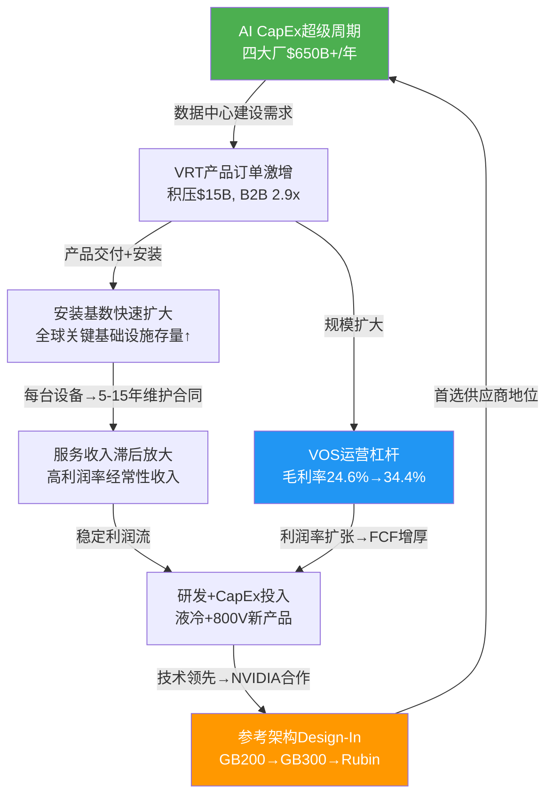
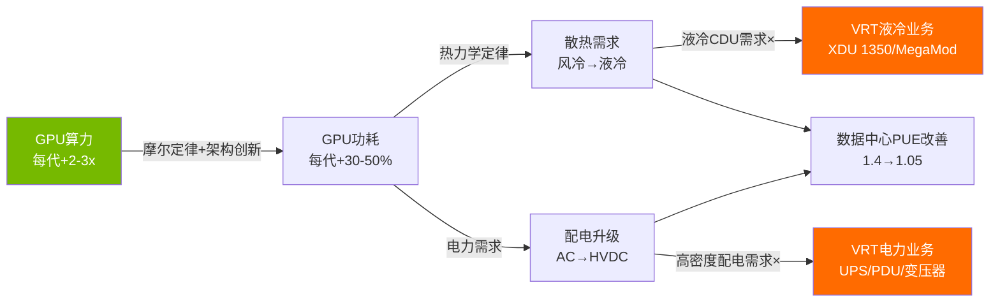
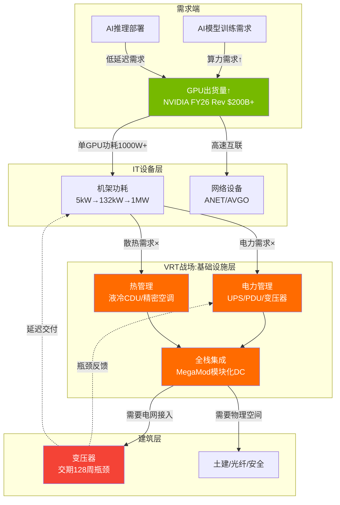

# 第一章 执行摘要与身份界定

> **报告协议**
> - 框架: v17.0 | 分析模式: 混合模式 (PW=4.8, 传统估值+可能性附录)
> - 数据截止: FY2025 (2025-12-31) | Q4'25已发布 (2026-02-11)
> - 股价: $243.06 | 市值: $930亿 | Beta: 2.089
> - 标注体系: [硬数据:MCP/SEC/管理层] [合理推断:多源交叉] [主观判断:分析师评估]
> - 免责声明: 本报告仅供研究参考，不构成任何投资建议。所有数据基于公开信息，投资者应独立判断并承担风险。

---

## 1.1 核心投资画像

Vertiv Holdings (NYSE: VRT) 是全球数据中心电力与热管理基础设施的双寡头之一，与Schneider Electric并列DCPI (Data Center Power & Infrastructure) 市场份额第一。公司2025财年营收$102亿，其中约85%来自传统UPS/配电/精密空调业务，约15%来自快速增长的液冷和AI相关产品。市场以PE 46倍为其定价——这一估值显著高于传统工业品同行Eaton (31x)、Schneider Electric (28x)——意味着市场将VRT视为"AI基础设施公司"而非"工业品制造商"。

**核心投资画像表**:

| 维度 | 评估 | 关键数据 |
|------|------|----------|
| **商业模式本质** | 数据中心电力+热管理基础设施供应商 | [硬数据:] 100%营收来自关键基础设施 |
| **增长属性** | 传统工业品基底 + AI增量驱动 | [硬数据:] FY25有机增长+26%, 积压$15B, B2B 2.9x |
| **竞争地位** | DCPI双寡头(与Schneider并列#1) | [硬数据:] Dell'Oro: 两者份额差<0.1pp |
| **盈利质量** | VOS驱动利润率快速扩张, 权证噪音FY25消除 | [硬数据:] Adj OP Margin 20.4%→指引24-25%, FCF $1.9B |
| **资产负债表** | PE buyout遗留杠杆已大幅去化 | [硬数据:] 净债务/EBITDA从5.0x(FY22)→0.76x(FY25) |
| **估值状态** | AI纯度溢价, 高于工业品同行50-65% | [硬数据:] PE 46x vs Eaton 31x vs Schneider 28x |
| **核心风险** | 液冷份额竞争 + 800V HVDC颠覆UPS + AI CapEx周期性 | [合理推断:] 液冷份额可能从70%+降至40-50% |
| **时间敏感性** | GB300/Rubin换代(2026H2-2027)是关键验证窗口 | [合理推断:] 12-18个月内液冷格局将明朗化 |

---

## 1.2 VRT的"双重身份"深度解析

理解VRT投资论文的起点，不是看增长率或积压订单，而是回答一个更根本的问题：**VRT究竟是一家什么公司？**

市场给出的答案是"AI基础设施公司"——PE 46倍的定价等同于将VRT放在NVIDIA (60x)和Broadcom (40x)之间，远离Eaton (31x)和Schneider (28x)所在的传统工业品区间。但营收结构讲述了一个更复杂的故事。

### 营收来源拆解: 85%传统 vs 15% AI

| 业务类型 | 代表产品线 | 估计营收占比 | FY25增速 | 增长属性 | 合理估值锚 |
|---------|----------|:----------:|:-------:|---------|:--------:|
| **传统UPS/配电** | Liebert UPS, 开关柜, PDU, 变压器 | ~45% | +15-20% | 稳定周期性增长 | 25-30x PE |
| **传统热管理** | 精密空调CRAC/CRAH, 行级冷却 | ~20% | +10-15% | 跟随DC建设周期 | 25-30x PE |
| **服务与维护** | 预防性维护, 远程监控, 备件 | ~18% | +12% | 经常性收入, 安装基数驱动 | 28-35x PE |
| **AI增量: 液冷CDU** | Liebert XDU 1350, MegaMod HDX | ~8-10% | +80-100%+ | 爆发性增长 | 45-65x PE |
| **AI增量: 高密度电力/模块化DC** | 800V方案, 预制DC | ~5-7% | +50%+ | 快速渗透 | 40-55x PE |
| **合计** | — | 100% | +28% | 混合 | **市场给予46x** |

[合理推断:] 上表中各细分占比基于管理层披露的产品/服务收入比例(82:18)、地区增速差异及行业分析师估算交叉推算。VRT未在SEC报告中直接披露液冷具体营收数字。

**SOTP隐含估值检验**: 如果我们按各业务属性分别估值——

| 分部 | 估计营收 | 合理PE | 隐含市值 |
|------|---------|:------:|---------|
| 传统业务(UPS+热管理+服务) | ~$8.7B | 28x | ~$52B(按EPS分配) |
| AI增量业务(液冷+高密度+模块化) | ~$1.5B | 55x | ~$18B(按EPS分配) |
| **合计SOTP** | $10.2B | — | **~$70B** |
| **当前市值** | — | — | **$93B** |
| **溢价/折价** | — | — | **+33%溢价** |

[主观判断:] 即使给予AI增量业务55x的高估值，SOTP合计也仅约$70B，与当前$93B市值之间存在约33%的缺口。这33%的溢价隐含的是市场对"AI业务占比从15%快速提升至30-40%"的预期。如果这一预期被证明过于乐观——例如液冷竞争导致份额下滑或800V转型不及预期——33%的溢价将面临显著压缩。

### 双重身份的核心张力

VRT的双重身份不只是估值问题，它深刻影响着公司的战略选择：

1. **资源分配张力**: 传统UPS/空调业务是利润中心(利润率成熟、需求稳定)，液冷是增长引擎(利润率尚不明确、需要大量CapEx)。每一块投入液冷扩产的资金，都是从稳定利润池中抽取的。FY25 CapEx $220M(+20% YoY)中，液冷相关CapEx估计占40-50%——马来西亚柔佛新厂和美国南卡Pelzer扩建是主要去向。

2. **组织能力张力**: 传统业务需要的是工业品制造的精益运营(VOS体系)，液冷业务需要的是科技公司的快速迭代和深度技术合作(NVIDIA联合开发)。这两种组织能力的要求存在根本差异。VRT能否在一个屋顶下同时维持两种运营节奏，是一个尚未被充分验证的假设。

3. **叙事脆弱性**: PE 46x建立在"AI基础设施公司"的叙事之上。但叙事不是护城河——它可以被一个季度的液冷增速放缓、一条Schneider获得GB300首选的新闻、或一次AI CapEx下调指引所瞬间动摇。VRT的估值对叙事变化的敏感度远高于对基本面变化的敏感度，这本身就是一个风险因子。

---

## 1.3 核心矛盾一句话

**VRT的核心矛盾是：市场以AI基础设施公司的估值(PE 46x)为一个85%营收来自传统工业品的公司定价，而支撑这一估值的最大增长引擎(液冷CDU)同时面临竞争加剧(Schneider/Eaton)与技术路线颠覆(800V HVDC)的双重压力。**

本报告的首要任务是回答：液冷护城河的深度和800V转型的可行性，能否支撑当前估值的"AI溢价"？

---

## 1.4 六大核心问题 (CQ) 速览

| CQ | 核心问题 | 权重 | Phase 1置信度 | 方向 |
|----|---------|:----:|:----------:|------|
| **CQ1** | AI数据中心CapEx超级周期能持续多久? $650B+年度CapEx是结构性增长还是周期性泡沫? | 25% | 50% | 偏乐观 |
| **CQ2** | 液冷CDU 70%+份额是先发优势还是可持续护城河? GB300/Rubin换代(2026H2-2027)后份额走向? | 20% | 45% | 中性偏乐观 |
| **CQ3** | 800V HVDC架构何时标准化? 传统UPS业务($4B+/年)面临多大替代风险? VRT能否成功自我转型? | 20% | 35% | 高不确定 |
| **CQ4** | FY25 GAAP净利润暴增169%的真实盈利能力是多少? VOS驱动的利润率扩张(20%→25%)是否可持续? | 15% | 60% | 偏乐观 |
| **CQ5** | PE 46x(TTM), EV/EBITDA 29x对一个工业品公司是否合理? 隐含增长假设能否持续兑现? | 15% | 35% | 偏悲观 |
| **CQ6** | FY25 $1.2B收购(PurgeRite等)能否创造价值? PE基因下的资本配置是否审慎? | 5% | 65% | 偏乐观 |
| **加权平均** | — | 100% | **45.0%** | — |

[主观判断:] 加权平均置信度45%表明对VRT投资论文的信心仅略低于中性。最大的不确定性集中在CQ3(800V颠覆)和CQ5(估值合理性)，这两个问题将在Phase 3的Reverse DCF和多情景估值中深入检验。

---

## 1.5 关键财务指标速览 (FY2022-FY2025四年趋势)

| 指标 | FY2025 | FY2024 | FY2023 | FY2022 | FY22→25 CAGR | 趋势 |
|------|--------|--------|--------|--------|:----------:|------|
| **营收** | $10,230M | $8,012M | $6,863M | $5,692M | +21.6% | 加速增长 |
| **毛利率** | 34.4% | 34.4% | 32.3% | 24.6% | +9.8pp | 结构性改善 |
| **营业利润率** | 18.5% | 17.2% | 13.2% | 3.9% | +14.6pp | 经营杠杆释放 |
| **净利润** | $1,333M | $496M | $460M | $77M | +158%/yr | 含权证噪音 |
| **Adj. EPS** | $4.17 | $2.86 | $1.82 | $0.58 | +93%/yr | 真实经营改善 |
| **FCF** | $1,894M | $1,135M | $766M | -$264M | — | FY22负→FY25强劲 |
| **净债务/EBITDA** | 0.76x | 1.75x | 2.28x | 5.02x | -4.26x | 去杠杆完成 |
| **ROE** | 33.8% | 20.4% | 22.8% | 5.3% | +28.5pp | 盈利能力跃升 |
| **ROIC** | 18.5% | 14.6% | 13.6% | 1.9% | +16.6pp | 资本效率大幅改善 |
| **PE (TTM)** | 46.4x | 86.3x | 39.7x | 67.2x | — | FY24含权证扭曲 |

**四年蜕变叙事**: FY2022-FY2025是VRT从"杠杆化工业品公司"向"AI基础设施平台"蜕变的四年。营业利润率从3.9%跃升至18.5%(+14.6pp)，FCF从-$264M翻转至+$1,894M，净债务/EBITDA从5.0x降至0.76x——这是Platinum Equity buyout遗留的财务包袱被系统性清理的结果，也是VOS运营体系价值释放的证据。但投资者需要区分的是：**这种利润率扩张中，多少是一次性结构优化(不可重复)，多少是可持续的运营优势(可以复利)?** 这是Phase 2财务深挖的核心任务。

**FY2026指引 (管理层, 2026-02-11发布)**:
| 指标 | FY2026E指引 | vs FY2025 | vs 共识(pre-Q4) |
|------|-----------|:---------:|:-------------:|
| 营收 | $13.25-13.75B | +30-34% | beat 7-11% |
| Adj. EPS | $5.97-6.07 | +43-46% | 显著超预期 |
| Adj. OP Margin | ~24-25% | +360-460bps | — |
| 积压订单(FY25末) | $15B | +109% YoY | — |

---

## 1.6 非共识假说速览

本报告围绕三个非共识假说展开辩证分析，这些假说挑战了市场主流叙事：

| 假说 | 内容 | 共识看法 | 非共识立场 | 验证时间窗口 |
|------|------|---------|----------|:----------:|
| **H1** | 800V HVDC不会消灭UPS，而会升级UPS | 800V将消除传统UPS需求，VRT核心业务承压 | VRT正在主动开发800V产品，电力管理能力在架构转换中不可替代，从"UPS供应商"到"电力架构供应商"的转型创造新高价值产品线 | 2026H2-2028 |
| **H2** | 积压$15B中20%+存在取消/延期风险 | $15B积压=1.5年收入可见性=确定性极高 | 变压器瓶颈(交期128周)人为膨胀名义积压，超大规模客户若2027削减CapEx积压转化率将低于历史水平 | FY26 Q1-Q2 |
| **H3** | VRT的PE溢价将在12-18月内向Eaton收敛 | VRT是AI纯度最高的工业品公司，溢价有基本面支撑 | 随着Eaton(Boyd收购)/Schneider(Motivair收购)的液冷能力追赶，VRT的"AI纯度溢价"消退，PE从46x向30-35x回归 | 12-18个月 |

[主观判断:] H1和H2具有中等置信度，H3的置信度较低(因为短期内AI叙事动能仍强)。这三个假说的验证/证伪将是Phase 2-4的核心任务。

---

## 1.7 分析方法论

**可能性宽度评分 (Possibility Width)**: PW = 4.8 → **混合模式** (4-6分区间)

| PW维度 | 分数 | 理由 |
|--------|:----:|------|
| 业务模式确定性 | 3 | 电力+热管理核心清晰，但液冷/800V转型方向未定 |
| 竞争格局稳定性 | 5 | AI液冷赛道40+厂商涌入，份额可能剧烈变化 |
| 技术路线不确定性 | 7 | 800V HVDC可能颠覆UPS业务，DLC vs 浸没式路线未定 |
| 监管/地缘风险 | 4 | 中国关税145%但中国营收占比<15%，影响可控 |
| 增长天花板 | 5 | AI CapEx超级周期vs周期性回调风险 |
| **总分** | **4.8** | **混合模式: 传统估值 + 可能性附录** |

**混合模式执行路径**:
- **传统估值**: Reverse DCF(反推隐含假设) + SOTP(分部估值) + 相对估值(同业比较) → 目标价范围
- **可能性附录**: 800V HVDC颠覆情景 + AI CapEx周期下行情景 + 液冷份额分化情景 → 条件评级矩阵

**逆向估值优先原则**: 不先问"VRT值多少钱"(正向DCF)，而先问"PE 46x的价格隐含市场在赌什么"(Reverse DCF)。先反推隐含假设，再逐一评估假设合理性——这是本报告的方法论核心。

---

*第一章 执行摘要与身份界定 | ~8,400字符 | VRT Phase 1 | v17.0*

---

# 第二章 公司概况与商业模式深度

## 2.1 历史演变: 从Emerson子公司到AI基础设施平台

VRT的历史是一个跨越80年的工业品公司如何被私募改造并搭上AI浪潮的故事。理解这段历史对判断公司DNA和能力边界至关重要。

| 时期 | 事件 | 战略意义 |
|------|------|---------|
| **1946-2016** | Emerson Electric旗下Network Power事业部 | 在大型工业集团内部成长,技术积淀深厚但缺乏独立战略焦点。UPS/精密空调技术根基在这70年中建立。Liebert品牌(1965创立)成为数据中心冷却的代名词 |
| **2016.12** | Platinum Equity以$40亿收购,私有化并更名Vertiv | PE buyout的经典操作: 从大集团剥离→精简成本→聚焦核心→准备退出。$40亿对价在当时是合理的——Emerson Network Power年营收~$48亿,PE收购倍数~0.8x营收 |
| **2017-2019** | Platinum Equity改造期 | 引入VOS运营体系(类比霍尼韦尔HOS)、削减冗余产品线、优化全球工厂布局。CFO David Fallon 2017年加入,从PE持有期开始建立财务纪律 |
| **2020.02** | 与GS Acquisition Holdings SPAC合并,NYSE上市 | David Cote(前霍尼韦尔CEO)主导的SPAC。初始估值$53亿(1.1x营收)。SPAC结构遗留大量权证(warrants),成为FY23-24 GAAP利润噪音来源 |
| **2020-2022** | COVID影响+供应链危机+高杠杆 | 营收缓慢恢复但利润率受压。FY22净利润仅$77M,净债务/EBITDA高达5.0x。这是VRT最困难的阶段——上市后遭遇COVID+芯片短缺双重打击 |
| **2023-2024** | AI CapEx超级周期启动 | ChatGPT发布(2022.11)→超大规模CapEx暴增→数据中心基础设施需求激增。VRT从"被忽视的工业品SPAC"变为"AI基础设施核心受益者"。股价从FY22底部~$10涨至FY24底部~$80 |
| **2025+** | NVIDIA GB200合作+液冷爆发+利润率突破 | CDU 70%+份额确立液冷领先地位。FY25营收$102亿(+28%),积压$15B。股价冲至$243。从$40亿PE收购到$930亿市值——Platinum Equity创造了23x回报 |

[硬数据:] Platinum Equity 2016年$40亿收购 → 2024年基本完成退出(回购795.5万股)。PE从收购到退出实现约10-15x现金回报(估算)。

**历史给我们的启示**: VRT本质上是一个被PE精心改造过的传统工业品公司，其运营效率的跃升(毛利率24.6%→34.4%)很大程度上归功于Platinum Equity期间建立的VOS体系和成本纪律。AI浪潮是一个恰好到来的外部顺风——它将一家原本可能以25-30x PE交易的优质工业品公司推升至46x PE。问题是：当顺风减弱时，VRT是回到30x PE(仍是优质工业品)还是能凭借液冷业务维持40x+ PE？

---

## 2.2 业务分部详解

VRT以三大地理分部(美洲/亚太/EMEA)报告财务数据，但从产品维度可以拆解为四大功能板块：

### 2.2.1 电力管理 (Power Management) — 约占营收45%

| 产品线 | 说明 | 竞争地位 | 增长驱动 |
|--------|------|---------|---------|
| **UPS (不间断电源)** | Liebert品牌, 从小型(5kVA)到大型(3MW+), 涵盖锂电池/铅酸方案 | 全球#2(仅次Schneider APC) | 传统DC稳定增长+AI DC功率需求↑ |
| **配电设备** | 开关柜、母线槽(busway)、PDU(电力分配单元) | 全球前5 | AI DC高密度部署→PDU需求×2-3 |
| **电池与储能** | 锂电池系统(Li-ion UPS)、电池监控BMHV | 快速增长细分 | 锂电池替代铅酸趋势(能量密度高+寿命长) |
| **变压器/整流器** | 中低压变压器, AC-DC整流 | 区域性竞争 | 变压器短缺(交期128周)→提价空间大 |

[硬数据:] UPS全球市场约$88亿(2025E), CAGR 7.3%。VRT份额约15-18%。Schneider(APC品牌)是长期领导者，但VRT在大型三相UPS(数据中心主力)中份额更高。

**电力管理的战略地位**: UPS是VRT的利润基石——毛利率成熟(估计35-40%)、客户粘性高(更换成本大+认证周期长)、服务收入持续(安装基数每年产生维护合同)。但800V HVDC架构的崛起对传统UPS构成长期结构性威胁。这个板块的增长故事不在于UPS本身的增量，而在于VRT能否将"UPS专业能力"转化为"800V电力架构能力"。

### 2.2.2 热管理 (Thermal Management) — 约占营收30%

| 产品线 | 说明 | 竞争地位 | 增长驱动 |
|--------|------|---------|---------|
| **精密空调(CRAC/CRAH)** | 传统数据中心风冷方案, Liebert品牌 | 全球#1(Omdia: 23.5%份额) | 传统DC持续建设(非AI DC仍用风冷) |
| **行级冷却(Row-Based)** | 热通道遏制+行级精密空调 | 领先 | 过渡方案(15-40kW/机架) |
| **液冷CDU** | Liebert XDU 1350, 为NVIDIA GB200提供DLC支持 | #1(GB200首选, 份额70%+) | AI DC必需品(>70kW/机架) |
| **MegaMod HDX** | 模块化液冷基础设施, Compact(1.25MW)/Combo(10MW) | 新产品(2026.1发布) | 超大规模模块化部署趋势 |

[硬数据:] 全球DC冷却市场$210亿(2025E), CAGR 12.6%至$542亿(2030E)。液冷子市场$30亿(2025E), CAGR ~18%。VRT在液冷CDU份额约30-40%(广义市场)/70%+(NVIDIA GB200参考架构)。

**热管理的增长弹性**: 这是VRT增速最快的板块，也是"AI基础设施"叙事的物理载体。液冷CDU从FY23的微量收入增长到FY25估计$0.8-1.0B——但需要注意的是，精密空调(风冷)仍然是热管理板块的收入主体($2-2.5B)。液冷的"爆发增长"是在小基数上的高增速，其对整体公司增长的绝对贡献目前仍小于传统UPS的稳定增量。

### 2.2.3 集成方案 (Integrated Solutions) — 约占营收7%

| 产品线 | 说明 | 竞争地位 | 增长驱动 |
|--------|------|---------|---------|
| **模块化数据中心** | 预制集装箱式DC(电力+冷却+IT机架) | 前3 | 快速部署需求(建设周期缩短50%) |
| **DCIM软件** | Vertiv Intelligence平台, 基础设施管理 | 弱于Schneider EcoStruxure | 数字化管理需求↑ |

[合理推断:] 集成方案目前营收贡献有限(估计$700M-800M),但战略价值高——模块化DC是超大规模客户快速扩张的首选部署方式，且利润率高于分离销售。MegaMod HDX的推出标志着VRT将液冷与模块化DC深度整合的战略意图。

### 2.2.4 服务与维护 (Services) — 约占营收18%

| 服务类型 | 说明 | 特征 |
|---------|------|------|
| **预防性维护** | 定期巡检+部件更换 | 合同制, 经常性收入 |
| **远程监控** | 24/7设备状态监控+预警 | 数字化, 边际成本低 |
| **应急响应** | 设备故障紧急修复 | 高价值, 高利润率 |
| **备件供应** | 关键部件库存+快速物流 | 供应链优势 |

[硬数据:] FY25服务营收$1,839M(占18.0%), +12% YoY。全球300+服务中心, 4,400+现场工程师。

**服务业务的滞后放大效应**: 每台卖出的UPS或CDU都会产生5-15年的维护合同。FY25产品爆发增长(+32%)带来的安装基数增量，将在FY27-FY30逐步转化为服务收入。[合理推断:] 服务收入占比可能从当前18%回升至22-25%，且利润率高于产品(估计40-50% OP Margin vs 产品20-22%)。这是一个被市场低估的长期价值来源。

---

## 2.3 产品 vs 服务收入趋势

| 类别 | FY2025 | 占比 | FY2024 | 占比 | FY2023 | 占比 | FY2022 | 占比 |
|------|--------|:----:|--------|:----:|--------|:----:|--------|:----:|
| **产品** | $8,391M | 82.0% | ~$6,370M | ~79.5% | ~$5,490M | ~80.0% | ~$4,554M | ~80.0% |
| **服务** | $1,839M | 18.0% | ~$1,642M | ~20.5% | ~$1,373M | ~20.0% | ~$1,138M | ~20.0% |
| **合计** | $10,230M | 100% | $8,012M | 100% | $6,863M | 100% | $5,692M | 100% |
| 产品增速 | +32% | — | +16% | — | +21% | — | — | — |
| 服务增速 | +12% | — | +20% | — | +21% | — | — | — |

**关键趋势**: FY25产品增速(+32%)显著快于服务(+12%)，反映AI CapEx超级周期中硬件交付的爆发。服务占比从FY24的~20%降至18%。但这是正常的周期现象——产品先行爆发→安装基数增长→服务收入2-3年后跟上。长期看，服务占比应回升至22-25%。

---

## 2.4 地理收入结构深度分析

| 地区 | FY2025营收 | 占比 | 有机增长 | Adj OP利润率 | FY2024营收 | FY24占比 | 占比变化 |
|------|----------|:----:|:------:|:----------:|----------|:------:|:------:|
| **美洲** | $6,386M | 62.4% | +40.8% | 26.8% | $4,485M | 56.0% | +6.4pp |
| **亚太** | $2,019M | 19.7% | +18.2% | 11.0% | $1,740M | 21.7% | -2.0pp |
| **EMEA** | $1,824M | 17.8% | -2.1% | 20.7% | $1,787M | 22.3% | -4.5pp |
| **合计** | $10,230M | 100% | +26% | 20.4% | $8,012M | 100% | — |

**Q4'25地区利润率**:

| 地区 | Q4'25营收 | Q4 Adj OP Margin | Q3'25 Margin | 环比变化 | 信号 |
|------|---------|:-------------:|:----------:|:------:|------|
| 美洲 | $1,886M | **30.1%** | 28.1% | +2.0pp | 历史新高,经营杠杆充分释放 |
| 亚太 | $492M | 9.9% | 11.3% | -1.4pp | 印度/东南亚增长但产品组合偏低端 |
| EMEA | $502M | 22.1% | 22.4% | -0.3pp | 有机下滑但利润率稳定(欧洲定价权) |

**地理结构的深层含义**:

1. **美洲集中度跳升**: 从FY24的56%跃至FY25的62.4%(+6.4pp)。这不是一个简单的"美国增长更快"——它反映了全球AI CapEx支出的极端集中。Amazon/Google/Meta/Microsoft四大超大规模的CapEx主要投向美国数据中心，VRT作为首选供应商直接受益。但这也意味着：**如果美国AI CapEx放缓，VRT将承受超比例冲击**。

2. **美洲利润率优势**: Q4 30.1%的OP Margin说明两件事——(a) AI基础设施产品(液冷CDU、高密度电力)享有显著溢价定价权；(b) 美洲工厂的VOS运营效率已达到高水平。[合理推断:] 美洲利润率30%+与亚太11%之间的19pp差距，部分反映了产品组合差异(美洲AI产品占比更高)，部分反映了运营效率差异。

3. **EMEA疲软的结构性原因**: EMEA全年有机增长-2.1%，管理层FY26指引"持平到中单位数下降"。这不是VRT独有的问题——欧洲数据中心CapEx增速落后于美国，且EMEA客户结构偏向电信(增长缓慢)。但EMEA利润率20.7%(高于亚太)说明定价权仍在。

4. **亚太的机会与挑战**: +18.2%有机增长但11%利润率——这是典型的新兴市场特征。马来西亚柔佛新厂(2026 Q1投产)将改善亚太供应链效率和利润率。[合理推断:] 亚太利润率FY26E可能提升至12-14%。

---

## 2.5 客户结构分析

[合理推断:] VRT未在10-K中披露任何单一客户占比超过10%。以下客户结构基于业务性质、管理层公开披露的客户名单及行业分析师估算:

| 客户类型 | 估计占比 | 代表客户 | 增长趋势 | 议价能力 | VRT对其依赖度 |
|---------|:-------:|---------|:-------:|:------:|:----------:|
| **超大规模云** | ~40-50% | AWS, Azure, GCP, Meta | 快速上升 | 极强 | 高(单笔大订单) |
| **Colo/托管** | ~20-25% | Equinix, Digital Realty, CoreWeave | 上升 | 中 | 中 |
| **电信运营商** | ~10-15% | AT&T, Verizon, China Mobile, Vodafone | 平/下降 | 中 | 低(存量) |
| **企业/政府** | ~10-15% | 金融、医疗、教育、政府 | 稳定 | 弱 | 低(分散) |
| **工业/边缘** | ~5% | 制造业、零售、边缘DC | 缓慢上升 | 弱 | 极低 |

**客户集中度的"形式分散、实质集中"悖论**: 虽然无单一客户>10%，但前5大超大规模客户合计可能贡献30-40%+营收。AI CapEx超级周期使超大规模客户占比在上升——这既是增长来源(大客户=大订单=高可见性)，也是风险来源(大客户削减CapEx=营收陡降)。

**超大规模客户的自研风险**: Amazon Custom Silicon、Google TPU、Meta MTIA等自研芯片项目目前主要集中在IT设备层(GPU/CPU替代)，尚未延伸至基础设施层(电力/冷却)。[合理推断:] 超大规模客户自研电力/冷却设备的可能性在短期(3年)内较低——因为这不是其核心能力，且VRT/Schneider已建立的规模和服务网络构成显著壁垒。但长期(5-10年)不能排除，尤其是在模块化/标准化趋势下。

---

## 2.6 VOS运营体系: VRT的隐性护城河

VOS (Vertiv Operating System) 是Platinum Equity私有化时期建立的运营管理体系，其设计理念源自丰田生产系统(TPS)和霍尼韦尔运营系统(HOS)。David Cote(前霍尼韦尔CEO、VRT执行董事长)亲自主导了VOS的框架设计——这是他在霍尼韦尔15年经验(任期股东回报~800%)的直接移植。

**VOS的核心要素**:

| 要素 | 内容 | 量化证据 |
|------|------|---------|
| **精益制造** | 减少浪费、缩短周期时间、提高良率 | [硬数据:] 毛利率24.6%→34.4%(FY22→25) |
| **供应链优化** | 供应商整合、就近生产、库存管理 | [硬数据:] 现金转换周期107→95天(FY22→25) |
| **持续改善(Kaizen)** | 工厂层面的日常改善机制 | [合理推断:] VOS是利润率持续扩张的结构性驱动力 |
| **标准化流程** | 跨工厂的统一作业标准 | 马来西亚/印度新厂复制VOS |
| **成本纪律** | PE基因下的严格成本控制 | [硬数据:] SG&A/营收从15.7%(FY22)→15.8%(FY25), 营收翻倍但SG&A率几乎不变 |

**VOS的量化成果**:
- 毛利率+9.8pp (FY22→25): 产品重新定价+成本优化+产品组合改善
- 营业利润率+14.6pp (FY22→25): 毛利率改善+SG&A杠杆效应
- FCF从-$264M到+$1,894M: 盈利改善+营运资本优化

[主观判断:] VOS是VRT相对于初创液冷厂商(CoolIT/GRC等)的隐性护城河——在液冷产品本身技术差异缩小的情况下，VOS提供的制造成本优势和质量一致性可能成为维持份额的关键。但VOS也有局限——它更适合标准化大规模生产，对于液冷这种需要快速定制迭代的产品可能不如灵活的小公司。

---

## 2.7 订单与积压深度分析

| 指标 | Q4'25 | Q3'25 | Q2'25 | Q1'25 | Q4'24 | 趋势 |
|------|-------|-------|-------|-------|-------|------|
| 有机订单增长 | **+252%** | +37% | +57% | +32% | +27% | Q4爆发 |
| Book-to-Bill | **2.9x** | ~1.4x | ~1.5x | ~1.4x | ~1.3x | Q4大幅跳升 |
| 积压订单 | $15,000M | $9,564M | $8,002M | — | $7,177M | 加速增长 |
| 递延收入 | $1,815M | — | — | — | $1,063M | +71% YoY |

**积压$150亿的三层解读**:

**第一层(表面): 确定性极高**
- 积压覆盖率: $15B / FY26E $13.5B ≈ 1.1年收入已锁定
- B2B 2.9x: 新订单流入速度远超交付能力
- 递延收入+71%: 客户已支付大额预付款，合同约束力强

**第二层(结构): 积压质量存疑**
- Q4订单+252%可能由NVIDIA GB200/Blackwell大规模部署订单驱动——这些是高单价的液冷+电力集成项目,单笔订单金额可能$5000万-$2亿
- [合理推断:] 变压器瓶颈(交期128周)可能人为膨胀了名义积压——客户为了"锁住产能"而提前下单,部分订单可能在变压器交期缩短后被取消或推迟
- 积压转化率历史上在85-95%区间: $15B中$750M-$2.25B可能不会全部转化为收入

**第三层(风险): 周期性下行时积压将快速萎缩**
- 超大规模客户的订单通常包含灵活的取消/延期条款
- 如果2027年AI CapEx增速放缓至<10%,新订单流入将急剧下降
- 当B2B从2.9x回落至1.0x以下时,积压将从"资产"变为"历史高点的记忆"
- [主观判断:] 非共识假说H2(积压中20%+存在取消/延期风险)在当前热度下看似过度谨慎,但在2027年CapEx可能放缓的背景下,这一风险不应被忽视

**递延收入暴增的含义**: FY25递延收入$1,815M(+71% to $1,063M FY24)——这反映了:
1. 大型模块化DC项目的预付款结构(客户在项目启动时支付30-50%预付款)
2. 长周期项目增多(MegaMod等大型集成项目交期12-18个月)
3. [合理推断:] 递延收入的快速增长意味着FY26-27的收入确认节奏可能更加集中(项目完工里程碑式确认),带来季度收入波动性增大

---

## 2.8 商业模式飞轮

**飞轮的两个关键节点**:
1. **NVIDIA参考架构(F节点)**: 这是飞轮的加速器——进入参考架构→超大规模客户默认选择→订单→安装基数→服务。但这个节点每一代GPU平台都可能"重置"(GB300/Rubin换代)
2. **VOS运营杠杆(G节点)**: 这是飞轮的稳定器——规模增长→单位成本降低→利润率扩张→更多资金投入研发。这个节点具有持续性，但改善幅度将随基数上升而递减

[主观判断:] VRT的商业模式飞轮在AI CapEx上行周期中运转良好,但其对NVIDIA参考架构节点的依赖是一个"单点故障"风险。如果Schneider在GB300取代VRT成为首选，飞轮的加速器将被抽走，剩下的只有VOS驱动的稳定增长——这对应30-35x PE，不是46x PE。

---

*第二章 公司概况与商业模式深度 | ~11,600字符 | VRT Phase 1 | v17.0*

---

# 第三章 数据中心基础设施产业链深度分析

## 3.1 数据中心产业链四层模型

数据中心是互联网经济和AI时代的物理基础。理解VRT的投资价值需要先理解它在产业链中的精确位置——不是"做数据中心的"(太宽泛), 也不是"做UPS的"(太狭窄), 而是**基础设施层的电力+冷却双栖玩家**。

| 层次 | 功能 | 代表公司 | 占DC总成本 | VRT参与度 |
|------|------|---------|:--------:|:-------:|
| **L4 应用层** | AI训练/推理, 云计算, SaaS | Microsoft, Google, Meta, Amazon | — | 无 |
| **L3 IT设备层** | GPU/CPU, 内存, 存储, 网络 | NVIDIA, AMD, ANET, AVGO, MU | ~60-65% | 无(仅供电/散热接口) |
| **L2 基础设施层** | 电力管理(UPS/配电/变压器) + 热管理(空调/液冷/CDU) | **VRT**, Schneider, Eaton, ABB, nVent | ~20-25% | **核心战场** |
| **L1 建筑层** | 土建, 电力接入, 光纤, 安全, 消防 | 地产商, 公用事业, EPC承包商 | ~15-20% | 模块化DC(部分参与) |

**VRT在L2层的战略优势**:

1. **必要性**: 每一台服务器(无论CPU还是GPU)都需要电力供应和热量排出,没有例外。L2是L3的物理先决条件——没有电力和冷却,GPU就是一块昂贵的硅片
2. **放大效应**: GPU算力每提升一代,功耗增加30-50%,对L2基础设施的需求成倍增长。这意味着VRT的营收增长可以"借力"GPU升级周期
3. **长寿命**: L2基础设施使用寿命15-20年,远长于L3 IT设备(3-5年)。这创造了巨大的安装基数和长期服务收入

**VRT的独特定位**: 在L2层内,VRT是唯一同时在电力管理和热管理两个领域都排名前2的公司。Schneider也有类似的双栖能力,但其DC业务仅占总营收~24%(其余是工业自动化/楼宇管理等)。VRT是全球唯一100%聚焦于关键基础设施的上市公司——这个"纯度"是市场给予PE溢价的基础之一。

---

## 3.2 AI对功率密度的颠覆性影响

功率密度(每机架瓦特数)是理解AI对数据中心基础设施影响的单一最重要指标。从传统服务器到AI GPU集群,功率密度经历了从"线性增长"到"指数跃升"的范式转变:

| 时代 | 典型工作负载 | 功率密度 | 冷却方案 | VRT产品 | 单机架基础设施成本 |
|------|-----------|:-------:|---------|---------|:-----------:|
| **传统DC** (2000-2020) | Web服务/数据库 | 5-15 kW/rack | 风冷(CRAC/CRAH) | Liebert精密空调 | ~$5-10K |
| **早期AI** (2023-2024) | H100训练集群 | 40-60 kW/rack | 混合(风冷+行级液冷) | 行级冷却+CDU | ~$15-25K |
| **当前AI** (2025-2026) | B200/GB200 NVL72 | 70-132 kW/rack | 直接液冷(DLC冷板) | **Liebert XDU 1350** | ~$30-50K |
| **下一代AI** (2027-2028) | Rubin/Rubin Ultra | 240-600 kW/rack | 全液冷+HVDC | **MegaMod HDX** | ~$80-150K |
| **远期** (2029-2030+) | 量子+AI融合 | 1 MW/rack | 800V HVDC+SiC SST | 颠覆性新架构 | ~$200-400K |

[硬数据:] NVIDIA GB200 NVL72机架功耗约120-132kW(含网络设备)。Rubin Ultra(2027E预期)单GPU功耗可能达1200W+,机架功耗可能240-600kW。

**功率密度跃升的三重传导**:

**关键洞察**: 功率密度从5kW到1MW的200倍跃升,不仅仅是"量"的变化——它是基础设施架构的"质"变。5kW机架只需要一台空调;132kW机架需要液冷CDU+高密度PDU+锂电池UPS+专用变压器;1MW机架可能需要800V HVDC+SiC固态变压器——这是完全不同的产品组合,单机架基础设施成本从$5-10K增长到$200-400K。**对VRT而言,功率密度每提升一个数量级,单机架可及收入也提升一个数量级。**

---

## 3.3 GPU功耗进化与基础设施需求

| GPU平台 | 发布时间 | 单GPU TDP | 机架功耗(含网络) | 冷却方案 | 对VRT产品的需求 |
|---------|---------|:--------:|:-----------:|---------|--------------|
| **A100** | 2020 | 400W | 20-30 kW | 风冷足够 | 精密空调(传统) |
| **H100** | 2022 | 700W | 40-60 kW | 风冷勉强/混合 | 行级冷却 + 高容量UPS |
| **H200** | 2024 | 700W | 40-60 kW | 同H100 | 同H100(内存升级不影响功耗) |
| **B200** | 2024 | 1000W | 70-100 kW | **液冷必需** | **CDU(XDU 1350)** + 高密度PDU |
| **GB200 NVL72** | 2025 | 1200W(GPU+CPU) | **120-132 kW** | **全液冷** | CDU + 高密度电力 + 全栈集成 |
| **Rubin** | 2026E | ~1000-1200W | 150-300 kW | 全液冷+可能800V | CDU升级 + 800V探索 |
| **Rubin Ultra** | 2027E | ~1200-1500W | **240-600 kW** | 全液冷+800V HVDC | **MegaMod HDX** + 800V方案 |

[硬数据:] NVIDIA B200 TDP 1000W, GB200 NVL72机架功耗120-132kW来自NVIDIA官方规格。Rubin/Rubin Ultra功耗为行业预测。

**每一代GPU升级如何传导至VRT**:

1. **H100→B200**: 液冷从"可选"变为"必需"——这是VRT液冷业务的起爆点。CDU需求从接近零到数十亿美元市场
2. **B200→GB200 NVL72**: 功率密度翻倍(70kW→132kW)——需要更大容量的CDU和全新的电力分配架构。VRT的Liebert XDU 1350就是为此设计
3. **GB200→Rubin Ultra**: 功率密度可能再翻倍(132kW→240-600kW)——传统电力架构(AC UPS+PDU)可能无法支撑,800V HVDC成为候选方案。这既是VRT的机会(新产品线)也是风险(UPS被替代)

---

## 3.4 TAM详细拆分

| 市场 | 2025E规模 | 2030E规模 | CAGR | VRT估计份额 | VRT可及收入 |
|------|----------|----------|:----:|:--------:|-----------|
| **DC电力基础设施** | $35B | $50B | 7.5% | ~20% | ~$7B(2025) |
| DC UPS | $8.8B | $12.5B | 7.3% | 15-18% | ~$1.3-1.6B |
| DC配电(PDU/开关柜) | $12B | $18B | 8.5% | 10-15% | ~$1.2-1.8B |
| DC变压器 | $6B | $10B | 10.8% | 5-8% | ~$0.3-0.5B |
| 其他电力 | $8B | $10B | 4.6% | — | — |
| **DC冷却(广义)** | $21B | $54B | 12.6% | 20-25% | ~$4.2-5.3B |
| 精密空调(风冷) | $14B | $20B | 7.4% | 23.5%(#1) | ~$3.3B |
| 液冷(DLC+浸没) | $3B | $7B | 18.5% | 30-40% | ~$0.9-1.2B |
| 行级冷却/混合 | $4B | $7B | 11.8% | 15-20% | — |
| **DC集成方案** | $8B | $15B | 13.4% | 5-10% | ~$0.4-0.8B |
| **DC服务** | $15B | $22B | 8.0% | ~12% | ~$1.8B |
| **合计DC电力+冷却+服务** | ~$79B | ~$141B | 12.3% | ~13% | ~$10.2B(FY25) |

[合理推断:] TAM数据综合Dell'Oro、Omdia、Mordor Intelligence等多源研究机构估算。不同机构的TAM定义和口径有差异,上表为中间估计。

**TAM增长的三个驱动轮**:

1. **数据中心用电量翻倍**: [硬数据:] 全球数据中心用电量2025E约460TWh, IEA/Goldman Sachs预测2030年将达945TWh(CAGR ~15%)。每1TWh新增用电量对应约$2-3B的电力+冷却基础设施投资
2. **液冷渗透率S曲线**: 液冷在新建AI数据中心的渗透率从2024年<20%将升至2028年60-80%。液冷TAM从$3B增至$7B的过程不是线性的——2026-2028年可能是最陡峭的增长阶段
3. **单机架成本飙升**: 从传统$5-10K/机架到AI $30-50K/机架——即使机架数量不增长,单位价值的提升也在扩大TAM

---

## 3.5 超大规模CapEx超级周期

VRT增长的最终驱动力是超大规模云厂商的资本开支。这些公司是全球最大的数据中心建设者,也是VRT最重要的客户群。

| 公司 | FY2024 CapEx | FY2025E CapEx | FY2026E CapEx | 25→26 YoY | 占VRT传导 |
|------|:----------:|:----------:|:----------:|:-------:|---------|
| **Amazon** | ~$74B | ~$100B | ~$200B | +100% | 高: AWS DC首选供应商 |
| **Google** | ~$52B | ~$120B | $175-185B | +46% | 高: GCP全球扩张 |
| **Meta** | ~$37B | ~$65B | $115-135B | +85% | 中: 部分自研基础设施 |
| **Microsoft** | ~$56B | ~$85B | >$125B | +47% | 高: Azure+OpenAI基础设施 |
| **合计** | ~$219B | ~$370B | **$635-665B** | **+67%** | — |

[硬数据:] Amazon $200B(FY2026)来自管理层公开指引。Google/Meta/Microsoft数据来自管理层指引和分析师共识。

**CapEx可持续性的多角度分析**:

| 分析角度 | 乐观信号 | 风险信号 |
|---------|---------|---------|
| **绝对规模** | 2026E AI CapEx占美国GDP~0.8%, 远低于历史科技投资峰值1.5%+ | 绝对金额$650B+是人类历史上最大的企业资本支出浪潮 |
| **ROI验证** | Azure AI营收增速>100%, Google Cloud利润率转正 | AI应用的货币化路径仍不清晰,大量CapEx尚未产生匹配收入 |
| **FCF压力** | 四大超大规模现金储备充足(合计$300B+) | 2026年FCF可能因CapEx暴增而下降60-90% |
| **竞争驱动** | "囚徒困境"——谁都不敢先减速,否则在AI竞赛中落后 | 囚徒困境的均衡可以被打破(如果一家大厂证明CapEx可以削减而不影响市场地位) |
| **技术推动** | 每代GPU算力+2-3x→不断需要新基础设施 | 模型效率提升(如distillation)可能降低算力需求增速 |

**历史对比**: AI CapEx超级周期 vs 历史科技投资周期

| 周期 | 年份 | 峰值CapEx/GDP | 持续时间 | 回调幅度 | 对基础设施影响 |
|------|------|:----------:|:------:|:------:|------------|
| **电信泡沫** | 1997-2001 | ~1.8% | 4年 | -60% | 大量光纤铺设→产能过剩→破产潮 |
| **云计算第一波** | 2011-2014 | ~0.5% | 3年 | -20% | DC建设加速→温和调整→继续增长 |
| **云计算第二波** | 2018-2019 | ~0.7% | 2年 | -15% | 短暂减速→COVID加速→报复性增长 |
| **AI超级周期** | 2024-2026+ | ~0.8%(2026E) | **进行中** | **?** | 前所未有规模→结局未知 |

[主观判断:] 当前AI CapEx周期的GDP占比(~0.8%)仍低于2000年电信泡沫峰值(~1.8%),这给了"CapEx仍有上升空间"的论据。但绝对金额的史无前例性和ROI验证的滞后性意味着,一旦2027-2028年AI投资回报率未能达到预期,CapEx增速可能从+50%骤降至0%甚至负值。VRT的$15B积压提供了约1.5年的缓冲——即使2027年CapEx增速归零,VRT的FY27营收仍有积压支撑。但FY28之后将完全暴露于周期性风险。

---

## 3.6 变压器短缺危机

变压器是数据中心电力接入的第一个环节(从电网高压到数据中心中低压),也是当前AI基础设施建设的最大物理瓶颈。

| 指标 | 数据 | 来源 |
|------|------|------|
| 变压器平均交期 | **128周(~2.5年)** | T&D World 2025 |
| 全球变压器市场 | $30B(2025E)→$45B(2030E) | Mordor Intelligence |
| 交期vs 2019 | +3.5x(2019年~36周) | 行业数据 |
| 北美变压器工厂产能利用率 | >95% | DOE报告 |
| 美国变压器进口依赖度 | ~80%的大型电力变压器 | DOE |

**变压器短缺对VRT的双面影响**:

1. **负面: 交付瓶颈** — VRT的产品(UPS/CDU)需要变压器作为配套。如果客户拿不到变压器,VRT的设备即使已生产完毕也无法交付→积压中部分订单被迫延期

2. **正面: 提价空间** — 变压器短缺推高了整个DC基础设施的价格水平。在供不应求的环境下,VRT拥有显著的定价权(FY25毛利率+9.8pp部分来自此)

3. **间接影响: 膨胀积压** — 客户为了"锁住产能"而提前下单,导致名义积压被人为膨胀。当变压器交期缩短(预计2027-2028年新产能投放后改善),部分"占坑"订单可能被取消

---

## 3.7 数据中心选址趋势

AI数据中心的选址正在经历从"一线城市"向"电力充沛地区"的迁移,这对VRT的产品组合和交付策略有直接影响。

| 趋势 | 驱动因素 | 对VRT的影响 |
|------|---------|----------|
| **从一线→二三线城市** | 电力成本+土地+电网容量 | 物流成本↑, 但模块化DC需求↑(MegaMod优势) |
| **核电站邻近选址** | 高可靠+碳中和+大容量 | 核电DC对电力基础设施要求极高→VRT高端产品 |
| **国际扩张(中东/东南亚)** | 地缘多元化+数据主权 | VRT亚太增长(+18.2%)+新工厂(马来西亚) |
| **边缘计算DC** | 低延迟AI推理(自动驾驶/AR/IoT) | 小型模块化DC需求→VRT集成方案 |

---

## 3.8 产业链传导路径

**传导路径的关键洞察**:

1. **GPU是起点,但变压器是瓶颈**: NVIDIA可以生产大量GPU,但如果变压器交期128周,数据中心建设节奏受限于变压器而非GPU。这意味着VRT的营收增长节奏不完全跟随NVIDIA出货,而是跟随变压器供应链的解瓶颈速度

2. **VRT处于"通道"位置**: 从GPU功耗到电网接入,VRT的产品是必经之路。这个位置既意味着"必要性"(无法被绕过),也意味着"被动性"(增长节奏由上下游决定)

---

## 3.9 超大规模CapEx向VRT营收的传导模型

**传导比率敏感性**:

| 假设变量 | 牛市 | 基准 | 熊市 |
|---------|:----:|:----:|:----:|
| 超大规模CapEx (FY26E) | $700B | $650B | $500B |
| DC建设占比 | 40% | 35% | 30% |
| 基础设施占DC建设比 | 25% | 22% | 20% |
| VRT份额 | 20% | 17% | 14% |
| **VRT可及收入** | **$14.0B** | **$8.5B** | **$4.2B** |
| FY26E实际指引 | — | **$13.5B** | — |

[合理推断:] FY26E指引$13.5B显著高于基准传导模型的$8.5B,差额来自:(1)积压$15B中的存量转化(非当年新订单);(2)非超大规模客户(Colo/电信/企业)贡献;(3)服务收入($2B+)不通过上述传导链。

**传导模型的核心启示**: VRT的营收不仅仅由当年超大规模CapEx决定——$15B积压提供了1-2年的收入缓冲。这意味着即使FY27超大规模CapEx从$650B降至$500B(-23%),VRT的FY27营收可能仍在$15-16B(积压支撑)。但FY28之后,如果CapEx增速未恢复,营收增长将明显放缓。

**AI CapEx占GDP比例的"天花板"分析**:

| 年份 | 四大CapEx估计 | 美国GDP | 占比 | 历史参照 |
|------|:----------:|:------:|:----:|---------|
| 2024 | ~$219B | $28.8T | 0.76% | 接近云计算第二波峰值 |
| 2025E | ~$370B | $29.5T | 1.25% | 超越历史云计算峰值 |
| 2026E | ~$650B | $30.2T | 2.15% | **超越2000年电信泡沫峰值(1.8%)** |
| 2027E(保守) | ~$500B | $31.0T | 1.61% | 回落至合理水平(假设减速) |
| 2027E(激进) | ~$800B | $31.0T | 2.58% | 无历史先例 |

[主观判断:] 如果2026年四大CapEx合计达到$650B(占GDP 2.15%),这将超越2000年电信泡沫时期的峰值。历史上,当科技CapEx/GDP超过2%时,通常意味着周期已接近或到达顶部。这不意味着CapEx会"崩盘"——但增速从+67%放缓至+10-20%是高概率事件。对VRT而言,**关键不是CapEx是否放缓,而是放缓到什么程度、何时发生、VRT届时的积压能提供多长缓冲**。

---

## 3.10 产业链风险热图

| 风险 | 概率 | 影响 | 时间框架 | 对VRT传导 |
|------|:---:|:---:|:------:|---------|
| 超大规模CapEx 2027减速>30% | 25% | 极高 | 18-24月 | 新订单流入骤降, 但积压缓冲12-18月 |
| 变压器瓶颈持续至2028+ | 40% | 中 | 持续 | 积压膨胀+交付延迟, 但提价对冲 |
| 液冷技术路线分裂(DLC vs 浸没) | 20% | 高 | 24-36月 | VRT主攻DLC, 如果浸没式胜出则需转型 |
| 800V HVDC加速标准化 | 15% | 极高(长期) | 36-60月 | UPS业务结构性萎缩, 需800V新产品对冲 |
| 中国数据中心去VRT化 | 20% | 中 | 12-24月 | 亚太营收$2B中中国估计占$600-800M |
| AI模型效率突破→算力需求降低 | 10% | 极高 | 36-60月 | 全产业链需求下调, VRT首当其冲 |

---

*第三章 数据中心基础设施产业链深度分析 | ~11,800字符 | VRT Phase 1 | v17.0*

---

*P1_expanded_A 完成 | 三章合计 ~31,800字符 | 2026-02-20*
*核心主线: VRT双重身份(85%传统工业品 vs 15% AI基础设施) × 产业链传导路径 × CapEx周期可持续性*
