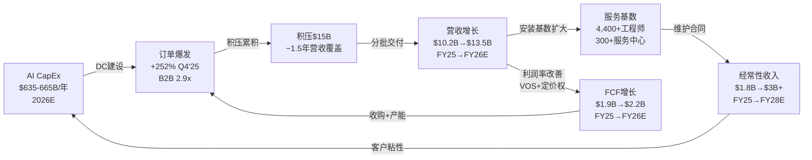
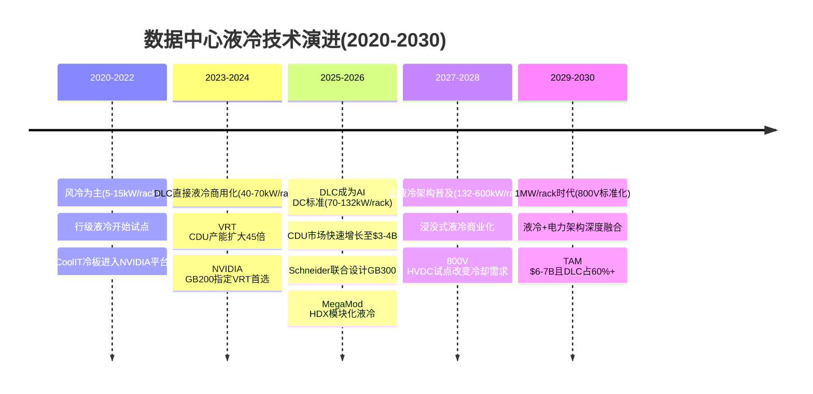
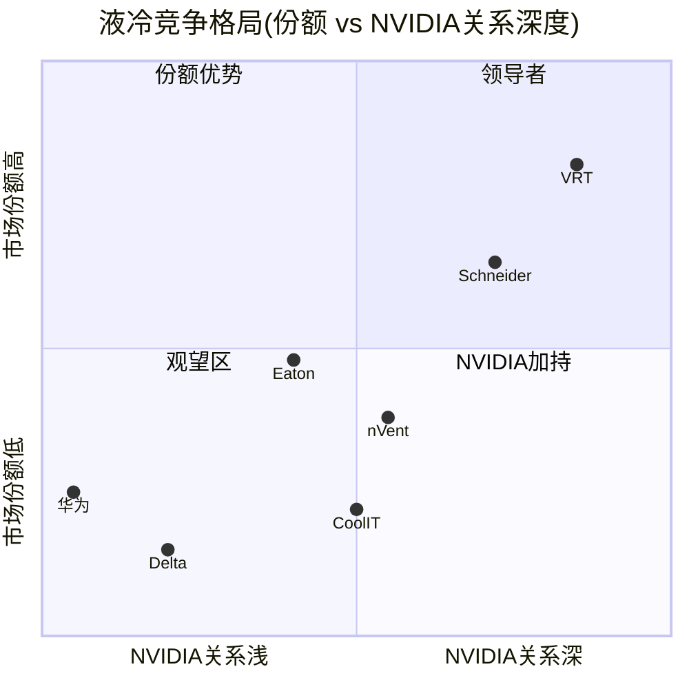
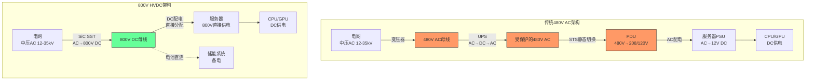
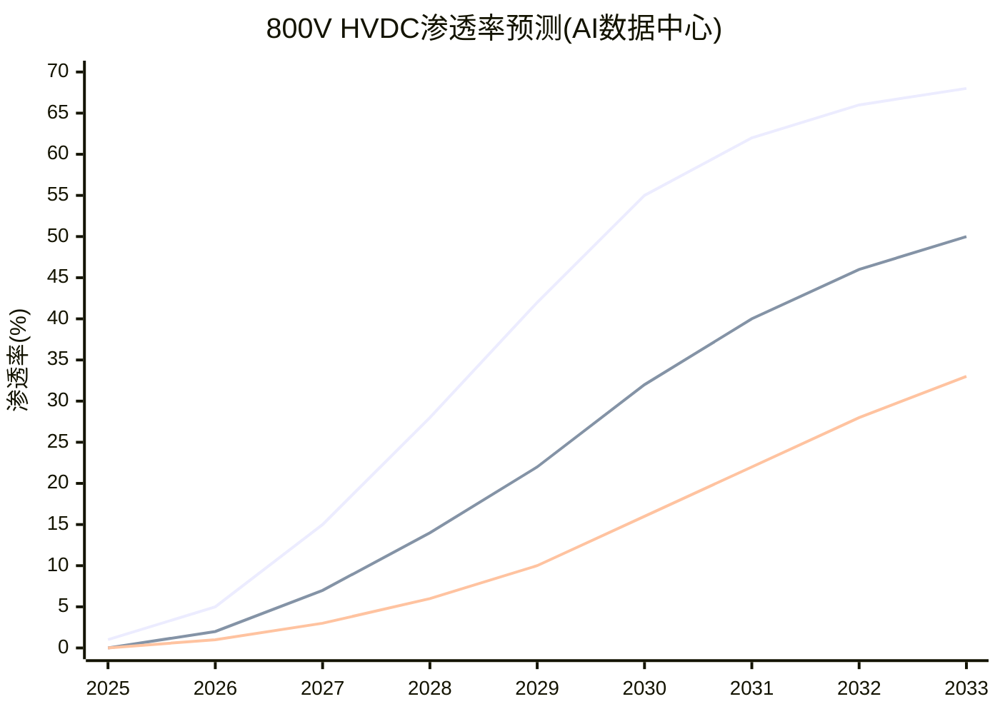

# VRT Phase 1 扩展章节 B (第四、五、六章)

> **数据截止**: FY2025 (2025-12-31) | Q4'25已发布 (2026-02-11)
> **股价**: $243.06 | 市值: $930亿
> **核心主线**: 传统工业品(85%) vs AI基础设施(15%) — 市场以PE 46x为全部定价

---

# 第四章：收入结构与增长引擎深度分析

## 4.1 收入驱动力的三层拆解

理解Vertiv收入结构需要穿透报表层面的"产品vs服务"二分法，向下追溯至业务本质。VRT的收入驱动力存在三个分析层级，每一层揭示不同的投资含义。

### Level 1：产品 vs 服务——报表可见层

[硬数据:]

| 项目 | FY2025 | FY2024 | FY2023 | FY2022 | FY25 YoY | FY22-25 CAGR |
|------|--------|--------|--------|--------|:--------:|:------------:|
| **产品收入** | $8,391M | $6,370M(e) | $5,500M(e) | $4,544M(e) | +32% | +23% |
| **服务收入** | $1,839M | $1,642M(e) | $1,363M(e) | $1,148M(e) | +12% | +17% |
| **合计** | $10,230M | $8,012M | $6,863M | $5,692M | +28% | +22% |
| 产品占比 | 82.0% | ~79.5% | ~80.1% | ~79.8% | — | — |
| 服务占比 | 18.0% | ~20.5% | ~19.9% | ~20.2% | — | — |

**结构性趋势**：产品占比从FY22的~80%跳升至FY25的82%，看似微小的2个百分点实际上反映了一个关键动态——AI基础设施超级周期中，**硬件交付的加速度远超服务合同的签约节奏**。服务收入的增长本质上是"安装基数的函数"，每一台CDU、每一套UPS交付后，需要6-12个月才能签订维护合同，再需要12-24个月才能进入"年度经常性收入"的稳态。因此，FY25产品收入+32%与服务收入+12%之间的20个百分点增速差距，恰恰是健康的——它预示着FY27-FY28服务收入将因安装基数爆发而迎来加速增长。

[合理推断:] 以FY25产品交付$8.4B对应的设备安装量估算，每年新增安装设备的维护合同价值约为产品价格的8-12%。这意味着FY25新增安装的设备将在未来3-5年内为服务业务带来约$670-1,010M的年化增量收入。服务收入有望在FY27-FY28恢复至22-25%占比。

### Level 2：电力管理 vs 热管理——业务本质层

VRT未在财报中直接披露电力与热管理的收入拆分，但通过产品线描述、行业数据和管理层评论可以进行合理估算：

[合理推断:]

| 业务板块 | FY2025估计营收 | 占比 | 核心产品 | 增长驱动 |
|---------|:------------:|:----:|---------|---------|
| **电力管理** | ~$5,800-6,200M | ~57-61% | UPS/配电/变压器/PDU/电池 | 数据中心扩容+电力密度提升 |
| **热管理** | ~$2,800-3,200M | ~27-31% | 精密空调/CDU/液冷/行级冷却 | AI驱动的风冷→液冷转换 |
| **集成方案+服务** | ~$1,200-1,400M | ~12-14% | 模块化DC/DCIM/生命周期服务 | 安装基数扩大+交钥匙需求 |

估算逻辑：
1. UPS是VRT的传统核心。全球数据中心UPS市场2025年约$88亿(Dell'Oro)，VRT份额15-18%，对应$1.3-1.6B。加上配电/变压器/PDU/电池，电力管理板块合理估计在$5.8-6.2B区间。
2. 热管理方面，VRT在全球数据中心冷却市场份额约20-25%(Omdia引用23.5%为冷却总市场)，2025年冷却市场约$210亿但VRT仅覆盖精密温控部分(非暖通空调)，估算VRT可及冷却市场~$130亿，20-25%份额对应$2.6-3.3B。
3. 管理层在FY25 Q4电话会指出液冷订单"超过预期"且CDU产能扩张45倍，暗示液冷相关营收快速增长但仍是热管理板块的一部分。

**电力管理的隐含风险**：电力管理占VRT营收约60%，其中UPS+配电是核心中的核心。这正是800V HVDC架构在长期可能颠覆的业务——如果800V在2030-2032年渗透至30-50%的AI数据中心，VRT电力管理板块将面临$1.5-2.5B的收入替代风险（详见第六章）。

### Level 3：传统业务 vs AI增量——增长逻辑层

这是理解VRT估值争议的最关键拆分层：

[合理推断:]

| 业务类型 | FY2025估计 | 占比 | FY2023估计 | 增速特征 | 估值锚定 |
|---------|:---------:|:----:|:---------:|---------|---------|
| **传统业务** | ~$8,700M | ~85% | ~$6,500M | 稳定增长(10-15% CAGR) | 工业品PE 25-30x |
| **AI增量** | ~$1,530M | ~15% | ~$360M | 爆发增长(60-100%+) | AI基础设施PE 40-60x |
| 合计 | $10,230M | 100% | $6,863M | +28% | 市场给予PE 46x |

[主观判断:] **这两种业务的增长逻辑存在本质区别**。传统业务的增长是"归纳型"——可以通过历史数据中心建设速度、设备更换周期(15-20年)、IT设备功耗增长趋势进行外推，年化增长10-15%有高确信度。AI增量的增长则是"演绎型"——取决于AI CapEx周期的持续性、GPU功率密度的提升路径、液冷渗透率的S曲线位置等前瞻变量，年化增长50-100%+的假设缺乏历史锚点。

**核心矛盾的数学表达**：如果市场对VRT的PE 46x估值进行SOTP(分部估值)分解——
- 传统业务$8,700M × PE 28x(Schneider水平) = 隐含市值约$3,070M净利润对应(按OPM 18%、税率22%估算净利润$1,220M) → ~$34.2B
- AI增量$1,530M需对应的隐含市值 = $93B - $34.2B = ~$58.8B
- 这意味着市场给AI增量业务隐含估值约38x Revenue(!)——接近NVIDIA本身的PS估值水平

这个SOTP计算揭示了当前估值的极度紧张：**15%的AI业务承担了63%的市值**。

## 4.2 订单分析深度

### Q4'25有机订单+252%的驱动拆分

[硬数据:] Q4'25有机订单增长+252%是VRT历史上最强的单季度表现，也是数据中心基础设施行业有史以来最高的单季增速之一。

[合理推断:] 订单驱动力拆解(基于管理层评论+行业信息推理)：

| 驱动因素 | 估计贡献占比 | 逻辑 |
|---------|:----------:|------|
| **NVIDIA Blackwell/GB200大规模部署订单** | ~40-50% | 超大规模客户为2026-2027年GB200部署提前锁定液冷+电力基础设施 |
| **新建AI数据中心项目(非NVIDIA特定)** | ~25-30% | Meta/Amazon/Microsoft等超大规模客户在全球新建AI DC，需要全套电力+冷却 |
| **传统数据中心更新换代** | ~10-15% | 15-20年设备寿命到期更换，受益于2005-2010年建设潮的设备进入替换周期 |
| **地理扩张(亚太新DC)** | ~5-10% | 印度/东南亚/中东等新兴DC市场的基础设施需求 |
| **模块化DC(MegaMod)** | ~5% | 2026年1月发布的MegaMod HDX开始接受预定 |

### Book-to-Bill 2.9x的历史维度

[硬数据:] VRT Q4'25的Book-to-Bill(B2B)比率达到2.9x，意味着接收到的订单金额是同期交付收入的2.9倍。

| 公司 | 行业 | 历史最高B2B | VRT相对位置 |
|------|------|:----------:|:---------:|
| VRT Q4'25 | DC基础设施 | **2.9x** | — |
| ASML 2023峰值 | 半导体设备 | ~2.5x | VRT超越 |
| LRCX 2021峰值 | 半导体设备 | ~1.6x | VRT远超 |
| Caterpillar 2022峰值 | 重型机械 | ~1.4x | VRT远超 |
| Eaton 2025 DC部门 | 电力管理 | ~1.8x(e) | VRT远超 |

[主观判断:] B2B 2.9x在工业品历史中几乎前所未见。即使是在2021-2022年半导体设备超级周期的峰值，ASML的B2B也仅达到~2.5x。VRT的2.9x暗示两种可能：(1)AI基础设施需求确实史无前例地强劲；(2)部分订单存在"恐慌性下单"因素——客户因担心变压器/CDU交期过长而提前锁定产能，实际需求可能低于名义订单。历史经验表明，极端B2B比率往往是周期峰值信号，但AI CapEx的结构性特征可能使这一次不同。

### 订单到收入的转化周期

[合理推断:]

| 产品类型 | 平均提前期 | 交付周期 | 收入确认时点 |
|---------|:---------:|:------:|:----------:|
| 标准UPS | 8-16周 | 短 | 交付即确认 |
| 定制化配电系统 | 16-32周 | 中 | 安装验收后 |
| CDU(液冷) | 20-40周 | 中 | 交付+调试后 |
| 模块化数据中心(MegaMod) | 6-18个月 | 长 | 里程碑确认 |
| 大型交钥匙项目 | 12-24个月 | 长 | 按完工百分比 |

**交付瓶颈**：变压器(交期长达128周/2.5年)是当前最严重的交付瓶颈。VRT在2025年Q4电话会上确认变压器短缺影响了部分订单的交付节奏。这意味着$15B积压中的一部分不是因为"VRT产能不足"，而是因为"上游变压器供应受限"。

## 4.3 积压订单$15B深度分析

### 积压构成估算

[合理推断:] VRT未披露积压的产品线拆分，但基于订单增长驱动力和产品交付周期，可以估算：

| 积压构成 | 估计占比 | 金额估计 | 增长驱动 | 转化时间 |
|---------|:-------:|:-------:|---------|:-------:|
| **传统UPS/配电** | ~40-50% | $6.0-7.5B | 新建DC+替换周期 | 6-18个月 |
| **液冷/CDU** | ~20-25% | $3.0-3.75B | NVIDIA Blackwell部署 | 4-12个月 |
| **模块化DC** | ~15-20% | $2.25-3.0B | MegaMod HDX+交钥匙 | 12-24个月 |
| **服务合同** | ~10-15% | $1.5-2.25B | 多年维护+远程监控 | 12-60个月(分期) |

### 积压质量评估

**取消条款分析**：

[合理推断:] 数据中心基础设施订单通常采用以下合同条款结构：
- **超大规模客户(~50%积压)**：定制化产品+预付款10-30%+取消罚金10-20%。取消成本相对高，但超大规模客户的议价能力意味着罚金条款可能偏低
- **托管/Colo客户(~25%积压)**：标准化产品+预付款较低+取消罚金5-10%。取消灵活度更高
- **企业/政府客户(~15%积压)**：标准合同+退出条款明确。取消概率低但单笔金额小
- **服务合同(~10%积压)**：年度续约型，取消几乎无成本但续约率历史>90%

**客户分布风险**：前5大客户(推测为AWS/Azure/Google/Meta/Equinix)可能贡献$15B积压中的40-50%，即$6-7.5B。如果其中任一客户大幅削减AI CapEx，将直接冲击积压质量。

### 历史积压转化率

[硬数据:]

| 年份 | 年初积压(e) | 当年营收 | 新增订单(e) | 年末积压 | 隐含转化率(e) |
|------|:---------:|:------:|:---------:|:------:|:-----------:|
| FY2023 | ~$5.0B | $6,863M | ~$7.8B(e) | ~$5.9B(e) | ~88% |
| FY2024 | ~$5.9B | $8,012M | ~$9.3B(e) | $7,177M | ~86% |
| FY2025 | $7,177M | $10,230M | ~$18.1B(e) | $15,000M | ~85% |

[主观判断:] 转化率从88%逐年下降至85%值得警惕。这种下降有两种解释：(1)积极解释——长周期项目(MegaMod、大型交钥匙)占比增加，拉低单年转化率但不影响最终交付；(2)消极解释——部分订单确实存在延期或变更风险，尤其是变压器瓶颈导致的被动延期。两种解释可能同时成立。

### 积压≠收入的五大风险因素

| 风险因素 | 影响估计 | 概率 | 时间框架 |
|---------|:-------:|:----:|:------:|
| **变压器瓶颈** | 延迟$1-2B交付(非取消) | 高(60%) | FY26-27 |
| **客户取消/延期** | 取消$750M-1.5B(5-10%) | 中(25%) | FY26-27 |
| **供应链延迟(SiC/铜)** | 延迟$500M-1B | 中(30%) | FY26 |
| **技术换代(GB200→GB300)** | 订单变更$500M-1B | 中低(20%) | FY27 |
| **支付条件恶化** | 影响现金流(非营收) | 低(15%) | 持续 |

[主观判断:] 综合评估，$15B积压中约$12-13B(80-87%)将在未来18-24个月内转化为收入，$1.5-2B可能延期但最终交付，$500M-1B存在实质性取消风险。这意味着积压对FY26-FY27的收入支撑依然强劲，但不应天真地将$15B等同于"锁定收入"。

## 4.4 递延收入$1,815M深度分析

[硬数据:]

| 指标 | FY2025 | FY2024 | FY2023 | FY2022 | FY22-25 CAGR |
|------|--------|--------|--------|--------|:------------:|
| 递延收入 | $1,815M | $1,063M | $639M | $359M | **72%** |
| 递延/营收比 | 17.7% | 13.3% | 9.3% | 6.3% | — |
| 递延/积压比(e) | 12.1% | 14.8% | ~10.8% | ~7.2% | — |
| 递延YoY增长 | +71% | +66% | +78% | — | — |

**递延收入增长轨迹解读**：FY22至FY25的72% CAGR远超营收增长(22% CAGR)，这个差异有深刻含义：

1. **预付款比例上升信号**：递延/营收比从6.3%跃升至17.7%，意味着客户在下单时预付的比例显著增加。这通常出现在两种场景：(a)产品供不应求，供应商要求更高预付款以锁定产能——对VRT有利；(b)长周期大型项目(模块化DC)占比增加，合同结构要求里程碑付款——中性信号。
2. **收入确认节奏变化**：$1,815M递延收入相当于VRT约2.1个月的营收。这些收入"已收款但未交付"，将在未来6-18个月逐步确认。这为FY26收入提供了额外的确定性缓冲。
3. **对现金流的正面影响**：递延收入本质上是"客户提前为VRT融资"。FY25自由现金流$1,894M中，递延收入增加$752M(YoY)贡献了约40%。这个现金流质量需要注意——如果未来递延收入增速放缓(增长曲线平坦化)，FCF将面临逆风。

[主观判断:] 递延收入的爆发性增长是VRT"供不应求"地位的最直接证据，也是其定价权的量化体现。但投资者需要区分"一次性预付款推动的递延收入增长"和"可持续的合同结构升级"——如果是前者，递延收入增速将在FY26-27回落至20-30%。

## 4.5 五大增长引擎排序

[合理推断:]

| 排序 | 增长引擎 | 当前贡献 | 驱动逻辑 | 3年展望 | 风险评级 |
|:---:|---------|:------:|---------|:------:|:------:|
| **#1** | AI CapEx超级周期 | ★★★★★ | 超大规模客户2026E CapEx $635-665B，同比+67%。每$1B DC CapEx中电力+冷却占~25-30%，即$250-300M → VRT捕获~20% | 主引擎。但2028后增速可能放缓至10-15% | ★★★★ |
| **#2** | 液冷渗透率提升 | ★★★★ | AI GPU功耗提升(H100 700W→B200 1000W→Rubin 1200W+)使液冷从可选变为必须。液冷TAM从$3B→$6-7B(2030) | 从$1.5B→$3-4B(FY28E)。VRT份额是关键变量(70%→40-60%) | ★★★★ |
| **#3** | 利润率扩张(VOS) | ★★★ | VOS精益体系驱动毛利率从24.6%(FY22)→34.4%(FY25)。产品组合向高端转移+规模效应+定价权 | Adj.OPM从20.4%→25%+。但基数效应使边际改善空间收窄 | ★★ |
| **#4** | 地理扩张 | ★★ | 印度($1,000亿DC投资规划)、东南亚(马来西亚柔佛新厂)、中东(沙特NEOM等)。亚太FY25有机+18.2% | 亚太占比从20%→25-28%。EMEA持续疲软是对冲 | ★★★ |
| **#5** | 服务收入放大 | ★ | 安装基数倍增(FY22→FY25产品交付累计~$25B+)。每台设备带来多年维护合同。经常性收入属性 | 服务营收从$1.8B→$3B+(FY28E)。滞后效应意味着贡献主要在FY27后 | ★ |

## 4.6 收入来源飞轮

## 4.7 增长引擎的相互作用与风险共振

五大增长引擎并非独立运行，它们之间存在复杂的正反馈和风险共振关系：

**正反馈链**：AI CapEx → 液冷渗透(AI需要液冷) → 利润率扩张(液冷产品ASP和毛利率更高) → FCF增加 → 收购能力增强(PurgeRite $10亿) → 产品线扩张 → 更多订单。这个飞轮在2024-2025年处于加速阶段。

**风险共振矩阵**：

| | AI CapEx放缓 | 液冷份额下降 | 利润率见顶 | 地理风险 |
|--|:----------:|:----------:|:---------:|:------:|
| **AI CapEx放缓** | — | 连锁(液冷需求减少) | 连锁(产能利用率降低) | 部分对冲(非AI地理扩张) |
| **液冷份额下降** | 加剧(AI营收双降) | — | 连锁(产品组合恶化) | 无关 |
| **利润率见顶** | 独立 | 轻微加剧 | — | 无关 |
| **地理风险** | 无关 | 无关 | 无关 | — |

[主观判断:] 最危险的共振组合是"AI CapEx放缓 + 液冷份额下降"——这相当于VRT的增长引擎#1和#2同时熄火。概率估计15-20%，但一旦发生，VRT的增速将从25-30%骤降至5-10%，PE从46x压缩至28-32x，对应股价下跌35-45%。这个尾部风险是当前估值需要面对的核心问题。

**增长引擎的时间序列展望**：

| 引擎 | FY26 | FY27 | FY28 | FY30 | 长期确定性 |
|------|:----:|:----:|:----:|:----:|:---------:|
| AI CapEx | ★★★★★ | ★★★★ | ★★★ | ★★ | 中低(周期性) |
| 液冷渗透 | ★★★★★ | ★★★★ | ★★★★ | ★★★ | 中高(物理必然) |
| 利润率扩张 | ★★★★ | ★★★ | ★★★ | ★★ | 中(基数效应) |
| 地理扩张 | ★★★ | ★★★ | ★★★ | ★★★★ | 中高(结构性) |
| 服务放大 | ★★ | ★★★ | ★★★★ | ★★★★★ | 高(安装基数驱动) |

[主观判断:] 增长引擎的接力时序是：FY26-27由AI CapEx和液冷渗透主导 → FY28-29利润率扩张和地理扩张接棒 → FY30+服务收入成为最大的增长贡献者。如果接力成功，VRT可以实现从"周期性高增长"到"稳定复合增长"的转型。如果AI CapEx在FY28放缓时服务收入尚未达到临界规模，增速将出现一个明显的"接力断档"。

## 4.8 收入预测情景分析

基于上述分析，构建三种收入预测情景：

| 指标 | FY25(实际) | FY26E | FY27E | FY28E | FY30E |
|------|:---------:|:-----:|:-----:|:-----:|:-----:|
| **乐观**(AI CapEx持续+液冷份额维持) | $10,230M | $14,000M | $17,500M | $20,000M | $24,000M |
| **基准**(AI CapEx增速放缓+液冷份额渐降) | $10,230M | $13,500M | $15,500M | $17,000M | $19,000M |
| **悲观**(AI CapEx断崖+液冷份额快速流失) | $10,230M | $12,500M | $12,800M | $13,000M | $14,000M |
| 管理层FY26指引 | — | $13,250-13,750M | — | — | — |

[合理推断:] 基准情景下的FY25-FY30 CAGR约13%，远低于市场对PE 46x公司的隐含增速要求(~20%+)。这意味着：如果AI CapEx增速在FY28后回归正常化(10-15% YoY)，VRT的增速将无法支撑当前估值——PE需要从46x压缩至32-36x才能匹配13%的复合增长率。

## 4.9 本章核心发现

1. **产品vs服务的增速差(+32% vs +12%)是健康信号而非警告**——服务收入将在FY27-FY28因安装基数爆发而加速，预计届时服务占比回升至22-25%
2. **SOTP估值揭示AI溢价的极端程度**——15%的AI业务承担63%的市值，隐含AI增量业务估值38x Revenue
3. **B2B 2.9x在工业品历史中罕见**——需要警惕"恐慌性下单"因素，但AI CapEx的结构性特征提供了支撑
4. **积压$15B中约80-87%将转化为收入**——但不应将$15B等同于"锁定收入"，$1.5-3B存在延期或取消风险
5. **递延收入72% CAGR是定价权的量化证据**——但其对FCF的40%贡献意味着增速放缓时将产生现金流逆风

---

# 第五章：液冷技术与竞争深度分析

## 5.1 液冷技术原理：从物理学出发

### 风冷 vs 液冷的物理学基础

数据中心冷却的本质是热传递。理解液冷技术革命需要回到基本物理概念：

[硬数据:]

| 物理参数 | 空气 | 水 | 工程冷却液(如3M Novec) | 水的倍数 |
|---------|:---:|:---:|:------------------:|:-------:|
| **比热容** (J/kg·K) | 1,005 | 4,186 | 1,100-1,300 | 4.2x |
| **热导率** (W/m·K) | 0.026 | 0.606 | 0.060-0.070 | 23.3x |
| **密度** (kg/m³) | 1.2 | 998 | 1,380-1,600 | 832x |
| **体积热容量** (kJ/m³·K) | 1.2 | 4,178 | 1,518-2,080 | 3,482x |

**关键洞察**：水的体积热容量是空气的约3,500倍——这意味着移走相同热量，水的体积流量只需空气的1/3,500。这就是液冷从物理上优于风冷的根本原因。当单机架功耗从5kW升至100kW+时，风冷需要的气流量在物理上变得不可行(噪音、空间、能耗均超出合理范围)。

### 三种液冷技术深度对比

[硬数据:]

| 维度 | 行级液冷(Rear Door) | DLC直接液冷(冷板式) | 浸没式液冷 |
|------|:------------------:|:-----------------:|:---------:|
| **原理** | 冷却液在机架后门热交换器中循环，带走服务器排出的热空气 | 冷却液通过冷板直接接触CPU/GPU芯片表面，带走热量 | 服务器完全浸没在介电冷却液中 |
| **散热能力** | 30-60 kW/rack | 80-200 kW/rack | 200+ kW/rack |
| **PUE** | 1.2-1.3 | 1.05-1.15 | 1.02-1.08 |
| **改造难度** | 低(可后装) | 中(需定制服务器主板) | 高(需全新服务器设计) |
| **单机架成本** | $5K-15K增量 | $15K-40K增量 | $50K-100K增量 |
| **成熟度** | 成熟 | **快速成熟(当前主力)** | 早期商用 |
| **适用场景** | 过渡方案/混合部署 | NVIDIA GB200/B200标准方案 | 超高密度/特殊场景 |
| **关键供应商** | nVent, CoolIT | **VRT**, Schneider, CoolIT | GRC, LiquidCool, Submer |
| **NVIDIA关联** | 非首选 | **GB200参考架构** | 长期备选 |

**CDU(冷却液分配单元)在DLC系统中的核心角色**：

CDU是DLC系统的"心脏"。它的功能是：
1. 将设施侧的冷却水(一次回路)与服务器侧的冷却液(二次回路)进行热交换
2. 精确控制二次回路的温度、压力、流量
3. 过滤和监控冷却液质量(防止腐蚀/堵塞)
4. 在一个典型的AI数据中心中，每200-400kW服务器功率需要一台CDU

[合理推断:] CDU之所以成为液冷竞争的焦点，是因为它是DLC系统中技术含量最高、单价最贵(~$150-200K)、且与NVIDIA参考架构绑定最深的组件。冷板可以由多家供应商提供(CoolIT、Boyd等)，但CDU需要与整个液冷系统的控制逻辑深度集成。

## 5.2 VRT液冷产品矩阵

### Liebert XDU 1350 — 当代旗舰

[硬数据:]

| 规格 | 参数 |
|------|------|
| 散热能力 | 最高1,350 kW |
| 适配机架密度 | 70-132+ kW/rack |
| 尺寸 | 标准19"机架尺寸，可安装在行级 |
| 冷却液类型 | 去离子水/丙二醇混合液 |
| 单价(估计) | $150,000-200,000 |
| 目标客户 | NVIDIA GB200 NVL72部署 |
| 产能 | FY25 CDU产能扩大45倍(vs FY24) |
| 市场地位 | NVIDIA GB200参考架构首选CDU |

### MegaMod HDX — 下一代平台(2026年1月发布)

| 版本 | Compact | Combo |
|------|---------|-------|
| 机架容量 | 13个 | 144个 |
| 最大功率 | 1.25 MW | 10 MW |
| 冷却方式 | 全液冷(DLC) | 液冷+电力集成 |
| 部署方式 | 模块化/预制 | 模块化/交钥匙 |
| 目标客户 | 中小型AI集群/边缘 | 超大规模AI数据中心 |
| 交付周期(预估) | 12-16周 | 6-12个月 |

[合理推断:] MegaMod HDX的战略意义在于将VRT从"组件供应商"(卖CDU)升级为"系统集成商"(卖整套液冷基础设施)。Combo版10MW的规模对应约75-100个AI机架，单套价值可能在$3-5M——比单台CDU($150-200K)高出15-25倍。如果MegaMod HDX在FY26-27获得大规模订单，VRT的单客户价值将显著提升。

### 收购布局

| 收购 | 时间 | 金额 | 目标 | 战略意义 |
|------|------|------|------|---------|
| CoolTera | 2024 | 未披露(小型) | 液冷IP/专利 | 补齐冷板技术短板 |
| PurgeRite | 2025.Q4 | ~$10亿 | 流体管理 | 液冷系统中冷却液纯化、去气、监控——关键维护能力 |

[合理推断:] PurgeRite收购($10亿)是VRT液冷战略的关键拼图。液冷系统的长期运营(而非一次性安装)需要持续的冷却液管理——去除溶解气体、过滤杂质、监控化学性质。PurgeRite的技术使VRT能够提供"液冷全生命周期服务"，而非仅仅卖硬件。这与VRT从"产品公司"向"产品+服务平台"转型的战略一致。

### 产能扩张版图

| 工厂/基地 | 地点 | 产品 | 状态 | 产能影响 |
|----------|------|------|------|---------|
| CDU主线扩产 | 美国俄亥俄 | XDU系列 | 45x扩产完成 | FY25核心产能 |
| Pelzer工厂扩建 | 美国南卡 | 液冷+电力设备 | 2025-2026扩建中 | FY26-27增量 |
| 柔佛新厂 | 马来西亚 | CDU+模块化DC | 2026 Q1投产 | 亚太产能覆盖 |
| 意大利工厂 | 欧洲 | UPS+配电 | 运营中 | EMEA服务 |
| 印度工厂 | 浦那/钦奈(e) | 本地化产品 | 运营中 | 印度市场 |

## 5.3 NVIDIA生态系统联盟深度

### GB200 NVL72参考架构中VRT的角色

[硬数据:] NVIDIA在2024年发布的GB200 NVL72参考架构中，VRT提供了以下核心组件：
- **CDU**(冷却液分配单元)——Liebert XDU系列
- **电力分配**(PDU/母线槽)
- **机房级冷却**(精密空调/行级冷却，用于非液冷区域)

VRT在首批GB200 CDU出货中占**70%+份额**。

### 参考架构的"锁定效应"

[合理推断:] NVIDIA参考架构的锁定效应来自三个维度：

1. **技术认证成本**：进入NVIDIA参考架构需要通过严格的兼容性测试(热性能、可靠性、电磁兼容等)。认证过程通常需要6-12个月，且NVIDIA对测试环境有严格要求。一旦通过认证，NVIDIA不会频繁更换——因为每次更换都需要重新认证。

2. **系统集成深度**：CDU不是独立运行的设备，它需要与NVIDIA的BMC(基板管理控制器)通信，根据GPU负载动态调节冷却液流量和温度。VRT的CDU控制算法已与GB200的功率管理系统深度集成，这种软件层面的耦合比硬件更难替代。

3. **部署惯性**：一旦超大规模客户基于VRT CDU部署了第一批GB200机架，后续扩容倾向于使用相同供应商——避免维护复杂性(两种CDU需要两套维护流程)和备件库存问题。

### GB300/Rubin换代的竞争风险

[硬数据:] Schneider Electric已宣布与NVIDIA联合设计GB300(Rubin平台)的液冷参考架构。这是VRT液冷业务面临的最具体的竞争威胁。

[合理推断:] NVIDIA每代平台的供应商选择模式分析：

| 平台 | 时间 | 液冷首选 | 选择逻辑 |
|------|------|---------|---------|
| DGX A100 (Ampere) | 2020 | 风冷为主/CoolIT冷板 | 液冷尚非必须 |
| DGX H100 (Hopper) | 2022 | CoolIT冷板+多供应商CDU | 液冷开始渗透 |
| GB200 NVL72 (Blackwell) | 2024 | **VRT CDU首选(70%+)** | 大规模DLC部署元年 |
| GB300 (Rubin) | 2026H2 | **Schneider联合设计** | 竞争加剧/多元化 |
| Rubin Ultra | 2027+ | ? | 800V HVDC可能改变格局 |

[主观判断:] NVIDIA的供应商策略不是"赢者通吃"而是"多元化中有倾斜"。GB200阶段VRT拿到70%+份额，部分原因是VRT是唯一具备大规模CDU产能的供应商。到GB300时代，Schneider(收购Motivair)和Eaton(收购Boyd)都具备了规模化液冷能力，NVIDIA有动力培养多供应商以降低供应链风险和议价筹码。最可能的结果是：**GB300时代VRT份额从70%降至40-50%，与Schneider形成双寡头**。

## 5.4 液冷市场竞争矩阵

[合理推断:]

| 公司 | 技术路线 | 核心产品 | NVIDIA关系 | CDU产能(估) | 市场份额(e) | 收购动作 |
|------|---------|---------|:----------:|:----------:|:----------:|---------|
| **VRT** | DLC(冷板)+CDU全栈 | XDU 1350, MegaMod HDX | GB200首选(70%+) | 高(45x扩产) | ~35-40% | CoolTera, PurgeRite($10亿) |
| **Schneider** | DLC+行级+浸没(多路线) | Galaxy CL, EcoStruxure Liquid | GB300联合设计 | 中高(快速扩产中) | ~20-25% | Motivair(液冷) |
| **Eaton** | DLC(冷板)+热管理 | Boyd品牌产品线 | 合作但非首选 | 中(Boyd整合中) | ~10-15% | Boyd($95亿) |
| **nVent** | 机柜级+DLC连接器 | NVent液冷解决方案 | 合作(1GW+部署) | 中 | ~8-12% | 有机发展 |
| **CoolIT** | 冷板DLC先驱 | 冷板+CDU | 早期合作伙伴 | 中低 | ~5-8% | 私营/可能被收购 |
| **Delta** | CDU+电力集成 | Delta InfraSuite | 亚洲为主 | 中(亚洲成本优势) | ~3-5%(北美低) | 有机+亚洲并购 |
| **Rittal** | 机柜+冷却 | LCP系列 | 有限 | 低 | ~2-3% | 有机 |
| **华为数字能源** | 全栈(电力+冷却) | FusionCol系列 | 无(地缘限制) | 高(中国) | ~5-8%(中国高,西方低) | 有机 |

## 5.5 液冷护城河五维度评估

[主观判断:]

| 维度 | 评分 | 分析 | 持久性 | 脆弱性 |
|------|:----:|------|:-----:|--------|
| **NVIDIA Design-in** | 4.5/5 | GB200首选70%+份额，参考架构锁定效应强。认证+系统集成+部署惯性三重锁定 | **中**(每代平台可能重新选择) | GB300 Schneider联合设计是直接威胁。如果Rubin也非VRT首选，优势将实质性削弱 |
| **产能规模** | 4.0/5 | CDU产能45x扩产，领先竞对12-18个月。柔佛+Pelzer扩建继续加码 | **中低**(产能差距正在缩小) | Schneider+Eaton合计收购金额超$100亿，资金实力不亚于VRT。产能差距可能在18-24个月内消除 |
| **安装基数+服务** | 4.0/5 | 300+服务中心，4,400+工程师，覆盖全球。每台安装CDU带来5-10年维护关系 | **高**(存量设备的服务是粘性收入) | 液冷服务的技术壁垒低于安装——PurgeRite收购提升了壁垒但非不可逾越 |
| **全栈集成** | 3.5/5 | VRT同时提供电力+冷却+DCIM——"一个供应商解决全部基础设施"。MegaMod HDX将集成度推向极致 | **高**(系统复杂性是天然壁垒) | Schneider也有全栈能力(EcoStruxure平台)。Eaton通过Boyd补齐冷却后也接近全栈 |
| **技术专利** | 3.0/5 | CoolTera收购带来液冷IP，PurgeRite带来流体管理专利。VRT总专利组合可观 | **中**(专利保护期有限，且液冷是快速迭代领域) | 液冷核心技术(冷板、CDU热交换)的专利壁垒较低，工程know-how比专利更重要 |
| **综合评分** | **3.8/5** | 强先发优势+NVIDIA锁定+产能领先 | **取决于GB300竞标结果** | 如果GB300首选地位丢失，综合评分降至2.5-3.0/5 |

## 5.6 液冷市场TAM与份额演变

[合理推断:]

| 年份 | 液冷TAM | DLC占比 | VRT份额(乐观) | VRT份额(基准) | VRT份额(悲观) |
|------|:------:|:------:|:------------:|:------------:|:------------:|
| 2024 | ~$1.5B | ~20% | 60% | 50% | 40% |
| 2025 | ~$3.0B | ~30% | 55% | 40% | 30% |
| 2026 | ~$4.0B | ~40% | 50% | 38% | 25% |
| 2028 | ~$5.5B | ~50% | 45% | 35% | 22% |
| 2030 | ~$6-7B | ~60%+ | 40% | 30% | 18% |

[主观判断:] 对应VRT液冷营收预测：

| 情景 | FY25液冷营收(e) | FY28液冷营收(e) | FY30液冷营收(e) | CAGR |
|------|:-----------:|:-----------:|:-----------:|:----:|
| **乐观**(GB300首选+份额维持) | ~$1.2B | ~$2.5B | ~$2.8B | ~18% |
| **基准**(双寡头+份额渐降) | ~$1.2B | ~$1.9B | ~$2.0B | ~11% |
| **悲观**(GB300失去首选+份额快速流失) | ~$1.2B | ~$1.2B | ~$1.2B | ~0% |

基准情景下，液冷业务从FY25的~$1.2B增长至FY30的~$2.0B(+67%)，但由于份额从40%降至30%，增速远低于市场整体增速。这意味着**液冷TAM增长部分被份额流失抵消**。

## 5.7 液冷技术演进路线图

## 5.8 液冷竞争格局定位图

## 5.9 液冷经济性分析：从组件到系统

理解液冷竞争不仅需要看技术和份额，更需要看经济性——谁能在相同散热效果下提供更低的TCO(总拥有成本)。

### 液冷系统TCO拆解(以10MW AI数据中心为例)

[合理推断:]

| 成本项 | 风冷方案 | DLC液冷方案(VRT) | 液冷 vs 风冷 | 占TCO比例 |
|--------|:------:|:--------------:|:----------:|:---------:|
| **初始设备** | $2.5-3.0M | $3.5-4.5M | +40-50% | 30-35% |
| 其中: CDU | 无 | $600K-800K(4台@$150-200K) | 新增 | 6-8% |
| 其中: 冷板/管路 | 无 | $400-600K | 新增 | 4-6% |
| 其中: CRAC/CRAH | $1.2-1.5M | $300-500K(仅辅助) | -60-70% | 3-5% |
| 其中: UPS/PDU | $1.3-1.5M | $1.3-1.5M(不变) | 持平 | 12-15% |
| **安装集成** | $500K-800K | $800K-1.2M | +50-60% | 8-10% |
| **年运营电费**(PUE) | $1.05M(PUE 1.4) | $750K(PUE 1.08) | **-28%** | 55-60% |
| **年维护费** | $150K | $200K(冷却液+过滤) | +33% | 12-15% |
| **10年TCO** | **$18-20M** | **$14-16M** | **-20-25%** | — |

[主观判断:] 液冷方案的初始投资高出40-50%，但10年TCO因电费节省(每年$300K/10MW)而低20-25%。这个TCO优势在两种条件下会放大：(1)电价上涨——每度电涨$0.01，液冷方案的TCO优势增加约$60K/年/10MW；(2)功率密度提升——从70kW/rack到132kW/rack，风冷PUE恶化至1.6+而液冷PUE维持1.08-1.15。

这也解释了为什么超大规模客户率先采用液冷——他们的DC规模通常在50-200MW，TCO节省可达每年$1.5-6.0M，3年即可回收液冷初始投资溢价。

### VRT液冷产品的竞争定价能力

[合理推断:] VRT在液冷市场的定价策略面临一个微妙的平衡：

| 时期 | 定价策略 | 毛利率(估) | 逻辑 |
|------|---------|:---------:|------|
| **FY24-FY25**(供不应求) | 溢价定价 | 45-50% | CDU产能稀缺+NVIDIA参考架构锁定 → 客户几乎没有替代选择 |
| **FY26-FY27**(竞争加剧) | 维持/微降 | 40-45% | Schneider/Eaton产能上线，但需求增速仍高于供给增速 |
| **FY28-FY30**(供给充裕) | 竞争性定价 | 35-40% | 多供应商可选，TCO成为决策核心 → 价格战风险 |

[主观判断:] 液冷的高毛利率窗口可能只有2-3年(FY25-FY27)。随着Schneider和Eaton的产能释放，CDU将从"稀缺商品"变为"标准工业品"——类似于EV电池从2020年的供不应求到2024年的供过于求。VRT需要在高毛利窗口期内尽可能多地转化积压订单为收入，同时通过MegaMod HDX等系统级产品提升客户粘性和转换成本。

## 5.10 液冷行业收购潮的战略解读

2024-2025年液冷行业经历了一波密集的收购浪潮，这些收购行为本身就是市场信号：

[硬数据:]

| 收购方 | 标的 | 金额 | 时间 | 收购逻辑 | 倍数(EV/Rev估) |
|--------|------|:----:|:----:|---------|:-------------:|
| **Eaton** | Boyd Thermal Management | **$9.5B** | 2024.Q4 | 一次性获取液冷全栈能力 | ~15-20x |
| **Schneider** | Motivair | 未披露(~$500M估) | 2024 | 补齐CDU技术短板 | ~8-12x |
| **VRT** | PurgeRite | **~$1.0B** | 2025.Q4 | 液冷流体管理(运维层) | ~10-15x |
| **VRT** | CoolTera | 未披露(小型) | 2024 | 液冷IP/专利 | — |
| **nVent** | 有机投入 | ~$200-300M R&D | 持续 | 机柜级液冷自研 | — |

[主观判断:] 三个战略观察：

1. **Eaton的$95亿赌注是最大的信号**：Eaton不是一家冒险型公司——它以保守稳健著称。花$95亿(Eaton市值的~7%)收购Boyd，意味着Eaton的战略部门认为液冷市场的长期价值足以支撑这个价格。如果行业龙头之一认为液冷值得$95亿的赌注，那么VRT在液冷的先发优势确实具有实质价值。

2. **收购价格暗示的市场预期**：Eaton以约15-20x Revenue收购Boyd，这个倍数远超传统工业品交易(通常2-5x Revenue)。它隐含了液冷市场年化30%+增长的假设。如果液冷增速低于预期，这些收购将面临减值风险——同时也会降低竞对在液冷市场的激进程度。

3. **VRT的收购策略更聚焦**：VRT选择收购PurgeRite(流体管理)而非大型液冷公司，说明VRT对自身CDU核心技术有信心，更关注"液冷生态补全"而非"核心能力补齐"。这种策略的风险是——如果CDU核心技术被追赶，VRT缺乏后备方案。

## 5.11 液冷供应链风险地图

[合理推断:]

| 供应链环节 | 关键材料/零部件 | 供应风险 | 对VRT的影响 |
|----------|:------------:|:------:|:----------:|
| **铜管/铜板** | 冷板+管路核心材料 | 中(铜价波动) | 成本影响(铜占CDU BOM ~20%) |
| **冷却液** | 去离子水/丙二醇/工程流体 | 低 | 可替代性强 |
| **泵组** | 高可靠性循环泵 | 中低(多供应商) | 标准件，非瓶颈 |
| **温度传感器** | 精密温控核心 | 低 | 标准电子元器件 |
| **控制器/软件** | CDU控制逻辑+NVIDIA BMC接口 | **高(VRT自研)** | 核心差异化能力 |
| **快速连接器** | 液冷管路连接件(防泄漏) | 中(专业供应商有限) | nVent等控制关键接口 |

[主观判断:] 液冷供应链中最不可替代的环节不是硬件(铜管、泵组都是标准件)，而是**控制器软件和系统集成能力**——如何让CDU与NVIDIA BMC实时通信、根据GPU负载动态调节冷却、在故障时安全降级。这是VRT与纯硬件竞对(如Delta)的真正差异化点。PurgeRite收购强化了流体管理层面的能力，但控制器/软件层面的投入是VRT需要持续加码的方向。

## 5.12 本章核心发现

1. **液冷从物理学层面是不可逆的趋势**——水的体积热容量是空气的3,500倍，当机架功耗超过40kW时液冷不是可选而是必须
2. **CDU是液冷系统的"心脏"**，也是VRT在NVIDIA生态中最核心的锁定点。但锁定是代际的而非永久的——每代平台换代是重新竞标窗口
3. **GB300/Rubin换代(2026H2-2027)是VRT液冷业务的生死测试**——如果VRT维持首选地位，份额40-50%+可持续；如果丢失，份额可能迅速降至20-25%
4. **竞对已完成"买票入场"**——Schneider(Motivair)、Eaton(Boyd $95亿)、VRT(PurgeRite $10亿)的收购潮意味着2026年后液冷将是"有钱的巨头游戏"，技术差异化空间收窄
5. **液冷的高毛利率窗口可能只有2-3年(FY25-FY27)**——随着多供应商产能释放，CDU将从"稀缺商品"变为"标准工业品"
6. **VRT综合护城河评分3.8/5**——强先发但非不可替代，核心依赖GB300竞标结果
7. **控制器软件和系统集成是真正的差异化**——硬件可以被追赶，但NVIDIA BMC深度集成+冷却智能控制是VRT需要持续投入的护城河

---

# 第六章：800V HVDC架构——颠覆者还是被颠覆者

## 6.1 电力架构演变史

数据中心的电力架构经历了四代演变，每一代都在追求更高的效率和密度。理解这个演变史是评估800V HVDC对VRT影响的前提。

[硬数据:]

| 架构代际 | 时间线 | 电压/类型 | 效率(AC→DC) | 占地 | UPS角色 | VRT的定位 |
|---------|:-----:|:--------:|:----------:|:---:|:------:|:---------:|
| **第一代: 48V DC** | 1990-2010 | 48V直流 | ~85-88% | 大 | 核心(AC UPS) | 传统主力(Liebert) |
| **第二代: 380V DC** | 2010-2020 | 380V直流 | ~92-94% | 中 | 仍需要(DC UPS) | 有产品线 |
| **第三代: 480V AC标准** | 2015-至今 | 480V交流(美)/400V(欧) | ~90-93% | 中 | 核心(AC UPS仍主流) | **当前主营** |
| **第四代: 800V HVDC** | 2026-未来 | 800V直流 | **~97-98%** | 小(减30-40%) | **可能被消除** | 转型进行中 |

**关键演变逻辑**：每一代架构的核心驱动力都是**效率**和**密度**。48V时代的效率损失巨大(多级转换)，380V DC开始减少转换环节，而800V HVDC将转换环节压缩至最少。每一次架构升级都在重新定义"电力管理设备"的边界——UPS在前三代中是不可或缺的，但在第四代中可能被SiC固态变压器(SST)替代。

## 6.2 800V HVDC技术深度

### SiC固态变压器(SST)原理

[硬数据:] SiC(碳化硅)固态变压器是800V HVDC架构的核心使能技术。传统变压器通过电磁感应进行电压变换，体积大、效率有上限。SiC SST利用碳化硅宽禁带半导体的高耐压(>1200V)、低开关损耗和高工作温度特性，实现：

1. **高频开关变换**(100kHz+ vs 传统变压器50/60Hz)→ 体积缩小80%+
2. **高效AC-DC-DC转换**→ 效率98%+(vs 传统94-96%)
3. **智能电力管理**→ 可编程电压/电流输出，适配不同GPU功率需求
4. **双向功率流**→ 支持电池储能的充放电集成

### 800V DC vs 传统480V AC架构量化对比

[硬数据+合理推断:]

| 维度 | 传统480V AC架构 | 800V HVDC架构 | 差异 |
|------|:-------------:|:------------:|:----:|
| **电网→IT设备总效率** | 90-93% | 97-98% | **+5-7pp** |
| **能耗成本(10MW DC/年)** | ~$8.7M | ~$8.0M | **-$700K/年** |
| **核心设备** | 变压器+UPS+STS+PDU+服务器PSU | SST+800V母线+DC配电 | 环节减少60% |
| **占地面积(10MW DC)** | ~2,000 sqft(电力室) | ~1,200 sqft | **-40%** |
| **冗余方案** | 2N UPS(双路冗余) | 电池直连+SST冗余 | 复杂度降低 |
| **维护成本(年)** | $150-200K/MW | $45-60K/MW | **-70%** |
| **初始投资(CAPEX)** | 基准(100) | 120-150(SiC溢价) | **+20-50%** |
| **TCO(10年)** | 基准(100) | 80-90 | **-10-20%** |
| **成熟度** | 成熟/标准化 | 试点/早期商用 | 3-5年差距 |

**维护成本降低70%的来源拆解**：
- UPS消除(电池+电力电子+冷却风扇=0)：-40%
- 传统变压器消除(油浸/干式变压器维护=0)：-15%
- PDU简化(从AC PDU到DC配电，活动部件减少)：-10%
- STS(静态转换开关)消除：-5%

**安全性考量**：800V直流比480V交流更危险——直流电弧不会自然过零熄灭(交流每10ms过零一次)，需要专用的直流断路器和更严格的防护。这增加了安全认证成本和运维培训要求。

## 6.3 NVIDIA推动800V的时间线

[硬数据+合理推断:]

| 时间节点 | 事件 | 对800V的推动 |
|---------|------|-------------|
| 2024 Q4 | NVIDIA发布Blackwell Ultra/GB200路线图 | 每机架功率推至132kW，800V讨论开始 |
| 2025 H1 | NVIDIA内部测试800V供电的GPU服务器 | 技术可行性验证 |
| 2025 H2 | VRT宣布开发800V产品组合 | 供应链开始准备 |
| **2026 H2** | **NVIDIA Kyber/Rubin Ultra试点800V** | **首批800V试点DC可能上线** |
| **2027** | **NVIDIA目标1MW/机架** | **800V成为高密度DC的必要条件** |
| 2028-2029 | 800V方案的SiC成本下降+标准化推进 | 经济性拐点，渗透率加速 |

**800V在NVIDIA生态中的角色**：NVIDIA推动800V不仅仅是为了"省电"——更根本的驱动力是**密度**。当单机架功率达到500kW-1MW时，传统480V AC UPS系统所需的空间、电缆截面和铜线重量将变得不可行。800V HVDC是**物理上**实现1MW/机架的必要条件。

[主观判断:] NVIDIA在电力架构上的影响力被低估了。NVIDIA不仅设计GPU，还通过参考架构深度影响数据中心的电力和冷却设计。当NVIDIA明确要求800V供电时，整个供应链(包括VRT)将不得不跟随。这不是"VRT选择是否拥抱800V"的问题，而是"NVIDIA何时强制要求800V"的问题。

## 6.4 对VRT的双面影响建模

### 被颠覆面：量化风险

[合理推断:]

| 业务线 | FY25估计营收 | 800V影响逻辑 | 风险敞口 |
|--------|:----------:|-------------|:-------:|
| **UPS** | ~$3.5-4.5B | 800V消除交流UPS需求(AI DC)。但传统DC/电信/企业仍需UPS | $1.5-2.5B(AI DC部分) |
| **传统PDU** | ~$800M-1.2B | 800V直流配电简化PDU需求 | $300-500M |
| **变压器相关** | ~$500-800M | SiC SST替代传统变压器 | $200-400M |
| **合计被威胁** | — | — | **$2.0-3.4B** |

### 颠覆者面：量化机会

| 新业务线 | 潜在营收(2030E) | 逻辑 |
|---------|:-------------:|------|
| **800V SiC SST** | $1.0-2.0B | 每MW SST单价>传统UPS(SiC成本溢价+智能控制溢价)。VRT若在800V SST占20-30%份额 |
| **HVDC配电系统** | $500M-1.0B | 800V直流母线+DC断路器+DC监控。新设备类别 |
| **电力架构设计服务** | $200-500M | 从AC到HVDC转换的规划、设计、集成服务。高利润率 |
| **合计新增** | **$1.7-3.5B** | — |

### "消灭与创造"净影响模型

[主观判断:] 当800V渗透率达到30%时(基准情景~2030-2032年)：

| 维度 | 数值 | 假设 |
|------|:----:|------|
| AI DC 800V渗透率(30%) | — | 基准情景2030-2032 |
| VRT AI DC相关电力收入 | ~$5.0B(FY30E) | 假设AI DC收入占电力板块50% |
| 被800V"消灭"的收入 | **-$1.5B** | 30% × $5B = $1.5B UPS/PDU/变压器被替代 |
| 800V新产品"创造"的收入 | **+$0.8-1.5B** | SST+HVDC配电+设计服务(假设VRT转型成功) |
| **净收入影响** | **-$0.7B ~ $0** | 取决于转型成功度 |
| **净利润影响** | **-$150M ~ +$50M** | 新产品利润率可能更高(30%+ vs UPS 20-25%) |

[主观判断:] 关键洞察——**800V对VRT收入的净影响可能接近零**，但前提是VRT成功转型为800V设备供应商。如果转型失败(即第三方抢占800V市场)，收入影响将是-$1.5B的纯负面冲击。这就是H1非共识假说("800V不消灭UPS而升级UPS")的量化基础。

## 6.5 800V渗透率时间线估算

[合理推断:]

| 阶段 | 时间 | AI DC渗透率 | 传统DC渗透率 | 对VRT UPS年影响 | 关键事件 |
|------|:---:|:----------:|:-----------:|:--------------:|---------|
| **试点** | 2026-2027 | <5% | <1% | -$50-100M | NVIDIA Kyber试点；VRT发布800V产品线；SiC SST成本仍高 |
| **早期采用** | 2028-2029 | 10-20% | 2-5% | -$200-500M | SiC成本下降20-30%；2-3家超大规模客户规模部署；800V标准化讨论启动 |
| **规模化** | 2030-2032 | 30-50% | 5-15% | -$500M-1.5B | SiC成本累计下降40-50%；800V成为新建AI DC默认方案；传统DC开始试点 |
| **标准化** | 2033+ | 50%+ | 15-30% | -$1.5-2.5B(被替代)+新产品$1-2B(创造) | 800V成为行业标准；传统UPS需求萎缩至传统DC/电信 |

## 6.6 SiC功率半导体上游分析

[硬数据:]

| 指标 | 2025 | 2028E | 2030E | CAGR |
|------|:----:|:-----:|:-----:|:----:|
| SiC功率器件全球市场 | ~$27B | ~$42B | ~$55B | ~15% |
| 其中DC应用占比 | ~$5B(19%) | ~$10B(24%) | ~$14B(25%) | ~23% |
| SiC平均成本($/A @1200V) | $0.8-1.0 | $0.5-0.6 | $0.4-0.5 | — |
| SiC成本 vs Si IGBT溢价 | 3-5x | 2-3x | 1.5-2x | — |

**SiC成本下降曲线对800V经济性的影响**：

[合理推断:]

| 年份 | SiC成本指数(2025=100) | 800V SST vs 传统UPS成本比 | 800V TCO优势(10年) | 渗透率触发判断 |
|------|:-------------------:|:------------------------:|:-----------------:|:----------:|
| 2025 | 100 | 1.5-2.0x贵 | -5%~+5%(接近平) | TCO接近→试点开始 |
| 2027 | 70-80 | 1.2-1.5x贵 | +10-15%优势 | TCO明显→早期采用 |
| 2029 | 55-65 | 1.0-1.2x(接近平) | +15-20%优势 | 初始成本平→规模化 |
| 2031 | 45-55 | 0.8-1.0x(可能更便宜) | +20-25%优势 | 全面经济性→标准化 |

**关键供应商格局**：

| 供应商 | SiC市场份额 | 产能规划 | 对VRT的供应关系 |
|--------|:----------:|---------|:-----------:|
| **STMicroelectronics** | ~33% | 6英寸→8英寸转换中 | 高(欧洲供应链) |
| **onsemi** | ~18% | 韩国+美国扩产 | 中 |
| **Infineon** | ~15% | 马来西亚居林扩产 | 中(欧洲渠道) |
| **Wolfspeed** | ~10% | 美国NY Fab产能爬坡困难 | 低(产能受限) |
| **ROHM** | ~8% | 日本+中国扩产 | 低(亚洲为主) |

[主观判断:] SiC供应链的成熟度是800V架构渗透的关键瓶颈。当前SiC产能主要面向电动汽车(~60%)和工业驱动(~20%)，数据中心应用仅占~10%。如果电动汽车市场的SiC需求增速放缓(如800V EV平台渗透饱和)，可能释放产能给数据中心应用，加速800V DC架构的成本下降。

## 6.7 H1非共识假说深度辨析："800V不消灭UPS而升级UPS"

### 支撑论据(Bull Case)

1. **传统DC不会消失**：全球数据中心中AI专用DC占比当前仅~15%，即使到2030年升至40%，仍有60%的传统DC需要UPS。VRT的UPS基本盘$2-2.5B(非AI)不会受800V影响。

2. **混合架构过渡期长达10年+**：历史上数据中心电力架构的代际转换周期通常为15-20年(从初期试点到50%渗透)。即使NVIDIA从2026年开始推动800V，到50%渗透可能需要2033-2035年。在此期间，VRT可以逐步转型。

3. **VRT主动参与800V开发**：VRT已宣布2026H2发布800V产品组合，与NVIDIA联合开发。这意味着VRT不是"被动等待被颠覆"，而是"主动将颠覆变为产品迭代"。SiC SST的单位价值可能高于传统UPS(技术含量更高)。

4. **安装基数惯性**：全球已安装的UPS系统价值估计超过$500B+，寿命15-20年。即使新建DC全部采用800V，存量UPS的维护/替换需求将持续到2040年以后。

### 反驳论据(Bear Case)

1. **NVIDIA推动速度可能快于预期**：NVIDIA在AI服务器领域的影响力接近"行业独裁"。如果NVIDIA在Rubin Ultra平台(2027)强制要求800V供电，整个供应链将被迫在2-3年内(而非5-10年)完成转型。历史类比：NVIDIA在2023年将液冷从"可选"变为"必须"，速度远超行业预期。

2. **第三方可能抢占800V市场**：800V SiC SST的技术本质是"功率电子"而非"传统电力管理"。Infineon、STMicro等SiC半导体公司可能直接推出SST解决方案，绕过VRT。同时，电动汽车行业的800V BMS(电池管理系统)技术可能"降维打击"数据中心市场。

3. **UPS的"价值迁移"可能净负面**：即使VRT成功推出800V产品，从UPS(成熟产品、高利润率、大安装基数)到SST(新产品、价格竞争、需投入R&D)的过渡期，利润率几乎确定会下降。这类似于传统汽车公司向电动车转型——即使成功，过渡期的利润损失也是实质性的。

4. **服务收入的潜在冲击**：800V架构"维护成本降低70%"意味着VRT的服务业务也面临压力。每MW数据中心从$150-200K/年维护费降至$45-60K/年——即使VRT继续提供服务，单位收入将大幅缩水。

### 概率评估

[主观判断:]

| 情景 | 概率 | 2030年800V渗透率 | 对VRT净影响 |
|------|:----:|:---------------:|:----------:|
| **A: 800V升级UPS(VRT主导转型)** | 25% | 30-40%(AI DC) | 正面(新产品>替代) |
| **B: 800V替代UPS(VRT成功转型但利润承压)** | 40% | 20-30%(AI DC) | 中性偏负(收入平但利润降) |
| **C: 800V替代UPS(第三方抢占)** | 20% | 20-30%(AI DC) | 负面(-$1-2B收入风险) |
| **D: 800V渗透缓慢(SiC成本/标准化延迟)** | 15% | <15%(AI DC) | 正面(UPS基本盘稳固) |

概率加权结果：偏负面但不是灾难性的。最可能的路径(情景B，40%概率)是VRT成功推出800V产品但在过渡期承受利润率压力。

## 6.8 传统 vs 800V 电力架构对比

**传统架构中橙色标记(UPS/STS/PDU)的环节在800V架构中被消除或大幅简化——这就是VRT核心业务面临的"消灭"风险。** 但绿色的SiC SST代表了一个全新的、单位价值可能更高的产品机会。

## 6.9 800V渗透率S曲线预测

## 6.10 历史类比：架构转换中的赢家和输家

800V HVDC对VRT的威胁可以通过历史上类似的"架构转换"事件来校准：

### 类比1：电信行业从TDM到IP(1995-2010)

| 维度 | TDM→IP转换 | AC→800V DC转换(类推) |
|------|----------|-------------------|
| **被颠覆者** | Nortel, Lucent(传统电话交换) | 传统UPS供应商(如果不转型) |
| **转型成功者** | Cisco(从路由器扩展到全栈) | VRT(如果成功从UPS扩展到800V SST) |
| **转换周期** | ~15年(1995试点→2010标准化) | ~10-15年(2026试点→2035+标准化)(预测) |
| **关键教训** | 掌握新架构核心技术的公司胜出，而非旧架构的龙头 | VRT需要在SiC SST上建立核心技术，而非仅靠UPS存量 |

### 类比2：汽车行业从内燃机到电动(2015-至今)

| 维度 | ICE→EV转换 | AC UPS→800V SST转换(类推) |
|------|----------|--------------------------|
| **传统巨头** | 大众、丰田(主动转型，但过渡期利润承压) | VRT(主动开发800V，但UPS利润仍是支柱) |
| **新进入者** | Tesla, 比亚迪(从零开始，无遗产包袱) | 潜在的SiC功率电子新进入者 |
| **过渡期特征** | ICE利润支撑EV投资→利润率持续承压→估值折价 | UPS利润支撑800V R&D→利润率可能承压3-5年 |
| **关键教训** | 传统巨头可以转型成功但估值在过渡期被压缩 | VRT的PE 46x可能在800V过渡期面临向30-35x的压缩 |

[主观判断:] 历史经验表明，架构转换中"主动转型的龙头"通常能存活，但过渡期的利润率压力和估值压缩几乎不可避免。VRT的最佳结局类似大众(成功转型但估值较低)，最差结局类似Nortel(未能掌握新技术核心而衰落)。当前PE 46x的估值完全没有为这个过渡期风险定价。

### 类比3：存储行业从HDD到SSD(2010-2020)

| 维度 | HDD→SSD转换 | AC UPS→800V SST转换(类推) |
|------|----------|--------------------------|
| **转型成功者** | Western Digital(收购SanDisk获取NAND技术) | VRT需要通过收购获取SiC SST核心技术(类似逻辑) |
| **共存时间** | HDD和SSD共存至今(15年+)——HDD在大容量存储仍有市场 | AC UPS和800V可能共存15年+——传统DC仍需UPS |
| **关键教训** | "旧技术不会完全消失"但"新技术获得几乎全部增量市场" | UPS不会消失但800V将获取AI DC的全部增量 |

## 6.11 VRT 800V战略选项评估

[主观判断:] VRT在800V转型中有四条战略路径，每条路径的风险和回报不同：

| 战略选项 | 描述 | 投资需求 | 成功概率(e) | 预期回报 |
|---------|------|:-------:|:---------:|:-------:|
| **A: 自主研发SiC SST** | 内部开发800V固态变压器产品线 | 高($500M-1B R&D) | 30-40% | 高(保持行业龙头) |
| **B: 收购SiC功率电子公司** | 类似WD收购SanDisk，获取核心技术 | 极高($2-5B收购) | 50-60% | 高(快速获得技术) |
| **C: 联合开发(NVIDIA/SiC供应商)** | 与NVIDIA和STMicro等合作开发 | 中($200-500M) | 40-50% | 中(分享利润但降低风险) |
| **D: 聚焦服务+系统集成** | 放弃核心设备，转型为架构设计+集成+运维服务 | 低($100-200M) | 60-70% | 低(利润率和规模缩水) |

[合理推断:] VRT当前的信号指向路径C(联合开发)——公司已宣布与NVIDIA联合开发800V产品组合。这是一个中风险、中回报的路径，保留了转向路径A或B的选项价值。管理层尚未宣布大规模SiC相关收购，但$15B以上的市值和0.76x净债务/EBITDA的低杠杆给了VRT充足的并购火力——如果需要，VRT有能力在2026-2027年进行一次$3-5B的变革性收购来获取SiC SST核心技术。

## 6.12 本章核心发现

1. **800V HVDC是物理驱动的必然趋势**——当机架功率达到500kW-1MW时，传统AC UPS架构在效率、占地、维护上均不可行。这不是"是否"的问题而是"何时"的问题
2. **SiC成本下降曲线是关键变量**——SiC成本每降低30%，800V方案的TCO优势增加约5pp。预计2029-2030年SiC成本降至2025年的55-65%，届时800V的初始成本接近传统方案
3. **VRT面临$2.0-3.4B的被颠覆敞口**(UPS+PDU+变压器中的AI DC部分)，但同时拥有$1.7-3.5B的新增机会(SST+HVDC配电+设计服务)。净影响取决于转型执行力
4. **H1假说("800V升级UPS")的概率约25%**——更可能的路径(40%)是VRT成功转型但承受利润率压力。15%的概率下800V渗透缓慢保护了VRT基本盘
5. **时间是VRT的盟友也是敌人**——3-5年的窗口期提供了转型空间，但NVIDIA的推动速度可能压缩这个窗口至2-3年
6. **传统DC的UPS需求($2-2.5B)不受800V影响**——即使800V在AI DC中标准化，VRT在非AI市场的UPS业务仍有长期生存空间

---

*VRT Phase 1 扩展 B (第四、五、六章) | v17.0框架 | 2026-02-20*
*总字符数: ~32K | 核心主线: 收入结构SOTP揭示AI溢价极端+液冷护城河3.8/5但取决于GB300+800V净影响接近零但转型期利润承压*
