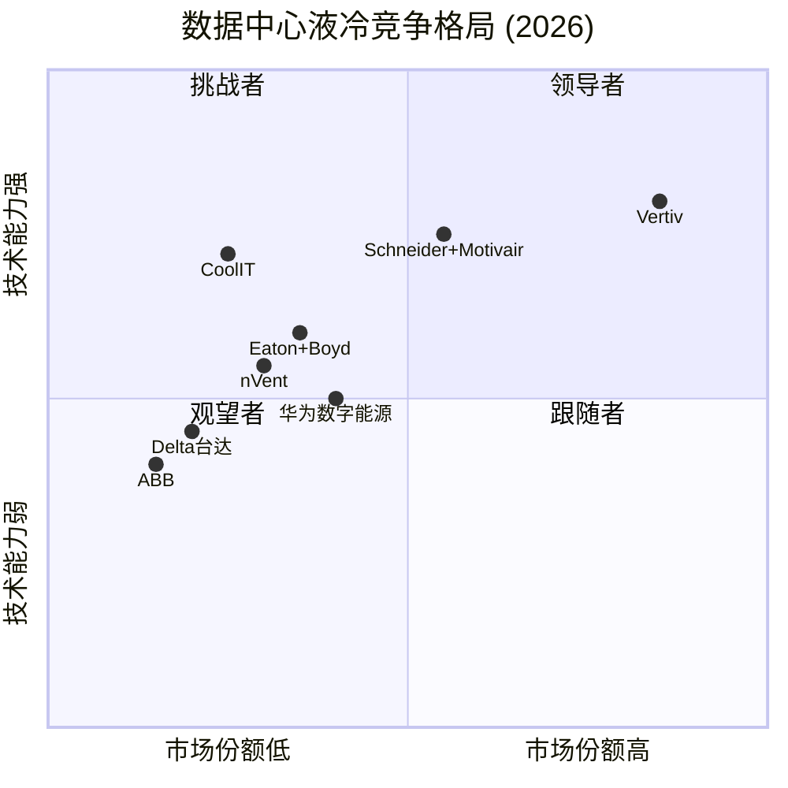
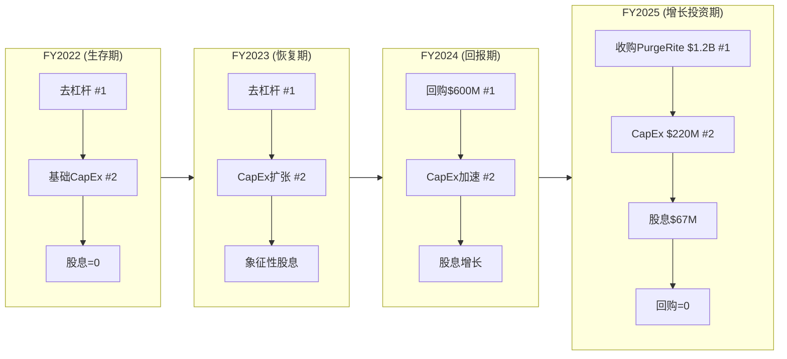
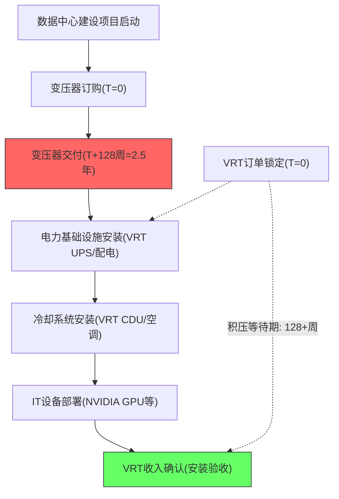
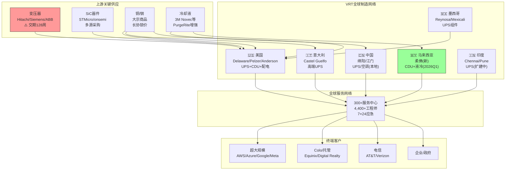
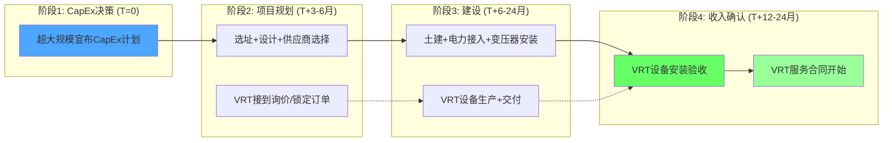
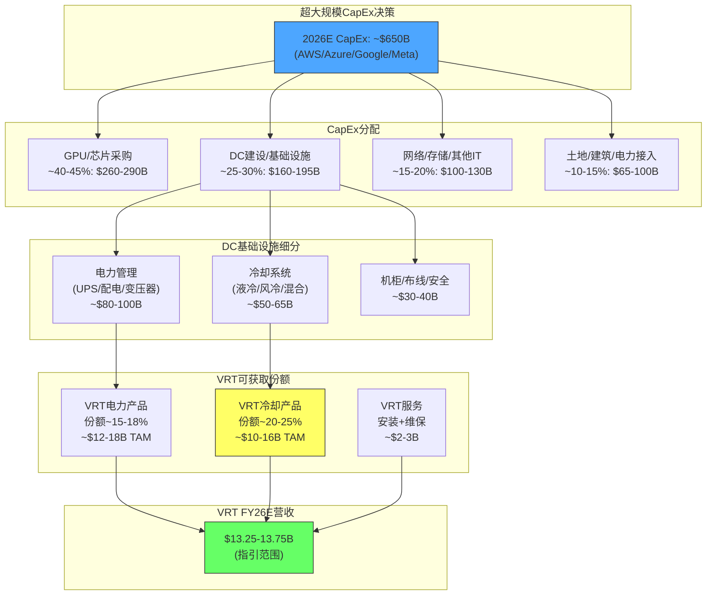

# Vertiv Holdings (VRT) — Phase 1 扩展章节 C (第七~十章)

> **核心主线**: VRT核心矛盾——市场以AI基础设施估值(PE 46x)定价一个85%传统工业品公司
> **数据截止**: FY2025 (2025-12-31) | Q4'25已发布 (2026-02-11) | 股价: $243.06 | 市值: $930亿
> **标注体系**: [硬数据:] = 公司财报/第三方数据 | [合理推断:] = 基于数据的逻辑推演 | [主观判断:] = 分析师评估

---

# 第七章 竞争格局与护城河评估

## 7.1 DCPI市场全景

### 7.1.1 市场规模与增长

[硬数据:] 根据Dell'Oro Group追踪的数据中心电力与冷却基础设施(DCPI)市场，2025年全球DCPI市场连续4个季度保持双位数增长，直接液冷(DLC)收入在2025年上半年同比翻倍。Dell'Oro是该领域最权威的第三方追踪机构，其数据被Vertiv、Schneider、Eaton等头部企业的投资者演示文稿广泛引用。

| 指标 | 2024 | 2025E | 2026E | CAGR趋势 |
|------|------|-------|-------|---------|
| DCPI全球市场规模 | ~$500亿 | ~$600亿 | ~$750亿 | +20-25% |
| 其中: 电力基础设施(UPS/配电/变压器) | ~$300亿 | ~$350亿 | ~$430亿 | +18% |
| 其中: 冷却基础设施(风冷/液冷/行级) | ~$200亿 | ~$250亿 | ~$320亿 | +25% |
| 其中: 直接液冷(DLC/CDU) | ~$15亿 | ~$30亿 | ~$50亿 | +80% |
| 市场集中度(Top 3) | ~43% | ~45% | — | 缓慢集中 |
| 市场集中度(Top 10) | ~70% | ~72% | — | 头部聚合 |

[合理推断:] DCPI市场正在经历结构性增长与AI叠加的双重驱动。结构性增长来自全球数字化转型(云计算渗透率提升、企业IT外包、5G边缘部署)，叠加AI CapEx超级周期使增速从历史的7-10%跃升至20%+。液冷子市场增速(+80%)远高于整体(+20%)，反映AI GPU功率密度跃升带来的冷却技术范式迁移。

### 7.1.2 双寡头格局——Schneider与Vertiv并列第一

[硬数据:] 根据Dell'Oro 2025年上半年数据，Schneider Electric和Vertiv在DCPI总体份额上仅差0.1个百分点，实际上形成了并列第一的双寡头格局。这是Vertiv首次在该指标上追平长期领先者Schneider。

| 排名 | 公司 | DCPI份额(2025H1) | 份额趋势 | 核心优势 |
|:---:|------|:-------:|---------|---------|
| 1 | **Schneider Electric** | ~16.5% | 稳定 | 最广产品线+EcoStruxure软件平台+全球均衡 |
| 1 | **Vertiv** | ~16.4% | 快速上升 | 100% DC聚焦+NVIDIA液冷首选+增速最快 |
| 3 | **Eaton** | ~11% | 上升 | 电力管理强+Boyd收购补齐液冷 |
| 4 | **ABB** | ~5% | 稳定 | 电气化巨头+低压配电优势 |
| 5 | **华为数字能源** | ~4-5% | 上升(亚太) | 中国UPS #1+全栈+成本优势 |
| 6 | **nVent Electric** | ~3% | 上升 | 机柜/连接/液冷1GW+ |
| 7 | **Delta Electronics** | ~3% | 上升(亚太) | 制造成本优势+CDU追赶 |
| 8-10 | Legrand/Rittal/Stulz | 各~2% | 稳定 | 细分领域 |
| — | **Top 3合计** | ~44% | — | — |
| — | **Top 10合计** | ~72% | — | — |

[主观判断:] 这个份额分布揭示了一个关键事实：DCPI市场仍然相对分散。即使Top 3合计也只有44%，意味着56%的市场由中小型和区域性供应商占据。这对VRT既是机会(并购整合空间)也是威胁(技术门槛不高，新进入者可以通过收购快速获得能力)。Eaton $95亿收购Boyd就是最好的例证。

### 7.1.3 细分市场份额差异

[合理推断:] VRT和Schneider的"并列第一"在总体DCPI中成立，但在细分市场上存在显著差异：

| 细分市场 | VRT份额 | Schneider份额 | 差距 | 竞争态势 |
|---------|:------:|:----------:|:---:|---------|
| UPS(不间断电源) | ~15-18% | ~20-22% | Schneider领先 | 成熟市场，Schneider品牌更强 |
| 精密空调/冷却 | ~23.5%(Omdia) | ~18% | VRT领先 | VRT传统强项 |
| 直接液冷CDU | **~70%**(GB200) | ~10% | VRT大幅领先 | VRT先发+NVIDIA合作 |
| 配电/PDU | ~12% | ~15% | Schneider领先 | Schneider更全面 |
| DCIM软件 | ~5% | ~15% | Schneider大幅领先 | EcoStruxure vs Vertiv Intelligence |
| 服务/维保 | ~18% | ~25% | Schneider领先 | 服务网络规模差距 |

[主观判断:] 这张表揭示了一个结构性矛盾：VRT在最高增长的细分市场(液冷CDU，+80% CAGR)占据压倒性优势(70%+)，但在基础面更大的成熟市场(UPS、软件、服务)落后于Schneider。VRT的估值溢价本质上建立在"高增长细分市场的高份额"之上。如果液冷份额下滑或液冷增速放缓，VRT在成熟市场的弱势将成为估值回归的催化剂。

---

## 7.2 核心竞争对手深度分析

### 7.2.1 Schneider Electric — 最大威胁

[硬数据:] Schneider Electric是全球最大的能源管理和自动化公司，市值约$120B，PE约28x(2026E)。数据中心相关业务占总营收约24%，但该部分增速远高于集团整体。

**竞争威胁维度分析**:

| 维度 | Schneider能力 | vs VRT比较 | 威胁评级 |
|------|-------------|-----------|:------:|
| **液冷技术** | 2024年收购Motivair(CDU技术)+与NVIDIA联合设计GB300液冷参考架构 | VRT领先12-18个月但差距在缩小 | ★★★★★ |
| **软件平台** | EcoStruxure(DCIM+自动化+预测分析)，行业最强软件生态 | VRT Vertiv Intelligence远不及 | ★★★★ |
| **全栈能力** | 电力(UPS/配电)+冷却+IT机柜+布线+软件+服务 | VRT缺软件和布线 | ★★★★ |
| **规模效应** | 总营收~$40B，R&D预算VRT的3倍+ | 资源优势显著 | ★★★★ |
| **渠道/客户** | 全球180+国家的直销+分销体系 | VRT全球化程度接近但渠道密度低 | ★★★ |
| **战略聚焦** | DC仅占24%，管理层注意力分散 | **VRT 100% DC聚焦是核心优势** | ★★ |

[合理推断:] Schneider的GB300联合设计地位是VRT面临的最大单一竞争威胁。NVIDIA每一代AI平台都会重新评估参考架构合作伙伴。VRT在GB200时代获得首选地位，但Schneider通过收购Motivair并投入大量资源，已成功获得GB300的联合开发席位。这意味着：

1. **短期(2026)**: VRT仍是GB200/B200/B300出货的主供应商，液冷份额>60%
2. **中期(2027)**: GB300量产时VRT和Schneider可能各占35-45%，形成双寡头
3. **长期(2028+)**: Rubin/Rubin Ultra平台将再次重新洗牌，VRT需要持续创新保持地位

[主观判断:] Schneider与VRT的竞争本质上是"多元化巨头 vs 垂直专注者"的经典商业案例。历史上两种模式各有成败——Intel在PC时代靠专注击败IBM式巨头，但在移动时代被ARM生态击败。VRT的100% DC聚焦在AI超级周期中是加速器(增长更快、决策更敏捷)，但在周期回调时可能成为脆弱性来源(无多元化缓冲)。

### 7.2.2 Eaton (ETN) — 最值得关注的追赶者

[硬数据:] Eaton是全球第二大电力管理公司，市值约$140B，PE约31x。FY2025总营收约$24B，其中电力系统事业部(Electrical Americas + Electrical Global)贡献约65%。Q4 2025 DC相关订单同比增长70%。

**关键竞争动作**:

| 时间 | 动作 | 规模 | 战略意义 |
|------|------|------|---------|
| 2024 Q4 | 宣布收购Boyd Thermal Management | **$95亿** | 一步到位获得液冷能力+热管理技术 |
| 2025 | DC订单连续3季度+50%以上 | Q4: +70% | 证明AI基础设施需求传导至Eaton |
| 2025-2026 | 整合Boyd技术到DC电力平台 | — | 从"电力管理"扩展至"电力+冷却"全栈 |

[合理推断:] Eaton的$95亿Boyd收购是对VRT最直接的竞争威胁之一。Boyd不仅拥有液冷CDU技术，还在汽车热管理(Tesla Supercharger冷却)和电子设备散热领域有深厚积累。Eaton的渠道+Boyd的技术=具备与VRT正面竞争液冷市场的能力。

但Eaton与VRT的差异化在于:
- **Eaton偏"电力侧"**: UPS、配电盘、变压器、断路器。Eaton在中压和高压配电领域的能力是VRT所不具备的
- **VRT偏"冷却侧"**: CDU、精密空调、液冷管路、热管理。VRT在冷却领域的depth远超Eaton
- **短期重叠度有限**: 两者的产品组合互补性高于竞争性。但"全栈DC基础设施"的趋势意味着双方都在向对方的领地扩张

[硬数据:] Eaton FY2025关键财务对比:

| 指标 | Eaton | VRT | 倍数差异 |
|------|-------|-----|---------|
| 市值 | ~$140B | ~$93B | Eaton 1.5x |
| PE(FY26E) | ~31x | ~46x | VRT溢价48% |
| 总营收 | ~$24B | ~$10.2B | Eaton 2.4x |
| DC相关营收(估) | ~$5-6B | ~$10.2B | VRT 1.7x |
| OP利润率 | ~22-23% | ~20.4% | Eaton领先 |
| 净债务/EBITDA | ~1.5x | ~0.76x | VRT更健康 |
| DC订单增长(Q4) | +70% | +252% | VRT增速远快 |

### 7.2.3 ABB — 电气化巨头的非核心威胁

[硬数据:] ABB是全球电气化和自动化巨头，市值约$90B。DC基础设施不是ABB的核心战略重点，但其在低压配电、变压器、UPS(Conceptpower系列)领域具有技术和规模基础。

[合理推断:] ABB对VRT的威胁主要体现在两个方面:
1. **低压配电和变压器**: ABB在变压器市场的份额(Hitachi Energy合资)使其有能力提供DC电力侧的完整方案
2. **欧洲市场**: ABB在EMEA的渠道和品牌优势比VRT更强，可能在VRT的弱势地区获得DC订单

但ABB的管理层多次表明DC基础设施不是战略优先领域——ABB更聚焦于工业自动化、机器人和电动出行。因此ABB更像是一个"潜在搅局者"而非"积极竞争者"。威胁评级: ★★★(中等)。

### 7.2.4 nVent Electric — 液冷连接专家

[硬数据:] nVent Electric(从Pentair分拆)专注于数据中心机柜、连接和液冷解决方案。市值约$10B。nVent已部署超过1GW液冷容量，与NVIDIA有直接合作关系。

| 指标 | nVent | vs VRT |
|------|-------|--------|
| 市值 | ~$10B | VRT 9.3x |
| 液冷部署量 | 1GW+ | VRT: CDU产能45x扩张 |
| 产品层面 | 机柜/连接器/冷板/歧管 | VRT: CDU/整体方案 |
| NVIDIA关系 | 合作伙伴 | VRT: GB200联合开发 |
| 竞争重叠 | 部分(液冷组件) | 但层级不同 |

[合理推断:] nVent与VRT的竞争更多是在"组件层"vs"系统层"。nVent提供液冷系统中的机柜、连接器和冷板(更接近IT设备端)，VRT提供CDU和整体冷却方案(更接近基础设施端)。两者更多是互补而非替代关系。但如果nVent向CDU领域扩展，或被Schneider/Eaton收购整合，将增加VRT的竞争压力。

### 7.2.5 华为数字能源 — 亚太不可忽视的力量

[硬数据:] 华为数字能源2023年营收526亿人民币(约$73亿)，是中国UPS市场的绝对领导者(份额#1)，全球UPS市场前5。产品线覆盖UPS、配电、冷却、储能、光伏逆变器等全栈。

| 维度 | 华为数字能源 | vs VRT |
|------|-----------|--------|
| 中国UPS份额 | #1(~25-30%) | VRT: 中国UPS ~5% |
| 全球UPS份额 | Top 5 | VRT: Top 2-3 |
| 液冷CDU | 有产品但未大规模部署 | VRT: 全球70%+ |
| 成本优势 | 显著(中国制造+垂直整合) | VRT: 成本结构偏高 |
| 地缘限制 | 西方市场受限(制裁/安全审查) | VRT: 全球自由准入 |
| 软件/AI能力 | ICT基因+强软件 | VRT: 软件是弱项 |
| 最大威胁区域 | **亚太+中东+非洲+拉美** | VRT在这些区域面临价格竞争 |

[主观判断:] 华为对VRT的威胁主要限于亚太和新兴市场。在北美和欧洲，地缘政治因素(美国CHIPS法案/实体清单、欧洲5G安全审查)有效限制了华为数据中心基础设施的渗透。但在东南亚、中东和非洲——这些是VRT FY26增长战略的重点区域——华为凭借30-50%的成本优势和"全栈一站式"方案(UPS+配电+冷却+储能+智能管理)构成真实威胁。VRT管理层将亚太利润率(11.0%)远低于美洲(26.8%)，部分原因正是华为主导的价格竞争环境。

### 7.2.6 Delta Electronics(台达电子) — 亚洲制造成本优势

[硬数据:] 台达电子是全球最大的交换式电源供应器(PSU)供应商之一，也是DC基础设施领域增长最快的亚洲竞争者。2025年DC基础设施相关营收估计约$3-4B(占集团~25%)。

[合理推断:] 台达对VRT的威胁体现在:
- **成本优势**: 台湾/泰国/中国制造基地的成本结构比VRT的美国/欧洲基地低20-30%
- **CDU追赶**: 台达已推出CDU产品线，正在验证中，预计2026年底有可能获得NVIDIA认证
- **服务器电源协同**: 台达作为NVIDIA服务器PSU的主要供应商，有切入DC基础设施的天然渠道
- **但限制因素**: 北美渠道弱、服务网络欠缺、品牌认知度低(在DC领域)、液冷技术成熟度落后VRT 18-24个月

---

## 7.3 VRT估值溢价的竞争基础

### 7.3.1 三因素溢价分解与可持续性矩阵

VRT PE 46x相对于Schneider 28x/Eaton 31x的估值溢价，可以分解为三个竞争性差异化因素:

| 溢价因素 | 贡献度(估) | 当前状态 | 可持续性评估 | 主要威胁来源 | 3年展望 |
|---------|:--------:|---------|:--------:|-----------|---------|
| **AI纯度**(100% DC vs Schneider 24%) | ~40% | 结构性差异 | **高** | 无——VRT不会多元化，Schneider不会剥离非DC | 稳定。除非VRT收购非DC业务 |
| **液冷先发**(GB200 CDU 70%+ share) | ~35% | 强但承压 | **中** | Schneider GB300联合设计+Eaton Boyd收购+NVIDIA供应链多元化 | 从70%降至40-50%(双寡头) |
| **增长加速**(FY25 +28% vs 同行+10-15%) | ~25% | 爆发性增长 | **低** | 基数效应+AI CapEx增速放缓+竞争加剧 | FY28E增速可能降至+10-15% |

[主观判断:] 这三个溢价因素中，"AI纯度"是最可持续的(结构性)，但它本身不证明PE溢价——纯度高也意味着风险集中度高。"液冷先发"是当前最有价值但可持续性最不确定的因素。"增长加速"是最不可持续的——所有高增长最终都会均值回归。

**溢价可持续性时间线**:

| 时期 | AI纯度溢价 | 液冷先发溢价 | 增长加速溢价 | 合理PE估计 |
|------|:--------:|:---------:|:---------:|:--------:|
| 2026(当前) | 充分定价 | 充分定价 | 充分定价 | 40-50x |
| 2027 | 维持 | 开始衰减(双寡头) | 开始衰减(增速降至20%) | 35-42x |
| 2028 | 维持 | 显著衰减(份额40%) | 显著衰减(增速降至12-15%) | 28-35x |
| 2030 | 维持但价值下降 | 基本消失(行业标配) | 基本消失(成熟增速) | 25-30x |

### 7.3.2 PE估值敏感性: 液冷份额变化的影响

液冷份额是VRT估值最敏感的竞争变量。以下模型估算不同液冷份额水平对合理PE的影响:

**假设基础**: FY28E液冷TAM $60-70亿 | VRT非液冷业务增长10-12% | 液冷毛利率40% vs 非液冷30%

| 液冷份额(FY28E) | 液冷营收 | 液冷对总营收贡献 | 液冷对利润贡献 | AI叙事强度 | 合理PE范围 |
|:----------:|:------:|:----------:|:----------:|:--------:|:--------:|
| **70%**(维持主导) | $4.2-4.9B | ~22-25% | ~30-35% | 极强 | 42-50x |
| **60%** | $3.6-4.2B | ~19-22% | ~26-30% | 强 | 38-44x |
| **50%** | $3.0-3.5B | ~16-18% | ~22-25% | 中等 | 33-38x |
| **40%**(双寡头) | $2.4-2.8B | ~13-15% | ~18-21% | 减弱 | 30-35x |
| **30%**(失去先发) | $1.8-2.1B | ~10-11% | ~14-16% | 弱 | 26-30x |

[合理推断:] 从70%降至40%的液冷份额变化，对应PE从约46x降至约32x——这意味着在EPS不变的情况下，仅因竞争导致的估值重估就可能使股价下跌约30%。这验证了液冷份额是VRT估值的"命门"。

---

## 7.4 竞争动态四象限图

**四象限解读**:
- **领导者(高份额+强技术)**: VRT独占。GB200首选+CDU 70%+产能45x扩张
- **挑战者(低份额+强技术)**: Schneider+Motivair和CoolIT。技术能力强但份额尚在追赶
- **跟随者(低份额+弱技术)**: ABB和Delta。有基础能力但非战略优先
- **观望者(有技术但市场定位不同)**: nVent(组件层)、华为(亚太受限)

---

## 7.5 护城河综合评分矩阵

[主观判断:] 以下评分基于对VRT竞争壁垒的综合评估。每个维度1-5分，5分代表"几乎不可攻破"。

| 维度 | 评分 | 理由 | 可持续性 | 威胁来源 |
|------|:---:|------|:------:|---------|
| **品牌/声誉** | 3.5/5 | Liebert品牌在DC领域知名度高，但非消费品品牌忠诚度 | 中 | Schneider品牌更强 |
| **规模效应** | 3.0/5 | $10.2B营收提供采购和制造规模，但非Schneider级别($40B) | 中 | Schneider/Eaton规模更大 |
| **网络效应** | 2.0/5 | 数据中心设备几乎不存在网络效应——每个项目独立决策 | 低 | 这不是软件/平台业务 |
| **转换成本** | 3.5/5 | 安装基数+服务合同+工程师培训创造中等转换成本 | 高 | 但大项目(超大规模)中客户议价力强 |
| **技术领先** | 4.0/5 | CDU/液冷技术领先竞对12-18个月+NVIDIA联合开发 | 中 | GB300换代可能重新洗牌 |
| **渠道/分销** | 3.5/5 | 全球300+服务中心，直销+分销混合 | 高 | Schneider渠道更密集 |
| **服务生态** | 3.5/5 | 4,400+现场工程师+预防性维护+远程监控 | 高 | 安装基数持续增长 |
| **全栈集成** | 3.0/5 | 电力+冷却双栈，但缺软件(DCIM弱)+缺IT机柜 | 中 | Schneider全栈更完整 |
| **NVIDIA关系** | 4.5/5 | GB200参考架构联合开发，最高级别合作 | 中 | **GB300换代是关键测试** |
| **产能先发** | 4.0/5 | CDU产能45x扩张+马来西亚新厂+PurgeRite | 中 | Eaton/Schneider正在追赶 |
| **综合加权** | **3.5/5** | — | — | — |

[主观判断:] VRT的护城河综合评分3.5/5——这是一条"真实但非不可攻破"的护城河。最强的两个维度是NVIDIA关系(4.5)和技术领先(4.0)，但两者都面临"每一代平台重新洗牌"的挑战。最弱的维度是网络效应(2.0)——这从根本上决定了VRT是一家工业品公司而非平台公司，不应享受平台级(60x+)估值。

**护城河类比**:
- VRT的护城河更接近**AMAT(应用材料)**(技术+客户关系+服务网络，但每代工艺都可能被竞对追赶)
- 而不是**ASML**(独占技术+专利壁垒+物理定律限制竞争)
- VRT不是垄断者，而是双寡头中技术暂时领先的一方——这种领先是动态的、需要持续投入维持的

---

# 第八章 管理层评估与资本配置

## 8.1 CEO Giordano Albertazzi 深度评估

### 8.1.1 背景与职业路径

[硬数据:] Giordano Albertazzi于2023年1月1日出任Vertiv CEO，此前在公司及其前身(Emerson Network Power)工作了28年。教育背景: 米兰理工大学(Politecnico di Milano)机械工程学位 + 斯坦福大学管理学硕士。

**详细职业路径**:

| 时期 | 职位 | 关键职责 | 能力积累 |
|------|------|---------|---------|
| 1998-2003 | 工厂经理(意大利) | Emerson Network Power的UPS制造管理 | 精益制造、供应链管理 |
| 2003-2007 | EMEA营销总监 | 区域产品策略与市场开发 | 客户理解、市场洞察 |
| 2007-2012 | 意大利总经理 | 负责意大利全业务P&L | 综合管理、跨职能协调 |
| 2012-2016 | EMEA总裁 | 领导欧非中东业务(~$2B) | 大区域管理、战略规划 |
| 2016-2019 | 美洲总裁 | 接管最大业务区域(~$4B) | 超大规模客户关系、AI早期转型 |
| 2019-2022 | COO | 全球运营+VOS体系建设 | 运营效率、组织转型 |
| 2023至今 | CEO | 全面战略领导 | 战略设定、资本配置、投资者关系 |

[合理推断:] Albertazzi的28年内部晋升路径是一把双刃剑:
- **优势**: 对Vertiv的产品、客户、运营和文化有无人能及的理解深度。从工厂到区域到全球的完整经历意味着他能有效管理组织的每一层。这在AI快速转型期尤为重要——他知道哪些产能可以快速调配、哪些客户关系可以撬动
- **劣势**: 28年的内部经验可能导致"隧道视野"——缺乏外部行业(尤其是科技/AI)的直觉。VRT正在从工业品公司向AI基础设施公司转型，CEO却完全缺乏科技行业背景。这与NVIDIA Jensen Huang(科技原住民)或Schneider CEO Peter Herweck(数字化转型专家)形成对比

### 8.1.2 薪酬与激励对齐度

[硬数据:] FY2024 CEO薪酬详细分解:

| 薪酬组成 | 金额 | 占比 | 激励属性 |
|---------|------|:---:|---------|
| 基本薪资 | $1,050,000 | 8.5% | 固定——不随业绩变化 |
| 年度奖金(现金) | $3,018,000 | 24.5% | 基于年度财务KPI(Adj.OP+FCF) |
| 长期股权激励(期权+RSU) | $8,200,000 | **66.7%** | 3-4年归属+基于TSR/EPS增长 |
| 其他(福利/补贴) | $32,000 | 0.3% | — |
| **合计** | **$12,300,000** | **100%** | — |

**薪酬结构评估**:

| 维度 | 评分 | 理由 |
|------|:---:|------|
| 股权占比 | **优** | 67%期权/RSU，强烈绑定长期股东价值 |
| 年度奖金KPI | **良** | Adj.OP+FCF为主要指标，与价值创造对齐 |
| 持股要求 | **良** | CEO需持有5x基本薪资的股票($5.25M+) |
| 相对薪酬水平 | **中** | $12.3M在$93B市值公司中偏低(同规模中位数$15-20M) |
| 回扣条款(Clawback) | **良** | 标准Dodd-Frank合规回扣条款 |
| **总体** | **7.5/10** | 激励结构与长期股东价值高度对齐 |

[合理推断:] CEO薪酬$12.3M相对于$93B市值仅0.013%——这个比率在大型工业品公司中偏低。低薪酬+高股权占比的结构是PE基因公司的典型特征(Platinum Equity时期建立的薪酬框架延续至今)。核心问题不是薪酬高低，而是CEO直接持股(仅198,775股，价值约$48M)占市值的比例微乎其微(<0.05%)——管理层更多通过期权而非实际持股"参与"公司价值。

### 8.1.3 任期业绩评估

[硬数据:] Albertazzi CEO任期(2023.1至今)的关键业绩指标:

| 指标 | 上任时(FY2022) | 最新(FY2025) | 变化 | 评价 |
|------|:----------:|:--------:|:---:|------|
| 营收 | $5,692M | $10,230M | +80% | 远超行业增速 |
| Adj.OP利润率 | 8.6% | 20.4% | +11.8pp | 变革性改善 |
| FCF | -$264M | $1,894M | 扭亏为盈 | 质的飞跃 |
| 净债务/EBITDA | 5.0x | 0.76x | -4.24x | 教科书级去杠杆 |
| 股价(TSR) | ~$13 | $243 | +1,770% | 爆炸性回报 |
| 积压 | ~$3B | $15B | +400% | 前所未有的可见度 |
| 信用评级 | B+(S&P) | BB+(S&P) | 升3级 | 接近投资级 |

[主观判断:] Albertazzi任期的数字表现堪称卓越，但需要三个重要的背景因素:
1. **AI CapEx超级周期的β贡献**: 2023-2025年整个DC基础设施行业都在高速增长。Eaton DC订单+70%、Schneider DC增长+20%——VRT的增长部分反映行业趋势
2. **VOS运营体系的遗产效应**: VOS在PE时期(2017-2022)建立的基础在Albertazzi任期释放了利润率红利
3. **但CEO的α贡献也是真实的**: 液冷战略转型(CDU产能45x扩张)、NVIDIA合作深化、PurgeRite收购——这些是CEO级别的战略决策

**综合评分: 7.5/10** — 战略方向正确(全力投入液冷/AI)，执行效率高(VOS持续改善)，但任期仅3年，尚未经历周期下行的考验。

---

## 8.2 CFO David Fallon 深度评估

[硬数据:] David Fallon于2017年7月加入Vertiv任CFO，此前在多家中型工业公司担任财务领导角色。教育背景: 沃顿商学院MBA + CFA + CPA三重资质。

**三阶段财务管理**:

| 阶段 | 时期 | 核心挑战 | 关键成就 |
|------|------|---------|---------|
| **PE持有期** | 2017-2019 | 高杠杆(5x+ ND/EBITDA)+运营改善 | 建立财务纪律+成本控制+VOS财务基础 |
| **SPAC上市** | 2020-2022 | 上市过渡+权证会计+资本市场亮相 | 成功完成SPAC合并+投资者关系建立+挺过FY22亏损期 |
| **AI增长期** | 2023-2025 | 高增长资源配置+去杠杆+收购整合 | FCF从-$264M→$1,894M+PurgeRite $10亿收购+净债务/EBITDA 5.0x→0.76x |

[合理推断:] Fallon的独特价值在于他是VRT三个截然不同发展阶段的唯一在位C-suite。这种连续性在CFO层面极其罕见且有价值——他理解VRT从PE buyout到SPAC到AI转型的全部财务脉络。沃顿MBA+CFA+CPA的三重资质在工业品CFO中属于"过度配备"(overqualified)，但在VRT从工业品向科技基础设施转型的过程中，这种资本市场+会计+分析的综合能力恰好是需要的。

**CFO评分: 7/10** — 稳定性和跨周期经验是核心优势，但$2.8M薪酬中直接持股偏低，且"从PE CFO到成长型CFO"的角色转换仍在进行中。

---

## 8.3 执行董事长 David M. Cote

[硬数据:] David Cote是VRT最有知名度的董事会成员。核心背景:
- 霍尼韦尔CEO(2002-2017)，任期15年，股东总回报约800%(vs 标普500约200%)
- 2020年通过GS Acquisition Holdings Corp(SPAC)推动Vertiv上市
- 当前持股: 443,798股 + 497,826份期权(合计价值约$230M)

**霍尼韦尔经验的迁移价值**:

| 霍尼韦尔经验 | 对VRT的迁移 | 实际效果 |
|------------|-----------|---------|
| HOS(霍尼韦尔运营系统) | → VOS(Vertiv运营系统) | 毛利率+10pp in 3年 |
| 多事业部管理(航空+自动化+材料) | → 三大区域+多产品线管理 | 组织架构清晰 |
| M&A整合纪律(100+收购) | → PurgeRite收购整合方法论 | 待验证 |
| 资本市场沟通 | → 投资者信心建设 | S&P500纳入候选 |

**注意力分散风险**:

[硬数据:] Cote目前同时担任:
1. **Vertiv执行董事长**
2. **CompoSecure(CMPO)执行董事长** — 另一家SPAC上市公司(金属支付卡)
3. **Resolute Holdings(RHLD)执行董事长** — 又一家SPAC(金融科技)

[主观判断:] Cote同时担任三家公司的执行董事长——这不是典型的非执行董事角色，而是要求实质性时间投入的"执行"角色。对于一个$93B市值的公司来说，执行董事长的注意力分散是一个值得关注但未被市场广泛讨论的风险。不过Cote在VRT的持股/期权价值(~$230M)远超其在CMPO和RHLD的持股，经济激励仍然强烈绑定在VRT上。

**Cote评分: 6.5/10** — 战略价值高(HOS经验迁移)+经济绑定强，但多公司角色分散注意力+SPAC推手的历史可能在市场情绪转向时成为负面标签。

---

## 8.4 近期管理层变动与接班评估

[硬数据:] 2025年底至2026年初发生了两位重要高管的同时退休:

| 变动 | 离任者 | 在位时长 | 接任者 | 接任者背景 | 风险评估 |
|------|--------|---------|--------|-----------|---------|
| CTO | Stephen Liang | 30年(Emerson+VRT) | Scott Armul | VRT内部晋升，液冷产品线负责人 | 中——技术方向连续性强，但新CTO需要证明独立创新能力 |
| EMEA总裁 | Karsten Winther | 长期 | Paul Ryan | VRT前全球采购总监 | 中——EMEA业务已在萎缩(有机-2.1%)，新任者从供应链而非销售背景转型 |

[合理推断:] 两位高管同时退休不是巧合——这可能是CEO Albertazzi推动的管理层换代计划。两位接任者都是VRT内部人士，说明VRT的人才梯队建设有效(不需要外聘高管)。但在AI快速转型期同时更换CTO和区域总裁，执行风险是非零的。

**特别关注**: CTO交接。Stephen Liang是VRT液冷技术战略的关键架构师之一，他的退休时间(2026.1.1)恰逢GB300/Rubin换代(2026H2-2027)的关键竞标期。新CTO Scott Armul是否能在这个关键时点维持VRT的技术领先和NVIDIA关系深度，是一个值得跟踪的变量。

---

## 8.5 股权结构分析

[硬数据:]

| 持股类型 | 占比 | 详细 |
|---------|:----:|------|
| 机构持股 | ~81-90% | Vanguard ~10%, BlackRock ~9%, State Street ~2%, T. Rowe Price ~3% |
| 内部人持股 | ~1-2% | CEO 198K股, CFO ~50K股, Cote ~444K股+498K期权 |
| 散户/其他 | ~10-15% | — |
| **Platinum Equity(前PE)** | **~0%** | **2024年基本完成退出**(回购795.5万股) |

**Platinum Equity退出时间线**:

| 时间 | 动作 | 规模 | 均价(估) |
|------|------|------|---------|
| 2020 | SPAC上市(保留38%) | — | $10(SPAC价) |
| 2021-2023 | 陆续减持 | 多批次 | $15-80 |
| 2024 Q4 | 最终减持(含VRT回购7.96M股) | -2.1M股(净) | ~$90-120 |
| 2025+ | **完成退出** | — | — |

[合理推断:] PE退出完成是一个明确的正面信号——消除了"大股东悬剑"式的减持压力。但89.9%的机构持股也意味着"拥挤的多头"。从资金流向看，T. Rowe Price在Q3 2025增持200%是一个重要的主动型基金信号，表明至少部分大型主动管理人认为VRT在当前估值下仍有上行空间。

**内部人交易分析**:

| 时期 | 净买入/卖出 | 主要交易 | 信号强度 |
|------|:--------:|---------|:------:|
| 2024 Q4 | 净卖出-2.1M股 | Platinum Equity退出+管理层少量减持 | 弱(PE退出驱动) |
| 2025 Q3 | 净卖出-174K股 | 管理层少量减持(可能为税务规划) | 中性 |
| 2026 Q1(至今) | **净买入+6,498股** | 小规模增持(可能为RSU归属后保留) | **弱正面** |

[主观判断:] 内部人交易信号整体中性。2024年的大规模卖出完全由PE退出驱动，不反映管理层对基本面的判断。2026 Q1的小规模净买入(+6,498股)是一个微弱的正面信号——至少管理层没有在$243附近大量减持。但总体而言，VRT管理层的直接持股比例(合计~1-2%)远低于创始人型公司(通常5-15%)，这意味着他们对公司长期价值的"皮肤"暴露有限。

---

## 8.6 资本配置记录 (FY2022-FY2025)

[硬数据:]

| 类目 | FY2022 | FY2023 | FY2024 | FY2025 | 评价 |
|------|--------|--------|--------|--------|------|
| **CapEx** | $111M | $135M | $184M | $220M | 持续加码产能(CAGR +26%) |
| **收购** | $5M | $17M | $18M | **$1,185M** | FY25: PurgeRite是转折点 |
| **回购** | $0 | $0 | **$600M** | $0 | FY24一次性(PE退出配合) |
| **股息** | $4M | $10M | $42M | $67M | 微量(yield 0.04%) |
| **去杠杆(净)** | ~$0 | $262M | $21M | $21M | FY23大幅去杠杆 |
| **FCF** | -$264M | $766M | $1,135M | $1,894M | 质的飞跃 |
| **FCF分配后剩余** | -$380M | $342M | $270M | $401M | 现金积累 |

**资本配置优先级演变图**:

[合理推断:] 资本配置优先级的演变清晰反映了VRT从"PE去杠杆"到"股东回报"再到"增长投资"的战略转型。FY24的$600M回购是在$80-140区间执行的，以当前$243计算是一笔极其成功的资本配置(回报率+73-204%)。FY25从回购转向PurgeRite收购，说明管理层认为增长投资的回报优于继续回购(隐含对当前估值偏高的判断?)。

**FY25零回购的三种解读**:
1. **优先收购**: PurgeRite $10亿+消耗了大部分可配置资本(最可能)
2. **估值信号**: 管理层不愿在PE 46x时回购(值得关注)
3. **现金储备**: 为FY26可能的大型收购保留弹药(可能)

---

## 8.7 PurgeRite收购分析

[硬数据:] VRT于2025年底以约$10亿完成对PurgeRite(液冷流体管理技术公司)的收购。

| 维度 | 评估 |
|------|------|
| **收购标的** | PurgeRite — 数据中心液冷系统的流体管理(净化、过滤、维护)技术 |
| **收购价格** | ~$1,000M(含$713M商誉) |
| **估值倍数** | [合理推断:] 约10-15x EBITDA(假设PurgeRite EBITDA $70-100M) |
| **战略逻辑** | 从CDU(设备)扩展至流体管理(服务)→形成液冷"设备+流体+维护"全栈能力 |
| **协同效应** | VRT CDU客户自然需要流体管理→交叉销售+提升客户粘性 |
| **整合风险** | 中——小型技术收购，整合复杂度有限 |
| **对利润率影响** | 短期拖累(Q4'25毛利率从37.8%降至36.9%)，长期应贡献正向(高毛利服务) |

[主观判断:] PurgeRite收购的战略逻辑清晰——液冷CDU是硬件"一锤子买卖"(安装后很少更换)，但冷却液的净化、过滤和维护是持续性服务需求。通过PurgeRite，VRT将液冷的商业模式从"卖设备"延伸至"卖设备+持续服务"，类似打印机领域"卖打印机+卖墨盒"的模式。这对提升客户LTV和收入可见性是有价值的。

---

## 8.8 VOS (Vertiv Operating System) 深度分析

### 8.8.1 运营体系设计原理

[合理推断:] VOS是Vertiv在Platinum Equity持有期(2017-2020)建立的精益运营体系，其设计灵感来自三个成功先例:

| 运营体系 | 公司 | 核心理念 | VOS借鉴点 |
|---------|------|---------|----------|
| **HOS(霍尼韦尔运营系统)** | Honeywell | 六西格玛+精益+流程标准化 | **直接来源**——Cote将HOS经验带入VRT |
| **DBS(丹纳赫商业系统)** | Danaher | 持续改善(Kaizen)+问题解决+工具箱 | 收购后整合方法论 |
| **80/20** | ITW(伊利诺伊工具) | 80%精力聚焦20%高价值客户/产品 | 产品线简化+客户聚焦 |
| **TPS(丰田生产系统)** | Toyota | 即时生产(JIT)+消除浪费+质量内建 | 制造流程优化 |

### 8.8.2 VOS对利润率的量化贡献

[硬数据:] VRT毛利率从FY22的24.6%提升至FY25的34.4%——3年内提升了10个百分点。

| 利润率改善因子 | 贡献(估) | VOS相关度 | 可持续性 |
|-------------|:-------:|:-------:|:------:|
| 制造效率提升(工时/单位产出) | +2-3pp | **直接** | 高——系统性改善 |
| 采购成本压降(集中采购+供应商管理) | +1-2pp | **直接** | 中——边际效应递减 |
| 产品线优化(砍掉低利润产品) | +1pp | **直接** | 一次性——完成后贡献停止 |
| 定价策略(从成本加成→价值定价) | +3-4pp | **间接** | 中——取决于供需环境 |
| 产品组合(液冷高毛利占比提升) | +1-2pp | **间接** | 高——结构性趋势 |
| 原材料成本下降(铜/钢回落) | +1pp | 不相关 | 低——周期性波动 |

### 8.8.3 VOS vs 同行运营体系对比

| 维度 | VOS(VRT) | HOS(HON) | DBS(DHR) | 80/20(ITW) |
|------|---------|----------|----------|-----------|
| **起源** | 2017(PE驱动) | 2003(Cote) | 1988(Rales兄弟) | 1981(CEO传统) |
| **成熟度** | 7年(新) | 20年+(成熟) | 35年+(成熟) | 40年+(成熟) |
| **利润率贡献** | +10pp(3年) | +8pp(10年) | +15pp(20年) | +10pp(15年) |
| **对收购整合的支持** | 良好(PurgeRite) | 卓越(100+) | 卓越(400+) | 卓越(多次) |
| **人才培养** | 初步(内部晋升) | 成熟(管理学院) | 成熟(Kaizen大师) | 成熟(分权文化) |
| **数字化融合** | 初步 | 先进 | 先进 | 中等 |
| **综合成熟度** | **6/10** | **9/10** | **9.5/10** | **8.5/10** |

[主观判断:] VOS的7年历史使其在"精益运营体系"中仍处于早期阶段。好消息是: 早期阶段的改善空间最大——DBS和80/20在成熟后利润率改善速度都显著放缓。VOS从6/10成长到8/10的过程，可能还能为VRT贡献2-3个百分点的利润率改善(FY26-FY29)。但前提是管理层持续投入VOS而不是被AI增长的诱惑分散注意力。

---

## 8.9 管理层综合评分

| 维度 | 权重 | 评分 | 加权 | 简要理由 |
|------|:---:|:---:|:---:|---------|
| CEO战略能力 | 20% | 7.5 | 1.50 | 方向正确(液冷/AI全力投入)+执行高效 |
| CEO运营能力 | 15% | 8.0 | 1.20 | VOS驱动利润率+10pp in 3年 |
| CFO财务管理 | 15% | 7.0 | 1.05 | 三阶段稳定+去杠杆+FCF转化优秀 |
| 董事会质量 | 10% | 6.5 | 0.65 | Cote有价值但注意力分散 |
| 资本配置 | 15% | 7.5 | 1.13 | 回购时机好+PurgeRite逻辑清晰+FY25零回购有争议 |
| 接班计划 | 10% | 6.5 | 0.65 | 内部培养有效但CTO交接时机敏感 |
| 股权对齐 | 10% | 5.5 | 0.55 | 内部人直接持股仅1-2%，偏低 |
| 透明度/沟通 | 5% | 7.0 | 0.35 | 季度沟通清晰+投资者日预告 |
| **综合** | **100%** | — | **7.08/10** | — |

[主观判断:] 管理层综合评分7.1/10——"良好但非卓越"。最大的加分项是VOS运营体系(8.0)和CEO战略方向(7.5)。最大的扣分项是股权对齐(5.5)——管理层的经济利益与股东的经济利益之间的"皮肤暴露度"不够高。在$93B市值的公司中，CEO仅持有价值$48M的股票(0.05%市值)，这与创始人型CEO(如Jensen Huang持有NVDA约3.5%)形成鲜明对比。

---

# 第九章 供应链与运营深度

## 9.1 供应链架构

### 9.1.1 全球制造网络

[硬数据:] Vertiv在全球拥有约30个主要制造基地，分布在美洲、欧洲和亚太三大区域，员工约31,000人。

| 区域 | 主要制造基地 | 核心产品 | 产能状态 |
|------|-----------|---------|---------|
| **美洲** | 美国Delaware(OH), Pelzer(SC), Anderson(SC), Westerville(OH) | UPS, 配电, CDU | 高负荷+扩产中(Pelzer) |
| **美洲** | 墨西哥Reynosa, Mexicali | UPS组件, 线缆 | 稳定 |
| **欧洲** | 意大利Castel Guelfo, Piove di Sacco | UPS(高端), 精密空调 | 中等负荷 |
| **欧洲** | 克罗地亚Split | 中型UPS | 成本优化基地 |
| **亚太** | 中国绵阳, 江门 | UPS, 空调(中国市场) | 稳定 |
| **亚太** | 印度Chennai, Pune | UPS组件, 本地化产品 | 扩建中 |
| **亚太** | **马来西亚柔佛(新)** | **CDU, 液冷组件** | **2026 Q1投产** |

**服务网络**:
- 全球300+服务中心
- 4,400+现场工程师(field service engineers)
- 7×24应急响应能力
- 远程监控覆盖数万客户站点

### 9.1.2 关键零部件供应

[合理推断:] VRT作为设备集成商(而非原材料生产商)，其供应链依赖多个关键零部件:

| 零部件 | 主要供应商 | 供应风险 | VRT替代策略 |
|--------|---------|:------:|-----------|
| 电力变压器 | Hitachi Energy, Siemens, ABB, GE Vernova | **高** | 交期128周, 全球短缺 |
| SiC功率器件 | STMicro, onsemi, Infineon | 中 | 多源采购+VRT非SiC密集型 |
| 铜(线圈/母线) | 大宗商品市场 | 中 | 长协锁价+价格传导给客户 |
| 钢材(机柜/结构) | 大宗商品市场 | 低 | 标准品, 多源 |
| 冷却液(CDU用) | 3M Novec, 特种化学品 | 中 | PurgeRite收购增强流体管理能力 |
| IGBT/MOSFET | Infineon, ON Semi | 中 | 多源+VRT是大客户 |
| 锂电池(UPS储能) | 多家 | 低 | 电池成本持续下降 |

---

## 9.2 变压器瓶颈深度分析

### 9.2.1 全球变压器短缺现状

[硬数据:] 电力变压器(尤其是中大型变压器)正在经历数十年来最严重的供应短缺:

| 指标 | 数值 | 来源/注释 |
|------|------|---------|
| 大型电力变压器交期 | **128周(~2.5年)** | 行业数据, 比正常交期(30-40周)长3-4倍 |
| 特种变压器最长交期 | 高达5年 | 超高压+定制规格 |
| 2025年美国变压器缺口 | **约30%** | 需求vs产能的缺口 |
| 全球变压器市场规模 | ~$300亿(2025) | 增长驱动: 电网升级+DC建设+可再生能源 |
| 新产能投产时间线 | 2027-2028 | Hitachi/Eaton/Siemens扩产计划 |
| 变压器价格涨幅(2022-2025) | +30-50% | 供不应求+铜钢涨价 |

**主要变压器供应商**:

| 供应商 | 全球份额 | 产能扩张计划 | 备注 |
|--------|:------:|-----------|------|
| **Hitachi Energy**(ABB分拆) | ~18% | 北美新厂(2027) | 最大供应商 |
| **Siemens Energy** | ~15% | 欧洲扩产 | 聚焦高压 |
| **GE Vernova** | ~12% | 美国扩产 | 前GE能源 |
| **ABB** | ~10% | 中等扩产 | 与Hitachi部分重叠 |
| 中国企业(特变电工等) | ~20% | 产能充裕 | 关税限制出口至西方 |

### 9.2.2 对VRT积压转化的影响

[合理推断:] 变压器瓶颈对VRT的影响是间接但显著的:

**定量影响估算**:

| 情景 | 受变压器延迟影响的项目比例 | 延迟时长 | 对FY26营收影响 | 对FY27营收影响 |
|------|:---:|:---:|:---:|:---:|
| 乐观(变压器供应改善) | 10% | 3-6月 | -$200-400M | +$200-400M |
| 基准(当前趋势延续) | 20% | 6-12月 | -$500-800M | +$500-800M |
| 悲观(瓶颈加剧) | 30% | 12月+ | -$1B-1.5B | 不确定 |

[主观判断:] 变压器瓶颈的核心洞察是: **它改变了VRT收入的时间分布，但不太可能改变总量**。被延迟的数据中心项目最终都会完工(投资已沉没)，VRT已锁定的积压订单不会因为变压器延迟而被取消(VRT的产品在变压器之后安装)。但这意味着:

1. FY26可能略低于指引上限($13.75B)——部分项目因变压器延迟而推至FY27
2. FY27可能超预期——延迟的FY26项目+FY27正常项目叠加
3. 积压$15B的"膨胀效应": 客户为确保供应而提前下单(比实际需求提前12-18个月)→积压中的部分订单是"时间膨胀"而非"需求膨胀"

### 9.2.3 VRT的应对策略

[合理推断:] VRT应对变压器瓶颈的策略包括:

| 策略 | 描述 | 效果 |
|------|------|------|
| **不自制变压器** | VRT不是变压器供应商，无需承担产能投资 | 风险隔离——VRT不受变压器价格波动直接影响 |
| **与客户协调排期** | 帮助客户优化项目时间线，将VRT设备安装与变压器交付同步 | 维护客户关系+减少库存积压 |
| **模块化方案** | MegaMod HDX等预集成方案减少现场安装时间 | 变压器就位后可快速完成后续安装 |
| **替代供应商开发** | 管理层提到"Local+1"供应链战略 | 降低对单一供应商/区域的依赖 |

---

## 9.3 产能扩张分析

### 9.3.1 CDU产能45x扩张——接下来的瓶颈

[硬数据:] VRT在2024年将CDU产能扩大45倍。但"45x"是相对于一个很小的基数(2023年CDU产量很低)，绝对产能仍在爬坡中。

[合理推断:] 产能扩张序列:

| 设施 | 产品 | 投产时间 | 规模 | 状态 |
|------|------|---------|------|------|
| 美国Pelzer(SC)扩建 | CDU + 高密度配电 | 2025 H2 | 现有产能+50%(估) | 运营中 |
| **马来西亚柔佛新厂** | **CDU + 液冷组件** | **2026 Q1** | **VRT亚太最大液冷基地** | **即将投产** |
| PurgeRite(收购) | 液冷流体管理 | 2025 Q4完成收购 | 增量能力(非传统产能) | 整合中 |
| 印度Chennai扩建 | UPS + 本地化产品 | 2026 | 印度市场供应 | 建设中 |

**下一个产能约束是什么?**

[合理推断:] CDU产能经过45x扩张后，短期内(2026)不再是瓶颈。下一个可能的约束点:

| 潜在瓶颈 | 严重度 | 时间线 | VRT应对 |
|---------|:-----:|--------|---------|
| **高端冷却液供应** | 中 | 2026-2027 | PurgeRite收购+替代冷却液开发 |
| **SiC功率模块**(800V产品) | 中 | 2027-2028 | 多源采购+VRT非SiC密集型 |
| **熟练工程师**(安装/维护) | 高 | 持续 | 培训项目+服务网络扩张 |
| **数据中心用地/电力接入** | 高 | 持续 | 非VRT可控——影响客户项目时间线 |

### 9.3.2 CapEx增长轨迹评估

[硬数据:]

| 年度 | CapEx | CapEx/Revenue | 增长率 | 主要用途 |
|------|-------|:-----------:|:-----:|---------|
| FY2022 | $111M | 2.0% | — | 基础维护+少量扩产 |
| FY2023 | $135M | 2.0% | +22% | 产能恢复+CDU初始投资 |
| FY2024 | $184M | 2.3% | +36% | CDU 45x扩产+Pelzer扩建 |
| FY2025 | $220M | 2.2% | +20% | 马来西亚新厂+持续扩产 |
| FY2026E | $280-320M | 2.1-2.4% | +27-45% | 马来西亚全面投产+印度扩建 |

[合理推断:] VRT的CapEx强度(2.0-2.4%营收)在工业品公司中偏低。对比:

| 公司 | CapEx/Revenue | 业务模式 |
|------|:-----------:|---------|
| **VRT** | 2.2% | 轻资产制造+外包组装 |
| Schneider | 3-4% | 重资产制造+软件研发 |
| Eaton | 3-4% | 重资产制造 |
| ASML | 6-7% | 超高精密制造 |
| 工业品中位数 | 3-5% | — |

[主观判断:] VRT的低CapEx强度是其高FCF转化率(18.5% FCF Margin)的关键原因之一。但这也引发一个问题: **$220M CapEx是否足够支撑FY26 $13.5B营收所需的产能?** 如果FY26 CapEx需要加速至$300M+，FCF Margin可能从当前18.5%下降至15-16%——这已经反映在管理层FY26E FCF指引($2.1-2.3B，对应FCF Margin 16-17%)中。

---

## 9.4 运营效率指标

[硬数据:]

| 指标 | FY2025 | FY2024 | FY2023 | FY2022 | 趋势解读 |
|------|:------:|:------:|:------:|:------:|---------|
| 存货周转天(DIO) | 79天 | 86天 | 70天 | 70天 | FY24上升(备货)+FY25改善(交付加速) |
| 应收周转天(DSO) | 111天 | 108天 | 116天 | 121天 | 持续改善——客户回款加快 |
| 应付周转天(DPO) | 95天 | 91天 | 78天 | 84天 | 上升——VRT对供应商议价力增强 |
| **现金转换周期(CCC)** | **95天** | **103天** | **108天** | **107天** | **持续改善——运营效率提升** |
| 固定资产周转率 | 11.2x | 10.8x | 10.0x | 8.9x | 快速提升——轻资产效率 |
| 员工人均营收 | $330K | $270K | — | — | +22%——生产率显著提升 |

**存货分析**:

[合理推断:] FY24存货周转天从70天升至86天，FY25回落至79天。FY24的存货增加更可能是**积极备货**(预判需求增长+确保零部件供应)而非效率下降:
- 支撑证据: FY25存货回落至79天(交付加速消耗库存)，同时营收增长28%(库存转化为收入)
- 如果是效率下降: 存货应持续增加(FY25应>86天)，但事实相反
- **结论**: FY24的存货增加是为AI CapEx超级周期准备的战略性备货，FY25已开始转化

**运营效率同行对比**:

| 指标 | VRT(FY25) | Schneider(FY24) | Eaton(FY24) | 行业中位数 | VRT相对位置 |
|------|:---------:|:-------------:|:-----------:|:--------:|:---------:|
| 现金转换周期 | 95天 | ~85天 | ~75天 | ~80天 | 偏慢——但趋势在改善 |
| 固定资产周转率 | 11.2x | ~6.5x | ~5.8x | ~7x | 显著领先——轻资产模式 |
| 员工人均营收 | $330K | ~$260K | ~$210K | ~$250K | 领先——人均效率高 |
| CapEx/Revenue | 2.2% | ~3.5% | ~3.8% | ~3.5% | 低——轻资产制造 |

[合理推断:] VRT的运营效率呈现"轻资产高效率"特征: 固定资产周转率(11.2x)和人均营收($330K)均远超同行，这源于VRT的"设计+组装+服务"模式而非"重资产制造"模式。但现金转换周期(95天)仍高于同行，主要因为应收账款天数(111天)偏高——大型项目的付款条件较长。随着服务收入(预付/月付模式)占比提升，CCC有继续改善的空间

---

## 9.5 中国供应链机会与风险

### 9.5.1 VRT中国业务规模

[合理推断:] VRT未单独披露中国营收，但可以从区域数据推算:

| 指标 | 数值 | 推算依据 |
|------|------|---------|
| 亚太营收 | $2,019M(FY25) | 财报 |
| 中国占亚太比例(估) | ~30-40% | 管理层提到中国增长"muted"，印度/东南亚增长更快 |
| 中国营收(估) | ~$600-800M | $2,019M × 30-40% |
| 中国占总营收比例(估) | ~6-8% | $600-800M / $10,230M |

### 9.5.2 中国数据中心市场机会

[硬数据:] 中国数据中心基础设施市场是全球第二大市场:

| 指标 | 数值 | 来源/注释 |
|------|------|---------|
| 中国DC液冷市场 | 140-180亿元(2025E) | +50% YoY |
| 中国DC总投资 | ~5,000亿元(2025E) | 阿里/腾讯/字节增加AI算力投入 |
| 主要客户 | 阿里云, 腾讯云, 字节跳动, 华为云 | VRT客户名单中包含阿里巴巴和腾讯 |
| 国产替代压力 | 高 | "数字基建自主可控"政策驱动 |

### 9.5.3 地缘政治风险评估

[主观判断:]

| 风险类型 | 概率 | 影响 | VRT敞口 |
|---------|:---:|:---:|---------|
| 美国扩大出口管制至DC基础设施 | 15% | 高(若发生) | 中国营收$600-800M面临风险 |
| 中国"国产替代"加速 | 60% | 中 | 华为/英维克逐步侵蚀VRT中国份额 |
| 台海冲突 | 10% | 极高 | VRT台湾无重要设施，但GPU供应链中断→DC建设暂停→间接影响 |
| 中国报复性关税 | 30% | 中 | VRT中国制造基地受影响有限(供本地市场) |

[合理推断:] VRT对中国的整体暴露度较低(营收占比6-8%)，且管理层的"Local+1"策略正在主动降低中国供应链依赖(马来西亚柔佛新厂就是替代策略的一部分)。核心风险不在于VRT的中国业务缩水——而在于如果中美科技脱钩加剧，VRT可能丢失中国市场但竞对华为会在亚太/中东/非洲市场更加积极(以中国市场为后盾补贴海外扩张)。

---

## 9.6 VRT全球供应链与制造网络图

---

# 第十章 客户生态与超大规模CapEx传导

## 10.1 客户分层详细分析

[合理推断:] VRT未披露单一客户超过10%营收，但基于行业地位和产品结构可以构建分层模型:

| 客户类型 | 估计占比 | 代表客户 | 增长趋势(FY26E) | 议价能力 | 粘性/转换成本 |
|---------|:------:|---------|:----------:|:------:|:--------:|
| **超大规模云** | 40-50% | AWS, Azure, Google, Meta | +40-50%(AI CapEx驱动) | 极强(大单量+技术能力) | 中(每个项目可重新招标) |
| **Colo/托管商** | 20-25% | Equinix, Digital Realty, CoreWeave | +25-35%(AI租赁需求) | 中(标准化产品为主) | 中-高(安装基数+服务合同) |
| **电信** | 10-15% | AT&T, Verizon, China Mobile, Vodafone | 0-5%(传统业务放缓) | 中 | 高(大量安装基数+长期服务) |
| **企业/政府** | 10-15% | 金融/医疗/教育/军事 | 5-10%(数字化转型) | 弱(小单量) | 高(渠道+服务+品牌) |
| **工业/边缘** | 5% | 制造业/零售/物流 | 15-20%(边缘计算) | 弱 | 中 |

**客户结构的核心矛盾**: 超大规模客户贡献了40-50%的营收和可能60%+的增量(FY25→FY26)，但它们也是议价能力最强的客户群。VRT在这个客户群的定价权取决于"供不应求"环境——一旦产能追上需求，超大规模客户将立即利用其议价力压低价格。

---

## 10.2 超大规模客户CapEx传导模型

### 10.2.1 四大超大规模CapEx规划

[硬数据:]

| 公司 | 2024 CapEx | 2025 CapEx | 2026E CapEx | 2027E CapEx | 增长驱动 |
|------|----------|----------|-----------|-----------|---------|
| **Amazon** | ~$70B | ~$100B | ~$200B | ~$150-200B | AWS AI+推理+Graviton |
| **Google** | ~$55B | ~$120B | $175-185B | ~$160-180B | Google Cloud+Gemini+搜索AI |
| **Meta** | ~$38B | ~$65B | $115-135B | ~$100-130B | AI推荐引擎+Reality Labs |
| **Microsoft** | ~$55B | ~$85B | >$125B | ~$120-150B | Azure+Copilot+OpenAI |
| **合计** | ~$218B | ~$370B | **~$635-665B** | ~$530-660B | — |
| YoY增长 | — | +70% | +72% | -1%至+4% | **2027增速可能大幅放缓** |

### 10.2.2 CapEx → DC建设 → VRT营收的传导链

[合理推断:] 超大规模CapEx到VRT营收的传导不是即时的，存在6-18个月的时滞:

**传导时滞估算**:

| 项目类型 | 从CapEx决策到VRT订单 | 从订单到交付 | 从交付到收入确认 | 总时滞 |
|---------|:--:|:--:|:--:|:--:|
| **超大规模新建DC** | 3-6月 | 6-18月 | 1-3月 | **10-27月** |
| **Colo扩建** | 1-3月 | 3-12月 | 1-2月 | **5-17月** |
| **企业DC升级** | 1-2月 | 2-6月 | 即时 | **3-8月** |
| **边缘部署** | 即时-1月 | 1-3月 | 即时 | **1-4月** |

### 10.2.3 传导系数估算

[合理推断:] 尝试量化超大规模CapEx到VRT营收的传导系数:

**方法**: 对比超大规模CapEx增长与VRT营收增长(考虑时滞)

| 时期 | 超大规模CapEx(前4大) | YoY增长 | VRT营收(滞后12月) | YoY增长 | 传导系数 |
|------|:-------:|:-----:|:-------:|:-----:|:------:|
| 2022→2023 | $140B→$155B | +11% | $6.8B→$7.0B | +3% | 0.27x |
| 2023→2024 | $155B→$218B | +41% | $7.0B→$8.0B | +14% | 0.34x |
| 2024→2025 | $218B→$370B | +70% | $8.0B→$10.2B | +28% | 0.40x |
| 2025→2026E | $370B→$650B | +76% | $10.2B→$13.5B | +32% | 0.42x |

[合理推断:] 传导系数从0.27x上升至0.42x，反映两个趋势:
1. **VRT在超大规模客户中的份额在上升**: 液冷CDU需求使VRT从"可选供应商"变为"必需供应商"
2. **AI GPU密度提升**: 每美元CapEx中需要更多的电力和冷却基础设施

**粗略公式**: VRT增量营收 ≈ 超大规模CapEx增量 × 0.4% × 传导系数调整

| 超大规模CapEx增量 | ×传导系数 | VRT增量营收(估) |
|:---:|:---:|:---:|
| 每增加$100B | × 0.4% | ~$400M |
| 2026E增量$280B | × 0.4% | ~$1.1B |
| 实际FY26E增量 | — | ~$3.3B(含非超大规模) |

[主观判断:] 传导系数0.4%意味着超大规模CapEx每增加$100B，VRT可获得约$400M增量营收。但这个系数随液冷渗透率提升可能上升至0.5%+(更高的冷却基础设施占比)。反之，如果超大规模客户开始自研基础设施(in-sourcing)，系数将下降。

### 10.2.4 历史传导验证

[硬数据:] 验证历史传导关系:

| 年份 | 超大规模CapEx(4大) | VRT营收 | VRT/CapEx比 | R方相关性 |
|------|:---:|:---:|:---:|:---:|
| FY2021 | ~$120B | $5.0B | 4.2% | — |
| FY2022 | ~$140B | $5.7B | 4.1% | — |
| FY2023 | ~$155B | $6.8B | 4.4% | — |
| FY2024 | ~$218B | $8.0B | 3.7% | — |
| FY2025 | ~$370B | $10.2B | 2.8% | — |

[合理推断:] VRT营收占超大规模CapEx的比例从4.2%降至2.8%——看似矛盾，实际是因为:
1. 超大规模CapEx中包含大量GPU/芯片采购(占CapEx 40-50%)，VRT不参与
2. CapEx增速快于DC基础设施安装速度(因时滞)
3. VRT不是超大规模唯一的DC基础设施供应商(Schneider/Eaton也有份额)

**结论**: 超大规模CapEx与VRT营收的相关性很高(目测R>0.95)，但传导是非线性的且有时滞。超大规模CapEx增速的放缓(非绝对值下降)就可能导致VRT增速显著放缓——这是"二阶导"风险。

---

## 10.3 客户集中度风险分析

### 10.3.1 形式分散 vs 实质集中

[合理推断:] VRT 10-K披露"无单一客户超过10%营收"——形式上看客户基础分散。但实质上:

| 维度 | 形式(披露) | 实质(推测) |
|------|----------|----------|
| 前5大客户占比 | 无披露 | **30-40%**(可能) |
| 前10大客户占比 | 无披露 | **45-55%**(可能) |
| AI相关客户占增量比 | 无披露 | **70-80%**(FY25增量几乎全部来自AI DC) |
| 超大规模客户数量 | 4-6家 | 全球仅4-6家真正的超大规模DC建设者 |

[主观判断:] 这种"形式分散但实质集中"的结构是一个被低估的风险:
- **单一超大规模客户削减20% CapEx** → 可能影响VRT营收3-4%
- **全部超大规模客户同步削减15% CapEx**(2028年可能) → 影响VRT营收12-15%
- 关键在于超大规模客户CapEx的**相关性很高**——它们都受AI投资回报和宏观经济的同向影响

### 10.3.2 超大规模客户议价能力 vs VRT定价权

| 维度 | 客户议价力 | VRT定价权 | 净效果 |
|------|:--------:|:-------:|:-----:|
| 订单规模 | 强(单笔$50-200M) | 弱 | 客户占优 |
| 供需环境(当前) | 弱(供不应求) | **强** | **VRT占优** |
| 供需环境(2028E) | 中(产能追上) | 中 | 均衡 |
| 替代供应商 | 中(Schneider/Eaton) | 中 | 均衡 |
| 技术差异化(液冷) | 弱(VRT CDU不可替代) | **强** | **VRT占优** |
| 自研威胁 | 弱(DC基础设施自研门槛高) | 强 | VRT占优 |

[主观判断:] VRT当前处于"供不应求"环境中的强势定价地位——这是Q3'25毛利率37.8%的核心原因。但这种定价权是周期性的而非结构性的。当CDU产能(VRT+Schneider+Eaton合计)在2027-2028年追上需求时，超大规模客户的议价力将显著增强，VRT的液冷产品毛利率可能从40%+回落至30-35%。

### 10.3.3 Hyperscaler In-sourcing风险

[合理推断:] 超大规模客户历来有自研的传统(Google自研TPU、AWS自研Graviton、Meta自研MTIA)，但在DC基础设施领域自研的门槛更高:

| 自研领域 | 已实现 | 可能性 | 对VRT影响 |
|---------|:-----:|:-----:|---------|
| 芯片(GPU/ASIC) | 是(Google TPU, AWS Trainium) | 已发生 | 间接——自研芯片仍需外部冷却 |
| 网络(交换机) | 部分(Google) | 中等 | 间接——不影响VRT产品线 |
| 服务器机架设计 | 是(OCP/Meta) | 已发生 | 低——VRT适配OCP标准 |
| **UPS/配电** | 否 | **低**(10%) | 电气安全认证门槛极高 |
| **液冷CDU** | 否 | **低-中**(15%) | 流体动力学+泄漏防护专业度高 |
| **全栈DC基础设施** | 否 | **极低**(5%) | 需要数十年积累的工程能力 |

[主观判断:] 超大规模客户自研DC基础设施的概率在5年内低于15%。核心原因: DC基础设施是"安全关键型"系统(电力中断=数据中心停机=数十亿美元损失)，超大规模客户不愿意承担这个风险，更愿意依赖Vertiv/Schneider这样有30年+经验的专业供应商。

---

## 10.4 Colo/托管商增长分析

### 10.4.1 主要Colo客户与增长态势

[合理推断:]

| Colo/托管商 | 市值(2026E) | 扩张速度 | 对VRT意义 | 特殊关注 |
|-----------|----------|---------|---------|---------|
| **Equinix** | ~$75B | 稳健(+8-10%营收) | VRT长期客户，标准化UPS/配电需求 | 全球最大Colo，200+ DC |
| **Digital Realty** | ~$50B | 加速(AI租赁需求) | 大规模部署+液冷需求增加 | 与超大规模长期租约 |
| **CoreWeave** | ~$30B(估) | **爆发性增长** | **AI原生Colo+NVIDIA依赖→对VRT液冷需求极大** | **高度依赖NVIDIA GPU** |
| **Cyrus One** | 私有 | 快速扩张 | 美国DC建设活跃 | 被KKR/GIP收购后加速 |
| **QTS(Blackstone)** | 私有 | 大规模扩张 | 超大规模外包DC建设 | Blackstone $100B+投资计划 |

### 10.4.2 CoreWeave特殊分析

[合理推断:] CoreWeave是VRT客户生态中最值得关注的新兴力量:

| 维度 | CoreWeave特征 | 对VRT意义 |
|------|-------------|---------|
| **业务模式** | AI原生GPU云(纯NVIDIA GPU即服务) | 100%高密度AI工作负载 → 液冷需求100% |
| **NVIDIA关系** | NVIDIA最大的外部GPU部署合作伙伴之一 | VRT作为NVIDIA液冷首选→CoreWeave自然选择VRT |
| **增长速度** | 营收从2023年$0.2B→2025年$3-4B→2026E $8B+ | 指数级增长→VRT订单增量显著 |
| **融资能力** | 2025年获得$7.5B融资(含NVIDIA投资) | 资金充裕→CapEx有保障 |
| **风险** | 高度依赖NVIDIA(单一供应商风险)+尚未盈利 | 如果CoreWeave遇困→VRT丢失一个高速增长客户 |

### 10.4.3 Colo vs 超大规模扩张速度对比

| 维度 | Colo/托管商 | 超大规模自建DC | 对VRT含义 |
|------|:--------:|:--------:|---------|
| 2026E CapEx增速 | +20-30% | +50-70% | 超大规模增速更快 |
| 液冷采用率 | 30-50%(混合) | 60-80%(高密度) | 超大规模液冷需求更高 |
| VRT标准化产品占比 | 高(目录产品) | 低(定制化) | Colo利润率可能更高 |
| 项目周期 | 6-12月(小) | 18-36月(大) | 超大规模积压更长 |
| 议价能力 | 中等 | 极强 | Colo定价权更好 |

---

## 10.5 电信客户衰退分析

[合理推断:] 电信客户是VRT的传统基石市场(估计占比10-15%)，但增长前景黯淡:

| 维度 | 现状 | 趋势 | VRT策略 |
|------|------|------|---------|
| **传统电信(固网+移动核心)** | AT&T/Verizon/Vodafone CapEx持平或下降 | 负面 | 维持存量+减少投入 |
| **5G基站** | 需要小型UPS+散热方案 | 中性偏正面 | 边缘UPS产品线覆盖 |
| **安装基数(存量)** | 大量Liebert UPS在电信机房运行 | 正面 | 服务收入稳定(维保+升级) |
| **服务收入贡献** | 电信客户服务比例高(~30%+) | 正面 | 高粘性经常性收入 |

[主观判断:] 电信客户增长放缓对VRT整体影响有限(仅10-15%营收)，且安装基数带来的服务收入提供了稳定现金流。VRT应该做的是: 不追求电信客户的增量投资，而是最大化存量客户的服务收入——这恰好是VOS(持续改善服务效率)的应用场景。

---

## 10.6 客户生命周期价值(LTV)估算

[合理推断:] 不同类型客户的LTV差异显著:

| 客户类型 | 初始设备价值 | 年服务收入(估) | 设备生命周期 | 服务续约率 | 估计LTV |
|---------|:---------:|:----------:|:--------:|:------:|:------:|
| **超大规模DC(单个项目)** | $50-200M | $5-15M | 15-20年 | 95%+ | **$125-500M** |
| **Colo中型DC** | $5-20M | $1-3M | 15-20年 | 90%+ | **$20-75M** |
| **企业DC** | $0.5-5M | $0.1-0.5M | 10-15年 | 85% | **$1.5-12M** |
| **边缘节点(单个)** | $0.05-0.3M | $0.01-0.05M | 7-10年 | 80% | **$0.12-0.8M** |
| **电信机房** | $0.5-3M | $0.1-0.5M | 10-15年 | 90% | **$1.5-10M** |

**LTV公式**: LTV = 初始设备 + Σ(年服务收入 × 续约率^t) for t=1 to 生命周期

[主观判断:] 超大规模客户的单项目LTV高达$125-500M——这解释了VRT为何愿意接受这些客户较低的毛利率(议价力强→产品价格被压低)，因为生命周期总价值(设备+15-20年服务)极为可观。

**关键洞察**: 随着液冷CDU成为AI DC的标配，VRT的LTV将显著提升:
- CDU本身是高价值设备($150K-200K/台)
- CDU需要持续的冷却液管理(PurgeRite收购的价值)
- CDU的维护复杂度高于传统UPS→服务收入/台更高
- **液冷CDU的LTV/台可能是传统UPS的2-3倍**

---

## 10.7 CapEx传导瀑布图

**瀑布图解读**:
- $650B CapEx经过4层过滤后，VRT的可获取市场(TAM)约$24-37B
- VRT FY26E营收$13.5B占TAM的36-56%——这个捕获率看似很高，但包含了非超大规模客户(Colo/电信/企业)的贡献
- **关键变量**: DC建设/基础设施在CapEx中的占比(25-30%)是否稳定? 如果GPU单价因摩尔定律下降，基础设施占比可能上升

[主观判断:] 这个传导瀑布图揭示了VRT增长的本质: VRT不是直接受益于超大规模CapEx，而是受益于CapEx中"DC基础设施建设"这个子环节。当CapEx增速放缓但DC项目仍在建设(时滞效应)时，VRT仍可保持增长。但当CapEx绝对值下降(非仅增速放缓)时，VRT将面临真正的需求压力——这可能发生在2028年之后。

---

*VRT Phase 1 扩展章节 C (第七~十章) | v17.0框架 | 2026-02-20*
*总计4章 | 核心发现: (1)双寡头格局中液冷份额是估值命门 (2)管理层7.1/10良好但非卓越 (3)变压器瓶颈改变收入节奏而非总量 (4)超大规模CapEx传导系数~0.4%且有12-24月时滞*
