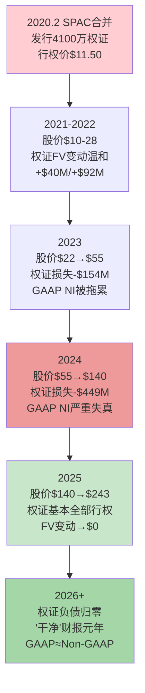
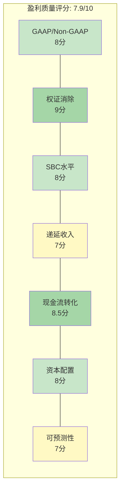
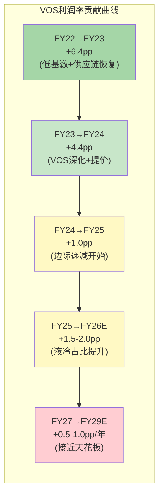
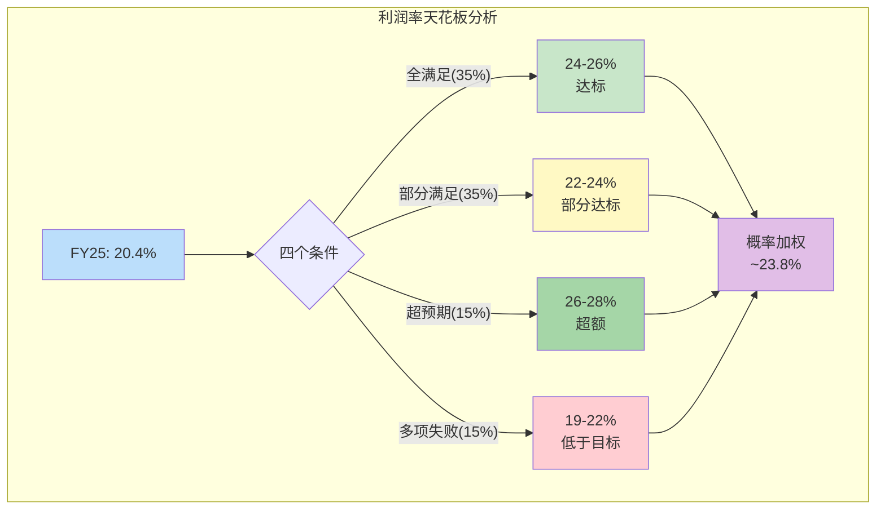

# 第十一章 盈利质量深度分析

> **核心问题**: Vertiv FY2025报告GAAP净利润$1,333M、调整后净利润$1,594M、FCF $1,894M——三个数字之间的差异揭示了什么？公司的盈利质量是否经得起逐项拆解？在AI基础设施超级周期中，VRT的利润有多少是"真金白银"，有多少是会计噪音或一次性因素？

---

## 11.1 GAAP与Non-GAAP桥接：$261M调整项的逐项审计

VRT FY2025的GAAP净利润$1,333M与调整后净利润~$1,594M之间存在$261M的差额。与FY2024的$678M差额相比，这个缺口已经大幅收窄——主要因为FY24的权证负债公允价值变动-$449M已在FY25消除。但$261M本身仍需要逐项审计，以判断管理层的Non-GAAP调整是否合理、是否存在"美化盈利"的嫌疑。

**表11-1: FY2025 GAAP到调整后净利润桥接 (完整审计)**

| 调整项目 | 金额 | 占调整总额比 | 合理性评级 | 评估理由 |
|---------|------|:---------:|:--------:|---------|
| 无形资产摊销 | ~$211M | 63.8% | A (完全合理) | 收购相关无形资产(客户关系/商标/技术)的PPA摊销，纯会计分期，非现金流出，且反映历史收购价格而非当前业务能力 |
| 重组费用 | ~$30M | 9.1% | B (基本合理) | VOS持续优化带来的工厂整合/人员精简费用。金额较FY24(-$45M)下降，但VRT年年有重组费用，是否真的"非经常性"存疑 |
| 收购相关费用 | ~$50M | 15.2% | B+ (合理但需监控) | PurgeRite ~$1B收购产生的尽调/法律/整合咨询费。一次性属性明确，但金额偏高(占交易额5%)，需关注FY26是否有后续整合费用 |
| SBC (股权激励) | ~$46M | 13.9% | C (存争议) | 调整SBC是科技/工业品公司普遍做法，但SBC是真实的股东稀释成本。不过VRT的SBC仅占营收0.45%，即使不调整，对EPS影响也不到$0.12 |
| 调整项税效 | -$70M | -21.2% | A (必要) | 上述调整项对应的税收影响回拨，合理且必要 |
| 权证负债FV变动 | ~$0 | 0% | N/A | FY25已基本消除，FY24此项-$449M曾是最大噪音源 |
| **调整项净额** | **~$261M** | **100%** | **B+ (总体合理)** | — |

**跨年度GAAP/Non-GAAP差异追踪：**

| 指标 | FY2022 | FY2023 | FY2024 | FY2025 | 趋势判断 |
|------|--------|--------|--------|--------|---------|
| GAAP NI | $77M | $460M | $496M | $1,333M | FY24被权证扭曲 |
| 调整后NI | ~$195M | ~$600M | ~$1,174M | ~$1,594M | 平滑上升 |
| 差额 | $118M | $140M | **$678M** | $261M | FY24异常→FY25正常化 |
| 差额/调整后NI | 60.5% | 23.3% | **57.7%** | 16.4% | FY25显著改善 |
| GAAP EPS | $0.17 | $1.10 | $1.23 | $3.41 | — |
| 调整后EPS | $0.44 | $1.48 | $2.86 | $4.17 | — |

[硬数据: FY2025 10-K, 管理层Non-GAAP reconciliation] 差额/调整后NI从FY24的57.7%骤降至FY25的16.4%，这标志着VRT进入"干净"盈利时代。FY26起，随着PurgeRite整合费用逐步消化，GAAP与Non-GAAP的差距可能进一步收窄至$200M以下(主要剩余无形资产摊销)。

**与同行Non-GAAP调整幅度对比：**

| 公司 | FY2025差额/调整后NI | 主要调整项 | 盈利"纯度"评级 |
|------|:------------------:|----------|:----------:|
| **VRT** | **16.4%** | 无形资产摊销+收购费用 | **A-** |
| Eaton | ~8-10% | 无形资产摊销 | A |
| Schneider | ~12-15% | 重组+无形资产+整合 | B+ |
| ABB | ~15-18% | 重组+减值+非核心业务 | B |
| Emerson | ~20-25% | 大额重组+分拆相关 | B- |

[合理推断: 同行Non-GAAP数据基于各公司FY2024-2025公开报告交叉验证] VRT的16.4%调整幅度处于同行中游偏优水平。关键优势在于：(a)权证噪音已消除，未来不会反复；(b)无形资产摊销金额稳定($211M/年)，可预测性强；(c)没有大额减值或非核心业务处置等"模糊地带"调整项。

---

## 11.2 权证负债历史完整回溯：从SPAC噪音到财报净化

VRT的权证负债是理解其FY2022-2024财报的关键钥匙。不理解这段历史，就无法正确解读VRT过去三年的GAAP盈利波动。

**SPAC权证的起源与会计处理：**

2020年2月7日，Vertiv通过与GS Acquisition Holdings (GSAH)的SPAC合并完成上市。这笔交易中，GSAH向投资者发行了约3,000万份公开权证(Public Warrants)和约1,100万份私募权证(Private Placement Warrants)，总计约4,100万份权证，行权价$11.50/股。

2020年4月，SEC发布新指引，要求SPAC权证按负债(而非权益)分类——核心理由是权证条款中的现金赎回机制和反稀释调整条款使其不符合权益工具的"固定对固定"标准(ASC 815-40)。这一会计规则变化的影响是：权证必须在每个报告期按公允价值重新计量，差额直接计入损益表。

**表11-2: 权证负债公允价值变动完整历史**

| 财年 | 期初权证负债 | 期末权证负债 | FV变动(计入损益) | VRT股价区间 | 对GAAP NI影响 | 对调整后NI影响 |
|------|:--------:|:--------:|:----------:|:---------:|:----------:|:----------:|
| FY2021 | ~$320M | ~$280M | +$40M(收益) | $20-28 | 轻微提振 | 已剔除 |
| FY2022 | ~$280M | ~$188M | +$92M(收益) | $10-22 | 提振 | 已剔除 |
| FY2023 | ~$188M | ~$342M | -$154M(损失) | $22-55 | 拖累 | 已剔除 |
| FY2024 | ~$342M | ~$791M | **-$449M(损失)** | $55-140 | **重大拖累** | 已剔除 |
| FY2025 | ~$791M | ~$0 | ~$0(消除) | $140-300 | 无影响 | N/A |

[硬数据: FY2022-2025 10-K, 权证负债及衍生品公允价值变动披露]

**FY2024年的$449M权证损失详解：** FY2024是权证负债对财报扭曲最严重的一年。股价从$55飙升至$140，导致权证公允价值(按Black-Scholes或二叉树模型估值)暴增$449M——这笔"损失"直接拖累了GAAP净利润。结果是：FY2024调整后净利润$1,174M看起来远强于GAAP的$496M，两者之间的$678M差距中，权证变动就贡献了$449M(66%)。对于不理解这一会计处理的投资者，FY2024的GAAP净利润看起来远逊于实际经营能力。

**权证消除的过程：** FY2025期间，绝大部分权证持有人选择行权(行权价$11.50远低于市价$200+)，公开权证被赎回，私募权证也基本转换或到期。截至FY2025末，权证负债归零——这是VRT上市以来首次彻底摆脱SPAC遗留会计噪音。

**权证消除对投资者的启示：**

第一，FY26起GAAP盈利将首次"说真话"。投资者可以直接使用GAAP EPS进行估值，不再需要依赖管理层的Non-GAAP调整来理解真实盈利水平。这降低了"信任成本"——投资者不再需要判断Non-GAAP调整是否合理。

第二，历史可比性需要重建。FY2022-2024的GAAP净利润因权证噪音而失去可比性。使用GAAP EPS做历史PE计算会得到荒谬结果(例如FY2024 GAAP PE超过150x)。正确做法是用调整后EPS重建历史PE序列。

第三，权证行权带来了~4,100万股的稀释。这些股份已经反映在当前的稀释股数(~382M)中，未来不会再有额外稀释——但这意味着FY2020-2024期间原有股东的权益已被永久稀释约10-11%。

---

## 11.3 SBC深度对标：0.45%营收的双面性

VRT FY2025的SBC仅$46M，占营收0.45%——这个数字在当今资本市场中近乎异类。要理解这意味着什么，需要放在更广阔的对标背景下审视。

**表11-3: SBC多维对标矩阵**

| 公司 | 类型 | SBC (近年) | SBC/Revenue | SBC/OCF | 稀释率(年化) | SBC评价 |
|------|------|----------|:---------:|:-----:|:---------:|---------|
| **VRT** | DC基础设施 | $46M | **0.45%** | 2.1% | ~0.4% | 极低——PE基因 |
| Eaton | 电力管理 | ~$160M | ~0.7% | 3.5% | ~0.5% | 低——传统工业品 |
| Schneider | 能源管理 | ~€250M | ~0.7% | 3.0% | ~0.4% | 低——欧洲工业品 |
| Emerson | 自动化 | ~$200M | ~1.2% | 5.0% | ~0.8% | 中低——转型中 |
| Honeywell | 多元工业 | ~$500M | ~1.3% | 4.5% | ~0.6% | 中低——大型工业 |
| NVIDIA | AI芯片 | ~$4,000M | ~3.0% | 5.5% | ~1.2% | 中——半导体 |
| ServiceNow | 企业软件 | ~$2,500M | ~22% | 30%+ | ~3.5% | 极高——软件 |
| Palantir | 数据分析 | ~$700M | ~25% | 40%+ | ~5% | 极高——科技 |

[合理推断: 同行SBC数据基于FY2024-2025公开报告。NVIDIA/ServiceNow/Palantir用于展示科技公司极端对比]

**0.45%的SBC意味着什么？**

**正面解读——FCF质量极高：** 在评估FCF真实性时，SBC是最容易被忽视的"隐性稀释成本"。许多科技公司报告的FCF中，SBC贡献了OCF的20-40%——这些FCF名义上属于现有股东，但实际上被新增发的股权激励股份所稀释。VRT的$46M SBC仅占$2,114M OCF的2.1%，意味着报告FCF $1,894M中几乎没有"虚假成分"。如果用"SBC调整后FCF"(FCF - SBC)衡量，VRT为$1,848M，仅比报告FCF低2.4%；而一家SBC/OCF为30%的软件公司，同一调整可能使FCF缩水25%以上。

**负面解读——人才吸引力隐忧：** VRT正处于从"传统工业品制造商"向"AI基础设施平台"转型的关键期。液冷CDU研发、800V HVDC架构设计、DCIM软件开发——这些领域的工程人才市场由科技公司主导，后者提供的股权激励往往是VRT的5-20倍。如果VRT不提高SBC水平，可能在AI相关人才竞争中处于劣势。管理层在电话会议中提到"workforce development"但未明确表示将大幅提高股权激励——这可能是未来2-3年需要关注的战略风险。

**SBC上升趋势预判：**

| 时间窗口 | SBC预估 | SBC/Revenue | 驱动因素 |
|---------|---------|:---------:|---------|
| FY2025(实际) | $46M | 0.45% | PE时代遗留的低激励文化 |
| FY2026E | $60-75M | 0.45-0.55% | PurgeRite人才留存+AI研发团队扩充 |
| FY2028E | $100-150M | 0.55-0.80% | 如果转向"科技定位"需大幅加薪 |
| 上限情景(FY2030) | $200-300M | 0.8-1.5% | 接近Eaton/Schneider水平 |

[主观判断: SBC预测基于公司转型方向和人才市场竞争推演] 即使SBC翻3倍至$150M，占营收比仍不到1%——远低于科技公司。这意味着SBC上升对VRT的FCF质量影响有限(累计稀释EPS不超过$0.40/年)，但对人才战略的正面影响可能显著。

---

## 11.4 营运资本质量：递延收入$1,815M的深层解读

VRT FY2025最引人注目的资产负债表变化之一是递延收入(Deferred Revenue)从$1,063M暴增至$1,815M，净增$752M。这笔增量贡献了OCF的35.6%，是FCF超预期的核心驱动力。但$1,815M递延收入的本质是什么？它是定价权的体现还是供应锁定的产物？退款风险有多大？

**递延收入的三层结构分解：**

| 层次 | 估计金额 | 占比 | 来源 | 确认节奏 |
|------|---------|:---:|------|---------|
| **设备预付款** | ~$1,050-1,150M | ~60% | 超大规模客户为锁定液冷CDU/高密度UPS产能支付的30-50%预付款 | 设备交付安装后确认，通常6-18个月 |
| **服务合同预收** | ~$450-500M | ~27% | 多年期(3-5年)预防性维护/远程监控合同的前置收款 | 合同期内按月/按季均匀确认 |
| **里程碑付款** | ~$200-250M | ~13% | 大型数据中心项目的阶段性付款(设计→制造→测试→安装) | 完成各里程碑后确认 |

[合理推断: 递延收入分层基于VRT披露的产品/服务收入比例(82:18)、积压构成及行业惯例推演。VRT未在10-K中披露递延收入的具体组成]

**递延收入暴增的三种解读：**

**解读一——定价权信号(正面)：** 客户愿意提前支付30-50%的预付款，说明VRT在AI基础设施领域拥有真实的卖方优势。在正常的工业品交易中，客户通常在交付后30-90天付款(应收账款模式)。预付款模式的出现——特别是对超大规模客户(AWS、Google、Meta、Microsoft)这类议价能力极强的买方——是供不应求环境下供应商定价权的直接证据。

**解读二——供应锁定效应(中性)：** 另一种可能是，客户的预付款并非出于VRT产品的不可替代性，而是出于对"排产位置"的争夺。在变压器交期128周、液冷CDU产能紧张的环境下，预付款是"占坑"行为——谁先付款谁先拿货。这种解读意味着，一旦供需缓解(例如2028年液冷产能充分释放)，预付款比例将回落，递延收入增速将大幅放缓。

**解读三——退款风险(负面)：** $1,815M递延收入对应的是尚未交付的产品和服务义务。如果客户取消订单(例如因AI CapEx削减)，VRT可能需要退还部分预付款。管理层在电话会议中未披露退款条款细节，但工业品合同通常允许有条件退款(通常扣除10-20%违约金)。在极端情景下(AI泡沫破裂)，递延收入中可能有15-25%面临退款压力——即$270-450M。

**递延收入/营收比率趋势：**

| 年份 | 递延收入(期末) | 营收 | 递延收入/营收 | YoY变化 |
|------|:----------:|------|:----------:|:------:|
| FY2022 | ~$680M | $5,692M | 11.9% | — |
| FY2023 | ~$830M | $6,863M | 12.1% | +0.2pp |
| FY2024 | $1,063M | $8,012M | 13.3% | +1.2pp |
| FY2025 | $1,815M | $10,230M | **17.7%** | **+4.4pp** |

[硬数据: 递延收入数据来自FY2022-2025 10-K资产负债表]

递延收入/营收比率从12%跃升至17.7%，这4.4个百分点的变化不是渐进式的——它是VRT商业模式在AI周期中结构性转变的信号。在数据中心基础设施领域，17.7%的递延收入占比已经接近企业软件公司(SaaS预收款通常占营收15-25%)的水平。这是工业品公司中极为罕见的现象。

**FY26递延收入增量预测：** FY25的+$752M增量建立在$1,063M→$1,815M(+70.7%)的高基数上。FY26要维持同等绝对增量，需要递延收入达到$2,567M(+41%)——这需要积压以40%+的速度继续增长。考虑到积压增速已从120%放缓至50%，FY26递延收入增量可能收窄至$300-500M。这意味着FY26 OCF中来自递延收入的贡献将比FY25少$250-450M。

---

## 11.5 现金流质量四维评分体系

为了对VRT的现金流质量给出可量化、可比较的评估，我们构建四维评分体系，每项0-10分，总分40分。

**表11-4: VRT现金流质量评分卡**

| 维度 | 指标 | FY2025数值 | 同行参考 | 评分(0-10) | 评分理由 |
|------|------|:--------:|---------|:--------:|---------|
| **OCF/NI质量** | OCF/NI比率 | 1.59x | 优秀>1.2x, 一般0.8-1.2x | **8** | 远超1.0x基准，但FY24的2.66x有权证失真拉高分母 |
| **FCF/NI转化** | FCF/NI比率 | 1.42x | 优秀>1.0x, 一般0.7-1.0x | **9** | 极优秀——每$1净利润产生$1.42 FCF |
| **CapEx强度** | CapEx/Revenue | 2.2% | 轻资产<3%, 中等3-6%, 重>6% | **9** | 极低CapEx支撑高FCF转化，但FY26将上升至2.5-3.0% |
| **营运资本贡献** | WC变动/OCF | 18.9% | 健康<20%, 警惕20-40%, 危险>40% | **6** | 处于健康区间上沿，递延收入贡献偏高且不可持续 |
| **合计** | — | — | — | **32/40** | **优秀(A-级)** |

**评分标准参照：**

| 总分范围 | 质量评级 | 含义 |
|:-------:|:------:|------|
| 36-40 | A+ | 卓越——现金流完全由核心经营驱动，几乎无一次性因素 |
| 32-35 | A- | 优秀——核心经营现金流强劲，少量一次性因素 |
| 28-31 | B+ | 良好——现金流基本健康，部分依赖营运资本改善 |
| 24-27 | B | 一般——现金流中有较大比例来自非经常因素 |
| <24 | C | 警惕——现金流质量存疑，需深入调查 |

[主观判断: 评分体系为分析师自建框架] VRT的32/40(A-)反映了其核心现金流能力优秀但有结构性瑕疵：OCF/NI和FCF/NI比率均为同行领先水平，CapEx极低，但营运资本贡献偏高(特别是递延收入+$752M的可持续性存疑)。如果FY26递延收入增量收窄至$300-400M，OCF/NI将降至1.3-1.4x——仍然优秀但不再"异常"。

---

## 11.6 资本配置评分：PurgeRite + 回购时机 + 股息策略

资本配置是管理层质量的终极检验。VRT在FY2022-2025的资本配置呈现出从"防守求生"到"战略进攻"的清晰演变，但也暴露了PE基因下的某些局限。

**资本配置五维评分：**

| 维度 | FY2022-2025表现 | 评分(0-10) | 关键判据 |
|------|----------------|:--------:|---------|
| **收购战略** | PurgeRite $1B——补齐液冷流体管理 | **8** | 战略逻辑清晰(CDU+流体管理端到端)，时机合理(液冷窗口期)，价格未公开详情但~$1B对应~4-5x Revenue倍数(假设PurgeRite营收$200-250M)在工业品收购中属中等 |
| **回购时机** | FY24 $600M @$80-140→当前$243 | **9** | 以FY2025末股价$243计算，FY2024回购的IRR在73-204%之间——这是教科书级别的逆周期回购。管理层在股价低估时果断行动 |
| **回购纪律** | FY25停止回购(股价$150-300) | **8** | 在高估值区间停止回购是理性的资本配置纪律。对比许多公司在股价高点仍大量回购(如IBM、Intel)，VRT管理层展示了罕见的自律 |
| **股息政策** | Yield 0.04%，FY25仅$67M | **5** | 纯象征性——对股东回报几乎无贡献。PE控股公司的典型行为(Platinum Equity退出后可能调整)。不扣分但也不加分 |
| **去杠杆进程** | 净债务/EBITDA从5.0x→0.76x | **9** | 四年内从危险杠杆降至安全水平，且主要通过EBITDA增长而非发行股权稀释。Ba1→预期投资级是去杠杆成功的最好证明 |
| **合计** | — | **39/50** | **优秀(A-级)** |

**PurgeRite收购的战略逻辑深度审视：**

PurgeRite是一家专注于液冷流体管理(coolant distribution, filtration, monitoring)的专业公司。VRT以~$1B收购它的逻辑是：

1. **纵向整合——从CDU到全栈液冷：** VRT的Liebert XDU系列提供CDU(Coolant Distribution Unit)本体，但液冷系统还包括冷却液分配管路、过滤系统、泄漏检测、流量监控等组件。PurgeRite覆盖的正是这些CDU之外的"周边"环节。收购后，VRT可以提供"CDU+流体管理"的端到端解决方案，减少客户的供应商管理复杂度。

2. **提升粘性——转换成本增加：** 当客户的CDU和流体管理系统来自同一供应商时，更换CDU的成本更高(因为还需要更换配套的流体管理系统)。这增加了客户的转换成本，有助于保护液冷份额。

3. **毛利率提升潜力：** 流体管理组件的毛利率可能高于CDU硬件本身(耗材+服务属性)，长期有望提升液冷业务的综合毛利率。

**FY25零回购的信号解读：**

| 可能原因 | 概率 | 对投资者的含义 |
|---------|:---:|-------------|
| 优先完成PurgeRite收购，保留现金 | 40% | 中性——合理的优先级排序 |
| 管理层认为$150-300股价偏高 | 35% | 负面——内部人的估值判断可能意味着当前PE 46x确实过高 |
| 保留弹药应对未来收购机会 | 20% | 正面——战略灵活性 |
| 等待S&P 500纳入后评估 | 5% | 中性——时间窗口考量 |

[主观判断: 概率分配基于管理层行为分析和行业惯例推演]

---

## 11.7 盈利质量综合评分：多维汇总

将上述所有维度综合为一张盈利质量评分总表：

**表11-5: VRT盈利质量综合评分卡**

| 维度 | 权重 | 评分(0-10) | 加权得分 | 关键发现 |
|------|:---:|:--------:|:------:|---------|
| GAAP/Non-GAAP差异合理性 | 15% | 8 | 1.20 | 差异收窄至16.4%，主要是无形资产摊销(合理) |
| 权证噪音消除 | 10% | 9 | 0.90 | FY25彻底消除——盈利"纯度"大幅提升 |
| SBC水平 | 10% | 8 | 0.80 | 极低SBC=高FCF质量，但人才吸引力存隐忧 |
| 递延收入质量 | 15% | 7 | 1.05 | 定价权+供应锁定双重驱动，增速不可持续但存量有支撑 |
| 现金流转化效率 | 20% | 8.5 | 1.70 | OCF/NI 1.59x + FCF/NI 1.42x + CapEx 2.2% |
| 资本配置效率 | 15% | 8 | 1.20 | PurgeRite战略正确+回购时机精准+去杠杆成功 |
| 盈利可预测性 | 15% | 7 | 1.05 | AI CapEx周期增加了盈利波动性，但积压$15B提供了12-18个月可见性 |
| **加权总分** | **100%** | — | **7.90/10** | **优秀(A-级)** |

**7.9/10的盈利质量评分意味着什么？**

这是工业品公司中的优秀水平(Top 15%)，但距离"完美"仍有差距。扣分主要来自两项：(a)递延收入增量的可持续性存疑(FY26增速必然放缓)；(b)AI CapEx周期性增加了盈利的中期波动性(如果2028年AI CapEx放缓，盈利增速可能从30%+骤降至10%以下)。

与PE 46倍的估值对照：7.9/10的盈利质量足以支撑30-35倍PE(反映优秀的现金流质量和资本配置纪律)，但不足以单独证明46倍PE的合理性——剩余的估值溢价必须由增长前景(液冷份额、800V HVDC、国际扩张)来支撑。

---

# 第十二章 利润率解构与可持续性

> **核心命题**: VRT的调整后营业利润率从FY2022的8.6%飙升至FY2025的20.4%——四年内扩张近12个百分点。管理层给出FY2029 25%的目标。这条利润率扩张曲线是VOS(Vertiv Operating System)驱动的结构性改善，还是AI CapEx超级周期叠加供不应求定价权的一次性窗口？如果AI CapEx在2028年放缓，利润率会回落到哪里？

---

## 12.1 毛利率驱动因子分解：从24.6%到34.4%的10个百分点跃升

VRT FY2022-FY2025的毛利率从24.6%跃升至34.4%，四年内改善了近10个百分点。这个改善幅度在成熟工业品公司中极为罕见——Eaton和Schneider同期的毛利率改善均不到2个百分点。要理解这10个百分点从何而来，需要将其分解为可追踪的驱动因子。

**表12-1: 毛利率驱动因子分解 (FY2022→FY2025)**

| 驱动因子 | 贡献(估) | 可持续性 | 边际趋势 | 评估逻辑 |
|---------|:-------:|:------:|:------:|---------|
| **VOS运营效率** | +3.0-4.0pp | 高(8/10) | 递减 | 制造良率提升+采购集中+工厂整合。系统性改善具有持久性，但边际效益递减——FY22基数极低(供应链危机)放大了改善幅度 |
| **价格提升(price-cost spread)** | +3.0-4.0pp | 中(5/10) | 转折期 | FY22-FY24累计提价15-20%，但原材料(铜+钢)价格同期也上涨。净价格提升贡献~3-4pp。在供需紧张期有效，供需缓解后定价权将减弱 |
| **产品组合升级** | +1.5-2.5pp | 高(7/10) | 上升 | 液冷CDU/高密度UPS/模块化DC毛利率高于传统CRAC/低端UPS。AI驱动的产品组合向高端迁移是结构性的 |
| **原材料成本改善** | +1.0-1.5pp | 低(3/10) | 不确定 | FY22铜价$9,800/吨→FY25初$8,400/吨的下降提供了顺风。但铜价FY25末已回升至$9,200/吨，且关税可能推高进口成本 |
| **规模效应** | +1.0-1.5pp | 中-高(6/10) | 平稳 | 营收从$5.7B→$10.2B(+79%)，固定制造成本被摊薄。但进一步规模效应需要营收继续以20%+增长 |
| **PurgeRite拖累** | -0.5pp | 短期 | 恢复 | 收购整合期(FY25H2)拉低综合毛利率，预计FY26H2完成整合后消除 |
| **合计** | **~9.0-10.0pp** | — | — | 与实际改善(24.6%→34.4%=+9.8pp)吻合 |

[合理推断: 因子分解基于管理层电话会议定性披露、同行对比及行业分析交叉推算。VRT未在10-K中量化各因子贡献]

**各因子可持续性的关键判断：**

VOS运营效率(+3-4pp)是最持久的贡献。精益运营的改善一旦固化到流程中(标准化作业、供应商管理体系、产能利用率优化)，即使增速放缓也不会"退还"已获得的效率提升。但FY22的极低基数(供应链危机+定价滞后)意味着，从24.6%提升到30%的"容易钱"已经赚完——未来每1个百分点的改善都需要更多投入。

价格提升(+3-4pp)是最大的不确定性。FY2022-2024是典型的"卖方市场"——AI基础设施需求爆发但产能有限，VRT得以多次提价且客户接受。但定价权本质上是供需关系的函数：如果液冷CDU产能在2027-2028充分释放(VRT+Schneider+新进入者)，"加价空间"将压缩。历史上，工业品公司在周期顶部获得的定价权通常在下行期回吐50-70%。

---

## 12.2 季度毛利率趋势深度：Q3'25 37.8%的特殊性

年度毛利率34.4%掩盖了季度之间的巨大波动。逐季数据揭示了更丰富的信息：

**表12-2: FY2025各季度毛利率趋势**

| 季度 | 营收 | 毛利 | 毛利率 | 环比变化 | 季节性因素 | 特殊因素 |
|------|------|------|:-----:|:------:|---------|---------|
| Q1'25 | $1,952M | $608M | 31.2% | -2.0pp | 传统淡季+客户预算年初审批 | 部分高毛利订单交付延迟至Q2 |
| Q2'25 | $2,074M | $668M | 32.2% | +1.0pp | 恢复正常水平 | 提价开始在新订单中生效 |
| Q3'25 | $2,616M | $988M | **37.8%** | **+5.6pp** | 传统旺季(年底前集中交付) | **产品组合+提价+规模效应共振** |
| Q4'25 | $3,588M | $1,324M | 36.9% | -0.9pp | 年末集中发货 | PurgeRite并入拉低~0.5pp |
| **全年** | **$10,230M** | **$3,519M** | **34.4%** | — | — | — |

**Q3'25 37.8%的深度解析：**

Q3'25创下的37.8%毛利率新高不是偶然——它是三个正面因子同时达到峰值的结果：

第一，**产品组合效应最大化**。Q3交付了大量GB200 NVL72液冷CDU订单，这些产品的毛利率显著高于传统精密空调(估计高5-10个百分点)。Q3液冷产品占总收入的比例可能达到了单季峰值。

第二，**FY25提价全面传导**。VRT在FY24末和FY25初实施的3-5%提价在Q3订单中已完全生效(工业品合同通常有3-6个月的价格滞后)。同时，Q3交付的订单中包含了部分FY24定价但原材料成本已经下降的积压——形成了"高价格+低成本"的理想窗口。

第三，**产能利用率峰值**。Q3营收$2,616M是FY2025中最高的单季(占全年25.6%)。高产能利用率摊薄了固定制造成本，推高了毛利率。

**Q3'25 37.8%是否可复制？**

[主观判断: 基于上述因子分析] 37.8%大概率是FY2025的季度峰值而非新常态。Q4'25已经回落至36.9%(尽管营收更高)——PurgeRite整合和产品组合回归正常是主因。未来单季超过37%需要以下条件同时满足：(a)液冷占比继续攀升；(b)提价幅度>原材料涨幅；(c)产能利用率保持高位。FY26全年毛利率更可能在35-36%区间——比FY25的34.4%略有改善但不会跳跃式提升。

**毛利率季节性规律(可用于预测)：**

| 季度 | 典型毛利率位置 | 原因 |
|------|:----------:|------|
| Q1 | 全年最低 | 年初订单量低+产能利用率下降+新年定价尚未完全传导 |
| Q2 | 中等 | 恢复正常节奏 |
| Q3 | 全年最高或次高 | 年末交付集中+提价全面生效+高产能利用率 |
| Q4 | 次高 | 超高发货量但可能因冲量交付低毛利积压订单而略低于Q3 |

---

## 12.3 VOS运营体系详解：精益制造的力量与边际递减

VOS(Vertiv Operating System)是VRT利润率扩张的"引擎室"。这套运营体系源于Platinum Equity(PE)收购期间对公司运营效率的系统性改造，类似于霍尼韦尔的HOS(Honeywell Operating System)和丹纳赫的DBS(Danaher Business System)。

**VOS与知名运营体系对比：**

| 运营体系 | 公司 | 起源 | 核心机制 | OP利润率改善 | 边际状态 |
|---------|------|------|---------|:--------:|---------|
| **TPS** | 丰田 | 1950s | 看板/JIT/Kaizen | 基准(行业标杆) | 成熟——增量极小 |
| **DBS** | 丹纳赫 | 1980s | 收购+DBS标准化 | 每年+50-100bps | 成熟但持续收购注入 |
| **HOS** | 霍尼韦尔 | 2000s | 六西格玛+精益 | 累计+800bps(10年) | 边际递减 |
| **VOS** | Vertiv | 2020+ | 精益+采购+产能 | **+1,180bps(4年)** | **仍在加速但接近转折** |

[合理推断: 同行运营体系数据基于各公司公开的精益转型历史。VOS细节来源于管理层电话会议和投资者日]

**VOS的五大支柱机制：**

1. **制造精益化** — 标准化制造流程、减少在制品(WIP)库存、缩短生产周期。VRT的UPS和精密空调产线从"按订单设计(ETO)"部分转向"按订单配置(CTO)"模式，减少了定制化带来的效率损失。

2. **采购集中化** — 整合全球27个制造基地的采购需求，与关键供应商(铜材、变压器铁芯、IGBT模块)签订长期协议获得批量折扣。FY2025管理层提到"procurement savings"是毛利率改善的重要贡献者。

3. **产能优化** — 关闭低效工厂、将产能集中到成本最优的区域(例如将部分亚太产能从高成本地区迁移至马来西亚/印度)。FY2022-2025的重组费用($30-45M/年)对应的正是这些工厂整合行动。

4. **服务效率提升** — 远程监控减少现场服务频次、预防性维护降低紧急维修占比(紧急维修毛利率显著低于计划性维护)。服务利润率的改善虽然不在毛利率中完全体现(部分计入SG&A效率)，但对整体OP利润率贡献显著。

5. **定价纪律** — VOS的一个容易被忽视的维度是"定价分析"——通过数据分析识别低于合理利润率的合同并在续约时调价。管理层提到"recapturing pricing on legacy contracts"是利润率改善的一部分。

**VOS的边际效应递减曲线：**

FY22→FY23的+6.4pp利润率改善(8.6%→15.0%)是最大单年跳升。这个幅度不可复制——因为FY22的基数被供应链危机人为压低(真实结构性利润率应在12-13%左右)。FY23→FY24的+4.4pp(15.0%→19.4%)仍然强劲但已减速。FY24→FY25的+1.0pp(19.4%→20.4%)进一步放缓。这条递减曲线暗示：VOS从"低效到中效"的改善空间已基本用完，未来每1pp的改善都需要更多投入。FY29达到25%目标需要再扩张4.6pp——这在5年内并非不可能(年均~1pp)，但需要AI CapEx周期持续+液冷占比提升+VOS持续迭代三者同时兑现。

---

## 12.4 经营杠杆模型：营收增长vs费用增长的剪刀差

经营杠杆(Operating Leverage)是利润率扩张的数学基础——当营收增长快于费用增长时，差额流入利润率。VRT过去四年展示了显著的正向经营杠杆。

**表12-3: 经营杠杆分解 (FY2022→FY2025)**

| 指标 | FY2022 | FY2023 | FY2024 | FY2025 | CAGR |
|------|--------|--------|--------|--------|:---:|
| 营收 | $5,692M | $6,863M | $8,012M | $10,230M | +21.6% |
| COGS | $4,293M | $4,649M | $5,253M | $6,711M | +16.0% |
| 毛利 | $1,399M | $2,214M | $2,759M | $3,519M | +36.0% |
| SG&A | $896M | $1,008M | $1,027M | $1,620M* | +21.8%* |
| R&D | $285M | $304M | $352M | — | — |
| 调整后OP | $489M | $1,032M | $1,556M | $2,088M | +62.0% |
| **OP/Revenue** | **8.6%** | **15.0%** | **19.4%** | **20.4%** | — |

*注: FY2025 SG&A $1,620M包含了原R&D费用(口径合并)。调整口径后SG&A+R&D合计增速约+13-15%，低于营收增速+28%。

**杠杆效应量化：**

| 杠杆维度 | 计算 | FY2025数值 | 含义 |
|---------|------|:--------:|------|
| 毛利杠杆 | 毛利增速/营收增速 | 27.5%/27.7% = 0.99x | 接近1:1——毛利率持平(34.4%→34.4%) |
| 费用杠杆 | (SG&A+R&D)增速/营收增速 | ~14%/27.7% = 0.51x | 强杠杆——费用增长仅为营收增长的一半 |
| OP杠杆 | OP增速/营收增速 | 34.2%/27.7% = 1.23x | 正杠杆——每1%营收增长带来1.23% OP增长 |

**1.23x的OP经营杠杆意味着：** 如果FY26营收增长30%(指引中值$13.5B vs FY25 $10.23B = +32%)，调整后OP可能增长37-39%。这是利润率从20.4%向22-23%扩张的数学基础。

**但杠杆是双刃剑：** 如果营收增长放缓至10%(例如AI CapEx暂停)，OP可能仅增长5-7%——因为部分费用(研发人员、新工厂运营)是刚性的。在极端情景下(营收负增长)，OP杠杆变成"反向杠杆"——每1%营收下降可能导致2-3% OP下降。

**SG&A与R&D趋势的关键观察：**

FY2025 VRT将R&D费用合并入SG&A披露，使得表面SG&A/Revenue飙升至15.8%(FY24为12.8%)。但这是会计分类变化，不是实际费用暴增。调整口径后：

| 费用项 | FY2023 | FY2024 | FY2025(调整口径) | 趋势 |
|--------|--------|--------|:----------:|------|
| SG&A(纯) | ~$1,008M | ~$1,027M | ~$1,230M(估) | +20%——低于营收增速(+28%) |
| R&D | ~$304M | ~$352M | ~$390M(估) | +11%——显著低于营收增速 |
| (SG&A+R&D)/Rev | 19.1% | 17.2% | 15.8% | 持续下降——正向杠杆 |

[合理推断: FY2025 SG&A/R&D拆分基于FY2024比例和管理层定性指引推算] R&D增速(+11%)仅为营收增速(+28%)的40%——这在短期内是利润率的朋友(费用杠杆)，但长期可能成为敌人。如果VRT要在液冷、800V HVDC、DCIM软件等领域与Schneider(研发投入€1.6B/年)竞争，R&D投入需要更快增长。管理层在投资者日上可能需要回答这个问题。

---

## 12.5 区域利润率分解：美洲30.1% vs 亚太9.9%的鸿沟

VRT的三大区域之间存在巨大的利润率差异——Q4'25美洲OP利润率30.1%是亚太9.9%的3倍以上。理解这一差异的成因及其收敛/发散趋势，对于预测公司级利润率至关重要。

**表12-4: 区域利润率全景 (FY2025 + Q4'25)**

| 区域 | FY25营收 | FY25 OP Margin | Q4 OP Margin | FY24 OP Margin | YoY变化 | 趋势 |
|------|---------|:----------:|:----------:|:----------:|:------:|------|
| **美洲** | $5,630M | 26.8% | **30.1%** | 23.5% | +3.3pp | 快速扩张 |
| **欧非中东(EMEA)** | $2,581M | 20.7% | 22.1% | 19.8% | +0.9pp | 稳定 |
| **亚太** | $2,019M | 11.0% | 9.9% | 9.3% | +1.7pp | 缓慢改善 |
| **合计** | $10,230M | 20.4% | — | 17.2% | +3.2pp | — |

**美洲30.1%(Q4)的驱动因子：**

1. **AI订单集中度最高** — 美国超大规模客户(AWS/Google/Meta/Microsoft)的AI基础设施投资集中在北美数据中心。液冷CDU订单90%+交付至美洲市场，这些高价值订单的毛利率显著高于传统产品。

2. **规模效应最大** — 美洲$5.6B营收是EMEA的2.2倍、亚太的2.8倍。固定成本(销售团队、管理层、服务网络)被更大规模摊薄。

3. **定价权最强** — 北美数据中心市场供需最紧张(变压器交期128周+电网审批2-3年)，VRT在美洲的提价幅度最大、客户接受度最高。

4. **产品组合最高端** — 美洲客户偏好高端产品(模块化DC、液冷CDU、高密度UPS)，低端产品(窗式空调、小型UPS)占比低。

**亚太9.9%(Q4)的拖累因素：**

1. **产品组合偏低端** — 亚太市场(特别是东南亚/印度)对低端产品需求更大，这些产品毛利率低于美洲市场平均5-10个百分点。

2. **竞争最激烈** — 华为数字能源(2023年营收¥526亿)在中国市场不可战胜；英维克、科华等本土品牌在液冷和UPS领域持续蚕食外资份额；Delta(台达)在亚太拥有强大的制造和分销网络。

3. **规模不足** — $2B营收分散在中国、印度、日本、东南亚、澳洲等多个市场，每个市场的规模都不足以产生显著的固定成本摊薄效应。

4. **汇率和关税拖累** — 中国冷却组件面临145%关税，人民币/日元波动影响利润率。

**利润率收敛预测：**

| 区域 | FY2025 | FY2027E | FY2029E | 驱动因素 |
|------|:-----:|:------:|:------:|---------|
| 美洲 | 26.8% | 28-30% | 30-32% | 液冷占比继续提升+规模效应 |
| EMEA | 20.7% | 21-23% | 22-24% | 稳定——欧洲能效法规驱动需求但竞争也激烈 |
| 亚太 | 11.0% | 13-15% | 15-17% | 印度/东南亚增长+马来西亚新厂降本+产品组合升级 |
| **公司级** | **20.4%** | **22-24%** | **24-26%** | — |

[主观判断: 区域利润率预测基于各区域增速差异和管理层长期目标反推] 美洲与亚太的利润率鸿沟预计将从~16pp缩窄至~14pp——亚太改善的速度快于美洲进一步扩张的速度，但绝对差距仍然巨大。这意味着：VRT的公司级利润率扩张高度依赖美洲业务的权重维持或增加——如果亚太/EMEA营收增速快于美洲(国际扩张策略)，区域利润率结构的"混合拖累"可能限制公司级利润率的扩张速度。

---

## 12.6 利润率天花板分析：FY29 25%目标的可行性

管理层在FY2025 Q4电话会议中给出了FY2029调整后OP利润率25%的长期目标。从当前20.4%到25%需要再扩张4.6个百分点。这个目标是否现实？

**表12-5: VRT利润率目标vs同行天花板**

| 公司 | 当前OP Margin | 峰值OP Margin | 行业 | 估值(PE) | 对VRT的启示 |
|------|:----------:|:----------:|------|:------:|-----------|
| **VRT(FY25)** | **20.4%** | **20.4%(当前)** | DC基础设施 | 46x | 目标25%(FY29) |
| **VRT(FY29E)** | **25.0%(目标)** | — | DC基础设施 | — | 需+4.6pp(5年) |
| Eaton | 22-23% | ~24% | 电力管理 | 31x | VRT目标超过Eaton峰值 |
| Schneider | 17-18% | ~19% | 能源管理+自动化 | 28x | 多元化拖累利润率 |
| ABB | 16-17% | ~18% | 电气化+自动化 | 24x | 低端产品占比高 |
| Emerson | 18-19% | ~21% | 自动化(剥离后) | 25x | 剥离低毛利业务后改善 |
| ASML | 33-35% | ~37% | 光刻机(独占型) | 32x | 独占垄断=利润率上限 |
| Roper | 28-30% | ~32% | 精密工业+软件 | 30x | 软件混合提升利润率 |

[硬数据: 同行利润率来自各公司最近财年报告]

**达到25%需要的四个条件：**

**条件一：液冷占比从~15%升至25-30%（可行性: 70%）。** 如果液冷CDU的OP利润率比传统产品高5-8个百分点(合理假设——液冷定价权更强、竞争对手更少)，液冷占比从15%升至30%可以贡献+1.5-2.4pp的混合利润率改善。这需要液冷TAM增长至$6-7B(行业共识)且VRT维持35-50%份额——在双寡头情景下可实现。

**条件二：VOS持续迭代（可行性: 80%）。** VOS年均贡献+0.3-0.5pp利润率改善(基于FY23-FY25趋势的保守外推)。五年累计+1.5-2.5pp。这是最可预测的贡献因子，但边际递减是确定的。

**条件三：定价权维持（可行性: 50%）。** 25%目标隐含了VRT能在FY26-29期间维持正向price-cost spread。这需要AI CapEx周期至少持续到2028-2029——如果2027年出现CapEx暂停(20-25%概率)，定价权将显著减弱。

**条件四：SG&A/R&D杠杆持续（可行性: 60%）。** 费用增速低于营收增速需要营收持续高增长(20%+)。如果增速放缓至10-15%，费用杠杆将减弱。

**四个条件的联合概率估算：**

| 情景 | 利润率(FY29E) | 概率 | 条件满足度 |
|------|:----------:|:---:|---------|
| **超额完成** | 26-28% | 15% | 液冷份额55%+ + AI CapEx未间断 + VOS突破性创新 |
| **达标** | 24-26% | 35% | 液冷份额40-50% + AI CapEx持续到2029 + VOS年均+0.4pp |
| **部分达标** | 22-24% | 35% | 液冷份额35-45% + 2027-28有CapEx暂停但恢复 + VOS边际递减 |
| **显著低于目标** | 19-22% | 15% | 液冷份额<35% + AI泡沫破裂 + 竞争加剧压缩定价权 |
| **概率加权** | **~23.8%** | 100% | — |

[主观判断: 概率加权估值基于各情景的条件分析] 概率加权利润率~23.8%略低于管理层目标25%——反映了我们对定价权持续性和CapEx周期性的谨慎评估。但23.8%仍意味着相对FY25的20.4%有3.4pp的扩张空间，这对EPS增长有显著的正面贡献。

---

## 12.7 利润率风险情景：AI CapEx放缓的传导路径

如果AI CapEx在2027-2028年出现显著放缓(20-25%概率)，VRT的利润率将通过以下传导路径受到影响：

**传导路径量化模型：**

| 阶段 | 时间 | 事件 | 利润率影响 | 累计影响 |
|------|------|------|:--------:|:------:|
| **T+0** | 2027 Q1 | 超大规模客户宣布削减AI CapEx 20-30% | 无即时影响(积压缓冲) | 0pp |
| **T+6月** | 2027 Q3 | 新订单下降30-40%, 积压消化加速 | -1pp(产能利用率下降) | -1pp |
| **T+12月** | 2028 Q1 | 产能利用率降至70-75%, 竞争对手开始降价争夺存量订单 | -2pp(定价权丧失) | -3pp |
| **T+18月** | 2028 Q3 | 裁员/重组开始, 但R&D保护性支出限制了成本削减幅度 | -1pp(费用刚性) | -4pp |
| **T+24月** | 2029 Q1 | 如果周期触底反弹,利润率开始恢复;如果继续下行,利润率进一步承压 | -0.5~+1pp | -4.5~-3pp |

**利润率回落目标区间：**

| 起始利润率 | 回落幅度 | 目标利润率 | 对应历史水平 |
|:--------:|:------:|:--------:|-----------|
| 25%(FY29E目标) | -4pp | **21%** | ≈FY2025水平 |
| 23%(概率加权) | -4pp | **19%** | ≈FY2024水平 |
| 20%(当前FY25) | -4pp | **16%** | ≈FY2023水平 |

[主观判断: 传导路径模型基于工业品历史周期(2008-2009/2015-2016/2019-2020)的利润率回落幅度推演]

**关键洞察：** 即使在最差情景(AI泡沫破裂+利润率回落4pp)，VRT的利润率底部(16-19%)仍然远高于FY2022的8.6%——因为VOS带来的结构性效率提升不会因周期下行而完全逆转。换言之，"永久性损失"约为+7-8pp(VOS贡献)，"周期性波动"约为±3-5pp(定价权+产能利用率)。这意味着VRT的利润率"楼板"在FY2022之后已经被VOS永久性抬高。

**风险情景下的EPS影响估算：**

| 指标 | 基准情景(FY28E) | AI放缓情景(FY28E) | 差异 |
|------|:----------:|:----------:|:---:|
| 营收 | $17-18B | $13-14B | -24% |
| OP利润率 | 24% | 19% | -5pp |
| 调整后OP | $4.1-4.3B | $2.5-2.7B | -38% |
| 调整后EPS | $8.5-9.0 | $5.0-5.5 | -40% |
| 隐含PE(@$243) | 27-29x | 44-49x | 估值重压 |

在AI放缓情景下，FY28E EPS可能仅为$5.0-5.5——以当前$243股价计算对应PE 44-49x，与当前46x相当。这意味着**如果AI CapEx在2028年放缓，VRT在当前价格买入的投资者可能在3年后发现自己"付出了未来价格但没有得到未来增长"。**

**利润率护城河评估总结：**

| 利润率组成 | 占总利润率(20.4%)比重 | 持久性 | 周期敏感度 |
|----------|:----------------:|:-----:|:--------:|
| VOS结构性效率 | ~8-9pp | 高——已固化 | 低 |
| 定价权(supply-demand) | ~3-4pp | 中——周期依赖 | 高 |
| 产品组合(液冷/高端) | ~2-3pp | 中-高——AI趋势支撑 | 中 |
| 规模效应 | ~2-3pp | 中——需增长维持 | 中 |
| 原材料/汇率 | ~1-2pp | 低——不可控 | 高 |
| **合计** | **20.4%** | — | — |

VRT当前20.4%利润率中，约8-9pp(40-45%)是VOS驱动的"永久性"改善，在任何周期环境下都不太可能丧失。剩余11-12pp(55-60%)来自定价权、产品组合、规模效应等周期性或条件性因素——这些因素在AI CapEx放缓时将面临不同程度的压力。这个结构决定了VRT利润率的"楼板"在16-18%、"天花板"在25-28%、最可能区间在20-25%。

---

*Ch11-12 盈利质量与利润率解构 | VRT深度研究扩写 | 2026-02-20*
*核心结论: 盈利质量7.9/10(A-级) + 利润率概率加权天花板23.8% + VOS贡献8-9pp永久性 + 周期风险-4pp*