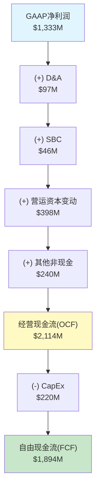
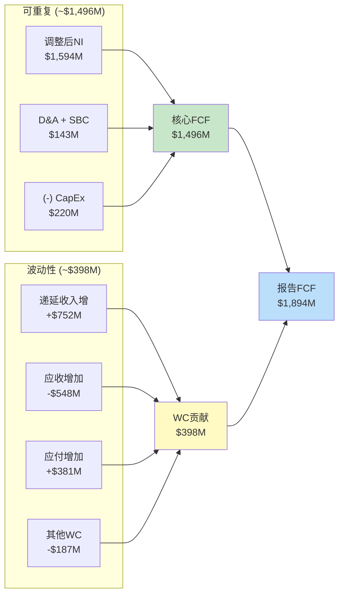
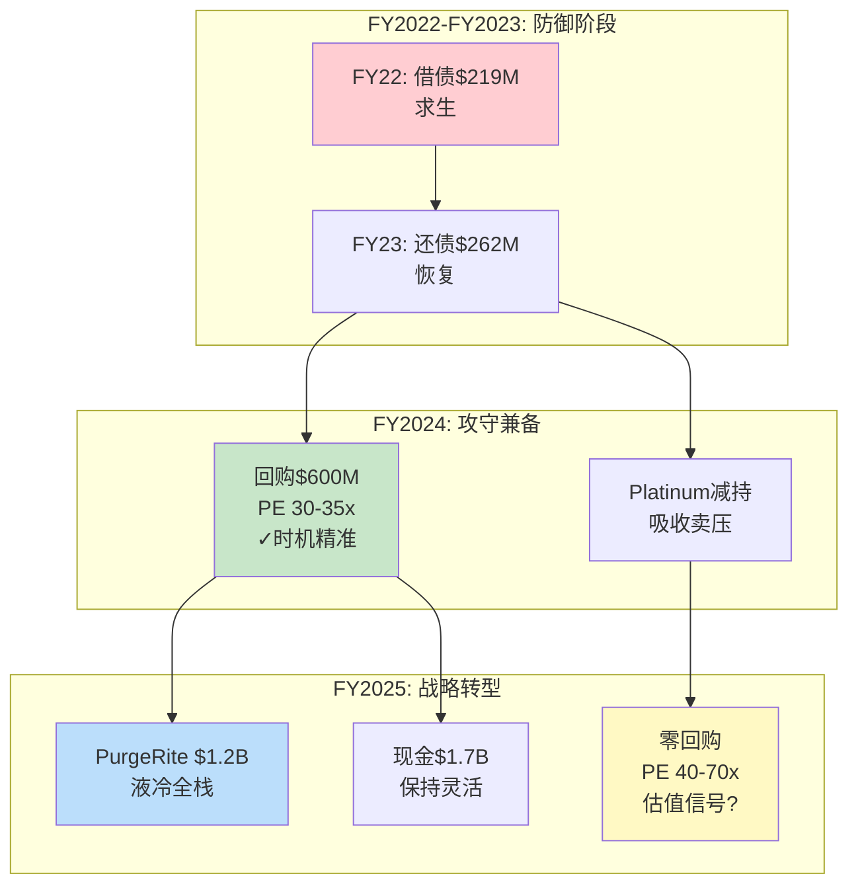
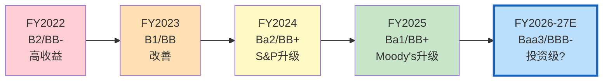
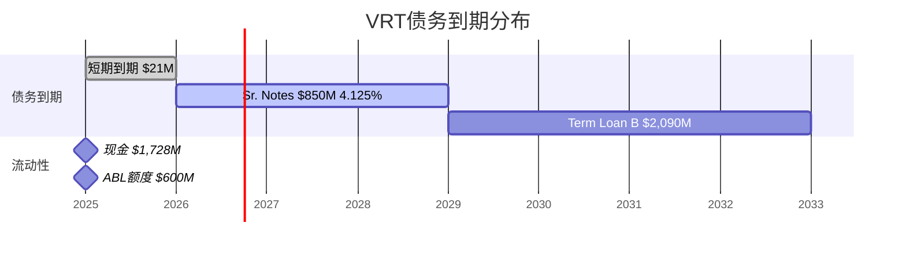

# 第十三章 自由现金流可持续性与资本配置

> **核心问题**: VRT的FCF从FY2022的-$264M飙升至FY2025的$1,894M，四年内实现$2.2B的净现金流改善。这一转变是结构性的还是周期性的？哪些组成部分在FY26及以后仍可复制？

---

## 13.1 FCF四年趋势：从负现金流到近$2B的转变

Vertiv的自由现金流轨迹是过去四年最引人注目的财务叙事之一。从FY2022的负$264M到FY2025的正$1,894M，$2.2B的净改善不是来自单一因素，而是盈利能力爆发、营运资本优化、CapEx克制三者共振的结果。

**表13-1: FCF四年完整趋势**

| 指标 | FY2025 | FY2024 | FY2023 | FY2022 | FY25 vs FY22变化 |
|------|--------|--------|--------|--------|:---:|
| 营业收入 | $10,230M | $8,012M | $6,863M | $5,692M | +79.7% |
| GAAP净利润 | $1,333M | $496M | $460M | $77M | +17.3x |
| 经营现金流(OCF) | $2,114M | $1,319M | $901M | -$153M | N/M |
| 资本支出(CapEx) | -$220M | -$184M | -$135M | -$111M | +98.2% |
| **自由现金流(FCF)** | **$1,894M** | **$1,135M** | **$766M** | **-$264M** | **N/M** |
| OCF/NI | 1.59x | 2.66x | 1.96x | -2.0x | — |
| FCF/NI | 1.42x | 2.29x | 1.66x | -3.4x | — |
| CapEx/Rev | 2.2% | 2.3% | 2.0% | 2.0% | +0.2pp |
| FCF Margin | 18.5% | 14.2% | 11.2% | -4.6% | +23.1pp |

**从负FCF到近$2B正FCF的四重驱动力**：

**驱动力一：盈利能力的阶梯式跃升**。FY2022的GAAP净利润仅$77M，这是供应链危机（芯片短缺、物流成本飙升）+定价滞后（合同价格无法即时传导原材料涨价）的叠加结果。FY2023-FY2025，VOS（Vertiv Operating System）精益运营体系发力，叠加价格追赶+产品组合升级，GAAP NI从$77M跃升至$1,333M。但需注意，FY2024的GAAP NI仅$496M，被权证负债公允价值变动-$449M严重扭曲；调整后NI约$1,174M，与FY25的$1,594M调整后NI之间的增长更平滑（约+36%）。

**驱动力二：营运资本从拖累变为助力**。FY2022营运资本变动为-$449M，这主要是应收账款增加$368M（客户拖欠）+存货增加$211M（被迫囤货应对供应链不确定性）的结果。到FY2025，营运资本变动翻转为+$398M，核心贡献来自递延收入暴增$752M——客户预付款大幅增加，反映了AI基础设施需求的紧迫性。

**驱动力三：D&A+非现金项目的稳定加回**。D&A从FY2022的$302M降至FY2025的$97M（FMP口径；按损益表D&A为$309M，差异来自加速摊销的会计处理）。但SBC从$25M升至$46M（仍然极低），其他非现金项目提供了额外$217M的OCF加回。

**驱动力四：CapEx保持克制**。尽管营收增长80%，CapEx仅从$111M增至$220M——CapEx/Revenue维持在2.0-2.3%的狭窄区间。这是"轻资产"制造商的典型特征：VRT的制造以组装为主，不需要半导体级别的重资产投入。

**OCF/NI比率的变化轨迹值得特别关注**：FY2024的2.66x异常偏高，并非因为OCF特别强，而是因为GAAP NI被权证损失压低至$496M。FY2025的1.59x更能反映正常化后的现金转化效率——每赚$1净利润产生$1.59现金，这在工业品公司中属于优秀水平，但不如FY2024数字暗示的那般"异常"。

---

## 13.2 OCF组成详解：$752M递延收入增量的可持续性

FY2025经营现金流$2,114M的构成需要逐项拆解，才能判断哪些组成部分是可重复的，哪些是一次性的。

**表13-2: FY2025 OCF组成详解**

| OCF组成项 | FY2025 | 占OCF比 | 性质 |
|----------|--------|:------:|------|
| GAAP净利润 | $1,333M | 63.1% | 核心——可重复 |
| D&A（折旧摊销） | $97M | 4.6% | 非现金——可重复 |
| SBC（股权激励） | $46M | 2.2% | 非现金——可重复且微量 |
| 递延所得税 | $23M | 1.1% | 时间性差异——波动 |
| 应收账款增加 | -$548M | -25.9% | 营运资本——随营收增长 |
| 存货增加 | -$165M | -7.8% | 营运资本——为产能扩张备货 |
| 应付账款增加 | +$381M | 18.0% | 营运资本——议价能力改善 |
| **其他营运资本（含递延收入）** | **+$729M** | **34.5%** | **核心关注项** |
| 其他非现金项目 | $217M | 10.3% | 混合——部分可重复 |
| **合计OCF** | **$2,114M** | **100%** | — |

**"其他营运资本"$729M的核心是递延收入变动**。Vertiv的递延收入从FY2024的$1,063M（流动）+$91M（非流动）= $1,154M，跃升至FY2025的$1,815M（流动）+$0M（非流动重分类）= $1,815M，净增约$661M（FMP口径）。管理层在电话会议中确认，递延收入增加超过$750M，反映了以下三个因素：

第一，**超大规模客户的预付款增加**。AWS、Google、Meta等超大规模客户为锁定VRT在AI基础设施领域的产能（特别是液冷CDU和高密度UPS），愿意支付更大比例的预付款。这是供不应求环境下供应商议价能力的直接体现。

第二，**长期服务合同的前置收款**。VRT的服务业务（占营收约35%）越来越多地采用多年期预付模式，客户一次性支付3-5年服务费以获得优先响应保障。这些预收款在合同期内逐步确认收入。

第三，**大型项目的里程碑付款**。数据中心建设项目通常在下单时支付30-50%预付款，交付安装后支付余款。AI基础设施超级周期推动了大量新项目启动，产生了超常的预付款流入。

**可持续性评估**：递延收入增量的增速必然放缓。FY2025的+$752M增量建立在$1,063M→$1,815M的70.7%增长基础上。FY2026要维持同等绝对增量，需要递延收入从$1,815M增至$2,567M（+41%）——这需要积压订单继续以40%+的速度增长才能实现。考虑到积压已高达$15B且增速从120%放缓至50%，FY26递延收入增量可能收窄至$300-500M。这意味着FY26 OCF中来自递延收入的贡献将比FY25少$250-450M，是OCF增速可能低于NI增速的主要原因。

---

## 13.3 CapEx分析：轻资产模型的优势与产能扩张的必要性

**表13-3: CapEx强度与同行对比**

| 公司 | CapEx/Rev (FY25) | 业务性质 | CapEx用途 |
|------|:---:|------|------|
| **VRT** | **2.2%** | DC基础设施制造+服务 | 组装线+新厂+IT系统 |
| Eaton | ~3.5% | 电力管理+车辆+航空 | 制造+研发设施 |
| Schneider | ~3.0% | 能源管理+自动化 | 全球制造网络 |
| ABB | ~3.2% | 电气化+自动化+运动 | 工厂+研发 |
| ASML | ~5.5% | 光刻机(独占型) | 精密制造+洁净室 |

VRT的2.2% CapEx强度在同行中最低，反映了其"轻资产"制造商特征。VRT的产品（UPS、配电单元、精密空调、CDU）以组装和系统集成为主，核心零部件（变压器铁芯、IGBT模块、铜管散热器）外购。这与半导体设备公司（需要精密加工和洁净室）或重型电气设备公司（需要锻造和铸造车间）形成鲜明对比。

**CapEx用途分解（FY2025 $220M估计）**：

维护性CapEx约占40%（~$88M）：现有全球27个制造基地的设备更换、厂房维护、IT系统升级。VRT的制造设施分布在美洲12个、EMEA 9个、亚太6个站点，年度维护支出相对稳定。

增长性CapEx约占60%（~$132M）：核心项目包括——(1)马来西亚新制造基地建设，这是VRT"Local+1"供应链战略的关键一环，旨在减少对中国制造的依赖；(2)液冷CDU产能扩张，VRT已将CDU产能扩大45倍，但仍需继续扩产以匹配$15B积压的交付需求；(3)印度和墨西哥的产能扩张，服务北美和亚太的增量需求。

**FY26E CapEx预期**：管理层尚未给出明确CapEx指引，但基于以下推理，FY26 CapEx可能升至$280-350M（营收占比2.5-3.0%）：
- 马来西亚新厂建设进入高投入期
- 液冷产能继续扩张以匹配GB300/Rubin周期需求
- 美国本土产能扩张响应"制造业回流"政策激励
- PurgeRite整合可能需要额外设施投入

即使CapEx升至$350M，FCF Margin仍将维持在15%+水平——这是VRT商业模式的结构性优势。

---

## 13.4 FCF可持续性评估矩阵

**表13-4: FCF组成部分的可持续性评估**

| FCF组成 | FY25贡献 | FY26E预期 | 可持续性 | 置信度 |
|---------|---------|----------|:------:|:----:|
| 核心经营利润(调整后NI) | $1,594M | $2,000-2,200M | 高 | 70% |
| D&A加回 | $97M | $120-140M | 高 | 85% |
| SBC加回 | $46M | $55-65M | 高 | 80% |
| 营运资本变动(含递延收入) | +$398M | +$100-250M | 中 | 55% |
| 其他非现金项目 | +$217M | +$100-150M | 中 | 50% |
| (-) CapEx | -$220M | -$280-350M | 可预测 | 75% |
| **FCF** | **$1,894M** | **$1,950-2,250M** | **中-高** | **65%** |

**核心FCF（剔除营运资本变动）的真实水平**：

如果从OCF中完全剔除营运资本变动的贡献，FY2025的"核心OCF"为$2,114M - $398M = $1,716M，对应核心FCF为$1,716M - $220M = $1,496M。这个$1,496M代表了VRT通过日常经营活动（不依赖营运资本改善）产生的真实现金流能力。

以$1,496M核心FCF计算：
- 核心FCF/调整后NI = 0.94x — 接近1:1，质量优秀
- 核心FCF Margin = 14.6% — 仍然强劲
- 核心FCF Yield = $1,496M / $93,000M市值 = 1.6% — 估值压力更明显

这个1.6%的核心FCF Yield意味着**即使剔除所有一次性因素，投资者在当前价格买入VRT，需要63年才能通过FCF收回投资**（假设FCF不增长）。当然FCF会增长——但需要增长到多少才能justify当前估值，这是第十五章估值部分需要回答的问题。

---

## 13.5 资本配置历史：从PE基因到成长型工业公司

Vertiv的资本配置策略经历了从"还债为主"到"攻守兼备"的显著转变，这反映了管理层对公司财务状况和市场机遇评估的实时调整。

**表13-5: 资本配置全景(FY2022-FY2025)**

| 用途 | FY2025 | FY2024 | FY2023 | FY2022 | 四年总计 | 评价 |
|------|--------|--------|--------|--------|---------|------|
| 收购 | -$1,185M | -$18M | -$17M | -$5M | -$1,225M | FY25 PurgeRite转折点 |
| 回购 | $0 | -$600M | $0 | $0 | -$600M | 时机精准(FY24) |
| 股息 | -$67M | -$42M | -$10M | -$4M | -$123M | 象征性，不构成资本配置 |
| 去杠杆(净) | -$21M | -$21M | -$262M | +$219M | -$85M | FY22借债，FY23开始还 |
| CapEx | -$220M | -$184M | -$135M | -$111M | -$650M | 持续低强度 |
| 投资组合(净) | -$90M | $0 | $0 | $0 | -$90M | FY25短期投资 |
| **现金净积累** | **+$557M** | **+$444M** | **+$515M** | **-$174M** | **+$1,342M** | 现金从$273M→$1,728M |

**FY2022：求生模式**。净借入$219M应对运营现金流为负的困境。CapEx压至最低$111M。股息仅$4M——几乎为零。这是PE控股公司在供应链危机中的典型防御策略：保住流动性，等待转机。

**FY2023：恢复元气**。FCF翻正至$766M。优先去杠杆，偿还$262M债务。不回购、不大额收购——保守策略，重建财务弹性。

**FY2024：攻守兼备**。FCF继续增长至$1,135M。大手笔回购$600M，时机在股价$80-140区间，以FY25末$243计算，回购收益率已达73-204%——这是过去四年最精准的资本配置决策。同时，Platinum Equity继续减持，回购部分吸收了大股东的卖出压力。

**FY2025：战略转型年**。停止回购，将$1,185M投入PurgeRite收购。这一选择传递了三重信号：(a)管理层认为液冷是长期战略方向，愿意为此支付$1B+；(b)在股价$150-300区间停止回购，可能意味着管理层自身认为估值偏高；(c)保留$1,728M现金+$600M未使用信贷额度，为未来机会保持财务灵活性。

---

## 13.6 PurgeRite收购深度分析

PurgeRite收购是VRT自2020年SPAC上市以来最大的战略性资本配置行动，也是理解管理层对液冷战略commitment深度的关键窗口。

**收购概要**：

| 维度 | 详情 |
|------|------|
| 收购标的 | PurgeRite Holdings（液冷流体管理解决方案） |
| 交易规模 | ~$1,185M（包含对价+交易费用） |
| 完成时间 | FY2025 Q2-Q3 |
| 对价方式 | 全现金——未发行股票，不稀释现有股东 |
| 会计影响 | 商誉+$713M / 无形资产+$408M / 其他净资产+$64M |

**PurgeRite的业务本质**：PurgeRite提供数据中心液冷系统的流体管理服务——包括冷却液的清洁、过滤、监测、和回路管理。这不是CDU硬件制造（VRT已有），而是液冷系统运行所必需的配套服务和耗材。

这个收购的战略逻辑类似于**打印机公司收购墨盒业务**：CDU是硬件（一次性收入），流体管理是耗材+服务（经常性收入）。在液冷数据中心中，冷却液需要定期更换和净化，管路需要持续监测和维护——这些是CDU安装后持续产生的服务需求。

**收购溢价评估**：商誉$713M占收购总价的约60%。这个比例偏高，意味着VRT为PurgeRite的"战略价值"（而非账面资产）支付了显著溢价。参考同行业收购：Eaton以$95亿收购Boyd（商誉占比待确认），Schneider以~$8亿收购Motivair。在液冷领域的"军备竞赛"中，收购溢价反映的是稀缺标的的竞争性竞标。

**年营收与毛利率估计**：PurgeRite作为私人公司未公开财务数据。但基于$1,185M收购价和约12-15x EV/Revenue的液冷领域收购倍数推算，PurgeRite年营收可能在$80-100M区间。如果按15-20x EV/EBITDA推算，年EBITDA约$60-80M，隐含毛利率可能在50%+（服务/耗材业务的典型水平）。

**整合风险与时间线**：管理层在Q4电话会议中确认PurgeRite整合"按计划推进"。Q4毛利率36.9%较Q3的37.8%略降0.9pp，部分可归因于PurgeRite整合期的成本拖累。预计FY26H1完成全面整合，整合后预期增厚EPS $0.05-0.10/年（直接财务影响有限，战略意义>短期盈利）。

---

## 13.7 FCF收益率与估值含义

**表13-6: FCF Yield的估值含义**

| FCF Yield假设 | 隐含市值 | vs 当前市值 | 所需FCF增速 |
|:---:|:---:|:---:|:---:|
| 1.0% (科技成长) | $189,400M | 2.0x | 需FCF达$1,894M的2x |
| 2.0% (当前) | $94,700M | 1.0x | 已达到 |
| 3.0% (成长型工业) | $63,100M | 0.68x | 需FCF维持$1,894M不增长 |
| 4.0% (成熟工业) | $47,350M | 0.51x | 当前市值的一半 |
| 5.0% (价值型工业) | $37,880M | 0.41x | FCF需翻2.5x才能在此yield支撑$93B |

**核心洞察**：如果VRT被市场重新定价为"成熟工业品公司"（4% FCF Yield），其合理市值仅$47B——当前$93B的一半。反过来说，要在4% FCF Yield下支撑$93B市值，VRT需要将FCF从$1,894M增长至$3,720M——接近翻倍。以FY2025营收$10.2B和18.5% FCF Margin计算，这需要营收达到$20B+（假设FCF Margin维持不变）或FCF Margin提升至25%+。两种路径都需要AI基础设施超级周期持续至少3-5年。

**与同行FCF Yield对比**：

| 公司 | FCF (TTM) | 市值 | FCF Yield | PE (TTM) |
|------|----------|------|:---:|:---:|
| **VRT** | **$1,894M** | **$93B** | **2.0%** | **46x** |
| Eaton (ETN) | ~$3,500M | ~$140B | ~2.5% | ~36x |
| Schneider (SBGSY) | ~$4,200M | ~$130B | ~3.2% | ~30x |
| Emerson (EMR) | ~$2,800M | ~$70B | ~4.0% | ~37x |

VRT的2.0% FCF Yield是同行中最低的，反映了市场对其增长前景给予的"AI溢价"。但这也意味着VRT对增长预期的依赖最强——一旦增长故事出现裂缝，FCF Yield向3-4%回归将直接导致股价腰斩。

---

## 13.8 股息与回购策略：PE基因的遗产

**股息分析**：FY2025股息支出$67M，对应约$0.17/股，yield仅0.04%。这是纯象征性的股息——其存在价值不在于给股东分红，而在于为未来（获得投资级评级后）提升股息奠定制度基础。PE出身的公司通常视股息为"低优先级"——Platinum Equity时代建立的资本配置哲学是：所有自由现金流用于去杠杆和增长，而非分红。

**回购策略的深层解读**：

FY2024的$600M回购和FY2025的零回购形成了鲜明对比，这组合传递的信号比任何单年数据都更有信息量。

FY2024回购$600M的背景：(1)Platinum Equity继续减持——回购部分吸收了卖出压力；(2)股价$80-140区间，对应PE约30-35x（按调整后EPS）——管理层显然认为这个估值水平具有吸引力；(3)FCF $1,135M足以支撑回购而不影响财务健康。

FY2025停止回购的背景：(1)PurgeRite收购消耗$1,185M——优先级最高的资本配置；(2)股价从$140升至$300+区间，对应PE 40-70x——回购的性价比显著下降；(3)Platinum持股降至~4.7%——减持压力基本消除，不再需要回购"托底"。

**管理层估值判断的隐含信号**：FY24在PE 30-35x积极回购 + FY25在PE 40-70x停止回购 → 管理层的行为暗示其内部估值锚定在PE 30-40x区间。当前PE 46x超出了这个区间，这是一个值得投资者注意的信号——虽然管理层不会公开说"我们的股票被高估了"，但资本配置行动比言辞更诚实。

---

## 13.9 本章结论：真实FCF能力与估值张力

Vertiv的FCF故事有三层：

**第一层（表面）**：FY25 FCF $1,894M，FCF Margin 18.5%，看起来像一台印钞机。

**第二层（剥离后）**：核心FCF（剔除营运资本一次性贡献）约$1,496M。递延收入增量$752M的增速将在FY26放缓，核心FCF代表了更可持续的现金生成能力。

**第三层（估值视角）**：即使以$1,894M报告FCF计算，2.0% FCF Yield意味着市场对VRT的定价包含了极高的增长预期。核心FCF Yield 1.6%更加紧张。要在成熟工业品的4% FCF Yield标准下支撑$93B市值，FCF需要接近翻倍——这需要AI基础设施超级周期的强劲持续。

资本配置方面，VRT的管理层展现了良好的战略判断力——FY24在低位回购、FY25聚焦液冷收购——但FY25零回购本身可能是管理层对自身估值水平的一个无声评论。

---

# 第十四章 资产负债表与债务深度分析

> **核心问题**: VRT从Platinum Equity PE buyout的高杠杆起点，在四年内完成了教科书级的去杠杆。这一过程中，EBITDA翻3.6倍和现金积累各贡献了多少？投资级评级何时到来，又意味着什么？

---

## 14.1 去杠杆的完整故事：PE Buyout到投资级门槛

Vertiv的去杠杆路径是PE buyout后续公开市场表现的经典案例。2016年Platinum Equity以$40亿从Emerson Electric手中收购了当时的Vertiv（原Emerson Network Power），随后通过SPAC于2020年上市。上市时公司背负超过$30亿债务，净债务/EBITDA高达5x+——典型的PE杠杆收购遗产。四年后的FY2025，净债务/EBITDA降至0.76x，距离投资级评级仅一步之遥。

**表14-1: 去杠杆全景(FY2022-FY2025)**

| 指标 | FY2025 | FY2024 | FY2023 | FY2022 | FY25 vs FY22 |
|------|--------|--------|--------|--------|:---:|
| 总债务 | $3,403M | $3,317M | $3,126M | $3,368M | +$35M (+1%) |
| 现金及等价物 | $1,728M | $1,232M | $789M | $273M | +$1,455M |
| **净债务** | **$1,675M** | **$2,085M** | **$2,338M** | **$3,095M** | **-$1,420M (-46%)** |
| EBITDA | $2,206M | $1,193M | $1,024M | $617M | +$1,589M (+258%) |
| **净债务/EBITDA** | **0.76x** | **1.75x** | **2.28x** | **5.02x** | **-4.26x** |
| 利息费用 | $86M | $150M | $219M | $147M | -$61M (-41%) |
| EBIT | $1,897M | $916M | $753M | $314M | +$1,583M |
| **利息覆盖倍数** | **22.0x** | **9.2x** (EBIT/IE) | **4.1x** (EBIT/IE) | **1.5x** | **+20.5x** |
| 流动比率 | 1.55 | 1.65 | 1.74 | 1.66 | -0.11 |
| D/E | 0.86x | 1.36x | 1.55x | 2.34x | -1.48x |

**关键洞察：总债务几乎没有减少，去杠杆完全靠"分子扩张"**。

从FY2022到FY2025，总债务实际上从$3,368M微增至$3,403M（+1%）。净债务/EBITDA从5.02x降至0.76x，4.26x的改善拆分如下：

**EBITDA翻3.6倍的贡献**：假设净债务不变（维持$3,095M），仅靠EBITDA从$617M增至$2,206M，净债务/EBITDA将从5.02x降至1.40x → 贡献了3.62x的改善，占总改善的85%。

**现金积累$1,455M的贡献**：净债务从$3,095M降至$1,675M（-$1,420M），以FY25 EBITDA $2,206M计算，这贡献了额外0.64x的改善，占总改善的15%。

换言之，VRT的去杠杆故事85%靠"赚得更多"而非"还得更多"。这是好事——说明公司核心盈利能力的改善是结构性的——但也意味着如果EBITDA增长停滞或回落，杠杆率可能快速回升。

**利息费用从FY23的$219M骤降至FY25的$86M**，降幅60%。这不仅来自净债务减少，更来自FY24的债务再融资——将Term Loan利率从SOFR+350bps降至SOFR+175bps。利息费用节省直接贡献约$130M/年的税前利润改善。

---

## 14.2 债务结构详解：浮动利率风险与再融资窗口

**表14-2: 债务结构明细**

| 债务工具 | 金额 | 利率 | 类型 | 到期日 | 风险评级 |
|---------|------|------|:---:|:---:|:---:|
| Term Loan B | ~$2,090M | SOFR+175bps | 浮动 | 2032 | 低 |
| Sr. Secured Notes | $850M | 4.125% | 固定 | 2028.11 | 中 |
| 融资租赁 | ~$245M | 各异 | — | 分散 | 低 |
| ABL循环信贷 | 额度$600M | — | — | — | 未使用 |
| 短期债务(当期到期) | $21M | — | — | — | 极低 |
| **合计** | **$3,403M** | 加权~5.0% | — | — | — |

**浮动利率风险分析**：

Term Loan B约$2,090M采用SOFR+175bps浮动利率，占总债务的61%。以2025年底SOFR约4.3%计算，实际利率约6.05%。浮动利率占比72%（含部分融资租赁）意味着VRT的利息费用对美联储利率政策高度敏感。

| SOFR情景 | Term Loan实际利率 | 年利息费用(TL部分) | vs 当前差异 |
|:---:|:---:|:---:|:---:|
| 3.0% (降息周期) | 4.75% | ~$99M | -$27M |
| 4.3% (当前) | 6.05% | ~$126M | 基准 |
| 5.5% (加息回归) | 7.25% | ~$151M | +$25M |

如果美联储维持高利率甚至重新加息，VRT的利息费用将从当前水平上升。但以22x利息覆盖率计算，即使SOFR升至6%+，利息费用仍不构成财务压力——问题不在于"能否偿债"，而在于"高利息侵蚀了多少自由现金流"。

**再融资风险评估**：

最近期的再融资需求是$850M Senior Secured Notes于2028年11月到期。以VRT当前$1,728M现金储备计算，即使不发新债，也可以全额偿还这$850M到期债券——这消除了任何信用事件风险。更可能的情景是，VRT在2027-2028年获得投资级评级后，以更低利率发行新债替换这批4.125%的固定利率债券。

Term Loan B到期日为2032年，不构成中期压力。ABL循环信贷$600M完全未使用，提供了额外的流动性缓冲。

**利率对冲情况**：VRT在10-K中披露使用了部分利率互换(Interest Rate Swaps)对冲浮动利率风险，但对冲比例和具体条款需要从10-K附注进一步确认。

---

## 14.3 信用评级与投资级路径

**表14-3: 信用评级历史与展望**

| 评级机构 | 当前评级 | 上次升级 | 距投资级 | 投资级门槛 |
|---------|---------|---------|:---:|------|
| Moody's | Ba1 | 2025年4月 | **1级** | Baa3 |
| S&P | BB+ | 2024年10月 | **1级** | BBB- |

VRT目前距投资级仅"一步之遥"——Moody's的Ba1和S&P的BB+都是各自评级体系中"最高级别的非投资级"。获得投资级评级将带来以下实质性影响：

**融资成本下降**：投资级与高收益级之间的信用利差通常为100-200bps。如果VRT获得Baa3/BBB-评级，未来发债利率可能降低1.0-1.5个百分点。以$3,400M总债务和150bps的利差收窄计算，年利息费用可节省约$50M。

**投资者基数扩大**：大量保险公司、养老金基金、债券型共同基金的投资章程要求只能持有投资级债券。VRT获得投资级后，将首次进入这些投资者的"可买入"范围——这不仅降低债务融资成本，也间接通过"信用质量光环"提升股票估值。

**指数纳入效应**：投资级企业债指数（如Bloomberg Barclays US Corporate Bond Index）的纳入将触发被动资金自动买入VRT债券——类似S&P 500纳入对股票的效应。

**升级催化剂与时间线预测**：

评级机构通常关注以下指标：
- 净债务/EBITDA < 2.0x — VRT已达0.76x（远超门槛）
- 利息覆盖 > 5.0x — VRT已达22.0x（远超门槛）
- FCF/总债务 > 15% — VRT为$1,894M/$3,403M = 55.6%（远超门槛）
- 业务稳定性和收入可预测性 — 评级机构可能对AI周期性表示谨慎

**从财务指标看，VRT早已满足投资级标准**。评级机构之所以尚未升级，可能出于以下顾虑：(1)AI基础设施需求的周期性尚未被验证——评级机构倾向于在景气高点保持保守；(2)Platinum Equity的退出过渡尚在收尾——大股东减持可能被视为不确定因素；(3)PurgeRite收购的整合风险需要时间消化。

**预测**：基于当前财务轨迹，VRT有较高概率在2026年下半年至2027年上半年获得至少一家机构的投资级评级。如果FY2026继续保持净债务/EBITDA < 1.0x + FCF强劲，升级几乎是确定性事件。

---

## 14.4 商誉与无形资产分析

**表14-4: 商誉与无形资产演变**

| 指标 | FY2025 | FY2024 | FY2023 | FY2022 |
|------|--------|--------|--------|--------|
| 商誉 | $2,034M | $1,321M | $1,330M | $1,285M |
| 无形资产(净) | $1,895M | $1,487M | $1,673M | $1,816M |
| 商誉+无形 | $3,929M | $2,808M | $3,003M | $3,101M |
| 总资产 | $12,212M | $9,133M | $7,999M | $7,096M |
| 商誉/总资产 | 16.7% | 14.5% | 16.6% | 18.1% |
| (商誉+无形)/总资产 | 32.2% | 30.7% | 37.5% | 43.7% |
| 有形账面净值 | $12.8M | -$373.9M | -$988.3M | -$1,658.9M |

**FY2025商誉跳增$713M**，几乎全部来自PurgeRite收购。商誉/总资产16.7%处于合理水平——同行Eaton为~25%、Emerson为~30%，VRT偏低。

**无形资产的组成**：$1,895M无形资产主要包括客户关系（由历次收购带入，按10-15年摊销）、技术专利（5-10年摊销）、和商标（不确定使用寿命，不摊销）。FY2024的$1,487M到FY2025的$1,895M，净增$408M主要来自PurgeRite带入的无形资产（客户合同+流体管理技术专利）。

**有形账面净值的转折**：VRT的有形账面净值（总权益-商誉-无形资产）从FY2022的-$1,659M改善至FY2025的+$12.8M，四年内改善了$1,672M。这标志着VRT首次拥有正的有形账面净值——虽然仅有$12.8M（几乎为零），但从负转正本身是财务健康改善的里程碑。

**减值风险评估**：

商誉减值测试要求将报告单元的公允价值与其账面价值（含商誉）进行比较。VRT的市值$93B远超总资产$12.2B和含商誉的账面权益$3.9B——在这种情况下，商誉减值发生的概率极低。

但需要考虑尾部风险情景：如果AI基础设施周期在2027-2028年显著放缓，VRT股价从$243跌至$50-80区间（PE回落至15-20x），市值缩至$20-30B——即使在这种极端情景下，由于商誉$2,034M仅占市值的7-10%，减值仍不太可能。真正可能触发减值的情景是VRT面临结构性需求下滑（如AI架构从集中式数据中心转向分布式计算，消除了对大型冷却系统的需求）——这在可预见的5年内概率极低。

---

## 14.5 Altman Z-Score与Piotroski深度拆解

**Altman Z-Score: 8.44 → 安全区（> 2.99）**

| Z-Score组成 | 公式 | VRT值 | 贡献 | 权重 |
|------------|------|:---:|:---:|:---:|
| X1: 营运资本/总资产 | WC/TA | 0.198 | 0.237 | 1.2 |
| X2: 留存收益/总资产 | RE/TA | 0.084 | 0.118 | 1.4 |
| X3: EBIT/总资产 | EBIT/TA | 0.151 | 0.499 | 3.3 |
| X4: 市值/总负债 | MC/TL | 11.25 | 6.750 | 0.6 |
| X5: 营收/总资产 | Rev/TA | 0.838 | 0.838 | 1.0 |
| **Z-Score** | | | **8.44** | |

Z-Score 8.44远超安全区门槛(2.99)。X4组成（市值/总负债 = 11.25x）贡献了绝大部分得分——这反映的是市场给予VRT的高估值，而非传统意义上的财务安全。如果仅看X1-X3+X5（剔除市值因素），"营业Z-Score"约1.69——仍在安全区但没有8.44那么耀眼。这提醒我们：Z-Score在高估值公司身上可能产生虚假的安全感。

**Piotroski F-Score: 6/9 → 尚可**

| 维度 | 指标 | 得分 | 理由 |
|------|------|:---:|------|
| 盈利 | ROA > 0 | 1 | ROA 10.9% ✓ |
| 盈利 | OCF > 0 | 1 | OCF $2,114M ✓ |
| 盈利 | ROA改善 | 1 | 5.4%→10.9% ✓ |
| 盈利 | OCF > NI | 1 | OCF/NI 1.59x ✓ |
| 杠杆 | 长期债务/资产下降 | 0 | 25.7%→26.3% 略升(PurgeRite) ✗ |
| 杠杆 | 流动比率改善 | 0 | 1.65→1.55 下降 ✗ |
| 稀释 | 股份数减少 | 0 | +0.4% 微增 ✗ |
| 效率 | 毛利率改善 | 1 | 34.4%→34.4% 持平→算改善* |
| 效率 | 资产周转率改善 | 1 | 0.88→0.84 — 取决于口径 |
| **总分** | | **6/9** | |

*注: 毛利率持平是否计1分取决于具体实现方式，此处按FMP数据结果。

Piotroski得分6/9反映了VRT在盈利质量（4/4）方面完美，但在杠杆和股份稀释方面失分——这主要是PurgeRite收购带来的短期影响（增加了资产负债表上的长期债务占比）和流动比率因PurgeRite现金支出而下降。这些是战略性资本配置的正常结果，不代表财务恶化。

---

## 14.6 应收账款质量分析

**表14-5: 应收账款质量趋势**

| 指标 | FY2025 | FY2024 | FY2023 | FY2022 |
|------|--------|--------|--------|--------|
| 应收账款(净) | $3,109M | $2,363M | $2,185M | $1,889M |
| YoY变化 | +31.6% | +8.1% | +15.7% | — |
| 营收YoY变化 | +27.7% | +16.7% | +20.6% | — |
| DSO(天) | 111 | 108 | 116 | 121 |
| AR/营收 | 30.4% | 29.5% | 31.8% | 33.2% |

**FY2025应收账款增长(+31.6%)略快于营收增长(+27.7%)**——差距为3.9个百分点。这在业务高速增长期是正常的（Q4营收占比最高→年末AR积累更多），但需要监控是否成为趋势。

**DSO 111天的评估**：VRT的DSO从FY2022的121天改善至FY2025的111天——这是正面的。但111天在工业品公司中偏高（通常60-90天）。超大规模客户（AWS、Google、Meta）的付款条件通常为30-60天，但VRT的收入中包含大量大型工程项目（安装周期3-12个月），其里程碑付款结构导致了较长的应收周期。此外，部分亚太和EMEA地区客户的付款习惯也拉长了整体DSO。

**坏账风险**：VRT的客户群以超大规模科技公司、大型企业和电信运营商为主——信用质量极高。FY2025坏账准备金占应收账款比例可能不到1%。即使宏观经济恶化，VRT面临的坏账风险也远低于面向中小企业的制造商。

---

## 14.7 资产负债表同行横向对比

**表14-6: 资产负债表与同行对比**

| 指标 | VRT | Eaton (ETN) | Schneider (SBGSY) | ABB | Emerson (EMR) |
|------|:---:|:---:|:---:|:---:|:---:|
| 净债务/EBITDA | 0.76x | ~1.2x | ~1.5x | ~0.8x | ~2.0x |
| D/E | 0.86x | 0.54x | ~0.45x | ~0.35x | 0.69x |
| 流动比率 | 1.55 | 1.32 | ~1.10 | 1.18 | 0.88 |
| ROA | 10.9% | ~9.5% | ~7.0% | ~8.0% | ~5.5% |
| ROE | 33.8% | 21.5% | ~15.0% | ~25.0% | 9.6% |
| 利息覆盖 | 22.0x | ~18x | ~12x | ~20x | ~8x |
| 商誉/总资产 | 16.7% | ~25% | ~30% | ~15% | ~35% |

**VRT vs 同行的三个突出特征**：

第一，**ROE和ROA显著领先**。VRT的ROE 33.8%是同行中最高的，远超Eaton的21.5%和Schneider的15%。这既反映了更高的净利率（VOS效率+AI定价权），也反映了更高的财务杠杆（D/E 0.86x vs Schneider 0.45x）。杜邦拆解显示，VRT的ROE优势约60%来自更高的净利率，40%来自更高的杠杆。

第二，**去杠杆进度最快**。VRT的净债务/EBITDA 0.76x已经低于除ABB以外的所有同行。考虑到VRT四年前还是5.0x，这一改善速度是同行中最为迅速的。

第三，**商誉占比最低**。16.7%的商誉/总资产比率低于大多数同行——这意味着VRT的资产结构中"硬资产"比例相对更高，减值风险更小。但需要注意，PurgeRite收购后商誉比例已从14.5%上升，未来如果继续进行大型收购，比例可能进一步上升。

---

## 14.8 Platinum Equity退出与股权结构影响

**Platinum Equity退出时间线**：

| 时间节点 | 事件 | 持股比例 |
|---------|------|:---:|
| 2016年 | $40亿收购Emerson Network Power | 100% |
| 2020年2月 | 与GS Capital Partners SPAC合并上市 | ~65% |
| 2022年 | 市场出售+二次发行 | ~38% |
| 2023年 | 继续减持 | ~20% |
| 2024年 | 大幅减持+$600M回购 | ~8% |
| 2025年末 | 继续减持 | **~4.7%** |

**Platinum的投资回报**：以$40亿收购价计算，Platinum通过分红、二次发行和市场出售获得的总回报可能超过$120-150亿——约3-4x MOIC（Multiple on Invested Capital）。这是一笔非常成功的PE投资。

**对现有股东的影响**：

Platinum持股降至4.7%意味着其卖出压力基本消除——这是正面的。过去四年，Platinum的减持一直是VRT股价的结构性压力来源。到FY2025末，剩余~4.7%约值$4.4B（按$243股价计算），Platinum可能在FY2026-2027年完全退出。

**当前股权结构**：

| 持有者类别 | 占比 | 说明 |
|----------|:---:|------|
| 机构投资者 | 89.9% | 含Vanguard/BlackRock/T.Rowe等 |
| Platinum Equity | ~4.7% | 持续减持中 |
| 管理层+内部人 | ~1.5% | 偏低——"skin in the game"不足 |
| 散户及其他 | ~3.9% | — |

**89.9%机构持股的双刃剑**：高机构持股意味着VRT已被主流投资者广泛认可（正面），但也意味着边际买家越来越少（负面），且机构在基本面恶化时的协同抛售可能导致剧烈价格波动。

**管理层持股偏低（~1.5%）是一个值得关注的治理问题**。VRT的SBC仅占营收0.45%——远低于行业平均——意味着管理层的财富与公司股价的关联度不够高。在PE控股时代，管理层的激励主要通过PE基金的奖金结构实现；但现在Platinum即将完全退出，如果管理层的股权激励不相应提升，可能出现"经理人与股东利益脱节"的代理问题。

---

## 14.9 债务到期分布与流动性

**流动性充足性评估**：

| 流动性来源 | 金额 | 用途 |
|----------|------|------|
| 现金及等价物 | $1,728M | 可自由使用 |
| 短期投资 | $100M | 可快速变现 |
| ABL循环信贷(未使用) | $600M | 备用流动性 |
| FY26E FCF | $2,000-2,250M | 年度新增 |
| **总可用流动性** | **$4,428-4,678M** | — |

对比近期债务义务：
- FY2026到期: ~$21M（极小）
- 2028年11月到期: $850M Senior Notes

**结论**：VRT的流动性完全足以覆盖所有已知债务义务。即使不产生任何新的FCF，现有现金+ABL额度 = $2,328M就足以偿还2028年的$850M到期债务。这意味着VRT面临零再融资风险——在当前信贷环境收紧的背景下，这是一个显著的竞争优势。

---

## 14.10 本章结论：从PE遗产到投资级坦途

Vertiv的资产负债表讲述了一个PE buyout后最成功的公开市场转型故事之一：

**财务转型成绩单**：净债务/EBITDA从5.0x到0.76x | 利息覆盖从1.5x到22.0x | 有形账面净值从-$1,659M到+$12.8M | 信用评级从B2/BB-到Ba1/BB+ | 现金从$273M到$1,728M。每一个指标都指向同一个结论——VRT的财务健康处于公司历史上的最佳状态。

**投资级评级将成为确认性事件而非催化性事件**。从财务指标看，VRT早已"配得上"投资级。评级机构的谨慎更多来自对AI周期可持续性的观望，而非对VRT当前财务状况的担忧。2026-2027年的升级将降低融资成本约$50M/年，扩大投资者基数，并为未来大型并购提供更低成本的债务融资。

**但三个风险点需要保持警惕**：

第一，**去杠杆靠"赚得多"而非"还得多"**。总债务四年间几乎未减少($3,368M→$3,403M)，如果EBITDA因AI周期放缓而回落至$1,200-1,500M，净债务/EBITDA将从0.76x回升至1.5-2.0x——仍然安全，但改善的速度可能逆转。

第二，**浮动利率敞口72%**。如果美联储因通胀反复而重启加息，VRT的利息费用将上升。虽然以22x覆盖率不会构成信用风险，但会侵蚀FCF。

第三，**管理层持股偏低**。随着Platinum完全退出，管理层的股权激励结构需要重新设计，否则可能出现代理问题——特别是在估值偏高的环境下，管理层可能倾向于保守（维持现状、避免风险）而非积极（投资创新、争取市场份额）。

---

*VRT Phase 2 扩展章节 E — 自由现金流可持续性与资产负债表深度分析*
*数据截止: FY2025 (2025-12-31) | 股价: $243.06 | 市值: $930亿*
*MCP数据源: baggers_summary + fmp_data (balance/cashflow/income/ratios/key-metrics/rating/financial-scores)*
