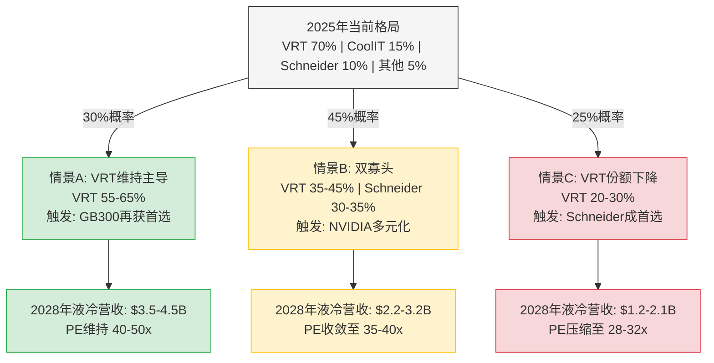
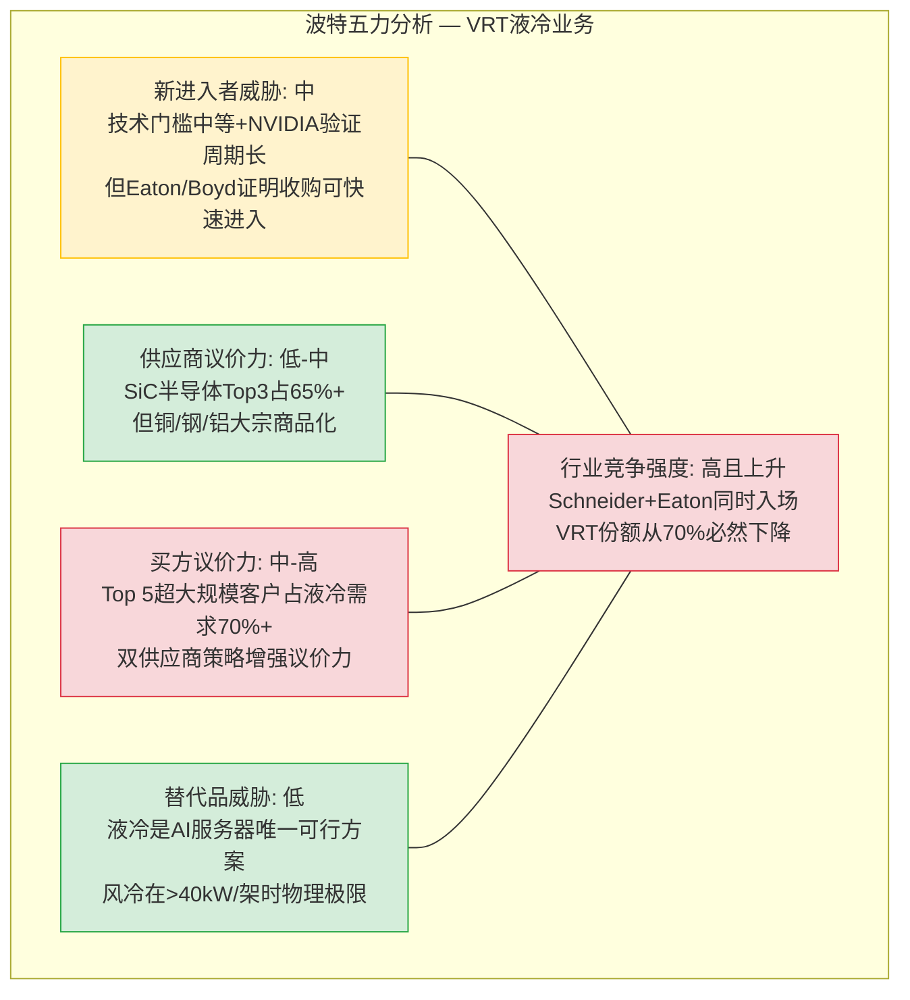
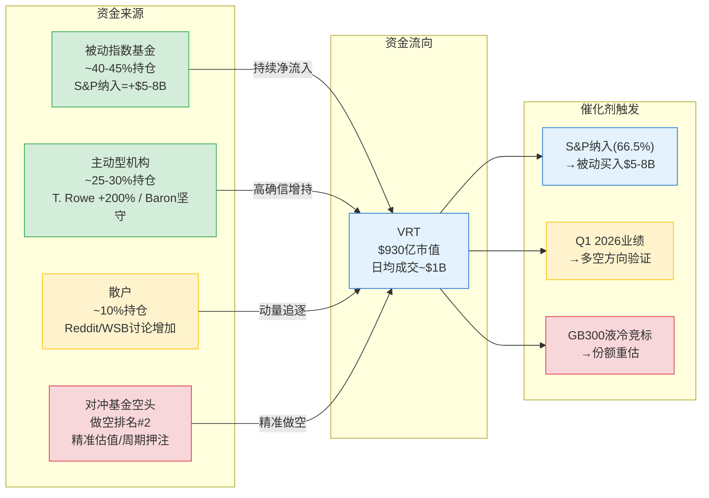
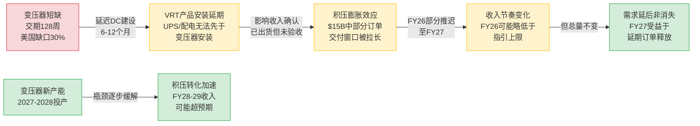
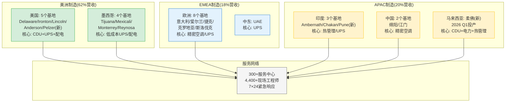

# 第十五章 竞争动态建模与份额演变

> **核心命题**: VRT的估值溢价(PE 46x vs Eaton 31x)根植于液冷市场的领导地位——如果这一地位被侵蚀，溢价将快速收敛。本章建模液冷份额从当前70%+到2028年三种情景的演变路径，并量化每种路径对估值的传导效应。

---

## 15.1 DCPI市场份额演变：从追赶到并列第一

Dell'Oro Group是数据中心电力与冷却基础设施(DCPI)市场最权威的第三方追踪机构。其数据揭示了VRT在2024-2025年间的份额跃升轨迹：

**DCPI市场增长与份额追踪(Dell'Oro)**：

| 时期 | DCPI市场规模(估) | YoY增速 | Schneider份额 | VRT份额 | 差距 | Eaton份额 | Top 3合计 |
|------|:---------------:|:------:|:----------:|:------:|:---:|:-------:|:--------:|
| 2024 H1 | ~$16.5B(年化) | +17% | ~15-16% | ~14-15% | ~1pp | ~8-9% | ~38-40% |
| 2024 H2 | ~$17.5B(年化) | +18% | ~15% | ~14.8% | ~0.2pp | ~8.5% | ~38% |
| 2025 H1 | ~$18.5B(年化) | +18% | ~15.1% | **~15.0%** | **0.1pp** | ~9% | ~39% |
| 2025 H2 | ~$19.5B(年化) | +18%(预) | — | — | — | — | — |

**份额演变的三个驱动因子**：

1. **100% DC聚焦 vs 24% DC占比** — Schneider是€360亿营收的多元化工业巨头，数据中心仅占24%。当AI CapEx超级周期加速时，VRT的100%聚焦意味着每$1新增市场需求都能被捕获，而Schneider的增量要在多个事业部之间分配资源优先级。这个结构性差异在高增长期放大，在低增长期缩小。

2. **NVIDIA CDU合作的乘数效应** — VRT与NVIDIA共同开发GB200 NVL72液冷参考架构，这不仅带来液冷CDU的直接订单(~$1-1.5B FY25)，还对传统配电/UPS产品产生"拉动效应"——客户在采购液冷CDU时倾向于从同一供应商购买配套电力设备，以降低集成风险。估计这个交叉销售乘数在1.5-2x之间(即每$1液冷收入拉动$0.5-1传统产品收入)。

3. **直接液冷收入翻倍** — Dell'Oro数据显示，2025 H1直接液冷(DLC)收入同比翻倍。这个增速远快于DCPI整体(+18%)，意味着液冷正在成为VRT份额增长的最大边际贡献者。但这也意味着份额增长的持续性高度依赖液冷竞争格局——一旦液冷份额被侵蚀，VRT在DCPI整体市场的份额增长将显著放缓。

**Q2 2025 DCPI市场规模快照**: Dell'Oro报告该季度DCPI制造商收入约$8.9B(年化约$35.6B)。Top 3(Schneider、VRT、Eaton)合计占略低于一半的市场份额。这意味着DCPI市场仍然高度分散——前三大厂商合计不到50%，剩余50%+由数十家中小型供应商(Delta、ABB、Huawei、Rittal等)占据。

---

## 15.2 液冷份额演变建模

液冷CDU是VRT估值溢价的核心锚点。当前VRT在NVIDIA GB200首批出货中占有~70%+的CDU份额，但这个份额在下一代平台(GB300/Rubin，预计2026H2-2027推出)中几乎必然下降。问题不是"是否下降"，而是"下降到多少"。

**当前液冷竞争格局(2025-2026初)**：

| 供应商 | CDU份额(GB200) | 核心技术 | NVIDIA关系 | 全栈能力 | 产能状态 |
|--------|:----------:|---------|---------|:------:|---------|
| **Vertiv** | **~70%** | Liebert XDU 1350系列 | GB200参考架构共同开发 | 强(CDU+配电+UPS) | 产能已扩45x |
| CoolIT | ~15% | 冷板(cold plate)专精 | 长期合作伙伴 | 中(冷板为主) | 中等产能 |
| Motivair→Schneider | ~10% | CDU+液冷系统 | 通过Schneider间接合作 | 强(被收购后) | 整合扩产中 |
| 其他(Delta/Chicony/Auras) | ~5% | CDU验证中 | 验证阶段 | 弱→中 | 小规模 |

**下一代液冷格局三情景模型(GB300/Rubin, 2027-2028)**：

| 维度 | 情景A: VRT维持主导 | 情景B: 双寡头 | 情景C: VRT份额下降 |
|------|:-------------:|:--------:|:-------------:|
| **VRT份额** | 55-65% | 35-45% | 20-30% |
| **概率** | 30% | **45%** | 25% |
| **Schneider份额** | 15-20% | 30-35% | 35-45% |
| **CoolIT+其他** | 15-20% | 20-25% | 25-35% |
| **触发条件** | VRT在GB300竞标再获首选 | NVIDIA供应链多元化 | Schneider成GB300首选 |
| **关键假设** | PurgeRite整合成功+产能领先 | 双方技术对等+客户分散 | EcoStruxure软件差异化 |
| **液冷TAM(2028E)** | $6-7B | $6-7B | $6-7B |
| **VRT液冷营收(2028E)** | $3.5-4.5B | $2.2-3.2B | $1.2-2.1B |
| **概率加权营收** | $1.05-1.35B | $0.99-1.44B | $0.30-0.53B |

**双寡头情景(45%概率)的深层逻辑**：

这是最可能的情景，因为它同时满足三个利益相关方的核心利益：

- **NVIDIA的利益** — NVIDIA在芯片端已经面临供应集中风险(台积电)的批评。在液冷供应链上，NVIDIA有强烈动机避免对VRT的过度依赖。GB300设计阶段同时与Schneider合作开发参考架构，正是多元化的信号。NVIDIA不会抛弃VRT(技术验证成本太高)，但会确保至少两个对等供应商。

- **超大规模客户的利益** — Google、Meta、Microsoft等超大规模客户历来要求供应链多源化。对于液冷这个关键基础设施组件，单一供应商依赖意味着产能瓶颈时没有议价筹码。双供应商格局是采购策略的自然结果。

- **VRT自身的利益** — 保持35-45%的份额意味着VRT仍是最大或并列最大供应商。在$6-7B的液冷TAM中，35-45%份额对应$2.2-3.2B营收——仍是VRT增长最快的业务线，但竞争压力也意味着定价权从"卖方市场"向"买方市场"过渡。

---

## 15.3 Schneider Electric威胁深度评估

Schneider Electric是VRT在DCPI市场唯一的同量级对手(年营收€360亿 vs VRT $102亿)，也是液冷领域最具威胁的追赶者。必须深度评估其竞争动作和执行能力。

**Schneider的液冷攻势时间线**：

| 时间 | 动作 | 战略意义 |
|------|------|---------|
| 2024 H1 | 收购Motivair(CDU技术) | 一步获得液冷CDU设计+制造能力 |
| 2024 H2 | 整合Motivair产品线 | 将CDU纳入EcoStruxure管理平台 |
| 2025 H1 | 与NVIDIA联合设计GB300参考架构 | **最大威胁信号**——从"追赶者"升级为"共同定义者" |
| 2025 H2 | EcoStruxure AI模块发布 | 软件+硬件的全栈差异化 |
| 2026 H2(预) | GB300/Rubin配套液冷出货 | Schneider在下一代平台的份额验证点 |

**Schneider的四张牌**：

**第一张: EcoStruxure软件平台** — 这是VRT最薄弱的环节。EcoStruxure提供DCIM(数据中心基础设施管理)、能耗优化、预测性维护等软件功能，且与Schneider的电力+冷却硬件深度集成。超大规模客户越来越要求"软件定义的基础设施"——能够通过API远程管理的设备。VRT的Vertiv Intelligence平台在功能深度和客户采纳度上落后于EcoStruxure。在AI数据中心复杂度急剧上升的环境中，软件能力可能成为赢单的关键差异化因素。

**第二张: 全栈整合** — Schneider在电力(UPS/配电/变压器)、冷却(精密空调/CDU)、软件(EcoStruxure)、服务四个维度都有产品。虽然VRT也覆盖前三个维度，但Schneider的变压器业务(VRT不具备)在变压器短缺的当前环境中是独特优势——能够为客户提供"从变压器到机架"的一站式方案。

**第三张: 全球渠道** — Schneider在全球180+个国家有销售和服务网络，远超VRT的覆盖范围。在EMEA和APAC等VRT相对薄弱的地区(VRT EMEA有机增长-2.1%，APAC利润率仅11%)，Schneider的渠道优势更为明显。

**第四张: 资本弹药** — Schneider FY24营收€360亿，FCF约€40亿——年度自由现金流超过VRT三年液冷营收。这意味着Schneider可以承受液冷业务初期的亏损来换取份额，或进行更大规模的液冷收购。

**但Schneider也有三个制约**：

| 制约因素 | 影响 | VRT的对策 |
|---------|------|---------|
| DC仅占24%营收→资源分散 | 决策速度慢于VRT的100%聚焦 | 纯DC聚焦=更快产品迭代 |
| Motivair整合需12-18个月 | 2026H1前产能受限 | VRT已扩产45x，产能领先 |
| 组织文化差异 | 法国大企业层级多 | VRT PE基因=执行效率高 |

**Schneider威胁评分**: 8/10(高威胁)——Schneider是唯一同时具备技术、渠道、资本、软件四项能力的竞争对手。关键观察日期是2026H2 GB300出货期间Schneider的液冷份额表现。

---

## 15.4 Eaton液冷崛起与"AI纯度溢价"稀释

Eaton($95B收购Boyd Thermal Management)代表了一种不同的竞争路径——通过超大规模收购快速获得液冷能力，同时利用自身在电力管理领域的全球垄断地位进行交叉销售。

**Boyd收购的战略剖析**：

| 维度 | Boyd Thermal Management | Eaton的互补性 |
|------|----------------------|-------------|
| 核心技术 | 热管理(散热器/液冷板/热界面材料) | 电力管理(UPS/配电/变压器) |
| 终端市场 | DC + 汽车 + 消费电子 + 工业 | DC + 电网 + 工业 + 商业建筑 |
| 规模 | ~$5-7B估值(按$95B溢价计) | ETN市值~$1200亿 |
| 地理覆盖 | 北美+亚洲为主 | 全球175国 |
| DC液冷能力 | 冷板+散热方案 | 收购前几乎为零 |

**Eaton的竞争路径与VRT的差异**：

Eaton的进攻方向主要在"电力侧"而非"冷却侧"——其核心优势是变压器、开关柜、配电系统。在变压器交期128周(约2.5年)的当前环境中，Eaton作为全球最大变压器制造商之一，拥有VRT不具备的供应链控制力。对超大规模客户而言，"谁能先交变压器"往往决定了整个DC基建的供应商选择。

**Eaton Q4 DC订单+70% YoY** — 这个数据点证明AI基础设施需求正在向更广泛的电力基础设施供应商扩散。VRT不再是唯一能讲"AI增长故事"的工业品公司。

**"AI纯度溢价"稀释效应**：

| 公司 | FY25 PE | DC占比(估) | AI增长叙事强度 | 溢价来源 |
|------|:------:|:--------:|:----------:|---------|
| **VRT** | **46x** | ~100% | 极强(NVIDIA CDU 70%) | AI基础设施纯度 |
| Eaton | 31x | ~25-30% | 中等(Boyd收购后上升) | 电力管理多元化 |
| Schneider | 28x | ~24% | 中等(Motivair收购后上升) | 全球工业巨头 |

VRT相对Eaton的PE溢价(46x vs 31x = +48%)建立在"AI纯度"叙事上——VRT是唯一一个100% DC聚焦的大型上市公司。但随着Eaton通过Boyd收购获得液冷能力，且其DC订单增长加速(+70% YoY)，这个叙事正在被部分削弱。如果Eaton在FY26-27连续报告DC业务30%+增长，市场可能开始重新评估VRT溢价的合理性。

---

## 15.5 份额变化对估值的影响矩阵

将液冷份额情景与总营收和估值倍数联系起来，这是理解"份额→估值"传导机制的核心工具：

**假设前提**: 液冷全球TAM 2028E约$6-7B(基于Dell'Oro增速外推)；VRT传统业务(UPS/配电/精密空调)FY28E营收约$14-16B(10-12% CAGR)。

| 液冷份额情景 | FY28E液冷营收 | FY28E传统营收 | FY28E总营收 | 液冷占比 | 合理PE区间 | 隐含市值 | vs当前$930亿 |
|:----------:|:----------:|:----------:|:---------:|:------:|:--------:|:-------:|:--------:|
| 60%+(VRT主导) | $3.8-4.5B | $14-16B | $18-20B | ~20-23% | 40-50x | $1400-1800B | +50-94% |
| 40-50%(双寡头) | $2.5-3.2B | $14-16B | $16.5-19B | ~15-18% | 35-40x | $1050-1360B | +13-46% |
| 20-30%(份额下降) | $1.2-2.1B | $14-16B | $15-18B | ~8-12% | 28-32x | $730-960B | -21%~+3% |

**关键发现**：

1. **双寡头情景(最可能)下VRT仍有13-46%上行空间** — 即便份额从70%降至40-50%，只要传统业务保持稳健增长，VRT的总营收规模仍将支撑当前估值水平以上。这解释了为什么市场在液冷竞争加剧的信号下并未大幅抛售VRT。

2. **份额下降至20-30%是唯一的"估值破坏"情景** — 在这个情景下，VRT的"AI纯度"叙事崩塌，PE从46x压缩至28-32x，隐含市值可能低于当前水平。概率25%——不高但也非不可能。

3. **液冷占比是PE倍数的决定性变量** — 当液冷占比从20%+降至<12%时，市场将VRT重新归类为"传统工业品+AI概念"，PE向Eaton(31x)收敛。

---

## 15.6 客户自研(In-sourcing)风险评估

超大规模客户(Google/Meta/AWS/Microsoft)在半导体领域已展示了强大的自研能力(Google TPU、AWS Graviton、Meta MTIA)。电力和冷却基础设施是否会成为下一个自研目标?

**自研门槛分析**：

| 维度 | 芯片自研(已发生) | 电力/冷却自研(评估中) |
|------|:----------:|:-------------:|
| 技术复杂度 | 极高但软件定义 | 中等但涉及物理工程 |
| 认证要求 | 低(内部使用) | **高**(UL/IEC/CE电气安全认证) |
| 核心竞争力相关性 | 高(算力=核心竞争力) | **低**(机电设备≠核心竞争力) |
| 规模经济 | 百万级芯片摊薄设计成本 | 数千台设备不足以摊薄 |
| 供应链可替代性 | 低(台积电垄断先进制程) | **中**(多家合格供应商) |
| 自研投入(估) | $1-3B/年 | $200-500M/年 |
| 已有自研案例 | Google TPU/AWS Graviton | Google部分冷却方案定制 |
| 5年内替代概率 | N/A(已发生) | **<10%** |

**为什么电力和冷却不太可能被自研**：

- **电气安全认证壁垒** — UPS、配电设备涉及高压电气安全，需要UL 924、IEC 62040等国际认证。获取和维护这些认证需要专门团队和数年时间。超大规模客户不愿为非核心业务承担这些合规成本。

- **流体力学专业知识** — 液冷CDU涉及复杂的流体动力学设计(泵组控制、泄漏防护、腐蚀管理、流量平衡)。这与软件公司的核心能力相距甚远。Google虽然有部分定制冷却方案，但仍依赖外部CDU供应商提供核心组件。

- **现场服务网络不可自建** — VRT的300+服务中心和4,400+现场工程师提供7×24小时紧急响应。超大规模客户建设这样的全球服务网络既不经济也非必要。

- **风险评估结论**: 5年内自研替代VRT核心产品的概率<10%。但超大规模客户会越来越多地参与规格定义和架构设计(如定制机架设计)，这可能压缩VRT的毛利率空间，即使不替代VRT的产品本身。

---

## 15.7 竞争五力分析

**五力综合评估**：VRT液冷业务面临的最大压力来自买方议价力(超大规模客户集中度高)和行业竞争强度(Schneider/Eaton同时入场)。替代品威胁和供应商议价力是有利因素。新进入者威胁中等——技术门槛不是最高的护城河(Eaton通过$95B收购Boyd证明可以快速获得能力)，但NVIDIA的验证周期(6-12个月)和安装基数的切换成本提供了时间窗口保护。

**本章核心结论**：VRT在DCPI整体市场正在接近甚至超越Schneider成为#1，但液冷细分市场的70%+份额几乎必然下降。双寡头情景(VRT 35-45%份额)是最可能的结果(45%概率)。在该情景下，VRT的FY28E总营收仍可达$16.5-19B，支撑35-40x PE——略低于当前46x但不构成"估值崩塌"。真正的风险在情景C(VRT份额降至20-30%，概率25%)——这将触发PE向工业品同行(28-32x)收敛，隐含20%+下行空间。

---

# 第十六章 市场定位与资金流向分析

> **核心命题**: VRT的股价不仅由基本面驱动，还深受资金流向、机构持仓结构和预测市场概率的影响。本章拆解"谁在买、谁在卖、为什么"，以及S&P 500纳入这个近期最大催化剂的量化影响。

---

## 16.1 S&P 500纳入分析：最近期催化剂

**核心数据点**：

| 指标 | 数值 | 来源 |
|------|------|------|
| 纳入概率 | **66.5%** | Polymarket(2026-02-20) |
| 预期宣布日 | 2026年3月20日(季度再平衡) | S&P历史日程 |
| VRT当前市值 | $930亿 | 满足S&P 500最低$180亿门槛 |
| VRT连续盈利 | FY24-25连续盈利 | 满足连续4季度正GAAP盈利要求 |
| 公众持股比例 | >50%(Platinum已降至~4.7%) | 满足流通股要求 |

**被动资金流入估算**：

S&P 500指数基金(包括ETF和共同基金)追踪资产约$7.8万亿(截至2025年末)。VRT纳入后的指数权重取决于自由流通市值调整：

| 假设 | 计算 | 估算值 |
|------|------|-------|
| VRT自由流通市值 | $930亿 × (1 - 4.7% Platinum - 5% 内部人) ≈ $840亿 | $840亿 |
| S&P 500总自由流通市值 | ~$48万亿 | — |
| VRT指数权重 | $840亿 / $48万亿 ≈ 0.175% | ~0.18% |
| 追踪S&P 500的被动资产 | ~$7.8万亿 | — |
| **被动买入量** | **0.18% × $7.8万亿** | **~$14B** |
| 考虑流动性折扣(分批买入) | 实际短期买入约40-60% | **$5.6-8.4B** |

**$5.6-8.4B的被动买入量相当于VRT 6-9个交易日的平均成交量**(VRT日均成交额约$1B)。这意味着纳入后2-3周内将出现持续的买入压力，对股价的支撑效应显著。

**历史案例对比**：

| 公司 | 纳入日 | 宣布→纳入涨幅 | 纳入后30日 | 纳入后6个月 |
|------|-------|:----------:|:--------:|:---------:|
| Super Micro(SMCI) | 2024.3 | +12% | -8%(回调) | -35%(基本面恶化) |
| Palantir(PLTR) | 2024.9 | +15% | +22% | +60%+ |
| KKR | 2024.6 | +8% | +5% | +18% |
| **平均** | — | **+12%** | **+6%** | **+14%** |
| **VRT预期** | 2026.3E | **+5-10%** | **取决于Q1业绩** | **取决于液冷份额** |

**不纳入的影响(33.5%概率)**：

如果3月20日未被纳入，影响分为两层：
1. **短期(1-2周)**: 预期落空导致5-8%回调——此前部分被动资金前置买入(front-running)需要平仓
2. **中期(1-3月)**: 下一个纳入窗口在2026年6月。如果VRT连续两次未入选，市场将质疑是否存在流通股或盈利质量方面的隐性问题

---

## 16.2 机构持仓深度分析

**总览**: 机构持股约89.9%，2,155家13F申报机构。QoQ机构持股增加24%——这不仅仅是被动指数重平衡，而是主动型基金的广泛增持。

**Top 10机构持仓表**：

| 排名 | 机构 | 持股(估) | 占比(估) | QoQ变化 | 投资风格 | 信号 |
|:---:|------|:------:|:-----:|:------:|---------|------|
| 1 | Vanguard Group | ~38.0M股 | ~9.9% | 稳定 | 被动指数 | 指数权重追踪 |
| 2 | BlackRock | ~34.0M股 | ~8.9% | 稳定 | 被动+主动混合 | 指数+iShares ETF |
| 3 | Barrow Hanley | ~32.1M股 | ~8.5% | 中等 | 价值型主动 | 大仓位(含子咨询) |
| 4 | Platinum Equity(VPE) | ~18.1M股 | ~4.7% | 持平 | PE退出 | 减持压力基本消除 |
| 5 | State Street | ~15M股(估) | ~3-4% | 稳定 | 被动指数 | 标准指数权重 |
| 6 | **T. Rowe Price** | **~7M股(估)** | **~2-3%** | **+200%** | **成长型主动** | **高确信买入信号** |
| 7 | FMR(Fidelity) | 大仓位 | Top 10 | — | 主动+被动 | — |
| 8 | Bank of America | 大仓位 | Top 10 | — | 做市+自营 | — |
| 9 | Geode Capital | 大仓位 | Top 10 | — | 被动 | 标准配置 |
| 10 | Morgan Stanley | 大仓位 | Top 10 | — | 做市+主动 | — |

**被动 vs 主动持仓分布(估算)**：

| 类型 | 占总机构持仓(估) | 代表性机构 | 行为特征 |
|------|:-------------:|---------|---------|
| 纯被动(指数/ETF) | ~40-45% | Vanguard/BlackRock/State Street/Geode | 跟随指数权重,不做主动判断 |
| 混合型 | ~20-25% | Fidelity/Morgan Stanley/Bank of America | 指数追踪+主动超配/低配 |
| 纯主动 | ~25-30% | T. Rowe Price/Baron/Barrow Hanley | 基于基本面判断 |
| PE/战略投资者 | ~5% | Platinum Equity | 退出中 |

**"拥挤的多头"风险量化**：

89.9%的机构持股意味着散户仅持有约10%。当一个股票几乎完全被机构持有时，存在两个风险：

1. **同向交易风险** — 如果基本面出现裂缝(如Q1 miss或液冷份额丢失)，机构投资者的风控模型可能同时触发减仓指令。89.9%的机构持股意味着"没有足够的散户接盘"——当机构同时卖出时，买方缺失可能导致价格急剧下跌。

2. **Beta放大效应** — VRT Beta 2.089——市场每跌1%，VRT平均跌2%。在市场整体回调(如AI叙事受挫)的环境中，高Beta+高机构持股=双重放大器。

**T. Rowe Price +200%增持的信号解读**：

T. Rowe Price是全球最大的主动成长型基金管理公司之一(AUM ~$1.6万亿)。2025 Q3将VRT持仓增加约200%(~+4.7M股)——按当时股价$120-180估算，这是一笔$560-850M的增仓操作。这代表了深度基本面研究后的高确信判断，而非被动配置。T. Rowe Price的分析师团队通常在增仓前进行管理层访谈和供应链调研——他们的增持是一个强烈的"聪明钱看多"信号。

**Baron Small Cap Fund的持续持有** — Baron在Q4 2025致投资者信中将VRT列为该季度"最大贡献者"，评价"估值在前瞻基础上合理"，认为VRT"在未来几年增长方面处于有利地位，得益于广泛的产品组合、独特的服务能力和作为领先芯片及超大规模公司首选解决方案提供商的角色"。

---

## 16.3 对冲基金做空信号

**核心矛盾**: VRT的空头占比很低(2.7-4.6% float)，但在对冲基金最拥挤做空排名中位列#2。这意味着空头虽少但质量很高——都是对冲基金的精准押注。

**做空数据详解**：

| 指标 | 数值 | 与同行比较 | 信号 |
|------|------|---------|------|
| 空头股数 | 10.1-14.4M股 | — | — |
| 空头占流通股% | 2.7-4.6% | 同行均值8.9-11.7% | **远低于同行** |
| 回补天数 | 1.5-2.8天 | — | 无逼空压力 |
| HF做空拥挤度排名 | **#2** | 仅次于NVDA | **聪明钱集中做空** |
| 近期趋势 | 2026.1空头+16.9% | — | 反弹后空头重新建仓 |

**空头核心论文解构**：

对冲基金做空VRT的核心论点可以归纳为三条：

| 空头论点 | 逻辑链 | 反论 | 胜负评估 |
|---------|--------|------|:------:|
| PE 46x定价完美执行 | 任何miss→PE压缩→20-30%下跌 | 积压$15B提供可见性 | **空头略占优** |
| AI CapEx是周期性的 | 2024-2025峰值→2027-2028放缓 | 液冷渗透率仍在早期 | **五五开** |
| 竞争加剧稀释溢价 | Schneider/Eaton入场→份额和利润率双降 | VRT安装基数+NVIDIA关系提供保护 | **多头略占优** |

**空头 vs 多头的博弈均衡**：

当前的空头占比(2.7-4.6%)反映了一个不对称的博弈——多头阵营人数众多但共识过于一致(22个分析师中22个"买入")，空头人数极少但每一个都是经过深度研究的对冲基金。这种格局往往在基本面出现第一个裂缝时产生剧烈波动——因为多头的退出通道拥挤(89.9%机构持股)，而空头的弹药充足(空头占比低=还有加仓空间)。

---

## 16.4 期权市场信号

期权市场是"聪明钱"表达观点最精细化的场所。VRT的期权信号呈现了一幅矛盾但可解读的图景。

**期权核心指标**：

| 指标 | 数值 | 正常范围 | 信号解读 |
|------|------|---------|---------|
| 近期成交Put/Call比 | **0.45** | 0.6-0.8(中性) | 强烈看涨——Call远多于Put |
| 60日OI Put/Call比 | **1.12** | 0.6-0.8(中性) | 中性偏看空——机构囤积保护性Put |
| 隐含波动率(IV) | **128%** | 30-50%(一般工业品) | 极高——市场预期大幅波动 |
| IV Rank(52周) | **33.47** | 50(中位) | 偏低——当前IV低于年内大部分时间 |
| Whale目标价范围 | $115-$280 | — | 2.4x极端分歧 |

**矛盾信号的统一解读**：

短期成交看涨(P/C 0.45) + 长期持仓偏空(OI P/C 1.12) = **机构在持有多头的同时购买保护性Put**。

这是一种典型的"看好基本面但担心估值回调"的持仓策略。具体操作模式：
- 持有VRT股票(多头核心仓位)
- 买入3-6个月到期的OTM Put(如$180 strike)作为尾部风险保护
- 卖出远期OTM Call(如$280 strike)收取权利金部分抵消Put成本

这解释了为什么60日OI中Put偏多(保护性Put累积)，而近期成交中Call偏多(方向性的短期看涨押注，如$1.1M的$180 sweep)。

**异常期权交易(2026年2月)**：

| 交易 | 行权价 | 到期 | 金额 | 方向 | 解读 |
|------|:-----:|------|:----:|:---:|------|
| Call Sweep | $180 | 2026.2.27 | $1.1M | **看涨** | 短期押注股价维持高位 |
| Call Trade ×3 | $230 | 2027.1.15 | $760K合计 | **卖Call** | 机构capped upside在$230 |
| Put Trade ×2 | $200 | 2026.6 | $100K | **保护性** | 下行保护 |

**最关键的信号**: 三笔分别的$230 strike Jan2027 LEAPS Call卖出——这意味着机构在卖出$230以上的上行权。当前股价$243>行权价$230，这些可能是covered call(有股票担保的卖出Call)。隐含含义：这些机构认为VRT在2027年1月时的合理价格区间在$200-250之间，不愿为$230以上的上行付费。

---

## 16.5 内部人交易信号

内部人交易是判断管理层对公司前景真实看法的重要信号——尤其是"开放市场购买"(自掏腰包买股票)和"开放市场出售"(非计划性卖出)。

**内部人交易年度趋势**：

| 时期 | 总处置(股) | 开放市场卖出(笔) | 总获取(股) | 开放市场买入(笔) | 净信号 |
|------|:---------:|:----------:|:--------:|:----------:|:----:|
| 2024 Q2 | **5,648K** | **20** | 101K | 0 | **巨量卖出** |
| 2024 Q4 | **2,101K** | **33** | 317K | 0 | **重度卖出** |
| 2025 Q2 | 205K | 5 | 111K | 0 | 净卖出 |
| 2025 Q3 | 267K | 6 | 93K | 0 | 净卖出 |
| 2025 Q4 | 52K | 1 | 24K | 0 | 轻微卖出 |
| 2026 Q1 | 5K | **0** | 11K | **0** | **中性** |

**三个层次的解读**：

| 层次 | 发现 | 意义 |
|------|------|------|
| 趋势 | 2024年巨量减持→2025年大幅放缓→2026年几乎静默 | 最具攻击性的获利了结阶段已过 |
| 信号缺失 | 零笔开放市场买入(任何期间) | 无人在当前价格"用自己的钱下注" |
| 背景 | 2024年减持集中在Platinum Equity退出+高管行权($9.98-$72行权价) | 非恐慌性卖出,而是理性获利了结 |

**Platinum Equity退出进度**：

| 时间 | 持股 | 占比 | 事件 |
|------|------|:----:|------|
| 2020.2(IPO) | ~145M股 | ~38% | SPAC合并上市 |
| 2021.11 | 38.0M股 | 10.8% | 13D/A filing |
| 2023.8 | ~18.1M股 | ~4.7% | 出售20M股(二级发行) |
| 2024-至今 | ≤18.1M股 | ≤4.7% | 无公开二级发行 |

Platinum剩余~18.1M股价值约$44亿(按当前价)。2023年8月以来未进行公开二级发行——减持压力已基本消除。但作为PE投资者，Platinum最终会完全退出。风险是可控的：18.1M股约4个交易日成交量(VRT日均~4M股)。

---

## 16.6 卖方分析师共识

**共识评级分布**：

| 来源 | Buy | Hold | Sell | 合计 | 平均目标价 |
|------|:---:|:----:|:---:|:---:|:--------:|
| TradingView | 22 | 3 | 0 | 25 | $275.80 |
| TipRanks | 14 | 1 | 0 | 15 | $280.15 |
| StockAnalysis | 14 | 1 | 0 | 15 | ~$275 |
| **综合** | **~22** | **~3** | **0** | **~25** | **$275-280** |

**近期评级变动(关键)**：

| 日期 | 机构 | 动作 | 目标价 | 信号 |
|------|------|------|:-----:|------|
| 2026.1.2 | **Barclays** | **升级EW→OW** | $200 | Q4前最后一个升级 |
| 2025.12.9 | Goldman Sachs | 上调目标价 | $204 | — |
| 2025.12.8 | Citigroup | 上调目标价 | $220 | — |
| 2025.12 | TD Cowen | 上调目标价 | $211 | 维持Buy |
| 2025.12.9 | **Wolfe Research** | **降级→Peerperform** | — | **唯一看空声音** |
| Q4后(2026.2.11+) | 多家 | 目标价大幅上调 | $275-320 | TipRanks均值$280 |

**目标价分布**：

| 区间 | 隐含涨幅/跌幅 | 分析师数(估) | 代表机构 |
|------|:----------:|:---------:|---------|
| $300-320(极乐观) | +23-32% | ~3-5 | Q4后新上调 |
| $270-300(乐观) | +11-23% | ~8-10 | 主流大行 |
| $220-270(中性) | -9%~+11% | ~5-7 | Q4前目标 |
| $188-220(谨慎) | -23%~-9% | ~2-3 | Wolfe/老旧目标 |

**共识的脆弱性**: 25个分析师中22个"买入"、0个"卖出"——这是一个极端的一致共识。历史经验表明，当卖方共识如此一致时，第一个降级(如Wolfe Research)往往引发"谁是下一个降级"的连锁反应。当前$275-280的平均目标价仅隐含+13-15%上行空间——在PE 46x的股票上，这个安全边际几乎为零。

---

## 16.7 资金流向矩阵

**本章核心结论**：VRT的资金面呈现"多头拥挤+空头精准"的格局。S&P 500纳入(66.5%概率)是最近期催化剂，可带来$5-8B被动买入。但89.9%机构持股+零内部人买入+对冲基金#2做空拥挤度，构成了一个"高度共识+高度脆弱"的持仓结构——任何基本面裂缝(Q1 miss/液冷份额丢失/AI CapEx放缓)都可能触发剧烈的多杀多。期权市场的矛盾信号(短期看涨+长期保护性Put)精确反映了这种"看好基本面但担心估值"的集体心理。

---

# 第十七章 供应链深度与运营分析

> **核心命题**: VRT的"轻资产"制造模式(CapEx/Revenue仅2.2%)是其高FCF转化率的基础，但也意味着在产能瓶颈时期缺乏自主控制力。本章拆解VRT的全球制造网络、变压器瓶颈对积压转化的传导效应、CDU产能扩张的节奏与瓶颈，以及中国供应链的机会与风险。

---

## 17.1 全球制造网络

VRT拥有24个制造和组装设施，横跨4大洲。加上300+服务中心和4,400+现场工程师的全球服务网络，构成了一个"制造分散+服务下沉"的运营架构。

**制造基地分布**：

| 地区 | 制造基地 | 核心产品 | 战略角色 |
|------|---------|---------|---------|
| **美国** | Delaware OH, Ironton OH, Lincoln NE, Anderson SC, **Pelzer SC(新)** | UPS/配电/CDU/模块化DC | 核心研发+高端制造 |
| **墨西哥** | Tijuana, Mexicali, Monterrey, Reynosa | UPS/配电 | 低成本制造+美国市场就近供应 |
| **欧洲** | Bologna/Tognana(意大利), Letterkenny/Burnfoot/Campsie(爱尔兰/北爱), Volyne(捷克), Rugvica(克罗地亚), Nové Mesto(斯洛伐克) | 精密空调/UPS/配电 | EMEA市场供应 |
| **印度** | Ambernath, Chakan, **Pune(新)** | 热管理/UPS | APAC增长市场(印度DC CapEx爆发) |
| **中国** | **绵阳**, **江门** | 热管理/精密空调 | 中国本地市场(份额受限) |
| **马来西亚** | **柔佛(新, 2026 Q1投产)** | CDU/电力管理/热管理 | 非中国APAC供应链替代 |
| **中东** | Ras Al Khaimah(UAE) | UPS | 中东市场供应 |

**员工结构(估算)**：

| 类别 | 人数(估) | 占比 | 关键角色 |
|------|:------:|:---:|---------|
| 制造/组装 | ~14,000 | ~45% | 工厂产线 |
| 现场服务工程师 | ~4,400 | ~14% | 客户现场维护/安装 |
| 研发/工程 | ~4,000 | ~13% | 产品开发(液冷/800V/软件) |
| 销售/市场 | ~3,500 | ~11% | 全球销售网络 |
| 管理/行政 | ~5,100 | ~17% | 总部+区域管理 |
| **合计** | **~31,000** | **100%** | — |

**产能利用率评估**：

VRT未公开披露产能利用率数据。但可以通过间接指标推断：

| 指标 | 数值 | 含义 |
|------|------|------|
| CapEx/Revenue | 2.2%(FY25) → **4.25-5.25亿(FY26指引)** | FY26 CapEx翻倍=产能严重不足 |
| 积压/营收比 | 1.47x($15B/$10.2B) | 需求远超当前产能 |
| 液冷产能扩张 | 45倍(多年累计) | 从极小基数起步 |
| 新工厂投资 | 马来西亚柔佛+Pelzer SC扩建+Pune印度 | 全球同步扩产 |

**推断**: 当前产能利用率在85-95%区间(接近满负荷)。FY26E CapEx从$2.26亿翻倍至$4.25-5.25亿(占营收~3.2-3.9%)是VRT上市以来最大规模的资本投入，反映管理层判断当前产能无法支撑FY26-27的订单增长。

---

## 17.2 变压器瓶颈深度：积压转化的隐性约束

电力变压器是数据中心建设的关键路径组件。VRT虽然不制造变压器，但变压器短缺直接影响VRT产品的安装和验收节奏——因为数据中心的电力基础设施遵循"变压器→开关柜→UPS→配电→机架→冷却"的串行安装顺序。

**变压器瓶颈核心数据**：

| 指标 | 数值 | 来源 | VRT影响 |
|------|------|------|---------|
| 大型变压器交期 | **128周(~2.5年)** | 行业数据 | 延迟DC项目时间线 |
| 特种变压器最长交期 | 高达5年 | 行业数据 | 超大规模DC受影响最重 |
| 2025美国变压器缺口 | **30%** | 行业估计 | 美洲区(占VRT 62%)直接受影响 |
| 新产能投产 | 2027-2028 | Hitachi Energy/Siemens/ABB/GE扩产 | 瓶颈2027后逐步缓解 |
| Eaton变压器产能 | 全球领先 | Eaton年报 | Eaton在此环节具独特优势 |

**变压器瓶颈→积压转化→收入确认传导链**：

**对VRT $15B积压的量化影响评估**：

| 情景 | 受变压器影响的积压比例 | 延迟幅度 | FY26影响 | FY27影响 | 总量影响 |
|------|:----------------:|:------:|:------:|:------:|:------:|
| 乐观(变压器缺口改善) | 10% | 3-6个月 | -$750M | +$750M | 零 |
| 基准 | **20%** | **6-12个月** | **-$1.5B** | **+$1.5B** | **零** |
| 悲观(缺口加剧) | 30% | 12-18个月 | -$2.3B | +$1B | -$1.3B(推至FY28) |

**关键认识**: 变压器瓶颈改变的是收入节奏(timing)，而非收入总量(magnitude)。被延迟的DC项目最终仍会完工——数据中心建设不是可选消费，而是超大规模客户的战略基础设施。但对VRT FY26指引($13.25-13.75B)的影响是：如果20%积压延迟6-12个月，FY26实际营收可能落在指引区间的低端($13.25B左右)，而FY27则受益于延期订单的释放。

---

## 17.3 CDU产能扩张分析

液冷CDU是VRT增长最快的产品线，也是估值溢价的核心。产能扩张的节奏和瓶颈直接决定VRT能否兑现液冷增长承诺。

**CDU产能扩张时间线**：

| 时间 | 行动 | 产能倍数(累计) | 产品 |
|------|------|:----------:|------|
| 2023 | 液冷CDU产线初建 | 1x(基数) | Liebert XDU初代 |
| 2024 H1 | 美国产线扩建 | ~5-10x | XDU 1350系列量产 |
| 2024 H2 | Pelzer SC新厂投产 | ~15-20x | GB200配套CDU |
| 2025 H1 | 多条产线并行 | ~30-35x | 大规模出货 |
| 2025 H2 | PurgeRite收购完成($1B) | ~40x | +流体管理服务能力 |
| 2025末 | 全球CDU产能 | **~45x** | 多工厂协同 |
| **2026 Q1** | **马来西亚柔佛投产** | **~55-65x(目标)** | CDU+电力管理+热管理 |
| **2026 H2** | **MegaMod HDX量产** | — | 模块化液冷方案(10MW级) |

**"45倍扩产"的基数问题**：

VRT宣称CDU产能扩大45倍——但起始基数很小。假设2023年初CDU年产能约200-500台(估)，45倍意味着当前年产能约9,000-22,500台。对比需求：

| 指标 | 估计值 | 计算依据 |
|------|-------|---------|
| 2025全球AI服务器液冷需求 | ~50,000-80,000台CDU | NVIDIA GB200出货量推算 |
| VRT CDU年产能(45x后) | ~9,000-22,500台 | 基数200-500台×45 |
| VRT CDU产能利用率(估) | 80-95% | 接近满负荷 |
| 2026 CDU需求增长 | +50-80% | GB200持续放量+Blackwell Ultra |
| 产能缺口 | **仍可能存在** | 马来西亚新厂需补缺 |

**马来西亚柔佛工厂详情**：

| 维度 | 规格 |
|------|------|
| 位置 | 柔佛州(紧邻新加坡) |
| 投产时间 | 2026 Q1 |
| 产品线 | CDU + 电力管理 + 热管理(综合工厂) |
| 战略目的 | 非中国APAC制造基地 + 东南亚DC市场就近供应 |
| 目标客户 | 新加坡/印尼/马来西亚超大规模DC + 区域colocation |
| 投资额 | 未公开(含在FY26 CapEx $4.25-5.25亿中) |

**下一个产能瓶颈在哪?**

| 瓶颈候选 | 可能性 | 时间窗口 | 应对 |
|---------|:-----:|---------|------|
| CDU核心组件(泵/换热器) | 中 | 2026 H2 | 多源采购+PurgeRite内部供应 |
| 高端UPS(SiC器件短缺) | 中-低 | 2027+ | SiC供应商多元化(STMicro/onsemi/Infineon) |
| 工程人才(液冷设计) | 中 | 持续 | SBC可能需上升以吸引科技人才 |
| 测试/验证产能 | 低-中 | 2026-2027 | Pune新测试实验室 |

**CapEx充分性评估**：

| 年度 | CapEx | 占营收 | 评估 |
|------|:-----:|:-----:|------|
| FY2022 | $111M | 2.0% | 基础维护水平 |
| FY2023 | $135M | 2.0% | 基础维护水平 |
| FY2024 | $184M | 2.3% | 开始加速 |
| FY2025 | $220M | 2.2% | 产能扩建启动 |
| **FY2026E** | **$425-525M** | **~3.2-3.9%** | **翻倍——历史最高** |
| FY2027E(估) | $400-500M | ~2.5-3.0% | 维持高投入 |

FY26 CapEx翻倍是一个积极信号——证明管理层认为需求增长是结构性的(否则不会大幅增加固定资产投入)。但$425-525M相对于$13.5B预期营收仍仅3.2-3.9%——远低于半导体行业(15-25%)甚至数据中心运营商(20-30%)。VRT的"轻资产"模式意味着产能扩张更多依赖组装线+测试设备，而非重资产工厂建设。这是优势(FCF转化率高)也是风险(产能弹性有限)。

---

## 17.4 运营效率指标分析

**四年运营效率趋势**：

| 指标 | FY2025 | FY2024 | FY2023 | FY2022 | 趋势分析 |
|------|:------:|:------:|:------:|:------:|---------|
| 存货周转天 | 79天 | 86天 | 70天 | 70天 | FY24因备货升高,FY25改善中 |
| 应收周转天 | 111天 | 108天 | 116天 | 121天 | 大型项目→长周转,但改善中 |
| 应付周转天 | 95天 | 91天 | 78天 | 84天 | 议价力增强→账期拉长 |
| **现金转换周期** | **95天** | **103天** | **108天** | **107天** | **持续改善→运营效率提升** |
| 资产周转率 | 0.84x | 0.88x | 0.86x | 0.80x | 稳定 |
| 存货/营收 | 14.2% | 15.5% | 12.9% | 14.4% | FY25改善 |

**存货增加(FY25 $1,457M vs FY24 $1,244M, +17%)的解读**：

这是"主动备货"还是"效率降低"?三个线索指向前者：
1. **存货周转天从86天改善至79天** — 如果是效率降低，周转天应恶化
2. **同期营收+28%而存货仅+17%** — 存货增长慢于营收=效率在提升
3. **积压$15B需要备货** — 为确保交付，提前采购关键组件是理性行为

**同行运营效率对比**：

| 指标 | VRT | Eaton | Schneider | 行业中位 | VRT排名 |
|------|:---:|:----:|:--------:|:------:|:-----:|
| 现金转换周期 | 95天 | ~75天 | ~55天 | ~80天 | **偏慢** |
| 毛利率 | 34.4% | ~38% | ~42% | ~35% | **中等** |
| FCF/营收 | 18.5% | ~12% | ~10% | ~12% | **优秀** |
| CapEx/营收 | 2.2% | ~3.5% | ~3.0% | ~3.0% | **轻资产** |
| ROIC | 18.5% | ~15% | ~12% | ~14% | **优秀** |

VRT的现金转换周期(95天)长于同行——主要因为应收周转天(111天)偏高。这反映了VRT客户中大型项目(超大规模DC建设)的比重较高，付款条件通常为Net 90-120天。但VRT的FCF/营收(18.5%)和ROIC(18.5%)均优于同行——轻资产模式+低CapEx+低SBC共同驱动了高效的资本回报。

---

## 17.5 中国供应链分析

**VRT中国业务规模估算**：

| 指标 | 估计值 | 推算依据 |
|------|-------|---------|
| 亚太总营收 | $2,019M(FY25) | 官方数据 |
| 中国占亚太比例(估) | 30-40% | 管理层称中国增长"muted"，印度/东南亚更快 |
| **中国营收(估)** | **$600-800M** | 亚太×30-40% |
| **占总营收** | **~6-8%** | $600-800M/$10,230M |
| 中国员工(估) | 2,000-3,000 | 绵阳+江门两个制造基地 |

**中国本土竞争格局**：

| 中国公司 | 对标环节 | 2025E规模 | 市场地位 | vs VRT |
|---------|---------|:--------:|---------|--------|
| **华为数字能源** | 全产品线(UPS/配电/冷却/储能) | ~¥526亿(2023) | 中国DC基础设施#1 | 在中国不可战胜 |
| **英维克(002837)** | 液冷/精密空调 | ~¥60亿(+30% YoY) | 中国液冷#1-2 | 价格优势+本地服务 |
| **科华数据(002335)** | UPS/DC整体方案 | 国内UPS份额18.6% | 中国UPS #1 | 政府/国企客户基础 |
| **维谛技术(VRT中国)** | VRT中国子公司 | ~¥40-55亿(估) | 中国DC #4-5 | 品牌+技术优势递减 |

**中国液冷DC市场**：

| 指标 | 2025E | 增速 | VRT份额(估) |
|------|:-----:|:----:|:---------:|
| 中国液冷DC市场规模 | 140-180亿元(~$19-25亿) | +50% YoY | <10% |
| 本土品牌份额 | >70% | — | 华为/英维克/曙光等主导 |
| 外资品牌份额 | <30% | — | VRT+Schneider+Eaton |

**关税与供应链影响**：

145%冷却组件关税直接影响VRT从中国采购零部件的经济性。VRT的应对策略是"Local+1"——将产能从中国转移至马来西亚和印度。马来西亚柔佛工厂(2026 Q1投产)正是这一策略的核心执行动作。

**中国风险评估**: 中性偏低风险。中国仅占VRT营收6-8%，且公司正在主动降低供应链依赖。中国市场被华为/英维克等本土品牌主导，VRT在中国的增长潜力有限——但这也意味着中国市场的下行风险同样有限。

---

## 17.6 SiC功率半导体供应链传导

800V HVDC架构是VRT的长期技术路线方向(与NVIDIA联合开发，预计2026H2发布)。该架构的核心功率器件是SiC(碳化硅) MOSFET和二极管——SiC供应链的成本和可用性直接影响800V产品的经济性和推广速度。

**SiC供应链核心数据**：

| 指标 | 数值 | 对VRT意义 |
|------|------|---------|
| SiC全球市场 | $27亿(2025) | VRT是设备层,非直接SiC采购者 |
| DC应用占SiC市场 | <10%(~$2.7亿) | 汽车(>70%)是主要终端 |
| SiC DC TAM(2030E) | ~$5亿 | 随800V推广快速增长 |
| Top 3供应商 | STMicro(33%)/onsemi/Infineon | 合计65%+，供应集中 |
| SiC成本趋势 | 2028-2030降40-50% | **加速800V方案经济性** |
| 8英寸SiC晶圆转换 | 2025-2027 | 成本下降的关键驱动 |

**SiC成本下降→800V推广的传导逻辑**：

当前800V HVDC方案vs传统480V AC方案的成本对比(估)：

| 项目 | 480V AC(传统) | 800V HVDC(SiC) | 差异 |
|------|:-----------:|:----------:|:---:|
| 功率器件成本/MW | $15-20K | $25-40K | +60-100% |
| 效率损失(AC→DC转换) | 5-8% | **2-3%** | 省3-5% |
| UPS设备成本 | $50-80K/MW | $30-50K/MW(简化) | 省25-40% |
| 年度电费节省/MW | — | $80-150K | 规模化后显著 |
| **TCO平衡点** | 基准 | **2-3年回收** | **SiC降价后缩至1-2年** |

当SiC器件成本在2028-2030下降40-50%后，800V HVDC方案的前期投入溢价将从+60-100%缩小至+10-30%，而效率优势(年省$80-150K/MW电费)使TCO回收期从2-3年缩短至1-2年。这将加速超大规模客户从传统AC架构向DC架构的转型——对VRT既是机会(800V新产品线)也是挑战(传统UPS业务被替代)。

---

## 17.7 原材料成本风险

VRT的制造依赖铜、钢、铝等大宗原材料。这些原材料的价格波动直接影响毛利率。

**原材料敞口与对冲**：

| 原材料 | 占COGS比例(估) | 2025年价格趋势 | 2026E走势 | VRT对冲方式 |
|-------|:----------:|:----------:|:-------:|---------|
| 铜 | 15-20% | +12% YoY | 中性偏上 | 远期合约+价格条款转嫁 |
| 钢/铝 | 10-15% | -5% YoY | 关税影响上行 | 多源采购+库存缓冲 |
| 电子元器件 | 25-30% | 稳定 | 稳定 | 长期供应协议 |
| 其他(塑料/包装等) | 10-15% | 稳定 | 稳定 | 标准采购 |

**VRT的定价权作为对冲**：

VRT的核心原材料风险对冲不是金融衍生品，而是**定价权**——在供不应求的AI CapEx超级周期中，VRT能够将原材料成本上升通过提价转嫁给客户。FY23-FY25毛利率从32.3%升至34.4%，其中"价格-成本"(price-cost)因子贡献了约3-4个百分点——这意味着VRT的提价幅度超过了原材料成本上升。

但这种定价权是周期性的——当供需平衡反转(AI CapEx放缓+产能释放)时，VRT的提价能力将被削弱。在该情景下，原材料成本上升将直接侵蚀毛利率。

**FY25原材料对毛利率的净影响**: 中性偏正面。铜价上涨被VOS效率提升和提价所抵消。Q3'25毛利率37.8%(创新高)证明当前环境下原材料成本不是约束因素。

---

## 17.8 全球供应链与制造网络图

**本章核心结论**：VRT的全球制造网络正在经历自上市以来最大规模的扩张(FY26 CapEx翻倍至$4.25-5.25亿)。变压器瓶颈是积压转化的主要外部约束——预计影响20%积压延迟6-12个月，改变FY26-27的收入节奏但不改变总量。CDU产能45倍扩张后仍可能面临缺口(液冷需求+50-80% YoY)，马来西亚柔佛新厂是关键补充。中国市场对VRT而言风险和机会都有限(仅占营收6-8%)——真正的运营风险在于"轻资产模式在需求爆发期的产能弹性不足"。现金转换周期(95天)持续改善，运营效率整体处于健康水平。

---

*VRT Phase 2 扩展章节(第十五至十七章) | 竞争动态+资金流向+供应链深度 | v17.0框架 | 2026-02-20*
*核心主线: 液冷份额双寡头演变(45%概率) + S&P纳入催化($5-8B) + 变压器瓶颈改变节奏非方向*
