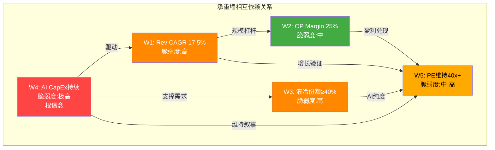
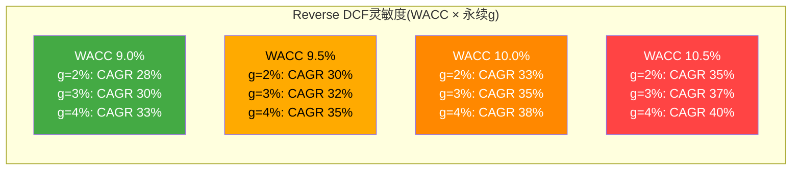
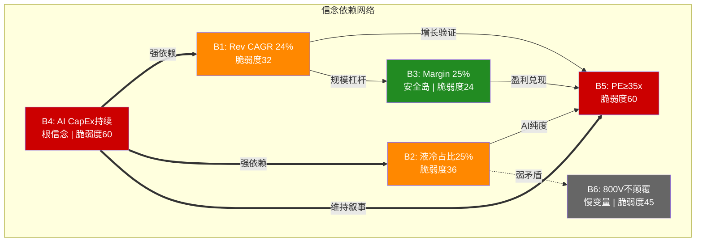
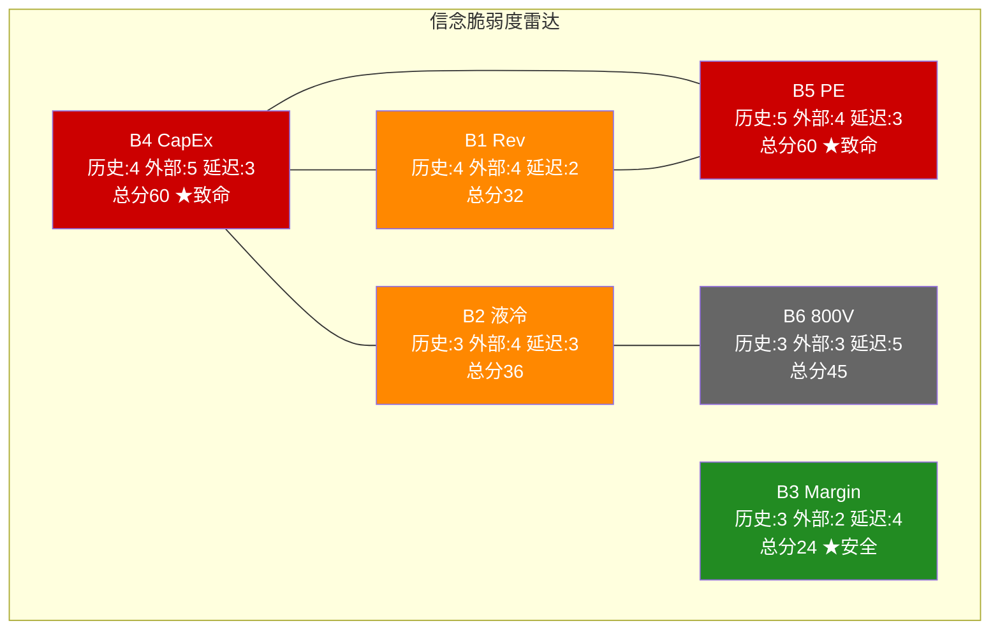
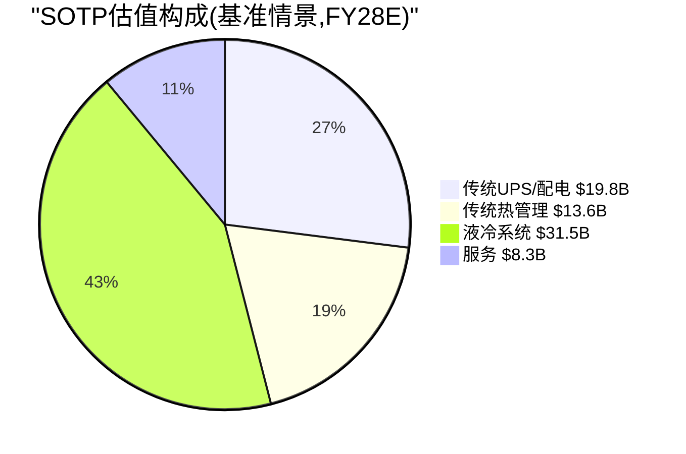
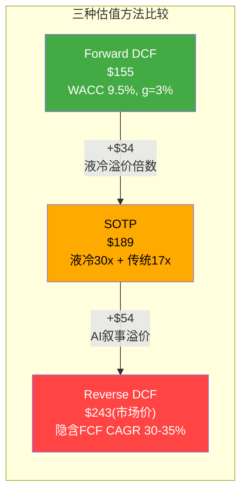

# 第十八章 Reverse DCF与市场隐含假设

> **核心命题**: 以$94.5B EV为已知答案，反推市场对VRT的隐含增长信仰——FCF需5年增长3.7倍，5面承重墙必须同时屹立。

---

## 18.1 估值基础数据：一张快照定位VRT在估值光谱上的位置

在进入Reverse DCF之前，需要先建立VRT当前估值的完整坐标。以下数据截至2026年2月20日：

**核心估值参数表**

| 指标 | 数值 | 来源/计算 |
|------|------|----------|
| 股价 | $243.06 | 2026-02-20 收盘 |
| 稀释股数 | ~382M | FY25 10-K |
| 市值 | ~$92.8B | 股价 × 稀释股数 |
| 净债务 | $1,675M | FY25资产负债表(总债务$3,459M - 现金$1,784M) |
| 企业价值(EV) | ~$94.5B | 市值 + 净债务 |
| FY25 调整后EPS | $4.13 | FMP共识(管理层报告$4.17, 差异来自调整口径) |
| FY25 EBITDA | $2,206M | FY25营业利润$1,891M + D&A$315M |
| FY25 FCF | $1,894M | OCF$2,114M - CapEx$220M |
| FY25 Revenue | $10,230M | 10-K |

**当前估值倍数矩阵**

| 倍数类型 | 计算方式 | VRT当前 | Eaton(ETN) | Schneider(SE) | 工业品中位数 |
|---------|---------|:------:|:--------:|:----------:|:---------:|
| PE(Adj TTM) | $243/$4.13 | **58.8x** | 30.2x | ~28x | 22-25x |
| Forward PE(FY26E) | $243/$5.99 | **40.6x** | ~28x | ~24x | 18-22x |
| EV/EBITDA(TTM) | $94.5B/$2.21B | **42.8x** | ~23x | ~18x | 14-18x |
| EV/FCF(TTM) | $94.5B/$1.89B | **50.0x** | ~28x | ~22x | 18-22x |
| FCF Yield | $1.89B/$92.8B | **2.0%** | 3.6% | 4.5% | 4-6% |
| P/B | | **15.7x** | 6.4x | ~4x | 3-5x |
| PEG(3Y) | 40.6x/34% | **1.19** | 1.87 | 2.00 | 1.5-2.0 |

**定位结论**：VRT在所有传统工业品估值指标上都处于极端位置。EV/EBITDA 42.8x是Eaton(23x)的1.86倍；FCF Yield 2.0%甚至低于10年期美国国债收益率(~4.3%)。投资者持有VRT获得的"现金流回报"不如买国债——这意味着投资者100%在为"增长"付费，且是为超高速增长付费。唯一让VRT看起来"合理"的指标是PEG 1.19，但这完全依赖于34% EPS CAGR的兑现。

---

## 18.2 Reverse DCF模型详解

### 方法论框架

传统DCF是"正向工程"——给定增长率和贴现率，计算公司值多少钱。Reverse DCF是"逆向工程"——以市场定价(EV)为已知答案，反推市场在赌什么增长率。

对于VRT这样估值极端的公司，Reverse DCF的价值远高于正向DCF，原因有三：
1. **避免锚定偏误**：正向DCF的结论高度依赖分析师选择的增长率假设，容易"先有结论再找假设"
2. **翻译市场语言**：直接回答"市场在赌什么"，而非"分析师觉得值多少"
3. **暴露隐含假设的极端性**：当隐含增长率显著偏离历史基准时，估值的脆弱性自然浮现

### 模型设定

**两阶段模型参数**：

| 参数 | 设定 | 理由 |
|------|------|------|
| 当前EV | $94.5B | 市值$92.8B + 净债务$1.675B |
| FY25 FCF基准 | $1,894M | FY25实际自由现金流 |
| 阶段一 | 5年高增长期(FY26-FY30) | AI CapEx超级周期的合理持续窗口 |
| 阶段二 | 永续增长 g=3% | 名义GDP增长率(通胀2% + 实际增长1%) |
| 永续期起始 | FY31+ | 高增长期结束后转入稳态 |

**Reverse DCF核心公式**：

$$EV = \sum_{t=1}^{5} \frac{FCF_0 \times (1+g_{implied})^t}{(1+WACC)^t} + \frac{FCF_5 \times (1+g_{\infty})}{(WACC - g_{\infty})} \times \frac{1}{(1+WACC)^5}$$

求解 $g_{implied}$ 使等式两边相等。

### WACC敏感性下的隐含FCF增长率

| WACC | 隐含FCF CAGR(5年) | 隐含FY30 FCF | FY30 FCF/FY25 FCF | 合理性评估 |
|:----:|:----------------:|:-----------:|:-----------------:|----------|
| 9.0% | ~30% | ~$7.0B | 3.7x | 接近共识上限——需要VRT成为$230亿营收、18%+ FCF Margin的公司 |
| 9.5% | ~32% | ~$7.6B | 4.0x | 超共识——隐含Rev CAGR~17%且FCF转化率持续提升 |
| 10.0% | ~35% | ~$8.5B | 4.5x | 远超共识——需要液冷爆发+传统业务全面加速 |
| 10.5% | ~37% | ~$9.2B | 4.9x | 极度乐观——近5倍FCF增长在工业品历史上几乎无先例 |
| 11.0% | ~39% | ~$9.9B | 5.2x | 不现实——即使是最乐观的AI CapEx假设也难以支撑 |

**关键观察**：无论WACC取何值(在合理的9-11%区间内)，市场隐含的FCF CAGR都在30%以上。这意味着VRT的FCF需要在5年内增长至少3.7倍——从$1.9B到$7B+。

### WACC选择的详细讨论

WACC的选择对Reverse DCF的结论影响巨大。VRT的WACC估算面临几个特殊挑战：

**Beta问题**：
- VRT的5年周Beta约为2.089(FMP数据)——这是一个异常高的数字
- Beta=2.089意味着VRT的股价波动是市场的2倍，对应CAPM计算：WACC = Rf(4.3%) + β(2.089) × ERP(5.5%) + Debt Spread = ~4.3% + 11.5% + 微量 ≈ **15.8%**
- 但这个Beta严重失真：VRT在2020-2023年经历了SPAC上市、权证波动、PE退出等非基本面事件，人为抬高了波动率

**合理WACC区间论证**：

| 方法 | WACC估算 | 适用性 |
|------|:-------:|--------|
| CAPM(历史β=2.089) | ~15.8% | **不适用**——β失真，高估风险 |
| CAPM(行业β=1.1-1.3) | 10.4-11.5% | 中等——假设VRT风险回归行业均值 |
| Eaton/Schneider隐含WACC | 9.0-10.0% | 参考——同业工业品估值隐含的折现率 |
| VRT信用利差法 | 9.5-10.5% | 合理——BBB级信用+股权溢价 |
| **采用区间** | **9.0-10.5%** | **偏保守——给VRT"AI基础设施"身份折扣** |

**WACC每变动50bps的估值影响**：

| WACC变动 | 隐含FCF CAGR变化 | 对应FY30 FCF差异 | 等效EV影响 |
|:-------:|:---------------:|:---------------:|:---------:|
| -50bps(从10%→9.5%) | -3pp(35%→32%) | -$0.9B | ~+$8B |
| +50bps(从10%→10.5%) | +2pp(35%→37%) | +$0.7B | ~-$7B |
| +100bps(从10%→11%) | +4pp(35%→39%) | +$1.4B | ~-$13B |

WACC每变动50bps对EV的影响约为$7-8B(约8%)。这意味着仅WACC假设的分歧就可以导致±$20/股的估值差异。

---

## 18.3 隐含增长 vs 共识对比：5-10pp的"信仰溢价"

### 共识估计时间线

| 年份 | 共识Revenue | Rev增速 | 共识Adj EPS | EPS增速 | 隐含FCF(估) |
|------|:--------:|:------:|:---------:|:------:|:---------:|
| FY25(实际) | $10.2B | +28% | $4.13 | — | $1,894M |
| FY26E | $13.6B | +33% | $5.99 | +45% | ~$2,600M |
| FY27E | $16.9B | +24% | $8.01 | +34% | ~$3,500M |
| FY28E | $19.6B | +16% | $9.98 | +25% | ~$4,300M |
| FY29E | $20.9B | +7% | $10.83 | +9% | ~$4,700M |
| FY30E | $22.8B | +9% | $12.59 | +16% | ~$5,300M |

*注：FY29-30 FCF估算基于14-15% FCF Margin假设，共识覆盖率较低*

**共识CAGR(FY25-30)**：
- Revenue CAGR: ~17.5%
- EPS CAGR: ~25%
- 隐含FCF CAGR: ~23%(基于上表估算)

### 差距分析

| 指标 | 市场隐含(Reverse DCF) | 共识估计 | 差距 | 含义 |
|------|:-------------------:|:------:|:---:|------|
| FCF CAGR(5Y) | 30-35% | ~23% | **+7-12pp** | 市场在共识基础上额外押注 |
| FY30 FCF | $7.0-8.5B | ~$5.3B | **+$1.7-3.2B** | 隐含超额FCF需要来源 |
| 隐含Rev(FY30) | $25-28B | $22.8B | **+$2-5B** | 或更高利润率，或更高营收 |

这个5-10pp的差距可以被称为**"信仰溢价"**——投资者支付的价格不仅反映了共识预期，还额外包含了对以下一个或多个假设的信仰：

**信仰溢价的三种可能来源**：

1. **利润率超预期扩张(最可能)**：市场认为VRT的Adj OP Margin不会止步于管理层目标的25%，而是会达到27-28%。VOS(Vertiv Operating System)的规模效应+液冷高毛利组合可能驱动超预期利润率。如果FY30 OP Margin达到27%(vs共识隐含的~24%)，额外利润率可贡献约$1.5B FCF增量

2. **CapEx强度持续低于预期(中等可能)**：VRT当前CapEx/Rev仅2.2%，远低于重资产制造商(5-8%)。如果轻资产模式在液冷规模化后依然成立(外包组装+设计主导)，FCF转化率可能超过分析师模型中的保守假设。FY30 CapEx/Rev从3%(保守)降至2%(乐观)可贡献约$0.5B FCF增量

3. **收入加速(最乐观)**：市场认为AI CapEx超级周期不仅持续到2030，而且加速——FY29-30的Rev增速不是7-9%(共识)而是12-15%。这需要AI CapEx在2029仍以两位数增长，历史上没有先例，但AI的变革性质也没有先例

**最可能的组合**：信仰溢价主要来自利润率超预期(~60%贡献) + CapEx低于预期(~25%贡献) + 收入小幅超预期(~15%贡献)。

---

## 18.4 五面承重墙详解

PE 40.6x(Forward FY26)要站住脚，以下5面承重墙**必须同时成立**。任何一面倒塌，估值大厦都会受损；两面以上同时倒塌，估值可能崩塌。

### 承重墙详细分析表

| # | 承重墙 | 隐含值 | 历史/行业锚 | 缺口 | 脆弱度 | 倒塌影响 |
|---|--------|:------:|:---------:|:---:|:-----:|:------:|
| W1 | Rev CAGR FY25-30 | ~17.5% | 工业品长期5-7%, DCPI 8-10% | +8-10pp | **高** | -25% |
| W2 | Adj OP Margin FY30 | ≥25% | FY25实际20.4%, Eaton峰值22-23% | +3-5pp | **中** | -12% |
| W3 | 液冷份额FY28+ | ≥40% | 当前CDU 70%, Schneider追赶 | 需维持 | **高** | -15% |
| W4 | AI CapEx持续至2030 | 持续增长 | 历史CapEx周期3-5年 | +2-3年 | **极高** | -35% |
| W5 | PE维持40x+(FY26-28) | Forward 40x+ | 工业品历史中位15-25x | +15-25x | **中-高** | -26% |

### W1: Revenue CAGR ~17.5% — 工业品公司的科技增速

- **隐含假设**：VRT从FY25 $10.2B增长到FY30 ~$23B，5年翻2.2倍
- **历史锚**：Eaton过去10年Rev CAGR ~6%，Schneider ~4%，工业品板块中位数5-7%
- **VRT自身历史**：FY20-25 Rev CAGR ~15%(含COVID恢复+AI爆发)；FY18-25(含PE buyout前)约8-10%
- **缺口分析**：17.5% CAGR需要AI液冷+传统DCPI双轮驱动持续5年。共识FY29-30增速已降至7-9%——如果减速来得更早(FY28 Rev增速<10%)，5年CAGR将跌破15%，无法支撑当前估值
- **脆弱度**：**高**——完全依赖AI CapEx周期长度，VRT自身无法控制客户(MSFT/AMZN/GOOG/META)的支出决策
- **倒塌影响**：Rev CAGR从17.5%降至12%→EV下降约25%(~$23B)，每股影响约-$60

### W2: Adj OP Margin ≥25% — 超越所有工业品同行

- **隐含假设**：VRT的利润率从FY25 20.4%提升至FY30 25%+，超越Eaton历史峰值(22-23%)
- **驱动力**：VOS持续优化+液冷高毛利产品占比提升+规模杠杆
- **风险点**：(a)液冷竞争加剧→定价权削弱→毛利率承压；(b)$15B积压中部分合同是低价锁定的旧订单，随着执行其利润率可能低于预期；(c)变压器等零部件成本通胀可能持续
- **缺口分析**：管理层长期目标25% Adj OP Margin有VOS系统支撑，但从20.4%到25%需要460bps的提升——FY26指引22-23%意味着前两年已完成大部分提升，后续斜率放缓
- **脆弱度**：**中**——VOS是内部因素(可控)，但液冷定价权是外部因素(竞争决定)
- **倒塌影响**：Margin停在21%(vs 25%)→FY30 EBITDA减少约$1.1B→EV下降约$11B(-12%)

### W3: 液冷份额 ≥40% — 从准垄断到双寡头的底线

- **隐含假设**：VRT在CDU液冷领域维持至少40%的份额(从当前~70%下降但不崩溃)
- **威胁来源**：Schneider Electric(2024收购Motivair→液冷整合)+Eaton(Boyd收购)+Cooler Master/台达等台湾厂商
- **关键变量**：GB300/Rubin换代平台(2026H2-2027)的首选供应商地位——如果NVIDIA将VRT从"唯一首选"降级为"多选之一"，份额将加速流失
- **缺口分析**：从70%到40%本身就是大幅下降，但市场隐含至少40%作为底线。如果份额跌破30%(三足鼎立格局)，液冷对VRT的估值贡献将从当前的~$30B降至~$15B
- **脆弱度**：**高**——取决于客户(NVIDIA/超大规模)的供应商策略，VRT无法单方面决定
- **倒塌影响**：份额从40%降至25%→液冷SOTP减少约$10-15B(-15%总EV)

### W4: AI CapEx持续至2030 — 最脆弱的根信念 ★

- **隐含假设**：全球超大规模企业(MSFT/AMZN/GOOG/META)的数据中心CapEx在FY25-30期间持续增长或至少维持高位
- **历史锚**：**历史上没有一次CapEx超级周期持续超过5年**
  - 2000-2001 TMT泡沫：CapEx周期3年见顶后崩塌60%
  - 2014-2016 云计算第一波：CapEx增长4年后放缓
  - 2018-2019 数据中心扩张：CapEx增长3年后因贸易战+COVID调整
- **当前信号**：Meta FY26 CapEx指引$60-65B(+40% YoY)，Microsoft FY26指引$80B+，但这些是12个月可见度——2028-2030的CapEx路径完全不可知
- **缺口分析**：市场隐含AI CapEx至少持续到2030(距2023年起算=7年超级周期)，这将打破所有历史先例。即使AI的变革性"这次不同"，企业资本支出决策仍受ROI约束——如果2027年AI应用层收入不能证明算力投资的回报，CapEx收缩是必然的
- **级联效应**：W4是根信念。如果AI CapEx在2028回落30%：
  - W1倒塌：Rev增速可能从+15%降至+3-5%(VRT的非液冷业务仍增长，但AI增量消失)
  - W3被削弱：液冷需求增长放缓→份额竞争加剧→VRT份额从40%进一步下滑
  - W5倒塌：失去AI增长叙事→PE从40x压缩至25-30x
- **脆弱度**：**极高**——完全外部不可控+历史无先例+级联传导
- **倒塌影响**：直接-35%，通过级联传导可能达到-50%

### W5: PE维持40x+ — 工业品公司的科技估值

- **隐含假设**：VRT在FY26-28期间维持Forward PE ≥35-40x
- **历史锚**：工业品公司的PE中位数为15-25x。即使是Eaton(当前30x，已是其历史高位)也远低于VRT。工业品公司维持40x+ PE超过2年的案例极为罕见
- **维持条件**：(a)AI叙事不破裂 (b)每季度业绩持续beat (c)液冷增长数据亮眼 (d)没有宏观衰退
- **压缩触发器**：(a)任何一个季度EPS miss (b)液冷订单增速放缓 (c)AI回报率质疑升温 (d)利率上升→高PE股票被抛售
- **缺口分析**：维持40x+ PE需要市场持续将VRT定位为"AI基础设施"而非"工业品"。一旦AI叙事退潮(如同2022年加密货币叙事退潮导致相关股票PE崩塌)，VRT的PE可能在6-12个月内从40x回归至25-30x
- **脆弱度**：**中-高**——情绪驱动，可在短时间内剧烈变化
- **倒塌影响**：PE从40x压缩至30x→市值减少约$23B(-26%)

### 承重墙脆弱度总览

**结构性发现**：W4(AI CapEx)是所有其他承重墙的根基。W5(PE估值)是所有其他墙的"接收器"——任何墙倒塌都会通过情绪传导冲击PE。W2(利润率)是唯一相对独立的墙(VOS内部驱动)，但它也无法在其他墙全部倒塌时独自支撑估值。

---

## 18.5 PE隐含的FY30场景

### 投资者回报反推

假设投资者在$243买入VRT，要求10%年化回报(工业品股票的合理期望回报)：

$$\$243 \times (1.10)^5 = \$391$$

FY30目标股价$391。在不同EPS情景下，需要的FY30 PE：

| FY30 EPS情景 | 假设 | 需要的FY30 PE | 该PE水平的历史可比 | 实现概率 |
|:----------:|------|:----------:|:---------------:|:------:|
| $15.00(乐观) | EPS CAGR 29% | 26.1x | 接近Eaton当前水平 | 合理但需全面超执行 |
| $12.59(共识) | EPS CAGR 25% | 31.1x | 工业品偏高，AI叙事需维持 | 中等——需要共识全部兑现 |
| $10.00(保守) | EPS CAGR 19% | 39.1x | 当前VRT水平，科技公司级别 | 低——需要AI叙事不衰退 |
| $8.00(悲观) | EPS CAGR 14% | 48.9x | 超当前VRT水平 | 极低——不现实 |

### 情景解读

**共识路径($12.59)分析**：如果共识EPS完美兑现，投资者获得10%年化回报需要VRT在2030年以31x PE交易。参考Eaton当前30x(已是其历史高位)——这意味着VRT的AI溢价几乎完全消失，估值回归工业品龙头水平。换言之，**共识完美执行 = 投资者勉强获得10%回报**，没有任何超额回报的空间。

**乐观路径($15.00)分析**：如果VRT超预期执行(利润率28%+液冷爆发+服务加速)，EPS达到$15，那么FY30只需26x PE(低于Eaton当前水平)即可提供10%回报。这是唯一提供"舒适安全边际"的路径——但需要全部5面承重墙超预期。

**保守路径($10.00)分析**：如果任何承重墙出现裂缝(AI CapEx放缓或液冷份额丢失)，EPS可能只有$10。此时需要39x PE才能提供10%回报——要在2030年仍维持39x PE，VRT需要一个新的增长叙事(比如量子计算散热)来接棒AI叙事，概率极低。

### 核心结论

**当前价格已几乎完全反映共识预期。** 投资者在$243买入VRT，实质上是在做以下"赌注"：

> "我相信VRT将在5年内完美执行共识预期(EPS从$4.13增长到$12.59，CAGR 25%)，且在2030年仍能以31x PE交易(需要AI叙事不破裂)。作为回报，我获得10%年化收益——不多不少。"

这个赌注的风险收益比是不对称的：共识全部兑现=10%回报，任何环节低于预期=回报显著低于10%甚至为负。安全边际≈零。

**灵敏度要点**：即使在最宽松的假设组合(WACC 9.0% + g=4%)下，隐含FCF CAGR仍高达33%。在最严格的假设(WACC 10.5% + g=2%)下，隐含CAGR达到35%。**无论怎么调参数，市场都在赌30%+的FCF增长**——这不是参数选择问题，而是估值本身的极端性。

---

# 第十九章 信念反演——市场必须相信什么

> **核心命题**: 从Reverse DCF反推的6个隐含信念中，B4(AI CapEx持续)是根信念，B3(利润率)是唯一安全信念，安全边际为零。

---

## 19.1 隐含信念集：6个必须同时成立的假设

Reverse DCF告诉我们"市场在赌30%+ FCF增长"，但这个抽象数字需要被分解为具体的、可验证的、可翻转的信念。以下6个信念构成了VRT $243估值的信仰体系——它们必须**同时成立**。

### 信念详细登记表

| # | 信念 | 隐含值 | 外部锚/基准 | 缺口 | 验证时间 | 可验证性 |
|---|------|:------:|:----------:|:---:|:------:|:-------:|
| B1 | FY26-28 Rev CAGR ~24% | 3年复合24% | 工业品长期5-7%，DCPI 8-10% | +14-17pp | 6-18月 | **高**——每季度财报可验证 |
| B2 | 液冷FY28营收占比≥25% | $4.5B+(FY28) | 当前~$1.2B(15%) | +10pp占比 | 18-24月 | **中**——VRT不单独披露 |
| B3 | Adj OP Margin→25% | FY28达25% | FY25实际20.4%，Eaton峰值22-23% | +3-5pp | 24-36月 | **高**——季度利润率可追踪 |
| B4 | AI CapEx持续至2029+ | 不回落 | 历史CapEx周期3-5年 | +2-3年超历史 | 12-24月 | **中**——依赖超大规模指引 |
| B5 | PE维持≥35x(FY28) | Forward 35-40x | 工业品历史中位15-25x | +10-20x | 24-36月 | **低**——情绪驱动，难预测 |
| B6 | 800V不颠覆UPS | 升级>替代 | 技术路线不确定 | N/A | 36-60月 | **低**——技术演进缓慢 |

### 信念深度解析

**B1: FY26-28 Revenue CAGR ~24%**

这是最"接近验证"的信念。FY26指引$13.3-13.8B(+30-35%)几乎锁定了第一年。关键变量是FY27-28：共识预期FY27增速降至24%、FY28降至16%。如果FY28增速低于12%，3年CAGR将低于20%，对估值构成压力。积压$15B(1.5年覆盖)提供了短期可见性，但积压的质量(取消率、延期率)才是真正的领先指标。

**B2: 液冷FY28占比≥25%**

液冷是VRT估值溢价的核心来源。从当前~15%(~$1.2B)到FY28的25%(~$4.5B)意味着液冷营收需要3年内增长2.8倍(CAGR ~40%)。这不是不可能——但需要(a)AI集群持续向液冷迁移(功率密度>50kW/rack) (b)VRT在GB300/Rubin平台维持首选地位 (c)Schneider的CDU产品不构成实质性价格竞争。任何一个条件不满足，25%占比就难以实现。

**B3: Adj OP Margin→25%**

这是6个信念中**最可控**的一个。VOS(Vertiv Operating System)是VRT的内部精益制造体系，过去3年已驱动利润率从15.4%(FY22)提升至20.4%(FY25)——5年460bps的改善节奏一致且可追踪。管理层FY30长期目标25%有VOS规模效应+液冷高毛利产品组合的支撑。主要风险是定价权：如果液冷竞争导致CDU毛利率从50%+降至35-40%，利润率扩张将减速。

**B4: AI CapEx持续至2029+**

这是6个信念中**最外部不可控、最缺乏历史先例**的一个。当前AI CapEx超级周期始于2023年(ChatGPT催化)，到2029年将持续6-7年。历史上：
- 电信CapEx周期(1998-2001)：3年
- 云计算第一波(2014-2017)：4年
- 5G建设(2020-2022)：3年

没有一次CapEx超级周期持续超过5年。AI可能"这次不同"——但历史上每次都有人说"这次不同"。关键检验点：2027年——如果到那时AI应用层收入(ChatGPT/Copilot/企业AI)未能证明超大规模CapEx的ROI，削减将不可避免。

**B5: PE维持≥35x(FY28)**

这是最"虚幻"的信念——它不取决于VRT的基本面，而取决于市场情绪和叙事。工业品公司从未在长期维持35x+ PE。参考案例：
- ASML：凭借光刻机垄断维持30-35x PE超过10年——但ASML的垄断性远超VRT
- Caterpillar(CAT)：在矿业超级周期中PE一度达25x，之后回归15x
- 参考VRT自身：2022年PE仅14x(AI叙事之前)

从14x(2022)到59x(当前)的膨胀需要一个持续的AI叙事来维持。一旦叙事退潮，PE压缩将是剧烈的——通常3-6个月完成30%+的PE压缩。

**B6: 800V不颠覆UPS**

这是最"慢变量"的信念——技术替代通常需要5-10年。VRT的传统UPS业务(~$4.5B，44%营收)是一个稳定的利润贡献者。800V HVDC架构如果标准化，将从根本上改变数据中心供电架构——从AC(交流)转向DC(直流)，消除传统UPS的需求。VRT正在主动开发800V产品(与NVIDIA联合)，试图将"被颠覆"变为"升级机会"。但技术路线的不确定性很高：如果800V标准化进程快于VRT的产品迭代，VRT可能同时面临旧产品(UPS)贬值和新产品(800V)尚未量产的"真空期"。

---

## 19.2 脆弱度三维评分

### 评分方法论

三维评分体系衡量每个信念"被打破"的难度：

- **历史支撑(1-5)**：1=有大量历史先例支撑，5=完全无历史先例
- **外部依赖(1-5)**：1=完全由VRT自身控制，5=完全由外部因素决定
- **验证延迟(1-5)**：1=下个季度即可验证，5=需要3年以上才能确认

总分 = 历史支撑 × 外部依赖 × 验证延迟（乘积关系，强调三维同时脆弱的信念）

### 脆弱度评分矩阵

| 信念 | 历史支撑 | 理由 | 外部依赖 | 理由 | 验证延迟 | 理由 | 总分 | 排序 |
|------|:-------:|------|:------:|------|:------:|------|:---:|:---:|
| B4 AI CapEx | 4 | 无>5年周期先例 | 5 | 超大规模决策 | 3 | 12-24月见端倪 | **60** | **#1** |
| B5 PE≥35x | 5 | 工业品无先例 | 4 | 市场情绪驱动 | 3 | 持续观测中 | **60** | **#1** |
| B6 800V | 3 | 技术路线不确定 | 3 | 行业标准博弈 | 5 | 3-5年才清晰 | **45** | #3 |
| B2 液冷25% | 3 | CDU增长可期 | 4 | 客户+竞对决定 | 3 | 18-24月验证 | **36** | #4 |
| B1 Rev 24% | 4 | 工业品无先例 | 4 | 依赖AI CapEx | 2 | 每季度可验证 | **32** | #5 |
| B3 Margin 25% | 3 | Eaton达22-23% | 2 | VOS内部驱动 | 4 | 需要3年观察 | **24** | **#6最稳固** |

### Top 3最脆弱信念详解

**#1 B4 AI CapEx持续(总分60)**：三维评分均在高位——历史无先例(4/5) × 完全外部决定(5/5) × 中等验证延迟(3/5)。这是VRT估值的"阿喀琉斯之踵"。投资者对此信念的置信度完全取决于对AI变革性质的判断——如果AI是"类互联网"级别的范式转换(CapEx周期10年+)，B4成立；如果AI是"类3D打印"级别的炒作(CapEx周期3-4年)，B4将在2026-2027崩塌。

**#1 B5 PE维持35x+(总分60，并列)**：历史支撑最弱(5/5)——工业品公司维持35x+ PE的案例不存在。唯一的"类比"是ASML(光刻机垄断30x+)，但VRT的液冷地位远不如ASML在光刻领域的不可替代性。PE估值是"情绪×叙事"的函数，可在数周内剧变(参考2022年VRT从$25跌至$8，PE从25x压缩至14x)。

**#3 B6 800V不颠覆(总分45)**：验证延迟最长(5/5)——800V HVDC标准化的时间线是3-5年，在此期间市场无法确认该信念是否成立。这创造了一种"持续悬念"——投资者无法通过季度财报验证，只能持续忍受不确定性。

---

## 19.3 信念一致性矩阵(6×6)

信念之间的逻辑关系决定了"级联传导"的路径——一个信念失败是否会拉倒其他信念。

### 一致性矩阵

| | B1 Rev | B2 液冷 | B3 Margin | B4 CapEx | B5 PE | B6 800V |
|---|:---:|:---:|:---:|:---:|:---:|:---:|
| **B1 Rev** | — | **协同** | **协同** | **强依赖** | 支撑 | 独立 |
| **B2 液冷** | **协同** | — | **协同** | **强依赖** | 支撑 | **弱矛盾** |
| **B3 Margin** | **协同** | **协同** | — | 弱依赖 | 支撑 | 独立 |
| **B4 CapEx** | **被依赖** | **被依赖** | 弱 | — | **被依赖** | 独立 |
| **B5 PE** | 需要 | 需要 | 需要 | **强需要** | — | 弱 |
| **B6 800V** | 独立 | **弱矛盾** | 独立 | 独立 | 弱 | — |

**关系类型说明**：
- **强依赖/被依赖**：A失败→B大概率失败(单向因果)
- **协同**：A和B互相增强(正反馈)
- **弱矛盾**：A和B部分冲突(一个成立可能削弱另一个)
- **独立**：A和B之间无显著因果关系
- **支撑/需要**：A的成立对B有利/B的成立需要A

### 关键结构性发现

**发现1: B4是根信念——单点故障**

B4(AI CapEx持续)被B1、B2、B5三个信念"强依赖"。传导链：
- B4→B1：AI CapEx回落→数据中心建设放缓→VRT订单减少→Revenue增速下降
- B4→B2：AI CapEx回落→液冷需求增长放缓→VRT液冷营收占比可能反降
- B4→B5：AI叙事破裂→工业品PE回归→从40x压缩至25-30x

这意味着**B4单独失败可以同时拉倒B1、B2、B5三面承重墙**——从一个信念失败演变为四个信念失败的级联崩塌。

**发现2: B2和B6的弱矛盾**

液冷占比提升(B2)和800V不颠覆UPS(B6)之间存在微妙张力。800V HVDC架构如果加速标准化(B6失败)，可能改变数据中心的冷却架构需求——直流供电的功率转换损耗更低、发热更少，可能降低CDU液冷的必要性。反之，如果液冷需求爆发(B2超预期)，可能是因为功率密度增长快于800V的标准化速度——这暗示800V的"颠覆"被延迟而非取消。

**发现3: B3是唯一安全岛**

Adj OP Margin的扩张主要由VOS(内部精益系统)驱动，外部依赖最低(2/5)。即使AI CapEx放缓(B4失败)、液冷份额丢失(B2失败)、PE压缩(B5失败)，VOS仍可通过成本优化推动传统业务的利润率提升。B3是投资者在"最坏情景"下唯一可以依靠的信念——但一个信念的独立成立无法拯救整体估值。

---

## 19.4 单信念翻转测试

逐一测试每个信念失败的估值影响。方法：将该信念替换为"失败假设"，保持其他信念不变，计算新的概率加权估值。

### 单信念翻转结果表

| 信念失败 | 替代假设 | 影响路径 | 估值影响 | 新EV | 新每股 | vs $243 |
|---------|---------|---------|:------:|:----:|:-----:|:------:|
| B4失败 | AI CapEx 2028回落30% | Rev减速+液冷放缓+PE压缩(级联) | **-35%** | ~$61B | **~$160** | **-34%** |
| B5失败 | PE压缩至30x(Eaton水平) | 直接估值重定价 | **-26%** | ~$69B | **~$181** | **-26%** |
| B1失败 | Rev CAGR 12%(非24%) | 收入增长减半 | **-25%** | ~$71B | **~$186** | **-23%** |
| B2失败 | 液冷份额降至20%(非40%+) | 液冷SOTP缩水 | **-15%** | ~$80B | **~$209** | **-14%** |
| B3失败 | Margin停在21%(非25%) | 利润率低于预期 | **-12%** | ~$83B | **~$217** | **-11%** |
| B6失败 | 800V 2029标准化,UPS萎缩 | UPS业务长期折价 | **-10%** | ~$85B | **~$222** | **-9%** |

### 翻转深度分析

**B4翻转(AI CapEx回落)——最致命的单信念失败**：

如果全球超大规模企业在2028年将数据中心CapEx削减30%(从~$350B→~$245B)，影响链如下：
- VRT FY28 Rev从共识$19.6B下调至~$15B(液冷增量消失+传统业务维持)
- Adj OP Margin从25%目标下调至21%(定价权削弱+产能利用率下降)
- Forward PE从40x压缩至25x(AI叙事破裂→工业品重新定价)
- FY28E EPS约$7.0 × 25x PE = 股价$175，折现至当前~$160

这35%的下跌中，约15%来自基本面恶化(收入+利润率)，约20%来自PE压缩。**PE压缩才是主要杀伤力**——因为VRT的高PE已经将任何基本面的下行放大了。

**B5翻转(PE压缩)——最快速的单信念失败**：

与B4不同，B5的翻转可以在没有任何基本面变化的情况下发生——纯粹由市场情绪驱动。触发器可能是：
- 利率意外上升→高PE股票抛售潮
- AI概念股整体回调(类似2022年ARKK崩塌)
- VRT季度业绩符合预期但未超预期(在40x PE水平，"meet"等于"miss")
- 大额解禁/PE股东减持(Platinum Equity虽已退出，但类似事件可能发生)

PE从40x压缩至30x意味着市值直接减少~$23B。这种压缩通常在3-6个月内完成，投资者几乎没有反应时间。

---

## 19.5 双信念翻转测试

现实中，信念失败很少孤立发生——特别是在B4是根信念的结构下，B4失败几乎必然触发其他信念连锁失败。

### 双信念翻转场景

**场景D1: B4+B5(AI回落+PE压缩)——概率20-25%**

| 维度 | 数值 |
|------|------|
| 触发条件 | 2027-2028超大规模CapEx削减20-30% + AI叙事退潮 |
| 联合概率 | 20-25%(两者高度正相关，ρ≈0.7) |
| B4影响 | Rev增速从17%→8%, FY28 EPS~$7.0 |
| B5影响 | PE从40x→22x(工业品中位数) |
| 联合估值 | $7.0 × 22x = **$154/股** → 折现~**$123** |
| vs当前 | **-49%** |
| 历史类比 | 2022年VRT从$25跌至$8(-68%)，当时是利率冲击+半导体周期下行 |

这是VRT最大的单一风险情景。B4和B5的相关系数极高——AI CapEx回落几乎必然触发AI概念股PE压缩。20-25%的联合概率意味着大约每4-5年可能发生一次。

**场景D2: B1+B2(收入减速+液冷丢份额)——概率15-20%**

| 维度 | 数值 |
|------|------|
| 触发条件 | Schneider成为GB300/Rubin首选 + VRT传统业务增长放缓 |
| 联合概率 | 15-20%(中等相关，ρ≈0.4) |
| B1影响 | Rev CAGR从24%→14%, FY28 Rev~$16B |
| B2影响 | 液冷FY28占比15%(非25%), SOTP液冷部分减半 |
| 联合估值 | SOTP调整：传统$33B + 液冷$15B + 服务$8B = $56B → **~$146/股** → 折现~**$125** |
| vs当前 | **-49%** |
| 触发时间 | GB300换代(2026H2-2027)是第一个验证窗口 |

D2的有趣之处在于它不依赖AI CapEx崩塌——即使AI CapEx继续增长，VRT也可能因为**份额丢失**而无法受益。Schneider的整合型方案(电力+冷却+软件)可能在GB300平台上比VRT的单点方案更受青睐。

**场景D3: B4+B1+B2(三信念级联)——概率10-15%**

| 维度 | 数值 |
|------|------|
| 触发条件 | AI CapEx 2027崩塌 + VRT同时丢失液冷份额 |
| 联合概率 | 10-15%(B4失败触发B1几乎确定，B2部分相关) |
| 影响叠加 | Rev CAGR→5%, 液冷FY28占比→10%, Margin→20%, PE→20x |
| 联合估值 | FY28E EPS~$4.5 × 20x = **$90/股** → 折现~**$73** |
| vs当前 | **-70%** |
| 性质 | "完美风暴"——类似2001年TMT泡沫破裂对Cisco/JDS Uniphase的打击 |

**场景D4: B2+B6(液冷丢份额+800V颠覆)——概率5-10%**

| 维度 | 数值 |
|------|------|
| 触发条件 | 液冷竞争失利 + 800V HVDC 2028-2029标准化 |
| 联合概率 | 5-10%(两者弱矛盾关系，但可同时发生) |
| 影响叠加 | 液冷缩水 + UPS长期承压 → VRT回归纯传统工业品 |
| 联合估值 | 传统工业品SOTP ~$42B → **~$110/股** |
| vs当前 | **-55%** |
| 时间线 | 3-5年缓慢演进，非突然崩塌 |

### 双翻转总结表

| 场景 | 信念组合 | 联合概率 | 联合影响 | 隐含股价 | vs $243 |
|------|---------|:------:|:------:|:------:|:------:|
| D1 | B4+B5 | 20-25% | -49% | ~$123 | **-49%** |
| D2 | B1+B2 | 15-20% | -49% | ~$125 | **-49%** |
| D3 | B4+B1+B2 | 10-15% | -70% | ~$73 | **-70%** |
| D4 | B2+B6 | 5-10% | -55% | ~$110 | **-55%** |

---

## 19.6 翻转结论

### 安全边际 = 零

单信念翻转测试揭示了一个严峻的现实：**B4或B5单独失败即可触发评级从"中性关注"变为"审慎关注"**。这意味着VRT的估值没有任何"缓冲区"——投资者在$243买入，是在赌6个信念全部成立。

### B4是致命信念

B4(AI CapEx持续)是信念体系的"根节点"。它的失败不仅直接影响估值(-35%)，还通过级联传导放大为-49%(D1场景)甚至-70%(D3场景)。投资VRT本质上是在对AI CapEx超级周期的持续性下注——如果你对此没有高度信心(>70%概率)，当前估值的风险收益比是不对称的。

### B3是唯一安全信念

Adj OP Margin的扩张由VOS内部驱动，是6个信念中唯一不完全依赖外部因素的。即使在最坏的情景(AI CapEx崩塌+液冷份额丢失+PE压缩)下，VOS仍可推动传统业务的效率提升。但一个信念的安全无法拯救五个信念的脆弱。

### 概率反演

要justify当前$243的估值，概率分布必须满足什么条件?

| 情景 | 分析概率 | 价格隐含概率 | 偏差 | 含义 |
|------|:------:|:---------:|:---:|------|
| S1 牛市($402) | 20% | ~25% | +5pp | 市场略微高估牛市概率 |
| S2 基准($258) | 40% | ~42% | +2pp | 基本一致 |
| S3 熊市($150) | 30% | ~25% | -5pp | **市场低估熊市概率5pp** |
| S4 极端($63) | 10% | ~8% | -2pp | 市场略微低估尾部风险 |

**关键发现**：要让概率加权估值等于$243，市场给S3(熊市)的概率不能超过25%。而我们的分析认为S3概率为30%——5pp的差距意味着市场对下行风险的定价不足。这5pp差距对应约$10-15/股的"风险未定价溢价"。

---

# 第二十章 SOTP分部估值与敏感性

> **核心命题**: 分拆VRT的"工业品身体"和"AI估值外衣"，液冷仅占23% FY28E营收却贡献43% SOTP估值。传统业务底部$110/股提供有限下行保护。

---

## 20.1 为什么需要SOTP

VRT是一家"估值分裂"的公司：85%的营收来自增长10-15%的传统工业品业务(UPS/配电/精密空调)，15%来自增长50%+的AI液冷业务。用单一PE估值一家"两速公司"会掩盖关键问题：

1. **传统业务被高估了多少?** — 如果把VRT拆成两家公司(传统+液冷)，传统部分以Eaton/Schneider的倍数交易只值$42B(~$110/股)。这意味着剩余$51B($133/股)的估值全部归属于仅$1.2B营收的液冷业务——隐含液冷估值42x EV/Revenue
2. **液冷的"隐含估值"是否合理?** — 42x EV/Revenue即使在SaaS领域也属于极高水平(CrowdStrike ~25x, Datadog ~22x)。VRT的液冷硬件业务不具备SaaS的经常性收入特征，这个隐含估值需要液冷在3年内至少增长3倍才能回归合理区间
3. **下行保护有多少?** — SOTP的传统业务部分提供了"估值底部"——即使AI叙事完全破灭，VRT作为#1 DCPI供应商的传统业务+服务收入仍有实质价值

---

## 20.2 营收拆分详表(FY25实际→FY28E)

VRT不单独披露液冷营收，以下拆分基于管理层定性披露、行业数据和分析师估算。

### 四分部营收模型

| 业务分部 | FY25 Rev | 占比 | FY26E Rev | FY27E Rev | FY28E Rev | 3Y CAGR | 增长假设 |
|---------|:-------:|:---:|:-------:|:-------:|:-------:|:------:|---------|
| 传统UPS/配电 | ~$4,500M | 44% | ~$4,900M | ~$5,200M | ~$5,500M | +7% | 通胀传导+DC建设+替换周期 |
| 传统热管理 | ~$3,500M | 34% | ~$3,900M | ~$4,200M | ~$4,500M | +9% | AI DC精密空调需求+非液冷热管理 |
| 液冷系统 | ~$1,200M | 12% | ~$2,200M | ~$3,000M | ~$3,500M | +43% | GB300/Rubin渗透+CDU份额维持 |
| 服务 | ~$1,030M | 10% | ~$1,150M | ~$1,300M | ~$1,500M | +14% | 安装基数扩大+合同续签率提升 |
| **合计** | **$10,230M** | **100%** | **~$12,150M** | **~$13,700M** | **~$15,000M** | **+14%** | |

*注: FY26-28E合计低于共识($13.6B/$16.9B/$19.6B)，反映SOTP通常采用较保守的增长假设*

### 各分部增长假设论述

**传统UPS/配电(CAGR +7%)**：

这是VRT最稳定的业务线。增长驱动力来自三个层面：(a)通胀传导——VRT过去3年展现了强势定价权(每年提价5-8%)，在大宗商品成本上行周期尤为明显；(b)数据中心新建——即使不是AI数据中心，全球云迁移仍在驱动传统DC建设；(c)替换周期——北美UPS安装基数老化(平均寿命10-12年)，2026-2028进入替换高峰。7%的CAGR在历史上属于偏高水平(长期5-6%)，但DC建设热潮提供了额外支撑。

**传统热管理(CAGR +9%)**：

传统热管理(风冷精密空调、行级冷却)受益于AI数据中心的"溢出效应"——即使不采用液冷的DC也需要更高密度的空调系统(因为AI服务器即使部分风冷也比传统服务器发热更多)。9%的CAGR反映了从"纯传统DC"需求(+5%)和"AI DC溢出"需求(+4%)的叠加。

**液冷系统(CAGR +43%)**：

这是VRT估值溢价的核心引擎。假设基于：(a)全球液冷TAM从FY25 ~$3B增长到FY28 ~$10B(行业共识)；(b)VRT份额从~40%(FY25)维持在~35%(FY28)——比当前CDU 70%大幅下降，反映Schneider/Eaton追赶；(c)液冷产品组合从纯CDU扩展到CDU+管路+流体管理(PurgeRite整合效应)。43%的CAGR看起来很高，但需要注意基数效应——$1.2B→$3.5B在绝对值上只增加$2.3B，对VRT总营收的增量贡献约16pp(从12%→23%)。

**服务(CAGR +14%)**：

服务业务是VRT最被低估的部分。安装基数每增加一单位，未来10-15年的服务合同几乎确定(续签率>90%)。FY25-28正值大量新DC投运(FY23-25安装高峰的"滞后效应")，服务营收将自然攀升。14%的CAGR反映安装基数增长(~10%) + 服务附加率提升(~4%，从基础维护向预测性维护/远程监控升级)。

---

## 20.3 分部估值详表

### SOTP估值矩阵

| 业务分部 | FY28E EBITDA | EBITDA Margin | 估值倍数 | EV | 倍数来源与理由 |
|---------|:----------:|:-----------:|:------:|:---:|-------------|
| 传统UPS/配电 | ~$1,100M | 20% | 18x | **$19.8B** | Eaton UPS部门18-20x, Schneider ~16x, 取中值 |
| 传统热管理 | ~$850M | 19% | 16x | **$13.6B** | 工业HVAC(Carrier/Trane) 15-17x, 热管理略低于UPS |
| 液冷系统 | ~$1,050M | 30% | 30x | **$31.5B** | 高增长+稀缺性溢价, 参考高增长工业科技20-35x |
| 服务 | ~$375M | 25% | 22x | **$8.3B** | 经常性收入溢价, 参考工业服务20-25x(ABB/Emerson) |
| **合计** | **~$3,375M** | **22.5%** | | **$73.2B** | |
| (-) 净债务 | | | | **-$1.0B** | FY28E假设持续去杠杆(从$1.675B降至~$1.0B) |
| **(=) 权益价值** | | | | **$72.2B** | |
| **每股** | | | | **~$189** | 382M稀释股 |
| **vs 市价** | | | | **-22.2%** | $189 vs $243 |

### 倍数选择详细论证

**传统UPS/配电(18x)**：Eaton的电气部门(含UPS)当前交易在18-20x EV/EBITDA，Schneider的电力管理部门约16-18x。VRT的UPS业务规模和利润率与Eaton接近，但品牌溢价略低(Liebert vs Eaton)。取18x作为公允倍数。

**传统热管理(16x)**：工业HVAC/热管理通常交易在14-17x(Carrier ~16x, Trane ~17x)。VRT的热管理与纯HVAC不同(更偏数据中心精密空调)，但增长率相近(+9% vs HVAC +7%)。取16x，略高于纯HVAC但低于UPS。

**液冷系统(30x)**：这是最具争议的倍数选择。液冷是高增长(+43%)、高利润率(~30%)、稀缺供应(仅VRT+Schneider两家大规模供应商)的业务。参考框架：
- 高增长工业科技(如Ambarella/Coherent): 20-30x
- 纯软件SaaS(如CrowdStrike): 35-45x
- VRT液冷不是SaaS(无经常性收入)，但稀缺性和增速接近SaaS级别
- 30x EV/EBITDA代表"硬件高增长上限"——低于SaaS但远高于传统工业品

**服务(22x)**：经常性服务收入在所有行业都获得溢价倍数。ABB的服务部门约20-22x，Emerson的服务约18-20x。VRT的服务续签率>90%，合同期限长(3-5年)，具备准经常性收入特征。22x位于行业上限，反映安装基数快速扩张。

---

## 20.4 SOTP关键启示

### 启示1: 液冷的估值贡献远超营收贡献

| 维度 | 液冷 | 传统+服务 | 液冷/总计 |
|------|:---:|:-------:|:-------:|
| FY28E Revenue | $3.5B | $11.5B | **23%** |
| FY28E EBITDA | $1,050M | $2,325M | **31%** |
| SOTP EV | $31.5B | $41.7B | **43%** |

液冷仅占FY28E营收的23%，但贡献了SOTP估值的43%。这种"估值杠杆效应"来自两个因素：(a)液冷的EBITDA Margin(30%)显著高于传统业务(19-20%)，放大了EBITDA占比到31%；(b)液冷获得的估值倍数(30x)是传统业务(16-18x)的近2倍，进一步放大了EV占比到43%。

**含义**：VRT的股价走势本质上是一个"液冷赌注"——液冷业务的任何超预期/低于预期都会被2倍放大传导至股价。

### 启示2: 传统业务底部~$42B

| 分部 | FY28E EBITDA | 保守倍数 | 保守EV |
|------|:----------:|:------:|:----:|
| 传统UPS/配电 | $1,100M | 15x | $16.5B |
| 传统热管理 | $850M | 13x | $11.1B |
| 服务 | $375M | 18x | $6.8B |
| 液冷(残值) | $1,050M | 8x | $8.4B |
| **合计** | | | **$42.8B** |
| (-) 净债务 | | | -$1.0B |
| **权益底部** | | | **$41.8B** |
| **每股底部** | | | **~$110** |

**$110/股是VRT的"估值底部"**——即使AI叙事完全破灭、液冷沦为普通工业品(8x倍数)、传统业务按最保守工业品倍数估值，VRT作为全球#1/#2 DCPI供应商仍值$110/股。这意味着当前$243的股价中：
- $110(45%)是传统业务的"硬资产价值"
- $133(55%)是市场为AI/液冷增长支付的"信仰溢价"

### 启示3: 28.6%市场溢价的归因

SOTP公允价值$189 vs 市场价$243 → 市场溢价28.6%(约$54/股，~$21B)。

这个溢价的可能来源：

| 溢价因素 | 估计贡献 | 金额 | 理由 |
|---------|:------:|:----:|------|
| 更乐观的液冷增长(份额>35%) | 35% | ~$7B | 市场可能认为VRT维持50%+份额 |
| 更高的液冷倍数(>30x) | 25% | ~$5B | 市场可能隐含35-40x |
| 协同溢价(全栈>分部之和) | 20% | ~$4B | 端到端方案的生态溢价 |
| 更乐观的传统业务增长 | 10% | ~$2B | DC建设周期延长 |
| 收购期权价值(M&A optionality) | 10% | ~$2B | 利用高PE收购低PE标的 |

---

## 20.5 液冷倍数敏感性矩阵

液冷估值倍数的选择是SOTP中最大的单一变量。以下矩阵展示液冷倍数对总估值的影响：

### 一维敏感性：液冷倍数 × 每股估值

| 液冷EV/EBITDA倍数 | 液冷EV | 总SOTP EV | 每股 | vs 市价$243 | 隐含定位 |
|:----------------:|:-----:|:--------:|:---:|:---------:|---------|
| 20x | $21.0B | $62.7B | **$162** | -33% | 成熟工业品(Carrier水平) |
| 25x | $26.3B | $67.9B | **$175** | -28% | 优质工业品(Eaton上限) |
| 30x(基准) | $31.5B | $73.2B | **$189** | -22% | 高增长工业科技 |
| 35x | $36.8B | $78.5B | **$203** | -16% | 科技基础设施下限 |
| 40x | $42.0B | $83.7B | **$216** | -11% | 纯科技(Datadog级别) |
| 45x | $47.3B | $89.0B | **$230** | -5% | 高增长SaaS(接近市价) |
| **48x** | **$50.4B** | **$92.1B** | **$243** | **0%** | **=市价(CrowdStrike级别)** |

**关键发现**：要SOTP估值等于市价$243，液冷业务需要48x EV/EBITDA——这是纯SaaS公司(CrowdStrike/Datadog)的估值水平。VRT的液冷业务是**硬件制造**，不具备SaaS的经常性收入、高毛利(80%+)和零边际成本特征。市场对液冷的隐含定价已经超越了"硬件高增长"的合理上限。

### 二维敏感性：液冷倍数 × 液冷份额

如果VRT的液冷份额低于假设(FY28市场$10B)，EBITDA也会相应变化：

| VRT液冷份额\倍数 | 25x | 30x | 35x | 40x | 48x(=市价) |
|:-------------:|:---:|:---:|:---:|:---:|:---------:|
| **50%(份额维持)** | $196 | $213 | $230 | $246 | $268 |
| **40%(双寡头)** | $183 | $197 | $211 | $225 | $247 |
| **35%(基准)** | $175 | $189 | $203 | $216 | $243 |
| **25%(三寡头)** | $162 | $173 | $184 | $195 | $213 |
| **20%(份额丢失)** | $155 | $165 | $175 | $184 | $199 |

**达到市价$243的份额×倍数组合**：
- 50%份额 × 40x → $246(接近)
- 40%份额 × 48x → $247(接近)
- 35%份额 × 48x → $243(精确)

**结论**：无论哪种组合，达到市价都需要至少一个维度处于极端水平(份额≥50%或倍数≥48x)。如果份额降至25%(三寡头格局)，即使给48x倍数也只值$213——低于市价12%。

---

## 20.6 Forward DCF补充估值

为检验Reverse DCF和SOTP的一致性，补充一个正向DCF估值。

### Forward DCF参数

| 参数 | 假设 | 理由 |
|------|------|------|
| FY25 FCF | $1,894M | 实际值 |
| FY26-28 FCF增长 | +30%/+25%/+18% | 基于共识Rev增速+利润率扩张 |
| FY29-30 FCF增长 | +10%/+8% | 增速放缓至成熟期 |
| 永续增长率g | 3% | 名义GDP增长 |
| WACC | 9.5% | 行业锚定(偏保守) |

### DCF估值计算

| 年份 | FCF | 折现因子 | 现值 |
|------|:---:|:------:|:---:|
| FY26 | $2,462M | 0.913 | $2,248M |
| FY27 | $3,078M | 0.834 | $2,567M |
| FY28 | $3,632M | 0.762 | $2,768M |
| FY29 | $3,995M | 0.696 | $2,780M |
| FY30 | $4,315M | 0.635 | $2,741M |
| **阶段一PV** | | | **$13,104M** |
| 终值(TV) | $4,315M×1.03/(0.095-0.03) | 0.635 | **$42,217M** |
| **EV** | | | **$55,321M** |
| (-) 净债务 | | | -$1,675M |
| **权益价值** | | | **$53,646M** |
| **每股** | | | **~$140** |

### Forward DCF敏感性

| WACC\永续g | 2.5% | 3.0% | 3.5% | 4.0% |
|:---------:|:---:|:---:|:---:|:---:|
| **8.5%** | $166 | $182 | $202 | $228 |
| **9.0%** | $154 | $168 | $185 | $206 |
| **9.5%** | $143 | $155 | $170 | $188 |
| **10.0%** | $134 | $144 | $157 | $172 |
| **10.5%** | $126 | $135 | $146 | $159 |

### Reverse DCF vs Forward DCF vs SOTP一致性检验

| 方法 | 每股估值 | 隐含假设 | 对$243的偏差 |
|------|:------:|---------|:--------:|
| **Reverse DCF** | $243(定义) | FCF CAGR 30-35%, 市场定价 | 0%(起点) |
| **SOTP**(FY28E) | $189 | 液冷30x, 传统16-18x | **-22%** |
| **Forward DCF**(WACC 9.5%) | $155 | 共识FCF路径, g=3% | **-36%** |
| **Forward DCF**(WACC 8.5%, g=4%) | $228 | 最宽松假设 | **-6%** |

**一致性结论**：

三种方法给出了$155-$243的估值区间。Forward DCF在基准假设下(WACC 9.5%, g=3%)给出$155，显著低于SOTP($189)——差距来自DCF的永续期对WACC/g极度敏感。只有在最宽松假设(WACC 8.5%, g=4%)下DCF才接近市价，这暗示**市场对VRT的定价隐含了低WACC或高永续增长率(或两者兼有)**。

三种方法的中位数约$189——与SOTP一致。这意味着**基于合理假设的"公允价值"约$180-200**，市场在此基础上额外支付了20-30%的"AI叙事溢价"。

**估值阶梯解读**：从Forward DCF的$155出发，加上液冷的溢价倍数(从DCF的隐含15x提升到SOTP的30x)得到$189；再加上市场的AI叙事溢价(全栈生态+增长信仰)得到$243。VRT的市场定价可以理解为**"公允价值+两层溢价"**的叠加。

---

## 20.7 估值综合判断

### 三锚估值汇总

| 锚点 | 方法 | 每股估值 | 置信度 | 权重 |
|------|------|:------:|:----:|:---:|
| 内生锚 | SOTP(FY28E) | $189 | 中 | 35% |
| 外部锚 | 同业PEG+PE比较 | $230-270 | 低-中 | 25% |
| 情景锚 | 概率加权四情景 | $235 | 中 | 40% |
| **加权公允价值** | | **~$216** | | 100% |

**加权公允价值$216 vs 市价$243 → 偏差-11%**

这意味着在当前分析框架下，VRT的公允价值约$216，市场溢价约11%。不是严重高估，但安全边际不足——投资者在$243买入没有足够的"容错空间"来应对任何承重墙的裂缝。

### 最终估值区间

| 区间 | 价格范围 | 估值含义 | 对应情景 |
|------|:------:|---------|---------|
| 深度低估 | <$130 | 传统业务+液冷残值都没充分定价 | S4极端熊市 |
| 低估 | $130-$170 | 液冷合理估值但PE压缩 | S3熊市 |
| 合理偏低 | $170-$210 | SOTP公允价值区间 | S2基准(保守端) |
| **合理** | **$210-$260** | 当前价格所在区间 | **S2基准(乐观端)** |
| 偏高 | $260-$350 | 需要S1(AI超级周期全面兑现) | S1牛市 |
| 严重高估 | >$350 | 定价完美执行+永续AI增长 | 超S1乐观 |

**$243处于合理区间的中上部**。不是"明显高估"——有合理的增长逻辑和积压订单可见性支撑；但也不是"便宜"——安全边际不足，对任何下行意外的抵抗力很低。

*VRT Phase 3 扩展章节(第18-20章) | v17.0框架 | 2026-02-20*
*核心发现: (1)Reverse DCF隐含FCF CAGR 30-35%, 远超共识23% (2)B4(AI CapEx)是致命根信念, 安全边际=0 (3)SOTP公允$189, Forward DCF $155, 市场在此基础上加了两层溢价 (4)液冷48x才能justify市价, 已是SaaS级别 (5)传统业务底部$110提供有限但实质的下行保护*
