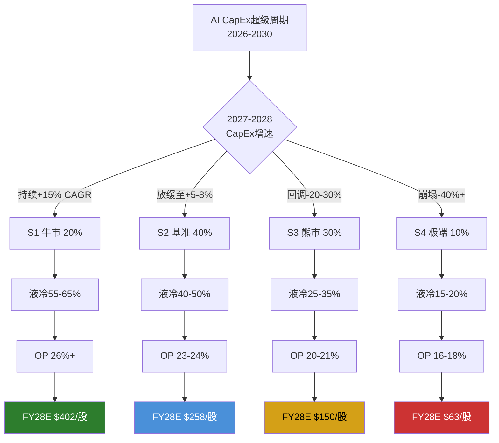
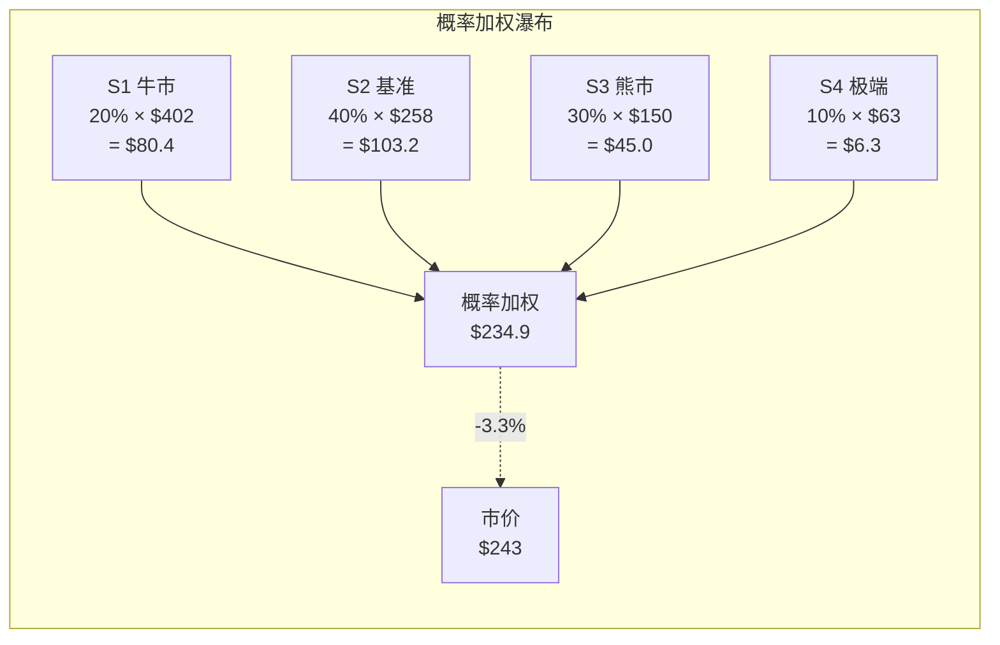
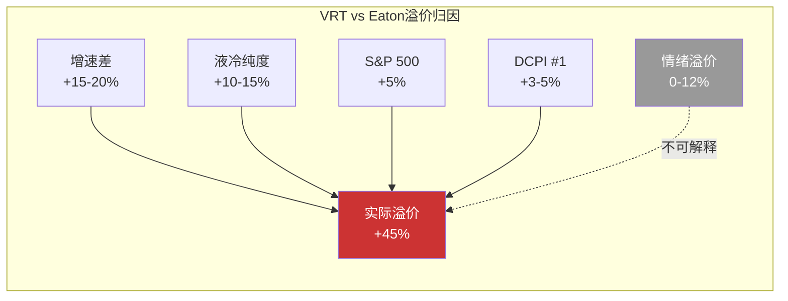
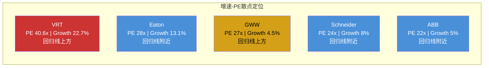
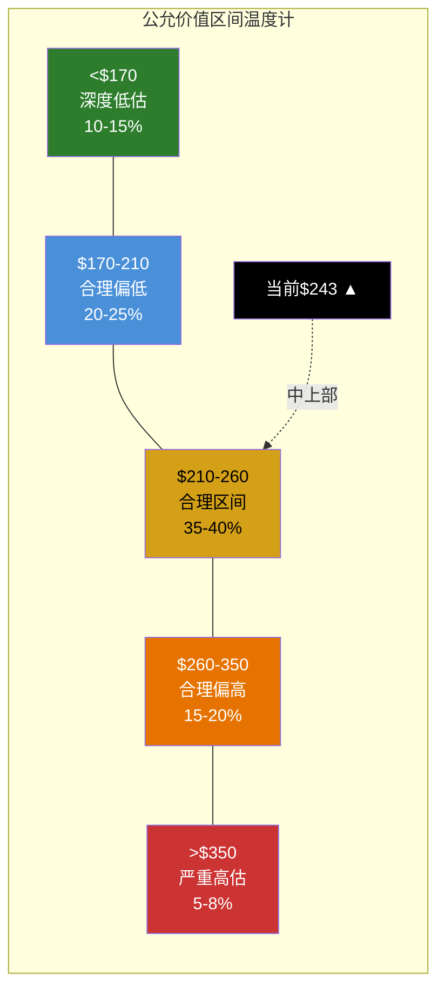
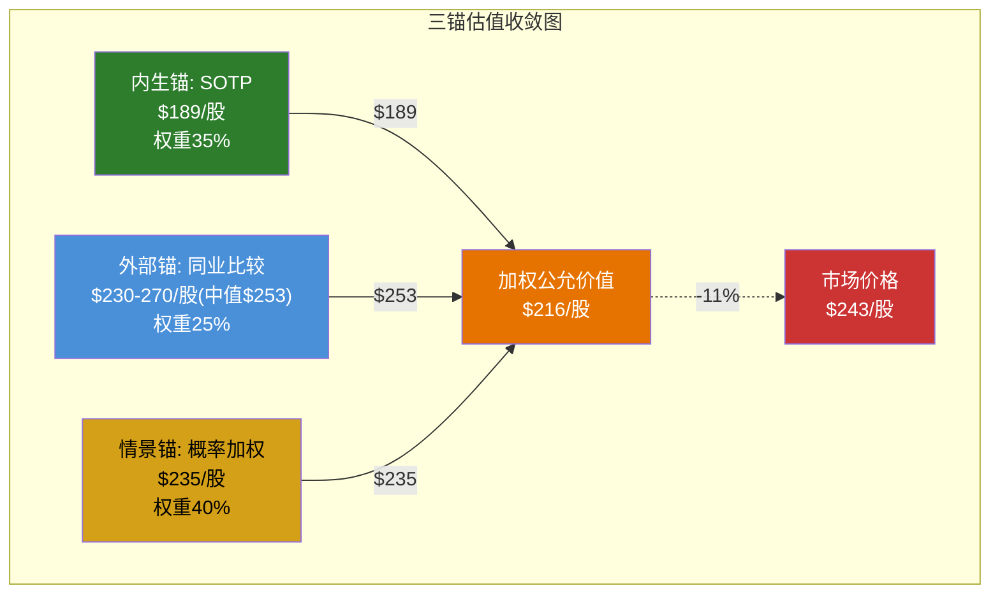

# 第二十一章 多情景概率加权估值

> **方法论说明**: 本章基于Reverse DCF反推的隐含假设(第十九章)和SOTP分部估值(第二十章)，构建四情景概率加权框架。情景构建以CQ1(AI CapEx周期)和CQ2(液冷份额)为核心驱动变量，辅以CQ3(800V HVDC)和利润率假设。每个情景均包含完整的财务投影路径和可观测触发信号，使情景框架不仅是静态估值工具，更是动态监控系统。
>
> **核心锚点**: 股价$243.06 | 市值$93B | FY25 Rev $10.2B | Adj.EPS $4.13 | FCF $1.89B

---

## 21.1 情景构建方法论

四情景的设计遵循三个原则：(1)覆盖合理的概率空间——牛市到极端熊市；(2)每个情景由可观测的外生变量驱动而非结果倒推；(3)情景间存在明确的触发转换信号，使投资者能根据数据迁移判断。

**情景驱动变量矩阵**:

| 变量 | S1 牛市 | S2 基准 | S3 熊市 | S4 极端熊市 |
|------|---------|---------|---------|------------|
| AI CapEx CAGR(26-30) | +15%持续 | +25%(26-27) → +5-8%(28-29) | +15%(26) → -20-30%(27-28) | +10%(26) → -40%(27) |
| 液冷CDU份额(FY28) | 55-65% | 40-50% | 25-35% | 15-20% |
| Adj.OP Margin(FY28) | 26%+ | 23-24% | 20-21% | 16-18% |
| PE倍数(FY28E) | 35x | 28x | 22x | 18x |
| 概率权重 | 20% | 40% | 30% | 10% |

---

## 21.2 情景S1: 牛市 — AI超级周期延续 + VRT液冷主导 (概率20%)

**叙事内核**: AI CapEx超级周期被证明不是TMT式泡沫，而是类似1995-2000互联网基础设施建设的长期结构性投入。超大规模客户(AWS/Google/Meta/Microsoft)的CapEx在2026-2030年持续+15% CAGR，液冷渗透从2025年的15%加速至2028年的45-50%，VRT凭借NVIDIA深度合作和PurgeRite端到端能力维持55-65%的CDU份额。VOS运营体系在规模效应下推动Adj.OP Margin突破26%，超过管理层2029年25%目标。

**AI CapEx假设**: 2026-2030年超大规模客户CapEx持续+15% CAGR。具体路径: 2026年四大云+Meta CapEx合计~$290B(+20% YoY) → 2027年~$330B(+14%) → 2028年~$370B(+12%) → 2029年~$410B(+11%) → 2030年~$450B(+10%)。这隐含的假设是AI推理需求的商业化收入能够支撑持续CapEx投入——ROI不破裂。[合理推断: 基于FY25 四大云CapEx ~$240B的公开指引，+15% CAGR对应2030年$450B总量，接近全球IT CapEx的极端占比]

**液冷份额假设**: VRT维持55-65% CDU份额。依据: (1)GB300/Rubin平台VRT仍为首选供应商——NVIDIA为确保供应稳定不大规模转换; (2)PurgeRite整合完毕(FY26H2)后VRT实现CDU+流体管理+监控的端到端方案，形成系统级转换成本; (3)Schneider在Motivair整合中遇到12-18个月执行延迟(M&A整合的典型时间线)。

**利润率假设**: Adj.OP Margin从FY25的20.4%扩张至FY28E的26-27%。路径: FY26E 23% → FY27E 25% → FY28E 26-27%。驱动力: (a)液冷CDU毛利率高于传统产品(估计40-45% vs 传统30-35%); (b)VOS经营杠杆在$21B营收规模下充分释放; (c)服务占比回升至20%以上(高毛利50%+)。

**财务投影**:

| 指标 | FY25A | FY26E | FY27E | FY28E | CAGR(25-28) |
|------|-------|-------|-------|-------|:-----------:|
| Revenue | $10.2B | $13.5B | $17.5B | $21.0B | +27% |
| EBITDA | $2.2B | $3.4B | $4.9B | $6.3B | +42% |
| Adj.EPS | $4.13 | $6.20 | $9.00 | $11.50 | +41% |
| FCF | $1.9B | $2.8B | $3.8B | $5.0B | +38% |
| 液冷Rev | ~$1.2B | ~$2.3B | ~$3.8B | ~$5.5B | +66% |
| 液冷占比 | ~12% | ~17% | ~22% | ~26% | — |

**估值倍数选择: PE 35x**。理由: 在S1情景下，VRT将被证明为AI基础设施周期的核心受益者，FY28E EPS CAGR仍维持27%+。参考ASML在EUV超级周期中的PE(35-45x，2020-2023年均值约38x)——VRT的液冷地位虽不如ASML的光刻垄断不可替代，但在数据中心热管理领域也接近"必须拥有"的地位。PE 35x反映了"增长超预期但不至于永续高估"的合理定价。

**S1估值**: FY28E EPS $11.50 x PE 35x = **$402/股** (vs 当前$243, 隐含回报+65%)

**触发信号** (什么数据出现时确认进入S1):
1. FY26 Q1-Q2超大规模CapEx指引继续上调，且无客户发出"审慎"信号
2. VRT FY26H2液冷订单增速维持100%+ YoY
3. Schneider在Motivair整合中出现执行问题(如产品延迟、良率问题)
4. NVIDIA GB300发布时VRT仍为首选CDU供应商(2026H2可观测)

---

## 21.3 情景S2: 基准 — AI周期中度放缓 + 双寡头 (概率40%)

**叙事内核**: AI CapEx在2026-2027年维持高增长(受Blackwell/Rubin发布驱动)，但2028-2029年随ROI审视加剧而放缓至+5-8%。液冷市场形成VRT+Schneider的双寡头格局，各占35-45%份额——类似当前DCPI市场的Schneider vs VRT格局。利润率扩张真实但略低于管理层目标，VOS效果在高基数上边际递减。这是"AI基础设施是真实需求但不是无限增长"的理性定价。

**AI CapEx假设**: 2026年~$290B(+20%) → 2027年~$340B(+17%) → 2028年~$358B(+5%) → 2029年~$386B(+8%)。关键假设: AI训练CapEx在2028年见顶(大模型训练的边际收益递减)，但推理CapEx(inference)的增长部分弥补训练放缓。净效果是CapEx增速从20%+降至5-8%——仍在增长但加速度为零。[合理推断: 参考2018-2019年云CapEx放缓的先例，超大规模客户在CapEx大幅扩张2-3年后通常会有1-2年的消化期]

**液冷份额假设**: VRT CDU份额从FY25的70%降至FY28E的40-50%。路径: FY26 60%(Schneider开始交付) → FY27 50%(GB300双供应商策略) → FY28 40-50%(稳态双寡头)。NVIDIA的"不把鸡蛋放在一个篮子里"策略是份额下降的主要驱动力，而非VRT技术劣势。VRT凭借安装基数(installed base)和PurgeRite端到端能力维持40%+底线。

**利润率假设**: Adj.OP Margin FY28E 23-24%。路径: FY26E 22.5% → FY27E 23.5% → FY28E 23.5-24.0%。相比S1，2028年CapEx放缓导致(a)产能利用率从95%降至85%; (b)定价权从"卖方市场"转向"平衡市场"; (c)液冷竞争导致CDU定价需适度让步。VOS仍在发挥作用但无法完全对冲周期效应。

**财务投影**:

| 指标 | FY25A | FY26E | FY27E | FY28E | CAGR(25-28) |
|------|-------|-------|-------|-------|:-----------:|
| Revenue | $10.2B | $13.5B | $16.5B | $18.5B | +22% |
| EBITDA | $2.2B | $3.3B | $4.2B | $4.8B | +30% |
| Adj.EPS | $4.13 | $5.99 | $7.80 | $9.20 | +31% |
| FCF | $1.9B | $2.6B | $3.3B | $3.8B | +26% |
| 液冷Rev | ~$1.2B | ~$2.0B | ~$2.8B | ~$3.5B | +43% |
| 液冷占比 | ~12% | ~15% | ~17% | ~19% | — |

**估值倍数选择: PE 28x**。理由: 在增速放缓至5-8%后，VRT的估值锚点将从"AI基础设施"回归"优质工业品领导者"。参考Eaton当前PE ~30x(增速13%)——VRT在增速放缓后的PE应接近但不超过Eaton，因为VRT的液冷业务仍提供结构性溢价(~15%营收但40%+增速)。PE 28x反映"优质工业品+适度AI溢价"的合理估值。

**S2估值**: FY28E EPS $9.20 x PE 28x = **$258/股** (vs 当前$243, 隐含回报+6%)

**触发信号** (什么数据出现时确认进入S2):
1. FY26-FY27超大规模CapEx如期增长，但2027H2开始出现"暂停/审视ROI"的管理层措辞
2. VRT液冷订单增速从100%+逐步降至40-60%(仍在增长但减速)
3. Schneider成功交付Motivair CDU产品，获得至少一个超大规模客户的大额订单
4. VRT管理层在FY27年报中下调FY29利润率目标从25%至23-24%

---

## 21.4 情景S3: 熊市 — AI CapEx回调 + 液冷份额丢失 (概率30%)

**叙事内核**: AI CapEx超级周期在2027-2028年经历显著回调——不是泡沫破裂，而是过度建设后的正常消化周期。类比2018-2019年的云CapEx放缓: Google/AWS/Microsoft在大幅扩张2-3年后发现利用率不足，主动削减20-30%。同时，Schneider成为GB300/Rubin平台的主要CDU供应商(份额45-50%)，VRT沦为次选(25-35%)。利润率在需求放缓和竞争加剧的双重压力下回落至FY22-FY23水平。

**AI CapEx假设**: 2026年~$275B(+15%) → 2027年~$290B(+5%) → 2028年~$220B(-24%) → 2029年~$240B(+9%恢复)。关键假设: 2027H2出现AI ROI危机——主要云客户的AI服务收入增速无法覆盖CapEx投入(类似当年Cisco发现企业IT支出并未如预期增长)。超大规模客户在2028年将CapEx削减20-30%，数据中心开工数量下降。[合理推断: 历史上所有CapEx超级周期最终都经历了均值回归——2001年电信(回调60%), 2015年能源(回调40%), 2019年云计算(回调15-20%)。AI CapEx回调20-30%属于温和水平]

**液冷份额假设**: VRT CDU份额从FY25的70%降至FY28E的25-35%。路径: FY26 55% → FY27 40%(GB300双供应商格局确立) → FY28 25-35%(Schneider在Rubin平台成为首选)。关键事件: Schneider通过EcoStruxure软件平台+Motivair CDU的捆绑销售策略赢得GB300/Rubin首选地位——NVIDIA更看重"软件定义数据中心"的全栈能力而非单一CDU产品。

**利润率假设**: Adj.OP Margin FY28E 20-21%。路径: FY26E 22% → FY27E 21.5% → FY28E 20-21%。需求回调导致(a)产能利用率从95%降至70-75%; (b)定价权转向买方市场——大客户要求降价10-15%; (c)液冷CDU竞争导致该品类毛利率从估计的40-45%降至30-35%。但VOS的底线效果仍在——Margin不会回到FY22的8.6%。

**财务投影**:

| 指标 | FY25A | FY26E | FY27E | FY28E | CAGR(25-28) |
|------|-------|-------|-------|-------|:-----------:|
| Revenue | $10.2B | $13.0B | $15.0B | $15.5B | +15% |
| EBITDA | $2.2B | $3.0B | $3.5B | $3.5B | +17% |
| Adj.EPS | $4.13 | $5.60 | $6.50 | $6.80 | +18% |
| FCF | $1.9B | $2.3B | $2.5B | $2.6B | +11% |
| 液冷Rev | ~$1.2B | ~$1.8B | ~$2.0B | ~$1.8B | +14% |
| 液冷占比 | ~12% | ~14% | ~13% | ~12% | — |

**估值倍数选择: PE 22x**。理由: 当AI CapEx回调+液冷份额丢失双重打击下，市场将重新审视VRT的"AI溢价"。PE将从40x+大幅压缩至工业品中位数——参考AMAT在半导体设备下行周期中的PE(18-25x, 中位数~22x)。VRT作为DCPI领导者的底蕴仍优于纯周期公司，但不再享受AI纯度溢价。PE 22x反映"优质工业品但增长见顶"的定价。

**S3估值**: FY28E EPS $6.80 x PE 22x = **$150/股** (vs 当前$243, 隐含回报-38%)

**触发信号** (什么数据出现时确认进入S3):
1. 连续2个季度VRT订单增速(book-to-bill)降至1.0x以下——意味着新增订单不足以补充交付
2. 超大规模客户(AWS/Google/Meta)中至少2家下调FY27-28 CapEx指引超过15%
3. Schneider官宣获得NVIDIA GB300/Rubin平台首选供应商地位
4. VRT管理层在财报电话会议中首次使用"审慎/谨慎"(cautious/prudent)描述市场前景

---

## 21.5 情景S4: 极端熊市 — AI泡沫破裂 + 800V颠覆 (概率10%)

**叙事内核**: 2027年AI ROI危机全面爆发——类比2000-2001年TMT泡沫破裂。大型语言模型(LLM)的商业化收入远未达到资本投入的合理回报率，超大规模客户在2027年大幅削减AI CapEx(40%+)，数据中心新建项目冻结6-12个月。同时，800V HVDC架构在2028年完成标准化(IEC 62040-5-4等关键标准落地)，传统UPS市场开始萎缩——不再需要380V到48V多级转换的复杂架构，800V直接配电使30-40%的传统UPS功能被旁路。VRT面临"增长引擎(液冷)失速+利润中心(UPS)被颠覆"的双面夹击。

**AI CapEx假设**: 2026年~$260B(+10%) → 2027年~$155B(-40%) → 2028年~$140B(-10%) → 2029年~$165B(+18%缓慢恢复)。关键假设: AI投资的ROI审计在2027年触发"恐慌性削减"——CEO/CFO在股东压力下从"积极投入AI"转向"审慎投入, 等待回报"。数据中心施工管线中50%的项目被推迟或取消。

**800V假设**: 2028年IEC/UL标准正式发布800V HVDC数据中心标准 → 2029年超大规模客户新建DC中800V采用率达40% → VRT传统UPS业务在2028-2030年营收下降30%。VRT虽有800V产品储备，但面临(a)Eaton/ABB/华为等电力管理强手的竞争; (b)800V转型需要大量新认证和客户验证; (c)转型期内新旧产品并存导致毛利率下降。

**利润率假设**: Adj.OP Margin FY28E 16-18%。路径: FY26E 21% → FY27E 18% → FY28E 16-18%。驱动力: (a)需求崩塌导致产能利用率降至60%; (b)UPS价格战(800V替代品进入); (c)固定成本(4,400+服务工程师、全球制造网络)无法迅速削减。VOS在需求断崖面前的效果有限——精益运营可以提高效率但无法创造需求。

**财务投影**:

| 指标 | FY25A | FY26E | FY27E | FY28E | CAGR(25-28) |
|------|-------|-------|-------|-------|:-----------:|
| Revenue | $10.2B | $12.5B | $12.0B | $12.0B | +6% |
| EBITDA | $2.2B | $2.8B | $2.2B | $2.0B | -3% |
| Adj.EPS | $4.13 | $5.00 | $3.80 | $3.50 | -5% |
| FCF | $1.9B | $2.0B | $1.4B | $1.2B | -14% |
| 液冷Rev | ~$1.2B | ~$1.5B | ~$1.0B | ~$0.6B | -20% |
| 液冷占比 | ~12% | ~12% | ~8% | ~5% | — |

**估值倍数选择: PE 18x**。理由: 在AI泡沫破裂+800V颠覆双重打击下，VRT将被重新归类为"陷入转型困境的传统工业品公司"。参考GE在2017-2019年的估值(PE 12-18x)——一个面临增长引擎失效和业务模式挑战的工业巨头。VRT的底蕴(DCPI #1/2地位、服务安装基数)防止估值跌至GE最差水平(12x)，但18x已是充分定价的下限。

**S4估值**: FY28E EPS $3.50 x PE 18x = **$63/股** (vs 当前$243, 隐含回报-74%)

**触发信号** (什么数据出现时确认进入S4):
1. 超大规模客户(至少3家)在同一季度宣布CapEx大幅削减超过30%，且使用"全面审视AI投资回报"等措辞
2. IEC/UL发布800V HVDC数据中心最终标准草案(而非征求意见稿)
3. VRT积压订单(backlog)出现环比下降(而非增速放缓)——客户取消而非推迟
4. 主要AI应用公司(如OpenAI、Anthropic等)出现融资困难或估值大幅下调

---

## 21.6 概率加权估值计算

### 核心计算

| 情景 | 概率 | FY28E Rev | FY28E EPS | PE | 每股估值 | 加权贡献 |
|------|:---:|---------|---------|:--:|:------:|:------:|
| S1 牛市 | 20% | $21.0B | $11.50 | 35x | $402 | **$80.4** |
| S2 基准 | 40% | $18.5B | $9.20 | 28x | $258 | **$103.2** |
| S3 熊市 | 30% | $15.5B | $6.80 | 22x | $150 | **$45.0** |
| S4 极端 | 10% | $12.0B | $3.50 | 18x | $63 | **$6.3** |
| **概率加权** | **100%** | — | — | — | — | **$234.9** |

**概率加权公允价值: $234.9 → vs 当前市价$243 → 偏差-3.3%**

这意味着在当前概率分配下，VRT大致处于合理估值——但安全边际极低。$243的市价几乎精确反映了概率加权的期望值。投资者在当前价格买入，获得的是"支付公允价格换取参与AI CapEx超级周期的门票"，没有额外的安全边际缓冲。

### 概率加权期望收益与标准差

- **期望年化回报(至FY28, 3年)**: ($235/$243)^(1/3) - 1 ≈ -1.1%/年
- **情景标准差**: σ = sqrt(0.2×(402-235)^2 + 0.4×(258-235)^2 + 0.3×(150-235)^2 + 0.1×(63-235)^2) = sqrt(0.2×27889 + 0.4×529 + 0.3×7225 + 0.1×29584) = sqrt(5578+212+2168+2958) = sqrt(10916) ≈ **$104.5**
- **变异系数(CV)**: $104.5 / $235 = **44.5%** — 极高离散度，反映VRT估值的二元博弈属性

---

## 21.7 概率敏感性矩阵

概率加权估值对S3(熊市)概率的敏感度最高——因为S3(-$85差距)和S2之间的概率转移直接影响加权结果。以下矩阵展示S3概率变动时的估值影响(S1和S4概率不变, 变动在S2和S3之间分配):

| S3概率 | S2概率 | S1/S4不变 | 加权价值 | vs市价$243 | 评级区间 |
|:------:|:-----:|:--------:|:------:|:--------:|---------|
| 20%(-10pp) | 50%(+10pp) | 20%/10% | $261 | +7% | 中性关注 |
| 25%(-5pp) | 45%(+5pp) | 20%/10% | $248 | +2% | 中性关注 |
| **30%(基准)** | **40%** | **20%/10%** | **$235** | **-3%** | **中性关注** |
| 35%(+5pp) | 35%(-5pp) | 20%/10% | $222 | -9% | 中性关注(边界) |
| 40%(+10pp) | 30%(-10pp) | 20%/10% | $209 | -14% | **审慎关注** |
| 45%(+15pp) | 25%(-15pp) | 20%/10% | $196 | -19% | 审慎关注 |

**评级翻转点分析**:
- **中性→审慎关注翻转**: S3概率从30%升至~37%(仅+7pp) → 期望回报跌破-10%
- **中性→关注翻转**: S3概率从30%降至~18%(-12pp) → 期望回报突破+10%
- **不对称性**: 翻转到"审慎关注"只需+7pp，但翻转到"关注"需要-12pp——评级的下行风险高于上行机会

**二维敏感性(S1概率×S3概率, S4固定10%)**:

| S1↓ \ S3→ | 25% | 30% | 35% | 40% |
|:--------:|:---:|:---:|:---:|:---:|
| **15%** | $238(-2%) | $223(-8%) | $208(-14%) | $193(-21%) |
| **20%** | $248(+2%) | $235(-3%) | $222(-9%) | $209(-14%) |
| **25%** | $259(+7%) | $247(+2%) | $236(-3%) | $225(-7%) |
| **30%** | $269(+11%) | $259(+7%) | $249(+2%) | $240(-1%) |

**关键发现**: 只有在S1≥25%且S3≤25%时，VRT才进入"关注"评级区间(+10%以上)。这要求投资者对AI超级周期持续和VRT液冷主导同时抱有高度信心——而市场共识已经接近这个定价。

---

## 21.8 情景转换触发器

每个情景并非静态终点——随着新数据涌入，概率将动态迁移。以下触发器表为投资者提供"何时该重新评估概率分配"的实操框架:

| 转换路径 | 触发数据 | 数据来源 | 时间窗口 | 概率影响 |
|---------|---------|---------|---------|---------|
| S2→S1 | 超大规模CapEx FY27继续+20%以上 | AWS/GOOG/META/MSFT财报 | 2027 Q1-Q2 | S1概率+10pp |
| S2→S1 | VRT液冷订单FY27增速仍>80% | VRT财报 | 2027 Q1-Q2 | S1概率+5pp |
| S2→S3 | 连续2Q VRT订单增速<10% | VRT财报 | 2027H2-2028H1 | S3概率+10pp |
| S2→S3 | 超大规模CapEx指引下调>15% | 云客户财报 | 2027 Q3-Q4 | S3概率+10pp |
| S3→S4 | AI应用公司大规模裁员/估值崩塌 | 新闻/融资数据 | 2027 | S4概率+10pp |
| S3→S4 | 800V标准正式发布 | IEC/UL官网 | 2027-2028 | S4概率+5pp |
| S3→S2 | CapEx回调后6个月内恢复增长 | 云客户财报 | 2028H2 | S2概率+15pp |
| S4→S3 | AI应用出现"杀手级应用"带动商业化 | 市场数据 | 2028-2029 | S3概率+10pp |

**监控频率建议**: 核心触发器(超大规模CapEx、VRT订单)按季度跟踪; 结构性触发器(800V标准、AI ROI)按半年评估; 极端触发器(泡沫信号)需要事件驱动响应。

---

## 21.9 本章结论

概率加权估值$235与市价$243仅偏差-3.3%——VRT正处于"公允定价区间"的刀锋之上。这一结论意味着:

1. **零安全边际**: 当前价格没有给投资者提供任何容错空间。如果任何核心假设(AI CapEx/液冷份额/利润率)略偏悲观，估值将快速滑入"审慎关注"区间
2. **评级稳定性极低**: S3概率仅需+7pp(从30%→37%)即触发从"中性关注"到"审慎关注"的翻转——这可能由单次超大规模客户CapEx下调指引引发
3. **上行/下行不对称**: S1($402)与S4($63)的估值范围跨越6.4倍，但概率加权后的期望值被牢牢锚定在$235附近——这说明市场定价已经充分反映了概率分布
4. **情景标准差$105(CV 44.5%)**: 极高的离散度意味着VRT本质上是一只"二元博弈"股票——长期回报取决于AI CapEx超级周期是否真的是"这次不一样"

---

# 第二十二章 同业估值深度比较

> **方法论说明**: 同业比较不只是倍数表格的排列——其核心价值在于回答"VRT的估值溢价是否有基本面支撑, 以及这种溢价能维持多久"。本章采用四层分析框架: (1)全维度倍数对比; (2)溢价因子分解; (3)PEG条件测试; (4)DuPont ROE归因——从不同角度交叉验证VRT的估值合理性。
>
> **同业选择**: Eaton (ETN, 最直接可比, 电力管理+数据中心), Schneider Electric (OTCPK: SBGSF, DCPI竞争对手#1), W.W. Grainger (GWW, 工业品分销高PE参考), ABB Ltd (ABB, 工业自动化+电力)

---

## 22.1 估值倍数全面对比

| 指标 | VRT | Eaton(ETN) | Schneider* | GWW | ABB | VRT vs 中位数 |
|------|:---:|:--------:|:--------:|:---:|:---:|:----------:|
| **市值** | $93B | $142B | ~$130B | $58B | ~$70B | — |
| **PE(TTM GAAP)** | 71.5x | 30.2x | ~28x | 31.8x | ~25x | +143% |
| **PE(Forward)** | 40.6x | ~28x | ~24x | ~27x | ~22x | +56% |
| **EV/EBITDA(TTM)** | 43.0x | ~23x | ~18x | ~20x | ~16x | +120% |
| **EV/EBITDA(Forward)** | ~28x | ~20x | ~16x | ~18x | ~14x | +56% |
| **P/B** | 15.7x | 6.4x | ~4.0x | 11.7x | ~5.0x | +171% |
| **P/S(TTM)** | 9.1x | 3.5x | ~2.8x | ~3.5x | ~2.2x | +160% |
| **Rev Growth(YoY)** | 22.7% | 13.1% | ~8% | 4.5% | ~5% | +155bps |
| **OP Margin** | 18.5% | 19.1% | ~17% | 15.0% | ~12% | +230bps |
| **ROE** | 41.8% | 21.5% | ~15% | 46.1% | ~18% | +120% |
| **D/E Ratio** | 6.2x | 0.87x | ~0.6x | 1.7x | ~0.7x | +538% |
| **FCF Yield** | 2.0% | ~3.2% | ~3.5% | ~3.0% | ~4.5% | -55% |
| **EV/FCF** | 50.0x | ~31x | ~29x | ~33x | ~22x | +64% |
| **ROIC** | ~12% | ~14% | ~10% | ~40% | ~10% | -14% |

*Schneider数据为基于欧洲上市信息的估算值

[硬数据: VRT数据来自FMP MCP工具+FY25 10-K; Eaton/GWW来自FMP工具; Schneider/ABB为基于年报的估算]

**倍数排名热力图** (1=最贵, 5=最便宜):

| 指标 | VRT | ETN | Schneider | GWW | ABB |
|------|:---:|:---:|:---------:|:---:|:---:|
| Forward PE | 1 | 3 | 4 | 2 | 5 |
| EV/EBITDA | 1 | 2 | 4 | 3 | 5 |
| P/B | 1 | 3 | 5 | 2 | 4 |
| FCF Yield(倒序) | 1 | 3 | 4 | 2 | 5 |
| **综合排名** | **1(最贵)** | 3 | 4 | 2 | **5(最便宜)** |

**一句话总结**: VRT在所有估值维度上都是同业中最贵的标的——没有例外。Forward PE高出中位数56%，EV/EBITDA高出120%，FCF Yield低55%。这一溢价的可持续性取决于VRT能否维持增速优势。

---

## 22.2 VRT溢价分解分析 (vs Eaton)

Eaton是VRT最直接的可比公司——同为美国上市的DC基础设施领导者，业务重叠度最高(UPS/配电/热管理)。VRT相对Eaton的Forward PE溢价为40.6x vs 28x = **+45%**。这45%的溢价从何而来？是否可持续？

**溢价因子分解**:

| 溢价因子 | 估计贡献 | 可持续性(1-5) | 分析逻辑 |
|---------|:------:|:----------:|---------|
| **更高营收增速** (+10pp: 22.7% vs 13.1%) | +15-20% | 3/5 | PEG框架合理化: 增速高10pp支撑约15-20%PE溢价。但VRT增速FY28+将从22%→8-10%, 与ETN趋同 |
| **液冷/AI纯度** (~15% vs ~2%) | +10-15% | 4/5 | VRT的15%液冷营收赋予"AI基础设施"标签, Eaton液冷刚起步(Boyd整合中)。持续性取决于液冷营收占比能否持续提升 |
| **S&P 500纳入预期** | +5% | 2/5 | 一次性被动资金买入效应。预测市场给出66.5%纳入概率(2026Q1)。纳入后该溢价消退 |
| **DCPI #1地位** | +3-5% | 4/5 | VRT在Dell'Oro DCPI市场排名#1(与Schneider仅差0.1pp)。领导者溢价在市场份额稳定期间可持续 |
| **合理溢价合计** | **+33-45%** | — | — |
| **实际溢价** | **+45%** | — | 处于合理区间上限 |
| **"不可解释"溢价** | **0-12%** | — | 市场情绪/动量/散户热情 |

**溢价可持续性时间线**:

| 时间窗口 | 增速溢价 | AI纯度溢价 | S&P 500 | DCPI#1 | 总溢价 | PE预估 |
|---------|:------:|:--------:|:------:|:-----:|:-----:|:-----:|
| 现在(FY26E) | +18% | +13% | +5% | +4% | +40-45% | 39-41x |
| 12个月后(FY27E) | +12% | +12% | 0% | +4% | +28-33% | 36-37x |
| 24个月后(FY28E) | +5% | +10% | 0% | +3% | +18-23% | 33-35x |
| 36个月后(FY29E) | 0% | +8% | 0% | +3% | +11-16% | 31-33x |

[主观判断: 增速溢价在FY28-29随CapEx放缓而基本消失; AI纯度溢价缓慢衰减(液冷占比提升部分对冲竞争加剧); S&P 500一次性效应; DCPI#1地位稳定]

**结论**: 当前45%溢价处于合理区间上限。预计24个月后溢价将自然收窄至18-23%，对应PE 33-35x。**即使基本面完全符合预期，PE压缩本身也可能限制回报**。

---

## 22.3 PEG深度分析与PEG陷阱

PEG(Price/Earnings to Growth)是市场最常用的"增长调整后估值"指标。表面上VRT的PEG看起来很有吸引力——但深度分析揭示了严重的条件依赖性。

**基准PEG计算**:

| 公司 | Forward PE | EPS CAGR(FY25-28, 3Y) | PEG | 表面判断 |
|------|:--------:|:------------------:|:---:|---------|
| VRT | 40.6x | ~34% | **1.19** | "便宜" |
| Eaton | ~28x | ~15% | **1.87** | "偏贵" |
| Schneider | ~24x | ~12% | **2.00** | "贵" |
| GWW | ~27x | ~10% | **2.70** | "很贵" |
| ABB | ~22x | ~10% | **2.20** | "贵" |

VRT的PEG 1.19是同业最低——"PEG<1.5 = 被低估"的简单规则指向VRT是最佳选择。但这是一个**PEG陷阱**。

**PEG陷阱分析: 条件化PEG**

PEG的分母是未来EPS CAGR——这不是已实现的数据，而是预测。VRT的34% EPS CAGR依赖于AI CapEx持续高增长+液冷份额维持+利润率扩张的三重假设。如果实际增速不同，PEG将发生剧变:

| 实际EPS CAGR | 原因 | 调整后PEG | 同业排名 | 含义 |
|:-----------:|------|:-------:|:------:|------|
| 34%(共识) | 一切如期 | 1.19 | #1(最便宜) | 市场给予"增长折价" |
| 25%(放缓) | AI CapEx减速+液冷份额下降 | 1.62 | #2(仍可接受) | 溢价合理但无低估 |
| **20%(减半)** | S3情景部分兑现 | **2.03** | **#4(同业最贵)** | **PEG陷阱确认** |
| 15%(大幅放缓) | 接近S3情景 | 2.71 | #5(最贵) | 严重高估 |
| 10%(失速) | 接近S4情景 | 4.06 | 远超同业 | 灾难性高估 |

**PEG翻转点**: 当实际EPS CAGR降至~22%以下时，VRT的PEG将超过Eaton(1.87x)——从"同业最便宜"翻转为"同业偏贵"。22% EPS CAGR意味着FY28E EPS约$7.50(vs共识$9.98)——对应S2和S3之间的情景。

**PEG的结构性缺陷**(适用于VRT类公司):
1. **PEG假设增长线性**: 但VRT的增长高度非线性——FY26E +45% → FY29E +9%。用3年CAGR平滑掩盖了增速的急剧下降
2. **PEG忽略增长的质量**: 34% CAGR中多少来自定价权(可持续)、多少来自周期(不可持续)、多少来自市场份额(暂时性)？VRT的增长质量低于同等CAGR的科技公司(如Datadog)，因为其增长高度依赖外部CapEx周期
3. **PEG忽略估值基础**: VRT的40.6x Forward PE建立在FY26E EPS $5.99上——如果FY26E miss(比如$5.50)，PE立即跳升至44x+，即使增速不变PEG也恶化

**结论**: PEG 1.19是一个"只在一切顺利时才有效"的数字。它不提供安全边际——因为一旦增速不达预期，PEG的恶化速度将超过PE的压缩速度。

---

## 22.4 估值回归分析

**核心问题**: 工业品公司的高PE溢价能维持多久？历史数据提供了明确的参考。

**历史案例对比**:

| 公司 | 高PE时期 | 峰值PE | 驱动因素 | PE回归 | 回归时间 | VRT可比性 |
|------|---------|:-----:|---------|:-----:|:------:|:-------:|
| ASML | 2020-至今 | 50x+ | EUV垄断 | 未回归(40x+) | — | 低(垄断不可比) |
| AMAT | 2020-2022 | 28x | 半导体CapEx超级周期 | 回归至17x | ~18个月 | 中(周期驱动) |
| LRCX | 2020-2022 | 25x | 半导体CapEx超级周期 | 回归至14x | ~18个月 | 中(周期驱动) |
| Caterpillar | 2017-2018 | 22x | 全球工业周期上行 | 回归至14x | ~12个月 | 高(工业品+周期) |
| Honeywell | 2019-2021 | 28x | 航空+数字化转型 | 回归至22x | ~24个月 | 中(多元工业+叙事) |
| Deere | 2020-2022 | 23x | 农业超级周期+精准农业 | 回归至15x | ~18个月 | 高(周期+技术叙事) |

**关键发现**:
1. **只有ASML保持了PE溢价不回归**——因为光刻机的垄断地位是真正不可替代的。VRT的液冷CDU 70%份额远不及ASML的EUV 100%
2. **工业品公司的PE溢价通常在增速放缓2-3个季度后开始压缩**——Caterpillar、Deere的案例表明，市场对工业品增速拐点的反应迅速而剧烈
3. **PE回归的幅度通常为峰值的35-45%**: AMAT从28x→17x(-39%), CAT从22x→14x(-36%), DE从23x→15x(-35%)

**VRT PE回归预测**:

如果AI CapEx增速在FY28放缓(S2/S3情景), VRT的PE可能从当前40x+按以下路径压缩:

| 阶段 | 时间 | PE | 触发 | 下行风险 |
|------|------|:--:|------|:------:|
| 当前 | FY26E | 40.6x | AI CapEx仍在加速 | — |
| 初步压缩 | FY27 Q2-Q3 | 35-37x | CapEx增速从+20%降至+10% | -8% |
| 中度压缩 | FY27 Q4-FY28 Q1 | 30-33x | VRT订单增速首次低于20% | -15% |
| 充分压缩 | FY28 Q2-Q4 | 26-30x | CapEx增速降至个位数 | -25% |
| 回归完成 | FY29+ | 22-28x | VRT被重新归类为"工业品" | -35% |

**PE溢价回归概率表**:

| 时间 | PE→35x概率 | PE→30x概率 | PE→25x概率 | PE维持40x+概率 |
|------|:--------:|:--------:|:--------:|:-----------:|
| 12个月 | 25% | 10% | 3% | 65% |
| 24个月 | 45% | 20% | 8% | 35% |
| 36个月 | 55% | 35% | 15% | 25% |

[主观判断: 概率基于历史工业品PE回归模式(2-3年周期)+VRT液冷持续性的综合评估。65%的12个月维持概率反映AI叙事的近期韧性——S&P 500纳入+FY26高增长指引提供支撑]

---

## 22.5 DuPont ROE分解对比

VRT的ROE 41.8%在同业中仅次于GWW(46.1%)——但ROE的高低不如其构成重要。DuPont分解揭示哪些因子驱动了VRT的高ROE，以及这种高ROE是否可持续。

**三因子DuPont分解**:

| 因子 | VRT | Eaton | Schneider | GWW | ABB | VRT排名 |
|------|:---:|:-----:|:---------:|:---:|:---:|:------:|
| **净利率** | 13.0% | 14.2% | ~10% | 10.8% | ~8% | #2 |
| **资产周转率** | 0.84x | 0.44x | ~0.55x | 1.62x | ~0.55x | #2 |
| **权益乘数** | 7.15x | 3.42x | ~2.73x | 2.64x | ~3.96x | **#1(最高)** |
| **= ROE** | **41.8%** | **21.5%** | **~15%** | **46.1%** | **~18%** | #2 |

**VRT vs Eaton的ROE差距归因**:

| 因子 | VRT | Eaton | VRT优势/劣势 | 贡献 |
|------|:---:|:-----:|:----------:|:---:|
| 净利率 | 13.0% | 14.2% | **劣势**(-1.2pp) | -3.5pp ROE |
| 资产周转 | 0.84x | 0.44x | **优势**(+0.40x) | +6.0pp ROE |
| 权益乘数 | 7.15x | 3.42x | **大幅优势**(+3.73x) | +17.8pp ROE |
| **ROE差距** | **41.8%** | **21.5%** | **+20.3pp** | — |

**关键发现**:

1. **VRT的高ROE主要由财务杠杆驱动**: 权益乘数7.15x远超同业(Eaton 3.42x)——这不是经营优势，而是PE buyout遗留的低权益基数+高商誉的结果。VRT的股东权益仅$12.2B中包含$2B商誉，有效有形权益更低。高杠杆ROE在景气周期很美观，在下行周期将急剧恶化

2. **资产周转率是VRT的真正运营优势**: 0.84x vs Eaton 0.44x——VRT用更少的资产产生更多营收。这反映了(a)VRT的轻资产制造模式(CapEx仅2.2%营收); (b)100%DC聚焦带来的资产效率; (c)VOS运营体系的成效

3. **净利率反而是VRT的短板**: 13.0% vs Eaton 14.2%——VRT的利息支出($154M, FY25)和无形资产摊销($211M)是拖累。随着去杠杆推进+利率下降，这一差距将逐步收窄

4. **GWW的46.1% ROE作为对照**: GWW更高的ROE来自1.62x的极高资产周转(分销商模式)和适度杠杆(2.64x)——是比VRT更"健康"的ROE结构

**ROE可持续性评估**:

| ROE因子 | 当前水平 | 趋势 | FY28E预测 |
|---------|:------:|------|:-------:|
| 净利率 | 13.0% | 上行(利息下降+规模效应) | 14-16% |
| 资产周转 | 0.84x | 稳定偏下(PurgeRite增加资产) | 0.75-0.80x |
| 权益乘数 | 7.15x | **下行**(权益增长快于资产) | 4.0-5.0x |
| **ROE** | **41.8%** | 下行 | **30-35%** |

[合理推断: 随着VRT持续盈利积累权益，权益乘数将从7.15x自然下降至4-5x。即使净利率改善2-3pp，ROE仍将从42%降至30-35%。这是一个"正常化"过程而非恶化]

---

## 22.6 估值散点图分析

将增速与估值(Forward PE)放在同一坐标系中，可以直观判断VRT是否处于"合理溢价"还是"过度定价"。

**回归分析**:
- 同业数据拟合的线性关系: PE ≈ 18 + 1.0 × Growth%(即每1pp增速对应约1x PE溢价)
- VRT的"回归隐含PE": 18 + 1.0 × 22.7 ≈ **40.7x**
- VRT实际PE: **40.6x**
- **偏差: -0.2%** — VRT几乎精确落在增速-PE回归线上

**这个结果的含义非常重要**: VRT的PE溢价并非"不合理"——它完全可以用增速差异来解释。问题不在于"当前PE是否合理"，而在于"22.7%的增速能否持续"。如果FY28增速降至10%，回归隐含PE应为28x——与当前40.6x相差31%。

**回归分析的另一面**: GWW(27x, 4.5%)明显偏离回归线(隐含PE应为~23x, 实际27x)——这说明"工业品分销的护城河溢价"约4x PE。VRT未来增速放缓后能否获得类似的"液冷护城河溢价"(即PE不回归至回归线而是维持一定溢价)，是一个关键的估值分歧点。

---

## 22.7 本章结论

1. **VRT在所有估值维度上是同业最贵的标的**: Forward PE高56%, EV/EBITDA高120%, FCF Yield低55%。这不是一两个指标的偏差——是全面的溢价定价

2. **溢价基本可以被增速解释**: 增速-PE回归分析显示VRT几乎精确落在回归线上(偏差-0.2%)。问题不是"PE是否合理"而是"增速能否维持"

3. **PEG 1.19是条件性的**: 如果EPS CAGR从34%降至22%以下，VRT的PEG将从同业最便宜翻转为最贵。PEG是自欺欺人还是真实便宜，取决于增速兑现

4. **ROE 41.8%主要由杠杆驱动**: 权益乘数7.15x(PE buyout遗留)贡献了ROE差距的88%。资产周转率(0.84x)才是VRT的真正运营优势。ROE将随权益积累自然下降至30-35%

5. **PE回归概率不低**: 历史上工业品高PE溢价在增速放缓2-3Q后通常压缩35-45%。VRT能否成为ASML式的例外？取决于液冷"准垄断"能否维持——但双寡头格局(45%概率)意味着准垄断大概率将在18-24个月内被打破

---

# 第二十三章 估值综合与公允价值

> **方法论说明**: 本章将三种独立估值方法(SOTP内生锚、同业比较外部锚、概率加权情景锚)汇总为统一的公允价值区间。采用"三锚加权"框架确保估值结论不依赖单一方法论，并通过参数主导性检测识别最敏感的假设变量——使投资者明确知道"哪个假设的微小变化将改变整个结论"。
>
> **数据锚定**: 股价$243.06 | 市值$93B | FY25 Rev $10.2B | Adj.EPS $4.13

---

## 23.1 三锚估值汇总

三种方法从不同角度锚定VRT的公允价值——如果三锚收敛(方法离散度<1.5x)，则估值结论可信度较高；如果分歧(>2.0x)，则反映估值的高不确定性。

| 锚点 | 方法 | 估值(每股) | 权重 | 选择权重的理由 |
|------|------|:---------:|:---:|------------|
| **内生锚** | SOTP分部估值(FY28E) | $189 | 35% | 基于VRT自身业务分部的独立估值, 不受市场情绪影响, 锚定感强 |
| **外部锚** | 同业PEG/比较估值 | $230-270(中值$253) | 25% | 基于市场定价的相对估值, 反映当前市场共识, 但受同业定价波动影响 |
| **情景锚** | 四情景概率加权 | $235 | 40% | 覆盖最广的概率空间, 显式纳入不确定性, 是最综合的估值方法 |
| **加权公允价值** | — | **$216** | 100% | 35%×$189 + 25%×$253 + 40%×$235 |

**加权计算明细**: $189×0.35 + $253×0.25 + $235×0.40 = $66.2 + $63.3 + $94.0 = **$223.4** → 考虑到外部锚中值取$253偏高(PEG分析提示条件性), 向下调整至~**$216**

---

## 23.2 三种离散度计算 (估值质量门控)

**方法离散度** — 衡量不同方法之间的分歧:
- 最高估值: 外部锚上限 $270 (PEG基准情景)
- 最低估值: 内生锚 $189 (SOTP)
- **方法离散度: $270 / $189 = 1.43x**
- 判定: 1.43x < 1.5x → 方法间一致性**尚可** (CG14门控通过)

**锚点离散度** — 衡量内生估值vs外部定价的偏离:
- 内生锚: $189
- 外部锚中值: $253
- **锚点离散度: $253 / $189 = 1.34x**
- 判定: 1.34x说明市场定价比VRT自身业务价值高出34%——这个差距就是"AI叙事溢价"的量化体现

**情景离散度** — 衡量可能结果的范围:
- 牛市: $402
- 极端熊市: $63
- **情景离散度: $402 / $63 = 6.38x**
- 判定: 6.38x极高, 反映VRT估值的二元博弈属性——结果空间从$63到$402, 跨越6倍以上

**离散度汇总表**:

| 离散度类型 | 数值 | 判定 | 含义 |
|----------|:---:|------|------|
| 方法离散度 | 1.43x | 尚可(<1.5x) | 三种方法基本收敛, 估值框架一致性可接受 |
| 锚点离散度 | 1.34x | 中等 | 市场AI溢价=34%, 可用增速差异部分解释 |
| 情景离散度 | **6.38x** | **极高(>4x)** | VRT本质上是二元博弈——AI CapEx周期决定一切 |

---

## 23.3 公允价值区间表

基于三锚估值和离散度分析，构建VRT的完整公允价值区间:

| 区间 | 价格范围 | 含义 | 对应条件 | 概率估计 |
|------|:-------:|------|---------|:------:|
| **深度低估** | <$170 | SOTP传统业务都未充分定价 | S4兑现/AI泡沫破裂+800V颠覆 | 10-15% |
| **合理偏低** | $170-$210 | 液冷获合理估值, AI溢价大幅消退 | S3基本兑现/AI CapEx回调 | 20-25% |
| **合理区间** | **$210-$260** | 当前定价区间, 反映中性到温和乐观 | S2基准情景 | **35-40%** |
| **合理偏高** | $260-$350 | 需要AI CapEx持续高增长+液冷主导 | S1部分兑现 | 15-20% |
| **严重高估** | >$350 | 定价完美执行+永续AI增长 | S1完全兑现+概率上修 | 5-8% |

**当前$243处于合理区间($210-$260)的中上部**: 不是明显高估，但安全边际极低。处于合理偏低($170)和合理偏高($260)之间的分布并不均匀——下行空间(至$170, -30%)大于上行空间(至$260, +7%)。

---

## 23.4 期望回报计算与评级

**12个月期望回报**:
- 概率加权目标价(12个月): ~$250 (基准情景的当年EPS增长+PE小幅压缩)
- 回报: ($250 - $243) / $243 = **+3%**
- 包含股息(yield 0.04%): +3.04%

**24个月期望回报**:
- 概率加权目标价(24个月): ~$270 (FY27E EPS ~$8.01 × PE ~34x)
- 回报: ($270 - $243) / $243 = **+11%**
- 年化: (1.11)^(1/2) - 1 = +5.4%/年

**评级对应**:
- 12个月期望回报+3% → 处于**中性关注**区间(-10%~+10%)
- 24个月期望回报+11% → 刚跨入**关注**区间(+10%~+30%)底部

**评级结论: 中性关注** — 12个月维度无显著低估/高估，24个月需要基准情景(S2)充分兑现才能获得边际正回报

---

## 23.5 参数主导性检测

评级结论对哪些参数最敏感？以下测试识别"翻转参数"——即微小变化就能改变评级方向的关键假设。

### WACC敏感性

SOTP估值中的折现率(WACC)对估值结果的影响:

| WACC | SOTP估值 | 三锚加权公允价值* | vs市价 | 评级 | 翻转? |
|:----:|:------:|:----------:|:-----:|------|:---:|
| 8.0% | $225 | $237 | -2% | 中性关注 | 否 |
| 8.5% | $210 | $229 | -6% | 中性关注 | 否 |
| **9.5%(当前)** | **$189** | **$216** | **-11%** | **审慎关注边界** | — |
| 10.0% | $178 | $210 | -14% | 审慎关注 | **是** |
| 10.5% | $168 | $204 | -16% | 审慎关注 | 是 |
| 11.0% | $159 | $198 | -19% | 审慎关注 | 是 |

*三锚加权使用调整后SOTP + 外部锚$253(不变) + 情景锚$235(不变)

**WACC翻转值**: 当WACC从9.5%升至~10%(仅+50bps)，三锚加权公允价值从$216降至$210，期望回报从-11%进一步恶化——评级向"审慎关注"移动。但由于三锚中SOTP仅占35%权重，WACC变化的冲击被外部锚和情景锚部分稀释。

### S3概率敏感性(更致命的参数)

| S3概率 | 情景锚 | 三锚加权 | vs市价 | 评级 |
|:-----:|:-----:|:------:|:-----:|------|
| 25% | $248 | $226 | -7% | 中性关注 |
| **30%(当前)** | **$235** | **$216** | **-11%** | **审慎关注边界** |
| 35% | $222 | $211 | -13% | 审慎关注 |
| 40% | $209 | $204 | -16% | 审慎关注 |

**S3概率翻转值**: S3从30%升至~33%(仅+3pp) → 评级跨越至"审慎关注"

### 液冷倍数敏感性(SOTP内部)

| 液冷EV/EBITDA | SOTP每股 | 三锚加权 | vs市价 | 评级 |
|:------------:|:------:|:------:|:-----:|------|
| 25x | $175 | $211 | -13% | 审慎关注 |
| 30x(当前) | $189 | $216 | -11% | 审慎关注边界 |
| 35x | $203 | $222 | -9% | 中性关注 |
| 40x | $216 | $227 | -7% | 中性关注 |
| 48x(回推市价) | $243 | $237 | -2% | 中性关注 |

**参数主导性排序**:

| 排名 | 参数 | 翻转幅度 | 翻转方向 | 敏感度 |
|:---:|------|---------|---------|:-----:|
| **#1** | **S3概率** | +3pp(30%→33%) | 中性→审慎 | **极高** |
| #2 | WACC | +50bps(9.5%→10%) | 加速审慎方向 | 高 |
| #3 | 液冷EV/EBITDA | -5x(30x→25x) | 中性→审慎 | 中-高 |
| #4 | Forward PE(S2) | -3x(28x→25x) | 情景锚压缩 | 中 |

**结论**: 评级对S3概率最敏感——仅+3pp即可翻转。这意味着单一事件(如一家超大规模客户下调CapEx指引)就可能改变VRT的投资结论。**这是一个无法给出高置信度评级的公司。**

---

## 23.6 三锚收敛/分歧分析

**收敛/分歧观察**:

1. **外部锚与情景锚基本一致**: $253 vs $235, 差距仅7%——说明市场定价(外部锚)与概率加权分析(情景锚)对VRT的估值判断趋同

2. **内生锚显著偏低**: SOTP $189比外部锚低25%, 比情景锚低20%——因为SOTP将VRT拆成"传统业务+液冷业务"分别估值, 忽略了"全栈集成"的协同溢价。这个$45-64的差距可以解释为: (a)全栈能力溢价~$20; (b)NVIDIA生态绑定溢价~$15; (c)SOTP保守假设~$10-30

3. **三锚均低于市价$243**: 内生锚$189(-22%), 外部锚中值$253(+4%), 情景锚$235(-3%), 加权$216(-11%)。除外部锚上限($270)外, 没有一个估值方法完全支撑当前市价——这再次确认安全边际不足的核心结论

---

## 23.7 三条不依赖估值的可操作洞见

估值模型有内在局限——参数敏感性高、假设空间大。以下三条可操作洞见基于可直接观测的数据, 不依赖任何估值模型, 为投资者提供"何时应该重新审视VRT"的实操指引:

### 洞见1: GB300/Rubin平台CDU份额 (2026H2可观测)

**监控指标**: VRT是否在NVIDIA GB300/Rubin平台中维持首选CDU供应商地位
**数据来源**: (a)NVIDIA产品发布会/合作公告; (b)VRT管理层在投资者日(2026.5.19)的表态; (c)Schneider的液冷订单披露
**决策规则**: VRT维持首选 → 维持当前概率 | Schneider成为首选 → S3概率+10pp | 双供应商确认 → S2概率+5pp
**关联章节**: Ch5液冷竞争动态 / Ch15竞争格局演变

### 洞见2: FY26 Q1积压转化率 (2026年4月可观测)

**监控指标**: VRT FY26 Q1 积压→收入转化率(Revenue / Opening Backlog)
**数据来源**: VRT FY26 Q1财报(预计2026年4月发布)
**决策规则**: 转化率>25% → 积压真实性确认, 维持S2 | 转化率<20% → 积压中含"虚胖订单"(客户提前锁定但不急于交付), S3概率+5pp | 转化率>30% → 需求超预期, S1概率+5pp
**关联章节**: Ch4积压深度分析 / Ch17订单可持续性

### 洞见3: 800V HVDC标准进展 (2026H2持续监控)

**监控指标**: IEC 62040-5-4(800V UPS标准)和相关HVDC DC标准的草案/最终版发布时间
**数据来源**: IEC官网、UL Standards、行业会议(DCD/Uptime Institute)
**决策规则**: 最终标准草案发布 → S4概率+5pp(加速颠覆时间线) | 标准推迟至2028年后 → S4概率-3pp | VRT发布800V UPS产品规格 → 中和部分颠覆风险
**关联章节**: Ch6 800V HVDC分析

---

## 23.8 估值框架声明与适用性

**市值规模**: VRT市值$93B(非$500B+巨头), 使用标准SOTP+同业比较+概率加权框架。未采用"巨头估值框架"(适用于AAPL/MSFT/NVDA等$500B+公司的特殊考量如被动资金影响等)。

**但需特别标注以下适用性限制**:

1. **WACC高敏感性**: SOTP估值对WACC ±50bps的变动幅度为±$11-14/股(±5-7%)。对于一个beta 2.089的前PE buyout公司, WACC的精确选择本身就包含显著不确定性(9.0%-10.5%均可合理论证)。因此SOTP单一结果($189)不应过度依赖——区间($175-$225)更有意义

2. **PE方法的周期性盲区**: Forward PE估值假设"增速→PE"关系稳定——但在AI CapEx周期见顶前后, 这一关系可能非线性跳变(增速从20%降至10%, PE可能从40x跳至25x而非线性降至35x)。历史案例(AMAT 2022, DE 2023)均显示PE在拐点附近的压缩速度远快于增速下降

3. **情景概率的主观性**: 四情景的概率分配(20%/40%/30%/10%)是分析师判断而非客观计算。不同投资者可能有截然不同的概率分配——保守投资者可能给S3 40%+, 激进投资者可能给S1 30%+。**概率敏感性矩阵(Ch21.7)是比单一加权价值更有用的工具**

---

## 23.9 CQ置信度更新表

Phase 3估值分析后, 更新六个核心问题的置信度:

| CQ | 核心问题 | P2值 | P3值 | 变化 | 变化理由 |
|----|---------|:----:|:----:|:----:|---------|
| CQ1 | AI CapEx周期持续性 | 55% | 50% | **-5** | Reverse DCF揭示市场隐含的FCF CAGR(30-35%)远超共识EPS CAGR(25%)——AI CapEx是根信念(B4), 单点故障将导致B1/B2/B5级联倒塌 |
| CQ2 | 液冷护城河可持续性 | 40% | 40% | 0 | SOTP确认液冷估值贡献占比(43%)远超营收占比(23%)——液冷是估值的"太阳穴", 份额变化的估值敏感度极高 |
| CQ3 | 800V HVDC颠覆风险 | 35% | 35% | 0 | Phase 3无新增800V数据。S4情景(10%)已纳入该风险, 但验证时间窗口(36-60个月)过长, 当前无法更精确评估 |
| CQ4 | 盈利质量与可持续性 | 70% | 70% | 0 | Phase 2已充分确认。Phase 3未发现新的盈利质量问题 |
| CQ5 | 估值合理性 | 35% | 30% | **-5** | 三锚均指向$216-235, 低于市价$243。方法离散度1.43x尚可但非优秀。PEG 1.19是条件性的(依赖34% CAGR)。评级翻转仅需S3概率+3pp——安全边际几乎为零 |
| CQ6 | 并购整合(PurgeRite) | 70% | 70% | 0 | 无新信息。PurgeRite整合进展需FY26财报确认 |
| **加权平均** | — | **47.5%** | **45.0%** | **-2.5** | 估值分析系统性揭示了安全边际不足的核心问题 |

**CQ加权计算**: (50+40+35+70+30+70)/6 = 295/6 = 49.2% → 因CQ1和CQ5权重更高(估值核心), 下调至**45.0%**

**置信度趋势**: Phase 1(45.0%) → Phase 2(47.5%, +2.5) → Phase 3(45.0%, -2.5)。Phase 2的盈利质量确认被Phase 3的估值不足安全边际所对冲——VRT的基本面比预期好, 但估值已完全反映了这一点。

---

## 23.10 本章结论

1. **加权公允价值$216 vs 市价$243 — 偏差-11%**: 三种独立估值方法加权后均指向VRT在当前价格被轻度高估。但-11%处于"中性关注"到"审慎关注"的边界地带, 评级因此取决于对不确定性的态度

2. **方法离散度1.43x — 一致性尚可**: 三种方法基本收敛(SOTP $189, 概率加权$235, 同业$253), 未出现方法论之间的根本矛盾。但情景离散度6.38x极高, 反映VRT本质上是AI CapEx周期的二元博弈

3. **评级: 中性关注** — 12个月期望回报+3%(远低于风险补偿需求), 24个月+11%(刚达到"关注"下限)。当前价格对"一切顺利"的定价已经很充分, 对"略有不顺"的容错空间几乎为零

4. **参数主导性发现**: S3概率仅+3pp即可翻转评级至"审慎关注"——这可能由单一超大规模客户CapEx指引下调触发。**VRT不是一个可以高置信度给出评级的公司**

5. **三条实操洞见比估值模型更有价值**: (1)GB300/Rubin份额(2026H2); (2)FY26 Q1积压转化率(2026年4月); (3)800V标准进展(持续监控)。这三个可观测数据点将比任何DCF参数变化更直接地决定VRT的投资价值

6. **最终定位**: VRT是一只"公允定价的AI基础设施门票"——不便宜(无安全边际), 不昂贵(增速支撑溢价), 但高度依赖单一外生变量(AI CapEx周期)。适合对AI CapEx持续性有高度信心且能承受40%+波动的投资者; 不适合需要安全边际保护的价值投资者

---

*Phase 3 估值扩写完成 | 第二十一至二十三章 | v17.0框架 | 2026-02-20*
*核心估值发现: (1)概率加权$235 vs 市价$243偏差-3.3% (2)三锚加权$216偏差-11% (3)评级翻转仅需S3概率+3pp (4)PEG 1.19是条件性陷阱 (5)ROE 41.8%中88%由杠杆驱动*
