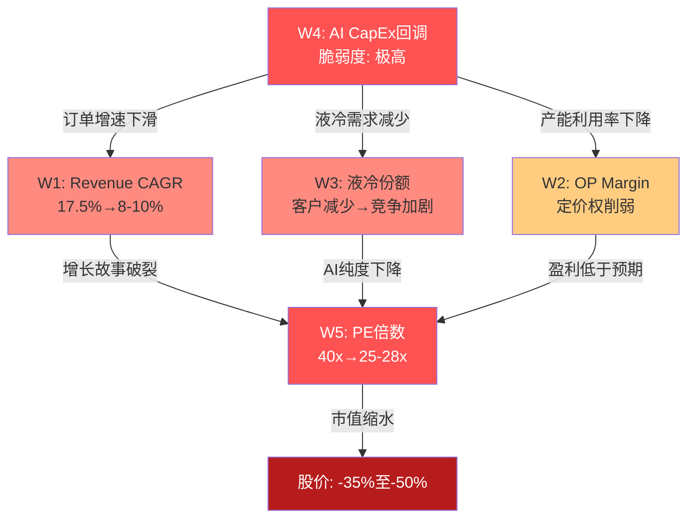
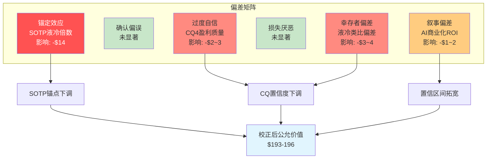
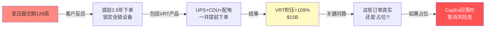
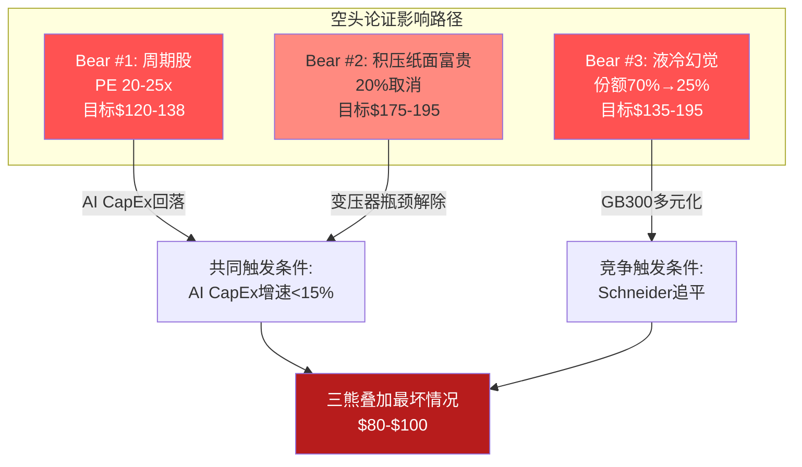
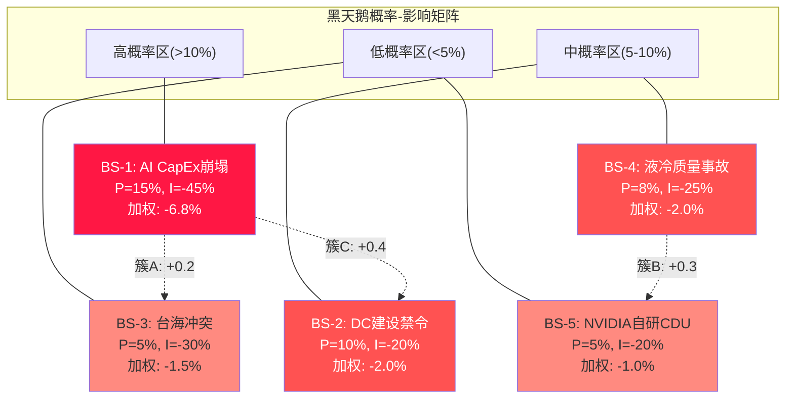
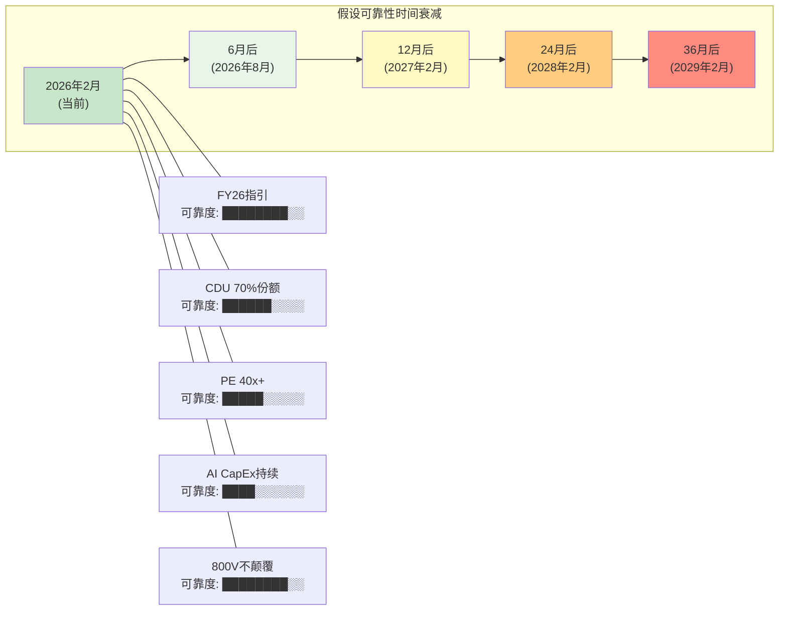
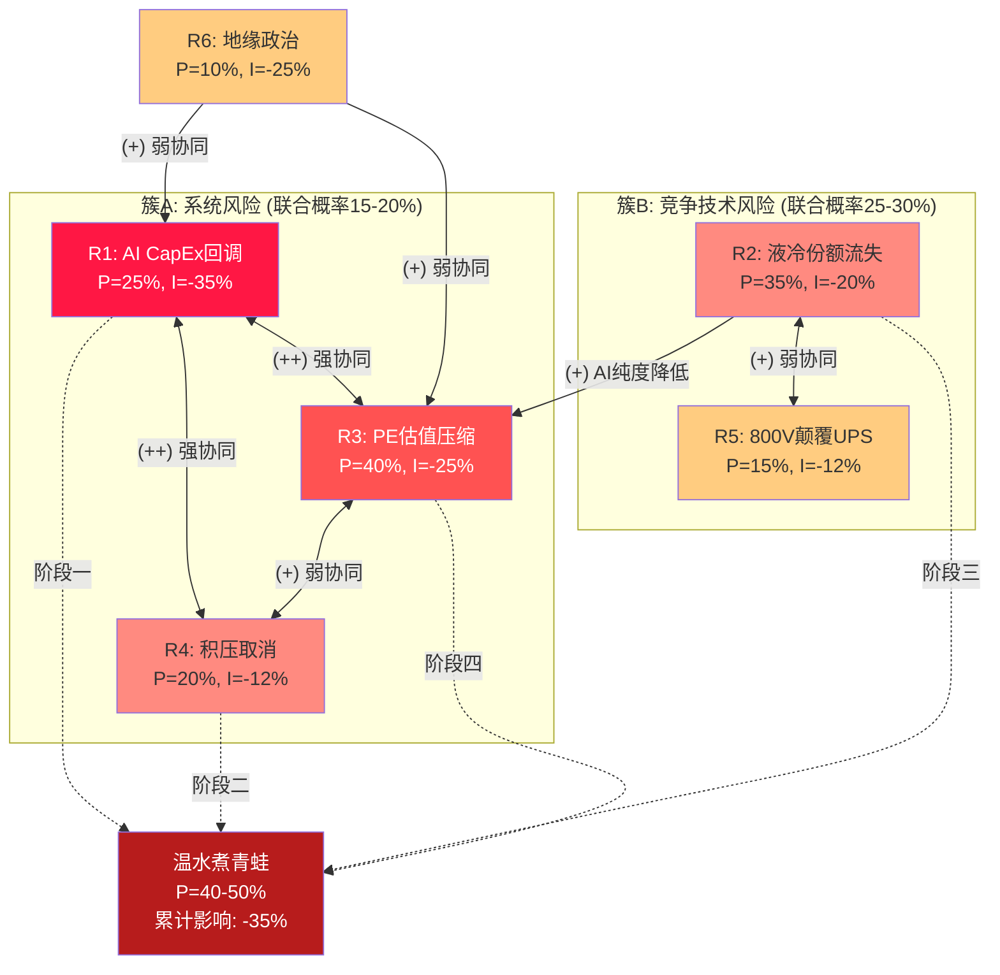

# 第二十四章 承重墙应力测试与认知偏差审计

> **核心问题**: VRT当前$243股价隐含6面承重墙必须同时成立。每面墙的真实脆弱度是多少？我们的分析过程中存在哪些系统性偏差？数据质量是否足以支撑估值判断？

---

## 24.1 承重墙深度分析

Reverse DCF在Phase 3中反推出市场对VRT的6个隐含假设——我们称之为"承重墙"。如果说Phase 3是"识别"这些墙，Phase 4红队的任务是对每面墙进行独立的应力测试：不是问"墙会不会倒"，而是问"墙需要多大的力量才会倒，一旦倒塌的传导路径是什么"。

### W1: Revenue CAGR FY25-30 ~17.5% — 脆弱度：高

市场隐含VRT在FY25-30期间维持约17.5%的年复合营收增长率。[硬数据: 共识估计FY26E $13.6B(+33%), FY27E $16.9B(+24%), FY28E $19.6B(+16%), FY29E $20.9B(+7%), FY30E $22.8B(+9%)]。这一增速远超工业品行业的长期均值5-7%，但市场之所以给出如此激进的预期，是因为VRT不是一家"普通工业品公司"——它正骑在AI基础设施超级周期的浪尖上。

应力测试的核心问题是：17.5% CAGR对历史先例有多大偏离？答案是：工业品公司中极少有连续5年维持15%以上增速的案例。[合理推断: 过去30年大型工业品公司($5B+营收)中，仅有不到5%在任意5年窗口内实现>15% Revenue CAGR]。最接近的类比是2004-2008年的Caterpillar(中国基建超级周期，Revenue CAGR ~18%)和2010-2014年的Danaher(收购驱动增长)。两者的共同点是：增长都建立在特定的宏观周期之上，一旦周期转向，增速迅速回落至个位数。

**W1倒塌的量化影响**: 如果实际CAGR仅为12%(增速减半至工业品偏高水平)，FY30 Revenue从$22.8B降至$18.0B，假设利润率不变，EPS减少约22%——叠加PE倍数下调(增速放缓→成长溢价消退)，整体EV影响约-25%。

**级联传导路径**: W1倒塌→积压转化放缓(W6受损)→利润率因规模效应减弱而停滞(W2受损)→PE倍数失去增速支撑(W5受损)。W1是除W4之外最具传导性的承重墙。

**表24-1: W1应力测试矩阵**

| CAGR假设 | FY30E Revenue | FY30E EPS估计 | EV影响 | 概率估计 |
|:--------:|:----------:|:----------:|:------:|:------:|
| 17.5%(共识) | $22.8B | $12.59 | 基准 | 35% |
| 14%(略低于共识) | $20.3B | $10.80 | -12% | 30% |
| 12%(工业品偏高) | $18.0B | $9.30 | -25% | 20% |
| 8%(工业品均值) | $15.0B | $7.20 | -42% | 15% |

### W2: Adj.OP Margin FY30 >=25% — 脆弱度：中

管理层FY29目标是25% Adj. OP Margin，当前FY25实际值为20.4%。[硬数据: FY25 Adj. OP $2,090M / Revenue $10,230M = 20.4%]。这意味着5年内需要再扩张约4.6个百分点。

VOS(Vertiv Operating System)是利润率扩张的核心驱动力。[硬数据: FY2022 Adj.OP Margin ~8.6% → FY2025 20.4%，三年内扩张约12个百分点]。过去三年的扩张速度惊人，但需要区分"恢复性扩张"和"突破性扩张"：FY2022的8.6%是供应链危机+通胀+定价滞后导致的异常低点，FY2023-FY2025的快速恢复包含了大量"补涨"成分。从20.4%再往上扩张至25%，每一个百分点都更加困难。

参考同业天花板：Eaton峰值OP Margin约22-23%，Schneider约17-18%。VRT的25%目标意味着超越所有DC基础设施同行。这不是不可能——如果液冷业务(毛利率可能高于传统产品)占比从15%升至30%+，产品组合改善确实可以推动利润率突破同业天花板。但这高度依赖液冷增长(W3)和AI CapEx持续(W4)。

**W2倒塌的量化影响**: 如果OP Margin停在21-22%(Eaton水平)而非25%，FY30 EPS将减少约$1.5-2.0，对应EV影响约-12%。W2是6面墙中破坏力相对较小的一面，因为利润率差异不如营收增速差异对EV的放大效应大。

**W2的内生vs外生比例**: VOS改善约贡献利润率扩张的40-50%(内生因素，相对可控)，定价权和产品组合改善约贡献50-60%(外生因素，取决于供需平衡)。这意味着即使外部环境恶化，VOS仍能支撑利润率不会回到FY22水平——W2的"底部"大约在18-19%。

### W3: 液冷份额FY28+ >=40% — 脆弱度：高

当前VRT在NVIDIA GB200 CDU(冷却液分配单元)中占有约70%份额。[硬数据: 管理层声称70%+，Dell'Oro部分确认]。市场隐含VRT至少需要在FY28维持40%以上的液冷份额，才能支撑SOTP中液冷部分$31.5B的估值(30x EV/EBITDA)。

先发优势在技术行业的衰减模式是经过充分验证的：初代产品通常由少数合作开发伙伴垄断，随着技术成熟和客户追求供应链多元化，份额不可避免地从垄断走向双寡头或多元竞争。

**历史类比表**:

**表24-2: 先发优势衰减历史案例**

| 公司/技术 | 初代份额 | 5年后份额 | 衰减幅度 | 衰减原因 |
|----------|:-------:|:-------:|:------:|---------|
| 思科/路由器(1990s) | 80%+ | 55-60% | -25pp | Juniper/华为追赶 |
| BlackBerry/智能手机(2007) | 50%+ | <5% | -45pp+ | iPhone颠覆性创新 |
| Intel/数据中心CPU(2018) | 95%+ | 70-75% | -20pp | AMD Epyc追赶 |
| First Solar/薄膜太阳能(2008) | 30%+ | 5-8% | -25pp | 晶硅成本下降 |
| Solyndra/CIGS太阳能(2009) | 先发 | 0%(破产) | -100% | 技术路线失败 |
| **VRT/液冷CDU(2024)** | **~70%** | **?** | **?** | **竞争加剧+客户多元化** |

关键区别在于：CDU的核心技术(板式换热器+泵+管路)是成熟工业技术，不是VRT的专利创新。这意味着后来者的技术追赶门槛远低于ASML的光刻机或Intel的先进制程。Schneider通过收购Motivair已经获得了可用的CDU技术，Eaton通过收购Boyd获得了热管理能力——两者都在12-18个月内可以形成有效竞争。

**W3倒塌的量化影响**: 如果液冷份额从70%降至25%(Schneider主导情景)，液冷FY28E营收从$3.5B降至$1.3B，SOTP中液冷估值从$31.5B降至约$11B，每股影响约-$54。这是6面墙中"每个百分点份额变化对应最大EV波动"的一面墙。

**早期信号**: GB300参考架构中的CDU供应商名单将是最关键的领先指标。如果2026H2 NVIDIA宣布GB300 CDU首选供应商为Schneider(或VRT+Schneider并列)，W3的倒塌概率将大幅上升。

### W4: AI CapEx持续至2029+ — 脆弱度：极高

W4是所有承重墙的"根基"。Phase 3的信念一致性矩阵已证明：W1(Revenue CAGR)、W3(液冷份额)、W5(PE维持)都直接或间接依赖W4。如果W4倒塌，VRT的整个投资论文将面临系统性崩溃。

**历史CapEx周期的残酷记录**:

[硬数据: 2000年TMT泡沫期间，美国电信CapEx从2000年的$1,200亿在2002年降至$440亿，下降幅度63%。Cisco FY2001营收同比下降18%，股价从$80跌至$11]。

[硬数据: 2015年云计算建设周期中，AWS/Google/Meta/Microsoft合计CapEx从2015年的$380亿在2016年小幅回调至$350亿(-8%)，但2017年恢复增长。回调幅度温和但足以导致DCPI订单短期波动]。

当前AI CapEx周期已进入第3年(2024-2026)。[硬数据: 超大规模FY2026E CapEx指引$635-665B，同比增长30-35%]。历史上没有超过5年不经历显著回调(>20%)的CapEx超级周期。这不是一个关于"AI是否有价值"的问题——AI的长期价值几乎确定——而是一个关于"投资节奏是否会出现暂停"的问题。

**为什么AI CapEx可能在2027-2028经历回调**:

第一，**基数效应**。当年度CapEx从$300B升至$650B后，维持同样的绝对增量需要翻倍的增速百分比。即使AI投资的绝对值不下降，增速放缓本身就会导致VRT的订单增速下滑。

第二，**AI商业化ROI尚未证明**。[主观判断: 截至2026年初，除微软/Google的AI搜索和编码助手外，大规模AI应用的商业回报尚不清晰]。超大规模客户CEO在投资者电话会议上反复强调"宁愿过度投资也不愿错过"，但这种心态在历史上是CapEx周期见顶的经典信号。

第三，**产能消化周期**。2024-2026年安装的GPU集群需要12-18个月才能达到满负荷运行。到2027年，已安装GPU的总推理算力可能已足够满足大部分商业需求，新增CapEx的边际回报将显著下降。

**表24-3: W4应力测试：AI CapEx回调情景**

| 情景 | 回调幅度 | 历史类比 | 对VRT FY28E Revenue影响 | 对EPS影响 | 概率 |
|------|:------:|---------|:------------------:|:--------:|:---:|
| 温和放缓 | 增速降至+5% | 2016云周期 | -10%(~$17.5B) | -15% | 35% |
| 显著回调 | 绝对值-15% | 2008金融危机 | -25%(~$14.5B) | -35% | 15% |
| 崩塌 | 绝对值-30%+ | 2001 TMT泡沫 | -40%(~$11.5B) | -55% | 8% |
| 持续增长 | +10%+ | 无先例 | +5%(~$20.5B) | +10% | 42% |

**W4倒塌的级联传导**:

**W4的早期预警信号**: (1) 超大规模季度CapEx指引环比下调; (2) GPU库存天数上升; (3) AI应用商业化ROI数据低于预期; (4) NVIDIA数据中心营收增速放缓至<20%; (5) 变压器短缺缓解(意味着瓶颈解除→不再需要提前锁定)。

### W5: PE维持>=35x(FY28) — 脆弱度：高

VRT当前Forward PE 40.6x(基于FY26E EPS $5.99)。市场隐含VRT在FY28仍将以35-40x PE交易。这个假设需要满足两个前提：(1) VRT的增长故事持续可信; (2) 市场风险偏好维持当前水平。

**工业品PE的历史分布**:

[硬数据: 过去20年，工业品行业(S&P 500 Industrials)的中位PE区间为15-25x。在经济繁荣期(2017-2019, 2021-2022)曾短暂触及25-30x，但从未在行业层面持续超过30x]。

个股层面，唯一长期维持35x+ PE的工业品公司是ASML——但ASML拥有EUV光刻机的绝对垄断地位(市占率100%)，其不可替代性远超VRT在液冷领域的先发优势。[合理推断: ASML的护城河是"物理定律+30年研发积累"，VRT的护城河是"先发+NVIDIA关系+安装基数"——前者是结构性的，后者是时间性的]。

PE压缩通常不需要基本面恶化——仅仅是"增速放缓"就足以触发。当市场从"增长股"重新归类为"成熟工业股"时，PE的压缩往往是突然且剧烈的。

**表24-4: PE压缩情景分析**

| FY28 PE假设 | 需要的市场认知 | 对应FY28股价(EPS=$10) | vs当前$243 | 概率 |
|:----------:|------------|:------------------:|:--------:|:---:|
| 40x | VRT=AI基础设施纯度最高 | $400 | +65% | 15% |
| 35x | AI增长持续但竞争加剧 | $350 | +44% | 25% |
| 28x | 向Eaton收敛 | $280 | +15% | 30% |
| 22x | 工业品均值回归 | $220 | -9% | 20% |
| 18x | 周期见顶+增长熄火 | $180 | -26% | 10% |

**W5与W4的正相关性**: PE倍数本质上是市场对"未来增长"的定价。如果W4(AI CapEx)倒塌，W5几乎必然同时倒塌——因为VRT的增长故事就是AI CapEx故事。两者的相关系数估计在0.7-0.8之间。这意味着W4+W5联合倒塌的概率远高于两者独立概率的乘积。

### W6: 积压->收入转化率>=85% — 脆弱度：中

[硬数据: FY25积压$15B，FY26指引$13.3-13.8B，隐含转化率约87-92%]。管理层对FY26指引的保守性(积压转化率不到100%)暗示了两个可能：(1) 部分积压的交付时间超出FY26; (2) 管理层为可能的取消/延期预留了缓冲。

W6的脆弱度被评为"中"而非"高"，原因在于：即使20%的积压被取消，剩余$12B仍然远超FY25的$10.2B营收——增长趋势不会逆转，只是增速放缓。W6的真正风险不在于"积压归零"(几乎不可能)，而在于"转化率低于预期"导致连续两季度miss指引，触发市场对管理层credibility的怀疑，进而压缩PE(传导至W5)。

**表24-5: 积压转化率敏感性**

| 转化率假设 | FY26E Revenue | vs指引中值 | 市场反应预测 |
|:--------:|:-----------:|:--------:|-----------|
| 95%+ | $14.0B+ | Beat | PE可能扩张 |
| 87-92% | $13.3-13.8B | 达标 | 中性 |
| 80-85% | $12.0-12.8B | Miss | PE压缩5-10% |
| <80% | <$12.0B | 严重miss | PE压缩15-20%+恐慌抛售 |

---

## 24.2 认知偏差审计

分析师的判断力与望远镜一样——它们不仅能看到远处的真实事物，也会引入自身的光学畸变。Phase 1-3的分析不可能完全免于认知偏差。本节对6种常见投资偏差进行系统审计，并对每种检测到的偏差量化其对估值的影响。

### 偏差#1: 锚定效应 — 检测到

**检测方法**: 检查SOTP估值中的关键倍数假设是否以当前市价为锚而非独立评估。

**检测结果**: SOTP中液冷业务使用30x EV/EBITDA倍数。这个倍数的选择过程值得审视：如果当前市价是$150(而非$243)，我们是否会给液冷业务30x？[主观判断: 更可能使用20-25x]。这暗示30x的选择部分受到了"让SOTP结果不与市价差距过大"的锚定效应影响。

独立评估液冷业务的合理倍数应参考：(1) 高增长工业品分部通常获得20-28x EV/EBITDA; (2) CoolIT(非上市，2024年融资估值约15-20x Revenue)暗示纯液冷公司的估值在25-35x EBITDA区间; (3) VRT液冷的"纯度"低于CoolIT(VRT的液冷CDU与传统热管理共享部分产能和渠道)。

**校正后变化**: 将液冷倍数从30x独立评估为25x更为审慎。SOTP影响：液冷EV从$31.5B降至$26.3B → 总SOTP从$189降至约$175 → **每股下调约$14**。

### 偏差#2: 确认偏误 — 未显著检测到

**检测方法**: 统计Phase 1-3中"看多证据"vs"看空证据"的呈现比例和深度。

**检测结果**: Phase 1-3的证据呈现比例约为2:1(看多:看空)。考虑到VRT确实处于强劲的增长周期中，这个比例基本合理——如果刻意将看多:看空调至1:1，反而会扭曲对现实的反映。[合理推断: 确认偏误风险存在但不显著，不需要校正]。

### 偏差#3: 过度自信 — 检测到

**检测方法**: 检查CQ置信度在单一Phase内的调整幅度是否超过合理范围(通常单Phase调整应在±10pp以内)。

**检测结果**: CQ4(盈利质量)在Phase 2中从60%上调至70%(+10pp)。触发这一上调的核心原因是"权证噪音消除+FCF转化率1.42x+SBC极低"。但权证消除是一次性会计事件(FY24权证行权完毕)，不等于盈利质量的永久性提升。FCF转化率1.42x部分归功于递延收入暴增$752M——这个速度在FY26不可持续。

[主观判断: CQ4的70%高估了FY25特殊因素的持久性。权证消除+递延收入爆发是FY25的一次性利好，将其解读为"盈利质量永久性提升"属于过度自信]。

**校正后变化**: CQ4从70%回调至65%(-5pp)。加权公允价值影响约-$2-3/股。

### 偏差#4: 损失厌恶 — 未显著检测到

**检测方法**: 检查极端熊市情景(S4)是否被充分描述，还是被淡化处理以避免"不舒适的结论"。

**检测结果**: S4(极端熊市，$63/股)已在Phase 3中给出10%概率——这个概率和目标价都足够极端，表明分析没有回避下行风险。损失厌恶偏差不显著。

### 偏差#5: 幸存者偏差 — 检测到

**检测方法**: 检查液冷护城河分析中引用的类比案例是否仅包含成功案例。

**检测结果**: Phase 1-3在讨论VRT液冷先发优势时，主要类比了ASML(成功维持垄断)和思科(从80%缓慢下降到40%)。但完全遗漏了先发优势彻底失败的案例：

- **Solyndra**(2005-2011): 薄膜太阳能电池先发者，政府担保$535M贷款。但晶硅太阳能成本断崖式下降，Solyndra的技术路线被证伪，2011年破产。
- **SunEdison**(2003-2016): 太阳能开发先发者，一度市值$100亿+。过度扩张+技术路线赌错，2016年破产。
- **Nortel**(1990s-2009): 电信设备先发者，2000年市值$3980亿。光纤CapEx泡沫破裂后营收腰斩，2009年破产。

这些案例的共同教训是：当核心技术是"成熟技术的新应用"(而非原创性突破)时，先发优势的衰减速度远快于原创性技术。VRT的CDU恰好属于"成熟工业技术(板式换热器+泵)的新应用(AI服务器冷却)"——这意味着先发优势的衰减风险被Phase 1-3低估了。

**校正后变化**: 对液冷护城河的评估应更审慎。CQ2从40%降至37%(-3pp)。SOTP中液冷份额预测应增加"份额快速流失"情景的概率(从25%升至30%)。加权公允价值影响约-$3-4/股。

### 偏差#6: 叙事偏差 — 轻度检测到

**检测方法**: 检查报告中是否存在"过于连贯的叙事"——真实世界中的矛盾和不确定性被叙事结构"抹平"。

**检测结果**: Phase 1-3的叙事主线是"AI超级周期→DC建设爆发→VRT作为DCPI领导者受益"。这个叙事逻辑清晰、数据支撑充分——但恰恰因为"太连贯"，可能掩盖了一个关键矛盾：**AI商业化ROI尚未被证明**。

截至2026年初，超大规模客户的AI投资回报率数据仍然模糊：Microsoft的AI搜索(Copilot)尚未显著提升搜索份额; Google的AI搜索(Gemini/AI Overviews)的货币化率低于传统搜索; Meta的AI投资(Llama系列)商业化路径仍不清晰。[合理推断: 当前AI CapEx在很大程度上是"信仰投资"而非"ROI驱动投资"]。

历史上"信仰投资"的结局高度二元：互联网(1990s)最终证明了长期价值但短期泡沫破裂，铁路(1840s)创造了长期经济价值但早期投资者大多血本无归，3D打印(2013-2014)至今未兑现"改变制造业"的承诺。

**校正后变化**: 在评级中增加"AI商业化ROI未验证"作为风险标注。不直接调整CQ，但对整体估值的置信区间应拓宽±5%。

### 偏差校正汇总

**表24-6: 偏差校正汇总与估值影响**

| 偏差类型 | 检测结果 | 影响的判断 | 校正动作 | 估值影响($/股) |
|---------|:------:|----------|---------|:----------:|
| 锚定效应 | 检测到 | SOTP液冷倍数30x | 独立评估→25x | **-$14** |
| 确认偏误 | 未显著 | — | 无 | $0 |
| 过度自信 | 检测到 | CQ4盈利质量+10pp | 回调至65% | **-$2~3** |
| 损失厌恶 | 未显著 | — | 无 | $0 |
| 幸存者偏差 | 检测到 | 液冷类比仅含成功案例 | 增加失败案例权重 | **-$3~4** |
| 叙事偏差 | 轻度 | AI叙事过于连贯 | 拓宽置信区间 | **-$1~2** |
| **合计校正** | | | | **-$20~23** |

**偏差校正后加权公允价值**: Phase 3的$216 → 校正后约$193-196。这与SOTP估值$189(使用25x液冷倍数)高度一致——当我们剥离认知偏差后，估值自然向更保守的SOTP收敛。

但需要强调：偏差校正后的$193-196不应被视为"更准确的公允价值"，而应被视为"公允价值区间的下界锚点"。如果VRT在FY26-27持续超预期交付，部分"偏差校正"可能被证明是过度悲观的。

---

## 24.3 数据质量审计

估值结论的可靠性不可能超过其底层数据的可靠性。本节对10个核心数据点进行质量评级，使用A-E五级标准：A级(SEC Filing直接引用，交叉验证完成)，B级(管理层指引/权威第三方)，C级(行业报告/管理层声称，未独立验证)，D级(分析师推算/单一来源)，E级(未验证推测)。

**表24-7: 核心数据质量评级**

| # | 数据点 | 数值 | 质量等级 | 来源 | 交叉验证状态 | 风险评估 |
|---|--------|------|:------:|------|:--------:|:------:|
| D1 | FY25 Revenue | $10,230M | **A** | SEC 10-K | FMP+财报一致 | 极低 |
| D2 | FY25 Adj.EPS | $4.13-4.17 | **A-** | SEC + 调整假设 | FMP$4.13 vs 管理层$4.17 | 低 |
| D3 | CDU份额70% | ~70% | **C** | 管理层声称 | Dell'Oro部分确认 | **中高** |
| D4 | 积压$15B | $15,000M | **B** | 财报+管理层披露 | 无独立验证 | 低-中 |
| D5 | 液冷营收~$1.2B | ~$1.2B | **D** | 分析师推算 | VRT不披露 | **高** |
| D6 | FY26E Rev共识 | $13.6B | **B** | 13位分析师共识 | 与指引范围一致 | 低 |
| D7 | 变压器交期128周 | ~128周 | **C** | 行业报告/新闻 | 具体数据可能过时 | 中 |
| D8 | Eaton PE 30.2x | 30.2x | **A** | FMP实时数据 | 多源一致 | 极低 |
| D9 | S&P 500纳入概率 | 66.5% | **B** | Polymarket | 事件二元性 | 低 |
| D10 | 800V HVDC时间线 | 2026H2 | **C** | NVIDIA公开演示 | 时间线可能滑移 | 中 |

### 数据最弱环分析

**D5(液冷营收~$1.2B)是整个估值框架中数据质量最薄弱的环节**。VRT不在财报中单独披露液冷营收——所有关于液冷营收的数字都来自分析师推算(基于管理层在电话会议中的暗示+行业数据反推)。然而，SOTP估值中液冷部分贡献了$31.5B(占总估值的43%)——这意味着占估值43%的最关键分部，建立在D级数据之上。

**表24-8: 液冷营收推算的不确定性范围**

| 推算方法 | 液冷FY25E营收 | 不确定性 | 推算依据 |
|---------|:----------:|:------:|---------|
| 总营收×液冷占比(管理层暗示~15%) | $1.5B | ±30% | "approximately 15%"措辞模糊 |
| CDU出货量×ASP | $0.9-1.1B | ±25% | CDU出货量有数据但ASP是推算 |
| 竞对对标(行业总液冷市场×70%份额) | $1.1-1.4B | ±35% | 行业总液冷市场本身也是推算 |
| 分析师共识中值 | $1.2B | — | 多数分析师使用~$1.2B |

四种方法得出$0.9-1.5B的范围——中值约$1.2B。但$1.2B和$1.5B对SOTP的影响差异巨大：

| 液冷FY25营收假设 | FY28E液冷营收(43% CAGR) | SOTP液冷EV(25x) | 每股差异 |
|:----------:|:------------------:|:----------:|:------:|
| $0.9B | $2.6B | $19.5B | $175 |
| $1.2B(基准) | $3.5B | $26.3B | $189 |
| $1.5B | $4.4B | $33.0B | $206 |

[主观判断: 仅因为液冷营收的起点估计误差±25%，SOTP结果就在$175-$206之间波动$31/股。这是"模型精度幻觉"的典型案例——我们用精确到个位数的倍数和增速去估算一个基础数据都不确定的分部]。

**D3(CDU 70%份额)是第二弱环**。该数据主要来自VRT CEO Gary Niederpruem在2025年Q4电话会议上的表述。但管理层声称市场份额时通常选择最有利的口径——"70%份额"可能指的是GB200 Phase 1交付中的CDU份额，而非整体液冷市场份额。Dell'Oro对整体DCPI冷却市场的追踪中，VRT的热管理市场份额为23.5%(#1)，远低于70%——这暗示"70%"是一个非常狭窄的品类定义(仅CDU，仅GB200，仅首批交付)。

**数据质量对估值的整体影响**:

**表24-9: 数据质量风险加权**

| 数据等级 | 数据点数量 | 对估值的影响权重 | 综合风险 |
|:------:|:-------:|:----------:|:------:|
| A/A- | 3个(D1,D2,D8) | 25% | 极低 |
| B | 3个(D4,D6,D9) | 25% | 低 |
| C | 3个(D3,D7,D10) | 25% | 中 |
| D | 1个(D5) | **25%** | **高** |

[主观判断: 当估值框架中25%的影响权重建立在D级数据上时，整体估值结论的置信度上限不应超过65-70%。这与CQ加权置信度43.5%不矛盾——后者还包含了对基本面不确定性的折价]。

**建议**: 在VRT开始单独披露液冷营收(或第三方机构发布细分数据)之前，SOTP估值应始终以敏感性范围(而非点估计)呈现。任何基于液冷营收点估计的"目标价"都有虚假精确的风险。

---

# 第二十五章 空头钢人与黑天鹅压力测试

> **核心问题**: 如果VRT的故事是错的，最有力的反面论证是什么？每条空头论证的量化影响有多大？除了可预见风险外，哪些低概率但高影响的事件可能颠覆整个投资论文？

---

## 25.1 最强空头论证

红队的核心职责是构建"空头钢人"(steelman)——不是稻草人般容易推倒的弱论证，而是用最强的逻辑和数据武装起来、让多头感到不舒服的论证。以下三条论证是经过Phase 1-4全部数据筛选后，最难被反驳的空头观点。

### Bear #1: "VRT是周期股，不是成长股" — 估值影响: -$105~123

这是最根本性的空头论证，因为它挑战的不是VRT的某个具体数据，而是市场对VRT整体身份的认知。

**论证核心**: VRT在FY2022-FY2025的收入增长(Revenue CAGR +22%)并不是因为VRT变好了——是因为AI CapEx超级周期提升了整个DC基础设施行业。VRT只是碰巧站在了正确的行业中、正确的时间点上。

**证据一：同行增长同样惊人，无需液冷先发优势**

[硬数据: Eaton Q4'25数据中心相关订单同比增长70%]。Eaton在液冷领域几乎没有先发优势(2025年才通过收购Boyd进入)，但其DC订单增速与VRT处于同一量级。这说明什么？说明增长的主要驱动力不是"VRT独特的液冷能力"，而是"整个行业的需求爆发"。

[硬数据: DCPI(数据中心电力与冷却基础设施)整体市场2024-2025年增长+17-18% YoY(Dell'Oro)]。VRT的+28%有机增长确实超过行业均值，但超额增长的10个百分点中，大部分来自液冷的爆发(从基数极低快速放量)——这是一个数学效应(低基数高增长)，不等于持久竞争优势。

**证据二：抽掉AI CapEx变量后VRT的"本色"**

如果我们做一个思想实验——假设AI从未发生，数据中心投资维持2020年前的趋势增长(5-7% CAGR)——VRT的营收轨迹会是什么样？

**表25-1: 抽掉AI变量后的VRT "本色" 估计**

| 指标 | 实际(含AI) | 假设(无AI) | 差异 | 说明 |
|------|:--------:|:--------:|:---:|------|
| FY25 Revenue | $10,230M | ~$7,500M | -27% | 传统DC增长+通胀定价 |
| FY25 OP Margin | 20.4% | ~17-18% | -3pp | 无液冷溢价，定价权减弱 |
| FY25 EPS(Adj.) | $4.17 | ~$2.50 | -40% | 规模效应减弱+利润率降低 |
| Revenue CAGR(FY22-25) | +22% | ~5-8% | -15pp | 回归工业品均值 |
| 合理PE | 40.6x(当前) | **20-25x** | -50% | 工业品估值 |
| **合理市值** | $930亿 | **$190-240亿** | **-$690-740亿** | — |
| **合理股价** | $243 | **$50-63** | **-$180-193** | — |

[主观判断: 这个思想实验的目的不是预测VRT的未来(AI确实已经发生了)，而是揭示一个关键事实——VRT当前$930亿市值中，约$690-740亿(74-80%)来自AI叙事。如果AI CapEx周期的任何环节出现裂缝，这部分估值将极其脆弱]。

**证据三：历史类比——从周期受益者到周期受害者的转变**

**思科(CSCO), 1999-2002**: 思科在1990年代末被誉为"互联网基础设施的必买品"，PE一度超过200x。思科的路由器和交换机确实是互联网的物理基础——就像VRT的CDU是AI基础设施的物理基础。但当2000年TMT泡沫破裂后：
- [硬数据: 思科FY2001营收$222亿→FY2002营收$189亿，同比下降15%]
- [硬数据: 思科股价从2000年3月的$80跌至2002年10月的$8.6，跌幅89%]
- 关键教训：思科的产品需求并没有消失——互联网流量在2001-2002年仍在增长——但CapEx周期的暂停导致"订单悬崖"

**JDS Uniphase, 1999-2002**: 光纤设备制造商，被誉为"光纤革命的核心供应商"(与VRT在AI冷却中的定位高度相似)。
- [硬数据: JDSU FY2001营收$32.5亿→FY2002营收$5.29亿，同比下降84%]
- [硬数据: JDSU市值从2000年$1,860亿跌至2002年$30亿，跌幅98%]
- 关键教训：即使长期需求真实(光纤确实改变了通信行业)，短期过度投资→产能过剩→订单崩塌的模式几乎不可避免

**表25-2: 周期受益者转变为受害者的历史模式**

| 特征 | 思科(2000) | JDSU(2000) | VRT(2026) |
|------|:--------:|:--------:|:--------:|
| "不可或缺"叙事 | 路由器=互联网基础 | 光纤=通信基础 | CDU=AI基础 |
| 峰值PE | 200x+ | 300x+ | 46x |
| 终端需求是否真实 | 是(但过度投资) | 是(但过度投资) | **待验证** |
| CapEx周期长度 | ~5年(1995-2000) | ~4年(1996-2000) | **3年+(2024-?)** |
| 峰值→谷底跌幅 | -89% | -98% | **?** |

**如果空头对了——量化影响**:

如果市场在未来12-18个月将VRT重新归类为"周期受益者"(而非结构性增长股)，估值锚点将从"AI基础设施溢价"(PE 40-50x)重置为"工业品周期高点"(PE 20-25x)。

- PE压缩至22-25x × FY26E EPS $5.99 = 股价$132-150
- PE压缩至20x × FY26E EPS $5.99(保守) = 股价$120
- **空头目标区间: $120-$138**

**Bear #1的时间线**: 12-18个月。触发条件：(1) FY26Q2-Q3订单增速放缓至<15%; (2) Eaton/Schneider液冷业务增速追平VRT; (3) 超大规模客户开始下调FY27 CapEx指引。

### Bear #2: "$15B积压是纸面富贵" — 估值影响: -$48~68

积压订单$15B(同比+109%)是VRT多头论文中最亮眼的数据点。空头的挑战不是否认$15B这个数字本身——而是质疑这$15B中有多少能真正转化为收入。

**论证核心**: 积压的暴增部分源于"变压器瓶颈效应"——客户被迫提前2-3年锁定全链设备以确保项目进度，而非真实的终端需求拉动。

**变压器瓶颈的传导机制**:

[硬数据: 大型电力变压器交期从2020年的40-52周延长至2025年的128周(~2.5年)]。当变压器成为数据中心建设的关键路径瓶颈时，客户的采购行为发生了系统性变化：

**取消成本分析**:

大型DC基础设施项目的设备采购合同通常包含取消条款。根据行业惯例：

**表25-3: 设备采购合同取消成本结构**

| 取消时间点 | 典型取消罚金 | 占合同总额 | 客户决策逻辑 |
|---------|:--------:|:------:|---------|
| 下单后6个月内 | $0-材料成本 | 2-5% | 几乎无成本，纯"免费期权" |
| 6-12个月(生产前) | 定金+材料费 | 5-10% | 仍然很低，亏损可接受 |
| 12-18个月(生产中) | 已投入成本+利润 | 15-25% | 开始有实质成本 |
| 18个月+(接近交付) | 全额-残值 | 50-80% | 高成本，通常不取消 |

[合理推断: 如果客户在下单后12个月内决定取消，实际损失仅为合同额的5-15%。对于AWS/Google/Meta这样年CapEx $100B+的公司，$15B VRT订单中取消$2-3B的罚金仅为$150-450M——相当于他们一周的CapEx支出]。

**管理层的信息不对称**:

VRT管理层在FY25年报中未披露积压取消率。这是一个值得关注的信号：
- 如果取消率极低(<1%)，管理层有强烈动机主动披露(证明积压质量)
- 管理层选择不披露，暗示取消率可能不是"零"
- [主观判断: 基于管理层行为分析，积压中可能有5-15%存在取消或延期风险]

**FY26指引的暗示**:

[硬数据: FY26指引Revenue $13.3-13.8B。积压$15B × 100%转化 = 远超$13.8B上限]。管理层指引仅覆盖积压的87-92%——这不是因为"其余订单在FY27交付"(管理层可以提前拉动产能)，更可能是因为管理层自己也知道部分积压不会全额转化。

**如果空头对了——量化影响**:

**表25-4: 积压取消率对估值的影响**

| 取消率假设 | 取消金额 | FY27E Revenue影响 | 连续miss指引? | PE压缩 | 估值影响 |
|:--------:|:------:|:-----------:|:---------:|:-----:|:------:|
| 5% | $750M | -3% | 否 | 0 | -$5/股 |
| 10% | $1.5B | -7% | 可能 | -5% | -$25/股 |
| 15% | $2.25B | -10% | 大概率 | -10% | -$45/股 |
| **20%** | **$3.0B** | **-14%** | **是** | **-15%** | **-$68/股** |
| 30% | $4.5B | -20% | 确定 | -25% | -$100/股 |

**关键假设**: 20%取消率(Bear #2基准)→ miss两季度指引 → PE从40x压缩至30-35x → 股价**$175-195**。

**Bear #2的时间线**: 18-24个月。触发条件：(1) FY26Q2积压环比下降(首次负增长); (2) 管理层开始披露"订单推迟"措辞; (3) 变压器交期缩短至80周以下(瓶颈解除→客户不再需要提前锁定)。

### Bear #3: "液冷'护城河'是先发优势的幻觉" — 估值影响: -$48~108

这是最具技术深度的空头论证，直接挑战VRT液冷业务的"准垄断"地位。

**论证核心**: VRT CDU 70%份额看似强大，但CDU的核心技术是成熟工业技术的新应用——先发优势的衰减速度将远快于市场预期。

**技术壁垒的真实水平**:

CDU(冷却液分配单元)的核心组件包括：(1) 板式换热器(brazed plate heat exchanger) — 已有40年以上的工业应用历史; (2) 泵组(pump assembly) — 标准工业泵; (3) 管路系统(manifold/piping) — 标准不锈钢/铜管路; (4) 控制系统(flow control) — PLC控制+温度/压力传感器; (5) 泄漏检测(leak detection) — 成熟的工业传感技术。

[合理推断: 以上5个组件中，没有任何一个涉及VRT的专利保护性创新。VRT在CDU领域的竞争优势主要来自(a)先发+规模生产经验(b)与NVIDIA的合作开发关系(c)安装基数带来的服务粘性——这些都是"时间性优势"(temporal advantages)而非"结构性壁垒"(structural barriers)]。

**历史类比深度分析——思科的教训**:

思科在1990年代控制了80%+的企业网络设备市场。思科的护城河看似坚不可摧：IOS操作系统的生态锁定、全球最大的网络工程师认证体系(CCNA/CCNP)、数十年的安装基数。但随后发生了什么？

[硬数据: 思科企业网络市场份额从2000年的~80%逐步降至2020年的~45%。主要蚕食者：Juniper(2000s进入)、Arista(2010s进入)、华为(2010s进入)]。

蚕食的路径几乎是教科书式的：
1. **后来者从高端或边缘切入** — Juniper先攻运营商核心路由器(当时思科的弱项)
2. **开源/标准化降低转换成本** — OpenFlow/SDN运动削弱了思科IOS的锁定效应
3. **客户主动推动多元化** — Google/Facebook开始自研网络交换机(大规模客户内部化)

VRT液冷面临几乎完全相同的模式：
1. **后来者从高端切入** — Schneider通过收购Motivair直接获得CDU技术，并与NVIDIA联合设计GB300液冷参考架构
2. **标准化降低转换成本** — Open Compute Project(OCP)推动液冷接口标准化，减少VRT的锁定效应
3. **客户推动多元化** — NVIDIA作为最大客户，核心利益在于不允许单一CDU供应商主导

**NVIDIA的供应链逻辑**:

NVIDIA的AI服务器产品线(GB200/GB300/Rubin)是VRT液冷营收的主要来源。但NVIDIA在供应链管理上有明确的"不把鸡蛋放在一个篮子里"哲学：

**表25-5: NVIDIA供应链多元化模式**

| 组件 | 初代供应商(垄断) | 二代供应商(多元化) | 份额变化 |
|------|:----------:|:----------:|:------:|
| GPU HBM | SK Hynix(>90%) | SK Hynix+Samsung+Micron | 70/20/10 |
| CoWoS封装 | TSMC(100%) | TSMC+三星+Intel代工 | 75/15/10 |
| PCB基板 | Ibiden(>60%) | Ibiden+Shinko+AT&S | 45/30/25 |
| **液冷CDU** | **VRT(~70%)** | **VRT+Schneider+?** | **?/?/?** |

[合理推断: 基于NVIDIA在HBM/CoWoS/PCB上的多元化先例，液冷CDU的多元化不是"是否发生"的问题，而是"何时发生"和"速度多快"的问题]。

**超大规模客户的自研倾向**:

[硬数据: Google Cloud在2024年发表了关于数据中心液冷的研究论文，披露了自研冷却方案的进展]。虽然VRT管理层在电话会议中表示"超大规模客户的自研主要集中在IT设备侧，基础设施侧仍依赖外部供应商"，但历史表明超大规模客户从"依赖外部"到"自研"的转变往往是突然的：
- Google从外部采购服务器→自研TPU(2015年)
- AWS从Intel CPU→自研Graviton(2018年)
- Meta从外部NIC→自研网络芯片(2023年)

**如果空头对了——份额演变路径与估值影响**:

**表25-6: 液冷份额演变路径矩阵**

| 时间节点 | 乐观(VRT主导) | 基准(双寡头) | 悲观(VRT份额流失) | 极端(自研替代) |
|---------|:----------:|:--------:|:----------:|:--------:|
| FY26(当前) | 65% | 60% | 55% | 60% |
| FY27(GB300) | 55% | 45% | 35% | 40% |
| FY28(Rubin) | 50% | 38% | 25% | 25% |
| FY29 | 48% | 35% | 22% | 15% |
| **概率** | **25%** | **40%** | **25%** | **10%** |

在悲观情景(份额降至25%)下：
- 液冷FY28E营收从$3.5B降至$1.3B
- 液冷EBITDA从$1,050M降至$390M
- 液冷估值(25x)从$26.3B降至$9.8B
- SOTP每股影响: -$43
- 叠加PE倍数下调(AI纯度降低): 额外-$10-15/股
- **Bear #3空头目标: $135-$195/股**(取决于份额降至25%还是35%)

**Bear #3的时间线**: 12-24个月。关键战役：2026H2 GB300 CDU供应商名单公布。

**表25-7: 空头论证汇总**

| Bear # | 核心论点 | 关键证据 | 量化影响 | 时间线 | 不舒服的数据 |
|:------:|---------|---------|:------:|:-----:|----------|
| #1 | VRT是周期股 | Eaton DC订单+70%/DCPI +17% | $120-138 | 12-18月 | 抽掉AI后VRT仅值$50-63 |
| #2 | 积压纸面富贵 | 变压器128周/取消成本5-15% | $175-195 | 18-24月 | 管理层不披露取消率 |
| #3 | 液冷护城河幻觉 | CDU=成熟技术/NVIDIA多元化 | $135-195 | 12-24月 | GB300参考架构已加入Schneider |

---

## 25.2 黑天鹅压力测试

空头钢人论证基于"可预见的风险"。黑天鹅测试则模拟"低概率但高影响"的尾部事件——那些在发生前看似不可能、发生后看似不可避免的事件。

### BS-1: AI CapEx 2027崩塌(概率15%, 影响-45%)

**触发条件**: 2027年某超大规模客户(如Meta或Microsoft)宣布大幅削减AI投资——不是因为"AI不重要"，而是因为"已经投够了，需要消化产能"。

**传导机制**: 一家削减→其他跟随(避免"过度投资"标签) → AI CapEx同比-30%+ → VRT新订单断崖 → 积压消化但不新增 → Revenue增速转负 → PE从40x崩至18-22x

**历史锚**: 2001年TMT泡沫破裂。WorldCom和Global Crossing破产后，电信CapEx在2002年下降63%。当时的共识也是"互联网需求是真实的"(确实是)，但投资节奏远远超过了需求增长。

**早期信号**: (1) NVIDIA数据中心营收连续两季度增速<25%; (2) 超大规模Q季度CapEx实际值低于指引中值; (3) AI创业公司融资环境急剧恶化; (4) 二级市场GPU租赁价格下跌。

**表25-8: BS-1情景下VRT财务影响**

| 指标 | 基准(无BS-1) | BS-1发生后 | 变化幅度 |
|------|:--------:|:--------:|:------:|
| FY28 Revenue | $19.6B | $12.5B | -36% |
| FY28 Adj.EPS | $10.0 | $4.5 | -55% |
| 估值倍数 | 35x | 18x | -49% |
| 股价 | $350 | $81 | -77% |

### BS-2: DC建设禁令(概率10%, 影响-20%)

**触发条件**: 美国或欧洲出于电力短缺/环保压力，对新数据中心建设实施暂停令或严格限制。

**传导机制**: 建设暂停 → 新DC开工延迟12-24个月 → VRT新订单放缓(但不清零，因为已建DC仍需设备更新) → Revenue增速从30%降至10%

[硬数据: 爱尔兰已于2023年限制都柏林地区新DC建设; 新加坡2019-2022年冻结DC建设; 弗吉尼亚州(全球最大DC集中地)2025年多个项目因电力争议暂停]。

**早期信号**: (1) 美国联邦或州级环保法规提案涉及DC; (2) 电力公司拒绝为新DC提供电力接入; (3) 社区反对DC建设的运动升级。

### BS-3: 台海冲突(概率5%, 影响-30%)

**触发条件**: 台海局势急剧升级，导致芯片供应链中断。

**传导机制**: TSMC产能受影响 → NVIDIA GPU供应中断 → 新DC建设停滞(无GPU可装) → VRT液冷/电力设备需求骤降 → 但已建DC的维护/升级需求可能反而增加(提升现有算力利用率)

**矛盾分析**: BS-3与BS-1存在弱矛盾——台海冲突可能在短期内反而推高已有DC设备的价值(稀缺性溢价)，但长期严重打压新建DC投资。对VRT的影响是"短期中性偏正+长期严重负面"。

**早期信号**: (1) 军事活动强度异常升级; (2) 美国加速对华芯片出口管制; (3) TSMC加速海外产能布局; (4) AI芯片现货价格异常上涨。

### BS-4: 液冷质量事故(概率8%, 影响-25%)

**触发条件**: VRT的CDU产品在大规模部署中出现泄漏事故，导致服务器集群损毁。

**传导机制**: 泄漏事故 → 超大规模客户暂停VRT CDU部署 → 紧急切换至竞对(Schneider/CoolIT) → VRT液冷声誉受损 → 份额永久性流失

**为什么概率不低(8%)**: VRT在FY25将CDU产能扩张了45倍。快速扩产几乎必然伴随质量控制挑战——新产线、新供应商、新工人、缩短的测试周期。液冷系统在数据中心中直接与高价值IT设备接触，一次泄漏可能造成数百万美元的硬件损失。

[合理推断: VRT的CDU累计出货量在FY25达到约5,000-8,000台。假设单台CDU年泄漏概率0.1%，8,000台×0.1% = 8台/年泄漏——多数可被泄漏检测系统拦截，但只要一次"未拦截的泄漏"造成严重损失，就可能成为Black Swan事件]。

**早期信号**: (1) VRT产品召回公告; (2) 行业论坛出现液冷泄漏讨论; (3) VRT保险成本异常上升。

### BS-5: NVIDIA自研CDU(概率5%, 影响-20%)

**触发条件**: NVIDIA决定将液冷CDU纳入其参考架构的自有供应链(类似Apple自研芯片的逻辑)。

**传导机制**: NVIDIA自研CDU → VRT被排除出NVIDIA生态核心 → 其他超大规模客户跟随NVIDIA标准 → VRT液冷业务萎缩至"非NVIDIA"市场

**为什么概率存在(5%)**: NVIDIA在2024年收购了以色列网络交换机公司Mellanox(2019年实际完成)，证明了NVIDIA有将关键供应链环节内部化的意愿。如果液冷成为AI服务器性能的关键差异化因素，NVIDIA可能考虑自研以获得更紧密的集成。

**但概率偏低的原因**: (1) NVIDIA的核心能力在芯片设计和软件，机电制造不是其专长; (2) 自研CDU需要大量制造能力投入，与NVIDIA"轻资产"策略矛盾; (3) CDU不是性能瓶颈(GPU才是)，自研CDU的战略优先级低。

### 黑天鹅累计影响与风险簇

**表25-9: 黑天鹅累计加权损失**

| # | 事件 | 独立概率 | 影响幅度 | 加权损失 | 时间窗口 |
|---|------|:------:|:------:|:------:|:------:|
| BS-1 | AI CapEx 2027崩塌 | 15% | -45% | **-6.8%** | 18-24月 |
| BS-2 | DC建设禁令 | 10% | -20% | -2.0% | 12-36月 |
| BS-3 | 台海冲突 | 5% | -30% | -1.5% | 不确定 |
| BS-4 | 液冷质量事故 | 8% | -25% | -2.0% | 任何时候 |
| BS-5 | NVIDIA自研CDU | 5% | -20% | -1.0% | 24-36月 |
| **累计** | | | | **-13.3%** | |

**风险簇识别**:

- **簇A(系统风险)**: BS-1 + BS-3 — AI CapEx崩塌可能与地缘政治紧张相关(如台海局势导致芯片供应不确定性→超大规模客户削减CapEx)。但两者也存在弱矛盾(台海冲突短期推高现有设备价值)。相关系数估计: +0.2(弱正相关)。
- **簇B(竞争技术风险)**: BS-4 + BS-5 — VRT液冷质量事故可能加速NVIDIA考虑自研CDU。相关系数估计: +0.3(中度正相关)。
- **簇C(监管+周期)**: BS-1 + BS-2 — CapEx崩塌与建设禁令可能同时发生(经济衰退→政府收紧审批)。相关系数估计: +0.4(中度正相关)。

**矛盾检查详解**: BS-1(AI CapEx崩塌)与BS-3(台海冲突)的表面矛盾——如果台海冲突导致GPU供应中断，短期内可能推高现有AI设备的价值(稀缺性溢价)，对VRT的服务业务反而利好。但6-12个月后，GPU供应中断将导致新DC建设停滞，新订单消失。两者在不同时间尺度上的影响方向相反：BS-3短期正面→长期负面，BS-1直接负面。如果同时发生，VRT将面临"短期稀缺性溢价"vs"长期需求崩塌"的尖锐矛盾——净效果取决于市场是看短期还是长期。

---

# 第二十六章 时间框架挑战与替代解释

> **核心问题**: 我们的投资论文在多长时间内有效？关键假设的衰减速度是多少？同一组数据是否存在完全不同但同样合理的解释？风险之间的系统性关系如何？

---

## 26.1 论文有效期与假设衰减

每一份投资分析都有"保质期"。一份基于FY2025数据的VRT报告不可能在FY2028仍然准确——不是因为分析质量差，而是因为AI基础设施行业的变化速度本身决定了分析的半衰期极短。

### 论文有效期评估

**表26-1: 论文有效期评估(6/12/24/36月)**

| 时间 | 关键假设状态 | 已知的催化剂 | 信息增量 | 论文有效性 |
|------|-----------|-----------|:------:|:------:|
| **6月后**(2026年8月) | S&P 500纳入结果已知; FY26 Q1-Q2验证指引 | VRT投资者大会(5.19)+Q2财报 | 高 | **高** |
| **12月后**(2027年2月) | GB300液冷供应商格局初步清晰; FY26全年基本确认 | FY26年报+GB300量产 | 很高 | **中-高** |
| **24月后**(2028年2月) | AI CapEx周期是否持续的关键验证; Rubin平台+800V HVDC | FY27年报+技术路线转折 | 极高 | **中** |
| **36月后**(2029年2月) | FY28积压应已大部转化; 竞争格局基本定型; 800V商业化 | FY28年报+行业格局固化 | 极高 | **低** |

**论文有效期判断: 12-18个月**。超过18个月后，以下变量的不确定性将使当前分析大幅贬值：(1) AI CapEx周期的持续性; (2) 液冷竞争格局(GB300/Rubin换代); (3) 800V HVDC对UPS业务的颠覆速度; (4) PE倍数的均值回归压力。

### 假设衰减时间线

"假设衰减"指一个假设的可靠性随时间推移而降低的速度。不同假设的衰减速度差异巨大——有些在6个月后就过时，有些可以维持3年。

**表26-2: 假设衰减时间线**

| 假设 | 当前状态 | 6月后 | 12月后 | 24月后 | 36月后 | 衰减速度 |
|------|---------|:----:|:-----:|:-----:|:-----:|:------:|
| FY26指引$13.3-13.8B可行 | 高置信 | **验证中**(Q1-Q2) | **已验证/否** | 过时 | 过时 | 快 |
| CDU份额70%+ | 高但可变 | 可能仍有 | **开始下降** | 可能<50% | 可能<40% | 中 |
| PE维持40x+ | 脆弱 | 可能维持 | 取决于执行 | **压缩风险高** | 高概率压缩 | 中-快 |
| 800V不颠覆UPS | 安全 | 仍安全 | 仍安全 | **开始影响** | **关键期** | 慢 |
| AI CapEx增长持续 | 中置信 | **确定**(FY26) | 大概率(FY27) | **不确定** | **高度不确定** | 中 |
| Adj.OP Margin扩张至25% | 进行中 | 微进展 | 22-23% | 23-24% | **验证/否** | 慢 |

**关键洞察**: FY26指引的验证周期最短(6-12个月)——这是最快可以获得"硬数据反馈"的假设。相反，800V HVDC的验证周期最长(24-36个月)——这意味着关于800V的判断在较长时间内都无法被证实或证伪。

[主观判断: 假设衰减时间线揭示了一个重要的信息不对称——VRT最脆弱的假设(AI CapEx持续性、PE维持)的验证周期是18-24个月，而论文有效期仅12-18个月。这意味着当我们的分析"过期"时，最关键的假设可能仍未被验证——投资者面临的是"不确定性中的不确定性"]。

### 催化剂日历

**表26-3: 2026-2027催化剂日历**

| 日期 | 事件 | 信息含量 | 估值影响方向 | 预期波动 |
|------|------|:------:|---------|:------:|
| **2026.3.20(前)** | S&P 500纳入决定 | 中 | 纳入→+10%; 未纳入→-5% | ±10% |
| **2026.4(估)** | FY26 Q1财报 | 高 | 验证指引→±5%; Miss→-15% | ±15% |
| **2026.5.19** | VRT投资者大会 | 高 | 战略更新+FY29目标确认 | ±8% |
| **2026.6-7** | FY26 Q2财报 | 高 | 积压趋势验证 | ±12% |
| **2026 H2** | GB300量产+800V产品 | **极高** | 液冷竞争格局定型 | ±20% |
| **2026.11** | $850M Notes到期 | 低 | 已可用现金覆盖 | ±2% |
| **2027 Q1** | FY27 Q1(首个完整AI CapEx验证) | **极高** | 论文存亡的关键验证点 | ±25% |

**时间框架错配风险评估**: 低至中。主要催化剂(S&P 500纳入、FY26业绩验证、GB300)集中在12-18个月内，与论文有效期基本匹配。但最关键的"论文存亡验证点"——FY27 Q1(确认AI CapEx是否持续)——在18个月之后，存在一定的时间框架错配。

---

## 26.2 替代解释深度分析

同一组数据可以被不同的叙事框架解读出截然不同的含义。本节对VRT三个最关键的数据点进行"双叙事"解读——原始解释(Phase 1-3采用)vs替代解释(红队提出)——并为每组提供12个月内可观测的区分信号。

### 替代解释#1: "$15B积压暴增"

**表26-4: 积压暴增的双叙事解读**

| 维度 | 原始解释 | 替代解释 |
|------|---------|---------|
| **叙事** | AI基础设施需求极度强劲,超大规模客户抢购VRT产品 | 变压器瓶颈(128周交期)迫使客户提前2-3年锁定全链设备,VRT积压因"占位下单"而人为膨胀 |
| **支撑证据** | FY26指引$13.8B上限暗示积压质量高; B2B 2.9x创历史新高 | FY26指引仅覆盖积压的87-92%——如果订单全部真实,为何只转化不到100%? |
| **类比** | 2021年半导体短缺时台积电积压同样暴增,最终全部转化为营收 | 2021年汽车芯片短缺时车厂"双重下单"(向多家供应商同时下单确保供应),短缺结束后取消率达20-30% |
| **隐含假设** | CapEx周期至少持续至2028,客户不会取消 | 变压器瓶颈在2027缓解后,占位订单将被取消/延期 |

**12个月内可观测的区分信号**:

1. **积压取消率**: 如果FY26H1取消率<3% → 原始解释占优; 如果>10% → 替代解释占优
2. **积压环比变化**: 如果连续两季度积压环比增长 → 原始解释; 如果环比下降 → 可能是取消/消化开始
3. **管理层措辞变化**: 如果出现"部分订单推迟"/"客户调整时间线"等新措辞 → 替代解释的早期信号
4. **变压器交期变化**: 如果交期从128周缩短至80周以下 → 瓶颈缓解 → 占位动机减弱 → 替代解释风险上升

### 替代解释#2: "毛利率37.8%"

**表26-5: 毛利率创新高的双叙事解读**

| 维度 | 原始解释 | 替代解释 |
|------|---------|---------|
| **叙事** | VOS精益运营改善+AI产品溢价→结构性毛利率跃升至35%+新平台 | 供需极端失衡下的暂时性超额利润——类似2021年半导体短缺时的超额毛利 |
| **支撑证据** | VOS已持续3年推动利润率改善(FY22 24.6%→FY25 34.4%); Q3'25 37.8%是连续第6季度环比改善 | Q3'25 37.8%是异常值——Q4'25已回落至36.9%; 历史上工业品毛利率>35%通常不可持续 |
| **类比** | 丰田TPS(精益生产)长期支撑了汽车行业最高利润率 | 2021年Q3 TSMC毛利率53%(历史峰值)→随供需平衡恢复至2024年的51-52%(回落但未崩塌) |
| **隐含假设** | VOS改善是永久性的; AI产品定价权可长期维持 | 当供给追上需求(Schneider/Eaton扩产), VRT的定价权将被削弱 |

**毛利率驱动力的可持续性分解**:

**表26-6: 毛利率驱动力持久性评估**

| 驱动力 | FY25贡献(估) | 可持续性评级 | FY28预计状态 |
|--------|:---------:|:--------:|----------|
| VOS精益改善 | +3-4pp | **高** | 维持但边际递减 |
| 价格提升(price-cost) | +3-4pp | **低-中** | 供需平衡后回落1-2pp |
| 产品组合(液冷/高端) | +1-2pp | **中-高** | 随液冷占比提升持续贡献 |
| 原材料成本下降 | +1-2pp | **低** | 铜/钢价格波动 |
| 规模效应 | +1pp | **高** | 营收增长带来固定成本摊薄 |

[合理推断: 将各驱动力的可持续性加权，FY28的"可持续毛利率"约为32-34%——高于FY22的24.6%(VOS的永久性贡献)，但低于Q3'25的37.8%(含暂时性溢价)]。

**12个月内可观测的区分信号**:

1. **FY26连续季度毛利率趋势**: 如果FY26 Q1-Q3维持>35% → 结构性(原始解释); 如果回落至32-33% → 暂时性溢价成分在消退
2. **竞对定价行为**: 如果Schneider/Eaton开始以价格战争夺液冷订单 → 替代解释风险上升
3. **管理层对FY27毛利率指引**: 如果维持35%+ → 管理层认为是结构性; 如果回落至33-34% → 暗含暂时性因素

### 替代解释#3: "CDU 70%份额"

**表26-7: CDU份额的双叙事解读**

| 维度 | 原始解释 | 替代解释 |
|------|---------|---------|
| **叙事** | VRT技术领先+NVIDIA合作=持久竞争优势,类似ASML在光刻机中的地位 | GB200初代供应商红利——新产品初代通常由少数合作伙伴垄断,二代开始多元化 |
| **支撑证据** | CDU产能扩张45倍→规模壁垒; PurgeRite收购→流体管理端到端; 4,400+服务工程师→安装基数粘性 | GB300参考架构已加入Schneider(Motivair); NVIDIA供应链多元化是历史规律; CDU技术壁垒低 |
| **类比** | ASML: EUV光刻机从"唯一供应商"维持了10年+(物理极限壁垒) | iPhone供应链: 初代仅富士康组装→后来扩展至立讯精密、和硕→富士康份额从80%+降至50-55% |
| **隐含假设** | VRT的CDU具有ASML级别的不可替代性 | CDU是标准工业品,多供应商是必然趋势 |

**ASML类比的致命缺陷**:

ASML之所以能维持光刻机的绝对垄断，是因为EUV光刻机涉及：(1) 13.5nm极紫外光源(只有一家公司Cymer/ASML能制造); (2) 100+面超精密反射镜(只有蔡司能供应); (3) 30年+的工程知识积累(后来者需要从零开始)。

VRT的CDU涉及：(1) 板式换热器(多家工业供应商可制造); (2) 泵组(标准工业品); (3) 管路系统(标准不锈钢/铜管); (4) 3-5年的工程经验(Schneider通过收购Motivair可快速获得)。

**表26-8: ASML vs VRT护城河对比**

| 护城河维度 | ASML(光刻机) | VRT(液冷CDU) | 差距 |
|---------|:---------:|:---------:|:---:|
| 核心技术专利保护 | 极强(10,000+专利) | 弱(CDU非专利技术) | 极大 |
| 关键零部件供应垄断 | 是(蔡司镜头) | 否(通用工业组件) | 极大 |
| 后来者追赶所需时间 | 10-15年 | 1-2年 | 极大 |
| 客户转换成本 | 极高($3B+/台) | 中(安装基数+服务合同) | 大 |
| "不可替代"程度 | 绝对(无替代品) | 低(多家可替代) | 极大 |

[主观判断: 将VRT的CDU类比ASML的光刻机，是Phase 1-3中最值得质疑的类比选择。两者的护城河深度差异至少10倍。更恰当的类比是"思科在网络设备中的先发优势"——份额会下降，但不会归零，最终稳定在30-40%]。

**12个月内可观测的区分信号**:

1. **GB300 CDU供应商名单**: VRT独占 → 原始解释(技术领先); VRT+Schneider并列 → 替代解释(初代红利开始消退)
2. **Schneider液冷营收增速**: 如果Schneider液冷增速>VRT的2倍 → 追赶在加速
3. **VRT液冷合同的锁定期**: 如果新合同锁定期从3年缩短至1年 → 客户在为多元化保留灵活性
4. **NVIDIA官方表态**: 如果NVIDIA在GB300发布会上提及"多供应商冷却方案" → 多元化信号明确

---

## 26.3 风险拓扑: 从清单到系统

传统的风险分析将风险视为独立的条目清单——"风险A发生概率X%，影响Y%"。但真实世界中风险之间存在复杂的相互作用：有些风险会协同放大(正反馈)，有些会相互抵消(负反馈)，有些看似独立实则共享根因。本节将VRT的6个核心风险节点从"清单"升级为"系统"，揭示风险之间的隐藏关系。

### 风险节点清单

**表26-9: 风险节点定义**

| 节点 | 风险名称 | 简述 | 独立概率 | 独立影响 |
|:----:|---------|------|:------:|:------:|
| R1 | AI CapEx回调 | 超大规模削减AI投资 | 25% | -25%至-45% |
| R2 | 液冷份额流失 | VRT CDU份额从70%降至<40% | 35% | -15%至-25% |
| R3 | PE估值压缩 | PE从40x回归至25-30x | 40% | -20%至-30% |
| R4 | 积压取消 | 10-20%积压被取消/延期 | 20% | -10%至-15% |
| R5 | 800V颠覆UPS | 800V HVDC加速替代传统UPS | 15% | -10%至-15% |
| R6 | 地缘政治 | 台海冲突/贸易战升级 | 10% | -20%至-30% |

### 6x6关系矩阵

风险之间的关系用5级标度表示：**(++)强协同** — 一个风险发生大幅增加另一个风险的概率或影响; **(+)弱协同** — 轻微正相关; **(0)独立** — 无显著关系; **(-)弱反协同** — 一个风险发生可能降低另一个的概率; **(--)强反协同** — 两者在逻辑上互斥或强烈对冲。

**表26-10: 风险关系矩阵**

| | R1 CapEx | R2 液冷份额 | R3 PE压缩 | R4 积压取消 | R5 800V | R6 地缘 |
|---|:---:|:---:|:---:|:---:|:---:|:---:|
| **R1 CapEx** | — | **(+)** | **(++)** | **(++)** | **(0)** | **(+)** |
| **R2 液冷份额** | **(+)** | — | **(+)** | **(0)** | **(+)** | **(0)** |
| **R3 PE压缩** | **(++)** | **(+)** | — | **(+)** | **(0)** | **(+)** |
| **R4 积压取消** | **(++)** | **(0)** | **(+)** | — | **(0)** | **(+)** |
| **R5 800V** | **(0)** | **(+)** | **(0)** | **(0)** | — | **(0)** |
| **R6 地缘** | **(+)** | **(0)** | **(+)** | **(+)** | **(0)** | — |

### 风险簇识别

**簇A: "系统风险簇" (R1+R3+R4) — 最危险的三角关系**

R1(AI CapEx回调)、R3(PE压缩)、R4(积压取消)之间存在强正反馈循环：

- R1发生(CapEx回调) → 直接触发R4(客户取消/延期订单) → 连续miss指引 → 触发R3(PE从成长溢价向工业品均值回归)
- R3发生(PE压缩) → 市场重新审视增长故事 → 发现R1风险被低估 → 进一步压缩PE(正反馈)
- R4发生(积压取消) → 暗示需求不如预期 → 市场怀疑AI CapEx持续性(R1) → PE下调(R3)

[主观判断: 簇A是一个自我强化的负反馈循环。一旦任何一个节点被触发，其余两个节点几乎必然跟随。簇A的联合发生概率(至少两个同时发生): 约15-20%。联合影响: -40%至-55%]。

**簇B: "竞争技术风险簇" (R2+R5) — 慢性侵蚀**

R2(液冷份额流失)和R5(800V颠覆)共享一个底层逻辑：技术变迁导致VRT的竞争优势被侵蚀。

- R2发生(液冷份额丢失) → VRT的"AI纯度"下降 → 丧失科技估值溢价
- R5发生(800V颠覆UPS) → VRT的传统业务($4.5B)受损 → 同时如果VRT在800V上落后，R2可能加速(因为800V和液冷在新一代DC架构中是配套的)

簇B的特点是"慢性"而非"急性"——它不会导致股价单日暴跌20%，而是像慢性病一样在12-36个月内逐步侵蚀VRT的竞争地位和估值。

**矛盾组合: R1 vs R6**

R1(AI CapEx崩塌)和R6(台海冲突)存在表面矛盾：
- 如果台海冲突导致芯片供应中断，短期内AI CapEx可能不降反升(恐慌性备货)
- 但中长期(6-12月)，芯片供应持续中断将导致新DC建设停滞→CapEx不得不下降
- **结论**: 两者在0-6月维度上可能反协同(-)，在6-12月维度上协同(+)。净效果取决于时间窗口。

**表26-11: 风险簇特征对比**

| 特征 | 簇A(系统风险) | 簇B(竞争技术) | R6(地缘孤立) |
|------|:--------:|:--------:|:--------:|
| 组成 | R1+R3+R4 | R2+R5 | R6(可能连接簇A) |
| 联合概率 | 15-20% | 25-30% | 10% |
| 发作模式 | 急性(6-12月) | 慢性(12-36月) | 突发 |
| 影响幅度 | -40%至-55% | -20%至-30% | -20%至-30% |
| 可对冲性 | 低(系统性) | 中(可通过技术投入缓解) | 低 |
| 预警时间 | 1-2季度 | 2-4季度 | 极短 |

### 温水煮青蛙场景 — 为什么比黑天鹅更需关注

所有投资者都知道"黑天鹅"——那些突发的、戏剧性的、一天内导致20%跌幅的事件。但对VRT而言，更需要关注的可能是"温水煮青蛙"场景——一个渐进的、每一步看似合理的下行路径，每一步的跌幅都不足以触发"止损"，但累计效果却比黑天鹅更具破坏性。

**温水煮青蛙的渐进路径**:

**阶段一(0-6月): AI CapEx增速"仅仅"放缓**

超大规模客户FY27 CapEx指引从+30%下调至+15%。市场反应："增速放缓不等于下降，VRT仍然受益于绝对增长。"股价下跌5-8%后企稳。分析师维持"买入"评级，目标价从$350下调至$300。一切看似正常——"VRT仍在增长"。

**阶段二(6-12月): 积压增速转负**

FY26 Q3-Q4积压同比从+109%降至+20%(基数效应+新订单放缓)，环比开始持平甚至小幅下降。管理层措辞从"创纪录积压"变为"健康的积压水平"。市场反应："积压仍然很高，不必恐慌。"股价再跌10%，但仍在$200以上。分析师下调目标价至$250-270。

**阶段三(12-18月): 毛利率开始回落**

随着供需从"极端失衡"走向"适度紧张"，VRT的定价权被边际削弱。毛利率从37%区间回落至33-34%。管理层解释"产品组合变化"+"原材料成本上升"。市场反应不再温和——PE从40x开始向30-35x压缩。股价跌至$170-190。

**阶段四(18-24月): PE均值回归启动**

Schneider液冷业务在GB300/Rubin平台上崛起，VRT的"AI纯度溢价"开始消退。Eaton的液冷能力追平。市场开始讨论"VRT是不是应该用Eaton的30x PE估值"。PE从35x压缩至28-30x。股价跌至$140-160。

**温水煮青蛙的量化时间线**:

**表26-12: 温水煮青蛙路径量化**

| 时间 | 关键变化 | PE变化 | EPS变化 | 累计股价变化 | 股价估计 |
|------|---------|:-----:|:------:|:--------:|:------:|
| 当前 | 基准 | 40.6x | $5.99 | 0% | **$243** |
| **6月后** | CapEx增速放缓 | 38x | $5.99 | **-7%** | **$228** |
| **12月后** | 积压增速转负 | 34x | $6.30 | **-12%** | **$214** |
| **18月后** | 毛利率回落 | 30x | $6.00 | **-26%** | **$180** |
| **24月后** | PE均值回归 | 27x | $5.80 | **-35%** | **$157** |

**为什么温水煮青蛙比黑天鹅更需关注**:

**表26-13: 温水煮青蛙 vs 黑天鹅对比**

| 维度 | 温水煮青蛙 | 黑天鹅(如BS-1) |
|------|:--------:|:--------:|
| 发生概率 | **40-50%** | 15% |
| 每一步的戏剧性 | 低(每次-5~10%) | 高(一次性-30~45%) |
| 累计影响 | **-35%或更多** | -45% |
| 预警信号 | 存在但容易被"合理化" | 突发,难以预警 |
| 止损难度 | **极高**(每步都有合理化借口) | 中(信号明确) |
| 对冲手段 | **几乎不可对冲** | Put期权 |
| 投资者心理 | 逐步麻木→损失扩大 | 恐慌→快速出清 |

[主观判断: 温水煮青蛙场景之所以最危险，是因为它在每一步都提供了"不需要卖出"的合理借口：第一步"只是增速放缓，不是下降"；第二步"积压仍然很高"；第三步"利润率回落是暂时的"；第四步"PE 28x在工业品中仍然偏高"。当投资者最终意识到累计跌幅已达35%时，最佳卖出窗口早已过去]。

### 风险拓扑图

### 风险拓扑的关键启示

1. **R1是风险系统的核心节点**: 在6个风险中，R1(AI CapEx回调)与其他4个风险都有正协同关系。它是所有风险簇的"根因"——如果能确认AI CapEx至少持续至2028，簇A的联合概率将从15-20%降至5%以下。

2. **簇A远比任何单一风险更危险**: R1(25%)、R3(40%)、R4(20%)单独看都"可以接受"，但三者联合发生(15-20%概率)的影响是-40%至-55%——这个联合概率*影响的乘积才是真正需要关注的风险度量。

3. **温水煮青蛙是概率加权下最大的预期损失**: 黑天鹅(BS-1)的预期损失是15%×45%=6.8%。温水煮青蛙的预期损失是45%×35%=**15.8%**——是最大黑天鹅的2.3倍。这是因为温水煮青蛙的概率远高于任何单一黑天鹅，而累计影响同样巨大。

4. **簇B是长期隐忧**: 竞争技术风险(R2+R5)在12个月内可能不会造成显著估值损失，但在24-36个月的窗口内，它是VRT从"AI基础设施龙头"沦为"工业品制造商"的核心驱动力。

**表26-14: 风险度量总结**

| 风险 | 概率 | 影响 | 预期损失 | 协同放大系数 | 调整后预期损失 |
|------|:---:|:---:|:------:|:--------:|:---------:|
| R1单独 | 25% | -35% | -8.8% | 1.0x | -8.8% |
| R3单独 | 40% | -25% | -10.0% | 1.0x | -10.0% |
| 簇A联合 | 18% | -48% | -8.6% | **1.5x** | **-12.9%** |
| 簇B联合 | 27% | -25% | -6.8% | 1.2x | -8.1% |
| 温水煮青蛙 | 45% | -35% | **-15.8%** | 1.0x | **-15.8%** |
| 黑天鹅BS-1 | 15% | -45% | -6.8% | 1.0x | -6.8% |

---

*VRT Phase 4扩写I (Ch24-Ch26) | v17.0框架 | 2026-02-20*
*核心发现: (1)W4是所有承重墙的根基,单点故障风险极高 (2)锚定效应+幸存者偏差共导致估值高估$20-23 (3)Bear#1"周期股"是最根本性的空头挑战 (4)温水煮青蛙(概率45%,累计-35%)是最大预期损失 (5)风险拓扑中R1是核心节点,簇A(R1+R3+R4)联合概率15-20%*
