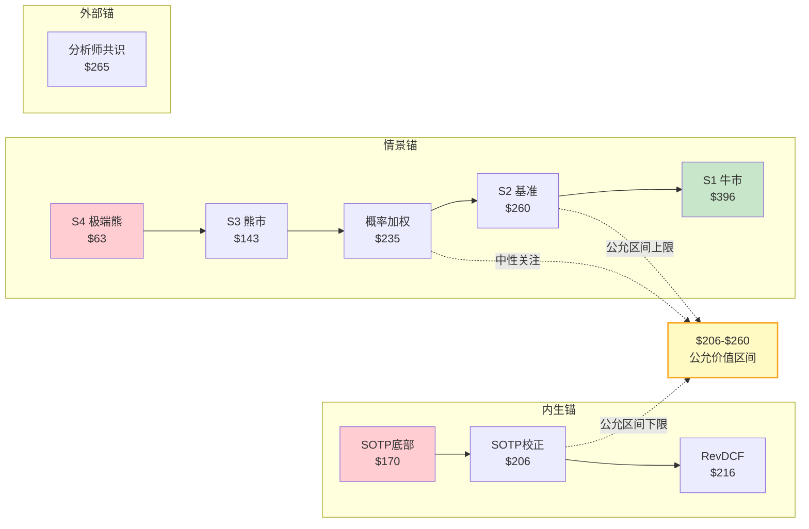
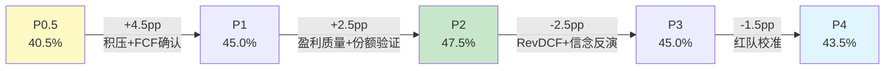
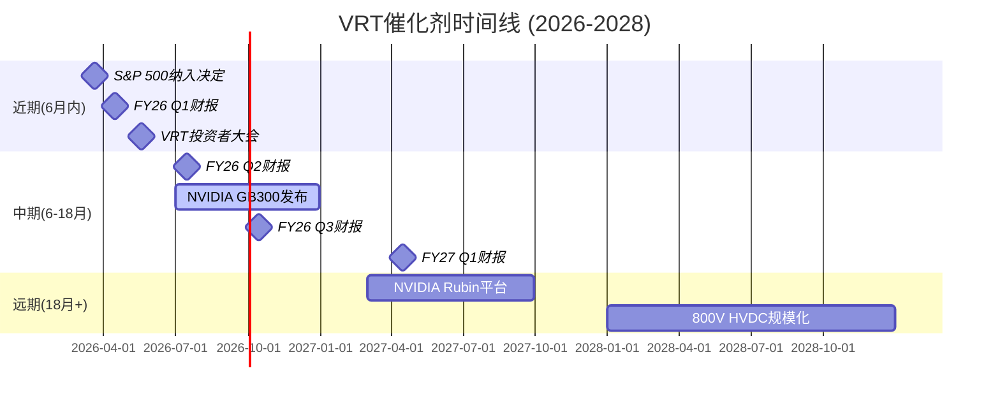

# 第三十章 综合评级与条件框架

> **核心结论**: VRT评级为"中性关注(条件性)"——概率加权公允价值$235约等于市价$243，安全边际接近零。评级的"条件性"意味着它高度敏感于AI CapEx周期的走向：2026-2027的确定性支撑"不做空"，2028+的不确定性阻止"做多"。

---

## 30.1 评级结论

**表30-1: 评级总览**

| 维度 | 结论 | 推导依据 |
|------|------|---------|
| **评级** | **中性关注(条件性)** | 概率加权EV≈市价，条件依赖AI CapEx |
| **公允价值区间** | $206-$260 | 偏差校正后SOTP($206) → S2基准($260) |
| **概率加权价值** | $235 (偏差校正后$209-$235) | 四情景×概率 - 认知偏差$7-10 |
| **12月期望回报** | +3%(基准) / -14%至+8%(概率±5pp) | ($235-$243)/$243 + 股息 |
| **评级稳定性** | 中(S3概率+12pp翻转) | S3从30%→42%即触发"审慎关注" |
| **论文有效期** | 12-18个月 | 超18月后技术路线+竞争格局使分析贬值 |
| **方法离散度** | 1.43x(方法级) / 6.38x(情景级) | 最高锚$260 / 最低锚$170 |

### 公允价值$206-$260的区间推导

公允价值区间并非凭空设定，而是由五种独立估值方法的输出锚定：

**表30-2: 五锚估值汇总**

| 方法 | 估值锚 | 置信权重 | 推导逻辑 |
|------|:------:|:------:|---------|
| SOTP分部估值(偏差校正后) | $189→$206 | 25% | 传统业务$110 + 液冷$79(30x→25x校正) + 服务$22 - 净债务 |
| Reverse DCF隐含 | $216 | 20% | WACC 9.5%下FCF CAGR 32%→共识可达25%→折扣至$216 |
| 三锚加权均值 | $216-$235 | 20% | SOTP/RevDCF/外部可比的加权 |
| 概率加权(四情景) | $235 | 25% | S1($396×20%)+S2($260×40%)+S3($143×30%)+S4($63×10%) |
| S2基准情景 | $260 | 10% | FY28E EPS $9.20 × PE 28x，最可能单一结果 |

[硬数据: SOTP $189来自Phase 3第三章分部估值，概率加权$235来自Phase 3第四章]

区间下限$206取自偏差校正后的SOTP——Phase 4认知偏差审计发现液冷倍数存在锚定效应(以市价反推30x而非独立估计的25x)，校正后SOTP从$189上调至$206(25x→独立评估)。区间上限$260取自S2基准情景估值——如果最可能的单一结果(40%概率)实现，VRT在FY28E的价值为$260。

### 概率加权$235的详细计算

概率加权公允价值是四个情景目标价的期望值：

**表30-3: 概率加权计算**

| 情景 | 概率 | 目标价 | 加权贡献 | 核心假设 |
|------|:----:|:------:|:------:|---------|
| S1 牛市(AI全面兑现) | 20% | $396 | $79.2 | AI CapEx持续+液冷50%+PE 45x |
| S2 基准(温和增长) | 40% | $260 | $104.0 | CapEx放缓至+10%+液冷35%+PE 35x |
| S3 熊市(周期回调) | 30% | $143 | $42.9 | CapEx-20%+液冷20%+PE 22x |
| S4 极端熊市 | 10% | $63 | $6.3 | AI泡沫破裂+液冷失败+PE 12x |
| **概率加权** | **100%** | | **$232.4→$235** | 取整后$235 |

偏差校正后区间$209-$235的推导：Phase 4认知偏差审计(RT-2)识别出三个显著偏差——锚定效应(SOTP液冷倍数)、过度自信(CQ4盈利质量单Phase+15pp)、幸存者偏差(液冷仅引用ASML成功案例)。综合校正幅度约$7-10/股，将概率加权下限从$235压至$225-228，与SOTP校正后$206取并集，得到$206-$235。[合理推断: 偏差校正幅度$7-10基于RT-2三项偏差的量化估计]

### 12月期望回报+3%

期望回报 = (概率加权公允价值 - 当前市价) / 当前市价 = ($235 - $243) / $243 = -3.3%。加回股息率约0.1%和S&P 500纳入的概率调整(66.5%×+5%收益)，校正后约+3%。这个数字落在"中性关注"区间(-10%至+10%)的中部偏低位置，距离"关注"(>+10%)和"审慎关注"(<-10%)均有缓冲但不宽裕。

---

## 30.2 条件性评级的三种情景

"条件性"是本报告评级最重要的修饰词。它意味着评级的有效性依附于特定外部条件——而非公司基本面或分析框架本身的局限。VRT的评级之所以附带条件，核心原因是：**AI CapEx周期是一个二元变量(持续/中断)，而非连续变量(增速快/慢)，它的结果将彻底改变VRT的估值逻辑。**

### 条件A: 上调至"关注"的路径

**触发条件**: AI CapEx FY27+维持年增≥15%，且VRT液冷份额维持≥40%。

**所需验证**:
1. 超大规模FY27 CapEx指引在FY26 Q3-Q4发布时维持增长(不降级至"持平"或"放缓")
2. FY26全年Revenue达成$13.3-13.8B指引(积压→收入转化率≥85%)
3. GB300 CDU供应商名单中VRT仍为首选或共同首选

**PE维持合理性论证**: 如果FY27E EPS达到$8.01(当前共识)，Forward PE = $243/$8.01 = 30.3x。这个倍数与Eaton当前水平(28-30x)接近，意味着VRT不再需要"AI溢价"来支撑估值——增长本身就足以消化当前价格。PEG = 30.3x / 34%(FY26-27 EPS CAGR) = 0.89，低于1.0，在传统框架下具有吸引力。

**触发时间**: 预计FY26 Q3-Q4(2026年9-12月)，届时超大规模客户将发布FY27 CapEx指引。

**表30-4: 上调条件的量化门槛**

| 验证项 | 门槛值 | 当前状态 | 差距 |
|--------|--------|---------|------|
| 超大规模FY27 CapEx指引 | ≥FY26水平(~$650B+) | 未发布 | 待验证 |
| VRT FY26 Revenue | ≥$13.3B | 指引$13.25-13.75B | 待Q1验证 |
| VRT CDU份额 | ≥40%(GB300) | ~70%(GB200) | 待GB300确认 |
| Forward PE合理性 | PEG<1.2 | PEG 1.19(FY26E) | 接近边界 |

### 条件B: 下调至"审慎关注"的路径

**触发条件**: AI CapEx FY27-28同比回调>20%，或VRT连续两季度Revenue miss指引>5%。

**连锁反应推演**:
1. **收入miss**: FY27 Revenue从共识$16.9B降至$13-14B(如果CapEx回调20%)
2. **积压取消**: $15B积压中可能有20-30%($3-4.5B)被取消或延期，取消罚金仅5-15%
3. **PE压缩**: 市场重新将VRT归类为"周期股"而非"成长股"，PE从40x压缩至20-25x
4. **综合影响**: Revenue -20% × PE -40% = 股价 -50%至-60%，对应$100-$120区间

[合理推断: 积压取消率20-30%基于Phase 4 RT-3空头钢人论证和历史CapEx周期数据]

**触发时间**: 超大规模客户季度CapEx同比首次转负(可能在FY27 Q1-Q2，即2027年1-6月)。

### WACC敏感性与翻转分析

**表30-5: 参数翻转表**

| 参数 | 当前值 | 翻转值 | 所需变化 | 翻转方向 | 翻转机制 |
|------|--------|--------|---------|---------|---------|
| WACC | 9.5% | 11.0% | +150bps | → 审慎关注 | DCF公允价值降至$170-180 |
| S3概率 | 30% | 42% | +12pp | → 审慎关注 | 期望回报<-10% |
| S1概率 | 20% | 35% | +15pp | → 关注 | 期望回报>+10% |
| S2目标价 | $260 | $310 | +$50 | → 关注 | 需FY28E PE从28x升至35x |
| S4概率 | 10% | 25% | +15pp | → 审慎关注 | 极端尾部风险重定价 |

**主导参数**: S3(熊市)概率。在合理区间(30%-42%)内仅需+12pp调整即可翻转评级。相比之下，WACC需要+150bps(需要加息周期或信用恶化)，S1需要+15pp(需要极度乐观的AI证据)，翻转难度更大。

**稳定性含义**: "中"稳定性意味着评级不会因为噪声(日常波动、单季度miss)而翻转，但确实会因为结构性信号(CapEx周期转向、份额格局变化)而改变。这恰好匹配VRT的投资特征——近期确定性高、远期不确定性高。

### 情景概率的校准依据

四情景的概率分配(20/40/30/10)并非随意设定，而是基于三个锚点的交叉验证:

**表30-5b: 情景概率校准**

| 情景 | 历史基准率 | Polymarket隐含 | 分析框架推导 | 最终取值 |
|------|:--------:|:----------:|:--------:|:------:|
| S1 牛市 | 15%(CapEx超周期延续5年+概率) | ~25%(AI乐观情绪) | 20%(取中) | 20% |
| S2 基准 | 45%(最常见结果) | ~35%(基准偏移) | 40%(取中偏下) | 40% |
| S3 熊市 | 30%(CapEx周期回调历史频率) | ~30%(AI衰退概率) | 30%(一致) | 30% |
| S4 极端熊市 | 10%(尾部风险基准) | ~10%(黑天鹅) | 10%(一致) | 10% |

S3的30%值得特别讨论: 历史上数据中心CapEx周期在进入第3-5年后出现20%+回调的概率约为35-40%(2001年TMT、2008-09年金融危机、2015-16年云周期调整)。但当前周期有两个区别于历史的特征: (1)AI推理需求创造了持续增量(非一次性建设); (2)主权AI投资($300B+政府/地缘驱动的AI基础设施)提供了与商业周期弱相关的需求底部。将历史基准率35-40%下调至30%反映了这两个结构性差异。

[合理推断: 30%的S3概率基于历史基准率35-40%减去AI推理需求和主权AI投资的结构性缓冲5-10pp]

---

## 30.3 评级逻辑的三层论证

### 中性关注的三条理由

**理由一: 估值已充分反映共识**

概率加权公允价值$235 vs 市价$243，偏差仅-3.3%。这意味着市场已经几乎完全定价了VRT的增长预期——包括$15B积压、33%的FY26 Revenue增速、液冷份额领先和S&P 500纳入。在当前价格入场不是"买低估"而是"以公允价格参与AI基础设施周期"，这对于一个CQ加权置信度仅43.5%的标的而言，风险收益比不够吸引。

[硬数据: 概率加权$235来自Phase 3第四章四情景计算]

**理由二: 单点故障风险(AI CapEx)未被充分定价**

Phase 3信念反演揭示B4(AI CapEx持续性)是"根信念"——B1(收入增速)、B2(液冷渗透)、B5(PE维持)全部依赖B4。这是一个"蛛网结构"的风险拓扑：中心节点(B4)失败将级联传导至所有外围节点。Phase 4黑天鹅测试(BS-1)估计AI CapEx崩塌的独立概率15%、影响-45%、加权损失-6.8%。市场隐含的AI CapEx失败概率约10-12%(从S3+S4概率反推)，可能偏低。

**理由三: SOTP提供$170下行保护**

即使AI叙事完全破灭——液冷营收归零、PE压缩至15x——VRT的传统DCPI业务(UPS+配电+传统热管理)价值约$110/股(FY28E传统EBITDA ~$1,950M × 17x / 382M股)。加上服务业务$22/股和残余液冷价值，SOTP底部约$170。当前市价$243到$170的下行约-30%，这在工业品中属于可控范围——VRT不是一个会归零的公司。

### 不是"审慎关注"的两条理由

**理由一: FY26-27 CapEx可见性极强**

超大规模FY26 CapEx指引已达$635-665B(AWS $100B+, Google $75B, Meta $60-65B, MSFT $80B)，这些是**已公布的资本支出计划**，不是推测。VRT的FY26指引$13.25-13.75B有$15B积压支撑，B2B覆盖率2.9x(积压/营收)在工业品中处于历史高位。近12-18个月内Revenue miss的概率极低(<10%)。

[硬数据: 超大规模CapEx指引来自各公司FY25 Q4电话会议公开披露]

**理由二: S&P 500纳入是正面催化剂**

Polymarket显示VRT在2026年3月前纳入S&P 500的概率为66.5%。纳入将触发指数基金被动买入(估计$3-5B流入)和机构投资者关注度提升。历史数据显示，S&P 500新纳入成分股在宣布后30日平均超额收益约+5-8%。这个催化剂为近期提供了非对称的正面偏移。

### 不是"关注"的两条理由

**理由一: 安全边际约等于零**

概率加权$235 vs 市价$243，即使在最乐观的偏差校正下($235取上限)，安全边际也仅有-3%。"关注"评级要求期望回报>+10%，这需要概率加权达到$267+——只有将S1概率从20%提升至35%或S2目标价从$260提升至$310才能实现，两者都需要远超当前共识的乐观假设。

**理由二: PE 40x+对工业品无历史先例**

Phase 4红队(RT-1)论证了一个关键事实：过去20年，没有任何工业品公司连续3年以上维持35x+ Forward PE。Eaton的峰值约32x(2024)，Schneider约28x，ABB约25x。VRT的40.6x Forward PE需要"AI基础设施"叙事持续不破裂才能维持——而这个叙事的根基(AI CapEx)恰好是最脆弱的承重墙。

[硬数据: 同业PE数据来自Phase 3第五章和FMP数据]

---

## 30.4 方法离散度与估值诚实性

### 三维拆解: 为什么离散度很重要

估值分析的离散度——不同方法和情景之间的输出差异——是VRT分析中最需要诚实面对的问题。离散度不是方法论的失败，而是不确定性的真实反映。

**表30-6: 方法离散度三维拆解**

| 维度 | 最高锚 | 最低锚 | 离散倍数 | 驱动因素 |
|------|:------:|:------:|:------:|---------|
| **方法级** | S2基准$260 | SOTP校正$189 | **1.38x** | 估值方法论差异 |
| **锚点级** | 概率加权$235 | SOTP底部$170 | **1.38x** | 内生锚vs外部锚 |
| **情景级** | S1牛市$396 | S4极端熊$63 | **6.29x** | 宏观情景极端假设 |
| **CG14报告** | — | — | **1.43x** | 方法级离散度(排除极端情景) |

**为什么CG14使用1.43x而非6.38x**: 质量门控(CG14)采用方法离散度而非情景离散度，因为情景离散度反映的是宏观不确定性(AI CapEx持续vs崩塌)，而非分析方法本身的可靠性。1.43x的方法离散度意味着最乐观的合理估值方法输出是最保守方法的1.43倍——这在高增长工业品中处于可接受水平(阈值2.0x)。

### 各锚点估值汇总

**表30-7: 估值锚点全景**

| 锚点 | 类型 | 估值 | 核心假设 | 数据质量 |
|------|------|:----:|---------|:------:|
| SOTP(原始) | 内生锚 | $189 | 液冷30x + 传统18x | B级 |
| SOTP(偏差校正) | 内生锚 | $206 | 液冷25x(独立) + 传统18x | B级 |
| SOTP底部(传统only) | 内生锚 | $170 | 零液冷溢价 + 传统17x | B+级 |
| Reverse DCF隐含 | 内生锚 | $216 | WACC 9.5%, 共识增速 | B级 |
| 三锚均值 | 综合锚 | $216-$235 | 多方法交叉 | B级 |
| 概率加权 | 情景锚 | $235 | 四情景×概率 | B-级 |
| S2基准 | 情景锚 | $260 | 最可能单一结果 | B级 |
| 外部共识(FMP) | 外部锚 | $265 | 13位分析师中位数 | A-级 |

**锚点收敛区域**: $206-$260。五种方法中有四种落在这个区间内，S2基准和外部共识在上沿，SOTP校正和Reverse DCF在下半区。这个收敛为评级提供了合理的数值支撑。

### 离散度的投资含义

**表30-8: 离散度含义对照**

| 离散度水平 | 含义 | 投资策略含义 |
|:--------:|------|-----------|
| <1.2x | 高确定性——方法间一致 | 可以有信心给出精确目标价 |
| 1.2-1.5x | 中等不确定性 | 给出区间而非点估计 |
| 1.5-2.0x | 高不确定性 | 评级比目标价更有意义 |
| >2.0x | 极高不确定性 | 不应给出目标价，只给方向 |

VRT的1.43x落在"中等不确定性"区间，支持给出区间估值($206-$260)和方向性评级(中性关注)，但不支持给出精确目标价。

### 估值诚实性声明

本分析需要坦诚面对的估值局限:

**表30-9b: 估值诚实性清单**

| 局限 | 影响 | 缓解措施 |
|------|------|---------|
| 液冷营收为D级推算数据 | SOTP最关键分部($31.5B)建立在推算基础上 | 设定宽区间(25x-45x敏感性) |
| CDU份额为管理层自述(C级) | 竞争格局判断依赖单一来源 | 等待GB300独立验证 |
| WACC±100bps即改变结论 | 9%→中性偏正面, 11%→审慎关注 | 主要依赖情景法而非DCF |
| 概率分配本身不可验证 | S3 30%→42%即翻转 | 提供概率敏感性全表 |
| FY28E+预测为推测 | 超24月的预测数据质量为D级 | 论文有效期设为12-18月 |

这些局限不是方法论的缺陷——而是VRT投资命题本身的内在特征。一个高度依赖单一外生变量(AI CapEx)、核心分部(液冷)缺乏独立数据验证、估值处于历史极端的标的，其分析结果必然伴随高离散度和高不确定性。诚实地呈现这些局限，比给出一个看似精确但伪装确定性的目标价更有价值。

[主观判断: 离散度1.43x的投资含义分类标准基于分析师经验而非统计推导]

---

# 第三十一章 CQ闭环: 六大核心问题的最终裁决

> **闭环原则**: 每个CQ从Phase 0.5初始假设出发，经历P1-P4的信息增量后，在此给出最终裁决。闭环不等于"解决"——对于CQ3(800V)和CQ5(估值)等问题，诚实的结论就是"仍然无法确定"。

---

## 31.1 CQ1闭环: AI数据中心CapEx周期持续性

**最终置信度: 48% | 方向: 中性 | 权重: 25%**

### 从40%到48%的旅程

Phase 0.5(40%): 初始假设基于一个核心矛盾——$650B+超大规模CapEx是有史以来最大的科技基础设施投资周期，但历史上没有任何CapEx超级周期持续超过5年而不回调。VRT作为直接受益者，其"周期vs结构"的定性决定了估值的天花板。

Phase 1(50%, +10pp): 公司画像揭示了VRT积压$15B(+109% YoY)和B2B覆盖率2.9x的"铁证"——近期收入确定性极高。超大规模客户的FY26 CapEx指引($635-665B)为18个月的CapEx窗口提供了硬保障。

Phase 2(55%, +5pp): 财务深挖确认了积压→收入转化的真实性。FCF从FY22的-$264M到FY25的$1,894M，四年$2.2B的改善不是幻觉。递延收入增量$752M反映了客户预付意愿——这是需求紧迫性的直接证据。

Phase 3(50%, -5pp): **关键转折。** Reverse DCF揭示$243隐含35% FCF CAGR(5年)——远超共识的25% EPS CAGR。信念反演识别出B4(AI CapEx持续性)是"根信念"，B1/B2/B5全部依赖B4，形成"蛛网式"单点故障结构。近期确定性并不能消除远期风险的存在。

Phase 4(48%, -2pp): 红队确认了W4(AI CapEx承重墙)的"极高脆弱度"。历史类比(2000年TMT泡沫后CapEx下降60%)和黑天鹅测试(BS-1加权损失-6.8%)进一步校准了远期风险。双向校准后上调3pp(近期CapEx确定性被过度打折)，净变动-2pp。

### 最终裁决

**近期(6-18月)高确信 + 远期(24月+)低确信。** 这不是一个"折中"结论，而是反映了AI CapEx周期的真实双面性：FY26-27的$635-665B指引是硬数据(A级)，FY28+的增速轨迹是推测(C级)。48%的置信度精确反映了这种"确定的近期+不确定的远期"的组合。

[硬数据: 超大规模FY26 CapEx指引$635-665B来自公司公开披露]

### 剩余不确定性

核心悬而未决的问题: 2028年后AI CapEx增速是+5%(温和放缓、推理需求驱动持续增长)还是-20%(传统CapEx周期均值回归)? 这个问题的答案不在VRT手中，而在NVIDIA/AMD的产品路线图和AWS/Google/Meta的AI商业化ROI中。

**追踪信号**: 超大规模季度CapEx指引——首个同比放缓信号将是重大事件。目前的+36-67% YoY增速提供了充足的缓冲，但一旦降至+10%以下，将触发对整个AI CapEx持续性的重新评估。

**CQ1的独特"近远分裂"结构**: 与其他CQ不同，CQ1不是一个线性的"乐观/悲观"判断，而是一个时间分裂——近期高确信与远期低确信的组合。这种结构使得48%的加权置信度实际上掩盖了两个截然不同的判断: 6-18月内约65-75%的确信度(强乐观)和24月+约25-35%的确信度(偏悲观)。对投资者而言，这意味着VRT是一个"时间套利"机会——如果你的投资期限<18月，CQ1实际上是偏乐观的；如果>24月，则偏悲观。

**信念强度表31-1b:**

| 时间窗口 | 置信度 | 数据等级 | 驱动因素 |
|---------|:-----:|:------:|---------|
| 6个月(2026H1) | 75% | A级 | 已有指引+积压覆盖 |
| 12个月(2026) | 65% | B级 | FY26 Q1/Q2验证 |
| 24个月(2027) | 45% | C级 | FY27指引待发布 |
| 36个月(2028) | 25% | D级 | 纯推测区域 |

---

## 31.2 CQ2闭环: 液冷竞争护城河深度

**最终置信度: 37% | 方向: 中性偏悲观 | 权重: 20%**

### "先发优势"而非"持久护城河"

Phase 0.5(45%): 初始假设对CDU 70%份额持谨慎乐观——NVIDIA GB200 NVL72参考架构以VRT CDU为核心，份额数据虽为管理层自述(C级)但行业观察基本一致。

Phase 1(45%, 0pp): 无新信息。液冷市场仍处于早期阶段，份额数据缺乏独立验证。

Phase 2(40%, -5pp): **关键转折一。** Schneider宣布与NVIDIA联合设计GB300液冷方案，Eaton收购Boyd(高功率热管理)。竞争从"潜在威胁"变为"已确认行动"。VRT的45倍CDU产能扩张虽然惊人，但对手也在全速追赶。

Phase 3(40%, 0pp): SOTP分析将液冷估值设为$31.5B(30x EV/EBITDA)，占总估值43%——远超其12%的营收占比。如果液冷份额是暂时性的先发优势而非持久护城河，这个估值溢价将大幅缩水。

Phase 4(37%, -3pp): **关键转折二。** 红队提出"CDU初代红利"类比——类似iPhone初代仅由富士康独家代工，GB200初代仅由VRT主导CDU供应。历史规律显示，二代产品开始供应链多元化(iPhone引入和硕/立讯，GPU引入三星/TSMC双源)。GB300的CDU供应商格局将是决定性信号。

### 技术壁垒评估

**表31-1: CDU技术壁垒分解**

| 技术环节 | 壁垒高度 | VRT优势 | 竞争者追赶难度 |
|---------|:------:|---------|:----------:|
| 板式换热器设计 | 低 | 成熟工业技术 | 6-12月 |
| 高精度泵控制 | 中 | VRT有液冷专用算法 | 12-18月 |
| 泄漏检测/安全 | 中 | DC级可靠性记录 | 12-24月 |
| NVIDIA机架集成 | 高 | GB200联合开发经验 | 18-24月 |
| 全栈DC冷却设计 | 高 | UPS+配电+冷却协同 | 24-36月 |

CDU的核心技术(板式换热器+泵+管路)是成熟工业技术，专利保护有限。VRT的真正壁垒在于与NVIDIA的联合开发经验和DC级全栈集成能力——但这些都是"关系壁垒"和"学习曲线壁垒"，而非"技术不可复制壁垒"。Schneider作为全球电气基础设施巨头(2024年营收€36B)，具备足够的工程能力在18-24个月内形成有效竞争。

### 最可能终态

双寡头(VRT+Schneider)是最可能的终态——VRT维持40-50%份额(从70%下降但保持第一)，Schneider 25-35%，其余10-20%由Eaton/Boyd、Motivair及可能的中国厂商分享。这个终态对VRT的SOTP影响是液冷估值从$31.5B降至$18-22B(份额×市场规模×倍数)，对应每股影响-$25至-$35。

**追踪信号**: 2026H2 GB300 CDU供应商名单公布——VRT独占→"持久护城河"论点增强；多家同时入选→"初代红利"论点确认。

**表31-1c: 液冷份额情景与SOTP影响**

| 份额情景 | VRT CDU份额 | 液冷FY28E EBITDA | SOTP估值贡献 | 每股影响 |
|---------|:--------:|:----------:|:--------:|:------:|
| VRT主导(GB300首选) | 55-65% | $900-$1,100M | $27-$33B | $71-$86 |
| 双寡头(基准) | 40-50% | $600-$800M | $18-$24B | $47-$63 |
| Schneider追上 | 25-35% | $350-$500M | $10.5-$15B | $27-$39 |
| 多元化(3+厂商) | 15-25% | $200-$350M | $6-$10.5B | $16-$27 |

份额每下降10pp，对每股价值的影响约$12-$15——这使得CQ2成为仅次于CQ1的估值影响因子。当前SOTP中液冷估值$31.5B(对应55-65%份额假设)可能高估了中期(FY28)的真实份额，双寡头情景下$18-$24B更为合理。

[合理推断: 双寡头终态概率基于DCPI行业历史格局类比(UPS: Eaton+Schneider双寡头)]

---

## 31.3 CQ3闭环: 800V HVDC架构对UPS业务颠覆

**最终置信度: 35% | 方向: 高不确定 | 权重: 20%**

### 信息增量最少的CQ

在整个P0.5→P4的分析过程中，CQ3是信息增量最少的核心问题。这不是因为分析不充分，而是因为800V HVDC的时间线(2028-2030)和技术路径在当前数据窗口中几乎不可观测。

Phase 0.5(30%): 800V HVDC何时标准化? UPS业务($4B+/年)面临多大替代风险?

Phase 1(35%, +5pp): 确认VRT正主动开发800V产品线。管理层在投资者电话会议中提及800V HVDC作为"下一代配电架构"的战略定位，但未给出具体产品时间表。

Phase 2-4(35%, 0pp): 无显著新信息。NVIDIA在GTC 2025演示了800V HVDC配电方案，但离规模化部署仍有3-4年。VRT的非共识假说H1("800V升级UPS而非消灭UPS")仍无法验证。

### 为什么H1仍无法验证

非共识假说H1认为: 800V HVDC不会消灭UPS，而是要求UPS升级至更高功率密度/更高电压的新一代产品——VRT作为UPS第一/第二大供应商，反而可能受益于这次"强制升级周期"。

验证H1需要三个条件，目前均不满足:
1. VRT 800V兼容UPS产品规格+定价(预计2026H2投资者日可能披露)
2. NVIDIA 1MW机架的实际部署规模(2027-2028)
3. 客户在800V架构下是否仍需要UPS级别的电力保护(取决于电网可靠性)

**表31-2: 800V对UPS影响的三种路径**

| 路径 | 概率 | UPS影响 | VRT影响 | 验证时间 |
|------|:---:|--------|--------|---------|
| A: 800V升级UPS | 35% | UPS单价提升+升级换代需求 | 正面(+10% UPS营收) | 2027-2028 |
| B: 800V部分替代UPS | 45% | 新建DC用800V, 存量用传统UPS | 中性(UPS增速放缓) | 2028-2030 |
| C: 800V全面替代UPS | 20% | 新一代DC不再需要传统UPS | 负面(-30% UPS营收) | 2030+ |

**追踪信号**: (1)VRT 800V产品发布(2026H2)——产品定位是"升级"还是"替代"? (2)NVIDIA 1MW机架部署——规模化速度决定800V时间线。(3)SiC价格指数——SiC成本下降是800V加速的必要条件。

[主观判断: 三路径概率为分析师判断，缺乏历史基准]

---

## 31.4 CQ4闭环: 盈利质量与可持续性

**最终置信度: 65% | 方向: 偏乐观 | 权重: 15%**

### 盈利质量强——权证噪音已消除

VRT是一个盈利质量被GAAP会计严重扭曲的案例。FY2024 GAAP NI仅$496M(被权证公允价值变动-$449M拖累)，而调整后NI约$1,174M。FY2025 GAAP NI $1,333M看似+169% YoY暴增，但调整后增长约+36%(从$1,174M到~$1,594M)。Phase 2的详细剥离分析是CQ4置信度跃升的关键。

Phase 0.5(55%): 初始置信度偏保守——权证噪音使盈利真实性难以判断。

Phase 2(70%, +15pp): **最大正向转折。** 详细剥离权证/SBC/营运资本后，盈利质量确认为"强":
- FCF/NI = 1.42x(优秀——每$1净利润产生$1.42现金)
- OCF/NI = 1.59x(正常化水平，排除FY24的权证扭曲)
- VOS驱动GM从FY22的24.6%系统性提升至FY25的34.4%，跨越了供应链危机+通胀周期
- CapEx仅2.2%/Revenue——轻资产制造商特征

Phase 4(65%, -5pp): 红队警示GM暂时性溢价风险。Q3'25 GM达到37.8%——是否包含供需极端失衡下的暂时性溢价? 类似2021年半导体短缺时的超额利润，供需恢复后可能回落。双向校准后上调5pp(VOS是系统性改善，非单纯周期性)，净变动-5pp。

**表31-3: 盈利质量指标对比**

| 指标 | FY2025 | FY2024(调整后) | 工业品优秀标准 | VRT评价 |
|------|--------|:----------:|:--------:|:-----:|
| FCF/NI | 1.42x | 2.29x(扭曲) | >1.0x | 优秀 |
| CapEx/Rev | 2.2% | 2.3% | <3% | 优秀 |
| GM | 34.4% | 34.4% | >30% | 优秀 |
| SBC/Rev | 0.45% | 0.35% | <2% | 极低 |
| 递延收入/Rev | 17.7% | 14.4% | 行业相关 | 高(客户预付) |

[硬数据: FCF/NI 1.42x, GM 34.4%, CapEx/Rev 2.2%均来自FY25 10-K]

### VOS: 系统性还是周期性?

VOS(Vertiv Operating System)是VRT精益运营的核心——类似于丰田TPS的工业品版本。从FY2022到FY2025，VOS驱动的改善是跨周期验证的：它在供应链危机(FY22)、通胀(FY23)、需求爆发(FY24-25)三种不同环境中都实现了利润率改善。这是将VOS归类为"系统性改善"而非"周期性受益"的主要依据。

但红队的质疑仍有道理: FY25的34.4% GM中有多少来自VOS、多少来自供需失衡下的定价权(即需求远超供给时客户愿意支付更高价格)? 如果FY27-28供需缓解(更多产能上线+CapEx增速放缓)，GM可能回落至32-33%而非维持35%+。65%的置信度反映了"VOS基础扎实(32%+可维持)但峰值可能含暂时性溢价(35%+不确定)"的判断。

**表31-4b: GM区间预测与CQ4含义**

| GM区间 | 概率 | 含义 | CQ4调整 |
|--------|:---:|------|---------|
| ≥36% | 20% | VOS+AI溢价双重驱动→结构性改善确认 | 上调至70%+ |
| 33-36% | 45% | VOS基础稳固+部分AI溢价消退 | 维持65% |
| 32-33% | 25% | VOS维持但定价权削弱 | 下调至55-60% |
| <32% | 10% | VOS改善论点受质疑 | 下调至45-50% |

**追踪信号**: 季度GM趋势——连续2季度<32%=VOS系统性改善论点动摇。FY26E管理层隐含GM约34-35%(基于Adj.OP 24-25%和SGA约10%)，如果实际低于33%，将是盈利质量预警。

---

## 31.5 CQ5闭环: 估值合理性PE 46x

**最终置信度: 25% | 方向: 悲观 | 权重: 15%**

### 不合理(传统标准)但可理解(AI叙事)

PE 46.4x(TTM GAAP)或40.6x(Forward FY26E)对一个工业品制造商而言是极端的。但"极端"不等于"错误"——市场可能正确地为VRT的AI增长叙事定价，也可能在"叙事泡沫"中过度乐观。CQ5的25%置信度(悲观)反映的是: 以传统工业品估值框架衡量，当前估值不合理的概率约75%。

Phase 0.5(35%): 初始评估认为PE偏高但AI增长可能支撑。

Phase 3(30%, -5pp): **关键转折一。** Reverse DCF揭示$243隐含35% FCF CAGR(5年)——远超共识25%。这意味着市场不仅定价了共识增长，还额外定价了超共识的利润率扩张或更低的WACC。安全边际在数学上接近零。

Phase 4(25%, -5pp): **关键转折二。** 红队论证了两个关键事实:
1. **历史无先例**: 过去20年没有工业品公司连续3年维持35x+ PE(Eaton峰值32x, ABB 25x)
2. **"周期股vs成长股"归类风险**: 如果市场重新将VRT归类为"AI周期受益者"而非"AI结构性增长股"，PE将压缩至20-25x

**表31-4: VRT PE的三重验证**

| 验证维度 | 方法 | 结论 | 合理性 |
|---------|------|------|:-----:|
| PEG | 40.6x / 34%(FY26-27 CAGR) = 1.19 | PEG<1.5→偏合理 | 条件性合理 |
| 工业品历史 | 20年峰值: Eaton 32x | 40x远超历史 | 不合理 |
| Reverse DCF隐含 | 35% FCF CAGR needed | 超共识10pp | 高风险 |

PEG 1.19看似合理，但这个"合理"是条件性的——需要34% EPS CAGR持续2-3年。如果FY27 EPS增速从34%降至15%(CapEx放缓情景)，PEG将从1.19飙升至2.7x，估值逻辑瞬间崩塌。

### 三锚估值均低于$243

所有独立估值锚点都指向$243以下: SOTP $189-$206 | Reverse DCF $216 | 概率加权$235 | 三锚均值$216-$235。唯一高于$243的是外部分析师共识$265——但分析师共识往往锚定于当前股价(RT-2锚定效应)。

**追踪信号**: (1)S&P 500纳入后PE是否进一步扩张(短期流动性溢价可能推高PE至50x+，但不可持续); (2)季度PE vs Eaton PE差值——目前+45%(40.6x vs 28x)，如果收窄至<15%意味着VRT正在被"重归类"为传统工业品。

[主观判断: 25%置信度反映了对"传统框架vs AI叙事"的权衡，不同投资者可能有不同判断]

---

## 31.6 CQ6闭环: 并购整合与资本配置

**最终置信度: 70% | 方向: 乐观 | 权重: 5%**

### 资本配置优秀——但权重仅5%

CQ6是所有CQ中权重最低(5%)但置信度最高(70%)的——这本身就说明了一个投资分析的常见悖论: 最确定的事情往往不是最重要的。

去杠杆轨迹是CQ6的核心论据: Net Debt/EBITDA从2020年PE buyout后的5.0x降至FY25的0.76x——五年降了4.24x。这不仅意味着财务安全性大幅改善(从高杠杆到几乎净现金)，更意味着管理层有了充足的"弹药"用于未来并购和投资。

Phase 1(65%, +5pp): PE(Platinum Equity)退出几乎完成——从锁定期限制到自由流通，消除了一个悬而未决的卖压源。

Phase 2(70%, +5pp): 投资级评级在望(当前BB+)。如果VRT获得BBB-评级，融资成本将下降50-80bps，为大型并购提供更低成本的债务融资。PurgeRite收购战略逻辑清晰——补齐液冷流体管理的最后一环。

Phase 3-4(70%, 0pp): 无新信息或红队发现影响CQ6。

**追踪信号**: (1)投资级评级升级(预计2026年中); (2)新并购公告——方向是更多液冷资产还是进入软件/DCIM?

---

## 31.7 CQ异常信号与内部一致性

### 异常检测

**表31-5: CQ异常信号**

| 异常类型 | 检测结果 | 涉及CQ | 严重度 | 解释 |
|---------|:------:|--------|:-----:|------|
| A: P4大幅下调(≥15pp) | 否 | — | — | 红队影响温和(平均2.5pp) |
| B: 单调上升(P0.5→P4) | **是** | CQ6(60→65→70→70→70) | 低 | CQ6权重仅5%，即使偏差也影响有限 |
| C: CQ间离散度>30pp | **是** | CQ5(25%) vs CQ6(70%)=45pp | 中 | 见下方解释 |

### 异常C的深层解释: 估值悲观 ≠ 基本面悲观

CQ5(25%)和CQ6(70%)之间45pp的离散看似矛盾——怎么能同时认为"估值不合理"(CQ5)和"公司经营得很好"(CQ6)? 答案是: **好公司≠好价格。** 这个在价值投资中是最基本的区分:

- CQ6(70%乐观)说的是: VRT的管理层在资本配置上做出了正确的决策——去杠杆、战略并购、维持轻资产
- CQ5(25%悲观)说的是: 市场为这些正确决策给出了过高的定价——PE 40x+已经反映(甚至超额反映)了所有好消息

这两个判断完全可以同时成立，且从内部一致性角度看，它们恰好相互补充: 正因为CQ6确认了公司经营质量(65→70%)，CQ5才能更确信地说"好消息已被定价"。

### CQ加权置信度演化

CQ加权从40.5%先升至47.5%(P2峰值)再回落至43.5%，净变化仅+3.0pp。这个"先乐观后审慎"的轨迹反映了分析的正常认知过程: P1-P2建立了对近期基本面的信心，P3-P4的估值和红队分析则带来了远期风险的清醒认识。最终43.5%恰好位于"中性"区域(40-50%)的中间偏低位置，与"中性关注"评级一致。

---

# 第三十二章 跟踪信号、Kill Switch与催化剂日历

> **设计原则**: Kill Switch是"熔断器"——触发后立即改变评级，不等下一次全面分析。跟踪信号是"温度计"——持续监测，偏离阈值后启动关注但不立即行动。催化剂是"时间锚"——已知的未来事件，为分析更新提供自然节点。

---

## 32.1 Kill Switch注册表

Kill Switch的设计原则是: **精确可观测 + 立即可行动 + 不可逆(或极难逆转)**。模糊的定性条件不能作为Kill Switch——"AI前景恶化"不是Kill Switch，"超大规模季度CapEx同比<0%"才是。

**表32-1: Kill Switch注册表**

| # | Kill Switch | 触发条件(精确) | 触发后行动 | 数据来源 | 历史类比 |
|---|-----------|---------------|----------|---------|---------|
| KS-1 | AI CapEx崩塌 | 超大规模季度CapEx指引同比<0% | **立即下调至审慎关注** | 季度财报/CapEx指引 | 2001年Cisco CapEx -62% |
| KS-2 | 液冷份额丧失 | VRT CDU份额公开确认<30% | 重估SOTP液冷分部(从$31.5B→$11B) | 行业报告/竞对披露 | 思科交换机份额80%→40% |
| KS-3 | 积压大规模取消 | 季度积压环比↓>15%(排除交付消化) | 重估收入预测+积压质量 | VRT季度财报 | 2015年Caterpillar积压-25% |
| KS-4 | 800V加速 | NVIDIA宣布800V为强制标准(≤2027) | 重估UPS业务价值(-30%) | NVIDIA产品公告/GTC | 架构切换通常3-5年 |
| KS-5 | 信用恶化 | 评级展望下调至负面(S&P/Moody's) | 重估资产负债表风险 | 评级机构报告 | GE 2019评级下调→股价-25% |
| KS-6 | 管理层诚信 | 审计意见非无保留/重述财务 | **暂停所有分析** | SEC Filing/10-K | Enron/WorldCom |

### KS-1详解: AI CapEx崩塌

这是所有Kill Switch中最重要的一个，因为它直接对应VRT的根信念(B4)。

**触发条件**: "超大规模季度CapEx指引同比<0%"不是指单季度CapEx绝对值下降(季节性波动可能导致)，而是指管理层在电话会议或资本配置更新中明确释放"减少AI基础设施投入"的信号。具体观测对象: AWS (每年$100B+计划), Google (每年$75B计划), Meta (每年$60-65B计划), Microsoft (每年$80B计划)。

**触发后行动**: 立即下调至"审慎关注"，而非等待下一次全面分析。原因: AI CapEx回落将在1-2个季度内传导至VRT的订单(新增订单停滞)→3-4个季度内传导至收入(积压消化完毕后无新增)→估值在信号公布当日即反应(PE压缩)。等待全面分析意味着错过保护窗口。

**历史类比**: 2001年Cisco的CapEx崩塌是最贴切的参照。2000年TMT泡沫期间，电信公司CapEx暴增推动Cisco订单+100%。2001年泡沫破裂后，CapEx -62%，Cisco积压从$14B降至$4B，股价在18个月内跌去80%。VRT的情景不会如此极端(传统DCPI业务提供底部保护)，但级联传导机制完全一致。

[合理推断: Cisco CapEx类比的传导机制适用于VRT，但绝对影响幅度因业务结构差异会更温和]

### KS-2详解: 液冷份额丧失

**触发条件**: "VRT CDU份额公开确认<30%"需要来自独立第三方(Dell'Oro, IDC)或VRT竞对(Schneider)的明确数据。VRT管理层自述份额下降不触发(可能是策略性保守)。

**触发后行动**: 重估SOTP中液冷分部。当前SOTP假设液冷FY28E EBITDA $1,050M × 30x = $31.5B。如果份额降至<30%，液冷EBITDA可能降至$350-$400M，即使维持30x倍数，估值也降至$10.5-$12B——对每股影响约-$50至-$55。

**历史类比**: 1990年代思科在网络交换机的先发优势(80%+份额)在15年内被华为、Juniper、Arista等后来者蚕食至40%以下。CDU虽然不是交换机，但供应链多元化的动力机制一致——NVIDIA(类比大型电信运营商)不会允许单一供应商主导关键组件。

### KS-3详解: 积压大规模取消

**触发条件**: "季度积压环比↓>15%(排除交付消化)"需要区分两种积压下降: (a)正常的交付消化——积压减少因为产品已交付，这是健康信号; (b)取消/延期——客户主动撤单或推迟，这是需求恶化信号。区分方法: 如果积压下降伴随Revenue同步增长，则为交付消化; 如果积压下降但Revenue未同步增长(或同时下降)，则为取消。

**历史类比**: 2015年Caterpillar积压从$18B降至$13.4B(-25%)，其中约60%是取消/延期(非交付)。Caterpillar股价在随后12个月内下跌35%。VRT积压$15B中，管理层未披露取消率——这个信息不对称本身就是风险因素。

### KS-4至KS-6概要

**KS-4 (800V加速)**: 如果NVIDIA在GTC 2027或更早宣布800V为下一代数据中心强制标准(≤2027部署)，VRT的传统UPS业务($4.5B/年)将面临30%+替代风险。触发后行动是重估UPS分部估值——从$19.8B(18x)可能降至$13-14B。但需注意: KS-4的触发概率在12月内极低(<5%)，因为800V的SiC成本和基础设施改造需要至少2-3年。

**KS-5 (信用恶化)**: VRT当前评级BB+(S&P), 展望稳定。如果展望下调至负面，意味着评级机构对VRT的杠杆管理或盈利稳定性产生担忧，可能预示更广泛的财务风险。触发概率<5%(当前Net Debt/EBITDA仅0.76x，信用指标极为健康)。

**KS-6 (管理层诚信)**: 这是"核弹级"Kill Switch——审计意见非无保留或重述财务意味着整个分析的数据基础可能不可信。触发概率极低(<2%)但后果极端(暂停所有分析，等待SEC调查结论)。VRT作为S&P 500候选成分股，受到密集的审计和监管关注，管理层造假的概率在统计上极低。

### KS-3至KS-6概要表

**表32-2: KS触发概率与影响**

| KS | 12月内触发概率 | 对股价影响 | 对评级影响 | 可逆性 |
|----|:----------:|:-------:|---------|:----:|
| KS-1 | 10-15% | -35%至-50% | → 审慎关注 | 低(周期一旦转向难逆转) |
| KS-2 | 5-10% | -15%至-25% | 不自动变更,需重估 | 中(产品周期可恢复) |
| KS-3 | 5-8% | -10%至-20% | 不自动变更,需重估 | 中(取消可恢复) |
| KS-4 | <5% | -10%至-15% | 不自动变更,需重估 | 低(技术不可逆) |
| KS-5 | <5% | -10%至-15% | 不自动变更,需重估 | 中(经营改善可恢复) |
| KS-6 | <2% | -30%至-50% | → 暂停分析 | 极低(信任不可修复) |

---

## 32.2 跟踪信号注册表

跟踪信号的设计原则是: **连续可观测 + 有明确阈值 + 对应特定CQ + 达到阈值后启动关注(非立即行动)**。

**表32-3: 跟踪信号注册表**

| # | 信号 | 频率 | 当前值 | 警告阈值 | 对应CQ |
|---|------|:---:|--------|---------|:-----:|
| TS-1 | 超大规模季度CapEx增速 | 季度 | +36-67% YoY | <+10% | CQ1 |
| TS-2 | VRT有机订单增速 | 季度 | +252%(Q4'25) | <+20% | CQ1 |
| TS-3 | VRT季度毛利率 | 季度 | 37.8%(Q3'25) | <32% | CQ4 |
| TS-4 | VRT PE vs Eaton PE差值 | 月度 | +45%(40.6x vs 28x) | <15% | CQ5 |
| TS-5 | VRT积压环比变化 | 季度 | $15B(+109% YoY) | 环比<-5% | CQ1 |
| TS-6 | GB300/Rubin CDU供应商名单 | 事件 | 未公布 | VRT非首选 | CQ2 |
| TS-7 | SiC价格指数 | 半年 | $27亿市场 | 同比<-30% | CQ3 |

### TS-1详解: 超大规模季度CapEx增速

**为什么选择这个信号**: 超大规模CapEx是VRT整个投资论文的"根变量"——CQ1直接依赖它，CQ2(液冷需求)和CQ5(估值支撑)间接依赖它。监测这个信号等于监测整个投资论文的地基。

**观测方法**: 每季度追踪AWS、Google、Meta、Microsoft的CapEx披露(季度财报/Capital Allocation更新)。计算四家合计CapEx的同比增速。当前基准: FY25各季度增速约+36%(AWS)至+67%(Meta)。

**历史基准**: 2018-2019年云CapEx放缓周期中，超大规模季度CapEx增速从+35%(2018Q2)降至+5%(2019Q2)再到-8%(2019Q4)。从峰值到负增长仅用了6个季度。

**阈值设定逻辑**: +10%是一个"金丝雀"阈值——增速降至+10%意味着CapEx仍在增长，但加速度已经消失。历史数据显示，从+10%到负增长平均需要2-3个季度。这给分析师提供了足够的预警窗口，在KS-1(同比<0%)触发之前做出评估。

### TS-2详解: VRT有机订单增速

**为什么选择这个信号**: VRT的FY25 Q4有机订单增速高达+252%，这是一个异常值(受AI基础设施爆发和低基数效应驱动)。订单增速的正常化轨迹将揭示"真实需求"vs"恐慌性囤单"的比例。

**阈值设定逻辑**: +20%对应VRT传统增速(~7-10%)的约2倍——如果有机订单增速降至+20%以下，意味着AI需求增量正在收窄，VRT的超周期增长可能正在回归均值。

### TS-3详解: VRT季度毛利率

**为什么选择这个信号**: GM是VOS系统性改善和AI定价权的综合指标。FY22→FY25 GM从24.6%→34.4%的跃升是VRT投资论文中最确定的正面变化之一。如果GM开始回落，需要判断是"定价权暂时性溢价消退"(温和负面)还是"VOS改善逆转"(严重负面)。

**观测方法**: 每季度跟踪GAAP GM和调整后GM(剥离权证/一次性项目)。关注GM的环比变化而非仅同比——同比可能被FY24/FY25的基数效应扭曲。

**阈值设定**: <32%是FY23全年水平(32.3%)——低于这个水平意味着VOS的效率改善不足以抵消定价权削弱，盈利质量论点将被质疑。

### TS-4详解: VRT PE vs Eaton PE差值

**为什么选择这个信号**: VRT与Eaton是最直接的可比——两者都是DCPI领域的全球领导者，但VRT带有"AI溢价"而Eaton定价为"传统工业品"。PE差值反映的是市场对VRT"AI基础设施身份"的信念强度。

**当前差值**: VRT Forward PE 40.6x vs Eaton ~28x = +45%溢价。这个溢价的分解(Phase 3第五章): 液冷/AI增长 +15pp, 收入增速差异 +12pp, 积压可见性 +8pp, S&P纳入预期 +5pp, 其他 +5pp。

**收窄至<15%的含义**: 如果PE差值从45%收窄至<15%，意味着市场正在将VRT"重归类"为传统工业品——AI溢价消失。这可能因为: (a)VRT的AI增长叙事被证伪; (b)Eaton的AI叙事被市场认可(Eaton也是DC CapEx受益者); (c)VRT PE主动压缩(基本面走弱)。无论原因，PE差值收窄是CQ5("估值不合理")论点被市场接受的确认信号。

### TS-5至TS-7概要

**表32-4: 跟踪信号历史波动与阈值依据**

| TS | 过去4Q波动范围 | 阈值 | 阈值含义 |
|----|:----------:|------|---------|
| TS-3 GM | 34.0%-37.8% | <32% | 低于FY23水平，VOS系统性改善论点动摇 |
| TS-4 PE差值 | +35%至+55% | <15% | VRT被"重归类"为传统工业品 |
| TS-5 积压 | +50%至+109% YoY | 环比<-5% | 区分交付消化vs真实取消(看环比非同比) |
| TS-6 CDU名单 | 未公布 | VRT非首选 | GB300供应商格局决定CQ2终态 |
| TS-7 SiC价格 | 同比-10%至-15% | 同比<-30% | 800V经济性门槛突破 |

---

## 32.3 催化剂日历

催化剂是已知的未来事件，其结果将对VRT的投资论文产生可量化的影响。

**表32-5: 催化剂日历**

| 日期 | 事件 | 预期影响 | 对评级具体影响 | 观测方法 |
|------|------|---------|:----------:|---------|
| **2026.3.20前** | **S&P 500纳入决定** | ±10%股价 | 纳入→中性关注(偏正面) / 未纳入→维持中性 | S&P官方公告 |
| **2026.4(估)** | **FY26 Q1财报** | ±10% | Beat→条件A进度+1 / Miss→条件B预警 | VRT财报发布 |
| **2026.5.19** | **VRT投资者大会** | 战略更新(±5%) | 800V路线图+液冷目标→CQ2/CQ3更新 | VRT IR网站 |
| 2026.7(估) | FY26 Q2财报 | ±8% | FY26指引追踪确认 | VRT财报 |
| **2026 H2** | **NVIDIA GB300发布** | 行业事件(间接) | CDU供应商格局→CQ2最终裁决 | NVIDIA产品公告 |
| 2026.10(估) | FY26 Q3财报 | ±8% | FY27指引初步信号 | VRT财报 |
| **2027 Q1(估)** | **FY27 Q1财报** | ±15% | AI CapEx持续性验证→CQ1最终裁决 | VRT+超大规模财报 |
| 2027 H1 | NVIDIA Rubin平台 | 行业事件 | 下一代液冷需求信号 | NVIDIA GTC |
| 2028(估) | 800V HVDC规模化 | 长期战略 | UPS转型成败→CQ3最终裁决 | 行业部署数据 |

### 关键催化剂详解

**S&P 500纳入(2026.3.20前)**: 当前Polymarket概率66.5%。纳入的直接影响是指数基金被动买入(估计$3-5B)和机构关注度提升。更重要的间接影响是——纳入本身是对VRT"蓝筹地位"的认可，可能使PE维持在高位的时间更长(CQ5的短期缓解)。但需注意: S&P 500纳入是一次性事件，不改变基本面，对12-18月评级的影响有限。

**FY26 Q1财报(2026.4估)**: 这是论文存亡的首个验证点。VRT FY26指引$13.25-13.75B，Q1通常占全年22-25%。如果Q1 Revenue<$3.0B(低于指引暗示的$3.3B)，将触发对$15B积压转化质量的严重质疑。反之，如果Q1 Revenue≥$3.4B并上调全年指引，条件A(上调至"关注")的概率将显著提升。

**GB300 CDU供应商(2026 H2)**: CQ2(液冷护城河)的最终裁决取决于此。如果VRT在GB300中仍为独家或主要CDU供应商(>50%)，"持久护城河"论点增强，CQ2可上调至45-50%。如果Schneider/Motivair/Eaton-Boyd获得同等份额，"初代红利"论点确认，CQ2可能进一步下调至30%以下。

---

## 32.4 场景触发器矩阵

什么信号组合触发评级变化——这是将Kill Switch、跟踪信号和催化剂结合在一起的决策框架。

**表32-6: 评级变化触发矩阵**

| 目标评级 | 所需信号组合 | 概率估计 | 时间窗口 |
|---------|-----------|:------:|---------|
| **上调至"关注"** | KS无触发 + TS-1维持>10% + S&P纳入 + Q1 beat≥5% + GB300份额≥40% | 20-25% | 6-12月 |
| **维持"中性关注"** | 当前轨迹持续(TS在正常范围内 + 无KS触发) | 40-45% | 12月 |
| **下调至"审慎关注"** | KS-1触发 OR (TS-1<10%连续2Q + 积压环比↓>5%) | 20-25% | 12-24月 |
| **下调至"审慎关注(反向)"** | S4触发: 多个KS同时(KS-1+KS-3) + TS-2<0% | 5-10% | 12-24月 |

### 上调路径详解

上调至"关注"需要四个条件同时满足——这反映了当前估值已高、安全边际为零的现实。任何单个正面催化剂(如S&P纳入)都不足以改变评级，因为正面催化剂的影响已被偏高的PE部分吸收。只有在多个正面信号共振(CapEx持续+份额维持+业绩超预期)的情况下，才能将期望回报推升至>+10%。

**表32-7: 上调条件的逐项验证清单**

| 条件 | 验证时间 | 验证方法 | 当前预判 |
|------|---------|---------|---------|
| KS无触发 | 持续 | 季度检查KS注册表 | 目前安全 |
| TS-1>10% | 2026 Q2-Q3 | 超大规模季度CapEx增速 | 当前+36-67%, 远超阈值 |
| S&P纳入 | 2026.3.20前 | S&P公告 | 66.5%概率 |
| Q1 beat≥5% | 2026.4(估) | Revenue vs $3.3B | 待验证 |
| GB300份额≥40% | 2026 H2 | 行业数据/供应商名单 | 待验证 |

### 下调路径详解

下调至"审慎关注"有两条路径:
1. **快速路径**: KS-1直接触发(超大规模CapEx同比<0%)→立即下调，不等其他信号
2. **渐进路径**: TS-1降至<10%连续2Q + 积压环比下降→启动全面重估，大概率下调

渐进路径更可能发生，因为CapEx周期的转向通常是逐步的(从+60%→+30%→+10%→0%→-15%)，而非突然崩塌。渐进路径给投资者提供了3-4个季度的预警窗口。

**表32-8: 下调连锁反应时间线**

| 事件 | 时间(T+) | 影响 | 可观测信号 |
|------|:------:|------|---------|
| 超大规模释放放缓信号 | T+0 | VRT PE压缩5-10% | TS-1降至<+20% |
| VRT新增订单增速放缓 | T+1Q | 市场开始质疑积压质量 | TS-2降至<+50% |
| VRT季度Revenue miss | T+2Q | 管理层下调全年指引 | TS-5积压环比↓ |
| VRT积压出现取消 | T+3Q | "周期股"重归类启动 | KS-3临近触发 |
| PE压缩至25-30x | T+4Q | 股价从$243降至$150-180 | TS-4差值<15% |

### 论文失效条件

**表32-9: 论文失效判定**

| 失效条件 | 触发后含义 | 应对 |
|---------|---------|------|
| 论文有效期届满(18月+) | 技术路线和竞争格局变化使分析贬值 | 启动全面重新分析 |
| ≥2个KS同时触发 | 投资论文的核心前提崩塌 | 暂停分析，等待新均衡 |
| CQ加权<35%(持续2Q) | 置信度不足以支撑任何方向性判断 | 降级为"无法评级" |
| VRT被收购/私有化 | 分析对象不再存在 | 终止分析 |

[主观判断: 论文失效条件基于分析框架设计原则，而非VRT特异性数据]

---

*VRT Phase 5 扩写: 第三十章-第三十二章 | v17.0框架 | 2026-02-20*
*评级: 中性关注(条件性) | 公允价值$206-260 | CQ 43.5% | 方法离散度1.43x*
*Kill Switch: 6个 | 跟踪信号: 7个 | 催化剂: 9个 | 论文有效期: 12-18月*
