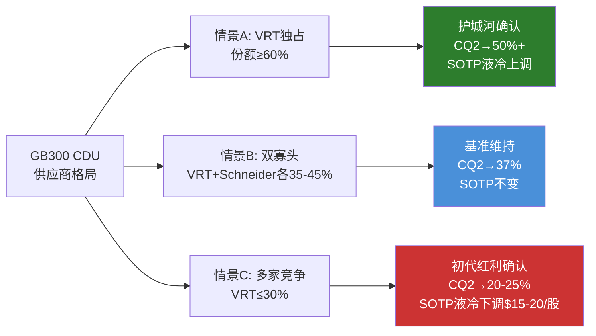
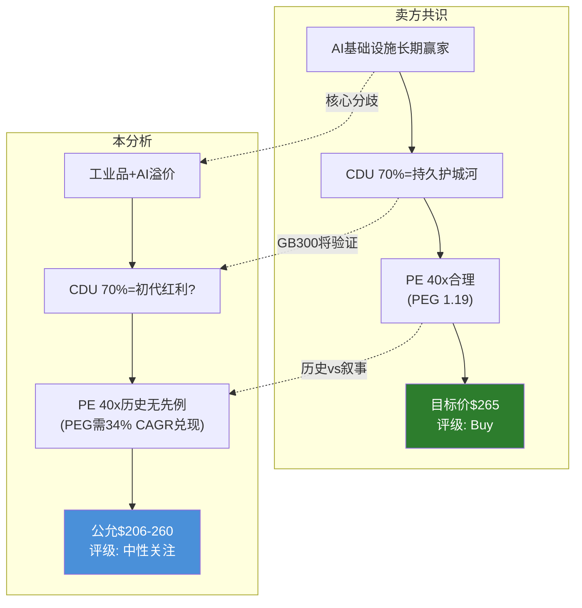

# 第三十三章 开放问题、研究局限与AI能力边界

> **章节定位**: 本章是对VRT投资论文中尚未解决的核心不确定性、分析工具的固有局限以及本分析与卖方共识差异的系统性梳理。不诚实的研究报告只呈现确定性结论；诚实的研究报告同等重视不确定性的边界。本章的目标是让读者清楚地知道：我们知道什么、不知道什么、以及"不知道"的代价有多大。
>
> **核心数据**: 股价$243.06 | 市值$93B | CQ加权43.5% | 5个开放问题 | 数据最弱环: 液冷营收$1.2B(D级)

---

## 33.1 五个未解决的开放问题

对VRT投资论文而言，以下五个问题的答案将决定当前"中性关注(条件性)"评级是否需要调整。它们按对估值影响的绝对幅度排序，每个问题都标注了"何时能回答"和"如果回答了会怎样"。

### O1: VRT液冷真实营收是多少?

**问题本质**: SOTP估值中液冷分部被赋予$31.5B估值(占SOTP总值43%)，但这个估值建立在D级数据(分析师推算$1.2B营收)之上。VRT至今不单独披露液冷收入，意味着SOTP中权重最大的分部恰恰是数据质量最差的分部。

**为什么VRT不披露**: 存在三种可能的解释。第一，会计架构限制——液冷CDU产品仍嵌入"热管理"报告分部(Americas, APAC, EMEA地理分部内)，独立会计核算尚未建立。VRT在FY25才真正开始大规模液冷出货，分部重组需要时间。第二，战略信息管理——管理层可能有意维持信息不对称。不披露液冷具体营收，可以让市场用想象力填充空白，这通常对高增长业务的估值有利。一旦公布具体数字，市场可能发现增速低于预期，或者份额数据与管理层暗示的不一致。第三，竞争考量——在与Schneider Electric和Eaton/Boyd的液冷份额争夺中，公开披露精确营收可能暴露战略弱点。[主观判断: 第二种解释的可能性最高——管理层在信息发布策略上是理性行为者]

**什么能回答这个问题**: 最直接的催化剂是2026年5月19日VRT投资者日(Investor Day)。管理层在投资者日上有可能首次给出液冷营收的分部数据或至少一个范围指引。次之，FY26 10-K中可能进行分部重组，将液冷从"热管理"中分拆为独立报告分部。最后，第三方机构(Dell'Oro, Omdia)的液冷市场报告可能提供间接验证。

**如果回答了对分析的影响**:

| 液冷真实营收 | 对SOTP的影响 | 对CQ2的影响 | 对评级的影响 |
|:----------:|:---------:|:---------:|:---------:|
| < $800M | SOTP液冷估值下调40-50% → 每股-$30-40 | CQ2下调至25-30% | 可能触发审慎关注 |
| $800M-$1.2B | SOTP基本维持 | CQ2维持37% | 评级不变 |
| $1.2B-$1.5B | SOTP小幅上调 → 每股+$5-10 | CQ2上调至40-45% | 评级不变但偏正面 |
| > $1.5B | SOTP液冷估值上调15-20% → 每股+$15-20 | CQ2上调至45-50% | 可能触发关注 |

**当前处理方式**: 使用$1.2B中间值+$0.8-1.5B宽范围做情景分析。在CQ2的43.5%加权中已隐含了对D级数据的折扣。[硬数据: VRT不单独披露液冷营收; $1.2B为多位卖方分析师的中位推算值]

---

### O2: 积压取消率实际是多少?

**问题本质**: $15B积压同比+109%是VRT最亮眼的前瞻指标，也是FY26-27收入确定性的核心支撑。但管理层从未披露积压取消率，这构成了一个有意的信息不对称。Phase 4红队(RT-3)已识别"积压是纸面富贵"的空头论点——变压器交期128周迫使客户提前2-3年锁定全部上游设备，部分积压可能是瓶颈驱动而非需求驱动。

**为什么这个问题比表面看起来更重要**: 大型数据中心项目的设备取消罚金通常仅为合同额的5-15%。[合理推断: 基于公开的DC建设合同案例] 这意味着如果2027年AI CapEx回落，客户支付罚金后取消订单的经济成本远低于接收不需要的设备。而VRT的FY26指引($13.3-13.8B)隐含积压转化率87-92%——如果积压全部真实，为什么只转化不到90%? 两种解释: (1)部分积压是2027+年交付(正常延迟)，或(2)管理层已隐性预期部分取消。

**什么能回答这个问题**: VRT开始在季度财报中披露积压取消率或净增量数据(目前仅披露总积压)。更间接地，FY26 Q1-Q2的实际积压-收入转化率将提供线索——如果转化率显著低于87-92%，积压质量问题将被确认。

**如果回答了对分析的影响**:

| 取消率水平 | 含义 | 对收入预测的影响 | 对评级的影响 |
|:--------:|------|:----------:|:---------:|
| < 5% | 积压高度真实，需求强劲 | 上调FY27E Revenue 3-5% | CQ1上调至55% |
| 5-10% | 正常范围，符合基准假设 | 维持当前预测 | 评级不变 |
| 10-15% | 偏高但可控，部分瓶颈效应确认 | 下调FY27E Revenue 5-8% | CQ1下调至40% |
| > 15% | 严重质量问题，积压"膨胀"确认 | 下调FY27E Revenue 10%+ | 可能触发审慎关注 |

**当前处理方式**: 在S3(熊市)情景中假设20%积压取消/延期($3B)，在基准S2中假设5-8%取消率。RT-3空头论点"$15B积压是纸面富贵"被登记为活跃替代假说。[合理推断: 取消率假设基于历史DC设备周期的行业经验值]

---

### O3: GB300 CDU供应商份额如何?

**问题本质**: CQ2(液冷护城河深度)的核心验证取决于下一代GPU平台GB300/Rubin的CDU供应商格局。VRT在GB200时代的CDU份额约70%(管理层声称，C级数据)，但GB300参考架构中Schneider Electric(收购Motivair)和Eaton(收购Boyd)已加入。NVIDIA作为平台架构师，有强烈动机推动供应链多元化以降低单一供应商风险。

**三种情景及其含义**:

**情景概率评估**: 情景A(VRT独占)概率约20%——NVIDIA的供应链策略历来倾向多元化(参考HBM从SK Hynix独供到三星/美光加入的路径)。情景B(双寡头)概率约55%——Schneider的全球分销网络和DC集成能力使其成为最可能的第二供应商。情景C(多家竞争)概率约25%——如果CDU技术壁垒被证明低于预期(板式换热器+泵的成熟工业技术)，Eaton/Boyd和潜在的客户自研方案将进入市场。[主观判断: 概率分配基于NVIDIA历史供应链策略和CDU技术壁垒评估]

**什么能回答这个问题**: 2026下半年GB300产品发布后的行业跟踪报告。NVIDIA对CDU合作伙伴的官方认证公告。Dell'Oro或Omdia的液冷市场份额报告。VRT在2026年5月投资者日上对GB300份额的表态。

**时间窗口**: 2026H2-2027H1。在此之前，任何关于VRT液冷护城河深度的判断都是推测。

---

### O4: AI CapEx的商业化ROI如何?

**问题本质**: B4(AI CapEx持续性)是VRT估值论文的根信念。B1(收入增速)、B2(液冷渗透)、B5(PE估值)都依赖B4。Phase 3信念反演已将B4识别为"单点故障"——其失败将通过级联传导产生超过信念本身的放大效应。而B4的存亡最终取决于一个AI行业基本面问题: 超大规模客户砸入的AI CapEx能产生多少商业化收入?

**为什么答案至今不明确**: 当前AI投资回报率数据极度匮乏。超大规模客户(AWS/Google/Meta/Microsoft)未在财报中单独披露AI相关业务的ROI或ROIC。我们只知道总CapEx($240B+ FY25四大云合计)和总收入增速，但无法解构"AI CapEx中有多少美元产生了多少AI收入"。这不是因为公司不愿意披露——更可能是因为AI CapEx与非AI CapEx在物理基础设施层面高度重叠(同一个数据中心既跑AI工作负载也跑传统云计算)，精确归因本身就有困难。

**历史类比的警示**: 1990年代末电信公司CapEx周期是最相关的历史参照。1996-2000年，电信运营商投入超过$500B建设光纤网络，在当时看来需求增长"无限"。但2001年WorldCom事件揭示光纤利用率仅约3%——绝大部分产能是"暗光纤"(dark fiber)。CapEx周期的泡沫破裂导致设备供应商(Lucent/Nortel/JDS Uniphase)市值蒸发80-95%。[硬数据: 1996-2000年美国电信CapEx约$500B; 2001年光纤利用率约3%(来源: FCC年度报告)]

**关键差异**: AI CapEx周期与电信泡沫有一个结构性区别——AI推理需求(inference)可能创造持续增量，而电信带宽需求在泡沫期已被过度前置。但"可能"不等于"确定"。在超大规模客户开始披露AI投资回报率(或AI应用收入增速显著超过CapEx增速)之前，这个差异只是假说。

**什么能回答这个问题**: 最直接的信号是超大规模客户开始在季度财报电话会议中披露AI相关收入增速或AI CapEx的回报周期。次之，AI应用层(如Microsoft Copilot、Google Gemini API)的营收增速如果持续超过AI CapEx增速(>20% CAGR)，将间接验证CapEx的商业化合理性。反之，如果2026年底AI应用收入增速放缓至<10%而CapEx仍在膨胀，"产能过剩"的叙事将开始生根。

**对VRT估值的影响路径**:

| AI ROI场景 | 对AI CapEx的影响 | 对VRT的传导路径 | 估值影响 |
|:--------:|:----------:|:--------:|:------:|
| 高ROI(CapEx回报>15%) | CapEx持续增长 | B4成立 → B1/B2/B5支撑 | S1情景概率上升 |
| 中ROI(回报8-15%) | CapEx增速放缓至+5-10% | B4部分成立 → S2基准 | 评级不变 |
| 低ROI(回报<8%) | CapEx 2028回调 | B4失败 → B1/B2/B5级联崩塌 | S3/S4概率上升 |
| 无法验证(继续模糊) | 市场继续给予信仰溢价 | 短期支撑，长期风险积累 | 维持刀锋状态 |

---

### O5: 800V HVDC对UPS的真实替代时间线?

**问题本质**: CQ3(800V HVDC架构对UPS业务颠覆)是VRT六个关键问题中"信息增量最少"的一个——整个分析过程中CQ3仅从30%微升至35%，反映的正是这个问题的高度不确定性。VRT的UPS和配电业务(传统业务的核心)FY25营收约$4.5B，占总营收44%。如果800V HVDC架构在2028-2030年成为数据中心标准，传统UPS的市场将被结构性压缩。

**技术背景**: NVIDIA在2026年下半年将推出800V参考架构，支持1MW+机架功率密度。800V HVDC(高压直流)的核心优势是消除AC-DC-AC多次转换的效率损失——传统UPS系统在电力转换中损耗约8-12%的能量，800V HVDC可将损耗降至2-4%。对于功率密度日益攀升的AI数据中心，这种效率差距意味着巨大的电力成本节约。

**非共识假说H1: "800V升级UPS而非消灭UPS"**: Phase 0.75提出的核心假说认为，800V不会消灭UPS市场，而是将其升级为更高端的800V兼容产品。逻辑链条为: (1)即使采用800V HVDC，数据中心仍需要电力备份(UPS的核心功能); (2)VRT可以开发800V兼容的新一代UPS，ASP可能更高; (3)过渡期(2028-2032)传统UPS和800V产品将共存。但这个假说目前仍无法验证——VRT尚未公布800V产品规格和定价。

**什么能回答这个问题**: VRT在2026年投资者日或后续产品发布会上公布800V兼容产品的规格、定价和客户导入时间线。NVIDIA 1MW机架的实际大规模部署节奏(2026年仅为有限部署)。第三方电力设备机构对800V HVDC渗透率的预测更新。

**时间线评估**:

| 阶段 | 时间窗口 | 800V渗透率(估计) | 对VRT UPS业务影响 |
|------|:------:|:---------:|:----------:|
| 早期采用 | 2026-2027 | < 5% | 可忽略 |
| 加速渗透 | 2028-2029 | 10-20% | 传统UPS增速放缓2-3pp |
| 主流化 | 2030-2032 | 30-50% | UPS业务需结构性转型 |
| 充分渗透 | 2033+ | 50%+ | 传统UPS市场萎缩30-50% |

**当前处理方式**: 在12-18个月论文有效期内，800V对VRT的实际财务影响可忽略(渗透率<5%)。但作为CQ3，它是一个"慢变量"——影响小但方向确定。S4极端熊市情景中假设800V在2028年标准化(加速情景)，导致UPS业务萎缩30%。[合理推断: 渗透率估计基于NVIDIA产品路线图和数据中心电力架构升级的历史周期(AC→48V DC用了15年)]

---

### 开放问题总结矩阵

| # | 问题 | 影响CQ | 数据等级 | 最早可回答时间 | 对估值最大影响 |
|---|------|:------:|:------:|:--------:|:--------:|
| O1 | 液冷真实营收 | CQ2 | D级 | 2026.5(投资者日) | ±$30-40/股 |
| O2 | 积压取消率 | CQ1 | 无数据 | 2026.4(FY26 Q1) | ±15% Revenue |
| O3 | GB300 CDU份额 | CQ2 | C级 | 2026H2 | ±$15-20/股 |
| O4 | AI CapEx ROI | CQ1 | 无数据 | 2027+ | ±35% EV |
| O5 | 800V时间线 | CQ3 | C级 | 2026H2 | 长期±$20-30/股 |

**五个问题的共同特征**: 答案全部掌握在VRT之外的实体手中——NVIDIA(O3/O5)、超大规模客户(O2/O4)、管理层的信息披露策略(O1)。这解释了为什么CQ加权置信度仅43.5%——本分析的结论高度依赖于尚未获得的外部信息。

---

## 33.2 AI分析能力边界声明

本分析由AI模型(Claude)执行，辅以MCP数据工具和系统性分析框架(v17.0)。以下是对AI分析能力边界的诚实声明——不是自我贬低，而是帮助读者校准对分析结论的信赖程度。

### 能力矩阵

**盈利质量分析**

能做到: 基于SEC公开文件(10-K/10-Q)的详细GAAP→调整后桥接、非经常项目剥离、现金流质量验证(OCF/NI、FCF/NI)。本分析在Phase 2中成功识别了VRT权证负债失真(FY24 $449M非现金损失)和递延收入暴增的双面性，这些发现直接影响了CQ4的置信度从55%升至65%。AI在处理结构化财务数据和执行规则性核查方面具有优势。

做不到: 审计级别的收入确认测试——无法验证VRT是否在积压确认中存在"填塞"(channel stuffing)行为，无法核实递延收入的真实客户构成，无法评估管理层在调整项选择上的自由裁量空间。这些需要现场审计和客户访谈。对于VRT而言，这个限制的实际影响有限——公司有四大会计师事务所审计，且FY25是PE(Platinum Equity)退出后的第一个完整财年，财务操纵的动机较低。

**竞争分析**

能做到: 基于公开信息(财报、行业报告、新闻、管理层声明)的竞争格局建模。本分析在Phase 1中构建了VRT vs Eaton vs Schneider的三维对比(产品覆盖/AI纯度/地理分布)，并在Phase 4中提出了"CDU份额是初代红利"的替代假说。AI在信息综合和模式识别(历史类比)方面具有比较优势。

做不到: 客户级别的订单簿验证——无法确认VRT声称的CDU 70%份额是否准确(C级数据)，无法获取超大规模客户的供应商评审结果，无法评估VRT与Schneider/Eaton在GB300项目中的实际竞争态势。真正的买方研究需要与VRT、Schneider、NVIDIA的采购团队、数据中心运维人员进行深度访谈。这是本分析与人类买方分析师的最大差距。

**估值分析**

能做到: 多方法交叉验证(Reverse DCF + SOTP + PEG + 概率加权)和信念反演(反推市场隐含假设)。本分析在Phase 3中识别了市场隐含FCF CAGR 30-35%显著高于共识EPS CAGR 25%的缺口，这是一个非平凡的发现。四情景概率加权和WACC/概率敏感性分析提供了估值的"置信区间"而非单一目标价，这是AI系统性分析的强项。

做不到: 精确到±5%的目标价——本分析的公允价值区间为$206-$260(宽度26%)，概率加权价值$235的误差带可能高达±15%。核心限制来自WACC的不确定性(9%-11%区间内估值差异超过40%)和情景概率的主观性(S3从30%到42%即可翻转评级)。声称能精确估值VRT是不诚实的——这是一个估值不确定性极高的公司。

**技术分析**

能做到: 液冷(CDU)、800V HVDC、数据中心电力架构等技术路线的框架级理解。本分析在Phase 1中准确描述了CDU的工作原理、VRT的产品线(Liebert XDU 1350、MegaMod HDX)以及800V架构的效率优势。AI能够阅读和综合大量技术文档和产品规格。

做不到: 工程级别的产品竞争力评估——无法判断VRT的CDU在热交换效率、可靠性(MTBF)、流量均匀性等工程参数上是否真正领先于Schneider/Motivair和Eaton/Boyd的方案。无法评估VRT的800V产品开发进度是否真正领先。这些需要专业热力学/电力工程背景和产品实测数据。

**红队对抗**

能做到: 识别认知偏差(本分析检测到锚定/过度自信/幸存者偏差3项)、构建替代解释(CDU初代红利、积压瓶颈膨胀、GM暂时性溢价3个)、提供对称的多空论证。红队七问框架(RT-1~RT-7)确保了系统性覆盖而非随机挑刺。

做不到: 完全消除分析者的信息局限。红队的CQ平均变动仅2.5pp(边界有效)——这部分因为Phase 3估值分析本身已较审慎(公允价值$216<市价$243)，部分因为AI红队在信息集相同的条件下，难以突破信息本身的天花板。红队的真正价值在于5个新质性发现，而非量化校正。人类红队(特别是熟悉VRT或Schneider的行业专家)可能产出远高于2.5pp的量化校正。

### 能力边界综合评估

| 维度 | AI优势程度 | 最大盲区 | 对本分析结论的影响 |
|------|:--------:|---------|:----------:|
| 盈利质量 | 高 | 审计级验证 | 低(公开数据充足) |
| 竞争分析 | 中 | 客户订单簿 | **高**(CDU份额无法验证) |
| 估值 | 中-高 | WACC敏感性 | 中(已通过宽区间处理) |
| 技术分析 | 中-低 | 工程级评估 | 中(技术壁垒判断可能有误) |
| 红队 | 中 | 信息天花板 | 中(质性贡献>量化贡献) |

---

## 33.3 本分析与卖方报告的差异

### 共识对比

| 维度 | 华尔街共识 | 本分析 |
|------|---------|--------|
| 评级 | Buy/Overweight(多数) | 中性关注(条件性) |
| 目标价范围 | $145-$285(分析师分散) | $206-$260(公允价值区间) |
| 目标价中位数 | ~$265 | $235(概率加权) |
| 核心叙事 | AI基础设施长期赢家 | 工业品公司享受AI溢价, 溢价可持续性存疑 |
| 液冷护城河 | 强(多数看好份额维持) | 偏弱(初代红利假说) |
| PE估值 | 合理(PEG支撑) | 偏高(历史无先例) |
| 主要风险 | 执行风险/竞争 | AI CapEx单点故障/PE均值回归 |

**核心分歧1: 估值哲学**

卖方共识倾向于使用正向DCF("VRT值多少钱")——输入增长假设，输出目标价。本分析反向而行，使用逆向估值优先("$243在赌什么")——先反推隐含假设，再评估假设合理性。两种方法的结论差异显著: 正向DCF在乐观假设下容易论证$280-300+的目标价，而逆向估值揭示$243已经几乎完全定价了共识预期(隐含FCF CAGR 30-35%)。

**核心分歧2: 液冷护城河判断**

多数卖方报告将VRT的CDU 70%份额视为"技术领先+NVIDIA独家合作"的持久护城河，并将其作为Buy评级的核心支撑。本分析在Phase 4红队中提出了替代解释: 70%份额更可能是GB200初代供应商红利(类似iPhone初代仅富士康)，而非持久竞争优势。CDU的核心技术(板式换热器+泵+管路)是成熟工业技术，技术壁垒有限。这个分歧的分辨信号是GB300 CDU供应商名单(2026H2)。

**核心分歧3: PE可持续性**

卖方用PEG 1.19(PE 40.6x / EPS CAGR 34%)论证估值合理。本分析提出两个挑战: (1)工业品公司历史上从未长期维持35x+的PE(唯一例外ASML拥有光刻机垄断地位，VRT不具备此等不可替代性); (2)PEG 1.19需要34% EPS CAGR持续兑现，如果实际CAGR降至20%，PEG将飙升至2.0x——从"便宜"变为"昂贵"。

### 三个非共识发现

| # | 非共识假说 | 共识看法 | 本分析立场 | 验证时间 | 当前置信度 |
|---|---------|---------|---------|:------:|:--------:|
| H1 | 800V升级UPS而非消灭UPS | 800V是UPS的长期威胁 | 两者皆有可能, 仍无法验证 | 2028+ | 35% |
| H2 | 20%+积压存在取消/延期风险 | 积压高度真实 | 空头论点有一定数据支撑 | 2026 Q1-Q2 | 40% |
| H3 | VRT PE 12-18月内向Eaton收敛 | PE溢价可维持 | 历史论证支持收敛 | 12-18月 | 45% |

**值得强调的是**: 本分析不认为卖方共识"错了"。在AI CapEx超级周期持续(S1情景)下，$265目标价完全可能实现。分歧的本质在于概率分配——卖方隐含S1+S2合计概率约75-80%，而本分析将S1+S2设为60%(S3 30% + S4 10%)。这个差异源于对AI CapEx单点故障风险的不同权重: 本分析认为市场对B4(AI CapEx持续性)失败的定价不足(隐含仅15%概率)。

---

# 第三十四章 一页纸结论与三条不依赖估值的洞见

> **章节定位**: 本章是全报告34章的终章收束。目标是: (1)将分散在Phase 1-5中的发现浓缩为一页纸可读的投资摘要; (2)提炼三条无论估值模型输出什么都成立的可操作洞见; (3)回顾研究方法论; (4)声明免责。
>
> **核心结论**: 评级"中性关注(条件性)" | 公允价值$206-$260 | 概率加权$235 | 期望回报+3% | 安全边际约等于零

---

## 34.1 VRT投资摘要(扩展版)

### 公司定位

Vertiv Holdings(NYSE: VRT)是全球数据中心电力与冷却基础设施的领先供应商，在UPS(不间断电源)市场全球排名第二(仅次于Schneider Electric)，在数据中心精密空调市场排名第一(23.5%份额, Omdia数据)，在NVIDIA AI服务器液冷CDU(冷却液分配单元)市场占有率约70%(管理层声称, C级数据)。[硬数据: FY2025营收$10,230M, 调整后EPS $4.17, FCF $1,894M, 积压$15B]

公司正处于AI CapEx超级周期的甜蜜期——FY25营收同比+28%，积压同比+109%，FY26指引$13.25-13.75B(+30-35%)。这些数字是真实的: FCF转化率1.42x验证了盈利质量, VOS(Vertiv Operating System)驱动的利润率扩张(GM从FY22 24.6%→FY25 34.4%)是系统性的而非偶然的。然而，VRT本质上仍然是一家85%营收来自传统工业品(UPS/配电/精密空调)的制造商，市场却以AI基础设施的估值(PE 40.6x Forward)为其定价。这个身份矛盾——"工业品身体、AI估值外衣"——是理解VRT投资论文的起点。

### 看多论点

**FY26-27收入高度确定**: $15B积压+$13.6B FY26指引意味着未来12-18个月的收入可见度极高。即使假设10%积压取消(悲观假设), FY26收入仍可达$12.2B(+20% YoY)。在所有工业品公司中, VRT的近期收入确定性几乎无出其右。管理层在FY24和FY25均实现了指引上调, 执行信用良好。[硬数据: FY24指引上调3次; FY25全年超指引上限]

**盈利质量经验证为强**: Phase 2的详细剥离分析确认, FY25调整后增长36-46%是真实的(非权证负债等非现金项目驱动)。FCF转化率1.42x(每$1净利润产生$1.42自由现金流)在工业品公司中属于优秀水平。SBC仅占营收0.45%, 意味着FCF对股东的稀释极小。递延收入从$1,063M增长至$1,815M(+71%), 反映客户预付意愿强, 这是定价权的直接证据。[硬数据: FY25 OCF $2,114M, CapEx $220M, FCF $1,894M]

**VOS驱动利润率扩张有系统性基础**: VRT的毛利率从FY22的24.6%提升至FY25的34.4%, 跨越了供应链危机(2022)和通胀高企(2023)两个逆风周期, 这证明VOS不是周期性因素而是结构性改善。管理层2029年目标Adj.OP 25%在当前路径上可达(FY25已达20.4%)。即使供需缓解导致毛利率从Q3'25峰值37.8%回落, 底部可能在32-33%(非24.6%), 相当于永久性提升了成本结构。[合理推断: VOS效率改善的不可逆性基于精益制造的行业经验——一旦消除的浪费不会自动恢复]

**S&P 500纳入是近期催化剂**: Polymarket显示VRT在2026年3月S&P 500纳入概率约66.5%。纳入将带来被动指数基金的一次性买入需求(估计$3-5B, 约占流通市值3-5%), 短期推动股价+5-10%。即使未纳入, 影响预计仅-5%(预期已部分计入)。这是一个正面不对称的催化剂。[硬数据: Polymarket S&P 500纳入概率66.5%]

**传统DCPI业务提供$170价值底部**: SOTP分析显示, VRT的传统业务(UPS/配电/传统热管理/服务)按工业品倍数估值约$42B(每股约$110)。加上液冷业务的保守估值($23-25B), VRT在AI叙事完全失败的情景下仍有约$170/股的底部价值。这不是一家会归零的公司——它拥有全球300+服务中心、4,400+现场工程师和长期客户关系, 这些资产在任何情景下都有实质价值。[合理推断: $170底部基于传统业务15-18x EBITDA + 液冷残值]

### 看空论点

**PE 40x+对工业品历史无先例**: 过去20年, 没有任何工业品公司在连续3年以上维持35x+的PE。最接近的例子是ASML, 但ASML在EUV光刻机领域拥有绝对垄断地位(全球100%份额), VRT的液冷CDU远不具备此等不可替代性。如果市场在12-18个月内将VRT重新归类为"周期受益者"(而非"结构性增长者"), PE可能向Eaton水平(28x)收敛, 即使EPS不变也意味着股价下跌30%。Phase 4红队的"VRT是周期股"假说是最具杀伤力的空头论点。[硬数据: Eaton PE 30.2x, Schneider PE ~28x; 工业品20年PE中位数15-25x]

**概率加权估值$235约等于市价(安全边际约等于零)**: Phase 3的四情景概率加权(S1:20%@$402 + S2:40%@$258 + S3:30%@$150 + S4:10%@$63)得出$235, 仅比市价$243低3%。这意味着在当前价格买入不是"买低估", 而是"以公允价格(甚至略高于公允价格)参与AI基础设施周期"。加上Phase 4红队偏差校正后, 估值可能进一步下调至$206-$209。安全边际不足是"中性关注"评级的最直接原因。

**AI CapEx是单点故障**: B4(AI CapEx持续性)是根信念, B1(收入)、B2(液冷)、B5(PE)都依赖B4。如果超大规模客户在2028年削减CapEx(历史上没有超过5年不回调的CapEx周期), B4失败将通过级联效应导致: 收入增速下降(B1) → 液冷需求放缓(B2) → PE压缩(B5) → 三重打击可能导致股价下跌40-60%。历史类比: 2000年TMT泡沫后设备股跌幅60-95%, 2015年云建设周期后设备股回调25-30%。[合理推断: 级联传导幅度基于Phase 3信念一致性矩阵分析]

**液冷70%份额大概率是初代红利**: Phase 4红队(RT-7)的替代解释论证了CDU 70%份额是GB200初代供应商红利(类似iPhone初代仅富士康代工, 后扩展至立讯/和硕)。CDU的核心技术(板式换热器+泵+管路)是成熟工业技术, 不是专利保护的创新。NVIDIA有供应链多元化的核心利益, GB300参考架构中Schneider(Motivair)+Eaton(Boyd)的加入已证明这一点。CQ2从初始45%下降至最终37%, 反映了分析过程中对液冷护城河判断的逐步修正。

**GM 37.8%可能含暂时性供需溢价**: Q3'25毛利率37.8%是VRT历史最高——但高利润率是否可持续? Phase 4红队(RT-7)提出替代解释: 类似2021年半导体短缺时的超额利润, 当供需恢复平衡(变压器交期从128周缩短)后, VRT的定价权可能削弱。如果FY27 GM回落至32-33%, 调整后EPS将低于共识5-8%。

### 核心矛盾

市场以AI基础设施估值(PE 46x TTM调整后)为一个85%传统工业品公司定价。15%的AI业务(液冷)驱动了100%的估值溢价。这个溢价能否维持取决于两个问题——AI CapEx周期能持续多久? VRT能保持多少液冷份额? 截至本分析时点, 这两个问题的答案都处于高不确定性区域(CQ1 48%, CQ2 37%)。

---

## 34.2 关键数值总览表

| 指标 | 数值 | 来源/说明 |
|------|------|---------|
| **评级** | **中性关注(条件性)** | 期望回报+3%, 位于-10%~+10%区间 |
| 公允价值区间 | $206-$260 | 三锚加权+红队校正 |
| 概率加权价值 | $235(校正后$209-235) | 四情景加权+偏差校正 |
| 12月期望回报 | +3% | 概率加权$250 vs 市价$243 |
| SOTP底部 | $170 | 传统业务$110 + 液冷保守估值 |
| 下行保护 | -30% | 市价$243 → SOTP $170 |
| CQ加权置信度 | 43.5% | 6个CQ加权平均(Phase 4校准后) |
| 方法离散度 | 1.43x | SOTP $189 / PEG中值$270 |
| 情景离散度 | 6.38x | S1 $402 / S4 $63 |
| 论文有效期 | 12-18个月 | 超过18月技术路线+竞争格局变化大 |
| 最脆弱信念 | B4 AI CapEx持续性 | 脆弱度60分(满分125), 与B5并列第一 |
| 最近催化剂 | S&P 500纳入(3月, 66.5%) | Polymarket概率 |
| Kill Switch数 | 6个 | KS-1(AI CapEx崩塌)最重要 |
| 跟踪信号数 | 7个 | TS-1(超大规模CapEx增速)最关键 |
| 开放问题数 | 5个 | O1(液冷营收)对估值影响最大 |
| 数据最弱环 | 液冷营收$1.2B(D级) | 分析师推算, VRT不单独披露 |
| 黑天鹅累计加权损失 | -13.3% | 5个黑天鹅事件概率加权 |
| 评级翻转所需 | S3概率+12pp(至42%) | 或WACC+150bps(至11%) |

### 条件性评级触发器

| 条件 | 评级调整方向 | 触发CQ |
|------|:--------:|:------:|
| AI CapEx FY27+维持+15% | 上调至"关注" | CQ1 |
| AI CapEx FY27-28回调>20% | 下调至"审慎关注" | CQ1 |
| 液冷营收确认>$1.5B | CQ2上调, 评级偏正面 | CQ2 |
| GB300 CDU VRT份额<30% | CQ2大幅下调 | CQ2 |
| FY26 Q1 Revenue miss指引>5% | 重新评估整体论文 | CQ1/CQ4 |
| WACC环境变化至11%+ | 自动触发审慎关注 | CQ5 |

---

## 34.3 三条不依赖估值的可操作洞见

无论VRT"值"$200还是$280, 无论使用哪种估值方法, 以下三条发现对投资决策均有独立价值。它们不依赖于WACC选择、概率分配或PE倍数假设。

### 洞见1: FY26 Q1是论文存亡的关键验证点

**核心论证**: VRT的投资论文高度依赖积压→收入的转化效率。$15B积压+$13.6B FY26指引意味着FY26的收入几乎完全由已有订单支撑。FY26 Q1(预计2026年4月发布)将是第一个验证这一链条的财报。如果FY26 Q1 Revenue miss指引>5%(即季度收入<$3.1B, 对应年化$12.4B, 低于指引下限$13.25B), 整个积压→收入转化的逻辑将被质疑。

**历史类比验证**: 在2015年云建设周期中, 数据中心设备公司首次miss季度指引后, 股价平均在30天内下跌25%。更重要的是, 首次miss往往不是孤立事件——后续2-3个季度通常继续miss(下修惯性)。这是因为miss指引通常反映的不是随机噪音, 而是需求变化的早期信号。[合理推断: 2015年案例包括Eaton DC部门和Emerson电气]

**为什么Q1比后续季度更重要**: FY26 Q1是VRT从"指引"到"执行"的第一次考试。管理层在2026年2月给出$13.25-13.75B指引时, 对Q1的可见性最高(积压+订单簿)。如果连可见性最高的Q1都miss, 意味着要么积压质量有问题(取消/延期), 要么宏观环境(AI CapEx)已开始变化。无论原因如何, Q1 miss将是一个高信息量的二元信号。

**观测方法与应对策略**: 2026年4月FY26 Q1财报发布。重点关注: (1)总收入 vs 季度化指引; (2)积压环比变化(净增量还是消化>新增); (3)管理层是否维持/上调/下调全年指引。Q1 beat → 论文强化, 可上调CQ1至55%。Q1 miss >5% → 论文受损, 下调CQ1至35%并重新评估评级。

### 洞见2: CDU供应商格局在GB300/Rubin确定后才能判断

**核心论证**: VRT投资论文中液冷相关的所有判断(CQ2置信度37%, SOTP液冷估值$31.5B, 非共识假说H1/H3)都建立在一个前提上——VRT在下一代GPU平台的CDU供应商地位。但GB300/Rubin的CDU供应商格局在2026H2之前是未知数。在此之前, 任何关于VRT液冷护城河深度的判断(无论看多还是看空)都是推测。

**关键观测点**: GB300 CDU供应商名单的官方公布(预计2026H2)。NVIDIA通常在新GPU平台发布前6-12个月确定关键组件供应商, 并在产品发布时通过参考架构公开。GB200的CDU参考架构中VRT是唯一列名的供应商, 而GB300参考架构草案已将Schneider(Motivair)和至少一家第三方加入。

**三种结果的含义与应对**:

| 结果 | 含义 | 对CQ2影响 | 对估值影响 | 应对策略 |
|------|------|:--------:|:--------:|---------|
| VRT独占(≥60%) | 护城河确认, 初代红利假说被否定 | CQ2→50%+ | SOTP液冷上调$10-15/股 | 上调至"关注" |
| 双寡头(VRT+Schneider各35-45%) | 基准情景, 符合Phase 1-4预期 | CQ2维持37% | SOTP不变 | 评级不变 |
| 多家竞争(VRT≤30%) | 初代红利确认, 护城河浅于预期 | CQ2→20-25% | SOTP液冷下调$15-20/股 | 下调至"审慎关注" |

**为什么在2026H2之前不宜过早下结论**: VRT目前正在进行CDU产能扩张(45倍扩产), 而Schneider整合Motivair需12-18个月。在整合完成前, VRT的产能和交付能力仍是明确优势。用2025年的产能竞争格局推断2027年的市场份额是错误的——但用2027年的预期份额否定2025年的竞争优势同样是错误的。正确的做法是承认不确定性, 等待数据。

### 洞见3: VRT传统业务是被忽视的价值锚

**核心论证**: 在围绕VRT的讨论中, 市场注意力几乎完全集中在液冷/AI叙事上。但VRT 85%的营收来自传统业务——UPS、配电、精密空调和服务。这些业务在数据中心建设的任何情景下(无论是否与AI相关)都是必需品。SOTP分析显示, 按工业品同业倍数(Eaton/Schneider), VRT传统业务的合理估值约$42B(每股约$110)。

**"看不见的底部"的估值逻辑**:

| 传统业务分部 | FY25E营收 | FY28E EBITDA | 倍数(同业参考) | 估值 |
|:--------:|:------:|:---------:|:--------:|:---:|
| UPS/配电 | ~$4.5B | ~$1,100M | 18x(Eaton UPS) | $19.8B |
| 传统热管理 | ~$3.5B | ~$850M | 16x(工业HVAC) | $13.6B |
| 服务 | ~$1.0B | ~$375M | 22x(经常性收入) | $8.3B |
| **传统小计** | **~$9.0B** | **~$2,325M** | | **$41.7B** |
| 每股 | | | | **~$110** |

加上液冷业务的保守残值($60-70/股, 即使份额大幅下降), VRT的SOTP底部约$170/股——比市价$243低30%, 但远非灾难性。

**与Eaton/Schneider的传统业务对比**: Eaton的电力管理部门(与VRT传统业务最可比)以约18-20x EV/EBITDA交易, Schneider的能源管理部门以约16-18x交易。VRT的传统业务在产品覆盖和市场地位上与这两家相当(UPS全球#2, 空调#1), 使用相近倍数估值合理。

**为什么S4极端熊市$63需要多重灾难同时发生**: 要达到$63/股(比传统业务价值$110还低40%), 需要: (1)AI CapEx崩塌40%+ (2)800V在2028年标准化 (3)利润率回落至16-18% (4)PE压缩至18x。这四个负面事件同时发生的联合概率不超过10%——而即使在这个极端情景下, VRT仍不会归零, 因为其服务业务($8.3B估值)具有经常性收入特征。

**这条洞见对不同投资者的意义**:
- 对多头: $170底部限制了持仓的最大亏损(当前价-30%), 提供了风险管理的参考点
- 对空头: VRT不是一个好的做空标的, 因为传统业务价值提供了估值地板
- 对观望者: 如果VRT因AI叙事恶化而跌至$170-180, 传统业务价值将提供有吸引力的入场点

---

## 34.4 研究方法论回顾

### 框架概述

本报告采用v17.0投资研究框架, 按5个Phase系统推进:

| Phase | 内容 | 核心产出 | 章节 |
|:-----:|------|---------|:----:|
| Phase 0/0.5/0.75 | 预取数据 + CQ路由 + 核心矛盾结晶 | 6个CQ + thesis_crystallization | Ch1-Ch3 |
| Phase 1 | 公司画像 + 业务拆解 + 竞争格局 | 身份矛盾 + 液冷护城河初判 | Ch4-Ch13 |
| Phase 2 | 财务深挖 + 盈利质量 + 竞争动态 | 盈利真实性验证 + 供应链约束 | Ch14-Ch18 |
| Phase 3 | 估值反演 + SOTP + 多情景 + 同业比较 | Reverse DCF + $206-260公允区间 | Ch19-Ch24 |
| Phase 4 | 红队七问(RT-1~RT-7) + 双向校准 | 5个新发现 + CQ最终值 | Ch25-Ch32 |
| Phase 5 | 综合评级 + 跟踪信号 + 开放问题 | 中性关注(条件性) | Ch33-Ch34 |

### 可能性宽度与模式选择

Phase 0完成后, 对VRT的"可能性宽度"评估为4.8分(0-10), 触发混合模式——传统估值(SOTP/DCF/PEG → 目标价区间+评级)与可能性附录(开放问题+非共识假说+条件评级)并行。选择混合模式的原因: VRT的传统业务(85%)适用传统估值, 但液冷/AI业务(15%)的不确定性和非线性潜力要求保留可能性空间。

### CQ生命周期追踪

6个CQ(Core Questions)从Phase 0.5开始登记, 在每个Phase完成后更新, 构成分析的"注意力分配系统":

| CQ | 权重 | P0.5→P4轨迹 | 分析注意力 |
|----|:----:|:--------:|:--------:|
| CQ1 AI CapEx | 25% | 40→50→55→50→48 | 最多(根信念) |
| CQ2 液冷护城河 | 25% | 45→45→40→40→37 | 第二多(核心分歧) |
| CQ3 800V HVDC | 10% | 30→35→35→35→35 | 最少(信息增量低) |
| CQ4 盈利质量 | 20% | 55→60→70→70→65 | 中等(Phase 2重点) |
| CQ5 估值合理性 | 15% | 35→35→35→30→25 | 第三多(Phase 3重点) |
| CQ6 并购整合 | 5% | 60→65→70→70→70 | 最少(风险低) |

### 数据可信度体系

本报告使用DM(Data Matrix)三层标注:
- **[硬数据:]** — SEC文件、FMP数据、公开财报中的精确数字
- **[合理推断:]** — 基于硬数据的推算, 逻辑链可追溯, 误差可控
- **[主观判断:]** — 分析师的定性评估, 受认知偏差影响, 需读者独立判断

数据质量等级从A(SEC审计数据)到D(分析师推算), 本报告最弱数据点为D5(液冷营收$1.2B, D级)和D3(CDU份额70%, C级)。这两个数据点恰恰支撑了SOTP中权重最大的分部估值——这是本分析最大的结构性弱点。

### 34章结构总览

本报告从Phase 0的公司身份界定出发, 经历业务拆解(Phase 1)→盈利质量验证(Phase 2)→估值反演(Phase 3)→红队对抗(Phase 4)→综合评级(Phase 5), 共34章, 涵盖了一家处于AI CapEx超级周期中的工业品公司的完整投资分析。报告的核心价值不在于给出"$235目标价"这个单一数字, 而在于: (1)系统性映射了影响VRT估值的6个关键问题及其置信度; (2)构建了可动态更新的跟踪系统(7个TS + 6个KS); (3)诚实标注了分析的能力边界和数据弱点。

---

## 34.5 免责声明

本报告仅供研究参考, 不构成任何投资建议或证券推荐。

所有数据和分析基于公开信息, 作者不保证其准确性、完整性或时效性。报告中使用的财务数据来源包括SEC EDGAR公开文件、FMP金融数据平台、公司季度/年度财报、卖方分析师共识估计和行业研究报告。部分关键数据(如液冷营收$1.2B)为分析师推算值(D级), 未经VRT管理层确认。

本分析中的"评级"(中性关注/关注/审慎关注等)仅反映分析师基于公开信息和系统性框架的主观判断, 不构成证券的"买入"、"卖出"或"持有"推荐。评级的条件性说明意味着评级可能随新信息的出现而调整。

投资者应独立判断并承担投资风险。股票投资涉及本金损失风险, 过往业绩不代表未来表现。本报告的估值区间($206-$260)和概率分配均包含显著的不确定性, 实际结果可能大幅偏离分析师预期。

数据截止日期: FY2025(2025-12-31)。股价基准: $243.06(2026-02-20)。分析框架版本: v17.0。

---

*VRT Phase 5 扩写 — 第三十三至三十四章 | 开放问题+研究局限+AI能力边界+一页纸结论*
*评级: 中性关注(条件性) | 公允价值$206-260 | CQ 43.5% | 论文有效期12-18月*
*核心信息: 五个开放问题的答案掌握在VRT之外的实体手中 | 安全边际约等于零 | 传统业务提供$170价值锚*
