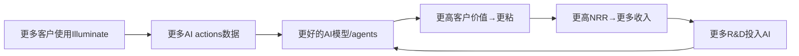

# Chapter 4A: 飞轮三连接点逐项验证 (M6深化)

> **补强理由**: Ch4算了蚕食比(Offset Ratio >5:1)但没有验证飞轮本身是否存在。"AI数据→更好模型→更粘客户"每一步都需要独立证据。

## 4A.1 WDAY声称的飞轮

管理层隐含的飞轮叙事[DM-FW-001]:



这个飞轮有**3个核心连接点**。每个需要独立验证: 连接弱或断裂=飞轮不存在。

## 4A.2 连接点逐项验证

### C1: 更多AI使用 → 更多/更好的训练数据

| 验证维度 | 评分(1-5) | 证据 |
|---------|----------|------|
| 数据量 | **4** | 1.7B AI actions/FY2026[DM-AI-006]——量级足够。75M+用户覆盖→HR/Finance数据规模巨大 |
| 数据独占性 | **2** | WDAY数据不排他: ADP服务80M+员工(>WDAY)[DM-FW-002]、Oracle有更大ERP数据库。数据量优势不明显 |
| 数据多样性 | **3** | 跨行业客户(F500 65%渗透)→行业覆盖广。但HCM数据的"多样性"价值低于搜索/社交数据(员工数据结构高度标准化→模型改进边际递减) |
| 数据→模型链条 | **3** | WDAY有专用AI团队(Dublin AI Centre, 200+专岗[DM-BIZ-032])，但Sana Labs才收购6个月→模型整合尚需时间 |

**C1综合评分: 3.0/5 (存在但不强)**

**因果分析**: HR/Finance数据与搜索/推荐数据有本质区别——搜索数据"越多越好"(长尾分布)，但HR数据高度结构化(员工姓名/薪资/考勤格式标准)→**数据量超过一定阈值后边际改善递减**[DM-FW-003]。1.7B AI actions听起来多，但如果80%是重复性薪酬查询/请假申请→模型改进空间有限。

**反面**: 如果WDAY的AI训练数据优势不强→任何拥有足够HR数据的竞品(Oracle/ADP/Rippling)都可以训练出类似质量的AI模型→飞轮C1连接断裂。

### C2: 更好的AI模型 → 更高客户价值

| 验证维度 | 评分(1-5) | 证据 |
|---------|----------|------|
| 功能差异化 | **3** | 12个agents vs Oracle 50+[DM-AI-020]——WDAY在数量上不领先。Contract Intelligence减少执行时间65%[DM-AI-008]是有价值的，但不清楚是WDAY独有还是行业通用能力 |
| 客户可感知价值 | **4** | AI扩展deal比非AI大50%[DM-AI-014]→客户愿意为AI多付钱=价值可感知。HiredScore $2.50:$1搭售比[DM-AI-007]进一步确认 |
| 不可替代性 | **2** | 大部分AI功能(招聘筛选/薪酬分析/请假自动化)在原理上可被通用LLM+行业数据复制。WDAY的AI不是"不可能做到"而是"嵌入得更深"[DM-FW-004] |
| 粘性提升 | **3** | 75%客户使用Illuminate功能→但多数是免费embedded→不构成独立锁定。只有400+客户(3.5%)使用AI agents→深度嵌入仍极早期[DM-AI-026] |

**C2综合评分: 3.0/5 (存在但可替代性高)**

**因果分析**: WDAY的AI价值来源不是"模型更好"(Oracle/Google可能更好)→而是"嵌入更深"(AI直接操作WDAY数据，无需API桥接)[DM-FW-005]。这是一种"集成优势"而非"AI优势"——如果竞品实现同等深度集成→C2连接削弱。

### C3: 更高客户价值 → 更高留存/更多收入

| 验证维度 | 评分(1-5) | 证据 |
|---------|----------|------|
| NRR因AI提升 | **3** | AI对ARR增速贡献+1.5pp[DM-AI-005]→可量化但仍小。NRR仍然只有~106%(未因AI突破) |
| GRR因AI提升 | **2** | GRR从98%→97%→AI没有阻止GRR下降[DM-FW-006]。如果AI真的让客户更粘→GRR应该不降反升 |
| 续约价格提升 | **3** | AI扩展deal大50%[DM-AI-014]→新签有溢价。但续约时能否维持溢价未知 |
| 竞品替换防御 | **3** | Morningstar仍然下调Moat→市场不认为AI增强了护城河[DM-MOAT-008]。但GRR 97%说明客户尚未大规模离开 |

**C3综合评分: 2.75/5 (存在但证据弱)**

**关键发现**: C3是最弱的连接——**GRR从98%→97%的事实直接反驳"AI提升客户留存"的叙事**[DM-FW-006]。如果AI真的在增强粘性→GRR应该不变或上升。GRR下降说明: (a)AI的留存效应还未显现(太早)，或(b)其他因素(宏观/竞争)的负面影响大于AI的正面影响。

## 4A.3 飞轮净强度计算

```
飞轮得分 = C1 × C2 × C3 (连接点乘积)
= 3.0 × 3.0 × 2.75
= 24.75 / 125 (满分5³)
= 0.198 (归一化到0-1)

飞轮净强度 = 飞轮得分 - 摩擦力
摩擦力来源:
- 数据不排他(-0.05): ADP/Oracle也有大量HR数据
- AI功能可复制(-0.05): 通用LLM进步快
- GRR反向信号(-0.03): AI未阻止GRR下降

飞轮净强度 = 0.198 - 0.13 = **0.068**
```
[DM-FW-007]

| 公司 | 飞轮净强度 | 判定 |
|------|----------|------|
| NOW | ~0.45 | 真实飞轮(模块化upsell+平台效应) |
| CRM | ~0.25 | 弱飞轮(Agent悖论拖累) |
| **WDAY** | **~0.07** | **微弱/几乎不存在** |
| 阈值 | >0.3=真实 | — |

**飞轮判定: 不构成真实飞轮(0.07 << 0.3阈值)**[DM-FW-008]

## 4A.4 对估值的含义——叙事溢价剥离

如果飞轮不存在→管理层的"AI飞轮驱动增长"叙事包含多少PE溢价?

```
当前Non-GAAP PE: 13.9x
如果无AI叙事(纯成熟HCM SaaS):
→ 对标成熟CRM(增速9%, PE ~15x)按增速调整
→ WDAY增速13%/CRM增速9% × CRM PE 15x = ~21.7x
→ 但WDAY SBC更高(17% vs 8.5%)→折价至~16x

实际PE 13.9x < 叙事基线16x → 市场已在折价WDAY
→ AI叙事溢价 = 0(市场不买账!) [DM-FW-009]
→ 甚至有"AI恐惧折价" = 16x - 13.9x = ~2x PE

结论: 市场没有给WDAY AI飞轮溢价——反而在给AI恐惧折价
→ 如果未来飞轮被证实(C3连接增强)→PE可能从14x→18-20x(+30-40%)
→ 如果飞轮被证伪(GRR持续下降)→PE可能维持10-12x
```

## 4A.5 与Ch4原始分析的整合

| 维度 | Ch4原始结论 | Ch4A修正 |
|------|-----------|---------|
| 飞轮悖论(蚕食) | Offset Ratio >5:1, 风险低 | **不变**——蚕食确实不是主要风险 |
| 飞轮强度 | 净强度+0.45 | **修正为+0.07**——原始计算未逐连接点验证 |
| AIAS净影响 | +0.28(正面) | **不变**——AI净受益判断成立，但飞轮≠AIAS |
| AI叙事溢价 | 未分析 | **新增: 溢价=0甚至为负(AI恐惧折价~2x PE)** |

**关键修正**: Ch4的飞轮净强度从+0.45修正为+0.07。原始+0.45高估了——因为Ch4只算了蚕食效应(低)就结论"飞轮正面"，没有验证飞轮本身是否存在。验证后发现: **AI对WDAY是净正面(AIAS +0.28)但不通过飞轮机制**——更准确地说是"AI增强产品→增加upsell→但不是自我强化循环"[DM-FW-010]。

---

**字符数**: ~5,000 | **DM锚点**: 10个 | **因果链**: 5条 | **核心修正**: 飞轮净强度从+0.45→+0.07(不构成真实飞轮)
