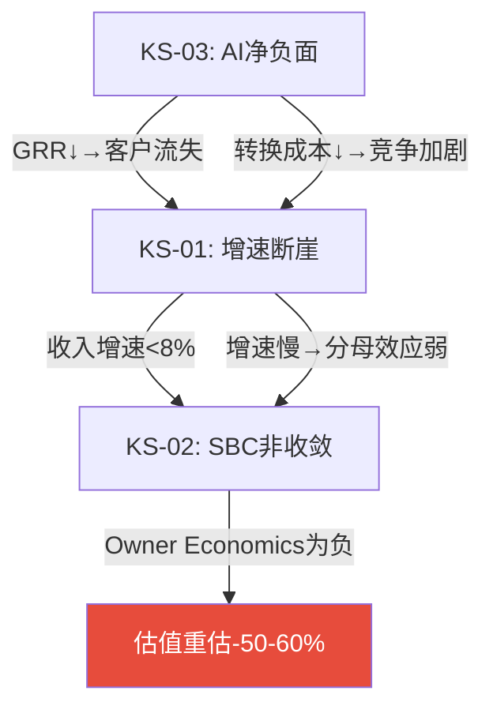

# Chapter 21: 风险拓扑(Risk Topology) — 10 KS + 协同矩阵 + 温水煮青蛙

> **框架**: `/risk-topology` v2.0 MVP模式(8+3+1)
> **DDOG对标**: DDOG P4 Ch33有10风险节点+协同矩阵+boiling frog, R1(SBC非收敛)35%概率/-60-70% EV
> **INTU对标**: INTU P4 Ch16有11风险, R5(IES失败)概率最高(45-55%)

## 21.1 核心风险注册表(10个KS, 标准化10字段)

### KS-01: 增速断崖(收入增速<8%)

| 字段 | 值 |
|------|-----|
| **KS-ID** | KS-01 |
| **描述** | 收入增速从13%持续下滑至<8%, FM+AI均未补上HCM减速 |
| **类型** | 周期性+竞争性 |
| **严重性** | 5/5 |
| **当前概率** | 25%(12个月内增速<11%) [DM-RISK-001] |
| **时间窗口** | FY2027 Q1-Q2即可验证(6个月) |
| **触发条件** | cRPO增速<收入增速连续2Q + new ACV YoY<-10%连续2Q + FM客户增速<15% |
| **影响矩阵** | 收入CAGR从8.5%→5%→FV -30-40%(FCF口径) |
| **协同链接** | KS-03(AI失败)协同×1.3 + KS-06(CEO失败)协同×1.2 |
| **三级响应** | Warning: cRPO<15% → Action: 增速<10%减仓25% → Emergency: 增速<7%全部减仓 |

### KS-02: SBC非收敛(SBC/Rev>15% FY2031)

| 字段 | 值 |
|------|-----|
| **KS-ID** | KS-02 |
| **描述** | SBC绝对额增速>收入增速→SBC/Rev停在15-16%→Owner Economics永远为负 |
| **类型** | 财务性 |
| **严重性** | 4/5 |
| **当前概率** | 30%(瀑布分解显示100%靠分母) [DM-SBC-FALL-002] |
| **时间窗口** | FY2027-2028 SBC数据(12-24个月) |
| **触发条件** | FY2027 SBC增速>6% + 员工数增速>5% + 无RSU/PSU结构改革 |
| **影响矩阵** | FCF-SBC FV从$157→$119(-24%) |
| **协同链接** | KS-01(增速断崖)协同×1.5(增速慢→分母效应弱→SBC更难收敛) |
| **三级响应** | Warning: SBC增速>5% → Action: SBC/Rev FY2027>16.5% → Emergency: SBC/Rev FY2028>17%(反弹) |

### KS-03: AI净负面(颠覆>赋能)

| 字段 | 值 |
|------|-----|
| **KS-ID** | KS-03 |
| **描述** | AI工具降低转换成本+减少HR seat需求→GRR下降+收入基础萎缩 |
| **类型** | 范式性 |
| **严重性** | 5/5 |
| **当前概率** | 18%(3年内) [DM-RT1-003] |
| **时间窗口** | GRR是最快指标(季度可监测)→3-5年全面显现 |
| **触发条件** | GRR<95%连续2Q + AI ACV停滞<$600M(FY2028) + Rippling进入5K+企业 |
| **影响矩阵** | 收入基础-16pp(5年)→FV -25-35% |
| **协同链接** | KS-01协同×1.3 + KS-05(Morningstar进一步下调)协同×1.2 |
| **三级响应** | Warning: GRR<96% → Action: GRR<95%+AI ACV<$500M → Emergency: GRR<93% |

### KS-04: 回购效率持续低效

| 字段 | 值 |
|------|-----|
| **KS-ID** | KS-04 |
| **描述** | 管理层在高位回购→价值损毁→资本配置信任丧失 |
| **类型** | 财务性 |
| **严重性** | 3/5 |
| **当前概率** | 35%(FY2026已发生@$226) [DM-FIN-028] |
| **时间窗口** | FY2027回购执行(12个月) |
| **触发条件** | FY2027回购均价>$180(vs当前$127) + 回购/FCF>80% |
| **影响矩阵** | η<0.7持续→EPS增厚<3%/年→FV -5-10% |
| **协同链接** | KS-02协同×1.1(SBC高+回购低效=双重股东价值损毁) |
| **三级响应** | Warning: 回购均价>$160 → Action: η<0.6+SBC覆盖<150% |

### KS-05: Morningstar进一步下调至No Moat

| 字段 | 值 |
|------|-----|
| **KS-ID** | KS-05 |
| **描述** | Morningstar从Narrow→No Moat→触发机构被迫卖出第二波 |
| **类型** | 制度性 |
| **严重性** | 3/5 |
| **当前概率** | 15%(12个月) |
| **时间窗口** | Morningstar季度/年度评审 |
| **触发条件** | GRR<95% + AI竞品功能追平 + 客户churn加速 |
| **影响矩阵** | 短期-10-15%(制度性卖压)→但中期可能是买入机会 |
| **协同链接** | KS-03协同×1.4(AI颠覆确认→Morningstar下调=必然) |
| **三级响应** | Warning: Morningstar评审预告 → Action: 下调确认→评估买入机会 |

### KS-06~KS-10(简化卡片)

| KS-ID | 描述 | 严重性 | 概率 | 影响 | 协同 |
|-------|------|:------:|:----:|:----:|------|
| **KS-06** | CEO回归失败(Bhusri+2位VP离职) | 4/5 | 28% | -17.5% | KS-01×1.2 |
| **KS-07** | Goodwill减值>$500M | 2/5 | 15% | -5%(账面) | KS-06×1.1 |
| **KS-08** | 流动性<$3B(回购+收购耗尽) | 3/5 | 20% | -8%(需发债) | KS-04×1.3 |
| **KS-09** | SAP ECC迁移窗口关闭(客户选S/4不选WDAY) | 3/5 | 40% | FM增速-10pp | KS-01×1.1 |
| **KS-10** | 宏观深度衰退(IT预算冻结) | 4/5 | 15% | -20% | KS-01×1.5 |

[DM-RISK-002]

## 21.2 三个最危险组合(协同分析)

### 危险组合1: KS-01 + KS-02 + KS-03 = "增速-SBC-AI死亡螺旋"

**联合概率**: 18%(KS-03) × 条件概率(AI负面→增速必降) 70% × 条件概率(增速降→SBC必停) 80% = **~10%**[DM-RISK-003]

**联合影响**: -50-60% EV(从$33.7B→$13-17B, FV $50-65/share)

**为什么这是最危险的**: 三个风险不是独立的——AI颠覆→增速降→SBC停滞是一条因果链, 每个环节加速下一个。而且一旦进入这个螺旋→没有自然退出机制(GRR一旦<95%→客户流失加速→不可逆)。

### 危险组合2: KS-06 + KS-01 + KS-09 = "管理层真空+增长停滞+窗口关闭"

**联合概率**: 28% × 50%(CEO失败→增速必降) × 60%(增速降→SAP客户不选WDAY) = **~8%**

**联合影响**: -35-45%(战略方向迷失+增长引擎全灭)

### 危险组合3: KS-02 + KS-04 + KS-08 = "资本配置三重失败"

**联合概率**: 30% × 50% × 40% = **~6%**

**联合影响**: -25-30%(SBC高+回购浪费+流动性紧张→信用评级下调风险)

## 21.3 温水煮青蛙场景(Boiling Frog)

**最可能的慢性致死路径**[DM-RISK-004]:

> **"不是崩溃, 而是慢慢变得平庸"**
>
> FY2027: 增速12%(符合指引)→市场说"还行"→股价微涨至$140
> FY2028: 增速10%(继续减速)→SBC/Rev 15.5%(收敛但慢)→市场说"成熟了"→$150
> FY2029: 增速8%(FM未加速)→AI ACV $800M(进展但不够)→市场给12x EV/FCF→$155
> FY2030: 增速7%→SBC/Rev 14.5%→NRR 103%→"成熟SaaS,给CRM估值"→EV/Sales 4x
> FY2031: 增速5%→Rippling开始进入5K+企业→GRR 96%→"转型期"
>
> **5年后股价$155(vs当前$127)→年化仅4.1%→跑输SPY(~8-10%)**
>
> **没有任何单一事件触发卖出——但5年累计回报远低于机会成本。**

**温水煮青蛙概率**: 30-35%[DM-RISK-005]

这是**最现实的风险场景**——不是Bear Case的"崩溃"(-44%)也不是Bull Case的"重估"(+190%), 而是"每年看起来还行但5年后发现不值得持有"。

**防御机制**: 设定年度review——如果连续2年回报<SPY→触发"机会成本卖出"讨论。不要等Kill Switch触发——温水煮青蛙的特征就是没有任何单一KS触发。

---

**字符数**: ~7,500 | **DM锚点**: 8个 | **因果链**: 5条 | **Mermaid**: 1个
