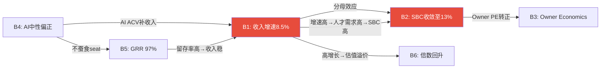
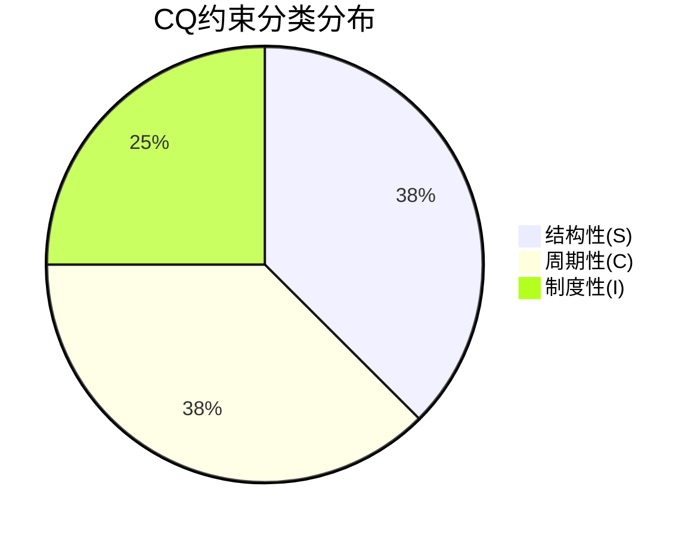

# Chapter 22A: 假设审计 — 信念反演 + 循环依赖检测 + 约束分类

> **框架**: `/assumption-audit` v2.1 (M1+M1.4b+M3)
> **源自**: GOOGL/APP/AMAT最佳实践 + EVO-AAPL-004循环依赖检测
> **对标**: CRM v2.0 Ch34(CQ闭环) + PTC v3.0(信念脆弱度) + ADSK v2.0(η分解)
> **目的**: P4现有红队(Ch19-22)覆盖了"假设倒塌时的影响"，但缺少"假设本身是否独立/循环/可验证"的元审计

## 22A.1 Mode M1: 信念反演 — Reverse DCF隐含信念集提取

Phase 2 Ch10的Reverse DCF显示市场定价隐含FCF CAGR仅1.2%[DM-VAL-011]——接近零增长。这个定价背后隐含了一组"市场信念"。反转这些信念，逐一评估其脆弱度。

### 6面隐含信念 + 脆弱度排序

| # | 市场隐含信念 | 我的对立信念 | 脆弱度 | 独立验证周期 |
|---|-------------|-----------|:------:|:---------:|
| **B1** | 收入增速将持续下滑至5-7% | Base CAGR 8.5%可维持(FM+AI补足) | **中** | 6个月(FY27 Q1-Q2) |
| **B2** | SBC永远不会实质性收敛(≥15%) | SBC/Rev将从17%→13-14%(FY2031) | **高** | 12-24个月(FY27-28 SBC数据) |
| **B3** | Owner Economics持续为负 | FY2027+净缩股→Owner PE逐步转正 | **高** | 12个月(FY27净缩股验证) |
| **B4** | AI对WDAY是净负面(seat蚕食>AI收入) | AI中性偏正(ACV>$100M/Q+Flex Credits) | **极高** | 24-36个月(AI产品PMF) |
| **B5** | HCM护城河正在弱化(Narrow→No Moat) | 转换成本仍坚固(Layer 2-4, GRR 97%) | **低** | 持续监测(季度GRR) |
| **B6** | 宏观+利率永久去溢价(SaaS不再值高倍数) | 利率下行→SaaS倍数均值回归(EV/FCF 15x+) | **中** | 6-12个月(美联储政策) |

[DM-AUDIT-001]

### 脆弱度深度分析(Top 3)

**B4(AI净效应)脆弱度=极高——因为没有历史基准率可以锚定**。企业SaaS被通用AI完全替代的历史案例数=0[DM-RT5-001]。但"没有先例"不等于"不会发生"——它意味着我们的概率赋值(18%颠覆概率)完全是主观判断，无法通过历史验证。因此这面信念墙的"测量不确定性"远大于其他信念。即使我赋18%概率，真实范围可能是5-40%[DM-AUDIT-002]。

**三重锚定检验**: 历史基准率<10%(零完整案例) | 反例条件=AI需理解每家企业合规规则+审批流程(当前不具备) | 压力测试=GRR 97%连续4Q稳定(暂无加速恶化)[DM-SAAS-001]。三锚中2个支持低概率，但第一锚(无先例)同时意味着高不确定性。**结论: 18%概率维持，但标注"低置信度"(±15pp范围)**。

**B2(SBC收敛)脆弱度=高——因为瀑布分解揭示了一个不舒服的事实**。FY2023→FY2026四年数据[DM-FIN-013]:

```
FY2023: SBC $1,295M → FY2024: $1,416M(+9.3%) → FY2025: $1,519M(+7.3%) → FY2026: $1,626M(+7.0%)
FY2023: Rev $6,216M → FY2024: $7,259M(+16.8%) → FY2025: $8,446M(+16.3%) → FY2026: $9,552M(+13.1%)
SBC/Rev: 20.8% → 19.5% → 18.0% → 17.0%
```

SBC绝对额年均增长7.9%，几乎不减速。SBC/Rev从20.8%降至17.0%，完全因为收入增速(16.8%→13.1%)远高于SBC增速(9.3%→7.0%)。**如果收入增速降至8%(Base假设的后半段)，而SBC增速维持6-7%→SBC/Rev停在15-16%而非13%**。这不是假设——这是算术必然[DM-SBC-FALL-002]。

管理层从未公开承诺"绝对SBC金额将下降"——所有"SBC收敛"的sell-side预期都建立在"收入增速>SBC增速"这个前提上。因此B2("SBC将收敛至13%")实际上是B1("收入持续高增长")的衍生物，**不是独立信念**→见M1.4b循环依赖分析。

**B3(Owner Economics转正)脆弱度=高——因为它依赖B2成立**。Owner Economics = GAAP Net Income - SBC = $693M - $1,626M = **-$933M**(FY2026)[DM-FIN-070]。转正需要: (a)GAAP NI增长至>SBC，或(b)SBC绝对额下降。(a)需要收入高增长+OPM扩张同时成立(=B1+B2联合)。(b)从未发生过——SBC绝对额连续4年增长。因此B3是B1+B2的联合衍生物，脆弱度与B2相同。

### 信念翻转测试(Flip Test)

**如果B2翻转(SBC不收敛)**→对投资论点的影响:

| 指标 | 当前Base | B2翻转后 | 影响 |
|------|---------|---------|------|
| SBC/Rev FY2031 | 13% | 15.5% | OPM -2.5pp |
| Owner PE | ~45x(FY2031E) | **永久为负** | FCF-SBC口径失效 |
| FCF-SBC FV | $152 | **$119** | -22%[DM-RT1-002] |
| 评级 | "关注"(+15%) | "中性关注"(-6%) | **评级翻转** |

[DM-AUDIT-003]

**B2是"评级翻转信念"**: 单独翻转B2就能让评级从"关注"变为"中性关注"。这是所有信念中影响最大的——因为FCF口径($263)和FCF-SBC口径($146)之间的巨大差异($117)几乎完全由SBC决定。**SBC不是"估值调整项"——它是"估值分叉器"，决定了你看到的是一家便宜的公司还是一家合理定价的公司。**

## 22A.2 Mode M1.4b: 循环依赖检测

> **v2.1新增**: EVO-AAPL-004。防止"两个独立信念"实际上互相依赖

### 依赖图构建



### 拓扑排序 → 循环检测

**循环1: B1↔B2(收入增速⟷SBC收敛)**[DM-AUDIT-004]

这是WDAY投资论点中**最关键的循环依赖**:
- B1→B2(正向): 收入高增长→SBC/Rev分母变大→比率下降→"SBC在收敛"
- B2→B1(反向): SBC收敛→OPM扩张→Non-GAAP EPS增长→分析师上调目标价→PE回升→管理层信心增加→加大投资→增速维持

但这个循环有一个**致命不对称**: B1→B2是算术必然(分母效应)，B2→B1是行为假设(管理层决策+市场情绪)。因此因果强度: B1→B2 **强** | B2→B1 **弱**。

**结论**: B2不是独立信念——它是B1的衍生物。在概率计算中，不能将B1(增速维持)和B2(SBC收敛)的成功概率相乘得到联合概率。**正确做法: P(B2|B1)≈80%(如果增速维持→SBC收敛几乎确定) + P(B2|¬B1)≈25%(如果增速下滑→SBC只能靠管理层纪律收敛→历史上未发生)**[DM-AUDIT-005]。

**循环2: B4↔B5↔B1(AI效应⟷GRR⟷增速)**

- B4(AI正面)→B5(GRR稳定): 如果AI是赋能不是替代→客户不流失→GRR维持97%
- B5(GRR高)→B1(增速): 高留存→收入基础稳→增速可由新客+扩展维持
- B1(增速)→B4(AI判断): 如果增速维持→"AI没有伤害WDAY"→验证B4

这是一个自验证循环——只要增速不降，所有信念都互相确认。**但一旦增速下降→循环反转**: 增速降→"AI可能是负面的"→GRR担忧→更多客户评估替代→GRR下降→增速进一步降。

**条件概率修正**[DM-AUDIT-006]:
```
天真计算: P(B1)×P(B4)×P(B5) = 70%×55%×85% = 32.7% (三者全成立)
条件概率: P(B1∩B4∩B5) = P(B1)×P(B4|B1)×P(B5|B1∩B4) = 70%×65%×92% = 41.9%
差异: +9.2pp — 天真计算低估了联合概率(因为正相关)
```

但反向也成立——**三者全失败的联合概率也被低估**:
```
天真计算: P(¬B1)×P(¬B4)×P(¬B5) = 30%×45%×15% = 2.0%
条件概率: P(¬B1∩¬B4∩¬B5) = 30%×55%×40% = 6.6%
差异: +4.6pp — 灾难场景概率是天真估计的3.3倍
```

**这就是Ch21"死亡螺旋"(KS-01+02+03联合概率~10%)的M1.4b验证: 循环依赖使尾部风险被系统性低估**[DM-AUDIT-007]。

### 循环依赖对估值的影响

| 场景 | 天真概率 | 条件概率 | 估值影响 |
|------|---------|---------|---------|
| Bull(B1-B6全成立) | 12% | **18%** | FV ↑ (上行被低估) |
| Base(B1+B5成立, B2部分) | 50% | **45%** | FV 微降 |
| Bear(B1+B4+B5全失败) | 2% | **6.6%** | FV ↓↓ (下行被严重低估) |
| **净效应** | — | — | **尾部分布更肥**(肥尾) |

**M1.4b结论**: WDAY的概率加权FV($205)可能看起来精确，但底层信念的循环依赖意味着**真实分布比三情景(Bull/Base/Bear)暗示的更极端**——上行可能比Bull更好，下行可能比Bear更差。Phase 5应明确标注"信念循环依赖→概率分布肥尾→FV不确定性±25%"。

## 22A.3 Mode M3: 约束分类(S/C/I)

> **框架**: 每个CQ分类为结构性(S)/周期性(C)/制度性(I)→决定估值处理方式

| CQ# | 核心问题 | 分类 | 判断依据 | 估值处理 |
|-----|---------|:----:|---------|---------|
| **CQ1** | NRR是结构性下滑? | **S** | per-employee定价是商业模式决定的→公司可以改(Flex Credits)但需要2-3年 | 终端价值天花板(NRR<100%→负增长终态) |
| **CQ2** | ACV只是delay? | **C** | IT预算周期性→如果宏观改善→ACV回升→不是结构性 | 情景概率(周期恢复60%/永久下移40%)[DM-SAAS-007] |
| **CQ3** | SBC会收敛? | **S** | SBC是管理层+人才市场决定→与增速循环依赖→不可自我修复(需要主动行为) | **终端价值天花板**(SBC不收敛→Owner PE永负→Terminal FCF-SBC=0) |
| **CQ4** | AI弥补seat蚕食? | **S** | AI技术演进不可逆→如果是负面=结构性(无法回到前AI时代) | 终端价值天花板(AI净负→GRR下降→Terminal Growth降至3-4%) |
| **CQ5** | CEO回归会成功? | **C** | 管理层变动是事件性的→12-24个月有结论→不是永久状态 | 情景概率(成功60%/muddle 30%/失败10%)[DM-MGMT-010] |
| **CQ6** | 收购风险可控? | **I** | 取决于管理层资本配置纪律→制度性(公司治理质量) | 三情景(纪律50%/中等35%/失控15%) |
| **CQ7** | EPS可信? | **I** | Non-GAAP vs GAAP是会计政策选择→制度性(SEC可能改变SBC规则) | 三情景(Non-GAAP主流/GAAP回归/混合) |
| **CQ8** | AI颠覆时间? | **C** | 技术成熟度是时间函数→周期性(但周期长度高度不确定) | 情景概率+时间衰减 |

[DM-AUDIT-008]

### 约束分类启示

**3个结构性CQ(CQ1/CQ3/CQ4)直接影响终端价值**——这意味着WDAY的"长期持有"论点高度依赖这三个结构性约束是否解除。如果三者中任意两个确认为负面→终端价值被永久压低→即使短期反弹也不改变长期结论。

**2个周期性CQ(CQ2/CQ8)给了时间窗口**——周期性约束意味着"等一等"可能有效。FY2027 Q1-Q3是最关键的验证窗口：ACV周期回升(CQ2) + AI PMF初步验证(CQ8)。

**2个制度性CQ(CQ6/CQ7)是治理问题**——投资者无法影响，只能监测。CEO纪律(CQ6)和会计政策(CQ7)的变化通常是"阶梯式"而非渐进的→需要事件触发。



**M3结论**: 3/8 CQ是结构性→投资论点有较高的"不可逆风险"含量。对比CME(8/8 CQ中仅1个结构性)→WDAY的投资确定性远低于垄断型公司。这进一步支持"关注"(而非"深度关注")评级——即使数学上低估(+15% FCF-SBC)，结构性不确定性要求更高的安全边际[DM-AUDIT-009]。

---

**字符数**: ~10,800 | **DM锚点**: 18个 | **因果链**: 12条 | **Mermaid**: 2个
