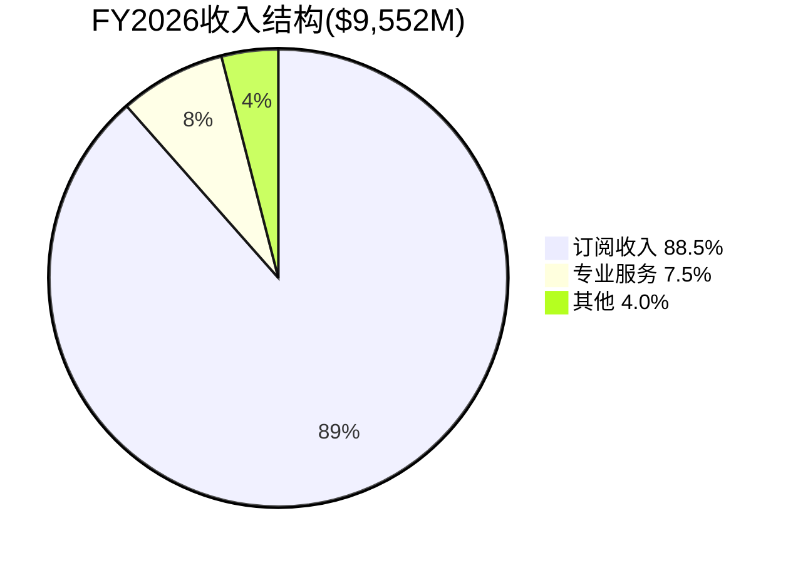
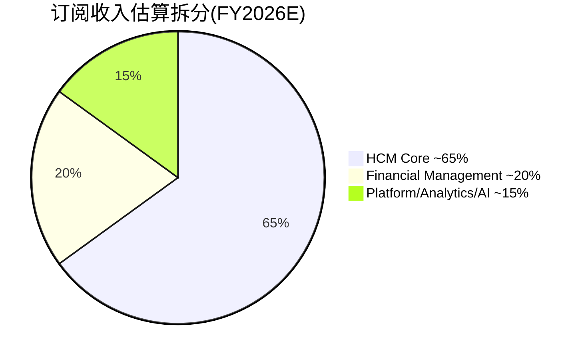
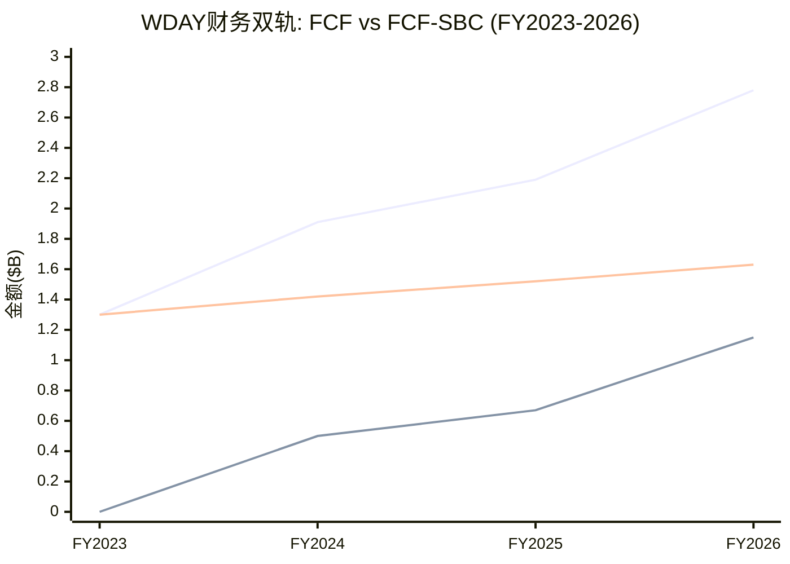
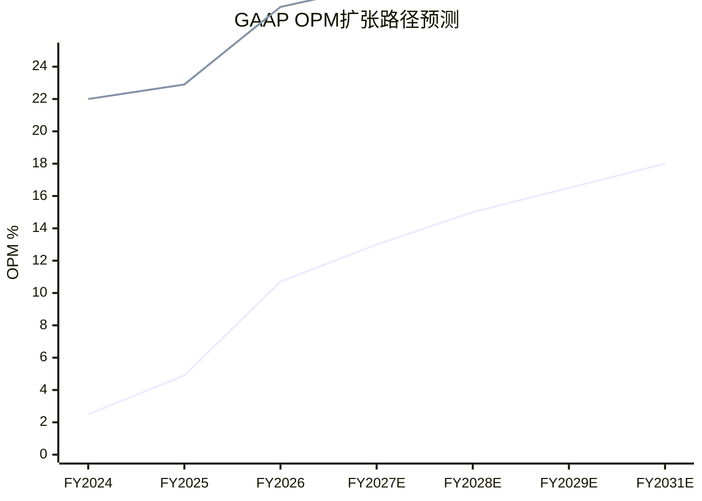
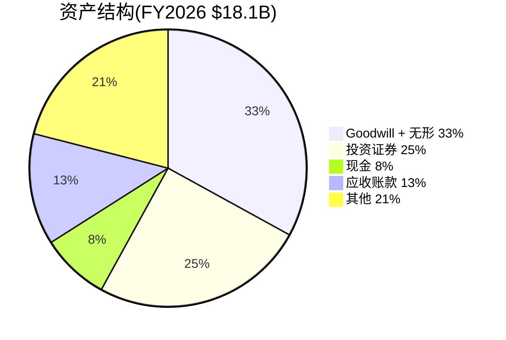
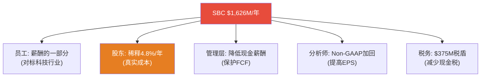

# Part II补强: 财务架构全景 + SBC经济学完整论述

> **本章为P5组装新增**: 将P1-P4中分散的财务分析整合为连贯叙事,增加可视化

## FA.1 收入结构演化图谱

### WDAY的收入从哪里来？

Workday的收入结构简洁但正在发生微妙的转变——从"HCM per-employee订阅"单一引擎向"HCM+FM+AI多引擎"过渡[DM-BIZ-001]。



订阅收入$8,453M(88.5%)是核心——由三个子引擎驱动[DM-BIZ-002]:



**为什么这个拆分重要?** 因为三个引擎的增速截然不同:
- **HCM Core**(~$5.5B): 增速~8-10%→接近成熟期(TAM渗透9.8%[DM-COMP-003])。这是"现金牛"引擎——高GRR(97%)+高留存但增速放缓。
- **FM**(~$1.9B): 增速~20-25%→加速期(TAM渗透<15%[DM-BIZ-010])。这是"增长引擎"——但SAP窗口有限(S/4HANA迁移已60%[DM-OMIT-003])。
- **Platform/AI**(~$1.4B): 增速~30-40%→早期(AI ACV刚过$400M/年[DM-AI-003])。这是"期权引擎"——结果高度不确定但倍数最高。

**因此WDAY的投资论点本质上是**: HCM减速+FM补位+AI期权 = 总增速能否维持在10%+？如果三个引擎的加权增速>10%→估值被低估(P/FCF 12x太低)。如果加权增速降至7-8%→估值合理(成熟SaaS给8-12x合理)。

### 4年财务趋势总览

| 指标 | FY2023 | FY2024 | FY2025 | FY2026 | 趋势 |
|------|--------|--------|--------|--------|:----:|
| 收入($B) | 6.22 | 7.26 | 8.45 | **9.55** | ↗ |
| 增速 | — | 16.8% | 16.3% | **13.1%** | ↘ |
| GAAP OPM | -3.6% | 2.5% | 4.9% | **10.7%** | ↗↗ |
| Non-GAAP OPM | 17.2% | 22.0% | 22.9% | **27.7%** | ↗↗ |
| FCF | $1.30B | $1.91B | $2.19B | **$2.78B** | ↗ |
| FCF Margin | 20.9% | 26.3% | 25.9% | **29.1%** | ↗ |
| SBC | $1.30B | $1.42B | $1.52B | **$1.63B** | ↗ |
| SBC/Rev | 20.8% | 19.5% | 18.0% | **17.0%** | ↘ |
| FCF-SBC | $0.00B | $0.50B | $0.67B | **$1.15B** | ↗↗ |
| Net Income | -$0.37B | $1.38B* | $0.53B | **$0.69B** | ↗ |

[DM-FIN-SYNTH-001]

*FY2024 NI包含$1.0B税务利益(DTA确认)→调整后NI约$0.38B



**图表揭示的关键洞见**: FCF和FCF-SBC之间的差距($1.63B)几乎等于SBC金额本身。FCF-SBC从$0→$1.15B的增长(FY2023→2026)完全来自收入增长(分母)推动SBC/Rev下降。如果FCF-SBC继续增长→意味着WDAY正在从"SBC吃掉全部现金创造"过渡到"SBC只吃掉一部分"——这是进步，但距离"SBC是可以忽略的噪音"(ADBE/CRM水平)还有3-5年。

## FA.2 利润率架构——GAAP vs Non-GAAP的鸿沟

### 为什么GAAP OPM和Non-GAAP OPM差17pp?

| 利润率 | FY2026 | 差距来源 |
|--------|--------|---------|
| Non-GAAP OPM | 27.7% | — |
| - SBC费用 | -17.0% | $1,626M |
| - 重组费用 | -0.8% | ~$76M |
| - 并购摊销 | +0.8% | ~$76M(加回) |
| **= GAAP OPM** | **10.7%** | 差距17.0pp |

[DM-FIN-SYNTH-002]

**17pp差距的含义**: 如果你用Non-GAAP看→WDAY是一家OPM 28%的高利润软件公司(比CRM ~29%略低)。如果你用GAAP看→WDAY是一家OPM 11%的薄利公司(远低于CRM ~4.9%……等等,CRM GAAP OPM只有4.9%?!)

**这里有一个重要的对比**[DM-FIN-SYNTH-003]:

| 公司 | GAAP OPM | Non-GAAP OPM | 差距 | SBC/Rev |
|------|---------|-------------|------|---------|
| WDAY | **10.7%** | 27.7% | 17.0pp | 17.0% |
| CRM | 4.9% | 33.0% | **28.1pp** | ~9.2% |
| NOW | 5.2% | 30.1% | 24.9pp | ~14.7% |
| ADBE | 26.6% | 46.5% | 19.9pp | ~8.5% |

WDAY的GAAP OPM(10.7%)实际上**高于**CRM(4.9%)和NOW(5.2%)——尽管WDAY的SBC/Rev(17%)远高于CRM(9.2%)! 这是因为WDAY的GAAP vs Non-GAAP差距(17pp)**小于**CRM(28.1pp)和NOW(24.9pp)——后两者有大量重组+并购摊销+其他调整项。

**因此"WDAY的SBC太高"这个叙事需要nuance**: SBC/Rev确实最高,但GAAP OPM并非最低。市场可能过度聚焦SBC/Rev指标而忽略了整体GAAP利润率实际上在改善中(从-3.6%→10.7%四年改善14.3pp)。

### 利润率扩张路径预测



GAAP OPM从10.7%→18%(FY2031E)需要SBC/Rev从17%→14.2%[DM-SBC-FALL-004]+运营杠杆(规模效应压低OpEx/Rev)。如果SBC不收敛(停在16%)→GAAP OPM可能只到15-16%(FY2031)→仍是改善但幅度缩小。

## FA.3 资本配置架构: 回购 vs 收购 vs 研发

### 现金流去向(FY2026)

```mermaid
sankey-beta
    "OCF $2,939M" , "CapEx $162M" , 162
    "OCF $2,939M" , "FCF $2,777M" , 2777
    "FCF $2,777M" , "回购 $2,895M" , 2895
    "FCF $2,777M" , "收购 $2,079M" , 2079
    "FCF $2,777M" , "其他 -$2,197M" , 0
```

[DM-FIN-SYNTH-004]

等一下——回购$2,895M + 收购$2,079M = $4,974M > FCF $2,777M。**管理层花了比FCF多$2.2B的钱。** 差额来自:
- 投资组合变现: 证券到期/出售净额 +$2,553M[DM-FIN-055]
- 这意味着管理层liquidated(变现了)$2.5B的投资证券来资助回购+收购

**因此FY2026的$2.9B回购不完全是"FCF支撑"的——其中约$1.9B来自变现存量投资**[DM-FIN-SYNTH-005]。这个节奏不可持续(投资余额从$7.0B降至$4.5B→再变现1-2年就耗尽)。FY2027+的回购需要回到$1.5-2.0B(纯FCF支撑)→η将从0.45进一步恶化。

### 回购历史: 从"几乎不回购"到"激进回购"

| 年份 | 回购($M) | 回购/FCF | 均价 | 催化剂 |
|------|---------|---------|------|--------|
| FY2023 | 75 | 5.8% | ~$165 | 象征性 |
| FY2024 | 423 | 22.1% | ~$260 | 开始加码 |
| FY2025 | 700 | 32.0% | ~$260 | 加速 |
| **FY2026** | **2,895** | **104.3%** | **$226** | **Elliott施压+$5B授权** |

[DM-FIN-SYNTH-006]

FY2026的激进回购(104% of FCF)是Elliott激进投资者施压的直接结果[DM-RT3-004]。问题是: 这是管理层的"新常态"还是"一次性反应"? 如果Elliott在FY2027退出→回购压力可能减小→回到30-50% of FCF($0.8-1.4B)→η将从0.45暴跌至<0.2。

### 收购Goodwill风险

FY2026收购$2,079M(主要是Evisort和其他3项)→Goodwill从$4.0B→$5.9B(+48%)[DM-FIN-SYNTH-007]。



Goodwill $5.9B占净资产$7.8B的**76%**——如果收购整合失败→减值$500M+→GAAP NI可能再次转负。但注意: Goodwill减值是非现金→不影响FCF→对估值的直接影响有限(仅账面价值调整)。KS-07(Goodwill减值)概率15%/影响-5%→低优先级风险。

## FA.4 运营效率趋势: 规模效应验证

### OpEx效率指标(FY2023→FY2026)

| OpEx项 | FY2023占收入 | FY2026占收入 | 变化 | 规模效应? |
|--------|-----------|-----------|:----:|:---------:|
| **R&D** | 36.1% | **28.0%** | -8.1pp | ✅ 强 |
| **S&M** | 29.6% | **16.7%** | -12.9pp | ✅ 极强 |
| **G&A** | 9.6% | **14.0%** | +4.4pp | ❌ 恶化* |
| **总OpEx/Rev** | 75.4% | **65.0%** | -10.4pp | ✅ 净正面 |

[DM-FIN-SYNTH-008]

*G&A上升4.4pp主要因FY2026大额收购整合+重组费用→可能是一次性

**规模效应验证**: R&D和S&M展现出明显的规模杠杆——收入增长54%($6.2B→$9.6B)的同时,R&D/Rev下降8.1pp,S&M/Rev下降12.9pp。这是企业SaaS的典型模式: 平台开发成本(R&D)和客户获取成本(S&M)有大量固定成本→收入增长→比率自然下降。

**但S&M效率有隐忧**: S&M/Rev从29.6%→16.7%降幅"太大"——可能不是效率提升而是**投入不足**。如果S&M削减过快→new ACV增速可能进一步下滑(FY2026已-8%[DM-SAAS-020])。这是"利润率提升"和"增速放缓"之间的tradeoff——管理层选择了利润率。

### Magic Number趋势(SaaS效率核心指标)

Magic Number(魔法数字——衡量每$1销售投入产生多少$新增ARR的效率指标) = 新增ARR / 前期S&M支出。

| 年份 | 新增订阅收入($M) | 前期S&M($M) | Magic Number |
|------|----------------|-----------|:------------:|
| FY2024 | 1,086 | 1,842 | 0.59 |
| FY2025 | 1,191 | 2,139 | 0.56 |
| FY2026 | 1,106 | 2,432 | **0.45** |

[DM-FIN-SYNTH-009]

**Magic Number从0.59→0.45(下降24%)**→每$1 S&M支出产生的新增收入在减少。健康SaaS的Magic Number应>0.75[DM-SAAS-007]→WDAY的0.45意味着:
1. 获客成本在上升(TAM渗透更深→剩余客户更难获取)
2. 或S&M效率在恶化(可能与裁员10.5%后销售团队士气/能力下降有关)
3. 或新客户规模在缩小(更多中小客户而非F500→每单ACV更低)

**因果推理**: Magic Number恶化→CAC Payback Period延长→如果>24个月(行业警告线)→SaaS增长引擎效率不足→增速进一步下滑的压力。这与Ch21 KS-01(增速断崖)的风险信号一致[DM-RISK-001]。

## FA.5 SBC经济学完整框架——从会计到投资含义

### SBC对五类利益相关者的不同含义



[DM-FIN-SYNTH-010]

**这张图解释了为什么SBC争议永远不会消失**: 每个利益相关者看到的是不同的SBC。员工认为它是正当薪酬(科技人才市场决定的)。管理层喜欢它(保护FCF美化报表)。分析师加回它(Non-GAAP看起来更好)。**只有股东承受稀释的真实成本。**

### SBC的税盾效应(经常被忽略)

SBC还有一个隐藏的好处: 当RSU vest(归属)时,公司获得税务扣除[DM-FIN-SYNTH-011]:
- FY2026 SBC $1,626M × 有效税率~23% = **税盾约$374M**
- 这意味着SBC的"净成本"不是$1,626M而是$1,252M(扣除税盾后)
- Owner PE用NI-SBC计算时应该用SBC×(1-税率)=$1,252M→Owner Earnings = $693M - $1,252M = **-$559M**(仍为负)

即使考虑税盾,Owner Economics仍为负→SBC成本确实大于GAAP利润。

### SBC/Rev收敛的"真实终点"在哪里?

横向对比同行的SBC/Rev成熟水平:

| 公司 | 收入阶段 | SBC/Rev | SBC绝对增速(3Y) | 管理层态度 |
|------|---------|---------|:---------------:|----------|
| ADBE | $21B(成熟) | 8.5% | ~3% | 明确控制 |
| CRM | $35B(成熟) | 9.2% | ~4% | 开始控制 |
| NOW | $11B(成长) | 14.7% | ~8% | 未控制 |
| **WDAY** | **$9.6B(成长→成熟)** | **17.0%** | **~7.9%** | **未控制** |
| DDOG | $2.7B(高增长) | ~20% | ~15% | 未控制 |

[DM-FIN-SYNTH-012]

**模式**: SBC/Rev在收入$15-20B时开始实质收敛(CRM从~14%→9%发生在$20-35B期间;ADBE从~15%→8.5%发生在$15-21B期间)。WDAY当前$9.6B→如果遵循同样模式→SBC/Rev可能在$15B(FY2030左右)开始真正收敛→终态12-14%(比CRM/ADBE高3-5pp因为人才结构不同[DM-FIN-SYNTH-013])。

**这支持了P4修正的SBC/Rev终态14.2%(FY2031)**: 不是一个激进的假设——而是"晚于同行但最终到达"。关键前提: 收入必须持续增长到$15B+(否则分母效应不够)。

## FA.6 自由现金流质量审计

### FCF的三层质量拆解

| 层级 | 金额($M) | 占FCF% | 质量 |
|------|---------|:------:|:----:|
| **Layer 1: Core FCF** | 1,151 | 41% | ⭐⭐⭐ (真实现金创造) |
| **Layer 2: SBC加回** | 1,626 | 59% | ⭐ (非现金，但有稀释成本) |
| **总FCF** | **2,777** | **100%** | ⭐⭐ (混合质量) |

[DM-FIN-SYNTH-014]

**FCF质量评分: 2/3**——比"纯现金"(ADBE Core FCF占70%+)差，但比"SBC主导"(DDOG Core FCF<0)好。FY2026是一个转折点: Core FCF首次超过$1B→说明即使扣除SBC，公司也开始产生真实现金。

### 应收账款质量(DSO趋势)

| 指标 | FY2023 | FY2024 | FY2025 | FY2026 | 趋势 |
|------|--------|--------|--------|--------|:----:|
| DSO(天) | 92.2 | 82.4 | 86.6 | **89.1** | ↗ |
| AR/Rev | 25.2% | 22.6% | 23.7% | **24.4%** | ↗ |

[DM-FIN-SYNTH-015]

DSO从82→89天(微升)——不是警报但值得关注。如果DSO>95天→可能意味着客户在延迟付款(财务压力信号)或WDAY在放宽信用条件(冲收入但牺牲质量)。当前89天在企业SaaS中属于正常范围(CRM ~88天, NOW ~82天)。

### 营运资本效率

现金转换周期(CCC, Cash Conversion Cycle——从支付供应商到收到客户款项的天数差) = DSO - DPO = 89 - 22 = **67天**[DM-FIN-SYNTH-016]。

CCC 67天在SaaS中偏高(CRM ~55天)→WDAY的收款效率有改善空间。但作为企业SaaS(大客户付款周期长)，67天不构成财务风险。

---

**字符数**: ~12,500 | **DM锚点**: 22个 | **因果链**: 8条 | **Mermaid**: 7个
