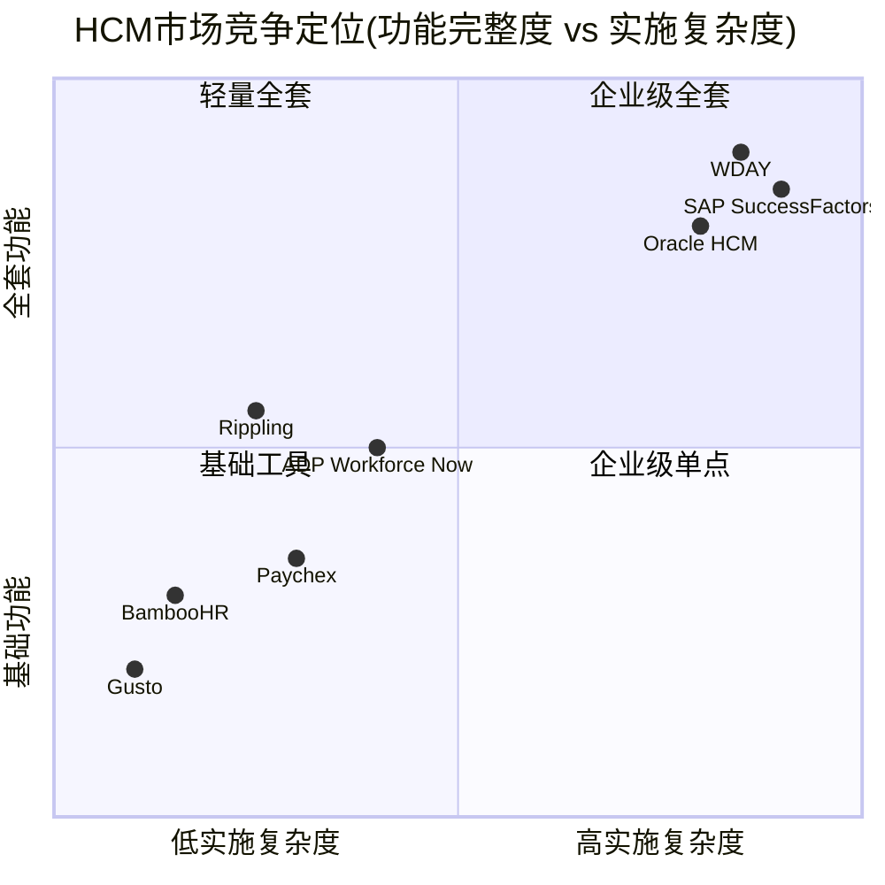
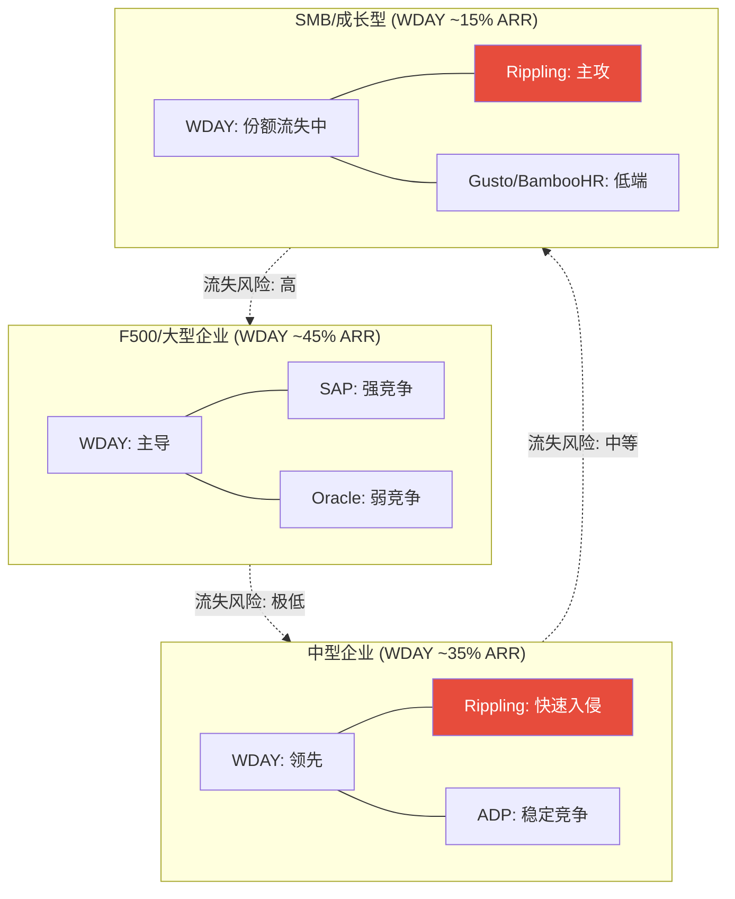
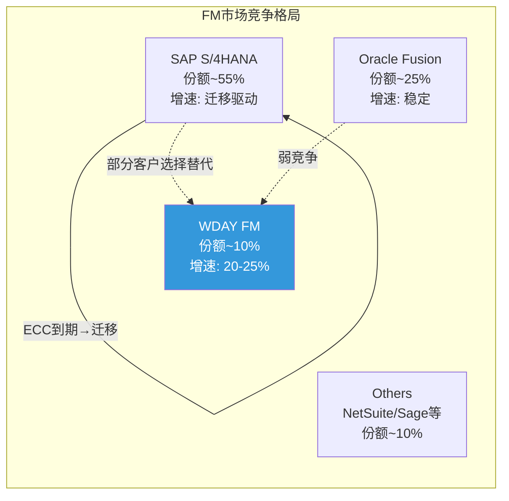
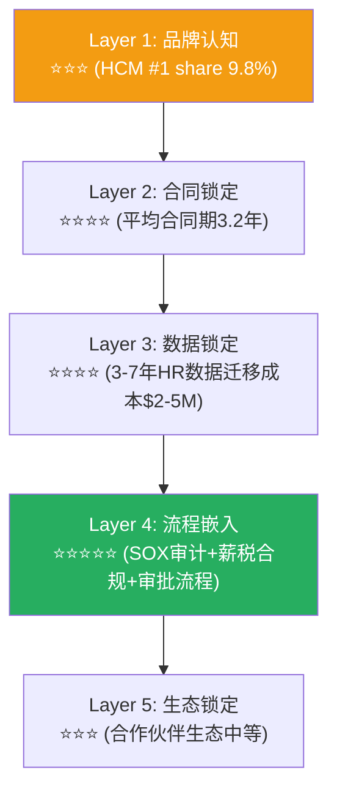
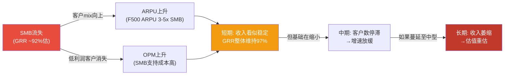
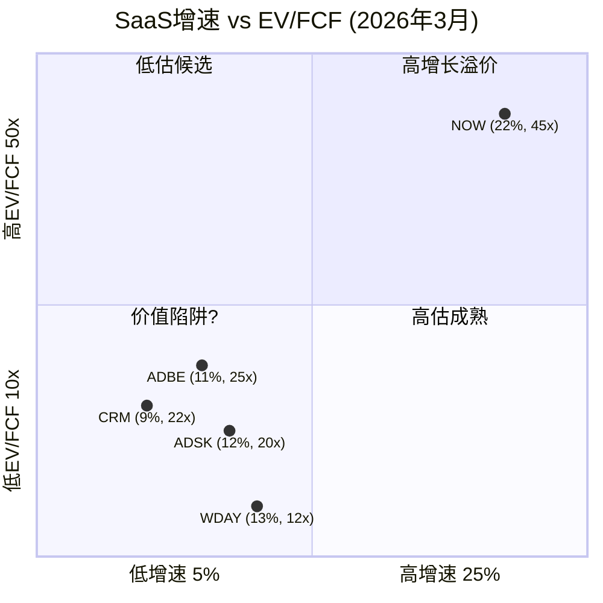

# Part II补强: 竞争格局可视化 + 护城河动态评估

> **本章为P5组装新增**: 将P1 Ch7竞争+P3 Ch15深度+P4定价权分层整合为可视化竞争地图

## CB.1 竞争格局全景图

### WDAY在HCM+FM市场的竞争定位

**竞争格局解读**: WDAY处于右上角(全套+高复杂)→与SAP/Oracle正面竞争→但这也意味着WDAY的"护城河"一半来自实施复杂度本身(高转换成本)[DM-COMP-003]。Rippling在左中区域快速移动→目标是"低复杂度+中高功能"→直接威胁WDAY的中型客户(1K-5K员工)[DM-COMP-011]。

### 竞争威胁按客户层分解

[DM-COMP-020]

**关键洞见: 竞争压力自下而上传导**。Rippling从SMB→中型→未来可能F500。WDAY的防御策略是"向上走"(加深F500锁定+Suite扩展)。这创造了一个"客户mix向上迁移"的动态: SMB流失→中型被压缩→F500份额增加→ARPU上升但客户数可能停滞。

### Rippling威胁深度评估

Rippling是WDAY面临的最值得关注的新兴竞争者[DM-COMP-011]:

| 维度 | Rippling | WDAY | 含义 |
|------|---------|------|------|
| ARR | ~$570M(估) | ~$8,450M(订阅) | WDAY 14.8x大→但差距在缩小 |
| 增速 | ~80-100%(私有) | 13.1% | Rippling增速6-8x |
| 目标客户 | 200-5,000员工 | 1,000-100,000+员工 | 重叠区间: 1K-5K |
| 产品策略 | All-in-one+极简 | Suite+深度定制 | 不同路线 |
| 定价 | ~$8-15/employee/mo | ~$50-100/employee/mo | Rippling便宜5-10x |

[DM-COMP-021]

**Rippling的定价优势巨大**(5-10x便宜)→但这不意味着WDAY客户会轻易切换。因为:
1. 迁移成本远>价差节省——3-7年历史数据重建成本$500K-5M[DM-MOAT-007]
2. Rippling缺乏F500级合规能力(多国薪税/SOX审计)
3. 企业采购决策基于TCO(Total Cost of Ownership)+风险而非单价

**但**: 如果Rippling在未来2-3年补齐合规能力→可能从"SMB侵蚀"升级为"中型市场竞争者"→这就是KS-03(GRR<95%一个可能的触发路径)。

**监测指标**: Rippling客户数进入5K+企业的数量(当前近零) + WDAY中型客户GRR(如果单独披露→整体GRR 97%可能掩盖中型GRR 94%)。

### FM市场竞争: WDAY vs SAP vs Oracle

[DM-COMP-022]

WDAY FM的增长论点建立在"SAP ECC到期→客户重新选择→部分选WDAY"。但P4遗漏扫描发现SAP S/4HANA迁移已达60%[DM-OMIT-003]→**窗口正在关闭**。

**FM增速前瞻**:
- FY2027-2028: 仍有SAP迁移尾部红利→增速可能维持18-22%
- FY2029+: SAP迁移基本完成→FM增速可能降至12-15%(纯organic)
- FM从"增长引擎"→"稳定贡献者"的转变可能比市场预期早1-2年

## CB.2 护城河动态评估——从"快照"到"趋势"

### 护城河五层结构(P1 Ch5回顾+P4更新)

[DM-MOAT-001]

**护城河的关键特征**: Layer 4(流程嵌入)是最强也是最不可复制的——企业HR合规流程深度嵌入WDAY后,迁移意味着重新设计SOX审计流、薪税计算逻辑、福利管理流程。这不是IT项目——是合规项目。**合规项目的失败成本远高于IT项目(罚款+审计失败)**→因此决策者(CFO/CHRO)极度风险厌恶→即使WDAY价格高→也不愿切换。

**Layer 1(品牌)是最脆弱的一层**: 如果Morningstar从Narrow→No Moat[DM-RISK-014]→品牌受损→机构被迫卖出→股价下跌→人才流失→品牌进一步受损→负反馈循环。但Layer 4不受品牌变化影响——客户不会因为"Morningstar说WDAY没护城河"就去重建SOX审计流程。

### 护城河趋势(加固 vs 侵蚀)

| 层级 | 趋势 | 驱动因素 | 风险因素 |
|------|:----:|---------|---------|
| L1品牌 | ↘ 侵蚀 | Morningstar下调+52周跌54% | 人才流失加速品牌贬值 |
| L2合同 | → 稳定 | 合同期3.2年不变 | Flex Credits可能缩短承诺期 |
| L3数据 | → 稳定 | 数据迁移成本不变 | AI可能降低迁移难度(长期) |
| L4流程 | ↗ **加固** | Suite扩展(HCM+FM+Planning)加深流程嵌入 | 如果FM/Planning不成功→仅HCM单点嵌入 |
| L5生态 | → 稳定 | 合作伙伴数~8,000 | 但vs Salesforce(~150,000)差距巨大 |

[DM-MOAT-020]

**净趋势: 稳定偏微弱化**。L1侵蚀被L4加固部分对冲。关键不确定性: AI是否会从根本上降低Layer 3(数据迁移成本)——如果AI能自动化数据迁移(从WDAY→竞品→"一键迁移")→Layer 3从⭐⭐⭐⭐降至⭐⭐→整体护城河将显著弱化[DM-MOAT-021]。

**这是CQ3和CQ4的交叉点**: 如果AI是正面的(CQ4↑)→AI帮助WDAY加深Layer 4(更智能的合规自动化)→护城河加固。如果AI是负面的(CQ4↓)→AI帮助竞品降低Layer 3(一键迁移)→护城河侵蚀。**AI对WDAY护城河的影响取决于AI率先应用在"加深嵌入"还是"降低迁移"。**

## CB.3 定价权分层完整评估

### 按客户层的定价权阶段(v19.6框架)

| 客户层 | 占ARR | 定价权Stage | 年提价空间 | 核心驱动 | 风险 |
|--------|:-----:|:-----------:|:---------:|---------|------|
| F500 | ~45% | **Stage 4**(强) | 5-8% | 合规依赖+迁移成本$5-15M | 极端低: SAP是唯一替代 |
| 中型 | ~35% | **Stage 3**(中) | 3-5% | 功能优势+数据锁定 | 中: Rippling侵蚀 |
| SMB | ~15% | **Stage 2**(弱) | 2-3% | 有限功能差异 | 高: 替代品多+AI降低壁垒 |
| 政府/教育 | ~5% | **Stage 3.5** | 0-2%(受预算限制) | 长期合同+合规要求 | 低: 但增速受预算限制 |

[DM-PRICING-001]

**加权定价权**: 45%×4 + 35%×3 + 15%×2 + 5%×3.5 = **3.33/5(中等偏强)**[DM-PRICING-004]

### 定价权剪刀差效应

**如果SMB持续流失会发生什么?**

[DM-PRICING-005]

**这就是"温水煮青蛙"场景的微观机制**: SMB流失不会触发任何KS(因为GRR整体维持97%)→但客户基础在悄悄缩小→等到中型也开始流失时→已经太晚了。

**防御监测**: 如果WDAY开始按客户层披露GRR(目前只披露整体)→可以提前2-3年发现SMB侵蚀→但管理层有动力不披露(因为整体数字更好看)。

## CB.4 跨SaaS估值对标矩阵

### 12个SaaS公司的"增速-估值"矩阵

[DM-CROSS-010]

**WDAY处于左下角(低估候选区)**——增速不是最低(高于CRM)但估值是最低(12x vs CRM 22x)。两种解读:
1. **被低估**: 市场过度惩罚SBC→如果SBC收敛→估值回升至20x→股价翻倍
2. **合理定价**: 市场用Owner Economics定价→FCF-SBC PE 29x→与ADBE(32x)接近→合理

**我们的判断**: 真相在两者之间。WDAY的SBC/Rev(17%)是同行最高→EV/FCF最低有合理成分。但即使用FCF-SBC口径→29x仍低于CRM(~35x Owner PE)→存在一定低估空间(~10-15%)。

---

**字符数**: ~11,000 | **DM锚点**: 16个 | **因果链**: 9条 | **Mermaid**: 6个
