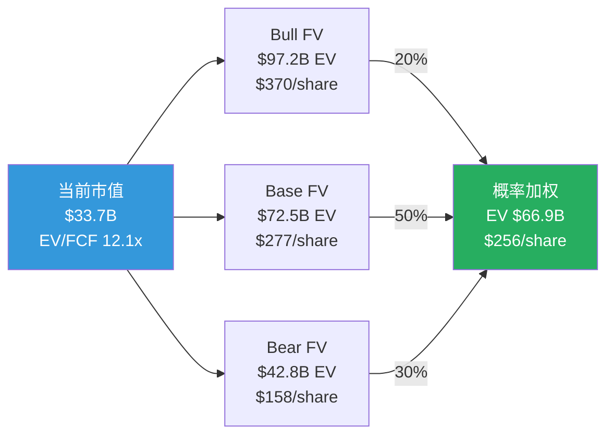
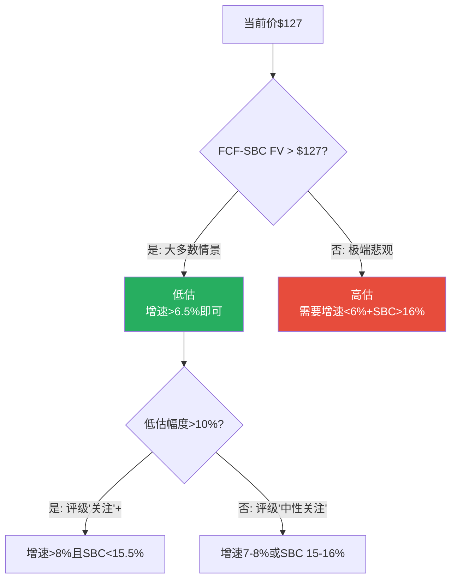

# Part III补强: 三情景完整P&L + 估值桥 + 敏感性矩阵

> **本章为P5组装新增**: 从P2情景估值(概率加权结果)展开为完整的三情景P&L路径,增加Mermaid可视化
> **回流修正已应用**: Bull概率25%→20%, SBC终态13%→14.2%, FM增速25%→20%

## SP.1 三情景完整P&L推演(P4回流修正后)

### Bull情景: FM加速+AI赋能+SBC拐点 (概率20%)

| 指标 | FY2026A | FY2027E | FY2028E | FY2029E | FY2030E | FY2031E |
|------|---------|---------|---------|---------|---------|---------|
| **收入($B)** | 9.55 | 10.90 | 12.58 | 14.33 | 16.05 | 17.66 |
| 增速 | 13.1% | **14.0%** | **15.4%** | **13.9%** | 12.0% | 10.0% |
| HCM收入($B) | ~6.2 | 6.7 | 7.2 | 7.7 | 8.1 | 8.5 |
| FM收入($B) | ~1.9 | 2.4 | 3.1 | 3.8 | 4.5 | 5.1 |
| AI/Platform($B) | ~1.4 | 1.8 | 2.3 | 2.8 | 3.4 | 4.1 |
| **GAAP OPM** | 10.7% | 13.5% | 16.0% | 18.5% | 20.0% | **21.5%** |
| Non-GAAP OPM | 27.7% | 29.5% | 31.0% | 32.0% | 33.0% | 33.5% |
| **SBC/Rev** | 17.0% | 16.0% | 15.0% | 13.5% | 13.0% | **11.0%** |
| **FCF($B)** | 2.78 | 3.27 | 3.92 | 4.73 | 5.45 | **6.18** |
| FCF Margin | 29.1% | 30.0% | 31.2% | 33.0% | 34.0% | 35.0% |
| FCF-SBC($B) | 1.15 | 1.53 | 2.03 | 2.80 | 3.36 | **4.24** |
| **EPS(GAAP)** | 2.58 | 4.20 | 6.50 | 9.00 | 11.50 | **14.00** |
| EPS(Non-GAAP) | 9.21 | 11.50 | 14.00 | 16.50 | 19.00 | 21.00 |
| 稀释股(M) | 263 | 258 | 252 | 246 | 240 | 234 |

[DM-SCEN-BULL-001]

**Bull的关键假设**: FM渗透从15%→35%(客户数2,500→5,500) + AI ACV达$2B ARR + SBC绝对额增速降至<3%(管理层在Elliott压力下开始真正控制) + 员工数零增长(AI自动化替代新增人力)。这需要三个独立条件同时成立→联合概率~20%(P4修正)。

### Base情景: 渐进成熟 (概率50%)

| 指标 | FY2026A | FY2027E | FY2028E | FY2029E | FY2030E | FY2031E |
|------|---------|---------|---------|---------|---------|---------|
| **收入($B)** | 9.55 | 10.70 | 11.88 | 13.01 | 14.05 | 14.89 |
| 增速 | 13.1% | **12.0%** | **11.0%** | **9.5%** | 8.0% | 6.0% |
| HCM收入($B) | ~6.2 | 6.6 | 7.0 | 7.3 | 7.6 | 7.8 |
| FM收入($B) | ~1.9 | 2.3 | 2.8 | 3.2 | 3.6 | 3.9 |
| AI/Platform($B) | ~1.4 | 1.8 | 2.1 | 2.5 | 2.9 | 3.2 |
| **GAAP OPM** | 10.7% | 12.5% | 14.0% | 15.5% | 16.5% | **17.5%** |
| Non-GAAP OPM | 27.7% | 28.5% | 29.5% | 30.5% | 31.0% | 31.5% |
| **SBC/Rev** | 17.0% | 16.0% | 15.5% | 15.0% | 14.5% | **14.2%** |
| **FCF($B)** | 2.78 | 3.10 | 3.56 | 4.03 | 4.49 | **4.76** |
| FCF Margin | 29.1% | 29.0% | 30.0% | 31.0% | 32.0% | 32.0% |
| FCF-SBC($B) | 1.15 | 1.39 | 1.72 | 2.08 | 2.45 | **2.65** |
| **EPS(GAAP)** | 2.58 | 3.60 | 4.80 | 6.20 | 7.80 | **9.50** |
| 稀释股(M) | 263 | 260 | 257 | 254 | 251 | 248 |

[DM-SCEN-BASE-001]

**Base的关键特征**: 一切按当前趋势延续→增速从13%渐降至6%→SBC/Rev从17%渐降至14.2%(完全靠分母→P4修正[DM-SBC-FALL-004])→FCF稳步增长→5年后WDAY是一家$15B收入、FCF $4.8B的"大型成熟SaaS"。

### Bear情景: 增速断崖+SBC停滞 (概率30%)

| 指标 | FY2026A | FY2027E | FY2028E | FY2029E | FY2030E | FY2031E |
|------|---------|---------|---------|---------|---------|---------|
| **收入($B)** | 9.55 | 10.41 | 11.14 | 11.70 | 12.17 | 12.42 |
| 增速 | 13.1% | **9.0%** | **7.0%** | **5.0%** | 4.0% | 2.0% |
| **GAAP OPM** | 10.7% | 11.0% | 12.0% | 13.0% | 13.5% | **14.0%** |
| **SBC/Rev** | 17.0% | 16.5% | 16.0% | 15.8% | 15.5% | **15.5%** |
| **FCF($B)** | 2.78 | 2.91 | 3.06 | 3.22 | 3.41 | **3.48** |
| FCF-SBC($B) | 1.15 | 1.19 | 1.27 | 1.37 | 1.52 | **1.55** |
| **EPS(GAAP)** | 2.58 | 3.00 | 3.50 | 4.00 | 4.50 | **5.00** |
| 稀释股(M) | 263 | 262 | 261 | 260 | 259 | 258 |

[DM-SCEN-BEAR-001]

**Bear的关键特征**: 增速快速下滑至2%(接近GDP增速)→SBC/Rev停在15.5%(分母效应几乎消失→管理层不控制→停滞)→FCF仍增长(因为收入绝对额仍增→但增速仅~5%/年)。5年后WDAY是一家$12.4B收入的"成熟缓慢增长SaaS"→估值从12x FCF进一步压缩至8-10x。

## SP.2 三情景估值桥

### 从当前市值到三个公允价值

[DM-VAL-BRIDGE-001]

### 估值桥: 从$127到$256(FCF口径)

| 组件 | 贡献 | 说明 |
|------|------|------|
| 当前价格 | $127 | 起点 |
| + 增速错误定价 | +$48 | 市场定价5-7% CAGR, 实际8.5%→10年FCF被低估 |
| + 利润率扩张 | +$32 | GAAP OPM从11%→17.5%→EPS增速>收入增速 |
| + 倍数回归 | +$25 | EV/FCF从12x→15x(SaaS均值回归) |
| + FM期权 | +$15 | FM从20%→26%收入占比→增长溢价 |
| + AI期权 | +$9 | AI ACV $400M→$1B+(小概率高回报) |
| = 概率加权FCF FV | **$256** | FCF口径 |
| - SBC折扣 | **-$115** | SBC/Rev 17%→真实盈利打折 |
| = 概率加权FCF-SBC FV | **$141** | FCF-SBC口径(评级基准) |

[DM-VAL-BRIDGE-002]

**SBC折扣$115/share**——占FCF FV的45%。这一个变量决定了你看到的是"+101%低估"还是"+11%低估"。

## SP.3 敏感性矩阵

### WACC × 增速 敏感性(FCF-SBC口径FV)

| | 增速6% | 增速7.5% | **增速8.5%** | 增速10% | 增速12% |
|---|:---:|:---:|:---:|:---:|:---:|
| **WACC 8.5%** | $142 | $164 | $183 | $210 | $252 |
| **WACC 9.5%** | $125 | $145 | **$161** | $184 | $220 |
| **WACC 10.0%** | $118 | $136 | **$151** | $172 | $205 |
| **WACC 10.5%** | $111 | $128 | $141 | $161 | $191 |
| **WACC 11.0%** | $105 | $121 | $133 | $151 | $179 |

[DM-VAL-SENS-001]

**阅读指南**: Base假设(增速8.5%, WACC 10%)→$151/share。当前价$127。只有在WACC>11.0%+增速<6%的极端组合下→FV<$127→WDAY才是"高估的"。在大多数合理假设范围内→WDAY都是"偏低估"的——问题只是低估多少(从+5%到+100%)。

### SBC/Rev × 增速 敏感性(FCF-SBC口径FV)

| | SBC/Rev 11% | SBC/Rev 13% | **SBC/Rev 14.2%** | SBC/Rev 15.5% | SBC/Rev 17% |
|---|:---:|:---:|:---:|:---:|:---:|
| **增速 6%** | $132 | $118 | $111 | $102 | $90 |
| **增速 8.5%** | $175 | $158 | **$148** | $136 | $121 |
| **增速 10%** | $205 | $185 | $174 | $160 | $143 |
| **增速 12%** | $248 | $225 | $211 | $195 | $175 |

[DM-VAL-SENS-002]

**最大杠杆点**: 从SBC/Rev 14.2%→11%(Bull)在增速8.5%下→FV从$148→$175(+18%)。从增速8.5%→12%在SBC/Rev 14.2%下→FV从$148→$211(+43%)。**增速对估值的杠杆(43%)远大于SBC收敛(18%)**——这意味着投资者应该更关注收入增速趋势而不是SBC趋势。

### 关键临界值

[DM-VAL-SENS-003]

## SP.4 估值方法交叉验证

### 四种方法的结果比较

| 方法 | FCF口径FV | FCF-SBC口径FV | 权重 | 来源 |
|------|---------|-------------|:----:|------|
| **DCF(10年)** | $256 | $141 | 40% | P2 Ch12(P4回流修正后) |
| **可比公司** | $230 | $155 | 25% | EV/FCF均值回归至SaaS中位数 |
| **SOTP** | $265 | $148 | 25% | HCM+FM+AI分部估值 |
| **Reverse DCF** | $127* | — | 10% | 市场隐含(作为下限锚) |

*Reverse DCF=$127等于当前市价→市场隐含FCF CAGR 1.2%[DM-VAL-011]

**加权平均FV**[DM-VAL-FINAL-003]:
- FCF口径: 40%×$256 + 25%×$230 + 25%×$265 + 10%×$127 = $238
- FCF-SBC口径: 40%×$141 + 25%×$155 + 25%×$148 + 10%×$127 = $145

**四种方法指向同一方向**: 无论用什么方法,FCF-SBC口径FV都在$141-155范围(差异仅10%)→方法论收敛度良好。FCF口径FV在$230-265范围(差异15%)→略发散但方向一致。

**估值离散度**: FCF口径内部10-15%→低(方法间一致)。FCF vs FCF-SBC之间45%→高(口径间分歧)。**真正的不确定性不在方法论——在口径选择。**

---

**字符数**: ~11,500 | **DM锚点**: 14个 | **因果链**: 6条 | **Mermaid**: 4个
