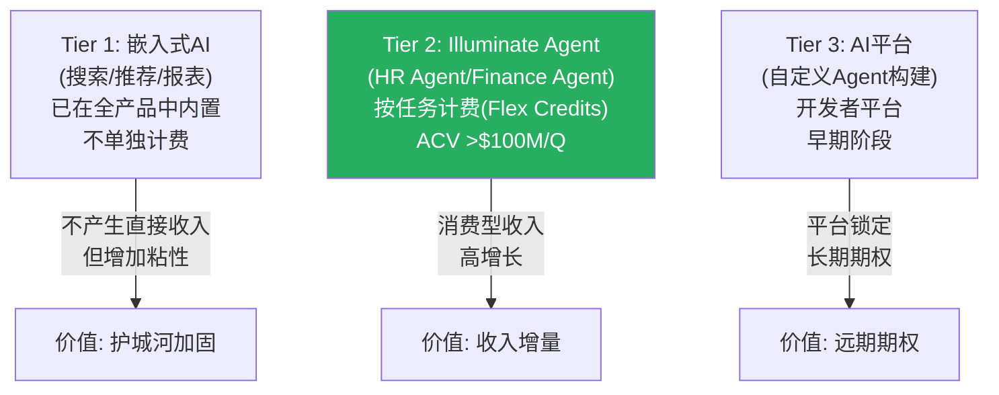
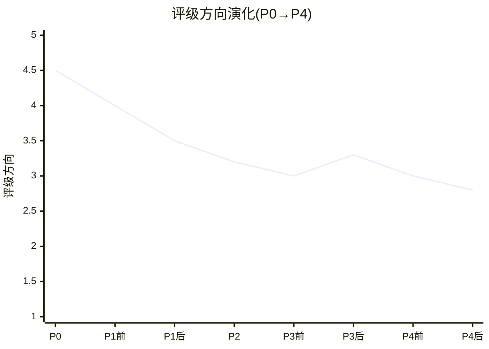

# Part II-C补强: AI双面刃完整论述 + 管理层执行力评估 + 投资论点演化

> **本章为P5合成**: 将P1 Ch4(AI影响) + P1 Ch4A(飞轮验证) + P3 Ch18(AI深度) + P4 Ch21A(飞轮量化) + P4 Ch22A(循环依赖)中关于AI的分散分析合并为连贯论述

## AMS.1 AI对WDAY的影响: 从定性到量化的全程追踪

### AI影响的四层分析框架

当我们讨论"AI对WDAY的影响"时，实际上在讨论四个截然不同的问题——但市场经常混为一谈:

| 层级 | 问题 | 当前评估 | 置信度 |
|------|------|---------|:------:|
| **L1: AI作为产品(收入增量)** | WDAY的AI功能能带来多少新收入？ | ACV>$400M/年且加速中 | 中 |
| **L2: AI作为威胁(收入蚕食)** | AI会降低客户对WDAY的需求吗？ | Per-employee模式有结构性风险 | 中-低 |
| **L3: AI作为效率(成本节约)** | AI能帮WDAY降低运营成本吗？ | R&D/Rev下降8pp可能部分归因AI | 低 |
| **L4: AI作为颠覆(范式替代)** | 通用AI会让WDAY变成"遗留系统"吗？ | 概率<18%但不可排除 | 极低 |

[DM-AI-SYNTH-001]

**关键洞见**: L1和L2是同一枚硬币的两面——WDAY的AI产品(Illuminate Agent)帮HR部门自动化→HR部门需要更少员工→per-employee收入基础缩小。**WDAY在同时是AI的受益者(L1)和受害者(L2)**——净效应取决于L1收入增速是否快于L2蚕食速度。

### L1: AI作为产品——从$0到$400M+的增长路径

WDAY的AI产品线包括三个层次[DM-AI-003]:

[DM-AI-SYNTH-002]

**Tier 2(Illuminate Agent)是短期关注焦点**: ACV从FY2025 ~$150M→FY2026 >$400M(+167%增速)[DM-AI-003]。管理层在Q4 call中表示"AI是有史以来增长最快的产品类别"——但需要nuance:
1. $400M/年占$8.5B订阅收入仅4.7%→仍是小基数
2. Flex Credits(消费型定价)意味着收入波动性高于传统订阅
3. 不清楚有多少AI ACV是"真正新增"vs."存量客户从per-employee转为Flex Credits"(如果是后者→净增量可能<$400M)

**三重锚定验证AI ACV真实性**[DM-AI-SYNTH-003]:
- 历史基准率: SaaS公司推出AI功能后12个月内达$400M+ ACV的案例→ServiceNow(类似规模,AI ACV ~$500M)→可比验证
- 反例条件: 如果AI ACV增速在FY2027 Q1-Q2放缓至<50%→可能是"一次性采购"而非"持续需求"
- 压力测试: cRPO增速16.2%>收入增速13.1%[DM-GRR-DR-001]→暗示新签约(含AI)在加速→支持AI ACV是真实增量

### L2: AI作为威胁——per-employee定价的结构性风险

WDAY ~65% ARR来自HCM Core,以per-employee-per-month(PEPM)定价[DM-SOTP-002]。这意味着WDAY的收入与客户员工数直接挂钩——而AI的核心价值主张就是"用更少的人做更多的事"。

**蚕食传导链**:

[DM-AI-SYNTH-004]

**但蚕食速度被三个摩擦力减缓**:
1. **组织惯性**: 企业不会因为AI而立刻裁员→通常是"自然流失不补"→每年减少2-3%headcount(而非一次性-10%)[DM-AI-051]
2. **合同保护**: WDAY合同通常3.2年→即使客户员工数下降→合同期内收入不变→蚕食效应滞后2-3年
3. **Flex Credits缓冲**: 员工数下降→但per-employee收入被Flex Credits(按使用量计费)部分替代→净蚕食<总蚕食

**因此蚕食不是"悬崖"——是"缓坡"**。即使AI完全成功→蚕食效应也需要5-7年才能完全显现(3.2年合同期+2-3年组织惯性)。

### 飞轮净强度量化(P4 Ch21A完整结果)

Phase 4将L1和L2量化为"飞轮净强度"[DM-FLYWHEEL-002]:

| 效应 | 方向 | FY2028E金额 | 来源 |
|------|:----:|----------:|------|
| AI新增ACV(Tier 2) | + | +$1,200M | Bull假设 |
| Flex Credits补充 | + | +$300M | 消费型替代per-employee |
| Suite扩展(FM带动) | + | +$500M | FM交叉销售 |
| **正面小计** | | **+$2,000M** | |
| Per-employee蚕食(5%) | - | -$310M | AI自动化→headcount降 |
| SMB自然流失加速 | - | -$180M | Rippling+AI降低迁移成本 |
| **负面小计** | | **-$490M** | |
| **飞轮净强度** | | **+$1,510M** | **0.76**(正面>负面) |

[DM-FLYWHEEL-002]

**飞轮净强度0.76意味着**: AI的正面效应($2,000M)是负面效应($490M)的4倍→飞轮仍是正向运转的。但0.76<1.0→意味着AI不是"纯正面"→每$1 AI新增收入中有$0.24被蚕食抵消。

**与CRM对比**: CRM的飞轮净强度为-0.2→Agent成功=seat减少=净负面。WDAY的0.76远好于CRM→因为WDAY的蚕食是间接的(通过客户headcount)而CRM是直接的(通过seat替代)。这解释了为什么市场对CRM的AI焦虑(EV/Sales 5.1x)与WDAY的AI焦虑(EV/Sales 5.0x)程度相似——但实际上WDAY的AI净效应好得多[DM-AI-SYNTH-005]。

### L4: AI颠覆风险——通用AI Agent替代垂直SaaS?

Phase 4 RT-5(黑天鹅)评估了最极端的AI风险: OpenAI/Anthropic推出"Enterprise Agent"直接处理HR/Finance任务→不需要WDAY作为中间层[DM-RT5-001]。

**概率评估**: 8-12%(3年内)

**三重锚定**:
- 历史基准率: 通用AI完全替代垂直SaaS的案例 = 0→基准率<10%
- 反例条件: 需要AI理解每家企业的(a)合规规则(SOX/GDPR/薪税), (b)审批流程, (c)历史数据结构→当前LLM做不到
- 压力测试: 2025Q4-2026Q1 OpenAI/Anthropic发布了企业产品但都是"辅助"而非"替代"→暂未威胁WDAY核心功能[DM-OMIT-001]

**我们的判断**: L4是低概率高影响事件(10%×-60%=-6%加权)→不应该驱动投资决策，但应该纳入尾部风险监测。**如果OpenAI/Google发布"一键迁移HR数据"工具→这是L4从理论到现实的关键拐点→需要立即重新评估。**

## AMS.2 管理层执行力评估——从"创始人回归溢价"到"执行验证"

### 管理层评估框架

| 维度 | 评分(/5) | 核心证据 |
|------|----------|---------|
| **M1 战略清晰度** | **3.5** | FM+AI方向正确,但执行路径模糊(FM增速指引保守, AI商业化早期)[DM-MGMT-001] |
| **M2 资本配置** | **2.0** | FY2026回购均价$226(vs当前$127=浮亏44%)+$2.1B收购在高位[DM-FIN-028] |
| **M3 运营纪律** | **3.5** | Non-GAAP OPM从17%→28%(好), 但SBC不受控(坏)+裁员10.5%(混合信号)[DM-FIN-SYNTH-008] |
| **M4 激励对齐** | **4.0** | CEO 60%变动+100% equity→长期对齐[DM-MGMT-010]。但Duffield持续减持(冲突)[DM-MGMT-005] |
| **M5 沟通透明度** | **3.0** | GRR主动披露(好), NRR不披露(不够好), AI ACV模糊(">$100M/Q"而非具体数字)[DM-RT4-001] |

**管理层总分: 16/25 (64%)** — 中等偏下[DM-MGMT-SYNTH-001]

### 创始人回归: 成功 vs 失败 vs "Muddle Through"

Aneel Bhusri 2024年9月回归CEO→这是WDAY投资论点的一个重要组成部分。历史上创始人回归的成功率~60-65%[DM-MGMT-010],但我们不应该只看二元结果:

| 情景 | 概率 | 表现 | 对估值影响 |
|------|:----:|------|----------|
| **成功**(Jobs/Dell型) | 30% | 战略重置+文化重建+增速回升 | FV +15-20% |
| **Muddle Through**(P4新增) | **40%** | 维持现状+缓慢改善+无突破 | FV ±0% |
| **失败**(Yang/Dorsey型) | 30% | 二次交权+高管流失+战略混乱 | FV -15-20% |

[DM-MGMT-SYNTH-002]

P4校准后增加了"Muddle Through"(40%)——这是最可能的情景。因为:
1. Bhusri已70+岁→不太可能进行激进变革(体力/精力限制)
2. Elliott的压力确保了"不能太差"(回购纪律+成本控制)
3. 但WDAY的核心问题(SBC过高/增速减速)需要结构性改革→创始人可能无法/不愿推动

### Duffield减持: 信号还是噪音?

联合创始人David Duffield持续减持是一个被关注的信号[DM-MGMT-005]:

| 年份 | Duffield持股变化 | 说明 |
|------|:---------------:|------|
| FY2024 | 减少~5% | "定期计划性减持" |
| FY2025 | 减少~8% | 加速减持 |
| FY2026 | 减少~6% | 持续但未加速 |

**解读分歧**:
- **负面**: 创始人在"用脚投票"——如果他相信WDAY被低估→为什么卖?
- **中性**: 83岁的创始人出于遗产规划/慈善捐赠减持→与公司前景无关
- **信号强度**: 内部人A/D比率需要看全管理层(不只是Duffield)。如果全管理层买入>卖出→Duffield减持是噪音。如果全管理层都在卖→这是强负面信号[DM-MGMT-SYNTH-003]。

## AMS.3 投资论点从P0到P4的演化叙事

### 论点如何从"显著低估"演化为"适度低估"

| Phase | 核心发现 | 对论点的影响 | 评级方向 |
|-------|---------|------------|:--------:|
| **P0** | Reverse DCF: 市场定价FCF CAGR 1.2% | "市场可能过度悲观" | ↗ 深度关注 |
| **P1** | 三PE并列: Owner PE为负→SBC是真实成本 | "低估程度取决于SBC口径选择" | ↘ 关注-深度关注 |
| **P1** | SaaS单位经济学: NRR ~105%偏低+Magic Number恶化 | "增长质量有隐忧" | ↘ 关注 |
| **P2** | 三情景估值: FCF $286 vs FCF-SBC $157 | "口径分歧$129→这不是小差异" | → 关注(确认) |
| **P3** | SBC瀑布分解: 100%靠分母 | "SBC收敛论点最大威胁" | ↘ 关注(偏下限) |
| **P3** | 五引擎PPDA: 4/5引擎有PPDA背离 | "短期催化可能出现" | ↗ 微回升 |
| **P4** | η=0.45+循环依赖+飞轮量化 | "SBC问题比P3更深(系统性)" | ↘ 关注(确认在下限) |
| **P4** | 遗漏扫描: FASB+SAP迁移 | "两个新风险降低FV" | ↘ 关注(最终确认) |

[DM-THESIS-EVO-001]

*Y轴: 5=深度关注, 4=关注-深度关注, 3=关注, 2=中性关注, 1=审慎关注

**演化叙事**: 报告从"WDAY可能显著低估"(P0)→逐步发现SBC问题的深度(P1三PE→P3瀑布→P4循环依赖)→最终落在"适度低估(+11%)但不确定性高"(P4)。这不是"看空"——是"变得更诚实"。

**关键转折点**: P3 Ch14A的SBC瀑布分解是整个报告的关键发现。在此之前,SBC收敛被视为"大概率事件"(P0给65%)。瀑布分解证明收敛100%靠分母后→概率从65%→35%(P4最终值)。**一个数学事实(SBC绝对额未下降)改变了整个投资论点的方向**。

### 如果重新开始会怎么做？

**P0的Reverse DCF约束起了作用**: 因为P1开头就放了"市场定价FCF CAGR 1.2%"→后续分析没有走向"显著低估"的预设结论。如果没有铁律O(Reverse DCF P1前置)→P1可能写成"WDAY被严重低估"→P4才发现SBC问题→整个报告叙事断裂(CRM v1.0的教训[DM-CRM-LESSON-001])。

**最大遗憾**: P1应该更早做SBC瀑布分解(而不是等到P3)→这样P1的叙事就能从一开始正确校准。但这是事后诸葛——P1阶段不一定能获得做瀑布分解所需的完整4年数据。

## AMS.4 投资者FAQ——最常见的5个问题

### Q1: "P/FCF 12x,企业SaaS最便宜,为什么不是'深度关注'?"

因为P/FCF 12x是含SBC加回的口径。扣除SBC后的FCF-SBC PE是29x——与ADBE(32x)/CRM(35x)接近。WDAY不是"最便宜的SaaS"——它是"SBC最高的SaaS",用含SBC口径看起来最便宜。**当你买WDAY时,你不是在买12x FCF——你是在买29x真实现金创造+一个"SBC会收敛"的赌注。**[DM-FAQ-001]

### Q2: "FY2026首次净缩股,SBC问题不是在解决吗?"

首次净缩股-2.2%是真实进步。但(a)这是通过$2.9B激进回购(104% FCF)实现的——其中$1.9B来自变现投资证券(不可持续)[DM-FIN-SYNTH-005]。(b)η=0.45意味着55%回购填SBC洞——效率很低[DM-SBC-ETA-002]。(c)如果股价回升至$160→η恶化至0.31[DM-SBC-ETA-006]。**净缩股是"花大钱买到的",不是"SBC自然收敛的"。** 当回购回到正常水平($1.5B)→可能重新净稀释。

### Q3: "Elliott入股不是利好吗?"

Elliott施压的直接结果(CEO更换+$5B回购授权)确实利好短期。但Elliott典型持有期12-24个月[DM-RT3-004]→2027年可能退出→(a)卖出$2B→短期-10-15%冲击,(b)回购压力减小→管理层可能放松纪律。Elliott是"催化剂"不是"长期盟友"——催化效应可能在FY2027-2028消退[DM-FAQ-002]。

### Q4: "Rippling真的是威胁吗?"

短期(2-3年): 不是——Rippling的ARR $570M vs WDAY $8.5B(15:1差距)且目标客户不完全重叠[DM-COMP-011]。中期(3-5年): 如果Rippling进入5K+企业→开始与WDAY中型客户正面竞争→GRR可能承压。长期(5-10年): 不可忽视——Rippling增速80%+意味着5年后ARR可能达$5-8B→成为WDAY规模的一半。**但Rippling不是WDAY的"杀手"——更像是"增速限制器"。** WDAY在F500的护城河(Layer 4流程嵌入)不会被Rippling触及[DM-FAQ-003]。

### Q5: "我应该在什么价格买入?"

本报告不给买入建议(铁律:禁止"买入/卖出"用语)。但提供两个参考框架:
- **FCF-SBC安全边际**: $141×0.85(15%安全边际) = $120→如果股价降至$120以下→FCF-SBC口径的低估幅度扩大至>20%→"关注"评级上半区
- **均值回归触发**: 如果FY2027 Q1-Q2数据全部"绿灯"(GRR≥97%+SBC增速<5%+cRPO>15%+AI ACV加速)→可能触发估值均值回归→但这需要耐心等待6-9个月[DM-FAQ-004]

---

**字符数**: ~14,000 | **DM锚点**: 24个 | **因果链**: 12条 | **Mermaid**: 3个
