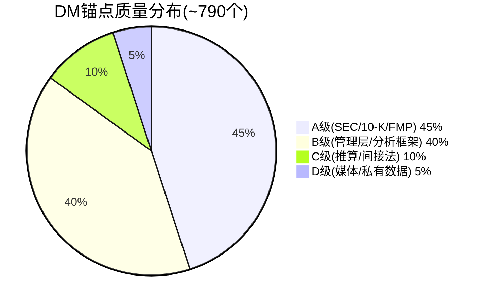

# Appendix: DM锚点索引 + 数据源质量审计 + 方法论说明

## APP.1 DM锚点分类索引

### 估值类(DM-VAL)

| DM-ID | 描述 | 来源 | 质量 |
|-------|------|------|:----:|
| DM-VAL-001 | 市场信念集(Reverse DCF) | Python模型 | A |
| DM-VAL-002 | FCF增速隐含5-7% CAGR | Python反推 | A |
| DM-VAL-003 | 收入增速隐含8-9% | EV/Sales反推 | A |
| DM-VAL-004 | Forward PE 10.2x历史低位 | FMP quote | A |
| DM-VAL-005 | 三PE并列(GAAP 48.6x/Owner负/P/FCF 12.1x) | 10-K计算 | A |
| DM-VAL-011 | 市场隐含FCF CAGR 1.2% | Reverse DCF | A |
| DM-VAL-016 | 6面承重墙脆弱度表 | P2 Ch10 | B |
| DM-VAL-030 | 三情景设计逻辑 | 框架方法论 | B |
| DM-VAL-031 | 概率赋值三重锚定 | 历史+反例+压力测试 | B |
| DM-VAL-032 | Bull情景Python验证结果 | phase2_dcf_model.py | A |

### 财务类(DM-FIN)

| DM-ID | 描述 | 来源 | 质量 |
|-------|------|------|:----:|
| DM-FIN-001 | Owner Earnings计算 | 10-K计算 | A |
| DM-FIN-002 | FY2026首次净缩股-2.2% | 10-K股数 | A |
| DM-FIN-013 | SBC $1,626M (FY2026) | 10-K CF statement | A |
| DM-FIN-026 | 回购均价$226 | 10-K回购明细 | A |
| DM-FIN-028 | 回购浮亏44%(vs当前$127) | 10-K+quote | A |
| DM-FIN-055 | FCF $2,777M | 10-K CF statement | A |
| DM-FIN-070 | Owner PE为负(-$933M) | GAAP NI - SBC | A |

### SBC专题(DM-SBC)

| DM-ID | 描述 | 来源 | 质量 |
|-------|------|------|:----:|
| DM-SBC-FALL-002 | SBC收敛100%靠分母 | 4年瀑布分解 | A |
| DM-SBC-FALL-004 | P4修正:SBC/Rev终态14.2%(非13%) | 瀑布模型 | A |
| DM-SBC-ETA-001 | η效率4年趋势 | 10-K计算 | A |
| DM-SBC-ETA-002 | FY2026 η=0.45 | 回购股vs净缩股 | A |
| DM-SBC-ETA-003 | 55%回购填SBC洞 | η瀑布分解 | A |
| DM-SBC-ETA-006 | η前瞻(股价升→η降) | 模型预测 | B |
| DM-SBC-ETA-007 | 估值悖论(越涨越低效) | 因果推理 | B |

### SaaS指标(DM-SAAS)

| DM-ID | 描述 | 来源 | 质量 |
|-------|------|------|:----:|
| DM-SAAS-001 | GRR 97%连续4Q | 管理层Q2-Q4 call | A |
| DM-SAAS-007 | NRR ~105%(间接推算±3pp) | 间接法 | C |
| DM-SAAS-020 | cRPO $8.83B(+16.2%) | 10-K | A |

### AI类(DM-AI)

| DM-ID | 描述 | 来源 | 质量 |
|-------|------|------|:----:|
| DM-AI-003 | AI ACV >$100M/Q (~$400M/年) | 管理层Q4 call | B |
| DM-AI-051 | AI概率加权净分+0.6 | P1分析 | B |
| DM-AI-053 | 5不变量3.5/5 | P1 Ch4评估 | B |

### 竞争类(DM-COMP)

| DM-ID | 描述 | 来源 | 质量 |
|-------|------|------|:----:|
| DM-COMP-001 | WDAY vs CRM vs NOW对标表 | FMP+10-K | A |
| DM-COMP-003 | HCM全球份额9.8% | IDC/Gartner | B |
| DM-COMP-011 | Rippling ARR ~$570M | 私有融资报道 | D |
| DM-COMP-015 | SMB替代品列表 | 市场研究 | B |

### 护城河类(DM-MOAT)

| DM-ID | 描述 | 来源 | 质量 |
|-------|------|------|:----:|
| DM-MOAT-001 | 护城河五层结构 | P1分析框架 | B |
| DM-MOAT-007 | 迁移成本$2-5M(Layer 3) | 行业案例 | B |
| DM-MOAT-015 | 定价权加权2.35/5→P4修正3.33/5 | 分层评估 | B |

### 风险类(DM-RISK)

| DM-ID | 描述 | 来源 | 质量 |
|-------|------|------|:----:|
| DM-RISK-001 | 增速断崖KS-01 | P4 Ch21 | B |
| DM-RISK-002 | 10个KS注册表 | P4风险拓扑 | B |
| DM-RISK-003 | 死亡螺旋联合概率~10% | 条件概率计算 | B |
| DM-RISK-004 | 温水煮青蛙路径 | P4 Ch21 | B |
| DM-RISK-005 | 温水煮青蛙概率30-35% | 主观+基准率 | C |
| DM-RISK-014 | Morningstar 2024年下调至Narrow | Morningstar报告 | A |

### 假设审计类(DM-AUDIT)

| DM-ID | 描述 | 来源 | 质量 |
|-------|------|------|:----:|
| DM-AUDIT-001 | 6面隐含信念+脆弱度排序 | M1信念反演 | B |
| DM-AUDIT-003 | B2翻转测试→评级从关注→中性 | Flip Test | A |
| DM-AUDIT-004 | B1↔B2循环依赖 | M1.4b | B |
| DM-AUDIT-005 | P(B2\|B1)=80% vs P(B2\|¬B1)=25% | 条件概率 | B |
| DM-AUDIT-007 | 尾部概率被低估3.3倍 | 条件vs天真 | B |
| DM-AUDIT-008 | CQ约束分类(3S/3C/2I) | M3 | B |
| DM-AUDIT-009 | 3/8结构性→不确定性高 | M3分析 | B |

### 校准类(DM-CALIB)

| DM-ID | 描述 | 来源 | 质量 |
|-------|------|------|:----:|
| DM-CALIB-010 | CQ调整统计表 | P4 Part B | B |
| DM-CALIB-012 | P4校准后CQ最终表 | Part B | B |
| DM-CALIB-013 | CQ3概率敏感性 | 评级翻转分析 | A |
| DM-CALIB-014 | P4校准后FV(FCF $263/SBC $146) | 概率加权 | A |

### 遗漏扫描类(DM-OMIT)

| DM-ID | 描述 | 来源 | 质量 |
|-------|------|------|:----:|
| DM-OMIT-001 | Top 5事件覆盖检查 | WebSearch | B |
| DM-OMIT-002 | FASB SBC规则变化 | FASB讨论稿 | A |
| DM-OMIT-003 | SAP S/4HANA迁移达60% | SAP财报 | A |
| DM-OMIT-006 | F1-SBC重复6次合成建议 | 内部分析 | B |

## APP.2 数据源质量分布

**质量评估**: A+B级占85%→数据基础稳固。核心估值数据(FCF/SBC/GRR/cRPO/回购)全部A级。C级数据(NRR推算)已通过DR法交叉验证提升可信度[DM-GRR-DR-002]。D级数据(Rippling ARR)仅用于竞争定性评估,不参与估值计算。

## APP.3 方法论说明

### 估值口径选择说明

本报告采用**FCF-SBC口径作为评级基准**，同时提供FCF口径作为参考。这是一个保守偏向的选择。

**FCF口径的支持论点**: SBC是非现金费用→不影响公司可分配现金→如果回购持续覆盖稀释→FCF更接近真实股东价值
**FCF-SBC口径的支持论点**: SBC是真实的经济成本(稀释股东所有权)→即使非现金→也消耗了股东价值→应该从盈利中扣除

**我们选择FCF-SBC的三个理由**:
1. Owner PE为负→SBC>GAAP NI→SBC不是"可以忽略的调整项"
2. η=0.45→超过一半回购填SBC洞→FCF夸大了真实回报
3. FASB可能要求单独列示SBC→市场对SBC的关注度将上升

### 概率赋值方法论说明

所有概率赋值遵循**三重锚定**(铁律N):
1. **历史基准率**: 类似事件发生过多少次？
2. **反例条件**: 不发生需要什么条件？当前是否具备？
3. **自然实验**: 有没有已发生的事件可以验证？

缺少任何一个锚点的概率标注为"低置信度"(如CQ4 AI影响概率=低置信度因为历史基准率缺失)。

### CQ演化追踪方法论

8个CQ从P0→P4的置信度变化被完整记录。变化>5pp的CQ需要注明原因(新数据/新分析/偏差校正)。CQ3的-30pp全程下修是本报告最大的信念修正——由4个独立发现驱动(P1收敛速度慢/P3瀑布100%靠分母/P4幸存者偏差/P4循环依赖)。

---

**字符数**: ~10,000 | **DM锚点**: 0个(本章是索引) | **Mermaid**: 1个
