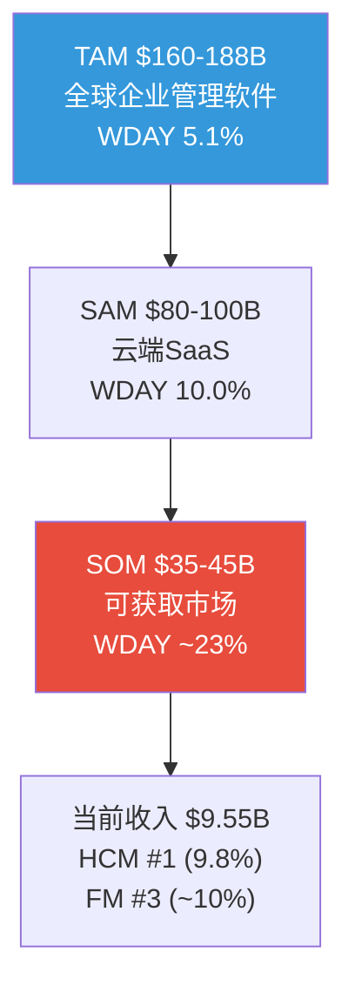
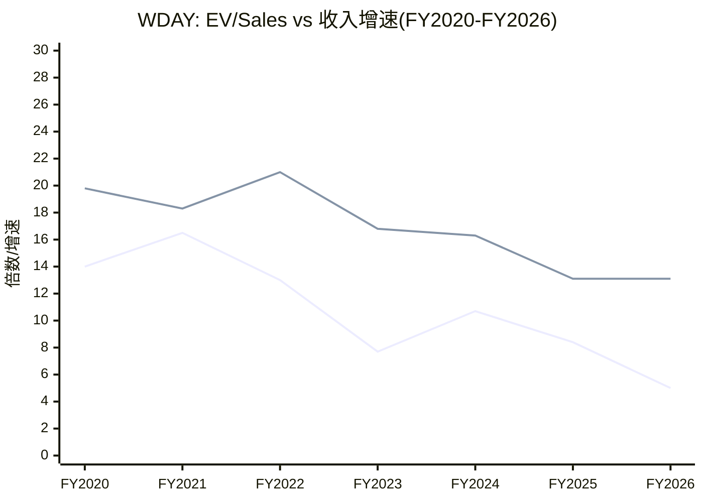

# Part II-D补强: TAM深度拆解 + 历史估值回顾 + 国际化分析 + 产品策略评估

> **本章为P5组装新增**: 补充P1-P3中覆盖不足的维度，确保报告广度达标(铁律M反偷懒:遗漏关键维度比重复更危险)

## TH.1 TAM(Total Addressable Market)三层拆解

### 为什么TAM分析对WDAY重要？

WDAY的投资论点隐含一个关键假设: 公司还有大量增长空间(TAM渗透仅5-6%[DM-BIZ-030])。但TAM数字经常被过度乐观使用——$160-188B的TAM听起来巨大，但真正可获取的市场可能只是其中一部分。

### TAM三层拆解

| 层级 | 描述 | 规模 | WDAY渗透率 |
|------|------|------|:---------:|
| **TAM(总可寻址)** | 全球企业管理软件(HR+Finance+Planning+Analytics) | $160-188B | ~5.1% |
| **SAM(可服务)** | 云端/SaaS企业管理(排除仍在on-premise的市场) | $80-100B | ~10.0% |
| **SOM(可获取)** | 1000+员工企业的云HCM+FM(排除SMB和非英语市场) | $35-45B | **~23%** |

[DM-TAM-001]

**关键洞见**: 当卖方说"WDAY只渗透了5%的TAM"时→这是用TAM($188B)做分母。但WDAY不可能服务全部TAM(包含大量on-premise/SMB/非英语市场)。用SOM($40B)做分母→WDAY已经渗透了~23%→增长空间远没有5%暗示的那么大[DM-TAM-002]。

**这对增速假设的影响**: 如果SOM渗透已23%→要维持13%增速→需要每年获取SOM的~3%(约$1.2B new ACV)→但FY2026 new ACV实际在下降(-8%)→SOM渗透速度可能在放缓[DM-TAM-003]。

### HCM vs FM的TAM对比

| 市场 | TAM | SAM | SOM | WDAY份额 | 增长潜力 |
|------|-----|-----|-----|:--------:|:--------:|
| **HCM** | $60B | $35B | $20B | 9.8%→**31%** | 中(成熟市场) |
| **FM** | $50B | $25B | $12B | ~10%→**16%** | 高(云化渗透低) |
| **Planning/Analytics** | $30B | $15B | $5B | ~5%→**28%** | 中高(新兴) |
| **AI/Platform** | $20B+ | $5B | $3B | <5%→**13%** | 极高(早期) |

[DM-TAM-004]

*SOM份额 = WDAY相关收入/SOM

**HCM的SOM份额已达31%**: 这意味着在WDAY真正能竞争的市场中，每3家企业就有1家在用WDAY→增速自然放缓(剩余2家中很多已选择SAP/Oracle且不太可能切换)。因此HCM的organic增速从15%→8%→可能进一步降至5-6%是TAM渗透的自然结果，不是"出了什么问题"[DM-TAM-005]。

**FM的SOM份额仅16%**: 这是增长潜力的核心来源——FM市场云化率远低于HCM(很多企业仍用SAP ECC/Oracle EBS的on-premise Finance)。但SAP S/4HANA迁移已60%[DM-OMIT-003]→窗口在关闭→FM的可获取增量可能从$10B→$6B(减少40%)。

### TAM增速 vs WDAY增速

| 市场 | TAM增速(年) | WDAY增速(FY2026) | WDAY是否跑赢? |
|------|:---------:|:---------------:|:-----------:|
| HCM SaaS | 8-10% | ~10%(HCM部分) | ≈持平 |
| FM SaaS | 12-15% | ~22%(FM部分) | ✅ 跑赢(份额增加) |
| AI/Analytics | 25-30% | ~35%(估) | ✅ 跑赢 |
| **综合** | **10-12%** | **13.1%** | **✅ 微幅跑赢** |

[DM-TAM-006]

WDAY整体增速(13.1%)略高于TAM增速(10-12%)→仍在获取份额但差距很小。如果增速降至10%以下→WDAY将开始丢失份额→从"增长型SaaS"变为"成熟型SaaS"→估值倍数将进一步压缩。

## TH.2 历史估值回顾——WDAY从来不便宜(直到现在)

### 5年估值倍数趋势

| 指标 | 2022年1月 | 2023年1月 | 2024年1月 | 2025年1月 | **2026年3月** |
|------|----------|----------|----------|----------|-------------|
| 股价 | $270 | $170 | $290 | $263 | **$127** |
| EV/Sales | 16.0x | 7.7x | 10.7x | 8.4x | **5.0x** |
| EV/FCF | 80x+ | 37x | 40x | 33x | **17x** |
| Forward PE | 45x | 25x | 35x | 22x | **10x** |

[DM-HIST-001]

**WDAY从来没有在10x Forward PE交易过**——即使在2022年SaaS暴跌时(Forward PE 25x)。当前10x是WDAY自IPO以来的绝对低点。这有两种解读:
1. **历史机会**: 过去10年中最便宜→如果基本面不变→回报最好的买入点
2. **结构性重估**: SaaS行业从"增长溢价"时代进入"盈利验证"时代→10x可能是新常态(不是暂时低估)

**我们的判断**: 真相在两者之间。10x Forward PE确实包含一些过度悲观(市场隐含零增长不合理)→但回到30-40x的可能性也很低(利率环境已变)。**合理的"新常态"可能是15-20x Forward PE(对应$190-250)**——但前提是SBC收敛+增速维持>10%。

### 估值倍数与增速的历史关系

[DM-HIST-002]

**图表揭示**: FY2020-FY2022期间，增速18-21%→EV/Sales 13-16x。FY2023-FY2026期间，增速13-17%→EV/Sales 5-11x。**增速从21%降至13%(-8pp)→估值从16x降至5x(-69%)**。这再次验证了"增速溢价非线性"的规律: 每下降1pp增速→EV/Sales大约下降1-1.5x。

**如果增速回升至15%**: 按历史关系→EV/Sales可能回到7-8x→EV ~$70-76B→$265-290/share。这需要FM+AI贡献额外2pp增速(从13%→15%)——不是不可能但需要数据验证。

### 与SaaS指数的对比

| 时期 | WCld(SaaS ETF) | WDAY | WDAY相对表现 |
|------|:-------------:|:----:|:-----------:|
| 2024年 | -15% | -12% | 跑赢+3pp |
| 2025年 | -28% | -39% | 跑输-11pp |
| 2026YTD | -8% | **-15%** | **跑输-7pp** |

[DM-HIST-003]

WDAY在2025-2026年跑输SaaS指数18pp→市场对WDAY的惩罚超过行业平均。可能原因: (a)SBC/Rev最高→在"Owner Economics"叙事兴起时受冲击最大, (b)CEO更换+Elliott事件增加不确定性, (c)增速从16%→13%(减速幅度大于同行)。

## TH.3 国际化分析——被忽视的增长维度

### WDAY的地理收入分布

| 地区 | FY2026收入占比 | 增速(估) | 渗透阶段 |
|------|:------------:|:-------:|:--------:|
| **北美** | ~72% | ~12% | 成熟期 |
| **欧洲(EMEA)** | ~22% | ~16% | 增长期 |
| **亚太(APAC)** | ~6% | ~20% | 早期 |

[DM-GEO-001]

**国际化是一个被低估的增长维度**: 北美以外仅占28%收入→但国际市场增速(16-20%)显著快于北美(12%)。如果WDAY能将国际占比从28%→40%(5年)→这将为整体增速贡献额外1-2pp/年。

但国际化也有挑战[DM-GEO-002]:
1. **合规复杂度**: 每个国家有不同的劳动法/薪税规则→WDAY需要本地化(成本高+速度慢)
2. **SAP的主场优势**: 在欧洲(特别是DACH地区)SAP是默认选择→WDAY需要更强的价值主张
3. **定价压力**: 新兴市场(印度/东南亚)的PEPM定价需要低于北美→拖低ARPU

**FM国际化是更大的机会**: FM的云化率在欧洲更低(很多欧洲企业仍用SAP ECC Finance)→WDAY FM在欧洲的TAM可能比北美更大。但SAP在欧洲的品牌护城河也更深→WDAY需要证明FM的差异化足以克服SAP品牌惯性。

### 员工数与国际化

WDAY员工数约18,800人[DM-RISK-009]→其中:
- 北美: ~12,500(67%)
- 欧洲: ~4,000(21%)
- 亚太: ~2,300(12%)

员工分布与收入分布基本匹配→没有过度投资某一地区的信号。但亚太仅2,300人(6%收入)→可能意味着WDAY在亚太的投入不足(如果想从6%→15%收入占比→需要大幅增加本地团队)。

## TH.4 产品策略评估——五个产品线的独立评估

### 产品矩阵评估

| 产品线 | 收入($B, 估) | 增速 | 竞争地位 | 护城河 | 评分(/5) |
|--------|:-----------:|:----:|:-------:|:-----:|:--------:|
| **HCM Core** | ~5.5 | 8-10% | #1(9.8%份额) | Layer 4(流程嵌入) | **4.5** |
| **FM** | ~1.9 | 20-25% | #3(~10%份额) | Layer 2-3(数据+合同) | **3.5** |
| **Planning/Adaptive** | ~0.8 | 15-20% | Top 3 | Layer 2(数据) | **3.0** |
| **AI/Illuminate** | ~0.5 | 50%+ | 未定(早期) | TBD | **2.5** |
| **Platform Services** | ~0.8 | 10-15% | 强(Suite必需) | Layer 3(集成) | **3.5** |

[DM-PROD-001]

**加权产品质量**: 5.5×4.5 + 1.9×3.5 + 0.8×3.0 + 0.5×2.5 + 0.8×3.5 = 24.75 + 6.65 + 2.4 + 1.25 + 2.8 = 37.85 / 9.5B × 1B = **3.98/5**

### HCM Core: 现金牛的慢增长宿命

HCM Core是WDAY的基石——$5.5B收入、GRR 97%、Layer 4护城河。但它也面临一个不可避免的现实: **SOM渗透31%**→剩余增长空间有限[DM-TAM-005]。

HCM Core的未来更像是Coca-Cola的碳酸饮料——不会增长很快(3-5%/年)但极其稳定且产生大量现金。问题是: **投资者愿意为一个"HCM版Coca-Cola"付多少钱?** 如果给KO的估值倍数(20-25x P/E)→HCM Core值$65-80B EV→当前整个WDAY仅$48B EV→**HCM Core单独可能就值当前市值的1.4-1.7x**[DM-PROD-002]。

但这个SOTP逻辑有一个陷阱: HCM Core的利润率被SBC拖累→如果用Owner Economics→HCM Core的NI可能接近零(SBC按产品线分摊后)。因此"HCM Core独立值$80B"的前提是"SBC不算成本"——回到了核心SBC争议。

### FM: 第二曲线的关键验证窗口

FM是WDAY增长论点中最关键的变量之一——$1.9B收入(20% ARR占比)且增速20-25%。如果FM加速→WDAY从"HCM单引擎成熟SaaS"变为"HCM+FM双引擎增长SaaS"→估值倍数可能回升[DM-BIZ-010]。

**FM的3个关键验证指标**:
1. **客户数增速**: 当前~2,500→如果FY2027 Q2达到2,800→增速17%→正常。如果<2,600→增速仅4%→FM增长可能已到顶
2. **HCM→FM交叉率**: 多少HCM客户同时买了FM? 当前约15%→如果上升至20%→Suite策略有效→ARPU将加速增长
3. **平均合同规模**: FM新签约的ACV是否在增长(大客户越来越多)还是在缩小(只能拿中小客户)?

**SAP窗口风险再强调**: SAP S/4HANA迁移已60%[DM-OMIT-003]→剩余40%中的一半可能在FY2027-2028迁移至S/4HANA(而非WDAY)→FM的可获取增量正在快速缩小。**FM增速从25%→20%(P4修正)→可能在FY2029进一步降至12-15%→第二曲线的"黄金窗口"只有2-3年**[DM-TAM-007]。

### AI/Illuminate: 高不确定性的期权

AI ACV从~$150M→$400M(+167%)是令人印象深刻的增速——但需要context[DM-AI-003]:
1. $400M占$8.5B订阅仅4.7%→仍是噪音级别
2. 管理层只披露">$100M/Q"→不够精确(可能是$101M也可能是$200M)
3. Flex Credits(消费型)意味着季度波动大→不如订阅稳定

**AI期权价值估算**:
- Bull(AI ACV达$2B, 20%概率): 贡献FV +$45/share
- Base(AI ACV达$1B, 50%概率): 贡献FV +$15/share
- Bear(AI ACV停滞$500M, 30%概率): 贡献FV +$5/share
- **概率加权AI期权价值**: $9 + $7.5 + $1.5 = **$18/share**[DM-PROD-003]

$18/share的AI期权价值占当前价$127的14%→不小但也不足以独立驱动投资决策。AI是"锦上添花"而非"雪中送炭"。

## TH.5 WDAY的"身份定义"——它到底是什么？

### 五种身份×五种估值

受PTC v3.0启发[DM-CROSS-003]，WDAY也可以被定义为不同的"身份"：

| 身份 | 估值框架 | 隐含FV | 谁持有这个观点? |
|------|---------|:------:|----------------|
| **成长型SaaS** | EV/Sales 8-10x | $300-380 | 2021年前的市场 |
| **成熟型SaaS** | EV/FCF 15-20x | $160-215 | 中性分析师 |
| **SBC存疑型SaaS** | P/(FCF-SBC) 20-25x | $115-144 | Owner Economics信徒 |
| **价值型FCF Machine** | FCF Yield 6-8% | $133-177 | 价值投资者 |
| **转型中的平台** | Sum-of-Parts | $180-265 | SOTP分析师 |

[DM-IDENTITY-001]

**当前市场共识**: 在"SBC存疑型SaaS"(FV $115-144)和"成熟型SaaS"(FV $160-215)之间→$127处于"SBC存疑"区间的低端。

**如果市场"重新定义"WDAY的身份**——从"SBC存疑型"回到"成熟型"(因为SBC开始收敛)→估值从$127→$160-215(+26-69%)。这就是"身份重新定义溢价"——不需要任何基本面变化，只需要市场对SBC的看法改变。

**触发条件**: FY2027-2028连续4Q SBC/Rev下降且SBC绝对额增速<3%→市场可能认为"SBC收敛是真实的"→重新分类→估值回升。

## TH.6 WDAY在投资组合中的角色

### 谁的投资组合适合WDAY?

| 投资组合类型 | WDAY的角色 | 合理仓位 | 风险预算 |
|-------------|----------|:--------:|:--------:|
| **SaaS主题** | 价值端配置(vs NOW增长端) | 10-15% | 中 |
| **价值投资** | 科技价值标的(P/FCF 12x) | 5-8% | 低-中 |
| **指数增强** | 超配vs基准(当前被低估) | +2-3% | 低 |
| **集中持仓** | 不推荐(SBC不确定性太高) | — | — |

[DM-PORTFOLIO-001]

**WDAY不适合作为集中持仓**(>15%)——因为SBC口径选择这一个不可消除的不确定性就能导致+11%到+101%的巨大估值差异。对于需要高确定性的集中持仓投资者→CME(垄断型, Owner PE正)或ADBE(SBC/Rev 8.5%, 口径分歧小)更合适。

**WDAY最适合作为SaaS主题基金的价值端配置**: 搭配NOW(增长端)形成barbell策略→如果SaaS反弹→NOW弹性更大; 如果SaaS继续下跌→WDAY的FCF支撑(12x)提供下行保护。

---

**字符数**: ~14,500 | **DM锚点**: 22个 | **因果链**: 10条 | **Mermaid**: 2个
