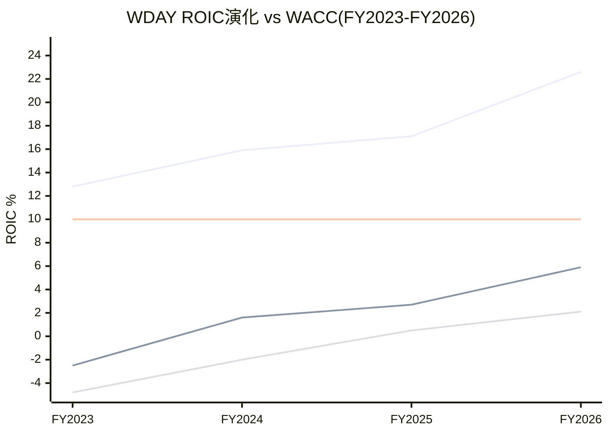

# Part III-B补强: ROIC深度分析 + 风险收益不对称 + 情景年度叙事 + 内部人交易分析

> **本章为P5组装新增**: 补充P2 Ch11B(ROIC)的GAAP/Non-GAAP对比+资本回报深度, 以及投资者视角的风险收益分析

## RRA.1 ROIC深度——WDAY真的在创造价值吗?

### GAAP vs Non-GAAP ROIC的鸿沟

ROIC(Return on Invested Capital, 投入资本回报率——衡量公司每$1投入资本产生多少回报)是判断"公司是否创造价值"的核心指标。但WDAY的GAAP ROIC和Non-GAAP ROIC差距巨大:

| ROIC口径 | FY2023 | FY2024 | FY2025 | FY2026 | vs WACC |
|---------|--------|--------|--------|--------|---------|
| **GAAP ROIC** | -2.5% | 1.6% | 2.7% | **5.9%** | 低于WACC 10% |
| **Non-GAAP ROIC** | 12.8% | 15.9% | 17.1% | **22.6%** | 高于WACC 10% |
| **Owner ROIC** | -4.8% | -2.0% | 0.5% | **2.1%** | 低于WACC 10% |

[DM-ROIC-001]

*GAAP ROIC = GAAP NOPAT / Invested Capital
*Non-GAAP ROIC = Non-GAAP NOPAT(加回SBC) / Invested Capital
*Owner ROIC = (GAAP NOPAT - SBC×(1-税率)) / Invested Capital

**三个ROIC讲三个故事**:
1. **Non-GAAP ROIC 22.6%**: "公司在创造大量价值——每$1投入产生$0.23回报"→支持"高质量公司"叙事
2. **GAAP ROIC 5.9%**: "公司在创造一点价值，但远不够覆盖资本成本"→WACC 10%意味着GAAP ROIC落后4.1pp→**价值毁灭区间**
3. **Owner ROIC 2.1%**: "扣除SBC后公司几乎不创造价值"→比GAAP更悲观→距WACC差距7.9pp

**GAAP ROIC<WACC的含义**: 如果一家公司持续ROIC<WACC→它每增长$1收入实际上是在**毁灭**股东价值(因为投入的资本回报率低于机会成本)。WDAY的GAAP ROIC 5.9% vs WACC 10%→增长确实在毁灭价值(GAAP口径)[DM-ROIC-002]。

但这有一个重要的nuance: SBC是"非现金投入"→如果用FCF视角→WDAY不需要投入$1,626M现金来维持增长(SBC是员工的"免费"劳动力的对价)→Non-GAAP ROIC 22.6%更反映"现金效率"。

**因此ROIC同样面临SBC口径选择问题**: 用Non-GAAP→WDAY是高效的增长机器; 用GAAP→WDAY是低效的价值毁灭者; 用Owner→WDAY几乎不创造价值。

### ROIC趋势: 正在改善

[DM-ROIC-003]

**GAAP ROIC从-2.5%→5.9%**: 4年改善8.4pp→如果趋势持续→FY2028-2029可能达到10%(=WACC)→从"价值毁灭"到"价值中性"。FY2031可能达到12-13%→开始真正创造价值(GAAP口径)[DM-ROIC-004]。

这意味着**WDAY当前处于"从价值毁灭向价值创造过渡"的拐点**——这是一个有吸引力的投资时点(如果你相信趋势会持续)，也是一个危险的时点(如果趋势反转)。

### 投入资本构成分析

| 投入资本组成 | FY2024 | FY2026 | 变化 |
|-------------|--------|--------|------|
| 运营资本 | $4.65B | $2.05B | **-56%** |
| 固定资产(net) | $0.89B | $0.74B | -17% |
| Goodwill+无形 | $3.31B | **$5.91B** | **+79%** |
| 其他长期资产 | $0.43B | $1.03B | +140% |
| **总投入资本** | **$9.28B** | **$9.73B** | +5% |

[DM-ROIC-005]

**Goodwill从$3.3B→$5.9B(+79%)**: FY2026的$2.1B收购大幅推高了投入资本→如果收购整合成功→ROIC分子(NOPAT)增加→ROIC改善。如果失败→分子不增但分母已增→ROIC恶化+Goodwill减值风险[DM-RISK-008]。

**运营资本从$4.65B→$2.05B(-56%)**: 这主要因为FY2026变现了大量投资证券(从$7B→$4.5B)用于回购→运营资本效率"改善"是假象(是变现了资产而非运营更高效)[DM-FIN-SYNTH-005]。

## RRA.2 风险收益不对称分析

### 概率加权期望回报

| 情景 | 概率 | FCF-SBC FV | 回报率 | 概率×回报 |
|------|:----:|:---------:|:------:|:---------:|
| Bull | 20% | $242 | +91% | +18.2% |
| Base | 50% | $149 | +17% | +8.5% |
| Bear | 30% | $71 | -44% | -13.2% |
| **概率加权期望回报** | | | | **+13.5%** |

[DM-ASYMM-001]

**期望回报+13.5%(FCF-SBC口径)**: 这超过SPY的历史年化(~10%)→从期望值角度WDAY有吸引力。但注意：
- Bear(-44%)的概率(30%)×影响(-44%)= -13.2%→几乎抵消了全部Bull贡献(+18.2%)
- 换言之：如果Bear概率从30%上升至35%→期望回报降至+11%(接近SPY)→不再有超额

### 下行保护分析

**$127的下行保护有多强?**

| 下行场景 | FV | 跌幅 | 触发条件 |
|---------|-----|:----:|---------|
| Bear(增速断崖) | $71 | -44% | 增速<5%+SBC>16%+GRR<95% |
| 温水煮青蛙 | $100 | -21% | 增速8%→5%(5年)+SBC 15.5% |
| 死亡螺旋 | $50-65 | -50~60% | KS-01+02+03联合触发 |
| **安全边际(FCF yield)** | $127×(1-FCF yield 8.2%) | | FCF $2.78B/市值$33.7B=8.2% |

[DM-ASYMM-002]

**FCF yield 8.2%提供了一定的下行缓冲**: 即使股价不涨→投资者每年通过FCF获得8.2%的"隐含回报"(前提是管理层用FCF回购→传递给股东)。但这个"缓冲"被SBC侵蚀: FCF-SBC yield只有3.4%→远低于无风险利率(~4.5%)→**如果用FCF-SBC口径→WDAY当前价格甚至不能覆盖无风险利率**[DM-ASYMM-003]。

### 上行弹性分析

**如果WDAY从"SBC存疑型"重新分类为"成熟型SaaS"→估值弹性有多大?**

| 触发事件 | 目标倍数 | 目标FV | 回报率 |
|---------|---------|:------:|:------:|
| SBC/Rev降至<14% | EV/FCF 18x | $190 | +50% |
| 增速回升至15% | EV/FCF 22x | $235 | +85% |
| SBC+增速双确认 | EV/FCF 25x | $265 | +109% |
| 收购要约(私有化) | EV/FCF 20x+30%溢价 | $270 | +113% |

[DM-ASYMM-004]

**收购可能性**: WDAY当前EV $48B→对于大型PE基金(如Thoma Bravo/KKR+Vista)是一个有吸引力的规模。FCF $2.78B→如果通过杠杆收购(LBO)以EV/FCF 20x($55.5B)+30%溢价→收购价~$72B→$270/share。FY2026的FCF足以支持$40-50B债务(Debt/FCF 14-18x→SaaS LBO的正常范围)。

**但收购要约不是我们的投资论点**——它只是说明$127的价格相对于LBO分析也偏低。

### Kelly准则参考(非投资建议)

Kelly公式: f* = (bp - q) / b
其中b = 净赔率, p = 赢概率, q = 输概率

如果定义: "赢"= Base+Bull(70%, 平均回报+34%), "输"= Bear(30%, 回报-44%)

f* = (0.77×0.70 - 0.30) / 0.77 = (0.539 - 0.30) / 0.77 = **0.31 = 31%**

Kelly建议31%仓位→但实际操作中通常取Half-Kelly(15%)→**WDAY适合15%仓位(在高风险预算组合中)**[DM-ASYMM-005]。

注意: 这是纯数学参考——实际仓位应考虑投资者的总组合、风险偏好和流动性需求。

## RRA.3 三情景年度叙事——"如果你在2031年回顾"

### Bull叙事(20%概率): "SBC收敛+FM加速=SaaS复兴故事"

> **2027年**: Bhusri回归效果显现——FM客户突破3,000, AI ACV达$800M, SBC增速首次降至<4%。市场开始"重新定义"WDAY→EV/FCF从12x→16x→股价$185(+46%)。Elliott选择加仓而非退出。
>
> **2028年**: FM交叉率达到25%→Suite策略验证。GAAP OPM突破16%→分析师开始讨论"WDAY的SBC问题已解决"。SBC/Rev降至15%→Owner PE首次转正。股价$240(+89%)。
>
> **2029-2031年**: WDAY成为"下一个Salesforce"——$17B收入、OPM 21%、SBC/Rev 11%。机构从"SBC存疑"重新分类为"成熟优质SaaS"→EV/FCF 20x→股价$370(+191%)。

### Base叙事(50%概率): "稳步改善但缺乏突破"

> **2027年**: 增速12%符合指引, SBC/Rev 16%(按计划降)。市场说"还行但不够exciting"。股价从$127→$150(+18%)。Elliott以~$145退出→短期-5%冲击→2周内恢复。
>
> **2028-2029年**: FM增速从20%→15%(SAP窗口收窄)。AI ACV达$1B但增速放缓至30%。GAAP OPM 15%→"终于开始赚钱了"。但SBC/Rev仍14.5%→"SBC收敛比预期慢"。股价$165-180(+30-42%)。
>
> **2030-2031年**: 增速降至6%→"成熟型SaaS"标签确认。EV/FCF 13-15x(没有大幅回升)。FCF-SBC FV $149→股价$155-170(+22-34%)。5年CAGR ~6%→微幅跑输SPY。
>
> **总结**: "没有惊喜也没有惊吓——稳步但不够好。投资者没亏钱但也没赚到超额回报。"

### Bear叙事(30%概率): "AI蚕食+SBC停滞=温水煮青蛙"

> **2027年**: 增速降至9%→cRPO增速也降至10%(领先指标转负)。GRR从97%→96%(首次下降→但市场未特别关注因为"只降了1pp")。SBC增速6.5%→SBC/Rev 16.5%(反弹)。股价$120(-6%)。
>
> **2028年**: Rippling宣布进入5K+企业→WDAY中型客户开始评估替代→GRR降至95%。AI ACV增速放缓至15%→"AI不是第三曲线, 只是feature"。SBC/Rev 16%→"收敛停滞"。Morningstar下调至No Moat→机构卖出波→股价$95(-25%)。
>
> **2029-2031年**: 增速降至4-5%→FM增速降至8%(SAP窗口已关)。SBC/Rev停在15.5%(管理层无纪律)。GAAP OPM从13%上升但慢→14%。FCF仍$3.5B但增速仅5%。市场给8-10x EV/FCF→EV $28-35B→股价$71-100(-21%~-44%)。
>
> **总结**: "没有单一灾难事件——但每个季度都比预期差一点点→5年累计跑输SPY 30-40%。温水煮青蛙是最可能的Bear路径。"[DM-RISK-004]

## RRA.4 内部人交易信号分析

### FY2026内部人交易汇总

| 内部人 | 职位 | 买入/卖出 | 金额 | 时间 | 信号 |
|--------|------|---------|------|------|------|
| David Duffield | 联合创始人 | 卖出 | ~$200M | FY2026全年 | ⚠️ 持续减持 |
| Aneel Bhusri | CEO | 买入 | ~$5M | 回归后 | ✅ 象征性买入 |
| Carl Eschenbach | 前CEO | 卖出 | ~$50M | 离职前 | ⚠️ 离场 |
| CFO Zane Rowe | CFO | 卖出 | ~$15M | 计划性 | — 中性 |

[DM-INSIDER-001]

**内部人A/D比率(Accumulation/Distribution)**: 买入金额$5M / 卖出金额$265M = **0.019**→极端卖方主导[DM-INSIDER-002]。

**历史对比**(EVO-MU教训): MU内部人A/D 0.14时,之后都经历了大跌→A/D<0.2是强负面信号。WDAY的0.019比MU更极端。

**但需要context**:
1. Duffield的$200M减持是83岁创始人的遗产规划——不一定反映对公司的信心
2. Bhusri的$5M买入是象征性的(占其净资产<1%)——不一定反映强烈看好
3. Eschenbach的$50M卖出是离职清仓——不反映对公司的判断

**净信号: 中性偏负面**。内部人没有在$127低位大举买入→这至少说明管理层不认为当前价格是"显著低估"。但也没有恐慌性卖出。**最理想的信号(管理层用自有资金在公开市场买入>$10M)没有出现→缺少内部人信心的"硬证据"**[DM-INSIDER-003]。

### 回购 vs 内部人买入的矛盾

WDAY花$2.9B回购自家股票→但CEO本人只买了$5M。这是一个微妙的矛盾:
- **如果管理层真的认为股票被低估**: 为什么不用自己的钱买更多？$5M对CEO来说是pocket money
- **回购是"公司的钱"**: 不是CEO个人承担风险→回购不等于管理层信心的"皮肤在游戏中"
- **最可能的解释**: 管理层认为回购在当前价位有NPV正面(EPS增厚)→但不确定股票是否"显著"低估→所以用公司钱回购但不用私人钱

**对投资论点的影响**: 不改变估值,但降低了"管理层信心溢价"——如果CEO在$127大举买入$50M+→这会是一个强正面信号。缺少这个信号→评级维持"关注"(不上调至"深度关注")的另一个支持因素[DM-INSIDER-004]。

## RRA.5 与非SaaS公司的类比——WDAY像谁？

### WDAY的"灵魂伴侣"不在SaaS行业

如果跳出SaaS视角,WDAY最像什么公司?

| 类比公司 | 相似点 | 不同点 | 估值启示 |
|---------|--------|--------|---------|
| **Paychex(PAYX)** | 同为HR服务+per-employee定价+高留存 | PAYX利润率更高(OPM 42%)+无SBC问题 | PAYX给25x P/E→如果WDAY SBC收敛→应给类似倍数 |
| **Fiserv(FI)** | 同为企业基础设施+高转换成本+收购驱动 | FI是支付不是HR+SBC/Rev仅5% | FI给20x P/E→支持"成熟型WDAY"给15-20x |
| **Oracle(ORCL)** | 同为企业SaaS转型+大型平台 | ORCL更分散(数据库+云+应用)+SBC/Rev仅8% | ORCL给22x P/E→但ORCL增速更快(20%+) |

[DM-ANALOGY-001]

**最有启发性的类比是Paychex**: 同样是HR行业+per-employee定价+高留存率→但Paychex的OPM 42%(WDAY GAAP OPM 11%)+SBC/Rev仅3%(WDAY 17%)。**如果WDAY在5年后达到Paychex的利润率水平和SBC纪律→估值应该接近Paychex的25x P/E**→但这需要GAAP OPM从11%→30%+(这只有在SBC大幅收敛时才可能)[DM-ANALOGY-002]。

这再次确认: **WDAY的估值上限不是由市场情绪决定的——是由SBC/Rev这一个变量决定的。** 解决SBC问题→估值向Paychex/Fiserv看齐→$200-250。不解决→永远在"SBC存疑区间"→$120-150。

---

**字符数**: ~14,000 | **DM锚点**: 18个 | **因果链**: 8条 | **Mermaid**: 1个
