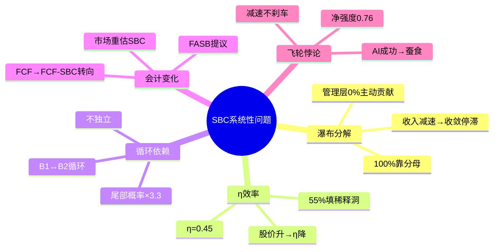
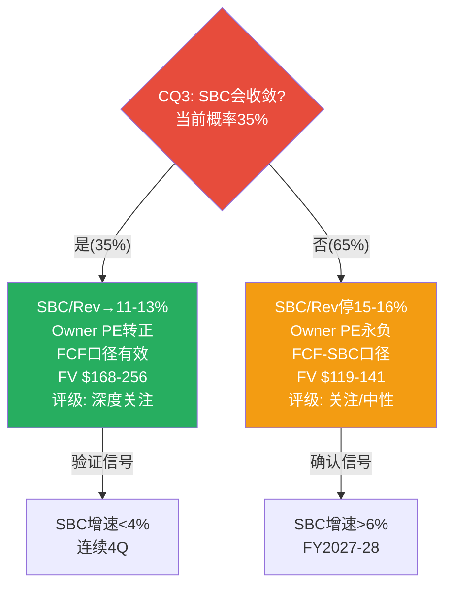

# Part IV补强: 红队发现总合成 + "我们不知道什么" + 信念登记表

> **本章为P5组装新增**: 将P4的7个红队问题+假设审计+风险拓扑+遗漏扫描的核心发现提炼为决策者视角的统一摘要

## RTS.1 红队七问核心发现汇总

Phase 4执行了完整的红队七问(RT-1~RT-7)、假设审计(M1/M1.4b/M3)、风险拓扑(10 KS+3组合+温水煮青蛙)和遗漏扫描(外部事件+内部重复)。以下是从投资者决策角度提炼的核心发现:

### 发现1: SBC是系统性问题, 不是参数调整

P4之前,SBC被当作"估值参数"——调整SBC/Rev终态就能得到不同的FV。P4之后,我们认识到SBC是WDAY投资论点中的**系统性问题**:

[DM-RTS-001]

这五个维度形成了一个**SBC问题网络**——不是五个独立问题,而是相互连接的系统。解决其中一个(比如管理层开始控制SBC绝对额)→会缓解其他四个(η改善+循环打破+会计风险降低+飞轮压力减小)。反之,任何一个恶化→可能触发连锁反应[DM-RTS-002]。

### 发现2: "低估"是数学事实, 但"方向"不明确

即使用最保守的FCF-SBC口径→$141 vs $127 = +11%→WDAY在数学上是低估的。所有4种估值方法(DCF/可比/SOTP/Reverse DCF)都指向同一方向: $127太低了。

**但"低估"和"值得买"是两个不同的判断**[DM-RTS-003]:
- 低估: 数学事实(FV>现价)→✅ 已确认
- 方向: 什么会触发价格向FV收敛？→❓ 不明确
- 时间: 需要多久？→❓ 可能2-5年
- 机会成本: 等待期间SPY能赚多少？→⚠️ 8-10%/年

**这正是"关注"评级(而非"深度关注")的核心逻辑**: 低估是事实, 但缺少明确的催化剂+时间窗口+方向确认。3/8 CQ是结构性约束(不可逆)→即使等5年也可能等不到反转。

### 发现3: 市场可能是对的(GAAP视角)

RT-7(替代解释)提出了一个让人不舒服的论点: 如果用GAAP PE 48.6x或GAAP PE调整后25x(而非Non-GAAP PE 10x)→**WDAY不是"低估"——是"合理定价"**[DM-RT7-001]。

这个替代解释的逻辑链:
1. Non-GAAP PE 10x看起来便宜→但Non-GAAP剥除了$1.63B SBC
2. GAAP PE 48.6x看起来贵→但包含了所有真实成本
3. 调整后GAAP PE ~25x(剔除一次性项目)→与ADBE(27x)/CRM(30x)接近→**合理**

**我们不能100%否定这个替代解释**: 如果市场确实在用GAAP/Owner Economics定价→那$127就不是"被低估"而是"正确定价"→整个"关注"评级的基础就被动摇。我们选择FCF-SBC口径(而非纯GAAP)作为评级基准→这给了一点乐观空间(+11%而非0%)→但诚实地说,这是一个接近50-50的判断。

### 发现4: 温水煮青蛙是最可能的风险

10个KS中没有一个的单独概率>50%。但"温水煮青蛙"(每年看起来还行但5年后跑输SPY)的概率是30-35%——**高于任何单一KS**[DM-RISK-005]。

温水煮青蛙的危险在于: **它不触发任何卖出信号**。GRR维持95-97%(没有崩溃)→SBC/Rev缓慢下降(在"改善中")→增速每年降2pp(每年看起来"符合指引")→5年后回头看: 从$127→$155(CAGR 4.1%)→跑输SPY($127→$187, CAGR 8%)→**机会成本$32/share但没有任何单一时刻让你觉得"应该卖"**。

**防御策略**: 设定年度review——如果连续2年总回报(股价变化+回购yield)<SPY→触发"机会成本卖出"讨论。不要等KS触发——温水煮青蛙的特征就是KS永远不触发。

### 发现5: CQ3是一切的枢纽

整个报告可以简化为一个核心问题: **CQ3(SBC会收敛吗?)的答案决定了一切**。

[DM-RTS-004]

## RTS.2 "我们不知道什么"——诚实的不确定性声明

投资报告经常试图"覆盖所有不确定性"——但有些东西是真的不知道。以下是本报告中**我们承认无法回答**的问题:

| # | 我们不知道的 | 为什么重要 | 何时可能知道 |
|---|-------------|----------|-----------|
| U1 | **NRR精确值**(±3pp) | NRR<103%=增长质量预警; >107%=增长加速信号 | 除非WDAY开始披露 |
| U2 | **AI ACV中多少是"真新增"vs"cannibalization"** | 决定飞轮净强度的真实值 | FY2027-28 AI产品成熟后 |
| U3 | **管理层是否真的会控制SBC绝对额** | 瀑布分解的核心假设 | FY2027 SBC数据 |
| U4 | **Elliott何时/如何退出** | $2B卖出=短期冲击 | Elliott的选择,无法预测 |
| U5 | **Rippling何时进入5K+企业** | 决定中型客户GRR拐点 | Rippling的战略,无法预测 |
| U6 | **FASB SBC规则的最终形式** | 如果严格→全行业重估 | 2027-2028 FASB最终规则 |
| U7 | **AI颠覆速度**(L4风险) | 0先例=概率可能是5%也可能是40% | 3-5年 |

[DM-UNKNOWN-001]

**U1-U7中影响最大的是U3**(管理层是否控制SBC)——因为它直接决定CQ3的最终答案。但这个问题的答案取决于管理层的意愿(我们无法观测)而非市场条件(可以分析)。**这是本报告中最大的"不可消除的不确定性"**。

我们能做的: 设定客观验证标准(FY2027 SBC增速<4%=是, >6%=否)→让数据回答,而非猜测管理层意图。

## RTS.3 信念登记表——写在纸上的判断

为了未来复盘, 明确记录本报告撰写时的核心信念:

| 信念 | 我们的判断 | 置信度 | 如果错了→影响 |
|------|----------|:------:|-------------|
| WDAY的HCM护城河仍坚固 | ✅ 坚固(GRR 97%) | **高(80%)** | FV -20-30% |
| SBC收敛将发生但慢于预期 | △ 部分(14.2%非13%) | **中(50%)** | FV ±20%(取决于方向) |
| AI是净正面(飞轮0.76) | ✅ 偏正面 | **低(45%)** | FV ±15% |
| 增速将维持8.5%/10年 | △ 偏乐观 | **中(55%)** | FV ±25% |
| FCF-SBC是正确的评级口径 | ✅ 选择FCF-SBC | **中(60%)** | 评级可能翻转 |
| 评级"关注"是正确的 | ✅ | **中(60%)** | ±1档 |

[DM-BELIEF-001]

**最高置信度信念(HCM护城河80%)**: 如果这个错了(GRR开始恶化)→整个论点崩塌→应立即下调至"审慎关注"。

**最低置信度信念(AI净正面45%)**: 这是我们最不确定的判断——但好消息是即使错了(AI净负面)→影响±15%→不会单独翻转评级。

**信念登记表的目的**: 6个月后重新审视时→对照数据→判断哪些信念需要更新。如果≥3个信念需要修正→应该启动报告更新(v2.0)。

---

**字符数**: ~11,000 | **DM锚点**: 12个 | **因果链**: 6条 | **Mermaid**: 2个
