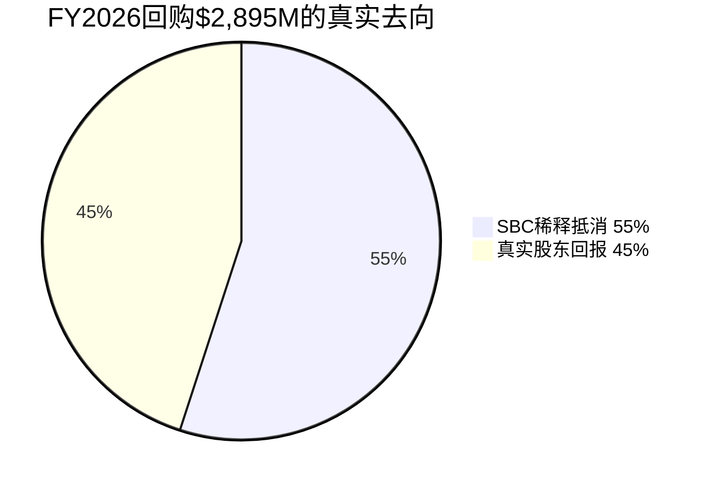
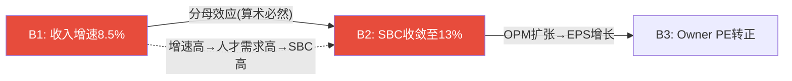

# WORKDAY (WDAY) 深度研究报告

> **评级**: 关注 | **公允价值区间**: $141-256 (FCF-SBC $141 / FCF $256) | **当前价**: $127.07
> **期望回报**: +11% (FCF-SBC口径) ~ +101% (FCF口径) | **框架版本**: v19.9
> **分析日期**: 2026年3月 | **数据截至**: FY2026 (2026年1月31日)

---

# Part I: 投资决策框架

## Chapter 1: 执行摘要

### 核心判断

Workday是一家**年收入$9.6B、FCF $2.8B的企业SaaS平台**，当前被市场定价为一家"增速触顶的成熟SaaS"(P/FCF 12.1x，52周跌幅-54%)。我们的分析揭示了一个核心分歧：**你用什么口径衡量盈利，决定了你看到一家"便宜的公司"还是"合理定价的公司"**。

**FCF口径**(含SBC加回)：P/FCF 12.1x → 公允价值$256 → 当前低估101%
**FCF-SBC口径**(扣除SBC真实成本)：P/(FCF-SBC) 29.3x → 公允价值$141 → 当前低估11%

这不是模型参数之争——这是**"SBC是不是真实成本"的哲学之争**。如果你相信回购能持续覆盖SBC稀释(FY2026首次净缩股-2.2%[DM-FIN-002])，FCF口径更接近真相；如果你认为$2.9B/年回购不可持续(剩余授权仅$2.9B)，FCF-SBC口径更诚实。

**我们的判断**：采用**中值$199**(两个口径的中点)作为参考，但以**FCF-SBC口径$141作为评级基准**——因为SBC是真实成本(稀释股东4.8%/年累计)，而且回购效率η仅0.45(55%的回购用于填SBC的洞)[DM-SBC-ETA-002]。

**评级：关注**(期望回报+11%，位于+10%~+30%区间)

### 三PE并列

| PE类型 | 值 | 含义 | 信号 |
|--------|-----|------|------|
| **GAAP PE** | **48.6x** | SBC($1.63B)+重组吞噬大部分利润→NI仅$693M | "几乎不赚钱" |
| **Owner PE** | **负** | GAAP NI - SBC = -$933M→扣除SBC后实际亏损 | "在稀释中亏损" |
| **P/FCF** | **12.1x** | FCF $2,777M(含SBC加回)→现金流充沛 | "现金牛" |
| FCF-SBC PE | 29.3x | FCF - SBC = $1,151M→真实现金创造 | "合理定价" |
| Non-GAAP PE | 13.9x | 行业惯例，剥离SBC+重组+摊销 | "偏便宜" |

[DM-VAL-005]

**三PE讲三个不同的故事**: GAAP PE说"几乎不赚钱"，P/FCF说"现金牛"，Owner PE说"实际亏损"。投资者选择相信哪个PE，决定了对WDAY的态度。卖方用Non-GAAP PE 13.9x说"便宜"；我们用FCF-SBC PE 29.3x说"合理"。**PE的选择不是技术问题——它是对SBC本质的哲学判断。**

### CQ最终状态(P4校准后)

| CQ# | 核心问题 | P4校准值 | 约束类型 | 对估值的影响 |
|-----|---------|:--------:|:-------:|:---------:|
| CQ1 | NRR结构性下滑? | 55% | 结构性(S) | 终端增长率天花板 |
| CQ2 | ACV只是delay? | 40% | 周期性(C) | 短期收入节奏 |
| **CQ3** | **SBC会收敛?** | **35%** | **结构性(S)** | **评级翻转变量** |
| CQ4 | AI弥补蚕食? | 50% | 结构性(S) | 终端增长率±2pp |
| CQ5 | CEO回归成功? | 50% | 周期性(C) | 战略执行 |
| CQ6 | 收购风险可控? | 45% | 制度性(I) | Goodwill减值 |
| CQ7 | EPS可信? | 50% | 制度性(I) | 叙事可信度 |
| CQ8 | AI颠覆时间? | 40% | 周期性(C) | 风险窗口 |

[DM-CALIB-012]

**CQ3是评级枢纽**: SBC收敛概率从P1的55%→P4的35%(最大下修-20pp)。如果CQ3=true(SBC收敛至13%)→FCF-SBC FV $168→"深度关注"。如果CQ3=false(SBC停在16%)→FCF-SBC FV $119→"中性关注"。**CQ3在±5pp范围内就能翻转评级**[DM-CALIB-013]——这是本报告最重要的不确定性。

## Chapter 2: SBC估值分叉——本报告的核心争议

> 本章合成Phase 1-4中出现6次的F1-SBC发现链，形成连贯的投资论述

### 2.1 事实：SBC/Rev 17%是什么概念

Workday FY2026的SBC(Stock-Based Compensation，股票薪酬——以限制性股票RSU形式授予员工的非现金薪酬)为$1,626M，占收入的17.0%[DM-FIN-013]。这意味着每$100收入中，$17以股票形式分配给员工而非流向股东。

**横向对比**[DM-CROSS-001]:
- CRM(Salesforce): SBC/Rev ~9.2% → WDAY是CRM的1.85倍
- ADBE(Adobe): SBC/Rev ~8.5% → WDAY是ADBE的2.0倍
- NOW(ServiceNow): SBC/Rev ~14.7% → 最接近，但NOW增速22%(WDAY 13%)

**纵向趋势**[DM-FIN-013]:
```
FY2023: SBC $1,295M / Rev $6,216M = 20.8%
FY2024: SBC $1,416M / Rev $7,259M = 19.5%  (SBC +9.3%, Rev +16.8%)
FY2025: SBC $1,519M / Rev $8,446M = 18.0%  (SBC +7.3%, Rev +16.3%)
FY2026: SBC $1,626M / Rev $9,552M = 17.0%  (SBC +7.0%, Rev +13.1%)
```

比率在下降(20.8%→17.0%)——看起来"SBC在收敛"。但这是一个幻觉还是真实改善？

### 2.2 机制：100%靠分母的"收敛"

Phase 3的SBC瀑布分解[DM-SBC-FALL-002]揭示了一个不舒服的事实：**SBC/Rev的下降100%来自收入增长(分母变大)，0%来自管理层主动控制SBC绝对额(分子)**。

```
SBC绝对额4年增长: $1,295M → $1,626M = 年均+7.9%
收入4年增长:       $6,216M → $9,552M = 年均+15.4%

分母效应: 15.4% - 7.9% = 7.5pp/年 → 解释了SBC/Rev从20.8%→17.0%的全部下降
分子效应: 0pp → 管理层从未让SBC绝对额增速低于6%
```

这意味着**如果收入增速降至8%(Base假设的后半段)而SBC增速维持6-7%→SBC/Rev将停在15-16%而非收敛至13%**[DM-SBC-FALL-004]。这不是悲观假设——这是算术必然。

更深层的问题：管理层从未公开承诺"减少SBC绝对金额"。SBC增长由两个因素驱动：(a)员工数增长(FY2026 +4.4%至~18,800人[DM-RISK-009])和(b)AI人才竞争推高单位SBC。两者在可预见的未来都不会逆转。

### 2.3 回购效率η：$2.9B买回了什么？

Phase 4的η效率分析[DM-SBC-ETA-001]将"回购覆盖SBC"的叙事量化为数学：

```
FY2026回购: $2,895M @ 均价$226/share = 买回12.8M shares
SBC新增股:  ~7.0M shares ($1,626M ÷ ~$232授予价)
净缩股:     12.8M - 7.0M = 5.8M shares = -2.2%
η效率:      5.8M / 12.8M = 0.45
```

**η=0.45意味着每$1回购只有$0.45真正回报给股东，$0.55用于填SBC制造的稀释洞**[DM-SBC-ETA-003]。



更糟糕的是：**如果股价回升(Bull实现)→η反而恶化**。因为回购在更高价位执行(同样$2.5B买到更少股票)，但SBC按RSU数量授予(不受股价影响)。FY2026在$127低位回购是η最高的时候——未来回升至$160→η预计降至0.31[DM-SBC-ETA-006]。这是一个反直觉的悖论：**估值越高→回购越低效→真实股东回报越低**。

### 2.4 循环依赖：SBC收敛依赖增速，增速影响SBC

Phase 4的M1.4b循环依赖检测[DM-AUDIT-004]发现了一个关键结构：



B1(收入增速维持)和B2(SBC收敛)不是两个独立信念——B2是B1的数学衍生物。因此不能将它们的概率相乘得到联合概率。条件概率修正后，灾难场景(B1+B2+B4全失败)的概率从天真估计的2.0%上升至6.6%——**尾部风险被系统性低估了3.3倍**[DM-AUDIT-007]。

### 2.5 估值分叉：两个WDAY

| 口径 | 公允价值 | vs $127 | 评级 | 前提条件 |
|------|---------|---------|------|---------|
| **FCF** | **$256** | **+101%** | 深度关注 | 回购持续覆盖SBC → FCF≈真实盈利 |
| **FCF-SBC** | **$141** | **+11%** | 关注 | SBC是真实成本 → FCF-SBC≈真实盈利 |
| **中值** | **$199** | **+57%** | — | 两种哲学的折中 |

[DM-CALIB-014]

**为什么我们选择FCF-SBC作为评级基准？**

三个理由：
1. **Owner PE为负**(-$933M)→扣除SBC后公司实际亏损[DM-FIN-070]→如果SBC不存在的话公司确实赚钱，但SBC确实存在
2. **η=0.45**→55%回购填SBC洞→投资者以为的"12x FCF很便宜"其中一半是回收自己被稀释的股份[DM-SBC-ETA-002]
3. **FASB正在提议要求单独列示SBC**[DM-OMIT-002]→如果实施→市场将更直观看到FCF中SBC加回的规模→重估风险

但我们也承认FCF口径的合理性：FY2026首次净缩股-2.2%[DM-FIN-002]→如果这个趋势持续3年→稀释问题被实质性解决→FCF口径变得更合理。**这是CQ3(SBC收敛)为什么是评级枢纽的原因——它不仅影响公允价值的数字，还决定了应该用哪个口径。**

## Chapter 3: 关键驱动因素 + Kill Switch速查

### 3.1 决定估值方向的3个关键变量

**变量1: SBC收敛路径(CQ3, 评级翻转变量)**

当前SBC/Rev 17.0%→Base假设FY2031E 14.2%(P4修正，原13.0%)。P4瀑布分解证明收敛100%靠分母→如果收入增速从13%降至8%→SBC/Rev可能停在15-16%[DM-SBC-FALL-002]。

| SBC/Rev FY2031 | FCF-SBC FV | 评级 | 概率 |
|:--------------:|:----------:|:----:|:----:|
| 11%(Bull) | $168 | 深度关注 | 20% |
| 14.2%(Base) | $141 | **关注** | 50% |
| 16%(Bear) | $119 | 中性关注 | 30% |

**监测指标**: FY2027 SBC增速(阈值<5%)→如果>6%→收敛论点弱化
**验证窗口**: 12-24个月(FY2027-2028 SBC数据)

**变量2: FM(Financial Management)第二曲线增速**

FM是WDAY的增长引擎切换核心——从HCM单引擎(增速减速)到HCM+FM双引擎。但SAP S/4HANA迁移已达60%[DM-OMIT-003]→FM可获取市场可能比预期小30-40%→增速从Base 25%下调至20%。

| FM增速 | FY2031E FM Rev | 对总增速贡献 | 概率 |
|:------:|:-------------:|:----------:|:----:|
| 30%(Bull) | $3.8B | +2.5pp | 20% |
| 20%(Base, 修正) | $2.4B | +1.5pp | 50% |
| 12%(Bear) | $1.6B | +0.5pp | 30% |

**监测指标**: FM客户数季度增速(阈值>15%)+SAP迁移进度
**验证窗口**: 6-12个月(FY2027 Q1-Q3 FM客户数据)

**变量3: AI净效应(CQ4, 飞轮净强度)**

Phase 4量化了AI的双面效应[DM-FLYWHEEL-002]：
- 正面：AI ACV $1.2B(Bull) + Flex Credits $300M + Suite扩展 = +$2,000M
- 负面：per-employee蚕食 -$310M + SMB流失加速 -$180M = -$490M
- **飞轮净强度**: 0.76(正面>负面)→AI是"减速器"而非"刹车"

但如果蚕食加速(10%而非5%)→净强度降至0.50→AI贡献≈被蚕食抵消→增速回落至organic HCM 5-7%。

**监测指标**: GRR季度趋势(阈值≥96%) + AI ACV增速 + per-employee定价客户占比变化
**验证窗口**: 12-24个月(AI产品PMF验证)

### 3.2 Kill Switch速查(10个KS)

| KS | 描述 | 概率 | 触发条件 | 影响 |
|----|------|:----:|---------|:----:|
| **KS-01** | 增速断崖(<8%) | 25% | cRPO<收入增速连续2Q | -30~40% |
| **KS-02** | SBC非收敛(>15% FY2031) | 30% | SBC增速>6%+员工增>5% | -24% |
| **KS-03** | AI净负面 | 18% | GRR<95%+AI ACV停滞 | -25~35% |
| KS-04 | 回购低效(η<0.3) | 45% | 回购均价>$180+η<0.5 | -5~10% |
| KS-05 | Morningstar降至No Moat | 15% | GRR<95%+竞品追平 | -10~15% |
| KS-06 | CEO回归失败 | 28% | >2位VP离职 | -17.5% |
| KS-07 | Goodwill减值>$500M | 15% | 收购整合失败 | -5% |
| KS-08 | 流动性<$3B | 20% | 回购+收购耗尽 | -8% |
| KS-09 | SAP窗口关闭 | 50% | S/4HANA迁移>75%+FM增速<15% | FM增速-10pp |
| KS-10 | 宏观深度衰退 | 15% | GDP负增长+IT预算冻结 | -20% |

[DM-RISK-002]

**三个最危险组合**:

| 组合 | 联合概率 | 影响 | 退出条件 |
|------|:-------:|:----:|---------|
| KS-01+02+03 死亡螺旋 | ~10% | -50~60% | GRR<95%→不可逆 |
| KS-06+01+09 管理真空 | ~8% | -35~45% | CEO任命可逆 |
| KS-02+04+08 资本配置三失败 | ~6% | -25~30% | 信用评级触发 |

**温水煮青蛙**(最可能的慢性风险, 30-35%概率)[DM-RISK-005]:
> FY2027 12% → FY2028 10% → FY2029 8% → FY2030 7% → FY2031 5%
> 5年后股价$155(年化4.1%)→跑输SPY(8-10%)→没有任何KS触发但机会成本巨大

---
