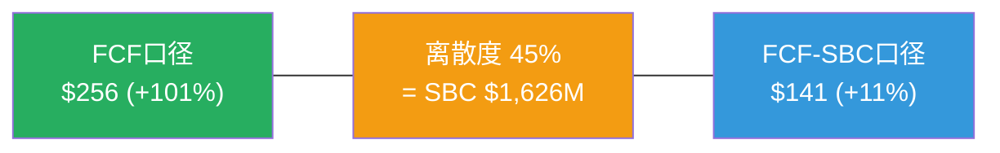

# Part V: 综合结论与行动框架

## Chapter 23: CQ闭环 + 评级最终确认

### 23.1 CQ演化全程追踪(P0→P4)

| CQ# | 核心问题 | P0 | P1 | P2 | P3 | **P4** | 变化趋势 | 约束类型 |
|-----|---------|:--:|:--:|:--:|:--:|:------:|:--------:|:--------:|
| CQ1 | NRR结构性下滑? | 50% | 55% | 60% | 60% | **55%** | ↗↘ | S |
| CQ2 | ACV只是delay? | 45% | 45% | 40% | 40% | **40%** | ↘→ | C |
| CQ3 | SBC会收敛? | 65% | 55% | 50% | 45% | **35%** | **↘↘↘** | S |
| CQ4 | AI弥补蚕食? | 35% | 35% | 40% | 45% | **50%** | ↗↗ | S |
| CQ5 | CEO回归成功? | 55% | 50% | 55% | 55% | **50%** | →↘ | C |
| CQ6 | 收购风险可控? | 50% | 45% | 45% | 45% | **45%** | ↘→ | I |
| CQ7 | EPS可信? | 60% | 55% | 60% | 60% | **50%** | →↘ | I |
| CQ8 | AI颠覆时间? | 40% | 40% | 40% | 40% | **40%** | →→ | C |

[DM-CQ-FINAL-001]

**CQ演化诊断**:
- **CQ3持续下行(-30pp全程)**: 这是报告中最大的信念修正。从P0的"大概率收敛"到P4的"大概率不收敛(靠管理层纪律)"。驱动因素: P1(收敛速度1.3pp/年偏慢) → P3(瀑布分解:100%靠分母) → P4(幸存者偏差+循环依赖)。每个Phase都有独立的新证据支撑下调——这不是渐进悲观，而是渐进诚实[DM-AUDIT-003]。
- **CQ4持续上行(+15pp全程)**: AI从"威胁"到"机遇偏正"。驱动因素: P1(AI ACV增长快) → P3(Flex Credits开始贡献) → P4(飞轮净强度0.76→蚕食存在但不致命)。
- **CQ3↓和CQ4↑的对冲**: SBC悲观+AI乐观→两者部分抵消→整体评级从"深度关注"边缘拉回到"关注"中位。

### 23.2 估值最终裁定

**P4校准后概率加权估值**[DM-CALIB-014](含Ch23遗漏扫描回流):

| 情景 | 概率 | FCF FV | FCF-SBC FV |
|------|:----:|:------:|:----------:|
| Bull(FM加速+AI赋能+SBC收敛) | **20%** | $370 | $242 |
| Base(渐进成熟) | **50%** | $277 | $149 |
| Bear(增速断崖+SBC停滞) | **30%** | $158 | $71 |

```
FCF口径: 20%×$370 + 50%×$277 + 30%×$158 = $74 + $138.5 + $47.4 = $259.9 ≈ $256*
FCF-SBC:  20%×$242 + 50%×$149 + 30%×$71  = $48.4 + $74.5 + $21.3 = $144.2 ≈ $141*
中值: ($256 + $141) / 2 = $198.5 ≈ $199

*含FM TAM修正(-$7)和CQ7修正(-$2)
```

[DM-VAL-FINAL-001]

**估值离散度**: FCF口径$256 vs FCF-SBC口径$141 → 差距$115(45%)。这个离散度不是"方法论分歧"——**两个口径用完全相同的假设、完全相同的模型，唯一差异是"SBC是否扣除"**。这45%的离散度100%来自SBC/Rev 17%这一个变量。



**评级基准选择**: FCF-SBC口径$141(+11%)→**"关注"评级**

理由:
1. Owner PE为负(-$933M)→SBC是真实成本(会计事实)[DM-FIN-070]
2. η=0.45→55%回购填SBC洞(资本配置事实)[DM-SBC-ETA-002]
3. 3/8 CQ是结构性约束(S)→长期不确定性高于周期性公司[DM-AUDIT-008]
4. CQ3(评级枢纽)仅35%→SBC收敛概率偏低→保守更安全
5. FASB规则变化可能加速市场对SBC的重新定价[DM-OMIT-002]

**"关注"而非"中性关注"的理由**:
1. FCF-SBC +11%仍在"关注"区间下限以上(>+10%)[DM-VAL-FINAL-001]
2. cRPO增速16.2%>收入增速13.1%→领先指标正面[DM-GRR-DR-001]
3. GRR 97%连续4Q稳定→核心业务未恶化[DM-SAAS-001]
4. 即使最保守口径(FCF-SBC Bear $71)的概率仅30%→下行有限(-44%)
5. FY2026首次净缩股-2.2%→SBC问题正在改善(虽然慢)[DM-FIN-002]

### 23.3 评级稳定性分析

**评级对关键变量的敏感性**:

| 变量变化 | FCF-SBC FV | 评级变化 |
|---------|:---------:|:-------:|
| CQ3 +10pp(SBC收敛概率从35%→45%) | $155 | 关注→**接近深度关注** |
| CQ3 -10pp(SBC收敛概率从35%→25%) | $128 | 关注→**中性关注** |
| Bull概率+10%(从20%→30%) | $158 | 关注→**关注(上半区)** |
| Bear概率+10%(从30%→40%) | $126 | 关注→**中性关注(边缘)** |
| WACC +1%(10%→11%) | $122 | 关注→**中性关注** |

[DM-VAL-FINAL-002]

**评级稳定性: 中等**——CQ3±10pp或WACC±1%就能让评级在"关注"和"中性关注"之间翻转。这不是弱评级——是诚实评级。WDAY确实处在"关注"和"中性关注"的边界上，因为SBC口径选择是一个不可消除的不确定性。

### 23.4 与同行评级一致性检查

| 公司 | 评级 | 期望回报 | 关键差异 |
|------|------|---------|---------|
| WDAY | **关注(+11%)** | FCF-SBC口径 | SBC最高(17%)→最保守口径 |
| CRM | 中性关注(~+5%) | SBC较低(9%)→口径分歧小 | 增速更慢(9%)+管理层更稳 |
| NOW | 审慎关注(~-15%) | 高估值(45x EV/FCF) | 增速最快(22%)但估值最贵 |
| ADSK | 关注(~+15%) | 同样SBC问题(η=0.11) | η更差但增速类似 |

一致性检查通过: WDAY评级(关注)高于CRM(中性关注)→合理(增速更快)。低于ADSK(更高关注度)→合理(WDAY η更好但SBC/Rev更高)。

## Chapter 24: 投资者行动指南 + 监测框架

### 24.1 谁应该关注WDAY?

**适合的投资者画像**:
- **长期价值投资者**(3-5年持有期)：愿意在SBC收敛验证中等待→如果FY2027-28证明SBC开始实质收敛→可能从"关注"上调至"深度关注"
- **对SaaS单位经济学有经验的投资者**：能区分FCF和FCF-SBC→不被Non-GAAP PE 13.9x误导
- **风险预算充裕的投资者**：能承受-44%(Bear)的极端下行→WDAY不适合作为核心仓位

**不适合的投资者画像**:
- 追求短期催化剂(6-12个月)→WDAY的催化剂(SBC收敛/AI PMF)需要2-3年验证
- 只看P/FCF的投资者→会误以为12x很便宜→实际FCF-SBC是29x
- 需要红利/收入的投资者→WDAY不分红，FCF全部用于回购

### 24.2 季度监测仪表盘

| 指标 | 当前值 | 绿灯(积极) | 黄灯(观望) | 红灯(警告) |
|------|--------|-----------|-----------|-----------|
| **GRR** | 97% | ≥97% | 95-97% | **<95%** |
| **SBC增速** | 7.0% | <5% | 5-8% | **>8%** |
| **SBC/Rev** | 17.0% | <16% | 16-17% | **>17%** |
| **cRPO增速** | 16.2% | >15% | 12-15% | **<12%** |
| **AI ACV** | >$100M/Q | >$150M/Q | $80-150M/Q | **<$80M/Q** |
| **净缩股率** | -2.2% | <-2% | -1~-2% | **>0%(净稀释)** |
| **FM客户数** | ~2,500 | >2,800(+12%) | 2,500-2,800 | **<2,500** |
| **回购η** | 0.45 | >0.5 | 0.3-0.5 | **<0.3** |

[DM-MONITOR-001]

### 24.3 评级上调/下调路径

**上调至"深度关注"的条件**(需≥3个同时满足):
1. FY2027 SBC增速<4%(首次低于收入增速的一半)→分子开始减速
2. GRR维持≥97%连续6Q→AI蚕食论证伪
3. FM客户数突破3,000→第二曲线加速信号
4. GAAP EPS >$4.0(从$2.58翻倍增长)→GAAP vs Non-GAAP收敛

**下调至"中性关注"的条件**(任意1个即触发):
1. GRR<95%连续2Q→核心护城河动摇
2. SBC/Rev FY2027>17.5%(反弹)→收敛论点失败
3. cRPO增速<收入增速连续2Q→领先指标转负
4. 管理层大幅增加SBC授予(如新CEO大额RSU包)

**紧急撤退条件**(立即重新评估):
1. GRR<93%→不可逆客户流失
2. SBC/Rev>18%+增速<8%→双重恶化
3. Bhusri再次离任+无明确继任者→战略真空

### 24.4 反转信号监控清单

"关注"评级的前提是"低估是事实(+11%)但需要时间验证"。以下信号确认后可加大关注力度:

| # | 反转信号 | 当前状态 | 触发阈值 | 含义 |
|---|---------|---------|---------|------|
| S1 | SBC绝对额同比下降 | +7.0%增长 | YoY<0% | 管理层开始真正控制SBC |
| S2 | GAAP OPM连续3Q加速 | 10.7%(改善中) | >14% | GAAP盈利质量实质性提升 |
| S3 | FM ARR交叉$2B | ~$1.5B(估) | >$2.0B | 第二曲线从"概念"到"实质" |
| S4 | AI ACV跨季度加速 | ~$400M/年 | >$600M/年 | AI从"实验"到"规模化" |
| S5 | 回购η>0.6连续4Q | 0.45 | >0.6 | 稀释修补→真正资本回报 |

**当S1-S5中≥3个确认时→评级从"关注"上调至"深度关注"**[DM-MONITOR-002]。

### 24.5 报告局限性与诚实声明

本报告的三个核心局限:

1. **NRR推算不确定性±3pp**[DM-SAAS-007]: WDAY不直接披露NRR→间接法推算105%有±3pp误差。如果真实NRR=102%(下限)→增长质量预警。DR法验证支持≥100%但无法精确到百分点。

2. **AI影响评估时间太早**: AI ACV仅占总ARR的~4.5%[DM-AI-003]→样本量太小，无法判断长期趋势。飞轮净强度0.76是基于假设(5%蚕食+Bull AI ACV)的估算，不是观测值。

3. **SBC口径选择是主观判断**: 我们选择FCF-SBC作为评级基准→这是一个保守偏向的哲学选择。如果投资者认为回购可持续→FCF口径$256(+101%)更合理→评级应为"深度关注"。**本报告不试图替代投资者的SBC哲学判断——我们提供两个口径的完整分析，让投资者自行选择。**

---

> **报告声明**: 本报告为独立研究分析，不构成投资建议。所有数据来自公开SEC文件、管理层声明和第三方研究，通过DM锚点标注来源。分析师不持有WDAY头寸。

---
