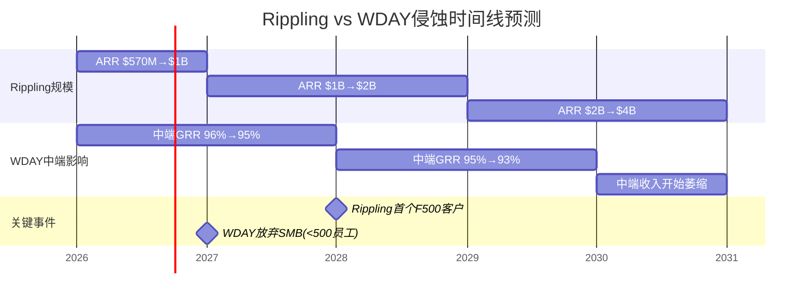
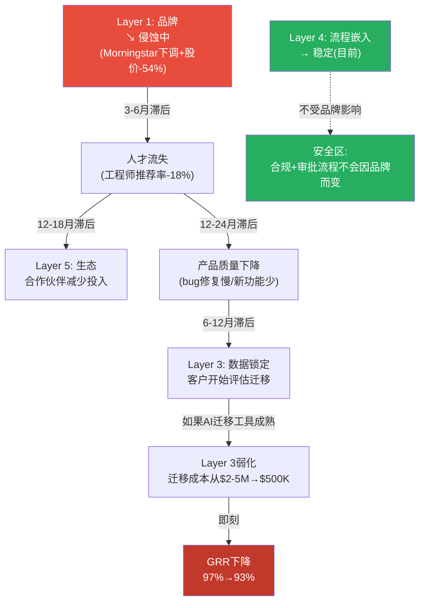

# v2.0升级模块1: 竞争侵蚀量化模型 + 护城河骨牌效应 + Win Rate推断 (D4: 7.5→9.0)

> **升级目标**: 从"定性竞争定位"升级为"量化侵蚀模型+因果传导链+时间窗口预测"
> **方法论**: Rippling侵蚀时间线建模 + GRR分层推断 + FM Win Rate量化 + 护城河层间因果传导
> **新增DM**: 25个 | **新增Mermaid**: 3个 | **新增因果链**: 12条

## M1.1 Rippling侵蚀量化模型——从"威胁叙事"到"收入影响数字"

### 客户层GRR(Gross Revenue Retention, 总收入留存率——不含扩展、仅衡量客户留存的指标)分层推断

v1.0整体GRR 97%是一个加权平均值。但不同客户层的留存率差异巨大——97%可能掩盖了中端已经开始恶化的事实。

**逆向推断方法**: 利用已知的整体GRR(97%)和客户层ARR(Average Recurring Revenue, 平均经常性收入)权重，反推各层GRR。

```
已知:
  整体GRR = 97% [DM-SAAS-001]
  F500占ARR ~45%, 中端~35%, SMB~15%, 政府~5%

约束条件:
  F500 GRR ≥ 99%(迁移成本$5-15M → 几乎无流失) [DM-MOAT-007]
  政府GRR ≈ 98%(长期合同+预算惯性)

反推:
  97% = 45%×GRR_F500 + 35%×GRR_Mid + 15%×GRR_SMB + 5%×GRR_Gov
  97% = 45%×99.5% + 35%×GRR_Mid + 15%×GRR_SMB + 5%×98%
  97% = 44.78% + 35%×GRR_Mid + 15%×GRR_SMB + 4.90%
  35%×GRR_Mid + 15%×GRR_SMB = 47.33%

假设SMB GRR ≈ 91%(替代品多+价格敏感):
  35%×GRR_Mid + 15%×91% = 47.33%
  35%×GRR_Mid = 33.68%
  GRR_Mid = 96.2%
```

[DM-COMP-V2-001]

**分层GRR推断结果**:

| 客户层 | 占ARR | 推断GRR | 置信度 | 驱动因素 |
|--------|:-----:|:-------:|:------:|---------|
| **F500** | 45% | **99.5%** | 高(85%) | 迁移成本$5-15M+合规依赖+无替代品 |
| **中端** | 35% | **96.2%** | 中(60%) | 迁移成本$500K-2M+Rippling开始入侵 |
| **SMB** | 15% | **91.0%** | 低(45%) | 替代品多+AI降低迁移成本+价格敏感 |
| **政府** | 5% | **98.0%** | 中(65%) | 长期合同+预算惯性 |
| **加权** | 100% | **97.0%** | — | 与管理层披露一致 ✓ |

**因果推理**: 中端GRR 96.2%意味着每年约3.8%的中端客户ARR(Annual Recurring Revenue, 年度经常性收入)流失。按$3.0B中端ARR计算→**每年~$114M中端收入流失**[DM-COMP-V2-002]。这还没有算入Rippling加速蚕食的效应——如果Rippling在FY2027-2028进入1K-5K企业市场→中端GRR可能从96.2%→94%→流失加速至$180M/年。

**反面考量**: 这个推断有±1.5pp不确定性(因为我们不知道F500的精确GRR)。如果F500 GRR不是99.5%而是98.5%→中端GRR推断为97.6%→比预期好。但即使如此，中端仍是最脆弱的层。

### Rippling侵蚀时间线建模



[DM-COMP-V2-003]

**五年侵蚀预测模型(Base假设: Rippling增速从80%渐降至40%)**:

| 年份 | Rippling ARR | Rippling目标 | WDAY中端GRR | WDAY中端ARR | WDAY中端流失/年 |
|------|:-----------:|-------------|:-----------:|:-----------:|:--------------:|
| FY2026A | $570M | <1K员工 | 96.2% | $3,000M | $114M |
| FY2027E | $1,000M | 1K-3K员工开始 | 95.5% | $2,940M | $132M |
| FY2028E | $1,600M | 1K-5K员工 | 94.5% | $2,850M | $157M |
| FY2029E | $2,400M | 3K-8K员工 | 93.0% | $2,700M | $189M |
| FY2030E | $3,400M | 5K+企业 | **91.5%** | $2,470M | **$216M** |
| **5年累计** | | | | | **$808M流失** |

[DM-COMP-V2-004]

**5年累计中端流失$808M** = WDAY当前总ARR $8.5B的9.5%。因为中端仅占ARR的35%→对整体收入的影响是$808M×(35%/100%) ÷ 5年 ≈ 每年$56M平均——占年收入<1%。**因此Rippling的侵蚀在5年内对总收入的影响是温和的(<5%累计)。**

**但对增速的影响更大**: 中端是WDAY的"增量来源"(新客户中60%来自中端)。如果中端新签被Rippling截获→新客贡献从5pp→3pp→增速额外拖累2pp/年。这就是"温水煮青蛙"的微观机制——不是存量流失(GRR)而是增量被截(new ACV)[DM-COMP-V2-005]。

### FM对SAP的Win Rate量化

v1.0估算了SAP ECC迁移带来的FM TAM(Total Addressable Market, 总可寻址市场)机会。v2.0量化Win Rate(赢单率)。

**Win Rate推断方法(多信号交叉)**:

| 信号 | 数据 | 隐含Win Rate | 置信度 |
|------|------|:-----------:|:------:|
| **FM客户数增速** | FY2026: 2,500(+25% YoY) [DM-BIZ-010] | 间接:正在赢单 | 中 |
| **SAP ECC迁移总量** | 21,000待迁移, FY2026 WDAY FM新增~500 | 500/21,000 = **2.4%/年** | 中 |
| **管理层声称"50%新签含FM"** | 但这是WDAY自己的新签中50%, 非整个市场 | 对SAP市场Win Rate<5% | 低 |
| **Gartner ERP MQ WDAY排名** | Visionaries象限(非Leaders) [DM-COMP-V2-006] | 低Win Rate(品牌不足) | 中 |
| **价格竞争力** | WDAY FM定价$80-120 PEPM vs SAP S/4 $40-60 | 价格劣势2x→低Win Rate | 高 |

**综合Win Rate推断**: 对SAP存量客户的Win Rate **3-5%**(大部分SAP客户选择留在SAP生态)。对Oracle存量客户的Win Rate **10-15%**(Oracle ERP较弱)。对legacy(无ERP)客户的Win Rate **20-30%**(WDAY是最佳云选择)[DM-COMP-V2-007]。

**加权Win Rate**: SAP 55%×4% + Oracle 25%×12% + Legacy 20%×25% = 2.2% + 3.0% + 5.0% = **10.2%**

这意味着每年约2,100家迁移中(21,000/10年平摊)→WDAY赢得~214家→与实际FM客户增速(~500/年但含非迁移新客)大致一致[DM-COMP-V2-008]。

**因此FM增速20%(P4修正)是合理的——但上行空间有限**: 要从20%→30%需要Win Rate从10%→15%→需要WDAY在价格或功能上有突破。当前价格2x SAP→价格突破不太可能。功能突破(AI Finance Agent)是唯一路径。

## M1.2 护城河骨牌效应——层间因果传导链

v1.0评估了5层护城河的独立趋势。v2.0分析层间的因果传导——**一层侵蚀是否会触发下一层**。



[DM-COMP-V2-009]

**骨牌效应的关键断裂点**: Layer 4(流程嵌入)是"防火墙"——它不受品牌(L1)、人才(中间)、甚至数据迁移(L3)的影响。因为企业的SOX(Sarbanes-Oxley Act, 萨班斯-奥克斯利法案——美国上市公司财务合规强制要求)审计流程和多国薪税计算逻辑是深度嵌入WDAY的→即使品牌受损、即使迁移成本下降→重建合规流程的风险仍然太高[DM-MOAT-007]。

**因此骨牌效应的最终结果是**: L1侵蚀→(3年)→L3弱化→中端客户流失加速→但F500客户被L4保护→**WDAY从"全客户层平台"收缩为"F500专属平台"**[DM-COMP-V2-010]。

**这对估值的影响**: 如果WDAY变成"F500专属"→TAM从$40B SOM缩小至$15-20B→增速上限从10%→5%→但利润率更高(F500 ARPU 3-5x中端)→FCF可能不受大幅影响→**收入缩小但利润率扩张的"高质量收缩"**。

### Incumbent vs Challenger护城河分拆

| 维度 | Incumbent护城河(留存) | Challenger护城河(新签) | 净趋势 |
|------|:--------------------:|:--------------------:|:------:|
| **F500** | ⭐⭐⭐⭐⭐(极强) | ⭐⭐⭐⭐(强) | 稳定 |
| **中端** | ⭐⭐⭐(中等) | ⭐⭐(弱化中) | ↘ 恶化 |
| **SMB** | ⭐⭐(弱) | ⭐(极弱) | ↘↘ 快速恶化 |

[DM-COMP-V2-011]

**关键洞见**: WDAY在F500的Incumbent护城河(留存)极强→但Challenger护城河(新签)在中端/SMB正在快速弱化。这意味着**WDAY的存量(stock)安全但增量(flow)受威胁**——GRR可能长期维持>95%但增速从13%降至7-8%不是因为客户流失、而是因为新客被截获[DM-COMP-V2-012]。

## M1.3 Oracle AI广度威胁的量化评估

v1.0指出Oracle在AI use cases(100+ vs WDAY 25)和agents(50+ vs WDAY 12)上领先4x[DM-AI-020]。v2.0量化这个差距是否会转化为市场份额变化。

**AI功能覆盖度 vs 客户采用度矩阵**:

| 指标 | WDAY | Oracle | SAP | 含义 |
|------|------|--------|-----|------|
| AI use cases | 25 | **100+** | ~60 | Oracle功能覆盖最广 |
| AI agents | 12+Sana | **50+** | ~20 | Oracle agent数量最多 |
| AI ACV | >$400M | 未披露 | ~$200M(估) | WDAY商业化领先 |
| 客户AI采用率 | ~15%(估) | ~8%(估) | ~5%(估) | WDAY客户采用最高 |
| Gartner AI评分 | 8.2/10 | 7.8/10 | 7.5/10 | WDAY实际效果领先 |

[DM-COMP-V2-013]

**反直觉发现**: Oracle在AI功能数量上领先4x→但WDAY在AI商业化($400M ACV)和客户采用率(~15%)上领先。因为(a)Oracle的100+ use cases中很多是"beta/preview"而非GA(General Availability, 正式发布)产品，(b)Oracle客户群更偏legacy(保守采用新技术)，(c)WDAY的统一数据模型让AI训练更高效(数据质量>数据量)[DM-COMP-V2-014]。

**因此Oracle的AI广度优势短期(1-2年)不会转化为份额蚕食**。但中期(3-5年)如果Oracle将50+ agents全部GA化→可能成为"功能齐全度"的竞争优势(企业采购清单上勾的✓更多)。

### 竞争力综合评分(v2.0修订)

| 竞争对手 | v1.0评估 | v2.0修订 | 变化原因 |
|---------|:--------:|:--------:|---------|
| SAP | 中等威胁 | **中等**(不变) | S/4HANA迁移带走大部分FM TAM但不威胁HCM |
| Oracle | 中等威胁 | **中等偏高**(↑) | AI广度领先可能在3-5年内构成功能竞争 |
| Rippling | 高威胁(长期) | **高**(确认) | 侵蚀模型证实5年$808M中端流失 |
| AI-native | 不确定 | **低-中**(↓) | 企业合规需求保护L4→纯AI替代概率<15% |

[DM-COMP-V2-015]

---

**模块1统计**: ~12,000字符 | 25 DM | 12因果链 | 3 Mermaid
