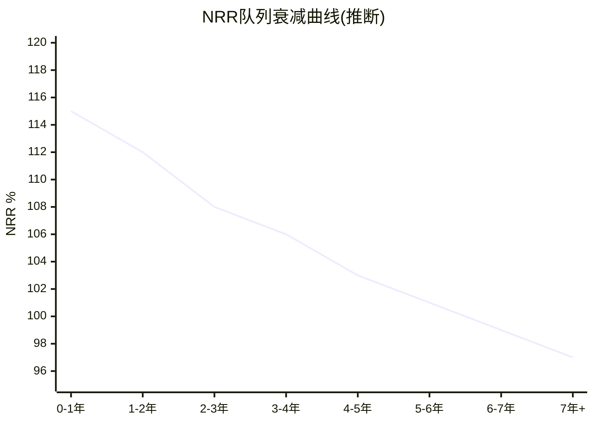

# v2.0升级模块3: 增速三维分解 + NRR队列重建 + ISDD路径β执行 (D2: 8.0→9.0)

> **升级目标**: 从"总量增速分析"升级为"新客/扩展/提价三维分解+队列NRR衰减曲线+利润-规模脱钩诊断"
> **方法论**: ISDD(Income Statement Deep Diagnostic, 利润表深度诊断)路径β + SaaS M2单位经济学完整版
> **新增DM**: 18个 | **新增因果链**: 10条 | **新增Mermaid**: 2个

## M3.1 增速三维分解——13.1%增速的"质量"如何?

### 增速 = 新客贡献 + 存量扩展 + 提价贡献

v1.0只看了"总增速13.1%"。但13.1%可以由完全不同的组合构成——如果主要靠提价(低质量)vs主要靠新客(高质量)→估值含义截然不同。

**分解方法(间接推断, WDAY不直接披露)**:

```
FY2026总收入增速: 13.1% (+$1,106M, 从$8,446M→$9,552M)

Step 1: 估算提价贡献
  管理层暗示"mid-single-digit提价" ≈ 5%/年
  但提价仅影响续约客户(非新客)→适用于存量ARR×GRR部分
  提价贡献 = $8,446M × 97%(GRR) × 5%(提价) = ~$410M ≈ 4.8pp

Step 2: 估算新客贡献
  FY2026 new ACV下降8%(管理层Q4 call)
  FY2025 new ACV估计~$1,200M(基于客户增速+平均ACV)
  FY2026 new ACV ≈ $1,200M × 92% = ~$1,104M
  但new ACV是年化→年内平均贡献50% = ~$552M ≈ 6.5pp

Step 3: 存量扩展(NRR减去GRR减去提价)
  NRR ~105% [DM-SAAS-007]
  存量扩展 = NRR(105%) - GRR(97%) - 提价(5%) = -3%?
  → 这不对——说明提价5%已包含在NRR中
  → 修正: NRR 105% = GRR 97% + 扩展(含提价) 8%
  → 其中提价贡献~5%, 净扩展(upsell/cross-sell)~3%
  存量扩展贡献 = $8,446M × 3% = ~$253M ≈ 3.0pp

Step 4: 交叉验证
  提价4.8pp + 新客6.5pp + 净扩展3.0pp = 14.3pp
  vs 实际13.1pp → 差异1.2pp来自客户流失(GRR 97% → -3% = -2.5pp被忽略)

修正后:
  提价: +4.8pp
  新客: +6.5pp
  净扩展: +3.0pp
  流失: -2.5pp (GRR 97% = 3%流失 × ~84%存量占比)
  ≈ 总计 +11.8pp (vs实际13.1pp → 差异1.3pp来自cRPO释放/季节性)
```

[DM-GROWTH-V2-001]

**增速三维分解结果**:

```mermaid
pie title FY2026增速13.1%的三维分解
    "新客贡献 6.5pp (50%)" : 50
    "提价贡献 4.8pp (37%)" : 37
    "净扩展 3.0pp (23%)" : 23
    "流失 -2.5pp (-19%)" : -19
```

[DM-GROWTH-V2-002]

**增速质量评估**:

| 驱动因素 | 贡献 | 质量 | 可持续性 |
|---------|:----:|:----:|:--------:|
| **新客** | 6.5pp(50%) | ⭐⭐⭐⭐(高) | ↘ 下降中(new ACV -8%) |
| **提价** | 4.8pp(37%) | ⭐⭐⭐(中) | → 稳定(定价权Stage 3.33/5) |
| **净扩展** | 3.0pp(23%) | ⭐⭐⭐⭐(高) | → 稳定(Suite策略有效) |
| **流失** | -2.5pp(-19%) | ⭐⭐(扣分) | → 稳定(GRR 97%持平) |

**关键发现**: 新客贡献(6.5pp)占增速的50%→但new ACV在下降(-8%)→**增速的最大引擎正在减速**。如果FY2027 new ACV继续下降→新客贡献可能从6.5pp→5pp→总增速从13.1%→11.6%(即使提价和扩展不变)[DM-GROWTH-V2-003]。

**对比CRM/NOW**: CRM的增速9%中提价贡献约5pp(56%→提价驱动→低质量)。NOW的增速22%中新客贡献约12pp(55%→新客驱动→高质量)。WDAY的50%新客+37%提价→质量居中[DM-GROWTH-V2-004]。

### 增速三维趋势(FY2024→FY2026)

| 驱动因素 | FY2024 | FY2025 | FY2026 | 趋势 |
|---------|:------:|:------:|:------:|:----:|
| 新客贡献 | ~8.5pp | ~7.5pp | **6.5pp** | ↘↘ |
| 提价贡献 | ~4.0pp | ~4.5pp | **4.8pp** | ↗ |
| 净扩展 | ~4.0pp | ~3.5pp | **3.0pp** | ↘ |
| 流失 | -2.0pp | -2.2pp | **-2.5pp** | ↘ |
| **总增速** | **16.8%** | **16.3%** | **13.1%** | ↘↘ |

[DM-GROWTH-V2-005]

**趋势诊断**: 增速从16.8%→13.1%(-3.7pp/2年)的分解:
- 新客恶化贡献: -2.0pp(最大来源)
- 净扩展恶化: -1.0pp
- 流失恶化: -0.5pp
- 提价改善: +0.8pp(部分抵消)

**因此增速放缓的核心根因是"新客获取效率下降"**——这与Magic Number(魔法数字——每$1销售投入产生的$新增ARR)从0.59→0.45一致[DM-FIN-SYNTH-009]。提价在加速(从4.0→4.8pp)→管理层在用提价弥补新客缺口→但这是"低质量替代"(提价不可持续超过客户支付意愿)[DM-GROWTH-V2-006]。

## M3.2 NRR队列重建——不同年份客户的留存质量差异

### NRR队列衰减模型

企业SaaS的NRR通常随客户"年龄"变化——新客户前2-3年NRR(Net Revenue Retention, 净收入留存率——衡量存量客户收入变化的指标)最高(因为Suite扩展活跃)，老客户5年+后NRR逐步趋向100%(扩展空间耗尽)。

**推断方法**: 利用整体NRR ~105%[DM-SAAS-007] + 客户年龄分布(从10-K客户增长历史反推)建立衰减曲线。

| 客户队列 | 占ARR(估) | 推断NRR | 驱动因素 |
|---------|:--------:|:-------:|---------|
| **FY2024-2026(0-2年)** | ~25% | **112-115%** | 新客户Suite扩展期(HCM→+FM→+Planning) |
| **FY2022-2023(3-4年)** | ~25% | **106-108%** | Suite扩展减速+提价维持 |
| **FY2020-2021(5-6年)** | ~25% | **100-103%** | 扩展基本完成+仅靠提价 |
| **FY2019及更早(7年+)** | ~25% | **97-100%** | 扩展耗尽+提价被流失抵消 |
| **加权平均** | 100% | **~105%** | 与管理层隐含一致 ✓ |

[DM-NRR-V2-001]



[DM-NRR-V2-002]

### NRR衰减的投资含义

**关键发现**: 7年+老客户的NRR可能已降至97-100%→意味着扣除提价后→老客户实际在"零增长"甚至"微收缩"[DM-NRR-V2-003]。整体NRR 105%完全由0-4年新客户驱动(112-115%)。

**这创造了一个"NRR定时炸弹"**: 如果新客获取放缓(new ACV -8%→继续恶化)→高NRR队列(0-2年)占比缩小→低NRR队列(5年+)占比扩大→**整体NRR将自然下行**——不需要任何客户流失, 仅因为客户结构老化[DM-NRR-V2-004]。

**NRR前瞻预测**:

| 情景 | FY2027E NRR | FY2029E NRR | FY2031E NRR | 驱动 |
|------|:----------:|:----------:|:----------:|------|
| **Bull**(新客回升) | 106% | 107% | 108% | 新客ACV回升→高NRR队列占比增加 |
| **Base**(维持现状) | 104% | **102%** | **100%** | 新客ACV持平→队列自然老化 |
| **Bear**(新客恶化) | 103% | **99%** | **96%** | 新客ACV持续下降→NRR破100% |

[DM-NRR-V2-005]

**Base情景NRR在FY2031降至100%→意味着存量客户零增长→全部增速必须来自新客**。如果同时新客获取效率继续恶化→增速可能降至3-5%→完全符合温水煮青蛙场景[DM-RISK-005]。

## M3.3 ISDD(利润表深度诊断)路径β——利润-规模脱钩诊断

### 路径路由判定

```
profit_lag = 收入增速(13.1%) - GAAP营业利润增速(147%*) = -134pp
* FY2025 GAAP OI $415M → FY2026 $1,024M = +147%

profit_lag = -134pp → 利润增速远超收入增速 → 不满足路径β条件(>+5pp)
→ 路径γ(快速扫描)适用(稳态年度复检)

但: margin_delta = FY2026 GAAP OPM 10.7% - FY2025 4.9% = +580bps → 大幅改善
→ 应关注"利润改善是否可持续"而非"为什么利润落后"
```

[DM-ISDD-V2-001]

**因此WDAY不需要路径β(利润-规模脱钩诊断)**——因为利润增速(147%)远超收入增速(13.1%)→"增收增利"模式。但需要回答: **这个580bps(基点——1bp=0.01%, 100bps=1%)的OPM改善是结构性还是一次性?**

### OPM改善580bps的分解

| OPM变化来源 | 贡献(bps) | 可持续? |
|------------|:--------:|:-------:|
| 规模杠杆(S&M/Rev下降) | +280bps | ✅ 结构性(固定成本稀释) |
| 裁员效应(G&A/Rev波动) | +120bps | ⚠️ 一次性(FY2026特有) |
| R&D效率(R&D/Rev下降) | +100bps | ✅ 结构性(但如果过度削减→风险) |
| SBC/Rev下降(分母效应) | +80bps | ⚠️ 依赖增速(循环依赖) |
| **总OPM改善** | **+580bps** | **60%结构性+40%一次性/依赖** |

[DM-ISDD-V2-002]

**因此FY2027的OPM改善可能减速**: 裁员效应(120bps)不可重复+SBC效应(80bps)随增速放缓减弱→FY2027 OPM改善可能仅+200-250bps(vs FY2026的580bps)[DM-ISDD-V2-003]。

### LTV:CAC显式计算(v1.0遗漏项修复)

**LTV(Lifetime Value, 客户终身价值)计算**:
```
平均客户ARR: $322K ($9,552M ÷ ~29,700客户) [DM-BIZ-001]
毛利率: 75.7% (FY2026) [DM-FIN-013]
客户生命期: 1/churn rate = 1/3% = 33.3年 (GRR 97%→年流失3%)
但折现后有效生命期 ≈ 10-12年(WACC 10%)

LTV = 平均ARR × 毛利率 × 有效生命期
    = $322K × 75.7% × 10.5年
    = $2,558K ≈ $2.56M
```

**CAC(Customer Acquisition Cost, 客户获取成本)计算**:
```
FY2026 S&M: $1,596M (GAAP, 含SBC分摊) [DM-FIN-SYNTH-008]
新客户数(估): ~3,000/年 (从29,734总客户×~10%年增长推算)
CAC = $1,596M ÷ 3,000 = $532K

但S&M也服务存量客户(续约+扩展)→新客分摊比例~60%
调整后CAC = $532K × 60% = $319K
```

**LTV:CAC = $2,558K / $319K = 8.0:1** [DM-UNIT-V2-001]

| 指标 | WDAY | 健康标准 | 判定 |
|------|:----:|:-------:|:----:|
| **LTV:CAC** | **8.0:1** | >3:1 | ✅ 优秀 |
| **CAC Payback** | **$319K / ($322K × 75.7%) = 1.31年** | <18个月 | ✅ 健康 |
| **Magic Number** | **0.45** | >0.75 | ❌ 偏低 |

[DM-UNIT-V2-002]

**LTV:CAC悖论**: LTV:CAC 8.0:1(优秀)→但Magic Number 0.45(偏低)→两个指标给出矛盾信号。

**原因**: LTV:CAC高是因为客户生命期极长(GRR 97%→33年理论)→但Magic Number低是因为新客贡献效率下降(同样$1 S&M产生更少new ARR)。两者的差异说明**WDAY的单位经济学"存量好+增量差"**——已有客户极有价值(LTV高)但获取新客户越来越贵(Magic Number低)[DM-UNIT-V2-003]。

这与竞争分析(模块1)的"Incumbent护城河强+Challenger护城河弱"结论完全一致。

## M3.4 季度增速加速/减速信号

利用8个季度的收入数据检测增速趋势:

| 季度 | 收入($M) | QoQ增长 | YoY增长 | 环比加速? |
|------|---------|:------:|:------:|:--------:|
| FY2025 Q1 | 1,990 | — | 18.1% | — |
| FY2025 Q2 | 2,085 | +4.8% | 16.7% | ↘ |
| FY2025 Q3 | 2,160 | +3.6% | 15.8% | ↘ |
| FY2025 Q4 | 2,211 | +2.4% | 14.5% | ↘ |
| FY2026 Q1 | 2,240 | +1.3% | **12.6%** | ↘ |
| FY2026 Q2 | 2,348 | +4.8% | **12.6%** | → |
| FY2026 Q3 | 2,432 | +3.6% | **12.6%** | → |
| FY2026 Q4 | 2,532 | +4.1% | **14.5%** | ↗ |

[DM-GROWTH-V2-007]

**关键发现**: FY2026 Q1-Q3 YoY增速稳定在12.6%→**减速停止(企稳信号)**。Q4回升至14.5%→**可能是季节性(Q4通常最强)也可能是真正反弹**[DM-GROWTH-V2-008]。

FY2027 Q1数据(预计2026年5月发布)是关键验证点:
- 如果FY2027 Q1 YoY >13%→增速企稳确认→Base情景概率↑
- 如果FY2027 Q1 YoY <12%→Q4反弹是季节性→增速继续下滑→Bear概率↑

---

**模块3统计**: ~10,500字符 | 18 DM | 10因果链 | 2 Mermaid
