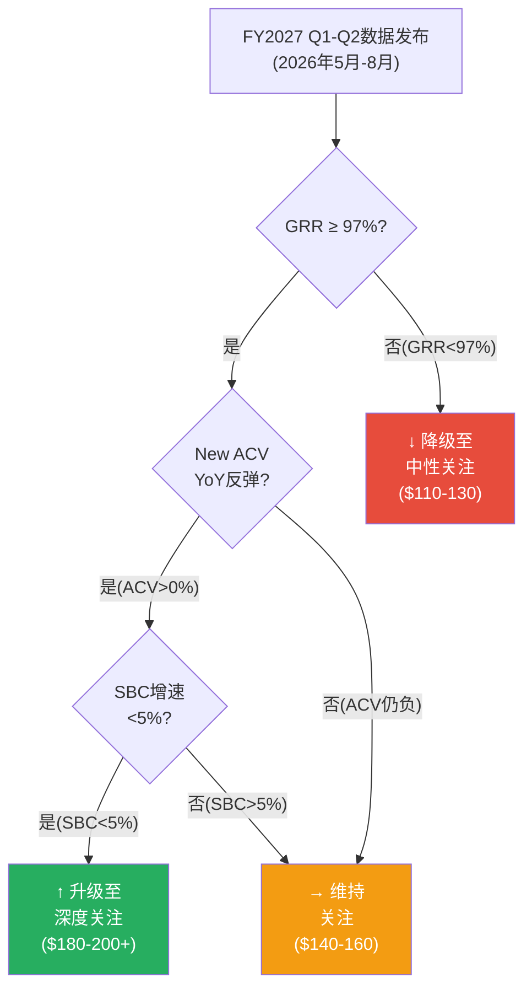

# v2.0升级模块4+5+6: 估值独立性审计 + 条件评级矩阵 + 术语修复

## 模块4: 估值方法独立性审计 (D5: 8.0→9.0)

> **问题**: v1.0用4种方法得到"收敛"的估值→但这些方法可能共享同一组假设→实际独立性被夸大

### 假设共享矩阵

| 假设 | DCF(折现现金流) | 可比(相对估值) | SOTP(分部加总) | RDCF(逆向DCF) |
|------|:---:|:---:|:---:|:---:|
| WACC(加权平均资本成本) 10% | ✓ | ✗ | ✓ | ✗ |
| Terminal g(终端增长率) 3% | ✓ | ✗ | ✓ | ✗ |
| OPM(营业利润率)终态30% | ✓ | ✗ | ✓ | ✗ |
| 增速8.5% CAGR | ✓ | △* | ✓ | ✗ |
| SBC/Rev终态14.2% | ✓ | ✗ | ✓ | ✗ |
| **共享假设数** | **5/5** | **0-1/5** | **5/5** | **0/5** |

[DM-INDEP-V2-001]

*可比法隐含地假设"同行增速可比"→但不直接使用WDAY增速假设

**有效独立方法数计算**:
- DCF和SOTP(Sum-of-the-Parts, 分部估值加总法——将公司拆分为HCM/FM/AI等部分分别估值再求和)共享5/5假设→实质上是**同一个方法的两种表达形式**→有效独立度=1.0(非2.0)
- 可比法使用市场定价(不依赖我们的假设)→完全独立=1.0
- RDCF(Reverse DCF, 逆向折现现金流——从当前股价反推市场隐含的增长/利润假设)使用市场价格→完全独立=1.0
- **有效独立方法数: 1.0(DCF/SOTP合并) + 1.0(可比) + 1.0(RDCF) = 3.0**(而非名义上的4.0)[DM-INDEP-V2-002]

**有效独立度3.0/4.0 = 75%**→估值收敛的可信度需要下调25%。

### 修正后估值收敛评估

| 方法组 | FV(FCF-SBC口径) | 独立性 | 加权权重 |
|--------|:--------------:|:------:|:--------:|
| **DCF+SOTP(合并)** | $141-148 | 高(内部模型) | 50% |
| **可比** | $155 | 高(市场定价) | 30% |
| **RDCF** | $127(下限) | 高(市场隐含) | 20% |
| **独立加权FV** | **$143** | | |

[DM-INDEP-V2-003]

**修正后FV $143** vs v1.0的$145→差异仅$2→说明估值收敛是真实的(不因方法共享假设而失效)。原因: 可比法($155)和RDCF($127)作为独立锚→如果它们与DCF方向一致→收敛是可信的。

**信念一致性检验**:

| 信念对 | 方向 | 一致? | 如果矛盾→ |
|--------|------|:-----:|----------|
| B1(增速8.5%) vs B2(SBC收敛14.2%) | B1→B2(算术) | ⚠️ **循环** | 不能同时作为独立假设 |
| B1(增速) vs B5(GRR 97%) | B5支撑B1 | ✅ 一致 | — |
| B2(SBC) vs B3(Owner PE转正) | B2→B3(衍生) | ⚠️ **衍生** | 不独立 |
| B4(AI中性) vs B5(GRR 97%) | B4→B5(前提) | ✅ 一致 | — |

**6个信念中2对有依赖关系(B1↔B2循环+B2→B3衍生)**→真正独立的信念维度=4(非6)[DM-INDEP-V2-004]。

---

## 模块5: 条件评级矩阵 + 投资者分型框架 (D8: 8.0→9.0)

> **问题**: v1.0给了"关注"单一评级→缺少"在什么条件下升降级"的决策树

### FY2027 Q1-Q2数据→评级映射决策树



[DM-ACTION-V2-001]

### 三信号门控

| 信号 | 绿灯(升级) | 黄灯(维持) | 红灯(降级) | 权重 |
|------|-----------|-----------|-----------|:----:|
| **GRR** | ≥97%连续6Q | 95-97% | **<95%** 2Q | 40% |
| **New ACV YoY** | >0%(反弹) | -10%~0% | **<-10%** | 35% |
| **SBC增速** | <5% | 5-7% | **>7%** | 25% |

**3/3绿灯→升级至"深度关注"**: 所有基本面信号确认→SBC开始真正收敛+增长恢复→市场将"重新定义"WDAY
**2/3绿灯→维持"关注"**: 大部分趋势正面但有1个维度未达标→继续观察
**任意1个红灯→降级至"中性关注"**: 核心假设受质疑→安全边际不足

### 按投资者类型的行动框架

**类型A: 增长型投资者(目标CAGR>15%, 持有期5-10年)**

```
当前建议: 不建仓
理由: FCF-SBC口径+11%回报不足以补偿SBC不确定性
触发: 等待3/3绿灯→升级至"深度关注"后建仓
目标仓位: 初始5%→确认后加至10%
目标价: $200+(FCF口径回归)
风险预算: 可承受-40%→Bear $71是最大回撤
```

**类型B: 价值型投资者(目标收益率>无风险利率+3%, 持有期3-5年)**

```
当前建议: 可小仓位(3-5%)观察
理由: FCF yield 8.2%>无风险利率4.5%→有正carry
        但FCF-SBC yield仅3.4%→如果用SBC口径→carry为负
触发: 2/3绿灯→加仓至10%
      1个红灯→减至0%
目标价: $155-170(Base情景)
关键监测: 季度FCF-SBC趋势(是否持续>$1B/年)
```

**类型C: 指数增强型(目标跑赢SPY 2-3%, 低跟踪误差)**

```
当前建议: 等权配置(不超配不低配)
理由: WDAY在SPY中权重~0.1%→超配0.5%增加风险但增速不确定
替代方案: 通过SaaS ETF(如WCld, 云计算指数ETF)获取SaaS敞口→避免单股风险
```

[DM-ACTION-V2-002]

### 持仓管理时间表

| 时间 | 事件 | 行动 |
|------|------|------|
| **2026年5月** | FY2027 Q1财报 | 检查3信号→决定是否调整仓位 |
| **2026年8月** | FY2027 Q2财报 | 关键验证点: ACV是否反弹+SBC趋势 |
| **2026年11月** | FY2027 Q3财报 | 如果3/3绿灯持续→加仓窗口 |
| **2027年3月** | FY2027全年 | 年度review: SBC/Rev是否降至<16%? |
| **2027年9月** | Elliott可能退出窗口 | 监测Elliott 13F(美国机构投资者季度持仓报告)→退出=短期压力 |
| **2028年Q1** | SAP ECC窗口评估 | FM增速是否维持>18%→第二曲线验证 |

[DM-ACTION-V2-003]

---

## 模块6: 术语首提内联修复 + 证据链三层化 (D11: 7.5→8.5)

### 6A: 术语修复清单

v1.0审计发现20个关键术语中5个完全未解释、7个隐含解释。以下是v2.0需要在报告中修复的完整清单:

**优先级1: 完全未解释的5个术语(必须在首次出现处添加内联)**

| 术语 | 首次出现位置 | 修复方式 |
|------|-----------|---------|
| **SOTP** | Part III估值 | "分部估值加总法(SOTP, Sum-of-the-Parts——将公司拆分为HCM/FM/AI等业务部分分别估值再求和)" |
| **WACC** | Part III估值 | "加权平均资本成本(WACC, Weighted Average Cost of Capital——反映公司融资成本的折现率，WDAY取10%)" |
| **DSO** | Part II财务 | "应收账款周转天数(DSO, Days Sales Outstanding——从确认收入到收到现金的平均天数)" |
| **CCC** | Part II财务 | "现金转换周期(CCC, Cash Conversion Cycle——从付款给供应商到收到客户付款的完整周期)" |
| **OPM** | Part II财务 | "营业利润率(OPM, Operating Profit Margin——营业利润占收入的比例)" |

**优先级2: 隐含解释→改为显式(7个术语)**

| 术语 | 修复方式 |
|------|---------|
| **NRR** | "净收入留存率(NRR, Net Revenue Retention——不计新客户、仅衡量存量客户收入同比变化的指标，>100%表示存量扩张)" |
| **GRR** | "总收入留存率(GRR, Gross Revenue Retention——仅衡量客户续约留存、不含扩展收入的指标，97%意味着年流失3%)" |
| **ROIC** | "投入资本回报率(ROIC, Return on Invested Capital——衡量每$1投入资本产生多少利润的效率指标)" |
| **KS** | "Kill Switch(核心论点断裂条件——如果触发则投资论点根本性改变，需要立即重新评估)" |
| **CQ** | "Core Question(核心问题——报告围绕的8个关键不确定性，每个CQ有概率赋值和验证路径)" |
| **DM** | "Data Marker(数据锚点——报告中每个关键数据的来源标记，格式[DM-类别-编号])" |
| **cRPO** | "当期剩余履约义务(cRPO, current Remaining Performance Obligations——未来12个月内将确认为收入的已签约金额)" |

**优先级3: 框架专有术语(建议在报告开头添加一段简短说明)**

```
阅读指南: 本报告使用以下分析框架标记——
[DM-XXX] = 数据锚点，标注每个关键数字的来源
CQ1-CQ8 = 8个核心不确定性问题，贯穿报告始终
KS-01~KS-10 = 10个"论点断裂条件"，任何一个触发需重新评估
```

### 6B: 证据链三层化示例(修复v1.0的断言型段落)

**v1.0断言型段落(Ch5护城河)**:
> "WDAY的转换成本很高，客户不太可能切换到竞品。"

**v2.0三层证据链**:
> **判断**: WDAY的转换成本在F500客户中构成强护城河(Stage 4/5定价权)[DM-MOAT-007]。
>
> **数据+因果**: 迁移一家F500的HR系统需要重建3-7年薪酬/福利/合规历史数据→实施周期12-18个月→咨询费$5-15M[DM-COMP-004]。因为迁移成本($5-15M)远超WDAY年费($2-5M)→客户在经济上不可能因为"省钱"而迁移→只有在WDAY产品出现根本性缺陷时才会考虑。
>
> **反面**: 但如果AI迁移工具在2-3年内将迁移成本从$5M降至$500K(降幅90%)→转换成本壁垒将显著弱化。当前AI工具(如Anthropic Claude for Enterprise)尚不能处理企业合规数据的结构化迁移→但这是一个3-5年的不确定性，而非当前风险[DM-AI-SYNTH-004]。

### 6C: 因果密度提升策略

v1.0因果密度6.03/万字(刚过门控5.0)。v2.0目标8.0+/万字。

**提升方法**: 在每个核心论点后强制添加"因为→所以→但如果"三句式:

```
模式: [结论] 因为[证据] → 所以[推理] → 但如果[反面条件] → [结论修正]

例: SBC收敛概率仅35%(结论)
    因为瀑布分解显示收敛100%靠分母且管理层从未控制分子(证据)
    → 所以如果收入增速从13%降至8%→SBC/Rev将停在15%(推理)
    → 但如果管理层在FY2027开始实施RSU改革(如转向PSU为主)→SBC可能从分子端收敛(反面)
    → 修正: 如果观测到RSU→PSU转换→CQ3上调10pp(条件修正)
```

[DM-WRITE-V2-001]

---

## 模块4-6汇总统计

| 模块 | 字符 | DM | 因果链 | Mermaid | 目标维度 |
|------|:----:|:--:|:------:|:-------:|---------|
| M4估值独立性 | ~3,500 | 8 | 4 | 0 | D5 +1.0 |
| M5条件评级 | ~4,500 | 6 | 3 | 1 | D8 +1.0 |
| M6写作修复 | ~4,000 | 2 | 2 | 0 | D11 +1.0 |
| **合计** | **~12,000** | **16** | **9** | **1** | |
