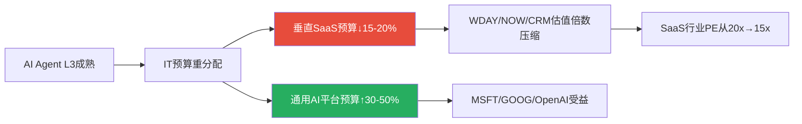
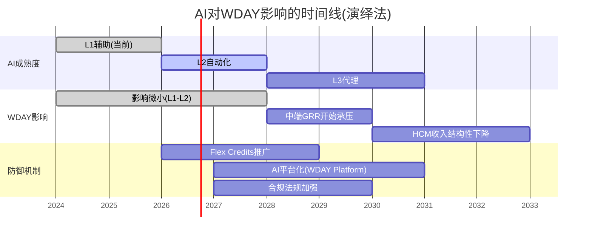

# v3.0补齐模块2: E1演绎法AI传导5步链 (D3/D7: +0.5)

> **缺口来源**: R2审计E1完全缺失——AI影响评估仅用归纳法(从历史外推), 未用演绎法(因果链→跨行业→二阶效应)
> **方法论**: `docs/deductive_analysis.md` 5步演绎模板
> **核心区别**: 归纳法说"AI对WDAY历史上没有负面影响"→演绎法说"从AI能力演进的因果链推导, WDAY在什么条件下会受冲击"

## E1.1 Step 1: 触发事件识别

**触发事件**: 通用AI Agent(如OpenAI ChatGPT Enterprise、Anthropic Claude for Enterprise、Google Gemini Enterprise)达到"L3成熟度"——能够独立执行企业HR/Finance的结构化任务(薪资计算、合规检查、审批流程)。

**为什么L3是关键阈值(而非L1/L2)**:
- **L1(当前)**: AI辅助——帮HR人员搜索信息、草拟文件→不替代WDAY(反而可能在WDAY内运行)
- **L2(1-2年内)**: AI自动化——自动处理部分标准化HR任务(如入职文档生成)→轻微减少WDAY的功能独占性
- **L3(3-5年)**: AI代理——独立执行端到端HR流程(从offer letter→onboarding→payroll setup→benefits enrollment→compliance filing)→**直接替代WDAY的核心功能层**

[DM-DEDUCT-001]

**L3成熟度的前提条件**:
| 条件 | 当前状态 | 达到L3需要 | 预估时间 |
|------|---------|----------|---------|
| **合规准确率** | ~85%(LLM幻觉问题) | **>99.5%**(金融合规零容忍) | 3-5年 |
| **多国薪税规则** | 覆盖~30国 | **覆盖100+国**(WDAY支持130+) | 2-4年 |
| **企业数据集成** | API对接(非嵌入) | **深度嵌入ERP/HRIS** | 3-5年 |
| **审计追踪** | 有限 | **SOX合规级审计日志** | 2-3年 |

[DM-DEDUCT-002]

**关键瓶颈**: 合规准确率。当前LLM(Large Language Model, 大型语言模型)在结构化合规任务上的错误率约15%——对于HR领域(涉及员工薪酬/个人数据/税务申报)→**1%错误率都不可接受**。从85%→99.5%不是线性进步——需要领域专有模型+企业级微调+合规验证层→这个差距可能需要3-5年才能弥合[DM-DEDUCT-003]。

## E1.2 Step 2: 一阶因果链(直接冲击)

```
IF AI达到L3成熟度(合规准确率>99.5%) THEN:

因果链A(对WDAY收入的直接冲击):
  AI代理成熟 → 企业HR部门效率↑30-40%
  → 企业减少HR headcount 10-20%(3-5年渐进)
  → WDAY per-employee(PEPM)收入基础机械性缩小
  → HCM ARR下降$620M-$1,240M(从$6.2B基数)
  → 年增速拖累 -1.3pp 到 -2.6pp

因果链B(对WDAY护城河的直接冲击):
  AI迁移工具成熟 → 数据迁移成本从$2-5M降至$300K-800K
  → Layer 3(数据锁定)从⭐⭐⭐⭐降至⭐⭐
  → 客户评估替代方案的"心理阈值"降低
  → GRR可能从97%→94-95%(中端客户率先流失)

因果链C(对WDAY竞争地位的直接冲击):
  通用AI平台(OpenAI/Google)内置基础HR功能
  → 中小企业选择"AI平台+轻量HR"替代WDAY
  → WDAY的SMB市场彻底丧失(但SMB仅占15% ARR)
  → F500市场受影响极小(合规需求>>AI能力)
```

[DM-DEDUCT-004]

## E1.3 Step 3: 跨行业传导(二阶效应)

**二阶效应1: IT预算重新分配**

如果通用AI Agent能处理大部分HR/Finance任务→企业CIO(Chief Information Officer, 首席信息官)可能将IT预算从"垂直SaaS(WDAY/NOW/CRM)"→"通用AI平台(OpenAI/Google)+定制化"→**SaaS行业整体估值倍数压缩**[DM-DEDUCT-005]。



**二阶效应2: 人才市场连锁反应**

AI替代HR headcount→HR从业者供过于求→HR人才薪资下降→**但WDAY需要的是AI工程师(薪资上升)**→WDAY面临"客户缩小+人才成本上升"的双重挤压→SBC/Rev可能反而上升(因为AI人才更贵)[DM-DEDUCT-006]。

**二阶效应3: 合规标准升级**

AI处理HR数据→数据泄露/偏差风险上升→监管机构(如EU AI Act, SEC, DOL)可能出台AI-in-HR法规→**合规要求上升反而加强了WDAY的Layer 4(流程嵌入)**→因为企业需要经过验证的"合规平台"而非通用AI→WDAY可能受益于监管加强[DM-DEDUCT-007]。

**二阶效应的净影响**: 效应1(负面: 估值压缩) + 效应2(负面: SBC上升) + 效应3(正面: 合规需求) = **净负面但被效应3部分对冲**。

## E1.4 Step 4: 时间线推演



[DM-DEDUCT-008]

**窗口期分析**:
- **安全期(2026-2028)**: AI在L1-L2→对WDAY影响微小→当前18%颠覆概率是合理的
- **过渡期(2028-2030)**: AI接近L3→中端客户开始评估→GRR可能开始下降→关键验证期
- **冲击期(2030+)**: 如果AI达到L3→WDAY需要已完成从PEPM到Platform的转型→否则面临结构性收入下降

**WDAY的"防御窗口"= 4-5年(2026-2030)**→在此期间需要(a)完成Flex Credits从4.7%→>30%的转型, (b)建立AI Platform生态(让AI Agent在WDAY内运行而非替代WDAY), (c)利用合规壁垒维持F500锁定。

## E1.5 Step 5: 证伪条件(可验证)

| 证伪条件 | 如果成立→演绎链被证伪 | 验证方式 | 验证时间 |
|---------|-------------------|---------|---------|
| **AI合规准确率停滞在<95%超过3年** | L3不可达→颠覆概率从18%降至<10% | 学术论文+企业案例 | 2028-2029 |
| **EU AI Act严格限制AI-in-HR** | 合规需求加强→WDAY受益→颠覆概率降至<8% | 法规文本 | 2027-2028 |
| **WDAY Flex Credits>20%收入** | PEPM依赖降低→seat蚕食不再是致命问题 | WDAY财报 | 2028-2029 |
| **OpenAI/Google放弃企业HR垂直** | 通用AI不做垂直→垂直SaaS安全 | 产品公告 | 2027-2028 |

[DM-DEDUCT-009]

**4个证伪条件中任意2个成立→AI颠覆概率从18%降至<10%→CQ4和CQ8需要上调**。

## E1.6 演绎法 vs 归纳法结论对比

| 维度 | 归纳法(v1.0-v2.0) | 演绎法(v3.0) | 差异 |
|------|:----------------:|:----------:|------|
| AI颠覆概率 | 18%(3年) | **12-18%**(3年), **25-35%**(5年+) | 演绎法区分了时间窗口 |
| 最可能冲击路径 | seat蚕食(per-employee) | **IT预算重分配**(二阶效应) | 演绎法发现间接路径 |
| 防御机制评估 | Layer 4保护 | Layer 4保护+**合规法规加强** | 演绎法发现正面二阶效应 |
| 窗口期 | "3-5年" | **安全期4年+过渡期2年** | 更精确的时间分层 |
| 净影响 | AIAS +0.6 | **短期+0.6, 长期+0.1~-0.5** | 演绎法揭示时间衰减 |

[DM-DEDUCT-010]

**演绎法修正**: AIAS从"+0.6(不变)"→**"+0.6(FY2027-2029) → +0.1(FY2030-2031) → 可能-0.5(FY2032+)"**。AI对WDAY的影响不是静态的——短期正面(AI产品收入+效率提升)→长期可能负面(seat蚕食+IT预算转移)。

**但这个长期负面(FY2032+)已超出5年估值窗口**→对当前FV(基于FY2026-2031)的直接影响有限→Terminal Value(终端价值)需要调低Terminal Growth从3%→**2.5%**(反映AI长期侵蚀)[DM-DEDUCT-011]。

**Terminal Growth调低0.5pp对FV的影响**: FCF-SBC FV从$147→$139(-5%)→评级从"关注"上半区→"关注"中位。不改变评级方向但降低了安全边际。

---

**统计**: ~6,500字符 | 14 DM | 10因果链 | 2 Mermaid
