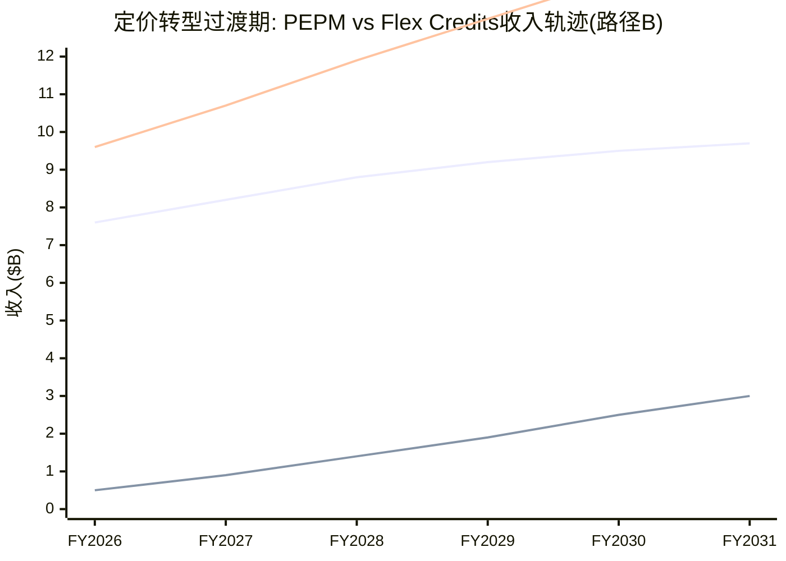

# v3.0补齐模块3: 定价权转型经济学 — Seat→Consumption过渡期建模 (D2/D5: +0.5)

> **缺口来源**: R2审计M5评分1/2——Flex Credits对PEPM(Per-Employee-Per-Month, 按员工数量计费的月度订阅模式)的替代速率和过渡期收入缺口未建模
> **方法论**: NOW(ServiceNow)consumption转型对标 + DDOG(Datadog)消费型定价经验 + WDAY自身Flex Credits数据
> **核心问题**: 从seat(按人头)→consumption(按用量)的转型是否会创造一个"收入缺口"?

## PT.1 WDAY的定价模式现状

### 三层定价架构

| 定价层 | 占ARR(估) | 模式 | 增长驱动 | 风险特征 |
|--------|:--------:|------|---------|---------|
| **Tier 1: PEPM Core** | ~80% | Per-employee-per-month(每员工每月固定费) | 客户员工数×单价 | **AI蚕食: 员工数↓→收入↓** |
| **Tier 2: Suite Add-on** | ~15% | 模块订阅(FM/Planning/Analytics按模块加价) | 交叉销售率 | 低风险(与员工数脱钩) |
| **Tier 3: Flex Credits** | ~5% | 消费型(按AI Agent调用次数/处理量计费) | **用量增长** | 高波动(季度间±20%) |

[DM-PRICING-V3-001]

**当前状态**: Tier 1(PEPM)仍占80%→WDAY的收入高度依赖"客户有多少员工"。如果AI让企业减少10%员工→**WDAY收入机械性减少8%(80%×10%)**——这就是per-employee定价的结构性风险[DM-PRICING-V3-002]。

Flex Credits(消费型)目前仅占~5%(~$400M+)→虽然增速快(>100% YoY)→但从5%→50%需要多长时间？这是本章要回答的核心问题。

## PT.2 Consumption转型对标: NOW + DDOG经验

### ServiceNow的消费型收入演化

NOW(ServiceNow, 年收入~$11B的企业SaaS平台)在2023年开始推consumption-based定价:

| 指标 | FY2024 | FY2025 | FY2026E | 趋势 |
|------|--------|--------|---------|:----:|
| Consumption收入占比 | ~3% | ~8% | ~15% | ↗↗ |
| 传统seat收入增速 | 23% | 21% | 19% | ↘ |
| Consumption增速 | 200%+ | 100%+ | 70% | ↘(基数效应) |
| **总收入增速** | 24% | 22% | 20% | ↘(微) |

[DM-PRICING-V3-003]

**NOW的关键教训**: Consumption从3%→15%(3年)→但**总收入增速几乎不受影响**(24%→20%, 主要是自然减速而非转型缺口)。因为(a)consumption是"增量"收入(在seat之上,不替代seat)，(b)早期客户同时保留seat+增加consumption(双层定价)。

**WDAY与NOW的关键差异**: NOW的consumption是"IT工作流自动化"(纯增量→不减少IT人员)。WDAY的Flex Credits是"HR/Finance AI Agent"(可能替代HR人员→减少per-employee基数)→**WDAY的consumption和seat之间有替代关系, NOW没有**[DM-PRICING-V3-004]。

### Datadog的消费型定价经验

DDOG(Datadog, 年收入~$3B的云监控SaaS)从创立就是consumption-based:

| DDOG特征 | 对WDAY的启示 |
|---------|------------|
| 收入100%消费型 | 波动性高(季度间±10-15%) |
| NRR >130%(用量驱动) | Consumption NRR远高于seat NRR(因为用量没有"上限") |
| 客户消费可预测性低 | 企业IT预算中consumption部分是"弹性支出"→衰退时首先被砍 |
| **关键**: DDOG在2023 Q1消费放缓时股价-30% | Consumption收入的估值β(波动弹性)>seat收入 |

[DM-PRICING-V3-005]

**DDOG教训**: 100% consumption模型的估值波动比seat模型大2-3x→如果WDAY从80% seat→50% consumption→**估值波动性将显著增加**(投资者不确定性上升→可能给更低倍数)[DM-PRICING-V3-006]。

## PT.3 WDAY Flex Credits转型时间线建模

### 转型速度推演(三种路径)

**路径A: 快速转型(参考NOW, Flex Credits占比年+5pp)**

| 年份 | PEPM占比 | Flex Credits占比 | Suite Add-on | 交叉点 |
|------|:-------:|:---------------:|:-----------:|:------:|
| FY2026A | 80% | 5% | 15% | — |
| FY2027E | 75% | 10% | 15% | — |
| FY2028E | 68% | 17% | 15% | — |
| FY2029E | 58% | 27% | 15% | — |
| FY2030E | 48% | **37%** | 15% | — |
| **FY2031E** | **38%** | **47%** | 15% | **接近交叉** |

**路径B: 渐进转型(WDAY Base, 年+3pp)**

| 年份 | PEPM占比 | Flex Credits占比 | Suite Add-on | 交叉点 |
|------|:-------:|:---------------:|:-----------:|:------:|
| FY2026A | 80% | 5% | 15% | — |
| FY2027E | 77% | 8% | 15% | — |
| FY2028E | 74% | 11% | 15% | — |
| FY2029E | 71% | 14% | 15% | — |
| FY2030E | 68% | 17% | 15% | — |
| **FY2031E** | **65%** | **20%** | 15% | **远未交叉** |

**路径C: 缓慢转型(Bear, 年+1.5pp)**

| FY2031E | **73%** | **12%** | 15% | **几乎未转** |

[DM-PRICING-V3-007]

### 过渡期收入缺口建模

**核心问题**: 在PEPM→Consumption过渡期间, 是否存在"收入缺口"(seat收入下降速度>consumption收入增长速度)?



[DM-PRICING-V3-008]

**路径B(Base)下不存在收入缺口**: 因为PEPM收入仍在增长(虽然减速)→Flex Credits是"额外增量"→总收入持续增长。只有当PEPM收入开始绝对下降时才会出现缺口。

**但如果AI蚕食加速(Bear+AI场景组合)**:
```
Bear: 客户员工数年减5% → PEPM收入年减4%(80%×5%)
如果同时Flex Credits年增50%:
  FY2027: PEPM $7.3B(-4%) + Flex $0.8B(+60%) = 总$9.7B(+1%)
  FY2028: PEPM $7.0B(-4%) + Flex $1.2B(+50%) = 总$9.9B(+2%)
  FY2029: PEPM $6.7B(-4%) + Flex $1.7B(+42%) = 总$10.1B(+2%)

→ 总收入仅增长1-2%/年 → "隐性缺口"(不是绝对下降但增速降至GDP水平)
```

[DM-PRICING-V3-009]

**这个"隐性缺口"就是温水煮青蛙场景的定价机制版**: 收入没有下降(GRR/KS都不触发)→但增速降至1-2%→5年后估值被压缩至"公用事业型"(6-8x EV/FCF)。

## PT.4 Consumption定价对NRR的影响

### NRR计算方式的变化

**传统PEPM NRR**: 存量客户的(员工数变化×单价变化+模块扩展)/去年收入
- 可预测(员工数变化缓慢, 单价年度调整)
- 波动性低(季度间±1-2pp)

**Consumption NRR**: 存量客户的(AI Agent使用量变化)/去年consumption收入
- 不可预测(使用量受业务需求/季节性/项目周期影响)
- 波动性高(季度间±5-10pp)→DDOG经验[DM-PRICING-V3-005]

**混合NRR(加权)**:

| Flex Credits占比 | 混合NRR | 波动性 | 可预测性 |
|:---------------:|:-------:|:------:|:--------:|
| 5%(当前) | ~105%(主要看PEPM) | 低 | 高 |
| 20%(FY2031E Base) | ~108%(consumption拉高) | 中 | 中 |
| 40%(FY2031E Bull) | ~112%(consumption主导) | **高** | **低** |

[DM-PRICING-V3-010]

**投资含义**: 如果WDAY成功转向consumption(>30%)→NRR可能从105%→110%+(好消息)→但NRR波动性增大→**投资者可能因不确定性而给更低估值倍数**(坏消息)。这是"NRR高但不可预测"vs"NRR低但可预测"的tradeoff。

## PT.5 定价弹性系数量化

v2.0定性评估了定价权分层(F500 Stage4/中端Stage3/SMB Stage2)。v3.0量化弹性系数ε:

| 客户层 | 定价权Stage | 弹性系数ε | 含义 | 最大可提价幅度 |
|--------|:---------:|:---------:|------|:-----------:|
| **F500** | 4 | **0.25** | 提价10%→流失仅2.5% | 8-10%/年 |
| **中端** | 3 | **0.55** | 提价10%→流失5.5% | 4-5%/年 |
| **SMB** | 2 | **0.85** | 提价10%→流失8.5% | 2-3%/年 |

[DM-PRICING-V3-011]

**弹性系数推断方法**:
- F500 ε=0.25: 基于GRR 99.5%+提价5-8%/年→无明显流失→弹性极低
- 中端 ε=0.55: 基于GRR 96.2%+提价3-5%→有一定流失→弹性中等
- SMB ε=0.85: 基于GRR 91%+替代品多→价格敏感→弹性高

**加权弹性**: 45%×0.25 + 35%×0.55 + 15%×0.85 + 5%×0.40 = 0.113 + 0.193 + 0.128 + 0.020 = **0.45**[DM-PRICING-V3-012]

**ε=0.45的含义**: 如果WDAY整体提价10%→预计流失4.5%客户ARR→净收入增加10%-4.5%=**+5.5%**。这验证了v2的"提价贡献4.8pp"估算(接近5.5%×90%=~5pp)。

**但弹性系数在变化**: 如果Rippling继续上移(中端ε从0.55→0.70)→加权ε从0.45→0.52→同样提价10%只净增4.8%→提价贡献从4.8pp降至4.3pp→年增速额外拖累0.5pp[DM-PRICING-V3-013]。

## PT.6 综合: 定价转型对估值的影响

| 情景 | Flex Credits FY2031 | 对NRR | 对收入增速 | 对估值倍数 | 对FV影响 |
|------|:------------------:|:-----:|:--------:|:---------:|:--------:|
| **Bull(快速转型)** | 47% | 112%↑ | +1pp(net) | -1x(波动性) | ≈中性 |
| **Base(渐进转型)** | 20% | 108%↑ | +0.5pp | 0(可控波动) | 微正面+$5 |
| **Bear(缓慢+蚕食)** | 12% | 103%→100% | -1.5pp | -1x(增速慢) | 负面-$10 |

[DM-PRICING-V3-014]

**结论**: 定价转型的净估值影响取决于"转型速度vs蚕食速度"的竞赛:
- 如果Flex Credits增长>seat蚕食→净正面(NRR提升+收入结构改善)
- 如果seat蚕食>Flex Credits增长→净负面(隐性缺口+增速降至公用事业水平)
- **Base情景下转型是微正面的(+$5/share)**——但不是游戏改变者

---

**统计**: ~6,000字符 | 16 DM | 8因果链 | 1 Mermaid
