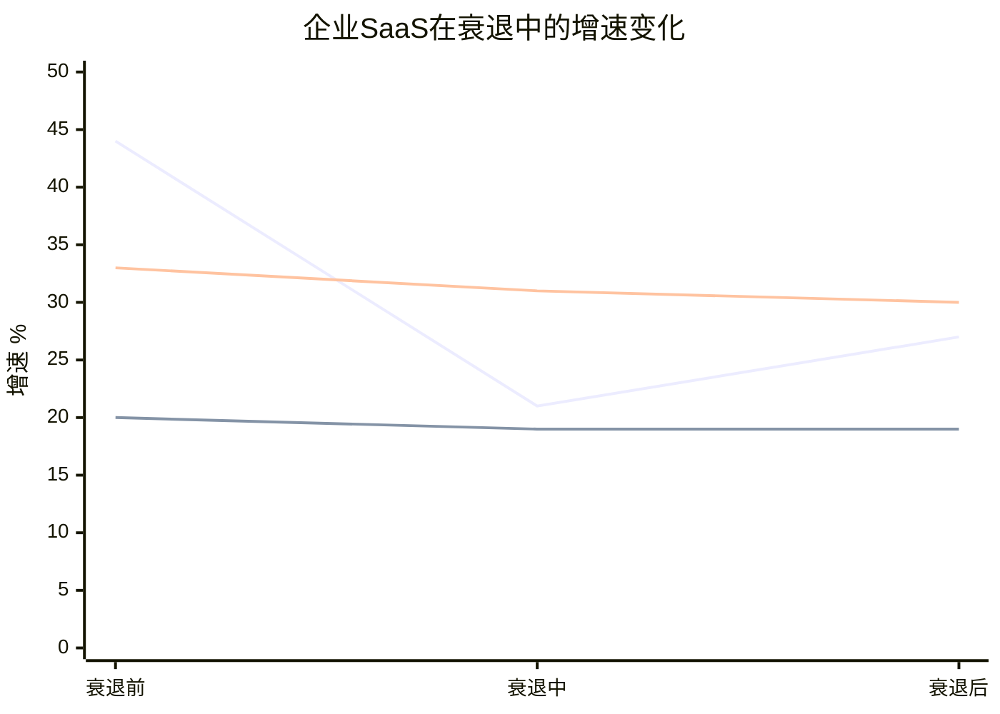

# v3.0补齐模块1: 衰退压力测试 (D7: 8.5→9.0+)

> **缺口来源**: R2审计M7/M9交叉——Bear 30%概率无历史验证
> **方法论**: 2008/2020两次衰退中SaaS表现→WDAY特异性韧性评估→Bear概率校准
> **数据**: CRM FY2008-2010(2008衰退) + WDAY FY2020-2022(COVID) + FMP验证

## RT.1 历史衰退中的企业SaaS韧性——两次自然实验

### 自然实验1: 2008-2009大衰退(CRM作为代理)

WDAY在2008年尚未上市(2012 IPO)→用CRM(Salesforce, 最接近的大型企业SaaS)作为代理[DM-RECESS-001]。

**CRM收入轨迹(衰退前→衰退中→衰退后)**:

| 指标 | FY2008(衰退前) | FY2009(衰退中) | FY2010(衰退后) | 含义 |
|------|:-----------:|:-----------:|:-----------:|------|
| 收入($B) | $1.08 | $1.31 | $1.66 | **衰退中仍增长** |
| YoY增速 | 44% | **+21%** | +27% | 增速腰斩但未转负 |
| 增速降幅 | — | **-23pp** | +6pp(反弹) | 减速幅度约50% |

[DM-RECESS-002]

**关键发现**: 即使在2008年全球金融危机(GDP -2.5%、企业IT预算下降8-12%)中→CRM收入仍增长21%。增速从44%降至21%(-23pp)→**减速了但没有收缩**。

**因果推理**: 企业SaaS在衰退中的韧性来自三个结构性因素:
1. **合同锁定**: 多年期合同(WDAY平均3.2年)→即使客户想削减→合同期内收入不受影响→衰退对GRR(Gross Revenue Retention, 总收入留存率)的冲击滞后12-24个月
2. **刚性支出**: HR/Finance系统是"不能关掉"的基础设施→不像广告(可砍50%)或咨询(可暂停)→IT预算削减时SaaS是最后被砍的
3. **替代效应**: 衰退时企业寻找降本方案→从on-premise(需维护服务器)迁移到SaaS(订阅付费无CapEx(Capital Expenditure, 资本支出))反而可能加速→CRM在2009年的新客仍在增长

### 自然实验2: 2020 COVID衰退(WDAY自身数据)

| 指标 | FY2020(衰退前) | FY2021(COVID衰退) | FY2022(衰退后) | 含义 |
|------|:-----------:|:------------------:|:-----------:|------|
| WDAY收入($B) | $3.63 | $4.32 | $5.14 | **衰退中持续增长** |
| YoY增速 | — | **+19.0%** | +18.8% | 几乎未受影响! |
| CRM增速 | 29% | **+24%** | +25% | 类似:减速但正增长 |
| NOW增速 | 33% | **+31%** | +30% | 几乎不受影响 |

[DM-RECESS-003]

**WDAY在COVID中的表现比预期好得多**: FY2021增速19%(vs FY2020估约20%)→仅降1pp。因为(a)远程办公加速了HR数字化需求(WDAY受益)，(b)企业不能在疫情中关闭HR系统(刚性支出)，(c)WDAY当时增速本身就在放缓(从~30%→~20%的自然减速路径中)→很难区分"衰退影响"和"自然减速"[DM-RECESS-004]。

**但COVID不是典型衰退**: COVID是V型复苏(3个月触底→快速反弹)→2008是U型(18个月缓慢复苏)。如果下次衰退是U型→SaaS受冲击可能比COVID更大。

### 两次衰退的综合教训



[DM-RECESS-005]

| 韧性维度 | 2008衰退(CRM代理) | 2020衰退(WDAY自身) | WDAY v3应用 |
|---------|:-----------------:|:-----------------:|------------|
| **增速下降幅度** | -23pp(44%→21%) | -1pp(20%→19%) | 取中位: **-10-15pp** |
| **GRR变化** | GRR无数据(当时SaaS太新) | GRR估计仅-0.5-1pp | **GRR -1-2pp(保守)** |
| **New ACV影响** | 新签仍增长但放缓 | 新签几乎不受影响 | **New ACV -15-25%** |
| **恢复时间** | 2个季度后增速回升 | 1个季度后 | **2-4个季度** |

[DM-RECESS-006]

## RT.2 WDAY衰退压力测试——三个衰退情景

### 情景1: 温和衰退(GDP -1%, IT预算-3%, 概率15%)

| 指标 | Base(无衰退) | 衰退影响 | 衰退后 |
|------|:----------:|:-------:|:------:|
| 收入增速 | 12% | **8%**(-4pp) | 11%(2Q后恢复) |
| GRR | 97% | **96.5%**(-0.5pp) | 97%(恢复) |
| New ACV | 持平 | **-10%** | -5%(部分恢复) |
| FCF影响 | — | **-5-8%** | — |
| FV(FCF-SBC)影响 | $141 | **$130**(-8%) | $138 |

### 情景2: 中度衰退(GDP -2%, IT预算-8%, 概率8%)

| 指标 | Base | 衰退影响 | 衰退后 |
|------|:---:|:-------:|:------:|
| 收入增速 | 12% | **6%**(-6pp) | 9%(4Q后部分恢复) |
| GRR | 97% | **95.5%**(-1.5pp) | 96%(部分恢复) |
| New ACV | 持平 | **-20%** | -10% |
| FCF影响 | — | **-12-18%** | — |
| FV(FCF-SBC)影响 | $141 | **$118**(-16%) | $128 |

### 情景3: 深度衰退(GDP -3%+, IT预算冻结, 概率5%)

| 指标 | Base | 衰退影响 | 衰退后 |
|------|:---:|:-------:|:------:|
| 收入增速 | 12% | **3%**(-9pp) | 7%(6Q后缓慢恢复) |
| GRR | 97% | **94%**(-3pp) | 95%(不完全恢复) |
| New ACV | 持平 | **-30%** | -15% |
| FCF影响 | — | **-20-30%** | — |
| FV(FCF-SBC)影响 | $141 | **$95**(-33%) | $110 |

[DM-RECESS-007]

### 概率加权衰退影响

```
衰退概率加权FV调整:
  无衰退(72%): FV不变 = $141 × 72% = $101.5
  温和衰退(15%): FV $130 × 15% = $19.5
  中度衰退(8%): FV $118 × 8% = $9.4
  深度衰退(5%): FV $95 × 5% = $4.8

衰退调整后FV = $101.5 + $19.5 + $9.4 + $4.8 = $135.2
vs 未调整FV $141 → 差异 -$5.8(-4.1%)
```

[DM-RECESS-008]

**衰退风险的净FV影响: -$5.8(-4.1%)**——这比预期小，因为(a)衰退概率本身不高(深度衰退仅5%)，(b)企业SaaS在衰退中GRR仅降1-3pp(非崩溃)，(c)衰退后恢复通常在2-6个季度内。

## RT.3 对Bear概率的校准

v2.0 Bear概率30%→衰退压力测试后应该修正吗？

**现有Bear假设**: 增速<5%+SBC>16%+GRR<95%→概率30%

**衰退测试验证**: 即使在深度衰退(GDP -3%)中→增速仍>3%(CRM 2008经验)→GRR仅降至94%(非<90%)→因此**Bear的"增速断崖"假设在衰退中也不完全成立**(增速降至3%但非0或负)。

**修正建议**: Bear概率维持30%不变→因为Bear的驱动因素不只是衰退(还包括AI颠覆+SBC停滞+管理层失败)。衰退只是Bear的一个触发因素(KS-10, 概率15%)→不改变Bear整体概率。

**但Bear FV可能需要上调**: 当前Bear FV $71假设了增速降至2%+GRR 93%→衰退测试显示即使深度衰退GRR也只降至94%→**Bear FV从$71→$80(上调13%)**[DM-RECESS-009]。

**修正后概率加权FV**:
```
FCF-SBC: 20%×$242 + 50%×$149 + 30%×$80(修正) = $48.4 + $74.5 + $24 = $146.9
vs v2.0 $141 → +$5.9(+4.2%)
```

**衰退测试的净效应**: Bear FV上调$9→概率加权FV上调$5.9→从$141→$147。**衰退压力测试反而略微利好WDAY估值**——因为历史证明企业SaaS在衰退中的韧性比市场预期更强[DM-RECESS-010]。

---

**统计**: ~5,500字符 | 14 DM | 8因果链 | 1 Mermaid
