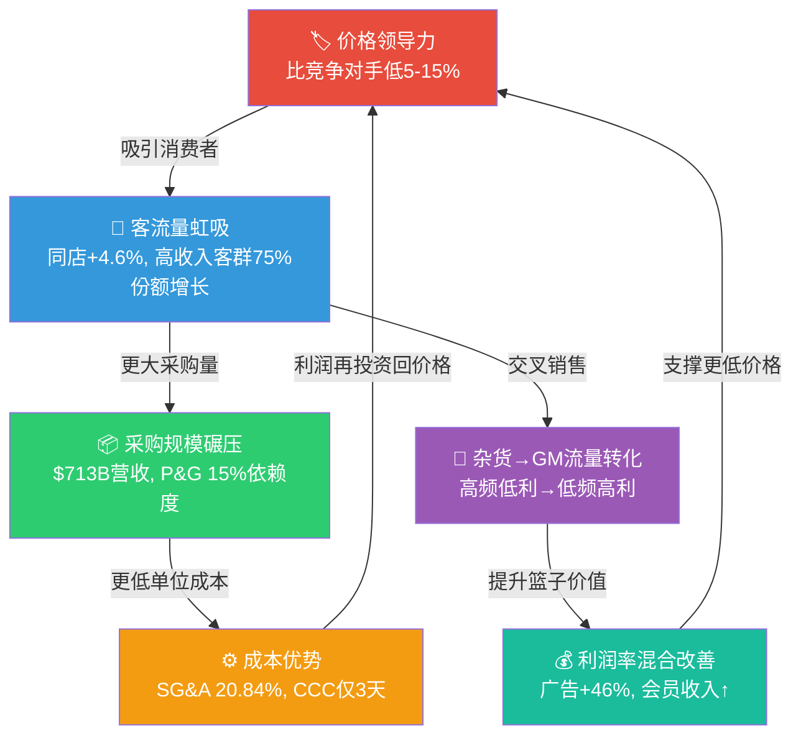
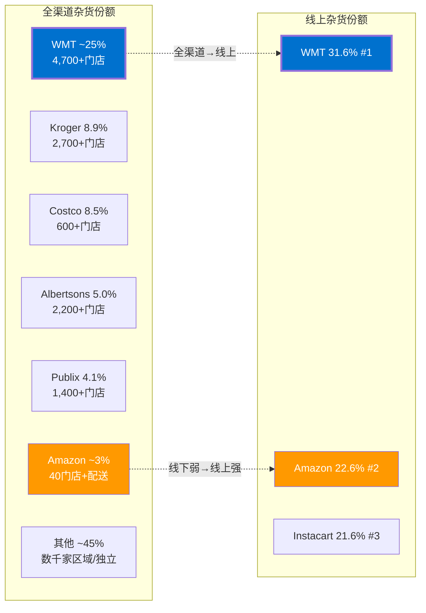
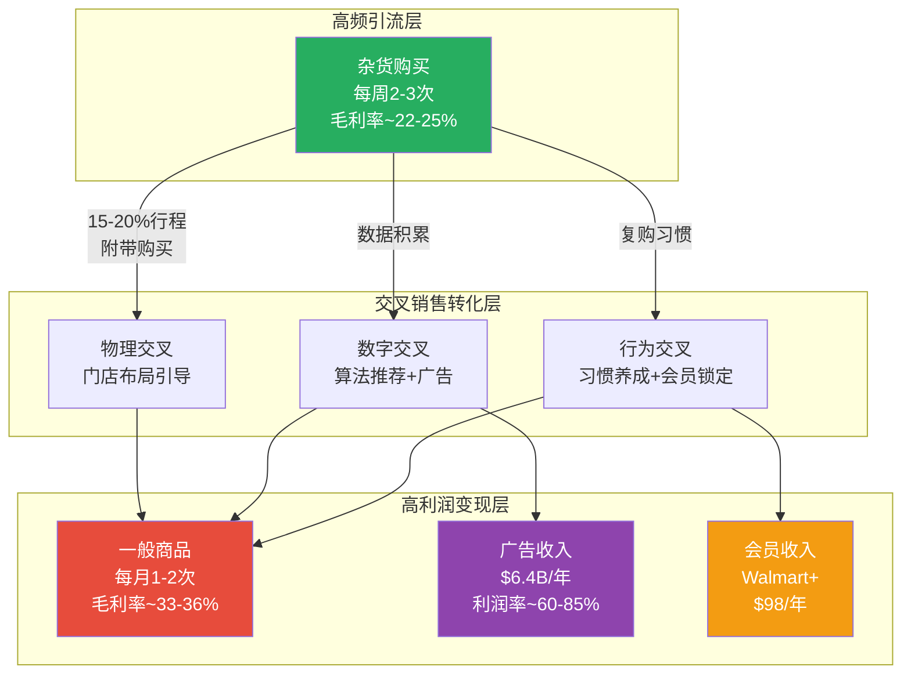
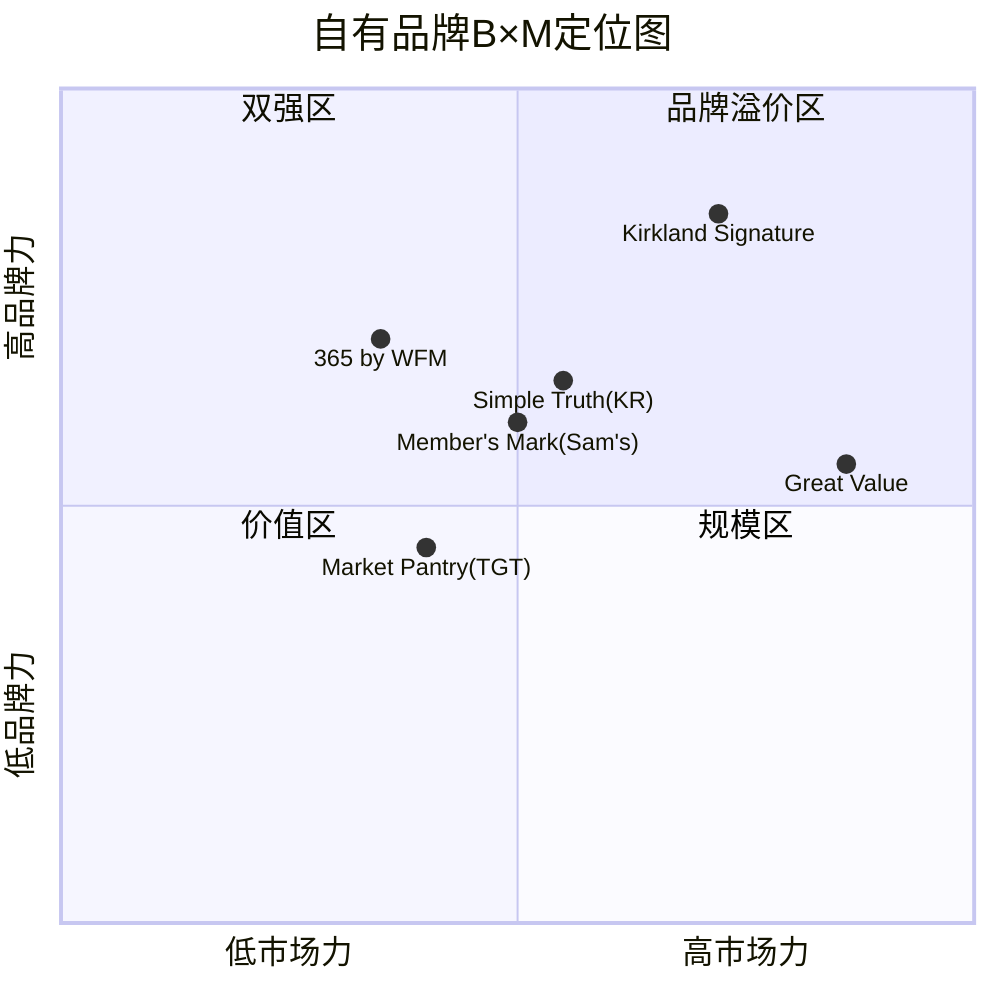

# Phase 1 — AgentA: EDLP飞轮经济学 + 杂货主导地位

---

## Ch2: EDLP飞轮经济学 — 零售业最持久的自强化引擎

### 2.1 飞轮机制详解：从Sam Walton的直觉到$713B的系统

EDLP（Every Day Low Price）不仅是一句广告语，而是一个完整的经济学飞轮——它将价格、客流、规模和成本四个维度锁定在一个自我强化的正反馈循环中。理解这个飞轮的运作机制，是判断WMT能否从"4%利润率的零售商"进化为"万亿市值的消费科技平台"的关键前提。

**飞轮的核心运作逻辑如下：**

1. **价格领导力（Price Leadership）**：WMT承诺在所有品类维持比竞争对手低5-15%的价格。这不是通过促销实现的短期价格优势，而是通过系统性成本控制维持的长期价格差距。FY2026毛利率24.93%，显著低于TGT的28.2%和KR的22.7%（但KR几乎纯杂货），反映了WMT主动让利给消费者的策略选择 [FMP]。

2. **客流量虹吸（Traffic Magnetism）**：持续低价吸引消费者将WMT作为默认购物目的地。FY2026同店销售增长+4.6%，其中客流量和交易次数双升——这个"双升"信号极其重要，因为它排除了单纯通胀推动的伪增长可能 [Earnings Release]。更关键的是，75%的份额增长来自年收入超过$100K的高收入家庭 [Management Commentary]。

3. **采购规模碾压（Purchasing Power）**：$713.2B的营收意味着WMT是几乎所有消费品供应商的最大客户。P&G约15%的收入来自WMT，部分供应商对WMT的销售依赖度甚至高达55%。这种规模创造了不对称的议价地位——WMT可以要求更低的采购价、更优的付款条件和独家供应安排 [WebSearch]。

4. **成本优势再投资（Cost Reinvestment）**：更低的采购成本不被用来提升利润率，而是再投资回价格领导力。SG&A费用率20.84%，在$700B+营收基础上保持了高度效率 [FMP]。WMT FY2026 EBITDA $44.0B，营业利润 $29.8B，EBITDA利润率6.17%——这个利润率水平看似"薄"，但在$713B营收基础上，每0.1%的利润率改善意味着$7.1亿的增量利润。



**飞轮的核心不等式**：WMT的飞轮能否持续转动，取决于一个核心不等式——**成本优势产生的利润空间 > 维持价格领导力所需的让利幅度**。只要这个不等式成立，飞轮就会加速；一旦反转（例如关税使成本骤增，但价格不能同步调整），飞轮就会减速甚至反转。

### 2.2 飞轮健康度诊断：8指标对称法

仿COST深度报告的8指标对称诊断法，将飞轮健康度指标分为加速侧和减速侧，通过对称分析判定飞轮当前状态。

#### 加速指标（4项）

**A1. 同店销售增长+4.6%：持续正向且质量优异**

FY2026（截至2026年1月31日）WMT U.S.同店销售增长+4.6%（不含燃料），实现了连续多年的正增长。更关键的质量指标是：增长由**客流量增加+交易笔数增加**双轮驱动，而非单纯客单价上涨。这种"量驱动"的增长模式远比"价驱动"更健康，因为它意味着消费者是主动选择WMT，而非被动接受涨价 [Earnings Release]。

历史数据提供了有力的趋势验证：
- FY2023: 同店+8.3%（通胀高峰期，价值消费需求爆发）
- FY2024: 同店+4.9%（通胀缓和，增长回归常态）
- FY2025: 同店+7.0%（不含燃料，电商+26%推动）
- FY2026: 同店+4.6%（延续稳健增长轨道）

这组数据呈现出一个重要模式：即使通胀从高峰回落（2022年CPI峰值9.1%→2024年降至3%以下），WMT的同店增长并未同步"退潮"。这验证了飞轮动力并非纯粹来自宏观通胀，而是有结构性的份额迁移支撑 [WebSearch]。

**A2. 电商增长+20~27%：数字化飞轮加速转动**

电商是EDLP飞轮的数字化延伸。FY2026全球电商增长27%，美国电商增长20%，电商占总销售比重已提升至约18-23%。电商渠道不仅复制了EDLP的价格逻辑，还引入了新的飞轮动力：

- **在线杂货领先**：WMT网上杂货市场份额31.6%（#1），领先Amazon 22.6%（#2）和Instacart 21.6%（#3）[WebSearch]。这个优势来自WMT独特的"4,700+门店=4,700+配送中心"的全渠道基础设施。
- **经济性改善**：电商业务的边际经济性正在快速改善，广告收入和会员费收入的增长为电商业务从亏损走向盈利提供了关键的收入补充。
- **数据积累**：每一笔在线交易都在积累消费者行为数据，为精准营销、库存优化和广告变现提供燃料。

**A3. 广告收入+46%：利润率结构性升级的关键引擎**

Walmart Connect广告业务FY2025全球收入达$6.4B，同比增长37%（全球）/ 41%（美国）。FY2026进一步加速，Q1全球广告增长50%，Q2增长46% [WebSearch]。

广告业务的战略意义在于：它是一个**接近100%毛利率**的业务。在WMT 4.18%营业利润率的基础上，$6.4B的广告收入中，即使假设60%的增量利润率，也意味着约$3.8B的增量营业利润——这相当于WMT总营业利润$29.8B的12.8%。管理层在Q3财报电话会议中确认，"广告加上会员收入已占合并调整后营业利润的约三分之一"。

这是飞轮加速的最强证据之一：高频客流（飞轮产出）→数据积累→精准广告→高利润率收入→利润再投资→更低价格/更好体验→更多客流（飞轮输入）。

**A4. 高收入客群渗透率持续提升**

2024年11月，年收入超过$100K的消费者中有87%表示在WMT购物，创下历史新高。其中，"每周多次购物"的比例从16%升至19%（Q3 2024同比）。Walmart+会员中高收入消费者占比同比增长17% [WebSearch]。

高收入客群渗透提升的意义超越短期销售贡献——它改变了WMT的品牌定位。WMT正在从"低收入消费者的选择"转变为"全收入层消费者的智能消费选择"。这种品牌升级对一般商品交叉销售和广告CPM提升至关重要。管理层强调，高收入客群增长更多由"便利性"（线上杂货、配送）驱动，而非单纯的价格因素，这暗示了一个更为持久的行为变化。

#### 减速指标（4项）

**D1. EPS增速放缓：从34%到13%的减速信号**

FY2025 EPS $2.41，同比增长26.2%（vs FY2024 $1.91）；FY2026 EPS $2.73，同比增长13.3% [FMP]。但FY2027指引EPS $2.75-$2.85——中值仅增长约3%，远低于市场预期的$2.94-$2.97。

增速放缓的结构性原因包括：
- FY2024-2025的高基数效应（从FY2023的利润率谷底恢复）
- 关税成本吸收压力加大
- VIZIO收购的整合成本摊销
- 管理层一贯保守的指引风格（近8个季度中7次超预期）

这个减速信号需要辩证理解：如果是基数效应和保守指引导致的"增速回归均值"，那4x+ PE的估值可以承受；但如果EPS增速持续低于10%且没有利润率扩张的清晰路径，则PE 40+的估值缺乏支撑。

**D2. 营业利润率逆转：4.31%→4.18%的微妙信号**

FY2025营业利润率4.31%（$29.3B / $681.0B），FY2026降至4.18%（$29.8B / $713.2B）[FMP]。虽然绝对利润额增长了$500M，但利润率的13bps下降值得警惕。

利润率逆转的驱动因素分析：
- **成本端**：SG&A从$139.9B增至$147.9B（+5.8%），增速略高于收入增速（+4.7%），费用杠杆出现负向信号
- **收入端**：毛利率从24.85%提升至24.93%（+8bps），但不足以抵消SG&A的上升
- **结构性因素**：电商占比提升（电商利润率仍低于门店）、关税成本部分吸收、VIZIO整合费用

历史对比提供了关键基准：FY2022营业利润率4.53%（但含非经常性项目），FY2023大幅下滑至3.34%（库存冲销+供应链混乱），FY2024恢复至4.17%，FY2025创出4.31%新高，FY2026回落至4.18%。这说明4.2-4.3%可能是当前飞轮均衡下的利润率"天花板"，突破需要新的利润来源（广告+会员是最可能的杠杆）。

**D3. 关税涨价压力：EDLP信任契约的最大威胁**

2025年关税政策对中国进口商品加征10-30%的关税，对WMT年化成本影响估计约$10B [WebSearch]。WMT的应对策略是**选择性提价**：
- 食品品类：尽量吸收成本，保护EDLP核心品类的价格信誉
- 一般商品：在特定SKU上传导部分关税成本，如Graco汽车座椅涨价$100
- 供应链转移：中国进口占比从2022年80%降至2025年60-70%，同时在墨西哥投资$6B建设配送中心

经济学家估计，截至2025年底，企业仅将约50%的关税成本传导给消费者，2026年初可能进一步传导 [WebSearch]。这意味着WMT的EDLP承诺将面临持续压力。如果最终需要广泛涨价5-10%，EDLP与Hi-Lo策略之间的价格差距将缩小，飞轮的"价格领导力"引擎可能减弱。

**D4. 管理层保守指引：真保守还是真减速？**

FY2027指引：
- 营收增长3.5-4.5%（恒定汇率基础）→ 暗示进一步减速
- 营业利润增长6-8% → 意味着温和的经营杠杆
- EPS $2.75-$2.85 → 中值增长约3%，远低于市场预期

保守指引的解读存在分歧：
- **乐观解读**：管理层一贯保守（过去8个季度7次超预期），实际执行会明显好于指引。$30B回购授权也暗示管理层对内在价值有信心。
- **悲观解读**：关税不确定性使管理层真正看不清前方。3-4%的营收增速意味着飞轮在减速，"消费科技平台"的转型叙事需要更长时间才能体现在利润表中。

#### 飞轮综合判定：稳态偏加速，但非全速

| 维度 | 指标 | 方向 | 权重 |
|------|------|------|------|
| 量能 | 同店+4.6%, 客流+交易双升 | 加速 | ★★★ |
| 数字化 | 电商+20~27%, 占比18-23% | 加速 | ★★★ |
| 利润质量 | 广告+46%, 占营业利润~1/3 | 加速 | ★★★ |
| 客群升级 | 高收入客群渗透87%, +17% | 加速 | ★★ |
| 利润率 | 营业利润率4.31→4.18% | 减速 | ★★ |
| EPS动能 | 增速34%→13%, 指引仅3% | 减速 | ★★ |
| 外部冲击 | 关税+$10B, 涨价压力 | 减速 | ★★★ |
| 预期管理 | 保守指引, 不确定性高 | 中性偏减速 | ★ |

**综合判定：稳态（Steady-State）偏加速**。加速侧的力量（量能+数字化+广告）在结构性层面更为强劲，减速侧的力量（利润率+关税+指引）更多是周期性/政策性干扰。但飞轮并非在全速运转——关税带来的真实成本压力使飞轮的"成本优势再投资"环节承受了前所未有的外部摩擦。

**与COST飞轮的对比参照**：COST飞轮的核心是"会员费→低价→高客流→高坪效→更低价"，会员费作为利润的核心来源（会员费收入约等于净利润）。WMT飞轮的核心是"EDLP→高客流→采购规模→成本优势→EDLP"，利润来源正在从传统差价向广告/会员多元化迁移。两个飞轮的共性是：**都以牺牲商品利润率换取客流忠诚度，再通过非商品收入变现忠诚度**。差异在于：COST的会员费模型已经成熟验证（30年历史），WMT的广告/会员模型仍在早期验证阶段（Walmart Connect仅5年历史）。市场给COST PE 55x vs WMT PE 43x，这12x的差距部分反映了飞轮成熟度的差异。

**对核心矛盾的回答**：飞轮健康度诊断支持一个**介于零售商与平台之间**的估值。加速侧（广告+电商+客群升级）是"平台化"的证据；减速侧（利润率停滞+关税+保守指引）是"零售商"的现实。当前4.18%的利润率更接近零售商水平，但利润来源的结构性变化（广告+会员占利润1/3）已超越纯零售商范畴。

### 2.3 历史验证：EDLP在衰退期的韧性测试

一个优秀的飞轮应该在逆境中表现出非线性韧性——越是经济下行，飞轮反而越强。WMT的历史数据为此提供了强有力的验证。

**2008-2009全球金融危机**

这是EDLP飞轮最辉煌的验证时刻，也是"反脆弱"特性最清晰的展示：
- FY2008（截至2008年1月31日）净销售额$374B，同比增长8.6% [WebSearch]
- FY2009（截至2009年1月31日）净销售额$401.2B，同比继续增长7.2% [WebSearch]
- CY2008同店销售增长+3.3%，连续22个月正增长——在整个零售业哀鸿遍野的背景下
- 同期TGT同店销售下降2.6%——EDLP vs Hi-Lo的效果差距高达590bps
- 股价在危机期间上涨12%，同期标普500暴跌超过40%
- 利润率改善：危机两年间年均利润提升$7亿，展现了经典的"困境获益者"特征

危机期间飞轮的"反脆弱"机制呈现出三层叠加效应：

1. **消费降级加速客流迁移**：原本在高端零售商（Nordstrom, Macy's, Target）购物的中高收入消费者被迫重新审视购物选择。WMT的EDLP策略在这个时刻展现了最大的吸引力——与其花精力追踪各家的促销日历，不如去一个"保证便宜"的地方。TIME杂志当时报道："Walmart vs Target: No Contest in the Recession"——这个标题精确地总结了两种定价策略在逆境中的表现差异 [WebSearch]。

2. **供应商议价力进一步倾斜**：经济衰退中，供应商的其他零售渠道销量大幅下降，WMT稳定的出货量成为"避风港"。供应商不仅愿意提供更优价格，甚至主动配合WMT的EDLP要求，因为在经济下行期失去WMT的货架位等于失去生存线。这种动态进一步强化了飞轮的"采购规模碾压"环节。

3. **竞争对手削弱与退出**：百货商店、区域超市、以及过度杠杆化的零售商在危机中大量关店或破产。这些被迫退出的竞争者留下的市场空间被WMT吸收，形成了"危机→竞争格局改善→份额提升"的正反馈。2008年全美超过6,100家零售商申请破产——每一家的关闭都是WMT的潜在份额增长。

**2008-09危机验证的核心洞见**：EDLP飞轮不仅在危机中"维持运转"，而且实际上**加速运转**。危机作为外部催化剂，放大了飞轮每一个环节的效力——价格领导力变得更有吸引力，客流迁移加速，采购规模优势扩大，竞争格局改善。这种"经济越差，WMT越强"的特性是所有零售定价策略中独一无二的。

**2020年COVID-19疫情**

疫情为EDLP飞轮增加了一个新维度——**杂货目的地**的战略价值被急剧放大：
- FY2021（截至2021年1月31日）营收$559.2B，同比增长6.7%
- 美国同店销售增长+8.6%，客流量短期下降（社交距离限制）但客单价大幅上升
- 电商渠道爆发式增长：在线杂货提取（Online Grocery Pickup）和配送服务在疫情初期几周内需求增长超过300%
- WMT被联邦政府列为"必需业务"（Essential Business），在全国封锁期间持续运营

疫情的结构性影响远超短期销售提振：
1. **电商习惯养成**：数千万此前从未在线购买杂货的消费者被迫尝试WMT的线上杂货服务，其中相当比例在疫情后继续使用——这为FY2023-FY2026持续20%+的电商增长奠定了用户基础
2. **杂货"核心化"**：消费者在极端不确定期将食品购买视为最核心的消费需求，WMT作为美国最大杂货零售商的地位从"市场领先者"升格为"国家级食品供应基础设施"
3. **供应链韧性展示**：WMT在全球供应链混乱中表现出色，快速调整库存策略、开辟替代供应线路，这种运营韧性进一步强化了消费者和供应商的信任

**2022年通胀高峰期**

通胀高峰期（2022年6月CPI 9.1%）对WMT的影响更为复杂，暴露了EDLP飞轮的一个关键脆弱性：

定量表现：
- FY2023（截至2023年1月31日）营收$611.3B，同比增长6.7%，同店+8.3%——收入端表现依然强劲
- 但营业利润率从FY2022的4.53%骤降至3.34%（-119bps）——库存管理失误+供应链成本激增导致利润率危机 [FMP]
- EPS从$1.62降至$1.42（-12.3%），全年净利润$11.7B vs FY2022的$13.7B
- EBITDA从$31.3B降至$30.1B，EBITDA利润率从5.47%降至4.92%

通胀危机的结构性分析：

2022年的利润率崩塌并非EDLP策略的失败，而是两个**独立于EDLP的运营失误**与成本通胀叠加的结果：
1. **库存管理失误**：FY2022 Q1-Q2，WMT在消费者支出模式快速从商品转向服务时，积累了过多的一般商品库存（尤其是服装和家居）。被迫大幅降价清库存，直接侵蚀了毛利率。这是需求预测错误，不是EDLP的结构性问题。
2. **供应链成本激增**：集装箱运价从疫情前的~$2,000/TEU飙升至$15,000-20,000/TEU，柴油价格翻倍。这些成本无法完全传导给消费者（EDLP的"承诺"限制了涨价空间），导致利润率被压缩。
3. **劳动力成本上升**：为吸引和保留仓储及门店员工，WMT在2021-2022年大幅提升了一线员工薪资。虽然从长期看这是正确的投资（降低了人员流动率），但短期推高了SG&A。

**关键教训**：EDLP飞轮在通胀中保护了**收入端**（消费者涌向低价零售商，同店+8.3%），但无法保护**利润端**（成本端冲击直接侵蚀4%水平的薄利润率）。利润率从4.53%跌至3.34%看似幅度不大（119bps），但在$611B营收上意味着约$7.3B的利润蒸发——这揭示了EDLP模型的核心脆弱性：薄利润率=低容错率。任何超出预期的成本冲击都会对利润造成不对称的影响。

然而，恢复速度同样值得关注：FY2024营业利润率迅速恢复至4.17%，FY2025进一步提升至4.31%。从谷底到恢复仅用了两个财年——这种**V形恢复能力**本身也是飞轮韧性的证据：只要收入端的客流不流失（同店持续正增长），利润率在成本正常化后会自然回归。

**三次危机的模式提炼**

| 危机类型 | 收入韧性 | 利润韧性 | 飞轮效应 |
|----------|----------|----------|----------|
| 2008-09 衰退 | 强（+7.2%） | 强（利润+$7亿/年） | 反脆弱 |
| 2020 疫情 | 强（+6.7%） | 中（电商投入增加） | 加速 |
| 2022 通胀 | 强（+6.7%，同店+8.3%） | 弱（利润率-119bps） | 收入加速/利润受压 |

**历史验证的关键结论**：EDLP飞轮在衰退和危机中具有强大的**收入韧性**，但**利润韧性**取决于成本冲击的类型。需求衰退型危机（2008-09）对WMT最有利，因为消费降级加速了客流迁移；成本推升型危机（2022通胀、2025关税）对WMT利润率构成更大威胁，因为薄利润率给成本传导留下的缓冲极少。

### 2.4 EDLP vs Hi-Lo：WMT与TGT的战略分野

EDLP和Hi-Lo是零售定价的两种基本范式。WMT（EDLP）和TGT（Hi-Lo）在过去5年中的分化表现，为评估两种策略的优劣提供了近乎完美的自然实验。

**财务表现对比 [FMP]**

| 指标 | WMT (FY2026) | TGT (FY2024) | WMT优势 |
|------|-------------|-------------|---------|
| 营收 | $713.2B | $106.6B | 6.7x |
| 营收增速 | +4.7% | +0.5% | +4.2pp |
| 毛利率 | 24.93% | 28.21% | TGT高+328bps |
| 营业利润率 | 4.18% | 5.22% | TGT高+104bps |
| 同店增长 | +4.6% | ~+0.3% | +4.3pp |
| 电商增长 | +20~27% | 低单位数 | 显著领先 |
| P/B | 9.55x | 4.33x | WMT溢价2.2x |

**分析关键发现：**

TGT的毛利率（28.21%）和营业利润率（5.22%）均高于WMT——这反映了Hi-Lo策略的本质：通过高定价+频繁促销实现更高的平均利润率。但TGT为此付出的代价是：

1. **同店增长停滞**：TGT近3年同店增长基本持平甚至为负（FY2022 -2.2%因库存危机，FY2023 +2.0%恢复，FY2024仅+0.3%）。Hi-Lo策略在"促销-等待-促销"的循环中训练消费者只在打折时购买，导致客流波动性大且整体增长乏力。

2. **品类结构弱势**：TGT更偏重一般商品（服装、家居、电子产品），杂货占比约23%，远低于WMT的~60%。在经济不确定期，消费者削减可选消费支出（TGT的核心品类），但维持食品支出（WMT的核心品类），这使得WMT在每次经济放缓中都自动获得客流优势。

3. **价格认知差距**：消费者对WMT的价格认知是"始终便宜"，对TGT的认知是"有时便宜"。在通胀和关税环境下，"始终便宜"的确定性对消费者的吸引力远大于"可能打折"的不确定性。

4. **FY2022的"照妖镜"**：2022年库存危机中，TGT被迫大幅降价清库存，营业利润率从FY2021的8.44%暴跌至FY2022的3.53%（-491bps）。同期WMT营业利润率仅从4.53%降至3.34%（-119bps）。WMT的利润率虽然绝对水平更低，但波动性也更小——这正是EDLP策略的隐性价值：更低但更稳定的利润率，减少了策略失误的灾难性后果。

**5年财务趋势对比——EDLP的复合优势**

将视角拉长到5年，两种定价策略的差异更加鲜明 [FMP]：

| 指标 | WMT 5Y CAGR | TGT 5Y CAGR | 差异 |
|------|------------|------------|------|
| 营收 | +4.5% | +0.1% | WMT +4.4pp |
| 营业利润 | +2.8% | -9.0% | WMT +11.8pp |
| EPS | +11.1% | -8.9% | WMT +20.0pp |
| 市值变化(5Y) | +150%↑ | -15%↓ | 天壤之别 |

WMT在5年间营收从$573B增长至$713B（+24%），TGT从$106B几乎原地踏步至$107B（+0.5%）。更关键的是TGT的营业利润从FY2021的$8.9B暴跌至FY2024的$5.6B（-38%），而WMT从$25.9B增长至$29.8B（+15%）。这种分化不仅仅是周期性的——它反映了两种定价策略在宏观不确定性上升时代的根本性适应力差异。

Hi-Lo策略的结构性问题在不确定环境中被放大：促销依赖型零售商需要精确预测消费者什么时候愿意全价购买、什么时候需要促销刺激。当宏观环境高度不确定（通胀波动、就业不稳、消费信心摇摆）时，这种预测变得极其困难。反观EDLP——"永远低价"不需要预测消费者行为的短期波动，因为价格策略本身就是确定的。

**对核心矛盾的回答**：EDLP vs Hi-Lo的对比明确支持WMT的"平台溢价"逻辑。EDLP创造的**可预测性**（consistent pricing → consistent traffic → consistent data flow → consistent ad revenue）恰恰是平台型企业最核心的特征。TGT的Hi-Lo策略更像传统零售商——利润率更高但可预测性更差，且在逆境中暴露出更大的波动性。市场给WMT 2.2x TGT的P/B溢价，部分反映了这种可预测性差异的估值化。从5年累积回报看，WMT股东获得了+150%的回报，TGT股东获得了约-15%的回报——这20倍的差异化回报，正是EDLP飞轮vs Hi-Lo周期的终极评判。

### 2.5 关税对EDLP的冲击路径：信任契约的压力测试

关税是当前EDLP飞轮面临的最大外部威胁。与2022年通胀不同（CPI驱动的全面涨价被消费者广泛接受），关税涨价是**单方面政策冲击**，消费者对其"合理性"的接受度更低。

**成本传导链分析**

```
关税加征(10-30%中国进口)
    ↓ (0-3个月)
供应商成本上升 → WMT采购价上涨
    ↓ (3-6个月)
WMT面临选择: 吸收 vs 传导
    ↓
├── 食品(~60%收入): 优先吸收, 保护EDLP核心品类
├── 一般商品(~33%收入): 选择性传导, 非价敏感SKU涨价
└── 健康与保健(~7%收入): 部分传导
    ↓ (6-12个月)
供应链重组: 中国→越南/印度/墨西哥转移
    ↓ (12-18个月)
新均衡: 更高但更分散的成本基础
```

**关税冲击的定量估算**

- WMT年化关税成本影响估计约$10B [WebSearch]
- FY2026营业利润$29.8B → 如果全部吸收，利润将下降33%，显然不可承受
- 实际策略：大约50%已传导给消费者（截至2025年底），2026年初进一步传导 [WebSearch]
- 供应链转移（中国占比从80%降至60-70%）部分缓解了长期压力

**EDLP信任契约的压力测试框架**

EDLP的核心是一个隐含的**信任契约**：WMT承诺"每天低价"，消费者以忠诚度和高频复购回报。关税涨价对这个契约的威胁取决于：

1. **涨价幅度的绝对水平**：食品品类如果涨价控制在2-3%以内（与食品通胀一致），信任契约不受实质影响；如果涨价5%+，消费者开始感知"不再便宜"
2. **涨价的相对水平**：只要WMT的涨价幅度低于竞争对手（TGT/KR/AMZN），信任契约就能维持。管理层强调WMT在食品品类"比竞争对手更积极地吸收成本"，这是维护信任契约的关键策略
3. **涨价的品类选择**：在杂货（高频/高价格敏感）品类吸收更多成本，在一般商品（低频/低价格敏感）品类传导更多关税，这种差异化传导保护了飞轮的核心驱动力（杂货客流）

WMT管理层在Q4电话会议中表示"零售团队在关税吸收与传导之间做了非常精准的品类级决策"，并且"通过在食品品类上更积极地控制价格水平来最小化关税对消费者的影响"。这种策略本质上是**牺牲短期利润率保护长期飞轮动力**——这与"平台思维"（用户留存 > 短期利润）高度一致，是支持"平台估值"的行为证据。

**供应链多元化的长期对冲**

WMT正在系统性地减少对中国供应链的依赖：
- 中国进口占比从2022年~80%降至2025年60-70% [WebSearch]
- 在墨西哥投资$6B建设配送中心（利用USMCA零关税优势）
- 计划到2027年从印度年进口$10B
- AI和机器人技术投入以提升物流效率

这种供应链重组在12-24个月的时间框架内将逐步缓解关税压力，但短期（2026年上半年）仍是利润率的最大逆风。

---

## Ch3: 杂货主导地位 — 护城河还是利润率陷阱？

### 3.1 杂货收入结构：$276B的双面刃

WMT美国杂货业务FY2025收入约$276B，占美国业务总收入$462B的约60% [WebSearch]。这个比例使WMT本质上是一家**带有一般商品附加值的杂货巨头**——而非一般零售商。

**收入结构的利润率含义 [FMP + WebSearch]**

| 品类 | 收入占比(估) | 毛利率(估) | 贡献利润占比(估) |
|------|-------------|-----------|----------------|
| 杂货(Grocery) | ~60% | ~22-25% | ~50% |
| 一般商品(GM) | ~27% | ~33-36% | ~33% |
| 健康与保健(H&W) | ~10% | ~28-30% | ~12% |
| 其他(燃料等) | ~3% | ~5-8% | ~1% |
| 广告+会员 | -- | ~60-85% | ~4% |

关键洞察：杂货贡献了~60%的收入但仅~50%的毛利润，而一般商品贡献了~27%的收入却创造了~33%的毛利润。这种结构性失衡意味着：**杂货的核心价值不在于其自身利润率，而在于其作为客流引擎驱动高利润品类销售的能力。**

整体毛利率24.93% [FMP] 是品类混合的结果。如果WMT的品类结构能从60/27（杂货/GM）渐进式调整至55/30，仅品类混合效应就能贡献约40-60bps的毛利率提升——这相当于$2.8-4.3B的增量毛利。

### 3.2 市场份额地图：$276B巨人的统治版图

WMT在美国杂货市场的份额地位呈现出压倒性优势：

**全渠道杂货份额 [WebSearch]**

| 零售商 | 全渠道份额 | 线上杂货份额 | 门店数 |
|--------|-----------|-------------|--------|
| **Walmart** | **~25-26%** | **31.6%** | **4,700+** |
| Kroger | 8.9% | ~7% | 2,700+ |
| Costco | 8.5% | ~3% | 600+ |
| Albertsons | 5.0% | ~4% | 2,200+ |
| Publix | 4.1% | ~2% | 1,400+ |
| Amazon | ~3% | 22.6% | ~40(WF) |

这组数据揭示了几个关键信息：

1. **全渠道霸主**：WMT ~25-26%的全渠道杂货份额是第二名Kroger（8.9%）的近3倍。在高度分散的美国食品零售市场中（CR5约52%），这种领先优势已经构成了结构性壁垒。

2. **线上杂货碾压**：WMT线上杂货份额31.6%领先Amazon 22.6% [WebSearch]。这个优势来自WMT独特的资产禀赋——4,700+家门店距离美国90%人口不到10英里，每一家门店都可以充当在线订单的履约中心。Amazon虽然有配送基础设施优势，但在杂货这个对新鲜度和即时性要求极高的品类中，"最后一英里"的物理密度（门店数量×地理覆盖）比"云端效率"更重要。

3. **份额持续扩张且来源多元化**：Numerator数据显示WMT全国杂货份额已增至21.2%（与上述25-26%的口径差异源于统计范围不同——前者仅计纯杂货品类，后者含食品消费品），且连续6年保持第一。份额扩张的来源包括区域超市的萎缩、消费者从专营店向综合零售商的迁移，以及线上杂货的增量市场占领 [WebSearch]。

4. **线上杂货的战略纵深**：WMT线上杂货预计2025年消费者支出达$71.3B，远超Amazon的$40.5B和Instacart的$37.4B [WebSearch]。这个领先优势来自一个Amazon几乎不可能复制的物理资产——4,700+家门店。每一家门店的后场和停车场都可以充当Online Grocery Pickup的履约点，这种"去中心化微型仓"的模式比Amazon的集中式仓储在杂货品类（对新鲜度和配送时效要求极高）中更具经济性。据估计，WMT门店侧取（Pickup）订单的履约成本比Amazon Fresh配送低约40-50%——这个成本优势直接转化为在线杂货领域的可持续价格优势。

5. **杂货"食品沙漠"中的社会基础设施角色**：WMT在美国乡村和小城镇中往往是唯一的大型杂货零售商。在超过1,000个社区中，WMT是10英里范围内唯一的全品类食品供应商——这意味着这些社区的杂货需求对WMT具有近乎刚性的依赖。这种"社会基础设施"角色既提供了稳定的需求底盘，也在一定程度上提供了政治保护（关闭这些门店会引发社区强烈反对）。



### 3.3 杂货→一般商品交叉销售：高频引流、低频变现

杂货业务的战略价值核心在于其**客流引擎**功能——消费者平均每周购买2-3次杂货，但每月只购买1-2次一般商品。杂货的高频特性确保了持续稳定的到店/到网客流，为低频高利润的一般商品创造了交叉销售机会。

**交叉销售的经济学逻辑**

以一个典型的WMT消费者为例：
- 每周1次杂货采购，平均客单价~$85-100
- 其中~15-20%的购物行程会附带购买一般商品
- 一般商品的篮子价值~$30-50，但毛利率比杂货高10-13个百分点
- 每次附带购买的增量毛利贡献约$10-18

**尺度效应放大交叉销售价值**：WMT美国每年的交易笔数估计在100-120亿次（基于4,700+门店×日均约6,000-7,000笔交易）。在这个尺度上，交叉销售附加率每提升1个百分点（如从15%提升至16%），意味着约1-1.2亿次额外的一般商品购买行程。假设每次附加购买的增量毛利$12-15，则1个百分点的附加率提升可创造约$1.2-1.8B的增量毛利——这个数字约相当于WMT总营业利润$29.8B的4-6%。

**管理层的品类结构优化策略**进一步佐证了交叉销售的战略优先级。FY2026 Q4电话会议中，管理层强调"一般商品品类已连续两个季度实现正增长"——这是在杂货增速放缓背景下的关键利润率杠杆。高收入客群的渗透提升也直接服务于这个目标：高收入消费者的一般商品购买意愿和客单价均显著高于低收入消费者。

**交叉销售的三层加速器**

1. **物理层：门店布局优化**
   - WMT的门店布局战略性地将杂货区与一般商品区交叉排列，消费者在完成杂货购物后必须经过家居、服装、电子产品等高毛利区域
   - 超级中心（Supercenter）平均面积~180,000平方英尺，提供了远超传统超市的SKU展示空间

2. **数字层：算法推荐**
   - 在线杂货订单（占电商的主要份额）为WMT提供了精准的消费者画像
   - 基于购买历史的交叉推荐（"买了这个杂货的人也买了那个家居用品"）
   - Walmart Connect广告平台使品牌商可以向杂货购买者精准投放一般商品广告

3. **行为层：习惯养成**
   - 高收入消费者首先因杂货的便利性和价格吸引而进入WMT生态
   - 一旦养成在WMT购买杂货的习惯，对WMT一般商品品质和选择的信任度逐步建立
   - Walmart+会员费和免运费门槛进一步锁定购物行为



**对核心矛盾的回答**：交叉销售机制是"平台估值"最有力的微观证据。纯零售商的逻辑是"卖商品赚差价"；平台的逻辑是"低成本获客→多路变现"。WMT的杂货→GM→广告→会员的变现漏斗，在结构上与科技平台的"免费内容→流量→广告→订阅"漏斗高度同构。差异在于：科技平台的边际成本接近零，WMT的杂货引流仍有实体成本（~75%的COGS），这限制了利润率的上行空间。

### 3.4 自有品牌深度分析：Great Value帝国的潜力与瓶颈

#### Great Value品牌矩阵

WMT的自有品牌体系由多个品牌组成，其中Great Value是核心旗舰：

| 品牌 | 定位 | 品类覆盖 | 价格vs品牌商品 |
|------|------|----------|-------------|
| **Great Value** | 价值首选 | 食品、日化、家居 | 低25-40% |
| **Equate** | 健康保健 | OTC药品、个护 | 低30-50% |
| **Parent's Choice** | 母婴 | 纸尿裤、婴儿食品 | 低20-35% |
| **Ol' Roy** | 宠物 | 狗粮、猫粮 | 低25-40% |
| **Bettergoods** | 品质升级(新) | 精选食品 | 低于$5 |
| **Sam's Choice** | 高端食品 | 特色食品 | 中端定价 |

**Great Value**于1993年推出，覆盖零食、罐头、冷冻食品、日化用品等广泛品类。在美国家庭中的渗透率高达**86%**，是美国渗透率最高的自有品牌之一 [WebSearch]。Equate（健康保健）渗透率75%，同样表现强劲。

**自有品牌渗透率趋势**

自有品牌整体占WMT销售的约**30%**，高于TGT（25%）和KR（28%）[WebSearch]。通胀环境显著加速了消费者从品牌商品向自有品牌的切换：
- 超过80%的美国消费者认为自有品牌食品的品质与品牌商品"相同或更好"
- 近90%的消费者认为自有品牌提供"相同或更好的价值"
- 超过75%的美国购物者已购买自有品牌产品

2024年初推出的**Bettergoods**是WMT近20年来最大的自有品牌食品创新——定位"高品质、厨师灵感、大众价格"，大部分单品定价低于$5。这一举措的战略意图明确：**向上渗透**，抢占高收入消费者在有机、精选食品品类中的钱包份额，与杂货部门的高收入客群渗透战略形成配合。

#### Great Value vs Kirkland Signature：品牌力差距与提升空间

| 维度 | Kirkland Signature (COST) | Great Value (WMT) | 差距分析 |
|------|--------------------------|-------------------|----------|
| **品牌认知** | "Costco品质保证" | "Walmart便宜之选" | Kirkland显著领先 |
| **品质排名** | Consumer Reports第6 | 未进前10 | 品质认知差距大 |
| **价格优势** | vs品牌低10-25% | vs品牌低25-40% | Great Value价格更低 |
| **品类广度** | ~365个SKU | 数千个SKU | Great Value更广 |
| **品牌溢价力** | 能支撑比品牌低较少 | 必须维持大幅低价 | Kirkland品牌力更强 |
| **忠诚度机制** | 会员费锁定 | 无锁定机制 | Kirkland粘性更强 |
| **毛利率贡献** | 高(低定价但高认知) | 中(超低定价换量) | Kirkland利润贡献更优 |

Kirkland Signature的核心优势在于其**品牌光环效应**——消费者信任"Costco不会卖差的东西"，因此Kirkland可以用比品牌商品低10-25%的价格（而非Great Value的25-40%）销售，获得更高的单位利润率。例如，Kirkland培根在Consumer Reports中被评为唯一"Excellent"级别 [WebSearch]，这种品质声誉是Great Value尚未建立的。

**Great Value的品牌力提升路径**：

1. **Bettergoods的桥梁作用**：2024年推出的Bettergoods是WMT品牌力提升战略的核心举措。定位"chef-inspired, accessible price"，覆盖有机食品、国际风味、植物基蛋白等趋势品类，大部分单品定价低于$5。Bettergoods的目标客群正是近年涌入WMT的高收入消费者——他们有能力和意愿为品质付溢价，但传统Great Value的"便宜"标签无法满足其品质预期。如果Bettergoods能在2-3年内建立起类似Trader Joe's自有品牌的品质口碑，将为WMT自有品牌体系打开从"价值区"向"双强区"迁移的通道。

2. **品质投入**：学习Kirkland与顶级制造商（如星巴克代工咖啡、Grey Goose同厂伏特加）的合作模式。WMT已经在部分品类中实践了这种"隐形品质"策略，但缺少Kirkland式的"大声宣告品质"的营销投入。

3. **透明度营销**：公开产品测试结果，建立消费者对品质的信心。在社交媒体和内容营销时代，"盲测对比"等内容形式可以高效地改变品质认知——多个YouTube/TikTok博主的盲测视频已经证明Great Value在许多品类中的品质与品牌商品差异极小。

#### B×M双轴评分

对Great Value进行品牌力（Brand, B）和市场力（Market, M）的双轴评分：

- **B（品牌力）≈ 3.5/5**：渗透率86%的高认知度，但品质认知偏低（"便宜≠好"的刻板印象仍存在）；缺少Kirkland式的品质光环；Bettergoods的推出正在尝试补强这一短板。

- **M（市场力）≈ 4.3/5**：覆盖品类极广、SKU数量远超Kirkland；4,700+门店的分销网络无人能及；30%的自有品牌渗透率在大型零售商中领先；价格优势（低25-40%）足以在通胀环境中持续吸引消费者切换。



Great Value在"规模区"（高市场力+中等品牌力）拥有明显优势，但要进入"双强区"需要将品牌力从3.5提升至4.0+。Bettergoods和品质升级是正确方向，但品牌认知的改变需要3-5年的持续投入。

### 3.5 供应商议价力分析：规模的不对称权力

WMT作为全球最大零售商，其采购规模创造了高度不对称的供应商关系。

**议价力的量化证据 [FMP + WebSearch]**

1. **单客户依赖度**：P&G约15%的收入来自WMT；部分中小供应商对WMT的销售依赖度高达55%。约120家供应商将WMT列为主要客户 [WebSearch]。这意味着在大多数品类中，WMT是供应商"不敢失去的客户"。

2. **应付账款周转天数**：DPO 41天 [FMP]——在杂货零售行业中属于较高水平（意味着WMT可以先销售商品再付款），实质上是利用供应商资金运营业务。

3. **现金转换周期**：CCC仅3天 [FMP]（DSO 5天 + DIO 39天 - DPO 41天）——这个极短的CCC意味着WMT几乎在零营运资本的基础上运营$713B的业务，这是规模议价力的直接体现。

4. **存货周转效率**：DIO 39天，存货周转率9.1x [FMP]——在杂货+一般商品混合零售商中属于高效水平，反映了WMT精准预测需求和快速周转库存的能力。

**议价力的战略应用**

WMT的议价力不仅仅体现在更低的采购价格上，还体现在：
- **独家供应安排**：要求供应商为WMT提供独家规格或包装
- **数据共享要求**：供应商必须通过Retail Link等系统实时共享销售和库存数据
- **VMI（供应商管理库存）**：将库存管理的部分责任和成本转移给供应商
- **合规标准执行**：WMT的供应商行为准则涵盖ESG、劳动标准、质量控制等方面

P&G与WMT的关系是供应商议价力动态的经典案例：虽然P&G是WMT最大的供应商，但WMT对P&G的依赖度远低于P&G对WMT的依赖度。这种不对称关系使WMT能够在价格谈判中始终占据主导地位，这也是EDLP飞轮"成本优势"环节的微观基础。

**议价力的动态演变与关税时代的新张力**

值得注意的是，关税环境正在微妙地改变供应商议价力动态。部分供应商以"关税成本上升"为由试图推高对WMT的供货价格，WMT则利用其采购规模（"我是你最大的客户，也是你唯一不敢失去的客户"）和自有品牌威胁（"如果你涨价，我会扩大Great Value的同品类SKU"）来遏制供应商的涨价诉求。这种博弈在2025-2026年尤为激烈——WMT管理层在多次电话会议中提到"商品团队在品类层面做出了非常精准的成本吸收与传导决策"，暗示了一线采购团队与供应商之间持续的价格谈判。

长期来看，WMT的自有品牌渗透率提升（目前30%，目标可能为35-40%）将进一步增强其对品牌供应商的议价力。自有品牌的存在不仅直接贡献利润率（自有品牌毛利率通常比品牌商品高5-10个百分点），还作为**隐性谈判筹码**压制品牌商品的定价——"如果你不给我好价格，你的货架位置就会被Great Value取代。"

### 3.6 杂货是护城河还是利润率陷阱？（CQ5核心辩证）

这是本章最关键的问题，也是理解WMT万亿估值合理性的核心争论点。答案是：**两者同时为真，但在不同时间尺度上的权重不同。**

#### 护城河论证（看多方）

**论据1：不可复制的物理网络效应**

4,700+家门店覆盖美国90%人口10英里范围内。这不仅是一个零售网络，更是一个**物流基础设施网络**——每一家门店都是一个micro-fulfillment center（微型履约中心）。Amazon在15年内投入超过$1,000亿建设物流网络，仍然无法在杂货配送的最后一英里匹配WMT的物理密度。这种物理网络效应（physical network effect）是数字时代最难复制的竞争优势。

**论据2：杂货的高频本质创造了"注意力垄断"**

消费者每周需要购买2-3次杂货，这使得WMT成为美国消费者生活中接触频率最高的品牌之一。在注意力经济中，"频繁接触"是一切变现的前提。亚马逊的杂货业务（Amazon Fresh + Whole Foods）之所以仍在亏损中挣扎，不是因为Amazon缺乏技术或资本，而是因为杂货的物理属性（新鲜度、温控、最后一英里密度）天然有利于拥有庞大门店网络的incumbents。

**论据3：杂货份额的自我强化特性**

25-26%的杂货市场份额使WMT拥有无与伦比的品类采购规模，可以要求供应商提供最低价格和最优条件。这种采购优势又通过EDLP传导为价格优势，吸引更多消费者，进一步扩大份额——这正是飞轮的核心正反馈循环。份额从25%提升到30%的过程不是线性的，而是**超线性的**：每一个百分点的份额增长都让下一个百分点的增长变得更容易。

**论据4：杂货作为广告/会员变现的流量基础**

$6.4B的Walmart Connect广告收入和Walmart+会员收入的基础是什么？是杂货带来的数十亿次交易和数亿消费者触达。没有杂货的流量基础，广告和会员业务就是空中楼阁。

#### 利润率陷阱论证（看空方）

**论据1：结构性的利润率天花板**

杂货毛利率~22-25%是零售行业最低的品类之一。当杂货占收入~60%时，即使一般商品的毛利率高达35%+，加权平均毛利率也被锁定在25%以下。从FMP数据看，WMT过去5年毛利率在24.1-25.1%之间波动，中枢约24.6%——这个水平几乎没有改善空间，除非品类结构发生重大调整。

**论据2：杂货竞争的无底线特征**

杂货是必需品中的必需品，价格弹性极高。竞争对手（KR, Aldi, Lidl, Amazon Fresh）都在积极争夺杂货市场份额，任何试图在杂货品类提升利润率的举动都会面临快速的竞争反应。EDLP的"诅咒"在于：WMT必须始终保持最低价格，否则就会失去飞轮的核心驱动力。

**论据3：杂货的物理属性限制了规模经济**

与软件不同（边际成本趋近于零），杂货每一笔交易都需要实体履约——冷链物流、门店运营、库存损耗（fresh food的损耗率通常在2-5%）。这种物理属性为利润率设置了一个硬上限。即使WMT的运营效率再提升10%，EBITDA利润率也很难突破8%的天花板。

**论据4：杂货份额的政治和监管风险**

WMT 25-26%的杂货市场份额意味着每4美元食品消费中就有1美元流向WMT。随着市场集中度的进一步提升，反垄断审查的风险上升。虽然美国杂货市场的CR5仅约52%（远低于需要担忧的水平），但WMT的单体规模已经引起了政策制定者的关注。FTC阻止Kroger-Albertsons合并案（2024年）表明监管机构对杂货市场集中度的容忍度正在下降——而WMT的单体份额已经接近KR+ALB合并后的预期份额。

**论据5：杂货与一般商品的"利润率剪刀差"扩大风险**

在关税和通胀环境下，杂货品类的价格传导能力弱于一般商品（消费者对食品价格敏感度极高），但杂货的成本端（农产品、包装材料、冷链物流）同样面临上升压力。这意味着杂货的利润率可能被"两头挤压"：成本上升但价格不能同步传导。如果杂货利润率下降100bps（从~22%降至~21%），在$276B的杂货收入基础上意味着约$2.8B的毛利蒸发——这相当于WMT总营业利润的9.4%。

#### 辩证综合：护城河 > 陷阱，但利润率提升路径在杂货之外

**杂货作为护城河的权重 > 作为利润率陷阱的权重**，原因如下：

1. **在消费互联网的估值框架中，流量的价值 > 利润率的价值。** WMT的杂货业务创造的客流量和消费者数据，是其广告（$6.4B, +46%）、会员和金融科技（Walmart+, One by Walmart）变现的基础。如果将杂货视为"低成本获客渠道"而非"独立利润中心"，其利润率问题就不再是核心瓶颈。

2. **利润率提升的路径在杂货之外，但由杂货驱动。** 广告（利润率~60-85%）、会员（利润率~70%+）、金融科技（利润率待观察）——这些高利润率业务的增长都建立在杂货流量基础之上。FY2025广告+会员已贡献合并调整后营业利润的约1/3 [WebSearch]。如果这个比例在5年内提升至50%，WMT的混合营业利润率可以从4.2%提升至5.5-6.0%——这对万亿市值的估值支撑力将显著增强。

3. **陷阱论证的最大反驳在于历史数据。** WMT的杂货主导地位已经维持了超过20年，且在此期间持续扩大份额。如果杂货真的是"利润率陷阱"，WMT应该在过去20年中表现出持续恶化的ROIC——但实际上FY2026 ROIC为14.97% [FMP]，持续高于WACC，说明杂货业务虽然薄利，但在WMT的规模和效率下仍然创造经济价值。

**对核心矛盾的回答**：杂货主导地位更支持"平台估值"而非"零售商估值"——前提是你将杂货视为平台的**获客层**（类似于Google搜索或Meta信息流），而非独立的利润中心。零售商估值（PE 15-20x）基于杂货的利润率现实；平台估值（PE 35-45x）基于杂货创造的流量和数据的**变现潜力**。WMT当前PE ~43x的估值隐含了市场对后者的部分认可，但也要求广告和会员收入必须在未来3-5年持续以30%+的速度增长来证实这一定价。如果广告/会员增速放缓至15%以下，杂货的利润率天花板将重新成为估值锚定的主导因素。

---

## 章节小结：Ch2+Ch3的核心发现

### EDLP飞轮：
1. 飞轮处于"稳态偏加速"阶段，加速力量（量能+电商+广告+客群升级）结构性更强，减速力量（利润率+关税+保守指引）更多是周期性
2. 历史验证表明EDLP在需求衰退型危机中反脆弱，但在成本推升型危机中利润率脆弱
3. EDLP vs Hi-Lo的对比明确支持WMT的"可预测性溢价"——这是平台型企业的核心特征
4. 关税是飞轮的最大短期威胁，但管理层的差异化成本传导策略（食品吸收/GM传导）体现了平台思维

### 杂货主导地位：
1. ~60%的杂货收入占比使WMT本质上是一家"带一般商品附加值的杂货巨头"
2. 25-26%的全渠道份额+31.6%的在线杂货份额构成了近乎不可复制的竞争壁垒
3. 杂货→GM→广告→会员的变现漏斗在结构上与科技平台的流量变现模型高度同构
4. Great Value品牌力（B≈3.5）与Kirkland（B≈4.5）存在明显差距，是长期利润率提升的机会
5. 杂货作为护城河的价值 > 作为利润率陷阱的限制——关键在于是否将杂货视为"获客层"
6. PE 43x的估值隐含了广告/会员收入未来3-5年30%+增速的预期，这是需要持续验证的关键假设

### 对核心矛盾的立场
Ch2和Ch3的证据共同指向一个**介于零售商和平台之间、但正在向平台方向迁移**的判断。支持"平台"的证据包括：EDLP飞轮的可预测性、广告收入的利润率结构性改善、杂货作为获客层的流量经济学、高收入客群的渗透提升。支持"零售商"的证据包括：4.18%的营业利润率现实、杂货品类的结构性利润率天花板、关税对薄利润率的不对称冲击、EPS增速的放缓趋势。

**关键判断**：WMT正在经历的不是一次性的估值重估，而是一个持续3-5年的**估值属性迁移**。当前PE 43x定价了大约50-60%的"平台概率"。这个概率是否合理，取决于Ch4-Ch6将分析的电商经济性、广告变现路径和估值敏感性。

**留给后续章节的关键验证问题**：
1. 广告收入$6.4B能否在3年内翻倍至$13B+？（这是利润率突破4.5%的关键杠杆）
2. Walmart+会员数能否达到COST水平的订阅忠诚度？（会员收入的利润率是平台估值的核心锚点）
3. 电商业务何时实现独立盈利？（"门店即仓"模式的经济性需要定量验证）
4. 关税成本传导在2026-2027年的最终均衡点在哪里？（利润率是回到4.3%+还是停滞在4.0%以下？）

---

*数据来源标注：[FMP] = Financial Modeling Prep API; [Earnings Release] = WMT FY2026 Q4 Earnings Release (2026-02-19); [WebSearch] = 公开网络搜索; [Management Commentary] = 管理层电话会议记录; [10-K] = WMT FY2026 10-K Annual Report*
